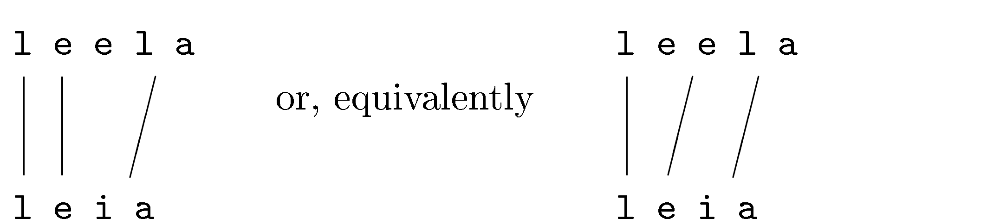

::: article
# Introduction

Approximate string matching is an important subtask of many data
processing applications including statistical matching, text search,
text classification, spell checking, and genomics. At the heart of
approximate string matching lies the ability to quantify the similarity
between two strings in terms of string metrics. String matching
applications are commonly subdivided into online and offline
applications where the latter refers to the situation where the string
that is being searched for a match can be preprocessed to build a search
index. In online string matching no such preprocessing takes place. A
second subdivision can be made into approximate text search, where one
is interested in the location of the match of one string in another
string, and dictionary lookup, where one looks for the location of the
closest match of a string in a lookup table. Here, we focus on
dictionary lookup applications using online string matching algorithms.

String metrics may broadly be divided in edit-based distances, $q$-gram
based distances (sometimes called $n$-grams) and heuristic distances. To
determine edit-based distances one counts, possibly weighted, the number
of fundamental operations necessary to turn one string into another.
Operations may include substitution, deletion, or insertion of a
character or transposition of characters. Distances based on $q$-grams
are obtained by comparing the occurrence of $q$-character sequences
between strings. Heuristic measures have no strong mathematical
underpinning but have been developed as a practical tool with a
particular application in mind. Finally, it is worth mentioning that
these families of string metrics have recently been extended with
metrics based on string kernels [@lodhi:2002], which have been
implemented in the
[*kernlab*](https://CRAN.R-project.org/package=kernlab) package of
[@karatzoglou:2004].

The base R installation offers functions for both string metric
calculation and online text search. The `adist` function computes the
generalized @levenshtein:1966 distance between strings while `agrep`,
based on a library of @laurikari:2001, allows for online approximate
text search based on the same distance metric. In fact, `agrep` is more
advanced than simple approximate search since it allows for approximate
matching against regular expressions. Furthermore, the functions `match`
and `%in%` can be used for dictionary lookup based on exact matching
while `pmatch` and `charmatch` can be used for lookup based on partial
matches. A lookup function based on approximate string matching is not
available in R's base installation.

The native R implementations are complemented by several several
extension packages that offer offline string matching algorithms. For
example,
[*RecordLinkage*](https://CRAN.R-project.org/package=RecordLinkage)
[@borg:2012],
[*MiscPsycho*](https://CRAN.R-project.org/package=MiscPsycho)
[@doran:2010], [*cba*](https://CRAN.R-project.org/package=cba)
[@buchta:2013], and
[*Mkmisc*](https://CRAN.R-project.org/package=Mkmisc) [@kohl:2013] offer
interfaces to the Levenshtein distance, while
[*deducorrect*](https://CRAN.R-project.org/package=deducorrect)
[@loo:2011] implements the restricted Damerau-Levenshtein distance[^1].
Although the distances implemented in these packages are all based on
(an extension of) the Levenshtein distance, interfaces may vary:
*RecordLinkage* takes `character` data as input and computes byte-wise
distances ignoring the possibility of multibyte character encoding.
Packages *MkMisc* and *deducorrect* do exactly the opposite and always
compare strings character-wise. The *cba* package can compute bytewise
distances between character data as well as between lists of integers,
leaving a translation from (possibly multibyte character) data to
integers to the user. Finally, the
[*textcat*](https://CRAN.R-project.org/package=textcat) package of
[@hornik:2012], which implements $q$-gram based text classification
methods of [@cavnar:1994], offers a range of $q$-gram based distances
which can be computed on a character-wise or byte-wise basis.

There are several packages that offer string-like distance functions
applied to specialized objects. The
[*TraMineR*](https://CRAN.R-project.org/package=TraMineR) package
[@studer:2011] for example implements various distance measures on
"state sequence objects" including the [@hamming:1950] distance, the
Longest Common Substring distance and more. Although it may be possible
for users to translate character strings representing text to a state
sequence object, this obviously means using *TraMineR* for purposes for
which it was not intended, which is undesirable. Similarly, the Hamming
distance is implemented in at least five more packages for object types
ranging from presentations of graphs [@butts:2013], to rank vectors
[@grimonprez:2013] to phylogenic data [@schliep:2013].

The fact that several authors have taken the trouble to implement
similar functionality shows that the ability to compute offline string
distance measures is a fairly basic need across fields that deserves
specialized attention. Moreover, the variety of input types and
interpretations thereof make reuse and comparison of these
implementations less than transparent.

The *stringdist* package presented in this paper aims to help users by
offering a uniform interface to a number of well-known string distance
measures where special values and (non)interpretation of character
encoding are handled transparently and consistently across metrics. The
package re-implements some previously available distances and adds a
number of distance measures which were according to this author's best
knowledge previously unavailable in R. Distances implemented by the
package include edit-based distances (Hamming, generalized Levenshtein,
Longest Common Substring, optimal string alignment, and generalized
Damerau-Levenshtein), $q$-gram based distances ($q$-gram, Jaccard, and
cosine) and the heuristic Jaro and Jaro-Winkler distances. Of these
distances, at least the generalized Damerau-Levensthein distance and the
Jaccard distance appear to be new in the context of character strings.
Core distance functions have been implemented as a C library for speed
and exposed to R. Based on this functionality, the package implements
approximate matching equivalents of base R's table lookup functions
`match` and `%in%`. A a convenience function that lists $q$-gram
occurrences is included as well.

The rest of this paper is organized as follows. In the next section we
give a quick overview of the package's main functionality and discuss
how special values and character encodings are handled. The section
after that is devoted to a concise description of the distance functions
offered by *stringdist*. We will work out simple examples, and point out
some properties of the various metrics. The section is aimed to serve as
a reference to users of the package. We end with some conclusions and an
outlook.

# The *stringdist* package

The package offers two basic kinds of functionality: computing string
comparison metrics and table lookup by approximate string matching.
String distances can be computed with the function `stringdist` or
`stringdistmatrix`. Both take at least two character vectors as
arguments, but the former computes element-wise string distances where
the shorter argument is recycled, and the latter returns the distance
matrix.

``` r
> stringdist('foo', c('fu','bar',NA))
[1]  2  3 NA
```

``` r
> stringdistmatrix(c('foo','bar'), c('fu','bar',NA))
     [,1] [,2] [,3]
[1,]    2    3   NA
[2,]    3    0   NA
```

Here, the default distance is the optimal string alignment distance
which will be discussed in more detail below. To specify another
algorithm one simply sets the `method` option. For example, to compute
the Levenshtein distance one uses the following.

``` r
> stringdist('foo', 'bar', method='lv')
```

String distance functions have two possible special output values. `NA`
is returned whenever at least one of the input strings to compare is
`NA` and `Inf` is returned when the distance between two strings is
undefined according to the selected algorithm. For example, the Hamming
distance is undefined when comparing strings of different length.

``` r
> stringdist('fu', 'foo', method='hamming')
[1] Inf
```

The functions `stringdist` and `stringdistmatrix` have very similar
interfaces, allowing users to select from nine different string distance
algorithms, define weights (depending on the chosen distance) and more.
The `stringdistmatrix` function has extra options that allow users to
parallelize calculation of the distance matrix over columns. Users may
specify the number of cores to use or pass a `cluster` object as
generated by `makeCluster` of the *parallel* package. For example, the
command

``` r
> stringdistmatrix(c('foo','bar'), c('fu','bar',NA), ncores=3)
```

distributes calculation of the columns of the distance matrix over three
local cores.

Approximate matching can be done with the functions `amatch` and `ain`.
Function `amatch(x,table)` finds the closest match of elements of `x` in
`table`. When multiple equivalent matches are found, the first match is
returned. A call to `ain(x,table)` returns a `logical` vector indicating
which elements of `x` were (approximately) matched in `table`. Both
`amatch` and `ain` have been designed to approach the behaviour of R's
native `match` and `%in%` functionality as much as possible. By default
`amatch` and `ain` locate exact matches, just like `match`. This may be
changed by increasing the maximum string distance between the search
pattern and elements of the lookup table.

``` r
> amatch('fu', c('foo','bar'), maxDist=2)
[1] 1
> ain('fu', c('foo','bar'), maxDist=2)
[1] TRUE
```

The default distance function is again the optimal string alignment
distance, but this can be controlled by altering the `method` option.
Here, the string [`fu`]{.roman} matches approximately with
[`foo`]{.roman} since in the default metric the difference is two
operations (replace one [`u`]{.roman} and add an [`o`]{.roman}). By
default, `NA` is matched with `NA`, as in R's native `match` function.

``` r
> amatch(NA, c('foo',NA))
[1] 2
```

Unlike in `match`, this may be switched off by setting `matchNA=FALSE`.

``` r
> amatch(NA, c('foo',NA), matchNA=FALSE)
[1] NA
```

Like in `match`, the `nomatch` option controls the output when no match
is found.

``` r
> amatch(NA, c('foo',NA), matchNA=FALSE, nomatch=0)
[1] 0
```

## Character encoding

A character encoding system defines how each character in an alphabet is
represented as a byte or sequence of bytes in computer memory. Over the
past decades many encoding systems have been developed, and currently
several encoding standards are widely in use. It is a rather unfortunate
state of affairs that encoding standards have evolved to a point where
it is impossible to determine the used encoding from a text file with
certainty from its contents, although command-line utilities like
[`file`]{.roman} (under Unix-alikes) often do a good job at guessing it.

By default, the character encoding used internally by R depends on the
native encoding of the system on which it runs. This means that when one
needs to read a text file that is stored in a different encoding (for
example because it was produced on a different operating system), the
file's encoding has to be explicitly specified. For example, in
`read.table` the input encoding can be specified using the
`fileEncoding` argument. Upon reading the file, R will attempt to
translate input from the specified encoding to the internal encoding
native to the operating system it is running on.

As a consequence, reading the same file into R will not always yield the
same sequence of bytes internally on each system. Only when one is
certain that the input consists solely of characters from the ASCII
character set will the internal representation be guaranteed to be the
same across systems. Most of R's native functions hide the character
representation effectively from the user. For example, `nchar` counts
the number of actual characters, not the number of bytes used to
represent it (although it has an option to count the number of bytes as
well).

Like R's native functions, all functions of the *stringdist* package are
designed to yield the same result regardless of the internal encoding
used. Like in the `adist` function, this is done by converting strings
first to `utf8`, and then to an `integer` representation. The integer
representation of strings are passed to the underlying C-routines. At
the moment, this double conversion is the only guaranteed way to handle
character strings independent of internal encoding. The main reason is
that R depends on external libraries for character re-encoding, and
those libraries are different across operating systems on which R is
supported.

The re-encoding causes an overhead of up to a factor of three or four,
when computing distances between character strings consisting of 5-25
characters. The overhead is almost completely due to the conversion to
integer and its relative importance decreases with string length. If one
is certain that the input strings are restricted to the ASCII character
set or when accuracy or cross-platform independence are of less
importance, one can pass `useBytes=TRUE` to avoid re-encoding. In that
case the distance between the underlying byte sequences are returned.
This option mimics the option that is available in some of R's native
functions, including `adist`. Below is an example demonstrating the
difference.

``` r
> stringdist('Motorhead', 'Motörhead')
[1] 1
> stringdist('Motorhead', enc2utf8('Motörhead'), useBytes=TRUE)
[1] 2
```

Here, the default string distance algorithm is the optimal string
alignment distance, which counts the number of insertions, deletions,
substitutions and transpositions necessary to turn [`Motörhead`]{.roman}
into [`Motorhead`]{.roman}. In the first case the letter [`ö`]{.roman}
is recognized as a single character, so the distance corresponds to a
single substitution. In the second case a byte-wise comparison is used
while making sure that [`Motöread`]{.roman} is stored in `utf8`
encoding. In this case, the `utf8` [`o`]{.roman} is stored as a single
byte and [`ö`]{.roman} as two bytes, and here the distance is determined
by deleting one byte and substituting another.

It should be mentioned that there are a number of characters that have
multiple `utf8` representations (this is called 'unicode equivalence').
For example, the [`ö`]{.roman} can be represented by a two-byte unicode
character as in the above example or by a single-byte [`o`]{.roman},
followed by a two-byte (otherwise invisible) modifying character that
specifies the umlaut. If one compares the two versions of [`ö`]{.roman}
with either `stringdist` or R's native `adist` , the result will be
nonzero regardless whether one compares byte-wise or not. The solution
is to normalize unicode-encoded strings to either representation before
any comparison is made. At the moment, no tools seem to be available
from within R but open source commandline tools like `uconv`
[@utterstroem:2000] can be used to normalize `utf8`-encoded text prior
to reading into R.

# String distance functions

A string is a finite concatenation of symbols (characters) from a finite
alphabet. We will follow the usual notation and denote a finite alphabet
with $\Sigma$ where the number of elements in $\Sigma$ is denoted
$|\Sigma|$. The $q$-fold Cartesian product
$\Sigma\times\cdots\times\Sigma$ is denoted $\Sigma^q$, and the set of
all finite strings that can be composed from characters in $\Sigma$ is
denoted $\Sigma^*$. The empty string, denoted $\varepsilon$, is also a
member of this set. We will denote a general string with $s$, $t$, or
$u$ and the length of the string, measured as the number of characters,
with $|s|$. For example: take for $\Sigma$ the 26-member lower-case
Latin alphabet, and $s=\textrm{\texttt{foo}}$. We have $|s|=3$,
$s\in\Sigma^3$ and $s\in\Sigma^*$. Individual characters of a string are
indicated with a subscript so in the previous example we have
$s_1=\textrm{\texttt{f}}$ and $s_2=s_3=\textrm{\texttt{o}}$. A
subsequence is indicated with subscript $m:n$, so in the example
$s_{1:2}=\textrm{\texttt{fo}}$. We also use the convention that
$s_{m:n}=\varepsilon$ whenever $n<m$.

Formally, for a function $d$ to be a distance function on $\Sigma^*$ it
has to obey the following properties.

$$\label{eq:axioms}  
\begin{alignat}{4}
  &\textrm{nonnegativity}        &&d(s,t) \geq 0\\%&\quad&\quad\\
  &\textrm{identity}             &&d(s,t) = 0\textrm{ only when }s=t\\%&\quad&\quad\\
  &\textrm{symmetry}             &&d(s,t) = d(t,s)\\%&\quad&\quad \\
  &\textrm{triangle inequality }\quad  &&d(s,u) \leq d(s,t) + d(t,u),%&\quad&\quad,
\end{alignat}  (\#eq:axioms)  $$

with $s$, $t$, and $u$ strings. However, as will be pointed out below,
many string metrics do not have all these properties. For example,
distances based on $q$-grams do not necessarily obey the identity
property and weighted versions of the Levenshtein distance are not
necessarily symmetric.

## Distances based on edit operations

Distances based on edit operations count the number of basic operations
necessary to turn one string into another. Edit-like distances can be
categorized based on what operations are allowed. The distances
discussed below allow one or more of the following operations.

-   Substitution of a character, as in
    $\textrm{\texttt{foo}}\rightarrow\textrm{\texttt{boo}}$.

-   Deletion of a character, as in
    $\textrm{\texttt{foo}}\rightarrow\textrm{\texttt{oo}}$.

-   Insertion of a character, as in
    $\textrm{\texttt{foo}}\rightarrow\textrm{\texttt{floo}}$.

-   Transposition of two adjacent characters, as in
    $\textrm{\texttt{foo}}\rightarrow\textrm{\texttt{ofo}}$.

For distances allowing more than a single operation it may be meaningful
to assign weights to the different operations, for example to make a
transposition contribute less to the distance than character
substitution. Edit-based distances for which such weights can be defined
are usually refered to as generalized distances [@boytsov:2011].

The simplest edit distance is the Hamming distance [@hamming:1950],
which allows only character substitutions and is therefore only defined
for strings of equal length. It is however common to define the Hamming
distance to be infinite for strings of different length [@navarro:2001],
so formally we have

$$\label{eq:hamming}  
d_{\sf hamming}(s,t) =  \sum_{i=1}^{|s|}\left[1-\delta(s_i,t_i)\right] 
\textrm{ if } |s| = |t| \textrm{ and }\infty\textrm{ otherwise}.  (\#eq:hamming)  $$

Here, $\delta(s_i,t_j)=1$ if $s_i=t_i$ and $0$ otherwise. The Hamming
distance obeys all the properties stated in Eq. \@ref(eq:axioms). When
$s$ and $t$ are of equal length, the maximum value is $|s|$. With the
*stringdist* package, the Hamming distance can be computed as follows.

``` r
> stringdist(c('foo','fu'), 'bar', method='hamming')
[1]   3 Inf
```

The Longest Common Substring distance $d_{\rm lcs}$ [@needleman:1970]
counts the number of deletions and insertions necessary to transform one
string into another. It can be recursively defined as

$$d_{\rm lcs}(s,t) = \left\{\begin{array}{l}
0 \textrm{ if } s=t=\varepsilon,\\
d_{\rm lcs}(s_{1: |s|-1},t_{1:|t|-1})\textrm{ if } s_{|s|} = t_{|t|},\\
1 + \min\{ 
d_{\sf lcs}(s_{1:|s|-1},t),
d_{\sf lcs}(s,t_{1: |t|-1})
\}\textrm{ otherwise.}
\end{array}\right.$$

The longest common substring distance obeys all properties of
Eq. \@ref(eq:axioms). It varies between 0 and $|s|+|t|$ where the
maximum is achieved when $s$ and $t$ have no characters in common. With
the *stringdist* package it can be computed by setting `method=’lcs’`.

``` r
> stringdist('leia', 'leela', method='lcs')
[1] 3
```

Here, the distance equals 3 since it takes two deletions and one
insertion to turn [`leela`]{.roman} into [`leia`]{.roman}:
$${\rm leela} \xrightarrow{\textrm{del. e}} {\rm lela} \xrightarrow{\textrm{del. l}} {\rm lea}\xrightarrow{\textrm{ins. i}} {\rm leia}.$$
The above example also shows that in general there is no uniqe shortest
path between two strings: one could for example reverse the order of the
first two deletions to obtain a second path with total weight 3.

As suggested by its name, the lcs-distance has a second interpretation.
With the longest common substring we mean the longest sequence formed by
pairing characters from $s$ and $t$ while keeping their order intact.
The lcs-distance is then the number of unpaired characters over both
strings. In the above example this can be visualized as follows.
{width="100%" alt="graphic without alt text"} In both cases, the characters
[`e`]{.roman},[`l`]{.roman} and [`i`]{.roman} remain unpaired,
independent of whether we start pairing from the beginning (left case)
or the end of the string (right case), yielding a distance value of
three.

The generalized Levenshtein distance $d_{\sf lv}$ is computed by
counting the weighted number of insertions, deletions and substitutions
necessary to turn one string into another. Like the lcs distance it
permits a recursive definition.

$$\label{eq:lvdist}  
d_{\sf lv}(s,t) = \left\{\begin{array}{l}
0 \textrm{ if } s = t = \varepsilon\\
\begin{array}{l}
\min\{\\
\quad d_{\sf lv}(s,t_{1:|t|-1}) + w_1,\\
\quad d_{\sf lv}(s_{1:|s|-1},t) + w_2,\\
\quad d_{\sf lv}(s_{1:|s|-1},t_{1:|t|-1}) + [1-\delta(s_{|s|},t_{|t|})]w_3\\
\}\textrm{ otherwise.}
\end{array}
\end{array}\right.  (\#eq:lvdist)  $$

Here, $w_1$, $w_2$ and $w_3$ are the nonnegative penalties for deletion,
insertion, and substitution when turning $t$ into $s$. The generalized
Levenshtein distance is also implemented by R's native `adist` function,
and with our package it can be computed as follows.

``` r
> stringdist('leela', 'leia', method='lv')
[1] 2
```

The extra flexibility with respect to the lcs (and hamming) distance
yields a smaller distance value since we need but a single deletion and
a single substitution:
$$\textrm{leela}\xrightarrow[+1]{\textrm{del. e}}\textrm{lela}
\xrightarrow[+1]{\textrm{sub. l$\to$i}} \textrm{leia},$$ where we denote
the penalty for each operation below the arrow.

The generalized Levenshtein distance obeys the properties of
Eq. \@ref(eq:axioms) except when $w_1\not=w_2$, in which case the
symmetry property is lost. However, it remains symmetric under
simultaneous reversal of $s$ and $t$ and $w_1$ and $w_2$ since the
number of deletions necessary going from $t$ to $s$ is equal to the
number of insertions necessary going from $s$ to $t$. This is
illustrated by the following example.

``` r
> stringdist('leia', 'leela', method='lv', weight=c(1,0.1,1))
[1] 2
> stringdist('leia', 'leela', method='lv', weight=c(0.1,1,1))
[1] 1.1
> stringdist('leela', 'leia', method='lv', weight=c(1,0.1,1))
[1] 1.1
```

In the first line we get a distance of two since no insertions (of
weight $0.1$) are involved when going from [`leela`]{.roman} to
[`leia`]{.roman}, as shown in our previous example. The second and third
example may schematically be represented as follows. $$\begin{aligned}
&\textrm{leela} \xrightarrow[+0.1]{\textrm{del. e}}\textrm{lela}\xrightarrow[+1]{\textrm{sub. l}}\textrm{leia}\\
&\textrm{leia} \xrightarrow[+1]{\textrm{sub. i}}\textrm{lela}\xrightarrow[+0.1]{\textrm{ins. e}}\textrm{leela}.
\end{aligned}$$ In other words, reversing $w_1$ and $w_2$ is the same as
reversing arguments $s$ and $t$.

The optimal string alignment distance $d_{\sf osa}$ is a straightforward
extension of the Levenshtein distance that allows for transpositions of
adjacent characters:

$$\label{eq:osadist}  
d_{\sf osa}(s,t) = \left\{\begin{array}{l}
0 \textrm{ if } s = t = \varepsilon\\
\begin{array}{l}
\min\{\\
\quad d_{\sf osa}(s,t_{1:|t|-1}) + w_1,\\
\quad d_{\sf osa}(s_{1:|s|-1},t) + w_2,\\
\quad d_{\sf osa}(s_{1:|s|-1},t_{1:|t|-1}) + [1-\delta(s_{|s|},t_{|t|})]w_3,\\
\quad d_{\sf osa}(s_{1:|s|-2},t_{1:|t|-2}) + w_4\textrm{ if }s_{|s|}=t_{|t|-1},s_{|s|-1}=t_{|t|} \\
\}\textrm{ otherwise},
\end{array}
\end{array}\right.  (\#eq:osadist)  $$

where $w_4$ is the penalty for a transposition and $w_1$, $w_2$ and
$w_3$ were defined under Eq. \@ref(eq:lvdist). The optimal string
alignment distance is the default distance function for `stringdist`,
`stringdistmatrix`, `amatch` and `ain`. Unlike the Hamming, lcs, and
Levenshtein distances, the optimal string alignment distance does not
obey the triangle inequality. This is demonstrated by the following
example, taken from @boytsov:2011.

``` r
> stringdist('ba','ab') + stringdist('ab','acb')
[1] 2
> stringdist('ba','acb')
[1] 3
```

The reason is that the optimal string alignment distance edits each
substring maximally once while recursing through the strings. The above
distances should be interpreted as $$\begin{aligned}
& \textrm{ba}\xrightarrow[+1]{\textrm{swap b,a}} \textrm{ab} +  \textrm{ab}\xrightarrow[+1]{\textrm{ins. c}} \textrm{acb}\\
& \textrm{ba}\xrightarrow[+1]{\textrm{del. b}}\textrm{a}\xrightarrow[+1]{\textrm{ins. c}} \textrm{ac}\xrightarrow[+1]{\textrm{ins. b}} \textrm{acb}.
\end{aligned}$$ In the last case, the shortcut that can be taken by
swapping [`b`]{.roman} and [`a`]{.roman} and then inserting
[`c`]{.roman} would force the same substring to be edited twice. Because
of this restriction, the optimal string alignment distance is also
referred to as the restricted Damerau-Levenshtein distance although on
the web, it seems fairly often to be mistaken for the actual
Damerau-Levenshtein distance. The latter distance metric does allow for
multiple edits on the same substring and is a real metric in the sense
of Eq. \@ref(eq:axioms).

A recursive definition for the full Damerau-Levenshtein distance was
first given by [@lowrance:1975]. Their definition replaces the simple
swap in the last line of Eq. \@ref(eq:osadist) with a minimization over
possible transpositions between the current character and all untreated
characters, where the cost of a transposition increases with the
distance between transposed characters. In the *stringdist* package a
weighted version of the full Damerau-Levenshtein distance is implemented
which is defined as follows.

$$\label{eq:dldist}  
d_{\sf dl}(s,t) = \left\{\begin{array}{l}
0 \textrm{ if } s = t = \varepsilon\\
\begin{array}{l}
\min\{\\
\quad d_{\sf dl}(s,t_{1:|t|-1}) + w_1,\\
\quad d_{\sf dl}(s_{1:|s|-1},t) + w_2,\\
\quad d_{\sf dl}(s_{1:|s|-1},t_{1:|t|-1}) + [1-\delta(s_{|s|},t_{|t|})]w_3,\\
\quad \min_{(i,j)\in\Lambda} d_{\sf dl}(s_{1:i-1},t_{1:j-1}) + [(|s|-i) + (|t|-j) -1]w_4\\
\}\textrm{ otherwise},
\end{array}
\end{array}\right.  (\#eq:dldist)  $$

where the minimization in the last line is over $$\Lambda=\left\{
(i,j)\in\{1,\ldots,|s|\}\times\{1,\ldots,|t|\}
\::\:
s_{|s|}=t_j,\:s_i = t_{|t|}\right\}.$$ If $w_1=w_2=w_3=w_4=1$ the
original Damerau-Levenshtein distance is obtained. Although it is a
trivial generalization of the original distance described by
@lowrance:1975, this implementation of a generalized Damerau-Levenshtein
distance appears to be new in literature.

For the *stringdist* package, the C code for this particular distance is
based on a routine developed by @logan:2013. The original code has been
adapted to reduce the number of memory allocation calls and to include
the weights. The Damerau-Levenshtein distance can be computed with the
`method=’dl’` directive.

``` r
> stringdist('ba', 'acb', method='dl')
[1] 2
```

Here, the distance equals two, indicating that the path
$$\begin{aligned}
&\textrm{ba}\xrightarrow{\textrm{swap b,a}}\textrm{ab}\xrightarrow{\textrm{ins. c}}\textrm{acb},
\end{aligned}$$ is indeed included in the minimization defining the
distance.

The maximum distance between two strings $s$ and $t$, as measured by
either the Levenshtein, optimal string alignment, or Damerau-Levenshtein
distance is $\max\{|s|,|t|\}$. However, as the number of possible edit
operations increases, the possible number of paths between two strings
increases, allowing for possibly smaller distances between strings.
Therefore, relations between the distance measures described above can
be summarized as follows. $$\left.
\begin{array}{r}
\infty\geq|s|\geq d_{\sf hamming}(s,t)\\
|s|+|t| \geq  d_{\sf lcs}(s,t)\\
\max\{|s|,|t|\}
\end{array}\right\}
\geq d_{\sf lv}(s,t)
\geq d_{\sf osa}(s,t)
\geq d_{\sf dl}(s,t)
\geq 0.$$ Since the Hamming and lcs distance have no basic edits in
common, there is no order relation between their values. The upper limit
$|s|$ on the Hamming distance only holds when $|s|=|t|$.

All edit-based distances except the Hamming distance have been
implemented using the well-known dynamic programming technique that runs
in $\mathcal{O}(|s||t|)$ time. For the Hamming distance, both the time
and memory consumption are $\mathcal{O}(|s|)$. For the other edit-based
distances the memory consumption is $\mathcal{O}(|s||t|)$, where for the
Damerau-Levenshtein some extra memory is used (growing with the number
of unique characters in $s$ and $t$). Finally, we refer the reader to
the papers of [@boytsov:2011] and [@navarro:2001] for a thorough review
of edit-based distances in text search or dictionary lookup settings
respectively.

## Distances based on $q$-grams

A $q$-gram is a string consisting of $q$ consecutive characters. The
$q$-grams associated with a string $s$ are obtained by sliding a window
of $q$ characters wide over $s$ and registering the occurring $q$-grams.
For example, the digrams associated with [`foo`]{.roman} are
[`fo`]{.roman} and [`oo`]{.roman}. Obviously, this procedure fails when
$q>|s|$ or $q=0$. For this reason we define the following edge cases for
all distances $d(s,t;q)$ of the *stringdist* package that are based on
comparing $q$-gram occurrence: $$\begin{alignat}{2}
d(s,t;q) &=\infty,\text{ when } q>\min\{|s|,|t|\}\\
d(s,t;0) &=\infty,\text{ when } |s| + |t| > 0\\
d(\varepsilon,\varepsilon;0) &=0.
\end{alignat}$$ A simple distance metric between two strings is obtained
by listing unique $q$-grams in two strings and compare which ones they
have in common. Indeed, if we write $\mathcal{Q}(s;q)$ to indicate the
unique set of $q$-grams occurring in $s$, the Jaccard distance is
written as $$d_{\sf jaccard}(s,t;q) = 1 - 
\frac{|\mathcal{Q}(s;q)\cap\mathcal{Q}(t;q)|}
     {|\mathcal{Q}(s;q)\cup \mathcal{Q}(t;q)|},$$ where the vertical
bars ($|\cdot|$) indicate set cardinality. The Jaccard distance varies
from 0 to 1 where 0 corresponds to full overlap, *i.e. *
$Q(s;q)=Q(t;q)$, and 1 to no overlap, *i.e. * $Q(s,q)\cap
Q(t,q)=\varnothing$. As an example, consider result of the following
Jaccard distance calculation with the *stringdist* package.

``` r
> stringdist('leia', 'leela', method='jaccard', q=2)
[1] 0.8333333
```

It is easily checked that
$\mathcal{Q}(\textrm{\texttt{leia}};2)=\{\textrm{\texttt{le}},\textrm{\texttt{ei}},\textrm{\texttt{ia}}\}$
and
$\mathcal{Q}(\textrm{\texttt{leela}};2)=\{\textrm{\texttt{le}},\textrm{\texttt{ee}},\textrm{\texttt{el}},\textrm{\texttt{la}}\}$,
so the distance is computed as $1-\tfrac{1}{6}\approx0.83$.

The $q$-gram distance is obtained by tabulating the $q$-grams occurring
in the two strings and counting the number of $q$-grams that are not
shared between the two. This may formally be denoted as follows.

$$\label{eq:qgram}  
d_{\sf qgram}(s,t;q) = {\|\boldsymbol{v}(s;q)-\boldsymbol{v}(t;q)\|}_1 = 
\sum_{i=1}^{|\Sigma|^q}|v_i(s;q)-v_i(t;q)|.  (\#eq:qgram)  $$

Here, $\boldsymbol{v}(s;q)$ is a nonnegative integer vector of dimension
$|\Sigma|^q$ whose coefficients represent the number of occurrences of
every possible $q$-gram in $s$. Eq. \@ref(eq:qgram) defines the $q$-gram
distance between two strings $s$ and $t$ as the $L_1$ distance between
$\boldsymbol{v}(s;q)$ and $\boldsymbol{v}(t;q)$. Observe that one only
needs to store and count the actually occurring $q$-grams to evaluate
the above sum.

With the *stringdist* package, $q$-gram distances are computed as
follows.

``` r
> stringdist('leia', 'leela', method='qgram', q=1)
[1] 3
> stringdist('leia', 'leela', method='qgram', q=2)
[1] 5
> stringdist('leia', 'leela', method='qgram', q=5)
[1] Inf
```

The 1-gram distance between `leia` and `leela` equals 3: counting the
1-grams (individual characters) of the two strings shows that the `i`,
of `leia` and the second `e` and `l` of `leela` are unmatched. The
reader may verify that the 2-gram distance between `leia` and `leela`
equals 5. In the third example, `stringdist` returns `Inf` since the
since one of the compared strings has less than $5$ characters.

The maximum number of different $q$-grams in a string $s$ is $|s|-q-1$,
therefore $|s|+|t|-2q-2$ is an upper bound on the $q$-gram distance,
occurring when $s$ and $t$ have no $q$-grams in common. See
@boytsov:2011 and references therein for bounds on $d_{\sf qgram}$ in
terms of edit-based distances.

Now that we have defined the $q$-gram distance in terms of vectors, any
distance function on (integer) vector spaces can in principle be
applied. The *stringdist* package also includes the cosine distance,
which is defined as

$$\label{eq:cos}  
d_{\sf cos}(s,t;q) = 1 - 
\frac{\boldsymbol{v}(s;q)\cdot\boldsymbol{v}(t;q)}{{\|\boldsymbol{v}(s;q)\|}_2 {\|\boldsymbol{v}(t;q)\|}_2},  (\#eq:cos)  $$

where $\|\cdot\|_2$ indicates the standard Euclidean norm. The cosine
distance equals 0 when $s=t$ and 1 when $s$ and $t$ have no $q$-grams in
common. It should be interpreted as a measure of the angle between
$\boldsymbol{v}(s;q)$ and $\boldsymbol{v}(t;q)$ since the second term in
Eq. \@ref(eq:cos) represents the cosine of the angle between the two
vectors. It can be computed as follows.

``` r
> stringdist('leia', 'leela', method='cosine', q=1)
[1] 0.1666667
```

Indeed, defining
$\Sigma=\{\textrm{\texttt{a}},\textrm{\texttt{e}},\textrm{\texttt{i}},\textrm{\texttt{l}}\}$,
we have $\boldsymbol{v}(\textrm{\texttt{leia}};1)=(1,1,1,1)$ and
$\boldsymbol{v}(\textrm{\texttt{leela}};1)=(1,2,0,2)$ giving a distance
of $1-\tfrac{5}{2\cdot3}\approx0.17$.

The three $q$-gram based distances mentioned above are nonnegative and
symmetric. The Jaccard and $q$-gram distance can be written as a
distance on a vector space and obey the triangle inequality as well. The
cosine distance does not satisfy the triangle inequality. None of the
$q$-gram based distances satisfy the identity condition because both
$Q(s;q)$ and $\boldsymbol{v}(s;q)$ are many-to-one functions. As an
example observe that
$Q(\textrm{\texttt{ab}};1)=Q(\textrm{\texttt{ba}};1)$ and
$\boldsymbol{v}(\textrm{\texttt{ab}};1)=\boldsymbol{v}(\textrm{\texttt{ba}};1)$
so $d_{\sf
jaccard}(\textrm{\texttt{ab}},\textrm{\texttt{ba}};1)=d_{\sf qgram}(\textrm{\texttt{ab}},\textrm{\texttt{ba}};1)=d_{\sf
cos}(\textrm{\texttt{ab}},\textrm{\texttt{ba}};1)=0$. In other words, a
$q$-gram based distance of zero does not guarantee that $s=t$. For a
more general account of invariance properties of the
$\boldsymbol{v}(s;q)$ the reader is referred to @ukkonen:1992.

To allow the user to define their own $q$-gram based metrics, the
package includes the function `qgrams`. This function takes an arbitrary
number of (named) `character` vectors as input, and returns an array of
labeled $q$-gram counts. Here's an example with three character vectors.

``` r
> qgrams(
+   x = c('foo','bar','bar'),
+   y = c('fu','bar'),
+   z = c('foobar'),
+   q = 2 )
  fo oo fu ob ba ar
x  1  1  0  0  2  2
y  0  0  1  0  1  1
z  1  1  0  1  1  1
```

At the moment, $q$-gram counting is implemented by storing only the
encountered $q$-grams, rather than representing $\boldsymbol{v}(s;q)$
completely. This avoids the need for $\mathcal{O}(|\Sigma|^q)$ storage.
Encountered $q$-grams are stored in a binary tree structure yielding
$\mathcal{O}(|Q(s;q)|)$ memory and
$\mathcal{O}[(|s|-q-1)\log{|Q(s;q)|}]$ time consumption.

## Heuristic distance measures

The Jaro distance was originally developed at the U.S. Bureau of the
Census for the purpose of linking records based on inaccurate text
fields. Its first public description appeared in a user manual
[@jaro:1978] which might explain why it is not very wide-spread in
computer science literature. It has however been successfully applied to
statistical matching problems concerning fairly short strings; typically
name and address data \[see *e.g.* [@jaro:1989]\].

The reasoning behind the Jaro distance is that character mismatches and
transpositions are caused by typing-errors but matches between remote
characters are unlikely to be caused by a typing error. It therefore
measures the number of matching characters between two strings that are
not too many positions apart and adds a penalty for matching characters
that are transposed. It is given by

$$\label{eq:jaro}  
d_{\sf jaro}(s,t) = 
\left\{\begin{array}{l}
  0\textrm{ when } s=t=\varepsilon\\
  1\textrm{ when } m=0\textrm{ and } |s|+|t|>0\\
  1-\frac{1}{3}\left(
    w_1\frac{m}{|s|}+w_2\frac{m}{|t|} + w_3\frac{m-T}{m}
  \right)\textrm{ otherwise.}
\end{array}\right.  (\#eq:jaro)  $$

Here, the $w_i$ are adjustable weights but in most publications they are
chosen equal to $1$. Furthermore, $m$ is the number of characters that
can be matched between $s$ and $t$. Supposing that $s_i=t_j$ they are
considered a match only when
$$|i-j|<\left\lfloor\frac{\max\{|s|,|t|\}}{2}\right\rfloor,$$ and every
character in $s$ can be matched only once with a character in $t$.
Finally, if $s'$ and $t'$ are substrings of $s$ and $t$ obtained by
removing the nonmatching characters, then $T$ is the number of
transpositions necessary to turn $s'$ into $t'$. Here, nonadjacent
transpositions are allowed.

With `stringdist`, the Jaro-distance can be computed as follows.

``` r
> stringdist('leia', 'leela', method='jw')
[1] 0.2166667
```

Here, the number of matching characters equals three, and no
transpositions are necessary yielding a distance of
$1-\tfrac{1}{3}(\tfrac{3}{4}+\tfrac{3}{5}+1)=\tfrac{13}{60}\approx 0.22$.
When $w_1=w_2=w_3=1$, the Jaro distance ranges between $0$ and $1$,
where $0$ corresponds to $s=t$ and $1$ indicates a complete
dissimilarity with $m=T=0$.

@winkler:1990 extended the Jaro distance by incorporating an extra
penalty for character mismatches in the first four characters. The
Jaro-Winkler distance is given by

$$\label{eq:jarowinkler}  
d_{\sf jw}(s,t) = d_{\sf jaro}(s,t)[1 - p\ell(s,t)],  (\#eq:jarowinkler)  $$

where $\ell(s,t)$ is the length of the longest common prefix, up to a
maximum of four characters and $p$ is a user-defined weight. We demand
that $p\in[0,\tfrac{1}{4}]$ to make sure that
$0\leq d_{\sf jw}(s,t)\leq 1$. The factor $p$ determines how strongly
differences between the first four characters of both strings determine
the total distance. If $p=0$, the Jaro-Winkler distance reduces to the
Jaro distance and all characters contribute equally to the distance
function. If $p=\tfrac{1}{4}$, the Jaro-Winkler distance is equal to
zero, even if only the first four characters differ. The reasoning is
that apparently, people are less apt to make mistakes in the first four
characters or perhaps they are more easily noted, so differences in the
first four characters point to a larger probability of two strings being
actually different. @winkler:1990 and @cohen:2003 use a value of $p=0.1$
and report better results in a statistical matching benchmark than with
$p=0$. The default value of $p$ for the `stringdist` function with
`method=’jw’` is $0$ so by altering it, the Jaro-Winkler distance is
obtained.

``` r
> stringdist('leia', 'leela', method='jw', p=0.1)
[1] 0.1733333
```

Here, we have $\ell(\textrm{\texttt{leia}},\textrm{\texttt{leela}})=2$
so the Jaro-Winkler distance is computed as
$\tfrac{13}{60}(1-\tfrac{2}{10})\approx 0.17$.

It is easy to see from Eqs. \@ref(eq:jaro) and \@ref(eq:jarowinkler)
that conditional on $w_1=w_2=w_3=1$, the Jaro and Jaro-Winkler distance
are nonnegative, symmetric and obey the identity property. However, the
triangle inequality is not satisfied by these distances. As an example
consider $s=\textrm{\texttt{ab}}$, $t=\textrm{\texttt{cb}}$ and
$u=\textrm{\texttt{cd}}$. Since $s$ and $u$ have no characters in common
we have $d_{\sf jaro}(s,u)=1$, while $d_{\sf
jaro}(s,t)=d_{\sf jaro}(t,u)=\frac{1}{3}$ so in this case
$d_{\sf jaro}(s,u)$ is larger than
$d_{\sf jaro}(s,t)+d_{\sf jaro}(t,u)$. It is not difficult to verify
that the Jaro-Winkler distance fails the triangle inequality for the
same example, for any $p\in[0,\tfrac{1}{4}]$.

The C-implementation of the Jaro and Jaro-Winkler distance take
$\mathcal{O}(|s||t|)$ time and $\mathcal{O}(\max\{|s|,|t|\})$ memory.

## What metric to use?

In the end the choice depends on the application, but there are some
general considerations. The choice between an edit-based or heuristic
metric on one hand or a $q$-gram based distance on the other, is to an
extend prescribed by string length. Contrary to edit-based or heuristic
metrics, $q$-gram based metrics can easily be computed beween very long
text strings since the number of $q$-grams encountered in natural
language (for say, $q\geq3$) is usually much less than the $q$-grams
allowed by the alphabet. The choice of edit-based distance depends
mostly on the needed accurracy. For example, in a dictionary lookup
where differences between matched and dictionary items are small, an
edit distance that allows for more types of edit operations (like the
optimal string alignment or Damerau-Levenshtein distance) may give
better results. The heuristic Jaro- and Jaro-Winkler distances were
designed with human-typed, relatively short strings in mind, so their
area of application is clear.

# Summary and conclusions

The *stringdist* package offers, for the first time in R, a number of
popular string distance functions through a consistent interface while
transparently handling or ignoring the underlying character encoding
scheme. The package offers interfaces to C-based string distance
algorithms that either recycle elements or return the full distance
matrix. The same algorithms are used in approximate string matching
versions of R's native `match` and `%in%` functions: `amatch` and `ain`
respectively.

In this paper we have given a concise description of the available
distance functions in terms of their mathematical definitions and showed
how to compute them. The algorithmic complexity of the current
implementation in terms of computational time and memory consumption was
mentioned as well.

In the future, we expect to make the C-library available for export to
other languages and to reduce the memory consumption for some of the
algorithms.

## Acknowledgements

The author is grateful to Dr. Rob van Harrevelt for carefully reading
the manuscript.
:::

[^1]: The [*vwr*](https://CRAN.R-project.org/package=vwr) package
    [@keuleers:2013] used to offer its own implementation of string
    distances but currently depends on
    [*stringdist*](https://CRAN.R-project.org/package=stringdist).
