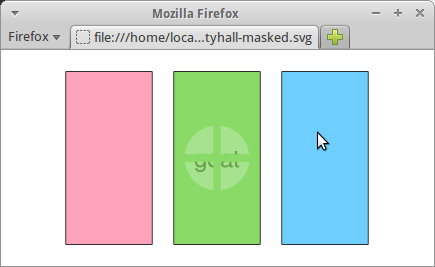

::: article
# Introduction

The SVG graphics format [@Dengler:11:SVG] is a good format for including
plots in web pages because it is a vector format (so it scales well) and
because it offers features for animation and interactivity. SVG also
integrates well with other important web technologies such as HTML and
JavaScript.

It is possible to produce a static R plot in an SVG format with the
built-in `svg()` function (from the *grDevices* package), but the
[*gridSVG*](https://CRAN.R-project.org/package=gridSVG) package
[@gridsvg] provides an alternative way to generate an SVG plot that
allows for creating animated and interactive graphics.

There are two types of graphics functions in R: functions based on the
default *graphics* package and functions based on the *grid* graphics
package. As the package name suggests, the *gridSVG* package only works
with a plot that is drawn using the *grid* graphics package. This
includes plots from several important graphics packages in R, such as
[*lattice*](https://CRAN.R-project.org/package=lattice) [@pkg:lattice]
and [*ggplot2*](https://CRAN.R-project.org/package=ggplot2)
[@pkg:ggplot], but *gridSVG* does not work with all plots that can be
produced in R.

This article demonstrates basic usage of the *gridSVG* package and
outlines some of the ways that *gridSVG* can be used to produce
graphical results that are not possible in standard R graphics. There is
also a discussion of other packages that provide ways to generate
dynamic and interactive graphics for the web and the strengths and
weaknesses of *gridSVG* compared to those packages.

# Basic usage

The following code draws a *lattice* multi-panel plot (see Figure
[1](#fig:lattice)).

``` r
> library(lattice)
```

``` r
> dotplot(variety ~ yield | site, data = barley, groups = year,
          key = simpleKey(levels(barley$year), space = "right"),
          subset = as.numeric(site) < 4, layout = c(1, 3))
```

![Figure 1: []{#fig:lattice label="fig:lattice"}A *lattice* multi-panel
plot drawn on the standard `pdf()` graphics
device.](murrell-potter-lattice.png){#fig:lattice width="100%" alt="graphic without alt text"}

The `grid.export()` function in *gridSVG* converts the current (*grid*)
scene on the active graphics device to an SVG format in an external
file.

``` r
> library(gridSVG)
```

``` r
> grid.export("lattice.svg")
```

This SVG file can be viewed directly in a browser (see Figure
[2](#fig:lattice-web)) or embedded within HTML as part of a larger web
page.

![Figure 2: []{#fig:lattice-web label="fig:lattice-web"}The *lattice*
plot from Figure [1](#fig:lattice) exported to an SVG file by *gridSVG*
and viewed in Firefox. This demonstrates that a static R plot can be
converted to an SVG format with *gridSVG* for use on the
web.](lattice-svg.png){#fig:lattice-web width="100%" alt="graphic without alt text"}

This usage of *gridSVG*, to produce a static SVG version of an R plot
for use on the web, offers no obvious benefit compared to the built-in
`svg()` graphics device. However, the *gridSVG* package provides several
other functions that can be used to enhance the SVG version of an R
plot.

# A simple example

In order to demonstrate, with code, some of the distinctive features of
*gridSVG*, we introduce a simple *grid* scene that is inspired by the
Monty Hall problem.[^1]

``` r
> library(grid)
```

The scene consists of three words, "goat", "goat", and "car", drawn in
random order across the page, with an opaque rectangle drawn on top of
each word.

In relation to the Monty Hall problem, the three rectangles represent
three "doors", behind which are hidden two goats and a car. A
"contestant" must choose a door and then he or she gets the "prize"
behind that door. However, after the contestant has chosen a door, a
"game show host" opens one of the other doors to reveal a "goat" and the
contestant gets the opportunity to change to the remaining unopened door
or stick with the original choice. Should the contestant stick or
switch?[^2]

The following code produces the scene and the result is shown in Figure
[3](#fig:montyhall). The main drawing code is wrapped up in a function
so that we can reuse it later on.

``` r
> text <- sample(c("goat", "goat", "car"))
> cols <- hcl(c(0, 120, 240), 80, 80)
```

``` r
> MontyHall <- function() {
      grid.newpage()
      grid.text(text, 1:3/4, gp = gpar(cex = 2), name = "prizes")
      for (i in 1:3) {
          grid.rect(i/4 - .1, width=.2, height=.8, just = "left", 
                    gp = gpar(fill = cols[i]), name = paste0("door", i))
      }
  }
```

``` r
> MontyHall()
```

![Figure 3: []{#fig:montyhall label="fig:montyhall"}A diagram of the
Monty Hall problem, drawn using *grid*. Hidden behind each rectangle is
either the word "goat" or the word
"car").](murrell-potter-montyhall.png){#fig:montyhall width="100%" alt="graphic without alt text"}

The code in the `MontyHall()` function makes use of the fact that *grid*
functions allow names to be associated with the objects in a scene. In
this case, the three rectangles in this scene have been given
names---`"door1"`, `"door2"`, and `"door3"`---and the text has been
given the name `"prizes"`.

The *grid* function `grid.ls()` can be used to display the names of all
objects in a scene.

``` r
> grid.ls(fullNames = TRUE)
```

``` r
text[prizes]
rect[door1]
rect[door2]
rect[door3]
```

These names will be used later to identify the rectangles so that we can
modify them to generate special effects.

# Hyperlinks

The `grid.hyperlink()` function from the *gridSVG* package can be used
to add hyperlinks to parts of a *grid* scene. For example, the following
code adds a link to each door so that clicking on a door (while viewing
the SVG version of the scene in a browser) leads to a Google Image
Search on either "car" or "goat" depending on what is behind the door.
The first argument to `grid.hyperlink()` is the name of the *grid*
object with which to associate the hyperlink. The `href` argument
provides the actual link and the `show` argument specifies how to show
the target of the link (`"new"` means open a new tab or window).

``` r
> library(gridSVG)
```

``` r
> links <- c("http://www.google.com/search?q=car&tbm=isch",
             "http://www.google.com/search?q=goat&tbm=isch")
> for (i in 1:3) {
      grid.hyperlink(paste0("door", i),
                     href = links[match(text[i], c("car", "goat"))],
                     show = "new")
  }
```

After running this code, the scene is completely unchanged on a normal
graphics device, but if we use `grid.export()` to convert the scene to
SVG, we end up with an image that contains hyperlinks. Figure
[4](#fig:hyper) shows the result, with the mouse hovering over the
middle door; at the bottom-left of the browser window, we can see from
the hyperlink that there is a goat behind this door.

``` r
> grid.export("montyhall-hyper.svg")
```

![Figure 4: []{#fig:hyper label="fig:hyper"}The Monty Hall image, with a
hyperlink on each door. The mouse is hovering over the middle door and
the browser is showing the hyperlink target in the bottom-left of its
window. If we click the mouse, we will navigate to a Google Image Search
for the word "goat".](montyhall-hyper-svg.png){#fig:hyper width="100%" alt="graphic without alt text"}

# Animation

The function `grid.animate()` from *gridSVG* allows us to animate the
features of shapes in a *grid* scene. For example, the following code
draws the Monty Hall scene again and then animates the width of the
middle door so that it slides open (to reveal the word "goat"). The
first argument to `grid.animate()` is the name of the object to animate.
Subsequent arguments specify which feature of the object to animate, in
this case `width`, plus the values for the animation. The `duration`
argument controls how long the animation will last.

``` r
> MontyHall()
> goatDoor <- grep("goat", text)[1]
> grid.animate(paste0("door", goatDoor), width = c(.2, 0), duration = 2)
```

``` r
> grid.export("montyhall-anim.svg")
```

Again, no change is visible on a normal R graphics device, but if we
export to SVG and view the result in a browser, we see the animation
(see Figure [5](#fig:anim)).

![Figure 5: []{#fig:anim label="fig:anim"}The Monty Hall image, with the
middle "door" animated so that it slides open (to reveal the word
"goat").](montyhall-anim-svg.png){#fig:anim width="100%" alt="graphic without alt text"}

# Advanced graphics features

The *gridSVG* package offers several graphics features that are not
available in standard R graphics devices. These include non-rectangular
clipping paths, masks, fill patterns and fill gradients, and filters
[@svgadvancedtech]. This section demonstrates the use of a mask on the
Monty Hall scene.

A mask is a greyscale image that is used to affect the transparency (or
alpha-channel) of another image: anywhere the mask is white, the masked
image is fully visible; anywhere the mask is black, the masked image is
invisible; and anywhere the mask is grey, the masked image is
semitransparent.

The following code uses standard *grid* functions to define a simple
scene consisting of a white cross on top of a grey circle on a white
background, which we will use as a mask (see Figure [6](#fig:mask)). Any
*grid* scene can be used to create a mask; in this case, we use the
`gTree()` function from *grid* to create a graphical object that is a
collection of several other graphical objects.

``` r
> circleMask <- gTree(children = gList(rectGrob(gp = gpar(col = NA, fill = "white")),
                          circleGrob(x = goatDoor/4, r=.15, 
                                     gp = gpar(col = NA, fill = "grey")),
                          polylineGrob(c(0, 1, .5, .5), 
                                       c(.5, .5, 0, 1),
                                       id = rep(1:2, each = 2),
                                       gp = gpar(lwd = 10, col = "white"))))
```

The next code shows how this crossed circle on a white background can be
used as a mask to affect the transparency of one of the rectangles in
the Monty Hall scene. The functions `mask()` and `grid.mask()` are from
*gridSVG*. The `mask()` function takes a *grid* object (as generated
above) and turns it into a mask object. The `grid.mask()` function takes
the name of a *grid* object to mask, plus the mask object produced by
`mask()`.

``` r
> MontyHall()
> grid.mask(paste0("door", goatDoor), mask(circleMask))
```

``` r
> grid.export("montyhall-masked.svg")
```

The effect of the mask is shown in Figure [6](#fig:mask).

<figure id="fig:mask">
<p></p>
<figcaption>Figure 6: <span id="fig:mask" label="fig:mask"></span>Using
a mask on an image. The picture on the left shows a white cross on top
of a grey circle on a white background. This is used as a mask on the
rectangles in the Monty Hall image on the right. The effect is to create
a semitransparent window in the middle door (through which we can
glimpse the word “goat”).</figcaption>
</figure>

# Interactivity

The `grid.garnish()` function in the *gridSVG* package opens up a broad
range of possibilities for enhancing a *grid* scene, particularly for
adding interactivity to the scene.

A simple example is shown in the code below. Here we are adding tooltips
to each of the doors in the Monty Hall scene so that hovering the mouse
over a door produces a label that shows what is behind the door (see
Figure [7](#fig:tooltip)). The first argument to `grid.garnish()` is the
name of the object to modify. Subsequent arguments specify SVG
attributes to add to the object; in this case, we add a `title`
attribute, which results in a tooltip (in some browsers).

``` r
> MontyHall()
> for (i in 1:3) {
      grid.garnish(paste0("door", i), title = text[i])
  }
```

``` r
> grid.export("montyhall-tooltip.svg")
```

![Figure 7: []{#fig:tooltip label="fig:tooltip"}The Monty Hall image
with tooltips added to each door. The mouse is hovering over the middle
door, which results in a tooltip being displayed to show that there is a
"goat" behind this door.](montyhall-tooltip-svg.png){#fig:tooltip
width="100%" alt="graphic without alt text"}

The `grid.garnish()` function can also be used to associate JavaScript
code with an object in the scene. The following code shows a simple
example where clicking on one of the rectangles pops up an alert box
showing what is behind that door (see Figure [8](#fig:alert)). The
attribute in this example is `onclick`, which is used to define an
action that occurs when the object is clicked with the mouse (in a
browser).

``` r
> MontyHall()
> for (i in 1:3) {
      grid.garnish(paste0("door", i), 
                   onclick = paste0("alert('", text[i], "')"))
  }
```

``` r
> grid.export("montyhall-alert.svg")
```

![Figure 8: []{#fig:alert label="fig:alert"}The Monty Hall image with
interactivity. The mouse has just been clicked on the middle door, which
has resulted in an alert box popping up to show that this door has a
"goat" behind it.](montyhall-alert-svg.png){#fig:alert width="100%" alt="graphic without alt text"}

For more complex interactions, it is possible to include JavaScript code
within the scene, using the `grid.script()` function, so that an event
on an object within the scene can be associated with a JavaScript
function call to perform a more sophisticated action. The code below
shows a simple example where clicking on one of the rectangles in the
Monty Hall scene will call the JavaScript function `open()` to "open"
the door (by making the rectangle invisible; see Figure [9](#fig:js)).
The `open()` function is defined in a separate file called
`"MontyHall.js"` (shown in Figure [10](#fig:jscode)).

``` r
> MontyHall()
> for (i in 1:3) {
      grid.garnish(paste0("door", i), onclick = "open(evt)")
  }
> grid.script(file = "MontyHall.js")
```

``` r
> grid.export("montyhall-js.svg")
```

![Figure 9: []{#fig:js label="fig:js"}The Monty Hall image with more
interactivity. The mouse has just been clicked on the middle door, which
has resulted in the middle door becoming invisible, thereby revealing a
"goat" behind the door.](montyhall-js-svg.png){#fig:js width="100%" alt="graphic without alt text"}

<figure id="fig:jscode">
<div class="sourceCode" id="cb1"><pre class="sourceCode r"><code class="sourceCode r"><span id="cb1-1"><a href="#cb1-1" aria-hidden="true" tabindex="-1"></a>open <span class="ot">=</span> <span class="cf">function</span>(e) {</span>
<span id="cb1-2"><a href="#cb1-2" aria-hidden="true" tabindex="-1"></a>    <span class="fu">e.currentTarget.setAttribute</span>(<span class="st">&quot;visibility&quot;</span>, <span class="st">&quot;hidden&quot;</span>);</span>
<span id="cb1-3"><a href="#cb1-3" aria-hidden="true" tabindex="-1"></a>}</span></code></pre></div>
<figcaption>Figure 10: <span id="fig:jscode"
label="fig:jscode"></span>The JavaScript code used in Figure that
defines the <code>open()</code> function to “open” a door by making the
rectangle invisible.</figcaption>
</figure>

# A more complex demonstration

The previous section kept things very simple in order to explain the
main features of *gridSVG*. In this section, we present a more complex
example which involves adding interactivity to a *lattice* multi-panel
plot. The following code generates the *lattice* plot from Figure
[1](#fig:lattice).

``` r
> dotplot(variety ~ yield | site, data = barley, groups = year,
          key = simpleKey(levels(barley$year), space = "right"),
          subset = as.numeric(site) < 4, layout = c(1, 3))
```

Because the *lattice* package is built on *grid*, and because the
*lattice* package names all of the objects that it draws,[^3] there are
names for every object drawn in this plot. The following code uses the
*grid* function `grid.grep()`[^4] to show some of the named objects in
this plot (in this case, all objects that have a name that contains
`"xyplot.points"`). These are the objects that represent the data
symbols within the *lattice* plot.

``` r
> grid.grep("xyplot.points", grep = TRUE, global = TRUE)
```

``` r
[[1]]
plot_01.xyplot.points.group.1.panel.1.1 

[[2]]
plot_01.xyplot.points.group.2.panel.1.1 

[[3]]
plot_01.xyplot.points.group.1.panel.1.2 

[[4]]
plot_01.xyplot.points.group.2.panel.1.2 

[[5]]
plot_01.xyplot.points.group.1.panel.1.3 

[[6]]
plot_01.xyplot.points.group.2.panel.1.3 
```

The following code uses `grid.garnish()` to add event handlers to the
objects that represent the points in the plot, so that JavaScript
functions are called whenever the mouse moves over a point and whenever
the mouse moves off the point again.

``` r
> numPoints <- length(levels(barley$variety))
> grid.garnish("xyplot.points", grep = TRUE, global = TRUE, group = FALSE,
               onmouseover = rep("highlight(evt)", numPoints),
               onmouseout = rep("unhighlight(evt)", numPoints),
               "pointer-events" = rep("all", numPoints))
```

This use of `grid.garnish()` differs from the previous simple examples
because it has an effect on several *grid* objects, rather than just
one. The `grep` and `global` arguments specify that the name,
`"xyplot.points"`, should be treated as a regular expression and the
garnish will affect all objects in the scene with a name that matches
that pattern. Furthermore, each *grid* object that matches represents
several data symbols, so the `group` argument is used to specify that
the garnish should be applied to each individual data symbol. Because,
for each object, the garnish is being applied to multiple data symbols,
we must provide multiple values, which explains the use of `rep()` for
the `onmouseover`, `onmouseout`, and `pointer-events` arguments.

The JavaScript code that defines the event handlers `hightlight()` and
`unhighlight()` is shown in Figure [11](#fig:lattice-jscode). A detailed
explanation of this code is beyond the scope of this article, but it
should be clear that these functions are relatively simple, just looping
over the two groups in each panel, and over the three panels, to
highlight (or unhighlight) all points that share the same index.

<figure id="fig:lattice-jscode">
<div class="sourceCode" id="cb1"><pre class="sourceCode r"><code class="sourceCode r"><span id="cb1-1"><a href="#cb1-1" aria-hidden="true" tabindex="-1"></a><span class="cf">function</span> <span class="fu">highlight</span>(evt) {</span>
<span id="cb1-2"><a href="#cb1-2" aria-hidden="true" tabindex="-1"></a>  var element <span class="ot">=</span> evt.currentTarget;</span>
<span id="cb1-3"><a href="#cb1-3" aria-hidden="true" tabindex="-1"></a>  var id <span class="ot">=</span> element.id;</span>
<span id="cb1-4"><a href="#cb1-4" aria-hidden="true" tabindex="-1"></a>  var index <span class="ot">=</span> <span class="fu">id.substring</span>(<span class="fu">id.search</span>(<span class="sc">/</span>[.][<span class="dv">0-9</span>]<span class="sc">+</span><span class="er">$/</span>) <span class="sc">+</span> <span class="dv">1</span>, id.length);</span>
<span id="cb1-5"><a href="#cb1-5" aria-hidden="true" tabindex="-1"></a>  <span class="cf">for</span> (var <span class="at">panel=</span><span class="dv">1</span>;panel<span class="sc">&lt;</span><span class="dv">4</span>;panel<span class="sc">++</span>) {</span>
<span id="cb1-6"><a href="#cb1-6" aria-hidden="true" tabindex="-1"></a>    <span class="cf">for</span> (var <span class="at">group=</span><span class="dv">1</span>;group<span class="sc">&lt;</span><span class="dv">3</span>;group<span class="sc">++</span>) {</span>
<span id="cb1-7"><a href="#cb1-7" aria-hidden="true" tabindex="-1"></a>      var selid <span class="ot">=</span> </span>
<span id="cb1-8"><a href="#cb1-8" aria-hidden="true" tabindex="-1"></a>        <span class="st">&#39;plot_01.xyplot.points.group.&#39;</span><span class="sc">+</span>group<span class="sc">+</span><span class="st">&#39;.panel.1.&#39;</span><span class="sc">+</span>panel<span class="sc">+</span><span class="st">&#39;.1.&#39;</span><span class="sc">+</span>index;</span>
<span id="cb1-9"><a href="#cb1-9" aria-hidden="true" tabindex="-1"></a>      var dot <span class="ot">=</span> <span class="fu">document.getElementById</span>(selid);</span>
<span id="cb1-10"><a href="#cb1-10" aria-hidden="true" tabindex="-1"></a>      <span class="fu">dot.setAttribute</span>(<span class="st">&quot;stroke-width&quot;</span>, <span class="st">&quot;6&quot;</span>);  </span>
<span id="cb1-11"><a href="#cb1-11" aria-hidden="true" tabindex="-1"></a>    }</span>
<span id="cb1-12"><a href="#cb1-12" aria-hidden="true" tabindex="-1"></a>  }</span>
<span id="cb1-13"><a href="#cb1-13" aria-hidden="true" tabindex="-1"></a>}</span>
<span id="cb1-14"><a href="#cb1-14" aria-hidden="true" tabindex="-1"></a></span>
<span id="cb1-15"><a href="#cb1-15" aria-hidden="true" tabindex="-1"></a><span class="cf">function</span> <span class="fu">unhighlight</span>(evt) {</span>
<span id="cb1-16"><a href="#cb1-16" aria-hidden="true" tabindex="-1"></a>  var element <span class="ot">=</span> evt.currentTarget;</span>
<span id="cb1-17"><a href="#cb1-17" aria-hidden="true" tabindex="-1"></a>  var id <span class="ot">=</span> element.id;</span>
<span id="cb1-18"><a href="#cb1-18" aria-hidden="true" tabindex="-1"></a>  var index <span class="ot">=</span> <span class="fu">id.substring</span>(<span class="fu">id.search</span>(<span class="sc">/</span>[.][<span class="dv">0-9</span>]<span class="sc">+</span><span class="er">$/</span>) <span class="sc">+</span> <span class="dv">1</span>, id.length);</span>
<span id="cb1-19"><a href="#cb1-19" aria-hidden="true" tabindex="-1"></a>  <span class="cf">for</span> (var <span class="at">panel=</span><span class="dv">1</span>;panel<span class="sc">&lt;</span><span class="dv">4</span>;panel<span class="sc">++</span>) {</span>
<span id="cb1-20"><a href="#cb1-20" aria-hidden="true" tabindex="-1"></a>    <span class="cf">for</span> (var <span class="at">group=</span><span class="dv">1</span>;group<span class="sc">&lt;</span><span class="dv">3</span>;group<span class="sc">++</span>) {</span>
<span id="cb1-21"><a href="#cb1-21" aria-hidden="true" tabindex="-1"></a>      var selid <span class="ot">=</span> </span>
<span id="cb1-22"><a href="#cb1-22" aria-hidden="true" tabindex="-1"></a>        <span class="st">&#39;plot_01.xyplot.points.group.&#39;</span><span class="sc">+</span>group<span class="sc">+</span><span class="st">&#39;.panel.1.&#39;</span><span class="sc">+</span>panel<span class="sc">+</span><span class="st">&#39;.1.&#39;</span><span class="sc">+</span>index;</span>
<span id="cb1-23"><a href="#cb1-23" aria-hidden="true" tabindex="-1"></a>      var dot <span class="ot">=</span> <span class="fu">document.getElementById</span>(selid);</span>
<span id="cb1-24"><a href="#cb1-24" aria-hidden="true" tabindex="-1"></a>      <span class="fu">dot.setAttribute</span>(<span class="st">&quot;stroke-width&quot;</span>, <span class="st">&quot;1&quot;</span>);  </span>
<span id="cb1-25"><a href="#cb1-25" aria-hidden="true" tabindex="-1"></a>    }</span>
<span id="cb1-26"><a href="#cb1-26" aria-hidden="true" tabindex="-1"></a>  }</span>
<span id="cb1-27"><a href="#cb1-27" aria-hidden="true" tabindex="-1"></a>}</span></code></pre></div>
<figcaption>Figure 11: <span id="fig:lattice-jscode"
label="fig:lattice-jscode"></span>The JavaScript code that defines the
<code>highlight()</code> and <code>unhighlight()</code> functions to
implement linked selection of points for the <em>lattice</em> plot in
Figure .</figcaption>
</figure>

This JavaScript code is added to the plot using `grid.garnish()`, and
then the whole scene is exported to SVG with `grid.export()`.

``` r
> grid.script(file = "lattice-brush.js")
> grid.export("lattice-brush.svg")
```

A snapshot of the final result is shown in Figure
[12](#fig:lattice-brush), with the mouse over one point and all related
points highlighted.

![Figure 12: []{#fig:lattice-brush label="fig:lattice-brush"}The
*lattice* plot from Figure [1](#fig:lattice) with interaction added.
Moving the mouse over a point highlights the point and highlights every
other "related" point in all panels of the
plot.](lattice-brush-cap-svg.png){#fig:lattice-brush width="100%" alt="graphic without alt text"}

# Limitations

The *gridSVG* package provides an opportunity to produce more
sophisticated, more dynamic, and more interactive R plots compared to
the standard R graphics devices. However, there are some strict
limitations on what can be achieved with this package.

First of all, the package only works for plots that are based on the
*grid* graphics system. This includes some major graphics packages, such
as *lattice* and *ggplot2*, but excludes a large amount of graphics
functionality that is only available in the default *graphics* package
or packages that build on *graphics*. Given a plot from a function that
is not based on *grid*, the *gridSVG* package will only produce a blank
SVG file.

Another limitation is that *gridSVG* does not generate any JavaScript
code itself. This means that anything beyond the most basic
interactivity will require the user to write JavaScript code, which
imposes a burden on the user in terms of both time and knowledge.

Another point that has only briefly been acknowledged in the example R
code so far is that the *gridSVG* functions that add special features to
a *grid* scene (such as hyperlinks and animation) rely heavily on the
ability to *identify* specific components of a *grid* scene. The Monty
Hall examples all rely on the fact that the rectangles that are drawn to
represent doors each have a name---`"door1"`, `"door2"`, and
`"door3"`---and the code that adds hyperlinks or animation identifies
the rectangles by using these names. This means that *gridSVG* is
dependent upon an appropriate naming scheme being used for any *grid*
drawing [@RJournal_2012-2_Murrell]. This requirement is met by the
*lattice* package and, to a lesser extent by the *ggplot2* package, but
cannot be relied on in general.

# Alternative approaches

The *gridSVG* package provides one way to produce dynamic and
interactive versions of R plots for use on the web, but there are
several other packages that provide alternative routes to the same
destination. This section discusses the differences between *gridSVG*
and several other packages that have similar goals.

The [*animation*](https://CRAN.R-project.org/package=animation) package
[@pkg:animation] provides a convenient front-end for producing
animations in various formats (some of which are appropriate for use on
the web), but the approach is frame-based (draw lots of separate images
and then stitch them together to make an animation). The advantage of an
SVG-based approach to animation is that the animation is declarative,
which means that the animation can be described more succinctly and
efficiently and the resulting animation will often appear smoother. On
the other hand, the *animation* package will work with any R graphics
output; it is not restricted to just *grid*-based output.

The *SVGAnnotation* package [@pkg:svgannotation] performs a very similar
role to *gridSVG*, by providing functions to export R plots to an SVG
format with the possiblity of adding dynamic and interactive features.
One major advantage of *SVGAnnotation* is that it will export R plots
that are based the standard *graphics* package (as well as plots that
are based on *grid*). *SVGAnnotation* also provides some higher-level
functions that automatically generate JavaScript code to implement
specific sorts of more complex interactivity. For example, the
`linkPlots()` function can be used to generate linked plots, where
moving the mouse over a data symbol in one plot automatically highlights
a corresponding point in another plot. The main disadvantage of
*SVGAnnotation* is that it works with the SVG that is produced by the
built-in `svg()` device, which is much less structured than the SVG that
is generated by *gridSVG*. That is not a problem if the functions that
*SVGAnnotation* provides do everything that we need, but it makes for
much more work if we need to, for example, write our own JavaScript code
to work with the SVG that *SVGAnnotation* has generated.

Another package that can export R graphics output to SVG is the
[*RSVGTipsDevice*](https://CRAN.R-project.org/package=RSVGTipsDevice)
package [@pkg:rsvgtips]. This package creates a standard R graphics
device, so it can export any R graphics output, but it is limited to
adding tooltips and hyperlinks. This package also requires the tooltips
or hyperlinks to be added at the time that the R graphics output is
produced, rather than after-the-fact using names to refer to
previously-drawn output. This makes it harder to associate tooltips or
hyperlinks with output that is produced by someone else's code, such as
a complex *lattice* plot.

A number of packages, including *rCharts* and
[*googleVis*](https://CRAN.R-project.org/package=googleVis)
[@pkg:rcharts; @article:googlevis], provide a quite different approach
to producing dynamic and interactive plots for the web. These packages
outsource the plot drawing to JavaScript libraries such as NVD3,
highcharts, and the Google Visualisation API
[@nvd3js; @highcharts; @googlevis]. The difference here is that the
plots produced are not R plots. The advantage is that very little R code
is required to produce a nice result, provided the JavaScript library
can produce the style of plot and the sort of interactivity that we
want.

Another approach to interactivity that is implemented in several
packages, notably [*shiny*](https://CRAN.R-project.org/package=shiny)
[@pkg:shiny], involves running R as a web server and producing new R
graphics in response to user events in the browser. The difference here
is that the user typically interacts with GUI widgets (buttons and
menus) outside the graphic and each user event generates a completely
new R graphic. With *gridSVG*, the user can interact directly with
elements of the graphic itself and all of the changes to the graphic
occur in the browser with no further need of R.

In summary, using the *gridSVG* package is appropriate if we want to add
advanced graphics features to a *grid*-based R plot, or if we want to
add dynamic or interactive elements to a *grid*-based R plot,
particularly if we want to produce a result that is not already provided
by a high-level function in the *SVGAnnotation* package. An approach
that holds some promise is to generate SVG content using *gridSVG* and
then manipulate that content by adding JavaScript code based on a
sophisticated JavaScript library such as d3 [@d3] and Snap.svg [@snap].

# Availability

The *gridSVG* package is available from CRAN. The code examples in this
article are known to work for *gridSVG* versions 1.3 and 1.4 using
Firefox 28.0 on Ubuntu 12.04.

Support for SVG varies between browsers, for example Chrome 34.0 on
Ubuntu 12.04 does not produce the tooltips in Figure [7](#fig:tooltip).
Several web sites provide summary tables of supported SVG features.[^5]
Differences between browser JavaScript engines is another potential
source of variation. Nevertheless, all major browsers now provide native
support of at least basic SVG features, several mature and stable
JavaScript libraries are available to abstract away browser differences,
and the situation is constantly improving.

Online versions of the figures in this article are available from
<http://www.stat.auckland.ac.nz/~paul/Reports/gridSVGrjV2/>. Further
documentation and examples for *gridSVG* are available from
<https://www.stat.auckland.ac.nz/~paul/R/gridSVG/>.

# Acknowledgements

We would like to thank the anonymous reviewers for many helpful comments
that lead to improvements in this article.
:::

[^1]: <http://en.wikipedia.org/wiki/Monty_Hall_problem>

[^2]: An exercise for the reader is to determine which door conceals the
    car based on the R code and figures presented in this article.

[^3]: <http://lattice.r-forge.r-project.org/Vignettes/src/naming-scheme/namingScheme.pdf>

[^4]: Introduced in R version 3.1.0.

[^5]: <http://caniuse.com/svg>\
    <http://en.wikipedia.org/wiki/Comparison_of_layout_engines_%28Scalable_Vector_Graphics%29>
