::: article
# Introduction

[*TableToLongForm*](https://CRAN.R-project.org/package=TableToLongForm)
is an R package that automatically converts hierarchical Tables[^1]
intended for a human reader into a LongForm R `"data.frame"` that is
machine readable.[^2] While several tools exist that can aid in
manipulation of data, such as OpenRefine [@OpenRefine], which can be
used to clean messy data, the *speedr* R package [@speedR], which can
aid in filtering data, and R packages like
[*reshape2*](https://CRAN.R-project.org/package=reshape2) [@reshape2]
and [*plyr*](https://CRAN.R-project.org/package=plyr) [@plyr], which
enable restructuring of the data to focus on specific aspects of the
data, for these tools to work their magic you first need machine
readable data. However, data released as Tables are *not* machine
readable. At best, such tools will provide some aid in manually
converting the data to something that is machine readable, a process
that is costly in terms of both time and effort. *TableToLongForm* is an
automatic tool for converting a family of Tables to a machine readable
form, and once so converted the user is free to use their favourite
tool, R or otherwise, to make full use of the data.

The article motivates the benefit of such a conversion with an example
Table, followed by a short user manual, which includes a comparison
between the simple one argument call to `TableToLongForm`, with code for
an equivalent manual conversion. The article then explores the types of
Tables the package can convert by providing a gallery of all recognised
patterns. It finishes with a discussion of available diagnostic methods
and future work.

# Motivation

There is still a prevalence of data releases being made for direct human
consumption in formats that are not machine readable, a significant
barrier to effective utilisation of the data. One symptom of this is the
release of data in tabular form that relies on a hierarchy that can only
be understood after identifying patterns and discerning the structure of
the Table, a task easy for a human brain but rather difficult for a
computer.

An example of such a Table is shown in [1](#fig:StatsNZ). For such a
Table, the computer will be unable to easily read in the data due to the
difficulty in finding all information related to a piece of data. Take
the number `876` in cell (5, 9) for instance; to collect all the
information linked to that number we must look at cell (5, 1) for the
time period (`2007Q4`), cell (4, 9) for the data heading
(`Total Labour Force`), cell (3, 2) for the ethnic category
(`European Only`) and cell (2, 2) for the gender category (`Male`). Note
that, aside from the time period and the data heading, the other
information related to cell (5, 9) were neither in the same row nor the
same column. The human brain can interpret the positional cues to
understand the hierarchy fairly easily; the computer requires a lot more
work.

Preparing such data for use would normally require a non-trivial time
investment to restructure the data in a manner that can be machine read
and used. If such preparatory work was done manually, such work will
have to be repeated multiple times as the data is updated. In some cases
the data will be spread across multiple files, which means that much
more preparatory work. Even if the work is scripted, small changes in
the format can easily throw a wrench into the works and break it. All of
this quickly adds up to a significant time cost to make use of data
released in Tables.

LongForm is a simple alternative data format that most R users will find
familiar as an R `"data.frame"` object, the format that most R functions
require of their data. *TableToLongForm* automatically converts Tables
to LongForm dataframes,[^3] which can mean significant savings in time
while enabling much greater utilisation of the data.
[2](#fig:StatsNZconverted) shows [1](#fig:StatsNZ) after automatic
conversion using *TableToLongForm*, which took around a tenth of a
second on the author's machine. In particular, note that the same data
we examined above, `876` now in cell (2, 11), has all related
information in the same row (except for the column heading, which is in
the same column), making it easy for the computer to understand and
manipulate.

![Figure 1: An example of a hierarchical Table. The Table is of the
Labour Force Status data [@Infoshare] and in total spans 240 columns.
The Table is too large to be immediately useful for humans, and cannot
even be easily manipulated with a computer, as understanding the data
requires linking information across different rows and
columns.](Figures/StatsNZLabourForce.png){#fig:StatsNZ width="100%" alt="graphic without alt text"}

 after automatic conversion with *TableToLongForm* and
in total spans 660 rows. Now all related information can be found in the
same row or column, making the data much more
useful.](Figures/StatsNZLabourForceconverted.png){#fig:StatsNZconverted
width="100%" alt="graphic without alt text"}

# User manual {#sec:usermanual}

## Loading the data

*TableToLongForm*'s preferred argument is a `"matrix"` of mode
`"character"`. If a `"data.frame"` is supplied instead, it is coerced to
a `"matrix"` with a warning. Empty cells should be classed as `"NA"` for
correct operation of the algorithms. Currently *TableToLongForm* does
not distinguish between missing values and empty space, both are treated
as `"NA"` values.

As the Labour Force Status data used in Figure [1](#fig:StatsNZ)
classifies missing values as `..`, we must ensure R correctly reads
these, in addition to empty cells, as `"NA"` values.[^4]

``` r
LabourForce = as.matrix(read.csv("StatsNZLabourForce.csv",
                                 header = FALSE, na.strings = c("", "..")))
```

## Calling TableToLongForm

If the Table can be recognised by *TableToLongForm*, a simple call to
`TableToLongForm` with just a single argument is all that is needed.
`TableToLongForm` has additional optional arguments used primarily for
diagnostic purposes, which are covered in the diagnostics section at the
end of the article.

``` r
LabourForce.converted = TableToLongForm(LabourForce)
```

## Aside: manual conversion

For comparison the code for manual conversion of the table is provided
below. We note after careful observation of the data that:

-   There are 3 gender categories: `Male`, `Female` and
    `Total Both Sexes`, each 80 columns in width.

-   There are 10 ethnic categories, each a consistent 8 columns in
    width.

-   The data are found in rows 5 to 26.

Armed with this knowledge, we can write the above code that, with some
trial and error and cross-checking of results, will successfully convert
the Table to a LongForm. This code is fairly compact and efficiency-wise
beats *TableToLongForm*, taking a little over a thousandth of a second
to make the conversion (compared to about a hundredth of a second for a
call to `TableToLongForm`) on the author's machine. However, it took a
non-trivial investment of time to code and test the results (it took the
author about 30 minutes), is mostly useless for any other Table, and if
any of the many strong assumptions it makes are violated (e.g. a new row
of data is added), it breaks and requires fixing, which means even more
time consumed. All this work and hassle to just *read in the data* in a
useful format.

``` r
LFout = NULL
chYear = LabourForce[5:26, 1]
for(Gender in 0:2)
  for(Ethni in 0:9){
    chGender = LabourForce[2, 2 + Gender * 80]
    chEthni = LabourForce[3, 2 + Ethni * 8]
    LFout = rbind(LFout,
      cbind(chGender, chEthni, chYear,
      LabourForce[5:26, 2 + Gender * 80 + (Ethni * 8):((Ethni + 1) * 8 - 1)])
    )
  }
colnames(LFout) = c("Gender", "Ethnicity", "Time.Period", LabourForce[4, 2:9])
```

## IdentResult

For a successful conversion, *TableToLongForm* must first find the
Table, that is, it must Identify the rows and columns in which the
labels and data values can be found. This task can be surprisingly
difficult, requiring many fringe-case checks and exception handling. The
current core identification algorithm searches for blocks (rectangular
regions) of numbers in the supplied `"matrix"`. This region is assumed
to contain the data and from it *TableToLongForm* infers the locations
of the corresponding labels. The result, after some extra work to handle
fringe-cases and the like, is the `IdentResult`, a `"list"` which
specifies the rows and columns in which the labels and the data can be
found.

If *TableToLongForm* fails to correctly Identify the correct rows and
columns, it is possible to manually specify the `IdentResult` as an
argument. This is the case for the Table in [3](#fig:UKGov), where one
of the row label columns is a Year column consisting only of numbers.
*TableToLongForm*'s numeric label detection algorithm is still quite
primitive and fails to correctly identify column 3 as a label, but by
manually specifying the `IdentResult`, *TableToLongForm* can still
successfully convert the Table; the resulting `"data.frame"` is shown in
[4](#fig:UKGovconverted). Even for cases such as this where the
`IdentResult` must be manually specified, the work required for the
conversion with *TableToLongForm* will be strictly less than for a
manual conversion as we would need the same information, and more, to
convert manually.

``` r
TableToLongForm(NEET, IdentResult = list(rows = list(label = 3:4, data = 5:46),
                                         cols = list(label = 2:3, data = 4:24)))
```

![Figure 3: Another example of a hierarchical Table. The Table is of the
NEET statistics [@GovUK] and is relatively tame in terms of complexity.
The work required to manually convert and read in such a Table would be
light, but still enough to be an annoying time sink. Highlighted are the
three regions TableToLongForm must identify for successful conversion,
and if automatic identification of these regions fail, the rows and
columns corresponding to these three rectangular regions can be
specified manually.](Figures/UK_DeptEdu_NEET_2013.png){#fig:UKGov
width="100%" alt="graphic without alt text"}

 after automatic conversion with *TableToLongForm*.
Although the conversion required the aid of a human to specify the
optional argument `IdentResult` to be successful, the work required with
*TableToLongForm* will be strictly less than for a manual conversion as
we would need the same information, and more, to convert
manually.](Figures/UK_DeptEdu_NEET_2013converted.png){#fig:UKGovconverted
width="100%" alt="graphic without alt text"}

# Recognised patterns {#sec:known.patterns}

*TableToLongForm* consists of a number of algorithms that can
collectively process a variety of so-called *recognised patterns* of
hierarchical structure (also called the parentage of the labels). Any
Table that consists of some combination of the recognised patterns can
be automatically converted with *TableToLongForm*. It is not strictly
necessary for a user to know what the patterns are, as they can simply
try calling `TableToLongForm` on the Table to see if it converts. All
the recognised patterns are listed here for reference.[^5] For an
example of a real Table that demonstrates a combination of the
recognised patterns, refer to **Real Example - NZQA** located at the end
of this section.

For each pattern an example table is first shown using toy data, that
displays the pattern, followed by a short description of the pattern,
and ending with the example table converted with *TableToLongForm*.

Many of the recognised patterns apply only for row labels. Column labels
are recognised by noticing that the transpose of column labels can often
be processed as row labels, though there are several fringe cases that
must be corrected for.

## Empty Below {#sec:kp.byemptybelow}

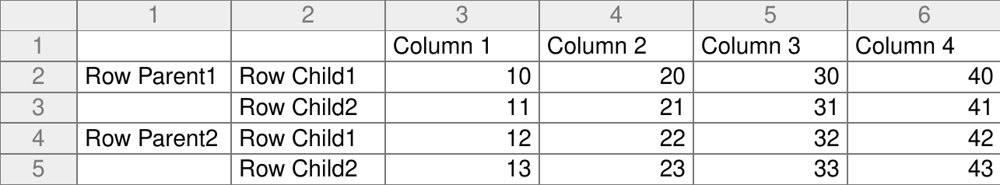{width="100%" alt="graphic without alt text"}\
Above, we have an example of the Empty Below pattern, the most simple
type of parentage. Here the *parent* and *children* are in different
columns and we can see which of the children belong to which parent
through the use of empty space below each parent. The Table after
conversion to a LongForm follows.\
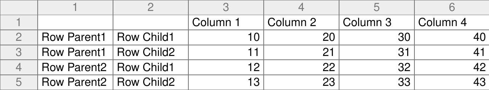{width="100%" alt="graphic without alt text"}

## Empty Right 1 {#sec:kp.byemptyright1}

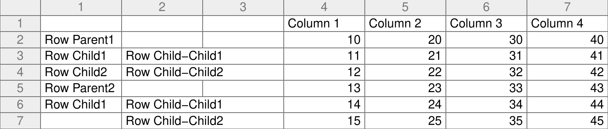{width="100%" alt="graphic without alt text"}\
Above, we have an example of the most basic form of the Empty Right
pattern. In this situation we have children in the same column as their
parent. We can still recognise these as children if the children have
children (*Child-Child*) in a different column, while the parent does
not (and hence the parent is Empty Right). Note the values pertaining to
the Parent (if any) are discarded. This is because they are assumed to
simply represent the sum of their children's values. The Table after
conversion to a LongForm follows.\
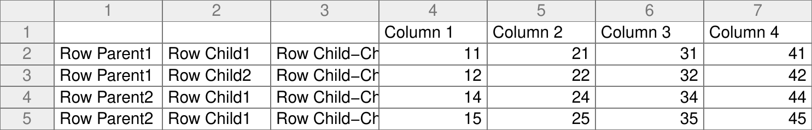{width="100%" alt="graphic without alt text"}

## Empty Right 2 {#sec:kp.byemptyright2}

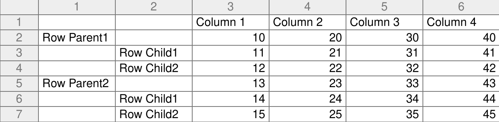{width="100%" alt="graphic without alt text"}\
Above, we have an example of both Empty Below and Empty Right. Either
algorithm can handle this situation, but simply due to the ordering of
the algorithms such situations are handled as Empty Right. The Table
after conversion to a LongForm follows.\
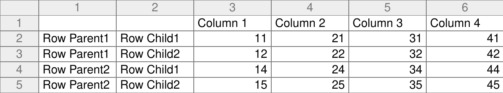{width="100%" alt="graphic without alt text"}

## Empty Right 3 {#sec:kp.byemptyright3}

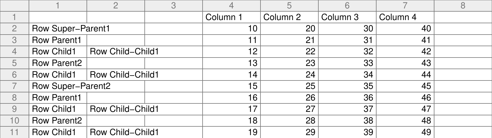{width="100%" alt="graphic without alt text"}\
Above, we have an example of a complex version of the Empty Right
pattern. The "parent-child in the same column" situation has been
extended further and we now have parents (*Super-Parent*) who have
children (*Parent*), who each further have children (*Child*), all in
the same column. Such situations can still be recognised if the
lowest-level children in the column (*Child*) have children in a
different column (*Child-Child*), while its direct parents (*Parent*)
each have children in the same column (*Child*) but not in a different
column (is Empty Right), and the top-most parents (*Super-Parents*) also
have no children in a different column (is also Empty Right). The
algorithm cannot currently handle super-super-parents. The Table after
conversion to a LongForm follows.\
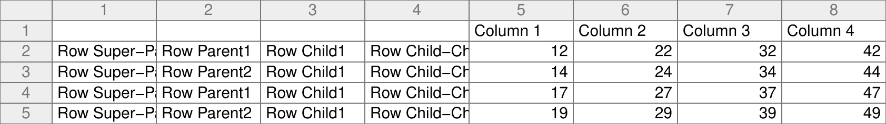{width="100%" alt="graphic without alt text"}

## Multi-row Column Label {#sec:kp.MultiRowColumnLabel}

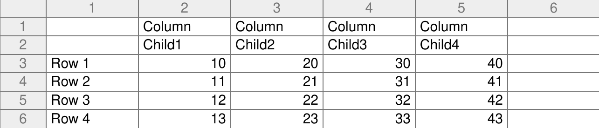{width="100%" alt="graphic without alt text"}\
Above, we have an example of Multi-row Column Labels. Often column
labels are physically split over multiple rows rather than making use of
line breaks in the same cell. In such occurrences, any row not
identified as a parent are collapsed into a single row of labels. The
Table after conversion to a LongForm follows.\
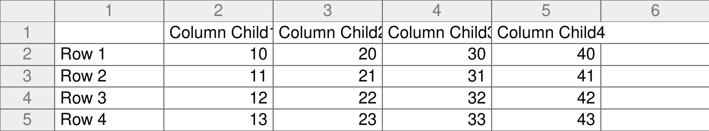{width="100%" alt="graphic without alt text"}

## Mismatched Column Label {#sec:kp.MismatchedColumnLabel}

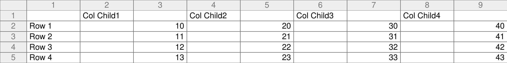{width="100%" alt="graphic without alt text"}\
Above, we have an example of Mismatched Column Labels. Sometimes the
column labels are in a different column to the data, usually due to a
misguided attempt at visual alignment of labels to the data. As long as
the correct rows and columns were identified for the data and the labels
(see [3](#sec:usermanual) subsection on `IdentResult`), and if there are
the same number of data columns as label columns, these mismatched
column labels will be paired with the data columns. The Table after
conversion to a LongForm follows.\
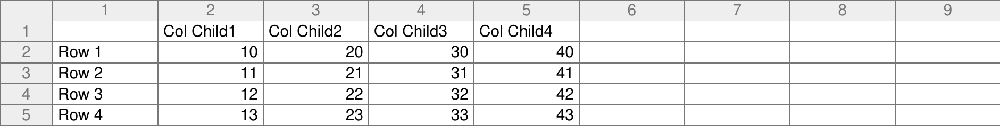{width="100%" alt="graphic without alt text"}

## Misaligned Column Label {#sec:kp.MisalignedColumnLabel}

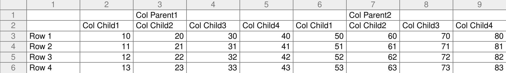{width="100%" alt="graphic without alt text"}\
Above, we have an example of Misaligned Column Labels. Often column
parents are physically centred over their children (N.B. where a
spreadsheet's cell-merge feature is used to do the centering, the actual
value is usually stored in the top-left cell and hence causes no
problems). *TableToLongForm* makes use of pattern recognition to
identify repeating patterns in the labels, or in empty cells surrounding
the labels, to correct for the misalignment. For the *Column Parents*
row, we find (starting from column 2, the first data column) a pattern
of Empty-NonEmpty-Empty-Empty, with the pattern occurring twice. In the
*Col Child* row, we also find a pattern of length 4 occurring twice.
This can be used to correctly align the *Column Parents* to its
children. The Table after conversion to a LongForm follows.\
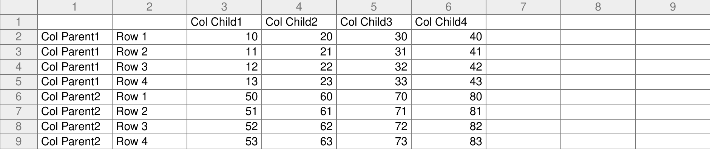{width="100%" alt="graphic without alt text"}

## Misaligned Column Label 2 {#sec:kp.MisalignedColumnLabel2}

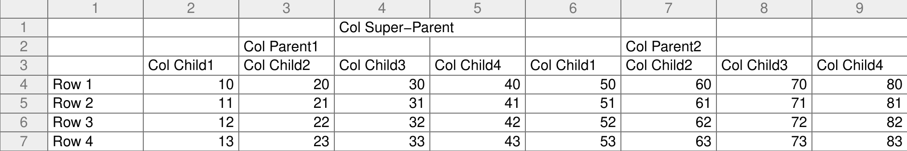{width="100%" alt="graphic without alt text"}\
Above, we have a generalised example of Misaligned Column Labels. We now
have *Column Super-Parent* which is misaligned to both its direct
children, the *Column Parents*, and to the lowest-level children. The
Table after conversion to a LongForm follows.\
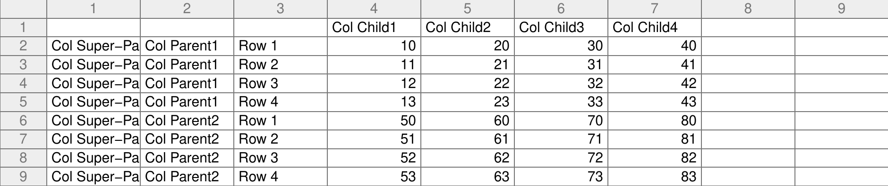{width="100%" alt="graphic without alt text"}

## Real Example - NZQA {#sec:kp.NZQA}

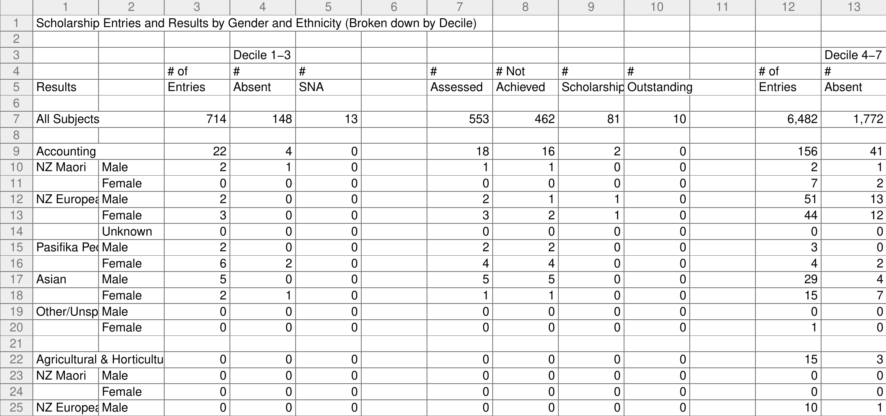{width="100%" alt="graphic without alt text"}\
Above, we have an example of real data released in a Table[^6] that
demonstrates a combination of many of the patterns listed above. The
data comes from the New Zealand Qualifications Authority [@NZQA]
regarding the entries and results for their Scholarship Exams. The Table
demonstrates Empty Below, Empty Right (including Type 3, as
`All Subjects` is a *super-parent*), Multi-row Column Labels, and
Misaligned Column Labels. The Table is substantially more complex than
the Labour Force Status data used in [1](#fig:StatsNZ), and will require
considerably more work to convert manually. Worse, each year of the data
is stored in a separate Table, each with slight differences in format.
Thus the manual conversion code would have to either be individually
tweaked for each year (requiring yet more work), or be flexible enough
to handle these differences (requiring substantially more work). Other
data from NZQA faces bigger problems; though the Scholarships data can
all be obtained in a mere 8 Tables (for 8 years from 2004 to 2011), the
Subjects data not only requires a separate Table for each year, but also
for each subject (of which there are 91). Obtaining the greatest
breakdown possible for the Subjects data across all other variables
requires thousands of individual Tables. Without automatic conversion
with *TableToLongForm*, simply reading in such data for use would
require too much work to be practical. The Table after conversion to a
LongForm follows.\
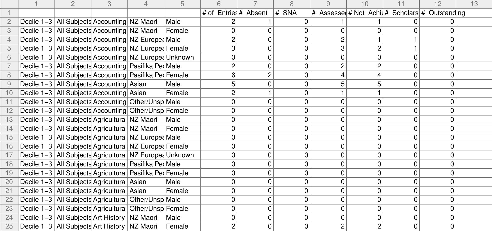{width="100%" alt="graphic without alt text"}

# Diagnostics

The primary limitation of *TableToLongForm* is that the function will be
a black box to most users. After running the function on a Table, the
user will either be given back a `"data.frame"` with no easy way of
verifying if the result is correct, or be confronted with an error with
little idea of what went wrong. Based on ad hoc tests conducted so far,
*TableToLongForm* will either succeed, or fail catastrophically in a
manner that is easily recognised as utter failure. However methods for
verifying correct operation (or to understand failures) would be
desirable.

The simplest method currently available is to examine the additional
output returned when `TableToLongForm` is called with the optional
argument `fulloutput = TRUE`. This will return the 'final product' of
*TableToLongForm*'s algorithms in the form of `IdentResult`, `rowplist`
and `colplist`.

IdentResult

:   was covered above in the [3](#sec:usermanual) section and contains
    information on where the data and labels are found.

rowsplist and colsplist

:   stand for Row/Column Parentage List which are nested `"list"`
    objects that represents all the hierarchical relationships in the
    Table, as identified by *TableToLongForm*. For easier reading they
    are assigned the `"plist"` class which has a custom `print` method.
    An example of a `colplist` is shown in [5](#fig:fullout).

<figure id="fig:fullout">
<div class="sourceCode" id="cb1"><pre class="sourceCode r"><code class="sourceCode r"><span id="cb1-1"><a href="#cb1-1" aria-hidden="true" tabindex="-1"></a><span class="sc">&gt;</span> <span class="fu">TableToLongForm</span>(LabourForce, <span class="at">fulloutput =</span> <span class="cn">TRUE</span>)[[<span class="st">&quot;colplist&quot;</span>]]</span>
<span id="cb1-2"><a href="#cb1-2" aria-hidden="true" tabindex="-1"></a><span class="sc">+</span> <span class="fu">Male</span> (<span class="dv">1</span>, <span class="dv">2</span>)</span>
<span id="cb1-3"><a href="#cb1-3" aria-hidden="true" tabindex="-1"></a><span class="sc">-</span> <span class="sc">+</span> European <span class="fu">Only</span> (<span class="dv">1</span>, <span class="dv">3</span>)</span>
<span id="cb1-4"><a href="#cb1-4" aria-hidden="true" tabindex="-1"></a><span class="sc">-</span> <span class="sc">-</span> <span class="sc">+</span> Persons Employed <span class="cf">in</span> Labour <span class="fu">Force</span> (<span class="dv">1</span>, <span class="dv">4</span>)</span>
<span id="cb1-5"><a href="#cb1-5" aria-hidden="true" tabindex="-1"></a><span class="sc">-</span> <span class="sc">-</span> <span class="sc">+</span> Persons Unemployed <span class="cf">in</span> Labour <span class="fu">Force</span> (<span class="dv">2</span>, <span class="dv">4</span>)</span>
<span id="cb1-6"><a href="#cb1-6" aria-hidden="true" tabindex="-1"></a><span class="sc">-</span> <span class="sc">-</span> <span class="sc">+</span> Not <span class="cf">in</span> Labour <span class="fu">Force</span> (<span class="dv">3</span>, <span class="dv">4</span>)</span>
<span id="cb1-7"><a href="#cb1-7" aria-hidden="true" tabindex="-1"></a><span class="sc">-</span> <span class="sc">-</span> <span class="sc">+</span> Working Age <span class="fu">Population</span> (<span class="dv">4</span>, <span class="dv">4</span>)</span>
<span id="cb1-8"><a href="#cb1-8" aria-hidden="true" tabindex="-1"></a><span class="sc">-</span> <span class="sc">-</span> <span class="sc">+</span> Labour Force Participation <span class="fu">Rate</span> (<span class="dv">5</span>, <span class="dv">4</span>)</span>
<span id="cb1-9"><a href="#cb1-9" aria-hidden="true" tabindex="-1"></a><span class="sc">-</span> <span class="sc">-</span> <span class="sc">+</span> Unemployment <span class="fu">Rate</span> (<span class="dv">6</span>, <span class="dv">4</span>)</span>
<span id="cb1-10"><a href="#cb1-10" aria-hidden="true" tabindex="-1"></a><span class="sc">-</span> <span class="sc">-</span> <span class="sc">+</span> Employment <span class="fu">Rate</span> (<span class="dv">7</span>, <span class="dv">4</span>)</span>
<span id="cb1-11"><a href="#cb1-11" aria-hidden="true" tabindex="-1"></a><span class="sc">-</span> <span class="sc">-</span> <span class="sc">+</span> Total Labour <span class="fu">Force</span> (<span class="dv">8</span>, <span class="dv">4</span>)</span>
<span id="cb1-12"><a href="#cb1-12" aria-hidden="true" tabindex="-1"></a><span class="sc">-</span> <span class="sc">+</span> Maori <span class="fu">Only</span> (<span class="dv">9</span>, <span class="dv">3</span>)</span>
<span id="cb1-13"><a href="#cb1-13" aria-hidden="true" tabindex="-1"></a><span class="sc">-</span> <span class="sc">-</span> <span class="sc">+</span> Persons Employed <span class="cf">in</span> Labour <span class="fu">Force</span> (<span class="dv">9</span>, <span class="dv">4</span>)</span>
<span id="cb1-14"><a href="#cb1-14" aria-hidden="true" tabindex="-1"></a><span class="do">## Output truncated</span></span></code></pre></div>
<figcaption>Figure 5: A truncated example of the <code>colplist</code>
for the Labour Force Status data used in Figure 1. It represents the
hierarchical relationships of the column labels, as identified by
<em>TableToLongForm</em>. We can see that it has correctly identified
<code>Male</code> as a top-level parent with the ethnic categories, such
as <code>European Only</code>, nested inside, which are in turn a parent
to the lowest-level categories, such as
<code>Employment Rate</code>.</figcaption>
</figure>

Unfortunately this output has two key limitations. First, it is not
obvious from this output what went wrong (or if nothing went wrong),
requiring some detective work to piece together the evidence. Second, if
anything did go wrong, the user still does not know *why*.

The option with the potential to provide the most information is calling
`TableToLongForm` with the optional argument `diagnostics = TRUE`, which
will write diagnostic output to a file, printing key variables at each
major stage of the conversion process. This output can thus be used to
track *TableToLongForm*'s progress as it works to convert the Table,
enabling fairly accurate assessment of where exactly it went wrong. Some
example diagnostic output is shown in [6](#fig:diagout). Unfortunately,
understanding this output requires familiarity with the workings of the
code and is unlikely to be of much use to anyone other than the author.

<figure id="fig:diagout">
<div class="sourceCode" id="cb1"><pre class="sourceCode r"><code class="sourceCode r"><span id="cb1-1"><a href="#cb1-1" aria-hidden="true" tabindex="-1"></a><span class="do">###TCR CIMCB rowData </span></span>
<span id="cb1-2"><a href="#cb1-2" aria-hidden="true" tabindex="-1"></a>[<span class="dv">1</span>]  <span class="dv">5</span> <span class="dv">26</span></span>
<span id="cb1-3"><a href="#cb1-3" aria-hidden="true" tabindex="-1"></a><span class="do">###TCR CIMCB colData </span></span>
<span id="cb1-4"><a href="#cb1-4" aria-hidden="true" tabindex="-1"></a>[<span class="dv">1</span>]   <span class="dv">2</span> <span class="dv">241</span></span>
<span id="cb1-5"><a href="#cb1-5" aria-hidden="true" tabindex="-1"></a><span class="do">###TCR IOOC plist </span></span>
<span id="cb1-6"><a href="#cb1-6" aria-hidden="true" tabindex="-1"></a><span class="sc">$</span>rows</span>
<span id="cb1-7"><a href="#cb1-7" aria-hidden="true" tabindex="-1"></a>[<span class="dv">1</span>] <span class="dv">1</span> <span class="dv">2</span> <span class="dv">3</span> <span class="dv">4</span> <span class="dv">5</span> <span class="dv">6</span> <span class="dv">7</span> <span class="dv">8</span></span>
<span id="cb1-8"><a href="#cb1-8" aria-hidden="true" tabindex="-1"></a><span class="sc">$</span>cols</span>
<span id="cb1-9"><a href="#cb1-9" aria-hidden="true" tabindex="-1"></a>[<span class="dv">1</span>] <span class="dv">4</span></span></code></pre></div>
<div class="sourceCode" id="cb2"><pre class="sourceCode r"><code class="sourceCode r"><span id="cb2-1"><a href="#cb2-1" aria-hidden="true" tabindex="-1"></a><span class="do">###TCR IOOC res</span></span>
<span id="cb2-2"><a href="#cb2-2" aria-hidden="true" tabindex="-1"></a><span class="sc">+</span> Persons Employed <span class="cf">in</span> Labour <span class="fu">Force</span> (<span class="dv">1</span>, <span class="dv">4</span>)</span>
<span id="cb2-3"><a href="#cb2-3" aria-hidden="true" tabindex="-1"></a><span class="sc">+</span> Persons Unemployed <span class="cf">in</span> Labour <span class="fu">Force</span> (<span class="dv">2</span>, <span class="dv">4</span>)</span>
<span id="cb2-4"><a href="#cb2-4" aria-hidden="true" tabindex="-1"></a><span class="sc">+</span> Not <span class="cf">in</span> Labour <span class="fu">Force</span> (<span class="dv">3</span>, <span class="dv">4</span>)</span>
<span id="cb2-5"><a href="#cb2-5" aria-hidden="true" tabindex="-1"></a><span class="sc">+</span> Working Age <span class="fu">Population</span> (<span class="dv">4</span>, <span class="dv">4</span>)</span>
<span id="cb2-6"><a href="#cb2-6" aria-hidden="true" tabindex="-1"></a><span class="sc">+</span> Labour Force Participation <span class="fu">Rate</span> (<span class="dv">5</span>, <span class="dv">4</span>)</span>
<span id="cb2-7"><a href="#cb2-7" aria-hidden="true" tabindex="-1"></a><span class="sc">+</span> Unemployment <span class="fu">Rate</span> (<span class="dv">6</span>, <span class="dv">4</span>)</span>
<span id="cb2-8"><a href="#cb2-8" aria-hidden="true" tabindex="-1"></a><span class="sc">+</span> Employment <span class="fu">Rate</span> (<span class="dv">7</span>, <span class="dv">4</span>)</span>
<span id="cb2-9"><a href="#cb2-9" aria-hidden="true" tabindex="-1"></a><span class="sc">+</span> Total Labour <span class="fu">Force</span> (<span class="dv">8</span>, <span class="dv">4</span>)</span></code></pre></div>
<figcaption>Figure 6: A few examples of the diagnostic output generated
by <code>TableToLongForm</code> when called with
<code>diagnostics = TRUE</code> on the Labour Force Status data used in Figure 1
. The diagnostic output is printing key variables at each major stage of
the conversion process. <code>###TCR</code> indicates an identifier
line, the following word indicates the part of the function generating
this output (e.g. <code>CIMCB</code>, which is short for Call
Identification algorithm Most-Common-Boundary), the last word indicates
the name of the variable being printed (e.g. <code>rowData</code>). The
diagnostic output can be used to see what <em>TableToLongForm</em> is
getting right (or wrong)... assuming the user is familiar with the code.
</figcaption>
</figure>

# Discussion

This article has introduced *TableToLongForm*, an R package that can
automatically convert hierarchical Tables that would normally rely on
the discerning powers of a human brain, to a simple LongForm dataframe
that any decent software package can easily manipulate and use. While it
can handle a variety of Tables automatically, and an even greater
variety with some aid from the human user, it is not without
limitations. Ultimately, *TableToLongForm* still uses algorithms to
detect a known set of recognised patterns and any Table that deviates
from these patterns will break *TableToLongForm*.

There is work to be done in refining and generalising existing
algorithms and creating new algorithms so that *TableToLongForm* can
successfully handle more cases, while also reducing the possibility of a
false positive. These range from adding more robust checks to the
algorithms to verify correct detection, such as sum-checks or pattern
recognition, to more fundamental changes, such as altering the `"NA"`
classification to distinguish between empty space and missing values. A
recent addition to the package (introduced in version 1.3.0) is to
enable new, custom algorithms to be used in place of the default ones
included with the package. More information on this can be found in the
official webpage for the package.

There is also work to be done in diagnostics output, not only in the
formal diagnostic output, but also in the form of error and warning
messages. Consider for instance the following error message if we call
`TableToLongForm` on the Table in [3](#fig:UKGov) without specifying the
correct `IdentResult`. From these messages it is not at all obvious that
the problem is an incorrect `IdentResult`, which is a problem that is
relatively easy to address if only it can correctly be identified by the
user.

``` r
Error in 1:ncol(datbit) : argument of length 0
In addition: Warning message:
In rbind(matColLabel[!fullrows, , drop = FALSE], collapsedlabels) :
  number of columns of result is not a multiple of vector length (arg 2)
```

In terms of formal diagnostic output, various ideas are being tried such
as graphical representations of the information provided by
`fulloutput = TRUE` by drawing the original Table with the regions being
highlighted in some way. Such a method would, for example, make it
easier to see a problem with `IdentResult`, as it should become apparent
on the drawn Table that the incorrect regions are being highlighted.

This article has been written for *TableToLongForm* version 1.3.1. The
code for reproducing the figures in this article, as well as more
detailed documentation on the code itself, can be found at
<https://www.stat.auckland.ac.nz/~joh024/Research/TableToLongForm/>. The
development version can be found on github at
<https://github.com/joh024/TableToLongForm>.

\
:::

[^1]: Table, with a capital T, is used in this article to specifically
    mean hierarchical tables, e.g. [1](#fig:StatsNZ).

[^2]: Machine readable is used to mean that the format is intended for
    access and manipulation by computers, and it is thus much easier to
    use the data for various purposes, such as statistical analysis. It
    can alternatively be described as *Tidy Data* [@tidy-data], with the
    conversion taking the data closer to the ideal 'tidy' form.

[^3]: I use the term LongForm loosely and in some cases
    *TableToLongForm* will result in WideForm output as the difference
    can depend on contextual information the computer cannot comprehend.
    However, the output will be machine readable and many tools, such as
    those mentioned in the opening paragraph, can be used to further
    reformat the data, including conversions between LongForm and
    WideForm.

[^4]: This Table, after being read in as a `"matrix"` as shown, is
    included in *TableToLongForm* as part of `data(TCData)`, and can be
    accessed with `TCData[["StatsNZLabourForce"]]`

[^5]: All the Tables demonstrating the recognised patterns are included
    in *TableToLongForm* as part of `data(TCData)`. `TableToLongForm`
    can be called on these Tables for the converted versions,
    e.g. `TableToLongForm(TCData[["ToyExByEmptyBelow"]])`

[^6]: This Table is included in *TableToLongForm* as part of
    `data(TCData)`, and can be accessed with
    `TCData[["NZQAScholarships"]]`
