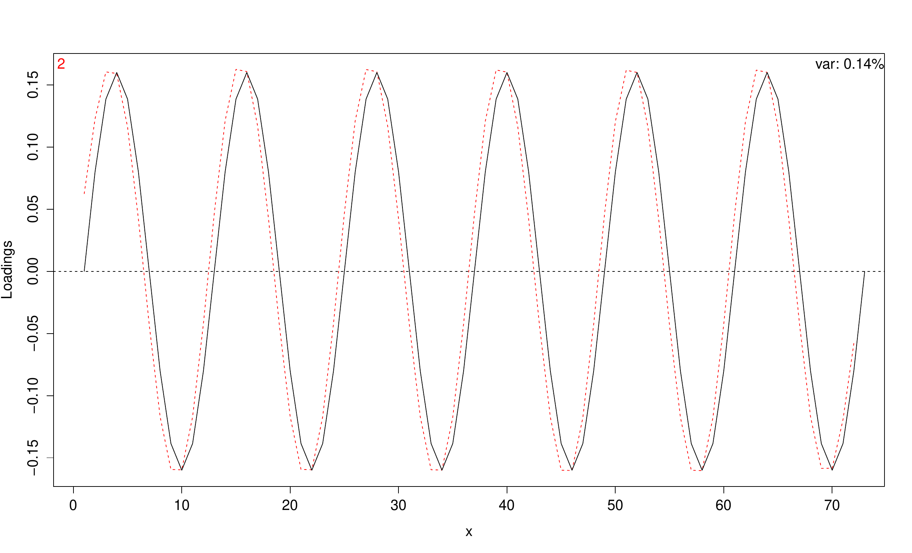

::: article
# Principal component analysis

Principal Components Analysis is simply an eigenanalysis of a covariance
or correlation matrix. To learn more about PCA, see any standard
multivariate analysis text, such as [@Johnson.Wichern]. Through an
eigenanalysis, a $d \times d$ covariance matrix $G$ can be decomposed in
terms of its eigenvectors, ${{v}}_1,\ldots, {{v}}_d$, and the
corresponding eigenvalues, $\lambda_1,\ldots, \lambda_d$:
$G = \sum_1^d  \lambda_j {{v}}_j {{v}}_j^T$. The eigenvalue,
$\lambda_j$, can be interpreted as the variance in $G$ in the direction
of ${{v}}_j$ and $\lambda_j/\sum_{k=1}^d \lambda_k$ as the proportion of
variance explained by ${{v}}_j$. Often, $G$ is well-approximated using
the first $J$ eigenvectors and eigenvalues. Typically, data analysts
only consider these $J$ eigenvectors, and for that reason, we call the
space that these eigenvectors span the *model space*. We call the
orthogonal complement of the model space (which is simply the space
spanned by the last $d-J$ eigenvectors) the *nearly null space*.

Researchers can use existing R functions `princomp` and `prcomp` to
calculate the eigenvectors, eigenvalues and proportion of variance
explained. Likewise, our library
[*prinsimp*](https://CRAN.R-project.org/package=prinsimp) [@prinsimp]
can be used to study eigenvectors and their properties. In addition,
*prinsimp* allows researchers to more carefully study the nearly null
space, by calculating simple and easily interpretable basis vectors.

We focus on analysis of covariance matrices, although the user can input
a correlation matrix for analysis. As in usual PCA, the choice between
using a correlation matrix and a covariance matrix depends upon the
types of responses and the question of interest. A correlation matrix
should be used when the responses under consideration have
non-comparable units of measurement, such as meters for measuring the
response, height, and kilograms for measuring the response, weight. In
all of our applications, the responses are directly comparable: they are
from the same variable measured under different conditions (e.g., the
variable weight measured at different ages). To study structure in such
data, analysis of the covariance matrix is most useful. In addition,
such data usually have natural simplicity measures, whereas
non-comparable data do not.

Details of the methodology that *prinsimp* implements appear in
@Gaydos:main, a paper which also discusses the importance of studying
genetic constraints.

# Simplicity and the simplicity basis

The simplicity of a vector ${{v}}\in \Re^d$ is defined in terms of a
non-negative definite symmetric $d \times d$ matrix $\Lambda$: the
simplicity of ${{v}}$ is equal to ${{v}}^T \Lambda {{v}}$, with large
values meaning ${{v}}$ is simple. This simplicity measure allows us to
construct the *simplicity basis* of the $L=d-J$ dimensional nearly null
space.

A simplicity basis for an $L$-dimensional linear subspace ${\cal{V}}$ of
$\Re^d$ is an orthonormal basis $\{{{w}}_1, \dots , {{w}}_L\}$ where the
${{w}}_k$'s are in decreasing order of simplicity, as defined by
$\Lambda$. To calculate a simplicity basis, first let
${{u}}_1, \dots , u_L$ be an orthonormal basis of ${\cal{V}}$ and let
$P$ be the $d \times L$ matrix with $k$th column equal to ${{u}}_k$. So
$P$ is a projection matrix onto ${\cal{V}}$. Let
${{a}}_1, \dots , {{a}}_L$ be the eigenvectors of $P^T \Lambda P$ with
corresponding eigenvalues
$\gamma_1 \geq \gamma_2 \geq \dots \geq \gamma_L$. Then it is
straightforward to show that $\{P {{a}}_1 , \dots , P {{a}}_L\}$ is a
simplicity basis of ${\cal{V}}$. If the eigenvalues of $\Lambda$ are
distinct, then any orthonormal basis $\{{{u}}_1,\ldots, {{u}}_L\}$ will
lead to the same set of $\{{{w}}_1,\ldots, {{w}}_L\}$. For our purposes,
we set $\{{{u}}_1,\ldots, {{u}}_L\}$ equal to the last $L$ eigenvectors
of $G$.

Note that we require that simple $v$'s have large values of
${{v}}^T\Lambda {{v}}$. However, in some cases, the simplicity measure
is most easily defined in terms of a non-negative definite matrix
$\Lambda^*$ with simple ${{v}}$'s having *small* values of
${{v}}^{T} \Lambda^* v$. In such a case, we simply set
$\Lambda = \lambda^* {\rm{I}} - \Lambda^*$ where $\lambda^*$ is the
largest eigenvalue of $\Lambda^*$. Then $\Lambda$ is non-negative
definite and simple $v$'s will have large values of
${{v}}^T \Lambda {{v}}$, as desired.

Examples of quadratic simplicity measures can be found in smoothing and
penalized regression. See @EilersMarx and @GreenSilverman. Different
examples of simplicity measures are discussed in the next section, in
particular the built-in measures of the `simpart` function.

# Examples of simplicity measures

The function `simpart` has three built-in simplicity measures of vectors
in $\Re^d$: the default measure based on first divided differences as
defined in @Gaydos:main, another measure based on second divided
differences and a third based on periodicity. These three measures are
defined in terms of a vector ${{x}}\in \Re^d$ containing values of an
explanatory variable. The periodicity simplicity measure is most natural
when ${{x}}$ contains times and the researcher believes that responses
are periodic or approximately periodic with known period.

## Simplicity measure of a vector $v$ using divided differences based on ${{x}}$

Divided differences are often used to approximate derivatives of a
function. For instance, the first divided difference of the
differentiable function $f$ using $x_1$ and $x_2$ is
$[f(x_2)-f(x_1)]/[x_2-x_1]$, which serves as an approximation of
$f'(x_1)$. Our divided difference simplicity measures are appropriate
when the observed data can be considered as arising from function
evaluations.

To define a divided difference simplicity measure of a vector based on
the vector of explanatory variables, ${{x}}=(x[1],\ldots, x[d])^T$, let
the $(d-1) \times d$ difference matrix $D_d$ be $$\begin{aligned}
D_d= \begin{pmatrix}
-1 & 1 & 0 & \cdots & 0\\
 0 & -1 & 1 & \cdots & \vdots\\
\vdots&&\ddots&\ddots&0\\
0&\cdots&0&-1&1
\end{pmatrix}
\nonumber
\end{aligned}$$ and let $W$ be the $(d-1) \times (d-1)$ diagonal matrix
with $W[j,j] = x[j+1]-x[j]$, that is, with the diagonal of $W$ equal to
$D_d {{x}}$.

### First divided difference simplicity measure of ${{v}}$ based on ${{x}}$

The first divided difference simplicity measure of the vector
${{v}}=(v[1],\ldots, v[d])^T$ is the default measure in `simpart`. To
define it, write $$\begin{aligned}
 \displaystyle\sum\limits_{j=1}^{d-1} \frac {\left(v[{j+1}] - v[{j}]\right)^2}{x[j+1]-x[j] }  = || W^{-1/2}  D_d {{v}}||^2  = {{v}}^T D_d^T  W^{-1} D_d {{v}}.
 \nonumber
\end{aligned}$$ This expression is a *complexity measure*, with large
values indicating that $v$ is complex. However, we will define a
*simplicity measure*, with large values indicating that $v$ is simple.
In addition, we will scale our measure using a result of
[@Schatzman:2002], that the eigenvalues of $D_d^T  W^{-1} D_d$ are
always between $0$ and $4/\underline{\Delta}_x$, where
$\underline{\Delta}_x \equiv  \min_j{x[j+1]-x[j]}$. We define the
simplicity of $v$ as $v'\Lambda_1 v$ where
$\Lambda_1 = 4 I -\underline{\Delta}_x D_d^T  W^{-1} D_d$. Then the
value of this simplicity measure is always between 0 and 4 and the
simplest vector $v$ satisfies
$\sum_{j=1}^{d-1} \big(v[{j+1}] - v[{j}]\big)^2/(x[j+1]-x[j] ) = 0$,
that is, the components of ${{v}}$ are equal.

### Second divided difference simplicity measure of ${{v}}$ based on ${{x}}$

To define the simplicity measure based on second divided differences,
let
$$\delta_{j} = \frac{v[{j+2}] - v[{j+1}]}{x[j+2]-x[j+1]}  - \frac{v[{j+1}] - v[{j}]}{x[j+1]-x[j] }
, ~~    j= 1 , \ldots, d-2.
\nonumber$$ Our simplicity measure of the vector $v$ is defined in terms
of

$$\begin{aligned}
\displaystyle\sum\limits_{j=1}^{d-2} \frac{\delta_{j} ^2}{x[{j+2}]-x[j]}.  
\label{eq:second.complexity}  
\end{aligned}  (\#eq:second-complexity)  $$

We consider ${{v}}$ *simple* if this expression is small. One can easily
show that this sum of squares is equal to $0$ if and only if
$v[j] = \alpha + \beta x[j]$ for some $\alpha$ and $\beta$.

To write (\@ref(eq:second-complexity)) in matrix form, write
$$\begin{pmatrix}
\delta_{1}
\\
\vdots
\\
\delta_{d-2}
\end{pmatrix}
  =  D_{d-1}  W^{-1}  D_d {{v}}$$ and let $W_2$ be the
$(d-2) \times (d-2)$ diagonal matrix with $W_2[j,j] = x[{j+2}]-x[j]$.
Thus (\@ref(eq:second-complexity)) is equal to
${{v}}^T D_d^T W^{-1} D_{d-1}^T W_2^{-1}  D_{d-1} W^{-1}  D_d {{v}}$
$\equiv {{v}}^T \Lambda_2^* {{v}}$. To make this a simplicity measure,
we set $\Lambda_2 = \lambda^*$I$-\Lambda_2^*$, with $\lambda^*$ equal to
the largest eigenvalue of $\Lambda_2^*$. The simplicity measure of
${{v}}$ is ${{v}}^T \Lambda_2 {{v}}$. The function `simpart` calculates
$\lambda^*$ numerically, via eigenanalysis of $\Lambda_2^*$.

## Periodicity simplicity measure of ${{v}}$ using ${{x}}$

In some applications, responses may vary periodically. For instance, the
growth of a plant may have a daily cycle caused by the natural daily
cycle of sunlight. However, this periodic variation may be swamped by
larger sources of variation and thus not detectable by Principal
Components Analysis. In this case, we need new methods to look for
small-variation periodic structure, that is, to look for periodic
structure in the nearly null space.

To use *prinsimp*'s periodic simplicity measure, the user must input a
period. For example, if plant height had a daily cycle and was measured
hourly, then the input period would be $24$. Our periodic simplicity
measure is equal to $1$ if and only if the plant heights are exactly
periodic. The definition of the simplicity measure is somewhat
technical, and so we provide it in the following separate section, for
the interested reader.

### Details of the definition of the periodic simplicity measure of ${{v}}$ using ${{x}}$

As noted, to define a periodicity measure of a vector, the user must
specify an *index period* $p$, a positive integer. We say that
${{v}}=(v[1],\ldots, v[d])^T$ is periodic with index period $p$ if and
only if $v[{j+p}] = v[j]$, $j=1, d-p$.

This definition of periodicity only makes practical sense if $v$ is a
vector of responses corresponding to a vector
${{x}}=(x[1],\ldots, x[d])^T$ with the $x[j]$'s being time points that
''match''the index period. That is, to make practical sense, the data
analyst would want ${{x}}$ to *support periodicity with time period
$\pi$ and index period $p$*: that $x[{j+p}] = x[j]+ \pi$,
$j=1, \ldots,d - p$. However, the formal definitions that follow do not
require the vector ${{x}}$.

The periodic simplicity measure of a vector ${{v}}\in \Re^d$ for a given
index period $p$ is defined as follows. Write $d=pl+k$ with
$0 \le k < p$. First suppose that $k=0$, so that $d$ is divisible by
$p$. Then we can partition the vector $v$ into $l$ segments each of
length $p$: ${{v}}^{T} \equiv ({{v}}^{(1)T}, \dots , {{v}}^{(l)T})$. Let
$\bar{{{v}}}^* \in \Re^p$ be the component-wise average of the
${{v}}^{(i)}$'s. So $\bar{{{v}}}^*$'s $j$th component is
$$\overline{v}^{*}[j]=\frac{1}{l}
\sum_{i=1}^l  v^{(i)}[j].$$ The periodic simplicity measure of ${{v}}$,
a vector of length $d=lp$, is defined in terms of the complexity measure

$$\begin{aligned}
\displaystyle\sum\limits_{i=1}^l || {{v}}^{(i)} - \overline{{{v}}}^{*} || ^2
.  
 \label{eq:periodic1}  
\end{aligned}  (\#eq:periodic1)  $$

This measure is zero if and only if the vector ${{v}}$ is periodic with
index period $p$, that is, if and only if $v[{j+p}] = v[j]$ for all
$j=1,\ldots,d-p$.

If the length of ${{v}}$ is $d=lp+k$ with $0 < k <p$, then we divide
${{v}}$ into $l+1$ segments
$v^{T} \equiv ({{v}}^{(1)T}, \dots , {{v}}^{(l)T}, {{v}}^{(l+1)T})$ with
${{v}}^{(i)} \in \Re^p$, $i=1,\ldots,l$ and $v^{(l+1)} \in \Re^k$. We
define $\bar{{{v}}}^* \in \Re^p$ as a component-wise average, in the
obvious way: $$\overline{v}^{*}[j]=
\begin{cases}
\frac{1}{l+1} \sum_{i=1}^{l+1}  v^{(i)}[j]
  &\text{for }1 \le j \le k \\
\frac{1}{l}
\sum_{i=1}^l  v^{(i)}[j]   
\ &\text{for }k+1 \le j \le p.
\end{cases}$$ The periodic simplicity measure of $v$, a vector of length
$d=lp+k$, $0 < k < p$, is defined in terms of the complexity measure

$$\begin{aligned}
\displaystyle\sum\limits_{i=1}^l || {{v}}^{(i)} - \overline{{{v}}}^{*} || ^2 + \displaystyle\sum\limits_{j=1}^k \left(v^{(l+1)}[j]-\overline{v}^{*}[j] \right)^2
.  
\label{eq:periodic2}  
\end{aligned}  (\#eq:periodic2)  $$

This measure is 0 if and only if ${{v}}^{(1)}=\cdots={{v}}^{(l)}$ and
the components of ${{v}}^{(l+1)}$ are equal to the first $k$ components
of ${{v}}^{(1)}$, that is, if and only if ${{v}}$ is periodic with index
period $p$.

We can easily find $\Lambda_{\pi}^*$ so that
${{v}}' \Lambda_{\pi}^* {{v}}$ equals the complexity measures in
(\@ref(eq:periodic1)) and (\@ref(eq:periodic2)). Since these expressions
are small when ${{v}}$ is close to periodic, we let
$\Lambda_{\pi} = \lambda^*{\rm{I}} - \Lambda_{\pi}^*$ where $\lambda^*$
is the largest eigenvalue of $\Lambda_{\pi} ^*$ and set our simplicity
measure of ${{v}}$ equal to ${{v}}^T \Lambda_{\pi} {{v}}$. To find the
largest eigenvalue of $\Lambda_{\pi}^*$, we can show that
$\Lambda_{\pi}^*$ is a projection matrix, that is, that
$\Lambda_{\pi}^{*T} \Lambda_{\pi}^* = \Lambda_{\pi}^*$. So the
eigenvalues of $\Lambda_{\pi}^*$ are all equal to $0$ or $1$. Thus,
$\lambda^*=1$ and $\Lambda_{\pi} = {\rm{I}} - \Lambda_{\pi}^*$. Since
${{v}}'\Lambda_{\pi}^* {{v}}=0$ if and only if ${{v}}$ is periodic with
index period $p$ and this subspace of ${{v}}$'s is of dimension $p$,
$\Lambda_{\pi}$ has eigenvalues equal to $1$, of multiplicity $p$, and
eigenvalues equal to $0$, of multiplicity $d-p$. Eigenvectors of
$\Lambda_{\pi}$ corresponding to eigenvalues equal to $1$ are periodic
with index period $p$.

For an alternative method for finding periodic structure in functional
data, see @Zhao.2004.

# *Prinsimp* specifics

The main function, `simpart`, of the package *prinsimp* is designed for
analysis of a $d \times d$ covariance matrix -- either supplied by the
user or calculated by `simpart` from data. If the user has data
consisting of responses vectors $y_j  \in \Re^d$, $j=1,\ldots,n$, the
user can input the $n \times d$ matrix, `y`, with $j$th row equal to
$y_j^T$ and `simpart` will calculate the required sample covariance
matrix. For some data, for instance, if the $y_j$'s are different
lengths, the user must supply a $d \times d$ covariance matrix estimated
by an external method, such as random regression analysis [@Demidenko]
or PACE [@PACE]. Sometimes, the user must supply a vector of independent
variable values, $x \in \Re^d$, to `simpart`.

The `simpart` function uses the covariance matrix to partition $\Re^d$
into two subspaces, the *model space* and the *nearly null space*. The
model space is spanned by the eigenvectors of the covariance matrix with
the largest eigenvalues, that is, by the leading principal components
from principal component analysis (PCA). The nearly null space is the
orthogonal complement of the model space and explains a small amount of
the variability in the data. The user specifies the dimension of the
nearly null space and thus the dimension of the model space. The
*prinsimp* package and the `simpart` function help the user to look for
"simple" and "interesting" structure in the nearly null space. The main
output of `simpart` is two sets of orthogonal basis vectors: those that
span the model space and those that span the nearly null space. The
output also includes information about these basis vectors, such as
their simplicity measures and the percents of variance they explain. The
`plot` and `basisplot` functions allow the user to visually study
`simpart`'s output.

This section guides the reader through the capabilities of *prinsimp*
using analyses of two data sets. We begin with an analysis of
caterpillar data, illustrating the basic `simpart` function and its
default `print`, `summary` and `plot` methods and how to use the
argument `reverse`. This example follows the analysis from @Gaydos:main.
The second data set is simulated using sine functions and, in the
analysis, we study periodicity in the nearly null space. We use the
built-in measure `periodic` and we also define a function that supplies
`simpart` a tailor-made definition of periodic simplicity. At the end of
this section, we give an additional example to show how to use a
tailored simplicity measure. The option for the user to provide a
tailored simplicity measure gives `simpart` the flexibility needed to
answer a specific scientific question.

## Example: caterpillar data

We start with a simple example that replicates some of the analysis from
@Gaydos:main. We use the estimated genetic covariance matrix of the
caterpillar growth rate data described in @KRS:2004. Growth rates
(mg/hour) were recorded on 529 individuals from $35$ families at six
temperatures: $11, 17, 23, 29, 35, 40$ degrees Centigrade. Thus, the `x`
vector input to `simpart` is

``` r
> x.cat <- c(11, 17, 23, 29, 35, 40)
```

We have a choice of the dimension of model space $J=6, 5, \ldots,1, 0$
with corresponding dimension of the nearly null space of `simpledim`
$= 0, 1, 2,\ldots, 5, 6$. We load the *prinsimp* library and access the
genetic covariance matrix, `caterpillar`.

``` r
> library(prinsimp)
> data(caterpillar)
```

Throughout this example, we will use the default simplicity measure of
first divided differences.

First consider a model space of dimension $6$, so the nearly null space
has dimension equal to $0$.

``` r
> cat.sim.6 <- simpart(caterpillar, simpledim = 0, x = x.cat, cov = TRUE)
```

Since the input `caterpillar` is a covariance matrix and not the
original data, we must set `cov = TRUE`. The argument
`measure = "first"` is not needed because `"first"` is the default. When
we choose `simpledim = 0`, the resulting model space basis vectors are
simply the usual principal components of the covariance matrix, that is,
they are the eigenvectors of `caterpillar`. Recall that, for all values
of `simpledim`, the model space basis vectors are always the
eigenvectors of `caterpillar` corresponding to the largest eigenvalues.
As in usual principal component analysis, the components of an
eigenvector are called loadings. We extend this terminology to any basis
vector.

Due to rounding, the covariance matrix, `caterpillar`, has one negative
eigenvalue. The function `simpart` automatically sets negative
eigenvalues equal to $0$, reconstructs the covariance matrix and prints
a warning.

We plot our results by the command

``` r
> plot(cat.sim.6)
```

The resulting plot appears in Figure [1](#fig:cat.6).

{#fig:cat.6 width="100%" alt="graphic without alt text"}

### The `summary` method and `display=list()` argument for the caterpillar data

Now consider the case with model space of dimension $J=5$ and
`simpledim = 1`, the dimension of the nearly null space. In this case,
the nearly null space is the same space as that spanned by the sixth
principal component. Thus the `simpart` output and plot will be
identical to Figure [1](#fig:cat.6), save for colour labelling.

``` r
> cat.sim.5 <- simpart(caterpillar, simpledim = 1, x = x.cat, cov = TRUE)
```

The `summary` method prints the simplicity measures, the percents of
variance explained and the cumulative percents of variance explained of
the basis vectors of both the model space and the nearly null space. If
we set `loadings=TRUE`, then the `summary` method also prints the basis
vectors of both the model space and the nearly null space.

``` r
> summary(cat.sim.5, loadings = TRUE)
Simple partition (first divided differences): 1 simple basis

                 model 1  model 2  model 3  model 4  model 5  simple 1
Simplicity           1.85     3.54     1.25     2.47     3.55     2.68
%-var explained      59.5     19.2     14.7     5.85    0.731      <.1
Cumulative %-var     59.5     78.7     93.4     99.3      100      <.1

Loadings:
    model 1  model 2  model 3  model 4  model 5 simple 1
11    0.022   -0.031    0.059    0.022    0.948   -0.308
17   -0.038    0.384   -0.141   -0.479    0.270    0.727
23    0.243    0.317    0.698    0.510    0.047    0.300
29    0.074    0.284   -0.687    0.650    0.074    0.121
35   -0.512    0.736    0.088   -0.082   -0.102   -0.413
40    0.819    0.359   -0.098   -0.284   -0.098   -0.317
```

In calculating the percent of total variance explained, `summary`
"restarts" the accumulation for the simplicity basis. In the `summary`
output, we see, for example, that the basis vector in the
$1$-dimensional nearly null space has a simplicity score of $2.68$ and
explains less than $1\%$ of the total variance. The cumulative percent
of total variance explained is also less than $1\%$ -- this provides no
additional information in this case, when the nearly null space is
$1$-dimensional. We know, due to the required reconstruction of the
matrix `caterpillar`, that the percent is actually equal to $0$. We can
check this with the following command.

``` r
> cat.sim.5$variance
$model
[1] 0.618482630 0.199899686 0.153080939 0.060800542 0.007597639
$simple
[1] 2.305732e-17
$full
[1] 0.618482630 0.199899686 0.153080939 0.060800542 0.007597639 0.000000000
```

We see that `cat.sim.5$variance$simple` is essentially equal to $0$ and
that `cat.sim.5$variance$full[6]`, the variance associated with the
sixth eigenvalue from the full eigenanalysis, is equal to $0$.

We now consider a more interesting higher-dimensional nearly null space,
setting `simpledim = 2`. The resulting model basis vectors are identical
to the first four model basis vectors in Figures [1](#fig:cat.6), as
these are the first four principal components of `caterpillar`. We can
make a plot similar to Figure [1](#fig:cat.6), but instead we plot just
the two basis vectors of the nearly null space. We do this with the
`display = list()` argument in the `plot` method.

``` r
> cat.sim.4 <- simpart(caterpillar, simpledim = 2, x = x.cat, cov = TRUE)
> plot(cat.sim.4, display = list(simple = c(1, 2)))
```

This is shown in Figure [2](#fig:cat.4).

Recall that the default plot, without the `display = list()` argument,
would contain all of the model and nearly null space basis vectors. If
the data vectors or the covariance matrix have high dimension, an
unappealing number of subplots would be generated. Because of this, the
`plot` method plots a maximum of six basis vectors. With the caterpillar
data, this is not an issue because the data are only $6$-dimensional. If
the data are higher-dimensional, the user must either specify six or
fewer basis vectors to plot or resort to another plotting method, such
as using `basisplot`, illustrated in the next section.

### The `print` command for the caterpillar data

The `print` command gives simplicity measure information: the measures
of the basis vectors constructed according to the `simpart` call and the
measures of the "full space" simplicity basis vectors - that is, the
basis vectors of $\Re^d$ that would be constructed if we were to set
`simpledim` equal to $d$.

``` r
> print(cat.sim.4)
Call:
simpart(y = caterpillar, simpledim = 2, x = x.cat, cov = TRUE)

Simplicity measure: first divided differences

Partition simplicity (2 simple basis):
 model 1  model 2  model 3  model 4 simple 1 simple 2 
1.848069 3.539756 1.245756 2.471847 3.726200 2.501706 

Full space simplicity:
  full 1   full 2   full 3   full 4   full 5   full 6 
4.000000 3.773655 3.132870 2.237603 1.370816 0.818390
```

Note that the maximum simplicity score is 4, as claimed. We now study
the percent of variance explained in the nearly null space.

``` r
> cat.sim.4$varperc$simple
[1] 0.6244724 0.1061671
> summary(cat.sim.4)
Simple partition (first divided differences): 2 simple basis

                 model 1  model 2  model 3  model 4  simple 1 simple 2
Simplicity           1.85     3.54     1.25     2.47     3.73     2.50
%-var explained      59.5     19.2     14.7     5.85    0.624    0.106
Cumulative %-var     59.5     78.7     93.4     99.3    0.624    0.731
```

The simplest vector in the nearly null space explains $0.624\%$ of the
variance, and the two dimensional nearly null space explains $0.731\%$
of the variance. The simplest vector is a contrast between lower and
higher temperatures (see Figure [2](#fig:cat.4)). Interpretation of this
simplest vector with respect to genetic constraints can be found in
@Gaydos:main. Other analyses of this data set, using
`simpledim=3, 2, 1, 0`, are left to the user.

{#fig:cat.4
width="100%" alt="graphic without alt text"}

### The `reverse` argument for the caterpillar data

In principal component analysis, the signs of the loadings are arbitrary
and so, in `simpart`, each basis vector can have one of two possible
directions. To improve interpretability the user may want to reverse the
direction of a basis vector by multiplying all of its components by
$-1$. This can be done with the `rev` argument in `simpart`. The `rev`
argument takes a logical vector specifying which basis vector directions
we want to reverse. For example if we would like to reverse model basis
vector 2 and keep the other basis vectors' directions unchanged, we
would use the following command.

``` r
> plot(simpart(caterpillar, simpledim = 2, x = x.cat, cov = TRUE,
+              measure = "first", 
+              rev = c(FALSE, TRUE, FALSE, FALSE, FALSE, FALSE)))
> # Reverses the second basis vector, in this case the second principal component
```

This is shown in Figure [3](#fig:cat.reversed). The subplot in the
second row of the first column contains the reversed second principal
component. Compare this subplot with the one in the same position in
Figure [1](#fig:cat.6): it is the same except for the sign of the
loadings. We would not, in general, prefer the subplot in Figure
[3](#fig:cat.reversed) because all of the loadings are negative. Indeed,
if we were to see such a plot in our analysis we would use the `rev`
command to reverse its direction.

{#fig:cat.reversed
width="100%" alt="graphic without alt text"}

# Simulated periodic data {#sec:periodic}

In this section we analyze simulated data with two simplicity measures
that are useful when we expect the data to have some periodic structure
"hidden" in the nearly null space. The first measure is the built-in
periodic measure. While this built-in measure may be fine on its own, it
produces simplicity basis vectors that are rough. We have found that the
periodic simplicity measure is most useful in combination with a divided
difference measure, to force smoothness of basis functions. That is the
subject of our second analysis, which demonstrates how to input a
function for a user-defined simplicity measure.

For both examples we use simulated data generated from sine functions.
Parts of this analysis can be seen in the R demo in *prinsimp* via the
command `demo(periodic)`, which will also provide the user with the
function `periodic.example`. We have fine-tuned the data parameters to
make our point, but have left enough flexibility in our code to allow
the interested user to experiment.

The data from the $i$th sampling unit, $i=1,\ldots,n$, are constructed
from the process
$$y_{i}\left(x\right) = \alpha_{0,i} + \alpha_{1,i}\sin{\left(2\pi x/L\right)} + \alpha_{2,i}\sin{\left(2\pi x/M\right)} 
+ \sum_{k=3}^{N+2} \alpha_{k,i}\sin{\left(2\pi \left(k-2\right) x/K\right)}$$
where $\alpha_{k,i}$ is distributed as $N(0, a_k^2)$, $k=0,\ldots,N+2$.
The data are $y_{ij} \equiv y_i(j) + \epsilon_{ij}$ with $\epsilon_{ij}$
distributed as $N(0, e^2)$ for $j=1, \dots ,J.$ All random variables are
independent.

The function `periodic.example` produces one simulated data set of `n`
independent vectors, each of length $J=$`x.max`.

``` r
> periodic.example(L = 72, M = 5, K = 12, a0, a1, a2, sd.sigma, e, n = 100, x.max)
```

The arguments of `periodic.example` are `L`, `M` and `K`, which define
the periods of the different components of the $N+2$ underlying sine
functions, and the standard deviations of the random variables: `a0`
$=a_0$, `a1` $=a_1$, `a2` $=a_2$, `sd.sigma` equals the vector
$(a_3, \ldots, a_{N+2})^{T}$ and `e` $=e$. We simulate a $J=72$ by
$n=100$ data matrix for analysis.

``` r
> # Simulate using demo(periodic)
> example <- periodic.example(a0 = 4, a1 = 4, a2 = 0, sd.sigma = 0.2,
+                             e = 1, x.max = 72)
```

Thus the data from subject $i$ are obtained from the process
$$y_{i}\left(x\right) = \alpha_{0,i} + \alpha_{1,i}\sin{\left(2\pi x/72\right)} +   \alpha_{3,i}\sin{\left(2\pi x/12\right)}$$
observed at $x=1,\ldots, 72$, with measurement error added, with error
standard deviation $1$. The standard deviations of $\alpha_{0,i}$,
$\alpha_{1,i}$ and $\alpha_{3,i}$ are, respectively, $4$, $4$ and $0.2$.
Figure  [4](#fig:matplot) contains a plot of the the first $15$ data
sets.

{#fig:matplot width="100%" alt="graphic without alt text"}

We will use `simpart` to analyze our high-dimensional data and see if we
can locate any periodic structure. Recall that we simulated the data
{$y_{ij}$} using sine functions $\sin{(2\pi \cdot/72)}$ and
$\sin{(2\pi \cdot /12)}$, functions whose periods are, respectively,
$72$ and $12$, and that the variance of the random coefficient of the
period $12$ function is small. We show that PCA will not pick up the
period $12$ variability in the data, nor will `simpart` with the
periodic simplicity measure. However, `simpart` with a smoothed periodic
simplicity measure easily identifies the period $12$ structure.

We begin with model space determination. This determination is the same
as determining the number of components to retain in principal component
analysis: by using either `princomp` or `simpart` with `simpledim = 0`,
we can study the percent of variance explained. With this analysis, we
see that a model space of dimension $J=2$ explains approximately $96\%$
of the sample variability, and the third principal component only
explains an additional $0.22\%$. Figure [5](#fig:periodic.pc) shows that
the first principal component captures the constant function structure
while the second principal component captures the structure with period
$72$. Moreover, we see no structure in the third through the sixth
principal components. Figure [5](#fig:periodic.pc) was produced as
follows, using `basisplot`.

``` r
> # We do not need to specify the x vector because
> # the data are present in unit increments from 1 to 72, the default for x
> periodic.full <- simpart(example, simpledim = 0, "periodic", period = 12)
> par(mfrow = c(3, 2))
> basisplot(periodic.full, display = list(model = 1:6))
```

The chosen measure has no effect on the model basis vectors, as these
vectors are simply the principal components of the covariance matrix.

{#fig:periodic.pc
width="100%" alt="graphic without alt text"}

Most researchers would see no reason to look beyond a $2$-dimensional
model space. But suppose we expect to find low variability structure
with period of $12$ in our data. We input our data to `simpart`
specifying a periodic simplicity measure with period of $12$. Since
$x=(1,2,\ldots, 72)^T$, the index period and the usual time-based period
are the same.

``` r
> periodic.sim <- simpart(example, simpledim = 70, measure = "periodic", period = 12)
> #  Produce Figure 6.
> par(mfrow = c(3, 4));  basisplot(periodic.sim, display = list(simple = 1:12))
```

In Figure [6](#fig:periodic-simplicity), we see that the first $12$
vectors in the simplicity basis are quite rough and explain little of
the variance. Our goal is to find simplicity basis vectors that are
simple (periodic or close to periodic with period $12$) and explain some
non-negligible proportion of the variance. The easiest way to find these
simplicity basis vectors is via the plot in Figure
[7](#fig:variance-simplicity-periodic), produced by the following.

``` r
> plot(periodic.sim$variance$simple, periodic.sim$simplicity$simple, 
+      xlab = "Variance", ylab = "Simplicity")
```

We see that there are no vectors that have both a high simplicity score
and explain noticeably more variance than the others.

{#fig:periodic-simplicity
width="100%" alt="graphic without alt text"}

{#fig:variance-simplicity-periodic
width="100%" alt="graphic without alt text"}

### Plotting individuals' simplicity and pc scores

Just as in principal components analysis, we can look at individuals'
scores to detect outliers or group structure. For a given basis vector
$v$ and an individual with mean-centered data vector $w$, the associated
score is $v'w$. When $v$ is a model space basis vector, $v'w$ is the
usual principal components score. If $v$ is a nearly null space basis
vector, we say that $v'w$ is the simplicity score. Figure
[8](#fig:periodic.scores) shows the plot generated by the following
command. The plot isn't very interesting, due to the regularity of our
simulated data.

``` r
> plot(periodic.sim$scores[,1], periodic.sim$scores[,3],
+      xlab = "Score on first model basis vector", 
+      ylab = "Score on first simplicity basis vector")
```

{#fig:periodic.scores
width="100%" alt="graphic without alt text"}

## Periodic example with user defined simplicity measure

In addition to `simpart`'s three built-in measures, `simpart` allows the
user to pass a user-defined function to `measure`. We provide details
for one function, which calculates a weighted combination of the two
built-in measures, the second-divided difference measure and the
periodic simplicity measure.

The previous `simpart` analysis used `measure = "periodic"`. However,
the periodic simplicity measure was not able to pick up any structure in
the nearly null space. In addition, the simplicity basis vectors were
very rough. If we expect to see low variability structure in our data
that is not only periodic but also smooth, we should incorporate
smoothness into our periodic simplicity measure. An easy way to do that
is by using a simplicity measure that is a weighted sum of the periodic
and the second divided difference measures. This will force the leading
periodic simplicity basis vectors to be smoother. We show how to define
such a simplicity measure by writing the function `blend_measures` and
passing it to `simpart`. If $\Lambda_2$ and $\Lambda_{\pi}$ are the
$d \times d$ non-negative definite matrices that define the second
divided differences measure and periodic simplicity measure,
respectively, then we combine them by defining our new simplicity
measure based on $(1-\alpha)\Lambda_2+  \alpha \Lambda_{\pi}$ for a
user-chosen $\alpha$ in $[0,1]$. The function `blend_measures` creates
this matrix.

``` r
> blend_measures <- function(alpha, x, period) {
     (1-alpha) * prinsimp:::lambda_second(x) + 
         (alpha) * prinsimp:::lambda_periodic(x, period)
}
> # Recall that the periodic simplicity measure requires an extra period argument
```

Notice that if we set `alpha = 1` then we have the built-in periodic
simplicity measure, and `alpha = 0` gives us the second divided
difference measure. Note that all user defined functions must include
the argument x, but can also have additional arguments that are provided
in the call to simpart, in this case `alpha` and `period`.

We analyze the same simulated data set as in the previous section, still
using a two-dimensional model space. As before, we analyze our data with
a period of $12$ in the periodic simplicity measure and try to find
important simplicity basis vectors by considering Figure
[9](#fig:example_blended_varperc_simplicity).

``` r
> # We will use a 50-50 weighting of the two periodic and
> # second divided difference Lambda matrices
> periodic.blend <- simpart(example, simpledim = 70, 
+                           measure = "blend_measures", alpha = 0.5, period = 12)
> plot(periodic.blend$variance$simple, periodic.blend$simplicity$simple,
+      xlab = "Variance", ylab = "Simplicity Score")
```

{#fig:example_blended_varperc_simplicity
width="100%" alt="graphic without alt text"}

The outlying point in the upper right corner is from the second
simplicity basis vector. This vector corresponds to a variance of
$2.20$, which explains about $0.14\%$ of the total variability. Clearly,
the second simplicity basis vector captures variability caused by the
sine function of period $12$ (Figure
[10](#fig:example_blended_simple_vector)). For this information and to
create Figure [10](#fig:example_blended_simple_vector), we used the
following code.

``` r
> periodic.blend$variance$simple[2]
> periodic.blend$varperc$simple[2]
> basisplot(periodic.blend, display = list(simple = 2))
> lines(0.16 * sin(2*pi*(1:72)/12))
```

<figure id="fig:example_blended_simple_vector">

<p>.</p>
<figcaption>Figure 10: The second simplicity basis vector (red dashed
line), which corresponds to the outlying point in the previous figure.
Overlaid is a scaled sine function with period 12 (black line),
indicating that the prinsimp analysis has captured the period-12
variablity.</figcaption>
</figure>

This analysis shows how to use the function `blend_measures` to locate
an important and simple direction of variability, a direction that was
not captured by principal component analysis. This example also
demonstrates how the periodic measure is used: the user has some idea
about the structure of data and so can propose a period. The user is
encouraged to experiment with the measures.

# A simple user defined simplicity measure

In some applications, we may want to consider that a vector is complex
if the variance of its components is large - that is, if the components
are very dissimilar. This might be sensible if, for instance, the data
vectors' entries are different variables measured on similar scales,
such as test scores. Thus, the complexity of the $n$-vector ${{v}}$ is
$\sum_j (v[j]-\bar{v})^2$ where $\bar{v}$ is the average of the
components of ${{v}}$. We can write this complexity as a quadratic form
$v^T \Lambda^* v$:
$\sum_j (v[j]-\bar{v})^2 = {{v}}^T {{v}}- \bar{v}^2/n = v^T ( {\rm{I}} - {\bf{1}}{ \bf{1}}^T/n) v$
where $\bf{1}$ is an $n$-vector of ones. Since the maximum eigenvalue of
${\rm{I}} - {\bf{1} }{\bf{1}}^T/n$ is $1$, our simplicity measure uses
the matrix $\Lambda= {\bf{1} } {\bf{1}}^T/n$. We can use this simplicity
measure in `simpart` by defining the function `constant_simple`. Since
our simplicity measure only depends on the length of the input vector,
we simply input any ${{x}}$ that is the same length as a data vector
${{v}}$.

``` r
> constant_simple <- function(x) {
     n <- length(x)
     matrix(1,n,n)/n
  }
```

We use this function in `simpart` via `measure=constant_simple` as
follows.

``` r
> constant.example <- simpart(caterpillar, simpledim = 4,  
+                             measure = "constant_simple", x = x.cat)
```

# Implementation details

The core functionality of the *prinsimp* package is accessed through the
`simpart` function. This function, as illustrated in examples above,
takes in the data `y` in the form of a matrix or a formula object, the
independent variable `x`, the dimension of the nearly null space
(argument `simpledim`), and the simplicity measure (argument `measure`).
Optionally, `y` can contain the covariance matrix itself, which is
signalled with argument `cov=TRUE`.

The value returned by `simpart` is an S3 object of class `"simpart"`,
with the following named components:

-   `model`, `simple`: basis of the model and nearly null space,
    respectively, with vectors arranged in columns.

-   `variance`: a list of variances associated with the vectors in the
    model and nearly null spaces (components `model` and `simple`), as
    well as the eigenvalues of the covariance matrix (component `full`).

-   `varperc`: a list of the percent of variance explained by the
    corresponding basis vector in the model and nearly null space
    (components `model` and `simple`).

-   `simplicity`: a list of simplicity values of vectors in the model
    and simplicity basis (components `model` and `simple`), and the
    simplicity values of the simplicity basis when `simpledim=d`
    (component `full`).

-   `measure`, `call`: the simplicity measure used and the call object

In addition, when the `y` argument is a data rather than covariance
matrix, the result includes the component `scores`, for scores on the
basis vector loadings.

The *prinsimp* package provides a range of methods to view objects of
class `simpart`. In addition to the `print` and `summary` methods for
printing out the basis vectors, simplicity scores, and variances to the
console, the user can also view them graphically. The `plot` method that
we have used above puts together the collage of basis vectors along with
variance-simplicity view and the percent of variance explained panel.
The individual subplots can also be displayed alone, using the functions
`basisplot`, `varsimp`, and `varperc`. (The `plot` method merely sets up
the layout and calls those functions for the actual plotting.)

## Writing custom simplicity functions

As mentioned earlier, as an alternative to using one of the built-in
simplicity measures, the user can provide his or her own measure by
passing a custom function as the value of the `measure` argument. This
function returns the $\Lambda$ matrix of the measure; i.e., the
simplicity score of a vector ${{v}}\in \Re^d$ is ${{v}}^T \Lambda\
{{v}}$. The custom function has to have at least one argument, named
`x`, that receives values of the independent variable $x$ as given to
`simpart`. The custom function is allowed to have additional arguments;
these are included in the call to `simpart`, and simply passed through
to the measure function.
:::
