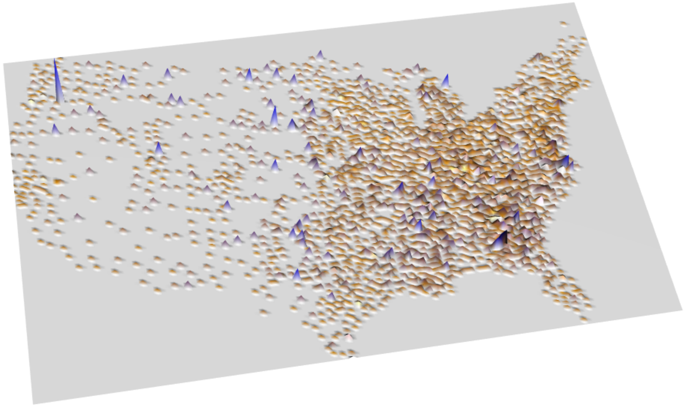

::: article
# Background and introduction

The traditional autologistic model [@Besa:near:1972] and areal GLMM
[@Besa:York:Moll:baye:1991] have enjoyed widespread popularity: they
have been applied thousands of times in many fields, e.g., epidemiology,
marketing, agriculture, ecology, forestry, geography, and image
analysis. But it was recently discovered that both models are spatially
confounded [@Caragea:2009p778; @CLAYTON:1993p1156]. This confounding can
cause bias and/or variance inflation in the estimators of regression
coefficients, leading to erroneous regression inference. This is a
serious drawback because many spatial modelers are interested in
regression (rather than, or in addition to, prediction).

To address the confounding of the traditional autologistic model,
@Caragea:2009p778 devised the centered autologistic model, so named
because it replaces the traditional model's autocovariate with a
centered autocovariate (see below for details).

The confounding of the mixed model was first addressed by
@Reich:2006p1157 using a technique now known as restricted spatial
regression [@Hodges:2010p1158]. This technique alleviates spatial
confounding and also yields a faster mixing Markov chain, but the
computational burden remains high because the dimension of the spatial
random effects is reduced only slightly relative to the traditional
model. By using the so called Moran operator, @sglmm were able to
reparameterize the mixed model in a way that not only improves
regression inference but also dramatically reduces the dimension of the
random effects. The resulting model, which we will call the sparse
SGLMM, can be fitted so efficiently that even the largest areal datasets
can be analyzed quickly.

These promising new models cannot be applied using existing software,
and so we have provided support for the models in version 1.0 of R
package [*ngspatial*](https://CRAN.R-project.org/package=ngspatial), the
subject of this article. First we discuss the two models in some detail.
Then we present *ngspatial* 1.0, which permits composite likelihood and
Bayesian inference for the centered autologistic model, and Bayesian
inference for the sparse SGLMM. We conclude with a summary.

# The models supported by *ngspatial* 1.0 {#models}

## Areal models

The autologistic model and the sparse SGLMM are areal models, i.e.,
models for data observed at the vertices of a graph $G=(V,E)$, where
$V=\{1,2,\dots,n\}$ are the vertices, and $E\subset V\times V$ are the
edges. Each vertex of $G$ represents an areal unit, i.e., an area over
which measurements have been aggregated. For example, areal units could
be counties, census tracts, voxels, pixels, or provinces. An edge
$(i,j)$ of $G$ represents the spatial adjacency of areal units $i$ and
$j$. Typically, two areal units are considered adjacent if they share a
boundary, but other definitions are possible. We will assume that $G$ is
undirected and free of loops and parallel edges.

## The centered autologistic model {#autolog}

The traditional autologistic model was proposed by @Besa:near:1972. The
model is a Markov random field (MRF) model [@kindermann1980markov],
which is to say that $G$ describes conditional independencies among the
random variables $Z_i\;(i=1,\dots,n)$ associated with $V$. For the
autologistic model, the $i$th observation is Bernoulli distributed
conditional on its neighbors:
$$\log\frac{\mathbb{P}(Z_i=1\mid\{Z_j:(i,j)\in E\})}{\mathbb{P}(Z_i=0\mid\{Z_j:(i,j)\in E\})}=\boldsymbol{x}_i^\prime\boldsymbol{\beta}+\eta\sum_{j:(i,j)\in E}Z_j,$$
where $\boldsymbol{x}_i$ is a $p$-vector of spatial predictors
associated with the $i$th areal unit, $\boldsymbol{\beta}$ is a
$p$-vector of spatial regression coefficients, $\eta$ is a spatial
dependence parameter, and $\sum Z_j$ is the so called autocovariate.

We see that $\eta$ is a measure of $Z_i$'s reactivity to its neighbors.
If $\eta=0$, the model reduces to the ordinary Bernoulli GLM, while
$\eta>0$ ($<0$) corresponds to positive (negative) spatial dependence.
We will assume that $\eta>0$ since the model is usually applied to
phenomena that exhibit spatial attraction rather than repulsion.

@Caragea:2009p778 showed that the traditional autologistic model is
confounded. This is because the traditional autocovariate is not well
suited to the task of fitting small-scale structure in the data, i.e.,
clustering induced by spatial dependence and residual to the large-scale
structure $\boldsymbol{x}^\prime\boldsymbol{\beta}$. Instead, the
traditional autocovariate and the spatial predictors "compete" to
explain the data, which prevents the model from isolating the role of
the spatial predictors.

@Caragea:2009p778 reparameterized the model by centering the
autocovariate. The resulting conditional log odds are
$$\log\frac{\mathbb{P}(Z_i=1\mid\{Z_j:(i,j)\in E\})}{\mathbb{P}(Z_i=0\mid\{Z_j:(i,j)\in E\})}=\boldsymbol{x}_i^\prime\boldsymbol{\beta}+\eta\sum_{j:(i,j)\in E}(Z_j-\mu_j),$$
where
$\mu_j=\{1+\exp(-\boldsymbol{x}_j^\prime\boldsymbol{\beta})\}^{-1}$ is
the independence expectation of $Z_j$. Centering allows the
autocovariate to fit only residual structure so that fitting the
large-scale structure is left to the regression term. Thus the centered
model restores to $\boldsymbol{\beta}$ and $\eta$ their desired
interpretations as regression coefficients and dependence parameter,
respectively.

Maximum likelihood and Bayesian inference for the autologistic model are
complicated by an intractable normalizing function. To see this, first
let $\boldsymbol{Z}=(Z_1,\dots,Z_n)^\prime$; let $\mathbf{X}$ be the
design matrix; let $\mathbf{A}=[1\{(i,j)\in E\}]$ be the adjacency
matrix of $G$, where $1\{\cdot\}$ is the indicator function; let
$\boldsymbol{\theta}=(\boldsymbol{\beta}^\prime,\eta)^\prime$ be the
full parameter vector; and let
$\boldsymbol{\mu}=(\mu_1,\dots,\mu_n)^\prime$ be the vector of
independence expectations. Then, assuming $G$ has clique number 2, the
joint pmf of the centered model is

$$\begin{aligned}
\label{eq:autolik}
\pi(\boldsymbol{Z}\mid\boldsymbol{\theta}) = c(\boldsymbol{\theta})^{-1}\exp\left(\boldsymbol{Z}^\prime \mathbf{X}\boldsymbol{\beta}- \eta \boldsymbol{Z}^\prime \mathbf{A}\boldsymbol{\mu}+ \frac{\eta}{2}\boldsymbol{Z}^\prime \mathbf{A}\boldsymbol{Z}\right),  
\end{aligned}  (\#eq:autolik)  $$

where
$$c(\boldsymbol{\theta})=\sum_{\boldsymbol{Y}\in\{0,1\}^n}\exp\left(\boldsymbol{Y}^\prime \mathbf{X}\boldsymbol{\beta}- \eta \boldsymbol{Y}^\prime \mathbf{A}\boldsymbol{\mu}+ \frac{\eta}{2}\boldsymbol{Y}^\prime \mathbf{A}\boldsymbol{Y}\right)$$
is the normalizing function [@Hughes:2011p1280].

The normalizing function is intractable for all but the smallest
datasets because the sample space $\{0,1\}^n$ contains $2^n$ points. Our
package offers two ways to solve this problem: (1) composite likelihood
inference, which sidesteps $c(\boldsymbol{\theta})$, and (2)
auxiliary-variable MCMC for Bayesian inference, which allows
$c(\boldsymbol{\theta})$ to cancel from the Metropolis-Hastings
acceptance probability. See below for details.

## The sparse spatial generalized linear mixed model {#sglmm}

The traditional SGLMM for areal data---sometimes referred to as the BYM
model---was proposed by @Besa:York:Moll:baye:1991. The BYM model is
hierarchical, inducing spatial dependence by way of a latent autonormal
random vector. Conditional on these spatial random effects, the
observations are independent and follow an ordinary GLM. Specifically,
the transformed conditional means are

$$\begin{aligned}
\label{eq:gmu} 
g(\mu_i)=\boldsymbol{x}_i^\prime\boldsymbol{\beta}+S_i,  
\end{aligned}  (\#eq:gmu)  $$

where $g$ is a link function, $\mu_i=\mathbb{E}(Z_i\mid S_i)$, and $S_i$
is the spatial random effect for the $i$th areal unit.

The most common specification for
$\boldsymbol{S}=(S_1,\dots,S_n)^\prime$ is the so called intrinsic
conditional autoregression (ICAR), a zero-mean Gaussian Markov random
field [GMRF; @GMRFbook] with a singular precision matrix that
corresponds to the intuitively appealing full conditional distributions
$$S_i\mid\{S_j:(i,j)\in E\}\;\;\sim\;\;\mathcal{N}\left(\frac{1}{d_i}\sum_{j:(i,j)\in E}S_j,\;\frac{1}{\tau d_i}\right),$$
where $d_i$ is the degree of vertex $i$ and $\tau>0$ is a smoothing
parameter. These conditionals correspond to the joint distribution
$$\boldsymbol{S}\sim\mathcal{N}\{\boldsymbol{0},(\tau\mathbf{Q})^{-1}\},$$
where $\mathbf{Q}=\mathbf{D}-\mathbf{A}$, with
$\mathbf{D}=\mathop{\mathrm{diag}}(d_i)$. Since $\mathbf{Q}$ is
singular, the BYM model is employed from the Bayesian point of view,
with the ICAR a prior distribution on $\boldsymbol{S}$. Packages
[*CARBayes*](https://CRAN.R-project.org/package=CARBayes)
[@lee2013carbayes] and
[*spdep*](https://CRAN.R-project.org/package=spdep) [@spdep] provide
tools for fitting the ICAR and other CAR models.

@Reich:2006p1157 showed that the BYM model is spatially confounded in
the sense that the random effects can "pollute" the regression manifold
$C(\mathbf{X})$, which can lead to a biased and variance-inflated
posterior for $\boldsymbol{\beta}$. To see this, first let $\mathbf{P}$
be the orthogonal projection onto $C(\mathbf{X})$, so that
$\mathbf{I}-\mathbf{P}$ is the orthogonal projection onto
$C(\mathbf{X})^\perp$. Now eigendecompose $\mathbf{P}$ and
$\mathbf{I}-\mathbf{P}$ to obtain orthogonal bases
($\mathbf{K}_{n\times p}$ and $\mathbf{L}_{n\times(n-p)}$, say) for
$C(\mathbf{X})$ and $C(\mathbf{X})^\perp$. Then (\@ref(eq:gmu)) can be
rewritten as
$$g(\mu_i)=\boldsymbol{x}_i^\prime\boldsymbol{\beta}+\boldsymbol{k}_i^\prime\boldsymbol{\gamma}+\boldsymbol{l}_i^\prime\boldsymbol{\delta},$$
where $\boldsymbol{\gamma}_{p\times 1}$ and
$\boldsymbol{\delta}_{(n-p)\times 1}$ are random coefficients. This form
shows that $\mathbf{K}$ is the source of the confounding, for
$\mathbf{K}$ and $\mathbf{X}$ have the same column space.

Since the columns of $\mathbf{K}$ are merely synthetic predictors (i.e.,
they have no scientific meaning), @Reich:2006p1157 recommend removing
them from the model. The resulting model (henceforth the RHZ model) has
$$g(\mu_i)=\boldsymbol{x}_i^\prime\boldsymbol{\beta}+\boldsymbol{l}_i^\prime\boldsymbol{\delta},$$
so that spatial smoothing is restricted to the orthogonal complement of
$C(\mathbf{X})$. In a subsequent paper, @Hodges:2010p1158 referred to
this technique as restricted spatial regression.

Restricted spatial regression is not only an effective remedy for
confounding but also speeds computing. Because the columns of
$\mathbf{L}$ are orthogonal, the RHZ model's random effects are
approximately *a posteriori* uncorrelated. This yields a fast mixing
Markov chain, and the cost per iteration is reduced because a simple
spherical normal proposal is sufficient for updating the random effects.
But fitting the RHZ model to large areal datasets is still quite
burdensome computationally because the random effects remain high
dimensional.

By taking full advantage of $G$, @sglmm were able to greatly reduce the
number of random effects while also improving regression inference.
@sglmm begin by defining the so called Moran operator for $\mathbf{X}$
with respect to $G$:
$(\mathbf{I}- \mathbf{P})\mathbf{A}(\mathbf{I}- \mathbf{P})$. This
operator appears in the numerator of a generalized form of Moran's $I$,
a popular nonparametric measure of spatial dependence [@Moran:1950p874]:
$$\begin{aligned}
I_\mathbf{X}(\mathbf{A}) &= \frac{n}{\boldsymbol{1}^\prime\mathbf{A}\boldsymbol{1}}\frac{\boldsymbol{Z}^\prime(\mathbf{I}- \mathbf{P})\mathbf{A}(\mathbf{I}- \mathbf{P})\boldsymbol{Z}}{\boldsymbol{Z}^\prime(\mathbf{I}- \mathbf{P})\boldsymbol{Z}}.
\end{aligned}$$ @Boots:2000p914 showed that (1) the (standardized)
spectrum of a Moran operator comprises the possible values for the
corresponding $I_\mathbf{X}(\mathbf{A})$, and (2) the eigenvectors
comprise all possible mutually distinct patterns of clustering residual
to $C(\mathbf{X})$ and accounting for $G$. The positive (negative)
eigenvalues correspond to varying degrees of positive (negative) spatial
dependence, and the eigenvectors associated with a given eigenvalue
($\lambda_i$, say) are the patterns of spatial clustering that data
exhibit when the dependence among them is of degree $\lambda_i$.

In other words, the eigenvectors of the Moran operator form a
multiresolutional spatial basis for $C(\mathbf{X})^\perp$ that exhausts
all possible patterns that can arise on $G$. Since we do not expect to
observe repulsion in the phenomena to which these models are usually
applied, we can use the spectrum of the operator to discard all
repulsive patterns, retaining only attractive patterns for our analysis
(although it can be advantageous to accommodate repulsion
[@Griffith:2006p1579]. The nature of the attractive Moran eigenvectors
is illustrated in Figure [1](#basis).

{#basis width="100%" alt="graphic without alt text"}

By retaining only eigenvectors that exhibit positive spatial dependence,
we can usually reduce the model dimension by at least half *a priori*.
And @sglmm showed that a much greater reduction is possible in practice,
with 50--100 eigenvectors being sufficient for most datasets.

Let $\mathbf{M}_{n\times q}$ contain the first $q\ll n$ eigenvectors of
the Moran operator. Then the sparse SGLMM has first stage
$$g(\mu_i)=\boldsymbol{x}_i^\prime\boldsymbol{\beta}+\boldsymbol{m}_i^\prime\boldsymbol{\delta}_s,$$
where $\boldsymbol{m}_i$ is the $i$th row of $\mathbf{M}$ and
$\boldsymbol{\delta}_s$ is a $q$-vector of random coefficients. This
implies $p+q+1$ model parameters, compared to $p+n+1$ for the
traditional model and $p+(n-p)+1=n+1$ for the RHZ model. This dramatic
reduction in dimension speeds computation considerably, allowing even
the largest areal datasets to be analyzed quickly.

We note that the sparse SGLMM was partly inspired by spatial filtering,
also known as principle coordinates of neighbor matrices. See, e.g.,
@Griffith2003Spatial-Autocor [@dray2006spatial; @borcard2011numerical]
for more information. Package *spdep* provides tools for spatial
filtering.

# Package *ngspatial* {#package}

Package *ngspatial* supports composite likelihood and Bayesian inference
for the centered autologistic model, and Bayesian inference for the
sparse SGLMM. Usage of the package's two main functions, `autologistic`
and `sparse.sglmm`, is simple and intuitive while offering considerable
flexibility.

## Fitting the centered autologistic model

The fitting function for the centered autologistic model is called
`autologistic`. This function returns an object of class
`"autologistic"`. Auxiliary functions `residuals`, `summary`, and `vcov`
accept an object of type `"autologistic"` and return various kinds of
residuals, summarize the fit, and return an estimated covariance matrix,
respectively.

### A fast perfect sampler for the centered autologistic model

A key component of our autologistic framework is function
`rautologistic`, which simulates a draw from a centered autologistic
model. The function has the following signature.

``` r
rautologistic(X, A, theta)
```

The three arguments are as described above. The functions of *ngspatial*
require that an adjacency matrix be binary and symmetric (see function
`isSymmetric` from the *base* package) and of type `matrix`. Note that
package *spdep* provides function `nb2mat`, which constructs an
adjacency matrix from a neighbors list. *spdep* also provides many other
functions that are useful for handling adjacency structures.

This function employs coupling from the past [@Prop:Wils:1996] to
generate a vector distributed exactly according to (\@ref(eq:autolik)).
We use perfect sampling, rather than ordinary MCMC, for two reasons.
First, the MCMC algorithm we use to do Bayesian inference requires that
we draw a perfect sample during each iteration
[@moll:pett:bert:reev:2006]. Were we to use an approximation, the
resulting Markov chain would not necessarily have the true posterior as
its stationary distribution [@Murray:2006p310]. Second, although perfect
sampling can be computationally burdensome, a carefully implemented
perfect sampler is fast enough to permit composite likelihood analysis
of even very large datasets, while obviating convergence diagnosis.

Our perfect sampler was implemented in C++. More specifically, we used
the Armadillo linear algebra library [@Sanderson:2010p1334], which
provides two benefits: (1) intuitive syntax for linear algebra (e.g.,
$\boldsymbol{Z}^\prime\mathbf{X}\boldsymbol{\beta}$ can be computed as
`Z.t() * X * beta`), and (2) speed (Armadillo uses delayed evaluation to
combine multiple operations, thus reducing or eliminating the need for
temporaries). We integrated the C++ and R code using the
[*Rcpp*](https://CRAN.R-project.org/package=Rcpp) and
[*RcppArmadillo*](https://CRAN.R-project.org/package=RcppArmadillo)
packages [@Eddelbuettel:Francois:2011:JSSOBK:v40i08]. We tested our
Armadillo-based sampler in a number of circumstances and found it to be
over three times as fast as an optimal pure R version.

### Composite likelihood inference for the centered autologistic model

One way to overcome the intractability of the normalizing function
$c(\boldsymbol{\theta})$ is to avoid it. This can be accomplished by
considering the so called pseudolikelihood (PL), which is a composite
likelihood [@Lindsay:1988p1155] of the conditional type. Each of the $n$
factors in the pseudolikelihood is the likelihood of a single
observation, conditional on said observation's neighbors:
$$p_i(\boldsymbol{\theta})^{z_i}\{1-p_i(\boldsymbol{\theta})\}^{1-z_i}=\mathbb{P}(Z_i=z_i\mid\{Z_j:(i,j)\in E\})=\frac{\exp[z_i\{\boldsymbol{x}_i^\prime\boldsymbol{\beta}+\eta\mathbf{A}_i(\boldsymbol{Z}-\boldsymbol{\mu})\}]}{1+\exp\{\boldsymbol{x}_i^\prime\boldsymbol{\beta}+\eta\mathbf{A}_i(\boldsymbol{Z}-\boldsymbol{\mu})\}},$$
where $z_i$ is the observed value of $Z_i$, and $\mathbf{A}_i$ is the
$i$th row of $\mathbf{A}$. Since the $p_i$ are free of the normalizing
function, so is the log pseudolikelihood, which is given by

$$\begin{aligned}
\label{eq:logpl}  
\ell_{\text{PL}}(\boldsymbol{\theta}) &= \boldsymbol{Z}^\prime\{\mathbf{X}\boldsymbol{\beta}+\eta\mathbf{A}(\boldsymbol{Z}-\boldsymbol{\mu})\}-\sum_i\log[1+\exp\{\boldsymbol{x}_i^\prime\boldsymbol{\beta}+\eta\mathbf{A}_i(\boldsymbol{Z}-\boldsymbol{\mu})\}].  
\end{aligned}  (\#eq:logpl)  $$

Although (\@ref(eq:logpl)) is not the true log likelihood unless
$\eta=0$, @Besa:stat:1975 showed that the MPLE converges almost surely
to the maximum likelihood estimator (MLE) as the lattice size goes to
$\infty$ (under an infill regime). For small samples the MPLE is less
precise than the MLE (and the Bayes estimator), but point estimation of
$\boldsymbol{\beta}$ is generally so poor for small samples that
precision is unimportant. When the sample size is large enough to permit
accurate estimation of $\boldsymbol{\beta}$, the MPLE is nearly as
precise as the MLE [@Hughes:2011p1280].

We find the MPLE
$\tilde{\boldsymbol{\theta}}=\arg\max \ell_{\text{PL}}(\boldsymbol{\theta})$
by using the `optim` function to minimize
$-\ell_{\text{PL}}(\boldsymbol{\theta})$. Although the Nelder-Mead
simplex algorithm finds the minimum quickly, we opted for the much
faster BFGS method. To speed computation even further, we supply the
score function
$$\nabla\ell_{\text{PL}}(\boldsymbol{\theta})=((\boldsymbol{Z}-\boldsymbol{p})^\prime(\mathbf{I}-\eta\mathbf{A}\mathbf{D})\mathbf{X}, (\boldsymbol{Z}-\boldsymbol{p})^\prime\mathbf{A}(\boldsymbol{Z}-\boldsymbol{\mu}))^\prime,$$
where $\boldsymbol{p}=(p_1,\dots,p_n)^\prime$ and
$\mathbf{D}=\mathop{\mathrm{diag}}\{\mu_i(1-\mu_i)\}$.

Confidence intervals can be obtained using a parametric bootstrap or
sandwich estimation. For the former we generate $b$ samples from
$\pi(\boldsymbol{Z}\mid\tilde{\boldsymbol{\theta}})$ and compute the
MPLE for each sample, thus obtaining the bootstrap sample
$\tilde{\boldsymbol{\theta}}^{(1)},\ldots,\tilde{\boldsymbol{\theta}}^{(b)}$.
Appropriate quantiles of the bootstrap sample are then used to construct
approximate confidence intervals for the elements of
$\boldsymbol{\theta}$.

The second approach for computing confidence intervals is based on
[@varin2011overview]

$$\begin{aligned}
\label{eq:sandwich}  
\sqrt{n}(\tilde{\boldsymbol{\theta}}-\boldsymbol{\theta})\;\Rightarrow\;\mathcal{N}\{\boldsymbol{0},\,\boldsymbol{\mathcal{I}}^{-1}(\boldsymbol{\theta})\boldsymbol{\mathcal{J}}(\boldsymbol{\theta})\boldsymbol{\mathcal{I}}^{-1}(\boldsymbol{\theta})\},  
\end{aligned}  (\#eq:sandwich)  $$

where
$\boldsymbol{\mathcal{I}}^{-1}(\boldsymbol{\theta})\boldsymbol{\mathcal{J}}(\boldsymbol{\theta})\boldsymbol{\mathcal{I}}^{-1}(\boldsymbol{\theta})$
is the so called Godambe sandwich matrix [@godambe1960optimum]. The
"bread" in this sandwich is the inverse of the information matrix
$\boldsymbol{\mathcal{I}}(\boldsymbol{\theta})=-\mathbb{E}\nabla^2\ell_{\text{PL}}(\boldsymbol{\theta})$,
and the "filling" is the variance of the score:
$\boldsymbol{\mathcal{J}}(\boldsymbol{\theta})=\mathbb{E}\nabla\nabla^\prime\ell_{\text{PL}}(\boldsymbol{\theta})$.
We use the observed information (computed by `optim`) in place of
$\boldsymbol{\mathcal{I}}$ and estimate $\boldsymbol{\mathcal{J}}$ using
a parametric bootstrap. For the bootstrap we simulate $b$ samples
$\boldsymbol{Z}^{(1)},\dots,\boldsymbol{Z}^{(b)}$ from
$\pi(\boldsymbol{Z}\mid\tilde{\boldsymbol{\theta}})$ and estimate
$\boldsymbol{\mathcal{J}}$ as
$$\hat{\boldsymbol{\mathcal{J}}}(\tilde{\boldsymbol{\theta}})=\frac{1}{b}\sum_{k=1}^b\nabla\nabla^\prime\ell_{\text{PL}}(\tilde{\boldsymbol{\theta}}\mid\boldsymbol{Z}^{(k)}).$$

Because the bootstrap sample can be generated in parallel (using the
*parallel* package) and little subsequent processing is required, these
approaches to inference are very efficient computationally, even for
large datasets. We note that sandwich estimation is over twice as fast
as the full bootstrap. Moreover, asymptotic inference and bootstrap
inference yield comparable results for practically all sample sizes
because (\@ref(eq:sandwich)) is not, in fact, an asymptotic result. This
is because the log pseudolikelihood is approximately quadratic with
Hessian approximately invariant in law, which implies that the MPLE is
approximately normally distributed irrespective of sample size
[@Geyer2005Le-Cam-Made-Sim].

### Bayesian inference for the centered autologistic model

For Bayesian inference we use the auxiliary-variable MCMC algorithm of
@moll:pett:bert:reev:2006, which allows us to construct a proposal
distribution so that the normalizing constant cancels from the
Metropolis-Hastings ratio. The method requires that we can draw
independent realizations from the unnormalized density for any value of
$\boldsymbol{\theta}$, which we can do using our perfect sampler.

Let
$h(\boldsymbol{Z}\mid\boldsymbol{\theta})=\exp\{Q(\boldsymbol{Z}\mid\boldsymbol{\theta})\}$
denote the unnormalized density, where
$$Q(\boldsymbol{Z}\mid\boldsymbol{\theta})=\boldsymbol{Z}^\prime\mathbf{X}\boldsymbol{\beta}-\eta\boldsymbol{Z}^\prime\mathbf{A}\boldsymbol{\mu}+\frac{\eta}{2}\boldsymbol{Z}^\prime\mathbf{A}\boldsymbol{Z}$$
is the so called negpotential function; let $\boldsymbol{Y}\in\Omega$
denote the auxiliary variable; and let $f(\cdot)$ denote a prior
distribution. Then the Metropolis-Hastings random walk acceptance
probability for the algorithm of @moll:pett:bert:reev:2006 is given by
$$\begin{aligned}
\alpha &= \frac{h(\boldsymbol{Y}^*\,|\,\tilde{\boldsymbol{\theta}})h(\boldsymbol{Z}\,|\,\boldsymbol{\theta}^*)h(\boldsymbol{Y}\,|\,\boldsymbol{\theta})f(\boldsymbol{\theta}^*)}{h(\boldsymbol{Y}\,|\,\tilde{\boldsymbol{\theta}})h(\boldsymbol{Z}\,|\,\boldsymbol{\theta})h(\boldsymbol{Y}^*\,|\,\boldsymbol{\theta}^*)f(\boldsymbol{\theta})}\frac{c(\tilde{\boldsymbol{\theta}})}{c(\tilde{\boldsymbol{\theta}})}\frac{c(\boldsymbol{\theta})}{c(\boldsymbol{\theta}^*)}\frac{c(\boldsymbol{\theta}^*)}{c(\boldsymbol{\theta})}\\
\nonumber&=\frac{h(\boldsymbol{Y}^*\,|\,\tilde{\boldsymbol{\theta}})h(\boldsymbol{Z}\,|\,\boldsymbol{\theta}^*)h(\boldsymbol{Y}\,|\,\boldsymbol{\theta})f(\boldsymbol{\theta}^*)}{h(\boldsymbol{Y}\,|\,\tilde{\boldsymbol{\theta}})h(\boldsymbol{Z}\,|\,\boldsymbol{\theta})h(\boldsymbol{Y}^*\,|\,\boldsymbol{\theta}^*)f(\boldsymbol{\theta})},
\end{aligned}$$ where $\boldsymbol{Y}^*$ is the proposed auxiliary
variable,
$\boldsymbol{\theta}^*=(\boldsymbol{\beta}^{*\prime},\eta^*)^\prime$ is
the proposed $\boldsymbol{\theta}$, and $\tilde{\boldsymbol{\theta}}$ is
the maximum pseudolikelihood estimate of $\boldsymbol{\theta}$. Thus
$\log\alpha$ is

$$\begin{aligned}
\label{eq:logalpha}  
\log\alpha&= Q(\boldsymbol{Y}^*\,|\,\tilde{\boldsymbol{\theta}})-Q(\boldsymbol{Y}^*\,|\,\boldsymbol{\theta}^*)\\
\nonumber& +Q(\boldsymbol{Z}\,|\,\boldsymbol{\theta}^*)-Q(\boldsymbol{Z}\,|\,\boldsymbol{\theta})\\
\nonumber& +Q(\boldsymbol{Y}\,|\,\boldsymbol{\theta})-Q(\boldsymbol{Y}\,|\,\tilde{\boldsymbol{\theta}})\\
\nonumber& +\log f(\boldsymbol{\theta}^*)-\log f(\boldsymbol{\theta})\\
\nonumber &= \boldsymbol{Y}^{*\prime}\mathbf{X}(\tilde{\boldsymbol{\beta}}-\boldsymbol{\beta}^*)+\frac{\tilde{\eta}-\eta^*}{2}\boldsymbol{Y}^{*\prime}\mathbf{A}\boldsymbol{Y}^*+\eta^*\boldsymbol{Y}^{*\prime}\mathbf{A}\boldsymbol{\mu}^*-\tilde{\eta}\boldsymbol{Y}^{*\prime}\mathbf{A}\tilde{\boldsymbol{\mu}}\\
\nonumber&+\boldsymbol{Z}^\prime\mathbf{X}(\boldsymbol{\beta}^*-\boldsymbol{\beta})+\frac{\eta^*-\eta}{2}\boldsymbol{Z}^\prime\mathbf{A}\boldsymbol{Z}+\eta\boldsymbol{Z}^\prime\mathbf{A}\boldsymbol{\mu}-\eta^*\boldsymbol{Z}^\prime\mathbf{A}\boldsymbol{\mu}^*\\
\nonumber &+\boldsymbol{Y}^\prime\mathbf{X}(\boldsymbol{\beta}-\tilde{\boldsymbol{\beta}})+\frac{\eta-\tilde{\eta}}{2}\boldsymbol{Y}^\prime\mathbf{A}\boldsymbol{Y}+\tilde{\eta}\boldsymbol{Y}^\prime\mathbf{A}\tilde{\boldsymbol{\mu}}-\eta\boldsymbol{Y}^\prime\mathbf{A}\boldsymbol{\mu}\\
\nonumber&+\log f(\boldsymbol{\theta}^*)-\log f(\boldsymbol{\theta}).  
\end{aligned}  (\#eq:logalpha)  $$

Because the auxiliary proposals cannot be generated in parallel, this
approach to Bayesian analysis is computationally expensive. Our
optimized perfect sampler eases the burden somewhat, as does our
Armadillo implementation of (\@ref(eq:logalpha)). We achieve an
additional gain in efficiency as follows.

We use a normal random walk Metropolis-Hastings algorithm, and so our
proposal for $\boldsymbol{\theta}$ is $(p+1)$-variate normal, i.e.,
$\boldsymbol{\theta}^{*(k+1)}\mid\boldsymbol{\theta}^{*(k)}\sim\mathcal{N}_{p+1}(\boldsymbol{\theta}^{*(k)},\mathbf{\Sigma})$,
for a suitably chosen covariance matrix $\mathbf{\Sigma}$. Taking
$\mathbf{\Sigma}=\tau^2\mathbf{I}$ tends to result in a low acceptance
rate unless $\tau^2$ is quite small, in which case a long run is
required to adequately explore the posterior. Instead, we begin by using
$$\mathbf{\Sigma}_0=\begin{pmatrix}
\hat{\mathbf{\Sigma}}_{\text{GLM}} & \boldsymbol{0}\\
\boldsymbol{0}& 0.01
\end{pmatrix},$$ where $\hat{\mathbf{\Sigma}}_{\text{GLM}}$ is the
estimated asymptotic covariance matrix for $\hat{\boldsymbol{\beta}}$
obtained from fitting the ordinary logistic model to the data. We use
$\mathbf{\Sigma}_0$ for a training run (the number of iterations can be
chosen by the user), and then we use the posterior sample covariance
matrix from the training run as the proposal covariance matrix for a
subsequent run. We use the latter sample to do inference. The training
run usually results in a much better mixing chain, which reduces the
total number of iterations. Still, rigorous Bayesian inference
(following @moll:pett:bert:reev:2006) is impractical for large lattices
because perfect sampling does not scale well.

As for the prior $f(\boldsymbol{\theta})$, we assume that
$\boldsymbol{\beta}$ and $\eta$ are *a priori* independent, i.e.,
$f(\boldsymbol{\theta})=f_1(\boldsymbol{\beta})f_2(\eta)$. The prior for
$\boldsymbol{\beta}$ is
$\mathcal{N}(\boldsymbol{0},\sigma^2\mathbf{I})$. The common standard
deviation defaults to 1,000 but can be specified by the user via control
parameter `sigma`. The prior for $\eta$ is
$\mathcal{U}(0,\eta^{\text{max}})$. The right endpoint defaults to 2 but
can be chosen by the user via control parameter `eta.max`.

### Usage examples for the centered autologistic model

Now we present some usage examples for the autologistic model. The
fitting function is called `autologistic` and has the following
signature.

``` r
autologistic(formula, data, A, method = c("PL", "Bayes"), model = TRUE, x = FALSE, 
  y = FALSE, verbose = FALSE, control = list())
```

Arguments `formula`, `data`, `model`, `x`, and `y` are analogous to
those that appear in the signatures of other commonly used R model
fitting functions, e.g., `lm` and `glm`. `A` is of course the binary
adjacency matrix for $G$. The `method` argument is used to select
pseudolikelihood inference or Bayesian inference. If `verbose` is equal
to `TRUE`, various messages may be sent to the standard output stream.
Most of those messages have to do with the default values for control
parameters that were not set by the user via the `control` argument.

For the following example the underlying graph is the $50\times 50$
square lattice. First the corresponding adjacency matrix is constructed.
Then the vertices are assigned coordinates restricted to the unit square
centered at the origin. The vertex locations are used as spatial
covariates, with regression coefficients
$\boldsymbol{\beta}=(2,2)^\prime$. The resulting independence
expectations $\boldsymbol{\mu}=\mathbf{X}\boldsymbol{\beta}$, which
range from approximately 0.1 to approximately 0.9, are level plotted in
grayscale to show that the large-scale structure corresponds to a
probability gradient that increases as one moves from southwest to
northeast. Then, for $\eta=0.6$, a dataset is simulated and plotted. The
dataset is then fitted using the PL method, and no confidence intervals
are computed. Finally, the fit is summarized.

``` r
R> library("ngspatial")
R> library("lattice")
R> n <- 50
R> A <- adjacency.matrix(n)
R> x <- rep(0:(n - 1) / (n - 1), times = n) - 0.5
R> y <- rep(0:(n - 1) / (n - 1), each = n) - 0.5
R> X <- cbind(x, y)
R> beta <- c(2, 2)
R> mu <- exp(X %*% beta)
R> mu <- mu / (1 + mu)
R> col1 <- "white"
R> col2 <- "black"
R> colfunc <- colorRampPalette(c(col1, col2))
R> dev.new()
R> levelplot(mu ~ x * y, aspect = "iso", col.regions = colfunc(n^2))
R> theta <- c(beta, eta = 0.6)
R> set.seed(123456)
R> Z <- rautologistic(X, A, theta)
R> dev.new()
R> levelplot(Z ~ x * y, aspect = "iso", col.regions = c("white", "black"), 
+            colorkey = FALSE)
R> fit <- autologistic(Z ~ X - 1, A = A, control = list(confint = "none"))
R> summary(fit)

Call:

autologistic(formula = Z ~ X - 1, A = A, control = list(confint = "none"))

Control parameters:
            
confint none

Coefficients:

    Estimate Lower Upper MCSE
Xx     1.846    NA    NA   NA
Xy     1.920    NA    NA   NA
eta    0.483    NA    NA   NA

Number of iterations: 0 
```

The next two examples compute confidence intervals for the same dataset.
The first example uses the normal approximation. The \"filling\" in the
sandwich matrix is estimated using a parallel parametric bootstrap,
where the computation is distributed across six cores on the host
workstation. The second example computes bootstrap confidence intervals,
where the size of the bootstrap sample is 500. The computation is once
again parallelized.

``` r
R> set.seed(123456)
R> fit <- autologistic(Z ~ X - 1, A = A, verbose = TRUE,
+                      control = list(confint = "sandwich", nodes = 6))
R> summary(fit)

Control parameter 'bootit' must be a positive whole number. Setting it to the default
value of 1,000.

Control parameter 'parallel' must be a logical value. Setting it to the default value
of TRUE.

Control parameter 'type' must be "SOCK", "PVM", "MPI", or "NWS". Setting it to "SOCK".

Warning: Bootstrapping may be time consuming.

Call:

autologistic(formula = Z ~ X - 1, A = A, verbose = TRUE, 
    control = list(confint = "sandwich", nodes = 6))

Control parameters:
                 
confint  sandwich
bootit   1000    
parallel TRUE    
type     SOCK    
nodes    6       

Coefficients:

    Estimate  Lower  Upper MCSE
Xx     1.846 1.4630 2.2300   NA
Xy     1.920 1.5410 2.2990   NA
eta    0.483 0.3619 0.6042   NA

Number of iterations: 1000 
```

``` r
R> set.seed(123456)
R> fit <- autologistic(Z ~ X - 1, A = A, verbose = TRUE,
+                      control = list(confint = "bootstrap", bootit = 500, nodes = 6))
R> summary(fit)

Control parameter 'parallel' must be a logical value. Setting it to the default value
of TRUE.

Control parameter 'type' must be "SOCK", "PVM", "MPI", or "NWS". Setting it to "SOCK".

Warning: Bootstrapping may be time consuming.

Call:

autologistic(formula = Z ~ X - 1, A = A, verbose = TRUE, 
    control = list(confint = "bootstrap", bootit = 500, nodes = 6))

Control parameters:
                  
confint  bootstrap
bootit   500      
parallel TRUE     
type     SOCK     
nodes    6        

Coefficients:

    Estimate  Lower  Upper     MCSE
Xx     1.846 1.4980 2.2510 0.007607
Xy     1.920 1.5400 2.3270 0.007098
eta    0.483 0.3595 0.6063 0.003406

Number of iterations: 500
```

It took several minutes to run each of the two preceding examples on a
Mac Pro with two quad-core 2.8 GHz Intel Xeon CPUs. Since Bayesian
inference would be prohibitively expensive for a dataset so large, the
next example was run on a dataset for which $G$ was the $20\times 20$
square lattice.

We use, and recommend, fixed-width output analysis
[@fleg:hara:jone:2008]. In fixed-width analysis, one chooses a tolerance
and stops sampling when all Monte Carlo standard errors fall below the
tolerance. The output shown below indicates that the Monte Carlo
standard errors fell below the default tolerance of 0.01 after 714,025
draws were made from the posterior, which is why the analysis was
terminated before having reached the (default) maximum number of
iterations (`maxit = 1e6`). We use the
[*batchmeans*](https://CRAN.R-project.org/package=batchmeans) package
[@batchmeans] to compute Monte Carlo standard errors (denoted `MCSE` in
the output).

In this example we use a training run of length 10,000, and the length
of the subsequent inferential run will be at least 10,000.

``` r
R> n <- 20
R> A <- adjacency.matrix(n)
R> x <- rep(0:(n - 1) / (n - 1), times = n) - 0.5
R> y <- rep(0:(n - 1) / (n - 1), each = n) - 0.5
R> X <- cbind(x, y)
R> set.seed(123456)
R> Z <- rautologistic(X, A, theta)
R> fit <- autologistic(Z ~ X - 1, A = A, verbose = TRUE, method = "Bayes",
+                      control = list(trainit = 10000, minit = 10000))
R> summary(fit)

Control parameter 'tol' must be a positive number. Setting it to the default value
of 0.01.

Control parameter 'maxit' must be a positive whole number greater than or equal to
'minit'. Setting it to 1e+06.

Control parameter 'sigma' must be a positive number. Setting it to the default value
of 1,000.

Control parameter 'eta.max' must be a positive number. Setting it to the default
value of 2.

Warning: MCMC may be time consuming.

Progress => 5%
Progress => 10%
Progress => 15%

Call:

autologistic(formula = Z ~ X - 1, A = A, method = "Bayes", verbose = TRUE, 
    control = list(trainit = 10000, minit = 10000))

Control parameters:
             
trainit 1e+04
tol     1e-02
minit   1e+04
maxit   1e+06
sigma   1e+03
eta.max 2e+00

Coefficients:

    Estimate  Lower  Upper     MCSE
Xx    2.4450 1.2120 3.667 0.009917
Xy    1.6800 0.4767 2.832 0.009800
eta   0.7363 0.4805 1.028 0.002631

Number of iterations: 714025 
```

The object returned by function `autologistic` is a list with many
useful elements. The following output resulted from applying the `names`
function to the object returned in the second example above.

``` r
R> names(fit)

 [1] "coefficients"  "fitted.values"  "linear.predictors"  "residuals"  "convergence"      
 [6] "message"       "value"          "iter"               "sample"     "mcse"             
[11] "xlevels"       "call"           "terms"              "method"     "control"          
[16] "model" 
```

The standard `coef` and `fitted` functions can be applied to an object
of type '`autologistic`Ṫhe `residuals` method for '`autologistic`'
objects can be used to extract deviance (default), Pearson, or response
residuals.

``` r
R> library(lattice)
R> dev.new()
R> levelplot(fitted(fit) ~ x * y, aspect = "iso", col.regions = colfunc(n^2))
R> dev.new()
R> levelplot(residuals(fit) ~ x * y, aspect = "iso", col.regions = colfunc(n^2))
R> dev.new()
R> levelplot(residuals(fit, type = "pearson") ~ x * y, aspect = "iso",
+            col.regions = colfunc(n^2))
R> dev.new()
R> levelplot(residuals(fit, type = "response") ~ x * y, aspect = "iso",
+            col.regions = colfunc(n^2))
```

Other fields of interest are `value`, which contains
$-\ell_{\text{PL}}(\tilde{\boldsymbol{\theta}})$, and `sample`, which
contains the bootstrap or posterior sample.

## Fitting the sparse SGLMM

The fitting function for the sparse SGLMM is called `sparse.sglmm`. The
function returns an object of class `"sparse.sglmm"`. Auxiliary
functions `residuals`, `summary`, and `vcov` accept an object of type
`"sparse.sglmm"` and return various kinds of residuals, summarize the
fit, and return an estimated covariance matrix, respectively.

### Bayesian inference for the sparse SGLMM

The second stage of the sparse SGLMM, i.e., the prior for
$\boldsymbol{\delta}_s$, is
$$f(\boldsymbol{\delta}_s\mid\tau_s)\propto\tau_s^{q/2}\exp\left(-\frac{\tau_s}{2}\boldsymbol{\delta}_s^\prime\mathbf{M}^\prime\mathbf{Q}\mathbf{M}\boldsymbol{\delta}_s\right),$$
where $\tau_s$ is a smoothing parameter. The prior for
$\boldsymbol{\beta}$ is spherical $p$-variate normal with mean zero and
common variance `sigma.b`, which defaults to 1,000 but can be controlled
by the user via argument `hyper`. The prior for $\tau_s$ is gamma with
parameters 0.5 and 2,000 [@Kelsall1999Discussion-of-B]. This prior is
attractive because it corresponds to the prior belief that the fixed
effects are sufficient to explain the data (since a large value for
$\tau_s$ implies small variances for the random effects) and because it
discourages artifactual spatial structure in the posterior.

When the response is normally distributed, the identity link is assumed,
in which case the first stage is
$$\boldsymbol{\mu}=\mathbf{X}\boldsymbol{\beta}+\mathbf{M}\boldsymbol{\delta}_s+\mathbf{M}\boldsymbol{\delta}_h,$$
where $\boldsymbol{\delta}_h$ are heterogeneity random effects. When the
response is Poisson distributed, heterogeneity random effects are
optional. In any case, the prior on $\boldsymbol{\delta}_h$ is spherical
$q$-variate normal with mean zero and common variance $1/\tau_h$. The
prior for $\tau_h$ is gamma with parameters `a.h` and `b.h`. The default
values for these parameters are 0.01 and 100, respectively, or their
values can be set by the user through argument `hyper`.

If the response is Bernoulli or Poisson, $\boldsymbol{\beta}$ and
$\boldsymbol{\delta}_s$ are updated using Metropolis-Hastings random
walks with normal proposals. The proposal covariance matrix for
$\boldsymbol{\beta}$ is the estimated asymptotic covariance matrix from
a `glm` fit to the data. The proposal for $\boldsymbol{\delta}_s$ is
spherical normal with common standard deviation `sigma.s`. If the
response is Poisson distributed and heterogeneity random effects are
included, those random effects are updated using a Metropolis-Hastings
random walk with a spherical normal proposal. The common standard
deviation is `sigma.h`. Both `sigma.s` and `sigma.h` default to 0.01,
but they can be set via argument `tune`.

The updates for $\tau_s$ and $\tau_h$ are Gibbs updates irrespective of
the response distribution. If the response is normally distributed, all
updates are Gibbs updates.

### Usage examples for the sparse SGLMM

Function `sparse.sglmm` has the following signature.

``` r
sparse.sglmm(formula, family = gaussian, data, offset, A, attractive = 50,
  repulsive = 0, tol = 0.01, minit = 10000, maxit = 1e+06, tune = list(), 
  hyper = list(), model = TRUE, x = FALSE, y = FALSE, verbose = FALSE)
```

Most of the arguments are analogous to those already described above.
Arguments `attractive` and `repulsive` are used to select the number of
Moran eigenvectors. Both attractive and repulsive eigenvectors are
permitted, although `repulsive` defaults to 0, which corresponds to pure
spatial smoothing. Function `sparse.sglmm` checks the validity of
`attractive` and `repulsive` by eigendecomposing the Moran operator and
examining the spectrum. Execution is terminated (with an informative
error message) if either value is invalid. Arguments `tune` and `hyper`
can be used to supply values for tuning parameters and hyperparameters,
respectively, as described above.

We will illustrate the usage of our sparse SGLMM function by analyzing
the data shown in Figure [2](#infant). The plot shows infant mortality
data for 3,071 US counties. Each shaded peak represents a ratio of
deaths to births, i.e., an empirical infant mortality rate, for a given
county. The data were obtained from the 2008 Area Resource File (ARF), a
county-level database maintained by the Bureau of Health Professions,
Health Resources and Services Administration, US Department of Health
and Human Services. Specifically, three variables were extracted from
the ARF: the three-year (2002--2004) average number of infant deaths
before the first birthday, the three-year average number of live births,
and the three-year average number of low birth weight infants.

{#infant
width="100%" alt="graphic without alt text"}

To these data we fit the sparse Poisson SGLMM with

$$\begin{aligned}
\label{eq:infantmod}  
\log\mathbb{E}({\rm\small DEATHS}_i\,|\,\boldsymbol{\beta},\boldsymbol{\delta}_s) &= \log{\rm\small BIRTHS}_i+\beta_0+\beta_1\,{\rm\small LOW}_i+\beta_2\,{\rm\small BLACK}_i+\beta_3\,{\rm\small HISP}_i+\beta_4\,{\rm\small GINI}_i\\
&+\beta_5\,{\rm\small AFF}_i+\beta_6\,{\rm\small STAB}_i+\boldsymbol{m}_i^\prime\boldsymbol{\delta}_s, 
\end{aligned}  (\#eq:infantmod)  $$

where [deaths]{.smallcaps} is the number of infant deaths;
[births]{.smallcaps} is the number of live births; [low]{.smallcaps} is
the rate of low birth weight; [black]{.smallcaps} is the percentage of
black residents (according to the 2000 US Census); [hisp]{.smallcaps} is
the percentage of hispanic residents (2000 US Census);
[gini]{.smallcaps} is the Gini coefficient, a measure of income
inequality [@{Gini1921Measurement-of-}]; [aff]{.smallcaps} is a
composite score of social affluence [@Yang:2009p918]; and
[stab]{.smallcaps} is residential stability, an average $z$-score of two
variables from the 2000 US Census.

These data were analyzed previously in @sglmm, where it was found that
the model with 50 attractive eigenvectors yields the smallest value of
DIC among the sequence of models with 25, 50, 100, and 200 attractive
eigenvectors. The following code duplicates the analysis of @sglmm.

``` r
R> data(infant)
R> infant$low_weight <- infant$low_weight / infant$births
R> attach(infant)
R> Z <- deaths
R> X <- cbind(1, low_weight, black, hispanic, gini, affluence, stability)
R> data(A)
R> set.seed(123456)
R> fit <- sparse.sglmm(Z ~ X - 1 + offset(log(births)), family = poisson, A = A,
+                      tune = list(sigma.s = 0.02), verbose = TRUE)
R> summary(fit)

Hyperparameter 'sigma.b' must be a positive number. Setting it to the default
value of 1,000.

The Moran operator is being eigendecomposed. This operation may be time consuming.

Warning: MCMC may be time consuming.

Progress => 5%
.
.
.
Progress => 100%

Call:

sparse.sglmm(formula = Z ~ X - 1 + offset(log(births)), family = poisson, 
    A = A, tune = list(sigma.s = 0.02), verbose = TRUE)

Tuning parameters:
            
sigma.s 0.02

Hyperparameters:
            
sigma.b 1000

Coefficients:

             Estimate     Lower     Upper      MCSE
X           -5.435000 -5.621000 -5.250000 9.466e-04
Xlow_weight  8.821000  7.552000 10.050000 5.673e-03
Xblack       0.004184  0.002864  0.005545 6.568e-06
Xhispanic   -0.003792 -0.004870 -0.002678 6.342e-06
Xgini       -0.553200 -0.984300 -0.126000 2.070e-03
Xaffluence  -0.075600 -0.087760 -0.063740 5.148e-05
Xstability  -0.028670 -0.043350 -0.013980 6.360e-05

DIC: 10110 

Number of iterations: 1000000 
```

The analysis took just under two hours. Fitting the RHZ model to these
data took approximately two weeks and required over 40 GB of secondary
storage.

We also used *CARBayes* to apply the ICAR model to these data. The
results for the two fits are shown together in Table [1](#tabinfant). We
see that the ICAR fit suffers from spatial confounding. Specifically,
some of the ICAR point estimates differ markedly from the sparse SGLMM
estimates, the ICAR intervals are wider, and the Gini coefficient is not
a significant predictor in the ICAR fit.

::: {#tabinfant}
  ------------ -------------- -------------------- ---------- --------------------
                 Sparse SGLMM                            ICAR 

  Covariate          Estimate   95% HPD Interval     Estimate   95% HPD Interval

  Intercept          $-5.435$  $(-5.621, -5.250)$    $-5.558$  $(-5.766, -5.354)$

  Low Weight            8.821   (7.552, 10.050)         7.754    (6.396, 9.112)

  Black                 0.004    (0.003, 0.006)         0.004    (0.002, 0.006)

  Hispanic           $-0.004$  $(-0.005, -0.003)$    $-0.003$  $(-0.005, -0.002)$

  Gini               $-0.553$  $(-0.984, -0.126)$    $-0.079$  $(-0.554, 0.406)$

  Affluence          $-0.076$  $(-0.088, -0.064)$    $-0.077$  $(-0.091, -0.063)$

  Stability          $-0.029$  $(-0.043, -0.014)$    $-0.042$  $(-0.060 -0.024)$
  ------------ -------------- -------------------- ---------- --------------------

  : Table 1: Results for sparse SGLMM and ICAR fits to the infant
  mortality data.
:::

The object returned by function `sparse.sglmm` is a list. The following
output resulted from applying the `names` function to the object
produced in the example above.

``` r
R> names(fit)

 [1] "coefficients"  "fitted.values"  "linear.predictors"  "residuals"   "beta.sample"      
 [6] "gamma.sample"  "tau.s.sample"   "beta.mcse"          "gamma.mcse"  "tau.s.mcse"       
[11] "gamma.est"     "tau.s.est"      "iter"               "D.bar"       "pD"               
[16] "dic"           "beta.accept"    "gamma.accept"       "xlevels"     "call"             
[21] "terms"         "formula"        "family"             "offset"      "model"            
[26] "tune"          "hyper" 
```

The standard `coef` and `fitted` functions can be applied to an object
of type '`sparse.sglmm`'. The `residuals` method for '`sparse.sglmm`'
objects can be used to extract deviance (default), Pearson, or response
residuals.

Other particularly useful fields include `beta.sample`, `gamma.sample`,
and `tau.s.sample`, which contain the posterior samples for
$\boldsymbol{\beta}$, $\boldsymbol{\delta}_s$, and $\tau_s$,
respectively. (The package uses $\boldsymbol{\gamma}$ and
$\boldsymbol{\delta}$, respectively, in place of $\boldsymbol{\delta}_s$
and $\boldsymbol{\delta}_h$. This paper has used $\boldsymbol{\delta}_s$
and $\boldsymbol{\delta}_h$ because here it was necessary to present the
RHZ model, which is not discussed in the package documentation.) Monte
Carlo standard errors are also returned, as are acceptance rates.

# Conclusion {#end}

This article introduced version 1.0 of R package *ngspatial*, which
supports two promising new models for areal data, namely, the centered
autologistic model and the sparse SGLMM. The package is user friendly
because its model-fitting functions and auxiliary functions were
designed to behave like the analogous functions (e.g., `lm`, `glm`,
`summary`) in the *stats* package. The package is also efficient because
the code uses vector and matrix operations where possible, and because
key portions of the code were written in C++.

# Acknowledgments

This work was supported by a University of Minnesota Grant-in-Aid of
Research, Artistry, and Scholarship.

\
:::
