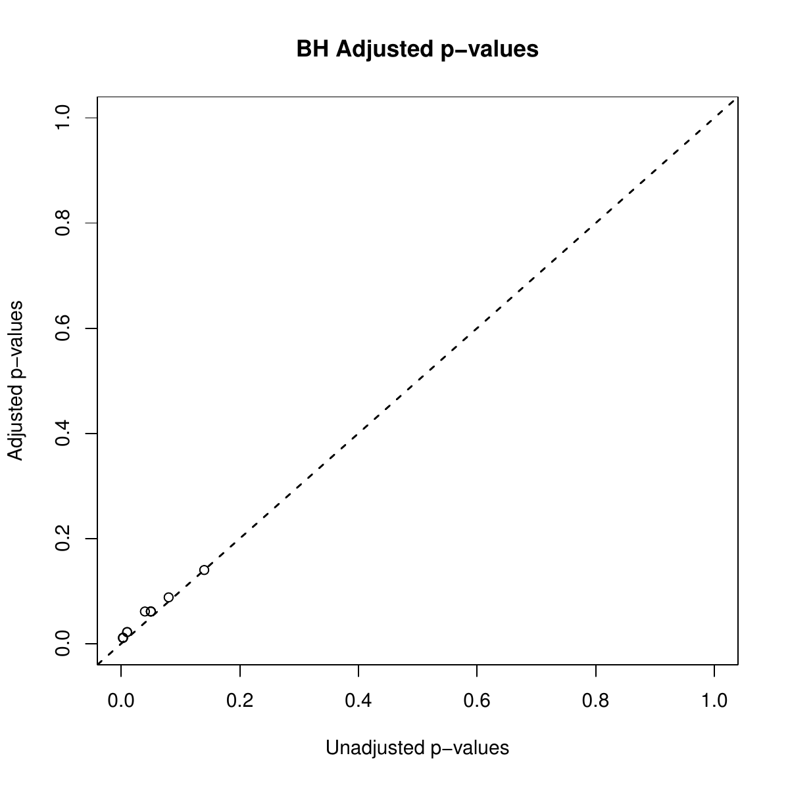
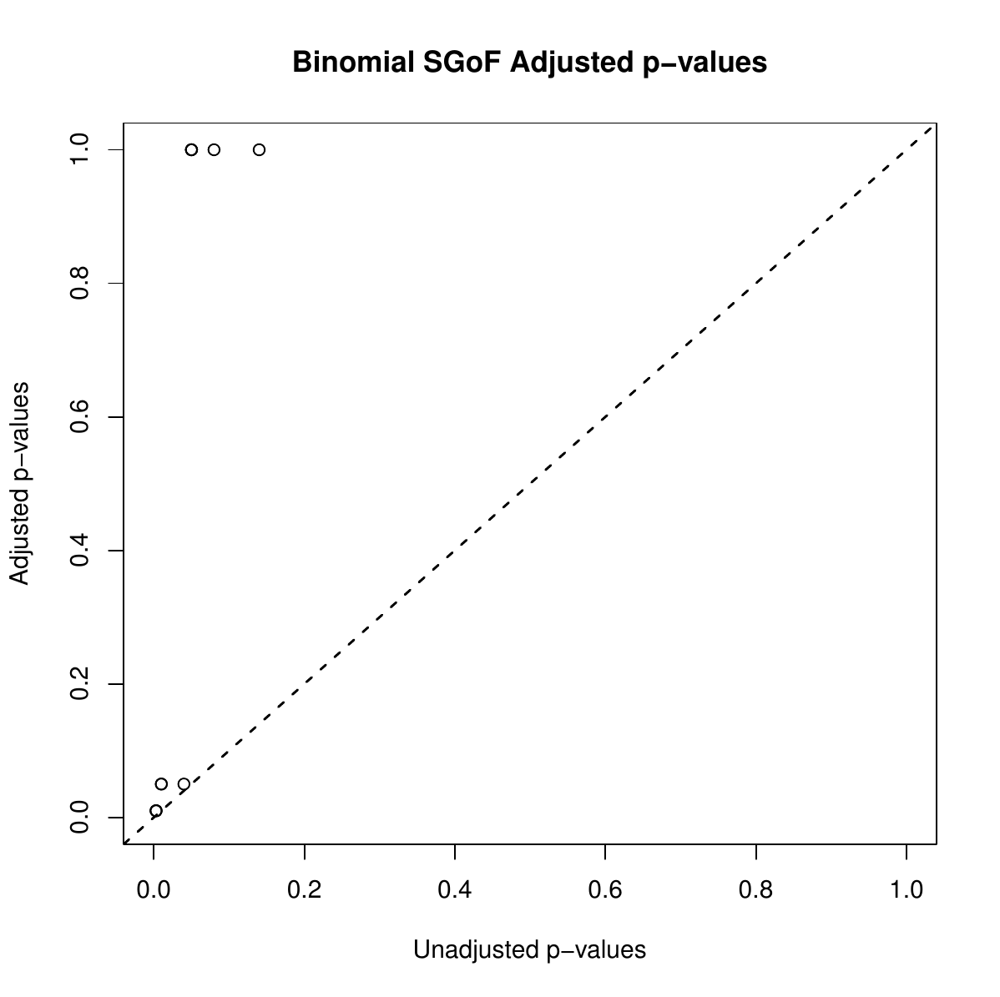
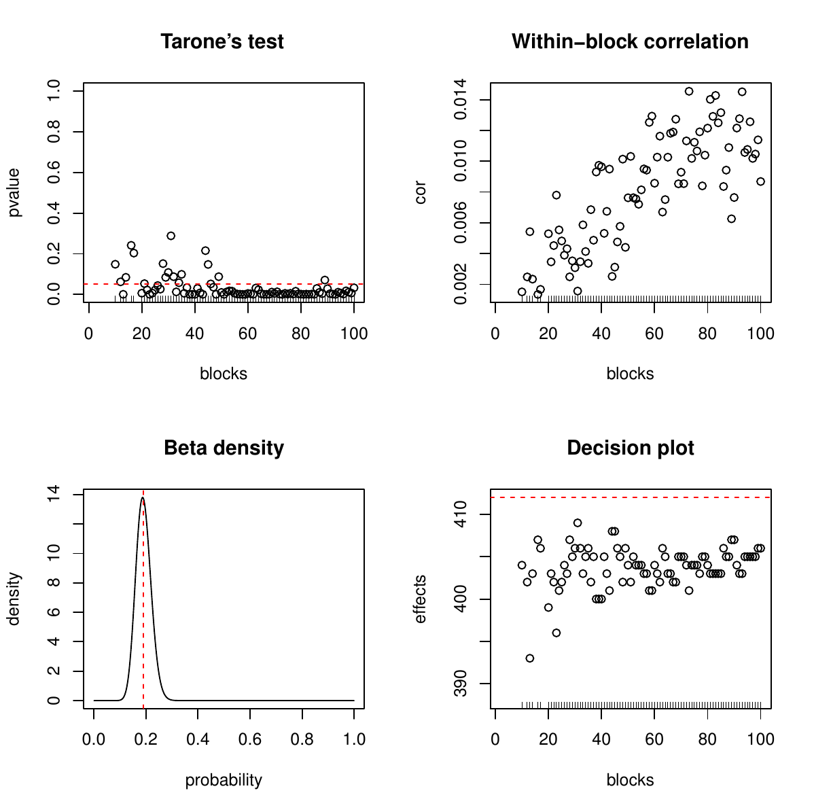
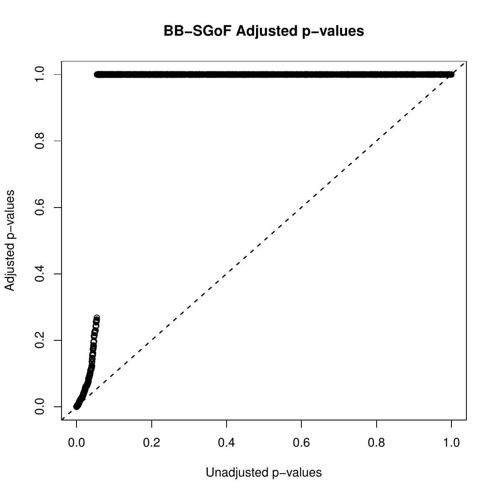
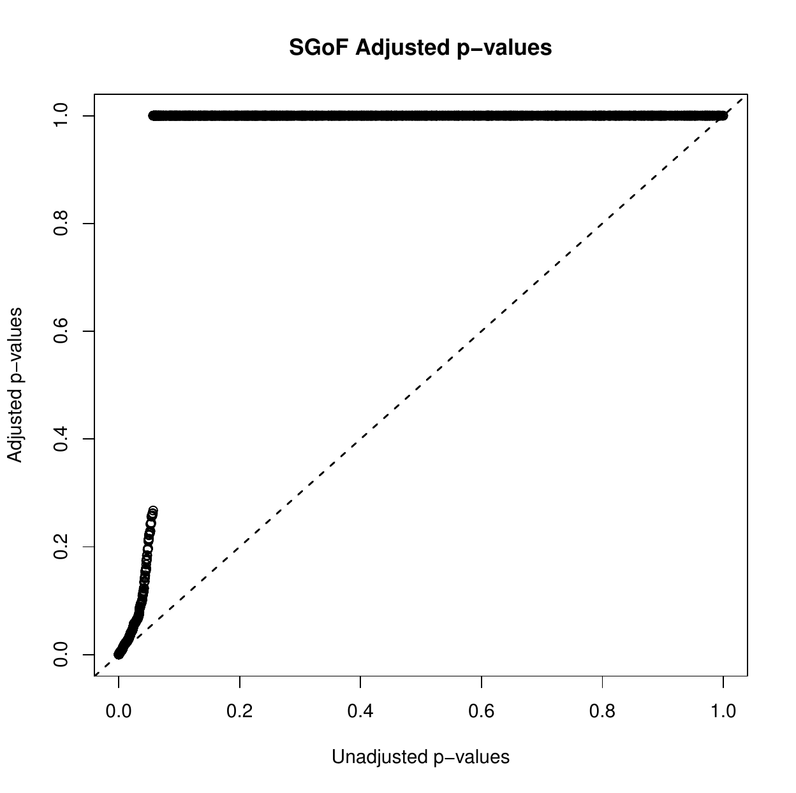
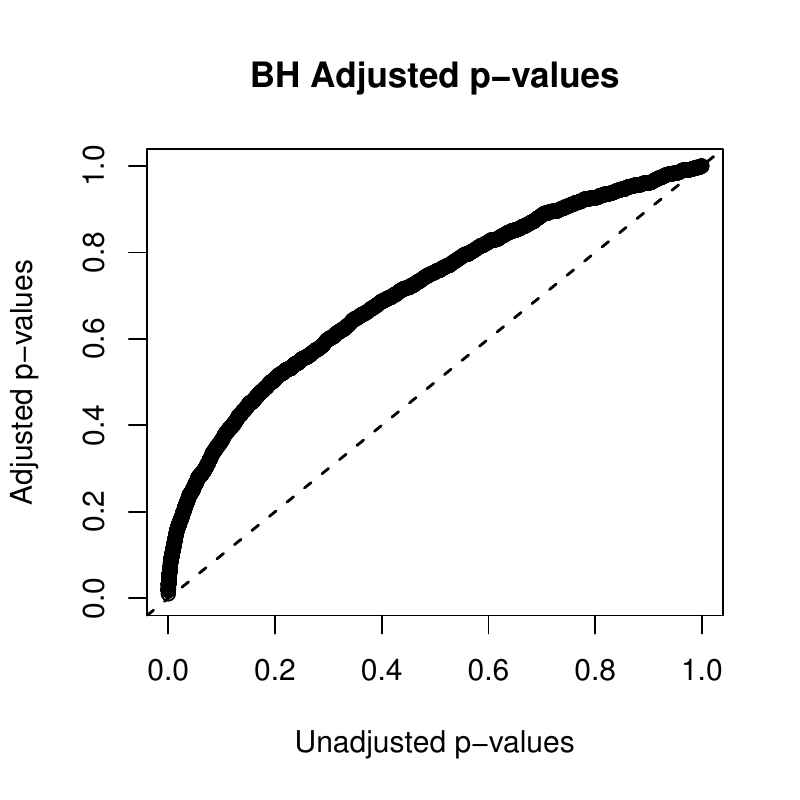

::: article
# Introduction

Multiple testing refers to any instance that involves the simultaneous
testing of several null hypotheses, i.e.,

\begin{aligned}
     H_{01}, H_{02}, \ldots, H_{0n}.
   
\end{aligned}

Nowadays, we find many statistical inference problems in areas such as
genomics and proteomics which involve the simultaneous testing of
thousands of null hypotheses producing as a result a number of
significant $p$ values or effects (an increase in gene expression, or
RNA/protein levels). Moreover, these hypotheses may have complex and
unknown dependence structures. An example from genomics is the following
one involving the nulls:

$H_{0i}$: Gene i is equally expressed in groups A and B
$(i = 1,2, \ldots ,n)$.

The goal here is to decide which $H_{0i}$ are false, based on the
$p$ values, $u_{1}, u_{2}, \ldots, u_{n}$, corresponding to a suitable
test statistic (e.g., a t-test for comparison of normally distributed
'gene expression levels').

It is well known that the smaller the $p$ value $u_{i}$, the greater the
evidence against $H_{0i}$ and, individually, $H_{0i}$ is rejected at
level $\alpha$ when $u_{i} \leq \alpha$. One of the main problems in
multiple hypothesis testing is that, if one does not take the
multiplicity of tests into account, then the probability that some of
the true null hypotheses are rejected may be overly large. So, in the
multiple testing setting, a specific procedure for deciding which null
hypotheses should be rejected is needed. In this sense, the family-wise
error rate (FWER) and the false discovery rate (FDR) have been proposed
as suitable significance criteria to perform the multiple testing
adjustment. See [@BH], [@NH] or [@DV] for more information. But the FDR
and FWER based methods have the drawback of a rapidly decreasing power
as the number of tests grows, being unable to detect even one effect in
particular situations such as when there is a small to moderate
proportion of weak effects.

In this paper we introduce the
[*sgof*](https://CRAN.R-project.org/package=sgof) package which
implements, for the first time in R, SGoF-type methods [@CUR; @D1],
which have been proved to be more powerful than FDR and FWER based
methods in certain situations, particularly when the number of tests is
large [@CDa]. BH [@BH] and BY [@BY] methods are included in the package
for completeness. Users can easily obtain from this package a complete
list of results of interest in the multiple testing context. The
original SGoF procedure [@CUR] is also implemented in the GNU software
SGoF+ [@CUR2], see <http://webs.uvigo.es/acraaj/SGoF.htm>, while a
MATLAB version was also developed [@gsofmatlab]. However, none of these
tools work within R, nor do they include the several existing
corrections of SGoF for dependent tests. These limitations are overcome
by package *sgof*.

Recent contributions in which the SGoF method has been found to be a
very useful tool include protein evolution [@protein] and neuroimaging
[@neuroimaging].

## Existing software

The Bioconductor software [@bio] provides tools for the analysis and
comprehension of high-throughput genomics data. Bioconductor uses the R
statistical programming language and is open source and open
development. It has two releases each year, nearly thousand software
packages, and an active user community. Some of the tools of
Bioconductor related to multiple testing methods are the following.

1.  The
    [*qvalue*](https://www.bioconductor.org/packages/release/bioc/html/qvalue.html)
    package [@q] takes the list of $p$ values and estimates their
    q-values. The q-value of a test measures the proportion of false
    positives incurred when that particular test is called significant.
    Various plots are automatically generated, allowing one to make
    sensible significance cutoffs.

2.  The
    [*HybridMTest*](https://www.bioconductor.org/packages/release/bioc/html/HybridMTest.html)
    package [@hib] performs hybrid multiple testing that incorporates
    method selection and assumption evaluations into the analysis using
    empirical Bayes probability estimates obtained by Grenander density
    estimation.

3.  The
    [*multtest*](https://www.bioconductor.org/packages/release/bioc/html/multtest.html)
    package [@mul] performs non-parametric bootstrap and permutation
    resampling-based multiple testing procedures (including empirical
    Bayes methods) for controlling the FWER, generalized FWER, tail
    probability of the proportion of false positives, and FDR. Results
    are reported in terms of adjusted $p$ values, confidence regions and
    test statistic cutoffs. The procedures are directly applicable to
    identify differentially expressed genes in DNA microarray
    experiments.

Other R packages for multiple testing problems include the following.

1.  The [*mutoss*](https://CRAN.R-project.org/package=mutoss) package
    [@mutoss] is designed to the application and comparison of multiple
    hypotheses testing procedures like the LSL method presented in [@HB]
    or the [@STS] adaptive step-up procedure.

2.  The [*multcomp*](https://CRAN.R-project.org/package=multcomp)
    package [@multcomp] performs simultaneous tests and confidence
    intervals for general linear hypotheses in parametric models,
    including linear, generalized linear, linear mixed effects and
    survival models.

3.  The stats package includes the function `p.adjust` which, given a
    set of $p$ values, returns adjusted $p$ values using one of several
    methods like `"holm"` [@HOL], `"hochberg"` [@H], `"hommel"` [@GH]
    and `"BH"` [@BH].

The rest of the paper is organized as follows. First we introduce the
methodological background for SGoF- and FDR-type methods. Then the
*sgof* package is described and its usage is illustrated through the
analysis of two real data sets. Finally, the last section contains the
main conclusions of this work.

# Methodology

## SGoF multiple testing procedure

[@CUR] proposed a new multiple comparisons adjustment, called SGoF (from
sequential goodness-of-fit) which is based on the idea of comparing the
number of $p$ values falling below an initial significance threshold
$\gamma$ (typically $\gamma = 0.05,0.01,0.001$) to the expected amount
under the complete null hypothesis that all the $n$ nulls are true
(i.e., no effects), which is $n\gamma$.

In order to formalize things, let $F$ and $F_{n}$ be the underlying
distribution function of the $p$ values and their empirical
distribution, respectively. SGoF multitest performs a standard one-sided
binomial test (we will refer to this method as Binomial SGoF) for
$H_{0} : F(\gamma) = \gamma$; therefore, $H_{0}$ is rejected at level
$\alpha$ if and only if $nF_{n}(\gamma )\geq b_{n,\alpha }(\gamma )$,
where
$$b_{n,\alpha }(\gamma )=\inf \left\{ b\in \left\{ 0,\ldots,n\right\}
 :P(Bin(n,\gamma )\geq b)\leq \alpha \right\}$$ is the
$\left( 1-\alpha \right)$-quantile of the $Bin(n,\gamma )$ distribution.
This relates to the notion of higher criticism introduced by [@Tukey].
When $H_{0}$ is rejected, the null hypotheses corresponding to the
$N_{n,\alpha }(\gamma )=nF_{n}(\gamma )-b_{n,\alpha }(\gamma)+1$
smallest $p$ values are declared as false by Binomial SGoF, which is
just the excess of significant cases in the binomial test. Note that,
when $n$ is large, $N_{n,\alpha }(\gamma )$ approximates
$n[F_{n}(\gamma)-\gamma]-n\sqrt{Var^{(0)}(F_{n}(\gamma))}z_{\alpha}+1$,
where $Var^{(0)}(F_{n}(\gamma)) = \gamma(1-\gamma)/n$ and $z_{\alpha}$
is the $\left( 1-\alpha \right)$-quantile of the standard normal.

A slightly different version of the SGoF procedure is obtained when
declaring as true effects the
$N_{n,\alpha}^{(1)}(\gamma)=n[F_{n}(\gamma)-\gamma]-n\sqrt{Var^{(1)}(F_{n}(\gamma))}z_{\alpha}+1$
smallest $p$ values, where the variance of the proportion of $p$ values
below gamma
($Var^{(1)}(F_{n}(\gamma)) = F_{n}(\gamma)(1-F_{n}(\gamma))/n$) is
estimated without assuming that all the null hypotheses are true; this
typically results in a more conservative decision (thus the method's
name). Since Conservative SGoF is based on the asymptotic
binomial-normal approximation, it should not be used when the number of
tests is small. When the number of tests is large, Conservative SGoF
will often approximate Binomial SGoF since the variance term has a
smaller order of magnitude compared to $n[F_{n}(\gamma)-\gamma]$.

The main properties of SGoF-type procedures were analyzed in detail by
[@D1; @D2]. In particular, it was shown that SGoF gives flexibility to
the FDR by controlling it at level $\alpha$ only under the complete null
(i.e. weak control of FDR), which results in an increasing power
compared to classical FDR controlling methods. It was also shown that
the power of SGoF procedures increases with the number of tests, and
that $\alpha$ is a bound for the undesirable event that the number of
false positives is greater than the number of false negatives among the
$p$ values smaller than $\gamma$.

## Bayesian SGoF procedure

The SGoF Bayesian procedure is an adaptation of the original SGoF to the
Bayesian paradigm [@CDb]. In this context, it is assumed that the
probability $\theta = P(u_{i}\leq \gamma )=F(\gamma)$ follows a prior
density $\pi (\theta )$ supported on the unit interval. The relevant
'sample information' is given by
$\overrightarrow{x}=(I_{\left\lbrace u_{1}\leq \gamma\right\rbrace},\ldots,I_{\left\lbrace u_{n}\leq \gamma\right\rbrace})$.

The Bayesian SGoF procedure consists of two main steps. In the first
step Bayesian SGoF decides if the complete null hypothesis is true or
false, by using a pre-test rule which works as follows. First, the usual
default prior probabilities for $H_{0}$ and $H_{1}$ ($P_{0}=P_{1}=1/2$)
are taken and a beta distribution, with location $\gamma$ and dispersion
parameter $\rho$, is assumed as prior distribution of $\theta$ under the
alternative. Then, using this a priori information, the posterior
probability that $H_{0}$ is true $P(H_{0}|\overrightarrow{x})$ is
computed. Since $P(H_{0}|\overrightarrow{x})$ heavily depends on the
dispersion of the beta prior, lower bounds
[$P$]{.underline}$(H_{0}|\overrightarrow{x})=\inf_{\rho }P(H_{0}|\overrightarrow{x})$
are used in practice. [$P$]{.underline}$(H_{0}|\overrightarrow{x})$ has
been proposed as the suitable way of looking for evidence against a
point null hypothesis in the Bayesian setting [@B1; @B2]. Let $s$ be the
number of $p$ values below $\gamma$, and let $s_{\alpha }-1$ be the
first value of $s$ when going from $n$ to $0$ for which
[$P$]{.underline}$(H_{0}|\overrightarrow{x}
   )\geq \alpha$ (note that $\overrightarrow{x}$ essentially reduces to
$s$). The complete null hypothesis is rejected when $s\geq s_{\alpha}$.
Of course, $s_{\alpha}$ may be done dependent on others choices for
$P_{0}$ by including them in the computation of
[$P$]{.underline}$(H_{0}|\overrightarrow{x})$ (see Section [Small number of tests: Needleman data](#sec:3.1) for
illustration).

The second step in Bayesian SGoF is to compute the number of rejected
nulls. Proceeding analogously to the frequentist SGoF, a one-sided
$100(1-\alpha )\%$ credible interval for $\theta$ is constructed. Let
$l_{\alpha }(\pi ,\overrightarrow{x})$ be the $\alpha$-quantile of the
posterior density $\pi (\theta |\overrightarrow{x})$ computed from the
non-informative prior $\pi (\theta )$ (i.e., the uniform density). Then,
the Bayesian SGoF method declares as non-true the null hypotheses with
the smallest $%
  N_{n,\alpha}^{b}(\gamma )$ $p$ values (which represents the 'excess of
significant cases'), where
$N_{n,\alpha}^{b}(\gamma )=\max \left(n(l_{\alpha }(\pi ,\overrightarrow{x})-\gamma),0\right)$.
When the pre-test does not reject the complete null ($s<s_{\alpha}$),
this is automatically set to zero.

Compared to frequentist versions of SGoF (Binomial SGoF, Conservative
SGoF), Bayesian SGoF may result in a more conservative approach,
particularly when the number of tests is low to moderate. This is so
because of the Bayesian perspective for testing for point nulls, on
which the pre-test rule is based That is, Bayesian SGoF will accept the
absence of features in situations when classical SGoF detects a signal.
Another feature of Bayesian SGoF is the interpretation of the results.
It should be taken into account that Bayesian SGoF controls for the
probability of type I errors conditionally on the given set of
$p$ values and, hence, it refers to all the situations with the same
amount of evidence as the data at hand. This departs from frequentist
methods which aim to control error rates when averaging the results
among all the possible samples. On the other hand, as $n$ grows, the
sampling information becomes more relevant and, accordingly, the prior
density has a vanishing effect; from this, it is not surprising that
Bayesian SGoF and frequentist SGoF may report similar results in large
number of tests settings.

## Beta-Binomial SGoF procedure

It has been quoted that the SGoF multiple testing procedure is very
sensitive to correlation among the tests, in the sense that it may
become too liberal when the $p$ values are dependent [@CUR]. A
correction of SGoF for serially dependent tests was proposed in [@D2].
Since the correction is based on a beta-binomial model (which is an
extension of the binomial model allowing for positive correlation), it
is termed Beta-Binomial SGoF or BB-SGoF. A quick description of the main
ideas behind BB-SGoF is the following.

Given the initial significance threshold $\gamma$, BB-SGoF transforms
the original $p$ values $u_{1},\ldots, u_{n}$ into $n$ realizations of a
Bernoulli variable:
$X_{i} = I_{\left\lbrace u_{i}\leq \gamma\right\rbrace}, i = 1,\ldots, n$;
and assumes that there are $k$ independent blocks of $p$ values. Then,
the number of successes ($X_{i} = 1$) $s_{j}$ within each block $j$,
$j = 1, \ldots,k$, is computed, where $s_{j}$ is assumed to be a
realization of a beta-binomial variable with parameters
$(n_{j}, \theta, \rho)$. Here $n_{j}$ is the size of the block $j$,
$\theta = F(\gamma)$, and $\rho$ is the correlation between two
different indicators $X_{i}$ and $X_{j}$ inside the same block (the
within-block correlation). Note that, if $\rho = 0$, then we come back
to the binomial model and therefore to the original SGoF method for
independent tests.

Analogously to original SGoF, BB-SGoF proceeds by computing a one-sided
confidence interval for the difference between the observed and expected
amounts of $p$ values below $\gamma$. For this, however, estimates based
on a beta-binomial (rather than binomial) likelihood and their standard
errors are obtained; the bounds are easily computed from the asymptotic
normal theory for maximum-likelihood estimation. Of course, due to the
allowed correlation, there is a variance increase which results in a
smaller amount of rejected nulls, $N^{BB}_{\alpha}(\gamma;k)$ let's say.
This is more evident when the number of existing blocks is small
(stronger dependence structure). Otherwise, BB-SGoF shares the main
properties of the SGoF procedure regarding weak control of FWER and
relatively large power, which increases with $n$. An extensive
simulation study on the method's performance was provided in [@CDa].

A practical issue in the application of BB-SGoF is the choice of the
number and the size of the blocks (otherwise these blocks are assumed to
be located following the given sequence of $p$ values, which therefore
should not be sorted before their analysis). As a compromise, BB-SGoF
takes blocks of the same size. Regarding the number of blocks $k$, a
data-driven solution is the automatic choice
$k_{N} = arg \hspace{3pt} min_{k}N^{BB}_{\alpha}(\gamma;k)$,
corresponding to the most conservative decision of declaring the
smallest number of effects along a grid of $k$-values. This of course
may (and will) entail some extra loss of power. In order to mitigate
this, a preliminary test of no correlation is recommended; in the
setting of the beta-binomial model, such a test was suggested by [@Ta].
When the null hypothesis of zero correlation is accepted, one goes back
to the application of Binomial or Conservative SGoF methods for
independent tests.

## FDR-controlling step-up procedures

Unlike SGoF-type procedures, FDR based methods aim to control the
expected proportion of false discoveries at a given level $\alpha$. The
Benjamini-Hochberg [BH; @BH] step-up procedure achieves this by
proceeding as follows:

1.  For a given $\alpha$, let $j$ be the largest $i$ for which
    $u_{(i)} \leq \frac{i}{n} \alpha$, where
    $u_{(1)}\leq u_{(2)}\leq \ldots\leq u_{(n)}$ are the ordered
    $p$ values.

2.  Then reject (i.e., declare positive discoveries) all $H_{0(i)}$ for
    $i = 1,2, \ldots, j$, where $H_{0(i)}$ is the null hypothesis
    attached to $u_{(i)}$.

The BH procedure controls the FDR al level $\alpha$ when the $n$ tests
are independent or in the case of positive regression dependence. [@BY]
introduced an alternative procedure (termed BY in this paper) which
ensures FDR control under arbitrary forms of dependence. BY proceeds
similarly to BH but replaces $u_{(i)} \leq \frac{i}{n} \alpha$ by
$u_{(i)}  \leq  \frac{i}{n\sum_{i = 1}^{n}{1/i}} \alpha$ in Step 1
above. Obviously, this results in a more conservative decision on the
number of non-true nulls.

FDR based methods are often used nowadays to take the multiplicity of
tests into account. However, as mentioned, they may exhibit a poor power
in particular scenarios, namely, those with a large number of tests and
a small to moderate proportion of 'weak effects' (true alternatives
close to the corresponding nulls). In such settings, application of
alternative methods like SGoF-type procedures is recommended.

## The q-value procedure

A method closely related to BH is the q-value approach [@storey2003].
The q-value of an individual test is the expected proportion of false
positives incurred when calling that test significant. Formally, define
the positive false discovery rate (pFDR) as follows:

$$pFDR=E\left(\frac{V}{R}\bigg \vert R>0\right),$$

where $V$ and $R$ stand for the number of type I errors and the number
of rejections, respectively. For a nested set of rejection regions
$\{\Gamma_{\alpha}\}_{\alpha=0}^{1}$ and for an observed statistic
$T = t$, the q-value of $t$ is defined to be:

$$q(t)=\inf_{\{\Gamma_{\alpha}:\,t\in\Gamma_{\alpha}\}}\{pFDR(\Gamma_{\alpha})\}$$

Therefore, the q-value is the minimum possible pFDR when rejecting a
statistic with value $t$ for the set of nested significance regions.

The q-value procedure rejects all the null hypotheses with a q-value
below the nominal level $\alpha$, attaining a FDR $\leq \alpha$ under
weak dependence [@S2]. According to this definition, the q-value method
may report power gains compared to the standard BH procedure.

## Adjusted $p$ values

A very important concept in the multiple testing context is that of
adjusted $p$ values. The adjusted $p$ value $\tilde u_{i}$, for null
hypothesis $H_{0i}$ with $p$ value $u_i$, is the smallest level of the
multiple testing procedure at which $H_{0i}$ is still rejected. Adjusted
$p$ values for the Binomial SGoF method were introduced by [@CDc] by
linking the significance threshold $\gamma$ and the level at which the
binomial test is performed. This gives the following definition for
$\tilde u_{i}$:

$\tilde u_{i}\equiv \inf \{\alpha\in [0,1]: nF_{n}(u_{i}) \leq N_{n,\alpha}(\alpha) \}$,
if
$\{\alpha\in [0,1]: nF_{n}(u_{i}) \leq N_{n,\alpha}(\alpha) \} \neq \emptyset$.

$\tilde u_{i}\equiv 1$, otherwise, $i = 1,\ldots,n.$

Adjusted $p$ values for the other SGoF-type methods may be defined in
the same way. Note that, however, this definition entails the searching
for an infimum, which may be very computationally intensive,
particularly when $n$ is large. In order to speed up the procedure, we
approximate the infimum by a minimum over the set of original
$p$ values: $\alpha\in \{u_{1},\ldots,u_{n}\}$. Interestingly, [@CDc]
proved that this simplification does not induce any real change in the
definition of the adjusted $p$ values for Binomial SGoF (since the
infimum is attained on the set of $p$ values). For other methods there
is no such result but, clearly, a sufficiently good approximation is
expected as the number of tests grow. Regarding the interpretation of
the $\tilde u_{i}$'s note that, when an adjusted $p$ value is smaller
than or equal to $u$, then it is known that there exists $\eta \leq u$
such that the corresponding SGoF-type method based on
$\gamma = \alpha = \eta$ rejects the null; this does not imply by force
that the null will be also rejected at level $u$ since the number of
rejections of SGoF-type methods is roughly a concave function of the
significance threshold, increasing up to a maximum and then decreasing.

On the other hand, the adjusted $p$ values of the BH and BY methods are
defined, respectively, as follows [@DV]:

$\tilde u_{i}^{BH}\equiv \min_{h\in [i,\ldots,n]} \{\min\{\frac{n}{h}u_{i},1 \}\}$
$i = 1,\ldots,n$.

$\tilde u_{i}^{BY}\equiv \min_{h\in [i,\ldots,n]} \{\min\{\left(\sum_{i = 1}^{n}1/i\right)\frac{n}{h}u_{i},1 \}\}$
$i = 1,\ldots,n$.

In this case, the adjusted $p$ value gives information about the minimum
possible FDR when declaring it as a true effect.

# Package *sgof* in practice {#sec:pack-pkgsg-pract}

As mentioned, the *sgof* package implements different procedures for
solving multiple testing problems. This section illustrates the usage of
*sgof* by describing its main features and by analyzing two real data
sets. The first data set refers to a situation in which the number of
tests ($n$) is small; the tests correspond to a sequence of 11
$p$ values coming from a study of the neuropsychologic effects of
unidentified childhood exposure to lead performances between two groups
of children. The second example of application is related to a large
number of test settings where more than 3,000 tests are performed,
corresponding to the comparison of mean gene expression levels in two
groups of patients. This second data set is included in the *sgof*
package as `Hedenfalk`. The package *sgof* implements for the first time
the four SGoF-type methods which have been reviewed in the previous
section.

The *sgof* package includes six functions: `Binomial.SGoF`, `SGoF`,
`Bayesian.SGoF`, `BBSGoF`, `BH` and `BY`. All of the six functions
estimate the FDR by the simple method proposed by [@DB] by taking
$n = 1$ in their formula. The structure and performance of the six
functions are summarized below. More information is available in the
package documentation.

::: {#T1}
  -------------------- ---------------------------------------------------------------------------------------------------------
                       `BH()` and `BY()` arguments

  `u`                  The (non-empty) numeric vector of $p$ values.

  `alpha`              Numerical value. The significance level of the metatest. Default is `alpha = 0.05`.

                       `Binomial.SGoF()`, `SGoF()`, `Bayesian.SGoF()` and `BBSGoF()` arguments

  `u`                  The (non-empty) numeric vector of $p$ values.

  `alpha`              Numerical value. The significance level of the metatest. Default is `alpha = 0.05`.

  `gamma`              Numerical value. The $p$ value threshold, so that the SGoF-type method looks for

                       significance in the amount of $p$ values below gamma. Default is `gamma = 0.05`.

                       `Bayesian.SGoF()` arguments

  `P0`                 Numerical value. The a priori probability of the null hypothesis. Default is `P0 = 0.5`.

  `a0`                 Numerical value. The first parameter of the a priori beta distribution. Default is `a0 = 1`.

  `b0`                 Numerical value. The second parameter of the a priori beta distribution. Default is `b0 = 1`.

                       `BBSGoF()` arguments

  `kmin`               Numerical value. The smallest allowed number of blocks of correlated tests. Default is `kmin = 2`.

  `kmax`               Numerical value. The largest allowed number of blocks of correlated tests. Default is

                       `kmax = min(length(u)/10, 100)`.

  `tol`                Numerical value. The tolerance in model fitting. Default is `tol = 10`. It allows for a

                       stronger (small `tol`) or weaker (large `tol`) criterion when removing poor fits of the

                       beta-binomial model. When the variance of the estimated beta-binomial parameters

                       for a given $k$ is larger than `tol` times the median variance along $k =$ `kmin`$,\ldots,$ `kmax`, the

                       particular value of $k$ is discarded.

  `adjusted.pvalues`   Logical. Default is `FALSE`. If `TRUE`, the adjusted $p$ values are computed.

  `blocks`             Numerical value. The number of existing blocks in order to compute the adjusted $p$ values.
  -------------------- ---------------------------------------------------------------------------------------------------------

  : Table 1: Arguments of the six functions of the *sgof* package.
:::

Table [1](#T1) shows a list of the arguments in the six functions. It
should be noted that only the argument `u` (the vector of $p$ values) is
a required argument since the other ones have a default value. This is
the reason why all the functions check the arguments. For example, if
the user forgets to write the argument `u` in the function `SGoF()`, the
following message will be returned:

``` r
> SGoF(alpha = 0.05, gamma = 0.05)
Error in SGoF(alpha = 0.05, gamma = 0.05) : data argument is required
```

Moreover, in the event the user chooses the option
`adjusted.pvalues = TRUE` in the function `BBSGoF()` and forgets to
write the argument `blocks`, then this function will return the
following message:

``` r
> BBSGoF(u, adjusted.pvalues = TRUE)
Error in BBSGoF(u, adjusted.pvalues = TRUE) : 
blocks argument is required to compute the Adjusted p-values
```

Note also that `kmax` should be larger than `kmin` and smaller than the
number of tests $n$ (if the number of blocks is $n$ then one is indeed
assuming independence and we should rather use `SGoF()` instead of
`BBSGoF()`), otherwise `BBSGoF()` will return the following messages:

``` r
> BBSGoF(u, kmin = 5, kmax = 3)
Error in BBSGoF(u, kmin = 5, kmax = 3) : kmax should be larger than kmin   
```

``` r
> BBSGoF(u, kmax = length(u))
Error in BBSGoF(u, kmax = length(u)) : kmax should be lower than n
```

Finally, note that `BBSGoF()` usually returns a warning message
indicating which blocks $k$ are removed because they provided negative
or atypical variance estimates. The set of removed blocks depends on the
parameter `tol` which allows for a stronger or weaker criterion when
removing poor fits of the beta-binomial model (see Section [Package sgof in practice](#sec:pack-pkgsg-pract) for an
example).

::: {#T2}
  ------------------------------ -------------------------------------------------------------------------------------
                                 `Binomial.SGoF()`, `SGoF()`, `Bayesian.SGoF()`, `BBSGoF()`, `BH()` and `BY()`

  `Rejections`                   The number of declared effects.

  `FDR`                          The estimated false discovery rate.

  `Adjusted.pvalues`             The adjusted $p$ values$^{*}$.

                                 `BBSGoF()`

  `effects`                      A vector with the number of effects declared by `BBSGoF()` for each value of $k$.

  `SGoF`                         The number of effects declared by `SGoF()`.

  `automatic.blocks`             The automatic number of blocks.

  `deleted.blocks`               A vector with the values of $k$ for which the model gave a poor fit.

  `n.blocks`                     A vector with the values of $k$ for which the model fitted well.

  `p`                            The average ratio of $p$ values below gamma.

  `cor`                          A vector with the estimated within-block correlation.

  `Tarone.pvalues`               A vector with the $p$ values of Tarone's test for no correlation.

  `Tarone.pvalue.auto`           The $p$ values of Tarone's test for the automatic $k$.

  `beta.parameters`              The estimated parameters of the Beta(a, b) model for the automatic $k$.

  `betabinomial.parameters`      The estimated parameters of the Betabinomial(p, rho) model for the automatic $k$.

  `sd.betabinomial.parameters`   The standard deviation of the estimated parameters of the

                                 Betabinomial(p, rho) model for the automatic $k$.

                                 `Bayesian.SGoF()`

  `Posterior`                    The posterior probability that the complete null hypothesis is true considering the

                                 prior information `a0`, `b0` and `P0`.

  `s`                            The amount of $p$ values falling below gamma.

  `s.alpha`                      Critical point at level alpha of the Bayesian pre-test for the complete null

                                 depending on `P0`.
  ------------------------------ -------------------------------------------------------------------------------------

  : Table 2: Summary of the results reported by the six functions of the
  *sgof* package. $^{*}$ `Bayesian.SGoF()` does not compute the adjusted
  $p$ values.
:::

On the other hand, Table [2](#T2) shows a summary of the results given
by each of the functions. It can be seen that the number of rejections
and the estimation of the FDR are a common returned value whereas the
adjusted $p$ values are computed by every function except by
`Bayesian.SGoF()`. Moreover, the `Bayesian.SGoF()` function also
computes the posterior probability that the complete null hypothesis is
true, based on the default *a priori* probabilities $P0 = P1 = 1/2$ and
the non-informative prior $\pi(\theta) = 1$ (unless indicated
otherwise), as well as the amount of $p$ values falling below gamma
(`s`) and the critical point at level alpha for the Bayesian pre-test
for the complete null (`s.alpha`). Finally, the `BBSGoF()` function also
computes some parameters of interest like (among others) a vector with
the number of effects declared by `BBSGoF()` for each value of k
(`effects`), the automatic number of blocks (`automatic.blocks`), a
vector with the values of k for which the model fitted well
(`n.blocks`), a vector with the estimated within-block correlation
(`cor`), a vector with the $p$ values of Tarone's test for no
correlation (`Tarone.pvalues`), and the estimated parameters of the
Beta(a, b) and Betabinomial(p, rho) models for the automatic k.

Finally, the *sgof* package implements three different methods for the
returned objects of classes '`Binomial.SGoF`', '`SGoF`', '`BBSGoF`',
'`BH`' and '`BY`' classes. The `print` method which prints the
corresponding object in a nice way, the `summary` method which prints a
summary of the main results reported, and the `plot` method which
provides a graphical representation of the adjusted $p$ values versus
the original ones; and, in the case of `BBSGoF()`, four more plots of
interest: the fitted beta density, the Tarone's $p$ values, the number
of effects, and the within-block correlation for each particular number
of blocks in the grid (except the deleted ones). As an exception, the
'`Bayesian.SGoF`' class does not have a `plot` method as the adjusted
$p$ values given by the Bayesian SGoF procedure are not computed.

## Small number of tests: Needleman data {#sec:3.1}

[@N] compared various psychological and classroom performances between
two groups of children in order to study the neuropsychologic effects of
unidentified childhood exposure to lead. Needleman's study was attacked
because it presented three families of endpoints but carried out
separate multiplicity adjustments within each family. For illustration
of *sgof*, we will focus on the family of endpoints corresponding to the
teacher's behavioral ratings. Table [3](#T3) shows the original
$p$ values (saved in the vector `u`) as well as the adjusted $p$ values
reported by the `BH()` and `Binomial.SGoF()` functions, computed using
the following code:

``` r
> u <- c(0.003, 0.003, 0.003, 0.01, 0.01, 0.04, 0.05, 0.05, 0.05, 0.08, 0.14)
> BH(u)$Adjusted.pvalues
> Binomial.SGoF(u)$Adjusted.pvalues
```

Note that tied $p$ values are present in this data set; in particular,
it is clear that one would reject 3, 5, 6, 9, 10 or 11 nulls, depending
on the level. On the other hand, there are 9 $p$ values below $0.05$,
which is greater than the expected amount under the complete null
($0.55$).

::: {#T3}
  --------------------------------------------------------------------------------------------
                                                          Adjusted $p$ values  
  ----------------------------------------- ------------ --------------------- ---------------
                                             $p$ values           BH            Binomial.SGoF

  Distractible                                 0.003             0.011              0.010

  Does not follows sequence of directions      0.003             0.011              0.010

  Low overall functioning                      0.003             0.011              0.010

  Impulsive                                    0.010             0.022              0.050

  Daydreamer                                   0.010             0.022              0.050

  Easily frustrated                            0.040             0.061              0.050

  Not persistent                               0.050             0.061              1.000

  Dependent                                    0.050             0.061              1.000

  Does not follow simple directions            0.050             0.061              1.000

  Hyperactive                                  0.080             0.088              1.000

  Disorganized                                 0.140             0.140              1.000
  --------------------------------------------------------------------------------------------

  : Table 3: Needleman data.
:::

We will use Needleman's $p$ values (that we saved in the vector `u`) to
illustrate the performance of the `BH()`, `Binomial.SGoF()` and
`Bayesian.SGoF()` functions, using default argument values. `SGoF()` and
`BBSGoF()` are not applied in this case because these are asymptotic
methods and here the sample size is small ($n = 11$).

The first step to analyze Neddleman data is to load the *sgof* package
by using the code line: `library(sgof)`. We start then by applying the
`BH()` function:

``` r
> m1 <- BH(u)
> summary(m1)

Call:
BH(u = u)

Parameters: 
alpha= 0.05 

$Rejections
[1] 5

$FDR
[1] 9e-04

$Adjusted.pvalues
 >alpha <=alpha 
      6       5 
```

The output of the summary shows that the BH procedure with $5\%$ FDR
control is rejecting 5 null hypotheses (corresponding to the five
smallest $p$ values) with a estimated FDR of $0.09\%$. Besides, the
summary indicates that there are five adjusted $p$ values falling below
`alpha`, which is by force the case. If we apply the BY procedure to
this set of $p$ values we obtain a number of rejections ($3$) smaller
than that given by BH, something expected since BY takes the dependence
into account.

``` r
> BY(u)$Rejections

[1] 3
```

Now, we illustrate the usage of the `Binomial.SGoF()` function:

``` r
> m2 <- Binomial.SGoF(u)
> summary(m2)

Call:
Binomial.SGoF(u = u)

Parameters: 
alpha= 0.05 
gamma= 0.05 

$Rejections
[1] 6

$FDR
[1] 0.0031

$Adjusted.pvalues
 >gamma <=gamma 
      5       6 
```

In this case, the summary indicates that the default Binomial SGoF
procedure ($\alpha = \gamma = 0.05$) declares six effects (estimated FDR
of $0.31\%$), which represents one rejection more than the BH method. We
should also point out that, in this example, the number of adjusted
$p$ values below `gamma` is equal to the number of rejections, which
will not be the case in general (recall that the number of rejections of
SGoF is an increasing-decreasing function of $\gamma$). When an adjusted
$p$ value is smaller than the threshold $\gamma$, what one actually
knows is that there exists some $\gamma'\leq\gamma$ such that the
corresponding null $H_{0i}$ is rejected by SGoF at level
$\alpha'=\gamma'$.

<figure id="Fig1">
<p></p>
<figcaption>Figure 1: Needleman data. Adjusted p values reported by BH
(left) and Binomial SGoF (right) methods versus the original
ones.</figcaption>
</figure>

Figure [1](#Fig1) reports the graphical displays from the `plot` method
applied to the `m1` and `m2` objects (`plot(m1)`, `plot(m2)`), where the
adjusted $p$ values versus the original ones are depicted.

In the multiple testing setting, these plots are often used to inspect
the relative size and distribution of the adjusted $p$ values. Of
course, all the points in these plots fall above the diagonal. The
adjusted $p$ values are also given in Table [3](#T3), where we see that
the first six adjusted $p$ values of Binomial SGoF method are smaller
than those pertaining to BH, suggesting that SGoF entails an increase in
power.

Results of `Bayesian.SGoF()` are as follows:

``` r
> m3 <- Bayesian.SGoF(u)
> summary(m3)

Call:
Bayesian.SGoF(u = u)

Parameters: 
alpha= 0.05 
gamma= 0.05 
P0= 0.5 
a0= 1 
b0= 1 

$Rejections
[1] 6

$FDR
[1] 0.0031

$Posterior
[1] 0

$s
[1] 9

$s.alpha
[1] 5
```

By using the `Bayesian.SGoF()` function one obtains the same number of
declared effects and estimated FDR as those reported by the Binomial
SGoF procedure. Besides, the summary of the '`Bayesian.SGoF`' object
shows that, while there are nine original $p$ values falling below
`gamma`, the critical point at level `alpha` for the Bayesian pre-test
is five, which is lower than `s` as expected (if `s.alpha` $>$ `s` then
Bayesian SGoF would have accepted the complete null). Besides, the
posterior probability that the complete null is true is zero. By
choosing the default values of `Bayesian.SGoF()` one considers as
non-informative $\pi(\theta )$ the uniform density in the \[0,1\]
interval. When there is *a priori* information on this distribution then
the arguments `a0` and `b0` may be used to include such information.
Below we provide the results when choosing `a0 = 2` and `b0 = 8`, which
corresponds to a Beta(2, 8) distribution with mean $0.2$ (the mean of
the default distribution is $0.5$). It is seen that this leads, as
expected, to a fewer number of rejections ($3$). Note that `s.alpha` is
not depending on `a0` and `b0`.

``` r
> m32 <- Bayesian.SGoF(u, a0 = 2, b0 = 8)
> summary(m32)

Call:
Bayesian.SGoF(u = u, a0 = 2, b0 = 8)

Parameters: 
alpha= 0.05 
gamma= 0.05 
P0= 0.5 
a0= 2 
b0= 8 

$Rejections
[1] 3

$FDR
[1] 5e-04

$Posterior
[1] 0

$s
[1] 9

$s.alpha
[1] 5
```

Now, by choosing `P0 = 0.2` to represent a small *a priori* probability
that the complete null is true, one obtains the same number of
rejections but the lower bound of the Bayesian pre-test changes (which
depends on `P0` but not on `a0` or `b0`), being `s.alpha = 3`. That is,
if the number of existing $p$ values below `gamma` were 4 (rather than
9), the complete null would be rejected with `P0 = 0.2` but not with the
default option `P0 = 0.5`. This means that, by choosing a lower a priory
probability, `P0`, Bayesian SGoF is more likely to reject the complete
null hypothesis.

``` r
> m33 <- Bayesian.SGoF(u, a0 = 2, b0 = 8, P0 = 0.2)
> summary(m33)

...

$Rejections
[1] 3

$FDR
[1] 5e-04

$Posterior
[1] 0

$s
[1] 9

$s.alpha
[1] 3
```

In order to illustrate how some of these results change when changing
the value for the argument `alpha`, we apply the `Binomial.SGoF()`,
`Bayesian.SGoF()`, `BH()` and `BY()` functions to the Needleman data
with `alpha = 0.01`. While the number of rejections reported by the
Binomial SGoF procedure remains the same, Bayesian SGoF becomes more
conservative declaring one less effect. Stronger consequences are found
for BH and BY procedures, which are unable to find any effect with such
a restrictive FDR level.

``` r
> Binomial.SGoF(u, alpha = 0.01)$Rejections

[1] 6

> Bayesian.SGoF(u, alpha = 0.01)$Rejections

[1] 5
> BH(u, alpha = 0.01)$Rejections

[1] 0
> BY(u, alpha = 0.01)$Rejections

[1] 0
```

## Large number of tests: Hedenfalk data

As an illustrative example of a large number of dependent tests, we
consider the microarray study of hereditary breast cancer of [@He]. The
principal aim of this study was to find genes differentially expressed
between BRCA1- and BRCA2-mutation positive tumors. For that, a $p$ value
was assigned to each gene based on a suitable statistical test for the
comparison. Some of them were eliminated as a result of previous
analysis leaving 3170 $p$ values. This set of $p$ values is included in
*sgof* package as `Hedenfalk`.

The first step to analyze the Hedenfalk data is to load the package and
the data set. To do so, we use the next code lines:

``` r
> library(sgof)
> u <- Hedenfalk$x
```

Here we use the Hedenfalk data to illustrate the `BH()` and `BBSGoF()`
functions which are suitable because these $p$ values present a positive
dependence [@D2]. We also apply to this data set the `BY()`, `SGoF()`,
`Binomial.SGoF()` and `Bayesian.SGoF()` functions, and the `qvalue`
procedure, to compare the results. Starting with the `BH()` function
(with default argument $\alpha = 0.05$):

``` r
> m41 <- BH(u)
> summary(m41)

Call:
BH(u = u)

Parameters: 
alpha= 0.05 

$Rejections
[1] 94

$FDR
[1] 0.0356

$Adjusted.pvalues

 >alpha <=alpha 
   3076      94 
```

The summary of the object `m41` reveals that the Benjamini and Hochberg
procedure (with a FDR of $5\%$) is able to reject $94$ null hypotheses.
Next, we apply the `BY()` function with default argument $\alpha=0.05$:

``` r
> m42 <- BY(u)
> summary(m42)

Call:
BY(u = u)

Parameters: 
alpha= 0.05 

$Rejections
[1] 0

$FDR
[1] 0

$Adjusted.pvalues
>alpha 
  3170
```

The output of the summary indicates that the Benjamini and Yekutieli FDR
controlling procedure (with a FDR of $5\%$) does not declare any effect
and accordingly, all the adjusted $p$ values reported are greater than
`alpha`. In fact, the smallest adjusted $p$ value for this method is
$0.0863886$ (`min(m42$Adjusted.pvalues)`) which means that, to find at
least one effect, a FDR greater than $8\%$ should be allowed for.

In third place, we apply to the Hedenfalk data the `qvalue()` function
of the *qvalue* package for comparison purposes. We obtain that the
qvalue procedure declares 162 effects at a $5\%$ FDR level, being
clearly more powerful than the BH procedure.

``` r
> m43 <- qvalue(u)
> summary(m43)

Call:
qvalue(p = u)

pi0:    0.6635185       

Cumulative number of significant calls:

        <1e-04 <0.001 <0.01 <0.025 <0.05 <0.1   <1
p-value     15     76   265    424   605  868 3170
q-value      0      0     1     73   162  319 3170
```

When applying the `BBSGoF()` function to the Hedenfalk data and printing
the results (saved in the `m5` object), a warning alerts the user that
blocks 2, 3, 4, 5, 6, 7, 8, 9, 11, 15, and 19 have been removed because
they provided negative or atypical variances (see output below). We see
that the BBSGoF procedure rejects 393 nulls. In this case, we have
chosen the option `adjusted.pvalues = TRUE` in order to compute the
adjusted $p$ values with `blocks = 13` (the automatic number of blocks
obtained in a preliminary application of the same function). We note
that the output is not immediately obtained in this case since the
computation of the adjusted $p$ values is time-consuming. Following
this, we can use again the summary method to obtain more relevant
information. The summary of the `m5` object indicates that BBSGoF's
decision entails an estimated FDR of $12.96\%$. Moreover, this summary
reports the automatic number of blocks, $13$, corresponding to the
minimum number of declared effects (searching from `kmin = 2` to
`kmax = 100`), as well as the $p$ value of the Tarone test of no
correlation for this number of blocks (`5e-04`), and the parameters of
the fitted beta and beta-binomial distributions.

``` r
> m5 <- BBSGoF(u, adjusted.pvalues = TRUE, blocks = 13)
> m5

Call:
BBSGoF(u = u, adjusted.pvalues = TRUE, blocks = 13)

Parameters: 
alpha= 0.05 
gamma= 0.05 
kmin= 2 
kmax= 100 

Warning: 
Blocks 2 3 4 5 6 7 8 9 11 15 18 19 have been removed because they provided negative or 
atypical variances. 

Rejections:
[1] 393
> summary(m5)

...

$Rejections
[1] 393

$FDR
[1] 0.1296

$Adjusted.pvalues
 >gamma <=gamma 
   2777     393 

$Tarone.pvalue.auto
[1] 5e-04

$beta.parameters
[1]  35.0405 148.4139

$betabinomial.parameters
[1] 0.1910 0.0054

$sd.betabinomial.parameters
[1] 0.0106 0.0038

$automatic.blocks
[1] 13
```

<figure id="Fig2">


<figcaption>Figure 2: Hedenfalk data. Graphical results provided by the
BBSGoF() function.</figcaption>
</figure>

Figure [2](#Fig2) depicts the graphics obtained when using the `plot`
method (`plot(m5)`). In the upper left plot, the $p$ values of Tarone
test are depicted. It can be seen that there are many $p$ values falling
below $0.05$, thus suggesting a trend of positive correlation. In the
upper right plot, the within-block correlation for each number of blocks
is displayed. In the middle left plot the beta density is reported,
whereas the middle right plot shows the number of effects declared for
each possible number of existing blocks. The dashed line represents the
number of effects declared by Conservative SGoF. Roughly, it is seen
that the number of declared effects tends to increase with the number of
blocks, accordingly to the weaker dependence structure. Finally, the
last plot in Figure [2](#Fig2) represents the adjusted $p$ values versus
the original ones (for the default `adjusted.pvalues = FALSE` this last
plot is not displayed).

Next, we apply the `SGoF()` function to the Hedenfalk data (with default
values of `alpha` and `gamma`):

``` r
> m6 <- SGoF(u)
> summary(m6)

Call:
SGoF(u = u)

Parameters: 
alpha= 0.05 
gamma= 0.05 

$Rejections
[1] 412

$FDR
[1] 0.131

$Adjusted.pvalues

 >gamma <=gamma 
   2758     412
```

The Conservative SGoF procedure reports 412 effects with an estimated
FDR of $13.1\%$ which is a more liberal decision compared to that of
BBSGoF. This is not surprising since Conservative SGoF pre-assumes
independence among the tests. Figure [3](#Fig3) depicts the adjusted
$p$ values reported by `BH()` and `SGoF()` versus the original ones,
obtained using the code lines: `plot(m41)` and `plot(m6)`.

<figure id="Fig3">
<p></p>
<figcaption>Figure 3: Hedenfalk data. Adjusted p values reported by SGoF
(left) and BH (right) methods versus the original ones.</figcaption>
</figure>

We will use the Hedenfalk data example to illustrate the role of the
`alpha` and `gamma` arguments of the SGoF-type procedures too. The `m61`
object shows that Conservative SGoF with `alpha = 0.05` and
`gamma = 0.1` declares 510 effects, while 520 adjusted $p$ values are
falling below `gamma`. This illustrates how the number of rejections may
change depending on the initial threshold $\gamma$. Examples below also
illustrate that, when `alpha` is not equal to `gamma`, the number of
rejections may be different to the number of adjusted $p$ values falling
below `gamma` (if `alpha` = `gamma`, the number of rejections is always
a lower bound for the number of adjusted $p$ values below `gamma`, see
@CDc; something which does not hold in general). When `alpha = 0.1` and
`gamma = 0.05`, `SGoF()` reports 420 effects, which illustrates how
$\alpha$ has a lower impact in the Conservative SGoF procedure compared
to $\gamma$. Note also that the SGoF-type methods get more liberal as
the `alpha` argument increases but, when $\gamma$ increases, the number
of rejections may increase or decrease.

``` r
> m61 <- SGoF(u, gamma = 0.1)
> m61

Call:
SGoF(u = u, gamma = 0.1)

Parameters: 
alpha= 0.05 
gamma= 0.1 

Rejections:
[1] 510

> sum(m61$Adjusted.pvalues <= m61$gamma)

[1] 520
> m62 <- SGoF(u,alpha = 0.1)
> m62

Call:
SGoF(u = u, alpha = 0.1)

Parameters: 
alpha= 0.1 
gamma= 0.05 

Rejections:
[1] 420
> sum(m62$Adjusted.pvalues <= m62$gamma)

[1] 412
```

Finally, by applying `Binomial.SGoF()` (`m7`) and `Bayesian.SGoF()`
(`m8`) functions to the Hedenfalk data one obtains 427 and 413
rejections, respectively. Binomial SGoF rejects more nulls than
Conservative SGoF does (427 vs. 412), as expected, since the first
method estimates the variance under the complete null of no effects. On
the other hand, Bayesian SGoF reports approximately the same number of
effects than Conservative SGoF, which will be generally the case with a
large number of tests. Note that, as $n$ grows, the prior information
becomes less relevant and the Bayesian SGoF approaches its frequentist
counterpart.

``` r
> m7 <- Binomial.SGoF(u)
> m7

Call:
Binomial.SGoF(u = u)

Parameters: 
alpha= 0.05 
gamma= 0.05 

Rejections:
[1] 427
```

``` r
> m8 <- Bayesian.SGoF(u)
> m8

Call:
Bayesian.SGoF(u = u)

Parameters: 
alpha= 0.05 
gamma= 0.05 
P0= 0.5 
a0= 1 
b0= 1 

Rejections:
[1] 413
```

# Conclusions

In this paper we introduced the *sgof* package which implements in R for
the first time SGoF-type multiple testing procedures; the classical
FDR-controlling step-up BH and BY procedures are also included. We
reviewed the definition of the several methods and discussed their
relative advantages and disadvantages, and how they are implemented.
Guidelines to decide which method is best suited to the data at hand
have been given. Specifically, if the tests are independent, Binomial
SGoF is recommended, with the possibility of using Conservative SGoF
when the number of tests is moderate to large. On the other hand,
BB-SGoF is suitable for serially dependent tests, while Bayesian SGoF
allows for a stronger dependence structure with pairwise correlation
depending on the user's a priori information. Finally, BH (independent
tests or positively correlated tests) and BY (dependent tests) methods
are indicated when the aim is to strongly control for the expected
proportion of false discoveries. Existing improvements on BH and BY
methods include the qvalue procedure [@S2] or the empirical Bayes
procedures [@mul], which are implemented in other packages. *sgof* has
been illustrated in practice by analyzing two real well-known data sets:
Needleman data [@N] and Hedenfalk data [@He]. Summarizing, it has be
shown that *sgof* package is very user-friendly and it is hoped that it
serves the community by providing a simple and powerful tool for solving
multiple testing problems.

# Acknowledgements

Financial support from the Grant MTM2011-23204 (FEDER support included)
of the Spanish Ministry of Science and Innovation is acknowledged.

\

\
:::
