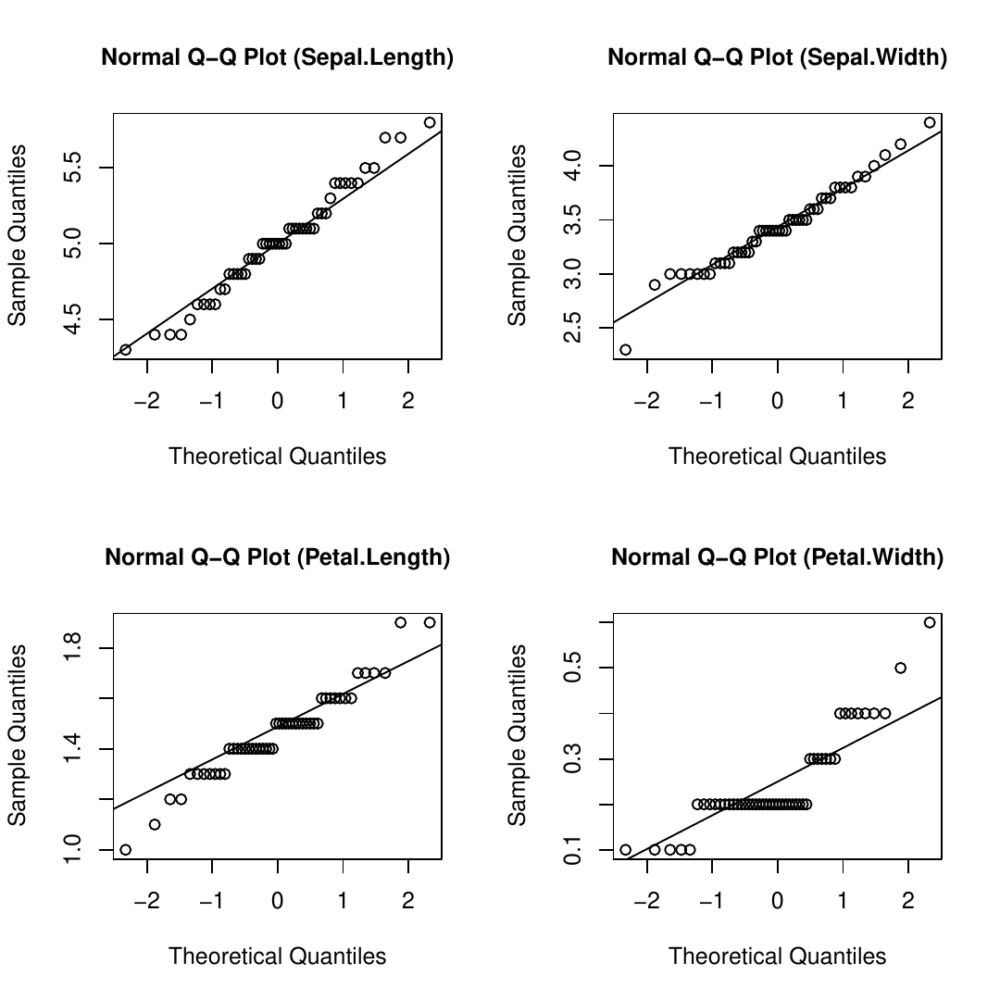

::: article
# Introduction

Many multivariate statistical analysis methods, such as MANOVA and
linear discriminant analysis
([*MASS*](https://CRAN.R-project.org/package=MASS), @R:MASS), principal
component analysis
([*FactoMineR*](https://CRAN.R-project.org/package=FactoMineR),
@R:FactoMineR, [*psych*](https://CRAN.R-project.org/package=psych),
@R:psych), and canonical correlation
([*CCA*](https://CRAN.R-project.org/package=CCA), @R:CCA), require
multivariate normality (MVN) assumption. If the data are multivariate
normal (exactly or approximately), such multivariate methods provide
more reliable results. The performances of these methods dramatically
decrease if the data are not multivariate normal. Hence, researchers
should check whether data are multivariate normal or not before
continuing with such parametric multivariate analyses.

Many statistical tests and graphical approaches are available to check
the multivariate normality assumption. @burdenski2000 reviewed several
statistical and practical approaches, including the Q-Q plot, box-plot,
stem and leaf plot, Shapiro-Wilk, and Kolmogorov-Smirnov tests to
evaluate univariate normality, contour and perspective plots for
assessing bivariate normality, and the chi-square Q-Q plot to check
multivariate normality. The author demonstrated each procedure using
real data from @georgeMallery1999. @ramzan2013 reviewed numerous
graphical methods for assessing both univariate and multivariate
normality and showed their use in a real life problem to check the MVN
assumption using chi-square and beta Q-Q plots. @holgersson2006 stated
the importance of graphical procedures and presented a simple graphical
tool, which is based on the scatter plot of two correlated variables to
assess whether the data belong to a multivariate normal distribution or
not. @svantesson2003 applied Royston's and Henze-Zirkler's tests to
multiple-input multiple-output data to test MVN. According to the review
by @mecklin2005, more than fifty statistical methods are available for
testing MVN. They conducted a comprehensive simulation study based on
type I and type II error and concluded that no single test excelled in
all situations. The authors suggested using Henze-Zirkler's and
Royston's tests among others for assessing MVN because of their good
type I error control and power. Moreover, to diagnose the reason for
deviation from multivariate normality, the authors suggested the use of
Mardia's multivariate skewness and kurtosis statistics test as well as
graphical approaches such as the chi-square Q-Q plot. Deciding which
test to use can be a daunting task for researchers (mostly for
non-statisticians) and it is very useful to perform several tests and
examine the graphical methods simultaneously. Although there are a
number of studies describing multifarious approaches, there is no single
easy-to-use, up-to-date and comprehensive tool to apply various
statistical tests and graphical methods together at present.

In this paper, we introduce an R package,
[*MVN*](https://CRAN.R-project.org/package=MVN) [@R:MVN], which
implements the three most widely used MVN tests, including Mardia's,
Henze-Zirkler's, and Royston's. In addition to statistical tests, the
*MVN* also provides some graphical approaches such as chi-square Q-Q,
perspective, and contour plots. Moreover, this package includes two
multivariate outlier detection methods, which are based on Mahalanobis
distance. In addition to multivariate normality, users can also check
univariate normality tests and plots to diagnose deviation from
normality via package version 3.7 and later. First, we discuss the
theoretical background on the corresponding MVN tests. Second, two
illustrative examples are presented in order to demonstrate the
applicability of the package. Finally, we present a newly developed web
interface of the *MVN* package, which can be especially handy for non-R
users. The R version of *MVN* is publicly available from the
Comprehensive R Archive Network (CRAN,
<http://CRAN.R-project.org/package=MVN>).

# Multivariate normality tests {#sec:MVNtest}

## Mardia's MVN test {#subsec:mardiaTheory}

@mardia:1970skew proposed a multivariate normality test which is based
on multivariate extensions of skewness ($\hat{\gamma}_{1,p}$) and
kurtosis ($\hat{\gamma}_{2,p}$) measures as follows:

$$\label{eq:mardiaStat}
  \hat{\gamma}_{1,p} = \frac{1}{n^2}\sum_{i=1}^{n}\sum_{j=1}^{n}m_{ij}^3 \qquad \text{and} \qquad \hat{\gamma}_{2,p} = \frac{1}{n}\sum_{i=1}^{n}m_{ii}^2  (\#eq:mardiaStat)  $$

where $m_{ij}=(x_i - \bar{x})'S^{-1}(x_j - \bar{x})$, the squared
Mahalanobis distance, and $p$ is the number of variables. The test
statistic for skewness, $(n/6)\hat{\gamma}_{1,p}$, is approximately
$\chi^2$ distributed with $p(p+1)(p+2)/6$ degrees of freedom. Similarly,
the test statistic for kurtosis, $\hat{\gamma}_{2,p}$, is approximately
normally distributed with mean $p(p+2)$ and variance $8p(p+2)/n$.

For small samples, the power and the type I error could be violated.
Therefore, @mardia:1974 introduced a correction term into the skewness
test statistic, usually when $n < 20$, in order to control type I error.
The corrected skewness statistic for small samples is
$(nk/6)\hat{\gamma}_{1,p}$, where $k=(p+1)(n+1)(n+3)/(n(n+1)(p+1)-6)$.
This statistic is also distributed as $\chi^2$ with degrees of freedom
$p(p+1)(p+2)/6$.

## Henze-Zirkler's MVN test {#subsec:hzTheory}

The Henze-Zirkler's test is based on a non-negative functional distance
that measures the distance between two distribution functions. If data
are distributed as multivariate normal, the test statistic is
approximately log-normally distributed. First, the mean, variance, and
smoothness parameter are calculated. Then, the mean and the variance are
log-normalized and the p-value is estimated
[@henzeZirkler:1990; @johnsonWichern:1992book; @Henze1997; @mecklin2003using; @Alpar2013].
The test statistic of Henze-Zirkler's multivariate normality test is
given in equation \@ref(eq:hzstat).

$$\label{eq:hzstat}
  HZ = \frac{1}{n}\sum_{i=1}^{n}{\sum_{j=1}^{n}{e^{-\frac{\beta^2}{2}D_{ij}}}}-2\left(1+\beta^2\right)^{-\frac{p}{2}}\sum_{i=1}^{n}{e^{-\frac{\beta^2}{2\left(1+\beta^2\right)}D_i}}+n\left(1+2\beta^2\right)^{-\frac{p}{2}}  (\#eq:hzstat)  $$

where

$$\begin{aligned}
  p         & : \quad \text{number of variables}\\
  \beta     & = \frac{1}{\sqrt{2}}\left(\frac{n\left(2p+1\right)}{4}\right)^{\frac{1}{p+4}} \\
  D_{ij}    & = (x_i - x_j)^{\mathrm{'}}S^{-1}(x_i - x_j)\\
  D_{i}     & = \left(x_i - \bar{x}\right)^{\mathrm{'}}S^{-1}\left(x_i - \bar{x}\right) = m_{ii}
\end{aligned}$$

From equation \@ref(eq:hzstat), $D_i$ gives the squared Mahalanobis
distance of $i^{\text{th}}$ observation to the centroid and $D_{ij}$
gives the Mahalanobis distance between $i^{\text{th}}$ and
$j^{\text{th}}$ observations. If data are multivariate normal, the test
statistic ($HZ$) is approximately log-normally distributed with mean
$\mu$ and variance $\sigma^2$ as given below:

$$\begin{aligned}
  \mu       = & \, 1-\frac{a^{-\frac{p}{2}}\left(1 + p\beta^{\frac{2}{a}} + \left(p\left(p+2\right)\beta^4\right)\right)}{2a^2}\\
  \sigma^2  = & \, 2\left(1+4\beta^2\right)^{-\frac{p}{2}} + \frac{2a^{-p}\left(1+2p\beta^4\right)}{a^2} + \frac{3p\left(p+2\right)\beta^8}{4a^4} \\ 
              & \, - 4{w_\beta}^{-\frac{p}{2}}\left(1+\frac{3p\beta^4}{2w_\beta}+\frac{p\left(p+2\right)\beta^8}{2{w_\beta}^{2}}\right)
\end{aligned}$$

where $a = 1 + 2\beta^2$ and $w_\beta = (1+\beta^2)(1+3\beta^2)$. Hence,
the log-normalized mean and variance of the $HZ$ statistic can be
defined as follows:

$$\label{eq:hzlogprmtrs}
  \text{log}\left(\mu\right) = \text{log}\left(\sqrt{\frac{\mu^4}{\sigma^2 + \mu^2}}\right) \qquad \qquad \text{and} \qquad \qquad \text{log}\left(\sigma^2\right) = \text{log}\left(\frac{\sigma^2 + \mu^2}{\sigma^2}\right)  (\#eq:hzlogprmtrs)  $$

By using the log-normal distribution parameters, $\mu$ and $\sigma$, we
can test the significance of multivariate normality. The *Wald* test
statistic for multivariate normality is given in equation
\@ref(eq:hzwald).

$$\label{eq:hzwald}
  z = \frac{\text{log}(HZ) - \text{log}(\mu)}{\text{log}(\sigma)}  (\#eq:hzwald)  $$

## Royston's MVN test {#subsec:roystonTheory}

Royston's test uses the *Shapiro-Wilk*/*Shapiro-Francia* statistic to
test multivariate normality. If kurtosis of the data is greater than
$3$, then it uses the *Shapiro-Francia* test for leptokurtic
distributions, otherwise it uses the *Shapiro-Wilk* test for platykurtic
distributions
[@shapiro1964analysis; @royston1982; @royston1983some; @royston1992approx; @johnsonWichern:1992book; @royston1995remark; @mecklin2005].

Let $W_j$ be the *Shapiro-Wilk*/*Shapiro-Francia* test statistic for the
$j^\text{th}$ variable ($\,j=1,2,\ldots,p$) and $Z_j$ be the values
obtained from the normality transformation proposed by
@royston1992approx.

$$\label{eq:xandwjs}
\begin{array}{l l l l}
  \text{if } \: 4\leq n \leq 11; & \qquad x = n \quad & \text{and} & \quad w_j = -\text{log}\left[\gamma - \text{log}\left(1- W_j\right)\right] \\
 \text{if } \: 12\leq n \leq 2000; & \qquad x = \text{log} (n) \quad & \text{and} & \quad w_j = \text{log}\left(1- W_j\right) 
\end{array}  (\#eq:xandwjs)  $$

As seen from equation \@ref(eq:xandwjs), $x$ and $w_j$-s change with the
sample size ($n$). By using equation \@ref(eq:xandwjs), transformed
values of each random variable can be obtained from equation
\@ref(eq:zjs).

$$\label{eq:zjs}  
  Z_j = \frac{w_j - \mu}{\sigma}  (\#eq:zjs)  $$

where $\gamma$, $\mu$ and $\sigma$ are derived from the polynomial
approximations given in equation \@ref(eq:polygms). The polynomial
coefficients are provided by @royston1992approx for different sample
sizes.

$$\begin{aligned}
 \label{eq:polygms} 
  \gamma =  & \: a_{0\gamma} + a_{1\gamma}x + a_{2\gamma}x^2 + \cdots + a_{d\gamma}x^{d} \nonumber \\
  \mu =     & \: a_{0\mu} + a_{1\mu}x + a_{2\mu}x^2 + \cdots + a_{d\mu}x^{d} \\
  \text{log}(\sigma) =  & \: a_{0\sigma} + a_{1\sigma}x + a_{2\sigma}x^2 + \cdots + a_{d\sigma}x^{d} \nonumber  
\end{aligned}  (\#eq:polygms)  $$

The Royston's test statistic for multivariate normality is as follows:

$$\label{eq:roystonH}  %Royston's H statistic for MVN
  H = \frac{e\sum_{j = 1}^{p}{\psi_j}}{p} \quad \sim \quad \chi_{e}^2  (\#eq:roystonH)  $$

where $e$ is the equivalent degrees of freedom (edf) and $\Phi(\cdot)$
is the cumulative distribution function for the standard normal
distribution such that,

$$\begin{aligned}
  \label{eq:edf}  
  e       &= p / [1 + (p - 1)\bar{c}] \nonumber \\
  \psi_j   &= \left\{\Phi^{-1}\left[\Phi(-Z_j)/2\right]\right\}^2, \qquad j=1,2,\ldots,p.  
\end{aligned}  (\#eq:edf)  $$

As seen from equation \@ref(eq:edf), another extra term $\bar{c}$ has to
be calculated in order to continue with the statistical significance of
Royston's test statistic given in equation \@ref(eq:roystonH). Let $R$
be the correlation matrix and $r_{ij}$ be the correlation between
$i^\text{th}$ and $j^\text{th}$ variables. Then, the extra term
$\bar{c}$ can be found by using equation \@ref(eq:cterm).

$$\label{eq:cterm}
  \bar{c} = \sum_i\sum_j\frac{c_{ij}}{p(p-1)}, \qquad \left\{c_{ij}\right\}_{i \neq j}  (\#eq:cterm)  $$

where

$$c_{ij}    =  \left\{
                  \begin{array}{l l}
                    g(r_{ij},n) & \qquad \text{if $i \neq j$} \\
                    1           & \qquad \text{if $i = j$}
                  \end{array}
                \right.$$

with the boundaries of $g(\cdot)$ as $g(0,n) = 0$ and $g(1,n) = 1$. The
function $g(\cdot)$ is defined as follows:\
$$g(r,n) = r^\lambda\left[1-\frac{\mu}{\nu}\left(1-r\right)^\mu\right]$$
The unknown parameters $\mu$, $\lambda$, and $\nu$ were estimated from a
simulation study conducted by @Ross:1980. He found $\mu = 0.715$ and
$\lambda = 5$ for sample size $10 \leq n \leq 2000$ and $\nu$ is a cubic
function which can be obtained as follows:
$$\nu(n) = 0.21364 + 0.015124x^2 - 0.0018034x^3$$ where
$x = \text{log}(n)$.

# Implementation of MVN package {#sec:mvnRimplement}

The *MVN* package contains several functions in the `S4` class system.
The data to be analyzed should be given as a `"data.frame"` or
`"matrix"` object. In this example, we will work with the famous *Iris*
data set. These data are from a multivariate data set introduced by
@fisher:1936 as an application of linear discriminant analysis. It is
also called Anderson's *Iris* data set because Edgar Anderson collected
the data to measure the morphologic variation of *Iris* flowers of three
related species [@edgarIris:1936]. First of all, the *MVN* package
should be loaded in order to use related functions.

``` r
# load MVN package
library(MVN)
```

Similarly, the *Iris* data can be loaded from the R database by using
the following R code:

``` r
# load Iris data 
data(iris)
```

The *Iris* data set consists of 150 samples from each of the three
species of Iris including *setosa*, *virginica*, and *versicolor*. For
each sample, four variables were measured including the length and width
of the *sepals* and *petals*, in centimeters.

**Example I:** For simplicity, we will work with a subset of these data
which contain only 50 samples of *setosa* flowers, and check MVN
assumption using Mardia's, Royston's and Henze-Zirkler's tests.

``` r
# setosa subset of the Iris data
setosa <- iris[1:50, 1:4]
```

## Mardia's MVN test: mardiaTest(\...) {#subsec:mardiaRpkg}

The `mardiaTest` function is used to calculate the Mardia's test
multivariate skewness and kurtosis coefficients as well as their
corresponding statistical significance. This function can also calculate
the corrected version of the skewness coefficient for small sample size
$(n<20)$.

``` r
result <- mardiaTest(setosa, qqplot = FALSE)
result
```

``` r
   Mardia's Multivariate Normality Test 
--------------------------------------- 
   data : setosa 

   g1p            : 3.079721 
   chi.skew       : 25.66434 
   p.value.skew   : 0.1771859 

   g2p            : 26.53766 
   z.kurtosis     : 1.294992 
   p.value.kurt   : 0.1953229 

   chi.small.skew : 27.85973 
   p.value.small  : 0.1127617 

   Result         : Data are multivariate normal. 
--------------------------------------- 
```

Here:

> `g1p`: Mardia's estimate of multivariate skewness, i.e
> $\hat{\gamma}_{1,p}$ given in equation \@ref(eq:mardiaStat),\
> `chi.skew`: test statistic for multivariate skewness,\
> `p.value.skew`: significance value of skewness statistic,\
> `g2p`: Mardia's estimate of multivariate kurtosis, i.e
> $\hat{\gamma}_{2,p}$ given in equation \@ref(eq:mardiaStat),\
> `z.kurtosis`: test statistic for multivariate kurtosis,\
> `p.value.kurt`: significance value of kurtosis statistic,\
> `chi.small.skew`: test statistic for multivariate skewness with small
> sample correction,\
> `p.value.small`: significance value of small sample skewness
> statistic.\

As seen from the results given above, both the skewness
$(\hat{\gamma}_{1,p} = 3.0797, p = 0.1772)$ and kurtosis
$(\hat{\gamma}_{2,p} = 26.5377, p = 0.1953)$ estimates indicate
multivariate normality. Therefore, according to Mardia's MVN test, this
data set follows a multivariate normal distribution.

## Henze-Zirkler's MVN test: hzTest(\...) {#subsec:hzRpkg}

One may use the `hzTest` function in the *MVN* package to perform the
Henze-Zirkler's test.

``` r
result <- hzTest(setosa, qqplot = FALSE)
result
```

``` r
  Henze-Zirkler's Multivariate Normality Test 
--------------------------------------------- 
  data : setosa 

  HZ      : 0.9488453 
  p-value : 0.04995356 

  Result  : Data are not multivariate normal. 
--------------------------------------------- 
```

Here, `HZ` is the value of the Henze-Zirkler's test statistic at
significance level $0.05$ and `p-value` is the significance value of
this test statistic, i.e., the significance of multivariate normality.
As the p-value, which is derived from `hzTest`, is mathematically lower
than $0.05$, one can conclude that this multivariate data set deviates
slightly from multivariate normality ($HZ=0.9488$, $p=0.04995$). As the
p-value is very close to $0.05$, researchers should also check the
multivariate graphical approaches as well as univariate tests and plots
to make a more reliable decision on multivariate normality.

## Royston's MVN test: roystonTest(\...) {#subsec:roysRpkg}

In order to carry out the Royston's test, `roystonTest` function in the
*MVN* package can be used as follows:

``` r
result <- roystonTest(setosa, qqplot = FALSE)
result
```

``` r
  Royston's Multivariate Normality Test 
--------------------------------------------- 
  data : setosa 

  H       : 31.51803 
  p-value : 2.187653e-06 

  Result  : Data are not multivariate normal. 
--------------------------------------------- 
```

Here, `H` is the value of the Royston's test statistic at significance
level $0.05$ and `p-value` is an approximate significance value for the
test with respect to edf. According to Royston's test, the *setosa* data
set does not appear to follow a multivariate normal distribution
$(H=31.518, p < 0.001)$.

## Chi-square Q-Q plot

One can clearly see that different MVN tests may come up with different
results. MVN assumption was rejected by Henze-Zirkler's and Royston's
tests; however, it was not rejected by Mardia's test at a significance
level of $0.05$. In such cases, examining MVN plots along with
hypothesis tests can be quite useful in order to reach a more reliable
decision.

The Q-Q plot, where "Q" stands for quantile, is a widely used graphical
approach to evaluate the agreement between two probability
distributions. Each axis refers to the quantiles of probability
distributions to be compared, where one of the axes indicates
theoretical quantiles (hypothesized quantiles) and the other indicates
the observed quantiles. If the observed data fit hypothesized
distribution, the points in the Q-Q plot will approximately lie on the
line $y = x$.

*MVN* has the ability to create three multivariate plots. One may use
the `qqplot = TRUE` option in the `mardiaTest`, `hzTest`, and
`roystonTest` functions to create a chi-square Q-Q plot. We can create
this plot for the *setosa* data set to see whether there are any
deviations from multivariate normality. Figure [1](#qq:iris4) shows the
chi-square Q-Q plot of the first 50 rows of the *Iris* data, which are
*setosa* flowers. It can be seen from Figure [1](#qq:iris4) that there
are some deviations from the straight line and this indicates possible
departures from a multivariate normal distribution.

{#qq:iris4 width="100%" alt="graphic without alt text"}

As a result, we can conclude that this data set does not satisfy MVN
assumption based on the fact that the two test results are against it
and the chi-square Q-Q plot indicates departures from multivariate
normal distribution.

## Univariate plots and tests

As noted by several authors
[@burdenski2000; @stevens2012applied; @kass2014], if data have a
multivariate normal distribution, then, each of the variables has a
univariate normal distribution; but the opposite does not have to be
true. Hence, checking univariate plots and tests could be very useful to
diagnose the reason for deviation from MVN. We can check this assumption
through `uniPlot` and `uniNorm` functions from the package. The
`uniPlot` function is used to create univariate plots, such as Q-Q plots
(Figure [2](#fig:uniQQHist)a), histograms with normal curves (Figure
[2](#fig:uniQQHist)b), box-plots and scatterplot matrices.

``` r
uniPlot(setosa, type = "qqplot") # draw univariate Q-Q plots
uniPlot(setosa, type = "histogram") # draw univariate histograms
```

<figure id="fig:uniQQHist">
<p></p>
<figcaption>Figure 2: Univariate plots of setosa.</figcaption>
</figure>

As seen from Figure [2](#fig:uniQQHist), *Petal.Width* has a
right-skewed distribution whereas other variables have approximately
normal distributions. Thus, we can conclude that problems with
multivariate normality arise from the skewed distribution of
*Petal.Width*. In addition to the univariate plots, one can also perform
univariate normality tests using the `uniNorm` function. It provides
several widely used univariate normality tests, including Shapiro-Wilk,
Cramer-von Mises, Lilliefors, and Anderson-Darling. For example, the
following code chunk is used to perform the Shapiro-Wilk's normality
test on each variable:

``` r
uniNorm(setosa, type = "SW") 
```

``` r
  Shapiro-Wilk's test of Normality

      Variable Statistic p-value Normality
1 Sepal.Length    0.9777  0.4595       YES
2  Sepal.Width    0.9717  0.2715       YES
3 Petal.Length    0.9550  0.0548       YES
4  Petal.Width    0.7998  0.0000        NO
```

From the above results, we can see that all variables, except
*Petal.Width* in the *setosa* data set, have univariate normal
distributions at significance level 0.05. We can now drop *Petal.With*
from *setosa* data and recheck the multivariate normality. MVN results
are given in Table [1](#tbl:setosa).

::: {#tbl:setosa}
  ------------------------------------------
  Test              Test Statistic   p-value
  --------------- ---------------- ---------
  Mardia                           

  Skewness                  11.249     0.338

  Kurtosis                   1.287     0.198

  Henze-Zirkler              0.524     0.831

  Royston                    7.255     0.060
  ------------------------------------------

  : Table 1: MVN test results (*setosa* without *Petal.Width*).
:::

According to the three MVN test results in Table [1](#tbl:setosa),
*setosa* without *Petal.Width* has a multivariate normal distribution at
significance level 0.05.

**Example II:** Whilst the Q-Q plot is a general approach for assessing
MVN in all types of numerical multivariate datasets, perspective and
contour plots can only be used for bivariate data. To demonstrate the
applicability of these two approaches, we will use a subset of *Iris*
data, named *setosa2*, including the *sepal length* and *sepal width*
variables of the *setosa* species.

## Perspective and contour plots {#subsec:PerspCont}

Univariate normal marginal densities are a necessary but not a
sufficient condition for MVN. Hence, in addition to univariate plots,
creating perspective and contour plots will be useful. The perspective
plot is an extension of the univariate probability distribution curve
into a 3-dimensional probability distribution surface related with
bivariate distributions. It also gives information about where data are
gathered and how two variables are correlated with each other. It
consists of three dimensions where two dimensions refer to the values of
the two variables and the third dimension, which like in univariate
cases, is the value of the multivariate normal probability density
function. Another alternative graph, which is called the "contour plot",
involves the projection of the perspective plot into a 2-dimensional
space and this can be used for checking multivariate normality
assumption. For bivariate normally distributed data, we expect to obtain
a three-dimensional bell-shaped graph from the perspective plot.
Similarly, in the contour plot, we can observe a similar pattern.

To construct a perspective and contour plot for Example 2, we can use
the `mvnPlot` function in *MVN*. This function requires an object of the
`"MVN"` class that is the result from one of the *MVN* functions. In the
following codes, the object from `hzTest` is used for the perspective
plot given in Figure [3](#fig:PerspCont)a. It is also possible to
create a contour plot of the data. Contour graphs are very useful as
they give information about normality and correlation at the same time.
Figure [3](#fig:PerspCont)b shows the contour plot of *setosa* flowers.
As can be seen from the graph, this is simply a top view of the
perspective plot where the third dimension is represented with ellipsoid
contour lines. From this graph, we can say that there is a positive
correlation among the *sepal* measures of flowers since the contour
lines lie around the main diagonal. If the correlation were zero, the
contour lines would be circular rather than ellipsoid.

``` r
setosa2 <- iris[1:50, 1:2]
result <- hzTest(setosa2, qqplot=FALSE)
mvnPlot(result, type = "persp", default = TRUE) # draw a perspective plot
mvnPlot(result, type = "contour", default = TRUE) # draw a contour plot
```

<figure id="fig:PerspCont">
<p></p>
<figcaption>Figure 3: Perspective and contour plot for bivariate setosa2
data set.</figcaption>
</figure>

As neither the univariate plots in Figure [2](#fig:uniQQHist) nor the
multivariate plots in Figure [3](#fig:PerspCont) show any significant
deviation from MVN, we can now perform the MVN tests to evaluate the
statistical significance of bivariate normal distribution of the
*setosa2* data set.

::: {#tbl:iris2}
  ------------------------------------------
  Test              Test Statistic   p-value
  --------------- ---------------- ---------
  Mardia                           

  Skewness                   0.760     0.944

  Kurtosis                   0.093     0.926

  Henze-Zirkler              0.286     0.915

  Royston                    2.698     0.245
  ------------------------------------------

  : Table 2: MVN test results (*setosa* with *sepal* measures).
:::

All three tests in Table [2](#tbl:iris2) indicate that the data set
satisfies bivariate normality assumption at the significance level
$0.05$. Moreover, the perspective and contour plots are in agreement
with the test results and indicate approximate bivariate normality.

Figures [3](#fig:PerspCont)a and [3](#fig:PerspCont)b were drawn using a
pre-defined graphical option by the authors. However, users may change
these options by setting function entry to `default = FALSE`. If the
`default` is `FALSE`, optional arguments from the `plot`, `persp` and
`contour` functions may be introduced to the corresponding graphs.

## Multivariate outliers {#subsec:mvOutlier}

Multivariate outliers are the common reason for violating MVN
assumption. In other words, MVN assumption requires the absence of
multivariate outliers. Thus, it is crucial to check whether the data
have multivariate outliers, before starting multivariate analysis. The
*MVN* includes two multivariate outlier detection methods which are
based on robust Mahalanobis distances ($\mathrm{rMD}(x)$). Mahalanobis
distance is a metric which calculates how far each observation is to the
center of joint distribution, which can be thought of as the centroid in
multivariate space. Robust distances are estimated from minimum
covariance determinant estimators rather than the sample covariance
[@Rousseeuw:1987]. These two approaches, defined as Mahalanobis distance
and adjusted Mahalanobis distance in the package, detect multivariate
outliers as given below,\
Mahalanobis Distance:

1.  Compute robust Mahalanobis distances ($\mathrm{rMD}(x_i)$),

2.  Compute the 97.5 percent quantile ($Q$) of the chi-square
    distribution,

3.  Declare $\mathrm{rMD}(x_i) > Q$ as possible outlier.

Adjusted Mahalanobis Distance:

1.  Compute robust Mahalanobis distances ($\mathrm{rMD}(x_i)$),

2.  Compute the 97.5 percent adjusted quantile ($AQ$) of the chi-Square
    distribution,

3.  Declare $\mathrm{rMD}(x_i) > AQ$ as possible outlier.

The `mvOutlier` function is used to detect multivariate outliers as
given below. It also returns a new data set in which declared outliers
are removed. Moreover, Q-Q plots can be created by setting
`qqplot = TRUE` within `mvOutlier` for visual inspection of the possible
outliers. For this example, we will use another subset of the *Iris*
data, which is *versicolor* flowers, with the first three variables.

``` r
versicolor <- iris[51:100, 1:3] 
# Mahalanobis distance
result <- mvOutlier(versicolor, qqplot = TRUE, method = "quan") 
# Adjusted Mahalanobis distance
result <- mvOutlier(versicolor, qqplot = TRUE, method = "adj.quan") 
```

<figure id="fig:mvOutlier">
<p></p>
<figcaption>Figure 4: Multivariate outlier detection.</figcaption>
</figure>

From Figure [4](#fig:mvOutlier), Mahalanobis distance declares 2
observations as multivariate outlier whereas adjusted Mahalanobis
distance declares none. See @Filzmoser:2005 for further information on
multivariate outliers.

# Web interface for the MVN package {#sec:webInterface}

The purpose of the package is to provide MVN tests along with graphical
approaches for assessing MVN. Moreover, this package offers univariate
tests and plots, and multivariate outlier detection for checking MVN
assumptions through R. However, using R codes might be challenging for
new R users. Therefore, we also developed a user-friendly web
application of *MVN* by using
[*shiny*](https://CRAN.R-project.org/package=shiny)[^1] [@shiny:2014],
and this is publicly available.[^2] This web-tool, which is an
interactive application, has all the features that the *MVN* package
has.

<figure id="fig:webMVN">
<p></p>
<p></p>
<figcaption>Figure 5: Web interface of the MVN package.</figcaption>
</figure>

To start analysis, users need to upload or paste their data to the
web-tool as described in the *Data upload* tab. Three example data sets
are available on this page for researchers to test the tool and prepare
their data in an appropriate form (Figure [5](#fig:webMVN)a). Before
performing MVN tests, the univariate normality assumption can be checked
through univariate plots (Q-Q plot, histograms with normal curve,
box-plot, and scatterplot matrix) and tests (Shapiro-Wilk, Cramer-von
Mises, Lilliefors, and Anderson-Darling) in the *Univariate analysis*
tab (Figure [5](#fig:webMVN)b) and possible multivariate
outliers can be detected by using the Mahalanobis distances via the
*Outlier detection* tab as seen in Figure
[5](#fig:webMVN)c. Finally, users can assess MVN in
the *Multivariate analysis* tab by choosing one of the MVN tests
including Mardia's, Henze-Zirkler's, and Royston's and graphical
approaches, including chi-square Q-Q, perspective, and contour plots
(Figure [5](#fig:webMVN)d). All the results can be
downloaded by using download buttons in the respective tabs.

# Summary and further research {#sec:summary}

As stated earlier, MVN is among the most crucial assumptions for most
parametric multivariate statistical procedures. The power of these
procedures is negatively affected if this assumption is not satisfied.
Thus, before using any of the parametric multivariate statistical
methods, MVN assumption should be tested first. Although there are many
MVN tests, there is not a standard test for assessing this assumption.
In our experience, researchers may choose Royston's test for data with a
small sample size ($n<50$) and Henze-Zirkler's test for a large sample
size ($n>100$). However, a more comprehensive simulation study is needed
to provide more reliable inference. Instead of using just one test, it
is suggested that using several tests simultaneously and examining some
graphical representation of the data may be more appropriate. Currently,
as far as we know, there is no such extensive tool to apply different
statistical tests and graphical methods together.

In this paper, we present the *MVN* package for multivariate normality
checking. This package offers comprehensive flexibility for assessing
MVN assumption. It contains the three most widely used MVN tests,
including Mardia's, Henze-Zirkler's and Royston's. Moreover, researchers
can create three MVN plots using this package, including the chi-square
Q-Q plot for any data set and perspective and contour plots for
bivariate data sets. Furthermore, since MVN requires univariate
normality of each variable, users can check univariate normality
assumption by using both univariate normality tests and plots with
proper functions in the package. In the first example, different results
on multivariate normality were achieved from the same data. When *sepal*
and *petal* measures, i.e., four variables, were considered, Mardia's
test resulted in multivariate normality as well as Henze-Zirkler's test
at the edge of type I error. However, Royston's test strongly rejected
the null hypothesis in favor of non-normality. At this point, the only
possible graphical approach is to use the chi-square Q-Q plot since
there are more than two variables. The next step was to identify the
cause of deviation from MVN by using univariate normality tests and
plots. In the second example, all tests suggested bivariate normality,
as did the graphical approaches. Although some tests may not reject the
null hypothesis, other tests may reject it. Hence, as stated earlier,
selecting the appropriate MVN test dramatically changes the results and
the final decision is ultimately the researcher's.

Currently, *MVN* works with several statistical tests and graphical
approaches. It will continue to add new statistical approaches as they
are developed. The package and the web-tool will be regularly updated
based on these changes.

# Acknowledgments {#sec:acknowldg}

We would like to thank Prof. Dr. C. Reha Alpar and the anonymous
reviewer for their very useful comments and suggestions which helped us
to improve the quality of our paper. We would also like to thank Izzet
Parug Duru from Marmara University Department of Physics and Vahap Eldem
from Istanbul University Department of Biology for making the web-tool
version of the package possible. This study was supported by the
Research Fund of Marmara University \[FEN-C-DRP-120613-0273\].

\

\

\
:::

[^1]: <http://www.rstudio.com/shiny/>

[^2]: <http://www.biosoft.hacettepe.edu.tr/MVN>
