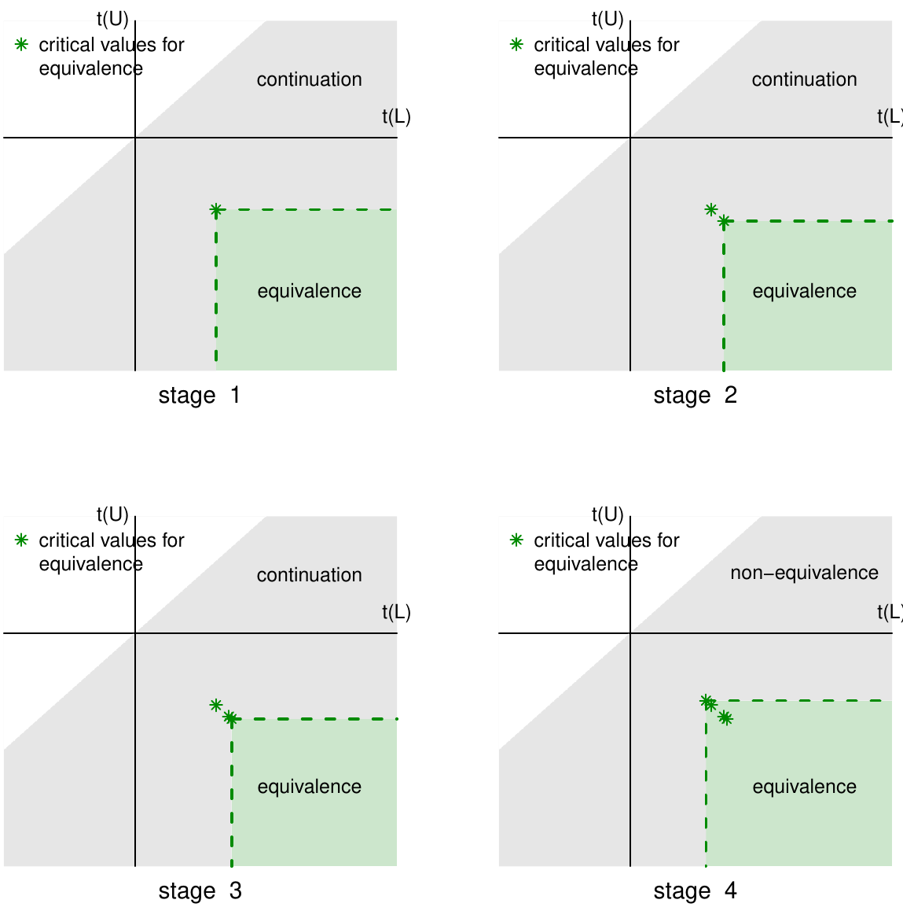
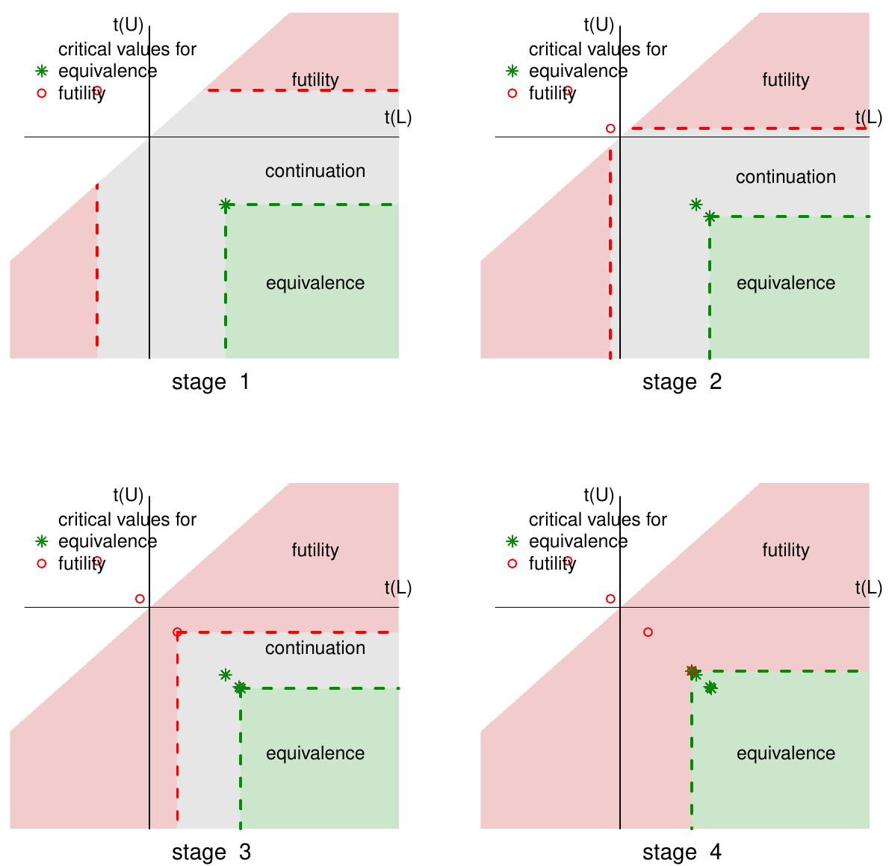
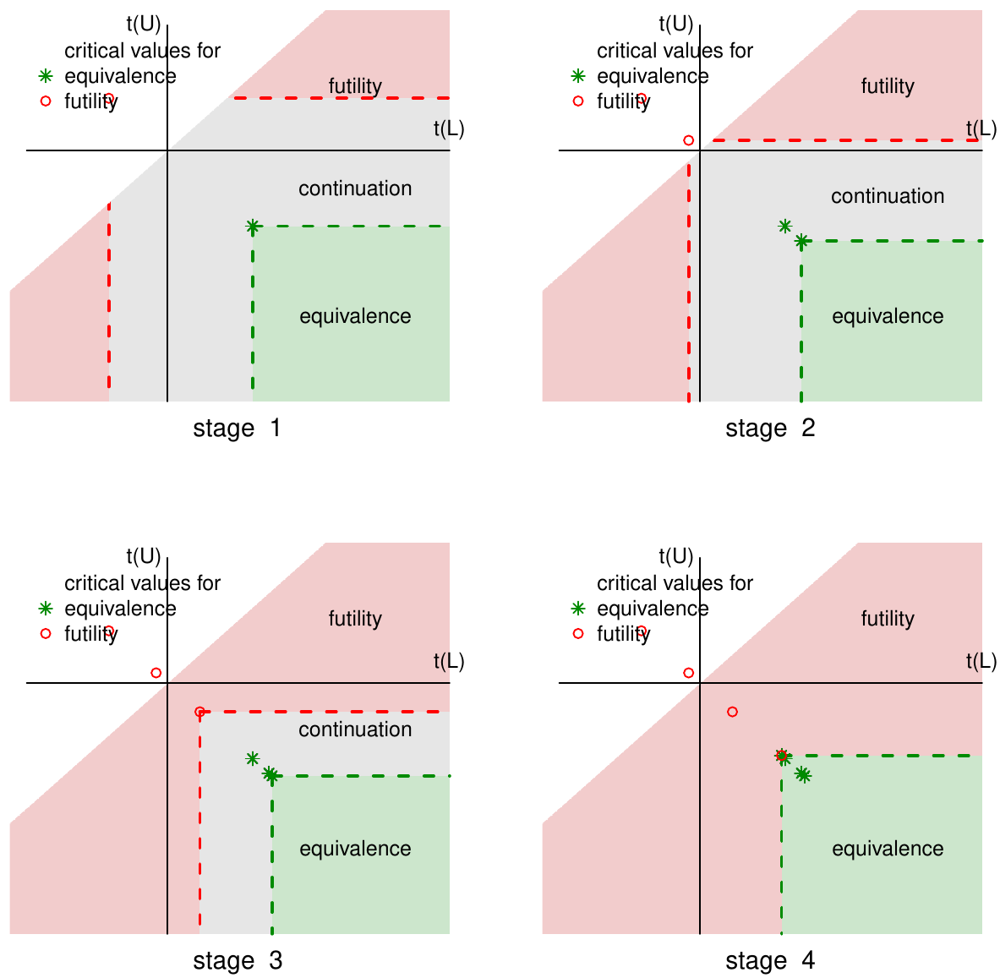

::: article
# Introduction {#sec:intro}

Group sequential tests are repeated significance testing on data
accumulated during a study, in contrast to the traditional one-time
analysis at the end of the study. Since the same hypothesis is
repeatedly tested, it is critical to compute the proper critical values
at each interim analysis to keep the overall Type I error rate at a
prespecified nominal level. Applied appropriately, group sequential
designs (GSDs) can help saving resources, shortening study duration, and
stopping ineffective treatments much earlier than the traditional
non-sequential designs. There are existing software applications, both
commercial and open-source, of GSDs in studies, including
`PROC SEQDESIGN` and `PROC SEQTEST` procedures in SAS©, EAST© developed
by Cytel, as well as the R packages
[*gsDesign*](https://CRAN.R-project.org/package=gsDesign) (general GSDs
and operating characteristics; @gsDesign),
[*GroupSeq*](https://CRAN.R-project.org/package=GroupSeq) (GSD via the
Type I error spending approach; @GroupSeq), the `ldBand` function from
[*Hmisc*](https://CRAN.R-project.org/package=Hmisc) (GSD via from the
Lan-DeMets method with a variety of $\alpha$-spending functions;
@Hmisc), `ldbands` (boundary calculation using the Lan-DeMets $\alpha$
spending function approach),
[*PwrGSD*](https://CRAN.R-project.org/package=PwrGSD) (evaluation of
interim analysis plans for GSD on a survival endpoint; construction of
efficacy and futility boundaries, and calculation of power of a GSD;
@PwrGSD), [*AGSDest*](https://CRAN.R-project.org/package=AGSDest)
(parameter estimation in adaptive GSDs; @AGSDest),
[*clinfun*](https://CRAN.R-project.org/package=clinfun) (design and
analysis of clinical trials; @clinfun).

This discussion focuses on GSDs in studies with equivalence hypotheses.
Equivalence studies concern "equivalence" between two groups. Since
mathematical equivalence is impossible to establish, the concept of
"equivalence bounds" is often applied. Denote the parameter that
represents the dissimilarity in a response variable between two groups
by $\theta$, then the hypothesis set being tests in equivalence studies
can be expressed as two one sided hypotheses
$\{H_{10}\!\!: \theta < L \mbox{ v.s. }  H_{11}\!\!: \theta > L\}$ and
$\{H_{20}\!\!: \theta > U\mbox{ v.s. }  H_{21}\!\!: \theta < U\}$, where
equivalence bounds $L$ and $U$ are located on the opposite sides of the
value that represents mathematical equivalence though not necessarily
symmetric. The choice of $(L,U)$ is primarily driven by practical and
scientific justifications, or set by regulatory requirements in case of
pharmaceutical studies. Simultaneous rejection of $H_{10}$ and $H_{20}$
leads to the claim of equivalence. GSDs with equivalence hypotheses have
been discussed in the literature (see @JT89
[@Simon90; @JT93; @Gould95; @whitehead96; @hwang96; @huang10; @Potvin08; @Potvin12]).
Many test procedures discussed the literature are based on the
large-sample normality assumption of the test statistics. This could be
problematic in sequential tests given that the stagewise sample sizes at
the early looks can be small. Secondly, to facilitate the computation of
the critical values, rather than working with the dual test statistics
(one for each of the two one-sided hypothesis), which is computationally
more demanding, an analytical approximation that ignores the
contribution to the probability of rejecting one $H_0$ out of the two
under $H_0$ is commonly applied in practice. Though this approach is
valid in the sense that it guarantees the Type I error rate at or below
the nominal level, it can be overly conservative when the Type I error
rate or sample size is small, which can be the very situation that GSDs
have to deal with in early stages. The exact test procedure formed with
the duel $t$ statistics in the latest work of @mypaper overcomes these
major methodological shortcomings in the GSDs of equivalence studies.

To the best of our knowledge, there are no software packages or tools
that target specifically at the GSDs of equivalence studies. Though some
existing software applications, which are not designed for GSD in
equivalence studies, can be tricked into doing sequential tests on
equivalence hypotheses, the tricking process itself can be confusing and
error-prone. Even if the tricking is successful, other potential
problems still exist. First, many of the procedures are based on the
large sample normality assumption. Second, the futility boundaries are
calculated from testing $H_0\!\!:\theta=0$. Since $\theta=0$ represents
perfect equivalence, rejecting $\theta=0$ to claim futility is
inappropriately conservative and results in inflated Type II error rate
since any other $\theta\in(L,U)$ per the equivalence hypothesis also
falls within the range of "equivalence". Third, the existing GSD
software packages, because they are not designed for equivalence
studies, can only accommodate symmetric equivalence bounds about 0:
$(-\Delta, \Delta)$, which can be restrictive in some real life
applications.

In this discussion, we introduce the R package *gset* that fills the
software gap in GSDs for studies with equivalence hypotheses. The
stagewise equivalence and futility boundaries, either binding or
nonbinding, are back-calculated from the equations that are formed based
on the exact dual $t$ test statistics. The procedure works given any
$\theta\in(L,U)$ rather than just $\theta=0$. Furthermore, symmetry of
the equivalence bounds $L$ and $U$ about 0 is not required. In the rest
of the paper, we will provide more details on the following topics: the
method and computation employed by *gset*, the functions and outputs
from the package *gset*, and some examples on applying the package
*gset* in designing GSDs in equivalence studies.

# Exact test procedure based on bivariate $t$ statistics {#sec:method}

Denote by $\theta$ the true difference between two groups of normally
distributed variables $Y_1$ and $Y_2$. The estimate of $\theta$ is
denoted by $\hat{\theta}$; and its standard error is
$\sigma_{\hat{\theta}}$, which is estimated by $s$. If the original data
deviates significantly from the normal distribution, an appropriate
transformation can be used, and $\theta$ would be the difference on the
transformed scale. A familiar example is the area under the
concentration curve (AUC) and the maximum concentration (Cmax) following
a drug administration in bioequivalence studies, which are often modeled
by the log-normal distribution. The comparisons between two groups on
AUC and Cmax are often performed on the log-scale after the log
transformation.

The $t$ statistics for testing the dual hypotheses $H_{10}$ and $H_{20}$
in equivalence studies (in the non-sequential testing) are
$T(L) = (\hat{\theta} -  L)s^{-1}$ and
$T(U) = (\hat{\theta} - U)s^{-1}= \frac{ (\hat{\theta}-L)/\sigma_{\hat{\theta}}+ (L-U)/\sigma_{\hat{\theta}}} {(s/\sigma_{\hat{\theta}})}$,
respectively. $\{T(L), T(U)\}$ jointly follow a bivariate non-central
$t$ distribution; and marginally, $T(L)$ follows a central $t$
distribution and $T(U)$ follows a non-central $t$ distribution with
non-centrality parameter $(L-U)/\sigma_{\hat{\theta}}$. A decision rule
would reject both $H_0$ simultaneously and should control the overall
Type I error rate at a nominal level $\alpha$. In the sequential test
case, the dual test statistics are denoted by
$T_k(L)=(\hat{\theta}_k-L)/s_k$ and $T_k(U)=(\hat{\theta}_k-U)/s_k$,
where $\hat{\theta}_k$ and $s_k$ are computed with the data accrued up
to stage $k$ ($k=1,\ldots, K$; $K$ is the total number of looks). At an
interim look $k$ ($k<K$), there are 3 stopping options: a) stop the
trial and reject both $H_{10}$ and $H_{20}$ to claim equivalence; b)
stop the trial and "reject" either $H_{21}$ or $H_{22}$ to conclude
futility; c) move on to the next stage if the test statistics do no
cross either the equivalence or the futility boundaries. The rejection
region $\mathcal{R}_k$ in stage $k$ (to claim equivalence), acceptance
region $\mathcal{A}_k$ (to conclude futility), and the continuation
region $\mathcal{C}_k$ are:

$$\begin{aligned}
\mathcal{R}_k&=&\{T_k(L) > c_k^L\} \cap \{T_k(U) < c_k^U\}\label{eq:Rk},  
\end{aligned}  (\#eq:Rk)  $$

$$\begin{aligned}
\mathcal{A}_k&=&\{T_k(L) < d_k^L\} \cup \{T_k(U) > d_k^U\}\label{eq:Ak},  
\end{aligned}  (\#eq:Ak)  $$

$$\begin{aligned}
\mathcal{C}_k&=&\left(\mathcal{R}_k \cup \mathcal{A}_k\right)^c,\label{eq:Ck}  
\end{aligned}  (\#eq:Ck)  $$

where $(c_k^L,c_k^U)$ are the equivalence boundaries, and
$(d_k^L,d_k^U)$ are the futility boundaries. In the last stage $K$,
$\Pr(\mathcal{C}_K)$ is necessarily 0 to allow a final dichotomous
decision made between rejection and acceptance of non-equivalence.

The futility boundaries can be binding or non-binding, depending on
whether the equivalence boundaries are affected by the action of
stopping for futility or not. When the futility boundaries are binding,
the decisions to stop for equivalence or futility are "competitive";
that is, the trial will stop at the time point whichever boundaries are
crossed first. Otherwise, the overall Type I error rate would be
inflated. The equivalence and binding futility boundaries can be
determined from the following equation system

$$\begin{aligned}
&\Pr(\mathcal{R}_1 \mid \theta = L) = \Pr(\mathcal{R}_1 \mid \theta = U) = \alpha(t_1)\label{eq:c1}\\
\end{aligned}  (\#eq:c1)  $$

$$\begin{aligned}
&\Pr(\mathcal{C}_1 \cap \cdots \cap \mathcal{C}_{k-1} \cap \mathcal{R}_k  \mid \theta = L) = \Pr(\mathcal{C}_1 \cap \cdots \cap \mathcal{C}_{k-1} \cap \mathcal{R}_k  \mid \theta = U)
= \alpha(t_k) - \alpha(t_{k-1}) \label{eq:c2}  
\end{aligned}  (\#eq:c2)  $$

$$\begin{aligned}
&\Pr(\mathcal{A}_1 \mid \theta \in(L, U)) = \beta(t_1) \label{eq:c3}  
\end{aligned}  (\#eq:c3)  $$

$$\begin{aligned}
& \Pr(\mathcal{C}_1 \cap \cdots \cap \mathcal{C}_{k-1} \cap \mathcal{A}_k  \mid \theta \in(L, U))=\beta(t_k) - \beta(t_{k-1}),\label{eq:c4}  
\end{aligned}  (\#eq:c4)  $$ where $k=2,\ldots,K$ in Equations
(\@ref(eq:c2)) and (\@ref(eq:c4)). $\alpha(t_k)$ and $\beta(t_k)$ are
the cumulative Type I and II error rates at stage $k$ that can be
conveniently specified using the error spending functions
[@LD83; @HSD90]. The $\alpha$- and $\beta$-spending functions do not
have to be the same.

In many practical cases, the study sponsors would want an option to
continue the trial even when the interim data suggests stopping for
futility. The futility boundaries calculated under this circumstance are
referred to as "non-binding". A study with non-binding futility
boundaries can stop for futility at an interim look when the futility
boundaries are crossed, or not. Non-binding futility provides more
flexibility to a study without inflating Type I error rate. The
equivalence and non-binding futility can be determined from Equations
(\@ref(eq:c1)), (\@ref(eq:c3)), and (\@ref(eq:c4)), plus the equation
below

$$\label{eq:c2NB} 
\Pr(\mathcal{R}_1^c \cap \cdots \cap \mathcal{R}_{k-1}^c \cap \mathcal{R}_k  \mid \theta = L) = \Pr(\mathcal{R}_1^c \cap \cdots \cap \mathcal{R}_{k-1}^c \cap \mathcal{R}_k  \mid \theta = U)
= \alpha(t_k) - \alpha(t_{k-1}).  (\#eq:c2NB)  $$

In terms of the actual computation of the critical values, *gset*
employs the Monte Carlo (MC) simulation approach to calculate
equivalence and futility boundaries (either non-binding or binding) from
the two equation systems given above. @mypaper prove that there are some
inherent constraints among the critical values including
$c_k^U + c_k^L=0$ in both the binding and non-binding cases, as well as
$d_k^U+ d_k^L=0$ in the non-binding case. In the binding case, some
constraint has to be imposed on $(d_k^L, d_k^U)$ in order to obtain
unique solutions on the boundaries since the the number of unknowns
outnumber the number of equations. We adopt the probability symmetry
constraint as suggest by @mypaper. That is, the likelihood that
equivalence is rejected due to rejecting $H_{10}$ is the same as the
likelihood of rejecting from $H_{20}$. It turns out that the probability
symmetry constraint can be reduced to the simple constraint
$d_k^L= -d_k^U$ as in the non-binding case if
$(\theta-L)\sigma_{\hat{\theta}}^{-1}\gg1$ and
$(U-\theta)\sigma_{\hat{\theta}}^{-1}\gg1$, which is the case in many
real-life situations. With the appropriate constraints in place, the
boundaries in the non-binding case are calculated in two steps: first
solve for $(c_k^L, c_k^U)$ as if there were no futility boundaries, and
then compute $(d_k^L, d_k^U)$ conditional on the calculated
$(c_k^L, c_k^U)$ from the previous step [@east]. In the case of binding
futilities, $c_k$ and $d_k$ will need to be determined simultaneously.
After the first look, calculation of $(c_k^L, c_k^U)$ will be
conditional on the values $(d_k^L, d_k^U)$ computed from the previous
step, and vice versa.

In the last step, the equivalence and futility boundaries must meet so
that a final dichotomous decision on whether equivalence is achieved can
be made. If the originally planned $n$ is not large enough, the two
types of boundaries will not meet. One simple approach is to force
$|d_K^L| \equiv |d_K^U|=|c^L_K| \equiv|c^U_K|$, with the side effect of
inflating the Type II error rate. An alternative, which is better, is to
calculate the minimum required $n$ that guarantees that the equivalence
and futility boundaries will meet in the last step. In *gset*, this
minimum required $n$ is denoted by $n_{minimax}$, "max" because
$n_{minimax}$ would be the maximum used subjects of a study if it makes
it into the last stage $K$. In *gset*, $n_{minimax}$ is searched by a
simple bisection approach, with a user-supplied search region.

# Implementation in R {#sec:R}

The package *gset* contains 8 functions (Table [1](#tab:function)).
Among the 8 functions, 4 functions can be used to compute the
equivalence and futility boundaries (`equivonly`, `nonbinding`,
`binding`, `nminmax`). The futility critical values calculated by
`nonbinding` and `binding` in the last step are forced to equal to the
equivalence critical values by default so that a dichotomous decision on
equivalence can be made in the last stage, though users can use argument
`force = FALSE` to not force them to be the same. The sample size where
the futility and equivalence critical values naturally coincide in the
last stage are calculated by function `nminmax`, with the nominal Type I
and II error rates maintained. In other words, the futility and
equivalence boundaries agree naturally in the last stage with
$n_{minmax}$. Different sample sizes would only affect the futility
boundaries, but not the equivalence boundaries. One function (`nfix`)
computes the sample size of an equivalence study in the traditional
non-sequential setting. Two functions generate the stagewise boundary
plots (`figureE`, `figureEF`); and one function (`oc`) examines the
operating characteristics of a given GSD in equivalence studies;
including the empirical Type I error rate, empirical power, expected
sample size, and the probabilities of stopping at interim looks due to
equivalence or futility.

::: {#tab:function}
  -----------------------------------------------------------------------------------------------------------------------------------------------------------------------------------------------------------------
  Function       Description
  -------------- --------------------------------------------------------------------------------------------------------------------------------------------------------------------------------------------------
  `equivonly`    computes equivalence boundaries for GSD in equivalence studies that only stop for equivalence

  `nonbinding`   computes equivalence and non-binding futility boundaries for GSD in equivalence studies

  `binding`      computes equivalence and binding futility boundaries for GSD in equivalence studies

  `nminmax`      calculates the sample size of an equivalence study in the sequential setting as well as the equivalence and futility boundaries (either binding or non-binding) under the calculated sample size

  `nfix`         calculates the sample size of an equivalence study in the traditional non-sequential setting

  `figureE`      generates the stagewise equivalence boundary plots

  `figureEF`     generates the stagewise equivalence and futility boundary plots

  `oc`           examines the operating characteristics of a given GSD in equivalence studies
  -----------------------------------------------------------------------------------------------------------------------------------------------------------------------------------------------------------------

  : Table 1: Functions in package *gset*.
:::

Table [2](#tab:args) lists the arguments to be supplied by users for
calculating equivalence and futility boundaries. To calculate the sample
size of an equivalence study in the traditional non-sequential setting
via `nfix`, besides `l`, `u`, `theta`, `sigma`, `type1`, `type2` as
listed in Table [2](#tab:args), users also need to supply the sampling
ratio between the two groups: $r$, and a 2-dimensional vector containing
the end-points of the interval from which the sample size will be
solved: `nrange`; the default is `c(0, 1000)`. To calculate the sample
size of an equivalence study in the GSD setting via `nminmax`, besides
`l`, `u`, `theta`, `sigma`, `t.vec`, `type1`, `type2`, `gamma`, `n.sim`
as given in Table [2](#tab:args), users also need to specify a logical
argument `binding`: whether the futility boundaries are binding, and
`n1.lower`, `n1.upper`, `n2.lower`, `n2.upper`, which represent the
lower and upper bounds of the interval from which `nminmax` in groups 1
and 2 will be solved using a bisection method. The boundary plots are
generated directly from functions `equivonly`, `nonbinding` and
`binding` by default (users can suppress the plots by specifying
`binding = FALSE`), or they can be generated by functions `figureE` and
`figureEF` by taking the boundary outputs from `equivonly`,
`nonbinding`, `binding`, `nminmax` as their input.

::: {#tab:args}
  --------------------------------------------------------------------------------------------------------------------------------------------------------------------------------------------------------------------------------------------------------------------------------------
  Argument   Description
  ---------- ---------------------------------------------------------------------------------------------------------------------------------------------------------------------------------------------------------------------------------------------------------------------------
  `l`        the lower equivalence bound as given in the equivalence hypothesis

  `u`        the upper equivalence bound as given in the equivalence hypothesis

  `theta`    the true mean difference between 2 groups

  `sigma`    between-subject standard deviation of the response variable $y$ for two independent samples; and within-subject SD of $y$ for paired samples.

  `n1`       size of group 1

  `n2`       size of group 2

  `t.vec`    cumulative interim look time points assuming a constant accrual rate. For example, if a study has equally spaced 4 looks, then `t.vec = 1:4/4`. `t.vec` can be any vector as long as it is monotonically increasing and the last element is 1

  `type1`    overall Type I error rate

  `type2`    overall Type II error rate

  `gamma`    the gamma parameter in the gamma cumulative error spending function. gamma is a scalar for `equivonly`, and a 2-dimensional vector for `binding, nonbinding, nminmax`; it can be any value; default is $-4$, which produces O'Brien-Fleming type error spending function.

  `crange`   a 2-dimensional vector containing the end-points of the interval from the equivalence boundaries will be solved; default is `c(-10, 10)`.

  `drange`   a 2-dimensional vector containing the end-points of the interval from which the futility boundaries will be solved; default is `c(-10, 10)`.

  `force`    whether to force the futility boundaries to equal to the equivalence boundaries in the last look; default is `force = TRUE`.

  `plot`     whether to generate the boundaries plot. Default `plot = TRUE`.

  `ll`       a parameter in the boundary plot; the short arm of the $t(L)$ and $t(U)$ axes

  `ul`       a parameter in the boundary plot; the long arm of the $t(L)$ and $t(U)$ axes

  `n.sim`    number of randomly simulated samples in the MC computation of the boundaries; default `n.sim` $=10^5$

  `seed`     seed used in the MC computation. If non-specified, the seed is set randomly.
  --------------------------------------------------------------------------------------------------------------------------------------------------------------------------------------------------------------------------------------------------------------------------------------

  : Table 2: Arguments to be supplied by users to calculate equivalence
  and futility boundaries.
:::

As for the error spending function employed by *gset*, the gamma error
spending function as introduced by @HSD90 is used on both Type I and
Type II error. The function, using Type I error rate $\alpha$ as an
example, is $f(t)=\alpha(1-e^{-t\gamma})(1-e^{-\gamma})^{-1}$ if
$\gamma \ne0$ or $\alpha t$ if $\gamma=0$. The values of $\gamma$ can be
different for $\alpha$ and $\beta$ spending. The error spending function
is versatile and yield a wide range of spending patterns by varying
$\gamma$ on a continuous scale. For example, $\gamma =-4$ corresponds to
more conservative spending at early stages and gradually become liberal
toward the end (producing O'Brien-Fleming like boundaries), and
$\gamma =1$ corresponds to more spending at early stages than the later
stages (producing Pocock-like boundaries).

# Examples

In this section, we illustrate the implementation of package *gset* with
3 examples. In all examples, the base design is the complete crossover
design, there are 4 looks of the GSD in each example. The equivalence
bounds in the hypothesis are $(L, U)=(-0.2, 0.2)$, the assumed true
different $\theta=0$, the within-subject standard deviation
$\sigma=0.4$, and the overall Type I and Type II error rates are $0.05$
and $0.2$, respectively. The O'Brien-Fleming type error spending
function is used for both the Type I and Type II error rates
($\gamma = -4$), which is the default. Since the critical values and the
sample size in *gset* are calculated via the MC simulation, there will
be some MC errors in the results. In other words, the results will be
slightly different when re-running the commands. To decrease the MC
errors, the number of simulations can be increased; the default `n.sim`
is $10^5$. Users can fix the random effect using `set.seed` to have
their results reproduced in different runs.

``` r
library(gset)
#### specify the parameters
L <- -0.2
U <- 0.2
theta <- 0
sigma <- 0.4	
alpha <- 0.05
beta <- 0.2
K <- 4
r <- 1
####  sample size in the non-sequential setting
n.fix <- nfix(r, L, U, theta, sigma, alpha, beta)
```

The output is given below. The sample size is 69 for a non-sequential
crossover design.

``` r
$n1
[1] 69
$n2
[1] 69
```

**Example 1**: If a study considers only stopping for equivalence, then
the following command computes the equivalence boundaries and generates
the boundary plots.

``` r
bound1<- equivonly(L, U,  sigma, n.fix$n1, n.fix$n2, 1:K/K, alpha, beta)
####  the boundary plot can be regenerated by using figureE(bound1, K)
```

The output is given below. It contains the cumulative Type I error
spending and the equivalence critical values at each look. If
$T(L)>1.858$ and $T(U)<-1.858$ at the first interim look of a GSD, the
study stops for equivalence; otherwise, the study continues. The usage
of the critical values at other looks are similar. The boundary plots
are given in Figure [1](#fig:E).

``` r
$typeI
[1] 0.001602930 0.005960146 0.017804287 0.050000000
$equivL
[1] 1.857541 2.151003 2.212045 1.739736
$equivU
[1] -1.857541 -2.151003 -2.212045 -1.739736
```

{#fig:E
width="100%" alt="graphic without alt text"}

The operating characteristics of the GSD with the calculated equivalence
boundaries can be investigated by applying commands
`oc(L, U, theta = L, sigma, K, 69, 69, bound1, futility = FALSE)` (under
$H_0$) and
`oc(L, U, theta = 0, sigma, K, 69, 69, bound1, futility = FALSE)` (under
$H_1$). The outputs are not provided due to space limitation.

**Example 2**: If a study considers stopping for equivalence and
futility but would like to have the flexibility to continue even if the
futility boundaries are crossed at an interim look, then the following
commands can be used to get the critical values for a GSD with
non-binding futility. By default, the futility boundaries in the last
step are forced to equal to the equivalence boundaries; users can use
argument `force = FALSE` to remove the constraint.

``` r
bound2 <- nonbinding(L, U, theta, sigma, n.fix$n1, n.fix$n2, 1:K/K, alpha, beta)
### the boundary plot can be regenerated by using figureEF(bound2, K)
```

The output is given below. It contains the cumulative error spending and
the equivalence and non-binding futility boundaries at each look. Note
that the equivalence critical values with non-binding futility in theory
should be the same as the equivalence critical values in a study with
equivalence boundaries only. Comparing the results from `equivonly`
above, we can see that the critical values are close but not exactly the
same due to the MC errors. If the same random seed had been used, the
results would have been the same.

``` r
$typeI
[1] 0.001602930 0.005960146 0.017804287 0.050000000
$typeII
[1] 0.006411721 0.023840584 0.071217148 0.200000000
$equivL
[1] 1.829343 2.160757 2.197812 1.721998
$equivU
[1] -1.829343 -2.160757 -2.197812 -1.721998
$futilL
[1] -1.2607491 -0.2314749  0.6712118  1.7219983
$futilU
[1]  1.2607491  0.2314749 -0.6712118 -1.7219983
```

The boundary plots are given in Figure [2](#fig:EF). Since $T(L)>T(U)$,
the region above the identity line $T(U)=T(L)$ is impossible. In this
particular example, the futility critical values at the $1^{rd}$ and
$2^{nd}$ interim looks appear above the identity line (in the $2^{nd}$
quadrant, specifically), implying that the trial cannot stop for
futility in the first two looks.

{#fig:EF
width="100%" alt="graphic without alt text"}

The operating characteristics of the GSD with the calculated equivalence
and futility boundaries can be investigated by applying commands
`oc(L, U, theta = L, sigma, K, 69, 69, bound2, futility = TRUE)` (under
$H_0$) and
`oc(L, U, theta = 0, sigma, K, 69, 69, bound2, futility = TRUE)` (under
$H_1$). The outputs are given in Table [3](#tab:eg2). The empirical Type
I error (0.048) is maintained at the nominal level (5%). At $n=69$, the
study is a little underpowered (empirical power = 78.7%, below the
desired level 80%). The expected sample size is smaller under $H_1$
compared to that under $H_0$ but close, and both are smaller than the
fixed sample size $n=69$. The probability of stopping due to equivalence
at look 3 when $H_1$ is true is large (25.4%), but not at other looks.
This is partly due to the conservative spending of the Type I error rate
in early stages of the O'Brien-Fleming type error spending, making it
harder to reject early, especially with the slight under-power.

::: {#tab:eg2}
  ---------------------------
   under $H_0$   under $H_1$
  ------------- -------------
       ` `           ` `

       ` `           ` `
  ---------------------------

  : Table 3: Output from command `oc` on the operating characteristics
  of the GSD under $H_0$ and $H_1$ in Example 2 when $n=69$.
:::

\
under $H_0$\

``` r
$reject.rate
[1] 0.0479
$accept.rate
[1] 0.9521
$En1
[1] 66.9
$En2
[1] 66.9
$prob.stop
[1] 0.008025 0.022650 0.055450 0.913875
$prob.stopE
[1] 0.002075 0.004375 0.010900 0.030550
$prob.stopF
[1] 0.005950 0.018275 0.044550 0.883325
```

\
under $H_1$\

``` r
  $reject.rate
  [1] 0.787275
  $accept.rate
  [1] 0.223075
  $En1
  [1] 62.3
  $En2
  [1] 62.3
  $prob.stop
  [1] 0.011450 0.052500 0.299125 0.636925
  $prob.stopE
  [1] 0.005325 0.034550 0.253925 0.493475
  $prob.stopF
  [1] 0.006125 0.017950 0.045200 0.153800
```

\

To calculate the sample size that yields the desirable power (80%), the
following command can be used. The equivalence boundaries should remain
the same (except than some MC numerical errors) as those under $n=69$,
but the futility boundaries would alter.

``` r
bound3 <- nminmax(L, U, theta, sigma, 69, 69, 1:K/K, alpha, beta)
```

The outputs are given below.

``` r
$n1minmax
[1] 75
$n2minmax
[1] 75
$typeI
[1] 0.001602930 0.005960146 0.017804287 0.050000000
$typeII
[1] 0.006411721 0.023840584 0.071217148 0.200000000
$equivL
[1] 1.852941 2.193359 2.208099 1.729116
$equivU
[1] -1.852941 -2.193359 -2.208099 -1.729116
$futilL
[1] -1.2006119 -0.1403367  0.8067496  1.7291157
$futilU
[1]  1.2006119  0.1403367 -0.8067496 -1.7291157
```

The new sample size is 75. The boundary plot, which can be obtained
using `figureEF(bound3, K)`, is similar to Figure [2](#fig:EF), and not
provided due to space limitation. The operating characteristics of the
GSD with $n=75$ can be also investigated by applying the following
commands
`oc(L, U, theta = L, sigma, K, 75, 75, bound3, futility = FALSE)` (under
$H_0$) and `oc(L, U, theta = 0, sigma, K, 75, 75,`
`bound3, futility = FALSE)` (under $H_1$). Due to space limitation, the
output is not shown. The empirical power with $n=75$ now increases to
82.7%. The probabilities of stopping due to equivalence in early stages
also increase under $H_1$. The empirical Type I error rate remains
controlled at 0.05 under $H_0$.

**Example 3**: If a study plans to stop the study whenever the
equivalence or the flexibility boundaries are crossed at an interim
look, then the following command can be used. By default, the futility
boundaries in the last step are forced to equal to the equivalence
boundaries; users can use argument `force = FALSE` to remove the
constraint.

``` r
bound4 <- binding(L, U, theta, sigma, n.fix$n1, n.fix$n2, 1:K/K, alpha, beta)
### the boundary plot can be regenerated by using figureEF(bound4, K)
```

The output is given below. The equivalence critical values (binding
futility) are different from those from studies with nonbinding
futilities (Example 2). The boundary plots are given in
Figure [3](#fig:EFb). The futility critical values at the first and
second interim looks appear above the identity line in this example, and
the trial cannot stop for futility in the first two looks.

``` r
$typeI
[1] 0.001602930 0.005960146 0.017804287 0.050000000
$typeII
[1] 0.006411721 0.023840584 0.071217148 0.200000000
$equivL
[1] 1.806721 2.155557 2.220632 1.730838
$equivU
[1] -1.806721 -2.155557 -2.220632 -1.730838
$futilL
[1] -1.2525572 -0.2457909  0.6858693  1.7308381
$futilU
[1]  1.2525572  0.2457909 -0.6858693 -1.7308381
```

{#fig:EFb
width="100%" alt="graphic without alt text"}

The operating characteristics of the GSD with the equivalence and
binding futility boundaries can be investigated by applying commands
`oc(L, U, theta = L, sigma, K, 69, 69, bound4, futility = TRUE, binding = TRUE)`
(under $H_0$) and
`oc(L, U, theta = 0, sigma, K, 69, 69, bound4, futility = TRUE, binding = TRUE)`
(under $H_1$). The output is given in Table [4](#tab:eg3). The empirical
Type I error (0.049) is maintained at the nominal level (5%). At $n=69$,
the GSD study is a bit underpowered (empirical power = 76.8%, below the
nominal level 80%). It is interesting to note that the expected sample
size is much smaller if $H_0$ is true compared to that under $H_1$,
which is exactly the opposite than the non-binding case though the
difference is not as dramatic. This is because the study will have to
stop if the futility boundaries are crossed under $H_0$.

::: {#tab:eg3}
  ---------------------------
   under $H_0$   under $H_1$
  ------------- -------------
       ` `           ` `

       ` `           ` `
  ---------------------------

  : Table 4: Output from command `oc` on the operating characteristics
  of the GSD under $H_0$ and $H_1$ in Example 3 when $n=69$.
:::

\
under $H_0$\

``` r
$reject.rate
[1] 0.0491
$accept.rate
[1] 0.9509
$En1
[1] 46.7
$En2
[1] 46.7
$prob.stop
[1] 0.114075 0.306725 0.354850 0.224350
$prob.stopE
[1] 0.002075 0.004200 0.011050 0.031775
$prob.stopF
[1] 0.112000 0.302525 0.343800 0.192575
```

\
under $H_1$\

``` r
$reject.rate
[1] 0.76775
$accept.rate
[1] 0.23225
$En1
[1] 61.9
$En2
[1] 61.9
$prob.stop
[1] 0.011675 0.052475 0.275500 0.660350
$prob.stopE
[1] 0.005325 0.036075 0.227675 0.498675
$prob.stopF
[1] 0.006350 0.016400 0.047825 0.161675
```

\

To calculate the sample size that yields the desirable power (80%) in
Example 3, the following command can be used. The equivalence boundaries
should remain the same (except for some MC numerical errors) as those
under $n=60$, but the futility boundaries would alter.

``` r
bound5 <- nminmax(L, U, theta, sigma, 69, 69, 1:K/K, alpha, beta, binding = TRUE)
```

The outputs are given below. The new sample size is 73. The boundary
plot, which can be obtained using `figureEF(bound5, K)` is not provided
due to space limitation. The operating characteristics of the GSD with
$n=73$ can be investigated by applying commands
`oc(L, U, theta = L, sigma, K, 73, 73, bound5, futility = FALSE, binding = TRUE)`
(under $H_0$) and
`oc(L, U, theta = 0, sigma, K, 73, 73, bound5, futility = FALSE, binding = TRUE)`
(under $H_1$). Due to space limitation, the output is not shown. The
empirical power with $n=75$ increases to 80.3%.

``` r
$n1minmax
[1] 73
$n2minmax
[1] 73
$typeI
[1] 0.001602930 0.005960146 0.017804287 0.050000000
$typeII
[1] 0.006411721 0.023840584 0.071217148 0.200000000
$equivL
[1] 1.881127 2.187860 2.217254 1.716097
$equivU
[1] -1.881127 -2.187860 -2.217254 -1.716097
$futilL
[1] -1.2035253 -0.1731546  0.7543735  1.7160975
$futilU
[1]  1.2035253  0.1731546 -0.7543735 -1.7160975
```

# Conclusion {#sec:conclusion}

We have introduced the R package *gset* that computes the stagewise
critical values and sample size for testing equivalence hypothesis in
GSDs. We outlined the underlying theory and computation approach that
*gset* is based on, and illustrated the usage of the package with
several GSD examples. *gset* can compute the critical values for GSDs
that stop only for equivalence, or stop for equivalence and futility --
either binding or non-binding. It also produces 2-dimensional boundary
plots which give a direct visualization of the stagewise stopping
boundaries. The operating characteristics of the a proposed GSD can be
examined in *gset* via the computation of empirical Type I error rates,
empirical power, stopping probabilities at the interim looks, and
expected sample sizes.

*gset* is the first package in R that targets specifically at the GSD
with equivalence hypothesis. Furthermore, it is based on the exact
bivariate $t$ test statistics, making it a fitting choice for GSDs with
small (stagewise) sample size cases and small stagewise Type I error
rates. *gset* is based on the traditional GSD framework and it does not
accommodate sample size re-estimation during a study when interim data
becomes available, a feature of "flexible" GSDs. *gset* assumes the
analyzed variables follow a normal distribution. If there is severe
deviation from normality, transformation can be applied before applying
the package.
:::
