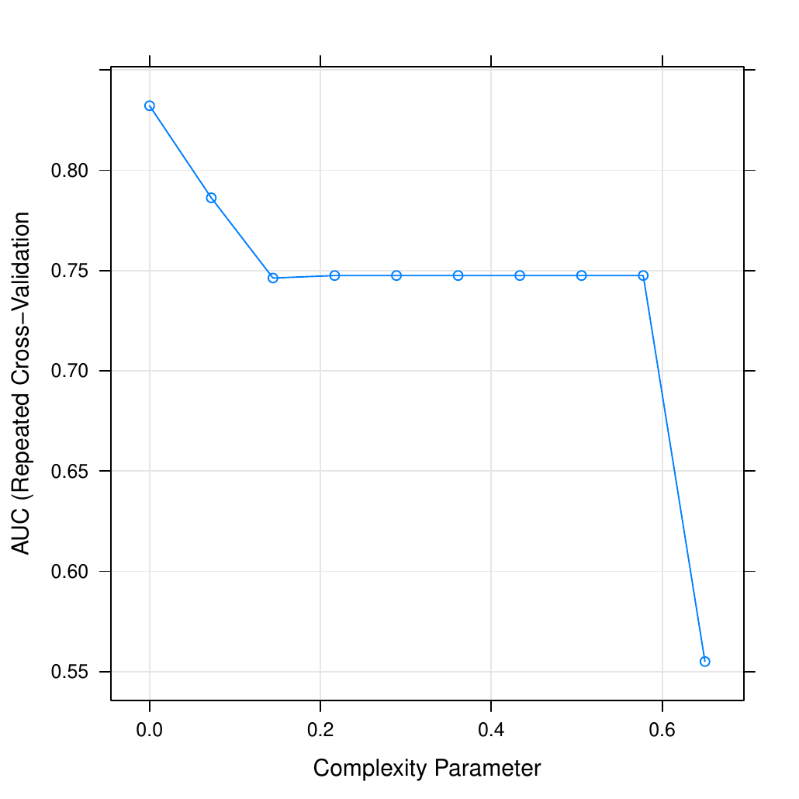
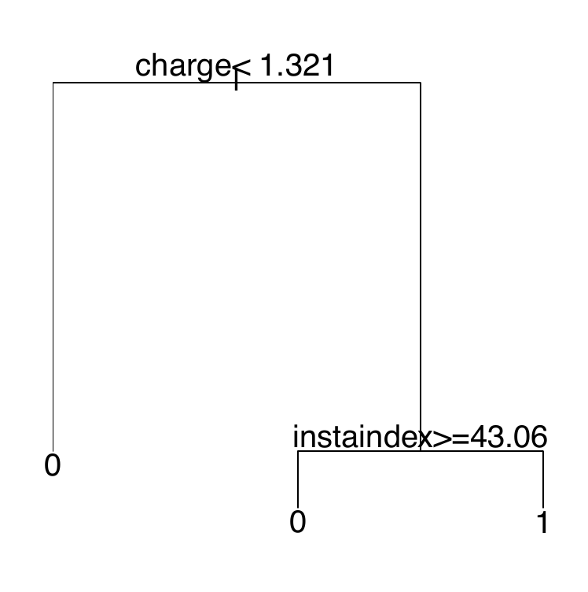

::: article
# Introduction

Antimicrobial peptides are a promising source of antibiotics with a
broad spectrum activity against bacteria and low incidence of developing
resistance [@Hancock2001]. Multiple research has concluded that the
natural biological activities of these peptides are coordinated by a
sophisticated modulation of the hydrophobicity, amphipathicity, positive
charge and a reduction in the hydrophobic moment
[@Yeaman2003; @Fjell2012; @Matsuzaki2009]. Additionally to these four
properties there are other descriptors that used in conjunction can
provide useful information in the classification and design of
antimicrobial peptides
[@Boman2003; @Wang2009; @Thomas2010; @Piotto2012].

The computation of these properties for antimicrobial peptides is
available free of charge through various web or native applications as
ExPASy-protparam [@Gasteiger2005], EMBOSS-pepstats [@Rice2000], BioPerl
[@Stajich2002], CAMP [@Thomas2010] and APD [@Wang2009] databases.
However, no application allows the computation of all properties. Some
of these services allow only the computation of some properties for a
sequence at a time, and have no option for downloading and handling this
information in editable files. Others allow the calculation of more than
one sequence, but they write an output file for each one of them, which
makes it difficult to handle and analyse the data.

Taking the advantage of handling data, vectors and tables provided by R,
we introduce the
[*Peptides*](https://CRAN.R-project.org/package=Peptides) package. It
allows quick and easy computation of ten structural characteristics own
of the antimicrobial peptides (length, amino-acid composition, net
charge, aliphatic index, molecular weight, isoelectric point,
hydrophobic moment, potential peptide interaction index, instability
index and GRAVY hydrophobicity index) in a single application. The
*Peptides* package was designed with the aim of generating data to
increase the accuracy in the classification process of new amino acid
sequences. In addition, the option to read and plot XVG output files
from GROMACS molecular dynamics package was included.

In this work we describe the computation of structural properties of the
Lasiocepsin peptide (GLPRKILCAIAKKKGKCKGPLKLVCKC) using the *Peptides*
package, step by step as an example. It is an alpha-helical
antimicrobial peptide derived from the venom of eusocial bee
*Lasioglossum laticeps*, identified in the Protein Data Bank with the
2MBD code [@Monincova2012]. Moreover, an example of a classification
using a data set of 23 variables computed for 100 peptides through
*Peptides* is performed. It was found that using this data set for
classification through linear discriminant analysis and
classification-regression trees allows to classify antimicrobial
peptides with an accuracy of 95% and 85%, respectively.

# Installation and functions

*Peptides* includes thirteen functions and is available for download and
installation from CRAN, the Comprehensive R Archive Network. To install
it, just type:

``` r
> install.packages("Peptides")
> library(Peptides)
```

The *Peptides* package requires R version 1.2.2 or higher. Development
releases of the package are available on the GitHub repository
<http://github.com/dosorio/peptides>.

## Number of amino acids

As all proteins, the antimicrobial peptides are formed by linear chains
of small residues known as amino acids attached to each other by peptide
bonds. Antimicrobial peptides are characterized by a short length, they
generally comprise less than 50 amino acids. This property minimizes the
probability of being degraded by bacterial proteases [@Kim2013]. The
function `lengthpep` counts the number of amino acids in a sequence and
returns a vector with the count for each peptide used as argument.

``` r
> lengthpep(seq = "GLPRKILCAIAKKKGKCKGPLKLVCKC")
```

``` r
[1] 27
```

## Molecular weight

The molecular weight is the sum of the masses of each atom constituting
a molecule. The molecular weight is directly related to the length of
the amino acid sequence and is expressed in units called daltons (Da).
Antimicrobial peptides due to its short length are characterized by a
molecular weight $<$`<!-- -->`{=html}10 kDa (10000 Da). In *Peptides*
the function `mw` computes the molecular weight using the same formulas
and weights as ExPASy's "compute pI/mw" tool [@Gasteiger2005].

``` r
> mw(seq = "GLPRKILCAIAKKKGKCKGPLKLVCKC")
```

``` r
[1] 2897.787
```

## Amino acid composition

Amino acids are zwitterionic molecules with an amine and a carboxyl
group present in their structure. Some amino acids possess side chains
with specific properties that allow grouping them in different ways. The
`aacomp` function classifies amino acids based on their size, side
chains, hydrophobicity, charge and their response to pH 7 following the
categories listed in Table [1](#Categorias). The output is a matrix with
the number and percentage of amino acids of a particular class.

::: {#Categorias}
  -----------------------------------
  Class       Amino acids
  ----------- -----------------------
  Tiny        A C G S T

  Small       A B C D G N P S T V

  Aliphatic   A I L V

  Aromatic    F H W Y

  Non-polar   A C F G I L M P V W Y

  Polar       D E H K N Q R S T Z

  Charged     B D E H K R Z

  Basic       H K R

  Acidic      B D E Z
  -----------------------------------

  : Table 1: Classification of the amino acids according to the
  properties of size and side chain.
:::

Antimicrobial peptides are amphipathic (with similar proportions of
polar and non-polar amino acids) and charged molecules. In *Peptides*
the amino acid composition can be computed using the function `aacomp`.

``` r
> aacomp(seq = "GLPRKILCAIAKKKGKCKGPLKLVCKC")
```

``` r
          Number  Mole%
Tiny           9 33.333
Small         12 44.444
Aliphatic      9 33.333
Aromatic       0  0.000
NonPolar      18 66.667
Polar          9 33.333
Charged        9 33.333
Basic          9 33.333
Acidic         0  0.000
```

## Net charge

Some side chains of certain amino acids can confer electric charge to
the proteins under certain pH values. The sum of the charges of each of
the amino acids is called net charge. Antimicrobial peptides have a
positive net charge (of at least $+2$) at pH 7, which provides binding
specificity to the negatively charged bacterial membranes through
electrostatic interactions [@Yeaman2003].

The `charge` function compute the net charge using
Equation \@ref(eq:nc), a variation of the Henderson Hasselbalch equation
proposed by [@Moore1985] wherein $N$ are the number, ${j}$ and ${i}$
index represent the acidic (Aspartic Acid, Glutamic Acid, Cysteine and
Tyrosine) and basic (Arginine, Lysine, and Histidine) functional groups
of amino acids, respectively.

The net charge of a protein can be calculated specifying the pH value
and one of the nine pKa scales availables (Bjellqvist, Dawson, EMBOSS,
Lehninger, Murray, Rodwell, Sillero, Solomon or Stryer).

$$\label{eq:nc} 
charge= \sum\limits_{i} N_i  \frac{+1}{1+10^{+(pH-pK_{ai})}}+\sum\limits_{j} N_j  \frac{-1}{1+10^{-(pH-pK_{aj})}}  (\#eq:nc)  $$

``` r
> charge(seq = "GLPRKILCAIAKKKGKCKGPLKLVCKC", pH = 7, pKscale = "EMBOSS")
```

``` r
[1] 8.85201
```

## Isoelectric point

The isoelectric point (pI) is the pH at which the net charge of the
protein is equal to 0. It is a variable that affects the solubility of
the peptides under certain conditions of pH. When the pH of the solvent
is equal to the pI of the protein, it tends to precipitate and loose its
biological function. Antimicrobial peptides have an isoelectric point
close to 10 [@Torrent2011], which is very similar to soap or detergent
and consistent with the proposed mechanisms of action for these
peptides.

The calculation of the isoelectric point of a peptide may be performed
through the function `pI` specifying one of the nine pKa scales
available (Bjellqvist, Dawson, EMBOSS, Lehninger, Murray, Rodwell,
Sillero, Solomon or Stryer).

``` r
> pI(seq = "GLPRKILCAIAKKKGKCKGPLKLVCKC", pKscale = "EMBOSS")
```

``` r
[1] 10.801
```

## Aliphatic index

It has been suggested that the aliphatic amino acids (A, I, L and V) are
responsible for the thermal stability of proteins. The aliphatic index
was proposed by [@Ikai1980] and evaluates the thermostability of
proteins based on the percentage of each of the aliphatic amino acids
that build up proteins. This index is computed using
Equation \@ref(eq:Aliphatic) wherein $X_{A}$, $X_{V}$, $X_{I}$ and
$X_{L}$ are the mole percent (100 x mole fraction) of Alanine, Valine,
Isoleucine and Leucine respectively.

$$\label{eq:Aliphatic} 
AI=X_{A}+2.9X_{V}+3.9\left( X_{I}+X_{L}\right)  (\#eq:Aliphatic)  $$

Antimicrobial peptides tend to be more thermostable than proteins in
general. For the calculation of the aliphatic index, the function
`aindex` was included.

``` r
> aindex(seq = "GLPRKILCAIAKKKGKCKGPLKLVCKC")
```

``` r
[1] 104.8148
```

## Instability index

The instability index was proposed by [@Guruprasad1990]. This index
predicts the stability of a protein based on its amino acid composition.
It is calculated according to Equation \@ref(eq:Instability) where $L$
is equal to the length of the amino acid sequence; $X_{i}Y_{i}$ is a
dipeptide and $DIWV$ is the dipeptide weight value on amino acid
sequence of stable proteins.

$$\label{eq:Instability} 
II=\left(\frac{10}{L}\sum_{i=10}^{L-1} DIWV_{(X_{i}Y_{i}+1)}\right)  (\#eq:Instability)  $$

Despite their short length (variable that this function penalizes),
antimicrobial peptides tend to be considered stable with index values
less than 40. The instability index can be calculated using the function
`instaindex` incorporated in *Peptides*.

``` r
> instaindex(seq = "GLPRKILCAIAKKKGKCKGPLKLVCKC")
```

``` r
[1] 2.237037
```

## Boman index

The potential protein interaction index was proposed by [@Boman2003] as
an easy way to differentiate the action mechanism of hormones
(protein-protein) and antimicrobial peptides (protein-membrane) through
this index. It is calculated using Equation \@ref(eq:Boman) by adding
each amino acid solubilities divided by the sequence length. This
function predicts the potential peptide interaction with another
protein.

$$\label{eq:Boman} 
B_{index}= \frac{\sum_{i=1}^{N} S_{i}}{N}  (\#eq:Boman)  $$

During its mechanism of action, antimicrobial peptides tend to not
interact with other proteins (the proposed mechanism of action is based
on the interaction with membranes), so the values for the Boman index
are usually negative or nearby to 0. To calculate the Boman index, the
`boman` function is included within *Peptides*.

``` r
> boman(seq = "GLPRKILCAIAKKKGKCKGPLKLVCKC")
```

``` r
[1] 0.5259259
```

## Hydrophobicity index

The hydrophobicity is an important stabilization force in protein
folding; this force changes depending on the solvent in which the
protein is found. It is considered the driving force of the peptide to
the core of the membrane. The hydrophobicity index is calculated
following the Equation \@ref(eq:Hidro), adding the hydrophobicity of
individual amino acids and dividing this value by the length of the
sequence. Highly expected transmembrane peptides generally have higher
hydrophobicity values than 0.5 using Eisenberg scale.

$$\label{eq:Hidro} 
H= \frac{\sum_{i=1}^{N} H_{i}}{N}  (\#eq:Hidro)  $$

*Peptides* includes thirty-eight scales of hydrophobicity (Aboderin,
AbrahamLeo, Argos, BlackMould, BullBreese, Casari, Chothia, Cid,
Cowan3.4, Cowan7.5, Eisenberg, Engelman, Fasman, Fauchere, Goldsack,
Guy, HoppWoods, Janin, Jones, Juretic, Kidera, Kuhn, KyteDoolittle,
Levitt, Manavalan, Miyazawa, Parker, Ponnuswamy, Prabhakaran, Rao, Rose,
Roseman, Sweet, Tanford, Welling, Wilson, Wolfenden or Zimmerman)
obtained from various sources [@Gasteiger2005; @AAIndex2008].

``` r
> hydrophobicity(seq = "GLPRKILCAIAKKKGKCKGPLKLVCKC", scale = "Eisenberg")
```

``` r
[1] -0.08777778
```

## Hydrophobic moment index

The hydrophobic moment was proposed by [@EisenbergNature1982], as a
quantitative measure of the amphiphilicity perpendicular to the axis of
any periodic peptide structure. To calculate the hydrophobic moment, the
function `hmoment` was included. The hydrophobic moment is computed
according to Equation \@ref(eq:Hmoment), using the standardized
@Eisenberg1984 scale, windows (fragment of sequence) of eleven amino
acids and specifying the rotational angle at which it should be
calculated. Highly expected transmembrane peptides generally have lower
hydrophobic moment values than 0.2.

$$\label{eq:Hmoment} 
\mu H = \left\lbrace \left[ \sum_{n=1}^{N} H_{n}\sin\left(\delta n \right)  \right]^{2} + \left[ \sum_{n=1}^{N} H_{n}\cos\left(\delta n \right)  \right]^{2}\right\rbrace ^{\frac{1}{2}}  (\#eq:Hmoment)  $$

``` r
> hmoment(seq = "GLPRKILCAIAKKKGKCKGPLKLVCKC", angle = 100, window = 11)
```

``` r
[1] 0.6170697
```

``` r
> hmoment(seq = "GLPRKILCAIAKKKGKCKGPLKLVCKC", angle = 160, window = 11)
```

``` r
[1] 0.4617153
```

## Membrane position

[@EisenbergNature1982] found a correlation between hydrophobicity and
hydrophobic moment that defines the protein section as globular,
transmembrane or superficial. The function calculates the hydrophobicity
(H) and hydrophobic moment ($\mu H)$ based on the standardized scale of
@Eisenberg1984 using windows of 11 amino acids for calculate the
theoretical fragment type.

``` r
> membpos(seq = "GLPRKILCAIAKKKGKCKGPLKLVCKC", angle = 100)
```

``` r
           Pep      H    uH  MembPos
1  GLPRKILCAIA  0.271 0.469  Surface
2  LPRKILCAIAK  0.091 0.617  Surface
3  PRKILCAIAKK -0.142 0.520 Globular
4  RKILCAIAKKK -0.289 0.401 Globular
5  KILCAIAKKKG -0.015 0.325 Globular
6  ILCAIAKKKGK -0.015 0.319 Globular
7  LCAIAKKKGKC -0.115 0.339 Globular
8  CAIAKKKGKCK -0.347 0.115 Globular
9  AIAKKKGKCKG -0.330 0.096 Globular
10 IAKKKGKCKGP -0.375 0.141 Globular
11 AKKKGKCKGPL -0.405 0.161 Globular
12 KKKGKCKGPLK -0.597 0.110 Globular
13 KKGKCKGPLKL -0.365 0.156 Globular
14 KGKCKGPLKLV -0.130 0.310 Globular
15 GKCKGPLKLVC  0.033 0.257 Globular
16 KCKGPLKLVCK -0.147 0.426 Globular
17 CKGPLKLVCKC  0.015 0.487 Globular
```

# GROMACS files

Molecular dynamics is a source of *in-silico* biophysical data that
contribute to the design, classification and testing of antimicrobial
peptides. GROMACS (GROningen MAchine for Chemical Simulations) is a
molecular dynamics package designed for simulations of proteins, lipids
and nucleic acids. It is free, open source software released under the
GNU General Public License.

The file format used by GROMACS is XVG. This format can be displayed in
graphical form through the GRACE program on UNIX/LINUX systems and the
GNUPlot program on Windows. XVG files are plain text files containing
tabular data separated by tabulators and two types of comments which
contain data labels. Although manual editing is possible, this is not a
viable option when working with multiple files of this type.

For ease of reading, information management and data plotting, the
functions `read.xvg` and `plot.xvg` were incorporated. An example of how
to read and plot the absolute distance between the center of mass of an
antimicrobial peptide with respect to a POPG
(*1-palmitoyl-2-oleoyl-sn-glycero-3-phosphoglycerol*) pure lipid bilayer
is presented below (Figure [1](#POPG)).

``` r
> file <- system.file(file = file.path("xvg-files", "POPG.xvg"), 
+                     package = "Peptides")
> md <- read.xvg(file)
> head(md)
```

``` r
  Time (ps)      |d|   d\\sx\\N   d\\sy\\N  d\\sz\\N
1         0 3.476546 -0.2250402 -0.3378360 -3.452766
2         3 3.447776 -0.2403412 -0.4272313 -3.412751
3         6 3.459584 -0.2213712 -0.3733103 -3.432252
4         9 3.391920 -0.2328529 -0.3787930 -3.362650
5        12 3.403695 -0.1856968 -0.2425249 -3.389962
```

``` r
> file <- system.file(file.path("xvg-files", "POPG.xvg"), package = "Peptides")
> plot.xvg(file)
```

{#POPG width="100%" alt="graphic without alt text"}

# Using data in the classification process

Altogether the data produced in *Peptides* are a useful source of
specifications allowing classification of antimicrobial peptides and
their differentiation from other peptides such as hormones. An example
of classification using linear discriminant analysis and
classification-regression trees through the
[*caret*](https://CRAN.R-project.org/package=caret) package [@caret] is
shown.

``` r
> install.packages("caret", dependencies = TRUE)
> library(Peptides)
> library(caret)
```

The data set was calculated using all the functions included in
*Peptides*. It is available in the `data.frame` with 100 observations
and 23 variables called `pepdata`. It includes the physicochemical
properties and calculable indices for 50 antimicrobial (group $= 1$) and
50 non-antimicrobial (group $= 0$) peptides downloaded from the Protein
Data Bank [@Bernstein1978] and the APD database [@Wang2009]
respectively.

``` r
> data(pepdata)
> str(pepdata)
```

``` r
'data.frame':  100 obs. of  23 variables:
 $ sequence      : chr  "DAEFRHDSGYEVHHQKLVFFAEDVGSNK" "SLDRSSCFTGSLDSIRAQSGLGCNSFRY" ...
 $ group         : Factor w/ 2 levels "0","1": 1 1 1 1 1 1 1 1 1 1 ...
 $ length        : int  28 28 30 22 25 28 30 25 31 26 ...
 $ mw            : num  3263 3028 3275 2747 2903 ...
 $ tinyAA        : num  21.4 50 40 13.6 24 ...
 $ smallAA       : num  46.4 60.7 56.7 27.3 44 ...
 $ aliphaticAA   : num  21.4 17.9 16.7 36.4 28 ...
 $ aromaticAA    : num  25 10.71 3.33 18.18 12 ...
 $ nonpolarAA    : num  42.9 46.4 46.7 54.5 56 ...
 $ polarAA       : num  57.1 53.6 53.3 45.5 44 ...
 $ chargedAA     : num  42.9 17.9 26.7 27.3 28 ...
 $ basicAA       : num  21.4 10.7 20 22.7 16 ...
 $ acidicAA      : num  21.43 7.14 6.67 4.54 12 ...
 $ charge        : num  -2.97 0.742 3.741 1.936 0.762 ...
 $ pI            : num  5.43 8.22 10.05 11.05 9.03 ...
 $ aindex        : num  52.1 59.3 48.7 119.5 89.6 ...
 $ instaindex    : num  26.9 58 45.5 52.8 45.1 ...
 $ boman         : num  2.65 2.43 2.22 1.77 1.84 ...
 $ hydrophobicity: num  -0.9 -0.286 -0.62 -0.145 -0.372 -0.004 -0.23 0.536 0.477 0.754 ...
 $ hmoment       : num  0.392 0.407 0.46 0.533 0.373 0.603 0.483 0.643 0.264 0.38 ...
 $ transmembrane : num  0 0 0 0 0 0 0 0.067 0.095 0.188 ...
 $ globular      : num  1 1 1 1 1 1 0.8 0.733 0.905 0.688 ...
 $ surface       : num  0 0 0 0 0 0 0.2 0.2 0 0.125 ...
```

The training and testing data sets were created with the following
commands.

``` r
> set.seed(2014)
> inTrain <- createDataPartition(y = pepdata$group, p = 0.8, list = FALSE)
> training <- pepdata[ inTrain, 2:23]
> testing <- pepdata[-inTrain, 2:23]
```

To evaluate the potential of these data, the best CART model was
selected by a $K$-fold cross-validation loop.

``` r
> folds <- 10
> repeats <- 10
> fitControl <- trainControl(method = "repeatedcv",
+                            number = folds,
+                            repeats = repeats,
+                            classProbs = TRUE,
+                            allowParallel = TRUE,
+                            summaryFunction = twoClassSummary)
>  train.rpart <- train(group~., data = training,
+                       method = "rpart",
+                       metric  = "ROC",
+                       tuneLength = 10,
+                       trControl = fitControl)
> train.rpart
```

``` r
CART 

80 samples
21 predictors
 2 classes: '0', '1' 

No pre-processing
Resampling: Cross-Validated (10 fold, repeated 10 times) 

Summary of sample sizes: 72, 72, 72, 72, 72, 72, ... 

Resampling results across tuning parameters:

  cp          ROC        Sens    Spec    ROC SD     Sens SD    Spec SD  
  0.00000000  0.8321875  0.8075  0.7525  0.1327056  0.1875379  0.2117001
  0.07222222  0.7862500  0.7525  0.7700  0.1664132  0.2056494  0.2294041
  0.14444444  0.7462500  0.6450  0.8850  0.1847590  0.2414707  0.2023224
  0.21666667  0.7475000  0.6450  0.9000  0.1854731  0.2414707  0.1946247
  0.28888889  0.7475000  0.6450  0.9000  0.1854731  0.2414707  0.1946247
  0.36111111  0.7475000  0.6450  0.9000  0.1854731  0.2414707  0.1946247
  0.43333333  0.7475000  0.6450  0.9000  0.1854731  0.2414707  0.1946247
  0.50555556  0.7475000  0.6450  0.9000  0.1854731  0.2414707  0.1946247
  0.57777778  0.7475000  0.6450  0.9000  0.1854731  0.2414707  0.1946247
  0.65000000  0.5550000  0.7650  0.3800  0.1128152  0.2926283  0.4570989

ROC was used to select the optimal model using  the largest value.
The final value used for the model was cp = 0. 
```

``` r
> plot(train.rpart)
```

To evaluate the accuracy of the classifier a prediction with testing
data was performed.

``` r
> pred.rpart <- predict(train.rpart, newdata = testing)
> pred.rpart
```

``` r
 [1] 1 0 0 0 0 0 0 0 0 0 0 1 1 0 1 1 1 1 1 1
Levels: 0 1
```

Classification-regression trees using this data set showed an accuracy
of 85%, a sensitivity of 80% and a specificity of 90% to differentiate
antimicrobial from non-antimicrobial peptides.

``` r
> confusionMatrix(data = pred.rpart, testing$group, positive = "1")
```

``` r
Confusion Matrix and Statistics

          Reference
Prediction 0 1
         0 9 2
         1 1 8
                                          
               Accuracy : 0.85            
                 95% CI : (0.6211, 0.9679)
    No Information Rate : 0.5             
    P-Value [Acc > NIR] : 0.001288        
                                          
                  Kappa : 0.7             
 Mcnemar's Test P-Value : 1.000000        
                                          
            Sensitivity : 0.8000          
            Specificity : 0.9000          
         Pos Pred Value : 0.8889          
         Neg Pred Value : 0.8182          
             Prevalence : 0.5000          
         Detection Rate : 0.4000          
   Detection Prevalence : 0.4500          
      Balanced Accuracy : 0.8500          
                                          
       'Positive' Class : 1   
```

``` r
> tree <- train.rpart$finalModel
> plot(tree, compress = TRUE, margin = c(0.1, 0.1, 0.1, 0.1), cex = 0.5)
> text(tree)
```

<figure id="Arbol">
<p></p>
<figcaption>Figure 2: plot(train.rpart) shows the relationship between
the complex parameter and the resampled estimate area under the ROC
curve used to find the best model. plot(tree) shows the rules to
classify the antimicrobial peptides of the Pepdata data
set.</figcaption>
</figure>

For this data set, the resulting classification-regression tree is based
on characteristic properties of antimicrobial peptides such as charge
and instability index (Figure [2](#Arbol)).

The same process was conducted to evaluate the data potential using a
linear discriminant analysis.

``` r
> train.lda <- train(group~., data = training,
+                    method = "lda",
+                    metric = "ROC",
+                    tuneLength = 10,
+                    trControl = fitControl)
> train.lda
```

``` r
Linear Discriminant Analysis 

80 samples
21 predictors
 2 classes: '0', '1' 

No pre-processing
Resampling: Cross-Validated (10 fold, repeated 10 times) 

Summary of sample sizes: 72, 72, 72, 72, 72, 72, ... 

Resampling results

  ROC       Sens  Spec  ROC SD     Sens SD    Spec SD  
  0.821875  0.78  0.8   0.1534471  0.2169578  0.1978419
```

``` r
> pred.lda <- predict(train.lda, newdata = testing)
> pred.lda
```

``` r
 [1] 0 0 0 0 0 0 0 1 0 0 1 1 1 1 1 1 1 1 1 1
Levels: 0 1
```

The linear discriminant analysis using this data set showed an accuracy
of 95%, a sensitivity of 100% and a specificity of 90% to differentiate
antimicrobial from non-antimicrobial peptides.

``` r
> confusionMatrix(data = pred.lda, testing$group,positive = "1")
```

``` r
Confusion Matrix and Statistics

          Reference
Prediction  0  1
         0  9  0
         1  1 10
                                          
               Accuracy : 0.95            
                 95% CI : (0.7513, 0.9987)
    No Information Rate : 0.5             
    P-Value [Acc > NIR] : 2.003e-05       
                                          
                  Kappa : 0.9             
 Mcnemar's Test P-Value : 1               
                                          
            Sensitivity : 1.0000          
            Specificity : 0.9000          
         Pos Pred Value : 0.9091          
         Neg Pred Value : 1.0000          
             Prevalence : 0.5000          
         Detection Rate : 0.5000          
   Detection Prevalence : 0.5500          
      Balanced Accuracy : 0.9500          
                                          
       'Positive' Class : 1                                     
```

# Summary

We introduced the *Peptides* package to calculate physicochemical
properties and indices from amino acids sequences of peptides and
proteins. We also showed how the package's functions can be used to
produce useful data in classification-regression processes and handle
the output files from the GROMACS molecular dynamics package. The
authors are currently working on extending the package by the addition
of new biological functions such as peptide flexibility [@Huang2003],
molecular lipophilicity potential [@MLP], cell penetrating parameter
[@CPP] and free energy of binding [@DG].

# Acknowledgements

This project corresponds to a part of the first author's undergraduate
thesis. We thank COLCIENCIAS from Colombia for the fellowship to PR and
to the anonymous reviewers for their helpful comments and suggestions.

\

\

\
:::
