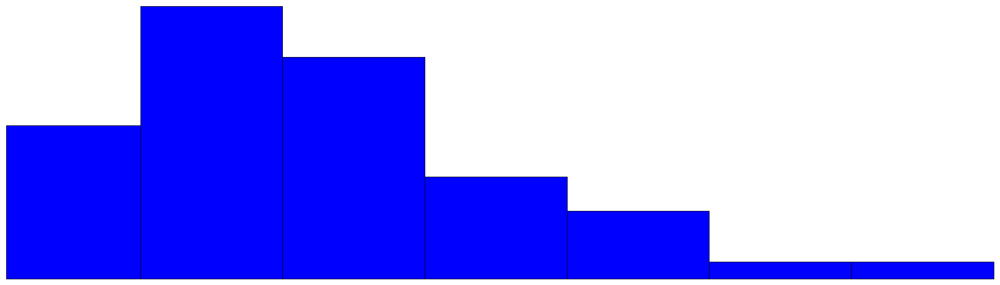
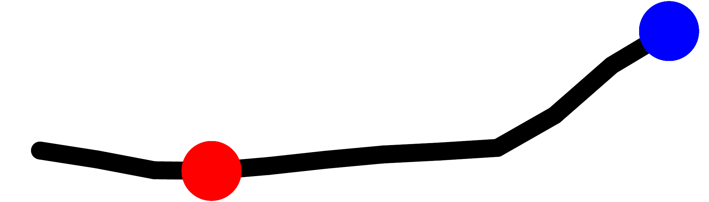

::: article
# Introduction

Without doubt, visualization of data becomes more and more important for
data analysis and for presenting aggregated information for end-users
and policy needs. For surveys on the history and developments in
visualization we refer to [@Friendly:06:hbook] and [@wickham13]. The
reason for this is that the human eye is a very powerful pattern
recognition tool. Readers can easily understand simple visual
presentations of data like charts published every day in newspapers, the
internet, television and scientific articles. The visual presentation of
data should illustrate trends and relationships quickly and easily and
should display key figures about data. For readers it is often much
easier to understand statistics when seeing a chart or a map rather than
being confronted with a long list of numbers [see, e.g., @unece].

@cleveland87 state that information encoded in a graph depends on a
number of aspects such as plotting symbols, length, slopes or colors.
Changing any aspect of a graph possibly leads to a different perception
and decoding of the information. Thus it is required to research aspects
of graphical representation of data and finally come up with
recommendations or best practices. This task has been been tackled by
various authors [see, e.g., @cleveland87; @tufte86]. @cleveland87
suggest, for example, an optimum mid-angle of 45 degrees when comparing
the slopes of different lines.[^1] Other suggestions on how to scale the
data exist and are summarized in @heer06. Details on the choice of
colors can be found in @zeileis09.

#### Tables:

Tables are a comprehensive way to summarize the most important facts
about complex data. @unece claims that a small, well-formatted table can
provide a great deal of information that readers can quickly absorb, and
it, as well as @miller04, provide guidelines on how to design tables.
However, the possibility of including graphics in tables (and text) is
not covered.

#### Tufte's pioneer work:

In our contribution, several examples show how to improve tables by
including small graphics in the tables. It is pointed out that an
improved table can contain various visual elements. This was originally
proposed by @Tufte01. He introduced the concept of sparklines and their
application that is not limited to tables. These *intense, simple* and
*word-sized graphics* sparklines can be embedded in continuous text and
also match with other propositions he has made. For example, they can
easily be used together with the small multiples approach [@Tufte90].
According to Tufte it is always important to answer the question
*compared to what?* when looking at graphs. Thus, the concept of small
multiples is simply to put multiple graphs next to each other to allow
direct visual comparisons between different (graphical) objects. He also
states that small multiples are the best design solution to present a
wide range of problems.

Another proposition Tufte makes is to *show the data above all*. In
order to do so he introduces the term of *data-ink ratio*. This ratio
can be seen as the ink in a graph used to actually show data by the
total ink used to print a graph. While the additional ink used for
labels, axes, ticks and grids among others may help to improve graphs,
it distracts attention from the most important part of the graph -- the
data values itself. Thus, in his view the data-ink ratio should be
increased whenever possible and sparklines are a way to do so, since it
is possible to show a high amount of data, trends and variations in
small space. This concept has also been criticized. @inbar07 evaluated
people's acceptance of the minimalist approach (by increasing the
data-ink ratio) to visualize information; a standard bar-graph and a
minimalist version [both in @Tufte01] were compared. The majority of
evaluators was more attracted by the standard graph. However, they
didn't evaluate the case of placing sparklines in text or tables.
Traditionally, the output in many areas of statistics is focused on
tables [@unece], this is especially true for official statistics. Large
tables with lots of number provide a lot of information, but make it
hard to grasp it. Visualization can provide tools to make effects in the
data visible at first sight and can provide the possibility to show more
of the data than by just showing the numbers.

#### Software to produce sparklines:

To make visualization methods applicable, software tools, which provide
interactions with the data and provide reproducibility of any result,
are needed.

To publish sparklines in newspapers has a long history. For example, the
Huntsville Times reports the use of sparklines in their sports section
on March 21, 2005. To produce this kind of sparklines and graphical
tables, various software products are available. For example, SAS© and
JMP© include such facilities.[^2] Also Microsoft Excel allows to produce
sparklines and there are implementations to produce simple sparklines
for Photoshop, Prism, DeltaMaster and matplotlib. Most of these
solutions are closed-source and commercial.

# The *sparkTable* package {#pkg-sparkTable}

Our contribution goes a step beyond the before mentioned available
tools. It is not just a re-implementation of sparklines in another
software. Various improvements have been made and new features are
available to the user.

The presented software is free and open-source, its features are
designed in a well-specified, object-oriented manner with defined
classes and methods. The presented software allows to save the
sparklines in different output formats for easy inclusion in LaTeX or
websites with many optional graphical features, i.e., the sparklines are
highly customizable. The software features the simple generation of
graphical tables with any statistical content that is automatically
calculated from microdata. Finally, interactive features to create
sparklines and sparktables are available and clickable in the browser.

In the following, a short introduction into the R package
[*sparkTable*](https://CRAN.R-project.org/package=sparkTable) [@sparkT]
is given with the help of an example. The first version of the package
was uploaded to the Comprehensive R Archive Network (CRAN) in May 2010
and has been improved various times since then.

The initial task was to find ways how common and frequent output such as
tables and reports of statistical organizations could be improved using
spark-type graphs and to find a technical solution to create these
visualizations. Since R is gaining momentum in national statistical
institutes all over the world, it was a natural choice to create an
add-on package for R containing such functionality. There are a variety
of reasons for this: one of them is the possibility to easily share and
distribute the package and to instantly get feedback from users.

The goal was to create a free and open source software tool that allows
the quick creation of spark-type graphics that could easily be included
in various documents such as reports or web pages. Many examples for
graphical tables have been produced and -- based on the feedback from
both colleagues and users -- it seems as if graphical tables are an
helpful tool to improve traditional, existing, tabular-based outputs of
national statistical offices. Some of these graphical tables are
presented below.

*sparkTable* can also be used by non experts in R. Interactive clickable
features have been added to the package. Especially for graphical
tables, some steps of abstraction are still required. However, it has
been made easier to customize and change graphical tables by using
interactive web applications. Instead of a formal description of classes
and methods and internal implementation of the package, the
functionality of the package is illustrated with examples.

# Command line usage of *sparkTable* by example {#examples}

The first step is to install and load the package. We assume that R has
already been started. Then the package can be simply installed from any
CRAN server.

Help files can be accessed from R by typing
`help(package = "sparkTable")` into the console. This results in a
browse-able, linked help archive. Each method, function and data set
that comes with the package is documented and also some example code is
provided which allows users to become familiar with the package. So as
to demonstrate the facilities of *sparkTable*, example data sets
available in the package are used.

Table [1](#tabcommands) shows the most important functions and classes
of the *sparkTable* package. Basic functions are available to produce
sparklines, e.g., `newSparkLine` to create an object of class
'`sparkline`' that can be used as input for the plotting method `plot()`
which dispatches based on the class of the input method. Using method
`export()` it is possible to save mini-plots as files (pdf, png or eps)
on the hard-disk. In addition, functions are available to produce
graphical tables and calculate summary statistics for tables,
see [3.1](#basic_sparks) and [3.2](#graphical_tables) for practical
examples and more explanations.

::: {#tabcommands}
  ------------------------------------------------------------------------------------------------------------------------------------------------------------------------------------------------------------------------------------------------------------------------------------------------
  **Function**                                                        **Description**                                                                                                                      **Comment**
  ------------------------------------------------------------------- ------------------------------------------------------------------------------------------------------------------------------------ ---------------------------------------------------------------------------------------
  `newSparkLine()` `newSparkBar()` `newSparkBox()` `newSparkHist()`   creation of sparklines, sparkbars, sparkboxplots and sparkhistograms that may serve as the base for creating graphical tables        creates objects of class '`sparkline`', '`sparkbar`', '`sparkbox`' and '`sparkhist`'

  `plot()`                                                            plots objects of class '`sparkline`', '`sparkbar`', '`sparkhist`' or '`sparkbox`'                                                    

  `export()`                                                          saves objects of class '`sparkline`', '`sparkbar`', '`sparkhist`', '`sparkbox`' or '`sparkTable`'                                    

  `summaryST()`                                                       summary for a data frame in a graphical table                                                                                        creates an object of class '`sparkTable`'. Customize the output with `setParameter()`

  `newSparkTable()`                                                   function to create an object of class '`sparkTable`'                                                                                 

  `getParameter()`, `setParameter()`                                  basic functions to set parameters for objects of class '`sparkline`', '`sparkbar`', '`sparkbox`', '`sparkTable`' (or '`geoTable`')   
  ------------------------------------------------------------------------------------------------------------------------------------------------------------------------------------------------------------------------------------------------------------------------------------------------

  : Table 1: Most important functions of package *sparkTable*.
:::

In the following we show how to create basic spark graphics in
[3.1](#basic_sparks). Then we demonstrate how to produce graphical
tables that include some sparks in [3.2](#graphical_tables). We finish
by introducing the new interactive ways that can be used to change,
modify and adjust objects generated with package *sparkTable* in
[4](#interactive).

## Basic sparks {#basic_sparks}

The data set `pop`, which is included in the package, is used. This data
set contains the Austrian population size for different age groups from
1981 to 2009. We start by loading the data set into the current R
session.

``` r
> data(pop, package = "sparkTable")
```

This data set -- available in long-format -- contains three variables.
The variable `time` describes the year, variable `variable` the
different age groups and variable `value` the corresponding population
numbers. Next, an object, which contains all the information required to
plot a first sparkline, is generated. This can be achieved using
function `newSparkLine()`. Calling the function and only setting
argument `values` to use the population data of Austria stored in vector
`popges` as shown in the code listing below, we obtain a new object
`sline` (respectively `slineIQR`, where also the Inter-Quartile-Range
(IQR) is visualized) with default settings for a sparkline plot.

``` r
> pop_ges <- pop$value[pop$variable == "Insgesamt"]
> sline <- newSparkLine(values = pop_ges)
> slineIQR <- newSparkLine(values = pop_ges, showIQR = TRUE)
```

The resulting object `sline` is of class '`sparkline`' and has the
default parameter settings. Later it is shown how to change specific
settings of the graph using the generic function `setParameter()`. Note
that it is also possible to directly change parameters using
`newSparkLine()` directly. The help-files that can be accessed using
`?newSparkLine` give an overview on the parameters that can be set or
changed.

After creating a sparkline object it is possible to create a plot using
function `plot()` or saving the graphic by applying method `export()`.
Using these methods it is possible to plot and export not only objects
of class '`sparkline`' but also objects of class '`sparkBar`' (generated
with `newSparkBar()`), '`sparkBox`' (generated with `newSparkBox()`) and
'`sparkHist`' (generated with `newSparkHist()`). The function `export()`
requires a '`spark*`' object as input and allows to specify the desired
output format. Currently, one of the following output formats can be
selected by changing the function argument `outputType`:

-   `"pdf"`: the spark-graphic is saved in pdf-format;
-   `"eps"`: the graph is saved as an encapsulated postscript file;
-   `"png"`: the graphic is written to disk as a portable network graph.

The function argument `outputType` is serialized so that it is possible
to create the graphics in all possible formats in one step. By the help
of argument `filename`, users can specify an output filename for the
resulting graphic. The code listing below shows how to save the
sparkline represented in obj `sline` as a pdf-graphic with filename
`first-sl.pdf`.

``` r
> export(object = sline, outputType = "pdf", 
+   filename = file.path("figures", "first-sl"))
> export(object = slineIQR, outputType = "pdf", 
+   filename = file.path("figures", "first-sl-IQR"))
```

This graph can now easily be included in the current text showing the
development {width="1.2cm" height="0.8em"}
of the Austrian population from 1981 to 2009, alternatively with integrated IQR
{width="1.2cm" height="0.8em"} .

Similarly, other types of graphics can be produced. The next code
listing highlights how to create other supported kind of word-graphs. In
addition, some of the default parameters are changed.

``` r
> v1 <- as.numeric(table(rpois(50, 2))); v2 <- rnorm(50)
> sbar <- newSparkBar(values = v1, barSpacingPerc = 5)
> sbox <- newSparkBox(values = v2, boxCol = c("black", "darkblue"))
> shist <- newSparkHist(values = v2, barCol = c("black", "darkgreen", "black"))
> export(object = sbar, outputType = "pdf", 
+   filename = file.path("figures", "first-bar"))
> export(object = sbox, outputType = "pdf", 
+   filename = file.path("figures", "first-box"))
> export(object = shist, outputType = "pdf", 
+   filename = file.path("figures", "first-hist"))
```

Since they were exported as pdf-files, the produced
{width="1.2cm" height="0.8em"} sparkbar,
the {width="1.2cm" height="0.8em"} sparkbox
and the {width="1.2cm" height="0.8em"} sparkhist
can be easily integrated into a LaTeX-document as shown here.

Changing parameters of spark objects can also be achieved by using
function `setParameter()`. In the help file (accessible via
`?setParameter`) all possible values that can be changed are explained
and listed. Some of the options that might be changed are now listed
below:

-   `width`: available vertical space of the graph;
-   `height`: available horizontal space of the graph;
-   `values`: data points that should be plotted;
-   `lineWidth`: the thickness of the line in a sparkline-plot;
-   `pointWidth`: the radius of special points (minimum, maximum, last
    observation) of a sparkline;
-   `showIQR`: whether the IQR is plotted in a sparkline-graph;
-   `outCol`: color of outlying observations in a sparkbox-graph;
-   `barSpacingPerc`: percent of the total horizontal space used between
    the bars in a sparkbar-graph.

We now show how to change some graphical parameters of the spark
graphics we have just produced.

``` r
> sline2 <- setParameter(sline, type = "lineWidth", value = 2)
> sline2 <- setParameter(sline2, type = "pointWidth", value = 5)
> export(object = sline2, outputType = "pdf", 
+   filename = file.path("figures", "second-sl"))
```

For example the thickness of the line was changed in the sparkline
object `sline2` from the default value of 1 to 2. Additionally, we
changed the size of the points for special values in the sparkline to 5.
If this line is plotted, the sparkline showing Austrian population
numbers {width="1.2cm" height="0.8em"}
looks different.

It is worth noting that the current settings can be queried using
function `getParameter()` in an analogue way as setting parameters by
just leaving out the argument `values`. Detailed information about the
kind of information that can be extracted using this function is
available from the help page that is accessible via `?getParameter`.

Further, it is worth noting that these mini-graphs can also be directly
included in fully automated reports. In the following example we show
how to include a sparkline into a HTML-document that is created with
[*knitr*](https://CRAN.R-project.org/package=knitr) [@knitrpkg] and the
*R markdown* language.

<figure id="mdex">
<div class="sourceCode" id="cb1"><pre class="sourceCode r"><code class="sourceCode r"><span id="cb1-1"><a href="#cb1-1" aria-hidden="true" tabindex="-1"></a><span class="st">```</span><span class="at">{r, echo=TRUE}</span></span>
<span id="cb1-2"><a href="#cb1-2" aria-hidden="true" tabindex="-1"></a><span class="at">require(sparkTable)</span></span>
<span id="cb1-3"><a href="#cb1-3" aria-hidden="true" tabindex="-1"></a><span class="at">sl &lt;- newSparkLine(values = rnorm(25), lineWidth = .18, pointWidth = .4,</span></span>
<span id="cb1-4"><a href="#cb1-4" aria-hidden="true" tabindex="-1"></a><span class="at">  width = .4, height = .08)</span></span>
<span id="cb1-5"><a href="#cb1-5" aria-hidden="true" tabindex="-1"></a><span class="at">export(sl, outputType = &quot;png&quot;, filename = &quot;sparkLine&quot;)</span></span>
<span id="cb1-6"><a href="#cb1-6" aria-hidden="true" tabindex="-1"></a><span class="st">```</span></span>
<span id="cb1-7"><a href="#cb1-7" aria-hidden="true" tabindex="-1"></a>This is a sparkline included <span class="cf">in</span> the <span class="sc">!</span>[firstSparkLine](sparkLine.png) </span>
<span id="cb1-8"><a href="#cb1-8" aria-hidden="true" tabindex="-1"></a>text...</span></code></pre></div>
<figcaption>Listing 1: Content of minimal markdown file that contains
a sparkline.</figcaption>
</figure>

A minimal example is shown in Listing [1](#mdex). In the first part, a
sparkline graph with random values is generated and saved as an image in
png-format. We made sure that the height of the image equals
approximately the height of a single line. Using markdown code, this
image is finally included in the text. The integration in LaTeX , using
`Sweave`, *knitr* or [*brew*](https://CRAN.R-project.org/package=brew)
[@brew], is straightforward, i.e., the code environment in
Listing [1](#mdex) needs to be changed to `Sweave`, *knitr* or *brew*
style.

## Graphical tables {#graphical_tables}

In [3.1](#basic_sparks), the basic usage of the package *sparkTable* to
produce sparklines was demonstrated. Now we show how to enrich tables by
including sparkgraphs. In addition, it is shown how spark-graphs can be
used to visualize regional indicators in so-called checkerplots
[@templ2013combining]. We point out that existing tools -- specifically
[*xtable*](https://CRAN.R-project.org/package=xtable) [@xtablepkg] --
are used to generate the final output.

In order to plot a graphical table, the first step is to create a
suitable input object - in this case an object of class '`sparkTable`'.
Objects of this kind hold the data itself in a suitable format. Further,
such objects contain a list with information about the type of graphs or
functions on the data values that should be shown in the resulting
table. Moreover, a vector of variable names must be listed to specify
for which variables in the data input graphs should be produced. These
steps can be achieved using function `newSparkTable()`. To illustrate
this procedure, we give an example using results from the 2013/2014
soccer season in Austria.

``` r
> # load data (in long format)
> data(AT_Soccer, package = "sparkTable")
> # first three observations to see the structure of the data
> head(AT_Soccer, 3)
```

``` r
   team time points wl goaldiff shotgoal getgoal
1 Rapid    1      1  0        0        2       2
2 Rapid    2      3  1        4        4       0
3 Rapid    3      3  1        2        4       2
```

``` r
> # prepare content
> content <- list(
+     function(x) { sum(x) },
+     function(x) { round(sum(x), 2) },
+     function(x) { round(sum(x), 2) },
+     newSparkLine(lineWidth = 2, pointWidth = 6), newSparkBar()
+ )
> names(content) <- c("Points", "ShotGoal", "GetGoal", "GoalDiff", "WinLose")
> 
> # set variables
> vars <- c("points", "shotgoal", "getgoal", "goaldiff", "wl")
> 
> # create the sparkTable object
> stab <- newSparkTable(dataObj = AT_Soccer, tableContent = content, varType = vars)
```

The required code to create a '`sparkTable`' object as shown above can
be splitted into four sections. In the first line the input data set (in
suitable long format for function `newSparkTable()`) is loaded.

The next step is to prepare a list specifying the content of each column
of the required table. In this case the table is specified by five
columns. In the first three columns very simple user-defined functions
are used to aggregate three different variables. Note that the provided
function can be arbitrarily complex.

For the last two columns of the table, sparklines and sparkbars are
created. In this case we show that it is also possible to change
parameters directly when creating such objects. We used this possibility
to change the thickness of the line and the size of points for
sparklines as it was already described in [3.1](#basic_sparks). It
should also be noted that the names of this input list correspond to
column names in the resulting final table, therefore we set the names of
this list to the desired column headers. For example, the first column
in the final table will have column name *Points*.

After the object `stab` has been established, the graphical table can be
created. The required code is shown below:

``` r
> export(stab, outputType = "tex", filename = file.path("figures", "first-stab"),
+   graphNames = file.path("figures", "first-stab"))
```

The function `export()` is applied on the object `stab`, which has just
been created in the previous example. The format of the output can be
specified. By setting argument `outputType` to `’tex’`, the functions
write LaTeX-code in the file specified with argument `filename`.
Additionally, some instructions on how to include the table into a
document are printed in the R session. It is worth to note that the code
used to generate the table is also returned to R, which makes it easy to
include it into reproducible reports. The final result of this example
is shown in Table [2](#graph:sparkTable). The embedded sparklines in the
second last column of Table [2](#graph:sparkTable) present an optimum
mid-angle of 45 degrees of the slopes of each time series.

::: {#graph:sparkTable}
  ---------------------------------------------------------------------------------------------------------------------------------------------------
              Points   ShotGoal   GetGoal   GoalDiff                                             WinLose
  ----------- -------- ---------- --------- ---------------------------------------------------- ----------------------------------------------------
        Rapid $62$     $63$       $40$      {height="1em"}    {height="1em"}

     Salzburg $80$     $110$      $35$      {height="1em"}    {height="1em"}

      Austria $53$     $58$       $44$      {height="1em"}    {height="1em"}

        Sturm $48$     $55$       $56$      {height="1em"}    {height="1em"}

      Groedig $54$     $68$       $71$      {height="1em"}    {height="1em"}

     Neustadt $39$     $43$       $84$      {height="1em"}    {height="1em"}

    FC Wacker $29$     $42$       $70$      {height="1em"}    {height="1em"}

    Wolfsberg $41$     $51$       $63$      {height="1em"}    {height="1em"}

         Ried $43$     $55$       $66$      {height="1em"}    {height="1em"}

       Admira $42$     $51$       $67$      {height="1em"}   {height="1em"}
  ---------------------------------------------------------------------------------------------------------------------------------------------------

  : Table 2: A graphical table featuring data values and sparkgraphs
  applied to Austrian soccer data. For each game in the entire season,
  wins are maked blue, defeats in read and no bars are plotted for
  draws. In addition we present differences in goals throughout the
  season an well as overall points and goals for each team.
:::

In case a user wants to include a table in LaTeX, a short tex-macro
(*\\graph*), which also has to be included in the LaTeX source, is
printed by default in the R console. This information can be switched
off by setting function argument `infonote` to `FALSE`.

## Geographical tables

The concept to create geographical tables is based on the concept of the
so called checkerplot [@templ2013combining], which is also implemented
in the package *sparkTable* in the function `checkerplot()`. We now show
how to generate a geographical table for the EU using the function
`newGeoTable()` and `plotGeoTable()`. The final result is shown in
Table [3](#graph:geotable). Let us first load some data and print the
first three rows of the data:

``` r
> data(popEU, package = "sparkTable")
> data(debtEU, package = "sparkTable")
> data(coordsEU, package = "sparkTable")
> popEU <- popEU[popEU$country %in% coordsEU$country, ]
> debtEU <- debtEU[debtEU$country %in% coordsEU$country, ]
> EU <- cbind(popEU, debtEU[, -1])
> head(EU, 3)
```

``` r
  country    B1999    B2000    B2001    B2002    B2003    B2004    B2005
1      BE 10213752 10239085 10263414 10309725 10355844 10396421 10445852
2      BG  8230371  8190876  8149468  7891095  7845841  7801273  7761049
3      CZ 10289621 10278098 10266546 10206436 10203269 10211455 10220577
     B2006    B2007    B2008    B2009    B2010 X1999 X2000 X2001 X2002
1 10511382 10584534 10666866 10753080 10839905 113.7 107.9 106.6 103.5
2  7718750  7679290  7640238  7606551  7563710  77.6  72.5  66.0  52.4
3 10251079 10287189 10381130 10467542 10506813  16.4  18.5  24.9  28.2
  X2003 X2004 X2005 X2006 X2007 X2008 X2009 X2010
1  98.5  94.2  92.1  88.1  84.2  89.6  96.2  96.8
2  44.4  37.0  27.5  21.6  17.2  13.7  14.6  16.2
3  29.8  30.1  29.7  29.4  29.0  30.0  35.3  38.5
```

Before we generate sparklines, the data has to be transformed to long
format. `reshapeExt()` can be used to bring the data to the form so that
`newSparkTable()` or `newGeoTable()` can be applied. In `reshapeExt()`,
parameter `idvar` defines variables in long format that identify
multiple records from the same group/individual and `v.names`
corresponds to names of variables in the long format that correspond to
multiple variables in the wide format, see `?reshapeExt` for details. We
show the first two list elements of the reordered data:

``` r
> EUlong <- reshapeExt(EU, idvar = "country", v.names = c("pop", "debt"),
+   varying = list(2:13, 14:25), geographicVar = "country", timeValues = 1999:2010)
> head(EUlong, 2)
```

``` r
$BE
      country time      pop  debt
BE.1       BE 1999 10213752 113.7
BE.2       BE 2000 10239085 107.9
BE.3       BE 2001 10263414 106.6
BE.4       BE 2002 10309725 103.5
BE.5       BE 2003 10355844  98.5
BE.6       BE 2004 10396421  94.2
BE.7       BE 2005 10445852  92.1
BE.8       BE 2006 10511382  88.1
BE.9       BE 2007 10584534  84.2
BE.10      BE 2008 10666866  89.6
BE.11      BE 2009 10753080  96.2
BE.12      BE 2010 10839905  96.8

$BG
      country time     pop debt
BG.1       BG 1999 8230371 77.6
BG.2       BG 2000 8190876 72.5
BG.3       BG 2001 8149468 66.0
BG.4       BG 2002 7891095 52.4
BG.5       BG 2003 7845841 44.4
BG.6       BG 2004 7801273 37.0
BG.7       BG 2005 7761049 27.5
BG.8       BG 2006 7718750 21.6
BG.9       BG 2007 7679290 17.2
BG.10      BG 2008 7640238 13.7
BG.11      BG 2009 7606551 14.6
BG.12      BG 2010 7563710 16.2
```

The data is now ready and we can produce the geographical table:

``` r
> l <- newSparkLine(lineWidth = 3, pointWidth = 10)
> content <- list(function(x) { "Population:" }, l, function(x) {"Debt:" }, l)
> varType <- c(rep("pop", 2), rep("debt", 2))
> xGeoEU <- newGeoTable(EUlong, content, varType, geographicVar = "country",
+   geographicInfo = coordsEU)
> export(xGeoEU, outputType = "tex", graphNames = file.path("figures", "out1"), 
+   filename =  file.path("figures", "testEUT"), transpose = TRUE)
```

For the geographical representation in a grid, geographical coordinates
have to be provided. Internally, an allocation problem is solved by
linear programming to find the nearest free grid cell from the provided
coordinates under several constraints. For this task, we refer to
@templ2013combining, resulting in, for example, Scandinavian countries
placed in the north, south Mediterranean countries in the south, etc.
Again, the sparklines in each grid can be modified by function
`setParameter()`.

::: {#graph:geotable}
  -------------------------------------------------- -------------------------------------------------- -------------------------------------------------- -------------------------------------------------- -------------------------------------------------- --------------------------------------------------
                        **IS**                                                                                                **NO**                                             **SE**                                             **FI**                                             **EE**

                        $Pop:$                                                                                                $Pop:$                                             $Pop:$                                             $Pop:$                                             $Pop:$

   {height="1.5em"}                                                      {height="1.5em"}   {height="1.5em"}   {height="1.5em"}   {height="1.5em"}

                       $Debt:$                                                                                               $Debt:$                                            $Debt:$                                            $Debt:$                                            $Debt:$

   {height="1.5em"}                                                      {height="1.5em"}   {height="1.5em"}   {height="1.5em"}   {height="1.5em"}

                                                                           **NL**                                             **DE**                                             **DK**                                             **LT**                                             **LV**

                                                                           $Pop:$                                             $Pop:$                                             $Pop:$                                             $Pop:$                                             $Pop:$

                                                      {height="1.5em"}   {height="1.5em"}    {height="1.5em"}    {height="1.5em"}   {height="1.5em"}

                                                                          $Debt:$                                            $Debt:$                                            $Debt:$                                            $Debt:$                                            $Debt:$

                                                      {height="1.5em"}   {height="1.5em"}    {height="1.5em"}    {height="1.5em"}   {height="1.5em"}

                        **UK**                                             **IE**                                             **BE**                                             **CZ**                                             **PL**                                             **SK**

                        $Pop:$                                             $Pop:$                                             $Pop:$                                             $Pop:$                                             $Pop:$                                             $Pop:$

   {height="1.5em"}   {height="1.5em"}    {height="1.5em"}    {height="1.5em"}    {height="1.5em"}   {height="1.5em"}

                       $Debt:$                                            $Debt:$                                            $Debt:$                                            $Debt:$                                            $Debt:$                                            $Debt:$

   {height="1.5em"}   {height="1.5em"}    {height="1.5em"}    {height="1.5em"}    {height="1.5em"}   {height="1.5em"}

                        **LU**                                             **CH**                                             **LI**                                             **AT**                                             **HU**                                             **RO**

                        $Pop:$                                             $Pop:$                                             $Pop:$                                             $Pop:$                                             $Pop:$                                             $Pop:$

   {height="1.5em"}   {height="1.5em"}   {height="1.5em"}   {height="1.5em"}   {height="1.5em"}   {height="1.5em"}

                       $Debt:$                                            $Debt:$                                            $Debt:$                                            $Debt:$                                            $Debt:$                                            $Debt:$

   {height="1.5em"}   {height="1.5em"}   {height="1.5em"}   {height="1.5em"}   {height="1.5em"}   {height="1.5em"}

                        **PT**                                             **FR**                                             **SI**                                             **HR**                                             **BG**                                             **TR**

                        $Pop:$                                             $Pop:$                                             $Pop:$                                             $Pop:$                                             $Pop:$                                             $Pop:$

   {height="1.5em"}   {height="1.5em"}   {height="1.5em"}   {height="1.5em"}   {height="1.5em"}    {height="1.5em"}

                       $Debt:$                                            $Debt:$                                            $Debt:$                                            $Debt:$                                            $Debt:$                                            $Debt:$

   {height="1.5em"}   {height="1.5em"}   {height="1.5em"}   {height="1.5em"}   {height="1.5em"}    {height="1.5em"}

                                                                           **ES**                                             **IT**                                             **MT**                                             **GR**                                             **CY**

                                                                           $Pop:$                                             $Pop:$                                             $Pop:$                                             $Pop:$                                             $Pop:$

                                                      {height="1.5em"}    {height="1.5em"}   {height="1.5em"}   {height="1.5em"}    {height="1.5em"}

                                                                          $Debt:$                                            $Debt:$                                            $Debt:$                                            $Debt:$                                            $Debt:$

                                                      {height="1.5em"}    {height="1.5em"}   {height="1.5em"}   {height="1.5em"}    {height="1.5em"}
  -------------------------------------------------- -------------------------------------------------- -------------------------------------------------- -------------------------------------------------- -------------------------------------------------- --------------------------------------------------

  : Table 3: A geographical table featuring sparkgraphs for all EU
  countries.
:::

# Interactive features {#interactive}

Until recently *sparkTable* only provided rigid views of graphical
tables in documents and on homepages. However, when including a
graphical table on a homepage some interactivity is beneficial. Two
functions using the functionality from
[*shiny*](https://CRAN.R-project.org/package=shiny) [@shiny] allow for
interactive graphical tables.

#### View your graphical table in a shiny app:

`showSparkTable()` is a function to generate a shiny app to view your
graphical table directly in a browser with some basic interactive
functions like sorting and filtering. At the moment, methods for objects
of class '`sparkTable`' and '`data.frame`' already are implemented.
Figure [1](#runshiny1) shows the output of the function applied to a
'`sparkTable`' object.

![Figure 1: []{#runshiny1 label="runshiny1"} Shiny output of a
'`sparkTable`' object.](figures/runshiny1.png){#runshiny1 width="100%"
alt="graphic without alt text"}

In the following, the key features of `customizeSparkTable()` are
discussed.

## Tab 1: Import *sparkTable* objects

The provided app is organized in tabs. In each of the five tabs,
specific changes can be made. Figure [2](#screen1) shows the first tab
-- *importData* -- that is available to the user when the function is
called for the first time. We point out that this function has to be
started with a '`sparkTable`' object as input.

![Figure 2: []{#screen1 label="screen1"} Data options applicable for a
'`sparkTable`' object.](figures/shinyScreen1.png){#screen1 width="100%"
alt="graphic without alt text"}

In the upper part of this page, all possible groups that are available
in the input data object are listed. In the lower part of the page an
interactive table is shown. By using the mouse to toggle check-boxes it
is possible to choose the groups that should be included in the final
output.

## Tab 2: Preparation of the table

The second tab -- *modify table* -- that is shown in
Figure [3](#screen2) is also partitioned into two parts.

![Figure 3: []{#screen2 label="screen2"} Possibilities for modifications
of the loaded '`sparkTable`' object.](figures/shinyScreen2.png){#screen2
width="100%" alt="graphic without alt text"}

In the upper part, all the columns that are currently present in the
output table are listed. It is then possible to select columns that
should be deleted. After selecting the corresponding columns by toggling
the check boxes and clicking on the *remove selected columns*-button,
these columns are dropped from the table. However, in this tab it is
also possible to add an additional column to the table. In this case the
user needs to provide a column name and can select both the type of the
column and the variable, which should be used, by selecting values from
a drop-down menu. All supported types of graphs (*sparkline*,
*sparkbar*, *sparkhist* and *sparkbox*) are available as well as the
special type *function*, which can be used to calculate some statistics
of the selected variable. An example is the determination of the maximal
data value.

## Tab 3: Global options

In the *global options*-tab (see Figure [4](#screen3)) it is possible to
change the specifics of the current output.

![Figure 4: []{#screen3 label="screen3"} Global
options.](figures/shinyScreen3.png){#screen3 width="100%"
alt="graphic without alt text"}

For each column, a block of options is listed. The user has the option
to change the column name by modifying the current heading in a text
box. It is also possible to change the type of a column by selecting a
new type from a drop-down box or to adjust graphical parameters (such as
point sizes or line width or colors) for some plots. For columns that
are of type *function*, the function definition can be altered. For the
adjustment of graphical parameters, suitable inputs such as sliders or
drop-down boxes are used. After the desired modification has been
applied, the user is required to press the modify-button for the
currently changed column. The page will refresh and additional changes
can be made. We note, however, that for the time being it is only
possible to change one variable after another.

## Tab 4: Ordering of columns

In the fourth tab (*sortable*), which is shown in Figure [5](#screen4),
it is possible to interactively change the ordering of columns (in the
first part of the page) and rows (in the second part of the page) by
using the mouse to drag boxes around until the desired ordering has been
reached.

![Figure 5: []{#screen4 label="screen4"} Sort variables and groups in
the sparkTable.](figures/shinyScreen4.png){#screen4 width="100%"
alt="graphic without alt text"}

The current result is automatically applied to the '`sparkTable`'
object, which is always visible in the last tab.

## Tab 5: The graphical table

In the tab *sparkTable-Plot* (see Figure [6](#screen5)), the current
graphical table with all the current options is displayed. At the bottom
of the page the user is offered two buttons. Using *Export to html*, the
graphical table can be exported as an HTML-file, whereas pressing the
*Export to latex*-button exports the final output into tex-format.
Furthermore, the required R code to create the current graphical table
is also printed to the current R session. Thus, users may adjust, copy
or reuse a suitable plot-layout that was created with the interactive
procedure.

![Figure 6: []{#screen5 label="screen5"} Preview of the output
sparkTable.](figures/shinyScreen5.png){#screen5 width="100%"
alt="graphic without alt text"}

# Conclusions

Eduard R. Tufte's quote "Graphical excellence is that which gives to the
viewer the greatest number of ideas in the shortest time with the least
ink in the smallest space" holds especially true for graphical tables
embedding sparkgraphs, since a lot of information can be put into a
table with small but comprehensive (spark) graphs.

We gave a few examples of sparklines and graphical tables, for example,
on sparkbars and sparklines in graphical tables to visualize trends and
performances in sport results (compare Figure [2](#graph:sparkTable)).
Further obvious applications for sparklines are, e.g., economic and
financial data. With the help of such sparklines, it is possible to
present graphs, which allow to track and compare trends on changes in
time series. Statistical tables can also be enhanced with such types of
graphs.

Histograms and box-plots presented in graphical tables can be used to
show the distribution of data together with some basic statistics in any
publication that present empirical results or analyses in general.
Sparkbars can thereby also be used to visualize frequency counts on
categories of a variable. For specific summaries of data using
sparkboxplots and sparkbars, see for example @hron13. Also tabulated
information for policy needs can be embedded in graphical tables.

The package *sparkTable* provides a flexible and interactive way to
produce graphical tables for printed or web publication. Graphical
tables have the key advantage to provide more information and insight in
the same amount of space. A strict class oriented implementation using
S4 classes organizes the internal production of graphical tables and
sparklines in a pre-defined manner. The users are provided with highly
customizable functions to create sparklines and tables in a flexible
manner. The sparklines can be modified easily and the tables can also
contain arbitrarily comples statistics based on the underlying data.

Additionally, interactivity is added with the help of the package
*shiny*. Especially these interactive features allow non-experts in R to
create graphical tables enriched by all kind of sparklines. Tables can
then be exported to HTML or LaTeX and additionally the code required for
various plots is shown both when the interactive shiny-app is used and
when graphical tables are exported with `export()`.
:::

[^1]: For example, this is also considered in the sparklines embedded in
    Table [2](#graph:sparkTable).

[^2]: They offer also the link (batch call) to the *sparkTable* package
    [@hill11].
