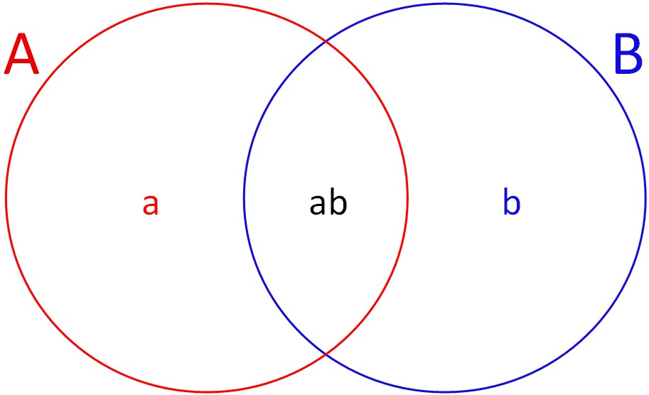
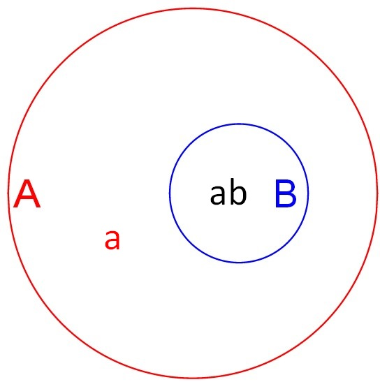
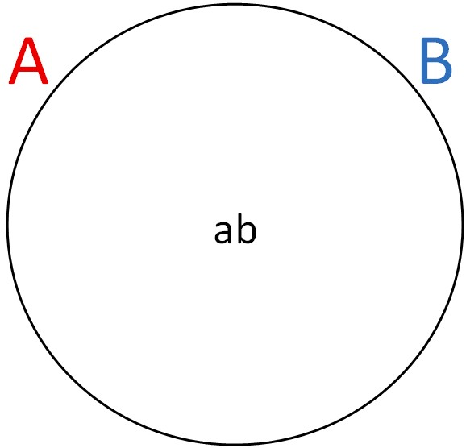

::: article
# Introduction

Classic sampling theory usually assumes the existence of one sampling
frame containing all finite population units. Then, a probability sample
is drawn according to a given sampling design and information collected
is used for estimation and inference purposes. In traditional
'design-based' inference the population data are regarded as fixed and
the randomness comes entirely from the sampling procedure. The most used
design-based estimator is the Horvitz-Thompson estimator that is
unbiased for the population total if the sampling frame includes all
population units, if all sampled units respond and if there is no
measurement error. In the presence of auxiliary information, there exist
several procedures to obtain more efficient estimators for population
means and totals of variables of interest; in particular, customary
ratio, regression, raking, post-stratified and calibration estimators.
Several software packages have been developed to facilitate the analysis
of complex survey data and implement some of these estimators as SAS
[@SAS], SPSS [@SPSS], Systat [@SYSTAT], Stata [@Stata], SUDAAN [@SUDAAN]
and PCCarp [@PCCARP]. CRAN hosts several R packages that include these
design-based methods typically used in survey methodology to treat
samples selected from one sampling frame
(e.g. [*survey*](https://CRAN.R-project.org/package=survey),
@Lumley2014; [*sampling*](https://CRAN.R-project.org/package=sampling),
@Tille2012; [*laeken*](https://CRAN.R-project.org/package=laeken),
@Alfons2014 or
[*TeachingSampling*](https://CRAN.R-project.org/package=TeachingSampling),
@Gutierrez2014, among others). [@Templ2014] provides a detailed list of
packages that includes methods to analyse complex surveys.

In practice, the assumption that the sampling frame contains all
population units is rarely met. Often, one finds that sampling from a
frame which is known to cover approximately all units in the population
is quite expensive while other frames (e.g. special lists of units) are
available for cheaper sampling methods. However, the latter usually only
cover an unknown or only approximately known fraction of the population.
A common example of frame undercoverage is provided by telephone
surveys. Estimation could be affected by serious bias due to the lack of
a telephone in some households and the generalised use of mobile phones,
which are sometimes replacing fixed (land) lines entirely. The potential
for coverage error as a result of the exponential growth of the
cell-phone only population has led to the development of dual-frame
surveys. In these designs, a traditional sample from the landline frame
is supplemented with an independent sample from a register of cell-phone
numbers.

The dual frame sampling approach assumes that two frames are available
for sampling and that, overall, they cover the entire target population.
The most common situation is the one represented in Figure
[1](#figure:Fig1) where the two frames, say frame $A$ and frame $B$,
show a certain degree of overlapping, so it is possible to distinguish
three disjoint non-empty domains: domain $a$, containing units belonging
to frame $A$ but not to frame $B$; domain $b$, containing units
belonging to frame $B$ but not to frame $A$ and domain $ab$, containing
units belonging to both frames. As an example, consider a telephone
survey where both landline and cell phone lists are available; let $A$
be the landline frame and $B$ the cell phone frame. Then, it is possible
to distinguish three types of individuals: landline only units,
cell-only units and units with both landline and cell phone, which will
compose domain $a$, $b$ and $ab$, respectively.

{#figure:Fig1
width="75.0%" alt="graphic without alt text"}

{#figure:Fig2
width="50.0%" alt="graphic without alt text"}

{#figure:Fig3
width="50.0%" alt="graphic without alt text"}

Nevertheless, one can face some other situations depending on the
relative positions of the frames. For example, Figure [2](#figure:Fig2)
shows the case in which frame $B$ is totally included in frame $A$, that
is, frame $B$ is a subset of frame $A$. Here domain $b$ is empty. We
also may find scenarios where the two sampling frames exactly match, as
depicted in Figure [3](#figure:Fig3), where $ab$ is the only non-empty
domain. Finally, the scenario where domain $ab$ is empty has no interest
from a dual frame perspective, since it can be considered as a special
case of stratified sampling.

Whatever the scenario, an appropriate choice of the frames results in a
better coverage of the target population, which, in turn, leads to a
better efficiency of estimators calculated from data from dual frame
surveys. This point is particularly important when estimating parameters
in rare or elusive populations, where undercoverage errors are usually
due to the difficulty of finding individuals showing the characteristic
under study when sampling from only one general frame. This issue can be
dealt with by incorporating a second frame with a high density of
members of the rare population so that the two frames are, together, now
complete. Dual frame sampling as a method of improvement of efficiency
may seem expensive and unviable, but it is not. In fact, [@Hartley1962]
notes that dual frame surveys can result in important cost savings in
comparison with single frame ones with a comparable efficiency. As an
additional interesting characteristic, dual frame methodology offers the
researcher the possibility to consider different data collection
procedures and/or different sampling designs, one for each frame. Dual
frame surveys have gained much attention and became largely used by
statistical agencies and private organizations to take advantage of
these benefits.

Standard software packages for complex surveys cannot be used directly
when the sample is obtained from a dual frame survey because the
classical design-based estimators are severely biased and there is a
underestimation of standard errors. Weighted analyses with standard
statistical software, with certain modified weights, can yield correct
point estimates of population parameters but still yield incorrect
results for estimated standard errors. A number of authors have
developed methods for estimating population means and totals from dual
(or, more generally, multiple) frame surveys but most of these methods
require ad-hoc software for their implementation. To the best of our
knowledge, there is no software incorporating these estimation
procedures for handling dual frame surveys.

[*Frames2*](https://CRAN.R-project.org/package=Frames2) [@Arcos2015]
tries to fill this gap by providing functions for point and interval
estimation from dual frame surveys. The paper is organized as follows.
In the next section, we provide an overview of the main point estimators
proposed so far in the dual frame context and review also jackknife
variance estimation as a tool to compare efficiency for all of them.
Subsequently, we present package *Frames2*, discussing guidelines that
have been followed to construct it and presenting its principal
functions and functionalities. We also provide examples to illustrate
how the package works.

# Estimation in dual frame surveys

Consider again the situation depicted in Figure [1](#figure:Fig1).
Assume we have a finite set of $N$ population units identified by
integers, $\mathcal{U}=\{1,\dots,k,\dots,N\}$, and let $A$ and $B$ be
two sampling frames, both can be incomplete, but it is assumed that
together they cover the entire finite population.

Let $\mathcal{A}$ be the set of population units in frame $A$ and
$\mathcal{B}$ the set of population units in frame $B$. The population
of interest, $\mathcal{U}$, may be divided into three mutually exclusive
domains, $a = \mathcal{A} \cap \mathcal{B}^c, b =
\mathcal{A}^c \cap \mathcal{B}$ and $ab = \mathcal{A} \cap
  \mathcal{B}$. Let $N, N_A, N_B, N_a, N_b$ and $N_{ab}$ be the number
of population units in $\mathcal{U}, \mathcal{A}, \mathcal{B}, a, b,
  ab$, respectively.

Let $y$ be a variable of interest in the population and let $y_k$ be its
value on unit $k$, for $k = 1,\ldots,N$. The objective is to estimate
the finite population total $Y = \sum_k y_k$ that can be written as
$$Y = Y_a + Y_{ab} + Y_b,$$ where
$Y_a = \sum_{k \in a}y_k, Y_{ab} = \sum_{k \in ab}y_k$ and $Y_b
= \sum_{k \in b}y_k$. To this end, independent samples $s_A$ and $s_B$
are drawn from frame $A$ and frame $B$ of sizes $n_A$ and $n_B$,
respectively. Unit $k$ in $\mathcal{A}$ has first-order inclusion
probability $\pi_k^A= Pr(k \in s_A)$ and unit $k$ in $\mathcal{B}$ has
first-order inclusion probability $\pi_k^B=Pr(k \in s_B)$.

From data collected in $s_A$, it is possible to compute one unbiased
estimator of the total for each domain in frame $A$, $\hat{Y}_a$ and
$\hat{Y}_{ab}^A$, as described below: $$\begin{aligned}
  \hat{Y}_a &= \sum_{k \in s_A}\delta_k(a)d_k^Ay_k, & \hat{Y}_{ab}^A &=
  \sum_{k \in s_A}\delta_k(ab)d_k^Ay_k,
\end{aligned}$$ where $\delta_k(a)= 1$ if $k \in a$ and $0$ otherwise,
$\delta_k(ab) =
1$ if $k \in ab$ and $0$ otherwise and $d_k^A$ are the weights under the
sampling design used in frame $A$, defined as the inverse of the first
order inclusion probabilities, $d_k^A = 1/\pi_k^A$. Similarly, using
information included in $s_B$, one can obtain an unbiased estimator of
the total for domain $b$ and another one for domain $ab$, $\hat{Y}_b$
and $\hat{Y}_{ab}^B$, which can be expressed as $$\begin{aligned}
  \hat{Y}_b &= \sum_{k \in s_B}\delta_k(b)d_k^By_k, & \hat{Y}_{ab}^B &=
  \sum_{k \in s_B}\delta_k(ab)d_k^By_k,
\end{aligned}$$ with $\delta_k(b)= 1$ if $k \in b$ and $0$ otherwise,
and $d_k^B$ the weights under the sampling design used in frame $B$
defined as the inverse of the first order inclusion probabilities,
$d_k^B =
1/\pi_k^B$.

Different approaches for estimating the population total from dual frame
surveys have been proposed in the literature. [@Hartley1962] suggests
the use of a parameter, $\theta$, to weight $\hat{Y}_{ab}^A$ and
$\hat{Y}_{ab}^B$, providing the estimator

$$\label{eq:Hartley}
    \hat{Y}_H = \hat{Y}_a + \theta\hat{Y}_{ab}^A + (1 - \theta)\hat{Y}_{ab}^B + \hat{Y}_b,  (\#eq:Hartley)  $$

where $\theta \in [0,1]$. [@Hartley1974] himself proved that

$$\label{eq:thetaoptHartley}
    \theta_{opt} = \frac{V(\hat{Y}_{ab}^B) + Cov(\hat{Y}_b, \hat{Y}_{ab}^B) - Cov(\hat{Y}_a, \hat{Y}_{ab}^A)}{V(\hat{Y}_{ab}^A) + V(\hat{Y}_{ab}^B)}  (\#eq:thetaoptHartley)  $$

is the optimum value for $\theta$ so that variance of the estimator with
respect to the design is minimized. In practice, $\theta_{opt}$ cannot
be computed, since population variances and covariances involved in its
calculation are unknown, so they must be estimated from sampling data.
An estimator for the variance of $\hat{Y}_H$ can be computed, taking
into account that samples from frame $A$ and frame $B$ are drawn
independently, as follows

$$ \hat{V}(\hat{Y}_H) = \hat{V}(\hat{Y}_a) + \theta^2\hat{V}(\hat{Y}_{ab}^A) + \theta \widehat{Cov}(\hat{Y}_a, \hat{Y}_{ab}^A) + (1 - \theta)^2\hat{V}(\hat{Y}_{ab}^B) + \hat{V}(\hat{Y}_b) + (1 - \theta)\widehat{Cov}(\hat{Y}_b, \hat{Y}_{ab}^B),  
(\#eq:VarHartley) $$

where hats denote suitable variance and covariance estimators.

[@Fuller1972] introduce information from the estimation of overlap
domain size, obtaining the following estimator

$$\label{eq:FB}
\hat{Y}_{FB} = \hat{Y}_a + \hat{Y}_b + \beta_1\hat{Y}_{ab}^A + (1 - \beta_1)\hat{Y}_{ab}^B + \beta_2(\hat{N}_{ab}^A - \hat{N}_{ab}^B),  (\#eq:FB)  $$

where $\hat{N}_{ab}^A = \sum_{k \in s_A}\delta_k(ab)d_k^A$ and
$\hat{N}_{ab}^B = \sum_{k \in
  s_B}\delta_k(ab)d_k^B$. [@Fuller1972] also show that
$$\begin{gathered}
        \begin{bmatrix}
            \tilde\beta_1\\
            \tilde\beta_2
        \end{bmatrix}
        = -
        \begin{bmatrix}
            V(\hat{Y}_{ab}^A - \hat{Y}_{ab}^B) & Cov(\hat{Y}_{ab}^A - \hat{Y}_{ab}^B, \hat{N}_{ab}^A - \hat{N}_{ab}^B)\\
            Cov(\hat{Y}_{ab}^A - \hat{Y}_{ab}^B, \hat{N}_{ab}^A - \hat{N}_{ab}^B) & V(\hat{N}_{ab}^A - \hat{N}_{ab}^B)
        \end{bmatrix}^{-1}\\
        \times
        \begin{bmatrix}
            Cov(\hat{Y}_a + \hat{Y}_b + \hat{Y}_{ab}^B, \hat{Y}_{ab}^A - \hat{Y}_{ab}^B)\\
            Cov(\hat{Y}_a + \hat{Y}_b + \hat{Y}_{ab}^B, \hat{N}_{ab}^A - \hat{N}_{ab}^B)
        \end{bmatrix}
\end{gathered}$$ are the optimal values for $\beta_1$ and $\beta_2$ in
the sense that they minimize the variance of the estimator. Again,
$\tilde\beta_1$ and $\tilde\beta_2$ need to be estimated, since
population values are not known in practice. An estimator for the
variance of $\hat{Y}_{FB}$ is given by

$$\label{eq:VarFB}
\hat{V}(\hat{Y}_{FB}) = \hat{V}(\hat{Y}_a) + \hat{V}(\hat{Y}_B) + \hat{\beta}_1(\widehat{Cov}(\hat{Y}_a, \hat{Y}_{ab}^A) - \widehat{Cov}(\hat{Y}_B, \hat{Y}_{ab}^B)) + \hat{\beta}_2(\widehat{Cov}(\hat{Y}_a, \hat{N}_{ab}^A) - \widehat{Cov}(\hat{Y}_B, \hat{N}_{ab}^B)),  (\#eq:VarFB)  $$

with $\hat{Y}_B = \hat{Y}_b + \hat{Y}_{ab}^B$.

[@Bankier1986] and [@Kalton1986] combine all sampling units coming from
the two frames, $s_A$ and $s_B$, trying to build a single sample as if
it was drawn from only one frame. Sampling weights for the units in the
overlap domain need, then, to be modified to avoid bias. These adjusted
weights are $$\begin{aligned}
\tilde{d}_k^A =\left\{\begin{array}{ll}
d_k^A & \textrm{if } k \in a\\
(1/d_k^A + 1/d_k^B)^{-1} & \textrm{if } k \in ab
\end{array}
\right.
&& \text{and} &&
\tilde{d}_k^B =\left\{\begin{array}{ll}
d_k^B & \textrm{if } k \in b\\
(1/d_k^A + 1/d_k^B)^{-1} & \textrm{if } k \in ab
\end{array}
\right.
\end{aligned}$$

or, summarizing,

$$\label{eq:WeightsSF}
\tilde{d}_k =\left\{\begin{array}{ll}
d_k^A & \textrm{if } k \in a\\
(1/d_k^A + 1/d_k^B)^{-1} & \textrm{if } k \in ab \\
d_k^B & \textrm{if } k \in b
\end{array}
\right..  (\#eq:WeightsSF)  $$

Hence, the estimator can be expressed in the form

$$\label{eq:BKA}
\hat{Y}_{BKA} = \sum_{k \in s_A} \tilde{d}_k^Ay_k + \sum_{k \in s_B} \tilde{d}_k^By_k = \sum_{k \in s}\tilde{d}_ky_k,  (\#eq:BKA)  $$

with $s = s_A \cup s_B$. Note that to compute this estimator, one needs
to know, for units in the sample coming from the overlap domain, the
inclusion probability under both sampling designs. [@Rao1996] propose
the following unbiased estimator for the variance of the estimator

$$\label{eq:varBKA}
    \hat{V}(\hat{Y}_{BKA}) = \hat{V}(\sum_{k \in s_A} \tilde{z}_{k}^{A}) + \hat{V}(\sum_{k \in s_B}\tilde{z}_{k}^{B}),  (\#eq:varBKA)  $$

where $\tilde{z}_{k}^{A} = \delta_{k}(a)y_{k} + (1 -
\delta_{k}(a))y_k\frac{\pi_{k}^{A}}{\pi_{k}^{A}+\pi_{k}^{B}}$ and
$\tilde{z}_{k}^{B} = \delta_{k}(b)y_{k} + (1 -
\delta_{k}(b))y_k\frac{\pi_{k}^{B}}{\pi_{k}^{A}+\pi_{k}^{B}}$.

When frame sizes, $N_A$ and $N_B$, are known, estimator (\@ref(eq:BKA))
can be adjusted to increase efficiency through different procedures such
as, for example, raking ratio [@Bankier1986; @Skinner1991]. Applying the
latter, one obtains a new estimator, usually called raking ratio
[@Skinner1991], which has the form

$$\label{eq:SFRR}
\hat{Y}_{SFRR}  = \frac{N_A - \hat{N}_{ab}^{rake}}{\hat{N}_a}\hat{Y}_a^A + \frac{N_B - \hat{N}_{ab}^{rake}}{\hat{N}_b}\hat{Y}_b^B + \frac{\hat{N}_{ab}^{rake}}{\hat{N}_{abS}} \hat{Y}_{abS},  (\#eq:SFRR)  $$

where $\hat{Y}_{abS} = \sum_{k \in s_A} \tilde{d}_k^A\delta_k(ab) y_k
+ \sum_{k \in s_B} \tilde{d}_k^B\delta_k(ab) y_k$, $\hat{N}_{abS} =
\sum_{k \in s_A} \tilde{d}_k^A\delta_k(ab) + \sum_{k \in s_B}
\tilde{d}_k^B\delta_k(ab)$, $\hat{N}_a = \sum_{k \in s_A}\delta_k(a),
\hat{N}_b = \sum_{k \in s_B}\delta_k(b)$ and $\hat{N}_{ab}^{rake}$ is
the smaller root of the quadratic equation
$\hat{N}_{abS}x^2-(\hat{N}_{abS}(N_A + N_B)
+\hat{N}_{aS}^A\hat{N}_{bS}^B)x +\hat{N}_{abS}N_A N_B =0.$

[@Skinner1996] use a pseudo maximum likelihood approach to extend to
complex designs the maximum likelihood estimator proposed by
[@Fuller1972] only for simple random sampling without replacement. The
resulting estimator is given by

$$\begin{gathered}
\label{eq:PML}
  \hat{Y}_{PML}   = \frac{N_A - \hat{N}_{ab}^{PML}(\gamma)}{\hat{N}_a^A}\hat{Y}_a^A + \frac{N_B - \hat{N}_{ab}^{PML}(\gamma)}{\hat{N}_b^B}\hat{Y}_b^B 
   + \frac{\hat{N}_{ab}^{PML}(\gamma)}{\gamma\hat{N}_{ab}^A + (1 -
    \gamma)\hat{N}_{ab}^B}[\gamma\hat{Y}_{ab}^A + (1 -
  \gamma)\hat{Y}_{ab}^B],  
\end{gathered}  (\#eq:PML)  $$

where $\hat{N}_{ab}^{PML}(\gamma)$ is the smallest of the roots of the
quadratic equation $[\gamma/N_B + (1 - \gamma)/N_A]x^2 - [1 +
\gamma\hat{N}_{ab}^A/N_B + (1 - \gamma)\hat{N}_{ab}^B/N_A]x +
\gamma\hat{N}_{ab}^A + (1 - \gamma)\hat{N}_{ab}^B = 0$ and $\gamma \in
(0,1)$. It is also shown that the following value for $\gamma$

$$\label{eq:thetaoptPML}
\gamma_{opt} = \frac{\hat{N}_aN_BV(\hat{N}_{ab}^B)}{\hat{N}_aN_BV(\hat{N}_{ab}^B) + \hat{N}_bN_AV(\hat{N}_{ab}^A)}  (\#eq:thetaoptPML)  $$

minimizes the variance of $\hat{Y}_{PML}$. One can use the delta method
to obtain a consistent estimator of the variance of this estimator of
the form

$$\label{eq:varPML}
    \hat{V}(\hat{Y}_{PML}) = \hat{V}(\sum_{k \in s_A} \tilde{z}_k^{A}) + \hat{V}(\sum_{k \in s_B} \tilde{z}_k^{B}),  (\#eq:varPML)  $$

where, in this case, $\tilde{z}_k^A = y_k -
\frac{\hat{Y}_a}{\hat{N}_a}$ if $k \in a$ and $\tilde{z}_k^A =
\hat{\gamma}_{opt}\left(y_k -
  \frac{\hat{Y}_{ab}^A}{\hat{N}_{ab}^A}\right) +
\hat{\lambda}\hat{\phi}$ if $k \in ab$, with $\hat{\gamma}_{opt}$ an
estimator of $\gamma_{opt}$ in (\@ref(eq:thetaoptPML)) obtained by
replacing population quantities with their estimators,
$\hat{\lambda} = \frac{n_A/N_A\hat{Y}_{ab}^A +
  n_B/N_B\hat{Y}_{ab}^B}{n_A/N_A\hat{N}_{ab}^A +
  n_B/N_B\hat{N}_{ab}^B} - \frac{\hat{Y}_a}{\hat{N}_a} -
\frac{\hat{Y}_b}{\hat{N}_b}$ and $\hat{\phi} = \frac{n_A
  \hat{N}_b}{n_A\hat{N}_b + n_B\hat{N}_a}$. Similary, one can define
$\tilde{z}_k^B = y_k - \frac{\hat{Y}_b}{\hat{N}_b}$ if $k \in b$ and
$\tilde{z}_k^B = (1 - \hat{\gamma}_{opt})\left(y_k -
  \frac{\hat{Y}_{ab}^B}{\hat{N}_{ab}^B}\right) + \hat{\lambda}(1 -
\hat{\phi})$ if $k \in ab$.

More recently, [@Rao2010] proposed a pseudo empirical likelihood
estimator for the population mean based on poststratified samples. The
estimator is computed as

$$\label{eq:PEL}
\hat{\bar{Y}}_{PEL} = \frac{N_a}{N}\hat{\bar{Y}}_a + \frac{\eta N_{ab}}{N}\hat{\bar{Y}}_{ab}^A + \frac{(1 - \eta) N_{ab}}{N}\hat{\bar{Y}}_{ab}^B + \frac{N_b}{N}\hat{\bar{Y}}_b,  (\#eq:PEL)  $$

where, in this case, $\hat{\bar{Y}}_a = \sum_{k \in
  s_A}\hat{p}_{ak}y_k\delta_k(a), \hat{\bar{Y}}_{ab}^A = \sum_{k \in
  s_A}\hat{p}_{abk}^Ay_k\delta_k(ab), \hat{\bar{Y}}_{ab}^B = \sum_{k
  \in s_B}\hat{p}_{abk}^By_k\delta_k(ab)$ and $\hat{\bar{Y}}_b =
\sum_{k \in s_B}\hat{p}_{bk}y_k\delta_k(b)$ with $\hat{p}_{ak}$,
$\hat{p}_{abk}^A$, $\hat{p}_{abk}^B$ and $\hat{p}_{bk}$ the weights
resulting from maximizing the pseudo empirical likelihood procedure
under a set of constraints (see @Rao2010 for details). Furthermore,
$\eta \in (0,1)$. In this case, it is assumed that $N_A, N_B$ and
$N_{ab}$ are known, but this is not always the case. The authors also
provide modifications to be carried out in (\@ref(eq:PEL)) to adapt it
to situations where only $N_A$ and $N_B$ are known or where none of
$N_A$, $N_B$ or $N_{ab}$ are known. In addition, auxiliary information
coming from either one or both frames can be incorporated into the
estimation process to improve the accuracy of the estimates. In
addition, instead of an analytic form for the variance of this
estimator, [@Rao2010] propose to compute confidence intervals using the
bi-section method described by [@Wu2005] for one single frame and
extending it to the dual frame case. This method constructs intervals of
the form $\{\theta|r_{ns}(\theta) < \chi_1^2(\alpha)\}$, where
$\chi_1^2(\alpha)$ is the $1 - \alpha$ quantile from a $\chi^2$
distribution with one degree of freedom and $r_{ns}(\theta)$ represents
the so called pseudo empirical log likelihood ratio statistic, which can
be obtained as a difference of two pseudo empirical likelihood
functions.

Recently, [@Ranalli2013] extended calibration procedures to estimation
from dual frame sampling assuming that some kind of auxiliary
information is available. For example, assuming there are $p$ auxiliary
variables, $\mathbf{x}_k (x_{1k}, \ldots, x_{pk})$ is the value taken by
such auxiliary variables on unit $k$. Each auxiliary variable may be
available only for units in frame $A$, only for units in frame $B$ or
for units in the whole population. In addition, it is assumed that the
vector of population totals of the auxiliary variables,
$\mathbf{t_x} = \sum_{k\in \mathcal{U}}\mathbf{x}_k$ is also known. In
this context, the dual frame calibration estimator can be defined as
follows

$$\label{eq:CALDF}
\hat{Y}_{CALDF} = \sum_{k \in s}d_k^{CALDF}y_k,  (\#eq:CALDF)  $$

where weights $d_k^{CALDF}$ are such that $\min\sum_{k \in
  s}G(d_k^{CALDF}, \breve{d}_k)$ subject to $\sum_{k \in
  s}d_k^{CALDF}\mathbf{x}_k = \mathbf{t_x}$, with $G(\cdot,\cdot)$ a
determined distance measure and

$$\label{eq:WeightsDF}
\breve{d}_k =\left\{\begin{array}{ll}
d_k^A & \textrm{if } k \in a\\
\eta d_k^A & \textrm{if } k \in ab \bigcap s_A\\
(1 - \eta) d_k^B & \textrm{if } k \in ab \bigcap s_B \\
d_k^B & \textrm{if } k \in b
\end{array},
\right.  (\#eq:WeightsDF)  $$

where $\eta \in [0,1]$.

Then, with a similar approach to that of $\hat{Y}_{BKA}$, another
calibration estimator can be computed as

$$\label{eq:CALSF}
\hat{Y}_{CALSF} = \sum_{k \in s}d_k^{CALSF}y_k,  (\#eq:CALSF)  $$

with weights $d_k^{CALSF}$ verifying that $\min\sum_{k \in
  s}G(d_k^{CALSF}, \tilde{d}_k)$ subject to $\sum_{k \in s}
d_k^{CALSF}\mathbf{x}_k = \mathbf{t_x}$, being $\tilde{d}_k$ the weights
defined in (\@ref(eq:WeightsSF)).

An estimator of the variance of any calibration estimator can be
obtained using Deville's method [@Deville1993] through the following
expression

$$\label{eq:VarDEV}
\hat{V}(\hat{Y})=\frac{1}{1-\sum_{k\in s} a_k^2}\sum_{k\in s}\frac{d^\star_k-1}{d^\star_k}\left(d^\star_k e_k- \sum_{l\in s} a_{l} d^\star_l e_l\right)^2,  (\#eq:VarDEV)  $$

where $d^\star_k$ is given by (\@ref(eq:WeightsSF)) or by
(\@ref(eq:WeightsDF)) according to whether we use $\hat{Y}_{CALSF}$ or
$\hat{Y}_{CALDF}$, respectively. In addition,
$a_k=\frac{d^\star_k-1}{d^\star_k}/\sum_{l\in s}
\frac{d^\star_l-1}{d^\star_l}$ and $e_k$ are the residuals of the
generalized regression of $y$ on $\mathbf{x}$.

Some of the estimators described above are particular types of
calibration estimators. For example, estimator (\@ref(eq:SFRR)) can be
obtained as a particular case of $\hat{Y}_{CALSF}$ in the case where
frame sizes $N_A$ and $N_B$ are known and the `"raking"` method is
selected for calibration. Having noted this, one can use
(\@ref(eq:VarDEV)) to calculate an estimator of variance of
(\@ref(eq:SFRR)). See [@Ranalli2013] for more details.

Table [1](#tab:summary) shows a summary of the previous dual frame
estimators according to the auxiliary information required. It can be
noted that Hartley, FB and BKA estimators can be computed even when no
information is available, but they cannot incorporate some auxiliary
information when available. PML and SFRR can incorporate information on
$N_A$ and $N_B$, but PEL and CAL type estimators are the most flexible
in that they can incorporate any kind of auxiliary information
available.

::: {#tab:summary}
  --------- -- -------------- -- ------------------ -- ----------------------- -- --------------------------------
                                  *$N_{A}, N_{B}$*      *$N_{a}, N_{b}$ and*        *$N_{a}, N_{ab}, N_{b}$ and*

                   *None*             *known*             *$N_{ab}$ known*         *$X_{A}$ and/or $X_{B}$ known*

  Hartley       $\checkmark$                                                      

  FB            $\checkmark$                                                      

  PML                               $\checkmark$                                  

  PEL           $\checkmark$        $\checkmark$            $\checkmark$                    $\checkmark$

  CalDF         $\checkmark$        $\checkmark$            $\checkmark$                    $\checkmark$

  BKA\*         $\checkmark$                                                      

  SFRR\*                            $\checkmark$                                  

  CalSF\*       $\checkmark$        $\checkmark$            $\checkmark$                    $\checkmark$

                                                                                  
  --------- -- -------------- -- ------------------ -- ----------------------- -- --------------------------------

  : Table 1: Estimator's capabilities versus auxiliary information
  availability
:::

(\*) Inclusion probabilities are known in overlap domain $ab$ for both
frames.

## Jackknife variance estimation

Variance estimation methods exposed so far depend on each specific
estimator, so comparisons between variance estimations may lead to
incorrect conclusions. Instead, one can consider jackknife, originally
proposed by [@Quenouille1949b; @Quenouille1956] (see @Wolter2007 for a
detailed description of this method in survey sampling) and extended to
dual frame surveys by [@Lohr2000], which can be used to estimate
variances irrespective of the type of estimator allowing us to compare
estimated efficiency for different estimators.

For a non-stratified design in each frame, the jackknife estimator of
the variance for any of the estimators described, generically denoted by
$\hat{Y}_c$, is given by

$$\label{eq:VarJackNonStratified}
v_J(\hat{Y}_c) = \frac{n_{A}-1}{n_{A}}\sum_{i \in s_A} (\hat{Y}_{c}^{A}(i) -\overline{Y}_{c}^{A})^2 + \frac{n_{B}-1}{n_{B}}\sum_{j \in s_B} (\hat{Y}_{c}^{B}(j) -\overline{Y}_{c}^{B})^2,  (\#eq:VarJackNonStratified)  $$

with $\hat{Y}_c^A(i)$ the value of estimator $\hat{Y}_c$ after dropping
unit $i$ from $s_A$ and $\overline{Y}_{c}^{A}$ the mean of values
$\hat{Y}_c^A(i)$. Similarly, one can define $\hat{Y}_{c}^{B}(j)$ and
$\overline{Y}_{c}^{B}$.

Jackknife may present an important bias when designs are without
replacement. One could, then, incorporate an approximate
finite-population correction to estimation to achieve unbiasedness. For
example, assuming that a finite-population correction is needed in frame
$A$, a modified jackknife estimator of variance, $v_J^*(\hat{Y}_c)$, can
be calculated by replacing $\hat{Y}_c^A(i)$ in
(\@ref(eq:VarJackNonStratified)) with
$\hat{Y}_{c}^{A*}(i)= \hat{Y}_{c}+\sqrt{1-\overline{\pi}_A}
(\hat{Y}_{c}^{A}(i) -\hat{Y}_{c})$, where $\overline{\pi}_A=\sum_{k\in
  s_A} \pi_k^A/n_A$.

Consider now a stratified design in each frame, where frame $A$ is
divided into $H$ strata and frame $B$ is divided into $L$ strata. From
stratum $h$ of frame $A$, a sample of $n_{Ah}$ units from the $N_{Ah}$
population units in the stratum is drawn. Similarly, in stratum $l$ of
frame $B$, one selects $n_{Bl}$ units from the $N_{Bl}$ composing the
stratum. The jackknife estimator of the variance can be defined, then,
as follows

$$\label{eq:VarJackStratified}
v_J(\hat{Y}_c) = \sum_{h=1}^{H}\frac{n_{Ah}-1}{n_{Ah}}  \sum_{i\in s_{Ah}} (\hat{Y}_{c}^{A}(hi) -\overline{Y}_{c}^{Ah})^2 + \sum_{l=1}^{L}\frac{n_{Bl}-1}{n_{Bl}}  \sum_{i\in s_{Bl}} (\hat{Y}_{c}^{B}(lj) -\overline{Y}_{c}^{Bl})^2,  (\#eq:VarJackStratified)  $$

where $\hat{Y}_c^A(hi)$ is the value taken by $\hat{Y}_c$ after dropping
unit $i$ of stratum $h$ from sample $s_{Ah}$ and $\overline{Y}_{c}^{Ah}$
is the mean of values $\hat{Y}_c^A(hi)$. $\hat{Y}_c^B(lj)$ and
$\overline{Y}_{c}^{Bl}$ can be defined in a similar way. Again, one can
include an approximate finite-population correction in any stratum
needing it. In case of a non stratified design in one frame and a
stratified design in the other one, previous methods can be combined to
obtain the corresponding jackknife estimator of the variance.

Stratified cluster sampling is very common in practice. Now we
illustrate the jackknife estimator when a stratified sample of clusters
is selected. Suppose that frame $A$ has $H$ strata and stratum $h$ has
$N_{Ah}$ observation units and $\widetilde{N}_{Ah}$ primary sampling
units (clusters), of which $\widetilde{n}_{Ah}$ are sampled. Frame $B$
has $L$ strata, and stratum $l$ has $N_{Bl}$ observation units and
$\widetilde{N}_{Bh}$ primary sampling units, of which
$\widetilde{n}_{Bl}$ are sampled.

To define the jackknife estimator of the variance, let
$\widetilde{Y}_{c}^{A}(hj)$ be the estimator of the same form as
$\hat{Y}_c$ when the observations of sample primary sampling unit $j$ of
stratum $h$ from sample in frame $A$ are omitted. Similarly,
$\widetilde{Y}_{c}^{B}(lk)$ is of the same form as $\hat{Y}_c$ when the
observations of sample primary sampling unit $k$ of stratum $l$ from
sample in frame $B$ are omitted. The jackknife variance estimator is
then given by:

$$\label{eq:VarJackStratifiedcluster}
v_J(\hat{Y}_c) = \sum_{h=1}^{H}\frac{\widetilde{n}{Ah}-1}{\widetilde{n}_{Ah}}  \sum_{j=1}^{\widetilde{n}_{Ah}} (\widetilde{Y}_{c}^{A}(hj) -\widetilde{Y}_{c}^{Ah})^2 + \sum_{l=1}^{L}\frac{\widetilde{n}_{Bl}-1}{\widetilde{n}_{Bl}}  \sum_{k\in s_{Bl}} (\widetilde{Y}_{c}^{B}(lk) -\widetilde{Y}_{c}^{Bl})^2,  (\#eq:VarJackStratifiedcluster)  $$

where $\widetilde{Y}_{c}^{Ah}$ is the mean of values
$\widetilde{Y}_{c}^{A}(hj)$ and $\widetilde{Y}_{c}^{Bl}$ is the mean of
values $\widetilde{Y}_{c}^{B}(lk)$.

# The R package *Frames2*

*Frames2* is a new R package for point and interval estimation from dual
frame sampling. It consists of eight main functions (`Hartley`, `FB`,
`BKA`, `SFRR`, `PML`, `PEL`, `CalSF` and `CalDF`), each of them
implementing one of the estimators described in the previous sections.
The package also includes an additional function called `Compare` which
provides a summary with all possible estimators that can be computed
from the information provided as input. Moreover, six extra functions
implementing auxiliary operations, like computation of Horvitz-Thompson
estimators or of the covariance between two Horvitz-Thompson estimators,
have also been included in the package to achieve a more understandable
code. Finally, the package includes eight more functions, one for each
estimator, for the calculation of confidence intervals based on the
jackknife variance estimator.

A notable feature of these functions is the strong argument check.
Functions check general aspects such as the presence of `NA` or `NaN`
values in its arguments, the number of main variables considered in the
frames (that should match), the length of the arguments in each frame
(that should also match) and the values for arguments indicating the
domain each unit belongs to (which only can be `"a"` or `"ab"` for frame
$A$ or `"b"` or `"ba"` for frame $B$). If any issue is encountered, the
function displays an error message indicating what the problem is and
what argument causes it, so that the user can manage errors easily.
Furthermore, each function has additional checks depending on its
specific characteristics or arguments. The main aim of this exhaustive
check is to guarantee validity of the arguments, so one can avoid, to
the extent possible, issues during computation.

Much attention has also been devoted to computational efficiency.
Frequently, populations in a survey are extremely large or it is needed
to keep sampling error below a certain value. As a consequence, one
needs to consider large sample sizes, often in the order of tens of
thousands sampling units. In these situations, computational efficiency
of functions is essential, particularly when several variables are
considered. Otherwise, the user can face high runtimes and heavy
computational loads. In this sense, functions of *Frames2* are developed
according to strict efficiency measures, using the power of R to use
matrix calculation to avoid loops and increase the computational
efficiency.

Table [2](#table_compeff) shows user and system times necessary to
compute estimators using an Intel(R) Core(TM) i7-3770 at 3.40 GHz when
different sample sizes are considered. Elapsed time is also included to
get an idea about the real time user needs to get estimations.

::: {#table_compeff}
  --------- -- -------------------------------- -- -------- -- ---------
                             user                   system      elapsed

                 *$n_A = 10605, n_B = 13635$*                  

  Hartley                    0.01                    0.02        0.04

  FB                         0.05                   \<0.01       0.07

  BKA                        0.03                   \<0.01       0.05

  PML                        0.02                    0.02        0.03

  SFRR                       0.03                    0.03        0.07

  CalSF                      0.03                   \<0.01       0.06

  CalDF                      0.04                    0.01        0.05

                *$n_A = 105105, n_B = 135135$*                 

  Hartley                    0.11                    0.06        0.19

  FB                         0.27                    0.07        0.32

  BKA                        0.13                    0.05        0.17

  PML                        0.16                    0.02        0.18

  SFRR                       0.42                    0.12        0.54

  CalSF                      0.20                    0.08        0.30

  CalDF                      0.22                    0.07        0.31

                                                               
  --------- -- -------------------------------- -- -------- -- ---------

  : Table 2: User, system and elapsed times (in seconds) for estimators
  considering different sample sizes.
:::

Functions of *Frames2* have been implemented from an user-oriented
perspective to increase usability. In this sense, most input parameters
(which are the communication channel between the user and the function)
are divided into two groups, depending on the frame they come from. This
is to adapt functions as much as possible to the usual estimation
procedure, in which the first step is to draw two independent samples,
one from each frame. On the other hand, estimation details are managed
internally by functions so that they are not visible for the user, who
does not need to manage them.

Construction of functions has been carried out so that they perform
properly in as many situations as possible. As noted in the introductory
section, one can face several situations when using two sampling frames
depending on their relative positions. Although the most common is the
one depicted in Figure [1](#figure:Fig1), cases shown in
Figures [2](#figure:Fig2) and [3](#figure:Fig3) may arise as well. All
estimators described except PEL can be modified to cover these three
situations, so corresponding functions of *Frames2* include necessary
changes to produce estimates irrespective of the situation.

On the other hand, it is usual, when conducting a survey, to collect
information on many variables of interest. To adapt to such situations,
all functions are programmed to produce estimates when there are more
than one variable of interest with only one call. To this end,
parameters containing information about main variables observed in each
frame can be either vectors, when only one variable is considered or
matrices or data frames, when there are several variables under study.
Cases in which the main aim of the survey is the estimation of
population means or proportions are also very frequent. Hence, from the
estimation of the population total for a variable, functions compute
estimation of the mean as $\hat{\bar{Y}} =
\hat{Y}/\hat{N}$. To obtain the estimation of the population size,
functions internally apply the estimation procedure at issue to
indicator vectors $\mathbf{1}_A$ and $\mathbf{1}_B$ of sizes $n_A$ and
$n_B$, respectively.

To get maximum flexibility, functions have been programmed to calculate
estimates in cases in which the user disposes of first and second order
inclusion probabilities and in those other in which only first order
ones are available, indistinctly. Knowledge of both first and second
order inclusion probabilities is a strong assumption that does not
always occur in practice. However, when calculating most of the
estimators described in previous sections, second order inclusion
probabilities are needed in many steps of the estimation procedure,
mainly in computing estimated variances of a Horvitz-Thompson estimator
or estimated covariances between two Horvitz-Thompson estimators. As an
alternative, one can obtain variance estimations from only first order
inclusion probabilities applying Deville's method reported in
(\@ref(eq:VarDEV)), by substituting residuals $e_k$ with the values of
the variable of interest, $y_k$. Covariance estimations are also
obtained from variances through the following expression
$$\widehat{Cov}(\hat{Y}, \hat{X}) = \frac{\hat{V}(\hat{Y} + \hat{X}) - \hat{V}(\hat{Y}) - \hat{V}(\hat{X})}{2}.$$
To cover both cases, the user has the possibility to consider different
data structures for parameters relating to inclusion probabilities. So,
if both first and second order inclusion probabilities are available,
these parameters will be square matrices, whereas if only first order
inclusion probabilities are known, these arguments will be vectors. The
only restriction here is that the type of both should match.

As can be deduced from previous sections, an essential aspect when
computing estimates in dual frames is to know the domain each unit
belongs to. Character vectors `domains_A` and `domains_B` are used for
this purpose. The former can take values `"a"` or `"ab"`, while the
latter can take values `"b"` or `"ba"`. Any other value will be
considered as incorrect.

## Data description

To illustrate how functions operate, we use the data sets `DatA` and
`DatB`, both included in the package. `DatA` contains information about
$n_A = 105$ households selected through a stratified sampling design
from the $N_A = 1735$ households forming frame $A$. More specifically,
frame A has been divided into 6 strata of sizes
$N_{hA} = (727, 375, 113, 186, 115, 219)$ from which simple random
without replacement samples of sizes $n_{hA} = (15, 20, 15, 20,
15, 20)$ have been drawn. On the other hand, a simple random without
replacement sample of $n_B = 135$ households has been selected from the
$N_B = 1191$ households in frame $B$. The size of the overlap domain for
this case is $N_{ab} = 601$. This situation is depicted in
Figure [4](#figure:Fig4).

{#figure:Fig4 width="100%" alt="graphic without alt text"}

Both data sets contain information about the same variables. To better
understand their structure, we report the first three rows of `DatA`:

``` r
> library(Frames2)
> data(DatA)
> head(DatA, 3)
  Domain   Feed   Clo   Lei     Inc    Tax     M2 Size      ProbA     ProbB Stratum
1      a 194.48 38.79 23.66 2452.07 112.90   0.00    0 0.02063274 0.0000000       1
2      a 250.23 16.92 22.68 2052.37 106.99   0.00    0 0.02063274 0.0000000       1
3     ab 199.95 24.50 23.24 2138.24 121.16 127.41    2 0.02063274 0.1133501       1
```

Each data set incorporates information about three main variables:
Feeding, Clothing and Leisure. Additionally, there are two auxiliary
variables for the units in frame $A$ (Income and Taxes) and another two
variables for units in frame $B$ (Metres2 and Size). Corresponding
totals for these auxiliary variables are assumed known in the entire
frame and they are $T_{Inc}^A = 4300260, T_{Tax}^A = 215577, T_{M2}^B
= 176553$ and $T_{Size}^B = 3529$. Finally, a variable indicating the
domain each unit belongs to and two variables showing the first order
inclusion probabilities for each frame complete the data sets.

Numerical square matrices `PiklA` and `PiklB`, with dimensions
$n_A = 105$ and $n_B = 135$, are also used as probability inclusion
matrices. These matrices contains second order inclusion probabilities
and first order inclusion probabilities as diagonal elements. To check
the appearance of these matrices the first submatrix of order 6 of
`PiklA` is shown.

``` r
> data(PiklA)
> PiklA[1:6, 1:6]
            [,1]        [,2]        [,3]        [,4]        [,5]        [,6]
[1,] 0.020632737 0.000397876 0.000397876 0.000397876 0.000397876 0.000397876
[2,] 0.000397876 0.020632737 0.000397876 0.000397876 0.000397876 0.000397876
[3,] 0.000397876 0.000397876 0.020632737 0.000397876 0.000397876 0.000397876
[4,] 0.000397876 0.000397876 0.000397876 0.020632737 0.000397876 0.000397876
[5,] 0.000397876 0.000397876 0.000397876 0.000397876 0.020632737 0.000397876
[6,] 0.000397876 0.000397876 0.000397876 0.000397876 0.000397876 0.020632737
```

## No auxiliary information

When there is no further information than the one on the variables of
interest, one can calculate some of the estimators described in previous
sections (as, for example, (\@ref(eq:Hartley)) or (\@ref(eq:FB))) as
follows

``` r
> library(Frames2)
>
> data(DatA)
> data(DatB)
> data(PiklA)
> data(PiklB)
>
> yA <- with(DatA, data.frame(Feed, Clo))
> yB <- with(DatB, data.frame(Feed, Clo))
>
> ## Estimation for variables Feeding and Clothing using Hartley and 
> ## Fuller-Burmeister estimators with first and second order probabilities known
> Hartley(yA, yB, PiklA, PiklB, DatA$Domain, DatB$Domain)

Estimation:
             Feed         Clo
Total 586959.9820 71967.62214
Mean     246.0429    30.16751
> FB(yA, yB, PiklA, PiklB, DatA$Domain, DatB$Domain)

Estimation:
             Feed         Clo
Total 591665.5078 72064.99223
Mean     248.0153    30.20832
> ## This is how estimates change when only first order probabilities are considered
> Hartley(yA, yB, DatA$ProbA, DatB$ProbB, DatA$Domain, DatB$Domain)

Estimation:
             Feed         Clo
Total 570867.8042 69473.86532
Mean     247.9484    30.17499
> FB(yA, yB, DatA$ProbA, DatB$ProbB, DatA$Domain, DatB$Domain)

Estimation:
             Feed         Clo
Total 571971.9511 69500.11448
Mean     248.4279    30.18639
```

As the result, an object of class `"EstimatorDF"` is returned, showing,
by default, estimations for the population total and mean for the two
considered variables. In general, $m$ columns will be displayed, one for
each of the $m$ variables estimated. Further information about the
estimation process (as variance estimations or values of parameters
involved in estimation) can be displayed by using function `summary`.

``` r
> summary(Hartley(yA, yB, PiklA, PiklB, DatA$Domain, DatB$Domain))

Call:
Hartley(ysA = yA, ysB = yB, pi_A = PiklA, pi_B = PiklB, domains_A = DatA$Domain,
    domains_B = DatB$Domain)

Estimation:
             Feed         Clo
Total 586959.9820 71967.62214
Mean     246.0429    30.16751

Variance Estimation:
                   Feed          Clo
Var. Total 2.437952e+08 4.728875e+06
Var. Mean  4.283804e+01 8.309261e-01

Total Domain Estimations:
                  Feed      Clo
Total dom. a  263233.1 31476.84
Total dom. ab 166651.7 21494.96
Total dom. b  164559.2 20451.85
Total dom. ba 128704.7 15547.49

Mean Domain Estimations:
                 Feed      Clo
Mean dom. a  251.8133 30.11129
Mean dom. ab 241.6468 31.16792
Mean dom. b  242.2443 30.10675
Mean dom. ba 251.5291 30.38466

Parameters:
           Feed       Clo
theta 0.8027766 0.7551851
```

The previous output shows in the component `Estimation` the estimations
of the population total and the population mean computed using the
Harley estimator, that is, $\hat{Y}_H$ and $\hat{\bar{Y}}_H$. Estimated
variances of these estimations, $\hat{V}(\hat{Y}_H)$ and
$\hat{V}(\hat{\bar{Y}}_H)$, are displayed in component
`Variance Estimation`. In the section `Total Domain Estimations` we can
see estimations $\hat{Y}_a,
\hat{Y}_{ab}^A, \hat{Y}_b$ and $\hat{Y}_{ab}^B$. Estimates for the
population mean for each domain, $\hat{\bar{Y}}_a,
\hat{\bar{Y}}_{ab}^A, \hat{\bar{Y}}_b$ and $\hat{\bar{Y}}_{ab}^B$ are
displayed in the component `Mean Domain Estimations`. Finally,
$\hat{\theta}$, the estimated value of the parameter involved in
computation of the Hartley estimator is shown.

This additional information depends on the way each estimator is
formulated. Thus, for example, extra information will include a
parameter component when applied to a call to the Fuller-Burmeister
estimator (and values of estimates for $\beta_1$ and $\beta_2$ will be
displayed there), but not when applied to a call to the
Bankier-Kalton-Anderson estimator (because no parameters are used when
computing this estimator).

Results slightly change when a confidence interval is required. In that
case, the user has to indicate the confidence level desired for the
interval through argument `conf_level` (default is `NULL`) and add it to
the list of input parameters. The function calculates, then, a
confidence interval based on the pivotal method. This method yields a
confidence interval as follows: $\hat{Y} \pm z_{\alpha/2}
\sqrt{\hat{V}(\hat{Y})}$ where $z_{\alpha/2}$ is the critical value of a
standard normal distribution. Only for the case of PEL, confidence
intervals are based on a $\chi^2$ distribution and the bi-section method
[@Rao2010]. In this case, default output will show $6$ rows for each
variable, lower and upper boundaries for confidence intervals are
displayed together with estimates. So, one can obtain a $95\%$
confidence interval for estimations in the last two of the previous four
cases in this way.

``` r
> Hartley(yA, yB, DatA$ProbA, DatB$ProbB, DatA$Domain, DatB$Domain, 0.95)

Estimation and  95 % Confidence Intervals:
                   Feed         Clo
Total       570867.8042 69473.86532
Lower Bound 511904.6588 61756.37677
Upper Bound 629830.9496 77191.35387
Mean           247.9484    30.17499
Lower Bound    222.3386    26.82301
Upper Bound    273.5582    33.52697
> FB(yA, yB, DatA$ProbA, DatB$ProbB, DatA$Domain, DatB$Domain, 0.95)

Estimation and  95 % Confidence Intervals:
                   Feed         Clo
Total       571971.9511 69500.11448
Lower Bound 513045.7170 61802.57411
Upper Bound 630898.1852 77197.65484
Mean           248.4279    30.18639
Lower Bound    222.8342    26.84307
Upper Bound    274.0217    33.52971
```

For estimators constructed as (\@ref(eq:BKA)), numeric vectors
`pik_ab_B` and `pik_ba_A` of lengths $n_A$ and $n_B$ should be added as
arguments. While `pik_ab_B` represents first order inclusion
probabilities according to sampling design in frame $B$ for units
belonging to the overlap domain selected in the sample drawn from frame
$A$, `pik_ba_A` contains first order inclusion probabilities according
to the sampling design in frame $A$ for units belonging to the overlap
domain selected in sample drawn from frame $B$.

``` r
> yA <- with(DatA, data.frame(Feed, Clo, Lei))
> yB <- with(DatB, data.frame(Feed, Clo, Lei))
>
> ## Bankier-Kalton-Anderson estimation and a 95% confidence
> ## interval for the three main variables
> BKA(yA, yB, DatA$ProbA, DatB$ProbB, DatA$ProbB, DatB$ProbA, DatA$Domain,
+   DatB$Domain, 0.95)

Estimation and  95 % Confidence Intervals:
                   Feed         Clo         Lei
Total       566434.3200 68959.26705 50953.07583
Lower Bound 624569.2139 76538.11015 56036.23578
Upper Bound 508299.4262 61380.42395 45869.91588
Mean           247.8845    30.17814    22.29822
Lower Bound    273.3257    33.49482    24.52273
Upper Bound    222.4434    26.86147    20.07372
```

Note that these examples include just a few of the estimators that can
be used when no auxiliary information is known. As noted in Table
[1](#tab:summary), other estimators, as those in (\@ref(eq:PEL)),
(\@ref(eq:CALDF)) or (\@ref(eq:CALSF)), can be also calculated in this
case. In this context, function `Compare` is quite useful, since it
returns all possible estimators that can be computed according to the
information provided as input.

``` r
> Compare(yA, yB, DatA$ProbA, DatB$ProbB, DatA$Domain, DatB$Domain)
$Hartley

Estimation:
             Feed         Clo        Lei
Total 570867.8042 69473.86532 51284.2727
Mean     247.9484    30.17499    22.2746

$FullerBurmeister

Estimation:
             Feed         Clo         Lei
Total 571971.9511 69500.11448 51210.03819
Mean     248.4279    30.18639    22.24236

$PEL

Estimation:
              Feed          Clo          Lei
Total 1.791588e+08 2.663164e+06 1.455533e+06
Mean  2.479314e+02 3.011373e+01 2.235969e+01

$Calibration_DF

Estimation:
             Feed         Clo        Lei
Total 595162.2604 72214.13351 53108.5059
Mean     248.8422    30.19332    22.2051
```

Using appropriate indicator variables as variables of interest, one can
also estimate the overlap domain size, as shown below:

``` r
> indA <- as.integer(DatA$Domain == "ab")
> indB <- as.integer(DatB$Domain == "ba")
>
> Hartley(indA, indB, DatA$ProbA, DatB$ProbB, DatA$Domain, DatB$Domain)

Estimation:
             [,1]
Total 534.2743208
Mean    0.2320545
> BKA(indA, indB, DatA$ProbA, DatB$ProbB, DatA$ProbB, DatB$ProbA, DatA$Domain, 
+   DatB$Domain)

Estimation:
             [,1]
Total 560.4121771
Mean    0.2452491
```

## Auxiliary information about frame sizes

For estimators requiring frame sizes known, as (\@ref(eq:SFRR)) or
(\@ref(eq:PML)), it is needed to incorporate two additional input
arguments, `N_A` and `N_B`. There is also a group of estimators,
including (\@ref(eq:PEL)) and (\@ref(eq:CALSF)), that, even though able
to provide estimations without the need of auxiliary information, can
use frame sizes to improve their precision. The following examples show
the performance of these estimators.

``` r
> ## SFRR estimator and CalSF estimator with frame sizes as auxiliary information 
> ## using method "raking" for the calibration for the three main variables
> SFRR (yA, yB, DatA$ProbA, DatB$ProbB, DatA$ProbB, DatB$ProbA, DatA$Domain,
+   DatB$Domain, N_A = 1735, N_B = 1191)

Estimation:
             Feed         Clo         Lei
Total 584713.4070 71086.18669 52423.74035
Mean     248.2219    30.17743    22.25487
> CalSF(yA, yB, DatA$ProbA, DatB$ProbB, DatA$ProbB, DatB$ProbA, DatA$Domain,
+   DatB$Domain, N_A = 1735, N_B = 1191, met = "raking")

Estimation:
             Feed         Clo         Lei
Total 584713.4070 71086.18669 52423.74035
Mean     248.2219    30.17743    22.25487
```

As highlighted previously, both results match. Note that the argument
`met` of the SF calibration estimator indicates the method used in the
calibration procedure. The possibility of choosing the calibration
method is given by the fact that computation of both SF and DF
calibration estimators is based on the function `calib` from package
*sampling* [@Tille2012], which can manage three different calibration
methods, each one associated with one particular distance measure. These
methods are: linear, raking and logit.

The requirement of knowing probabilities of inclusion in both frames for
the units in the overlap domain may be restrictive in some cases. As an
alternative, in cases where frame sizes are known but this condition is
not met, it is possible to calculate dual frame estimators as
(\@ref(eq:PML)), (\@ref(eq:PEL)) or (\@ref(eq:CALDF)). Next, it is
illustrated how to obtain some of these estimators with *Frames2*.

``` r
> ## Estimates for the three main variables using PML, PEL and CalDF
> ## with frame sizes as auxiliary information in PEL and CalDF
> PML(yA, yB, PiklA, PiklB, DatA$Domain, DatB$Domain, N_A = 1735, N_B = 1191)

Estimation:
             Feed         Clo         Lei
Total 593085.4467 72272.73759 53287.68044
Mean     248.0966    30.23277    22.29104
> PEL(yA, yB, PiklA, PiklB, DatA$Domain, DatB$Domain, N_A = 1735, N_B = 1191)

Estimation:
             Feed         Clo         Lei
Total 590425.4843 72211.61334 53258.38286
Mean     247.4958    30.26982    22.32497
> CalDF(yA, yB, PiklA, PiklB, DatA$Domain, DatB$Domain, N_A = 1735, N_B = 1191)

Estimation:
             Feed         Clo         Lei
Total 587502.4374 71368.45308 52490.98852
Mean     248.7193    30.21385    22.22207
```

To calculate the `PEL` estimator, computational algorithms for the
pseudo empirical likelihood method for the analysis of complex survey
data presented by [@Wu2005] are used.

## Auxiliary information about domain sizes

In addition to the frame sizes, in some cases, it is possible to know
the size of the overlap domain, $N_{ab}$. Generally, this considerably
improves the precision of the estimates. This situation has been taken
into account when constructing functions implementing estimators
(\@ref(eq:PEL)), (\@ref(eq:CALDF)) and (\@ref(eq:CALSF)), so the user
can incorporate this information through parameter `N_ab`, as shown
below

``` r
> ## Estimates for the three main variables using PEL estimator
> ## with frame sizes and overlap domain size as auxiliary information
> PEL(yA, yB, PiklA, PiklB, DatA$Domain, DatB$Domain, N_A = 1735, N_B = 1191,
+   N_ab = 601)

Estimation:
             Feed         Clo         Lei
Total 575289.2186 70429.95642 51894.32490
Mean     247.4362    30.29245    22.32014
> ## Calibration estimators with the same auxiliary information
> ## Estimates do not change when raking method is used for the calibration
> CalSF(yA, yB, PiklA, PiklB, DatA$ProbB, DatB$ProbA, DatA$Domain, DatB$Domain,
+   N_A = 1735, N_B = 1191, N_ab = 601)

Estimation:
             Feed         Clo         Lei
Total 577163.6066 70173.20412 51726.19862
Mean     248.2424    30.18202    22.24783
> CalSF(yA, yB, PiklA, PiklB, DatA$ProbB, DatB$ProbA, DatA$Domain, DatB$Domain,
+   N_A = 1735, N_B = 1191, N_ab = 601, met = "raking")

Estimation:
             Feed         Clo         Lei
Total 577163.6067 70173.20414 51726.19863
Mean     248.2424    30.18202    22.24783
> CalDF(yA, yB, PiklA, PiklB, DatA$Domain, DatB$Domain, N_A = 1735, N_B = 1191,
+   N_ab = 601)

Estimation:
             Feed         Clo         Lei
Total 578691.1756 70246.32319 51600.78973
Mean     248.8994    30.21347    22.19389
> CalDF(yA, yB, PiklA, PiklB, DatA$Domain, DatB$Domain, N_A = 1735, N_B = 1191,
+   N_ab = 601, met = "raking")

Estimation:
             Feed         Clo         Lei
Total 578691.1763 70246.32328 51600.78979
Mean     248.8994    30.21347    22.19389
```

Note that in this case, calibration estimators provide the same results
irrespective of the distance function employed. This is an interesting
property that calibration estimators show only in the case in which all
the domain sizes are known and used for calibration (see @Deville1993).

## Auxiliary information about additional variables

On the other hand, some of the estimators are defined such that they can
incorporate auxiliary information into the estimation process. This is
the case for estimators (\@ref(eq:PEL)), (\@ref(eq:CALDF)) and
(\@ref(eq:CALSF)). Functions implementing them are also able to manage
auxiliary information. To achieve maximum flexibility, functions
implementing estimators (\@ref(eq:PEL)), (\@ref(eq:CALDF)) and
(\@ref(eq:CALSF)) are prepared to deal with auxiliary information when
it is available only in frame $A$, only in frame $B$ or in both frames.
For instance, auxiliary information collected from frame $A$ should be
incorporated into functions through three arguments: `xsAFrameA` and
`xsBFrameA`, numeric vectors, matrices or data frames (depending on the
number of auxiliary variables in the frame); and `XA`, a numeric value
or vector of length indicating population totals for the auxiliary
variables considered in frame $A$. Similarly, auxiliary information in
frame $B$ is incorporated into each function through arguments
`xsAFrameB`, `xsBFrameB` and `XB`. If auxiliary information is available
in the whole population, this must be indicated through parameters `xsT`
and `X`. In the following example, one can see how to calculate
estimators using different type of auxiliary information

``` r
> ## PEL, CalSF and CalDF estimators for the three main variables
> ## using Income as auxiliary variable in frame A and Metres2 as auxiliary
> ## variable in frame B assuming frame sizes known
> PEL(yA, yB, PiklA, PiklB, DatA$Domain, DatB$Domain, N_A = 1735, N_B = 1191,
+   xsAFrameA = DatA$Inc, xsBFrameA = DatB$Inc, xsAFrameB = DatA$M2,
+   xsBFrameB = DatB$M2, XA = 4300260, XB = 176553)

Estimation:
             Feed         Clo         Lei
Total 587742.7193 71809.56826 53094.20112
Mean     246.3713    30.10129    22.25614
> CalSF(yA, yB, PiklA, PiklB, DatA$ProbB, DatB$ProbA, DatA$Domain, DatB$Domain,
+   N_A = 1735, N_B = 1191, xsAFrameA = DatA$Inc, xsBFrameA = DatB$Inc,
+   xsAFrameB = DatA$M2, xsBFrameB = DatB$M2, XA = 4300260, XB = 176553)

Estimation:
             Feed         Clo         Lei
Total 582398.3181 70897.88438 52252.24741
Mean     247.5819    30.13922    22.21282
> CalDF(yA, yB, PiklA, PiklB, DatA$Domain, DatB$Domain, N_A = 1735, N_B = 1191,
+   xsAFrameA = DatA$Inc, xsBFrameA = DatB$Inc, xsAFrameB = DatA$M2,
+   xsBFrameB = DatB$M2, XA = 4300260, XB = 176553)

Estimation:
             Feed         Clo         Lei
Total 585185.4497 71194.61148 52346.43878
Mean     247.8075    30.14866    22.16705
> ## Now, assume that overlap domain size is also known
> PEL(yA, yB, PiklA, PiklB, DatA$Domain, DatB$Domain, N_A = 1735, N_B = 1191,
+   N_ab = 601, xsAFrameA = DatA$Inc, xsBFrameA = DatB$Inc,
+   xsAFrameB = DatA$M2, xsBFrameB = DatB$M2, XA = 4300260, XB = 176553)

Estimation:
             Feed         Clo         Lei
Total 572611.6997 69991.74803 51737.56089
Mean     246.2846    30.10398    22.25271
> CalSF(yA, yB, PiklA, PiklB, DatA$ProbB, DatB$ProbA, DatA$Domain, DatB$Domain,
+   N_A = 1735, N_B = 1191, N_ab = 601, xsAFrameA = DatA$Inc, xsBFrameA = DatB$Inc,
+   xsAFrameB = DatA$M2, xsBFrameB = DatB$M2, XA = 4300260, XB = 176553)

Estimation:
             Feed         Clo         Lei
Total 575636.7876 70076.78485 51628.27583
Mean     247.5857    30.14055    22.20571
> CalDF(yA, yB, PiklA, PiklB, DatA$Domain, DatB$Domain, N_A = 1735, N_B = 1191,
+   N_ab = 601, xsAFrameA = DatA$Inc, xsBFrameA = DatB$Inc,
+   xsAFrameB = DatA$M2, xsBFrameB = DatB$M2, XA = 4300260, XB = 176553)

Estimation:
             Feed        Clo         Lei
Total 576630.7609 70102.0037 51477.16737
Mean     248.0132    30.1514    22.14072
```

## Interval estimation based on jackknife variance estimation

Finally, eight additional functions have been included, each of them
calculating confidence intervals based on jackknife variance estimation
for each estimator. To carry out variance estimation using the jackknife
method, in addition to parameters to calculate each specific estimator,
the user has to indicate through arguments `sdA` and `sdB` the sampling
design applied in each frame. Possible values are `"srs"` (simple random
sampling without replacement), `"str"` (stratified sampling), `"pps"`
(probabilities proportional to size sampling), `"clu"` (cluster
sampling) or `"strclu"` (stratified cluster sampling). Default is
`"srs"` for both frames. If a stratified or a cluster sampling has been
carried out in one of the frames, it is needed to include information
about the strata or the clusters. Furthermore, the user is able to
include a finite population correction factor in each frame by setting
to `TRUE` the parameters `fcpA` and `fcpB`, set by default to `FALSE`.
As the main purpose of the functions is to obtain confidence intervals,
parameter `conf_level` is now mandatory. As noted, these functions can
be used, for example, to make comparisons between efficiency of
estimators, as shown in the next example.

``` r
> ## Confidence intervals through jackknife for the three main variables
> ## for estimators defined under the so called single frame approach with
> ## a stratified random sampling in frame A and a simple random sampling
> ## without replacement in frame B. Finite population correction factor
> ## is required for frame A
> JackBKA (yA, yB, DatA$ProbA, DatB$ProbB, DatA$ProbB, DatB$ProbA, DatA$Domain,
+   DatB$Domain, conf_level = 0.95, sdA = "str", strA = DatA$Stratum, fcpA = TRUE)
                      Feed         Clo         Lei
Total          566434.3200 68959.26705 50953.07583
Jack Upper End 610992.1346 74715.89841 54717.32664
Jack Lower End 521876.5055 63202.63570 47188.82502
Mean              247.8845    30.17814    22.29822
Jack Upper End    267.3840    32.69738    23.94555
Jack Lower End    228.3850    27.65891    20.65090
> JackSFRR(yA, yB, DatA$ProbA, DatB$ProbB, DatA$ProbB, DatB$ProbA, DatA$Domain,
+   DatB$Domain, N_A = 1735, N_B = 1191, conf_level = 0.95, sdA = "str",
+   strA = DatA$Stratum, fcpA = TRUE)
                      Feed         Clo         Lei
Total          584713.4070 71086.18669 52423.74035
Jack Upper End 619959.0338 76576.74587 55204.67760
Jack Lower End 549467.7802 65595.62751 49642.80309
Mean              248.2219    30.17743    22.25487
Jack Upper End    263.1843    32.50828    23.43543
Jack Lower End    233.2595    27.84659    21.07431
> JackCalSF(yA, yB, DatA$ProbA, DatB$ProbB, DatA$ProbB, DatB$ProbA, DatA$Domain,
+   DatB$Domain, N_A = 1735, N_B = 1191, N_ab = 601, conf_level = 0.95, sdA = "str",
+   strA = DatA$Stratum, fcpA = TRUE)
                      Feed         Clo         Lei
Total          577163.6066 70173.20412 51726.19862
Jack Upper End 599105.4275 73516.53187 53165.97439
Jack Lower End 555221.7858 66829.87636 50286.42285
Mean              248.2424    30.18202    22.24783
Jack Upper End    257.6798    31.62001    22.86709
Jack Lower End    238.8051    28.74403    21.62857
> ## Same for a selection of dual frame estimators
> JackHartley (yA, yB, DatA$ProbA, DatB$ProbB, DatA$Domain, DatB$Domain,
+   conf_level = 0.95, sdA = "str", strA = DatA$Stratum, fcpA = TRUE)
                      Feed         Clo         Lei
Total          570867.8042 69473.86532 51284.27265
Jack Upper End 610664.7131 74907.33129 54782.33083
Jack Lower End 531070.8954 64040.39934 47786.21447
Mean              247.9484    30.17499    22.27460
Jack Upper End    265.2336    32.53494    23.79393
Jack Lower End    230.6631    27.81504    20.75527
> JackPML(yA, yB, DatA$ProbA, DatB$ProbB, DatA$Domain, DatB$Domain,
+   N_A = 1735, N_B = 1191, conf_level = 0.95, sdA = "str", strA = DatA$Stratum,
+   fcpA = TRUE)
                      Feed         Clo         Lei
Total          594400.6320 72430.05834 53408.30337
Jack Upper End 626443.7529 76885.06491 56003.77592
Jack Lower End 562357.5111 67975.05176 50812.83082
Mean              248.0934    30.23115    22.29178
Jack Upper End    261.4677    32.09060    23.37509
Jack Lower End    234.7191    28.37171    21.20847
> JackCalDF(yA, yB, DatA$ProbA, DatB$ProbB, DatA$Domain, DatB$Domain, N_A = 1735,
+   N_B = 1191, N_ab = 601, conf_level = 0.95, sdA = "str", strA = DatA$Stratum,
+   fcpA = TRUE)
                      Feed         Clo         Lei
Total          578895.6961 70230.11306 51570.55683
Jack Upper End 601626.7000 73614.66702 53037.42260
Jack Lower End 556164.6921 66845.55910 50103.69107
Mean              248.9874    30.20650    22.18088
Jack Upper End    258.7642    31.66222    22.81179
Jack Lower End    239.2106    28.75078    21.54997
```

# An application to a real telephone survey

In the example above data are separated into two data sets `DatA` and
`DatB` containing domain information. But in practice, it is common to
have a joint data set including units from both samples in which there
is not a specific variable indicating the domain where each individual
is placed. However, we can easily split the dataset and format it, so
functions of *Frames2* can be applied. To illustrate how to do this, we
are going to use dataset `Dat`, which includes some of the variables
collected in a real dual frame survey.

Data included in `Dat` comes from an opinion survey on the Andalusian
population with respect to immigration. This survey is conducted using
telephone interviews on adults using two sampling frames: one for
landlines and another one for cell phones. From the landline frame, a
stratified sample of size 1919 was drawn, while from the cell phone
frame, a sample of size 483 is drawn using simple random sampling
without replacement. First-order inclusion probabilities were computed
from a stratified random design in the landline frame and modified
taking into account the number of fixed lines and adults in the
household. In the cell phone frame first-order inclusion probabilities
were computed and modified, given the number of cell phone numbers per
individual. At the time of data collection, frame sizes of land and cell
phones were 4,982,920 and 5,707,655, respectively, and the total
population size was 6,350,916.

The data set includes information about 7 variables: `Drawnby`, which
takes value 1 if the unit comes from the landline sample and value 2 if
it comes from the cell phone sample; `Stratum`, which indicates the
stratum each unit belongs to (for individuals in the cell phone frame,
value of this variable is `NA`); `Opinion` the response to the question:
"Do you think that immigrants currently living in Andalusia are quite a
lot?" with value 1 representing "yes" and value 0 representing "no";
`Landline` and `Cell`, which record whether the unit possess a landline
or a cell phone, respectively. First order inclusion probabilities are
also included in the data set.

``` r
> data(Dat)
> head(Dat, 3)
  Drawnby Stratum Opinion Landline Cell ProbLandline ProbCell
1       1       2       0        1    1  0.000673623 8.49e-05
2       1       5       1        1    1  0.002193297 5.86e-05
3       1       1       0        1    1  0.001831489 7.81e-05
```

From the data of this survey we wish to estimate the number of people in
Andalusia thinking that immigrants currently living in this region are
quite a lot. In order to use functions of package *Frames2*, we need to
split this dataset. The variables we will use to do this are `Drawnby`
and `Landline` and `Cell`.

``` r
> attach(Dat)
> ## We can split the original dataset in four new different
> ## datasets, each one corresponding to one domain.
>
> DomainOnlyLandline <- Dat[Landline == 1 & Cell == 0,]
> DomainBothLandline <- Dat[Drawnby == 1 & Landline == 1 & Cell == 1,]
> DomainOnlyCell <- Dat[Landline == 0 & Cell == 1,]
> DomainBothCell <- Dat[Drawnby == 2 & Landline == 1 & Cell == 1,]
>
> ## From the domain datasets, we can build frame datasets
>
> FrameLandline <- rbind(DomainOnlyLandline, DomainBothLandline)
> FrameCell <- rbind(DomainOnlyCell, DomainBothCell)
>
> ## Finally, we only need to label domain of each unit using "a", "b",
> ## "ab" or "ba"
>
> Domain <- c(rep("a", nrow(DomainOnlyLandline)), rep("ab", nrow(DomainBothLandline)))
> FrameLandline <- cbind(FrameLandline, Domain)
>
> Domain <- c(rep("b", nrow(DomainOnlyCell)), rep("ba", nrow(DomainBothCell)))
> FrameCell <- cbind(FrameCell, Domain)
```

Now dual frame estimators, as PML estimator, can be computed:

``` r
> summary(PML(FrameLandline$Opinion, FrameCell$Opinion, FrameLandline$ProbLandline,
+   FrameCell$ProbCell, FrameLandline$Domain, FrameCell$Domain, N_A = 4982920,
+   N_B = 5707655))

Call:
PML(ysA = FrameLandline$Opinion, ysB = FrameCell$Opinion,
    pi_A = FrameLandline$ProbLandline, pi_B = FrameCell$ProbCell,
    domains_A = FrameLandline$Domain, domains_B = FrameCell$Domain,
    N_A = 4982920, N_B = 5707655)

Estimation:
              [,1]
Total 3.231325e+06
Mean  4.635634e-01

Variance Estimation:
                   [,1]
Var. Total 1.784362e+10
Var. Mean  3.672317e-04

Total Domain Estimations:
                   [,1]
Total dom. a   219145.1
Total dom. ab 2318841.9
Total dom. b  1346646.1
Total dom. ba 1457501.0

Mean Domain Estimations:
                  [,1]
Mean dom. a  0.4438149
Mean dom. ab 0.4990548
Mean dom. b  0.4172797
Mean dom. ba 0.4674919

Parameters:

gamma 0.3211534
```

As the overlap domain size is known, we can include additionally this
information in the process and compute more accurate estimators as CalDF
and CalSF.

``` r
> summary(CalDF(FrameLandline$Opinion, FrameCell$Opinion, FrameLandline$ProbLandline,
+   FrameCell$ProbCell, FrameLandline$Domain, FrameCell$Domain, N_A = 4982920,
+   N_B = 5707655, N_ab = 4339659))

Call:
CalDF(ysA = FrameLandline$Opinion, ysB = FrameCell$Opinion,
    pi_A = FrameLandline$ProbLandline, pi_B = FrameCell$ProbCell,
    domains_A = FrameLandline$Domain, domains_B = FrameCell$Domain,
    N_A = 4982920, N_B = 5707655, N_ab = 4339659)

Estimation:
              [,1]
Total 2.985028e+06
Mean  4.700153e-01

Variance Estimation:
                   [,1]
Var. Total 1.478990e+10
Var. Mean  3.666844e-04

Parameters:

eta 0.7296841
>
> summary(CalSF(FrameLandline$Opinion, FrameCell$Opinion, FrameLandline$ProbLandline,
+   FrameCell$ProbCell, FrameLandline$ProbCell, FrameCell$ProbLandline,
+   FrameLandline$Domain, FrameCell$Domain, N_A = 4982920, N_B = 5707655, 
+   N_ab = 4339659))

Call:
CalSF(ysA = FrameLandline$Opinion, ysB = FrameCell$Opinion,
    pi_A = FrameLandline$ProbLandline, pi_B = FrameCell$ProbCell,
    pik_ab_B = FrameLandline$ProbCell, pik_ba_A = FrameCell$ProbLandline,
    domains_A = FrameLandline$Domain, domains_B = FrameCell$Domain, N_A = 4982920,
    N_B = 5707655, N_ab = 4339659)

Estimation:
              [,1]
Total 2.986787e+06
Mean  4.702923e-01

Variance Estimation:
                   [,1]
Var. Total 1.442969e+10
Var. Mean  3.577539e-04
```

Observe that the greater the information included in the estimation
process is, the greater is the accuracy of the estimates.

# Summary

The statistical literature about dual frame surveys started around 1960
and its development has evolved very quickly because these surveys are
largely used by statistical agencies and private organizations to
decrease sampling costs and to reduce frame undercoverage errors that
could occur with the use of a single sampling frame.

Dual frame surveys can be more complicated to design and more
complicated to analyze than those that use one frame only. There are
several estimators of the population total available in the statistical
literature. These estimators rely on weight adjustments to compensate
for the multiplicity of the units in the overlap domain. Some of these
estimators allow the handling of different types of auxiliary
information at different levels. Nevertheless, none of the existing
statistical software implements all of these estimators.

In this article we illustrate *Frames2*, a new R package for point and
interval estimation in dual frame context. Functions in the package
implement the most important estimators in the literature for population
totals and means. We include two procedures (Pseudo-Empirical-Likelihood
approach and calibration approach) to incorporate auxiliary information
about frame sizes and also about one or several auxiliary variables in
one or two frames. Post-stratification, raking ratio or regression
estimation are all encompassed as particular cases of these estimation
procedures. Additional functions for confidence interval estimation
based on the jackknife variance estimation have been included as well.

The functionalities of the package *Frames2* have been illustrated using
several data sets `DatA`, `DatB` and `Dat` (included in the package)
corresponding to different complex surveys. We envision future additions
to the package that will allow for extensions to more than two frames.

Finally, we would like to direct the reader to the package vignettes
named `"estimation"` (*Estimation in a dual frame context*) and
`"formatting.data"` (*Splitting and formatting data in a dual frame
context*) for further examples and background information.

# Acknowledgements

This study was partially supported by Ministerio de Educación, Cultura y
Deporte (grant MTM2012-35650 and FPU grant program, Spain), by
Consejerı́a de Economı́a, Innovación, Ciencia y Empleo (grant SEJ2954,
Junta de Andalucı́a, Spain) and under the support of the project
PRIN-SURWEY (grant 2012F42NS8, Italy). The authors are grateful to
Manuel Trujillo, (IESA, Institute of Advanced Social Studies) for
providing data and information about the OPIA (Opinions and Attitudes of
the Andalusian Population regarding Immigration) survey. This paper and
software have been considerably improved by the comments of the editor
and the reviewers.

\

\

\

\
:::
