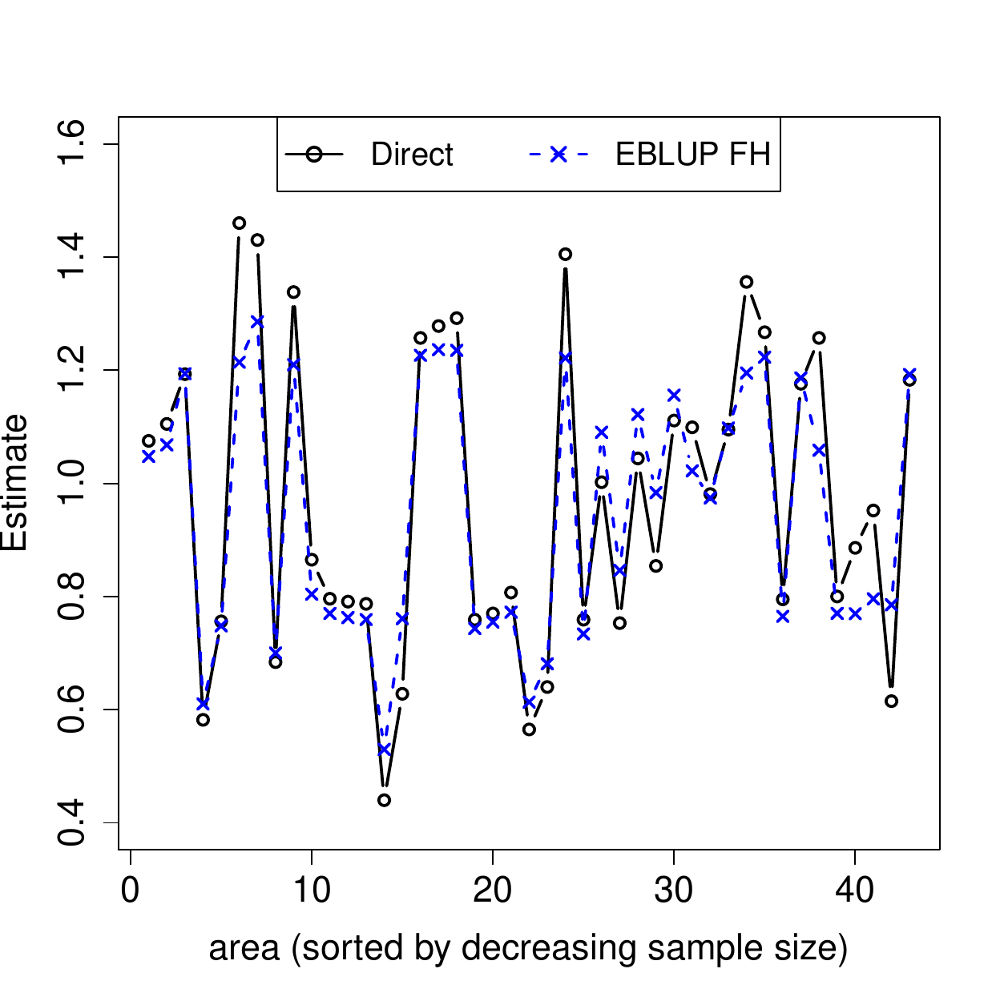

::: article
# The R package at a glance

The R package [*sae*](https://CRAN.R-project.org/package=sae) implements
small area estimation methods under the following area-level models:

-   Fay-Herriot model (including common fitting methods);

-   extended Fay-Herriot model that accounts for spatial correlation;

-   extended Fay-Herriot model allowing for spatio-temporal correlation.

The package also includes small area estimation methods based on the
basic unit level model called the nested-error linear regression model.
The available estimation methods under this model are:

-   Empirical best linear unbiased predictors (EBLUPs) of area means
    under the nested-error linear regression model for the target
    variable.

-   Empirical Best/Bayes (EB) estimates of general nonlinear area
    parameters under the nested-error linear regression model for
    Box-Cox or power transformations of the target variable.

Methods for estimation of the corresponding uncertainty measures of the
small area estimators obtained from the above models are also included.
Additionally, the package includes the following basic direct and
indirect estimators

-   Direct Horvitz-Thompson estimators of small area means under general
    sampling designs;

-   Post-stratified synthetic estimator;

-   Composite estimator.

This paper describes the above model-based small area estimation
techniques and illustrates the use of the corresponding functions
through suitable examples. For a description of the direct and basic
indirect estimators included in the package and a detailed description
of all implemented methodology, see
<http://CRAN.R-project.org/package=sae>.

# Introduction

The growing demand for more timely and detailed information, together
with the high cost of interviews often leads to an extensive
exploitation of survey data. Indeed, many times survey data are used to
produce estimates in smaller domains or areas than those for which the
survey was originally planned. For an area with a small sample size, a
direct estimator, based only on the sample data coming from that area,
might be very unreliable. This sample size limitation prevents the
production of statistical figures at the requested level and therefore
restricts the availability of statistical information for the public or
the particular user. In contrast, an indirect estimator for an area also
uses external data from other areas so as to increase efficiency by
increasing the effective sample size. Among indirect estimators, we find
those based on explicit regression models, called model-based
estimators. These estimators are based on assuming a relation between
the target variable and some explanatory variables that is constant
across areas. The common model parameters are estimated using the whole
bunch of sample data, which often leads to small area estimators with
appreciably better efficiency than direct estimators as long as model
assumptions hold. Thus, these techniques provide statistical figures at
a very disaggregated level without increasing the area-specific sample
sizes and therefore without increasing the survey cost. The small area
estimation (SAE) methods included in the R package *sae* have
applications in many different fields such as official statistics,
agriculture, ecology, medicine and engineering. For a comprehensive
account of SAE techniques, see [@Rao03].

The R package *sae* is mainly designed for model-based small area
estimation. Nevertheless, simple direct and indirect estimators are
included for didactic purposes and to allow the user to do cross
comparisons between the very simple indirect methods and the more
advanced model-based methods. Model-based point estimators can be
supplemented with their corresponding estimated mean squared errors
(MSEs), which are computed using analytical approximations in some cases
and bootstrap procedures in other cases.

Area level models are used to obtain small area estimators when
auxiliary data are available only as area aggregates. The basic area
level model is the Fay-Herriot (FH) model [@FayHerriot79]. Small area
estimates based on this model and analytical MSE estimates can be
obtained using the functions `eblupFH()` and `mseFH()` respectively.

An extension of the basic FH model to the case of (unexplained) spatial
correlation among data from neighboring areas is the spatial Fay-Herriot
(SFH) model. The function `eblupSFH` considers the SFH model in which
area effects are assumed to follow a simultaneous autoregressive process
of order one or SAR(1) process. Small area estimates supplemented with
analytical MSE estimates can be obtained using the function `mseSFH()`.
Alternatively, parametric and non-parametric bootstrap MSE estimates for
the small area estimators obtained from the SFH model are given by the
functions `pbmseSFH()` and `npbmseSFH()` respectively.

A spatio-temporal Fay-Herriot (STFH) model can be used when data from
several periods of time are available and there is also spatial
correlation. Apart from the area effects following a SAR(1) process, the
STFH model considered by function `eblupSTFH()` includes time effects
nested within areas, following for each domain an i.i.d. autorregresive
process of order 1 or AR(1). The function `pbmseSTFH()` gives small area
estimates and parametric bootstrap MSE estimates.

When auxiliary information is available at the unit level, the basic
small area estimators are those based on the nested error linear
regression model of [@BatteseHarterFuller88], called hereafter BHF
model. Function `eblupBHF()` gives estimates of small area means based
on BHF model. Parametric bootstrap MSE estimates are obtained calling
function `pbmseBHF()`.

General small area parameters obtained as a nonlinear function of the
response variable in the model, such as income-based poverty indicators,
can be estimated under BHF model using function `ebBHF()`. Function
`pbmseebBHF()` gives the corresponding parametric bootstrap MSE
estimates.

The paper is structured as follows. First, we discuss the differences
between design and model based inference and introduce the notation used
throughout the paper. Then, we describe one by one the model-based SAE
methods implemented in the package. For each method, we briefly describe
the theory behind and the use of the functions, including suitable
examples. Finally, we summarize other existing software for small area
estimation.

# Design versus model-based inference

In survey sampling, the population is a finite collection of
distinguishable and countable units. The measurements of the target
variable in the population units are assumed to be non-stochastic and
the aim is to estimate characteristics of the population, i.e.,
functions of the population measurements of the study variable in the
population units, which are consequently non-stochastic as well. A
sample is simply a collection of population units and inference is
typically carried out under the probability distribution induced by the
random mechanism used to draw the sample, i.e., the sampling design.
Thus, desirable properties of estimators such as unbiasedness are
established in terms of averages over all possible samples.

In model-based inference, the term population refers simply to a random
variable and, in the simplest case, the sample is a collection of
independent variables distributed identically as the original random
variable. The parameters of interest are characteristics of the
probability distribution of the original random variable such as
moments, which are assumed to be fixed under the frequentist setup.

In small area estimation, the subpopulations of interest are called
indistinctly areas or domains. These areas are assumed to be finite
although they are typically large. However, due to the lack of sample
data within those areas, models are needed to link all areas through
some common parameters so as to "borrow strength\" from related areas
and then to improve efficiency as long as model assumptions hold. Thus,
model-based small area methods combine the finite population setup with
the randomness of the measurements of the variable of interest in the
population units, which are assumed to follow a regression model.
Consequently, target quantities, defined as functions of the population
measurements, are also random.

# Notation

As mentioned above, here we consider a large but finite population $U$.
This population is assumed to be partitioned into $D$ mutually exclusive
and exhaustive domains or areas $U_1,\ldots,U_D$ of sizes
$N_1,\ldots,N_D$. Let $Y_{dj}$ be the measurement of the variable of
interest for individual $j$ within area $d$ and let
$\mathbf y_d=(Y_{d1},\ldots,Y_{dN_d})^\top$ be the vector of
measurements for area $d$. The target parameters have the form
$\delta_d=h(\mathbf y_d)$, $d=1,\ldots,D$, for a known measurable
function $h$. Particular target parameters of common interest are the
domain means
$$\delta_d=\bar Y_d=N_d^{-1}\sum_{j=1}^{N_d}Y_{dj}, \quad d=1,\ldots,D.$$
Estimation of the target parameters is based on a sample $s$ drawn from
the population $U$. Let $s_d$ be the subsample from domain $U_d$ of size
$n_d$, $d = 1,\ldots,D$, where $n=\sum_{d=1}^D n_d$ is the total sample
size. We will denote by $r_d=U_d-s_d$ the sample complement from domain
$d$ of size $N_d-n_d$, for $d=1,\ldots,D$.

Estimation of the area parameters $\delta_d=h(\mathbf y_d)$,
$d=1,\ldots,D$, can be done using area or unit-level models. In area
level models, the auxiliary information comes in the form of aggregated
values of some explanatory variables at the domains, typically true area
means. In contrast, unit-level models make use of the individual values
of the explanatory variables.

The package *sae* contains functions that provide small area estimators
under both types of models. Functions for point estimation based on area
level models include `eblupFH()`, `eblupSFH()` and `eblupSTFH()`.
Functions for unit-level data are `eblupBHF()` and `ebBHF()`. Functions
for estimation of the usual accuracy measures are also included. Below
we describe the assumed models and the use of these functions, including
examples of use. The package *sae* depends on packages
[*nlme*](https://CRAN.R-project.org/package=nlme)
[@PinheiroBatesDebRoySarkarRCore13] and
[*MASS*](https://CRAN.R-project.org/package=MASS) [@VenablesRipley02].
The examples of these functions have been run under R version x64 3.1.3.

# EBLUPs based on a FH model

A basic area level model is the Fay-Herriot (FH) model, introduced by
[@FayHerriot79] to obtain small area estimators of median income in U.S.
small places. This model is defined in two stages. Let
$\hat\delta_d^{DIR}$ be a direct estimator of $\delta_d$. In the first
stage, we assume that, given $\delta_d$, $\hat\delta_d^{DIR}$ is an
unbiased estimator of $\delta_d$; more concretely,

$$ \hat\delta_d^{DIR}=\delta_d + e_d, \quad e_d \stackrel{ind} \sim  N(0, \psi_d),\quad d=1,\dots,D, 
(\#eq:FHm1)  $$

where $\psi_d$ is the sampling variance of the direct estimator
$\hat\delta_d^{DIR}$ given $\delta_d$, assumed to be known for all
$d=1,\ldots,D$. In a second stage, we assume that the area parameters
$\delta_d$ are linearly related with a $p$-vector $\mathbf x_d$ of area
level auxiliary variables as follows,

$$\delta_d=\mathbf x_d^\top{\boldsymbol \beta}+u_d,\quad u_d\stackrel{ind}\sim
N(0,A),\quad d=1,\dots, D.   \label{eq:FHm2}  (\#eq:FHm2)  $$

Model (\@ref(eq:FHm2)) is called linking model because it relates all
areas through the common regression coefficients ${\boldsymbol \beta}$,
allowing us to borrow strength from all areas. Model (\@ref(eq:FHm1)) is
called sampling model because it represents the uncertainty due to the
fact that $\delta_d$ is unobservable and, instead of $\delta_d$, we
observe its direct estimator based on the sample, $\hat\delta_d^{DIR}$.
Combining the two model components, we obtain the linear mixed model

$$\label{eq:FHmodel}
\hat\delta_d^{DIR}= \mathbf x_d^\top{\boldsymbol \beta}+u_d+e_d,\quad e_d\stackrel{ind}\sim N(0,\psi_d), \quad d=1,\dots,D,  (\#eq:FHmodel)  $$

where $$\quad u_d\stackrel{ind}\sim N(0,A), \quad d=1,\dots,D,$$ and
$u_d$ is independent of $e_d$ for all $d$. Normality is not needed for
point estimation but it is required for the estimation of the mean
squared error.

[@Henderson75] obtained the best linear unbiased predictor (BLUP) of a
mixed effect, i.e., a linear combination of the fixed and random effects
${\boldsymbol \beta}$ and $\mathbf u=(u_1,\ldots,u_D)^T$. The BLUP of
$\delta_d$ under FH model (\@ref(eq:FHmodel)) is given by

$$\label{eq:blupFH}  
\tilde\delta_d^{BLUP}=\mathbf x_d^\top\tilde{\boldsymbol \beta}(A)+\tilde u_d(A),  (\#eq:blupFH)  $$

where
$\tilde u_d(A)=\gamma_d(A)\left(\hat\delta_d^{DIR}-\mathbf x_d^\top\tilde{\boldsymbol \beta}(A) \right)$
is the predicted random effect, $\gamma_d(A)=A/(A+\psi_d)\in (0,1)$ and
$\tilde{\boldsymbol \beta}(A)=\left[\sum_{d=1}^D\left(A+\psi_d\right)^{-1}\mathbf x_d\mathbf x_d^T\right]^{-1}\sum_{d=1}^D\left(A+\psi_d\right)^{-1}\mathbf x_d\hat\delta_d^{DIR}$
is the weighted least squares estimator of ${\boldsymbol \beta}$.

The BLUP assumes that $A$ is known. The empirical BLUP (EBLUP)
$\hat\delta_d^{EBLUP}$ is obtained by replacing $A$ in the BLUP
(\@ref(eq:blupFH)) by a consistent estimator $\hat A$. The EBLUP can be
expressed as a combination of the direct and the regression-synthetic
estimators as follows,

$$\label{eq:eblupFH}
\hat\delta_d^{EBLUP}=\hat\gamma_d\hat\delta_d^{DIR}+(1-\hat\gamma_d)\mathbf x_d^\top\hat{\boldsymbol \beta},  (\#eq:eblupFH)  $$

where $\hat\gamma_d=\gamma_d(\hat A)=\hat A/(\hat A+\psi_d)$ and
$\hat{\boldsymbol \beta}=\tilde{\boldsymbol \beta}(\hat A)$. In
(\@ref(eq:eblupFH)), we can see that when the direct estimator is
reliable, i.e. $\psi_d$ is small as compared with $\hat A$, then the
EBLUP comes closer to the direct estimator. In contrast, when the direct
estimator is unreliable, i.e. $\psi_d$ is large as compared with
$\hat A$, then the EBLUP gets closer to the regression-synthetic
estimator. Thus, the EBLUP makes use of the regression assumption only
for areas where borrowing strength is needed.

Common model fitting methods delivering consistent estimators for $A$
are Fay-Herriot (FH) method [@FayHerriot79], maximum likelihood (ML) and
restricted ML (REML), where the latter accounts for the degrees of
freedom due to estimating ${\boldsymbol \beta}$ and therefore has a
reduced finite sample bias. If the estimator $\hat A$ is an even and
translation invariant function of the vector of direct estimates, which
holds for FH, ML and REML fitting methods, then under symmetric
distributions of random effects and errors, the EBLUP
$\hat\delta_d^{EBLUP}=\tilde\delta_d^{BLUP}(\hat A)$ remains unbiased
[@KackarHarville84].

Models are typically compared based on goodness-of-fit measures such as
the log-likelihood, the Akaike Information Criterion (AIC) and the
Bayesian Information Criterion (BIC). Under FH model
(\@ref(eq:FHmodel)), the log-likelihood is given by
$$\ell(A,{\boldsymbol \beta})=-\frac{1}{2}\left[D\log(2\pi)+\sum_{d=1}^D\log(A+\psi_d)+\sum_{d=1}^D\left(A+\psi_d \right)^{-1}\left(\hat\delta_d^{DIR}-\mathbf x_d^\top{\boldsymbol \beta}\right)^2\right].$$
AIC and BIC are respectively obtained as
$$\mbox{AIC}=-2\ell(A,{\boldsymbol \beta})+2(p+1),\quad \mbox{BIC}=-2\ell(A,{\boldsymbol \beta})+(p+1)\log(D).$$
Analogous formulas are applied in the remaining functions dealing with
extensions of FH model, but using the corresponding log-likelihood. For
functions based on BHF model, goodness-of-fit measures are those
delivered by function `lme()` of the package *nlme*. A point estimate
$\hat\delta_d$ of $\delta_d$ must be supplemented with an uncertainty
measure; typically, the mean squared error
$\mbox{MSE}(\hat\delta_d)=E(\hat\delta_d-\delta_d)^2$. The MSE of the
EBLUP under the basic FH model (\@ref(eq:FHmodel)) can be estimated
analytically using the large sample approximation obtained by
[@PrasadRao90] for a moments estimator of $A$. For REML and ML fitting
methods, the analytical MSE estimates were firstly obtained by
[@DattaLahiri00] and for FH fitting method, by [@DattaRaoSmith05].

Functions `eblupFH()` and `mseFH()` calculate respectively small area
estimates and corresponding analytical MSE estimates under FH model. The
calls to these functions are

``` r
eblupFH(formula, vardir, method = "REML", MAXITER = 100, PRECISION = 0.0001, data)
mseFH(formula, vardir, method = "REML", MAXITER = 100, PRECISION = 0.0001, data)
```

Both functions require specification of the fixed part of FH model
(\@ref(eq:FHmodel)) through a usual R `formula` object, placing the
vector of direct estimates on the left-hand side of `formula` and the
desired area level covariates separated by \"+\" on the right-hand side.
The `formula` automatically adds an intercept by default. These
functions also require estimates of the sampling variances of the direct
estimators in `vardir`. The direct estimates (left-hand side of
`formula`) and their estimated variances (`vardir`) required in the area
level functions can be previously obtained using the function `direct()`
included in the package *sae* or using the R packages
[*survey*](https://CRAN.R-project.org/package=survey)
[@Lumley04; @Lumley12] or
[*sampling*](https://CRAN.R-project.org/package=sampling)
[@TilleMatei12] when the sampling design information is available. The
default fitting method (`method`) is `REML` and it can be changed to
`FH` and `ML`. Default maximum number of iterations (`MAXITER`) and
convergence tolerance criteria (`PRECISION`) of the Fisher-scoring
algorithm can be also modified. The last argument, `data`, can be used
to specify a data object that contains the variables in `formula` and
`vardir` as columns. The functions do not allow `NA` values because in
area level models we do not consider areas with zero sample size.

The function `eblupFH()` returns a list with two objects: `eblup`, a
vector with the EBLUPs for the areas, and `fit`, which includes all
interesting output from the fitting process. The function `mseFH()`
gives also the EBLUPs, but supplemented with their analytical MSE
estimates. This function delivers a list with two objects: `est`, a list
containing the EBLUPs and the results of the model fitting, and `mse`, a
vector with the estimated MSEs.

## Example 1. Average expenditure on fresh milk

We consider the data set `milk` on fresh milk expenditure, used
originally by [@AroraLahiri97] and later by [@YouChapman06]. This data
set contains 43 observations on the following six variables: `SmallArea`
containing the areas of inferential interest, `ni` with the area sample
sizes, `yi` with the average expenditure on fresh milk for the year 1989
(direct estimates), `SD` with the estimated standard deviations of
direct estimators, `CV` with the estimated coefficients of variation of
direct estimators and, finally, `MajorArea` containing major areas
created by [@YouChapman06]. We will obtain EBLUPs $\hat\delta_d^{EBLUP}$
of average area expenditure on fresh milk for 1989, $\delta_d$, together
with analytical MSE estimates $\mbox{mse}(\hat\delta_d^{EBLUP})$, based
on FH model with fixed effects for `MajorArea` categories. We will
calculate the coefficients of variation (CVs) in terms of the MSE
estimates as
$\mbox{cv}(\hat\delta_d^{EBLUP})=100\sqrt{\mbox{mse}(\hat\delta_d^{EBLUP})}/\hat\delta_d^{EBLUP}$.
We will analyze the gain in efficiency of the EBLUPs
$\hat\delta_d^{EBLUP}$ in comparison with direct estimators
$\hat\delta_d^{DIR}$ based on the CVs.

``` r
> data("milk")
> attach(milk)
> FH <- mseFH(yi ~ as.factor(MajorArea), SD^2)
> cv.FH <- 100 * sqrt(FH$mse) / FH$est$eblup
> results <- data.frame(Area = SmallArea, SampleSize = ni, DIR = yi,
+                       cv.DIR = 100 * CV, eblup.FH = FH$est$eblup, cv.FH)
> detach(milk)
```

EBLUPs and direct area estimates of average expenditure are plotted for
each small area in Figure [1](#DirectEblupFH) left. CVs of these
estimators are plotted in Figure [1](#DirectEblupFH) right. In both
plots, small areas have been sorted by decreasing sample size. The
following R commands are run to obtain Figures 1 left and right:

``` r
> results <- results[order(results$SampleSize, decreasing = TRUE), ]
> # Figure 1 left
> plot(results$DIR, type = "n", ylab = "Estimate", ylim = c(0.4, 1.6),  
+      xlab = "area (sorted by decreasing sample size)", cex.axis = 1.5, 
+      cex.lab = 1.5)
> points(results$DIR, type = "b", col = 1, lwd = 2, pch = 1, lty = 1)
> points(results$eblup.FH, type = "b", col = 4, lwd = 2, pch = 4, lty = 2)
> legend("top", legend = c("Direct", "EBLUP FH"), ncol = 2, col = c(1, 4), lwd = 2,
+        pch = c(1, 4), lty = c(1, 2), cex = 1.3)
> plot(results$cv.DIR, type = "n", ylab = "CV", ylim = c(5, 40), 
+      xlab = "area (sorted by decreasing sample size)", cex.axis = 1.5, 
+      cex.lab = 1.5) 
> points(results$cv.DIR, type = "b", col = 1, lwd = 2, pch = 1, lty = 1)
> points(results$cv.FH, type = "b", col = 4, lwd = 2, pch = 4, lty = 2)
> legend("top", legend = c("Direct", "EBLUP FH"), ncol = 2, col = c(1, 4), lwd = 2,  
+        pch = c(1, 4), lty = c(1, 2), cex = 1.3)
```

Observe in Figure [1](#DirectEblupFH) left that EBLUPs track direct
estimators but are slightly less volatile. See also that CVs of EBLUPs
are smaller than those of direct estimators for all areas in
Figure [1](#DirectEblupFH) right. In fact, national statistical
institutes are committed to publish statistical figures with a minimum
level of reliability. A generally accepted rule is that an estimate with
CV over 20% cannot be published. In this application, direct estimators
have CVs over 20% for several areas, whereas the CVs of the EBLUPs do
not exceed this limit for any of the areas. Moreover, the gains in
efficiency of the EBLUPs tend to be larger for areas with smaller sample
sizes (those on the right-hand side). Thus, in this example EBLUPs based
on FH model seem more reliable than direct estimators.

<figure id="DirectEblupFH">
<p></p>
<figcaption>Figure 1: EBLUPs based on FH model and direct area estimates
of average expenditure on fresh milk for each area (left). CVs of EBLUPs
and direct estimators for each area (right). Areas are sorted by
decreasing sample size.</figcaption>
</figure>

# EBLUPs based on a spatial FH model {#secSFHmodel}

In many practical applications, data from domains that are close to each
other are correlated. One way to account for this correlation is by
considering a spatial Fay-Herriot (SFH) model obtained by assuming that,
in FH model given in (\@ref(eq:FHmodel)), the vector
$\mathbf u=(u_1,\ldots,u_D)^\top$ of domain effects follows a first
order simultaneous autoregressive, SAR(1), process, that is,
$$\label{eq:SAR}
\mathbf u=\rho_1\mathbf W\mathbf u+{\boldsymbol\epsilon},\quad {\boldsymbol\epsilon}\sim
N(\mathbf 0_D,\sigma_1^2\,\mathbf I_D),  (\#eq:SAR)  $$ where
$\mathbf 0_k$ denotes a (column) vector of zeros of size $k$ and
$\mathbf I_k$ is the $k\times k$ identity matrix. In (\@ref(eq:SAR)),
$\rho_1\in (-1,1)$ is an unknown autorregression parameter and
$\mathbf W$ is a $D\times D$ proximity matrix obtained by a row-wise
standardization of an initial matrix with zeros on the diagonal and the
remaining entries equal to one when the row domain is neighbor of the
column domain, see e.g., [@Anselin88] and [@Cressie93].

The EBLUP under the SFH model (\@ref(eq:FHmodel)) with area effects
following (\@ref(eq:SAR)) was obtained by [@PetrucciSalvati06]. The
vector of EBLUPs for all areas are obtained with the function
`eblupSFH()`. Concerning MSE, [@SinghShuklaKundu05] gave an analytical
estimator when model parameters are estimated either by ML or REML
fitting methods. These analytical MSE estimates are implemented in
function `mseSFH()`. Under complex models such as the SFH model,
bootstrap methods are convenient alternatives because of their
conceptual simplicity. @MolinaSalvatiPratesi09 provided parametric and
non-parametric bootstrap procedures for estimation of the MSE under the
SFH model. They can be obtained respectively with functions `pbmseSFH()`
and `npbmseSFH()`. The calls to the functions related to the SFH model
are:

``` r
eblupSFH(formula, vardir, proxmat, method = "REML", MAXITER = 100, PRECISION = 0.0001,
         data)
mseSFH(formula, vardir, proxmat, method = "REML", MAXITER = 100, PRECISION = 0.0001,
       data)
pbmseSFH(formula, vardir, proxmat, B = 100, method = "REML", MAXITER = 100,
         PRECISION = 0.0001, data)
npbmseSFH(formula, vardir, proxmat, B = 100, method = "REML", MAXITER = 100,
          PRECISION = 0.0001, data)
```

Some of the arguments are exactly the same as in the functions for FH
model. The output has also the same structure. Additional arguments are
a proximity matrix (`proxmat`), whose elements are proximities or
neighborhoods of the areas, i.e., a matrix with elements in \[0,1\],
zeros on the diagonal and rows adding up to 1. Functions using bootstrap
methods also require to specify the number of bootstrap replicates `B`.
In order to achieve stable MSE estimates, a large number of bootstrap
replicates `B` is required. By default `B` is set to 100 to save
computing time but we strongly recommend to set `B` to values over 200.
Bootstrap functions are based on random number generation and the seed
for random number generation can be fixed previously using `set.seed()`.
The fitting method (`method`) can be chosen between `REML` (default
value) or `ML`.

## Example 2. Mean surface area for grape production

We consider now synthetic data on grape production for 274
municipalities in the region of Tuscany (Italy). The data set `grapes`
contains the following variables: `grapehect`, direct estimators of the
mean surface area (in hectares) used for production of grape for each
municipality, `area`, agrarian surface area (in hectares) used for
production, `workdays`, average number of working days in the reference
year and `var`, sampling variance of the direct estimators for each
municipality. We calculate spatial EBLUPs of mean surface area used for
grape production, based on a spatial FH model with `area` and `workdays`
as auxiliary variables, together with analytical MSE estimates. The data
set `grapesprox` contains the proximity matrix representing the
neighborhood structure of the municipalities in Tuscany.

We first load the two data sets, `grapes` and `grapesprox`. Then we call
the function `mseSFH()` that returns small area estimates and analytical
MSE estimates, calculate CVs and finally collect the obtained results in
a data frame:

``` r
> data("grapes")
> data("grapesprox")
> SFH <- mseSFH(grapehect ~ area + workdays - 1, var, grapesprox, data = grapes)
> cv.SFH <- 100 * sqrt(SFH$mse) / SFH$est$eblup
> results <- data.frame(DIR = grapes$grapehect,
+                       cv.DIR = 100 * abs(sqrt(grapes$var) / grapes$grapehect),
+                       eblup.SFH = SFH$est$eblup, cv.SFH)
```

Figure [2](#DirectEblupSFH) left shows the EBLUPs based on the SFH model
and the direct estimates of mean surface area used for production of
grape for each municipality. Figure [2](#DirectEblupSFH) right shows the
CVs of EBLUPs and direct estimators for each municipality, where
municipalities are sorted by increasing CVs of direct estimators.
Observe that the EBLUPs are again more stable and that CVs of EBLUPs are
smaller for most municipalities, and the CV gains are remarkable for the
municipalities in which direct estimators are very inefficient.

<figure id="DirectEblupSFH">
<p></p>
<figcaption>Figure 2: EBLUPs based on the SFH model and direct estimates
of mean surface area used for production of grape for each municipality
(left). CVs of EBLUPs and direct estimators for each municipality
(right). Municipalities are sorted by increasing CVs of direct
estimators.</figcaption>
</figure>

The following R commands are run to obtain Figures 2 left and right:

``` r
> # Sort results by increasing CV of direct estimators
> results <- results[order(results$cv.DIR), ]
> # Figure 2 left
> plot(results$DIR, type = "n", ylab = "Estimate", ylim = c(0, 400), 
+      xlab = "area (sorted by increasing CVs of direct estimators)", cex.axis = 1.5,
+      cex.lab = 1.5)
> points(results$DIR, type = "p", col = 1, lwd = 2, pch = 1)
> points(results$eblup.SFH, type = "p", col = 4, lwd = 2, pch = 4)
> legend("top", legend = c("Direct", "EBLUP SFH"), ncol = 2, col = c(1, 4), lwd = 2,
+        pch = c(1, 4), cex = 1.3)
> # Figure 2 right
> plot(results$cv.DIR, type = "n", ylab = "CV", ylim = c(0, 400),
+      xlab = "area (sorted by increasing CVs of direct estimators)", cex.axis = 1.5, 
+      cex.lab = 1.5)
> points(results$cv.DIR, type = "p", col = 1, lwd = 2, pch = 1)
> points(results$cv.SFH, type = "p", col = 4, lwd = 2, pch = 4)
> legend("top", legend = c("Direct", "EBLUP SFH"), ncol = 2, col = c(1, 4), lwd = 2, 
+        pch = c(1, 4), cex = 1.3)
```

# EBLUPs based on a spatio-temporal FH model {#secSTFHmodel}

If area level data are available for several periods of time and for
each area, the SFH model can be further extended to make use of this
additional information. Consider that data are available for $T$ time
periods within each domain. Let $\delta_{dt}$ be the target parameter in
domain $d$ at time period $t$ and let $\hat\delta_{dt}^{DIR}$ be a
direct estimate of $\delta_{dt}$. The STFH model proposed by
[@MarhuendaMolinaMorales13] extends the SFH model by including random
effects for the time periods nested within domains as follows
$$\hat\delta_{dt}^{DIR}= \mathbf x_d^\top{\boldsymbol \beta}+u_d+v_{dt}+e_{dt},\quad
e_{dt}\stackrel{ind}\sim N(0,\psi_d), \quad t=1,\ldots,T,\quad
d=1,\dots,D.$$ Here, the vector $\mathbf u=(u_1,\ldots,u_D)^\top$ of
area effects follows the SAR(1) process given in (\@ref(eq:SAR)) and,
for each area $d$, the vectors $\mathbf v_d=(v_{d1},\ldots,v_{dT})^\top$
are i.i.d. following the first order autoregressive, AR(1), process
$$v_{dt}=\rho_2v_{d,t-1}+\epsilon_{2dt},\quad \epsilon_{2dt}\sim
N(0,\sigma_2^2).$$ Much more complex models than the AR(1) process are
not typically considered in small area estimation because in practical
applications the number of available time periods $T$ is typically
small. Moving average (MA) processes are not yet considered in the *sae*
package.

[@MarhuendaMolinaMorales13] give the EBLUP of $\hat\delta_{dt}$ under
the STFH model and provide a parametric bootstrap procedure for the
estimation of the MSE of the EBLUP. EBLUPs for all areas and parametric
bootstrap estimates can be obtained calling functions `eblupSTFH()` and
`pbmseSTFH()` respectively. The calls to these functions are:

``` r
eblupSTFH(formula, D, T, vardir, proxmat, model = "ST", MAXITER = 100,
          PRECISION = 0.0001, data)
pbmseSTFH(formula, D, T, vardir, proxmat, B = 100, model = "ST", MAXITER = 100,
          PRECISION = 0.0001, data)
```

The arguments of these functions are the same as for the SFH model with
the exception that argument `method` is not used because currently only
the REML fitting method has been implemented for the STFH functions.
Additionally, we must specify the number of areas `D` and the number of
periods of time `T` for each area. Note that these functions can be used
only when data are available for all the `T` periods of time within each
of the `D` domains. Data in `formula` and `vardir` must be sorted in
ascending order by period of time for each domain. The argument `model`
can be chosen between the default value `ST` (AR(1) time-effects within
each domain) or value `S` (uncorrelated time effects within each
domain). For the bootstrap method, again we recommend to take at least
`B`=200 bootstrap replicates. Again, the output of these functions has
the same structure as that of functions for FH model.

## Example 3. EBLUPs based on a spatio-temporal FH model

In this example, we use the data set `spacetime`, which contains
synthetic area level data for $T=3$ periods of time for each of $D=11$
areas. The data set contains the following variables: `Area`, area code,
`Time`, period of time, `X1` and `X2`, the auxiliary variables for each
area and period of time, `Y`, direct estimates for each area and period
of time and `Var`, sampling variances of the direct estimators. We
calculate EBLUPs of the means for each area and period of time, based on
the STFH model with proximity matrix given in the data set
`spacetimeprox`, together with parametric bootstrap MSE estimates. We
show the results only for the last period of time.

``` r
> data("spacetime")
> data("spacetimeprox")
> D <- nrow(spacetimeprox)               # number of areas
> T <- length(unique(spacetime$Time))    # number of time periods
> set.seed(123)
> STFH <- pbmseSTFH(Y ~ X1 + X2, D, T, vardir = Var, spacetimeprox, data = spacetime)

Bootstrap procedure with B = 100 iterations starts.
b = 1
...
b = 100
```

``` r
> # Compute CVs for the EBLUPs based on the STFH model and for the direct estimators
> cv.STFH <- 100 * sqrt(STFH$mse) / STFH$est$eblup
> cv.DIR <- 100 * sqrt(spacetime$Var) / spacetime$Y
> results <- data.frame(Area = spacetime$Area, Time = spacetime$Time,
+                       DIR = spacetime$Y, eblup.STFH = STFH$est$eblup,
+                       cv.DIR, cv.STFH)
> results.lasttime <- results[results$Time == 3, ]
> print(results.lasttime, row.names = FALSE)

 Area Time      DIR eblup.STFH    cv.DIR   cv.STFH
    2    3 0.261484 0.27343181 10.944523  7.653997
    3    3 0.175358 0.17722992  7.777336  7.026746
    8    3 0.096230 0.09653879  6.059391  5.567674
   12    3 0.122160 0.13740348 21.904205 14.798918
   13    3 0.294176 0.29129477  8.812059  6.657347
   16    3 0.412106 0.31887378 13.584403  9.224897
   17    3 0.057924 0.06912566 25.195980 20.314774
   25    3 0.209146 0.17377084 15.411972 12.225196
   43    3 0.148671 0.14398844 15.788815 14.700855
   45    3 0.234361 0.22810227  9.550663  8.303303
   46    3 0.137869 0.14354272  8.853735  8.355827
```

Figure [3](#DirectEblupSTFH) left shows the EBLUPs based on the STFH
model together with the direct estimates for each area at the last time
point, with areas sorted by increasing CVs of direct estimators.
Figure [3](#DirectEblupSTFH) right shows the corresponding CVs. In this
example, we can see that even with a very small number of areas $D=11$
and periods of time $T=3$ to borrow strength from, the EBLUPs follow
closely direct estimates but are still slightly more stable and the CVs
of EBLUPs are smaller for all areas.

<figure id="DirectEblupSTFH">
<p></p>
<figcaption>Figure 3: EBLUPs of each area mean at last period of time,
based on the STFH model and direct estimates (left). CVs of the two
estimators for each area (right). Areas are sorted by increasing CVs of
direct estimators.</figcaption>
</figure>

The following R commands are executed to obtain Figures 3 left and
right:

``` r
> results.lasttime <- results.lasttime[order(results.lasttime$cv.DIR), ]
> # Figure 3 left
> plot(results.lasttime$DIR, type = "n", xlab = "area (time=3)", ylab = "Estimate", 
+      ylim = c(0.05, 0.45), cex.axis = 1.5, cex.lab = 1.5, xaxt = "n")
> axis(1, 1:11, results.lasttime$Area, cex.axis = 1.5)
> points(results.lasttime$DIR, type = "b", col = 1, lwd = 2, pch = 1, lty = 1)
> points(results.lasttime$eblup.STFH, type = "b", col = 4, lwd = 2, pch = 4, lty = 2)
> legend("top", legend = c("Direct", "EBLUP STFH"), ncol = 2, col = c(1, 4), lwd = 2,
+        pch = c(1, 4), lty = c(1, 2), cex = 1.3)
> # Figure 3 right
> plot(results.lasttime$cv.DIR, type = "n", xlab = "area (time=3)", ylab = "CV", 
+      cex.axis = 1.5, cex.lab = 1.5, xaxt = "n")
> axis(1, 1:11, results.lasttime$Area, cex.axis = 1.5)
> points(results.lasttime$cv.DIR, type = "b", col = 1, lwd = 2, pch = 1, lty = 1)
> points(results.lasttime$cv.STFH, type = "b", col = 4, lwd = 2, pch = 4, lty = 2)
> legend("top", legend = c("Direct", "EBLUP STFH"), ncol = 2, col = c(1, 4), lwd = 2,
+        pch = c(1, 4), lty = c(1, 2), cex = 1.3)
```

# EBLUPs based on BHF model {#seceq:BHFmodel}

When auxiliary data are available at the unit level, unit-level models
are likely to provide more efficient small area estimators than area
level models, because they make use of the much richer information
offered by microdata. Let the data for unit $j$ in area $d$ be
$(Y_{dj},\mathbf x_{dj}^\top)$, where $\mathbf x_{dj}$ is the vector
with the values of $p$ auxiliary variables. The basic unit-level model
is the nested error model introduced by [@BatteseHarterFuller88], given
by

$$\label{eq:BHFmodel}
Y_{dj}=\mathbf x_{dj}^\top{\boldsymbol \beta}+u_d+e_{dj},\quad u_d\stackrel{iid}\sim
N(0,\sigma_u^2),\quad e_{dj}\stackrel{iid}\sim N(0,\sigma_e^2).  (\#eq:BHFmodel)  $$

Here, $u_d$ are area effects and $e_{dj}$ are individual errors, where
$u_d$ and $e_{dj}$ are assumed to be independent with corresponding
variances $\sigma_u^2$ and $\sigma_e^2$, regarded as unknown parameters.
The model defined in (\@ref(eq:BHFmodel)) is assumed for all units in
the population and we consider that sample selection bias is absent and
therefore sample units follow exactly the same model.

For the estimation of a linear parameter
$\delta_d=\mathbf a_d^\top\mathbf y_d$ under BHF model, [@Royall70]
derived the BLUP. As a particular case, for the small area mean
$\delta_d=\bar Y_d=N_d^{-1}\sum_{j=1}^{N_d}Y_{dj}$, the BLUP is given by
$$\tilde{\bar Y}_d^{BLUP}=\frac{1}{N_d}\left(\sum_{j\in s_d}Y_{dj}+\sum_{j\in r_d}\tilde
 Y_{dj}\right),$$ 
 where
$\tilde Y_{dj}=\mathbf x_{dj}^\top\tilde{\boldsymbol \beta}+\sim u_d$
is the BLUP of $Y_{dj}$. Here, $\tilde u_d$ is the BLUP of $u_d$, given
by
$ \tilde u_d = \gamma_d(\bar y_{ds} - \bar x_{ds}^{\tilde \beta})  $ ,
with  $\bar y_{ds}=n_d^{-1}\sum_{j\in s_d} Y_{dj}$ ,
$\bar x_{ds}=n_d^{-1}\sum_{j\in s_d} \mathbf x_{dj}$ and
$\gamma_d=\sigma_u^2/(\sigma_u^2+\sigma_e^2/n_d)$. Again, the BLUP of
$\bar Y_d$ depends on the vector
${\boldsymbol \theta}=(\sigma_u^2,\sigma_e^2)^\top$ of unknown variance
components. In practice, we calculate the EBLUP of $\bar Y_d$ by
replacing ${\boldsymbol \theta}=(\sigma_u^2,\sigma_e^2)^\top$ by a
consistent estimator
$\hat{\boldsymbol \theta}=(\hat\sigma_u^2,\hat\sigma_e^2)^\top$. Usual
fitting methods for BHF model are also ML and REML. Let
$\hat{\boldsymbol \beta}$ and
$\hat u_d=\hat\gamma_d(\bar y_{ds}-\bar x_{ds}^\top\hat{\boldsymbol \beta})$
be the results of replacing ${\boldsymbol \theta}$ by
$\hat{\boldsymbol \theta}$ in the formulas of
$\tilde{\boldsymbol \beta}$ and $\tilde u_d$, where
$\hat\gamma_d=\hat\sigma_u^2/(\hat\sigma_u^2+\hat\sigma_e^2/n_d)$. Then
the EBLUP of $\bar Y_d$ can be alternatively expressed as

$$ \hat{\bar Y}_d^{EBLUP}=f_d \bar y_{ds}+\left(\bar X_d-f_d\,\bar  x_{ds}\right)^\top\hat{\boldsymbol \beta}+(1-f_d)\hat u_d, 
(\#eq:BLUPsimple)  $$

where $f_d=n_d/N_d$ is the domain sampling fraction. Equation
(\@ref(eq:BLUPsimple)) shows that, for calculation of the EBLUP of a
small area mean, apart from sample observations, we need the true totals
or means $\bar X_d$ of the auxiliary variables in the population
and the populations sizes $N_d$ of the areas.

For MSE estimation of the EBLUP given in (\@ref(eq:BLUPsimple)) based on
BHF model, @GonzalezLombardiaMolinaMoralesSantamaria08 proposed a
parametric bootstrap method for finite populations. EBLUPs of the area
means based on BHF model given in (\@ref(eq:BHFmodel)) and parametric
bootstrap MSE estimates can be obtained from the functions `eblupBHF()`
and ` pbmseBHF()` respectively. The calls to these functions are:

``` r
eblupBHF(formula, dom, selectdom, meanxpop, popnsize, method = "REML", data)
pbmseBHF(formula, dom, selectdom, meanxpop, popnsize, B = 200,  method = "REML", data)
```

The fixed part of the model needs to be specified through the argument
`formula` and the variable (vector or factor) identifying the domains
must be specified in the argument `dom`. The variables in `formula` and
`dom` can also be chosen from a data set specified in the argument
`data`. These two functions allow selection of a subset of domains where
we want to estimate by specifying the vector of selected domains in
`selectdom`, which by default includes the list of all unique domains in
`dom`. The population means of the auxiliary variables for the domains
(`meanxpop`) and the population sizes of the domains (`popnsize`) are
required arguments. `REML` (default) or `ML` fitting methods can be
specified in argument `method`. The output of these functions has the
same structure as that of FH functions. In these functions, the
observations with `NA` values in `formula` or `dom` are ignored. These
functions deliver estimates for areas with zero sample size, that is,
for areas specified in `selectdom` without observations in `formula`, as
long as these areas have elements in `meanxpop`. In this case, the
function delivers the synthetic estimator
$\hat{\bar Y}_d^{EBLUP}=\bar X_d^\top\hat{\boldsymbol \beta}$.

## Example 4. County means of corn crop hectares

We consider data used in [@BatteseHarterFuller88] on corn and soy beans
production in 12 Iowa counties, contained in the two data sets
`cornsoybean` and `cornsoybeanmeans`. Data come from two different
sources: the 1978 June Enumerative Survey of the U.S. Department of
Agriculture and images of land observatory satellites (LANDSAT) during
the 1978 growing season.

In these data sets, counties are the domains and sample segments are the
units. The data set `cornsoybean` contains the values of the following
variables for each sample segment within each county: `County`, county
code, `CornHec`, reported hectares of corn from the survey in each
sample segment within each county, `SoyBeansHec`, reported hectares of
soy beans from the survey in each sample segment within county,
`CornPix`, number of pixels of corn from satellite data, and
`SoyBeansPix`, number of pixels of soy beans from satellite data.

In this example, we will calculate EBLUPs of county means of corn crop
hectares based on BHF model, considering as auxiliary variables the
number of pixels of corn and soy beans from the LANDSAT satellite
images. See from (\@ref(eq:BLUPsimple)) that the domain (county) means
of the auxiliary variables $\bar X_d$ and the population sizes
$N_d$ of the counties are required to obtain the EBLUPs based on BHF
model. These county means are included in the data set
`cornsoybeanmeans`. Concretely, this data set contains: `SampSegments`,
number of sample segments in the county (sample size), `PopnSegments`,
number of population segments in the county (population size),
`MeanCornPixPerSeg`, county mean of the number of corn pixels per
segment, and `MeanSoyBeansPixPerSeg`, county mean of the number of soy
beans pixels per segment (county means of auxiliary variables).

First, we create the data frame `Xmean` containing the true county means
of the auxiliary variables given in the columns named
`MeanCornPixPerSeg` and `MeanSoyBeansPixPerSeg` from the data set
`cornsoybeanmeans`. We also create the data frame `Popn` containing the
county population sizes. In these two data frames, the first column must
contain the domain (or county) codes. Although here counties in `Xmean`
and `Popn` are sorted exactly in the same way, the functions for BHF
model handle correctly the case in which the domains (whose codes are
listed in the first column of both `Xmean` and `Popn`) are arranged
differently:

``` r
> data("cornsoybeanmeans")
> Xmean <- data.frame(cornsoybeanmeans[, c("CountyIndex", "MeanCornPixPerSeg",
+                                          "MeanSoyBeansPixPerSeg")])
> Popn <- data.frame(cornsoybeanmeans[, c("CountyIndex", "PopnSegments")])
```

Next, we load the data set with the unit-level data and delete
observation number 33 because it is an outlier, see
[@BatteseHarterFuller88]. Then we call the function `pbmseBHF()`, which
gives the EBLUPs of the means of corn crop area and parametric bootstrap
MSE estimates, choosing `B=200` bootstrap replicates. Here, `CornHec` is
the response variable and the auxiliary variables are `CornPix` and
`SoyBeansPix`.

Note that the argument `selectdom` can be used to select a subset of the
domains for estimation.

``` r
> data("cornsoybean")
> cornsoybean <- cornsoybean[-33, ]
> set.seed(123)
> BHF <- pbmseBHF(CornHec ~ CornPix + SoyBeansPix, dom = County, meanxpop = Xmean,
+                 popnsize = Popn, B = 200, data = cornsoybean)
Bootstrap procedure with B = 200 iterations starts.
b = 1
...
b = 200
```

Finally, we compute CVs and construct a data frame with sample sizes,
EBLUPs and CVs for each county, called `results.corn`.

``` r
> cv.BHF <- 100 * sqrt(BHF$mse$mse) / BHF$est$eblup$eblup
> results <- data.frame(CountyIndex = BHF$est$eblup$domain,
+                       CountyName = cornsoybeanmeans$CountyName,
+                       SampleSize = BHF$est$eblup$sampsize,
+                       eblup.BHF = BHF$est$eblup$eblup, cv.BHF)
> print(results, row.names = FALSE)
 CountyIndex CountyName SampleSize eblup.BHF   cv.BHF
           1 CerroGordo          1  122.1954 8.066110
           2   Hamilton          1  126.2280 7.825271
           3      Worth          1  106.6638 9.333344
           4   Humboldt          2  108.4222 7.598736
           5   Franklin          3  144.3072 4.875002
           6 Pocahontas          3  112.1586 6.020232
           7  Winnebago          3  112.7801 5.951520
           8     Wright          3  122.0020 5.700670
           9    Webster          4  115.3438 4.808813
          10    Hancock          5  124.4144 4.495448
          11    Kossuth          5  106.8883 4.532518
          12     Hardin          5  143.0312 3.504340
```

Results show great similarity with those given in
[@BatteseHarterFuller88] although the model fitting method and the MSE
estimation procedure used here are different.

# EB estimators of nonlinear parameters based on BHF model

Now consider that we wish to estimate a general nonlinear area parameter
$\delta_d=h(\mathbf y_d)$, where
$\mathbf y_d=(Y_{d1},\ldots,Y_{dN_d})^\top$ is the vector of
measurements of the response variable in the units from area $d$.
Rearranging the elements $Y_{dj}$ according to their membership to the
sample $s_d$ or the sample complement $r_d$, we can express
$\mathbf y_d$ as
$\mathbf y_d=(\mathbf y_{ds}^\top,\mathbf y_{dr}^\top)^\top$, where
$\mathbf y_{ds}$ and $\mathbf y_{dr}$ denote respectively the subvectors
containing the sample and out-of-sample elements. When
$\delta_d=h(\mathbf y_d)$ is nonlinear in $\mathbf y_d$, considering a
linear predictor like the BLUP makes no sense; instead, we consider the
best predictor, which minimizes the MSE without restrictions of
linearity or unbiasedness. The best predictor is given by

$$\label{eq:EBest}
 \tilde\delta_d^B=E_{\mathbf y_{dr}}\left[h(\mathbf y_d)|\mathbf y_{ds}\right]=\int h(\mathbf y_d)f(\mathbf y_{dr}|\mathbf y_{ds})d\mathbf y_{dr},  (\#eq:EBest)  $$

where the expectation is taken with respect to the distribution of
$\mathbf y_{dr}$ given $\mathbf y_{ds}$, with density
$f(\mathbf y_{dr}|\mathbf y_{ds})$. Under BHF model for $Y_{dj}$ given
in (\@ref(eq:BHFmodel)), the distribution of $\mathbf y_{dr}$ given
$\mathbf y_{ds}$ is normal with conditional mean vector and covariance
matrix depending on the unknown parameters ${\boldsymbol \beta}$ and
${\boldsymbol \theta}=(\sigma_u^2,\sigma_e^2)^\top$. Even if this
conditional distribution was completely known, the expected value in
(\@ref(eq:EBest)) would be still intractable for complex nonlinear
parameters $\delta_d=h(\mathbf y_d)$ like some poverty indicators. For
such cases, [@MolinaRao10] propose to estimate the unknown model
parameters by consistent estimators $\hat{\boldsymbol \beta}$ and
$\hat{\boldsymbol \theta}=(\hat\sigma_u^2,\hat\sigma_e^2)^\top$ such as
ML or REML estimators, and then obtaining the empirical best (EB)
estimator of $\delta_d$ by a Monte Carlo approximation of the expected
value in (\@ref(eq:EBest)). This process is done by first generating
out-of-sample vectors $\mathbf y_{dr}^{(\ell)}$, $\ell=1,\ldots, L$, for
large $L$, from the (estimated) conditional distribution
$f(\mathbf y_{dr}|\mathbf y_{ds};\hat{\boldsymbol \beta},\hat{\boldsymbol \theta})$.
The second step consists of attaching, for each $\ell$, the sample
elements to the generated vector $\mathbf y_{dr}^{(\ell)}$, resulting in
the full population vector (or census)
$\mathbf y_d^{(\ell)}=(\mathbf y_{ds}^\top,(\mathbf y_{dr}^{(\ell)})^\top)^\top$.
With the census $\mathbf y_d^{(\ell)}$, we then calculate the target
quantity $h(\mathbf y_d^{(\ell)})$ for each $\ell=1,\ldots,L$. Lastly,
we average the target quantity over the $L$ simulations as

$$\label{eq:MCapprox}  
 \hat\delta_d^{EB}\approx\frac{1}{L}\sum_{\ell=1}^Lh(\mathbf y_d^{(\ell)}).  (\#eq:MCapprox)  $$

Note that the size of $\mathbf y_{dr}$ is $N_d-n_d$, where $N_d$ is
typically large and $n_d$ is typically small. Then, generation of
$\mathbf y_{dr}$ might be computationally cumbersome. However, the
generation of large multivariate normal vectors can be avoided by
exploiting the form of the conditional covariance obtained from model
(\@ref(eq:BHFmodel)). It is easy to see that out-of-sample vectors
$\mathbf y_{dr}$ from the desired conditional distribution
$f(\mathbf y_{dr}|\mathbf y_{ds};\hat{\boldsymbol \beta},\hat{\boldsymbol \theta})$
can be obtained by generating only univariate variables from the
following model

$$\begin{eqnarray}
&& Y_{dj}^{(\ell)} = \mathbf x_{dj}^\top \hat{\boldsymbol \beta}+\hat u_d+v_d +\varepsilon_{dj} ,\nonumber\\
&& v_d \sim N(0,\hat\sigma _u^2 (1-\hat\gamma _d )),\ \varepsilon_{dj} \sim N(0,\hat\sigma_e^2),\ j\in r_d,\
d=1,\ldots, D. \label{eq:vdepsilondj}  
\end{eqnarray}  (\#eq:vdepsilondj)  $$

In some cases, the response variable in BHF model is a one-to-one
transformation of the variable of interest, that is, $Y_{dj}=T(O_{dj})$,
where $O_{dj}$ are the measurements of the variable of interest in the
population units. This situation often occurs in socio-economic
applications. A good example is when $O_{dj}$ is a variable measuring
welfare of individuals such as income, and the target parameter for each
area is a poverty indicator such as the poverty incidence, also called
at-risk-of-poverty rate. The poverty incidence is defined as the
proportion of people with income $O_{dj}$ below the poverty line $z$,
that is,

$$\label{eq:povinc}
 \delta_d=\frac{1}{N_d}\sum_{j=1}^{N_d}I\left(O_{dj}<z\right),\quad d=1,\ldots,D.  (\#eq:povinc)  $$

The distribution of incomes $O_{dj}$ is typically severely skewed and
therefore assuming BHF model for $O_{dj}$ with normally distributed
random effects and errors is not realistic. Thus, we cannot obtain EB
estimates of $\delta_d$ based on BHF model for $O_{dj}$ as described
above. However, a transformation $Y_{dj}=T(O_{dj})$, such as
$Y_{dj}=\log(O_{dj}+c)$ often leads to (at least approximate) normality.
Observe that the target area parameter $\delta_d$, if initially defined
in terms of the original variables $O_{dj}$, can be easily expressed in
terms of the transformed variables $Y_{dj}$ using the inverse
transformation $O_{dj}=T^{-1}(Y_{dj})$, as
$$\delta_d=h(\mathbf y_d)=\frac{1}{N_d}\sum_{j=1}^{N_d}I\left(T^{-1}(Y_{dj})<z \right),\quad d=1,\ldots,D.$$
Expressing the target area parameter $\delta_d$ in terms of the actual
model responses $Y_{dj}$ for area $d$ as $\delta_d=h(\mathbf y_d)$, we
can then compute the Monte Carlo approximation of the EB estimate
$\hat\delta_d^{EB}$ of $\delta_d$ as indicated in (\@ref(eq:MCapprox)).

Suitable transformations $T()$ leading to normality can be found within
the Box-Cox or power families. For a constant $c$ and a power $\lambda$,
the Box-Cox transformation is given by
$$T_{c,\lambda}(O_{dj})=\left\{\begin{array}{ll}
 \left[(O_{dj}+c)^{\lambda}-1\right]/\lambda, & \lambda\neq 0;\\
 \log(O_{dj}+c), & \lambda= 0.
 \end{array}\right.$$ The power family is given by
$$T_{c,\lambda}^*(O_{dj})=\left\{\begin{array}{ll}
 (O_{dj}+c)^{\lambda}, & \lambda\neq 0;\\
 \log(O_{dj}+c), & \lambda= 0.
 \end{array}\right.$$ The log transformation is obtained in the two
families setting $\lambda=0$. MSE estimates of the EB estimators of
$\delta_d=h(\mathbf y_d)$ under BHF model can be obtained using the
parametric bootstrap method for finite populations introduced by
@GonzalezLombardiaMolinaMoralesSantamaria08.

Function `ebBHF()` gives EB estimates of the area parameters
$\delta_d=h(\mathbf y_d)$, where $Y_{dj}=T(O_{dj}),$ based on BHF model
for $Y_{dj}$. Function `pbmseebBHF()` gives EB estimates together with
parametric bootstrap MSE estimates. The calls to these functions are:

``` r
ebBHF(formula, dom, selectdom, Xnonsample, MC = 100, data, transform = "BoxCox",
      lambda = 0, constant = 0, indicator)
pbmseebBHF(formula, dom, selectdom, Xnonsample, B = 100, MC = 100, data,
           transform = "BoxCox", lambda = 0, constant = 0, indicator)
```

In the left-hand side of the `formula` object, we must put the vector of
observations of the original variables $O_{dj}$. We can either select
\"Box-Cox\" or \"power\" family of transformations for $O_{dj}$ through
the argument `transform`. The constant $c$ of the transformations is
specified through the argument `constant` and the power is specified in
`lambda`. This parameter is by default set to 0, which corresponds to
log transformation for both families. Setting `lambda` equal to 1 and
letting the default constant equal to 0 implies no transformation. Note
that these functions assumes BHF model for the transformed variables
$Y_{dj}=T(O_{dj})$. In the argument `indicator`, we must provide the
name of the R function that is applied to the untransformed variables
$O_{dj}$ to obtain the target area parameter. For example, if the target
parameters are the area medians of the original untransformed variables
$O_{dj}$, we must specify `indicator=median` regardless of the
transformation taken.

The two above functions require the values of auxiliary variables for
each out-of-sample unit (`Xnonsample`). Additionally, in argument `MC`
we must specify the number of Monte Carlo samples $L$ that we wish to
use in the Monte Carlo approximation of the EB estimators given in
Equation (\@ref(eq:MCapprox)). These functions ignore the observations
with `NA` values in `formula` or `dom`. They also deliver EB estimates
for areas with zero sample size, that is, for the areas specified in
`selectdom` without any observations in `formula`, as long as the values
of the auxiliary variables for all the units in these areas are included
in `Xnonsample`. In this case, the functions generate the out-of-sample
elements $Y_{dj}^{(\ell)}$ from model (\@ref(eq:vdepsilondj)) with
$\hat\gamma_d=0$.

The function `ebBHF()` delivers a list of two objects: the first one is
called `eb` and contains the EB estimates for each selected domain, and
the second one is called `fit`, and contains a summary of the model
fitting. The function `pbmseebBHF()` obtains the parametric bootstrap
MSE estimates together with the EB estimates. It delivers a list with
two objects. The first one, `est`, is another list containing itself two
objects: the results of the point estimation process (`eb`) and a
summary of the fitting process (`fit`). The second one, `mse`, contains
a data frame with the estimated MSEs for each selected domain.

## Example 5. Poverty mapping

In this example, we will illustrate how to estimate poverty incidences
in Spanish provinces (areas). As given in Equation (\@ref(eq:povinc)),
the poverty incidence for a province is the province mean of a binary
variable $O_{dj}$ taking value 1 when the person's income is below the
poverty line $z$ and 0 otherwise.

The data set `incomedata` contains synthetic unit-level data on income
and other sociological variables in the Spanish provinces. These data
have been obtained by simulation, with the only purpose of being able to
illustrate the use of the package functions. Therefore, conclusions
regarding the levels of poverty in the Spanish provinces obtained from
these data are not realistic. We will use the following variables from
the data set: province name (`provlab`), province code (`prov`), income
(`income`), sampling weight (`weight`), education level (`educ`), labor
status (`labor`), and finally the indicators of each of the categories
of `educ` and `labor`.

We will obtain EB estimates of province poverty incidences based on BHF
model for the variable `income`. Note that the EB method assumes that
the response variable considered in BHF model is (approximately)
normally distributed. However, the histogram of `income` appears to be
highly right-skewed and therefore transformation to achieve approximate
normality is necessary. We select the log transformation, which is a
member of both Box-Cox and power family, taking $\lambda=0$. For the
constant $c$ in these transformation families, we tried with a grid of
values in the range of `income`. For each value of $c$ in the grid, we
fitted BHF model to $\log(\mbox{income}+c)$ and selected the value of
$c$ for which the distribution of residuals was approximately symmetric,
see the residual plots in Figure [4](#Residuals). The resulting value of
the constant was $c=3500$.

The package functions dealing with EB method can estimate whatever
domain target parameter as desired, provided this target parameter is a
function of a continuous variable $O_{dj}$ whose transformation $Y_{dj}$
will act as response variable in BHF model. We just need to define the
target parameter for the domains as an R function. The target parameter
in this example is the poverty incidence, which is a function of the
continuous variable `income`. Thus, we define the R function
`povertyincidence()` as function of `y`=`income`, considering as poverty
line `z = 6557.143`.

``` r
> povertyincidence <- function(y) {
+   result <- mean(y < 6557.143)
+   return (result)
+ }
```

When estimating nonlinear parameters, the values of the auxiliary
variables in the model are needed for each out-of-sample unit. Although
we will use the sample data from all the provinces to fit the model, to
save computation time here we will compute EB estimates and
corresponding MSE estimates only for the 5 provinces with the smallest
sample sizes. For these selected provinces, the data set `Xoutsamp`
contains the values for each out-of-sample individual of the considered
auxiliary variables, which are the categories of education level and of
labor status, defined exactly as in the data set `incomedata`. Again,
these data have been obtained by simulation.

We read the required data sets, create the vector `provincecodes` with
province codes for the selected provinces and create also
`Xoutsamp_AuxVar`, containing the values of the auxiliary variables for
all out-of-sample individuals in these provinces.

``` r
> data("incomedata")
> data("Xoutsamp")
> provincecodes <- unique(Xoutsamp$domain)                     
> provincelabels <- unique(incomedata$provlab)[provincecodes]  
> Xoutsamp_AuxVar <- Xoutsamp[ ,c("domain", "educ1", "educ3", "labor1", "labor2")]
```

Next, we use the function `ebBHF` to calculate EB estimates of the
poverty incidences under BHF model for log(`income`+`constant`) for the
5 selected provinces specified in the argument `selectdom`. In the
argument `indicator`, we must specify the function `povertyincidence()`
defining the target parameter.

``` r
> set.seed(123)
> EB <- ebBHF(income ~ educ1 + educ3 + labor1 + labor2, dom = prov,
+             selectdom = provincecodes, Xnonsample = Xoutsamp_AuxVar, MC = 50,
+             constant = 3500, indicator = povertyincidence, data = incomedata)
```

The list `fit` of the output gives information about the fitting
process. For example, we can see whether auxiliary variables are
significant.

``` r
> EB$fit$summary
Linear mixed-effects model fit by REML
 Data: NULL
       AIC      BIC    logLik
  18980.72 19034.99 -9483.361

Random effects:
 Formula: ~1 | as.factor(dom)
        (Intercept)  Residual
StdDev:  0.09436138 0.4179426

Fixed effects: ys ~ -1 + Xs
                  Value   Std.Error    DF  t-value p-value
Xs(Intercept)  9.505176 0.014384770 17143 660.7805       0
Xseduc1       -0.124043 0.007281270 17143 -17.0359       0
Xseduc3        0.291927 0.010366323 17143  28.1611       0
Xslabor1       0.145985 0.006915979 17143  21.1084       0
Xslabor2      -0.081624 0.017082634 17143  -4.7782       0
 Correlation:
         Xs(In) Xsedc1 Xsedc3 Xslbr1
Xseduc1  -0.212
Xseduc3  -0.070  0.206
Xslabor1 -0.199  0.128 -0.228
Xslabor2 -0.079  0.039 -0.039  0.168

Standardized Within-Group Residuals:
       Min         Q1        Med         Q3        Max
-4.2201202 -0.6617181  0.0203607  0.6881828  3.5797393

Number of Observations: 17199
Number of Groups: 52
```

Checking model assumptions is crucial since the optimality properties of
the EB estimates depend on the extent to which those assumptions are
true. To detect departures from BHF model for the transformed income, we
can draw the usual residual plots. The following commands draw an index
plot of residuals and a histogram:

``` r
# Figure 4 left
> plot(EB$fit$residuals, xlab = "Index", ylab = "Residuals", cex.axis = 1.5, 
+      cex.lab = 1.5, ylim = c(-2, 2), col = 4)
> abline(h = 0)

> # Figure 4 right
> hist(EB$fit$residuals, prob = TRUE, xlab = "Residuals", ylab = "", main = "", 
+      cex.axis = 1.5, cex.lab = 1.5, xlim = c(-2, 2), ylim = c(0, 1))
```

These two plots appear in Figure [4](#Residuals), which shows no
evidence of serious model departure.

<figure id="Residuals">
<p></p>
<figcaption>Figure 4: Index plot of residuals (left) and histogram of
residuals (right) from the fitting of BHF model to
log(income+constant).</figcaption>
</figure>

Finally, we compute parametric bootstrap MSE estimates and calculate CVs
of EB estimates. This process might be slow for a large number of
bootstrap or Monte Carlo replicates `B` and `MC` respectively, large
sample size or large number of auxiliary variables. Function
`pbmseebBHF()` gives also EB estimates apart from MSEs:

``` r
> set.seed(123)
> pbmse.EB <- pbmseebBHF(income ~ educ1 + educ3 + labor1 + labor2, dom = prov,
+                        selectdom = provincecodes, Xnonsample = Xoutsamp_AuxVar,
+                        B = 200, MC = 50, constant = 3500,
+                        indicator = povertyincidence, data = incomedata)
Bootstrap procedure with B = 200 iterations starts.
b = 1
...
b = 200
> pbcv.EB <- 100 * sqrt(pbmse.EB$mse$mse) / abs(pbmse.EB$est$eb$eb)    # compute CV
```

Finally, in the data frame `results.EB` we collect the sample sizes, EB
estimates and CVs of the poverty incidence for the 5 selected provinces.

``` r
> results.EB <- data.frame(ProvinceIndex = pbmse.EB$est$eb$domain,
+                          ProvinceName = provincelabels,
+                          SampleSize = pbmse.EB$est$eb$sampsize,
+                          EB = pbmse.EB$est$eb$eb, cv.EB = pbcv.EB)
> results.EB
  ProvinceIndex ProvinceName SampleSize        EB    cv.EB
1            42        Soria         20 0.2104329 21.06776
2             5        Avila         58 0.1749877 19.49466
3            34     Palencia         72 0.2329916 11.57829
4            44       Teruel         72 0.2786618 11.89621
5            40      Segovia         58 0.2627178 13.21378
```

# Other SAE software {#compar}

The Official Statistics & Survey Methodology CRAN Task View of R
[@Templ:2014] contains a subsection called Small Area Estimation with
some packages for SAE. The
[*rsae*](https://CRAN.R-project.org/package=rsae) package [@Schoch11]
contains functions for robust fitting of basic unit and area level
models and prediction of area means. The current version does not allow
for categorical independent variables. The
[*JoSae*](https://CRAN.R-project.org/package=JoSae) package
[@Breidenbach11] includes functions for the unit-level EBLUP
[@BatteseHarterFuller88] and generalized regression (GREG) estimators
[@Sarndal84] together with estimated variances. Only univariate
unit-level models with a simple block-diagonal variance structure are
supported. The [*hbsae*](https://CRAN.R-project.org/package=hbsae)
package [@Boonstra12] can be used to obtain estimates based on unit and
area level models, where the model fitting can be done by REML or a
hierarchical Bayes procedure. In the last case, numerical integration is
used to average over the posterior density for the between-area
variance.

Recently, several R packages for SAE that are not included in the
subsection Small Area Estimation have been developed. The
[*mme*](https://CRAN.R-project.org/package=mme) package
[@LopezVizcainoLombardiaMorales14] includes functions for SAE under
three different multinomial linear mixed models: a model with
independent random effects for each category of the response variable,
the same model with additional independent time effects, and the same
model with correlated time effects. The
[*saery*](https://CRAN.R-project.org/package=saery) package
[@EstebanMoralesPerez14] contains functions for obtaining EBLUPs and
their MSEs based on the area-level model with time effects introduced by
@RaoYu94 using the REML fitting method. The
[*sae2*](https://CRAN.R-project.org/package=sae2) package
[@FayMamadou15] also offers functions for SAE under time-series area
level models supporting univariate and multivariate applications. They
provide EBLUPs based on the Rao-Yu model as well as a modified
(\"dynamic\") version.

Other R software that is not available at CRAN includes the *SAE*
package developed within BIAS project [@BIAS05], which provides the
classical EBLUP and the spatial EBLUP of [@PetrucciSalvati06]. This
project includes other methods based on Bayesian spatial models
implemented in WinBUGS [@LunnThomasBestSpiegelhalter00]. Preliminary
(and not so user friendly) versions of some of the functions contained
in the *sae* package described in this paper can be found in the website
of the European project SAMPLE [@SAMPLE07].

In addition to R software, SAS provides procedures such as `MIXED`,
`IML` and hierarchical Bayes `MCMC`, which fit unit and area level
models and provide small area estimates together with estimated mean
squared errors. See examples of use in [@MukhopadhyayMcDowell11]. Other
SAS macros have been developed in the European project EURAREA
[@EURAREA01]. The software includes macros to calculate GREG estimators
under a standard linear regression model, the regression synthetic
estimator under two different models and the EBLUP using unit and area
level models.

# Summary

This paper presents the first R package that gathers most basic small
area estimation techniques together with more recent and sophisticated
methods, such as those for estimation under a FH model with spatial and
spatio-temporal correlation or the methods for estimation of nonlinear
parameters based on BHF model. The package contains functions for point
estimation and also for mean squared error estimation using modern
bootstrap techniques. The functions are described and their use is
demonstrated through interesting examples, including an example on
poverty mapping. Nowadays, we are developing new methods for small area
estimation, which will be included in subsequent versions of the *sae*
package.

# Acknowledgments

We would like to thank the reviewers for their really careful review of
the manuscript. Their comments have led to significant improvement of
the paper. This work is supported by grants SEJ2007-64500,
MTM2012-37077-C02-01 and FP7-SSH-2007-1.
:::
