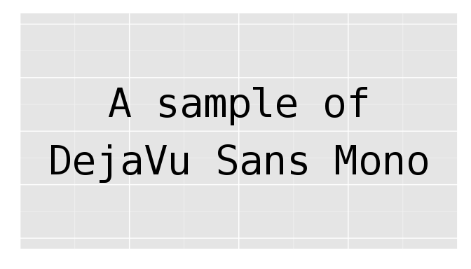
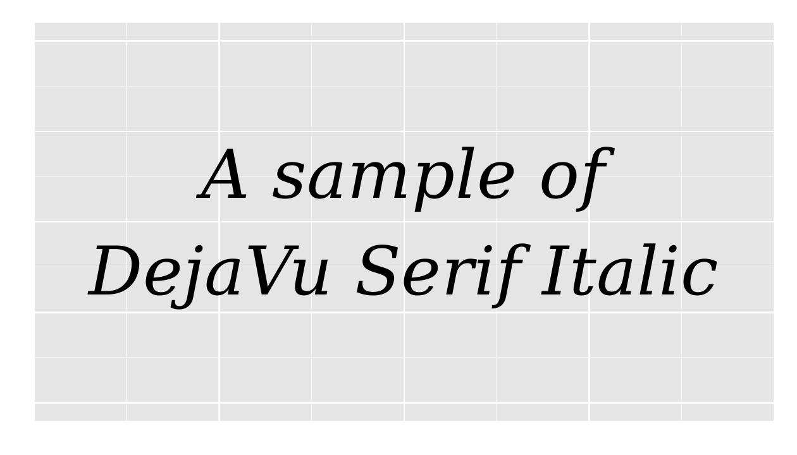
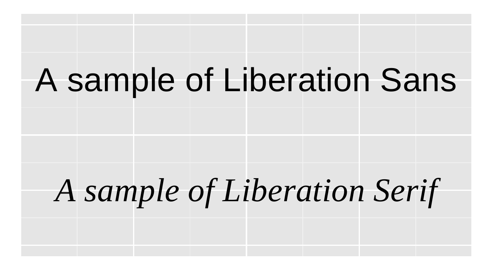
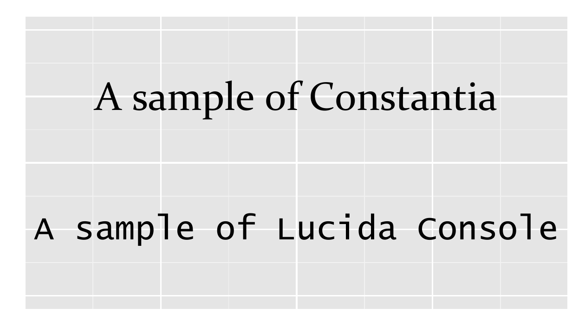

::: article
# Introduction

Using fonts in R graphics is neither a new topic nor a difficult task,
if only the standard font families such as "sans", "serif" and "mono"
are needed. However, problems occur when one wants to select fonts that
are installed in the system but not among the standard families inside
R, especially for the PDF graphics device. With the evolution of R
graphics device as well as related extension packages, there are more
and more solutions emerging to solve the font problem. The R News
article @nonstdfonts systematically describes the working mechanism of
PostScript and PDF devices to handle nonstandard fonts, and more
recently, the blog post by Winston Chang [^1] serves as an tutorial for
the [*extrafont*](https://CRAN.R-project.org/package=extrafont) package
[@extrafont] which makes it easy to use TrueType fonts in PostScript,
PDF and Windows bitmap devices.

With the same target, this article introduces the
[*showtext*](https://CRAN.R-project.org/package=showtext) package
[@showtext] that provides an alternative way to use fonts in R graphics.
It has good support for various font formats and most graphics devices
in R, and meanwhile provides some extra features such as loading web
fonts and integration with
[*knitr*](https://CRAN.R-project.org/package=knitr)
[@knitrbook; @knitrchap; @knitrpkg]. All efforts devoted to the
*showtext* package are trying to seek an easy and elegant way to make
use of different fonts in R graphics.

In the remaining part, this article will first review some existing
methods of font selection in R, and then give an introduction to the
*showtext* package, including its design, usage, examples and a number
of suggestions for use.

# Existing methods to use fonts

## Built-in graphics devices in R

It is possible to let R's built-in graphics devices (e.g., PNG and PDF)
to use installed fonts in the system. However, the implementation is
quite configuration dependent. If Cairo graphics [^2] support has been
compiled in R such that `png(type = cairo)` and `cairo_pdf()` are
available, then it is quite straightforward to use system fonts in the
plots. One only needs to specify the family name of font as is used by
the system. (Figure [1](#fig:builtin_with_cairo))

``` r
> library(ggplot2)
> # background for various plots later
> bg <- ggplot(NULL, aes(x = 1, y = 1)) + ylim(0.8, 1.2) +
+     theme(axis.title = element_blank(), axis.ticks = element_blank(),
+           axis.text = element_blank())
> 
> if(capabilities("cairo")) {
+     png("builtin-1.png", 672, 384, type = "cairo", res = 96)
+     txt1 <- annotate("text", 1, 1, label = "A sample of\nDejaVu Sans Mono",
+                      family = "DejaVu Sans Mono", size = 15)
+     print(bg + txt1)
+     dev.off()
+ 
+     cairo_pdf("builtin-2.pdf", 7, 4)
+     txt2 <- annotate("text", 1, 1, label = "A sample of\nDejaVu Serif Italic",
+                      family = "DejaVu Serif", fontface = "italic", size = 15)
+     print(bg + txt2)
+     dev.off()
+ }
```

<figure id="fig:builtin_with_cairo">
<p></p>
<figcaption>Figure 1: <span id="fig:builtin_with_cairo"
label="fig:builtin_with_cairo"></span>Specify full family name when
Cairo graphics is compiled into R. <em>Left</em>: graph in PNG format;
<em>right</em>: graph in PDF format.</figcaption>
</figure>

However, when Cairo graphics is not available, it will require more
effort to customize the font. For PNG graphs, the user needs to first
register a font family name in R which is mapped to a font that is
installed in the system, and then specify the font family name in
plotting functions. Below is an example to show this procedure on
Windows. (Figure [2](#fig:builtin_png_windows))

``` r
> if(.Platform$OS.type == "windows") {
+     windowsFonts(century = "Century Gothic")
+     png("builtin-3.png", 672, 384, res = 96)
+     txt3 <- annotate("text", 1, 1, label = "A sample of\nCentury Gothic",
+                      family = "century", size = 20)
+     print(bg + txt3)
+     dev.off()
+ }
```

![Figure 2: []{#fig:builtin_png_windows
label="fig:builtin_png_windows"}Use system fonts for PNG on Windows
without Cairo graphics.](builtin-3.png){#fig:builtin_png_windows
width="49.0%" alt="graphic without alt text"}

Notice that we use the function `windowsFonts()` to register font and
create name mapping. In other operating systems, there are analogous
functions such as `X11Fonts()` and `quartzFonts()` to do the similar
job.

For PDF graphs, the setup is more complicated. The first step is
similar: one should call `pdfFonts()` to register new family names in R,
and then use them in the plot. However, the obstacle here is that
`pdfFonts()` requires the Adobe Font Metrics files (`.afm`), which may
be unavailable for users. On the contrary, TrueType fonts (`.ttf`) and
OpenType fonts (mostly `.otf`) are most commonly used, but
unfortunately, these font formats are not directly supported by
`pdfFonts()`. Additionally, to make the plot have consistent appearance
across different PDF viewers, it is usually suggested to embed the font
within the file by calling the function `embedFonts()`, which further
invokes an external software Ghostscript [^3]. For the details,
interested readers are referred to the R News article @nonstdfonts.

Due to this complexity, when creating PDF graphs users are most likely
to only select the built-in PDF font families, which can be queried by
the command `names(pdfFonts())`.

## The Cairo package

The [*Cairo*](https://CRAN.R-project.org/package=Cairo) package [@Cairo]
provides a number of high-quality graphics devices that are driven by a
unified back-end based on Cairo graphics. When the Cairo library is
configured with FreeType and Fontconfig support, one can make use of the
`CairoFonts()` function to specify the fonts that will be used by all
the devices in *Cairo*. Below is an example to show this. (Figure
[3](#fig:cairo_package), left)

``` r
> library(Cairo)
> 
> CairoFonts(regular = "Liberation Sans:style=Regular",
+            italic = "Liberation Serif:style=Italic")
> 
> CairoPDF("Cairo-1.pdf", 7, 4)
> txt4 <- annotate("text", 1, 1.1, label = "A sample of Liberation Sans", size = 12)
> txt5 <- annotate("text", 1, 0.9, label = "A sample of Liberation Serif",
+                  fontface = "italic", size = 12)
> print(bg + txt4 + txt5)
> dev.off()
```

For systems where Cairo is not configured with FreeType or Fontconfig
(e.g., Windows), the method to specify fonts is similar to that of
`png(type = cairo)` and `cairo_pdf()`. (Figure [3](#fig:cairo_package),
right)

``` r
> if(.Platform$OS.type == "windows") {
+     CairoPDF("Cairo-2.pdf", 7, 4)
+     txt6 <- annotate("text", 1, 1.1, label = "A sample of Constantia",
+                      family = "Constantia", size = 12)
+     txt7 <- annotate("text", 1, 0.9, label = "A sample of Lucida Console",
+                      family = "Lucida Console", size = 10)
+     print(bg + txt6 + txt7)
+     dev.off()
+ }
```

<figure id="fig:cairo_package">
<p></p>
<figcaption>Figure 3: <span id="fig:cairo_package"
label="fig:cairo_package"></span>Specify fonts in the <em>Cairo</em>
package. <em>Left</em>: with FreeType and Fontconfig support;
<em>right</em>: without (e.g. on Windows).</figcaption>
</figure>

## The extrafont package

*extrafont* is an R package mainly used to simplify the use of system
fonts in PDF and PostScript graphics. It is able to extract metric files
(`.afm`) from TrueType fonts (`.ttf`) so that the R PDF device can
utilize that information to place text in graphics. This procedure is
accomplished by the
[*Rttf2pt1*](https://CRAN.R-project.org/package=Rttf2pt1) package
[@Rttf2pt1] that *extrafont* depends on. Also, for the same reason
previously described, *extrafont* provides the function `embed_fonts()`
to call Ghostscript to embed fonts in PDF files.

*extrafont* requires a first-time configuration, during which it will
scan for TrueType fonts installed in the system and generate
corresponding metric files along with other necessary configuration
files. Afterwards, one needs to call `loadfonts()` to register the newly
created metric fonts in R. These two steps only need to be done once and
are not necessary in a new R session.

``` r
> library(extrafont)
> ## Run once
> font_import()
> loadfonts()
```

After this set-up, the user may query the available font families for
the PDF device by calling functions `fonts()` or `fonttable()`, and use
them in any plotting functions involving font selection. Since we are
now using metric font files, it is best practice to embed the fonts into
the PDF file. This is done by calling the function `embed_fonts()`.
(Figure [4](#fig:extrafont_package))

``` r
> library(extrafont)
> pdf("extrafont-1-unembedded.pdf", 7, 4)
> txt8 <- annotate("text", 1, 1.1, label = "A sample of Ubuntu Light",
+                  family = "Ubuntu Light", size = 12)
> txt9 <- annotate("text", 1, 0.9, label = "A sample of Ubuntu Condensed",
+                  family = "Ubuntu Condensed", size = 12)
> print(bg + txt8 + txt9)
> dev.off()
> embed_fonts("extrafont-1-unembedded.pdf", outfile = "extrafont-1.pdf")
```

![Figure 4: []{#fig:extrafont_package
label="fig:extrafont_package"}Using the *extrafont* package to select
fonts in PDF device.](extrafont-1.png){#fig:extrafont_package
width="49.0%" alt="graphic without alt text"}

The embedding procedure requires the Ghostscript program to be installed
in the system and findable to R. On Windows, the command below is an
example to tell R where it is.

``` r
> Sys.setenv(R_GSCMD = "C:/Program Files/gs/gs9.05/bin/gswin32c.exe")
```

More details about *extrafont* can be found in the README file [^4] of
this package.

# The new approach: *showtext*

The previous section describes a number of ways to use system fonts in R
graphics. While they could be helpful in many situations when dealing
with fonts in R, there is still room for seeking more elegant ways to
achieve that target, among which the *showtext* package is one trying to
meet such a goal. The following are a number of highlighted features of
*showtext*:

1.  **Easy installation**. *showtext* only requires the lightweight
    FreeType library [^5] for installation, and works without dependence
    on external software such as Ghostscript. This would be helpful when
    other solutions are not possible, e.g., when the Cairo library is
    unavailable in the system.

2.  **Support for various font formats**. A certain type of font is
    supported as long as the back-end FreeType library can read it,
    including but not limited to TrueType fonts, OpenType fonts, Type 1
    fonts, etc.

3.  **Support for various R graphics devices**. Technically *showtext*
    can work on almost any graphics device, regardless of if it is in
    PNG, PDF, SVG or JPEG format.

4.  The output graph produced by *showtext* has a **platform-independent
    appearance** . There is no need to embed fonts into the graph, and
    viewers can read the text without installing the fonts that actually
    produced them.

5.  It also features functions to **automatically search and download**
    many beautiful, accessible and open source fonts on the web, and
    users can use these fonts without installing them to the operating
    system, which means that the system level font library can be kept
    intact and clean.

6.  *showtext* has a neat **integration with *knitr***.

The basic idea behind *showtext* is quite simple: it converts text into
raster images (for bitmap and on-screen devices) or polygons (for vector
graphics), and then put them in the graphics. This design comes from the
fact that handling text is a very complicated task for graphics devices,
but polygons and raster images are lower-level operations that are
easier to deal with. Therefore, as long as a device understands how to
draw polygons or overlay bitmap on its canvas, it will also be able to
show text with the help of this package.

More specifically, the *showtext* package develops a general framework
to render text in R graphics. First, it overrides the functions
contained in the graphics device that are responsible for drawing text,
so that *showtext* will take over the text rendering procedure. Then, it
uses the FreeType library to read the font file and analyze the
character string that is going to be displayed in the graph. Finally,
the text is transformed into basic graphical components (raster images
or polygons) that can be easily rendered by the device. As a result, the
created graph does not rely on the original font file, thus being
platform-independent.

This procedure can be better explained by the diagram in Figure
[5](#fig:how_showtext_works).

![Figure 5: How *showtext* works with R graphics
devices.[]{#fig:how_showtext_works
label="fig:how_showtext_works"}](grDevice.png){#fig:how_showtext_works
width="95.0%" alt="graphic without alt text"}

# Usage of *showtext*

The usage of *showtext* is easy and intuitive, consisting of two major
steps: registering system fonts into R, and enabling *showtext* when
executing plotting commands. As an additional feature, its integration
with *knitr* is also introduced in this section.

## Registering fonts {#sub:register_fonts}

The purpose of this step is to create a mapping between the font family
name used by R and the path of the corresponding font file, so that
every time the graphics device requests a font with a given name,
*showtext* can locate and open that font file. The actual work of
registering fonts is done by the
[*sysfonts*](https://CRAN.R-project.org/package=sysfonts) package
[@sysfonts], on which *showtext* depends. *sysfonts* provides the
function `font.add()` to register font families for *showtext*, with six
arguments in total, of which the first two are mandatory. The first
parameter, `family`, is the family name that the user wants to use in
the plotting functions. The second one, `regular`, should give the path
to the font file for a regular font face. Other parameters, such as
`bold` and `italic`, are similar to `regular`, but pointing to the files
with corresponding font faces. If any of the extra font face parameter
is set to `NULL`, the font file for regular font face will be used.

Below is an example to download and register the xkcd [^6] font for
*showtext*.

``` r
> library(showtext)
> dest <- file.path(tempdir(), "xkcd.ttf")
> download.file("http://simonsoftware.se/other/xkcd.ttf", dest, mode = "wb")
> font.add("myxkcd", regular = dest)
```

If successful, "myxkcd" should appear in the result returned by
`font.families()`. This function lists all font families that are
available in *showtext*, among which "sans", "serif", "mono" and
"wqy-microhei" are built-in and will be loaded automatically with the
package.

For most operating systems, fonts are usually installed in some standard
locations. To add fonts located in these directories, users can provide
the filename rather than the absolute path to save some typing. For
example on Windows, *sysfonts* knows about the standard font directory,
so we can use the following code to register the Consolas families to
*showtext*:

``` r
> if(.Platform$OS.type == "windows") {
+     font.add("consolas", regular = "consola.ttf", bold = "consolab.ttf",
+          italic = "consolai.ttf", bolditalic = "consolaz.ttf")
+     font.families()
+ }
```

``` r
[1] "sans"         "serif"        "mono"         "wqy-microhei"
[5] "myxkcd"       "consolas"    
```

Users can view or set such search paths through function `font.paths()`,
and list available font files in those paths by calling `font.files()`.
While it may take some efforts to figure out the filename of a font with
a given family name (and perhaps also font face), the naming convention
of font files is usually intuitive and fixed. Also, some font file
viewers can help mapping the font name to its real file name in the
system.

To make the font adding process easier, *sysfonts* also makes use of the
Google Fonts project [^7] to simplify the process of downloading and
registering fonts available on the web. Google Fonts hosts more than 600
open source fonts, and is still enriching its collection. Function
`font.families.google()` lists the presently accessible fonts in the
repository, and `font.add.google()` could search for a specific font
family, download its font files for all possible faces, and add them to
*showtext*. These two functions require the
[*RCurl*](https://CRAN.R-project.org/package=RCurl) [@RCurl] and
[*jsonlite*](https://CRAN.R-project.org/package=jsonlite) [@jsonlite]
packages. The following code demonstrates this process.

``` r
> head(font.families.google(), 10)
```

``` r
 [1] "ABeeZee"         "Abel"            "Abril Fatface"  
 [4] "Aclonica"        "Acme"            "Actor"          
 [7] "Adamina"         "Advent Pro"      "Aguafina Script"
[10] "Akronim"        
```

``` r
> font.add.google("Lato", "lato")
> font.families()
```

``` r
[1] "sans"         "serif"        "mono"         "wqy-microhei"
[5] "myxkcd"       "consolas"     "lato"        
```

Note that the Lato font has multiple font faces (regular, bold, italic,
etc.) in the Google Fonts repository. `font.add.google()` is aware of
this and will register all of the font faces in R.

## Enabling *showtext* in plots

After registering the fonts, using them in plotting functions will be
straightforward. The simplest way to enable *showtext* in R graphs is to
call the `showtext.auto()` function, after which users are allowed to
use the font families that are listed in `font.families()` to draw text.
When it is no longer needed, users may call `showtext.auto(FALSE)` to
turn *showtext* off. Figure [6](#fig:chinar) is an example to
demonstrate this usage with
[*ggplot2*](https://CRAN.R-project.org/package=ggplot2) (@ggplot2;
credit goes to the answer in Stackoverflow [^8] for inserting an image
in *ggplot2*):

``` r
> library(png)
> library(grid)
> library(ggplot2)
> ## download and read an image
> dest <- file.path(tempdir(), "pic.png")
> download.file("http://china-r.org/img/China-R-Logo-trans.png", dest, mode = "wb")
> g <- rasterGrob(readPNG(dest), interpolate = TRUE)
> ## load font and plot
> font.add.google("Lato", "lato")
> ttl <- "\u6b22\u8fce\u5173\u6ce8\u4e2d\u56fd\u0052\u8bed\u8a00\u4f1a\u8bae"
> plt <- ggplot(NULL, aes(x = 1, y = 1)) + xlim(73, 135) + ylim(17, 54) +
+     annotation_custom(g, xmin = 73, xmax = 135, ymin = 17, ymax = 54) +
+     annotate("text", -Inf, -Inf, label = "http://china-r.org", size = 8,
+              family = "lato", fontface = "italic", hjust = -0.1, vjust = -1) +
+     coord_fixed() + ggtitle(ttl) + theme_grey(base_size = 20) +
+     theme(axis.title = element_blank(),
+           plot.title = element_text(family = "wqy-microhei"))
> 
> showtext.opts(dpi = 96)
> showtext.auto()
> 
> ggsave("showtext-1.png", plt, width = 8.75, height = 5, dpi = 96)
```

![Figure 6: []{#fig:chinar label="fig:chinar"}Use *showtext* with
*ggplot2*.](chinar.png){#fig:chinar width="70.0%"
alt="graphic without alt text"}

In this example, "wqy-microhei" is the name for the WenQuanYi Micro Hei
[^9] font that will be automatically loaded by *showtext*. WenQuanYi
Micro Hei contains a large number of CJK (**C**hinese, **J**apanese and
**K**orean) characters, so combined with *showtext* it can be useful to
show text in those languages.

Note that when working with bitmap image formats (e.g. PNG, JPEG, TIFF),
users should be careful about the resolution of the image. Since
*showtext* is unable to query the DPI that is used by the graphics
device, users should set it manually by the command
`showtext.opts(dpi = ...)`.

While `showtext.auto()` should be enough for most cases in using
*showtext*, users actually have more freedom to control which part of
the graph should be rendered by *showtext* and which not. Generally
speaking, users could enclose code that wants to use *showtext* by a
pair of function calls: `showtext.begin()` and `showtext.end()`. The
code outside of these parts will still use the standard way to draw
text. Figure [7](#fig:xkcd) is an example to show this.

``` r
> ## load font
> dest <- file.path(tempdir(), "xkcd.ttf")
> download.file("http://simonsoftware.se/other/xkcd.ttf", dest, mode = "wb")
> font.add("myxkcd", regular = dest)
> 
> pdf("showtext-2.pdf", 7, 3)
> 
> set.seed(0)
> p <- runif(1)
> showtext.begin()
> op <- par(family = "myxkcd", mar = c(0.1, 0.1, 3.1, 1.1))
> pie(c(1 - p, p), cex = 1.2, labels = c("Those who understand\nbinary",
+                                        "Those who don't"),
+     col = c("#F8766D", "#00BFC4"), border = NA, radius = 0.9)
> box()
> par(op)
> showtext.end()
> title("There are 10 types of people in the world", font.main = 4)
> 
> dev.off()
```

![Figure 7: []{#fig:xkcd label="fig:xkcd"}Use *showtext* in part of the
graph. The title is drawn using a standard font, while the pie chart
labels are using fonts loaded by *showtext*.](xkcd.png){#fig:xkcd
width="70.0%" alt="graphic without alt text"}

Figure [7](#fig:xkcd) uses the xkcd font we added in the previous
section. More interesting graphs of this style can be found in the
[*xkcd*](https://CRAN.R-project.org/package=xkcd) package [@xkcd].

## Integration with *knitr*

*knitr* is an R package and engine to generate dynamic documents with R.
It is similar to the built-in Sweave engine inside R, but brings in many
extensions and enhancements. Starting from version 1.7, *knitr* began to
support *showtext* through the option `fig.showtext`. Code chunks with
this option being `TRUE` will automatically invoke the
`showtext.begin()` function, so there is no need to manually call it
from the user. Here is a minimal example of an Rmd file that uses
*showtext*.

```` r
We first do some setup work...

`r ''````{r setup}
library(knitr)
library(showtext)
showtext.opts(dpi = 72)
opts_chunk$set(fig.width = 7, fig.height = 7, dpi = 72)
```

Then register a font from Google Fonts.

`r ''````{r fonts, message=FALSE}
font.add.google("Lobster", "lobster")
```

Finally we create some fancy plot.

`r ''````{r fancy, fig.showtext=TRUE, fig.align='center'}
plot(1, pch = 16, cex = 3)
text(1, 1.1, "A fancy dot", family = "lobster", col = "steelblue", cex = 3)
```
````

# Limitations and solutions {#sec:limit-solut}

The goal of *showtext* is to provide an elegant way to allow R to use
system fonts in graphics. While it should be useful in most situations,
there are a few limitations that need to be taken care of. This section
lists these limitations of *showtext*, as well as some hints about how
to use it in the best way.

First, *showtext* looks for fonts according to their filenames rather
than the usual "font names" in the system. This design is intentional
since font names can be ambiguous. For example, the same font can have
multiple names given by different font management software. In contrast,
the font file is the entity that actually contains the glyphs of a
specific font, hence it helps to avoid such confusion. While this
setting may cause some problems for users who are searching for the
filename for the first time, it should be quite convenient afterwards,
and one possible solution is to use the fonts in Google Fonts through
the function `font.add.google()`, which maintains a standard and stable
interface to access fonts.

Second, for vector graphics such as PDF and SVG, since text will be
converted into polygons, it is no longer real text that can be searched
in a PDF or SVG viewer. Also, the size of the PDF or SVG file created by
*showtext* is usually larger than the one produced in the standard way.
For users concerned by these issues, it is advisable to use
`cairo_pdf()` or *Cairo* to generate PDF graphics, and to use
[*RSvgDevice*](https://CRAN.R-project.org/package=RSvgDevice)
[@RSvgDevice] for SVG output.

In addition, at the time of writing *showtext* is not working well with
the plot window provided by the RStudio IDE [^10]. The simple solution
is to manually open a graphics device using functions such as
`windows()` and `x11()`, and then draw plots inside this window, rather
than the built-in one offered by RStudio IDE.

Finally, in terms of the overall design, *showtext* is in some sense
intrusive, since when user calls `showtext.begin()`, it temporarily
replaces the device functions by its own ones, and later restores them
after `showtext.end()` is called. An alternative and probably more
elegant way to address the font problem is to develop new graphics
devices that are based on *showtext*, so that they can make use of the
text handling functionality contained in *showtext*. This possibility is
left to future developers of graphics devices.

# Summary

This article introduces the *showtext* package, which helps to use
various types of fonts in R graphics, with both highlighted features and
its limitations. We have also discussed a number of alternative ways in
R to create graphs using non-standard fonts. While there is hardly a
universally best way to use fonts in R, some situations were described
in which a certain approach is most appropriate.

-   The built-in devices in R without Cairo support have the least
    dependency on external libraries and software. More effort needs to
    be taken in this situation compared with others, but this may be the
    only possible solution, especially when R is compiled in a minimal
    environment.
-   When Cairo graphics is compiled in R, devices such as
    `png(type = cairo)` and `cairo_pdf()` allow users to select fonts by
    their family names. This should be the easiest way to use fonts in R
    graphs without extension packages.
-   The *Cairo* package has similar functionality to `png(type = cairo)`
    and `cairo_pdf()`, and additionally provides a global font selector,
    which is useful when choosing a default font for all *Cairo*
    devices.
-   The *extrafont* package provides a complete solution for `pdf()` and
    `postscript()` devices with TrueType fonts, as well as support for
    Windows bitmap output. It introduces an easy way to import system
    fonts into R, so that users only need to make configuration changes
    once.
-   *showtext* supports various font formats and most graphics devices.
    It also offers some convenient features like using web fonts
    obtained from Google Fonts, and integration with the *knitr*
    package. Some suggestions are given in
    Section "[5](#sec:limit-solut)" in order to use it in the best way.

# Acknowledgments

The author of this article would like to thank Yihui Xie, for his kind
work of adding the support for *showtext* in his *knitr* package, and
Barret Schloerke, who provided a lot of helpful comments and corrections
of the original manuscript. The author is also grateful to the editor
and two anonymous reviewers, who made many helpful suggestions to this
article.

\
:::

[^1]: <http://blog.revolutionanalytics.com/2012/09/how-to-use-your-favorite-fonts-in-r-charts.html>

[^2]: <http://cairographics.org/>

[^3]: <http://www.ghostscript.com/>

[^4]: <http://CRAN.R-project.org/package=extrafont/README.html>

[^5]: <http://www.freetype.org/>

[^6]: <http://xkcd.com/>

[^7]: <http://www.google.com/fonts>

[^8]: <http://stackoverflow.com/questions/9917049/inserting-an-image-to-ggplot2>

[^9]: <http://wenq.org/en>

[^10]: <http://www.rstudio.com/products/RStudio/>
