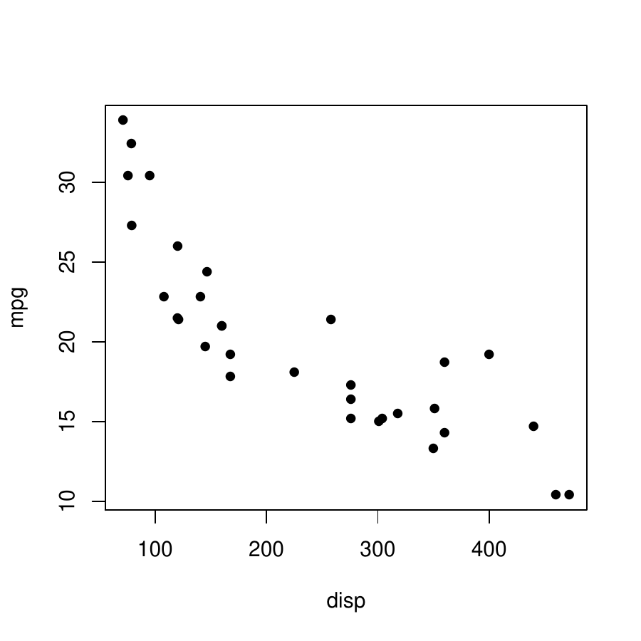
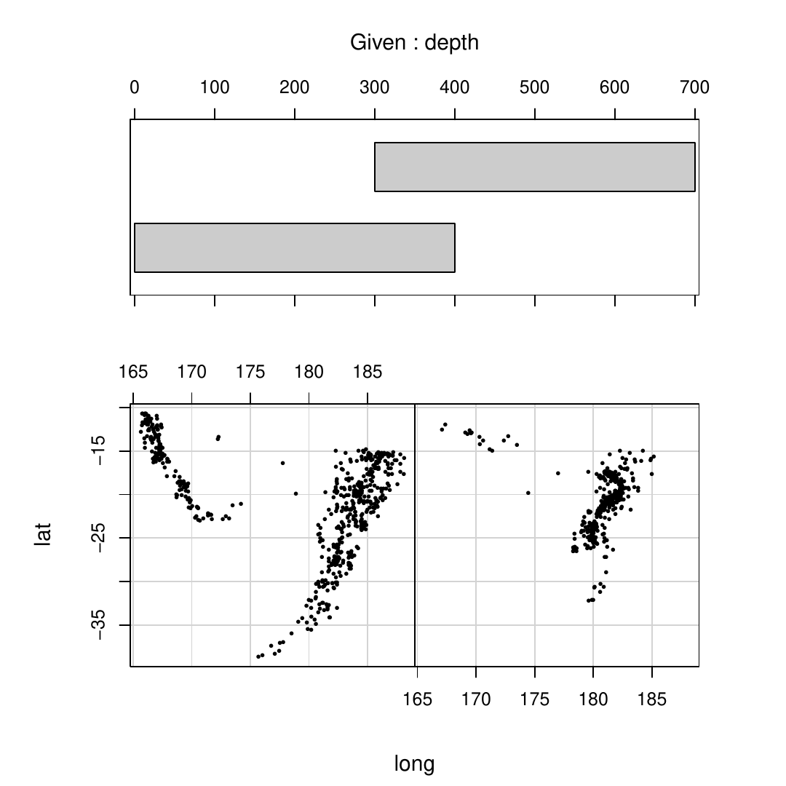
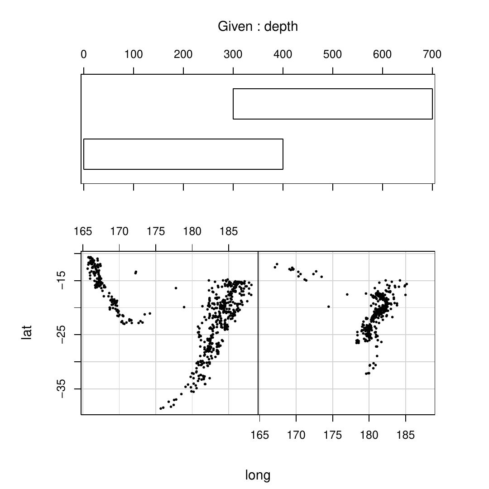
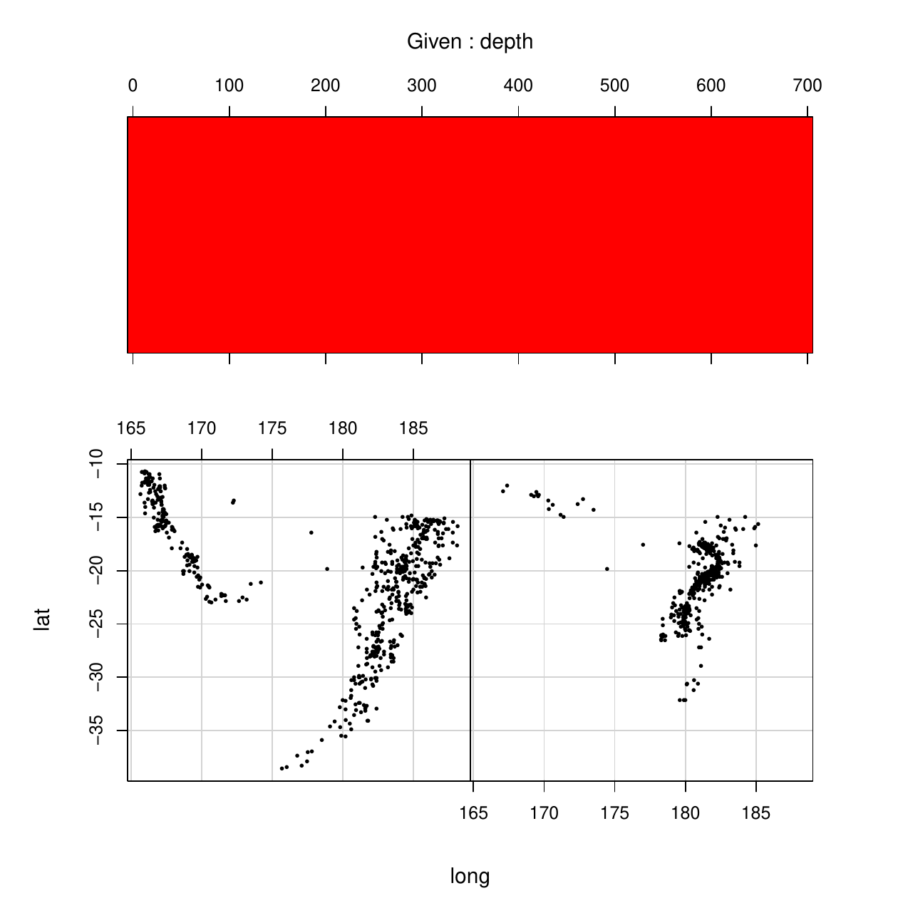
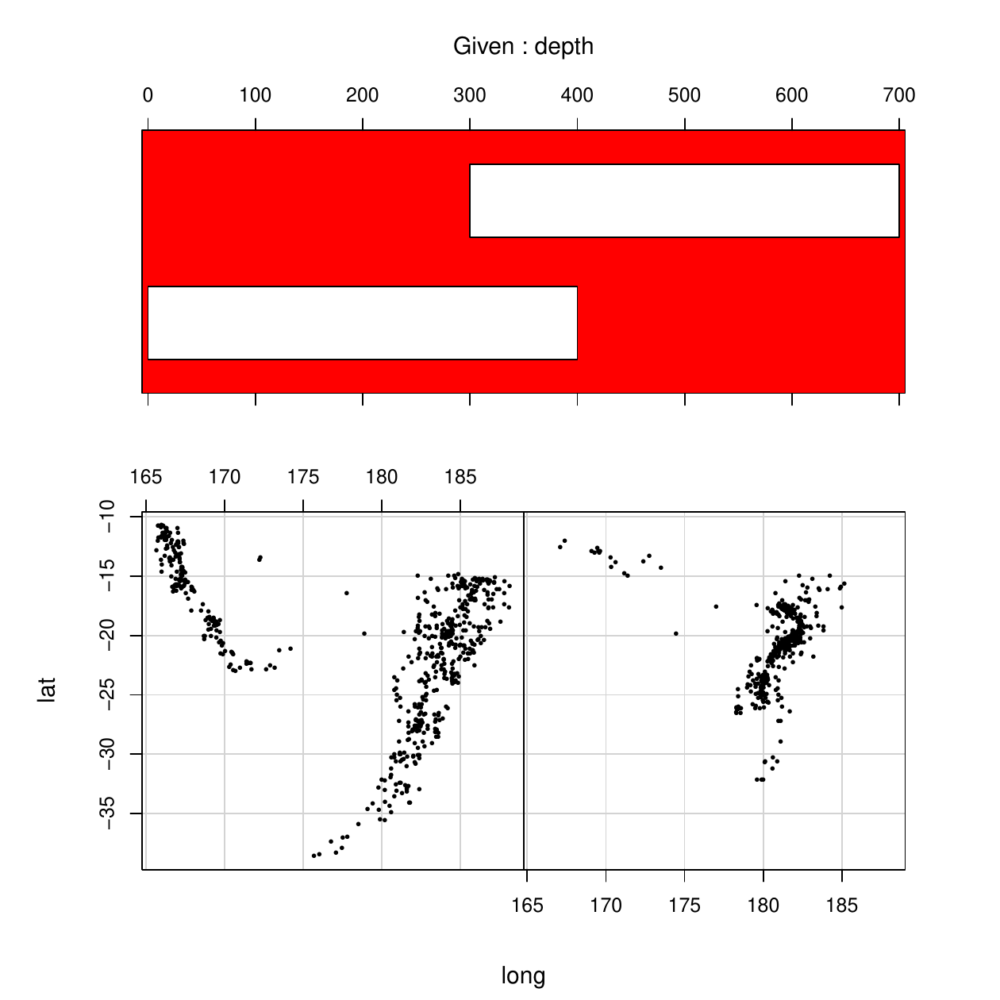

::: article
# Introduction

The core graphics system in R is divided into two main branches, one
based on the *graphics* package and one based on the *grid* package,
with many other packages building on top of one or other of these
graphics systems (see Figure [1](#fig:system-graph)).

The *graphics* package is older and provides an emulation of the
original GRZ graphics system from S [@grz]. The newer *grid* package,
although its performance is actually slower, provides greater
flexibility and additional features compared to the *graphics* package.
In particular, a plot drawn with *grid* can be manipulated and edited in
many more ways than a plot drawn with the *graphics* package.

This article describes a new package, called
[*gridGraphics*](https://CRAN.R-project.org/package=gridGraphics), that
allows a plot drawn with *graphics* to be converted into an identical
plot drawn with *grid*, thereby allowing the plot to be manipulated
using all of the tools available in *grid*.

 package
[@lattice], the [*ggplot2*](https://CRAN.R-project.org/package=ggplot2)
package [@ggplot] and many others are built on top of the *grid*
package; the [*plotrix*](https://CRAN.R-project.org/package=plotrix)
package [@plotrix], the
[*maps*](https://CRAN.R-project.org/package=maps) package [@maps] and
*many* others are built on top of the *graphics*
package.](murrell-system-graph.png){#fig:system-graph width="100%" alt="graphic without alt text"}

# The `grid.echo()` function

The *gridGraphics* package provides a single main function called
`grid.echo()`. By default, this function takes whatever has been drawn
by the *graphics* package on the current graphics device and redraws it
using *grid*. The following code provides a simple demonstration. We
first draw a scatterplot using `plot()` from the *graphics* package,
then we call `grid.echo()` to replicate the plot with *grid*. Figure
[2](#fig:echo) shows that the original plot and the replicated plot are
identical.

``` r
> plot(mpg ~ disp, mtcars, pch = 16)
> library(gridGraphics)
> grid.echo()
```

<figure id="fig:echo">
<p></p>
<figcaption>Figure 2: On the left, a scatterplot drawn with the
<em>graphics</em> package and, on the right, the result of
<code>grid.echo()</code>, which produces the same scatterplot using the
<em>grid</em> package.</figcaption>
</figure>

The following sections will attempt to demonstrate why, although the
plots appear identical to the eye, there are important advantages that
arise from using *grid* to do the drawing.

# Manipulating grobs

One advantage of drawing the plot with *grid* is that there is an
object, a *grid* grob, recorded for each separate component of the plot
that we have drawn. We can see that list of grobs with a call to the
`grid.ls()` function, as shown below. There is a grob called
`graphics-plot-1-points-1` that represents the data symbols in the plot,
there is a grob called `graphics-plot-1-xlab-1` that represents the
x-axis label, and so on.

``` r
> grid.ls()
graphics-plot-1-points-1
graphics-plot-1-bottom-axis-line-1
graphics-plot-1-bottom-axis-ticks-1
graphics-plot-1-bottom-axis-labels-1
graphics-plot-1-left-axis-line-1
graphics-plot-1-left-axis-ticks-1
graphics-plot-1-left-axis-labels-1
graphics-plot-1-box-1
graphics-plot-1-xlab-1
graphics-plot-1-ylab-1
```

The *grid* package provides several functions to manipulate these grobs.
For example, the code below uses the `grid.edit()` function to rotate
the tick labels on the x-axis of the plot to 45 degrees (and turns them
red so that the change is easy to spot; see Figure [3](#fig:editplot)).
This is a simple example of a customisation that is impossible or very
difficult in the *graphics* package, but is quite straightforward once
the plot has been converted to *grid*.

``` r
> grid.edit("graphics-plot-1-bottom-axis-labels-1", rot = 45, 
+           gp = gpar(col = "red"))
```

{#fig:editplot
width="100%" alt="graphic without alt text"}

To provide a more sophisticated example, consider the conditioning plot
produced by the following code with a call to the `coplot()` function
from the *graphics* package (see the left-hand plot in Figure
[4](#fig:coplot)).

``` r
> coplot(lat ~ long | depth, quakes, pch = 16, cex = .5,
+        given.values = rbind(c(0, 400), c(300, 700)))
```

This is an example of a much more complex plot with many different
components. Functions that produce this sort of complex plot can
struggle to provide arguments to fine tune all possible elements of the
plot. For example, suppose that we want to modify the "conditioning
panel" at the top of the plot so that the background is a solid colour
and the bars are filled in white. This specific task is probably not a
common one for most people, but the point of this example is to
represent a class of problems where a small detail within a complex plot
needs to be modified.

The `coplot()` function does have an argument `bar.bg` to control the
fill colour for the bars, as demonstrated in the code below (see the
right-hand plot in Figure [4](#fig:coplot)). However, there is no
argument that allows us to control the background colour for the panel
behind the bars.

``` r
> coplot(lat ~ long | depth, quakes, pch = 16, cex = .5,
+        given.values = rbind(c(0, 400), c(300, 700)),
+        bar.bg = c(num = "white"))
```

<figure id="fig:coplot">
<p></p>
<figcaption>Figure 4: A conditioning plot produced by the
<code>coplot()</code> function from the <em>graphics</em> package. The
right-hand version of the plot demonstrates the use of the
<code>bar.bg</code> argument to customise the fill colour of the bars in
the conditioning panel at the top of the plot.</figcaption>
</figure>

If we replicate this plot using *grid*, we have more tools available to
be able to manipulate the plot. The `grid.echo()` function can replicate
this plot and gives an identical result to that shown in Figure
[4](#fig:coplot).

The call to `grid.echo()` shown below also demonstrates the use of the
`prefix` argument, which can be used to control the naming of the grobs
that `grid.echo()` draws. The grobs created by this call to
`grid.echo()` all have names that start with `"cp"` rather than the
default `"graphics"` prefix.

``` r
> grid.echo(prefix = "cp")
```

Once this conversion has taken place, we now have *grid* grobs that
represent all components of the plot. In particular, there is a grob
called `"cp-plot-4-box-1"` that draws the border around the conditioning
panel. We can edit that grob to give it a fill colour (see the left-hand
plot in Figure [5](#fig:coplot-edit)).

``` r
> grid.edit("cp-plot-4-box-1", gp = gpar(fill = "red"))
```

This provides another demonstration that converting a plot to *grid*
provides access to all of the components of the plot, which allows fine
control over details of the plot that cannot be controlled via the
arguments to the original high-level function that created the plot.

In this particular example, we have also created a new problem, because
the border on the conditioning plot is drawn *after* the bars, so the
bars are now obscured. Fortunately, we can fix this as well with further
tools that *grid* provides for manipulating grobs.

In the following code, we call the `grid.grab()` function to create a
single grob (a gTree) that contains all of the other grobs on the page.
We then call the `grid.reorder()` function to change the order of the
grobs within the gTree. The code specifies that the border grob will be
drawn first (behind all other components in the plot). Finally, we
redraw the reordered plot with the `grid.draw()` function to get the
final result that we were after (see the right-hand plot in Figure
[5](#fig:coplot-edit)).

``` r
> gt <- grid.grab()
> gt <- reorderGrob(gt, "cp-plot-4-box-1")
> grid.newpage()
> grid.draw(gt)
```

<figure id="fig:coplot-edit">
<p></p>
<figcaption>Figure 5: On the left, the plot from Figure after conversion
with <code>grid.echo()</code>, followed by editing to fill the rectangle
that draws a border around the top conditioning panel (in red so that
the change is visible). On the right, the edited plot has been reordered
so that the border around the conditioning panel is drawn first (behind
everything else).</figcaption>
</figure>

This access to individual components of a plot and the ability to
manipulate those components is one benefit of converting a *graphics*
plot to *grid*.

# Making use of viewports

Another advantage of using *grid* is that we can make use of viewports.
Viewports are similar to the different plotting regions that the
*graphics* package uses for drawing (see Figure [6](#fig:regions)), but
in a *grid* plot there can be an unlimited number of viewports and all
viewports are accessible at any time. In the *graphics* package there is
only the current plot region, figure margins, and outer margins to work
with.

{#fig:regions width="100%" alt="graphic without alt text"}

Figure [7](#fig:viewports) shows a diagram of the hierarchy of viewports
that `grid.echo()` created when we replicated the simple scatterplot in
Figure [2](#fig:echo). This shows that *gridGraphics* produces quite a
lot of viewports (even for a simple plot), but there is a coherent
structure to the viewports, so the complexity can be navigated without
too much difficulty.

In general, the names of the viewports reflect the plot regions that
they mimic in the original plot. At the top of the hierarchy of
viewports is a viewport called `ROOT`, which represents the entire page
(this viewport is always present). Below that is a viewport called
`graphics-root` and that represents the area of the page that
`grid.echo()` has drawn into (by default, also the whole page). The next
viewport down is called `graphics-inner` and this represents the region
that is the whole page minus the outer margins. Below that are two
viewports, `graphics-figure-1` and `graphics-figure-1-clip`, both of
which correspond to the figure region (the grey area in Figure
[6](#fig:regions)). There are two viewports because one has clipping
turned on, so that drawing within that region cannot extend beyond the
boundaries of the region, and one has clipping turned off. Below each of
the figure region viewports are one or more viewports representing the
plot region, called either `graphics-plot-1` or `graphics-plot-1-clip`.
Again, the difference between these two plot viewports is whether
clipping is on or off. By having the `graphics-plot-1` viewport beneath
both figure viewports, we can represent all possible values of the
`par("xpd")` settings: clipping to the figure region, or clipping to the
plot region, or no clipping at all. The bottom layer of viewports
represent the plot region again, but this time with a viewport that has
scales to represent the plot axes. The reason for this additional layer
is so that we can reproduce plots that make use of more than one set of
axes (e.g., two different y-axis scales).

.](murrell-vptree-3.png){#fig:viewports width="100%" alt="graphic without alt text"}

The upside to having so many viewports is that the *grid* package
provides functions to navigate between viewports. So we can have a lot
of viewports on the page at once, but switch between them if we want to
add drawing within different viewports. As an example, the following
code uses the `downViewport()` function to revisit the plot region
viewport that was created by `grid.echo()` and draws a red rectangle
around the border (see Figure [8](#fig:box)). The `upViewport()`
function is then used to take us back to the whole page (the `ROOT`
viewport).

``` r
> downViewport("graphics-plot-1")
> grid.rect(gp = gpar(col = "red", lwd = 3))
> upViewport(0)
```

 with a rectangle
added by revisiting the viewport that corresponds to the plot
region.](murrell-box-2.png){#fig:box width="100%" alt="graphic without alt text"}

Once again, a more sophisticated demonstration can be provided if we
consider the more complex conditioning plot from Figure
[4](#fig:coplot). Another limitation of the `coplot()` function, because
it is based on the *graphics* package, is that there is no way to add
further drawing to the conditioning panel at the top of the plot.

This plot has several different panels so the replication created by
`grid.echo()` generates many different viewports, including viewports
used to draw the conditioning panel at the top of the plot. With *grid*,
all of these viewports can be revisited after the plot has been drawn.
In the following code, we revisit the viewport used to draw the
conditioning panel and draw some grid lines in it.

Those new lines will be drawn on top of everything else, so additional
manipulations, similar to the reordering performed for Figure
[5](#fig:coplot-edit), can also be carried out to push the segments
behind everything else (code not shown). The result is shown in Figure
[9](#fig:coplot-grid).

``` r
> downViewport("cp-window-4-1")
> v <- unit(seq(0, 700, 100), "native")
> grid.segments(v, 0, v, 1, gp = gpar(col = "red"), name = "grid")
> upViewport(0)
```

 with a
reference grid added (in red so that the change is visible) to the
conditioning panel at the top of the
plot.](murrell-coplot-vp-reorder-4.png){#fig:coplot-grid width="100%" alt="graphic without alt text"}

Another limitation of the original `coplot()` function is that it
insists on occupying the entire page. Another advantage of working with
*grid* grobs and viewports is that they can be nested within each other
to any level. This means that once the output from `coplot()` has been
replicated as *grid* output, it can be drawn within a *grid* viewport
and combined on a page with other plots.

The following code creates a *grid* viewport occupying the bottom 70% of
the page and then replicates the conditioning plot only using that part
of the page. This code demonstrates another way to call the
`grid.echo()` function. Rather than calling the *graphics* function
`coplot()` to draw a plot and then calling `grid.echo()` to replicate
it, we can define a function (with no arguments) that draws the plot and
then provide that function as the first argument to `grid.echo()`. This
way the plot is only drawn once, using *grid*. We also specify
`newpage = FALSE` in the call to `grid.echo()` so that it just draws in
the current viewport rather than starting a new page.

``` r
> cpfun <- function() {
+     coplot(lat ~ long | depth, quakes, pch = 16, cex = .5,
+            given.values = rbind(c(0, 400), c(300, 700)))
+ }
> grid.newpage()
> pushViewport(viewport(y = 0, height = .7, just = "bottom"))
> grid.echo(cpfun, newpage = FALSE, prefix = "cp")
> upViewport()
```

The next piece of code draws a *ggplot2* histogram in the top third of
the page, so not only do we have a conditioning plot combined with
another plot on the same page (something that was not at all possible
with the original *graphics*-based conditioning plot), but we have a
mixture of *graphics*-based and *grid*-based output on the same page
(see Figure [10](#fig:coplot-combined)).

``` r
> library(ggplot2)
> pushViewport(viewport(y = 1, height = .33, just = "top"))
> gg <- ggplot(quakes) + geom_bar(aes(x = depth)) + 
+       theme(axis.title.x = element_blank())
> print(gg, newpage = FALSE)
> upViewport()
```

 combined
with a *ggplot2* histogram on the same page. A dashed red box has been
drawn around the region that is occupied by the conditioning plot, to
emphasise the fact that the conditioning plot does not occupy the entire
page.](murrell-coplot-combined.png){#fig:coplot-combined width="100%" alt="graphic without alt text"}

This sort of result---*grid*-based plots combined with *graphics*-based
plots on the same page---can also be achieved using the
[*gridBase*](https://CRAN.R-project.org/package=gridBase) package
[@gridBase]. However, *gridBase* only allows plots from the two packages
to coexist side-by-side on the same page; it does not provide any of the
benefits of *grid* for *graphics*-based plots.

# Exporting to SVG

Another benefit that we get from converting a *graphics* plot to *grid*
is that the converted plot can then be exported to SVG via the
[*gridSVG*](https://CRAN.R-project.org/package=gridSVG) package
[@murrell-potter:2014]. This means that we gain the potential to add
hyperlinks to the plot, animate components of the plot, add advanced SVG
features to the plot, and add interactivity (possibly via JavaScript
code).

As a simple example, the following code draws the scatterplot from
Figure [2](#fig:echo) with `plot()` from the *graphics* package,
converts the plot to *grid* with `grid.echo()`, and then adds tooltips
to each data symbol and exports the plot to SVG with the functions
`grid.garnish()` and `grid.export()` from the *gridSVG* package. The SVG
plot, as viewed in a browser, is shown in Figure [11](#fig:echo-svg).

``` r
> library(gridSVG)
> plot(mpg ~ disp, mtcars, pch = 16)
> grid.echo()
> grid.garnish("graphics-plot-1-points-1", group = FALSE, title = rownames(mtcars))
> grid.export("murrell-echo.svg")
```

, after
conversion to *grid* using `grid.echo()`, exported to SVG, with tooltips
added, using functions from the *gridSVG* package. The tooltips in this
example may only work with
Firefox.](murrell-echo-cap-svg.png){#fig:echo-svg width="100%" alt="graphic without alt text"}

A *graphics* plot that is converted by *gridGraphics* and then exported
by *gridSVG* also has potential benefits for accessibility because, for
example, text labels are exported as `<text>` elements, which can be
recognised by screen reading software. This is not the case with the
standard `svg()` graphics device, which exports text as `<path>`
elements.

# Naming schemes

Something that has been ignored in the examples so far is the fact that
all manipulations of *grid* grobs, as well as navigation between *grid*
viewports, rely on being able to identify, by name, which grob we want
to manipulate or which viewport we want to visit. This section describes
the naming scheme that the *gridGraphics* package uses to assign names
to the grobs and viewports that it creates.

The names of grobs have the following basic pattern:

``` r
<prefix>-plot-<i>-<label>-<j>
```

where `<prefix>` is `graphics` by default, but can be specified in the
call to `grid.echo()`, `<i>` reflects which plot the grob was drawn in
(because there can be more than one plot region on the page), `<label>`
reflects what sort of shape was drawn, and `<j>` is a numeric index that
automatically increments when more than one of the same shape is drawn
within the same plot. The full set of possible shape labels is given in
Table [1](#table:grobs).

::: {#table:grobs}
  ----------------------------------------------------------------------------------------------------------------------------------------------------
  Function          Description                                                                                `<label>`
  ----------------- ------------------------------------------------------------------------------------------ ---------------------------------------
  `plotXY()`        Points, lines, etc. through data                                                           `points`

                                                                                                               `lines`

                                                                                                               `step`

                                                                                                               `Step`

                                                                                                               `spike`

                                                                                                               `brokenline`

  `text()`          Text in plot region                                                                        `text`

  `title()`         Plot title, sub-title, and axis labels                                                     `main`

                                                                                                               `sub`

                                                                                                               `xlab`

                                                                                                               `ylab`

  `axis()`          Axes, including tick marks and labels                                                      `bottom-axis-line`

                                                                                                               `bottom-axis-ticks`

                                                                                                               `bottom-axis-labels`

                                                                                                               (ditto `left-`, `top-`, and `right-`)

  `mtext()`         Text in margins                                                                            `mtext-bottom`

                                                                                                               `mtext-left`

                                                                                                               `mtext-top`

                                                                                                               `mtext-right`

                                                                                                               `mtext-<side>-outer`

  `box()`           Border rectangles for plot regions                                                         `box`

                                                                                                               `box-figure`

                                                                                                               `box-inner`

                                                                                                               `box-outer`

  `segments()`      Straight line segments                                                                     `segments`

  `arrows()`        Segments with arrow heads                                                                  `arrows`

  `abline()`        A straight line parameterised by slope and intercept, or horizontal or vertical constant   `abline-ab`

                                                                                                               `abline-h`

                                                                                                               `abline-v`

  `rect()`          Rectangles                                                                                 `rect`

  `polygon()`       Polygons                                                                                   `polygon`

  `path()`          General path                                                                               `path`

  `rasterImage()`   Raster image                                                                               `raster`

  `xspline()`       X-Splines                                                                                  `xspline`

  `clip()`          Clipping region rectangle                                                                  `clip`

  `contour()`       Contour lines                                                                              `contour-<i>`

  `image()`         Filled rectangles                                                                          `image-rect`

  `symbols()`       High-dimensional data symbols                                                              `symbols-circle`

                                                                                                               `symbols-square`

                                                                                                               `symbols-rect`

                                                                                                               `symbols-star`

                                                                                                               `symbols-thermo-box`

                                                                                                               `symbols-thermo-fill`

                                                                                                               `symbols-thermo-whisker-right`

                                                                                                               `symbols-thermo-whisker-left`

                                                                                                               `symbols-boxplot-box`

                                                                                                               `symbols-boxplot-lower-whisker`

                                                                                                               `symbols-boxplot-upper-whisker`

                                                                                                               `symbols-boxplot-median`
  ----------------------------------------------------------------------------------------------------------------------------------------------------

  : Table 1: The labels used for different shapes (grobs) that can be
  created by `grid.echo()`. The "Function" column gives the name of the
  *graphics* function that produces the original shapes, the
  "Description" column describes what sort of shape is drawn, and the
  "\<label\>" column gives the names used for the *grid* grobs that the
  shapes are converted into.
:::

The names of viewports have one of the following basic patterns:

``` r
<prefix>-root
<prefix>-inner<a> 
<prefix>-figure-<i><a> 
<prefix>-plot-<i><a> 
<prefix>-window-<i><a>-<j><b> 
```

where `<prefix>` is the same as for grob names. There is only ever one
`root` viewport, which is parent to usually one `inner` viewport. Both
`plot` and `window` viewports occupy the same region, but `window`
viewports represent the axis scales. The `<i>` part of the name is a
numeric index that is automatically incremented, each time that
`plot.new()` is called. The `<j>` part is similar, but increments each
time that `plot.window()` is called. The `<a>` part of the name only
occurs when `par()` is used to modify graphical parameters that affect
the location of plot regions, for example, to modify the plot region via
`par("pin")`. The `<b>` part is similar, but occurs when `par("usr")` is
used to modify the axis scales.

For complex plots, like the conditioning plot in Figure
[4](#fig:coplot), there can be a large number of grobs and viewports. To
help with exploring the potentially large number of grobs and viewports,
the *grid* package provides functions `grid.ls()`, `showGrob()`, and
`showViewport()`, and the *gridDebug* package
[@RJournal:2012-2:Murrell+Ly] provides further tools.

# Testing

The *gridGraphics* package is known to produce identical results for all
examples in the *graphics* package help pages, plus the results of
`demo("graphics")` (subject to the caveats described in the next
section). However, it is still possible that there are some combinations
of arguments in the low-level *graphics* functions that will not be
emulated correctly by `grid.echo()`.

To test whether a *graphics*-based plot is reproduced correctly by
`grid.echo()`, the *gridGraphics* package provides a `plotdiff()`
function. This takes an expression as its first argument, which is
assumed to be one or more calls to *graphics* functions. The
`plotdiff()` function creates PDF and PNG files from evaluating the
expression and from converting the result with `grid.echo()`, plus a PNG
file showing differences between the *graphics* original and the *grid*
copy, if there are any (a total of either four or five files).[^1] A
`plotdiffResult()` function is also provided to summarise the results of
multiple calls to `plotdiff()`.

# Limitations

There are a few *graphics* functions that `grid.echo()` cannot currently
replicate: `persp()` for drawing 3-dimensional surfaces,
`filled.contour()` for drawing a filled contour plot, and
`recordGraphics()`, which allows delayed evaluation of drawing code.

For some other functions, there are a few details that do not reproduce
exactly. For example, `grid.echo()` cannot reproduce text labels on
contours drawn by `contour()` and `grid.echo()` will sometimes eliminate
fewer axis tick labels than the `axis()` function.

More generally, `grid.echo()` cannot cope with code that opens or closes
graphics devices or changes the current graphics device, it can only
replicate a single page of plots, and if there is already a mixture of
*grid* and *graphics* plots on a page, `grid.echo()` will only replicate
the *graphics* plots.

An important situation where the above limitations will be encountered
is within the RStudio IDE [@RStudio]. Plots drawn in the RStudio "Plots"
pane will not reproduce well with `grid.echo()`. However, using a
standard R graphics device with RStudio should still work.

Finally, the output from `grid.echo()` is only valid at the size it is
first drawn. Subsequently resizing the graphics window or copying to
another graphics device is likely to produce a distorted result.

# Conclusion

The *gridGraphics* package provides a bridge between the *graphics* and
*grid* packages (see Figure [12](#fig:gridGraphics)). The `grid.echo()`
function converts a plot drawn using the *graphics* package into exactly
the same result drawn using *grid*. In effect, the *gridGraphics*
package provides an automated way to create a *grid*-based version of
almost any plotting function that is based on the *graphics* package.

The benefit of converting to *grid* is that *grid* provides tools for
making customisations and additions to a plot that are not possible with
the *graphics* package:

-   To allow customisation of fine details that are not accessible via
    the *graphics* package\
    (e.g., Figures [3](#fig:editplot) and [5](#fig:coplot-edit)).

-   To add extra drawing to a region of the plot that is inaccessible
    via the *graphics* package\
    (e.g., Figure [9](#fig:coplot-grid)).

-   To combine *graphics*-based plots with *grid*-based plots\
    (e.g., Figure [10](#fig:coplot-combined)).

-   To export a *graphics*-based plot to SVG with the *gridSVG* package\
    (e.g., Figure [11](#fig:echo-svg)).

{#fig:gridGraphics width="100%" alt="graphic without alt text"}

# Availability

The *gridGraphics* package is available from CRAN, with ongoing
development occurring on github.[^2] Supporting material for this
article, including a live version of Figure [11](#fig:echo-svg), is
available from the following web site:

<https://www.stat.auckland.ac.nz/~paul/Reports/gridGraphics/>

# Acknowledgements

Thanks to the anonymous reviewers who made several useful suggestions
that improved this manuscript.

\
:::

[^1]: On R versions prior to 3.2.0, and on systems where ImageMagick
    [@IM] is not available, only the PDF files are created; there is no
    conversion or comparison. Prior to R 3.2.0, there will be some
    (typically very small) differences between some plots because of a
    bug in *grid*.

[^2]: <https://github.com/pmur002/gridgraphics>
