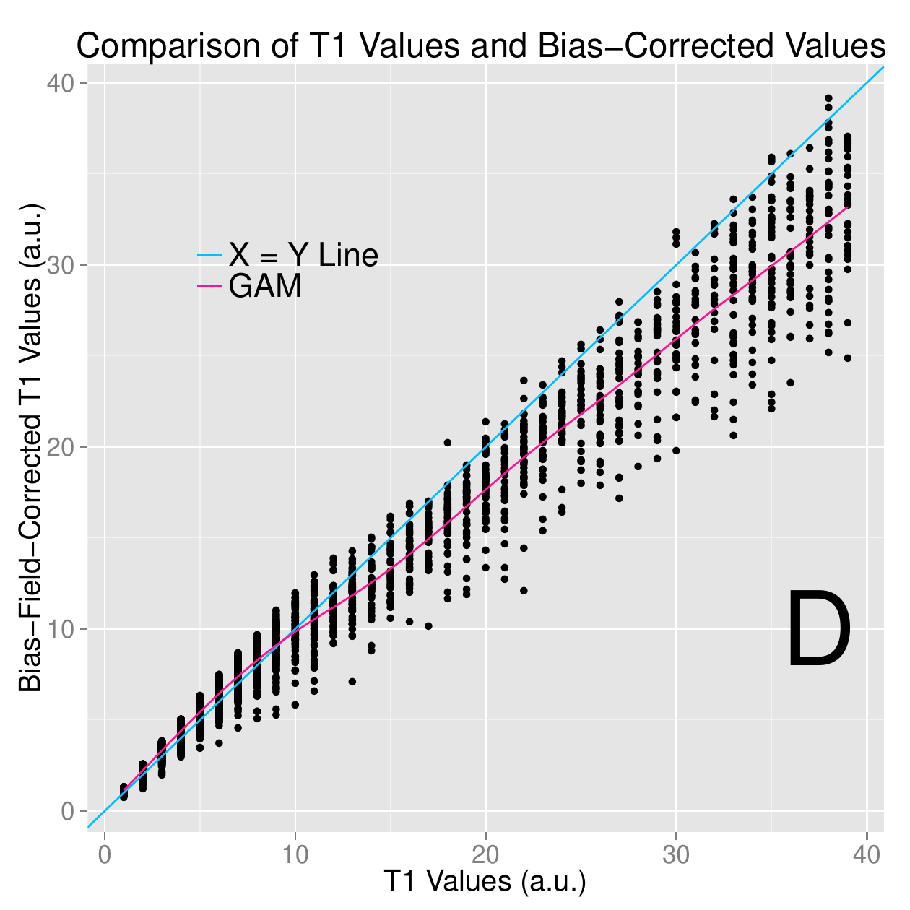

::: article
  ----------------------------------------------------------------------------------------------------------------
   Glossary of acronyms                                                
  ---------------------- ------------------------------------- ------- -------------------------------------------
           MRI           Magnetic Resonance Imaging/Image        FSL   FMRIB Software Library

            PD           Proton Density                         FAST   FMRIB's Automated Segmentation Tool

          FLAIR          Fluid-Attenuated Inversion Recovery    FLIRT  FMRIB's Linear Image Registration Tool

            MS           Multiple Sclerosis                      BET   Brain Extraction Tool

          FMRIB          Functional MRI of the Brain Group      FNIRT  FMRIB's Nonlinear Image Registration Tool

           MNI           Montreal Neurological Institute               
  ----------------------------------------------------------------------------------------------------------------

  : Table 1: Glossary of acronyms

# Introduction {#sec:intro}

FSL (FMRIB Software Library) is a commonly-used software for processing
and analyzing neuroimaging data [@jenkinson_fsl_2012]. This software
provides open-source, command-line tools and a graphical user interface
(GUI) for image processing tasks such as image smoothing, brain
extraction [@smith_fast_2002], bias-field correction, segmentation
[@zhang_segmentation_2001], and registration
[@jenkinson_global_2001; @jenkinson_improved_2002]. Many of these
functions are used extensively in medical imaging pipelines. According
to a recent survey paper by @carp_secret_2012, 13.9% of published
neuroimaging studies used FSL.

There exist a number of R packages for reading and manipulating image
data, including
[*AnalyzeFMRI*](https://CRAN.R-project.org/package=AnalyzeFMRI)
[@bordier_temporal_2011],
[*RNiftyReg*](https://CRAN.R-project.org/package=RNiftyReg)
[@modat_rniftyreg:_2013], and
[*fmri*](https://CRAN.R-project.org/package=fmri)
[@tabelow_statistical_2011] (see the Medical Imaging CRAN task view
<http://CRAN.R-project.org/view=MedicalImaging> for more information).
Although these packages are useful for performing image analysis, much
of the fundamental functionality that FSL and other imaging software
provide is not currently implemented in R. In particular, this includes
algorithms for performing slice-time correction, motion correction,
brain extraction, tissue-class segmentation, bias-field correction,
co-registration, and normalization. This lack of functionality is
currently hindering R users from performing complete analysis of image
data within R. Instead of re-implementing FSL functions in R, we propose
a user-friendly interface between R and FSL that preserves all the
functionality of FSL, while retaining the advantages of using R. This
will allow R users to implement complete imaging pipelines without
necessarily learning software-specific syntax.

The [*fslr*](https://CRAN.R-project.org/package=fslr) package relies
heavily on the
[*oro.nifti*](https://CRAN.R-project.org/package=oro.nifti)
[@whitcher_working_2011] package implementation of images (referred to
as '`nifti`' objects) that are in the Neuroimaging Informatics
Technology Initiative (NIfTI) format, as well as other common image
formats such as ANALYZE. *oro.nifti* also provides useful functions for
plotting and manipulating images. *fslr* expands on the *oro.nifti*
package by providing additional functions for manipulation of '`nifti`'
objects.

# *fslr* workflow

The general workflow for most *fslr* functions that interface with FSL
is as follows:

1.  Filename or '`nifti`' object is passed to *fslr* function.

2.  FSL command is created within *fslr* function and executed using the
    `system` command.

3.  Output is written to disk and/or read into R and returned from the
    function.

From the user's perspective, the input/output process is all within R.
The advantage of this approach is that the user can read in an image, do
manipulations of the '`nifti`' object using standard syntax for arrays,
and pass this object into the *fslr* function without using FSL-specific
syntax written in a shell language. Also, one can perform image
operations using FSL, perform operations on the '`nifti`' object in R
that would be more difficult using FSL, and then perform additional
operations using FSL by passing that object to another *fslr* command.
Thus, users can create complete pipelines for the analysis of imaging
data by accessing FSL through *fslr*.

## *fslr* setup

To use *fslr*, a working installation of FSL is required. The following
code was run using FSL version 5.0.0. *fslr* must also have the path of
FSL specified. If using R from a shell environment, and the `FSLDIR`
environment variable is set (which can be done when installing FSL),
*fslr* will use this as the path to FSL. If using R through a graphical
user interface (GUI) such as RStudio (RStudio, Boston, MA),
environmental variables and paths are not explicitly exported.
Therefore, `FSLDIR` is not set, and the path to FSL can be specified
using `options(fsl.path = "/path/to/fsl")`.

*fslr* also requires an output type for the format of images returned
from FSL. Some *fslr* functions produce intermediate files that the user
may want removed after the command is executed. When the filename
argument is passed to a *fslr* command, the extension of the file does
not need to be specified, but simply the prefix. When the command is
executed, the FSL command appends an extension, and to remove this file,
using the R command `file.remove`, the extension for the file is
required. If working in a shell environment, *fslr* will use the
environment variable for output type: `FSLOUTPUTTYPE`. If working in a
GUI, the default is given by `NIFTI_GZ`, which returns compressed NIfTI
images, ending in ".nii.gz". This can be changed by setting the
`fsl.outputtype` option. See
<http://fsl.fmrib.ox.ac.uk/fsl/fsl-4.1.9/fsl/formats.html> for a
description of FSL output types.

The R code below is all that is needed to load the *fslr* package, set
the path to FSL, and specify the output type for files, respectively.

``` r
library(fslr)
options(fsl.path = "/usr/local/fsl")
options(fsl.outputtype = "NIFTI_GZ")
```

## Image preprocessing with *fslr*

We present a complete analysis of structural magnetic resonance imaging
(MRI) data performed using *fslr* and R. Images were obtained from a
patient with multiple sclerosis (MS) at 2 different visits
[@sweeney_automatic_2013], located at
[bit.ly/FSL_Data](bit.ly/FSL_Data){.uri}. At each visit, the image
modalities obtained were T1-weighted (T1), T2-weighted (T2),
fluid-attenuated inversion recovery (FLAIR), and proton density (PD). In
this example we will perform a MRI bias-field correction using FAST
(FMRIB's Automated Segmentation Tool; @zhang_segmentation_2001),
co-register scans within visits to the T1 image of that visit, and
register T1 images between visits. Once these operations have been
performed, one can take within-modality difference images to see the
changes between visits. We will also register all images to a common
stereotaxic template, as this is common in population-based analyses.

## Bias-field correction

MRI images typically exhibit good contrast between soft tissue classes,
but intensity inhomogeneities in the radio frequency (RF) field can
cause differences in the ranges of tissue types at different spatial
locations. These inhomogeneities can cause problems with algorithms
based on histograms, quantiles, or raw intensities
[@zhang_segmentation_2001]. Therefore, correction for image
inhomogeneities is a crucial step in many analyses. FSL implements the
bias-field correction from @guillemaud_estimating_1997 in its FAST
segmentation pipeline [@zhang_segmentation_2001].

<figure id="fig:bias_correct">
<p></p>
<p></p>
<figcaption>Figure 1: <span><strong>Results of inhomogeneity
correction.</strong></span> We present the original T1 image A,
bias-corrected T1 image B, and the scatterplot of the sampled values
comparing the values from the T1 image to the bias-corrected values Fig
C. We see in Panel C for values in the low range of the data (<span
class="math inline"> &lt; 10</span>), the T1 values and bias-corrected
T1 values, on average, fall along the diagonal (blue line), which is
further illustrated in Panel Fig D, which plots values <span
class="math inline"> &lt; 40</span>. Values <span
class="math inline"> &gt; 10</span> for the original T1 image are lower
than the bias-corrected T1 values shown by a generalized additive model
(GAM) smoother (pink line, Panel C). </figcaption>
</figure>

The `fsl_biascorrect` command from *fslr* will create the corrected
images. We pass in the filename in the `file` argument, any additional
options for FSL in the `opts` argument, such as `-v` for **v**erbose
diagnostic outputs, and the **out**put **file**name in the `outfile`
argument, which is our inhomogeneity-corrected image.

``` r
fsl_biascorrect(file = "01-Baseline_T1.nii.gz", 
                outfile = "01-Baseline_T1_FSL_BiasCorrect",
                opts = "-v")
```

We can observe the difference in voxel values from the baseline T1 image
compared to the bias-corrected version in Figure [1](#fig:bias_correct).
In Panel [1](#fig:bias_correct)A we display the T1 image, and in
Panel [1](#fig:bias_correct)B we display the bias-corrected T1 image.
The T1 image is brighter in the middle of the image, while the
bias-corrected image is more uniform in white matter (brighter regions).
As this difference may be hard to distinguish visually, we present the
scatterplot of these images in Figure [1](#fig:bias_correct)C, using the
[*ggplot2*](https://CRAN.R-project.org/package=ggplot2) package
[@wickham_ggplot2:_2009]. Note, both scales are in arbitrary units
(a.u.).

The blue line in Figure [1](#fig:bias_correct)C represents the
45$^{\circ}$ diagonal line, where the original and bias-corrected image
intensities are equal ($X = Y$), and the pink line represents a
generalized additive model (GAM) [@hastie_generalized_1990] scatterplot
smoother estimate obtained using the
[*mgcv*](https://CRAN.R-project.org/package=mgcv) package
[@wood_fast_2011]. We see that for values in the low range of the data
($< 10$), the T1 values and bias-corrected T1 values, on average, fall
along the diagonal, but in the higher range the bias-corrected values
are lower.

# Within-visit co-registration {#sec:within-visit-co}

All subsequent steps will be performed on the bias-corrected images. We
will first co-register the images within each separate visit to the T1
image from that visit. This operation overlays the images on one another
and allows us to investigate joint distributions of voxel intensities
from different image modalities. This is performed using FMRIB's Linear
Image Registration Tool (FLIRT; @jenkinson_global_2001
[@jenkinson_improved_2002]). As the images are from the same individual,
we may assume that the overall shape of the brain has not changed, but
each scan may have undergone a translation and/or rotation in space.
Therefore, we will use a rigid-body transformation, with $6$ degrees of
freedom (dof).

The *fslr* command `flirt` calls the FSL command `flirt`, taking the
input image (`infile`) and the reference image that serves as a template
(`reffile`). Any additional options for FLIRT can be passed using the
`opts` argument. We will use the defaults (i.e. trilinear interpolation)
and the `-v` option for diagnostic messages to be printed. Since we are
doing a rigid-body transformation, we set the degrees of freedom (`dof`)
to 6. Here we present the code for registering the baseline T2 image to
the baseline T1 image; we will subsequently repeat this process for the
baseline FLAIR and PD images and for the follow-up scans.

``` r
flirt(reffile = "01-Baseline_T1_FSL_BiasCorrect",  
      infile = "01-Baseline_T2_FSL_BiasCorrect", 
      omat = "01-Baseline_T2_FSL_BiasCorrect_rigid_to_T1.mat", 
      dof = 6, 
      outfile = "01-Baseline_T2_FSL_BiasCorrect_rigid_to_T1", 
      opts = "-v")
```

The resulting image transformation is stored using the file name passed
to the `omat` (**o**utput **mat**rix) argument. This matrix can be used
to transform other images, that were in the same space as the input
image, to the reference image space. The *fslr* package will currently
only return '`nifti`' objects, and not a list of objects, such as the
output image, transformation matrix, etc. Thus, any transformation files
that are needed after the command is executed must be specified.

After co-registration, one could compare images of different modalities
at the same voxels, such as T1 versus FLAIR images, which is presented
in Figure [2](#fig:coreg). The images are presented at the same cross
section for the baseline T1 (Panel [2](#fig:coreg)(Left)) and FLAIR
(Panel [2](#fig:coreg)(Right)) images. The same brain areas are
presented in each modality, indicating adequate registration.

In the previous example, we presented a rigid-body transformation, using
the default parameters. `flirt` has options for different cost functions
to optimize over, interpolation operators to estimate voxel intensity,
and additional degrees of freedom for performing affine transformations.
These options can be passed to the FSL `flirt` command using the `opts`
argument in the *fslr* `flirt` function.

Note that each *fslr* function has a corresponding help function, which
is the *fslr* command appended with `.help()`, which prints out the FSL
help page for that function. For example, users can see which options
can be changed in the FSL `flirt` command by executing the
`flirt.help()` function. Additional non-linear registration techniques
are presented in Section "[6](#sec:registr-mni-templ)".

<figure id="fig:coreg">
<p></p>
<figcaption>Figure 2: <span><strong>Results of within-visit
co-registration.</strong></span> We present the bias-corrected T1
image (Left) and the co-registered bias-corrected FLAIR image (Right).
</figcaption>
</figure>

# Between-visit co-registration

Though across-modality comparisons can be achieved by performing
within-visit co-registration, across-visit registration is required for
assessing within-modality differences between longitudinal scans. To
compute difference images, we co-register follow-up images to the
baseline images within each modality. Similar to the within-visit
co-registration, we use a rigid-body transformation. We will register
the T1 images from baseline and follow-up, and apply this transformation
to the co-registered-to-T1 images from above (see Figure [3](#fig:reg)
for illustration).

{#fig:reg width="90.0%"
alt="graphic without alt text"}

Though this registration involves two interpolations of the data and may
not be optimal for within-modality comparisons, we have already obtained
the co-registered-to-T1 images in Section "[3](#sec:within-visit-co)"
and must perform only one additional registration. This operation also
demonstrates how to apply transformation matrices in *fslr*. Here we
register the follow-up T1 image to the baseline T1 image, again using a
rigid-body transformation (6 dof):

``` r
flirt(reffile = "01-Baseline_T1_FSL_BiasCorrect", 
      infile = "01-Followup_T1_FSL_BiasCorrect", 
      omat = "01-Followup_T1_FSL_BiasCorrect_rigid_to_BaseT1.mat", 
      dof = 6,
      outfile = "01-Followup_T1_FSL_BiasCorrect_rigid_to_BaseT1", 
      opts = "-v")
```

Now, both T1 images are aligned in the space of the baseline T1 image.
We present the results in Figure [4](#fig:flirt): the bias-corrected
baseline T1 image in Panel [4](#fig:flirt)(left) and the co-registered
bias-corrected follow-up T1 in Panel [4](#fig:flirt)(Right). The images
displayed at the same cross section correspond to the same brain area,
indicating a good registration.

<figure id="fig:flirt">
<p></p>
<figcaption>Figure 4: <span><strong>Results from FLIRT.</strong></span>
The bias-corrected baseline T1 is presented in (Left) and the registered
bias-corrected follow-up T1 is presented in (Right), each displayed at
the same intersection. We observe that the observed images correspond to
the same brain area, indicating a good registration. </figcaption>
</figure>

Using the `flirt_apply` function from *fslr*, we can apply the
transformation matrix to the T2, PD, and FLAIR images from the follow-up
visit, previously co-registered to the T1 from follow-up, to align them
to the baseline T1 image space. The code below aligns the follow-up T2
image, previously registered to the follow-up T1 image, to the baseline
T1 image:

``` r
flirt_apply(reffile = "01-Baseline_T1_FSL_BiasCorrect", # register to this
            infile = "01-Followup_T2_FSL_BiasCorrect_rigid_to_T1", # reg to Followup T1
            initmat = "01-Followup_T1_FSL_BiasCorrect_rigid_to_BaseT1.mat", #transform
            outfile = "01-Followup_T2_FSL_BiasCorrect_rigid_to_BaseT1" # output file
            ) 
```

<figure id="fig:reg_results">
<p></p>
<p></p>
<p></p>
<p></p>
<figcaption>Figure 5: <span><strong>Between-visit registration
results.</strong></span> The complete set of acquired images, first
co-registered within visit to the T1 image of that visit, then
registered to the baseline T1 image using the follow-up T1 to baseline
T1 transformation matrix. All registrations performed rigid-body
transformations.</figcaption>
</figure>

In Figure [5](#fig:reg_results), we display each image after FLIRT has
been applied. Each image is in the baseline T1 image space, displayed at
the same cross section. Each panel shows the same brain areas across
modalities, indicating adequate registration. We see that some areas of
the brain are cropped from the field of view, which may be problematic
if relevant brain areas are removed. We have registered all images with
the skull and extracranial tissue included. A better method may be to
perform registration on brain tissues only, in which case we must
perform brain extraction.

# Brain extraction

The process of extracting brain tissue from the acquired image, referred
to as brain extraction or skull stripping, is a crucial step in many
analyses. We will perform brain extraction using FSL's brain extraction
tool (BET; @smith_fast_2002 [@jenkinson_bet2:_2005]) using parameters
recommended by @popescu_optimizing_2012, which were derived from
patients with MS. No other published R package on CRAN
(e.g. *AnalyzeFMRI*, *RNiftyReg*, or *fmri*) has brain extraction
functionality for brain imaging. Other neuroimaging software provide
brain extraction, such as AFNI [@cox_afni:_1996], SPM
[@ashburner_unified_2005], and Freesurfer [@fischl_freesurfer_2012], and
multi-atlas label fusion techniques [@doshi_multi-atlas_2013].

``` r
fslbet(infile =  "01-Baseline_T1", 
       outfile = "01-Baseline_T1_FSL_BiasCorrect_Brain", 
       opts = "-B -f 0.1 -v",  # from Popescu et al.
       betcmd = "bet", 
       intern = FALSE)
```

<figure id="fig:bet">
<p></p>
<figcaption>Figure 6: <span><strong>Results from BET.</strong></span>
In A (Left), we show the bias-corrected T1 image with the mask from BET
overlaid in red. In B (Right), we display the extracted brain. We see
that the brain extraction performed well, not including any areas of the
skull or the neck while not discarding large areas of the
brain.</figcaption>
</figure>

We ran BET on the non-corrected T1 image as the `-B` option performs
inhomogeneity correction from FAST as part of the procedure. The option
`-f 0.1` denotes the fractional intensity (FI) parameter in BET: it
varies between $0$ and $1$ and determines the location of the edge of
the segmented brain image; smaller values correspond to larger brain
masks. In Figure [6](#fig:bet), the bias-corrected T1 image is shown
with the brain mask overlaid in red (Panel A (Left)) and the resulting
masked brain (Panel B (Right)). We see that the brain extraction
performed well, not including any areas of the skull or the neck while
not discarding brain tissue. Towards the back of the brain, some areas
of the subarachnoid space remain, which may be unacceptable for certain
analyses, such as estimation of the volume of brain tissue.

Note that `fslbet` writes both a file containing the brain-extracted
image and another image containing the binary brain mask. As all other
images are registered to the baseline T1 space, we can use this mask to
extract the brain from other images, such as the baseline T2 image,
using the *fslr* function `fslmask`. In this example, we mask the
registered-to-T1, bias-corrected T2 image with the binary brain mask,
save the image to the filename specified in `outfile`, and also set the
`retimg` option to `TRUE`, indicating the `fslmask` command to
**ret**urn the **im**a**g**e. The returned object is a '`nifti`' object,
assigned to the R object `mask`:

``` r
mask <- fslmask(file = "01-Baseline_T2_FSL_BiasCorrect_rigid_to_T1", 
                mask = "01-Baseline_T1_FSL_BiasCorrect_Brain_mask",
                outfile = "01-Baseline_T2_FSL_BiasCorrect_rigid_to_T1_Brain", 
                retimg = TRUE)
```

We now have all images in the same stereotaxic space with the brain
extracted.

# Registration to the MNI template {#sec:registr-mni-templ}

In many studies, information is aggregated across a population of images
from different participants. For the information to have the same
interpretation spatially across participants, images from all
participants need to be aligned in the same stereotaxic space
("template" space), requiring registration to a standard template image.
A frequently used set of templates are provided by MNI (Montreal
Neurological Institute). We have registered the baseline T1 image to the
MNI T1 template [@hutchison_symmetric_2006], included with FSL. As an
individual's brain does not necessarily have the same size as the
template, it is not appropriate to use rigid-body transformations.
Instead, non-linear transformations are needed. As these are patients
with MS and have lesions, different non-linear registrations to template
space can have a large impact on the outcome of analysis (see
@eloyan_health_2014 for discussion).

We will first register the baseline T1 image to the T1 template using an
affine registration, which can perform scaling and shearing operations
in addition to translation and rotation. Although an affine
transformation has more degrees of freedom than a rigid transformation,
it may not provide a registration sufficient for analysis. We will then
use FNIRT (FMRIB's Nonlinear Image Registration Tool) to achieve better
overlap of local brain structures
[@jenkinson_fsl_2012; @andersson_non-linear_2007]. As we are concerned
with good overlap only in brain structures, and not in areas such as the
skull, we will register the brain-extracted brain images to the
brain-only template. The *fslr* function `fnirt_with_affine` will
register using `flirt` with an affine transformation and then
non-linearly register this image to the template using `fnirt`. If this
affine transformation is not executed before `fnirt`, the image will not
achieve the necessary scaling into the template space.

``` r
fnirt_with_affine(infile = "01-Baseline_T1_FSL_BiasCorrect_Brain",
                  reffile = file.path(fsldir(), "data", "standard", 
                                      "MNI152_T1_1mm_brain"),                     
                  flirt.omat = "01-Baseline_T1_FSL_BiasCorrect_Brain_affine_toMNI.mat", 
                  flirt.outfile = "01-Baseline_T1_FSL_BiasCorrect_Brain_affine_toMNI", 
                  outfile = "01-Baseline_T1_FSL_BiasCorrect_Brain_toMNI")
```

<figure id="fig:fnirt_slice">
<p></p>
<p></p>
<p></p>
<p></p>
<figcaption>Figure 7: <span><strong>Results from FNIRT.</strong></span>
We present different axial slices of the template (A(top left), C, E, G)
and the registered T1 image (B,D,F,H(bottom right)). The slices
represented are 25 (A(top left),B), 45 (C, D), 92 (E,F) and 137
(G,H(bottom right)). We note that areas of the brain coincide between
the template and registered image.</figcaption>
</figure>

The results of the registration can be seen in
Figure [7](#fig:fnirt_slice). Each panel represents a different axial
slice ($z =$ 25, 45, 92, or 137) in the template space of the template
image (A(top left), C, E, G) or the registered T1 image (B,D, F,
H(bottom right)). Each slice shows the registered T1 image has similar
brain structure represented in the same area as the template image,
indicating good registration.

## Applying transformations to co-registered data

Since all the data is represented in the same image space, we can apply
the estimated affine transformation and non-linear warping coefficient
field to each image to represent that image in template space. The
affine transformation must be applied with `flirt_apply` and the warping
coefficient using `fsl_applywarp`, which calls the FSL `applywarp`
function.

Here we present the application of the transformations to the baseline
T2 image, previously registered to the baseline T1.

``` r
flirt_apply(infile = "01-Baseline_T2_FSL_BiasCorrect_rigid_to_T1_Brain",
            reffile = file.path(fsldir(), "data", "standard", "MNI152_T1_1mm_brain"),
            initmat = "01-Baseline_T1_FSL_BiasCorrect_Brain_affine_toMNI.mat",
            outfile = "01-Baseline_T2_FSL_BiasCorrect_rigid_to_T1_Brain_toMNI")
fsl_applywarp(infile = "01-Baseline_T2_FSL_BiasCorrect_rigid_to_T1_Brain_toMNI",
              reffile = file.path(fsldir(), "data", "standard", "MNI152_T1_1mm_brain"),          
              warpfile = "01-Baseline_T1_FSL_BiasCorrect_Brain_affine_toMNI_warpcoef",
              outfile = "01-Baseline_T2_FSL_BiasCorrect_rigid_to_T1_Brain_toMNI")
```

These two operations can also be performed in a single call to the
*fslr* `fnirt_with_affine_apply` function.

With multiple participants, this process yields a multi-person,
multi-modal, longitudinal imaging dataset that can be used for analyses.

# Conclusion

The neuroimaging community has developed a large collection of tools for
image processing and analysis. R has a number of packages to perform
operations on images;
[*EBImage*](https://www.bioconductor.org/packages/release/bioc/html/EBImage.html)
is one good example [@EBImage]. Much of the fundamental functionality of
neuroimage processing is not currently available in R, such as brain
extraction and tissue segmentation. We present *fslr* to provide R users
functions for image processing and analysis that are based on FSL, an
established image processing and analysis software suite. Interfacing R
with existing, powerful software provides users with thoroughly-tested
software and an additional community of users, which would not be
available if the functions were rewritten in R. *fslr* should be easy to
use for any standard R user; the workflow allows R users to manipulate
array-like '`nifti`' objects, pass them to *fslr* functions, which
return '`nifti`' objects. Moreover, as FSL and R are open-source and
free, this software is readily available to all users.

There has been an increasing popularity of similar interfacing of tools
within the Python community such as Nipype (@gorgolewski_nipype:_2011;
<https://qa.debian.org/popcon.php?package=nipype>). As many users of R
may not have experience with Python or bash scripting, we believe *fslr*
provides a lower threshold for use in the R community. Other packages
provide R users additional neuroimaging processing functionality such as
*AnalyzeFMRI*, *RNiftyReg*, and *fmri*.

For example, other inhomogeneity correction methods exist, such as the
popular N3 [@sled_nonparametric_1998] and N4 [@tustison_n4itk:_2010],
methods which are not implemented in *fslr*. *ANTsR* [@ANTsR] is an R
package that interfaces with the ANTs (advanced normalization tools)
software suite [@avants_reproducible_2011]. ANTs has implementations of
these correction methods, an increased set of registration techniques,
and other methods for image processing. Other packages such as this,
along with *fslr*, can create a diverse set of tools for neuroimaging
within R, building on preexisting and widely-accepted software.

Most importantly, as *fslr* is based on the R framework, all the
benefits of using R are available, such as dynamic documents,
reproducible reports, customized figures, and state-of-the-art
statistical methods. These benefits provide unique functionality
compared to other software packages for neuroimaging.

All data and code processed here is located at
<https://github.com/muschellij2/FSLR_Data>.

# Supplemental material

## Smoothing images

Let us show how to pass a Gaussian smoother over an image using
`fslsmooth` (FSL `fslmaths -s` function). First we will read in the
registered-to-template baseline T1 brain image:

``` r
t1_to_temp <- readNIfTI("01-Baseline_T1_FSL_BiasCorrect_Brain_toMNI", reorient = FALSE)
```

We will smooth the image using a Gaussian smoother with
$\sigma = 3\text{mm}^3$:

``` r
smooth <- fslsmooth(t1_to_temp, sigma = 3, retimg = TRUE)
```

The result is presented in Figure [8](#fig:fslr_func).

## Thresholding images

The *fslr* `fslbin` function will binarize a '`nifti`' image object: all
values $\leq 0$ are set to $0$, and set to $1$ otherwise. Let us
binarize the registered image:

``` r
binned <- fslbin(t1_to_temp, retimg = TRUE)
```

The result is presented in Figure [8](#fig:fslr_func).

The *fslr* `fslthresh` function provides more control for thresholding
by setting a lower threshold (`thresh` argument) and upper threshold
(`uthresh` argument). These thresholds are inclusive, and will set
values less than (but not equal to) `thresh` or greater than (but not
equal to) `uthresh` to $0$. Voxels with values between `thresh` and
`uthresh` (inclusive) will be returned as their original value. Let us
threshold the smoothed image between $30$ and $50$:

``` r
thresh <- fslthresh(t1_to_temp, thresh = 30, uthresh = 50, retimg = TRUE)
```

The result is presented in Figure [8](#fig:fslr_func).

## Eroding and dilating images

In many applications, one wants to erode (i.e. shrink) an image mask.
The *fslr* function `fslerode` performs this operation. Note, if no
options are specified for the kernel (in the `kopts` argument), the
default $3\times3\times3$ voxel box kernel is used. Here we erode the
binarized image from above and plot the voxels eroded:

``` r
eroded <- fslerode(binned, retimg = TRUE)
```

The result is presented in Figure [8](#fig:fslr_func). If one inverts
the binary mask, performs erosion, and then inverts the resulting
erosion mask, this procedure is equivalent to dilation. The *fslr*
function `fsldilate` (version 1.4 and above) will also perform image
dilation.

<figure id="fig:fslr_func">
<p></p>
<p></p>
<figcaption>Figure 8: <span><strong>Results of <em>fslr</em>
functions.</strong></span> We present the smoothed
registered-to-template T1 image A, binarized image B, thresholded
image C, and image of the eroded voxels after eroding the binarized
image D. </figcaption>
</figure>

## Extracting image information

Although most *fslr* functions provide an image as the designated
output, one may wish to extract image information from a NIfTI file on
disk, without reading it into R. The *fslr* `fslstats`, `fslval`, and
`fslhd` functions are particularly useful and call functions of the same
name from FSL.

For example, we can extract the number of slices in the third dimension
of the bias-corrected T1 image using `fslval`:

``` r
fslval("01-Baseline_T1_FSL_BiasCorrect_Brain", keyword = "dim3")
```

``` r
[1] "124"
```

We could also extract the entire header using `fslhd` and assign it to
an object:

``` r
img_hdr <- fslhd("01-Baseline_T1_FSL_BiasCorrect_Brain")
```

We can extract the mean of the image of non-zero voxels:

``` r
fslstats("01-Baseline_T1_FSL_BiasCorrect_Brain", opts = "-M")
```

``` r
[1] "51.264791"
```

Overall, there are many functions and options that allow the user to
compute statistics or obtain header information from an image on disk
without having to load it into R, which can reduce computation time.

## Additional *fslr* functionality

Although the main goal of *fslr* is to interface R and FSL, there is a
set of functions in *fslr* that are not designed to interface with FSL,
but rather provide helper functions for '`nifti`' objects from the
*oro.nifti* package. We will display 2 example functions: `cal_img` and
`niftiarr`. The `cal_img` function resets the `cal_min` and `cal_max`
slots on a '`nifti`' object, which are used to determine colors when
plotting. The `niftiarr` function copies a '`nifti`' object and replaces
the `.Data` slot, which contains the actual image intensity values, with
a provided array.

Let us illustrate by discussing 2 ways to mask an image. We will read in
the bias-corrected T1 image and the mask from BET:

``` r
base_t1 <- readNIfTI("01-Baseline_T1_FSL_BiasCorrect", reorient = FALSE)
base_t1_mask <- readNIfTI("01-Baseline_T1_FSL_BiasCorrect_Brain_mask", 
  reorient = FALSE)
```

One way to mask the T1 image is to multiply the image by the binary
mask:

``` r
base_t1_1 <- base_t1 * base_t1_mask
class(base_t1_1)
```

``` r
[1] "array"
```

We see that the resulting object is an array and not a '`nifti`' object
(as of *oro.nifti* version `0.4.3`). This may be a problem when trying
to plot or manipulate this object using methods for '`nifti`' objects.
To address this problem, the `niftiarr` function in *fslr* inputs a
'`nifti`' object and an `array`, and returns a '`nifti`' object with the
provided `array` in the `.Data` slot, copying over the image information
from the input '`nifti`' object. As of *oro.nifti* version `0.5.0`, the
output from above will be a '`nifti`' object, but the function explained
below, `niftiarr`, is still of use in cases when creating a new
'`nifti`' object.

``` r
base_t1_1 <- niftiarr(base_t1, base_t1_1)
class(base_t1_1)
```

``` r
[1] "nifti"
attr(,"package")
[1] "oro.nifti"
```

Another way of masking the image is to subset the values of the image
that are not in the mask and setting those values to $0$ (or some other
value).

``` r
base_t1_2 <- base_t1
base_t1_2[base_t1_mask == 0] <- 0
class(base_t1_2)
```

``` r
[1] "nifti"
attr(,"package")
[1] "oro.nifti"
```

We see that this correctly returns an object of class '`nifti`'. One
problem is that the we have changed the data in the '`nifti`' object
`base_t1_2` but did not reset the other slots in this object to reflect
this change.

In a '`nifti`' object, the `cal_min` and `cal_max` slots equal the
minimum and maximum values, respectively, of the data. The
`orthographic` function (from *oro.nifti*) uses these values for
plotting; also, if these slots do not equal the minimum and maximum, the
`writeNIfTI` function (from *oro.nifti*) will fail. The `cal_img` is a
simple helper function that will set the `cal_min` and `cal_max` slots
to the correct values. Let us look at the range of the data and the
`cal_min` and `cal_max` slots:

``` r
range(base_t1_2)
```

``` r
[1]   0.0000 409.3908
```

``` r
c(base_t1_2@cal_min, base_t1_2@cal_max)
```

``` r
[1] 0 0
```

An issue with the `readNIfTI` function from *oro.nifti* is that the
`cal_min` and `cal_max` slots may be both read as zero. Let us set these
to the range using the `cal_img` command from *fslr*:

``` r
base_t1_2 <- cal_img(base_t1_2)
c(base_t1_2@cal_min, base_t1_2@cal_max)
```

``` r
[1]   0.0000 409.3908
```

We see that after these operations are done in different ways, the
resulting '`nifti`' objects are equivalent.

``` r
identical(base_t1_1, base_t1_2)
```

``` r
[1] TRUE
```

Additional helper functions such as these are included in *fslr* for
plotting and image manipulation.

\

\

\

\
:::
