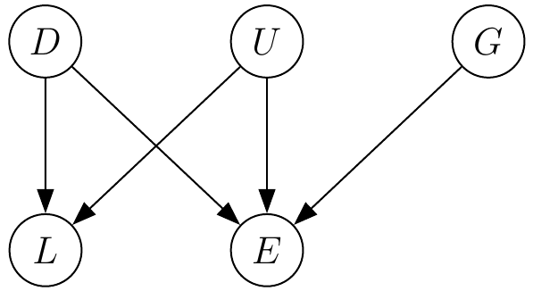
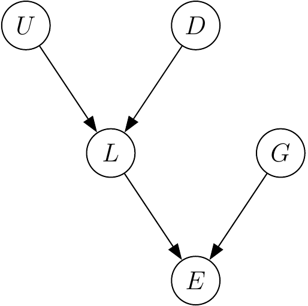

::: article
# Introduction

Configurational comparative methods (CCMs) subsume techniques for the
identification of complex causal dependencies in configurational data
using the theoretical framework of Boolean algebra and its various
extensions [@rihoux2009]. For example, Qualitative Comparative Analysis
[@ragin1987; @ragin2000; @ragin2008]---hitherto the most prominent
representative of CCMs---has been applied in areas as diverse as
business administration [e.g., @chung2001], environmental science
[@vanVliet2013], evaluation [@cragun2014], political science
[@thiem2011], public health [@longest2012] and sociology [@crowley2013].
Besides three stand-alone programs based on graphical user interfaces,
three R packages for QCA are currently available, each with a different
scope of functionality: [*QCA*](https://CRAN.R-project.org/package=QCA)
[@dusathiem2014; @thiemdusa2013RJ; @thiemdusa2013book], *QCA3*
[@huang2014] and
[*SetMethods*](https://CRAN.R-project.org/package=SetMethods)
([@quaranta2013]; an add-on package to [@schneider2012]).

A novel technique called Coincidence Analysis (CNA) has recently joined
the family of CCMs
[@baumgartner2009a; @baumgartner2009b; @baumgartner2013]. Like QCA, CNA
searches for rigorously minimized sufficient and necessary conditions of
causally modeled outcomes, and it implements the same regularity theory
of causation as QCA, that is, the theory most prominently advanced by
@mackie1974. Contrary to QCA, however, CNA can treat any number of
factors in a processed data set as endogenous (outcomes), and it does
not eliminate redundancies from sufficient and necessary conditions by
means of Quine-McCluskey optimization [@quine1959; @mccluskey1965], but
by means of an optimization algorithm that is custom-built for causal
modeling. As a direct consequence of these differences, CNA can identify
common cause and causal chain structures. Moreover, the algorithm does
not need to be told which factors are endogenous and which ones
exogenous; it can infer that from the data. What is more, limited data
diversity does not force CNA to resort to counterfactual additions to
the data. Finally, while the QCA programs *fs/QCA* [@ragin2014], *fuzzy*
[@longest2008], *Tosmana* [@cronqvist2011] and *Kirq* [@reichert2014]
often fail to find all data-fitting models [cf.
@ambiguities; @thiem2014c; @thiemdusa2013SSCR], the R implementation of
CNA presented in this paper
([*cna*](https://CRAN.R-project.org/package=cna); [@ambuehl2015]) not
only ensures---as does *QCA*---that all single-outcome models are
identified but additionally recovers the whole space of multiple-outcome
models that fit the data.

After an introduction to the theoretical and algorithmic background of
CNA, we demonstrate the potential of the *cna* R package by means of an
artificial and a real-life data set. In the final section, we outline
planned enhancements of *cna* that will further increase its
applicability.

# Theoretical and algorithmic background

CCMs search for causal dependencies as defined by so-called *regularity
theories* of causation, whose development dates back to David Hume
(1711-1776) and John Stuart Mill (1806-1873). By implementing techniques
of Boolean algebra, modern regularity theories spell out the notion of
causal relevance in terms of redundancy-free (minimized) sufficiency and
necessity relations among the elements of analyzed sets of factors
[@mackie1974; @grasshoff2001; @baumgartner2008; @baumgartner2013b].

The crucial component of the regularity theoretic definiens of causal
relevance is the notion of a minimal theory. A *minimal theory* of a
factor $Z$ is a minimally necessary disjunction of minimally sufficient
conditions of $Z$. A conjunction $\Phi$ of coincidently instantiated
factors,
i.e. $Y_{1} {\scriptstyle \ast}Y_2{\scriptstyle \ast}\ldots {\scriptstyle \ast}Y_{n}$,
is a minimally sufficient condition of $Z$ if, and only if (iff), $\Phi$
is sufficient for $Z$ $\left(\Phi \rightarrow Z\right)$, and there
exists no proper part $\Phi^{\prime}$ of $\Phi$ such that
$\Phi^{\prime} \rightarrow Z$. A proper part $\Phi^{\prime}$ of $\Phi$
is the result of eliminating at least one conjunct from $\Phi$. A
disjunction $\Psi$ of minimally sufficient conditions,
i.e. $\Phi_{1} + \Phi_2 + \ldots + \Phi_{n}$, is a minimally necessary
condition of $Z$ iff $\Psi$ is necessary for $Z$
$\left(Z\rightarrow \Psi\right)$, and there exists no proper part
$\Psi^{\prime}$ of $\Psi$ such that $Z \rightarrow \Psi^{\prime}$. A
proper part $\Psi^{\prime}$ of $\Psi$ is the result of eliminating at
least one disjunct from $\Psi$. Overall, a minimal theory of $Z$ has the
following biconditional form: $\Psi\leftrightarrow Z$ (where $\Psi$ is
an expression in disjunctive normal form and $Z$ is a single factor).

A minimal theory represents the causally interpretable dependencies of
sufficiency and necessity among the factors contained in a data set
$\delta$. That is, causal relevance can be defined in terms of
membership in a minimal theory, or more specifically: a factor $A$ is
causally relevant to a factor $B$ in a data set $\delta$ iff $\delta$
entails a minimal theory $\Psi\leftrightarrow B$ such that $A$ is
contained in $\Psi$.

CNA aims to infer minimal theories from $\delta$ by, first, identifying
sufficient and necessary conditions in $\delta$ and by, second,
minimizing those conditions. To the latter end, CNA tests the redundancy
of factors by eliminating them from sufficient and necessary conditions
and checking whether the remaining conditions are still sufficient and
necessary, respectively. More specifically, to determine whether a
sufficient condition
$Y_1{\scriptstyle \ast}Y_2{\scriptstyle \ast}\ldots{\scriptstyle \ast}Y_h$
of a factor $Z$ is minimally sufficient, CNA systematically eliminates
conjuncts from
$Y_1{\scriptstyle \ast}Y_2{\scriptstyle \ast}\ldots{\scriptstyle \ast}Y_h$.
For each conjunction that results from such an elimination, say for
$Y_2{\scriptstyle \ast}Y_3{\scriptstyle \ast}\ldots {\scriptstyle \ast}Y_h$,
CNA then parses the processed data $\delta$ to check whether $\delta$
contains
$Y_2{\scriptstyle \ast}Y_3{\scriptstyle \ast}\ldots {\scriptstyle \ast}Y_h$
in combination with the negation of $Z$, i.e. $z$. If $\delta$ does not
contain such a configuration,
$Y_2{\scriptstyle \ast}Y_3{\scriptstyle \ast}\ldots {\scriptstyle \ast}Y_h$
is itself sufficient for $Z$, which means that $Y_1$ is redundant. CNA
then proceeds to eliminate the next conjunct from
$Y_2{\scriptstyle \ast}Y_3{\scriptstyle \ast}\ldots {\scriptstyle \ast}Y_h$
and tests for further redundancies, until no more redundancies are
found. By contrast, if $\delta$ contains the configuration
$Y_2{\scriptstyle \ast}Y_3{\scriptstyle \ast}\ldots {\scriptstyle \ast}Y_h$
in combination with $z$, $Y_1$ makes a difference to $Z$ and is, thus,
not redundant. Accordingly, CNA re-adds $Y_1$ to
$Y_2{\scriptstyle \ast}Y_3{\scriptstyle \ast}\ldots {\scriptstyle \ast}Y_h$
and proceeds to eliminate $Y_2$, and so forth.

Similarly, to determine whether a complex necessary condition
$\Phi_1 + \Phi_2+\ldots + \Phi_h$ of a factor $Z$ is minimally
necessary, CNA systematically eliminates disjuncts from
$\Phi_1 + \Phi_2+\ldots + \Phi_h$ and checks for every resulting
disjunction, say for $\Phi_2 + \Phi_3+\ldots + \Phi_h$, whether it is
still necessary for $Z$, i.e. whether $\delta$ contains a configuration
featuring $Z$ without any of the disjuncts in
$\Phi_2 + \Phi_3+\ldots + \Phi_h$. If $\delta$ does not contain such a
configuration, $\Phi_2 + \Phi_3+\ldots + \Phi_h$ is still necessary for
$Z$, which means that the eliminated disjunct $\Phi_1$ is redundant.
Next, $\Phi_2 + \Phi_3+\ldots + \Phi_h$ is tested for further
redundancies, until no more redundancies are found.

CNA does not presuppose that certain factors in $\delta$ can be
identified as endogenous prior to applying CNA. In principle, CNA is
designed to recover and rigorously minimize all relationships of
sufficiency and necessity among the factors in $\delta$. In practice,
however, it is often known from the outset which factors are exogenous
and which endogenous. What is more, often enough theoretical knowledge
is available to order the factors in $\delta$ causally, where a *causal
ordering* is a relation $Y_i\prec Y_j$ entailing that $Y_j$ cannot be a
cause of $Y_i$ (e.g., because $Y_i$ is instantiated temporally before
$Y_j$). That is, an ordering excludes certain causal dependencies but
does not stipulate any. Accordingly, in addition to a data set $\delta$,
CNA may be given a subset $\mathsf{W}$ of endogenous factors
(i.e. possible effects) in $\delta$ and an ordering $\prec$ over the
factors in $\delta$ as input. Minimally sufficient and necessary
conditions are then calculated for the members of $\mathsf{W}$ in
accordance with $\prec$ only.

Recovered minimal theories of the elements of $\mathsf{W}$ are issued as
so-called *atomic solution formulas*. If CNA finds an atomic solution
formula $\Psi_1\leftrightarrow Z_i$ and an atomic solution formula
$\Psi_2\leftrightarrow Z_j$ such that $Z_i\neq Z_j$ and $\Psi_1$ and
$\Psi_2$ have at least one factor in common or $Z_i$ appears in $\Psi_2$
or $Z_j$ appears in $\Psi_1$, then CNA builds the *complex solution
formula*
$(\Psi_1\leftrightarrow Z_i) {\scriptstyle \ast}(\Psi_2\leftrightarrow Z_j)$.
Configurational data regularly underdetermine their own causal modeling,
with the effect that multiple atomic and complex solution formulas fit
the data equally well. In cases of such model ambiguities, CNA provides
an overview over the whole model space by returning all data-fitting
solution formulas.

As causally analyzed data tend to be noisy, that is, confounded by
uncontrolled (unmeasured) causes of endogenous factors, it often happens
that no configuration of factors is strictly sufficient or necessary for
a given $Z \in\mathsf{W}$. To still extract some (tentative) causal
information from such data, @ragin2006 has introduced so-called
*consistency* and *coverage* measures (with values between 0 and 1).
*Consistency* reproduces the degree to which the behavior of a given
outcome obeys a corresponding sufficiency or necessity relationship (or
a whole solution formula), whereas *coverage* reproduces the degree to
which a sufficiency or necessity relationship (or a whole solution
formula) accounts for the behavior of the corresponding outcome. If data
cannot be causally modeled with maximal consistency and coverage scores,
CNA invites its users to gradually lower consistency and coverage
thresholds until solution formulas can be built.

The *cna* package by @ambuehl2015 implements the methodological protocol
of CNA as sketched above. For more details on the background assumptions
of CNA, its minimization algorithm, and its relation to other
configurational methods such as QCA, we refer interested readers to
@baumgartner2009a.

# Examples

## Hypothetical data

In the following, we illustrate the main steps in using the *cna*
package. First, we employ a hypothetical data set from @baumgartner2009a
to investigate the causal dependencies among five factors hypothesized
to constitute a causal structure behind the overall level of education
in western democratic countries. These five factors are "strong unions"
($U$; 1 = strong, 0 = not strong), "high level of disparity" ($D$; 1 =
high, 0 = not high), "strong left parties" ($L$; 1 = strong, 0 = not
strong), "high gross national product" (GNP; $G$; 1 = high, 0 = not
high) and "high level of education" ($E$; 1 = high, 0 = not high). The
data for eight countries are presented in
Table [1](#tab:coincidencelist).

::: {#tab:coincidencelist}
  ------ ----- ----- ----- ----- -----
  Case    $U$   $D$   $L$   $G$    $E$

  1        1     1     1     1       1

  2        1     1     1     0       1

  3        1     0     1     1       1

  4        1     0     1     0       1

  5        0     1     1     1       1

  6        0     1     1     0       1

  7        0     0     0     1       1

  8        0     0     0     0       0
  ------ ----- ----- ----- ----- -----

  : Table 1: Exemplary data to be analyzed by CNA.
:::

The *cna* package comes with an integrated bundle of six data sets from
various areas of the social sciences. That bundle also includes the data
in Table [1](#tab:coincidencelist) as the data frame `d.educate`.
Accordingly, the first step to causally model
Table [1](#tab:coincidencelist) by means of CNA is to load the *cna*
package along with the `d.educate` data.

``` r
> library(cna)
> data(d.educate)									
```

The heart of the *cna* package is constituted by the `cna()` function.
It is the function that identifies and minimizes dependencies of
sufficiency and necessity in the data, which can be given to `cna()`
either in terms of a Boolean data frame or of a truth table as produced
by the `truthTab()` function. Essentially, `truthTab()` simply merges
multiple rows of a data frame featuring the same configuration into one
row, such that each row of the resulting truth table corresponds to one
determinate configuration. The number of occurrences (cases) and an
enumeration of the cases are saved as attributes `n` and `cases`,
respectively. As Table [1](#tab:coincidencelist) does not contain
multiple rows with identical configurations, the application of
`truthTab()` is uncalled for and we can directly pass `d.educate` on to
`cna()`. Moreover, let us assume that we have no prior causal knowledge
about the underlying causal structure, such that we cannot additionally
supply a causal ordering. The following is the default output returned
by `cna()`.

``` r
> cna(d.educate)
--- Coincidence Analysis (CNA) ---

Factors: U, D, L, G, E 

Minimally sufficient conditions:
--------------------------------
Outcome D:
  condition consistency coverage
 L*u   -> D       1.000    0.500
 E*g*u -> D       1.000    0.250

Outcome E:
 condition consistency coverage
    L -> E       1.000    0.857
    D -> E       1.000    0.571
    G -> E       1.000    0.571
    U -> E       1.000    0.571


Outcome G:
  condition consistency coverage
 d*E*u -> G       1.000    0.250
 E*l   -> G       1.000    0.250

Outcome L:
 condition consistency coverage
  D   -> L       1.000    0.667
  U   -> L       1.000    0.667
  E*g -> L       1.000    0.500

Outcome U:
  condition consistency coverage
 d*L   -> U       1.000    0.500
 d*E*g -> U       1.000    0.250

Atomic solution formulas:
-------------------------
Outcome E:
       condition consistency coverage
 D + G + U <-> E       1.000    1.000
 G + L     <-> E       1.000    1.000

Outcome L:
   condition consistency coverage
 D + U <-> L       1.000    1.000

Complex solution formulas:
--------------------------
                           condition consistency coverage
 (D + G + U <-> E)  *  (D + U <-> L)       1.000    1.000
     (G + L <-> E)  *  (D + U <-> L)       1.000    1.000
```

First, `cna()` lists all minimally sufficient conditions of all factors
in `d.educate`, second, it reports the atomic solution formulas for the
factors that can be modeled as endogenous factors, and third, it
specifies the resulting complex solutions. All solution types come with
corresponding consistency and coverage scores. In case of
Table [1](#tab:coincidencelist), these scores reach maximal values for
both atomic and complex solution formulas. Thus, the `d.educate` data
are as good as configurational data can possibly get.

The above results show that the causal structure generating
Table [1](#tab:coincidencelist) features two endogenous factors,
viz. "strong left parties" ($L$) and "high level of education" ($E$).
Moreover, there is one atomic solution for $L$ and there are two for
$E$. Overall, `cna()` infers that the `d.educate` data can be modeled in
terms of the two complex structures depicted in
Figure [1](#fig:graph_structures).
Graph [1](#fig:graph_structures)(left) represents a common cause
structure, in which "high level of disparity" ($D$) and "strong unions"
($U$) appear as direct common causes of $L$ and $E$, whereas
Graph [1](#fig:graph_structures)(right) depicts a causal chain such that
$D$ and $U$ are direct causes of $L$, which in turn is a direct cause of
$E$. As the data in Table [1](#tab:coincidencelist) are optimal by all
standards of configurational modeling, there is no way to determine
which of these two structures is the true or correct one.

<figure id="fig:graph_structures">
<table>
<caption></caption>
<tbody>
<tr class="odd">
<td style="text-align: center;"></td>
<td style="text-align: center;"></td>
</tr>
<tr class="even">
<td style="text-align: center;">Common cause structure</td>
<td style="text-align: center;">Causal chain</td>
</tr>
</tbody>
</table>
<figcaption>Figure 1: Visualization of dependency structures in
<code>d.educate</code> data.</figcaption>
</figure>

## Real-life data

This subsection illustrates further functionalities of the *cna* package
on the basis of a real-life data set. To this end, we choose the study
by @lam2010, who analyze the effects of an irrigation experiment in the
course of development interventions on the Indrawati River watershed in
the central hills of Nepal. Among other things, the authors investigate
the causal relevance of five exogenous factors on "persistent
improvement in water adequacy at the tail end in winter" ($W$), which
takes the value 1 when farmers at the tail end of the watershed
persistently receive the water they need in winter, and the value 0
otherwise. The five exogenous factors are: "continual assistance on
infrastructure improvement" ($A$), "existence of a set of formal rules
for irrigation operation and maintenance" ($R$), "existence of
provisions of fines" ($F$), "existence of consistent leadership" ($L$),
and "existence of collective action among farmers for system
maintenance" ($C$), for all of which the values 1 and 0 represent "yes"
and "no", respectively. The relevant data set, which comprises 15 cases,
is included in the *cna* package as the data frame `d.irrigate`.

``` r
> data(d.irrigate)
> d.irrigate
   A R F L C W
1  0 1 0 1 1 1
2  0 1 0 1 1 0
3  0 1 1 1 1 1
.. . . . . . .
<rest omitted>									
```

@lam2010 assume that $W$ is the ultimate outcome of the data-generating
causal structure. This background assumption can be given to `cna()` by
means of the argument `ordering`, which takes a list of character
vectors referring to the factors in the data frame as input. In case of
`d.irrigate`, the intended ordering is this:
`ordering = list(c("A", "R", "F", "L", " C"), "W")`. It determines that
$W$ is causally located *after* $A$, $R$, $F$, $L$, $C$, meaning that
the former cannot be a cause of the latter. Moreover, as this data frame
does not comprise all relevant factors for $W$, it is no longer possible
to reach perfect coverage scores. In the following analysis, we set the
coverage threshold (`cov`) to $0.9$ and extract only the complex
solution formulas from the resulting solution object via the function
`csf()`.

``` r
> sol1 <- cna(d.irrigate, ordering = list(c("A", "R", "F", "L", "C"), "W"), cov = 0.9)
> csf(sol1)
                                                 condition consistency coverage
1  (a + f*R + L <-> C)  *  (A*C + a*f*r + F*R + l*R <-> W)       1.000    0.917
2  (a + f*R + L <-> C)  *          (A*C + a*l + F*R <-> W)       1.000    0.917
3  (a + f*R + L <-> C)  *  (A*C + C*f*r + F*R + l*R <-> W)       1.000    0.917
4  (a + f*R + L <-> C)  *          (A*C + C*l + F*R <-> W)       1.000    0.917
5  (a + f*R + L <-> C)  *  (a*f*r + A*L + F*R + l*R <-> W)       1.000    0.917
6  (a + f*R + L <-> C)  *  (a*f*r + A*R + F*R + l*R <-> W)       1.000    0.917
7  (a + f*R + L <-> C)  *    (a*l + A*L + F*R + l*R <-> W)       1.000    0.917
8  (a + f*R + L <-> C)  *          (a*l + A*R + F*R <-> W)       1.000    0.917
9  (a + f*R + L <-> C)  *  (A*L + C*f*r + F*R + l*R <-> W)       1.000    0.917
10 (a + f*R + L <-> C)  *          (A*L + C*l + F*R <-> W)       1.000    0.917
11 (a + f*R + L <-> C)  *  (A*R + C*f*r + F*R + l*R <-> W)       1.000    0.917
12 (a + f*R + L <-> C)  *          (A*R + C*l + F*R <-> W)       1.000    0.917
```

This output of `cna()` shows that not only $W$ can be modeled as an
endogenous factor, but also $C$---a fact which is overlooked by @lam2010
due to their reliance on QCA with its focus on single-outcome
structures. `cna()` returns one atomic solution formula for $C$ and 12
for $W$, yielding a total of 12 complex solution formulas that fare
equally well with respect to all parameters of model fit. According to
some of these models, the behavior of $C$ and $W$ is regulated by a
common cause structure; according to others, the underlying structure is
a causal chain.

To generate models for negative outcomes, `cna()` provides the argument
`notcols`, which takes a character vector of factors to be negated as
input. In the following analysis, we set `cov` to $0.66$ and negate the
factors $C$ and $W$ (which then must also appear negatively in the
ordering). Moreover, we pass the solution object on to the `print()`
function, which provides arguments determining the number of solutions
to print (`nsolutions`) and what elements of the solution to print
(`what`). The `what` argument takes a character vector as input, where
`"t"` prints the truth table, `"m"` the minimally sufficient conditions,
`"a"` the atomic solution formulas, `"c"` the complex solution formulas,
and `"all"` returns all solution elements.

``` r
> sol2 <- cna(d.irrigate, ordering = list(c("A", "R", "F", "L", "c"), "w"),
	      notcols = c("C", "W"),  cov = 0.66)
> print(sol2, nsolutions = 3, what = "a,c")
--- Coincidence Analysis (CNA) ---

Causal ordering:
A, R, F, L, c < w

Atomic solution formulas:
-------------------------
Outcome R:
             condition consistency coverage
 A*C + f*L       <-> R       1.000    0.667
 A*F + f*L       <-> R       1.000    0.667
 A*L + f*L + F*l <-> R       1.000    0.667

Outcome w:
       condition consistency coverage
 A*r + F*r <-> w       1.000    0.667
 A*r + L*r <-> w       1.000    0.667
 c*f + F*r <-> w       1.000    0.667
 ... (total no. of formulas: 6)

Complex solution formulas:
--------------------------
                                     condition consistency coverage
       (A*C + f*L <-> R)  *  (A*r + F*r <-> w)       1.000    0.667
       (A*F + f*L <-> R)  *  (A*r + F*r <-> w)       1.000    0.667
 (A*L + f*L + F*l <-> R)  *  (A*r + F*r <-> w)       1.000    0.667
 ... (total no. of formulas: 18)
```

Finally, the `condition()` function provides assistance to inspect the
properties of sufficient and necessary conditions in a data frame, most
notably, of minimally sufficient and necessary conditions that appear in
solution formulas returned by `cna()`. It takes a vector of strings
specifying Boolean functions as input, reveals which configurations and
cases instantiate a given condition or solution, and lists consistency,
coverage, as well as unique coverage scores [cf. @ragin2008 63-68].
Below, we investigate the properties of the first atomic solution for
outcome $w$ from the previous analysis.

``` r
> condition("A*r + F*r <-> w", d.irrigate)
A*r+F*r -> w :
 A*r+F*r w n cases
       0 0 1     1
       0 1 1     2
       0 0 2   3,4
       0 0 2   5,6
       0 0 2   7,8
       0 0 1     9
       0 0 1    10
       1 1 1    11
       1 1 1    12
       0 0 1    13
       0 0 1    14
       0 0 1    15
Consistency: 1.000 (2/2)
Coverage:    0.667 (2/3)
Total no. of cases: 15
Unique Coverages: A*r : 0.333 (1/3)
                  F*r : 0.333 (1/3)
```

The first two columns of the table returned by `condition()` indicate
the configurations instantiating (`1`) and not instantiating (`0`) the
disjunction $A{\scriptstyle \ast}r + F{\scriptstyle \ast}r$ and the
outcome $w$, respectively. The third column specifies how many cases in
the associated data feature a corresponding configuration, and the forth
column lists these cases. According to the above output, hence,
$A{\scriptstyle \ast}r + F{\scriptstyle \ast}r$ covers the instances of
$w$ in cases 11 and 12 and leaves the occurrence of $w$ in case 2
uncovered. Consequently, the overall solution coverage is $\frac{2}{3}$,
with each disjunct uniquely covering one of the instances of $w$.

# Summary and outlook

We have presented *cna*, an R package implementing Coincidence Analysis
(CNA), which is a method for the identification of multi-outcome
structures in configurational data. CNA not only differs from QCA---the
standard method of configurational causal modeling---by relaxing the
single-outcome restriction but also by not drawing on Quine-McCluskey
optimization for the elimination of redundancies from sufficient and
necessary conditions. Instead, CNA employs its own minimization
algorithm that is custom-built for causal modeling purposes.

At this stage of development, *cna* still requires bivalent variables.
Planned future enhancements include the capability to process
multivalent factors that generate crisp sets [@thiem2013] and bivalent
factors with fuzzy sets [@smithson2006]. Possibilities to merge these
constructs in multivalent factors with fuzzy sets, as has recently been
suggested in the context of QCA [@thiem2014a], will be explored as well.
In this connection, aspects of alternative procedures proposed in the
context of minimization with fuzzy sets may be incorporated where
appropriate [@eliason2009]. Finally, functionality for sensitivity
diagnostics that facilitates robustness tests is envisaged
[@thiem2014b].

Complex causal structures are communicated most effectively to readers
of scientific articles in the form of graphs rather than formulas. This
is all the more true for multivalent factors. In this regard,
functionality that translates *cna* solutions into corresponding graphs
enjoys high priority on the list of future enhancements.

## Acknowledgment

This work was generously supported by the Swiss National Science
Foundation, grant number PP00P1_144736.

\

\
:::
