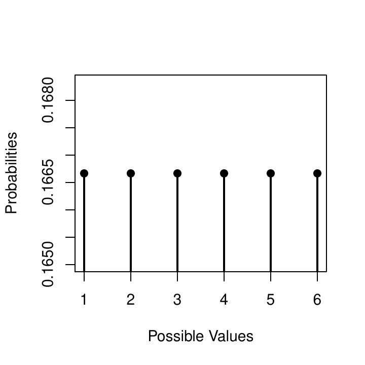
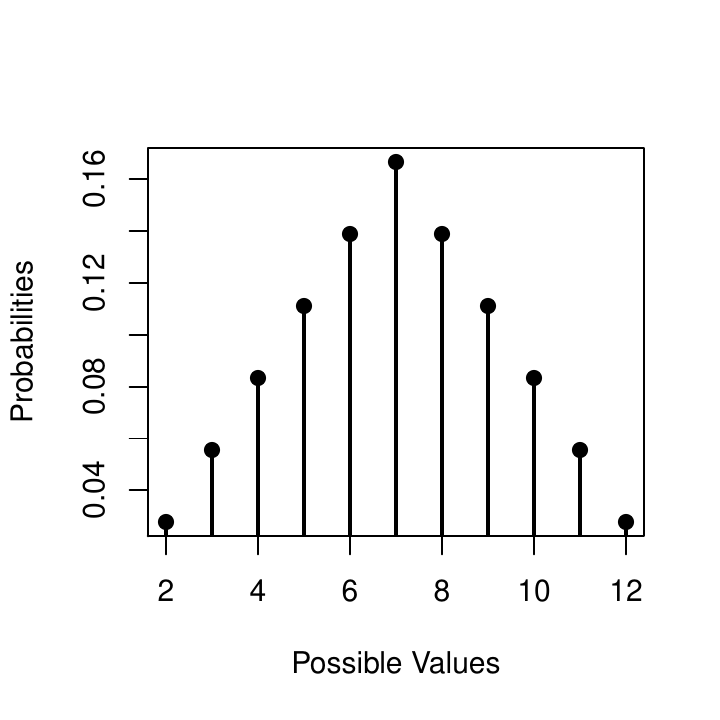
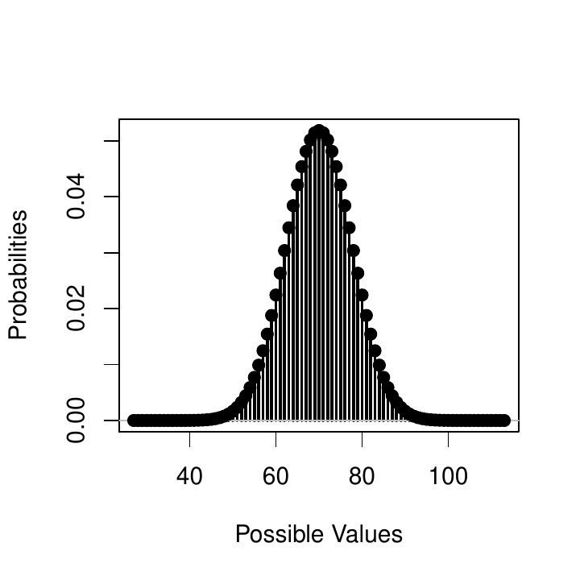
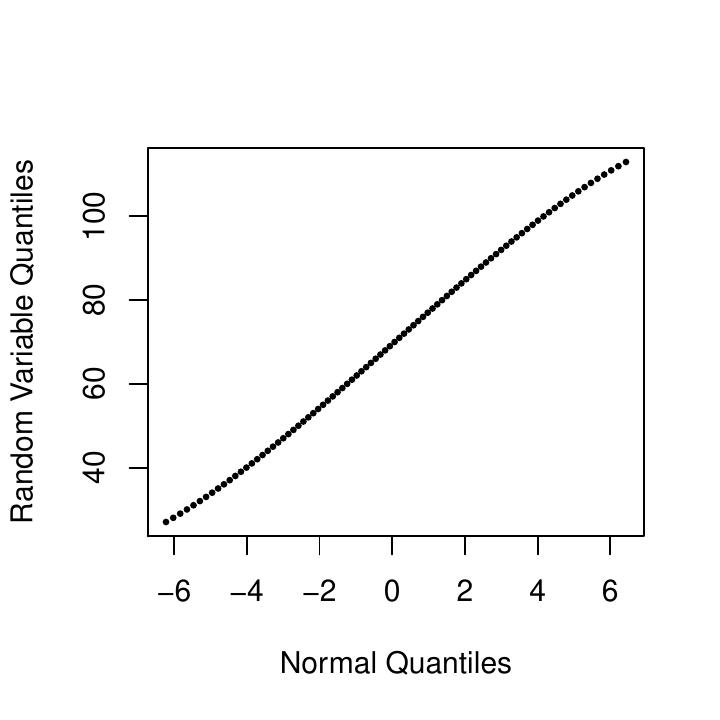

::: article
## Introduction

One of the primary hurdles in teaching probability courses in an
undergraduate setting is to bridge the gap between theoretical notation
from textbooks and lectures, and the statements used in statistical
software required in more and more classes. Depending on the background
of the student, this missing link can manifest itself differently: some
students master theoretical concepts and notation, but struggle with the
computing environment, while others are very comfortable with
statistical programming, but find it difficult to translate their
knowledge back to the theoretical setting of the classroom.

[*discreteRV*](https://CRAN.R-project.org/package=discreteRV) [@m2] is
an approach to help with bringing software commands closer to the
theoretical notation. The package provides a comprehensive set of
functions to create, manipulate, and simulate from discrete random
variables. It is designed for introductory probability courses.
*discreteRV* uses syntax that closely matches the notation of standard
probability textbooks to allow for a more seamless connection between a
probability classroom setting and the use of statistical software.
*discreteRV* is available for download on the Comprehensive R Archive
Network (CRAN). *discreteRV* was derived from a script written by
Dr. Andreas Buja for an introductory statistics class [@m4]. The package
*rv2* [@m3], available on GitHub, provides a useful example of using
[*devtools*](https://CRAN.R-project.org/package=devtools) [@m5] to begin
basic package development, and also uses Dr. Buja's code as a starting
point. The goal of *rv2* seems more focused on learning package
development, while the goal of *discreteRV* is to be a useful statistics
education and probability learning tool.

The functions of *discreteRV* are organized into two logical areas,
termed probabilities and simulations. This document will illustrate the
use of both sets of functions. All code used in this document is
available in a vignette, accessible by loading *discreteRV* and calling
`vignette("discreteRV")`.

# Probabilities

*discreteRV* includes a suite of functions to create, manipulate, and
compute distributional quantities for discrete random variables. A list
of these functions and brief discriptions of their functionality is
available in Table [1](#tbl:discreteRV-probs).

::: {#tbl:discreteRV-probs}
  ---------------------------------------------------------------------------------------------------------------------------------------
  Name                         Description
  ---------------------------- ----------------------------------------------------------------------------------------------------------
  Creation                     

  `RV`                         Create a random variable consisting of possible outcome values and their probabilities or odds

  `as.RV`                      Turn a probability vector with possible outcome values in the `names()` attribute into a random variable

  `jointRV`                    Create a joint random variable consisting of possible outcome values and their probabilities or odds

  Manipulation                 

  `iid`                        Returns a random variable with joint probability mass function of random variable $X^n$

  `independent`                Returns a boolean indicating whether two RVs $X$ and $Y$ are independent

  `joint`                      Returns a random variable with joint probability mass function of random variables $X$ and $Y$

  `marginal`                   The specified marginal distribution of a joint random variable

  `margins`                    All marginal distributions of a joint random variable

  `SofI`                       Sum of independent random variables

  `SofIID`                     Sum of independent identically distributed random variables

  Probabilities                

  `P`                          Calculate probabilities of events

  `probs`                      Probability mass function of random variable $X$

  `E`                          Expected value of a random variable

  `V`                          Variance of a random variable

  `SD`                         Standard deviation of a random variable

  `SKEW`                       Skewness of a random variable

  `KURT`                       Kurtosis of a random variable

  Methods for `"RV"` objects   

  `plot`                       Plot a random variable of class `"RV"`

  `print`                      Print a random variable of class `"RV"`

  `qqnorm`                     Normal quantile plot for `"RV"` objects to answer the question how close to normal it is
  ---------------------------------------------------------------------------------------------------------------------------------------

  : Table 1: Overview of functions provided in *discreteRV* ordered by
  topics.
:::

## Creating random variables

The centerpiece of *discreteRV* is a set of functions to create and
manipulate discrete random variables. A random variable $X$ is defined
as a theoretical construct representing the value of an outcome of a
random experiment [see e.g.  @ws:1999]. A discrete random variable is a
special case that can only take on a countable set of values. Discrete
random variables are associated with probability mass functions, which
map the set of possible values of the random variable to probabilities.
Probability mass functions must therefore define probabilities which are
between zero and one, and must sum to one.

Throughout this document, we will work with two random variables, a
simple example of a discrete random variable representing the value of a
roll of a fair die, and one representing a realization of a Poisson
random variable with mean parameter equal to two. Formally, we can
define such random variables and their probability mass functions as
follows:

Let $X$ be a random variable representing a single roll of a fair die;
i.e., the sample space $\Omega = \{1, 2, 3, 4, 5, 6\}$ and $X$ is the
identity, mapping the upturned face of a die roll to the corresponding
number of dots visible. Then,

$$f(x) = P(X = x) = \left\{
     \begin{array}{lr}
       1/6 & x \in \{1, 2, 3, 4, 5, 6\}\\
       0 & \text{otherwise}
     \end{array}
   \right.$$

Let $Y$ be a random variable distributed according to a Poisson
distribution with mean parameter $\lambda$. In this case, $Y$ takes on
values in the non-negative integers $\{0, 1, 2, \ldots \}$. Then,

$$f(y) = P(Y = y) = \left\{
     \begin{array}{lr}
       \frac{\lambda^y e^{-\lambda}}{y!} & y \in \{0, 1, 2, \ldots\}\\
       0 & \text{otherwise}
     \end{array}
   \right.$$

In *discreteRV*, a discrete random variable is defined through the use
of the `RV` function. `RV` accepts a vector of outcomes, a vector of
probabilities, and returns an `"RV"` object. The code to create `X`, a
random variable representing the roll of a fair die, is as follows:

``` r
> (X <- RV(outcomes = 1:6, probs = 1/6))
```

``` r
Random variable with 6 outcomes

Outcomes   1   2   3   4   5   6
Probs    1/6 1/6 1/6 1/6 1/6 1/6
```

Defaults are chosen to simplify the random variable creation process.
For instance, if the `probs` argument is left unspecified, *discreteRV*
assumes a uniform distribution. Hence, the following code is equivalent
for defining a fair die:

``` r
> (X <- RV(1:6))
```

``` r
Random variable with 6 outcomes

Outcomes   1   2   3   4   5   6
Probs    1/6 1/6 1/6 1/6 1/6 1/6
```

Outcomes can be specified as a range of values, which is useful for
distributions in which the outcomes that can occur with non-zero
probability are unbounded. This can be indicated with the `range`
argument, which defaults to `TRUE` in the event that the range of values
includes positive or negative infinity. To define our Poisson random
variable Y, we specify the outcomes as a range and the probabilities as
a function:

``` r
> pois.func <- function(y, lambda) { return(lambda^y * exp(-lambda) / factorial(y)) }
> (Y <- RV(outcomes = c(0, Inf), probs = pois.func, lambda = 2))
```

``` r
Random variable with outcomes from 0 to Inf 

Outcomes     0     1     2     3     4     5     6     7     8     9    10    11
Probs    0.135 0.271 0.271 0.180 0.090 0.036 0.012 0.003 0.001 0.000 0.000 0.000

Displaying first 12 outcomes
```

Several common distributions are natively supported so that the
functions need not be defined manually. For instance, an equivalent
method of defining $Y$ is:

``` r
> (Y <- RV("poisson", lambda = 2))
```

``` r
Random variable with outcomes from 0 to Inf 

Outcomes     0     1     2     3     4     5     6     7     8     9    10    11
Probs    0.135 0.271 0.271 0.180 0.090 0.036 0.012 0.003 0.001 0.000 0.000 0.000

Displaying first 12 outcomes
```

The `RV` function also allows the definition of a random variable in
terms of odds. We construct a loaded die in which a roll of one is four
times as likely as any other roll as:

``` r
> (X.loaded <- RV(outcomes = 1:6, odds = c(4, 1, 1, 1, 1, 1)))
```

``` r
Random variable with 6 outcomes

Outcomes   1   2   3   4   5   6
Odds     4:5 1:8 1:8 1:8 1:8 1:8
```

## Structure of an `"RV"` object

The syntactic structure of the included functions lends itself both to a
natural presentation of elementary probabilities and properties of
probability mass functions in an introductory probability course, as
well as more advanced modeling of discrete random variables. In Table
[2](#tbl:discreteRV-connect), we provide an overview of the notational
similarities between *discreteRV* and the commonly used probability
textbook by [@cb:2001].

::: {#tbl:discreteRV-connect}
  ----------------------------------------------------------
  *discreteRV*                   Casella and Berger
  ------------------------------ ---------------------------
  `E(X)`                         E(X)

  `P(X == x)`                    $P(X = x)$

  `P(X >= x)`                    $P(X \ge x)$

  `P((X < x1) %AND% (X > x2))`   $P(X < x_1 \cap X > x_2)$

  `P((X < x1) %OR% (X > x2))`    $P(X < x_1 \cup X > x_2)$

  `P((X == x1) | (X > x2))`      $P(X < x_1 | X > x_2)$

  `probs(X)`                     $f(x)$

  `V(X)`                         $Var(X)$
  ----------------------------------------------------------

  : Table 2: Probability functions in *discreteRV* and their
  corresponding syntax in introductory statistics courses.
:::

A random variable object is constructed by defining a standard R vector
to be the possible outcomes that the random variable can take (the
sample space $\Omega$). It is preferred, though not required, that these
be encoded as numeric values, since this allows the computation of
expected values, variances, and other distributional properties. This
vector of outcomes then stores attributes which include the probability
of each outcome. By default, the print method for a random variable will
display the probabilities as fractions in most cases, aiding in
readability. The probabilities can be retrieved as a numeric vector by
using the `probs` function:

``` r
> probs(X)
```

``` r
        1         2         3         4         5         6 
0.1666667 0.1666667 0.1666667 0.1666667 0.1666667 0.1666667
```

## Probability-based calculations

By storing the outcomes as the principal component of the object `X`, we
can make a number of probability statements in R. For instance, we can
calculate the probability of obtaining a roll greater than 1 by using
the code $P(X > 1)$. R will check which of the values in the vector `X`
are greater than 1. In this case, these are the outcomes 2, 3, 4, 5, and
6. Hence, R will return `TRUE` for these elements of `X`, and we compute
the probability of this occurrence in the function `P` by simply summing
over the probability values stored in the names of these particular
outcomes. Likewise, we can make slightly more complicated probability
statements such as $P(X > 5 \cup X = 1)$, using the `%OR%` and `%AND%`
operators. Consider our Poisson random variable $Y$, and suppose we want
to obtain the probability that $Y$ is within a distance $\delta$ of its
mean parameter $\lambda = 2$:

``` r
> delta <- 3; lambda <- 2
> P((Y >= lambda - delta) %AND% (Y <= lambda + delta))
```

``` r
[1] 0.9834364
```

Alternatively, we could have also used the slightly more complicated
looking expression:

``` r
> P((Y - lambda)^2 <= delta^2)
```

``` r
[1] 0.9834364
```

Conditional probabilities often provide a massive hurdle for students of
introductory probability classes. These types of questions often make it
necessary to first translate the problem from everyday language into the
mathematical concept of conditional probability, e.g., what is the
probability that you will not need an umbrella when the weather forecast
said it was not going to rain? Similarly, what is the probability that a
die shows a one, if we already know that the roll is no more than 3? The
mathematical solution is, of course, $P(X=1 \mid X \le 3)$. In
*discreteRV* this translates directly to a solution of
`P(X == 1 | X <= 3)`. The use of the pipe operator may be less intuitive
to the seasoned R programmer, but overcomes a major notational issue in
that conditional probabilities are most commonly specified with the
pipe. Using the pipe for conditional probablity, we had to create
alternative `%OR%` and `%AND%` operators, as specified previously.

We can compute several other distributional quantities, including the
expected value and the variance of a random variable. In notation from
probability courses, expected values can be found with the `E` function.
To compute the expected value for a single roll of a fair die, we run
the code `E(X)`. The expected value for a Poisson random variable is its
mean, and hence `E(Y)` in our example will return the value two. The
function `V(X)` computes the variance of random variable X.
Alternatively, we can also work from first principles and assure
ourselves that the expression `E((X - E(X))^2)` provides the same
result:

``` r
> V(X)
```

``` r
[1] 2.916667
```

``` r
> E((X - E(X))^2)
```

``` r
[1] 2.916667
```

## Joint distributions

Aside from moments and probability statements, *discreteRV* includes a
powerful set of functions used to create joint probability
distributions. Once again letting $X$ be a random variable representing
a single die roll, we can use the `iid` function to compute the
probability mass function of $n$ trials of $X$. Table
[3](#tbl:fairdiejoint) gives the first eight outcomes for $n = 2$, and
Table [4](#tbl:fairdieiid) gives the first eight outcomes for $n = 3$.
Notice again that the probabilities have been coerced into fractions for
readability. Notice also that the outcomes of the joint distribution are
encoded by the outcomes on each trial separated by a comma.

::: {#tbl:fairdiejoint}
  ------------- ------ ------ ------ ------ ------ ------ ------ ------
        Outcome 1,1    1,2    1,3    1,4    1,5    1,6    2,1    2,2

    Probability 1/36   1/36   1/36   1/36   1/36   1/36   1/36   1/36
  ------------- ------ ------ ------ ------ ------ ------ ------ ------

  : Table 3: First eight outcomes and their associated probabilities for
  a variable representing two independent rolls of a die.
:::

::: {#tbl:fairdieiid}
  ------------- ------- ------- ------- ------- ------- ------- ------- -------
        Outcome 1,1,1   1,1,2   1,1,3   1,1,4   1,1,5   1,1,6   1,2,1   1,2,2

    Probability 1/216   1/216   1/216   1/216   1/216   1/216   1/216   1/216
  ------------- ------- ------- ------- ------- ------- ------- ------- -------

  : Table 4: First eight outcomes and their associated probabilities for
  a variable representing three independent rolls of a die.
:::

The `*` operator has been overloaded in order to allow a more seamless
syntax for defining joint distributions. Suppose we wish to compute the
joint distribution of `X`, our toss of a fair coin, and a coin flip.
After defining the coin flip variable, the joint distribution can be
defined as follows:

``` r
> Z <- RV(0:1)
> X * Z
```

``` r
Random variable with 12 outcomes

Outcomes  1,0  1,1  2,0  2,1  3,0  3,1  4,0  4,1  5,0  5,1  6,0  6,1
Probs    1/12 1/12 1/12 1/12 1/12 1/12 1/12 1/12 1/12 1/12 1/12 1/12
```

Note that the behavior is slightly different when using the `*` operator
on the same random variable. That is, `X * X` will not compute a joint
distribution of two realizations of $X$, but will rather return the
random variable with the original outcomes squared, and the same
probabilities. This allows us to perform computations such as `E(X^2)`
without encountering unexpected behavior.

Joint distributions need not be the product of iid random variables.
Joint distributions in which the marginal distributions are dependent
can also be defined. Consider the probability distribution defined in
Table [5](#tbl:jointtable). Note that $A$ and $B$ are dependent, as the
product of the marginal distributions does not equal the joint. We can
define such a random variable in *discreteRV* by using the `jointRV`
function, which is a wrapper for `RV`:

::: {#tbl:jointtable}
  ------------------------
      1      2      3
  --- ------ ------ ------
    0 1/45   4/45   7/45

    1 2/45   1/9    8/45

    2 1/15   2/15   1/5
  ------------------------

  : Table 5: Outcomes and their associated probabilities for a joint
  distribution of random variables $A$ (along the columns) and $B$
  (along the rows).
:::

``` r
> (AandB <- jointRV(outcomes = list(1:3, 0:2), probs = 1:9 / sum(1:9)))
```

``` r
Random variable with 9 outcomes

Outcomes  1,0  1,1  1,2  2,0  2,1  2,2  3,0  3,1  3,2
Probs    1/45 2/45 1/15 4/45  1/9 2/15 7/45 8/45  1/5
```

The individual marginal distributions can be obtained by use of the
`marginal` function:

``` r
> A <- marginal(AandB, 1)
> B <- marginal(AandB, 2)
```

Although the marginal distributions allow all the same computations of
any univariate random variable, they maintain a special property. The
joint distribution that produced the marginals is stored as attributes
in the object. This allows for several more advanced probability
calculations, involving the marginal and conditional distributions:

``` r
> P(A < B)
```

``` r
[1] 0.06666667
```

``` r
> P(A == 2 | B > 0)
```

``` r
[1] 0.3333333
```

``` r
> P(A == 2 | (B == 1) %OR% (B == 2))
```

``` r
[1] 0.3333333
```

``` r
> independent(A, B)
```

``` r
[1] FALSE
```

``` r
> A | (A > 1)
```

``` r
Random variable with 2 outcomes

Outcomes    2    3
Probs    5/13 8/13
```

``` r
> A | (B == 2)
```

``` r
Random variable with 3 outcomes

Outcomes   1   2   3
Probs    1/6 1/3 1/2
```

``` r
> E(A | (B == 2))
```

``` r
[1] 2.333333
```

*discreteRV* also includes functions to compute the sum of independent
random variables. If the variables are identically distributed, the
`SofIID` function can be used to compute probabilities for the sum of
$n$ independent realizations of the random variable. In our fair die
example, `SofIID(X, 2)` creates a random variable object for the sum of
two fair dice as shown in Table [6](#tbl:fairdiesofi).

::: {#tbl:fairdiesofi}
  ------------- ------ ------ ------ ----- ------ ----- ------ ----- ------ ------ ------
        Outcome 2      3      4      5     6      7     8      9     10     11     12

    Probability 1/36   1/18   1/12   1/9   5/36   1/6   5/36   1/9   1/12   1/18   1/36
  ------------- ------ ------ ------ ----- ------ ----- ------ ----- ------ ------ ------

  : Table 6: Outcomes and their associated probabilities for a variable
  representing the sum of two independent rolls of a die.
:::

The `SofI` function computes the random variable representing the sum of
two independent, but not necessarily identically distributed, random
variables. The `+` operator is overloaded to make this computation even
more syntactically friendly. Note, however, that similar limitations
apply as in the joint distribution case:

``` r
> X + Z
```

``` r
Random variable with 7 outcomes

Outcomes    1    2    3    4    5    6    7
Probs    1/12  1/6  1/6  1/6  1/6  1/6 1/12
```

``` r
> X + X # Note that this is NOT a random variable for X1 + X2
```

``` r
Random variable with 6 outcomes

Outcomes   2   4   6   8  10  12
Probs    1/6 1/6 1/6 1/6 1/6 1/6
```

``` r
> 2 * X # Same as above
```

``` r
Random variable with 6 outcomes

Outcomes   2   4   6   8  10  12
Probs    1/6 1/6 1/6 1/6 1/6 1/6
```

## Plotting

*discreteRV* includes a `plot` method for random variable objects so
that visualizing outcomes and their probabilities is as simple as
calling `plot(X)`. Figure [1](#fig:plot) on the left shows a visual
representation of the probability mass function (pmf) of a fair die. The
$x$ axis includes all outcomes, and the $y$ axis includes the
probabilities of each particular outcome. Figure [1](#fig:plot) on the
right shows the pmf of the sum of two independent rolls of a fair die.
The pmf of a sum of 20 independent rolls of a die is given in
Figure [2](#fig:plot20) on the left.

<figure id="fig:plot">
<p></p>
<figcaption>Figure 1: Left: plot method called on a fair die random
variable; right: plot method called on a sum of two fair die random
variables.</figcaption>
</figure>

<figure id="fig:plot20">
<p></p>
<figcaption>Figure 2: Left: plot method called on a sum of 20 fair die
random variables; right: <code>qqnorm</code> method called on a sum of
20 fair die random variables.</figcaption>
</figure>

In addition to a plotting method, there is also a method for `qqnorm` to
allow assessment of normality for random variable objects, as displayed
in Figure [2](#fig:plot20) on the right. While very close to a normal,
the sum of 20 independent rolls of a fair die still shows a slight S
curve in the Q-Q plot.

# Simulation

*discreteRV* also includes a set of functions to simulate trials from a
random variable. A list of these functions and brief discriptions of
their functionality is available in Table [7](#tbl:discreteRV-sim).

::: {#tbl:discreteRV-sim}
  -------------------------------------------------------------------------------------------
  Name        Description
  ----------- -------------------------------------------------------------------------------
  `plot`      Plot method for a simulated random vector, i.e., an object of class `"RVsim"`

  `Prop`      Proportion of an event observed in a vector of simulated trials

  `props`     Proportions of observed outcomes in one or more vectors of simulated trials

  `rsim`      Simulate $n$ independent trials from a random variable $X$

  `skewSim`   Skew of the empirical distribution of simulated data
  -------------------------------------------------------------------------------------------

  : Table 7: List of the simulation functions contained in *discreteRV*.
:::

## Creation

Creating a simulated random vector is done by using the `rsim` function.
`rsim` accepts a parameter $X$ representing the random variable to
simulate from, and a parameter $n$ representing the number of
independent trials to simulate. For example, suppose we would like to
simulate ten trials from a fair die. We have already created a random
variable object `X`, so we simply call `rsim` as follows:

``` r
> (X.sim <- rsim(X, 10))
```

``` r
Simulated Vector:  4 3 2 3 4 2 2 3 6 5 

Random variable with 6 outcomes

Outcomes   1   2   3   4   5   6
Probs    1/6 1/6 1/6 1/6 1/6 1/6
```

The object returned is a vector of simulated values, with an attribute
containing the random variable that was used for the simulation. If we
would like to retrieve only the simulated values and exclude the
attached probabilities, we can coerce the object into a vector using R's
built-in `as.vector` function.

``` r
> as.vector(X.sim)
```

``` r
 [1] 4 3 2 3 4 2 2 3 6 5
```

It is also possible to retrieve some quantities from the simulation. We
can retrieve the empirical distribution of simulated values with the
`props` function. This will return the outcomes from the original random
variable object, and the observed proportion of simulated values for
each of the outcomes. We can also compute observed proportions of events
by using the `Prop` function. Similar to the `P` function for
probability computations on random variable objects, `Prop` accepts a
variety of logical statements.

``` r
> props(X.sim)
```

``` r
RV
  1   2   3   4   5   6 
0.0 0.3 0.3 0.2 0.1 0.1
```

``` r
> Prop(X.sim == 3)
```

``` r
[1] 0.3
```

``` r
> Prop(X.sim > 3)
```

``` r
[1] 0.4
```

# Extended example: playing Craps

Craps is a common dice game played in casinos. The game begins with what
is called the "Come Out" roll, in which two fair dice are rolled. If a
sum of seven or eleven is obtained, the player wins. If a sum of two,
three, or twelve is obtained, the player loses. In all other cases, the
roll obtained is declared the "Point" and the player rolls again in an
attempt to obtain this same point value. If the player rolls the Point,
they win, but if they roll a seven, they lose. Rolls continue until one
of these two outcomes is achieved.

*discreteRV* allows for a seamless analysis and simulation of the
probabilities associated with different events in Craps. Let us begin by
asking "What is the probability that the game ends after the first
roll?" To answer this question we construct two random variables. We
note that calling `RV(1:6)` returns a random variable for a single roll
of a fair die, and then we use the overloaded `+` operator to sum over
two rolls to obtain the random variable `Roll`.

``` r
> (Roll <- RV(1:6) + RV(1:6))
```

``` r
Random variable with 11 outcomes

Outcomes    2    3    4    5    6    7    8    9   10   11   12
Probs    1/36 1/18 1/12  1/9 5/36  1/6 5/36  1/9 1/12 1/18 1/36
```

Recall that the game ends after the first roll if and only if a seven or
eleven is obtained (resulting in a win), or a two, three, or twelve is
obtained (resulting in a loss). Hence, we calculate the probability that
the game ends after the first roll as follows:

``` r
> P(Roll %in% c(7, 11, 2, 3, 12))
```

``` r
[1] 0.3333333
```

Now suppose we would like to condition on the game having ended after
the first roll. Using the conditional probability operator in
*discreteRV*, we can obtain the probabilities of winning and losing
given that the game ended after the first roll:

``` r
> P(Roll %in% c(7, 11) | Roll %in% c(7, 11, 2, 3, 12))
```

``` r
[1] 0.6666667
```

``` r
> P(Roll %in% c(2, 3, 12) | Roll %in% c(7, 11, 2, 3, 12))
```

``` r
[1] 0.3333333
```

Now, let us turn our attention to calculating the probability of winning
a game in two rolls. Recall that we can use the `iid` function to
generate joint distributions of independent and identically distributed
random variables. In this case, we would like to generate the joint
distribution for two independent rolls of two dice. Now, we will have
$11^2$ possible outcomes, and our job is to determine which outcomes
result in a win. We know that any time the first roll is a seven or
eleven, we will have won. We also know that if the roll is between four
and ten inclusive, then we will get to roll again. To win within two
rolls given that we have received a four through ten requires that the
second roll matches the first. We can enumerate the various
possibilities to calculate the probability of winning in two rolls,
which is approximately 30%.

``` r
> TwoRolls <- iid(Roll, 2)
> First <- marginal(TwoRolls, 1)
> Second <- marginal(TwoRolls, 2)
> P(First %in% c(7, 11) %OR% (First %in% 4:10 %AND% (First == Second)))
```

``` r
[1] 0.2993827
```

Finally, suppose we are interested in the empirical probability of
winning a game of Craps. Using the simulation functions in *discreteRV*,
we can write a routine to simulate playing Craps. Using the `rsim`
function, we simulate a single game of Craps by rolling from our random
variable `Roll`, which represents the sum of two dice. We then perform
this simulation 100000 times. The results indicate that the player wins
a game of craps approximately 49% of the time.

``` r
> craps_game <- function(RV) {
+    
+    my.roll <- rsim(RV, 1)
+    
+    if (my.roll %in% c(7, 11)) { return(1) }
+    else if (my.roll %in% c(2, 3, 12)) { return(0) }
+    else {
+        new.roll <- 0
+        while (new.roll != my.roll & new.roll != 7) {
+           new.roll <- rsim(RV, 1)
+        }
+        
+        return(as.numeric(new.roll == my.roll))
+    }
+ }
> sim.results <- replicate(100000, craps_game(Roll))
> mean(sim.results)
```

``` r
[1] 0.4944
```

# Conclusion

The power of *discreteRV* is truly in its simplicity. Because it uses
familiar introductory probability syntax, it allows students who may not
be experienced or comfortable with programming to ease into
computer-based computations. Nonetheless, *discreteRV* also includes
several powerful functions for analyzing, summing, and combining
discrete random variables which can be of use to the experienced
programmer.
:::
