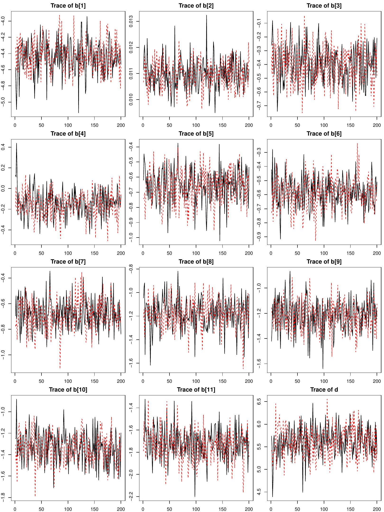
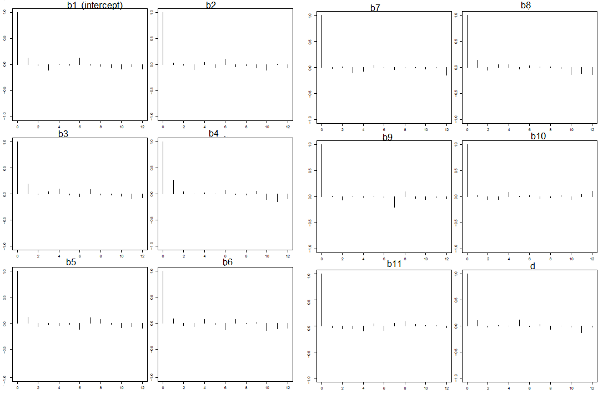
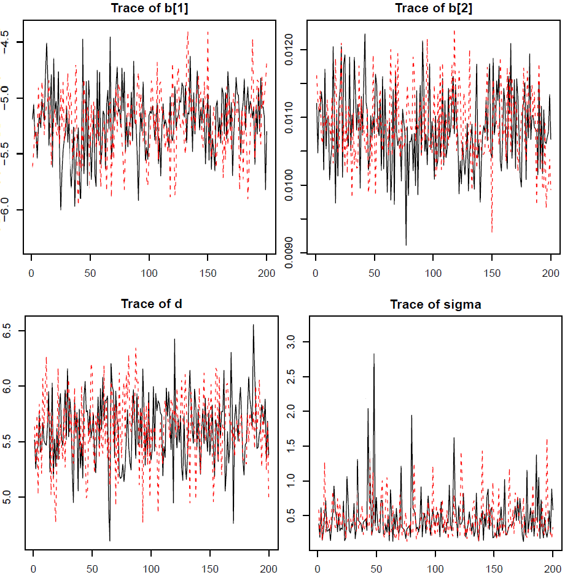
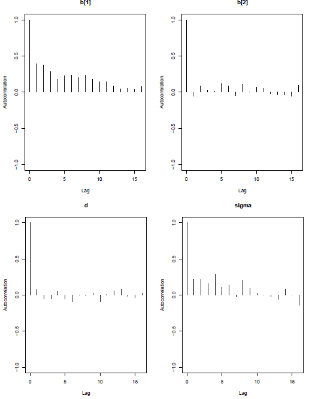
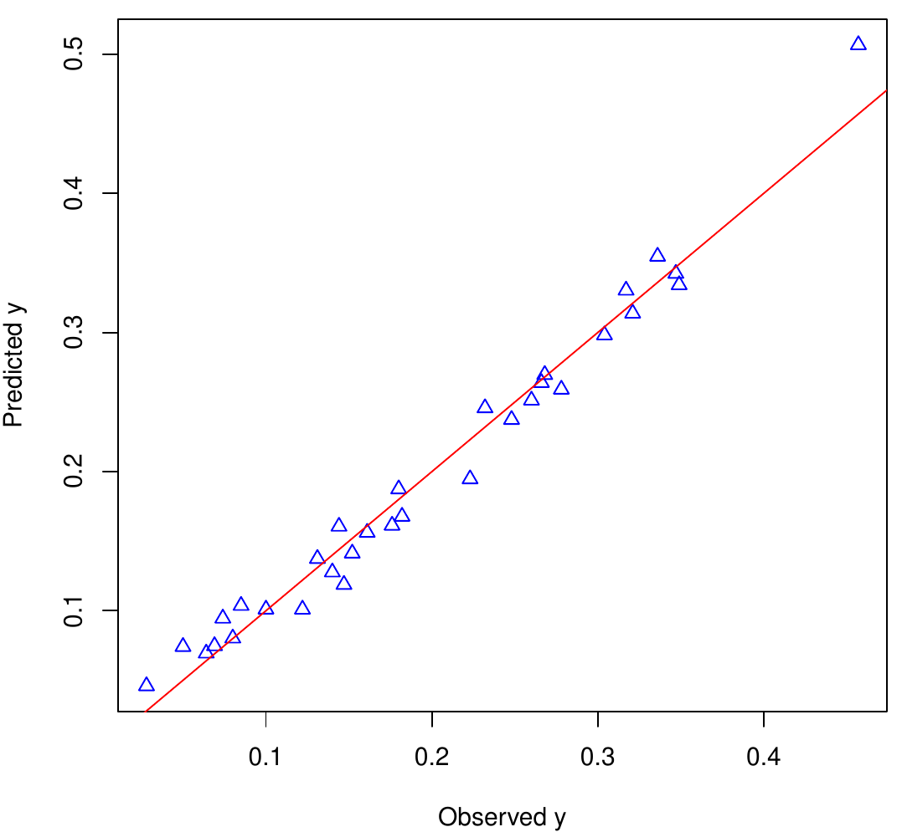
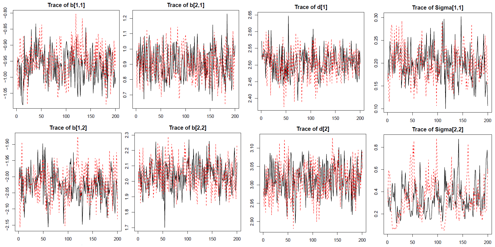
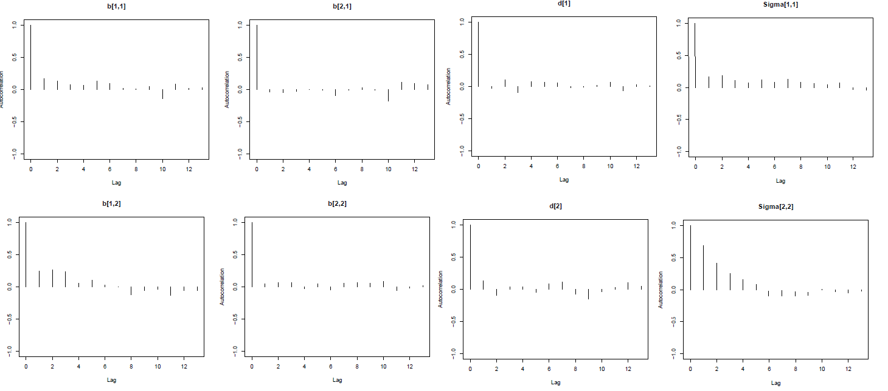
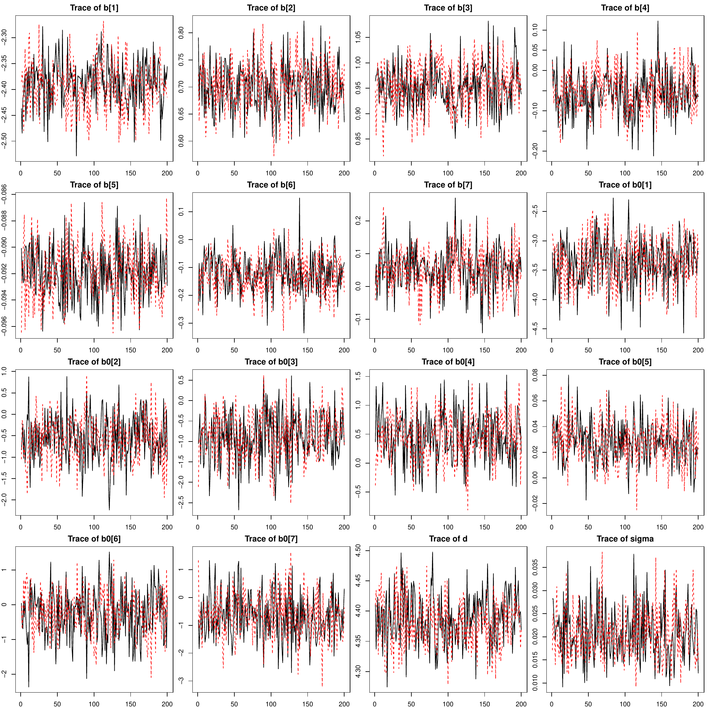
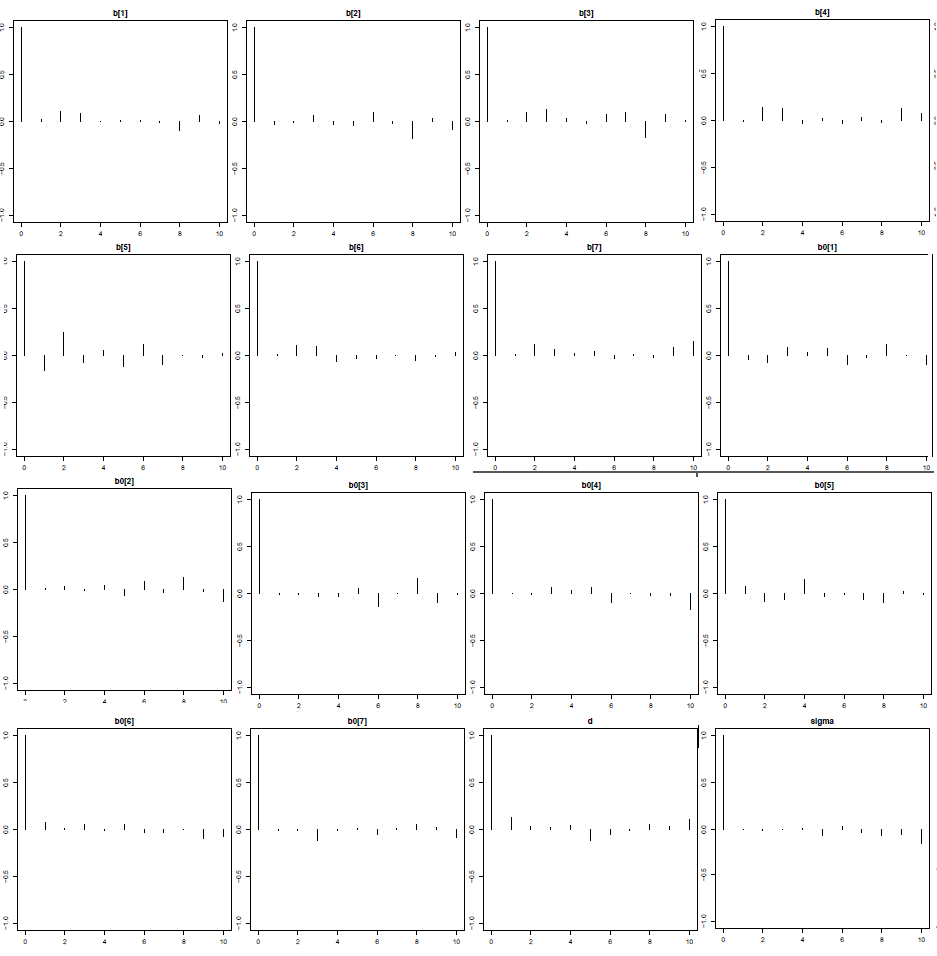

# Introduction {#sec:intro}

The beta distribution has two shape parameters $\alpha_1$ and
$\alpha_2$: $Beta(\alpha_1,\alpha_2)$. The mean and variance of a
variable $y$ that follows the beta distribution are
$E(y)=\mu= \alpha_1(\alpha_1+\alpha_2)^{-1}$ and
V$(y)=\mu(1-\mu)(\alpha_1+\alpha_2+1)^{-1}$, respectively. A broad
spectrum of distribution shapes can be generated by varying the two
shapes values of $\alpha_1$ and $\alpha_2$, as demonstrated in Figure
[1](#fig:beta). The beta regression has become more popular in recent
years in modeling data bounded within open interval $(0,1)$ such as
rates and proportions, and more generally, data bounded within $(a, b)$
as long as $a$ and $b$ are fixed and known and it is sensible to
transform the raw data onto the scale of $(0, 1)$ by shifting and
scaling, that is, $y'=(y-a)(b-a)^{-1}$.

{#fig:beta width="100%"
alt="graphic without alt text"}

Given the flexibility and increasing popularity of the beta regression,
significant development has been made in the theory, methodology, and
practical applications of the beta
regression([@phd; @politics; @williams; @prentice; @beta];
[@smithson; @simas; @smithson; @hatfield]; [@ospina; @cepeda]). Mostly
recently, @betareg2 apply the techniques of the model-based recursive
partitioning [@partition] and the finite mixture model [@hurdle] in the
framework of beta regression to account for heterogeneity between
groups/clusters of observations. They also propose bias-corrected or
bias-reduced estimation in the beta regression by applying the unifying
iteration technique [@bias].

In many cases of real life data, exact 0's and 1's occur in additional
to $y$ values between 0 and 1, producing zero-inflated, one-inflated, or
zero/one-inflated outcomes. Though the beta distribution covers a
variety of the distribution shape, it does not accommodate excessive
values at 0 and 1. @smithson propose transformation
$n^{-1}(y(n-1)+0.5)$, where $n$ is the sample size, so all data points
after transformation are bounded within 0 and 1 and the regular beta
regression can be applied. This approach, while offering a simple way to
circumvent the complexity from modeling the boundary values, only shifts
the excessiveness in point mass from one location to another. @hatfield
model the zero/one inflated VAS responses by relocating all 1 to 0.9995
and keep 0 as is, and apply the zero-inflated beta (ZIB) regression. The
approach of only shifting 1 but not 0 when there is inflation at both is
ad-hoc especially if there is no justification for treating 0
differently from 1. From a practical perspective, the observed 0's and
1's might carry practical meanings that would be otherwise lost if being
replacing with other values, regardless how close the raw and
substitutes values are. @ospina propose the zero-or-one inflated beta
regression model (inflation at either 0 or 1, but not both) and obtain
inferences via the maximum likelihood estimation (MLE). When there is
inflation at both 0 and 1, it is sensible to model the excessiveness
explicitly with the zero/one inflated beta (ZOIB) regression, especially
when population 0's and 1's are real. For example, if the response
variable is the death proportion of mice on different doses of a
chemical entity; the death rate caused by administration of the chemical
entity theoretically can be 0 when its dosage is 0, and 1 when the
dosage increases to a 100% lethal level. The ZOIB regression technique
has been previously discussed in the literature [@sas2012]. Most beta
regression and zoib models focus on fixed effects models only, and thus
cannot handle clustered or repeated measurements. @liu apply a joint
model with latent variables to model the dependency structure among
multiple $[0,1]$-bounded responses with repeated measures in the
Bayesian framework.

From a software perspective, beta regression can be implemented in a
software suite or package that accommodate nonlinear regression models,
such as SPSS (NLR and CNLR) and SAS (PROC NLIN, PROC NLMIXED). There are
also contributed packages or macros devoted specifically to beta
regression, such as the SAS macro developed by @sas2011, which
implements the beta regression directly and provides residuals plots for
model fit diagnostics. In R, there are a couple of packages targeted
specifically at beta regression.
[*betareg*](https://CRAN.R-project.org/package=betareg) [@betareg.pkg]
models a single response variable bounded within $(0, 1)$, with
fixed-effects linear predictors in the link functions for the mean and
precision parameter of the beta distribution [@betareg]. The package is
later updated by @betareg2 to perform bias correction/reduction,
model-based recursive partitioning, and finite mixture models with added
functions `betatree()` and `betamix()` in package *betareg*. In
*betareg*, the coefficients of the regression are estimated by the MLE
and inferences are based on large sample assumptions.
[*Bayesianbetareg*](https://CRAN.R-project.org/package=Bayesianbetareg)
[@bayesianbetareg] allows the joint modelling of mean and precision of a
single response in the Bayesian framework, as is proposed in @phd, with
logit link for the mean and logarithmic for the precision. Neither
*betareg* nor *Bayesianbetareg* accommodate inflation at 0 or 1
(*betareg* transforms $y$ with inflation at 0 and 1 using
$(y(n-1)+0.5)n^{-1}$); neither can model multiple response variables,
repeated measures, or clustered/correlated response variables. In other
words, the linear predictors in the link functions of the mean and
precision parameters of the beta distribution in both *betareg* and
*Bayesianbetareg* contain fixed effects only.

In this discussion, we introduce a new R package
[*zoib*](https://CRAN.R-project.org/package=zoib) [@zoib] that models
responses bounded within $[0, 1]$ -- without inflation at 0 nor 1, with
inflation at 0 only, at 1 only, or at both 0 and 1. The package can
model a single response with or without repeated measures, or multiple
or clustered $[0,1]$-bounded response variables, taking into account the
dependency among them. Compared to the existing packages on beta
regression in R, *zoib* is more comprehensive and flexible from the
modeling perspective and can accommodate more data types. The inferences
of the mdoel parameters in package *zoib* are obtained in the Bayesian
framework via the Markov Chain Monte Carlo (MCMC) approach as
implemented in JAGS [@jags].

The rest of the paper is organized as follows. Section [2](#sec:method)
describes the methodology underlying the ZOIB regression. Section
[3](#sec:R) introduces the package *zoib*, including its functionality
and outputs. Section [4](#sec:eg) illustrates the usage of the package
with 3 real-life data sets and 1 simulated data of different types. The
paper ends in Section [5](#sec:summary) with summaries and discussions.

# Zero/one inflated beta regression {#sec:method}

## The ZOIB model

Suppose $\mathbf{y}_j$ is the $j^{th}$ variable out of a total $p$
response variables measured on $n$ independent units, that is,
$\mathbf{y}_j=(y_{1j},\ldots,y_{nj})^t$. The zoib model assumes $y_{ij}$
follows a piecewise distribution when $y_{ij}$ has inflation at both 0
and 1.

$$\label{eq:zoib}  
f(y_{ij}|\eta_{ij}) =
\begin{cases}
p_{ij}            &if  y_{ij}=0\\
(1-p_{ij})q_{ij}    &if  y_{ij}=1\\
(1-p_{ij})(1-q_{ij})Beta(\alpha_{ij1},\alpha_{ij2}) & if  y_{ij} \in(0,1).\\
\end{cases}   (\#eq:zoib)$$

$p_{ij}$ is the probability of $y_{ij}=0$, and $q_{ij}$ is the
conditional probability $\Pr(y_{ij}=1 | y_{ij}\ne0)$, and $\alpha_{ij1}$
and $\alpha_{ij2}$ are the shape parameters of the beta distribution
when $y_{ij}\in(0,1)$. The probability parameters from the binomial
distributions and the two shape parameters from the beta distributions
are linked to observed explanatory variables $\mathbf{x}_{ij}$ or
unobserved latent variable $\mathbf{z}_{ij}$ via link functions. Some
natural choices for the link functions for $p_{ij}$, $q_{ij}$, and the
mean of the beta distribution
$\mu^{(0,1)}_{ij}=E(y_{ij}|y_{ij}\in(0,1))=\alpha_{ij1}(\alpha_{ij1}+\alpha_{ij2})^{-1}$,
which are all parameters within $(0, 1)$, include the logit function,
the probit function, or the complementary log-log (cloglog) function.
While the binomial distribution is described by a single probability
parameter, the beta distribution is characterized by two parameters. The
variance of the beta distribution is not only a function of its mean but
also the sum of two shape parameters
$\nu_{ij}= \alpha_{ij1}+\alpha_{ij2}$; that is,
V$(y_{ij}|y_{ij}\in(0,1))= \mu^{(0,1)}_{ij}(1-\mu^{(0,1)}_{ij})(\alpha_{ij1}+\alpha_{ij2}+1)^{-1} = \mu^{(0,1)}_{ij}(1-\mu^{(0,1)}_{ij})(\nu_{ij}+1)^{-1}$.
$\nu_{ij}$ is often referred to as the precision (dispersion) parameter
and can also be affected by external explanatory variables or latent
variables [@simas; @betareg]. An example of the formulation of the zoib
model, if the logit function is applied to $p_{ij}$, $q_{ij}$, and
$\mu^{(0,1)}_{ij}$, and the log link function is applied to $\nu_{ij}$,
is

$$\begin{aligned}
logit(\mu^{(0,1)}_{ij}) &=\mathbf{x}_{1,ij}\boldsymbol{\beta}_{1j}+\mathrm{I}_1(\mathbf{z}_{1,ij}\boldsymbol{\gamma}_{1,i}) \label{eq:link1} 
\end{aligned}   (\#eq:link1)$$

$$\begin{aligned}
\log(\nu_{ij})&=\mathbf{x}_{2,ij}\boldsymbol{\beta}_{2j}+ \mathrm{I}_2(\mathbf{z}_{2,ij}\boldsymbol{\gamma}_{2,i})\label{eq:link2} 
\end{aligned}   (\#eq:link2)$$

$$\begin{aligned}
logit(p_{ij}) &=\mathbf{x}_{3,ij}\boldsymbol{\beta}_{3j}+ \mathrm{I}_3( \mathbf{z}_{3,ij}\boldsymbol{\gamma}_{3,i})\label{eq:link3}  
\end{aligned}   (\#eq:link3)$$

$$\begin{aligned}
logit(q_{ij}) &=\mathbf{x}_{4,ij}\boldsymbol{\beta}_{4j}+ \mathrm{I}_4(\mathbf{z}_{4,ij}\boldsymbol{\gamma}_{4,i}),\label{eq:link4}   
\end{aligned}   (\#eq:link4)$$

where $\boldsymbol{\beta}_{m,j}$ represents the linear fixed effects in
link function $m$ ($m=1,2,3, 4$) for response $j$ ($j=1,\ldots,p$);
$\mathbf{x}_{m,ij}$ is the design matrix for the fixed effects;
$\mathrm{I}_m(\mathbf{z}_{m,ij}\boldsymbol{\gamma}_{m,i})$ is an
indicator function on whether link function $m$ has a random component
or not, that is,
$\mathrm{I}_m(\mathbf{z}_{m,ij}\boldsymbol{\gamma}_{m,i})=\mathbf{z}_{m,ij}\boldsymbol{\gamma}_{m,i}$
if link function has a random component,
$\mathrm{I}_m(\mathbf{z}_{m,ij}\boldsymbol{\gamma}_{m,I})=0$ otherwise.
$\mathbf{z}_{m,i}$ represents the design matrix associated with the
random components; Unless stated otherwise, we assume
$\boldsymbol{\gamma}_{m,i} \overset{\scriptsize{ind}}{\sim} N(\mathbf{0},\Sigma_m)$
for $i=1,\ldots,n$ in link function $m$ throughout this discussion. When
$p\ge2$, dependency among the $p$ response variables are modeled through
their sharing of $\boldsymbol{\gamma}_{m,i}$ for each $m$.

When there are no random/latent components in the linear predictors, the
mean of the beta distribution for $y_{ij}\in(0,1)$ is given by
$\exp(\mathbf{x}_{1,ij}\boldsymbol{\beta}_{1j})(1+\exp(\mathbf{x}_{1,ij}\boldsymbol{\beta}_{1j}))^{-1}$
while $\exp(\mathbf{x}_{2,ij}\boldsymbol{\beta}_{2j})$ is the sum of the
two shape parameters.
$\exp(\mathbf{x}_{3,ij}\boldsymbol{\beta}_{3j})(1+\exp(\mathbf{x}_{3,ij}\boldsymbol{\beta}_{3j}))^{-1}$
is Pr$(y_{ij}=0)$, and
$\exp(\mathbf{x}_{4,ij}\boldsymbol{\beta}_{4j})(1+\exp(\mathbf{x}_{4,ij}\boldsymbol{\beta}_{4j}))^{-1}$
is Pr$(y_{ij}=1|y_{ij}>0)$. The overall mean of $y_{ij}$ is thus given
by

$$\begin{aligned}
E(y_{ij})&=(1-p_{ij})\left(q_{ij}+ (1-q_{ij})\mu^{(0,1)}_{ij}\right) \\
&=\frac{\exp(\mathbf{x}_{1,ij}\boldsymbol{\beta}_{1j})(1+\exp(\mathbf{x}_{1,ij}\boldsymbol{\beta}_{1j}))^{-1}+\exp(\mathbf{x}_{4,ij}\boldsymbol{\beta}_{4j})}
{(1+\exp(\mathbf{x}_{3,ij}\boldsymbol{\beta}_{3j}))(1+\exp(\mathbf{x}_{4,ij}\boldsymbol{\beta}_{4j}))}
\end{aligned}$$

When there are random/latent components, then the conditional mean of
$y_{ij}$ given $\mathbf{z}_{m,i}$ is

$$\begin{aligned}
\label{eq:cond.mean}
&E(y_{ij}|\boldsymbol{\gamma}_{1,i},\boldsymbol{\gamma}_{2,i}, \boldsymbol{\gamma}_{3,i},\boldsymbol{\gamma}_{4,i})=(1-p_{ij})\left(q_{ij}+ (1-q_{ij})\mu^{(0,1)}_{ij}\right) \\ 
&=\frac{\exp\{\mathbf{x}_{1,ij}\boldsymbol{\beta}_{1j}+\mathrm{I}_1(\mathbf{z}_{1,ij}\boldsymbol{\gamma}_{1,i})\}
           (1+\exp\{\mathbf{x}_{1,ij}\boldsymbol{\beta}_{1j}+\mathrm{I}_1(\mathbf{z}_{1,ij}\boldsymbol{\gamma}_{1,i})\})^{-1}
+\exp\{\mathbf{x}_{4,ij}\boldsymbol{\beta}_{4j}\mathrm{I}_4(\mathbf{z}_{4,ij}\boldsymbol{\gamma}_{4,i})\}}
{(1+\exp\{\mathbf{x}_{3,ij}\boldsymbol{\beta}_{3j}+\mathrm{I}_1(\mathbf{z}_{3,ij}\boldsymbol{\gamma}_{3,i})\})
 (1+\exp\{\mathbf{x}_{4,ij}\boldsymbol{\beta}_{4j}+\mathrm{I}_2(\mathbf{z}_{4,ij}\boldsymbol{\gamma}_{4,i})\})}\notag
\end{aligned}   (\#eq:cond-mean)$$

Calculation of the marginal mean of $y_{ij}$ involves integrating out
$\boldsymbol{\gamma}_{m,i}$ over its distribution; that is,
$E(y_{ij})=\int E(y_{ij}|\boldsymbol{\gamma}_{1,i},\boldsymbol{\gamma}_{2,i},\boldsymbol{\gamma}_{3,i},\boldsymbol{\gamma}_{4,i}) f(\boldsymbol{\gamma}_{1,i}|\Sigma_1)f(\boldsymbol{\gamma}_{2,i}|\Sigma_2)f(\boldsymbol{\gamma}_{3,i}|\Sigma_3)f(\boldsymbol{\gamma}_{4,i}|\Sigma_4)d\boldsymbol{\gamma}_{i,1} d\boldsymbol{\gamma}_{2,i} d\boldsymbol{\gamma}_{3,i} d\boldsymbol{\gamma}_{4,i}$,
which can become computationally and analytically tractable if the MLE
approach is taken. In contrast, $E(y_{ij})$ is easier to obtain by the
Monte Carlo approach in the Bayesian computational framework.

Equations (\@ref(eq:link1)) to (\@ref(eq:link4)) give a full
parameterization of the ZOIB model. Various reduced forms of the fully
parameterized model as given in equations (\@ref(eq:link1)) to
(\@ref(eq:link4)) are available. For example, if a constant dispersion
parameter is assumed, then equation (\@ref(eq:link2)) can be simplified
$\log(\nu_{ij})=c_j$ that differs only by response variable. In
practice, it might also be reasonable to assume
$\mathbf{z}_{m,ij}\boldsymbol{\gamma}_{m,i}$ is the same across all
links functions, that is, $\Sigma_m=\Sigma$, since information to
distinguish among $\Sigma_m$'s is unlikely available in many real life
applications.

## Bayesian inference {#sec:Bayesian}

Though the inferences of the parameters in the proposed ZOIB model can
be obtained via the MLE approach, the task can be analytically and
computationally challenging, considering the nonlinear nature of the
model and existence of possible random effects. We adopt the Bayesian
inferential approach in package *zoib*. Let
$\Theta =\{\boldsymbol{\beta}_1,\boldsymbol{\beta}_2,\boldsymbol{\beta}_3,\boldsymbol{\beta}_4,\Sigma\}$
denote the set of the parameters from the ZOIB model (*zoib* sets
$\boldsymbol{\gamma}_{m,i}=\boldsymbol{\gamma}_i$ and
$\Sigma_m=\Sigma\; \forall\; m$). The joint posterior distribution of
$\Theta$ and the random effects $\boldsymbol{\gamma}$ given data
$\mathbf{y}$ is
$p(\Theta,\boldsymbol{\gamma}|\mathbf{y})\propto p(\mathbf{y}|\Theta,\boldsymbol{\gamma}) p(\boldsymbol{\gamma}|\Theta)p(\Theta)$.
The likelihood $p(\mathbf{y}|\Theta,\boldsymbol{\gamma})$ is constructed
from the ZOIB model in equation (\@ref(eq:zoib))
$$\begin{aligned}
p(\mathbf{y}|\Theta,\boldsymbol{\gamma})
&\propto\prod_{i}\prod_{j}\left\{ p_{ij}^{I(y_{ij}=0)}(1-p_{ij})^{I(y_{ij}>0)} q_{ij}^{I(y_{ij}=1)}\right\}\times\\
&\left\{(1-q_{ij})\frac{\Gamma(\nu_{ij})}{\Gamma(\nu_{ij}\mu^{(0,1)}_{ij})\Gamma(\nu_{ij}(1-\mu^{(0,1)}_{ij}))}
(y_{ij})^{\nu_{ij}\mu^{(0,1)}_{ij}-1}(1-y_{ij})^{\nu_{ij}(1-\mu^{(0,1)}_{ij})-1}\right\}^{ I(y_{ij}\in(0,1))},
\end{aligned}$$
noting $p_{ij},q_{ij}, \nu_{ij}$ and $\mu^{(0,1)}_{ij}$ are functions of
$\Theta$, and $p(\boldsymbol{\gamma}|\Theta)\sim N(0,\Sigma)$. *zoib*
assumes all the parameters in $\Theta$ are *a priori* independent, thus
$f(\Theta)=f(\Sigma)\prod_{j=1}^p\prod_{m=1}^4f(\boldsymbol{\beta}_{mj})$.
*zoib* offers the following prior choices on $\boldsymbol{\beta}_{m,j}$:

-   Diffuse normal (DN) on all intercept terms
    $\beta_{m,j0}\sim  N(0,C)$, where $C$ is the precision of the normal
    distribution that can be specified by users. The smaller $C$ is, the
    more "diffuse" the normal distribution is (the less *a priori*
    information there is about $\beta_{m,j0}$). The default $C=10^{-3}$.
-   For the rest of elements in $\boldsymbol{\beta}_{m,j}$ (minus the
    intercept term), there are 4 options:
    -   diffuse normal (DN, default):
        $\boldsymbol{\beta}_{m,jk}\overset{\scriptsize{ind}}{\sim} N(0, C)$
        across $k=1,\ldots,p_m$ for a given $j$ $(j=1,\ldots,q)$ and $m$
        $(m=1,\ldots,4)$. $C$ is the precision of the normal
        distribution that can be specified by users; the default
        $C=10^{-3}$.
    -   L2-prior (L2): The L2 prior shrinks the regression coefficients
        in the same link function $m$ on the same variable $y_j$ in a
        $L_2$ manner as in ridge regression[@L2]. The L2 prior helps
        when there is non-orthogonality among the covariates.
        $\boldsymbol{\beta}_{m,jk}|\lambda_{m,jk} \overset{\scriptsize{ind}}{\sim} N(0, \lambda_{m,j})$
        for $k=1,\ldots,p_m$ and the precision parameter
        $\lambda_{m,j} \overset{\scriptsize{ind}}{\sim} gamma(\alpha,\beta)$
        given $j$ and $m$. $\alpha$ and $\beta$, the shape and scale
        parameters of the gamma distribution, are small constants that
        can be specified by the user. The default is
        $\alpha=\beta =10^{-3}$ for all $m$ and $j$.
    -   L1-prior (L1): The L1 prior shrinks the regression coefficients
        in the same link function $m$ on the same variable $y_j$ in a
        $L_1$ manner[@L2] as in Lasso regression [@L1]. As such, the
        L1-prior helps there is a large of covariates and sparsity in
        the regression coefficients is desirable.
        $\boldsymbol{\beta}_{m,jk}|\lambda_{m,jk} \overset{\scriptsize{ind}}{\sim} N(0, \lambda_{m,jk})$
        and
        $\lambda_{m,jk}\overset{\scriptsize{ind}}{\sim} \exp(\epsilon_{m,j})$
        for $k=1,\ldots,p_m$ given $j$ and $m$. $\epsilon_{m,j}$ is a
        small constant that can be specified by users. The default
        $\epsilon_{m,j}=10^{-3}$ for all $m$ and $j$.
    -   automatic relevance determination (ARD): ARD, as the L2 and L1
        priors, regularizes the regression coefficients toward sparsity.
        Different from the L2 prior, where every coefficient has the
        same precision parameter $\lambda_{m,j}$, the precision is
        coefficient-specific in the ARD prior [@mackay; @neal]:
        $\boldsymbol{\beta}_{m,jk}|\lambda_{m,jk} \overset{\scriptsize{ind}}\sim N(0, \lambda_{m,jk})$
        and
        $\lambda_{m,jk}\overset{\scriptsize{ind}}{\sim} gamma(\alpha_{m,j},\beta_{m,j} )$
        for $k=1,\ldots,p_m$ given $j$ and $m$.
        $\alpha_{m,j},\beta_{m,j}$ are small constants that can be
        specified by users. The default
        $\alpha_{m,j}=\beta_{m,j} =10^{-3}$ for all $m$ and $j$.

Regarding the random effects specification in *zoib*, it is assumed
$z\sim N(0,\sigma^2)$ in the case of a single random variable $z$; when
there are multiple random variables $z_1, \ldots, z_L$, it is assumed
$\mathbf{z}\sim N(0,\Sigma)$. *zoib* offers two structures on $\Sigma$:
variance components (VC) and unstructured (UN).

-   In the VC case, $\Sigma$ is diagonal, indicating all the random
    variables are independent. *zoib* offers two priors on $\sigma_l$,
    the standard deviation of $z_l$ ($l=1,\ldots, L$): 1) $\sigma_l\sim$
    unif$(0,C)$, where $C$ is a large constant that can be specified by
    users (default $C= 20$); 2) $\sigma_l\sim$ half-Cauchy$(C)$, the
    half-$t$ distribution with degree freedom equal to 1. Symbolically,
    $f(\sigma_j)\propto \left(1+\sigma^2_jC^{-2}\right)^{-1}$, where $C$
    is the scale parameter [@gelman] (default $C= 20$). The half-Cauchy
    distribution is the default in *zoib*.
-   When $\Sigma$ is fully parameterized with $L(L+1)/2$ parameters (the
    UN structure), we write
    $\Sigma=Diag(\sigma_l)\cdot\mathbf{R}\cdot Diag(\sigma_j)$, where
    $\mathbf{R}$ is the correlation matrix . The priors for $\sigma_l$
    for $l=1,\ldots, L$ are the same as in the VC case. *zoib* supports
    $L$ up to 3 in the UN structure. When $L=2$, there is a single
    correlation parameter and a uniform prior is imposed
    $\rho\sim$unif$(0,1)$. When $L=3$, the uniform prior is imposed on
    two out of three correlation coefficients, say
    $\rho_{12}\sim$unif$(0,1)$ and $\rho_{12}\sim$unif$(0,1)$. In order
    to ensure positive definitiveness of $\mathbf{R}$, $\rho_{23}$ has
    to be bounded within $(L,U)$, where
    $L=\rho_{12}\rho_{13} - \sqrt{(1-\rho_{12}^2)(1-\rho_{13}^2)}$ and
    $U=\rho_{12}\rho_{13} + \sqrt{(1-\rho_{12}^2)(1-\rho_{13}^2)}$. The
    prior on $\rho_{13}$ is thus specified as unif$(L,U)$.

All taken together, *zoib* offers 4 options on the prior for the
covariance matrix $\Sigma$ in the case of more than one random
variables: `VC.unif, VC.halft, UN.unif`, and `UN.halft`.

# Implementation in R {#sec:R}

The joint distribution $f(\Theta,\boldsymbol{\gamma}|\mathbf{y})$ in the
zoib model is not available in closed form. We apply slice
sampling[@slice], a Markov chain Monte Carlo (MCMC) method, to draw
posterior samples on the parameters leveraging on the available software
JAGS [@jags]. Before using *zoib*, users need to download JAGS and the R
package *rjags* that offers a connection between R and JAGS. The main
function in *zoib* generates a JAGS model object, and the posterior
samples on the model parameters, the observed $y$ and their posterior
predictive values, and the design matrices
$\mathbf{x}_1,\mathbf{x}_2,\mathbf{x}_3$ and $\mathbf{x}_4$, as
applicable. Convergence diagnostics, mixing of the MCMC chains, summary
of the posterior draws, and the deviance information criterion (DIC)
[@dic] of the model can be calculated using the functions already
available in packages [*coda*](https://CRAN.R-project.org/package=coda)
[@plummer2006coda] and
[*rjags*](https://CRAN.R-project.org/package=rjags) [@plummer2014rjags].
Trace plots and auto-correlation plots can be generated, the
Gelman-Rubin's potential scale reduction factor (psrf) [@psrf] and
multivariate psrf [@mpsrf] can be computed. To check on the mixing and
convergence of the Markov chains, multiple independent Markov chains
should be run. More details on the output and functions of *zoib* are
provided in Section [3](#sec:R) below.

The package *zoib* contains 23 functions (Table [1](#tab:newfunction)).
Users can call the main function `zoib( )`, which produces a MCMC (JAGS)
model object and posterior samples of model parameters as an MCMC
object, among others. Convergence of the MCMC chains can be checked
using the `traceplot(MCMC.object)`, `autocorr.plot(MCMC.object)` and
`gelman.diag(MCMC.object)` functions provided by package *coda*.
Posterior summary of the parameters can be obtained by function
`summary( )` if the posterior draws are in a format of a `mcmc.list`.
The DIC of the proposed model can be calculated using function
`dic.samples(JAGS.object)` available in *rjags* for model comparison
purposes. Besides these existing functions, *zoib* provides an
additional function `check.psrf( )` that checks whether multivariate
psrf value can be calculated for multi-dimensional model parameters,
provides box plots and summary statistics on multiple univariate psrf
values, and the `paraplot( )` function which provides a visual display
on the posterior inferences on the model parameters. The remaining 20
functions are called internally by function `zoib( )`.

::: {#tab:newfunction}
  ----------------------------------------------------------------------------------------------------------------------------------
  Function                                 Description
  ---------------------------------------- -----------------------------------------------------------------------------------------
  Functions called by users                

  `zoib( )`                                main function; produces a MCMC (JAGS) model object and

                                           posterior samples of model parameters

  `check.psrf( )`                          checks whether the multivariate psrf value can be calculated for

                                           multi-dimensional parameters; provides a box plot and summary

                                           statistics for multiple univariate psrf values

  `paraplot( )`                            plots the posterior mode, mean, or median with Bayesian credible

                                           intervals for the parameters from a zoib model.

  Internal functions called by `zoib( )`   

                                           *fixed-effect model*

  `fixed( )`                               without $y$ inflation at 0 or 1

  `fixed0( )`                              with $y$ inflation at 0 only

  `fixed1( )`                              with $y$ inflation at 1 only

  `fixed01( )`                             with $y$ inflation at at both 0 and 1

                                           *joint modeling of $\ge2$ response variables when there is a single random variable*

  `join.1z( )`                             without $y$ inflation at 0 or 1

  `join.1z0( )`                            with $y$ inflation at 0 only

  `join.1z1( )`                            with $y$ inflation at 1 only

  `join.1z01( )`                           at both 0 and 1

                                           *joint modeling of $\ge2$ response variables when there are $\ge2$ random variables*

  `join.2z( )`                             without $y$ inflation at 0 or 1

  `join.2z0( )`                            with $y$ inflation at 0 only

  `join.2z1( )`                            with $y$ inflation at 1 only

  `join.2z01( )`                           with $y$ inflation at both 0 and 1

                                           *separate modeling of $\ge2$ response variables when there is a single random variable*

  `sep.1z( )`                              without $y$ inflation at 0 or 1

  `sep.1z0( )`                             with $y$ inflation at 0 only

  `sep.1z1( )`                             with $y$ inflation at 1 only

  `sep.1z01( )`                            at both 0 and 1. called by function `zoib( )`.

                                           *separate modeling of $\ge2$ response variables when there are $\ge2$ random variables*

  `sep.2z( )`                              without $y$ inflation at 0 or 1

  `sep.2z0( )`                             with $y$ inflation at 0

  `sep.2z1( )`                             with $y$ inflation at 1 only

  `sep.2z01( )`                            with $y$ inflation at both 0 and 1
  ----------------------------------------------------------------------------------------------------------------------------------

  : Table 1: Functions developed in package *zoib*.
:::

The main function `zoib( )` is used as follows:

``` r
zoib(model, data, zero.inflation = TRUE, one.inflation = TRUE, joint = TRUE, 
     random = 0, EUID, link.mu = "logit", link.x0 = "logit", link.x1 = "logit", 
     prior.beta = rep("DN",4), prec.int = 0.001, prec.DN = 0.001, 
     lambda.L2 = 0.001, lambda.L1 = 0.001, lambda.ARD = 0.001, 
     prior.Sigma = "VC.halft", scale.unif = 20, scale.halft = 20, 
     n.chain = 2, n.iter = 5000, n.burn=200 , n.thin = 2)
```

`data` represents the data set to be modeled. `model` presents a
symbolic description of the zoib model in the format of formula
`responses `$y$` `$\sim$` covariates `$x$. `zero.inflation` and
`one.inflation` contain the information on whether the data has
inflation at zero or one. `joint` specifies whether to model multiple
response variables jointly or separately. `random` = 0 indicates the
ZOIB model has no random effects; `random` = $m$ (for $m=1,2,3,4$)
instructs zoib which linear predictor(s) out of the four (as given in
equations (\@ref(eq:link1)) to (\@ref(eq:link4)) have a random
component. For example, if `random` = $13$, then the linear predictors
associated with the link function of the mean of the beta regression (1)
and the probability of zero inflation (3) have a random component, while
the linear predictors associated with the link function of the precision
parameters of (2) and the probability one inflation (4) do not have a
random component. Similarly, if `random` = $124$, then the linear
predictors associated with the mean (1) and precision parameters (2) of
the beta distribution, and the probability of one inflation (4) have a
random component, but the link function associated with the probability
of zero inflation (4) does not. `random` = 1234 would suggest all 4
linear predictors have random components. There are total $2^4-1=15$
possibilities to specify the random components and *zoib* supports all
15 possibilities.

The remaining arguments in function `zoib( )`are necessary for Bayesian
model formulation and computation, including the hyper-parameter
specification in the prior distributions of the parameters in the ZOIB
model
(`prior.beta, prec.int, prec.DN, lambda.L2, lambda.L1, lamdda.ARD, scale.unif,`
`scale.halft, prior.Sigma`), the number of Markov chains to run
(`n.chain`), the number of MCMC iterations per chain (`n.iter`), and the
burin-in period (`n.burn`) and thinning period (`n.thin`). In addition,
the link functions that relate linear predictors to $\Pr(y=0)$,
$\Pr(y=1)$, and $\mu^{(0,1)}$ can be chosen from `logit` (the default),
`probit`, and `cloglog`. The link function that links a linear predictor
to the sum of the two shape parameters of the beta distribution is the
log function.

Table [2](#tab:functions) lists the functions offered by packages *coda*
and *rjags* that can be used to check the convergence of the MCMC chains
from the ZOIB models, to compute the posterior summaries of the model
parameters, and to calculate the penalized deviance of the converged
models.

::: {#tab:functions}
  -----------------------------------------------------------------------------------------------
  Function             Description
  -------------------- --------------------------------------------------------------------------
  `traceplot( )`       plots number of iterations vs. drawn values for each parameter in

                       per Markov chain (from package *coda*)

  `autocorr.plot( )`   plots the autocorrelation for each parameter in each Markov chain

                       (from package *coda*)

  `gelman.diag( )`     calculates the potential scale reduction factor (psrf) value for each

                       variable drawn from at least two Markov chains, together with the

                       upper and lower 95% confidence limits. When there are multiple

                       variables, a multivariate psrf value is calculated (from package *coda*)

  `dic.samples( )`     extracts random samples of the penalized deviance from a jags

                       model (from package *rjags*)

  `summary( )`         calculates posterior mean, standard deviation, 50%, 2.5% and 97.5%

                       for each parameters using the posterior draws from Markov chains
  -----------------------------------------------------------------------------------------------

  : Table 2: Existing functions for checking the convergence and mixing
  of the Markov chain of the ZOIB model and summarizing the posterior
  samples.
:::

# Examples {#sec:eg}

We apply the package *zoib* to three examples. In the first example
*zoib* is applied to analyze the `GasolineYield` data available in R
package *betareg*, to provide a comparison between the results obtained
from the two packages. There is no inflation in either 0 or 1 in data
`GasolineYield`. In Example 2, *zoib* is applied to a simulated data
with two correlated beta variables, where joint modeling of the variable
is used with a single random variable. In Example 3, *zoib* is applied
to a real life data on alcohol use in California teenagers. Example 3 is
used to demonstrate how to model clustered beta variables via *zoib*.
The data set in Example 3 can be downloaded from website
<http://www.kidsdata.org>. In all three example, the ZOIB model is
specified using the generic function `formula` in R. When there are
multiple response variables, each variable should be separated by , such
as `y1y2y3` on the left hand side of the formula. On the right side of
the formula, it can take up to 5 parts in the following order:

1.  fixed-effect variables $\boldsymbol{x}_1$ in the link function of
    the mean of the beta distribution;

2.  fixed-effect variables $\boldsymbol{x}_2$ in the link function of
    the precision parameter of the beta distribution;

3.  fixed-effect variables $\boldsymbol{x}_3$ in the link function of
    Pr$(y=0)$;

4.  fixed-effect variables $\boldsymbol{x}_4$ in the link function of
    Pr$(y=1)$; and

5.  random-effects variables $\boldsymbol{z}$.

$\boldsymbol{x}_1$ and $\boldsymbol{x}_2$ should always be specified,
even if $\boldsymbol{x}_2$ contains only an intercept (represented by
`1`). If there is no zero inflation in any of the `y`'s, then the
$\boldsymbol{x}_3$ part can be omitted, similarly with
$\boldsymbol{x}_2$ and the random component $\boldsymbol{z}$. For
example, if there are 3 response variables `y1, y2, y3` and 2
independent variables (`xx1`, `xx2`), and none of the `y`'s has zero
inflation, then model `y1 | y2 | y3 `$\sim$` xx1 + xx2 | 1 | xx1 | xx2`
implies $\boldsymbol{x}_1$ = `(1, xx1, xx2)`, $\boldsymbol{x}_2$= `1`
(intercept), $\boldsymbol{x}_3$ = `NULL`, $\boldsymbol{x}_4$ =
`(1, xx1)`, $\boldsymbol{z}$ = `(1, xx2)`. If $\boldsymbol{y}_1$ has
inflation at zero, $\boldsymbol{y}_3$ has inflation at one, and there is
no random effect, model `y1 | y2 | y3 `$\sim$` xx1 + xx2 | xx1 | xx1`
implies $\boldsymbol{x}_1$ =`(1, xx1, xx2)`, $\boldsymbol{x}_2$ =
`(1 ,xx1)`, $\boldsymbol{x}_3$ = `c(1, xx1)` for `y1`,
$\boldsymbol{x}_4$ = `(1, xx1)` for `y3`. The details on how to specify
the model using `formula` can be found in the user manual of package
*zoib*.

## Example 1: univariate fixed-effect beta regression {#sec:eg1}

According to the description in *betareg*, the `GasolineYield` data was
collected by @gas and analyzed by @atkinson. The data set contains 32
observations and 6 variables. The dependent variable is the proportion
of crude oil after distillation and fractionation. There is no 0 or 1
inflation in $y$. *betareg* fits a beta regression model with all 32
observations and 2 independent variables: batch ID ($1,\ldots, 10$)
corresponding to 10 different crudes that were subjected to
experimentally controlled distillation conditions, and temp
(quantitative, Fahrenheit temperature at at which all gasoline has
vaporized). Both batch and temp are treated as fixed effects.
$$\begin{aligned}
logit\left(\frac{\alpha_1}{\alpha_1+\alpha_2}\right)
& = \beta_0+ \beta_1\cdot temp + \beta_2\cdot batch1 +... +\beta_{10}\cdot batch9, \\
\log(\alpha_1+\alpha_2) 
&=\eta.
\end{aligned}$$
The R command for fitting the model using *betareg* is

``` r
library(zoib)
library(betareg)
data("GasolineYield", package = "zoib")
GasolineYield$batch <- as.factor(GasolineYield$batch)

#### betareg
gy  <- betareg(yield ~ temp + batch, data = GasolineYield)
summary(gy)$coeff
```

Fitting the same model in *zoib*, we have

``` r
#### zoib: fixed effect on batch.
d <- GasolineYield
eg1.fixed <- 
    zoib(yield ~ temp + as.factor(batch)| 1, data = GasolineYield, joint = FALSE,
         random = 0, EUID = 1:nrow(d), zero.inflation = FALSE, 
         one.inflation = FALSE, n.iter = 1050, n.thin = 5, n.burn = 50)
sample1 <- eg.fixed$coeff
# check  convergence of the MCMC chains
traceplot(sample1); autocorr.plot(sample2); gelman.diag(sample1)
```

The procedure took about 25 seconds on a PC with Intel Core-i5 2520M CPU
2.5GHz (2 chains, 1050 iterations, burin-in periods = 5, and thinning
period = 5 per chain). The trace plots, the autocorrelation plots, and
the values of the potential scale reduction factors (psrf)
[@psrf; @mpsrf] suggest the Markov chains mixed well and reached
satisfactory convergence (Appendix Figure [3](#fig:1traceacf) and Table
[5](#tab:1psrf)).

If the 10 batches constitute a random sample of many possible batches
and the mean of each batch is of little interest, we can treat batch as
a random variable rather than dummying code batch. The following model
is a mixed-effects model with a random component in the link function of
the mean of the beta distribution.

``` r
#### zoib: random effect on batch
eg1.random <- zoib(yield ~ temp | 1 | 1, data = GasolineYield, joint = FALSE,
                   random = 1, EUID = GasolineYield$batch, zero.inflation = FALSE,
                   one.inflation = FALSE, n.iter = 10200, n.thin = 50, n.burn = 200)
sample2 <- eg1.random$oripara
summary(sample2); traceplot(sample2); autocorr.plot(sample2); gelman.diag(sample2)
```

The above procedure took about 42 seconds on a PC with Intel Core-i5
2520M CPU 2.5GHz (2 chains, 10200 iterations, burin-in periods = 50, and
thinning period = 50 per chain). The trace plots, the auto-correlation
plots, and the psrf values suggest that the Markov chains mixed well and
converged (Appendix Figure [4](#fig:1Rtraceacf) and Table
[5](#tab:1psrf)).

The inferential results on the parameters from all three analyses
(betareg, zoib-fixed, zoib-random) are depicted in Figure [2](#fig:eg1),
which is generated using the `paraplot` function.

``` r
### posterior inferences from zoib: fixed
summ1 <- summary(sample1); summ1 <- cbind(summ1$stat[, 1], summ1$quant[, c(1, 5)])
### posterior inferences from zoib: random
summ2 <- summary(sample2); summ2 <- cbind(summ2$stat[, 1], summ2$quant[, c(1, 5)])
summ2<- summ2[-4, ]
### inferences from betareg
summ3 <- cbind(c(summ3$mean[, 1], summ3$precision[, 1]), confint(gy))
summ3[12,] <- log(summ3[12, ]) # log-precision
### plot
names <- rownames(summ3); names[1] <- "intercept"; names[12] <- "log(precision)"
rownames(summ1) <- names; rownames(summ3) <- names
rownames(summ2) <- names[c(1, 2, 12)]
paraplot(summ1, summ2, summ3, legpos = c(2, 10), annotate = TRUE,
         legtext = c("zoib: fixed", "zoib: random", "betareg"))
```

Figure [2](#fig:eg1) suggests minimal difference between the Bayesian
and the frequentist approaches in the inferences of the intercept and
regression coefficients in the fixed-effects model. The posterior mean
of $\eta$ (log sum of the two shape parameters in the beta distribution)
is numerically smaller from the Bayesian approach compared to the MLE of
the frequentist approach. The mixed-effects approach yields similar
estimates on $\eta$ and the regression coefficients as in the fixed
effect approaches, but the point estimate on the intercept is smaller.
Appendix Figure [5](#fig:1pred) also presents the posterior mean of $y$
plotted against the observed $y$ for the two zoib models, and suggests
both zoib models provide satisfactory goodness-of-fit.

{#fig:eg1 width="100%"
alt="graphic without alt text"}

## Example 2: bivariate repeated measures {#sec:eg3}

Example 2 demonstrates how to jointly model multiple $[0,1]$-bounded
response variables using *zoib*. The data set contains two beta
variables $(\mathbf{y}_{i1},\mathbf{y}_{i2})$ from 200 independent cases
$(i=1,...,200)$. Both $\mathbf{y}_{i1}$ and $\mathbf{y}_{i2}$ are
repeatedly measured at a set of covariate values
$\mathbf{x}=(0.1, 0.2, 0.3, 0.4, 0.5, 0.6)$. That is,
$\mathbf{y}_{i1}=(y_{i11}, y_{i12},\ldots,y_{i16})$, and
$\mathbf{y}_{i2}=(y_{i21}, y_{i22},\ldots,y_{i26})$. `BiRepeated` is a
simulated data set from the following model,

$$\begin{aligned}
\label{eq:eg2}  
logit\left(\frac{\alpha_{ijk,1}}{\alpha_{ijk,1}+\alpha_{ijk,2}}\right) & =(\beta_{0j}+u_{i1})+ (\beta_{1j}+u_{i2})x_{ijk}\notag\\
\log(\alpha_{ijk,1}+\alpha_{ijk,2}) &=\eta_j, and\\
\mathbf{u}_i =(u_{i1},u_{i2})\sim N_{(2)} (0, \Sigma), &where\Sigma=Diag(\boldsymbol{\sigma})\;\mathbf{R}\;Diag(\boldsymbol{\sigma}) \notag
\end{aligned}   (\#eq:eg2)$$

where $i=1,\ldots,200$ and $k=1,\ldots,6$,
$\beta_{01}=-1, \beta_{11}=1,\beta_{02}=-2, \beta_{12}=2, \rho=0$, and
$\boldsymbol{\sigma}^2=(\sigma_1^2,\sigma_2^2)=(0.2,0.2)$. $\sigma_1$
and $\sigma_2$ are the marginal standard deviation of the two random
variables $u_{i1}$ and $u_{i2}$, and
$\mathbf{R}= \left(\begin{smallmatrix} 1& \rho \\ \rho & 1 \end{smallmatrix}\right)$
is the correlation matrix. The data is available in R by name
`BiRepeated` in package *zoib*. The joint model as given in equation
(\@ref(eq:eg2)) is applied to the data. The priors for the model
parameters are
$\beta_{0j} \sim N(0,10^{-3}), \beta_{1j} \sim N(0,10^{-3}), \eta_j \sim N(0,10^{-3}),\sigma_j \sim unif(0,20)$,
and $\rho \sim unif(-1,1)$. The R codes for realizing the above model
are

``` r
library(zoib)
data("BiRepeated", package = "zoib")
eg2 <- zoib(y1|y2 ~ x|1|x, data = BiRepeated,  random = 1, EUID = BiRepeated$id,
            zero.inflation = FALSE, one.inflation = FALSE, prior.Sigma = "UN.unif",				
            n.iter = 7000, n.thin = 25, n.burn = 2000)
post.sample <- eg2$oripara; summary(post.sample)
```

The above procedure took about 3 hours 55 minutes on a Linux server with
2.4 GHz AMD Opteron processors (2 chains, 7000 iterations, burin-in
periods is 2000, and thinning period is 25 per chain). The trace plots,
the auto-correlation plots, and the psrf values suggest that the Markov
chains mixed well and converged (Appendix Figures [6](#fig:2traceacf)
and Table [6](#tab:2psrf)).

The Bayesian inferences on $\beta_{0j}, \beta_{1j}$ and $\eta_j$ for
$j=1,2$ are given in Table [3](#tab:eg3). Note the purpose of Example 2
is to demonstrate how *zoib* can model the correlated data; so only one
simulated data set is used. The posterior means of $\boldsymbol{\beta}$
and $\eta_j$ are nevertheless close to the true parameter values used to
the simulate the data, even with the finite not-so-large sample size
($n=200$).

::: {#tab:eg3}
  -----------------------------------------------------------------------------------
       Parameter   posterior mean   posterior median   2.5% quantile   97.5% quantile
  -------------- ---------------- ------------------ --------------- ----------------
    $\beta_{01}$         $-0.957$           $-0.958$        $-1.059$         $-0.866$

    $\beta_{11}$            0.906              0.903           0.720            1.092

    $\beta_{02}$         $-2.022$           $-2.020$        $-2.119$         $-1.935$

    $\beta_{12}$            2.040              2.040           1.865            2.234

        $\eta_1$            2.505              2.506           2.433            2.582

        $\eta_2$            3.014              3.017           2.926            3.091

    $\sigma_1^2$            0.180              0.179           0.135            0.235

    $\sigma_2^2$            0.334              0.331           0.152            0.530

          $\rho$          $-0.70$            $-0.70$         $-0.84$          $-0.62$
  -----------------------------------------------------------------------------------

  : Table 3: Bayesian inferences of the joint ZOIB model parameters in
  Example 2.
:::

## Example 3: clustered zero-inflated beta regression {#sec:eg4}

In this example, *zoib* is applied to the county-level monthly alcohol
use data collected from students in California from year 2008 to 2010.
The data is available in *zoib* by name `AlcoholUse`. The data can be
downloaded at <http://www.kidsdata.org>. `AlcoholUse` contains the
percentage of public school students in grades 7, 9, and 11 reporting
the number of days in which they drank alcohol in the past 30 days by
gender (students at the "Non-Traditional\" grade level refer to those
enrolled in Community Day Schools or Continuation Education and are not
included in this analysis). The following model is fitted to the data
$$\begin{aligned}
logit\left(\frac{\alpha_{ij,1}}{\alpha_{ij,1}+\alpha_{ij,2}}\right)  &=  (\beta_{1,0}+u_i)+ \boldsymbol{\beta}_1\mathbf{x}_{ij}\\
 \log(\alpha_{ij,1}+\alpha_{ij,2}) &=\eta\\
 logit(p_{ij})& = \beta_{2,0}+ \boldsymbol{\beta}_2\mathbf{x}_ij\\
u_i &\sim  N(0, \sigma^{-2})
\end{aligned}$$
where $u_i$ is the cluster-level (county-level) random variable
($i=1,\ldots,56$) and $j$ indexes the $j^{th}$ case in cluster $i$.
$\boldsymbol{\beta}_{1,1}$ contains the regression coefficients
associated with the main effects associated with gender, grade, and the
mid-point of each days bucket on which teenagers drank alcohol, and the
interaction between gender and grade; so does
$\boldsymbol{\beta}_{2,1}$. $\sigma^{-2}$ is the precision of the
distribution of random effect $u_i$. The prior specification of the
model parameters are: $\beta_{1,0} \sim N(0,10^{-3})$,
$\beta_{2,0} \sim N(0,10^{-3})$,
$\boldsymbol{\beta}_{1,k} \overset{\scriptsize{ind}}{\sim} N(0,10^{-3})$
and
$\boldsymbol{\beta}_{2,k} \overset{\scriptsize{ind}}{\sim} N(0,10^{-3})$
for $k=1,\ldots,6$, $\eta \sim N(0,10^{-3})$, and
$\sigma\sim unif(0, 20)$. The R codes for realizing the model in *zoib*
are

``` r
data("AlcoholUse", package = "zoib")
AlcoholUse$Grade <- as.factor(AlcoholUse$Grade)
eg3 <- zoib(Percentage ~ Grade * Gender + MedDays|1|Grade * Gender + MedDays|1,
            data = AlcoholUse, random = 1, EUID = AlcoholUse$County,
            zero.inflation = TRUE,  one.inflation = FALSE, joint = FALSE,
            n.iter = 5000, n.thin = 20, n.burn = 1000)
sample1 <- eg3$coeff
summary(sample1)
```

The above procedure took about 10 hours 56 minutes on a Linux server
with 2.4 GHz AMD Opteron processors (2 chains, 5000 iterations, burin-in
periods is 1000, and thinning period is 20 per chain). The trace plots,
the auto-correlation plots, and the psrf values suggest that the Markov
chains mixed well and reached satisfactory convergence (Appendix Figures
[8](#fig:3traceacf) and Table [7](#tab:3psrf)).

The results from Example 3 are presented in Table [4](#tab:eg4). The
posterior mean difference in the logit(mean) of the beta distribution
between a 9-th grader and a 7-th grader is 0.702 ($\beta_{1,1}$),
assuming they are of the same gender, and fall in the same Days Bucket.
Similarly, the posterior mean difference in logit(mean) of the beta
distribution between a male and a female students is -0.0503
($\beta_{1,3}$), assuming they are equal with regard to other
covariates. The posterior mean difference logit($\Pr(y=0)$ between a a
9-th grader and a 7-th grader is $\beta_{2,1}=-0.563$; in other words,
the ratio in the odds of not drinking alcohol between the a 7-th grader
and a 9-th grader is $\exp(0.563)=1.75$. The other parameters in
$\boldsymbol{\beta}_1$ and $\boldsymbol{\beta}_2$ can be interpreted in
a similar manner. The posterior mean of the log(sum of the two shape
parameters) $\eta$ in the beta distribution is $4.389$, and the
posterior mean of the variance of the random effect $u_i$ is 0.021.

::: {#tab:eg4}
  -------------------------------------------------------------------------------------------
  Effect               Parameter             mean     median   2.5% quantile   97.5% quantile
  -------------------- --------------- ---------- ---------- --------------- ----------------
  Intercept            $\beta_{1,0}$     $-2.392$   $-2.392$        $-2.484$         $-2.299$

  Grade 9              $\beta_{1,1}$        0.702      0.702           0.609            0.791

  Grade 11             $\beta_{1,2}$        0.955      0.956           0.869            1.036

  Gender M             $\beta_{1,3}$     $-0.053$   $-0.052$        $-0.156$            0.054

  MedDays              $\beta_{1,4}$     $-0.092$   $-0.092$        $-0.096$         $-0.088$

  Grade 9\*Gender M    $\beta_{1,5}$     $-0.123$   $-0.118$        $-0.255$            0.003

  Grade 11\*Gender M   $\beta_{1,6}$        0.053      0.055          -0.087            0.193

  intercept            $\beta_{2,0}$     $-3.365$   $-3.332$        $-4.158$         $-2.635$

  Grade 9              $\beta_{2,1}$     $-0.563$   $-0.572$        $-1.648$            0.427

  Grade 11             $\beta_{2,2}$     $-0.874$   $-0.884$        $-2.027$            0.181

  Gender M             $\beta_{2,3}$        0.465      0.469          -0.382            1.329

  MedDays              $\beta_{2,4}$        0.028      0.028          -0.003            0.062

  Grade 9\*Gender M    $\beta_{2,5}$     $-0.246$   $-0.213$        $-1.628$            0.999

  Grade 11\*Gender M   $\beta_{2,6}$     $-0.664$   $-0.695$        $-2.117$            1.015

                       $\eta$               4.384      4.385           4.302            4.463

                       $\sigma^2$           0.021      0.020           0.011            0.034
  -------------------------------------------------------------------------------------------

  : Table 4: Posterior inferences (Example 3).
:::

# Discussion {#sec:summary}

We have introduced an R package for obtaining the Bayesian inferences
from the beta regression and zero/one inflated beta regression. We have
provided the methodological background behind the package and
demonstrated how to apply the package using both real-life and simulated
data. *zoib* is more versatile and comprehensive from a modeling
perspective compared to other R packages *betareg* and *Bayesainbetareg*
on beta regression. First, *zoib* accommodates boundary inflation at 0
or 1. Second, it models clustered and correlated beta variables by
introducing random components into the linear predictors of the link
functions, and users can specify which linear predictors have a random
component. Last but not least, the Bayesian inferential approach
provides a convenient way for obtaining inferences for parameters that
can be computationally expensive in the frequentist approach, such as
the marginal means of response variables when there are random effects.
For the regression coefficients in a linear predictor, 4 different
priors are offered with options for penalized regression if needed. DIC
criteria can be calculated using existing function from package *rjags*
for model comparison purposes. Future updates to the *zoib* package
include the development of more efficient computational algorithms to
shorten the computational time in running the MCMC chains, especially
when a zoib model contains a relatively large number of parameters.

# Acknowledgements

The authors would like to thank two anonymous reviewers for their
valuable comments and suggestions that have greatly improve the quality
of the manuscript.

# Appendices

<figure id="fig:1traceacf">

<p>(a) trace plot</p>

<p>(b) auto-correlation plot</p>
<figcaption>Figure 3: Trace and auto-correlation plots in the zoib-fixed
model in Example 1.</figcaption>
</figure>

<figure id="fig:1Rtraceacf">

<p>(a) trace plot</p>

<p>(b) auto-correlation plot</p>
<figcaption>Figure 4: Trace and auto-correlation plots in the
zoib-random model in Example 1.</figcaption>
</figure>

::: {#tab:1psrf}
  -----------------------------------------------------------------------------------------------
                                zoib-fixed                       zoib-random  
  ---------------------------- ------------ ------------------- ------------- -------------------
  2-5 Parameter                   point      upper bound (95%)      point      upper bound (95%)

  $\beta_{1,0}$ (intercept)       0.997            0.998            1.036            1.037

  $\beta_{1,1}$                   1.001            1.002                      

  $\beta_{1,2}$                   1.008            1.008                      

  $\beta_{1,3}$                   1.013            1.040                      

  $\beta_{1,4}$                   0.998            1.006                      

  $\beta_{1,5}$                   1.005            1.007                      

  $\beta_{1,6}$                   1.000            1.014                      

  $\beta_{1,7}$                   0.999            1.004                      

  $\beta_{1,8}$                   1.003            1.033                      

  $\beta_{1,9}$                   1.001            1.015                      

  $\beta_{1,10}$                  1.007            1.048            1.003            1.017

  $\beta_{20}$ (temperature)      1.018            1.032            1.002            1.006

  $\sigma^2$                                                        0.997            0.997
  -----------------------------------------------------------------------------------------------

  : Table 5: Potential scale reduction factors of the zoib model
  parameters in Example 1.
:::

<figure id="fig:1pred">

<p>(a) zoib-fixed</p>

<p>(b) zoib-random</p>
<figcaption>Figure 5: Posterior mean of <span
class="math inline"><em>Y</em></span> vs. observed <span
class="math inline"><em>Y</em></span> in Example 1.</figcaption>
</figure>

<figure id="fig:2traceacf">

<p>(a) trace plot</p>

<p>(b)auto-correlation plot</p>
<figcaption>Figure 6: Example 1, zoib-fixed.</figcaption>
</figure>

::: {#tab:2psrf}
  --------------- ------- -------------
  Parameter        point   upper bound

                              (95%)

  $\beta_{0,1}$    1.083      1.332

  $\beta_{1,1}$    1.004      1.035

  $\beta_{0,2}$    1.163      1.582

  $\beta_{1,2}$    1.008      1.100

  $\sigma^2_1$     0.997      0.997

  $\sigma^2_2$     1.036      1.165
  --------------- ------- -------------

  : Table 6: Potential scale reduction factors in Example 2.
:::

{#fig:2pred width="100%" alt="graphic without alt text"}

<figure id="fig:3traceacf">

<p>(a) trace plot</p>

<p>(b) auto-correlation plot</p>
<figcaption>Figure 8: Trace and auto-correlation plots in the zoib-fixed
model in Example 1.</figcaption>
</figure>

::: {#tab:3psrf}
  -----------------------------------------------------------------------------
  Parameter      $\beta_{1,0}$   $\beta_{1,1}$   $\beta_{1,2}$   $\beta_{1,3}$
  ------------- --------------- --------------- --------------- ---------------
  point              1.018           1.005           1.000           0.997

  upper limit        1.092           1.042           1.015           0.999

  (95% CI )                                                     

  parameter      $\beta_{1,4}$   $\beta_{1,5}$   $\beta_{1,6}$      $\eta$

  point              0.997           1.006           0.997           1.068

  upper limit        1.000           1.047           0.998           1.279

  (95% CI )                                                     

  parameter      $\beta_{2,0}$   $\beta_{2,1}$   $\beta_{2,2}$   $\beta_{2,3}$

  point              0.998           1.001           0.998           0.998

  upper limit        1.000           1.001           0.999           1.004

  (95% CI )                                                     

  parameter      $\beta_{2,4}$   $\beta_{2,5}$   $\beta_{2,6}$    $\sigma^2$

  point              0.996           1.012           0.996           1.001

  upper limit        0.997           1.012           0.999           1.020

  (95% CI )                                                     
  -----------------------------------------------------------------------------

  : Table 7: Potential scale reduction factors in Example 3.
:::

{#fig:3pred width="100%" alt="graphic without alt text"}

