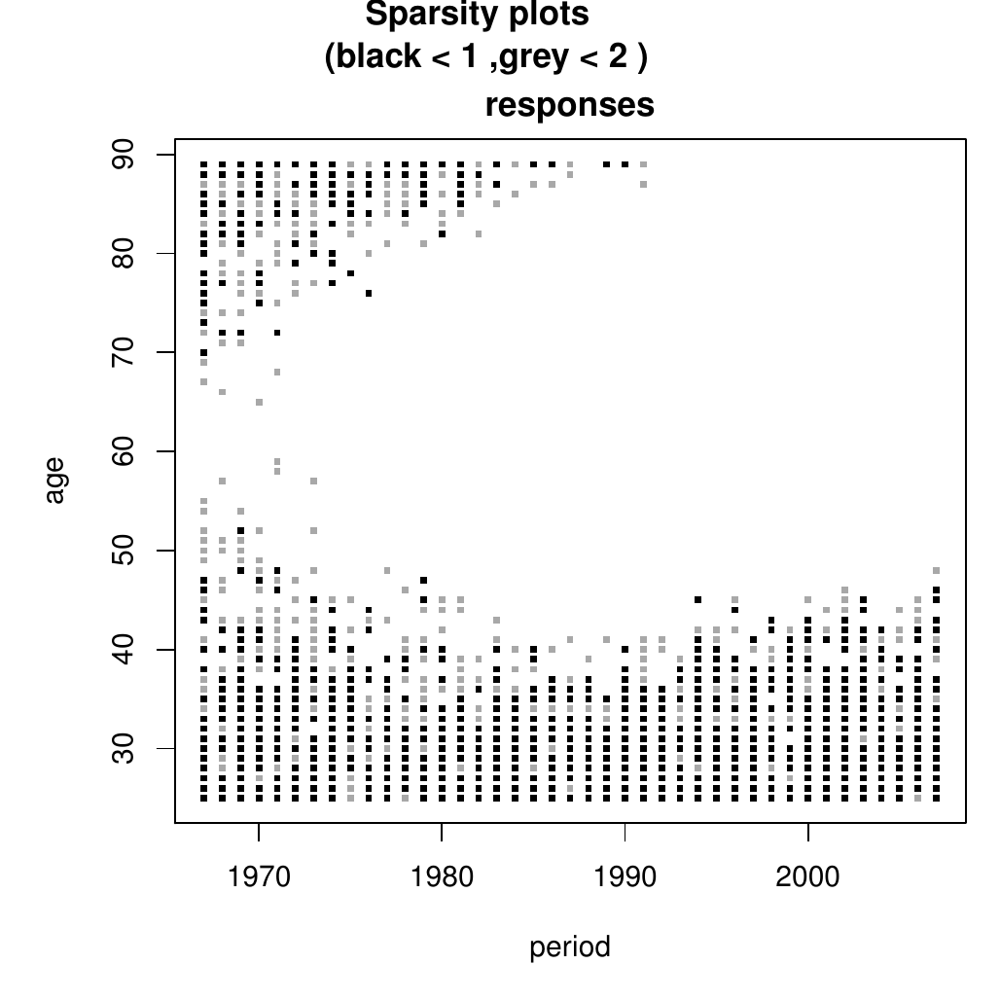

::: article
# Introduction

Age-period-cohort models are extensively used in actuarial sciences,
demography, epidemiology and social sciences. They have an
identification problem in that the predictor is defined from time
effects for age, period and cohort, but these time effects cannot be
fully recovered from the predictor. The
[*apc*](https://CRAN.R-project.org/package=apc) package, see
@Nielsen_apc, implements the solution proposed by
@KuangNielsenNielsen2008a and @Nielsen2014deviance, which is to abandon
the time effects and reparametrise the predictor in terms of freely
varying parameters. The vector of freely varying parameters is of a
lower dimension than the vector of the original time effects. These
freely varying parameters describe the variation of the likelihood
function fully. The intention with the package is to focus on the
aspects of the time effect that are identified by the likelihood.

The age-period-cohort model has three time scales: $age$, $period$ and
$cohort$. These are linked through the identity $age+cohort=period$. The
package is concerned with the situation where two of the time scales are
measured in discrete and equidistant time. The third time scale can then
be computed through $age+cohort=period$. The choice of these two indices
vary from application to application. For instance, the example in this
paper is a an age-period array of annual counts of mesothelioma deaths
by age group. The interface of the package is constructed in such a way
that the user does not need to keep track of the coordinate system.
Internally, the package uses an age-cohort coordinate system to exploit
that period is a symmetric function of age and cohort.

The statistical model is a generalized linear model with a predictor of
the form

$$\label{eq:modelapc}
    \mu_{age,cohort} = \alpha_{age} + \beta_{period} + \gamma_{cohort} + \delta
    .  (\#eq:modelapc)  $$

The likelihood is a function of the predictor $\mu_{age,cohort}$. In
turn, the predictor is constructed from time effects for age,
$\alpha_{age}$, period, $\beta_{period}$, and cohort, $\gamma_{cohort}$.
If only we could estimate the time effects, we could learn about the
predictor through manipulations of the time effects. This would be done
by treating these as time series: plot them, fit time series models to
them, perhaps forecast future values, and finally combine them to get
the predictor. However, the time effects are not fully identifiable from
the predictor so this approach has to be pursued with some care.

The identification problem is that linear trends can be moved between
the time effects without changing the predictor. Indeed, the predictor
in (\@ref(eq:modelapc)) satisfies

$$\begin{gathered}
\label{eq:id_problem} 
    \mu_{age,cohort} = (\alpha_{age} + a + d\times age) + (\beta_{period} + b -d \times period)\\
    + (\gamma_{cohort} + c+d\times cohort) + (\delta -a-b-c)
    ,
\end{gathered}  (\#eq:id-problem)  $$

for any choice of $a$, $b$, $c$ and $d$. In other words, knowledge of
the predictor from the likelihood is not enough to pin down the time
effects. The problem is discussed, for instance, by @Carstensen2007,
@ClaytonSchifflers1987a [@ClaytonSchifflers1987b], @Holford1985,
@KuangNielsenNielsen2008a, @Luo2013, @NielsenNielsen2014, @OBrien2011,
and @YangLand2013. There appears to be two types of solutions to the
problem: either to introduce four constraints to the time effects or to
abandon the time effects and seek a parsimonious and freely varying
parametrisation of the predictor. The *apc* package follows the latter
approach. With the former approach, the constraints must come from some
external argument as the likelihood carries no information in this
respect. An example is the 'intrinsic estimator', which is based on a
particular choice of a generalized matrix inverse, see @YangLand2013.
The constraints need to be tracked carefully through the analysis to
clearify which inferences are driven by data and which inferences are
driven by the constraints; see @NielsenNielsen2014 for an algebraic
analysis both for frequentist and Bayesian settings.

The *apc* package addresses the identification through the parsimonious
parametrization of the predictor suggested by @KuangNielsenNielsen2008a,
see also @Nielsen2014deviance. This exploits the fact that the second
differences of the time effects are identified and that the predictor
itself is also identifiable. As an example, the age second difference is
$\Delta^2\alpha_{age}=\Delta\alpha_{age}-\Delta\alpha_{age-1}
    ,$ where the first differences are
$\Delta\alpha_{age}=\alpha_{age}-\alpha_{age-1}$. The second differences
are identifiable from the predictor through

$$\label{eq:DDa}
    \Delta^2\alpha_{age}
    =\mu_{age,cohort}
    -\mu_{age-1,cohort+1}
    -\mu_{age-1,cohort}
    +\mu_{age-2,cohort+1}
    .  (\#eq:DDa)  $$

The double differences are well-known to be identifiable in the
age-period-cohort model (\@ref(eq:modelapc)), see for instance
@ClaytonSchifflers1987b. @MartinezMirandaNielsenNielsen2015 give a
log-odds interpretation of the double differences. If the double
differences are all zero, or equivalently, all time effects are linear
then the model reduces to a linear plane. That linear plane is
parametrised by the any three elements of the predictor,
$\mu_{age,cohort},
        \mu_{age^\dagger ,cohort^\dagger },
        \mu_{age^\ddagger,cohort^\ddagger}$ say, for which the
coordinates form a triangle rather than a line. Accordingly,
@KuangNielsenNielsen2008a suggest to use

$$\label{xi}
    \xi = (
        \mu_{age,cohort},
        \mu_{age^\dagger ,cohort^\dagger },
        \mu_{age^\ddagger,cohort^\ddagger},
    \dots , \Delta^2\alpha_{age}    , 
    \dots , \Delta^2\beta _{period} , 
    \dots , \Delta^2\gamma_{cohort} ,
    \dots
    )'  (\#eq:xi)  $$

A dimension reduction of 4 is achieved, since double differencing
reduces each set of time effects by two elements. The parameter is
invariant to the identification problem (\@ref(eq:id-problem)) due to
(\@ref(eq:DDa)). To be of any use it has to be shown how the predictor
can be formed from the parsimonious parameter. Double summation of
double differences of the time effects results in the original time
effects up to a linear trend. Thus, for the user of the package it is
sufficient to know that predictor can be found from the parsimonious
parameter through a formula of the form

$$\label{eq:muxi}
    \mu_{age,cohort}
    =
    \textit{a linear plane}+\underset{age   }{\sum\sum}\Delta^2\alpha_s +\underset{period}{\sum\sum}\Delta^2\beta _s +\underset{cohort}{\sum\sum}\Delta^2\gamma_s .  (\#eq:muxi)  $$

The formula that is actually used internally in the package is shown in
(\@ref(eq:muxigen)). In that parametrisation the linear plane is a
function exclusively of $\mu_{age,cohort},
        \mu_{age^\dagger ,cohort^\dagger },
        \mu_{age^\ddagger,cohort^\ddagger}$ so that linear plane
parameters and double differences are separated. The formula that is
used in default plots uses detrended versions of the double sums of
double differences, see (\@ref(eq:muxidet)). This allows the user to
focus on deviations from linearity. The parsimonious predictor is
identified since it can be shown that different values
$\xi^\dagger\ne\xi^\ddagger$ imply different predictors
$\mu^\dagger\ne\mu^\ddagger$, see @KuangNielsenNielsen2008a. In the
context of an exponential family $\xi$ is therefore the canonical
parameter and the family is regular.

An existing package, [*Epi*](https://CRAN.R-project.org/package=Epi),
for age-period-cohort analysis is created by @Epi. It is based on
@Carstensen2007. It has a series of functions for demographic and
epidemiological analysis as well as some functions for age-period-cohort
analysis. There are several differences between the packages *apc* and
*Epi*. First, *apc* uses the canonical parametrization of
@KuangNielsenNielsen2008a, whereas *Epi* does not. Second, *apc*, at
present, is concerned with age-period-cohort data in various matrix
formats. These have to be vectorized before fitting the generalized
linear model, but this is done internally, so that the user only has to
consider the original matrix format, while *Epi* takes data in
vectorized form and uses the data frame format. Third, at present, *apc*
cannot handle the problem of over-lapping cohorts: the people of age 25
in April 2015 will have been born either in 1989 or in 1990. Conversely
those born in 1990 will either be 24 or 25 in April 2015. When data on
all three time scales are available, cells can be sub-divided into two
Lexis triangles with non-overlapping cohorts. *Epi* has functions for
exploiting such information.

The main contributions of the *apc* are therefore

1.  to consider data in matrix format indexed in a number of different
    ways;

2.  to provide specification graphics illustrating the quality of the
    fit;

3.  to estimate the model parametrised in terms of the canonical
    parameter $\xi$ in (\@ref(eq:xi));

4.  to visualize the components of the representation of the predictor
    $\mu$ in (\@ref(eq:muxi)) as time series;

5.  and to do this from a range of sub-models where some of the
    components of $\xi$ or, correspondingly, of the time effects, are
    set to zero.

The remainder of the paper will illustrate this. It is envisaged to
extend the package with further time series tools in the future. For
reference, a theory of forecasting in the age-period-cohort model is
given in @KuangNielsenNielsen2008b and used in for instance
@MartinezMirandaNielsenNielsen2015.

# The *apc* package

The *apc* package includes functions for organizing the data,
descriptive plots, a deviance table, estimation of (sub-models of) the
age-period-cohort model, a plot for specification testing, plots of
estimated parameters, and sub-sample analysis. These are described in
turn.

The example for this analysis is a data set for annual mesothelioma
deaths in the UK taken from @MartinezMirandaNielsenNielsen2015. It is
thought that most mesothelioma deaths are caused by exposure to
asbestos. The data set has counts of male deaths by age 25--89 and by
1967--2007. There is no direct measure for the exposure to asbestos.

## Organizing the data

Age-period-cohort data may include doses and responses or just
responses. They come in different types of data arrays. *apc* allows
eight matrix formats arising from the choice of two indices from the
age, period, and cohort time scales, a triangular format for
chain-ladder analysis, as well as a generalized trapezoid format
encompassing the other options, see (\@ref(eq:I)). A special data format
`apc.data.list` is used to keep track of the data format and the time
scales. An artificial response-only data set organized in age-period
format can be coded as follows

``` r
> library(apc)
> m.data <- matrix(data = seq(12), nrow = 3, ncol = 4)
> data.artificial <- apc.data.list(m.data, "AP", age1 = 25, per1 = 1990, unit = 5)
> data.artificial$response
     [,1] [,2] [,3] [,4]
[1,]    1    4    7   10
[2,]    2    5    8   11
[3,]    3    6    9   12 
```

The value returned to the variable `data.artificial` from
`apc.data.list` is a list with ten elements. The list includes the
response, `m.data`; a dose which is set to NULL in this example; the
data format `"AP"`; and information about the real time scales. This is
all based on the arguments of the function `apc.data.list`. The first
argument defines the response data, while the second argument signifies
that the response matrix is rectangular with coordinates in age-period
format. The remaining arguments are optional. In this case information
about the times scales have been given. This shows that the real time
scales are $25,30,35$ for age and $1990,1995,2000,2005$ for period,
which in turn implies that the cohorts are $1955, 1960,\cdots ,1980$. At
this point `data.artificial$response` simply stores the input matrix. We
can think of it as varying in a simple age-period coordinate system.
From a practical viewpoint this is not particularly helpful. Therefore
*apc* will exploit the optional information on the real time scales when
reporting estimators in the subsequent analysis.

A variety of data from the literature are pre-coded including the
asbestos data from @MartinezMirandaNielsenNielsen2015. The available
information for that data set is exactly as in the previous example: a
data matrix for responses in period-age format, though much larger,
along with information about the time scales. It can be called through

``` r
> data.asbestos <- data.asbestos()
```

{#figsums width="100%" alt="graphic without alt text"}

## Descriptive plots

The *apc* package has a variety of plots for descriptive analysis. These
include plots of sums of the data by age, period, or cohort to get an
idea of the aggregate development; plots of the data matrix against two
of the three time indices to spot patterns in the data; and sparsity
plots indicating if some entries in the data matrix are very small. For
instance, there are very few mesothelioma deaths for young people. These
plots can be called and manipulated individually or they can be called
with a single command, for example:

``` r
> apc.plot.data.all(data.asbestos)
```

Figure [1](#figsums) shows the plots of data sums. The responses are
seen to be sparse for young people and for old and recent cohorts. The
sparsity plot in Figure [2](#figsparsity) illustrates this in more
detail. It shows with black and grey entries in the data matrix with
zero or one. The data are very sparse for young age groups and for old
cohorts.

{#figsparsity width="70.0%" alt="graphic without alt text"}

## Deviance analysis

At this point the distribution is chosen. Currently four distributions
are implemented: A Poisson response model, a Poisson dose-response
model, a logistic dose-response model, and a Gaussian model giving least
squares regression. The sampling theory for the two Poisson models is
described in @MartinezMirandaNielsenNielsen2015 and
@Nielsen2014deviance, respectively.

The age-period-cohort model has a variety of interesting sub-models.
These arise by setting some of the coordinates of the canonical
parameter $\xi$ to zero. @Nielsen2014deviance gives a detailed
discussion of the interpretation of the sub-models. An age-cohort model
`"AC"` arises by setting the period double-differences to zero, so
$\Delta^2\beta_j=0$ for $j=1,\dots ,J$. The drift models of
@ClaytonSchifflers1987a [@ClaytonSchifflers1987b] arise by setting two
sets of double-differences to zero. An age-drift model `"Ad"` arises by
setting the double differences $\Delta^2\beta _j$ and $\Delta^2\gamma_k$
to zero. Thus, it is a sub-model of `"AC"`. An age model code\"A\"
arises by by setting $\Delta^2\beta _j$ , $\Delta^2\gamma_k$, and the
cohort slope to zero. Thus, it is a sub-model of `"Ad"`. A trend model
`"t"` is the linear plane where all double differences
$\Delta^2\alpha_i$, $\Delta^2\beta _j$ and $\Delta^2\gamma_k$ are set to
zero. Thus, it is a sub-model of `"Ad"`, but not nested in `"A"` as it
has a cohort slope. An age trend model arises by setting all double
differences $\Delta^2\alpha_i$, $\Delta^2\beta _j$ and
$\Delta^2\gamma_k$ as well as the cohort slope to zero. Thus it is a
sub-model of both `"t"` and `"Ad"`. Finally, an intercept model is
denoted `"1"`. A deviance table gives an overview of the relative
performance of the different models. For the mesothelioma data we get
the following output.

``` r
> apc.fit.table(data.asbestos, "poisson.response")
       -2logL df.residual prob(>chi_sq) LR.vs.APC df.vs.APC prob(>chi_sq)      aic
APC  2384.923        2457         0.848        NA        NA            NA 10805.81
AP   5336.034        2560         0.000  2951.111       103         0.000 13550.92
AC   2441.728        2496         0.778    56.805        39         0.033 10784.61
PC   8265.746        2520         0.000  5880.823        63         0.000 16560.63
Ad   5912.422        2599         0.000  3527.499       142         0.000 14049.31
Pd  23461.384        2623         0.000 21076.461       166         0.000 31550.27
Cd   8494.658        2559         0.000  6109.735       102         0.000 16711.54
A   21948.036        2600         0.000 19563.113       143         0.000 30082.92
P   34391.044        2624         0.000 32006.121       167         0.000 42477.93
C   28415.983        2560         0.000 26031.060       103         0.000 36630.87
t   24037.772        2662         0.000 21652.849       205         0.000 32048.66
tA  40073.386        2663         0.000 37688.463       206         0.000 48082.27
tP  34967.432        2663         0.000 32582.509       206         0.000 42976.32
tC  50558.531        2663         0.000 48173.607       206         0.000 58567.42
1   51003.046        2664         0.000 48618.123       207         0.000 59009.93
```

The first column in the table has the heading `-2logL`, noting that the
deviance for Poisson and logistic models can be interpreted as minus
twice the log likelihood for the model normalized to be zero in the
saturated model. The deviance table indicates that the reduction worth
considering is an age-cohort model, which is denoted `"AC"`. Moreover,
the likelihood value and $p$-value for the `"APC"` model indicate that
the quality of the unrestricted model is quite good, with a deviance
smaller than the degrees of freedom.

## Estimation of a particular model

We can look a bit closer at a particular sub-model. For instance, in the
case of the asbestos data the unrestricted age-period-cohort model is
estimated as follows. The estimation in *apc* is based on the
representation (\@ref(eq:muxigen)). Along with the estimates we get
standard errors, which are discussed below. The canonical parameter has
208 parameters, so only the first $8$ estimates are reported here.

``` r
> fit.apc<- apc.fit.model(data.asbestos, "poisson.response", "APC")
> fit.apc$coefficients.canonical[1:8, ]
                 Estimate Std. Error      z value     Pr(>|z|)
level         1.041126756         NA           NA           NA
age slope     0.379386996  0.1115535  3.400941274 0.0006715425
cohort slope  0.358297074  0.1125026  3.184789061 0.0014485956
DD_age_27     1.029446394  1.6467618  0.625133761 0.5318832712
DD_age_28     0.065309039  1.4311381  0.045634337 0.9636017004
DD_age_29    -1.097279478  1.1180554 -0.981417831 0.3263867366
DD_age_30     0.414467808  1.1902557  0.348217448 0.7276768856
DD_age_31     0.003217972  1.2247555  0.002627441 0.9979036081
```

Note that the names for the parameters utilize the information about the
real time scales coded through `apc.data.list()`.

For this data set exposure or dose is not available. We therefore apply
the multinomial sampling scheme used in
@MartinezMirandaNielsenNielsen2015. With this approach we condition on
the overall level of the data. The asymptotic distribution
approximations will therefore be good in a situation where the dimension
of the data is fixed and the total number of responses is large. Thus,
in this response model we do not get standard errors for the level.

The level and the age and period slope define the linear plane that
would arise if all double differences were set to zero. The
interpretation derives from the general representation
(\@ref(eq:muxigen)). The level is the estimate of the predictor
$\mu_{57,1967,1910}$, which is the predictor of the middle age group for
the lowest period. The slopes have more interesting interpretations. The
age (cohort) slope shows how much the predictor changes when increasing
age (cohort) by one, while keeping cohort (age) fixed. Thus, the age and
cohort slopes estimate

$$\label{eq:slopes}
    \mu_{58,1968,1910}-\mu_{57,1967,1910}
    ,
    \qquad
    \mu_{57,1968,1911}-\mu_{57,1967,1910}
    ,  (\#eq:slopes)  $$

where any cell could be taken as a reference point. While the level and
slopes have an explicit interpretation it is perhaps easier to interpret
them in terms of a plot. Plots of the estimates are discussed below.
While the package parametrises the linear plane in terms of the age and
cohort slopes other choices could be made, such as age and period
slopes. The age and cohort slopes are chosen due to the age and cohort
symmetry of the model.

{#figpt width="92.0%" alt="graphic without alt text"}

## A probability transform plot for the fit

The quality of the fit can be illustrated using a probability transform
plot. Using the estimates it plots probability transforms of responses
given the fitted value. In other words: are the actual observations
probable given the estimated model? The plot is given in the original
coordinate system. Colours and symbols are used to indicate whether
responses are central to the fitted distribution or in the tails of the
fitted distribution. The intention of the plot is to reveal if there are
particularly many extreme observations given the fit and if they form a
particular pattern.

For the asbestos data the probability transform plot is coded as:

``` r
> apc.plot.fit.pt(fit.apc)
```

Figure [3](#figpt) shows the result. For instance, all red point
triangles indicates observations in the extreme 1 % of the distribution.
Those pointing down indicate the lower end of the distribution. The
number of red triangles is not particular large given the number of
observations, $n=2665$, but, they form a pattern among the most recent
cohorts. Therefore, a sub-sample analysis is performed below.

{#figfitSS
width="100%" alt="graphic without alt text"}

## Plots of the estimates

The estimates can be plotted using a single command. This command will
automatically pick up information about which sub-model and adjust
accordingly, based on the analysis in @Nielsen2014deviance. There are
two types of plots, which are illustrated using a sequence of three
plots. Details follow.

1.  Figure [4](#figfitSS). Plot of type `"sum.sum"`. This is illustrates
    the canonical parameter and the representation (\@ref(eq:muxigen)),
    but it is possibly the less useful choice in practical work.

2.  Figure [5](#figfit). Plot of type `"detrend"`. This is illustrates
    the representation (\@ref(eq:muxidet)). It is the default choice.

3.  Figure [6](#figfitsub). Plot of type `"detrend"` for a sub-sample.
    The above plots appear very messy, in part because of the sparsity.
    This evidence leads to a sub-sample, for which the estimates look
    much cleaner.

#### Plot of type `"sum.sum"`.

Figure [4](#figfitSS) is generated by:

``` r
> apc.plot.fit(fit.apc, type = "sum.sum")
```

It shows the canonical parameter estimates and illustrates the
representation (\@ref(eq:muxigen)).

Figure [4](#figfitSS) (a)--(c) shows the estimated second difference
parameters $\Delta^2\alpha_i$, $\Delta^2\beta _j$, $\Delta^2\gamma_k$.
The estimates are plotted with pointwise confidence bands centered
around zero. The age double differences are noisy for young ages while
the cohort double differences are noisy for young and old cohorts. This
is due to the sparsity of observations for those age and cohort groups
as shown in Figure [2](#figsparsity). This calls for a sub-sample
analysis, which is described below.

The next row of panels in Figure [4](#figfitSS) illustrates the
estimated level and the slopes (\@ref(eq:slopes)). Panel (e) shows the
estimated level of $1.04$. No confidence bands are shown due to the
multinomial sampling scheme. Panels (d), (f) show the age and cohort
slopes anchored at age $57$ and cohort $1910$ as discussed above.

Figure [4](#figfitSS)(g)--(i) shows double sums of double difference
based on the representation (\@ref(eq:muxigen)). In each plot two values
of the double sums are set to zero. In other words, the degrees of
freedom, that is the number of non-zero values, in these plots are
exactly the same as for the double differences. For exact values of the
double sums see the last section of the paper.

The sum of the information in Figure [4](#figfitSS)(d)--(i) gives the
linear predictor of the model. That, is for someone born in 1920 and
dying at age 70 in 1990, the predictor is the sum of the linear age
trend in (d) evaluated at 70, the level in (e), the linear cohort trend
in (f) evaluated at 1920, the age effect in (g) evaluated at 70, the
period effect in (h) evaluated at 1990, and the cohort effect in (i)
evaluated at 1920.

The plots have a messy appearance. There are several reasons. First,
double sums of double differences are only identified up to arbitrary
linear trends. It can be difficult to abstract from that arbitrary
linear trend with these plots. In particular the period effect in (h)
has a strong linear trend. It is hard to discern what the variation
around that linear trend could be. We address this in the sub-sample
analysis in connection with Figure [5](#figfit). Second, the data are
sparse for young age groups and for young and old cohorts. This shows up
in panels (a),(c),(g),(i). We address this in the sub-sample analysis in
connection with Figure [6](#figfitsub).

{#figfit width="100%" alt="graphic without alt text"}

#### Plot of type `"detrend"`.

Figure [5](#figfit) is generated by:

``` r
> apc.plot.fit(fit.apc)
```

This plot illustrates the detrended representation (\@ref(eq:muxidet)).
Figure [5](#figfit)(a)--(c) show exactly the same double differences as
before.

The level, slopes and double sums in Figure [5](#figfit)(d)--(i) are now
changed. The idea is to give a good visual impression of variation over
and above a linear trend while preserving the degrees of freedom in
panels (a)--(c). In this way Figure [5](#figfit)(g)--(i) show double
sums of double differences detrended so as to start and end in zero. The
level and slopes in Figure [5](#figfit)(d)--(f) are then changed
according to representation (\@ref(eq:muxidet)). The interpretation is
as before: The linear predictor for someone born in 1920 and dying at
age 70 in 1990 is the sum of the linear age trend in (d) evaluated at
70, the level in (e), the linear cohort trend in (f) evaluated at 1920,
the detrended age effect in (g) evaluated at 70, the detrended period
effect in (h) evaluated at 1990, and the detrended cohort effect in (i)
evaluated at 1920.

There are several noteworthy features of the detrended plots. The
detrended double sums in Figure [5](#figfit)(g)--(i) fill the plot area
better than those in Figure [4](#figfitSS)(g)--(i). Visually, it is
easier to abstract from the arbitrary linear trend and focus on
deviation from the linear trend. A possible drawback of the detrended
plot is that age-period-cohort models can have perfect fit in some
corners of the data array. For an age-period array, the very first and
last cohort double differences will therefore be based on one data entry
each. When looking at the detrended double sums those double differences
are, however, combined with double sums of all the other double
differences which are better determined.

The detrended age double sums in Figure [5](#figfit)(g) are broadly
similar to those in Figure [4](#figfitSS)(g) apart from a lift in the
scale and a slight change of slope. The plot indicates a near concave
deviation from linearity after age 35. The development over the range
25-35 could be driven by the sparsity of the data in that region. We
return to this point in the sub-sample analysis.

The detrended period double sums in Figure [5](#figfit)(h) have a very
different appearance from those in Figure [4](#figfitSS)(h). The
appearance is now seen to be a ragged concave shape. The first period
stands out. Abstracting from that, the plot looks very linear. We return
to this point in the sub-sample analysis.

The detrended cohort double sums in Figure [5](#figfit)(h) are just as
messed up in appearance as those in Figure [4](#figfitSS)(h). The
confidence bands have dropped off the plot and a warning is given.
Again, the sub-sample analysis will address this point.

{#figfitsub width="100%" alt="graphic without alt text"}

#### Plot of type `"detrend" for a sub-sample`.

Figure [6](#figfitsub) shows the result of a sub-sample analysis.

The asbestos data is sparse for low ages and for old and young cohorts.
A recursive analysis can be used to check how sensitive the above
analysis is in this respect. The idea is to cut parts of observations
away and redo the analysis. This can be done through the command:

``` r
> data.asbestos.subset <- apc.data.list.subset(data.asbestos, 10, 0, 0, 0, 3, 16)
```

which cuts the lower 10 age groups, the lower 3 cohort groups and the
upper 16 groups. The subset of the data is no longer a rectangle in the
period-age coordinate system, but rather a rectangle with some corners
cut off. This is a generalized trapezoid, see (\@ref(eq:I)) for details.
The above analysis can now be redone. The deviance table, which is not
reported, gives approximately the same information as before, with only
weak support for the `"AC"` sub-model $(p=4\%)$.

Prompted by the jump in the period effect in Figure [5](#figfit)(h) we
can go one step further and drop the data for the first period, 1967. It
is possible that the data collection scheme was slightly different the
first year. This is also consistent with @TanWarranDarntonHodgson2010.
We achieve this with only a small modification of the previous code

``` r
> data.asbestos.subset <- apc.data.list.subset(data.asbestos, 10, 0, 1, 0, 3, 16)
> fit.apc.subset <- apc.fit.model(data.asbestos, "poisson.response", "APC")
> apc.plot.fit(fit.apc.subset)
```

The deviance table, which is not reported, now gives stronger support
for the `"AC"` sub-model $(p=12\%)$.

Figure [6](#figfitsub) shows plots of the estimates. The difference
relative to Figure [5](#figfit) is that the noise from the youngest age
groups, the first period group and the youngest and oldest cohorts group
has been eliminated. Remarkably, the estimates for the remaining age,
period and cohort groups are very similar. This is most clear in the
plot of $\Delta^2\beta$ in panels (b) of
Figure [5](#figfit),[6](#figfitsub), which are nearly identical. The
plots of $\Delta^2\alpha$ and $\Delta^2\gamma$ in panels (a), (c) are
also very similar, although this is masked by the difference in scales.
For a good empirical model the predictors for the sub-sample should be
the same in the full sample and in the sub-sample. Since the double
differences are identifiable from the predictors, the same should apply
to them.

The double sums of double differences in panels (g)--(i) and the
consequent level and linear slopes in (d)--(f) are changed. They depend
on the normalisation, which depends on the choice of sample. For the
sub-sample, we now see a concave shape in the double sums for age and
cohort. Since the sums are pinned down to be zero at both ends this is
very visible. This is quite common in cancer studies.
@Nielsen2014deviance argues that this is consistent with double
differences that increase from a negative value and sub log linear age
effects.

It is worth noting that the sub-sample analysis is used in two ways
here. First, it is used to trim off noise from sparse parts of the data
set. Secondly, it is used to show that estimates do not depend very much
on the choice of data array. @MartinezMirandaNielsenNielsen2015 are
concerned with forecasting future mortality and use the sub-sample
analysis to show that forecasts are robust to the choice of data array.
However, at present forecast methods are not implemented in *apc*. For
an identification theory of forecasting see @KuangNielsenNielsen2008b.
Recursive sub-sample graphs are very common in time series econometrics,
see @HendryNielsen2007 [§13.4] and could, with advantage, be developed
further.

# Some details on the representation

Internally *apc* uses a representation developed in @Nielsen2014deviance
that generalises the representation (\@ref(eq:muxi)) from
@KuangNielsenNielsen2008a. An overview of the representation is given
along with some notes on the level and slope estimates in the
mesothelioma example as well as on the ad hoc identification of double
sums of double differences and the application to the mesothelioma data.

## The representation

The package can handle data arrays that are generalized trapezoids. To
illustrate this, while keeping a notation that is consistent with
@Nielsen2014deviance the age-period-cohort model (\@ref(eq:modelapc)) is
now written as

$$\mu_{ik} =
    \alpha_i +\beta_j + \gamma_k + \delta
    ,$$

where $i$ is age, $j$ is period and $k$ is cohort, so that $i+k=j+1$.
The generalized trapezoids are arrays of the form

$$\label{eq:I}
    \mathcal{I} =
    \{ i,k :
        1\le i \le I,
        1\le k \le K,
        L + 1 \le j \le L + J 
    \}
    ,  (\#eq:I)  $$

where $I$, $J$ and $K$ are the numbers of age, period and cohort
indices, while $L+1$ is the lower period index. An age-cohort
rectangular array arises when $L=0$ and $J=I+K-1$. A reserving triangle
is a triangular age-cohort array where $I=J=K$, $L=0$. A period-age
rectangular array is an age-cohort trapezoid where $L=I-1$ and
$K=I+J-1$. The above sub-sample analysis is based on a rectangular
age-cohort array with two corners chopped off.

It is convenient to choose a representation of the model that is
symmetric in age and cohort. @Nielsen2014deviance derives such a
representation. The level is anchored in the middle of the first
diagonal of odd length. Thus, define $U=\mathrm{integer}\{(L+3)/2\}$.
For a period-age array where $L=I-1$ this reduces to
$U=\mathrm{integer}(I+2)/2$. If $I$ is odd the anchoring point will be
the middle age group $(I+1)/2$ for the first period. If $I$ is even the
anchoring point will be the age group $I/2+1$ for the second period. The
age and cohort slopes are then define as the one-step slopes in age and
cohort directions from that point. The canonical parameter is then
chosen as

$$\label{eq:xigen} 
    \xi =
    (
        \nu_0,
        \nu_a,
        \nu_c,
        \Delta^2 \alpha_3,
        \dots ,
        \Delta^2 \alpha_I,
        \Delta^2 \beta _{L+2},                  
        \dots ,
        \Delta^2 \beta _{L+J},
        \Delta^2 \gamma_3,                  
        \dots ,
        \Delta^2 \gamma_K
    )'
    ,  (\#eq:xigen)  $$

where

$$\nu_0 =     \mu_{UU}                            ,\qquad
    \nu_a =     (i-U) (\mu_{U+1,U}-\mu_{UU})        ,\qquad
    \nu_c =     (k-U) (\mu_{U,U+1}-\mu_{UU})
    .$$

It can then be shown that the predictor has the representation

$$\label{eq:muxigen}
    \mu_{ik}
    =
      \nu_0
    + \nu_a
    + \nu_c
    + A_i + B_j + C_k
    ,  (\#eq:muxigen)  $$

where

$$\begin{eqnarray}
    A_i
    &=&
        1_{(i<U)}       \sum_{t=i+2}^{U+1}      \sum_{s=t}^{U+1}    \Delta^2 \alpha_s
    +   1_{(i>U+1)}     \sum_{t=U+2}^i          \sum_{s=U+2}^t      \Delta^2 \alpha_s
\\
    B_j
    &=&
        1_{(L\text{ odd \& }j=2U-2)}                                \Delta^2 \beta_{2U}
    +   1_{(j>2U)}      \sum_{t=2U+1}^j          \sum_{s=2U+1}^t    \Delta^2 \beta_s
\\
    C_k
    &=&
        1_{(k<U)}       \sum_{t=k+2}^{U+1}      \sum_{s=t}^{U+1}    \Delta^2 \gamma_s
    +   1_{(k>U+1)}     \sum_{t=U+2}^k          \sum_{s=U+2}^t      \Delta^2 \gamma_s
\end{eqnarray}$$

Estimates for the time effects $A_i$, $B_j$, $C_k$ can be found by the
code

``` r
> id.apc <- apc.identify(fit.apc)
> id.apc$coefficients.ssdd
```

The canonical parameter (\@ref(eq:xigen)) and the predictor
(\@ref(eq:muxigen)) can be visualized through the command

``` r
> apc.plot.fit(fit.apc, "sum.sum")
```

The interpretation is similar to that given in the discussion of
Figure [5](#figfit). The package includes a vignette,
@Nielsen_apc_vignette, showing how the parameters $A_i$, $B_j$, $C_k$
are computed from the canonical parameter.

The representation (\@ref(eq:muxigen)) has the advantage that it is
symmetric in age and cohort, reducing to that of
[@KuangNielsenNielsen2008a] for age-cohort data arrays. There is some
separation between the linear plane parameters and the non-linear
parameters. Indeed, the transformation from (\@ref(eq:xigen)) to
(\@ref(eq:muxigen)) does not mix the two. The choice of parametrisation
is primarily for internal uses and will usually not be of importance to
the user. It should be noted that any bijective transformation of $\xi$
could be used as the parsimonious parameter. If the transformation is
linear, the transformed parameter will also be the canonical parameter
in an exponential family context. Some times non-linear transformations
of the parameter are preferred. An example is the chain ladder model,
which is an age-cohort model for an age-cohort triangle. This is often
parametrised in terms of the development factors, see
@KuangNielsenNielsen2009 for a discussion.

## The detrended representation

The default plot of the parameters uses a detrended version of the
parameters $A_i$, $B_j$, $C_k$. To be specific, it uses the
representation

$$\label{eq:muxidet}
    \mu_{ik}
    =
    \nu_0^{detrend}
    + (i-1) \nu_a^{detrend}
    + (k-1) \nu_c^{detrend}
    + A^{detrend}_i + B^{detrend}_j + C^{detrend}_k
    ,  (\#eq:muxidet)  $$

where

$$\begin{eqnarray}
    A^{detrend}_i
    &=&
    A_i-A_1 - \frac{i-1}{I-1} (A_I-A_1)
\\
    B^{detrend}_j
    &=&
    B_j-B_1 - \frac{j-L-1}{J-1} (B_{L+J}-B_{L+1})
\\
    C^{detrend}_k
    &=&
    C_k-C_1 - \frac{k-1}{K-1} (C_K-C_1)
    ,
\end{eqnarray}$$

which all start and end in zero. Consequently, it must hold that

$$\begin{aligned}
    \nu^{detrend}_0
    &=&
    \nu_0
    -(U-1)(\nu_a+\nu_c)
    -A_1-B_{J+1}-C_1-\frac{L}{J-1}(B_{L+J}-B_{L+1})
    ,
    \label{eq:nu_det_0}
\\
\end{aligned}  (\#eq:nu-det-0)  $$ $$\begin{aligned}
    \nu^{detrend}_a
    &=&
    \nu_a
    +\frac1{I-1}(A_I-A_1)
    +\frac1{J-1}(B_{J+L}-B_{J+1})
    ,
\\
\end{aligned}$$ $$\begin{aligned}
    \nu^{detrend}_c
    &=&
    \nu_c
    +\frac1{K-1}(C_K-C_1)
    +\frac1{J-1}(B_{J+L}-B_{J+1})
    .
    \label{eq:nu_det_c}
\end{aligned}  (\#eq:nu-det-c)  $$

The parameters $\nu^{detrend}_0$, $\nu^{detrend}_a$, $\nu^{detrend}_c$,
$A^{detrend}_i$, $B^{detrend}_j$, $C^{detrend}_k$ can be found by the
code

``` r
> fit.apc$coefficients.detrend
```

They are visualized in Figures [5](#figfit). In particular, the plotted
level and slopes are those derived in (\@ref(eq:nu-det-0))--
(\@ref(eq:nu-det-c)). The vignette [@Nielsen_apc_vignette] shows how to
check the transformation from the representation (\@ref(eq:muxigen)) to
(\@ref(eq:muxidet)).

## The level and slope estimates for the mesothelioma data

Recall that the canonical parameter estimates for the mesothelioma data
are available through:

``` r
> fit.apc$coefficients.canonical[1:5, ]
                 Estimate Std. Error      z value     Pr(>|z|)
level         1.041126756         NA           NA           NA
age slope     0.379386996  0.1115535  3.400941274 0.0006715425
cohort slope  0.358297074  0.1125026  3.184789061 0.0014485956
DD_age_27     1.029446394  1.6467618  0.625133761 0.5318832712
DD_age_28     0.065309039  1.4311381  0.045634337 0.9636017004
```

The level estimate for the mesothelioma arises as follows. The data is
organised in an period-age array with $I=65$ age groups and $J=41$
cohort groups. Thus, $L=I-1=64$ and
$U=\mathrm{integer}\{(L+3)/2\}=\mathrm{integer}(67/2)=33$. The anchoring
point for the level is therefore in the age-cohort coordinate system
$\mu_{33,33}$, or, in an period-age coordinates $\mu_{1,33}$. The
corresponding, real time period-age coordinates are $\mu_{1967,57}$. To
check this predictor estimates the level, run the following code, which
organises the linear predictor for the vectorized data as a matrix in
the original format.

``` r
> # create matrix of same dimension as response matrix
> m.linear.predictor <- data.asbestos$response
> m.linear.predictor[fit.apc$index.data] <- fit.apc$linear.predictor
> m.linear.predictor[1,33]
[1] 1.041127
```

For comparison, there are 5 observed deaths of age 57 in 1967, which is
not far from $\exp(\hat{\mu}_{1967,57})=2.8$.

The slope estimates arise as follows. The age and cohort slopes are now,
in age-cohort coordinates, $\mu_{34,33}-\mu_{33,33}$ and
$\mu_{33,34}-\mu_{33,33}$, or, in period-age coordinates,
$\mu_{2,34}-\mu_{1,33}$ and $\mu_{2,33}-\mu_{1,33}$. The estimates are

``` r
> m.linear.predictor[2,34]-m.linear.predictor[1,33]
[1] 0.379387
> m.linear.predictor[2,33]-m.linear.predictor[1,33]
[1] 0.3582971 
```

The estimates of the double sums appearing in (\@ref(eq:muxigen)) can be
computed by as follows.

``` r
> id.apc$coefficients.ssdd[c(35:38, 69:71, 141:144), ]
                     Estimate Std. Error    z value  Pr(>|z|)
SS_DD_age_56      -0.02995345 0.09120714 -0.3284113 0.7426007
SS_DD_age_57       0.00000000         NA         NA        NA
SS_DD_age_58       0.00000000         NA         NA        NA
SS_DD_age_59       0.09970809 0.08965228  1.1121646 0.2660674
SS_DD_period_1967  0.00000000         NA         NA        NA
SS_DD_period_1968  0.00000000         NA         NA        NA
SS_DD_period_1969 -0.33556503 0.21566380 -1.5559636 0.1197167
SS_DD_cohort_1909 -0.15147783 0.12248429 -1.2367124 0.2161939
SS_DD_cohort_1910  0.00000000         NA         NA        NA
SS_DD_cohort_1911  0.00000000         NA         NA        NA
SS_DD_cohort_1912  0.02337873 0.12074650  0.1936183 0.8464748
```

# Summary

This article describes the *apc* package for age-period-cohort
modelling. It implements the canonical parametrisation of
@KuangNielsenNielsen2008a. The package includes functions for organizing
the data, a descriptive plot, a deviance table, estimation of sub-models
of the age-period-cohort model, a plot for specification testing, plots
of estimated parameters, and sub-sample analysis.

# Acknowledgements

Comments from an anonymous referee and from B. Carstensen are gratefully
acknowledged.
:::
