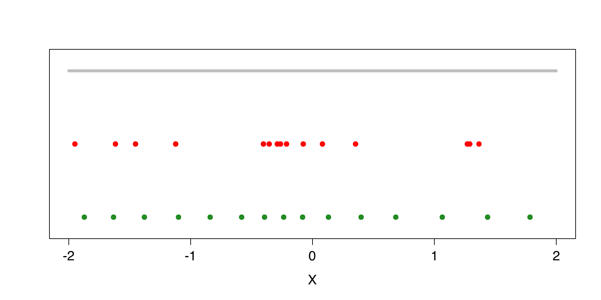

::: article
# Introduction

In numerous applications, quantile regression is used to evaluate the
impact of a $d$-dimensional covariate $X$ on a (scalar) response
variable $Y$. Quantile regression is an interesting alternative to
standard regression whenever the conditional mean does not provide a
satisfactory picture of the conditional distribution. Denoting
by $F(\cdot |x)$ the conditional distribution of $Y$ given $X=x$, the
conditional quantile functions

$$\label{eq:condquant}
x\mapsto q_\alpha(x) = \inf\left\{y \in \mathbb R : F(y|x)\ge \alpha\right\},
\qquad
\alpha \in (0,1),  (\#eq:condquant)  $$

indeed always yield a complete description of the conditional
distribution. For our purposes, it is useful to recall that the
conditional quantiles in (\@ref(eq:condquant)) can be equivalently
defined as

$$\label{eq:defcondquopti}
q_\alpha(x) = \arg\min_{a\in\mathbb R} {\rm E} [\rho_\alpha(Y-a) |X=x],  (\#eq:defcondquopti)  $$

where
$\rho_\alpha(z) = \alpha z\mathbb I_{[z\ge0]} - (1-\alpha)z\mathbb I_{[z<0]}$
is the so-called *check function*.

For fixed $\alpha$, the quantile functions $x\mapsto q_\alpha(x)$
provide reference curves (when $d=1$), one for each value of $\alpha$.
For fixed $x$, they provide conditional prediction intervals of the
form $I_\alpha =[q_{\alpha}(x), q_{1-\alpha}(x)]$ ($\alpha<1/2$). Such
reference curves and prediction intervals are widely used, e.g. in
economics, ecology, or lifetime analysis. In medicine, they are used to
provide reference growth curves for children's height and weight given
their age.

Many approaches have been developed to estimate conditional quantiles.
After the seminal paper of @KoenkerBassett that introduced linear
quantile regression, much effort has been made to consider nonparametric
quantile regression. The most classical procedures in this vein are the
nearest neighbor estimators [@BhattachGango], the (kernel) local linear
estimators [@YuJones2] or the spline-based estimators
[@Koenker94; @KoenkerMizera]. For related work, we also refer to,
e.g. @Fan_et_al, @Gannoun_Saracco, @Muggeo and @Yu_al. There also exists
a wide variety of R functions/packages dedicated to the estimation of
conditional quantiles. Among them, let us cite the functions `rqss`
(only for $d\le 2$) and `gcrq` (only for $d=1$) from the packages
[*quantreg*](https://CRAN.R-project.org/package=quantreg) [@quantreg]
and
[*quantregGrowth*](https://CRAN.R-project.org/package=quantregGrowth)
[@quantregGrowth], respectively.

Recently, @Chaetal14a proposed a nonparametric quantile regression
method based on the concept of *optimal quantization*. Optimal
quantization replaces the (typically continuous) covariate $X$ with a
discretized version $\widetilde{X}^N$ obtained by projecting $X$ on a
collection of $N$ points (these $N$ points, that form the *quantization
grid*, are chosen to minimize the $\text{L}_p$-norm of
$X-\widetilde{X}^N$; see below). As shown in @Chaetal14b, the resulting
conditional quantile estimators compete very well with their classical
competitors.

The goal of this paper is to describe an R package, called
[*QuantifQuantile*](https://CRAN.R-project.org/package=QuantifQuantile)
[@QuantifQuantile], that allows to perform quantization-based quantile
regression. This includes the data-driven selection of the grid size $N$
(that plays the role of a tuning parameter), the construction of the
corresponding quantization grid, the computation of the resulting sample
conditional quantiles, as well as (for $d\leq 2$) their graphical
representation.

The paper is organized as follows. The first section briefly recalls the
construction of quantization-based quantile regression introduced in
@Chaetal14a [@Chaetal14b] and explains the various steps needed to
obtain the resulting estimators. The second section lists the main
functions of *QuantifQuantile* and describes their inputs and outputs.
Finally, the third section provides several examples that illustrate the
use of the various functions. We conclude the paper by comparing our
method with R alternatives on a real data set. An illustration of the
function computing optimal quantization grids is given in the Appendix,
which can be of independent interest in numerical probability, finance
or numerical integration where quantization is extensively used
[@Pages98; @Pages_al2004b].

# Quantile regression through quantization {#sect_cond_est}

As mentioned above, the R package we describe in this paper implements
the @Chaetal14a [@Chaetal14b] quantization-based methodology to perform
nonparametric quantile regression. This section describes this
methodology.

## Approximating population conditional quantiles through quantization {#sect_cond_estsub}

Let $\gamma^N \in (\mathbb R^d)^N$ be a grid of size $N$, that is, a
collection of $N$ points in $\mathbb R^d$. For any $x\in\mathbb R^d$, we
will denote by $\tilde{x}^{\gamma^N}=\text{Proj}_{\gamma^{N}}(x)$ the
projection of $x$ onto this grid, that is, the point of $\gamma^N$ that
is closest to $x$ (absolute continuity assumption makes ties unimportant
in the sequel). This allows to approximate the $d$-dimensional
covariate $X$ by its quantized version $\widetilde{X}^{\gamma^N}$.

Obviously, the choice of the grid has a significant impact on the
quality of this approximation. Under the assumption that
$\|X\|_p := {\rm E}[|X|^p]^{1/p} <\infty$ (throughout, $|\cdot|$ denotes
the Euclidean norm), optimal quantization selects the grid $\gamma^N$
that minimizes the ${\rm L}_p$-quantization
error $\|X-\widetilde X^{\gamma^N}\|_p$. Such an optimal grid exists
under the assumption that the distribution $P_X$ of $X$ does not charge
any hyperplane, i.e. under the assumption that $P_X[H]=0$ for any
hyperplane $H$ [@Pages98]. In practice, an optimal grid is constructed
using a *stochastic gradient algorithm* (see the following section). For
more details on quantization, the reader may refer to @Pages98 and
@Graf_Lusch.

Based on optimal quantization of $X$, we can approximate the conditional
quantile $q_\alpha(x)$ in (\@ref(eq:defcondquopti)) by

$$\label{eq:samcondquant}
\tilde q^N_\alpha(x):= \arg\min_{a\in\mathbb R} {\rm E} 
\big[
\rho_\alpha(Y-a) | \widetilde{X}^N = \tilde x^N
\big],  (\#eq:samcondquant)  $$

where $\widetilde{X}^N$ (resp., $\tilde{x}^N$) denotes the projection of
$X$ (resp., $x$) onto an optimal grid. It is shown in @Chaetal14a that
under mild assumptions,[^1] $\tilde q^N_\alpha(x)$ converges
to $q_\alpha(x)$ as $N\to\infty$, uniformly in $x$.

## Obtaining an optimal $N$-grid {#subsect_CLVQ}

As we will see below, whenever independent copies
$(X_1',Y_1)',\dots,(X_n',Y_n)'$ of $(X',Y)'$ are available, the first
step to obtain a sample version of (\@ref(eq:samcondquant)) is to
compute an optimal $N$-grid (we assume here that $N$ is fixed). As
already mentioned, this can be done through a stochastic gradient
algorithm. This algorithm, called *Competitive Learning Vector
Quantization (CLVQ)* when $p=2$, is an iterative procedure that operates
as follows :

-   First, an initial grid -- $\hat \gamma^{N,0}$, say -- is chosen by
    sampling randomly without replacement among the $X_i$'s.

-   Second, $n$ iterations are performed (one for each observation
    available). The grid
    $\hat \gamma^{N,t}=(\hat \gamma^{N,t}_1,\ldots,\hat \gamma^{N,t}_N)$
    at step $t$ is obtained through $$\hat \gamma^{N,t}_i =
    \Bigg\{ 
    \begin{array}{ll}
    \hat \gamma^{N,t-1}_i - \delta_t |\hat \gamma^{N,t-1}_i - X_t|^{p-1}\frac{\hat \gamma^{N,t-1}_i - X_t}{|\hat \gamma^{N,t-1}_i - X_t|}&\quad \text{if } \text{Proj}_{\hat \gamma^{N,t-1}}(X_t)=\hat \gamma^{N,t-1}_i, \\[2mm]
    \hat \gamma^{N,t-1}_i & \quad\text{otherwise,}
    \end{array}$$ where $(\delta_t),t\in\mathbb N_0,$ is a deterministic
    sequence in $(0,1)$ such that $\sum_t \delta_t = \infty$ and
    $\sum_t \delta_t^2 < \infty$. At the $t^{\rm th}$ iteration, only
    one point of the grid moves, namely the one that is closest
    to $X_t$.

The optimal grid provided by this algorithm is then $\hat\gamma^{N,n}$.

## Estimating conditional quantiles {#subsect_estim_cond_qu}

Assume now that a sample $(X_1',Y_1)',\dots,(X_n',Y_n)'$ as above is
indeed available. The sample analog of (\@ref(eq:samcondquant)) is then
defined as follows :

1.  First, we compute the optimal grid $\hat\gamma^{N,n}$ through the
    stochastic gradient algorithm just described, and we write
    $\widehat X^N_i = \text{Proj}_{\hat \gamma^{N,n}}(X_i)$,
    $i=1,\dots,n$.

2.  Then, the conditional quantiles are estimated by

    $$\label{eq:estim1}
    \hat q^{N,n}_{\alpha}(x)=\arg\min_{a\in\mathbb R} \sum_{i=1}^n \rho_\alpha(Y_i-a) \mathbb I_{[\widehat X_i^N = \hat x^N]},  (\#eq:estim1)  $$

    where $\hat x^N = \text{Proj}_{\hat \gamma^{N,n}}(x)$. In practice,
    $\hat q^{N,n}_{\alpha}(x)$ is simply evaluated as the sample
    $\alpha$-quantile of the $Y_i$'s for which
    $\widehat X^N_i =\hat x^N$.

It is shown in @Chaetal14a that under mild assumptions,
$\hat q^{N,n}_{\alpha}(x)$, for any fixed $N$ and $x$, converges in
probability to $\tilde q^N_\alpha(x)$ as $n\to\infty$, provided that
quantization is based on $p=2$.

When the sample size $n$ is small to moderate ($n\leq 300$, say), the
estimated reference curves $x\mapsto \hat q^{N,n}_{\alpha}(x)$ typically
are not smooth. To improve on this, @Chaetal14a [@Chaetal14b] introduced
the following bootstrapped version of the estimator
in (\@ref(eq:estim1)). For some positive integer $B$, generate $B$
samples of size $n$ from the original sample
$\{(X_i',Y_i)'\}_{i=1,\dots,n}$ with replacement. From each of these
bootstrap samples, the stochastic gradient algorithm provides an
"optimal" grid, using these bootstrapped samples to perform the
iterations. The bootstrapped estimator of conditional quantile is then

$$\label{eq:estim2}
\bar {q}^{N,n}_{\alpha,B}(x)= \frac1B \sum_{b=1}^B \hat q_\alpha^{(b)}(x),  (\#eq:estim2)  $$

where $\hat q_\alpha^{(b)}(x)=\hat q_\alpha^{(b),N,n}(x)$ denotes the
estimator in (\@ref(eq:estim1)) computed on the basis of the
$b^{\rm th}$ optimal grid. We stress that, when
computing $\hat q_\alpha^{(b)}(x)$, the original sample is used in (S2);
the bootstrapped samples are only used to provide the $B$ different
grids. As shown in @Chaetal14a [@Chaetal14b], the bootstrapped reference
curves are much smoother than the original ones. Of course, $B$ should
be chosen large enough to make the bootstrap useful, but also small
enough to keep the computational burden under control. For $d=1$, we
usually choose $B=50$.

## Selecting the grid size $N$ {#subsect_choice_N}

Both for the original estimators $\hat q^{N,n}_{\alpha}(x)$ and for
their bootstrapped versions $\bar {q}^{N,n}_{\alpha,B}(x)$, an
appropriate value of $N$ should be identified. If $N$ is too small, then
reference curves will have a large bias, while if $N$ is too large, then
they will show much variability. This leads to the usual bias/variance
trade-off that is to be achieved when selecting the value of a smoothing
parameter in nonparametric statistics.

@Chaetal14b proposed the following data-driven method to choose $N$. Let
$\{x_1,\dots,x_J\}$ be a set of $x$-values at which we want to estimate
$q_\alpha(x)$ (the $x_j$'s are for instance chosen equispaced on the
support of $X$) and let $\mathcal{N}$ be a finite collection
of $N$-values (this represents the values of $N$ one allows for and
should typically be chosen according to the sample size $n$). Ideally,
we would like to select the optimal value of $N$ as

$$\label{eq:ss}
{N}^{\,\bar{}\,}_{\alpha;\rm opt}
=
\arg\min_{N\in\mathcal{N}}
{\text{ISE}}^{\,\bar{}\,}_\alpha(N)
, 
\quad
\textrm{ with }
\
{\text{ISE}}^{\,\bar{}\,}_\alpha(N)
= 
\frac{1}{J}  
\sum_{j=1}^{J} 
\big(
 \bar q_{\alpha,B}^{N,n}(x_j) - q_\alpha(x_j)
\big)^2
.  (\#eq:ss)  $$

This, however, is infeasible, since the population
quantiles $q_\alpha(x_j)$ are unknown. This is why we draw
$\widetilde B$ extra bootstrap samples (still of size $n$) from the
original sample and consider

$$\label{eq:ss2}
\hat{N}^{\,\bar{}\,}_{\alpha;\rm opt} 
=
\arg\min_{N\in\mathcal{N}}
\widehat{\text{ISE}}^{\,\bar{}\,}_\alpha(N)
, 
\quad
\textrm{ with }
\
\widehat{\text{ISE}}^{\,\bar{}\,}_\alpha(N)
=
\frac{1}{J}  
\sum_{j=1}^{J} 
\left( 
\frac{1}{\widetilde B}
\sum_{\tilde b=1}^{\widetilde B} 
\big(
\bar q_{\alpha,B}^{N,n}(x_j) - \hat q^{(\tilde b)}_\alpha(x_j) 
\big)^2
\right)
,  (\#eq:ss2)  $$

where $\hat q^{(\tilde b)}_\alpha(x_j)$, for $\tilde b=1\dots,\tilde B$,
makes use of this $\tilde b^{\rm th}$ new bootstrap sample; more
precisely, the bootstrap sample is still only used to perform the
iterations of the algorithm, whereas the original sample is used in both
the initial grid and in (S2).

As shown in @Chaetal14b through simulations, both
$N\mapsto {\text{ISE}}^{\,\bar{}\,}_\alpha(N)$ and
$N\mapsto \widehat{\text{ISE}}^{\,\bar{}\,}_\alpha(N)$ are essentially
convex in $N$ and lead to roughly the same minimizers. This therefore
provides a feasible way to select a reasonable value of $N$ for the
estimator $\bar q_{\alpha,B}^{N,n}(x)$ in (\@ref(eq:estim2)). Note that
this also applies to $\hat q_{\alpha}^{N,n}(x)$ by simply taking $B=1$
in the procedure above.

If quantiles are to be estimated at various orders $\alpha$,
(\@ref(eq:ss2)) will provide an optimal $N$-value for each $\alpha$. It
may then happen, in principle, that the resulting reference curves
cross, which is of course undesirable. One way to guarantee that no such
crossings occur is to identify a common $N$-value for the
various $\alpha$'s. In such a case, $N$ will be chosen as

$$\label{eq:ss3}
\hat{N}^{\,\bar{}\,}_{\rm opt}
=
\arg\min_{N\in\mathcal{N}}
\widehat{\text{ISE}}^{\,\bar{}\,}(N)
, 
\quad
\textrm{ with }
\
\widehat{\text{ISE}}^{\,\bar{}\,}(N)={\textstyle \sum_\alpha}
\
 \widehat{\text{ISE}}^{\,\bar{}\,}_\alpha(N)
,  (\#eq:ss3)  $$

where the sum is computed over the various $\alpha$-values considered.

@Chaetal14b performed extensive comparisons between the
quantization-based estimators in (\@ref(eq:estim2)) -- based on the
efficient data-driven selection method for $N$ just described -- and
some of their main competitors, namely estimators obtained from spline,
$k$-nearest neighbor, and kernel methods. This revealed that the
quantization-based estimators compete well in all cases, and often
dominates their competitors (in terms of integrated square errors),
particularly so for complex link functions; see @Chaetal14b for details.

Unlike the local linear and local constant estimators from @YuJones2,
that are usually based on a global-in-$x$ bandwidth, our
quantization-based estimators are locally adaptive in the sense that,
when estimating $q_\alpha(x)$, the "working bandwidth" -- that is, the
size of the quantization cell containing $x$ -- depends on $x$. The
$k$-nearest neighbor ($k$NN) estimator is closer in spirit to
quantization-based estimators but always selects $k$ neighbors,
irrespective of the $x$-value considered, whereas the number of $X_i$'s
in the quantization cell of $x$ may depend on $x$. This subtle
local-in-$x$ behavior may explain the good empirical performances of
quantization-based estimators over kernel and nearest-neighbor
competitors. Finally, spline methods (implemented in R with the `rqss`
and `qss` functions) tend to perform poorly for complex link functions,
since they always provide piecewise linear reference curves
[@Koenker94]. Moreover, the current implementation of the `rqss`
function only supports dimensions 1 and 2, whereas our package allows to
compute quantization-based estimators in any dimension $d$.

# The *QuantifQuantile* package {#sect_package}

This section provides a description of the various functions offered in
the R package *QuantifQuantile*. We first detail the three functions
that allow to estimate conditional quantiles through quantization. Then
we describe a function computing optimal quantization grids.

## Conditional quantile estimation {#sec31}

*QuantifQuantile* is composed of three main functions that each provide
estimated conditional quantiles
in (\@ref(eq:estim1))-(\@ref(eq:estim2)). These functions work in a
similar way but address different values of $d$ (recall that $d$ is the
dimension of the covariate vector $X$) :

-   The function `QuantifQuantile` is suitable for $d=1$.

-   The function `QuantifQuantile.d2` addresses the case $d=2$.

-   Finally, `QuantifQuantile.d` can deal with an arbitrary value
    of $d$.

Combined with the `plot` function, the first two functions provide
reference curves and reference surfaces, respectively. No graphical
outputs can be obtained from the third function if $d>2$.

The three functions share the same arguments, but not necessarily the
same default values. For each function, using `args()` displays the
various arguments and corresponding default values :

``` r
QuantifQuantile(X, Y, alpha = c(0.05, 0.25, 0.5, 0.75, 0.95), x = seq(min(X), max(X), 
  length = 100), testN = c(35, 40, 45, 50, 55), p = 2, B = 50, tildeB = 20, 
  same_N = TRUE, ncores = 1) 

QuantifQuantile.d2(X, Y, alpha = c(0.05, 0.25, 0.5, 0.75, 0.95), 
  x = matrix(c(rep(seq(min(X[1, ]), max(X[1, ]), length = 20), 20), 
  sort(rep(seq(min(X[2, ]), max(X[2, ]), length = 20), 20))), nrow = 2, byrow = TRUE), 
  testN = c(110, 120, 130, 140, 150), p = 2, B = 50, tildeB = 20, same_N = TRUE, 
  ncores = 1) 

QuantifQuantile.d(X, Y, x, alpha = c(0.05, 0.25, 0.5, 0.75, 0.95), 
  testN = c(35, 40, 45, 50, 55), p = 2, B = 50, tildeB = 20, same_N = TRUE, ncores = 1) 
```

We now give more details on these arguments.

-   `X`: a $d\times n$ real array (required by all three functions, a
    vector of length $n$ for `QuantifQuantile`). The columns of this
    matrix are the $X_i$'s, $i=1,\ldots,n$.

-   `Y`: an $n\times 1$ real array (required by all three functions).
    This vector collects the $Y_i$'s, $i=1,\ldots,n$.

-   `alpha`: an $r\times 1$ array with components in $(0,1)$ (optional
    for all three functions). This vector contains the orders for which
    $q_\alpha(x)$ should be estimated.

-   `x`: a $d\times J$ real array (optional for `QuantifQuantile` and
    `QuantifQuantile.d2`, required by `QuantifQuantile.d`). The columns
    of this matrix are the $x_j$'s at which the
    quantiles $q_\alpha(x_j)$ are to be estimated. If `x` is not
    provided when calling `QuantifQuantile`, then it is set to a vector
    of $J=100$ equispaced values between the minimum and the maximum of
    the $X_i$'s. If this argument is not provided when calling
    `QuantifQuantile.d2`, then the default for `x` is a matrix whose
    $J=20^2=400$ column vectors are obtained as follows: 20 equispaced
    values are considered between the minimum and maximum values of the
    $(X_{i})_1$'s and similarly for the second component. The 400 column
    vectors of the default `x` are obtained by considering all
    combinations of those 20 values for the first component with the 20
    values for the second one[^2].

-   `testN`: an $m\times 1$ vector of pairwise distinct positive
    integers (optional for all three functions). The entries of this
    vector are the elements of the set $\mathcal{N}$
    in (\@ref(eq:ss2))-(\@ref(eq:ss3)), hence are the $N$-values for
    which the $\widehat{\text{ISE}}^{\,\bar{}\,}_\alpha$ quantity
    considered will be evaluated. The default is $(35,40,\dots,55)$ but
    it is strongly recommended to adapt it according to the sample
    size $n$ at hand.

-   `p`: a real number larger than or equal to one (optional for all
    three functions). This is the parameter $p$ to be used when
    performing optimal quantization in $\text L _p$-norm.

-   `B`: a positive integer (optional for all three functions). This is
    the number of bootstrap replications $B$ to be used
    in (\@ref(eq:estim2)).

-   `tildeB`: a positive integer (optional for all three functions).
    This is the number of bootstrap replications $\widetilde B$ to be
    used when determining $\hat{N}^{\,\bar{}\,}_{\alpha;\rm opt}$
    or $\hat{N}^{\,\bar{}\,}_{\rm opt}$.

-   `same_N`: a boolean variable (optional for all three functions). If
    `same_N=TRUE`, then a common value of $N$ (that is,
    $\hat{N}^{\,\bar{}\,}_{\rm opt}$ in (\@ref(eq:ss3))) will be
    selected for all $\alpha$'s. If `same_N=FALSE`, then optimal values
    of $N$ will be chosen independently for the various of $\alpha$
    (which will provide several $\hat{N}^{\,\bar{}\,}_{\alpha;\rm opt}$,
    as in (\@ref(eq:ss2))).

-   `ncores`: number of cores to use. These functions can use parallel
    computation to save time by increasing this parameter. Parallel
    computation relies on `mclapply` from *parallel* package, hence is
    not available on Windows.

All three functions return the following list of objects, which is of
class '`QuantifQuantile`' :

-   `hatq_opt`: an $r\times J$ real array (where $r$ is the number
    of $\alpha$-values considered). If `same_N=TRUE`, then the
    entry $(i,j)$ of this matrix
    is $\bar{q}^{\hat{N}^{\,\bar{}\,}_{\rm opt},n}_{\alpha_i,B}(x_j)$.
    If `same_N=FALSE`, then it is
    rather $\bar{q}^{\hat{N}^{\,\bar{}\,}_{\alpha_i;\rm opt},n}_{\alpha_i,B}(x_j)$.
    This object can also be returned using the usual `fitted.values`
    function.

-   `N_opt`: a positive integer (if `same_N=TRUE`) or an $r\times 1$
    array of positive integers (if `same_N=FALSE`). Depending on
    `same_N`, this provides the value
    of $\hat{N}^{\,\bar{}\,}_{\rm opt}$ or the
    vector $(\hat{N}^{\,\bar{}\,}_{\alpha_1;\rm opt},\ldots,\hat{N}^{\,\bar{}\,}_{\alpha_r;\rm opt})$.

-   `hatISE_N`: an $r\times m$ real array. The entry $(i,j)$ of this
    matrix is $\widehat{\text{ISE}}^{\, \bar{}\,}_{\alpha_i}(N_j)$.
    Plotting this for fixed $\alpha$ or plotting its average over the
    various $\alpha$, in both cases over `testN`, allows to assess the
    global convexity of these ISEs. Hence, it can be used to indicate
    whether or not the choice of `testN` was adequate. This will be
    illustrated in the examples below.

-   `hatq_N`: an $r\times J\times m$ real array. The entry $(i,j,\ell)$
    of this matrix is $\bar{q}^{N_\ell,n}_{\alpha_i,B}(x_j)$,
    where $N_\ell$ is the $\ell^{\rm th}$ entry of the argument `testN`.
    From this output, it is easy by fixing the third entry to get the
    matrix of the $\bar{q}^{N,n}_{\alpha_i,B}(x_j)$ values for any $N$
    in `testN`.

-   The arguments `X`, `Y`, `x`, `alpha`, and `testN` are also reported
    in this response list.

Moreover, when the optimal value `N_opt` selected is on the boundary of
`testN`, which means that `testN` most likely was not well chosen, a
warning message is printed.

The '`QuantifQuantile`' class response can be used as argument of the
functions `plot` (only for $d\le 2$), `summary` and `print`. The `plot`
function draws the observations and plots the estimated conditional
quantile curves ($d=1$) or surfaces ($d=2$) -- for $d=2$, the
[*rgl*](https://CRAN.R-project.org/package=rgl) package is used [@rgl],
which allows to change the perspective in a dynamic way. In order to
illustrate the selection of $N$, the function `plot` also has an
optional argument `ise`. Setting this argument to `TRUE` (the default is
`FALSE`), this function, that can be used for any dimension $d$,
provides the plot (against $N$) of the
$\widehat{\text{ISE}}^{\, \bar{}\,}_{\alpha}$ and
$\widehat{\text{ISE}}^{\, \bar{}\,}$ quantities in (\@ref(eq:ss2)) or
in (\@ref(eq:ss3)), depending on the choice `same_N=FALSE` or
`same_N=TRUE`, respectively; see the examples below for details. If
$d\le2$, it also returns the fitted quantile curves or surfaces.

## Computing optimal grids {#sec32}

Besides the functions that allow to estimate conditional quantiles and
to plot the corresponding reference curves/surfaces, *QuantifQuantile*
provides a function that computes optimal quantization grids. This
function, called `choice.grid`, admits the following arguments :

-   `X`: a $d\times n$ real array (required). The columns of this matrix
    are the $X_i$'s, $i=1,\ldots,n$, for which the optimal quantization
    grid should be determined. Each point of `X` is used as a stimulus
    in the stochastic gradient algorithm to get an optimal grid.

-   `N`: a positive integer (required). The size of the desired
    quantization grid.

-   `ng`: a positive integer (optional). The number of desired
    quantization grids. The default is $1$.

-   `p`: a real number larger than or equal to one (optional). This is
    the parameter $p$ used in the quantization error. The default is
    $2$.

In some cases, it may be necessary to have several quantization grids,
such as in (\@ref(eq:estim2)), where `B + tildeB` grids are needed. The
three functions computing quantization-based conditional quantiles then
call the function `choice.grid` with `ng` $>1$. In such case, the
various grids are obtained using as stimuli a resampling version of `X`
(the $X_t$'s in the previous section).

The output is a list containing the following elements :

-   `init_grid`: a $d\times\!\!$ `N` $\!\!\times\!\!$ `ng` real array.
    The entry $(i,j,\ell)$ of this matrix is the $i^{\rm th}$ component
    of the $j^{\rm th}$ point of the $\ell^{\rm th}$ initial grid.

-   `opti_grid`: a $d\times\!\!$ `N` $\!\!\times\!\!$ `ng` real array.
    The entry $(i,j,\ell)$ of this matrix is the $i^{\rm th}$ component
    of the $j^{\rm th}$ point of the $\ell^{\rm th}$ optimal grid
    provided by the algorithm.

# Illustrations {#sect_examples}

In this section, we illustrate on several examples the use of the
functions described above. Examples 1--3 restrict to
`QuantifQuantile`/`QuantifQuantile.d2` and provide graphical
representations in each case. Example 4 deals with a three-dimensional
covariate, without graphical representation. An illustration of the
function `choice.grid` is given in the Appendix.

## Example 1: Simulated data with one-dimensional covariate {#sec41}

We generate a random sample $(X_i,Y_i)'$, $i=1,\ldots,n=300$, where the
$X_i$'s are uniformly distributed over the interval $(-2,2)$ and where
the $Y_i$'s are obtained by adding to $X_i^2$ a standard normal error
term that is independent of $X_i$ :

``` r
set.seed(258164)
n <- 300
X <- runif(n, -2, 2)
Y <- X^2 + rnorm(n)
```

We test the number $N$ of quantizers between 10 and 30 by steps of 5 and
we do not change the default values of the other arguments. We then run
the function `QuantifQuantile` with these arguments and stock the
response in `res`.

``` r
testN <- seq(10, 30, by = 5)
res <- QuantifQuantile(X, Y, testN = testN)
```

No warning message is printed, which means that this choice of `testN`
was adequate. To assess this in a graphical way, we use the function
`plot` with `ise` argument set to `TRUE` that plots `hatISEmean_N`
(obtained by taking the mean of `hatISE_N` over `alpha`) against the
various $N$-values in `testN`.

``` r
plot(res, ise = TRUE)
```

Figure [1](#d=1)A provides the resulting graph, which confirms that
`testN` was well chosen since `hatISEmean_N` is larger for smaller and
larger values of $N$ than `N_opt`. We then plot the corresponding
estimated conditional quantiles curves in Figure [1](#d=1)B. The default
colors of the points and of the curves are changed by using the
`col.plot` argument. This argument is a vector of size
1+`length(alpha)`, whose first component fixes the color of the data
points and whose remaining components determine the colors of the
various reference curves.

``` r
col.plot <- c("grey", "red", "orange", "green", "orange", "red")
plot(res, col.plot = col.plot, xlab = "X", ylab = "Y")
```

It is natural to make the grid `testN` finer. Of course, the more
$N$-values we test, the longer it takes. This is why we adopted this
two-stage approach, where the goal of the first stage was to get a rough
approximation of the optimal $N$-value. In the second stage, we can then
refine the grid only in the vicinity of the value `N_opt` obtained in
the first stage.

``` r
testN <- c(seq(10, 20, by = 1), seq(25, 30, by = 5))
res_step1 <- QuantifQuantile(X, Y, testN = testN)
plot(res_step1, ise = TRUE, col.plot = col.plot, xlab = "X", ylab = "Y")
```

<figure id="d=1">
<table>
<caption> </caption>
<tbody>
<tr class="odd">
<td style="text-align: center;"></td>
<td style="text-align: center;"></td>
</tr>
<tr class="even">
<td style="text-align: center;">(a)</td>
<td style="text-align: center;">(b)</td>
</tr>
<tr class="odd">
<td style="text-align: center;"></td>
<td style="text-align: center;"></td>
</tr>
<tr class="even">
<td style="text-align: center;">(c)</td>
<td style="text-align: center;">(d)</td>
</tr>
</tbody>
</table>
<figcaption>Figure 1: For the sample considered in Example 1, this
figure provides (a) the plot of <span
class="math inline">$N\mapsto\widehat{\text{ISE}}^{\,\bar{}\,}(N)$</span>
with <span class="math inline"><em>N</em> ∈ {10, 15, 20, 25, 30}</span>,
and (b) the resulting reference curves. The panels (c)–(d) provide the
corresponding plots when taking <span
class="math inline"><em>N</em> ∈ {10, 11, 12, …, 19, 20, 25, 30}</span>.</figcaption>
</figure>

The resulting graphs are provided in Figures [1](#d=1)C--[1](#d=1)D,
respectively. We observe that the value of `N_opt` is made more precise,
since we now get `N_opt`=18 instead of 15. The resulting estimated
conditional quantiles curves in Figure [1](#d=1)B are very similar to
the ones in Figure [1](#d=1)D.

So far, we used the default value `same_N=TRUE`, which leads to
selecting an $N$-value that is common to all $\alpha$'s. For the sake of
comparison, we now explore the results for `same_N=FALSE`.

<figure id="d1Nalpha">
<table>
<caption> </caption>
<tbody>
<tr class="odd">
<td style="text-align: center;"></td>
<td style="text-align: center;"></td>
</tr>
<tr class="even">
<td style="text-align: center;">(a)</td>
<td style="text-align: center;">(b)</td>
</tr>
<tr class="odd">
<td style="text-align: center;"></td>
<td style="text-align: center;"></td>
</tr>
<tr class="even">
<td style="text-align: center;">(c)</td>
<td style="text-align: center;">(d)</td>
</tr>
</tbody>
</table>
<figcaption>Figure 2: <span>The same results as in Figure , but when
selecting optimal values of <span class="math inline"><em>N</em></span>
separately for each <span
class="math inline"><em>α</em></span>.</span><span id="d1Nalpha"
label="d1Nalpha"></span></figcaption>
</figure>

``` r
testN <- c(seq(10, 30, by = 5))
res2 <- QuantifQuantile(X, Y, testN = testN, same_N = FALSE) 
plot(res2, ise = TRUE, col.plot = col.plot, xlab = "X", ylab = "Y")
testN <- c(seq(10, 20, by = 1), seq(25, 30, by = 5))
res2_step1 <- QuantifQuantile(X, Y, testN  = testN, same_N = FALSE)
plot(res2_step1, ise = TRUE, col.plot = col.plot, xlab = "X", ylab = "Y")
```

The results are provided in Figure [2](#d1Nalpha). Comparing the left
panels of Figures [1](#d=1) and [2](#d1Nalpha), we see that when
choosing $N$ by steps of five, we find `N_opt = 15` with `same_N = TRUE`
and `N_opt = 15` or 20 (depending on `alpha`) for `same_N = FALSE`. When
we refine the grid `testN`, we find analogously `N_opt = 18` for
`same_N = TRUE` and `N_opt = 14`, `15`, or `16` for `same_N = FALSE`. In
the present setup, thus, both methods provide relatively close optimal
$N$-values, which explains why the corresponding estimated reference
curves are so similar (see the right panels of Figures [1](#d=1)
and [2](#d1Nalpha)). Therefore, the grid of $N$-values tested in
Figure [1](#d=1), that may seem too coarse at first sight, actually
provides fitted curves that are as satisfactory as those associated with
the finer grid in Figure [2](#d1Nalpha).

## Example 2: Simulated data with two-dimensional covariate {#sec42}

The sample considered here is made of $n=1,000$ independent realizations
of a random vector $(X',Y)'$, where $X=(X_1,X_2)'$ is uniformly
distributed on the square $(-2,2)^2$ and where $Y$ is obtained by adding
to $X_1^2+X_2^2$ an independent standard normal error term.

``` r
set.seed(642516)
n <- 1000
X <- matrix(runif(n*2, -2, 2), ncol = n)
Y <- apply(X^2, 2, sum) + rnorm(n)
```

We test $N$ between 40 and 90 by steps of 10. We change the values of
`B` and `tildeB` to reduce the computational burden, which is heavier
for $d=2$ than for $d=1$. We keep the default values of all other
arguments when running the function `QuantifQuantile.d2`. Here, a
warning message is printed informing us that `testN` was not
well-chosen. We confirm it with the function `plot` with `ise` argument
set to `TRUE`.

``` r
testN <- seq(40, 90, by = 10)
B <- 20
tildeB <- 15
res <- QuantifQuantile.d2(X, Y, testN = testN, B = B, tildeB = tildeB)
plot(res, ise = TRUE)
```

Figure [3](#d2)A provides the resulting graph. The parameter `testN` was
not well chosen since `hatISEmean_N` becomes smaller and smaller as
`N_opt` increases. We then adapt the choice of `testN` accordingly and
rerun the procedure, which identifies an optimal $N$-value equal to 100;
see Figure [3](#d2)B.

``` r
testN <- seq(80, 130, by = 10)
res <- QuantifQuantile.d2(X, Y, testN = testN, B = B, tildeB = tildeB)
plot(res, ise = TRUE)
```

We then plot the corresponding estimated conditional quantile surfaces
in Figure [4](#d2H).

``` r
col.plot <- c("black", "red", "orange", "green", "orange", "red")
plot(res, col.plot = col.plot, xlab = "X_1", ylab = "X_2", zlab = "Y")
```

<figure id="d2">
<table>
<caption> </caption>
<tbody>
<tr class="odd">
<td style="text-align: center;"></td>
<td style="text-align: center;"></td>
</tr>
<tr class="even">
<td style="text-align: center;">(a)</td>
<td style="text-align: center;">(b)</td>
</tr>
</tbody>
</table>
<figcaption>Figure 3: For the sample considered in Example 2, this
figure plots <span
class="math inline">$N\mapsto\widehat{\text{ISE}}^{\,\bar{}\,}(N)$</span>
(a) for <span
class="math inline"><em>N</em> ∈ {40, 50, 60, 70, 80}</span> and (b) for
<span
class="math inline"><em>N</em> ∈ {80, 90, …, 120, 130}</span>.</figcaption>
</figure>

<figure id="d2H">
<table>
<caption> </caption>
<tbody>
<tr class="odd">
<td style="text-align: center;"></td>
<td style="text-align: center;"></td>
</tr>
<tr class="even">
<td style="text-align: center;">(a)</td>
<td style="text-align: center;">(b)</td>
</tr>
</tbody>
</table>
<figcaption>Figure 4: For the sample considered in Example 2, this
figure plots (with two different views) the estimated conditional
quantile surfaces obtained with the <code>plot</code> function for <span
class="math inline"><em>α</em> = 0.05, 0.25, 0.50, 0.75</span> and 0.95.
<span id="d2H" label="d2H"></span></figcaption>
</figure>

## Example 3: Real data study and comparison with some competitors

This example aims at illustrating the proposed estimated reference
curves on a real data set and at comparing them with some competitors.
In this example, the `ncores` parameter of `QuantifQuantile` function
was set to the number of cores detected by R minus 1. The data used
here, that are included in the *QuantifQuantile* package, involves
several variables related to employment, housing and environment
associated with $n=542$ towns/villages in Gironde, France. For the
present illustration, we restrict to the regressions $R_1$ and $R_2$
involving $(X,Y)=$
(`percentage of owners living in their primary residence`,
`percentage of buildings area`) and $(X,Y)=$
(`percentage of middle-range employees`, `population density`),
respectively. In both cases, $n=542$ observations are available and we
are interested in the estimation of reference curves
for $\alpha=0.05,0.25,0.50,0.75$ and $0.95$. For both $R_1$ and $R_2$,
we tested the number $N$ of quantizers to be used between 5 and 15 by
step of 1, using the methodology described in Example 1.

``` r
set.seed(644925)
data(gironde)
X <- gironde[[2]]$owners
Y <- gironde[[4]]$building
testN <- seq(5, 15, by = 1)
res <- QuantifQuantile(X, Y, testN = testN, same_N = F, ncores = detectCores() - 1)
col.plot <- c("grey", "red", "orange", "green", "orange", "red")
plot(res, col.plot = col.plot, xlab = "X", ylab = "Y")
```

The same exercise is repeated with $(X,Y)=$
(`percentage of middle-range employees`, `population density`). For
each $\alpha$-value considered, we obtained
$\hat{N}^{\,\bar{}\,}_{\alpha;\rm opt}=13$ for $R_1$ and
$\hat{N}^{\,\bar{}\,}_{\alpha;\rm opt}=7$ for $R_2$. The corresponding
quantization-based reference curves are plotted in Figures [5](#rdn)A
and [5](#rdn)C, respectively. For the sake of comparison, spline-based
curves are provided in Figures [5](#rdn)B and [5](#rdn)D. These were
obtained from the function `rqss` in the package *quantreg*. Since the
parameter $\lambda$ involved, that governs the trade-off between
fidelity and smoothness, is not automatically selected by `rqss`, we
selected it through AIC (via the `AIC` function), separately for each
order $\alpha$.

``` r
rank <- rank(X, ties.method = "random")
X[rank] <- X
Y[rank] <- Y
alpha <- c(0.05, 0.25, 0.5, 0.75, 0.95)
x <- seq(min(X), max(X), length = 100)
n <- length(X)
lambda <- array(0, dim = c(length(alpha), 1))
interval = c(0.2, 10) 
for(i in 1:length(alpha)){
  AIC_crit <- function(lambda){      
    AIC(rqss(Y ~ qss(X, lambda = lambda), tau = alpha[i]))[1]
  }
  select_lambda <- optimize(AIC_crit, interval = interval)
  lambda[i] <- select_lambda$min
}
hatq <- array(0, dim = c(length(x), length(alpha)))
fitted_matrix <- array(0, dim = c(n,length(alpha)))
for(l in 1:length(alpha)){
  res_rqss <- rqss(Y ~ qss(X, lambda = lambda[l]),tau = alpha[l])
  fitted_matrix[,l] <- fitted(res_rqss)
}
plot(X, Y, col = col.plot[1], cex = 0.7);
for(i in 1:length(alpha)){
  lines(fitted_matrix[, i] ~ X, type = "l", col = col.plot[i+1])
}
```

The same exercise is repeated for $R_2$, but with $\lambda$ tested
between 0.5 and 15. Since they are piecewise linear, the resulting
spline-based reference curves are less smooth than the one based on
quantization. Arguably, the latter better adapt to the samples even
though they are sometimes quite wiggly.

Of course, the computational burden is also an important issue.
Therefore, Table [1](#table_time) gathers, for each method and each
regression problem, the average and standard deviation of the computing
times in a collection of 50 runs (these 50 runs were considered to make
results more reliable). In each case, our method is faster than its
spline-based competitor.

<figure id="rdn">
<table>
<caption> </caption>
<tbody>
<tr class="odd">
<td style="text-align: center;"></td>
<td style="text-align: center;"></td>
</tr>
<tr class="even">
<td style="text-align: center;">(a)</td>
<td style="text-align: center;">(b)</td>
</tr>
<tr class="odd">
<td style="text-align: center;"></td>
<td style="text-align: center;"></td>
</tr>
<tr class="even">
<td style="text-align: center;">(c)</td>
<td style="text-align: center;">(d)</td>
</tr>
</tbody>
</table>
<figcaption>Figure 5: Estimated conditional quantile curves obtained
with <code>QuantifQuantile</code> (left) and <code>rqss</code> (right),
for regression <span class="math inline"><em>R</em><sub>1</sub></span>
(top) and regression <span
class="math inline"><em>R</em><sub>2</sub></span> (bottom). In each
case, the quantile orders considered are <span
class="math inline"><em>α</em> = 0.05, 0.25, 0.50, 0.75</span> and <span
class="math inline">0.95</span>.</figcaption>
</figure>

::: {#table_time}
  ------------------------------------------
           `QuantifQuantile`      `rqss`
  ------- ------------------- --------------
   $R_1$     2.83 (0.117)      4.39 (0.119)

   $R_2$     2.47 (0.085)      4.08 (0.115)
  ------------------------------------------

  : Table 1: Averages of the computing times (in seconds) to obtain 50
  times the conditional quantile curves in Example 3 for
  `QuantifQuantile` and `rqss`, respectively; standard deviations are
  reported in parentheses.
:::

## Example 4: Real data with three-dimensional covariate

To treat an example with $d>2$, we reconsider the data set in Example 3,
this time with the response $Y=$ `population density` and the three
covariates $X_1=$ `percentage of farmers`, $X_2=$
`percentage of unemployed workers`, and $X_3=$ `percentage of managers`.
In this setup, no graphical output is available. We therefore restrict
to a finite collection of $x$-values where conditional quantiles are to
be estimated. Denoting by $M_j$ and $\overline X_j$, $j=1,2,3$, the
maximal value and the average of $X_{ij}$, $i=1,\ldots,n=542$,
respectively, we consider the following eight values of $x$ :

$$\begin{aligned}
&x_1=\begin{pmatrix} \overline{X}_1 \\[.99mm] \overline{X}_2 \\[.99mm] \overline{X}_3 \end{pmatrix}, \
x_2=\begin{pmatrix}  {\textstyle\frac{1}{2}}(\overline{X}_1 +M_1)\\[.99mm] \overline{X}_2 \\[.99mm] \overline{X}_3 \end{pmatrix}, \
x_3=\begin{pmatrix}  \overline{X}_1 \\[.99mm]  {\textstyle\frac{1}{2}}(\overline{X}_2 +M_2) \\[.99mm] \overline{X}_3 \end{pmatrix}, \
x_4=\begin{pmatrix}  \overline{X}_1 \\[.99mm] \overline{X}_2  \\ {\textstyle\frac{1}{2}}(\overline{X}_3 +M_3) \end{pmatrix}, \\[2mm]
&x_5=\begin{pmatrix} {\textstyle\frac{1}{2}}(\overline{X}_1 +M_1) \\[.99mm]  {\textstyle\frac{1}{2}}(\overline{X}_2 +M_2) \\[.99mm] \overline{X}_3 \end{pmatrix}, \
x_6=\begin{pmatrix} {\textstyle\frac{1}{2}}(\overline{X}_1 +M_1) \\[.99mm]   \overline{X}_2 \\[.99mm] {\textstyle\frac{1}{2}}(\overline{X}_3 +M_3) \end{pmatrix}, \
x_7=\begin{pmatrix} \overline{X}_1  \\[.99mm]   {\textstyle\frac{1}{2}}(\overline{X}_2 +M_2) \\[.99mm] {\textstyle\frac{1}{2}}(\overline{X}_3 +M_3) \end{pmatrix}, \
x_8=\begin{pmatrix} {\textstyle\frac{1}{2}}(\overline{X}_1 +M_1) \\[.99mm]  {\textstyle\frac{1}{2}}(\overline{X}_2 +M_2) \\[.99mm] {\textstyle\frac{1}{2}}(\overline{X}_3 +M_3) \end{pmatrix}. 
\end{aligned}$$

The function `QuantifQuantile.d` is then evaluated for the response and
covariates indicated above, and with the arguments `alpha`
$=(0.25, 0.5, 0.75)'$, `testN` $=(5,6,7,8,9,10)'$, `x` being the
$3\times 8$ matrix whose columns are the vectors $x_1,x_2,\ldots,x_8$
just defined and `ncores` being the number of cores detected by R minus
1.

``` r
data(gironde)
set.seed(729848)
X1 <- gironde[[1]]$farmers
X2 <- gironde[[1]]$unemployed
X3 <- gironde[[1]]$managers
Y <- gironde[[2]]$density
X <- matrix(c(X1, X2, X3), nr = 3, byrow = TRUE)
n <- length(X)/3
d <- 3
alpha <- c(0.25, 0.5, 0.75)
x1 <- round(c(mean(X1), mean(X2), mean(X3)))
x2 <- round(c((mean(X1) + max(X1))/2, mean(X2), mean(X3)))
x3 <- round(c(mean(X1), (mean(X2) + max(X2))/2, mean(X3)))
x4 <- round(c(mean(X1), mean(X2), (mean(X3) + max(X3))/2))
x5 <- round(c((mean(X1) + max(X1))/2, (mean(X2) + max(X2))/2, mean(X3)))
x6 <- round(c((mean(X1) + max(X1))/2, mean(X2), (mean(X3) + max(X3))/2))
x7 <- round(c(mean(X1), (mean(X2) + max(X2))/2, (mean(X3) + max(X3))/2))
x8 <- round(c((mean(X1) + max(X1))/2, (mean(X2) + max(X2))/2, (mean(X3) + max(X3))/2))
x <- matrix(c(x1, x2, x3, x4, x5, x6, x7, x8), nr = d)
res <- QuantifQuantile.d(X, Y, x , alpha = alpha, testN = seq(5, 10, by = 1), 
  same_N = F, ncores = detectCores() - 1)
round(fitted.values(res), 2)
```

This provided $\hat{N}^{\,\bar{}\,}_{\alpha;\rm opt}=8$, 7 and 7, for
$\alpha=0.25$, 0.50 and 0.75, respectively. The total computation time
is 6.86 seconds. The `fitted.values` function then allowed to return the
following matrix `hatq_opt` of estimated conditional quantiles :

``` r
       [,1]  [,2]   [,3]   [,4]  [,5]  [,6]   [,7]  [,8]
[1,]  44.30 22.59  39.50  71.59 25.05 22.40  76.37 24.19
[2,]  80.07 32.31  81.24 161.85 35.01 31.92 145.29 38.18
[3,] 139.16 46.50 223.13 344.92 53.73 47.01 402.98 73.19
```

This collection of (estimated) conditional quartiles allows to
appreciate the impact of a marginal perturbation of the covariates on
$Y$'s conditional median (location) or interquartile range (scale). For
instance, the results suggest that $Y$'s conditional median decreases
with $X_1$, is stable with $X_2$, and increases with $X_3$, whereas its
conditional interquartile range decreases with $X_1$ but increases much
with $X_2$ and with $X_3$. The eight $x$-values considered further allow
to look at the joint impact of two or three covariates on $Y$'s
conditional location and scale. Of course, other shifts in the
covariates (and other orders $\alpha$) should further be considered to
fully appreciate the dependence of $Y$ on $X$.

# Conclusion {#sect_conclu}

In this paper, we described the package *QuantifQuantile* that allows to
implement the quantization-based quantile regression method introduced
in @Chaetal14a [@Chaetal14b]. The package is simple to use, as the
function `QuantifQuantile` and its multivariate versions essentially
only require providing the covariate and response as arguments. Since
the choice of the tuning parameter $N$ is crucial, a warning message is
printed if it is not well-chosen and the function `plot` can also be
used as guide to change adequately the value of the parameter `testN` in
the various functions. Moreover, a graphical illustration is directly
provided by the same function `plot` when the dimension of the covariate
is smaller than or equal to 2. Finally, this package also contains a
function that provides optimal quantization grids, which might be useful
in other contexts, too.

Finally, we stress that quantization-based estimators, like most
nonparametric smoothing procedures, are likely to perform poorly in
high-dimensional situations due to the curse of dimensionality. For
large $d$, it is therefore unclear how to assess whether a given
covariate has a significant impact on the response variable. For
small $d$, however, it is always possible, in the absence of a formal
testing procedure, to resort to visual inspection. In the simplest case
of a single covariate ($d=1$), this would lead to looking whether or not
fitted curves approximately are horizontal lines. This can be extended
to the case $d = 2$.

# Acknowledgments

The authors are grateful to the Editor and two anonymous referees for
their careful reading and insightful comments that led to a significant
improvement of the original manuscript. The first author's research is
supported by a Bourse FRIA of the Fonds National de la Recherche
Scientifique, Communauté française de Belgique. The second author's
research is supported by an A.R.C. contract from the Communauté
Française de Belgique and by the IAP research network grant P7/06 of the
Belgian government (Belgian Science Policy).

# Appendix

## Illustration of `choice.grid`

We here put to work the function `choice.grid` in the univariate and
bivariate cases. This function provides the "optimal" grid generated by
the stochastic gradient algorithm described earlier. As above mentioned,
quantization was extensively used in many other fields as numerical
integration, cluster analysis, numerical probability or finance
[@Pages98; @Pages_al2004b]. Therefore, this function can be of interest
outside the regression setup considered here.

We start with the univariate case and generate a random sample of
size $n=500$ from the uniform distribution over $(-2,2)$. With `N` $=15$
and `ng` $=1$, this function provides a single initial grid (obtained by
sampling without replacement among the uniform sample) and the
corresponding optimal grid returned by the algorithm. Figure [6](#chgd1)
represents the observations (in grey), the initial grid (in red), and
the optimal grid (in green). The same exercise is repeated with sample
size $n=5,000$, and the results are also given in Figure [6](#chgd1).

``` r
set.seed(643625)
n <- 500
X <- runif(n, -2, 2)
N <- 15
ng <- 1
res <- choice.grid(X, N, ng)
# Plots of the initial and optimal grids
plot(X, rep(1, n), col = "grey", cex = 0.5, ylim = c(-0.1, 1.1), yaxt = "n", 
  ylab = "")
points(res$init_grid, rep(0.5, N), col = "red", pch = 16, cex = 1.2)
points(res$opti_grid, rep(0, N), col = "forestgreen", pch = 16, cex = 1.2)
```

<figure id="chgd1">
<table>
<caption> </caption>
<tbody>
<tr class="odd">
<td style="text-align: center;"></td>
<td style="text-align: center;"></td>
</tr>
<tr class="even">
<td style="text-align: center;">(a)</td>
<td style="text-align: center;">(b)</td>
</tr>
</tbody>
</table>
<figcaption>Figure 6: <span>For <span
class="math inline"><em>n</em> = 500</span> (left) and <span
class="math inline"><em>n</em> = 5, 000</span> (right), a random sample
of size <span class="math inline"><em>n</em></span> from the uniform
distribution over <span class="math inline">(−2,2)</span> (in grey), an
initial grid of size 15 obtained by sampling without replacement among
these <span class="math inline"><em>n</em></span> observations (in red),
and the “optimal” grid returned by <code>choice.grid</code> (in
green).</span><span id="chgd1" label="chgd1"></span></figcaption>
</figure>

<figure id="chgd2">
<table>
<caption> </caption>
<tbody>
<tr class="odd">
<td style="text-align: center;"></td>
<td style="text-align: center;"></td>
</tr>
<tr class="even">
<td style="text-align: center;">(a)</td>
<td style="text-align: center;">(b)</td>
</tr>
<tr class="odd">
<td style="text-align: center;"></td>
<td style="text-align: center;"></td>
</tr>
<tr class="even">
<td style="text-align: center;">(c)</td>
<td style="text-align: center;">(d)</td>
</tr>
</tbody>
</table>
<figcaption>Figure 7: <span>For <span
class="math inline"><em>n</em> = 2, 000</span> (left) and <span
class="math inline"><em>n</em> = 20, 000</span> (right), an initial grid
of size 15 obtained by sampling without replacement among a random
sample of size <span class="math inline"><em>n</em></span> from the
uniform distribution over <span class="math inline">(−2,2)</span> (top),
and the corresponding optimal grid returned by <code>choice.grid</code>
(bottom).</span><span id="chgd2" label="chgd2"></span></figcaption>
</figure>

Since the parent distribution is uniform over $(-2,2)$, the population
optimal grid is the equispaced grid on that interval [@Pages98]. For
both sample sizes considered, the optimal grid provided by the
`choice.grid` function is much closer to the population optimal grid
than the initial one. Recalling that the stochastic gradient algorithm
in `choice.grid` performs as many iterations as observations in the
original sample, it is not surprising that the optimal grid associated
with the sample of size $5,000$ better approximates the population
optimal grid than the optimal grid associated with the sample of
size $500$.

Finally, we turn to the bivariate case and generate two random samples
of size $n=2,000$ and size $n=20,000$ from the uniform distribution over
the square $(-2,2)^2$. The function `choice.grid` was applied to these
samples with `N` $=30$ and `ng` $=1$. The resulting couple of initial
and optimal grids are plotted in Figure [7](#chgd2). As in the
univariate case, we observe an improvement when going from the initial
grids to the corresponding optimal grids provided by the function
`choice.grid` (here as well, the population optimal grid should be
uniformly spread over the support of the underlying distribution). Also,
it is still the case that the resulting optimal grid is better when
based on a larger sample size $n$.

``` r
set.seed(345689)
n <- 2000
X <- matrix(runif(n*2, -2, 2), nc = n)
N <- 30
ng <- 1
res <- choice.grid(X, N, ng)
col <- c("red", "forestgreen")
plot(res$init_grid[1,,1], res$init_grid[2,,1], col = col[1], xlab = "", ylab = "")
plot(res$opti_grid[1,,1], res$opti_grid[2,,1], col = col[2], xlab = "", ylab = "")
```

\

\

\
:::

[^1]: Our method actually requires assumptions on the link function
    between $Y$ and $X$ and on the error term of the model. These
    assumptions in particular guarantee that, for any $x$, the
    conditional distribution of $Y$ given $X=x$ is absolutely
    continuous; we refer to @Chaetal14a for details.

[^2]: Since the number $J$ of points in a default value of `x` obtained
    in this fashion would increase exponentially with the dimension $d$,
    we did not adopt the same approach for $d\geq 3$.
