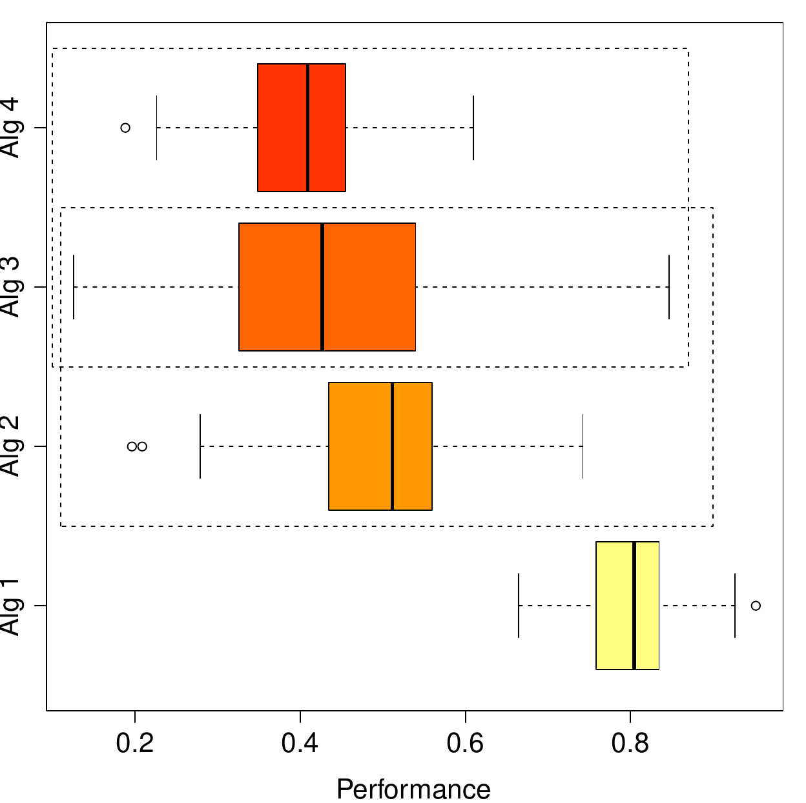
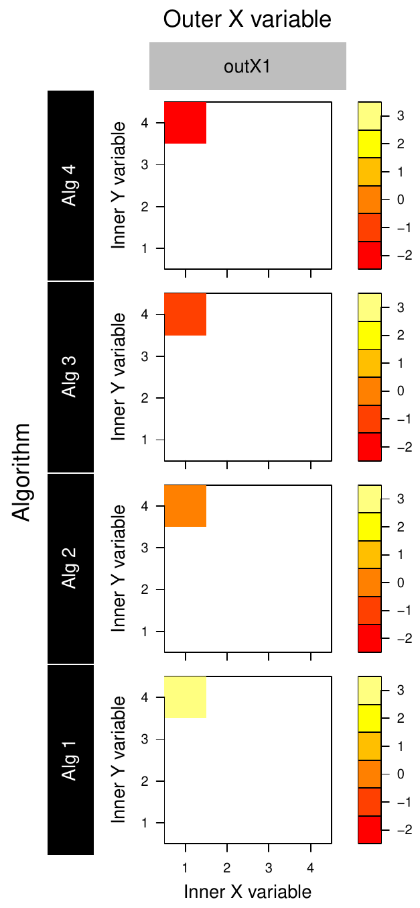
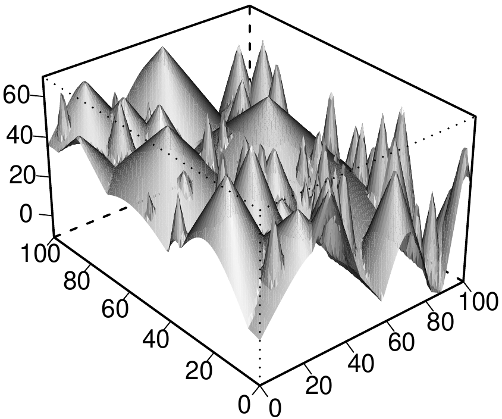

::: article
# Introduction {#sec:intro}

When carrying out research in statistics, operational research and
computer science, the problem of comparing a novel algorithm against
other state-of-the-art techniques arises very often. The same idea can
be applied to many other fields of science when introducing a new method
for solving a well-known task, with the purpose of demonstrating the
superiority of the proposed approach by numerically comparing the
results with those obtained by already existing methods.

For some time now, it is widely accepted that statistical tests are
required to compare several techniques that solve one given task
[@Demsar:2006; @AdvancedInfSci]. This is motivated by the fact -- also
shown by [@Eugster2014] -- that the performance of a technique for
solving a task (for example, supervised classification) heavily depends
on the characteristics of the concrete task instance (in this case, the
data to which a classifier is to be fitted) and thus the experiments
should randomize over a large number of datasets. Even with the same
dataset, the results may vary when considering different subsets of
training/test data (the former are used for fitting the model, and the
latter for evaluating the model once it has been learned and does not
change any more). The same applies to other very common machine learning
tasks such as regression [@regressionTests], approximate optimization
using metaheuristics [@HerreraTestsCEC], and computational intelligence
in general [@Derrac2011]. It should be noted that metaheuristics
employed in optimization are by themselves randomized algorithms.
Therefore, multiple runs of the same algorithm on the same optimization
problem are required to assess an algorithm, as well as testing the
performance over several different functions; we will further elaborate
on this later. In order to analyze the results of these randomized
trials, statistical tests are applied to draw a conclusion about the
superiority of one method over the rest. A vast amount of literature
exists dealing with this specific problem, see @Informs2000
[@Shilane2008; @AdvancedInfSci] and references therein, just to cite a
few.

If one aims to visualize the results of statistical pairwise
comparisons, the volume of data to display grows a lot if we take into
account many problem configurations at the same time. The use of tables
is very common as they summarize a lot of data in a compact way but they
become hard to interpret when the results they contain are grouped in
more than two parameters. It is usually very difficult to draw
conclusions from big result tables, and for that reason, authors have
developed data visualization techniques more sophisticated than boxplots
or line charts, such as the figures presented in @Demsar:2006 to
distinguish between statistically different and indistinguishable
algorithms, and other approaches explained in @Experimental-Methods. A
tool for the same purpose that is worth mentioning is the Model Viewer
feature of the SPSS software [@SPSS]. When applied to hypothesis
testing, it displays the multiple pairwise comparisons output as a
complete graph where nodes represent the groups being compared, and arcs
between them are colored differently according to the $p$-value of the
corresponding comparison (in orange when the $p$-value is below a fixed
significance threshold, and in black otherwise). Two remarkable tools
are available for the R language. The
[*paircompviz*](https://www.bioconductor.org/packages/release/bioc/html/paircompviz.html)
package [@paircompviz], closely related to ours, makes use of Hasse
diagrams with $p$-values in the arcs to represent the outcome of
statistical tests. However, it does not use colors and it is not well
suited for representing a large number of comparisons at once (as
happens when we deal with many different problem configurations) since
the resulting Hasse diagram would be too complex. The
[*factorplot*](https://CRAN.R-project.org/package=factorplot) package
recently published in this journal [@factorplot] focuses on hypothesis
testing concerning the coefficients of generalized linear models or
coefficients in multinomial logistic regression models, representing the
results of the comparisons in grayscale grid plots. Our approach is more
general and is oriented mainly to simulation-based studies.

Approximate optimization and machine learning constitute two areas of
knowledge in which the problem of representing statistical results under
several factors arises naturally. In both cases, we often want to
compare the algorithm performance separately on different problem setups
to highlight the conditions under which certain algorithms may work
specially well. Existing studies in the field of dynamic optimization
employ up to 40 numeric tables or graphs in a paper to summarize their
results, due to the number of different experimental settings tested and
the large amount of parameters involved in each problem configuration.
Obviously, interpreting such a huge amount of numeric results becomes
unfeasible. Moreover, none of the aforementioned visualization
approaches deals well with multiple factor problems.

In order to solve this problem, a novel color-based technique for
multiple pairwise statistical comparisons under several factors, called
Statistical Ranking Color Scheme (SRCS), was introduced in [@NachoSRCS]
for comparing the performance of several dynamic optimization algorithms
under a number of different problem configurations [@delAmo2012]. The
method relies on a wise use of color scales that simplifies the
identification of overall trends along many different problem settings
simultaneously, thus enabling better understanding and interpretation of
the results, and providing an overview of the circumstances under which
each algorithm outperforms (or is outperformed by) the rest. However, no
software package was available so far to automatically generate this
kind of graphs at once from a dataset that collects the numerical
results. The code published in [@NachoSRCS] only calculates the ranking
obtained by several algorithms on a fixed problem configuration, but
does not plot the results nor allows for an automatic computation over a
whole set of different problem configurations in order to obtain the
images shown in [@delAmo2012].

Our aim here is to present an easy-to-use R package called
[*SRCS*](https://CRAN.R-project.org/package=SRCS) [@SRCS] for creating
fully customizable plots from a results file in experiments involving
several factors, so that the user can configure how the plots should be
arranged in the figure and has control over all graphical details of it,
such as colors, fonts, titles, etc. Furthermore, we demonstrate the
applicability of our package in two different contexts. The first is the
comparison of algorithms to solve dynamic optimization problems (DOPs),
which is the setting for which SRCS was originally conceived. The second
is a novel application to machine learning tasks, where SRCS is used to
compare the performance of several supervised classification algorithms
over synthetic datasets created based on several parameters. Examples of
these are noisy and/or imbalanced data for which parameters like the
severity and type of noise, or the imbalance ratio are considered when
generating the dataset from an originally clear one.

The remainder of this contribution is structured as follows. After the
introduction the foundation of the SRCS technique and how multiple
statistical significance results are displayed in color plots is
reviewed. The next section presents an R package implementing SRCS, with
a detailed description of the most important functions, their common
uses and how they should be called. Then we explain two case studies
where *SRCS* has been applied to visualize the statistical results of
comparing a number of algorithms for two very different tasks, namely
dynamic optimization and supervised classification when the data from
which the classifier is learned contain noise or are imbalanced.
Finally, the last section is devoted to conclusions and further work.

# Statistical ranking color scheme {#sec:srcs}

In this section we briefly review the foundations of SRCS [@NachoSRCS].
SRCS was developed for analyzing the relative performance of algorithms
on a problem, rather than the absolute one. In other words, the outcome
is a rank for each algorithm that depends on how many algorithms are
better, equal or worse than the algorithm being ranked, where the
decision on each pairwise comparison is given by a non-parametric
statistical test over two sets of samples corresponding to multiple runs
of each algorithm in exactly the same conditions. No distinction is made
concerning the magnitude of the advantage or disadvantage in the
performance comparison: SRCS is interested only in whether one algorithm
is statistically better or worse than another, but not in how much.

The rank assigned to an algorithm $A_i$ on a problem configuration $c$
(determined by at most 3 parameters) is the sum of the scores obtained
by the algorithm when comparing its performance
$\{\text{perf}_k\}^c_i, \quad k = 1,\ldots,K$ against the rest of the
algorithms (all pairwise comparisons) over the same problem
configuration $c$. The performance is given by a sample composed by $K$
repeated observations obtained after $K$ independent runs of $A_i$ over
the same problem configuration. It is assumed that either the nature of
$A_i$ is itself randomized and gives a different output in each run, as
happens with stochastic optimization algorithms, or the input data used
by $A_i$ are a random sample and thus differ for each run, as happens
for instance when using cross-validation (CV) for assessing a
classification algorithm with a given dataset. In the $m$-fold CV method
(typically $m = 5$ or $m = 10$), $m-1$ folds are used for building a
model and the remaining fold is used for evaluating it and collecting
the performance measure (accuracy or any other). This is repeated until
every fold has been used exactly once as the test fold, hence collecting
$m$ different performance values. If the complete $m$-fold CV process is
repeated $r$ times, each time taking a different $m$-fold partition of
the whole dataset, we obtain $K= m \cdotp r$ independent measurements of
the classifier's performance.

Ranks are calculated as follows. For each $j \neq i$, if the sample
$\{\text{perf}_k\}^c_i$ is statistically better (in the sense of the
performance measure we are using) than $\{\text{perf}_k\}^c_j$, then
$A_i$ adds 1 point to its rank, and $A_j$ subtracts 1 point; if the
opposite occurs, $A_i$ subtracts 1 point and $A_j$ adds 1 point.
Otherwise, both algorithms are statistically equivalent so none of them
modifies its rank. The initial rank of every algorithm is 0. With this
approach, when comparing $N$ algorithms, the maximum rank attainable by
an algorithm is $N-1$, which means it outperforms the rest, and the
minimum is $-(N-1)$, meaning it is outperformed by the rest.

The statistical test applied in pairwise comparisons could be customized
by the user. In our implementation, we abide by the original proposal of
[@NachoSRCS] and use the pairwise Wilcoxon rank sum test with Holm's
correction for multiple comparisons. Whether the test should be paired
or not depends on the concrete problem we are facing, and can be set by
the user. When assessing optimization algorithms, for instance, the test
will most likely be non-paired since usually there is no relation
between, say, the first execution of $A_i$ and the first execution of
$A_j$ on the same problem configuration. In machine learning, the test
should most likely be paired because all algorithms should be evaluated
exactly with the same folds, hence the performance of the first
execution of $A_i$ is paired with the first execution of $A_j$ because
both were done with the same training and test subsets.

The strength of SRCS lies in its capability of arranging in a single
plot the ranks obtained by many algorithms when tested separately over a
lot of different problem configurations. Therefore, one can quickly
visualize which configurations are the most favorable to each algorithm.
This is done by using a grid of heatmaps. A heatmap represents three
variables, namely the rank using a color scheme, and two variables in
the X and Y axis of the heatmap, which we call the inner X and Y
variables. At the same time, the whole heatmap is associated with one
level of the other two variables, called the outer X and Y variables.

{width="84.0%" alt="graphic without alt text"}\
(a) Performance after $K$ independent runs. Dashed lines indicate no
statistically significant differences.\

  ----------- -------- ------- ------- ------ -----------------------------------------------
   Algorithm   Better   Equal   Worse   Rank                       Color

                than     to     than          

     Alg 1       3        0       0      3     {width="0.38cm"}

     Alg 2       1        1       1      0     {width="0.38cm"}

     Alg 3       0        2       1     $-1$   {width="0.38cm"}

     Alg 4       0        1       2     $-2$   {width="0.38cm"}

                                              
  ----------- -------- ------- ------- ------ -----------------------------------------------

  : 

\
(b) Rank calculation and color assigned.

<figure id="fig:demo">
<p><br />
(c) Arrangement in the plot.</p>
<figcaption>Figure 1: Rank calculation of the relative performance of
four algorithms in a problem configuration defined by <em>Inner X
variable = 1, Inner Y variable = 4, Outer X variable =
outX1</em>.</figcaption>
</figure>

Figure [1](#fig:demo) shows a toy example[^1] of ranking calculation and
depiction of a simulated problem involving four algorithms that
constitute the four levels of the outer Y variable. The problem involves
three more variables, namely the outer X variable (from which only the
level *outX1* is displayed), the inner Y variable with four possible
levels, and the inner X variable with four possible levels as well. In
Figure [1](#fig:demo)c the arrangement within the global plot is
displayed for a concrete problem configuration that is allocated in the
top left-most corner (as *inner X variable = 1, inner Y variable = 4*)
of the left-most column of heatmaps (since *outer X variable = outX1*).
The number of levels of all variables does not have to be the same as in
this particular case.

# An R package implementing SRCS {#sec:srcs-R}

The aim of the *SRCS* package is to offer a set of functions to obtain
figures similar to the one above in a straightforward manner and, at the
same time, provide R users with full customization capabilities over
graphical aspects like font size, color, axes aspect and so on. This has
been accomplished by accepting tagged lists that are passed almost
unchanged to some built-in graphical functions of the base package
*graphics* on which our code relies. This package is very flexible and
can be easily adapted so that the final plot has exactly the desired
appearance. Package *grid* was also considered initially, but the
adaptation would require more coding since the default aspect (more
elegant) is slightly more complicated to fit our exact needs.

The general workflow can be summarized as:

1.  Use function `SRCSranks` on the data being analyzed in order to
    compute the rank for each combination of factors according to the
    performance exhibited by that combination, following the rules
    explained in the preceding section.

2.  Use function `plot` on the object returned by `SRCSranks`,
    indicating where each factor should be placed in the resulting plot,
    in order to obtain a color plot depicting the ranks calculated
    previously for all the factor combinations.

3.  (If needed) Use function `SRCScomparison` on the object returned by
    `SRCSranks`, specifying a concrete factor combination as well, to
    obtain a qualitative table describing the relative performance
    (measured from a statistical point of view) of every pair of levels
    of the target variable on the factor combination indicated. Each
    cell of the table contains a sign \"=\", \"\>\" or \"\<\" comparing
    the level on that row with the level on that column, where \"=\"
    stands for \"no statistically significant differences found\".

4.  (If needed) Use function `animatedplot` on the object returned by
    `SRCSranks`, provided that the user data had more than one
    performance column, to visualize a video in which each video frame
    displays the ranks plot obtained by one performance column.

5.  (If needed) Use function `singleplot` on the object returned by
    `SRCSranks`, specifying a factor combination that leaves two factors
    free, to visualize the ranks of one square of the full grid.

## Functions `SRCSranks` and `SRCScomparison` []{#sec:SRCSranks label="sec:SRCSranks"}

Our package exports five functions. Note that most of the arguments have
default values to allow for a straightforward use if no customization is
needed. The one that should be called first, prior to the plotting
functions, is the following:

``` r
SRCSranks(data, params, target, performance, pairing.col = NULL, 
  test = c("wilcoxon", "t", "tukeyHSD", "custom"), fun = NULL, 
  correction = p.adjust.methods, alpha = 0.05, maximize = TRUE, ncores = 1, 
  paired = FALSE)
```

We review the meaning of the arguments below. For further details please
refer to the corresponding help pages.

-   `data` is a data frame containing the repeated performance measures
    together with their problem configuration (Table [1](#tab:paired)).
-   `params` is a vector of strings with the names of the columns that
    define a problem configuration (here: `c("A", "B", "C")`).
-   `target` is the name of the target column whose levels are compared
    within each problem configuration (here, `"Target"`).
-   `performance` is the name of the column containing one or more
    observations of the response (or performance) variable associated to
    a problem configuration and a target level. It can be a string or a
    vector of strings, in which case the ranking process will be done
    independently for each of the performance columns indicated in the
    vector. This feature is used for composing videos showing the
    evolution of the performance at several time instants.
-   `pairing.col` is the name of the column that indicates which
    performance values (corresponding to the same parameter
    configuration but different levels of the target variable) are
    linked with respect to the statistical tests. This value only makes
    sense if we set `paired = TRUE`; otherwise, it will be ignored.
-   `test` is the statistical test (defaults to Wilcoxon) to be used for
    the pairwise comparisons (`paired` indicates whether a paired
    version of the test will be used or not). `"custom"` means a custom
    test will be applied, implemented by the function passed in the
    `fun` argument (which otherwise will be ignored).
-   `fun` is a function implementing a custom statistical test for two
    samples that should return a tagged list with a `p.values` field, as
    occurs with `pairwise.t.test` and `paired.wilcox.test`, containing a
    matrix of $p$-values whose rows and columns have proper names.
-   `correction` is the $p$-value adjustment method for multiple
    pairwise comparisons (defaults to Holm's procedure). It must be one
    of those natively implemented by R (ignored when
    `test = "tukeyHSD"`).
-   `alpha` is the significance threshold for the statistical test.
-   `maximize` indicates whether the larger the performance, the better
    (default) or vice versa.
-   `ncores` is the number of physical cores to be used in the
    computations. Parallelization is achieved through the function
    `parLapply` of the *parallel* package.
-   `paired` indicates whether the multiple pairwise comparison tests
    should be paired or not (defaults to `FALSE`). When set to `TRUE`,
    the repeated performance observations are taken to be linked
    according to the values of the `pairing.col` column. For a given
    combination of `params`, the multiple observations associated to
    distinct levels of the target variable but sharing the same value of
    `pairing.col` are linked, as shown in column *Fold* of Table
    [1](#tab:paired). Hence, all the pairwise comparisons between any
    two levels of the target variable will be paired.

::: {#tab:paired}
  --------------------------------------------------------------------
      A          B          C        Target    Performance     Fold
  ---------- ---------- ---------- ---------- ------------- ----------
    $a_1$      $b_1$      $c_1$       Alg1        72.45         1

   $\vdots$   $\vdots$   $\vdots$   $\vdots$    $\vdots$     $\vdots$

    $a_1$      $b_1$      $c_1$       Alg1        72.36        $K$

    $a_1$      $b_1$      $c_1$       Alg2        70.12         1

   $\vdots$   $\vdots$   $\vdots$   $\vdots$    $\vdots$     $\vdots$

    $a_1$      $b_1$      $c_1$       Alg2        69.89        $K$

    $a_1$      $b_1$      $c_1$       Alg3        85.40         1

   $\vdots$   $\vdots$   $\vdots$   $\vdots$    $\vdots$     $\vdots$

    $a_1$      $b_1$      $c_1$       Alg3        85.21        $K$

   $\vdots$   $\vdots$   $\vdots$   $\vdots$    $\vdots$     $\vdots$
  --------------------------------------------------------------------

  : Table 1: A subset of the input data in a problem with a 3-level
  target variable, three problem-defining parameters A, B, and C, with
  $K$ observations of the performance per problem combination, and
  pairing between the samples. Showing only a fixed problem
  configuration defined by A = $a_1$, B = $b_1$, C = $c_1$. In this
  case, the column called *Fold* acts as the pairing column as it links
  the performance values within a given problem configuration for the
  paired statistical tests.
:::

The above function receives a data frame, chunks it according to all
possible combinations of the values of `params`, and compares the levels
of the `target` variable within each group by applying a statistical
test to each binary comparison with the selected $p$-value adjustment
method. When running in parallel, each processor manages a subset of all
the chunks generated, where a chunk is composed of all the rows
corresponding to a problem configuration. Therefore the input data are
distributed among the processors by subsets of consecutive rows.

The output of the function is an object belonging to the S3 class
'`SRCS`' and extending class '`data.frame`', which is actually a data
frame containing all the `params` and `target` columns, a new `rank`
column, two more columns with the average and the standard deviation of
the performance for each problem combination, and additional columns
summarizing the $p$-values of pairwise comparisons. In case more than
one performance column was passed to the function, the output data frame
will not contain the average, standard deviation and $p$-values columns,
but just one rank column for each of the performance columns of the
input data. The resulting object has been given an S3 class name
'`SRCS`' so that function `plot` can be applied on it after properly
implementing a specific S3 method described below.

Function `SRCScomparison` receives the '`SRCS`' object calculated by
`SRCSranks` together with a problem configuration, and summarizes the
$p$-values of the multiple pairwise comparisons. All the data are
already present in the data frame returned by `SRCSranks` but not in an
easily interpretable disposition. Therefore this function basically
collects the $p$-values and prints them on screen in a nice way, either
as a $p$-value table or showing only the qualitative result of every
statistical comparison, i.e., $>,=,<$ for a fixed $\alpha$, without
presenting the actual $p$-values. The function only works if the
previous call to `SRCSranks` was done with only one `performance`
column, because otherwise no $p$-values or average performances are
calculated in the output data frame. The signature is the following:

``` r
SRCScomparison(rankdata, target, alpha = 0.05, pvalues = FALSE, ...)
```

where `rankdata` is the data frame produced by `SRCSranks`, `target` is
the name of the target column in `rankdata`, `alpha` is the significance
threshold, `pvalues` indicates whether $p$-values or qualitative results
of the comparisons should be printed, and `...` is a succession of named
arguments corresponding to columns of `rankdata` and their values to
fully determine a problem configuration. These named arguments are used
for subsetting `rankdata`. The number of rows of this subset should be
equal to the number of levels of the target variable; otherwise an error
is thrown.

## The S3 `plot` method for '`SRCS`' objects

The data frame produced by `SRCSranks` is usually passed on to the next
function, which is the S3 `plot` method for '`SRCS`' objects and
constitutes the main component of the package:

``` r
plot(x, yOuter, xOuter, yInner, xInner, zInner = "rank",
  out.Y.par = list(), out.X.par = list(), 
  inner.X.par = list(),	inner.Y.par = list(), 
  colorbar.par = list(), color.function = heat.colors,heatmaps.per.row = NULL,		
  heatmaps.titles = NULL, annotation.lab = NULL, show.colorbar = TRUE,			
  heat.cell.par = list(), heat.axes.par = list(), colorbar.cell.par = list(),			
  colorbar.axes.par = list(), annotation.text.par = list())
```

Below we provide a brief description of all the parameters. For further
details please refer to the package help pages. Notice only the first
five arguments are mandatory.

-   `x` is an '`SRCS`' object usually generated by a call to `SRCSranks`
    but can also be directly composed by the user. This way, the user
    can create his own ranks and use the *SRCS* package only to plot
    them, as long as they are properly arranged in a data frame with
    class '`SRCS`' as those generated by `SRCSranks`.
-   `yOuter`, `xOuter`, `yInner`, `xInner`, `zInner` are the names of
    the columns that will be plotted in each of the dimensions of the
    plot; see Figure [1](#fig:demo)c, where the *Algorithm* plays the
    role of the outer Y variable. The `zInner` variable corresponds to
    the rank column, which is plotted using colors in the heatmaps: the
    higher the value of `zInner`, the better, and hence, the lighter the
    color assigned to it. The location of the levels both in the outer
    and inner variables depends on the factor levels for these variables
    when transforming them to factors, a conversion that takes place
    inside the function.
-   `out.Y.par, out.X.par, inner.X.par, inner.Y.par` are tagged lists to
    customize how variable labels and level labels are displayed. Some
    options include hiding a label, setting the character size, color,
    location, orientation, whether it should be placed inside a
    rectangle or not, border and background color of such a rectangle,
    and other parameters that will be passed directly to the `text`
    function in the *graphics* package. Arguments `heat.cell.par`,
    `heat.axes.par`, `colorbar.cell.par`, `colorbar.axes.par` and
    `annotation.text.par` play a similar role.
-   `color.function` is a function returning a vector of hexadecimal
    color codes of length (maxrank $-$ minrank $+$ 1) which will be used
    for displaying the heatmaps. Can be either a custom function or one
    of the existing palettes such as `heat.colors`, `terrain.colors`,
    etc. The function will be called with one argument, namely the
    number of colors to be returned, (maxrank $-$ minrank $+$ 1).
-   `heatmaps.per.row` is an integer indicating whether all the levels
    of the outer X variable are shown horizontally, or broken in two or
    more sub-rows.
-   `show.colorbar` is a Boolean that displays or hides a colorbar used
    as the legend of the figure.
-   `heatmaps.titles` is a vector of strings with the titles of every
    individual heatmap, if needed.
-   `annotation.lab` is an annotation string that will be displayed on
    the top left corner of the plot. This is useful for labeling
    individual plots when composing videos.

The function relies on the `layout` function of the *graphics* package
to automatically compose a suitable layout, taking into account the
number of levels of each variable and the user's choices.

## Functions `animatedplot` and `singleplot`

Function `animatedplot` enables composing videos from sequences of plots
like Figure [3](#fig:dops). This enables the user to visualize time as a
new dimension by plotting statistical pairwise comparison results at
different time moments. This can be useful, for instance, when comparing
convergence speed between many algorithms about which the best solution
so far has been annotated at different moments of the optimization
process. The function relies on R's built-in capability to automatically
compose counter-based filenames when successively generating plots to
image files, and then calls ImageMagick [@imagemagick], a widely used
open-source software for Windows and Linux, to join them together into a
video file. A number of image formats can be used for the images
generated prior to composing the video. Note that those files are not
automatically deleted; the user will have to do it by himself. It is
necessary that the user has previously installed ImageMagick.

The function signature is the following:

``` r
animatedplot(x, filename, path.to.converter, 
  yOuter, xOuter, yInner, xInner, zInner,
  width = 800, height = 800, res = 100, pointsize = 16,
  delay = 30, type = c("png", "jpeg", "bmp", "tiff"), quality = 75, 
  compression = c("none", "rle", "lzw", "jpeg", "zip"), 
  annotations = NULL, ...)
```

In this case, `zInner` should be a vector with the names of the columns
in `x` containing the performance measures to be plotted successively.
The video will have as many frames as elements there are in `zInner`.
The argument `path.to.converter` is a string with the full path of the
converter program that comes with ImageMagick, e.g.,
`"C:/Program Files/ImageMagick-<version>/convert.exe"`. The rest of the
arguments allow setting the name of the output video file (including the
file format) and configure the size, resolution, delay between the
frames (in 1/100th of a second), percentage of quality and type of
compression. The function also gives the possibility to set an
independent annotation in the upper-left corner of each frame by passing
a vector of strings, where each element is the annotation of the
corresponding frame of the sequence. The `...` argument accepts any
subset of the optional arguments to be passed to the S3 `plot` method
for '`SRCS`' objects that plots every frame.

Function `singleplot` creates a single heatmap focused on the problem
configuration defined by the user. It has the following signature:

``` r
singleplot(x, yInner, xInner, zInner = "rank", color.function = heat.colors,
   labels.par = list(), colorbar.par = list(), heat.axes.par = list(), 
   colorbar.axes.par = list(), haxis = TRUE,  vaxis = TRUE,  title = "", 
   show.colorbar = TRUE, ...)
```

The parameters are similar to those already described. The `...`
argument in this case stands for a succession of named arguments (as
many as necessary) that will be used to subset the `data` argument. From
that subset, the values of the `zInner` column will be depicted in a
single heatmap, in the locations indicated the by `yInner` and `xInner`
columns. If any pair of values of columns `(xInner, yInner)` is found
more than once after subsetting, an error is thrown.

# Case studies {#sec:casestudies}

In this section, two examples representative of those typically faced by
potential users will be presented, with the purpose of illustrating the
package capabilities and ease of use. None of them is aimed at finding
the best algorithm for the posed problems, but at showing the
applicability of the package in different areas of knowledge when
analyzing experimental results. Therefore, the details of the
experimental framework in each example (such as the tuning of the
parameters, the concrete algorithms and datasets tested and so on) are
not relevant for the aforementioned purpose[^2].

The first example analyses the results of dynamic optimization
algorithms while the second deals with typical machine learning problems
where several classification algorithms are compared under different
settings or problem configurations. Note that the package is oriented at
the analysis of experimental results, which do not necessarily come from
R code or even from a computer program. In our case, the techniques
assessed in the first example have been implemented in Java and are not
available in R.

## Application to dynamic optimization problems {#subsec:dynamic}

DOPs [@Branke2001] are a variant of classical optimization problems in
which the function being optimized has time-dependent properties, i.e.,
changes along the time during the execution of the optimization
algorithm itself. The changes may affect the fitness function, the
constraints, the number of variables of the function or their domain,
etc. DOPs have attracted increasing attention due to their closeness to
many real-world changing problems, as explained in the aforementioned
work.

Many algorithms have been proposed to solve DOPs as explained in
[@CruzGonzalezPelta2011], most of them based on Evolutionary Algorithms
and other population-based metaheuristics. Here we will reproduce one of
the plots published in [@delAmo2012] representing a broad DOP algorithm
comparison, including the R code necessary to obtain them in a
straightforward way. The numerical results represented in the plots have
been included as a data frame object called `MPB` in the *SRCS* package.
Details on the algorithms compared can be found in the aforementioned
work. Below we briefly comment on the meaning of the parameters involved
in a problem configuration, the performance measure collected in the
file and the fitness function we are optimizing.

In a DOP, the fitness function changes along the time. Several aspects
modulate how this happens, such as the time passed between two
consecutive changes, or the severity of the change (how different the
function is with respect to the previous version). None of these
parameters is known in advance by any algorithm. The third parameter
known to affect the performance is the dimension of the function, which
is user-configurable but remains invariant during the execution.

The fitness function employed, known as the Moving Peaks Benchmark (MPB,
@BrankeCEC1999; see Figure [2](#fig:mpb3D)), was specifically designed
as a DOP benchmark. The problem consists in maximizing a continuous
$n$-dimensional function that results from the superposition of $m$
peaks, each one characterized by its own height ($h^j \in \mathbb{R}$),
width ($w^j \in \mathbb{R}$) and location of its centre
($\boldsymbol{p}^j \in \mathbb{R}^n$):

$$\text{MPB(\textbf{x})} = \stackrel{\text{max}}{j} \left\{ h^j - w^j \sqrt{\sum_{i=1}^n (x_i - p_i^j)^2} \right\}, \quad j = 1,\ldots, m.$$

The global optimum is the centre of the peak with the highest parameter
$h^j$. To make this function dynamic, the parameters of the peaks are
initialized to some prefixed values, but then change every $\omega$
function evaluations according to certain laws (refer to @BrankeCEC1999
[@delAmo2012] for details). The values of the parameters used in the
experiments are summarized in Figure [2](#tab:paramsMPB). The first
three rows can vary to define every single problem configuration, while
the rest are fixed for all problem configurations.

<figure id="fig:mpb3D">
<p> <span id="fig:mpb3D"
label="fig:mpb3D"></span></p>
<figcaption>Figure 2: Experimental setup in the MPB. (The MPB function
in two variables. )</figcaption>
</figure>

::: {#tab:paramsMPB}
  -----------------------------------------------------------------------
  **Parameter**                   **Values tested**
  ------------------------------- ---------------------------------------
  Dimension ($n$)                 {5, 10, 15, 20, 25}

  Change period ($\omega$)        {40, 100, 200, \..., 1000} $\cdotp n$

  Severity ($s$)                  {2%, 4%, \..., 20%} $\cdotp x$ range

  $x$ range                       $[0, 100]$ for every variable

  Correlation coef. ($\lambda$)   0.5

  Number of peaks ($m$)           100

  Peak heights ($h^j$)            $\mathcal{U}[30, 70]$

  Peak widths ($w^j$)             $\mathcal{U}[1, 12]$

  Height severity ($h_s$)         7.0

  Width severity ($w_s$)          1.0
  -----------------------------------------------------------------------

  : Table 2: Parameters used in the MPB experiments.
:::

A lot of different performance measures have been proposed for DOPs as
mentioned in [@CruzGonzalezPelta2011]. Here we employ the most widely
accepted one, namely the *offline error* [@delAmo2012]:

$$e_{off} = \frac{1}{N_c} \sum_{i=1}^{N_c} \frac{1}{N_e(i)} \sum_{j=1}^{N_e(i)} (f_i^* - f_{ij}),$$

where $N_c$ is the total number of changes in the environment during the
execution, $N_e(i)$ is the total number of evaluations allowed in the
$i$-th change, $f_i^*$ is the optimum value of the $i$-th change, and
$f_{ij}$ is the best value found by the algorithm since the beginning of
the $i$-th change up to the $j$-th evaluation. It is defined this way to
favor those algorithms which converge to good solutions very quickly
after each change. Furthermore, since changes take place at a fixed rate
in our experiments ($N_e(i_1) = N_e(i_2) = \ldots = N_e$), the formula
simplifies to

$$e_{off} = \frac{1}{N_c N_e} \sum_{i=1}^{N_c} \sum_{j=1}^{N_e} (f_i^* - f_{ij}).$$
As this is a maximization problem, $f_i^* - f_{ij}$ remains always
positive. For each problem configuration {change period, severity,
dimension}, every algorithm is run $K = 50$ independent times, thus
collecting 50 offline error measurements which will be used to perform
the pairwise statistical tests. In each run, the fitness function
changes $N_c = 100$ times along the execution, at regular time
intervals.

The R code used to plot the results is the following:

``` r
> library(SRCS)
> str(MPB)
'data.frame':   220000 obs. of  5 variables:
 $ Algorithm: Factor w/ 8 levels "reactive-cs",..: 7 7 7 7 7 7 7 7 7 7 ...
 $ Dim      : int  5 5 5 5 5 5 5 5 5 5 ...
 $ CF       : int  40 40 40 40 40 40 40 40 40 40 ...
 $ Severity : int  2 2 2 2 2 2 2 2 2 2 ...
 $ OffError : num  21.8 19.5 16.7 18.3 22.6 ...

> head(MPB)
  Algorithm Dim CF Severity OffError 
1    agents   5 40        2 21.81232 
2    agents   5 40        2 19.53094
3    agents   5 40        2 16.73922
4    agents   5 40        2 18.32204
5    agents   5 40        2 22.61913
6    agents   5 40        2 19.17223
```

The above output is the first part of the 50 performance observations of
algorithm *agents* in the problem configuration defined by *Dim = 5, CF
= 40, Severity = 2*. Note that the tests should be non-paired as there
is no relation between the runs of the algorithms.

``` r
> ranks <- SRCSranks(MPB, params = c("Dim", "CF", "Severity"), 
+    target = "Algorithm", performance = "OffError", maximize = FALSE, ncores = 2)
> head(ranks);
       Algorithm Dim CF Severity rank  mean    sd agents.pval independent-cs.pval
1         agents   5 40        2    0 18.16 2.698          NA           8.993e-12
2 independent-cs   5 40        2   -5 22.86 1.850   8.993e-12                  NA
3           mqso   5 40        2    3 16.86 1.824   1.346e-01           1.324e-15
4      mqso-both   5 40        2    4 16.58 2.094   2.646e-02           5.349e-15
5    mqso-change   5 40        2    4 16.58 2.094   2.646e-02           5.349e-15
6      mqso-rand   5 40        2    4 16.58 2.094   2.646e-02           5.349e-15
  reactive-cs.pval mqso.pval mqso-both.pval mqso-change.pval mqso-rand.pval
1        8.993e-12 1.346e-01      2.646e-02        2.646e-02      2.646e-02
2        1.000e+00 1.324e-15      5.349e-15        5.349e-15      5.349e-15
3        1.324e-15        NA      1.000e+00        1.000e+00      1.000e+00
4        5.349e-15 1.000e+00             NA        1.000e+00      1.000e+00
5        5.349e-15 1.000e+00      1.000e+00               NA      1.000e+00
6        5.349e-15 1.000e+00      1.000e+00        1.000e+00             NA
  soriga.pval
1   2.812e-12
2   1.466e-01
3   4.419e-15
4   5.349e-15
5   5.349e-15
6   5.349e-15
```

Note that the $K$ rows per problem configuration present in the input
data have now collapsed into one row per problem configuration,
containing the average performance of the $K$ observations, their
standard deviation, the rank achieved by that configuration, and the
corrected $p$-values of the multiple pairwise statistical tests against
the other levels of the target variable in the same problem
configuration. We can now plot these results with the following code:

``` r
> plot(ranks, yOuter = "Algorithm", xOuter = "Dim", yInner = "CF", xInner = "Severity", 
+ ## all the remaining arguments are optional, for customizing the appearance
+   inner.Y.par = list(levels.at = c("40", "200", "400", "600", "800", "1000"), 
+     lab = "Change\n period", levels.loc = "left"), 
+   out.Y.par = list(levels.lab.textpar = list(cex = 1, col = "white"), 
+     levels.bg = "black", levels.border = "white"), 
+   out.X.par = list(lab = "Dimension", levels.bg = "gray"),
+   colorbar.par = list(levels.at = c("-7", "0", "7")),
+   colorbar.axes.par = list(cex.axis = 0.8), 
+   show.colorbar = TRUE
+ )
```

![Figure 3: Results of several dynamic optimization algorithms on the
MPB. This plot mirrors Figure 5 of [@delAmo2012].[]{#fig:dops
label="fig:dops"}](pdf/dops.png){#fig:dops width="100%"
alt="graphic without alt text"}

The results are depicted in Figure [3](#fig:dops), which should be
interpreted as follows: for a given value of *Dimension*, one should
look at the whole column of heatmaps vertically to know how the
algorithms behave for that dimension. The arrangement of the cells
within the heatmaps is analogous to Figure [1](#fig:demo)c. From the
figure, we can see that, for instance, *soriga* only behaves well
(although it is not the best one) when the change period is short, and
this is enhanced when increasing the dimensionality of the problem. This
amounts to say that *soriga* is specially good at detecting a change and
recovering from it by quickly discovering promising regions after the
change, although it is not so good at exploiting these regions (it is
beaten by other algorithms when the change period gets larger). On the
other hand, *agents* also improves its behaviour when the dimensionality
grows above 15 (otherwise, *mqso-rand* dominates the rest when
considering a 5- or 10-variable fitness function), but also when
severity increases, becoming the best algorithm in those cases (right
part of the heatmaps).

We could ask for a single heatmap as well, defined by some values of the
outer Y and X variables, for instance *Algorithm = soriga* and
*Dimension = 25*, using the following call:

``` r
> singleplot(x = ranks, zInner = "rank", yInner = "CF", 
  xInner = "Severity", colorbar.par = list(levels.at = c("-7", "0", "7")),
  labels.par = list(ylab = "Change period"), Algorithm = "soriga", Dim = "25")
```

![Figure 4: A single heatmap generated by `singleplot` for problem
configurations where *Algorithm = soriga, Dimension =
25*.[]{#fig:singleplot
label="fig:singleplot"}](pdf/singleplot.png){#fig:singleplot
width="100%" alt="graphic without alt text"}

The output is shown in Figure [4](#fig:singleplot). To obtain a
qualitative performance comparison for a given problem configuration,
for instance when *Change period = 40, Dimension = 25, Severity = 20*,
we can use the following call:

``` r
SRCScomparison(ranks, "Algorithm", CF = 40, Dim = 25, Severity = 20, pvalues = FALSE)
```

which will produce the following matrix object as a result:

::: small
``` r
             agents indep-cs mqso mqso-both mqso-change mqso-rand reactive-cs soriga
agents       NA     "<"      "<"  "<"       "<"         "<"       "<"         "<"   
indep-cs     ">"    NA       "<"  "<"       "<"         "<"       "="         ">"   
mqso         ">"    ">"      NA   ">"       "="         ">"       ">"         ">"   
mqso-both    ">"    ">"      "<"  NA        "<"         "="       ">"         ">"   
mqso-change  ">"    ">"      "="  ">"       NA          ">"       ">"         ">"   
mqso-rand    ">"    ">"      "<"  "="       "<"         NA        ">"         ">"   
reactive-cs  ">"    "="      "<"  "<"       "<"         "<"       NA          ">"   
soriga       ">"    "<"      "<"  "<"       "<"         "<"       "<"         NA 
```
:::

#### Composing a video file to visualize convergence

In the vignette associated to this package it is shown how to create a
video to visualize an extra temporal component in the results. The data
were collected from the aforementioned executions of dynamic
optimization algorithms over the MPB problem, annotating the offline
error at the instant before every change. Both the data, the R script
and the resulting video can be downloaded from the first author's
personal home page[^3], which is also given as URL in the package
description. Please refer to the vignette for further details.

## Application to machine learning: Noisy datasets {#subsec:machine-learning1}

The second case study is a machine learning experiment involving six
supervised classification algorithms tested over a number of noisy
datasets with several types of noise and noise severities. The aim is to
assess how noise affects each of the classifiers and whether the
behaviour changes with those parameters. The algorithms tested were the
following: (a) the *$k$-Nearest-Neighbours* classifier with three
different values of $k$ ($k = 1$, $k = 3$ and $k = 5$), (b) *Repeated
Incremental Pruning to Produce Error Reduction* (RIPPER), (c) a *Support
Vector Machine* (SVM), and (d) the C4.5 tree-based rule induction
classifier. The reader may refer to [@Cohen95FastEffective; @bishop2006]
for a review of all these algorithms.

R implementations have been used in all cases. We coded the $k$-NN to
incorporate the HVDM distance [@HVDM-JAIR] for heterogeneous (continuous
and nominal) attributes. The SVM was taken from the
[*e1071*](https://CRAN.R-project.org/package=e1071) package, version
1.6-4 [@e1071], which contains a wrapper for the libsvm C++ library
[@libsvm]. Algorithms C4.5 and RIPPER were taken from
[*RWeka*](https://CRAN.R-project.org/package=RWeka), version 0.4-24
[@RWekapaper], which offers an R interface to the Weka framework
[@Weka]. The datasets employed in the experiment (Table
[3](#tab:datasets-ml1)) have been taken from the UCI repository
[@Lichman:2013], and are among the most widely used in machine learning
studies. For each dataset, the number of classes (#CL), the number of
examples (#EX) and the number of attributes (#AT), along with the number
of numeric and nominal attributes are presented.

::: {#tab:datasets-ml1}
  --------------------------------------------------------------------------------------------
  **Dataset**    **#EX**    **#AT**     **#CL**  **Dataset**    **#EX**    **#AT**    **#CL**
  ------------- --------- ------------ --------- ------------- --------- ----------- ---------
  automobile       159     25 (15/10)      6     glass            214      9 (9/0)       7

  balance          625      4 (4/0)        3     ionosphere       351     33 (33/0)      2

  cleveland        297     13 (13/0)       5     pima             768      8 (8/0)       2

  ecoli            336      7 (7/0)        8     vehicle          846     18 (18/0)      4
  --------------------------------------------------------------------------------------------

  : Table 3: Description of the classification datasets.
:::

In the literature, two types of noise can be distinguished in a dataset
[@Zhu04classnoisevsattributenoise]: (i) *class noise* (examples labeled
with a class distinct from the true one) and *attribute noise* (that
usually refers to erroneous attribute values). The amount and type of
noise present in real-world datasets are usually unknown. In order to
control the amount of noise in the datasets and check how it affects the
classifiers, noise is introduced into each dataset in a controlled
manner. Four different noise schemes have been used in order to
introduce a noise level $x\%$ into each dataset
[@Zhu04classnoisevsattributenoise]:

1.  **Introduction of class noise.**

    -   *Random class noise* (CLA_RAND). $x\%$ of the examples are
        randomly selected and turned corrupt. The class labels of these
        examples are randomly replaced by another one from the $M$
        classes.
    -   *Pairwise class noise* (CLA_PAIR). Let $X$ be the majority class
        and $Y$ the second majority class. An example with the label $X$
        has a probability of $x/100$ of being incorrectly labeled as
        $Y$.

2.  **Introduction of attribute noise.**

    -   *Random attribute noise* (ATT_RAND). $x\%$ of the values of each
        attribute in the dataset are randomly selected and turned
        corrupt. To corrupt each attribute $AT_i$, $x\%$ of the examples
        in the dataset are chosen, and their $AT_i$ value is replaced by
        a random value from the domain $\mathbb{D}_i$ of the attribute
        $AT_i$. An uniform distribution is used for both numerical and
        nominal attributes.
    -   *Gaussian attribute noise* (ATT_GAUS). This scheme is similar to
        the uniform attribute noise, but in this case, the $AT_i$ values
        are corrupted, adding a random value to them following a
        Gaussian distribution of *mean* $= 0$ and *standard deviation*
        $= (max-min)/5$, being *max* and *min* the limits of the
        attribute domain ($\mathbb{D}_i$). Nominal attributes are
        treated as in the case of the uniform attribute noise.

The four noise schemes have been considered independently and for each
type of noise, the noise levels ranging from $x = 0\%$ (base datasets)
to $x = 50\%$, by increments of 5%, have been studied. The accuracy
estimation of the classifiers in a dataset is obtained by means of a
stratified 5-fold cross-validation, which is the standard in the field.
For obtaining multiple observations, the cross-validation procedure was
repeated five times, thus obtaining $K = 25$ performance (accuracy rate)
values for each algorithm in each problem configuration, defined by
{dataset, noise type, noise severity}. These values will later be used
in pairwise statistical comparisons. For a given problem configuration,
exactly the same partitions of a dataset were used with all the
algorithms, and for that reason, the observations are paired (recall
Table [1](#tab:paired)).

Performing pairwise comparisons separating the results by dataset can be
particularly useful in certain machine learning works which include a
very small number of datasets. In those studies, the conventional
approach consisting in summarizing the performance of an algorithm over
a dataset with a single value and applying post-hoc pairwise comparisons
between the algorithms with these summaries does not work, because each
of the samples being compared has too few elements (due to the reduced
number of datasets) to apply a statistical test. In such cases, the SRCS
approach would be more suitable and would yield a reliable comparison
for each dataset separately.

The R script which runs the algorithms over the datasets mentioned and
generates the results to be analyzed can be downloaded from the first
author's home page mentioned before, together with the datasets. The
performance results obtained are already included in the package, to
save time. When *SRCS* is loaded, a data frame object called `ML1`
containing the results of this experiment is created:

``` r
> str(ML1)

'data.frame':   52800 obs. of  6 variables:
 $ Algorithm  : Factor w/ 6 levels "1-NN","3-NN",..: 1 1 1 1 1 1 1 1 1 1 ...
 $ Dataset    : Factor w/ 8 levels "automobile","balance",..: 1 1 1 1 1 1 1 1 1 1 ...
 $ Noise type : Factor w/ 4 levels "ATT_GAUS","ATT_RAND",..: 1 1 1 1 1 1 1 1 1 1 ...
 $ Noise ratio: num  0 0 0 0 0 0 0 0 0 0 ...
 $ Fold       : int  1 2 3 4 5 6 7 8 9 10 ...
 $ Performance: num  77.4 54.5 86.7 81.2 84.8 ...

> head(ML1)

  Algorithm    Dataset Noise type Noise ratio Fold Performance
1      1-NN automobile   ATT_GAUS           0    1    77.41935
2      1-NN automobile   ATT_GAUS           0    2    54.54545
3      1-NN automobile   ATT_GAUS           0    3    86.66667
4      1-NN automobile   ATT_GAUS           0    4    81.25000
5      1-NN automobile   ATT_GAUS           0    5    84.84848
6      1-NN automobile   ATT_GAUS           0    6    84.37500
```

The R code to compute and plot the ranks with *SRCS* is the following.

``` r
> ranks <- SRCSranks(ML1, params = c("Dataset", "Noise type", "Noise ratio"),
+   target = "Algorithm", performance = "Performance", pairing.col = "Fold",
+   maximize = TRUE, ncores = 1, paired = TRUE)
> plot(ranks, yOuter = "Dataset", xOuter = "Algorithm", yInner = 
+   "Noise type", xInner = "Noise ratio", zInner = "rank", out.X.par = 
+   list(levels.lab.textpar = list(col = "white"), levels.bg = "black", 
+   levels.border = "white"), out.Y.par = list(levels.bg = "gray"), 
+   colorbar.axes.par = list(cex.axis = 0.8), show.colorbar = TRUE)		
```

The results are summarized in Figure [5](#fig:ml1). This figure shows
that higher values of $k$ in the $k$-NN classifier make the model
perform better than lower values of $k$ (with the exception of the
automobile dataset, where the opposite happens). Thus, 5-NN generally is
better than 3-NN, and 3-NN is better than 1-NN for the different
datasets considered. This fact is in accordance with the work of
[@Kononenko07MachineLearning] that claimed that the value of $k$ in
$k$-NN determines a higher or lower sensitivity to noise. SVM presents
variable results, depending on the dataset analyzed. For some of them,
such as automobile or glass, the results are predominantly in red
colours. Other datasets, such as vehicle or cleveland, show that SVM can
work relatively well when the noise level is low, but its performance is
deteriorated when the noise level increases. These facts agree with the
results of the literature that state that SVM is usually
noise-sensitive, particularly with high noise levels
[@2010-AIR-Nettleton]. However, for other datasets considered, such as
balance, SVM obtains good results. Finally, one must note that both C4.5
and RIPPER, which are considered robust to noise
[@Zhu04classnoisevsattributenoise], obtain intermediate results in the
eight datasets considered.

![Figure 5: Results of six supervised classification algorithms on eight
noisy datasets. []{#fig:ml1 label="fig:ml1"}](pdf/ml1.png){#fig:ml1
width="100%" alt="graphic without alt text"}

# Conclusions and further work {#sec:conclusions}

In this paper we have introduced an R package called *SRCS*, aimed at
testing and plotting the results of multiple pairwise statistical
comparisons in different configurations of a problem, defined by several
parameters. The package implements a previously published visualization
technique to summarize the output of many comparisons at the same time
by using a careful spatial arrangement to display the result for each
problem configuration defined by a parameter combination. As we have
explained, our code gives the user full control over all the graphical
options so as to fully customize the plot. Furthermore, we have taken
this approach a step further by considering the time as another
parameter. This turns static images into videos to take into account
this new dimension, but allows constructing convergence plots for all
problem configurations simultaneously. It should be noticed that, while
videos have been conceived to represent convergence, they can also be
used with another variable in any setting in which it makes sense to
watch the evolution of statistical results.

We have successfully applied our package to two very different problems,
namely dynamic optimization problems and machine learning problems. The
latter represents a novel use of SRCS that has proven very helpful for
comparing classification algorithms under different circumstances of
noise type, noise levels, imbalance ratios and shape of the data. The
SRCS approach enables visualizing the results of a number of algorithms
at a glance, which in turns leads to an easier interpretation and may
also reveal trends relating different problem configurations that
otherwise would be harder to uncover, such as the configurations where
each algorithm (or family of algorithms) performs best.

An interesting improvement would consist in adding interactivity to the
plots. The user could manually re-arrange the plots or add/remove
problem parameters and/or target levels, and visually check whether such
modifications cause a strong change in the results or not as the plot
would be automatically updated.

# Acknowledgments

This work is supported by projects TIN2011-27696-C02-01 from the Spanish
Ministry of Science and Innovation, P11-TIC-8001 from the Andalusian
Government, and FEDER funds. P. J. Villacorta acknowledges support from
an FPU scholarship from the Spanish Ministry of Education, and J. A.
Sáez, from EC under FP7, Coordination and Support Action, Grant
Agreement Number 316097, ENGINE European Research Centre of Network
Intelligence for Innovation Enhancement (<http://engine.pwr.wroc.pl/>).
We are thankful to Dr. Antonio D. Masegosa from the University of
Deusto, Spain, for suggesting the use of video sequences for visualizing
the convergence of dynamic optimization algorithms, which has proven
very successful for this purpose.

\

\
:::

[^1]: Refer to Section [4](#sec:casestudies) for real examples.

[^2]: This section has been expanded in the package vignette with a
    third case study.

[^3]: <http://decsai.ugr.es/~pjvi/r-packages.html>
