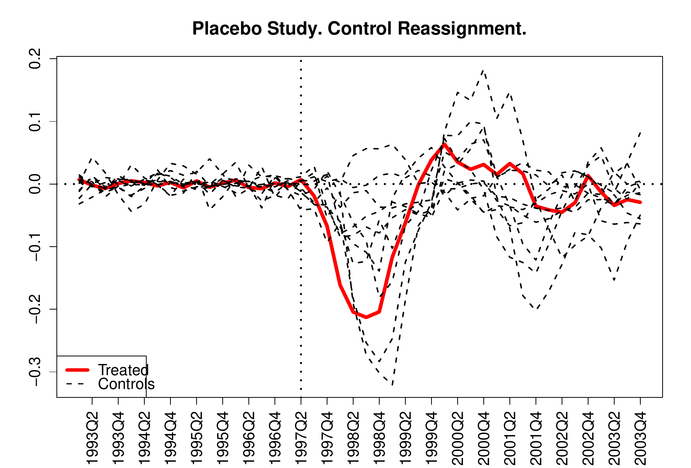
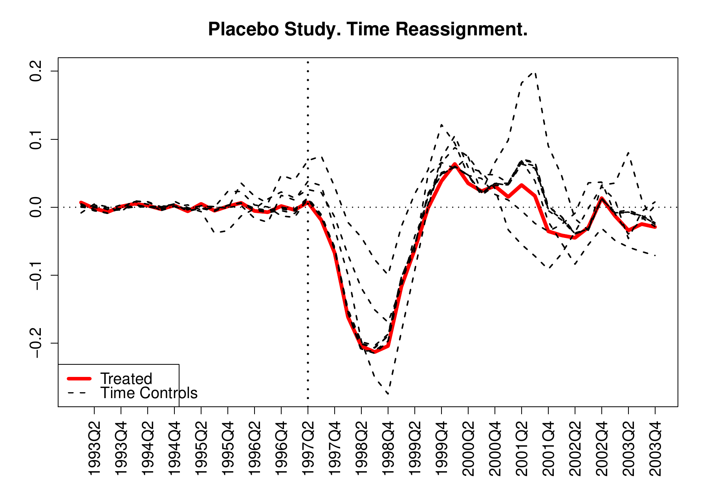
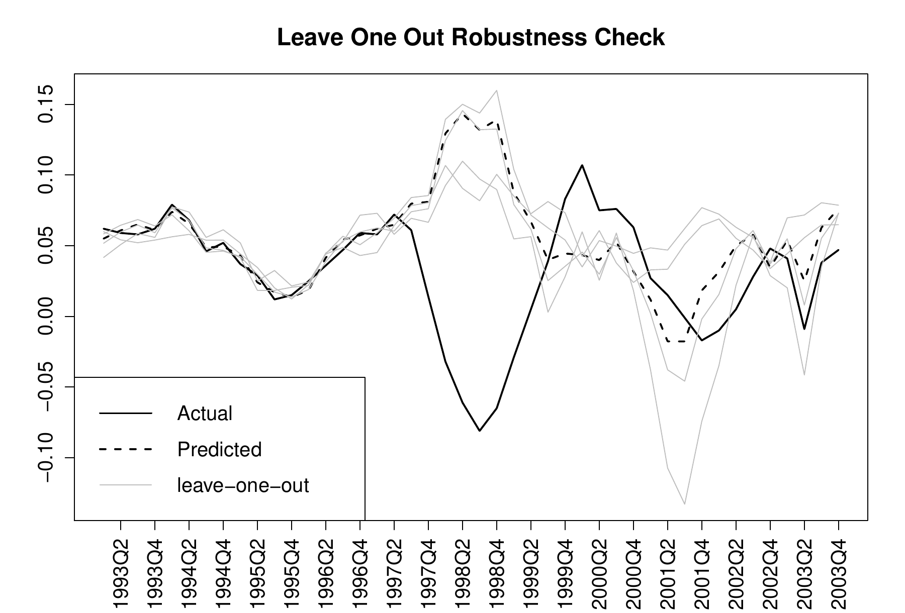

::: article
# An introduction to the panel data approach and program evaluation methods

Program evaluation methodologies have long been used by social
scientists to measure the effect of different economic or political
interventions (treatments). The problem is, of course, that you cannot
observe the outcome both under the intervention and in the absence of
the intervention simultaneously, hence the need for program evaluation
methods. Traditionally, comparative case studies have been the preferred
method by researchers in order to compare units affected by a treatment
or event (dubbed the treatment group) to one or more units not affected
by this intervention (the control group). The idea is to use the outcome
of the control group to obtain an approximation of what would have been
the outcome of the treated group had it not been treated. In more recent
years, synthetic control methods
[@AbadieGardeazabal03; @AbadieDiamondTobacco] have addressed these
issues by introducing a data-driven procedure for selecting the control
group. However, the synthetic control methods are not without
shortcomings: since the synthetic control is calculated as a convex
combination of the units in the donor pool, and thus it does not allow
for extrapolation, it might be that a suitable synthetic control for our
treated unit does not exist. Furthermore, the synthetic control is
designed to be used with explanatory variables or covariates that help
explain the variance in the outcome variable. For the cases when the
researcher finds that extrapolation is needed to obtain a suitable
comparison for the treated unit, or when the covariates available do not
properly explain the outcome on which the effect of the treatment is
intended to be measured, he or she might prefer to use the panel data
approach for program evaluation by [@HsiaoPanelData]. The panel data
approach for constructing the counterfactual of the unit subjected to
the intervention is to use other units that are not subject to the
treatment to predict what would have happened to the treated unit had it
not been subject to the policy intervention. The basic idea behind this
approach is to rely on the correlations among cross-sectional units.
They attribute the cross-sectional dependence to the presence of common
factors that drive all the relevant cross-sectional units.

As such, the aim of this article is to present the package
[*pampe*](https://CRAN.R-project.org/package=pampe) that implements the
panel data approach for program evaluation procedures in R, which is
available from the Comprehensive R Archive Network (CRAN) at
<http://CRAN.R-project.org/package=pampe>. The main function in the
package is `pampe()`, which computes the counterfactual for the treated
unit using the modeling strategy outlined by [@HsiaoPanelData]. The
function includes an option to obtain placebo tests. There is an
additional function `robustness()`, which conducts a leave-one-out
robustness on the results. The data example is also from
[@HsiaoPanelData], which introduced the panel data approach methodology
to study the effect of the political and economic integration of Hong
Kong with mainland China using other countries geographically and
economically close to Hong Kong as possible controls.

The article is organized as follows. The following section is a brief
overview of the panel data approach as defined by [@HsiaoPanelData]. The
main section of the paper, titled [3](#implementation), demonstrates the
implementation of this method and the use of the *pampe* package with an
example, including how to perform inference and robustness checks.

# The panel data approach method for program evaluation {#method}

The panel data approach for program evaluation exploits the dependence
among cross-sectional units to construct a counterfactual of the treated
unit(s), to estimate how the affected unit would have developed in the
absence of an intervention. The estimated effect of the policy
intervention is therefore simply the difference between the actual
observed outcome of the treated unit and this estimated counterfactual.
[@HsiaoPanelData] provide a thorough description of the methodology.
Here the focus is on how this method is implemented in the *pampe*
package and thus only a brief overview of the procedure is provided.

Let us consider $J+1$ units over $t=1, \ldots, T, \ldots, T'$ periods.
Without loss of generality, only the first unit is affected
uninterruptedly by an intervention in period $T$ during periods
$T, T+1, \ldots, T'$, after an initial pre-intervention period
$1, \ldots, T-1$. The left over $J$ units are the controls that form the
so-called "donor pool", and they are not affected by the intervention.
Let $Y_{jt}$ denote the outcome variable -- the variable for which the
intervention effect is being measured -- of unit $j$ at period $t$.
$Y_{jt}^1$ and $Y_{jt}^0$ denote the outcome of unit $j$ at time $t$
under treatment and in the absence of treatment respectively. We usually
do not simultaneously observe both $Y_{jt}^1$ and $Y_{jt}^0$, but
instead we observe $Y_{jt}$, which can be written as
$$Y_{jt}=d_{jt}Y_{jt}^1 + (1-d_{jt}) Y_{jt}^0;$$
where $d_{jt}$ is a dummy variable that takes value 1 if unit $j$ is
under treatment at time $t$, and value 0 otherwise [@RubinCausalModel].
In this case and without loss of generality, only the first unit is
under intervention, so we have that
$$d_{jt}=\left\{\begin{array}{cl}1 & if j=1  and  t\geq T,  \\0 & otherwise.\end{array}\right.$$
The treatment or intervention effect for the treated unit can therefore
be expressed as
$$\alpha_{1t} = Y_{1t}^1 - Y_{1t}^0.$$
Of course, we do not observe $Y_{1t}^0$ for $t \geq T$. Thus, the goal
of the panel data approach is to obtain an estimate for the effect of
the intervention, $\widehat{\alpha}_{1t}$, during the post-treatment
period $T, \ldots, T'$ by attempting to replicate the economy of the
treated unit in the pre-intervention period $1, \ldots, T-1$; that is,
by obtaining an estimate of the outcome variable under no treatment
$Y_{1t}^0$. It is assumed that there is no treatment interference
between units, i.e., the outcome of the untreated units is not affected
by the treatment of the treated unit.

The panel data approach developed by [@HsiaoPanelData] attempts to
predict $Y^0_{1t}$ for $t \geq T$ and therefore to estimate the
treatment effect $\alpha_{1t}$ by exploiting the dependency among
cross-sectional units in the donor pool and the treated unit, using the
following modeling strategy: use $R^2$ (or likelihood values) in order
to select the best OLS estimator for $Y^0_{1t}$ using $j$ out of the $J$
units in the donor pool, denoted by $M(j)^*$ for $j=1, \ldots, J$; then
choose $M(m)^*$ from $M(1)^*$, ..., $M(J)^*$ in terms of a model
selection criterion, like AICc, AIC or BIC.[^1]

This strategy is founded on the following underlying model.
[@HsiaoPanelData] assume that $Y^0_{it}$ is generated by a dynamic
factor model of the form:

$$\label{eq:hsiaoeq}
Y^0_{jt}=\gamma_j+\mathbf{f}_t\mathbf{b}_j+\varepsilon_{it},   (\#eq:hsiaoeq)$$

where $\gamma_j$ denotes an individual-specific effect, $\mathbf{f}_t$
is a $(1 \times K)$ vector that denotes time varying unobserved common
factors, $\mathbf{b}_j$ denotes a $(K \times 1)$ vector of constants
that can vary across units, $K$ is the number of common factors, and
$\varepsilon_{jt}$ is the time varying idiosyncratic component of
individual $j$.

$Y^0_{1t}$ could be predicted using the underlying model
[@HsiaoPanelData] specify and the assumptions they delineate. Instead,
they suggest a more practical approach, i.e., using the remaining
non-intervened units in the donor pool
$Y_{-1t}=(Y_{2t}, \ldots, Y_{Jt})$ to predict $Y_{1t}^0$
$$\label{hsiaoeqmodel}
Y^0_{1t} = \alpha+\beta Y_{-1t}+\varepsilon_{1t}.   (\#eq:hsiaoeqmodel)$$
Note that the panel data approach calculates $OLS$ models of up to $J+1$
parameters; so that if the length of the pre-treatment period
$t=1, 2, \ldots, T'-1$ is not of a much higher order than that, the
regressions $M(J-1)^*, M(J)^*$ cannot be calculated because there are
not enough degrees of freedom. To avoid this problem, we propose the
following slight modification to the previously outlined modeling
strategy: use $R^2$ in order to select the best OLS estimator for
$Y^0_{1t}$ using $j$ out of the $J$ units in the donor pool, denoted by
$M(j)^*$ for $j=1, \ldots, T_0-4$; then choose $M(m)^*$ from $M(1)^*$,
..., $M(T_0-4)^*$ in terms of a model selection criterion (in our case
AICc). Note that the key difference is that while we allowed models up
to $M(J)^*$, this is now modified to allow models up to $M(T_0-4)^*$,
with $T_0-4<J$.[^2]

To implement the method, the *pampe* package relies on the use of the
`regsubsets()` function from the
[*leaps*](https://CRAN.R-project.org/package=leaps) package by [@leaps].
The main user-available function of the *pampe* package, also called
`pampe()`, calculates all OLS models for $Y^0_{1t}$ as dependent
variable and using $j$ out of the $J$ units in the donor pool as
explanatory variables, denoted by $M(j)^*$ for $j=1, \ldots, J$ or up to
order $J'<J$ if specified by the user, which would override the default
outlined above; then the best one is kept in terms of a model selection
criterion ($AIC$, $AICc$, or $BIC$) also specified by the user.

In order to perform inference on the results obtained, the package
implements the so-called placebo studies procedure outlined in
[@AbadieGardeazabal03; @AbadieDiamondTobacco] and [@AbadieGermany].[^3]
The basic idea behind the placebo studies is to iterate the application
of the panel data approach by reassigning the treatment to other
non-treated units, i.e., to the controls in the donor pool; or by
reassigning the treatment to other pre-intervention periods, when the
treatment had yet to occur. The set of placebo effects can therefore be
compared to the effect that was estimated for the "real" time and unit,
in order to evaluate whether the effect estimated by the panel data
approach when and where the treatment actually occurred is large
relative to the placebo effects.

# Implementing *pampe* in R {#implementation}

This section expands on the implementation of the method itself as well
as the placebo studies and how they can be interpreted by the user by
means of two examples: the political and economic integration of Hong
Kong with mainland China in 1997 and 2004, plus the reassignation of the
treatment to other units in the control group and different
pre-treatment dates. [@HsiaoPanelData] use a combination of other
countries to construct a counterfactual for Hong Kong that resembled the
economy prior to the political and economic integration. The `growth`
dataset, obtained from the supplemental materials of [@HsiaoPanelData]
contains information on the quarterly real GDP growth rate of 24
countries (the donor pool) and Hong Kong from 1993 Q1 to 2008 Q1,
computed as the change with respect to the same quarter in the previous
year.

``` r
> library("pampe")
> data("growth")
```

The data is organized in standard cross-sectional data format, with the
variables (the quarterly real GDP growth rate of the countries in the
donor pool act as explanatory variables) extending across the columns
and the quarters (time-periods) extending across rows. It is important
for the user to have his or her data in this standard format to
correctly apply the methodology. Naming the rows and especially the
columns is also strongly recommended though not required.

If the user does not have the data in standard wide format, the `pampe`
package also includes an optional `pampeData` function that prepares the
data according to the required format. It also helps reshape the data in
case the user has it in long format. This function should be run prior
to the `pampe` function. For example, if we had a dataset in long format
such as the `Produc` dataset from the `plm` package:

``` r
> library("plm")
> data(Produc, package = "plm")
> long.data <- plm.data(Produc)
> head(long.data)
```

``` r
    state year     pcap     hwy   water    util       pc   gsp    emp unemp
1 ALABAMA 1970 15032.67 7325.80 1655.68 6051.20 35793.80 28418 1010.5   4.7
2 ALABAMA 1971 15501.94 7525.94 1721.02 6254.98 37299.91 29375 1021.9   5.2
3 ALABAMA 1972 15972.41 7765.42 1764.75 6442.23 38670.30 31303 1072.3   4.7
4 ALABAMA 1973 16406.26 7907.66 1742.41 6756.19 40084.01 33430 1135.5   3.9
5 ALABAMA 1974 16762.67 8025.52 1734.85 7002.29 42057.31 33749 1169.8   5.5
6 ALABAMA 1975 17316.26 8158.23 1752.27 7405.76 43971.71 33604 1155.4   7.7
```

Note that `"year"` is the name of the time index and `"state"` is the id
index, and that there is data on eight variables. If we want to keep
data on the variable \"pcap\" and transform that into a wide format, in
which `"year"` spans across rows and `"state"` across columns, we can
use the following call to `pampeData` for that.

``` r
> wide.data <- pampeData(long.data, start = 1970, frequency = 1,
+                        timevar = "year", idvar = "state", "yvar" = "pcap")
> wide.data[1:5, 1:5]                   
```

``` r
      ALABAMA  ARIZONA ARKANSAS CALIFORNIA COLORADO
1970 15032.67 10148.42  7613.26   128545.4 11402.52
1971 15501.94 10560.54  7982.03   132263.3 11682.06
1972 15972.41 10977.53  8309.01   134451.5 12010.91
1973 16406.26 11598.26  8399.59   135988.4 12473.28
1974 16762.67 12129.06  8512.05   136827.3 12964.14
```

Of course, the data above is for the `"pcap"` variable.

Having introduced the optional data preparation, let us now continue
with the main function and example of this paper, the `growth` dataset
and the `pampe` function. Observe how the `wide.data` above is in an
equivalent format as the `growth` data below after having applied the
`pampeData` function.

``` r
> growth[1:10, 1:5]
```

``` r
       HongKong   Australia      Austria     Canada      Denmark
1993Q1    0.062 0.040489125 -0.013083510 0.01006395 -0.012291821
1993Q2    0.059 0.037856919 -0.007580798 0.02126387 -0.003092842
1993Q3    0.058 0.022509481  0.000542671 0.01891943 -0.007764421
1993Q4    0.062 0.028746550  0.001180751 0.02531683 -0.004048589
1994Q1    0.079 0.033990391  0.025510849 0.04356715  0.031094401
1994Q2    0.068 0.037919372  0.019941313 0.05022538  0.064280003
1994Q3    0.046 0.052289413  0.017087875 0.06512183  0.045955455
1994Q4    0.052 0.031070896  0.023035197 0.06733068  0.055166411
1995Q1    0.037 0.008696091  0.025292696 0.05092120  0.048057177
1995Q2    0.029 0.006773674  0.021849955 0.03152506  0.011953605
```

In this example, the treated unit -- Hong Kong -- is in the first
column, while the 24 non-treated units are in columns 2 to 25; and the
time-periods (quarters) are in rows. Note how both the rows and the
columns are named for ease of use and interpretation.

## Using the function `pampe()`

Once the data is in the correct format, it is just a matter of applying
the `pampe()` command to the dataset. Note that it requires a balanced
dataset, i.e., no missing values are allowed.[^4] As the bare minimum,
the command requires the arguments specified in Table
[1](#tab-necessary).

::: {#tab-necessary}
  -------------- -------------------------------------------------------------------------------------------------------------------------------------------------------------------------------------------------------------
  ` `            

  `time.pretr`   The pre-treatment periods, up to the introduction of the treatment. For example, if you have 10 pre-treatment periods and the treatment was introduced in the 11th period, this argument could be `1:10`.

  `time.tr`      The treatment period plus the periods for which you want to check the effect. For example, if the treatment was introduced in the 11th period and you want results for 9 more periods, it would be `11:20`.

  `treated`      The treated unit, i.e., the unit that receives the intervention. It can be a name or the index of the column if the columns in the data matrix are named (which is recommended).

  `data`         The name of the data matrix to be used, e.g., `growth`.
  -------------- -------------------------------------------------------------------------------------------------------------------------------------------------------------------------------------------------------------

  : Table 1: Necessary arguments for the `pampe` function.
:::

No additional arguments are necessary, though one may choose to pass
other arguments as well. Setting the `controls` argument is especially
recommended, otherwise the default is to use all the remaining
(non-treated) columns in the dataset as controls. For example, let us
run the `pampe()` functions using only the bare-bones arguments for the
economic integration of Hong Kong as carried out by [@HsiaoPanelData].
We first set the pre-treatment and treatment periods; the economic
integration of Hong Kong happened in 2004Q1. The pre-treatment period
therefore ranges from 1993Q1 to 2003Q4, and the treatment and
post-treatment goes from 2004Q1 to 2008Q1. It is useful to define the
periods objects before calling the function so that you can use them
later when processing the results, although inputting them directly into
the function call is of course an option.

``` r
> time.pretr <- c("1993Q1", "2003Q4")
> time.tr <- c("2004Q1", "2008Q1")
> ## Or if you know the row indexes use those directly, e.g.
> time.tr <- 45:61
> ## The treated unit
> treated <- "HongKong"
> ## Call the function with the bare minimum arguments specified
> econ.integ <- pampe(time.pretr = time.pretr, time.tr = time.tr,
+                     treated = treated, data = growth)
```

Notice that the defaults, which are used in this case, are to use all
the controls and the AICc criterion. You can print out a summary of the
optimal model:

``` r
> summary(econ.integ$model)

Call:
lm(formula = fmla, data = data[time.pretr, ])

Residuals:
      Min        1Q    Median        3Q       Max 
-0.016264 -0.008368 -0.001369  0.008332  0.031529 

Coefficients:
             Estimate Std. Error t value Pr(>|t|)    
(Intercept) -0.001940   0.003703  -0.524  0.60339    
Austria     -1.011560   0.168235  -6.013 6.03e-07 ***
Italy       -0.317654   0.159060  -1.997  0.05321 .  
Korea        0.344735   0.046899   7.351 9.72e-09 ***
Mexico       0.312858   0.051008   6.134 4.14e-07 ***
Norway       0.322183   0.053776   5.991 6.45e-07 ***
Singapore    0.184509   0.054569   3.381  0.00172 ** 
---
Signif. codes:  0 '***' 0.001 '**' 0.01 '*' 0.05 '.' 0.1 ' ' 1

Residual standard error: 0.0117 on 37 degrees of freedom
Multiple R-squared:  0.931,  Adjusted R-squared:  0.9198 
F-statistic: 83.16 on 6 and 37 DF,  p-value: < 2.2e-16
```

This replicates the results obtained by [@HsiaoPanelData] for the
economic integration of Hong Kong using all 24 units as the possible
controls, and the $AICc$ selection criterion. That is, the
counterfactual for Hong Kong is built as a combination of Austria,
Italy, Korea, Mexico, Norway, and Singapore; i.e., those are the
countries that best replicate the economy of Hong Kong in the period
prior to the economic integration, according to the model by
[@HsiaoPanelData].

If one wishes to fine-tune the process, the arguments specified in Table
[2](#tab-nonnecessary) can be passed to the function as well.[^5]

::: {#tab-nonnecessary}
  ------------ ---------------------------------------------------------------------------------------------------------------------------------------------------------------------------------------------------------------------------------------------------------------------------------------------------------------------------------------------------------------------------------------------------------------------------------------------------------------------------------------------------------------------------------------------------------------------------------------------------------------------------------------------------------------------------------------------------------------
  ` `          

  `controls`   The units used as controls to calculate the counterfactual, that have not received the treatment. By default, all the remaining (after removing the treated) columns in the data matrix are included as columns, but specific controls can be specified using their column name, e.g., `c("Australia", "Austria", "Canada")`, or their column index, e.g., `2:4`.

  `nbest`      The original method by [@HsiaoPanelData] specifies to keep the best model in terms of $R^2$ for each $M(j)$, hence the default of this argument is one. However the user might choose to keep the best 2, 3, ...before moving on to the second step of the method by changing the default of this argument.

  `nvmax`      Indicates how many subsets of controls should the method check in the first step of the model. The original method by [@HsiaoPanelData] checks all subsets up to the biggest size, $M(j)^*$ up to $M(J)^*$ and hence the default (`nvmax = J`); but if the pre-treatment period is too short such that this might not be possible, the slight modification if checking subsets up to $T_0-4$ is proposed and this is the alternative default the method takes if $J$ is too big for the pre-treatment period and the user has not specified an alternative `nvmax`. If the user-specified `nvmax` is too big, it will throw out an error indicating to change this argument or reduce the number of controls.

  `select`     The model selection criterion for the second step of the method. In the original article they propose either $AICc$ (default) or $AIC$. The user can choose between those two or $BIC$ as well.
  ------------ ---------------------------------------------------------------------------------------------------------------------------------------------------------------------------------------------------------------------------------------------------------------------------------------------------------------------------------------------------------------------------------------------------------------------------------------------------------------------------------------------------------------------------------------------------------------------------------------------------------------------------------------------------------------------------------------------------------------

  : Table 2: Other non-required arguments for the `pampe` function.
:::

For example, let us now try to replicate the results obtained by
[@HsiaoPanelData] for the political integration of Hong Kong using the
$AICc$ criterion. If one were not to specify the set of possible
controls as they do, the function would aimt to use all controls. Since
those are too many given the pre-treatment period and the user has not
specified a custom `nvmax`, the default `nvmax` setting would switch to
the length of the pre-treatment period minus four to allow for at least
three degrees of freedom.

The treated unit remains the same, but the pre-treatment and treatments
are different. If we call the function with the AICc criterion, and use
the default (`"All"`) for the controls:

``` r
> treated <- "HongKong" 
> time.pretr <- 1:18  # 1993Q1-1997Q2 
> time.tr <- 19:44 # 1997Q3-2003Q4
> pol.integ.all <- pampe(time.pretr = time.pretr, time.tr = time.tr,
+                        treated = treated, data = growth, select = "AICc")
```

We will obtain the following results:

``` r
Call:
lm(formula = fmla, data = data[time.pretr, ])

Residuals:
       Min         1Q     Median         3Q        Max 
-1.330e-03 -3.293e-04  9.270e-06  1.610e-04  1.621e-03 

Coefficients:
               Estimate Std. Error t value Pr(>|t|)    
(Intercept)    0.121549   0.003623  33.552 6.80e-10 ***
Canada         0.448293   0.027020  16.591 1.76e-07 ***
Germany        0.193300   0.040933   4.722  0.00150 ** 
Italy          0.657226   0.069384   9.472 1.27e-05 ***
Japan         -0.923212   0.038457 -24.007 9.66e-09 ***
Korea         -1.022964   0.040920 -24.999 7.01e-09 ***
UnitedKingdom  0.856127   0.054689  15.654 2.77e-07 ***
Philippines   -0.849836   0.042193 -20.142 3.85e-08 ***
Indonesia     -0.118165   0.016813  -7.028  0.00011 ***
Thailand       0.221161   0.021389  10.340 6.61e-06 ***
---
Signif. codes:  0 '***' 0.001 '**' 0.01 '*' 0.05 '.' 0.1 ' ' 1

Residual standard error: 0.001186 on 8 degrees of freedom
Multiple R-squared:  0.9982,  Adjusted R-squared:  0.9962 
F-statistic: 498.3 on 9 and 8 DF,  p-value: 5.029e-10
```

That is, the call does not throw out an error because of the slightly
modified modeling strategy specified in the previous section, but this
does not replicate the results obtained by [@HsiaoPanelData] and might
not be what the user wants.

In this case, to replicate their results, the set of possible controls
has to be specified first, and then we call the function:

``` r
> possible.ctrls <- c("China", "Indonesia", "Japan", "Korea", "Malaysia", 
+                     "Philippines", "Singapore", "Taiwan", "UnitedStates", "Thailand")
> pol.integ <- pampe(time.pretr = time.pretr, time.tr = time.tr, treated = treated,
+                    controls = possible.ctrls, data = growth)
```

``` r
Call:
lm(formula = fmla, data = data[time.pretr, ])

Residuals:
      Min        1Q    Median        3Q       Max 
-0.007304 -0.004851  0.001140  0.004367  0.007178 

Coefficients:
             Estimate Std. Error t value Pr(>|t|)    
(Intercept)   0.02630    0.01705   1.543   0.1469    
Japan        -0.67596    0.11169  -6.052 4.08e-05 ***
Korea        -0.43230    0.06338  -6.821 1.22e-05 ***
UnitedStates  0.48603    0.21952   2.214   0.0453 *  
Taiwan        0.79259    0.30989   2.558   0.0238 *  
---
Signif. codes:  0 '***' 0.001 '**' 0.01 '*' 0.05 '.' 0.1 ' ' 1

Residual standard error: 0.005775 on 13 degrees of freedom
Multiple R-squared:  0.9314,  Adjusted R-squared:  0.9103 
F-statistic: 44.15 on 4 and 13 DF,  p-value: 1.919e-07
```

This replicates their results. Note that this output suggests that out
of the pre-selected potential controls (China, Indonesia, Japan, Korea,
Malaysia, Philippines, Singapore, Taiwan, United States, and Thailand)
the model suggests that a combination of Japan, Korea, United States,
and Taiwan is the optimal one to replicate the economy of Hong Kong in
the pre-economic integration period, while discarding the remaining
countries.

If the user wants to replicate their results with AIC:

``` r
> pol.integ.aic <- pampe(time.pretr = time.pretr, time.tr = time.tr,
+                        treated = treated, controls = possible.ctrls,
+                        data = growth, select = "AIC")
```

``` r
Call:
lm(formula = fmla, data = data[time.pretr, ])

Residuals:
       Min         1Q     Median         3Q        Max 
-0.0068954 -0.0030066  0.0009741  0.0024680  0.0078690 

Coefficients:
             Estimate Std. Error t value Pr(>|t|)    
(Intercept)   0.03161    0.01639   1.928 0.077815 .  
Japan        -0.69002    0.10560  -6.534 2.79e-05 ***
Korea        -0.37668    0.06884  -5.472 0.000143 ***
UnitedStates  0.80994    0.28729   2.819 0.015480 *  
Philippines  -0.16237    0.09993  -1.625 0.130163    
Taiwan        0.61889    0.31097   1.990 0.069850 .  
---
Signif. codes:  0 '***' 0.001 '**' 0.01 '*' 0.05 '.' 0.1 ' ' 1

Residual standard error: 0.005442 on 12 degrees of freedom
Multiple R-squared:  0.9438,  Adjusted R-squared:  0.9204 
F-statistic:  40.3 on 5 and 12 DF,  p-value: 4.291e-07
```

Thus, the user can play around with the `controls`, `nbest`, `nvmax` and
`select` arguments such that they better suit their needs and their
particular dataset. As the bare minimum, `time.pretr`, `time.tr`,
`treated` and `data` are required for the function to run.

## Obtaining and transmitting results

Once the function has been correctly run and the user is satisfied with
the model, the next step is to process the results obtained. The
`pampe()` function returns an object of class '`pampe`' with the objects
specified in Table [3](#tab-results).[^6]

::: {#tab-results}
  ------------------ --------------------------------------------------------------------------------------------------------------------------------------------------------------
  ` `                

  `controls`         A named vector of the controls finally included in the model.

  `model`            An object of class '`lm`' with the optimal model. Usual methods such as `fitted()`, `residuals()`, `summary()`, etc. can be used on it.

  `counterfactual`   A named matrix of the actual path together with the path of the estimated counterfactual for the `time.pretr` and `time.tr` periods.

  `data`             The data used for the estimation, stored for later use in, for example, the `robustness` function also included in the package, which is explained later on.
  ------------------ --------------------------------------------------------------------------------------------------------------------------------------------------------------

  : Table 3: Results given by the `pampe` function.
:::

Continuing with the example of the political integration of Hong Kong
with the $AICc$ criterion and the set of possible controls as specified
by [@HsiaoPanelData]:

``` r
> ## Setup
> treated <- "HongKong"
> time.pretr <- 1:18  # 1993Q1-1997Q2 
> time.tr <- 19:44 # 1997Q3-2003Q4
> possible.ctrls <- c("China", "Indonesia", "Japan", "Korea", "Malaysia", 
+                     "Philippines", "Singapore", "Taiwan", "UnitedStates", "Thailand")
> ## Call the function with AICc and the possible controls
> pol.integ <- pampe(time.pretr = time.pretr, time.tr = time.tr, treated = treated, 
+                    controls = possible.ctrls, data = growth)
```

``` r
Call:
lm(formula = fmla, data = data[time.pretr, ])

Residuals:
      Min        1Q    Median        3Q       Max 
-0.007304 -0.004851  0.001140  0.004367  0.007178 

Coefficients:
             Estimate Std. Error t value Pr(>|t|)    
(Intercept)   0.02630    0.01705   1.543   0.1469    
Japan        -0.67596    0.11169  -6.052 4.08e-05 ***
Korea        -0.43230    0.06338  -6.821 1.22e-05 ***
UnitedStates  0.48603    0.21952   2.214   0.0453 *  
Taiwan        0.79259    0.30989   2.558   0.0238 *  
---
Signif. codes:  0 '***' 0.001 '**' 0.01 '*' 0.05 '.' 0.1 ' ' 1

Residual standard error: 0.005775 on 13 degrees of freedom
Multiple R-squared:  0.9314,  Adjusted R-squared:  0.9103 
F-statistic: 44.15 on 4 and 13 DF,  p-value: 1.919e-07
```

Let us check the additional results:

``` r
> pol.integ
```

``` r
$controls
[1] "Japan"        "Korea"        "UnitedStates" "Taiwan"      

$model
Call:
lm(formula = fmla, data = data[time.pretr, ])
Coefficients:
 (Intercept)         Japan         Korea  UnitedStates        Taiwan  
      0.0263       -0.6760       -0.4323        0.4860        0.7926  
      
$counterfactual
     1993Q1      1993Q2      1993Q3      1993Q4      1994Q1      1994Q2 
 0.05499950  0.06083154  0.06502118  0.06102413  0.07395480  0.06554503 
     1994Q3      1994Q4      1995Q1      1995Q2      1995Q3      1995Q4 
...
 
 $data
 ...
```

A `summary()` method is included for objects of class '`pampe`', with
useful information for the researcher:

``` r
> summary(pol.integ)
```

``` r
Selected controls:
 Japan, Korea, UnitedStates, and Taiwan.

Time-average estimated treatment effect:
 -0.0396291

Optimal model estimation results:

              Estimate Std. Error t value  Pr(>|t|)    
(Intercept)   0.026300   0.017048  1.5427   0.14689    
Japan        -0.675964   0.111688 -6.0522 4.084e-05 ***
Korea        -0.432298   0.063377 -6.8211 1.223e-05 ***
UnitedStates  0.486032   0.219521  2.2141   0.04531 *  
Taiwan        0.792593   0.309892  2.5576   0.02385 *  
---
Signif. codes:  0 '***' 0.001 '**' 0.01 '*' 0.05 '.' 0.1 ' ' 1

Residual standard error: 0.0058 on 13 degrees of freedom
Multiple R-squared: 0.931,     Adjusted R-squared: 0.91
F-statistic: 44.15 on 4 and 13 DF, p-value: 1.919427e-07
 
```

Although not directly printed, the `summary()` method for objects of
class '`pampe`' also includes the actual and counterfactual paths which
can be accessed via `summary(pol.integ)$res.table`. We can also
manipulate `pol.integ$model` as we wish with the usual methods since it
is an object of class '`lm`'. For example, `summary(pol.integ$model)`
can be used to obtain a summary, `residuals(pol.integ$model)` for the
residuals, or `fitted(pol.integ$model)` to recover the estimated values.

Another method included in the package is `plot()`. It works on objects
of class '`pampe`' to produce a plot of the actual evaluation of the
treated unit together with the predicted counterfactual path. A simple
plot call to our saved '`pampe`' object, `plot(pol.integ)`, would
produce Figure [1](#fig:1).

{#fig:1 width="100%"
alt="graphic without alt text"}

If, however, we want to produce and manipulate our own plot, it is just
a matter of running a `matplot()` of the actual value together with the
counterfactual saved in the results of the function (see
Figure [2](#fig:2)):

``` r
> ## A plot of the actual Hong Kong together with the predicted path
> matplot(c(time.pretr, time.tr), pol.integ$counterfactual, type = "l", xlab = "",
+         ylab = "GDP growth", ylim = c(-0.15, 0 .15), col = 1, lwd = 2, xaxt = "n")
> ## Axis labels & titles
> axis(1, at = c(time.pretr, time.tr)[c(seq(2, length(c(time.pretr, time.tr)),
+      by = 2))], labels = c(rownames(growth)[c(time.pretr, time.tr)
+      [c(seq(2, length(c(time.pretr, time.tr)), by = 2))]]), las = 3)
> title(xlab = "Quarter", mgp = c(3.6, 0.5, 0))
> ## Legend
> legend("bottomright", c("Hong Kong", "predicted Hong Kong"),
+        col = 1, lty = c(1, 2), lwd = 2)
> ## Add a vertical line when the tr starts
> abline(v = time.pretr[length(time.pretr)], lty = 3, lwd = 2)
```

{#fig:2
width="100%" alt="graphic without alt text"}

To obtain a plot of the estimated treatment effect, we first calculate
the treatment effect, which is the difference between the actual and
predicted (counterfactual) path; then we plot it (see
Figure [3](#fig:3)). Note that if the method works well to replicate the
economy in the pre-treatment period, the treatment effect should be
around zero in the pre-treatment period.

``` r
> tr.effect <- pol.integ$counterfactual[, 1] - pol.integ$counterfactual[, 2]
> ## A plot of the estimated treatment effect
> plot(c(time.pretr, time.tr), tr.effect, type = "l", ylab = "GDP growth", 
+      xlab = "", col = 1, lwd = 2, xaxt = "n")
> ## Axis labels & titles
> axis(1, at = c(time.pretr, time.tr)[c(seq(2, length(c(time.pretr, time.tr)),
+      by = 2))], labels = c(rownames(growth)[c(time.pretr, time.tr)
+      [c(seq(2, length(c(time.pretr, time.tr)), by = 2))]]), las = 3)
> title(xlab = "Quarter", mgp = c(3.6, 0.5, 0))
> ## Legend
> legend("topleft", "Treatment Effect", col = 1, lty = 1, lwd = 2)
> ## Add a vertical line when the treatment starts
> abline(v = time.pretr[length(time.pretr)], lty = 3, lwd = 2)
> ## Horizontal line on zero
> abline(h = 0, lty = 3, lwd = 2)
```

{#fig:3 width="100%"
alt="graphic without alt text"}

The user might also be interested in exporting tables that show the
results of the procedure, to be used in a LaTeX document. Simply
manipulating the data and using `xtable` from the package of the same
name [*xtable*](https://CRAN.R-project.org/package=xtable) [@xtable] one
can obtain the tables shown in [@HsiaoPanelData]. An `xtable` method is
also included for this purpose, which requires the output of the
'`pampe`' object and the user specifying which table type he or she
wants: the table of the model or the treatment table, which includes the
actual, predicted, and treatment paths.

``` r
> library("xtable")
> xtable(pol.integ, ttype = "model")
> xtable(pol.integ, ttype = "treatment")
```

## Placebo tests {#placebos}

In order to perform inference on the results obtained, the package
implements the so-called placebo studies procedure outlined in
[@AbadieGardeazabal03; @AbadieDiamondTobacco] and [@AbadieGermany]. The
idea is to iterate the application of the panel data approach by
reassigning the treatment to other non-treated units, i.e., to the
controls in the donor pool; or by reassigning the treatment to other
pre-intervention periods, when the treatment had yet to occur. The set
of placebo effects can therefore be compared to the effect that was
estimated for the "real" time and unit, in order to evaluate whether the
effect estimated by the panel data approach when and where the treatment
actually occurred is large relative to the placebo effects.

The function `pampe()` has both placebo studies (placebo-controls and
placebos-in-time) built in. Thus the user can obtain the results from
the placebo studies and perform this type of statistical inference
simply by switching the last argument of the function `pampe()`,
`placebos`, from the default `FALSE` to either `"controls"`, `"time"`,
or `"Both"`. Continuing the previous example, the call to the function
is identical to the `pol.integ` one except that now we also ask for the
placebos. The other arguments are inherited from before.

``` r
> pol.integ.placebos <- pampe(time.pretr = time.pretr, time.tr = time.tr,
+                             treated = treated, controls = possible.ctrls,
+                             data = growth, placebos = "Both")
```

Now the results obtained, besides `pol.integ.placebos$controls`,
`$model`, and `$counterfactual` like before, include the ones in Table
[4](#tab-results2).

::: {#tab-results2}
  ----------------- --------------------------------------------------------------------------------------------------------------------------------------------------------------------------------------------------------------------------------------------------------------------------------------------------------------------------------------
  ` `               

  `placebo.ctrls`   A list which includes another two objects: `$mspe` and `$tr.effect`. The first includes the mspe for the pre-treatment period (`time.pretr`) and the second is the estimated treatment effect for the treated unit in the first column and for the countries in the original donor pool (`possible.ctrls`) in the remaining columns.

  `placebo.time`    The same as `placebo.ctrl` but with the reassignment of the treatment in time, to periods in the pre-treatment period (the reassignment is from half of the pre-treatment period until the period previous to the actual treatment).
  ----------------- --------------------------------------------------------------------------------------------------------------------------------------------------------------------------------------------------------------------------------------------------------------------------------------------------------------------------------------

  : Table 4: Additional results from the `pampe` function.
:::

For example, if we take a look at the first five rows and columns of
`pol.integ.placebos$` `placebo.time$tr.effect`:

``` r
             1997Q3        1995Q3        1995Q4        1996Q1        1996Q2
1993Q1  0.007000500 -0.0084630055  0.0005825015  0.0005170915  3.642217e-05
1993Q2 -0.001831535  0.0046961110  0.0036438429  0.0009914089 -6.703595e-04
1993Q3 -0.007021179  0.0005439412 -0.0035785257 -0.0003308651 -2.804963e-03
1993Q4  0.000975869 -0.0065735180 -0.0041505788 -0.0021485760  3.376669e-03
1994Q1  0.005045203  0.0081985975  0.0036386090  0.0003446360  1.552006e-04
```

We can see that it is a table with the estimated treatment effects
(difference between actual and predicted); the first column shows the
actual treatment effect, whereas in the remaining columns we have the
estimated treatment effect after having reassigned the treatment to
other periods, specified in the column name. In this case, the second
column has the treatment reassigned to 1995Q3.

Now these additional results can be used for plots and to check whether
the treatment effect is significant. When the saved '`pampe`' object has
placebo studies stored inside, a `plot()` call to the '`pampe`' object
will produce the placebo plot(s) as well as the initial actual/predicted
path plot. The placebo plot for the control reassignment is given in
Figure [4](#fig:4).

{#fig:4 width="100%"
alt="graphic without alt text"}

Or again, the user might want to produce their own plot to adapt it to
their required style:

``` r
> mspe <- pol.integ.placebos$placebo.ctrl$mspe
> linewidth  <- matrix(2, 1, ncol(mspe) - 1)
> linewidth <- append(linewidth, 5, after = 0)
> 
> matplot(c(time.pretr, time.tr), pol.integ.placebos$placebo.ctrl$tr.effect,
+         type = "l", xlab = "", ylab = "GDP growth gap",
+         col = c("red", matrix(1, 1, ncol(mspe) - 1)),
+         lty = c(1, matrix(2, 1, ncol(mspe) - 1)), lwd = linewidth,
+         ylim = c(-0.35, 0.2), xaxt = "n")
> ## Axis
> axis(1, at = c(time.pretr, time.tr)[c(seq(2, length(c(time.pretr, time.tr)),
+      by = 2))], labels = c(rownames(growth)[c(time.pretr, time.tr)
+      [c(seq(2, length(c(time.pretr, time.tr)), by = 2))]]), las = 3)
> title(xlab = "Quarter", mgp = c(3.6, 0.5, 0))
> ## Legend
> legend("bottomleft", c("Hong Kong", "Controls"), col = c("red", 1),
+        lty = c(1, 2), lwd = c(5, 2))
> ## Horizontal & vertical lines
> abline(h = 0, lty = 3, lwd = 2)
> abline(v = time.pretr[length(time.pretr)], lty = 3, lwd = 2)
```

Note that, contrary to what it could appear from the large size of the
estimated treatment shown in the initial plots, the effect does not
appear to be significant. This is because after re-applying the method
to all other 8 countries from the set of possible controls, the effect
for Hong Kong is not an outlier, i.e., the estimated effect for the
controls -- when there should be none -- is similar to the result
obtained for Hong Kong. For the effect of the political integration of
Hong Kong to be significant it would have to be a true outlier, almost
the only one with a non-zero gap. Also important is the fact that while
this inference method is different from the one applied by
[@HsiaoPanelData], which can be implemented by the user with R functions
such as `acf()` and `arima()`, the conclusion is the same as theirs: the
political integration of Hong Kong with mainland China does not have an
effect on real GDP growth.

As an example of what a significant treatment effect would look like, we
carry out the treatment-reassignment placebo tests for the economic
integration of Hong Kong, which [@HsiaoPanelData] find to be
significant.

``` r
> time.pretr <- c("1993Q1", "2003Q4")
> time.tr <- c("2004Q1", "2008Q1")
> ## Or if you know the row indexes use those directly, e.g.
> time.tr <- 45:61
> ## The treated unit
> treated <- "HongKong"
> econ.integ.placebos <- pampe(time.pretr = time.pretr, time.tr = time.tr, 
+                              treated = treated, data = growth, 
+                              placebos = "controls")
> plot(econ.integ.placebos)                             
```

{#fig:5 width="100%"
alt="graphic without alt text"}

The previous call will produce Figure [5](#fig:5). The reader will
observe how, for the economic integration, the estimated treatment
effect is in fact an outlier when compared to the controls. Since it is
an outlier, together with another two or three of the units, out of 24
controls, we can say it is significant at least at a 5% level.

Let us now check the results obtained from the placebos-in-time. This
tests for the causal nature of the effect. If by reassigning the
treatment to a previous period we observe that the estimated path (in
the pre-treatment period) does not appear to have an effect, but there
is still an effect in the actual treatment, then one can assume that the
estimated effect is indeed caused by the treatment (though in this case
it turns out to be non-significant).

A basic plot can be produced by calling `plot(pol.integ)`, which would
give Figure [6](#fig:6).

{#fig:6
width="100%" alt="graphic without alt text"}

Or the user can produce his or her own plot:

``` r
> ## Plot of the placebos-in-time 
> ## For example let's plot the first time reassignment, to 1995Q3
> ## (2nd column)
> placebo.in.time1 <- pol.integ.placebos$placebo.time$tr.effect[, 2] +
+                     growth[c(time.pretr, time.tr), 1]
> matplot(c(time.pretr, time.tr), cbind(growth[c(time.pretr, time.tr), 1],
+         pol.integ.placebos$counterfactual, placebo.in.time1), type = "l", 
+         ylab = "GDP growth", xlab = "", ylim = c(-0.25, 0.2), col = 1, 
+         lwd = 3, xaxt = "n")
> ## Axis
> axis(1, at = c(time.pretr, time.tr)[c(seq(2, length(c(time.pretr, time.tr)),
+      by = 2))], labels = c(rownames(growth)[c(time.pretr, time.tr)
+      [c(seq(2, length(c(time.pretr, time.tr)), by = 2))]]), las = 3)
> title(xlab = "Quarter", mgp = c(3.6, 0.5, 0))
> ## Legend
> legend("bottomleft", c("actual", "predicted", paste("placebo",
+        colnames(pol.integ.placebos$placebo.time$tr.effect)[2], sep = " ")),
+        col = 1, lty = c(1, 2, 3), lwd = 3)
> ## Two vertical lines
> abline(v = time.pretr[length(time.pretr)], lty = 2, lwd = 3)
> abline(v = which(colnames(pol.integ.placebos$placebo.time$tr.effect)[2] 
+        == rownames(growth)), lty = 3, lwd = 3)
> ## We can also plot the gaps all at the same time
> mspe <- pol.integ.placebos$placebo.time$mspe
> linewidth  <- matrix(2, 1, ncol(mspe) - 1)
> linewidth <- append(linewidth, 5, after = 0)
> 
> matplot(c(time.pretr, time.tr), pol.integ.placebos$placebo.time$tr.effect, 
+         type = "l", xlab = "", ylab = "GDP growth gap", 
+         col = c("red", matrix(1, 1, ncol(mspe) - 1)),
+         lty = c(1, matrix(2, 1, ncol(mspe) - 1)), lwd = linewidth, 
+         ylim = c(-0.35, 0.2), xaxt = "n")
> ## Axis        
> axis(1, at = c(time.pretr, time.tr)[c(seq(2, length(c(time.pretr, time.tr)),
+      by = 2))], labels = c(rownames(growth)[c(time.pretr, time.tr)
+      [c(seq(2, length(c(time.pretr, time.tr)), by = 2))]]), las = 3)
> title(xlab = "Quarter", mgp = c(3.6, 0.5, 0))
> ## Legend
> legend("topleft", c("Hong Kong", "Controls"), col = c("red", 1), 
+        lty = c(1, 2), lwd = c(5, 2))
> ## Horizontal line
> abline(h = 0, lty = 3, lwd = 2)
```

The first example replicates the previous time reassignment plot. The
second example would produce Figure [7](#fig:7).

{#fig:7 width="100%"
alt="graphic without alt text"}

## Robustness checks

Besides placebo studies for inference tests, [@AbadieGermany] show the
importance of running robustness checks on the results obtained. This
section demonstrates how to implement the so-called leave-one-out
robustness check, which iteratively removes one of the units in the
control group of the final model, to check whether the results are
driven by one unit in particular or, in contrast, the results are robust
to removing one unit.

The leave-one-out robustness check can be applied using the other
user-available function included in the package, `robustness()`. After
applying the initial function `pampe()`, the user can carry out the
robustness check simply by calling the function `robustness()` and
specifying the name of the saved object from the `pampe` call.

``` r
> rob.check <- robustness(pol.integ)
```

This produces a matrix with the actual path, the initial predicted path,
and each leave-one-out predicted path. Its first five rows are given by:

``` r
       Actual Predict w/ all   w/o Japan  w/o Korea w/o UnitedStates w/o Taiwan
1993Q1  0.062     0.05499950  0.05993785 0.04167956      0.058347659 0.05173061
1993Q2  0.059     0.06083154  0.05414176 0.05082512      0.064482544 0.05973967
1993Q3  0.058     0.06502118  0.05208924 0.05861153      0.068493568 0.06459402
1993Q4  0.062     0.06102413  0.05398689 0.05587109      0.063964428 0.05918035
1994Q1  0.079     0.07395480  0.05629484 0.07740008      0.071861773 0.07673810
```

The user can then plot this robustness check by calling the `plot()`
method to the saved object. `xtable` and `summary` methods are also
provided.

``` r
plot(rob.check)
```

The following plot (Figure [8](#fig:8)) shows that the results obtained
with four countries (Japan, Korea, US and Taiwan) are robust to the
removal of one of them. That is, the results are not driven by one
particular country.

{#fig:8
width="100%" alt="graphic without alt text"}

If the user would prefer to reproduce the plot and manipulate the code
to his or her liking, they should modify the following code, which
replicates the above plot.

``` r
> linewidth <- matrix(1, 1, ncol(rob.check))
> linewidth <- append(linewidth, c(2, 2), after = 0)
>  
> matplot(c(time.pretr, time.tr), cbind(apt.table[, 1:2], rob.check),
+          type = "l", xlab = "", ylab = "GDP growth gap",
+          col = c(1, 1, matrix("gray", 1, ncol(rob.check))),
+          lty = c(1, 2, matrix(1, 1, ncol(rob.check))), lwd = linewidth, xaxt = "n")
> ## Axis
> axis(1, at = c(time.pretr, time.tr)[c(seq(4, length(c(time.pretr, time.tr)), 
+      by = 4))], labels = c(rownames(growth)[c(time.pretr, time.tr)
+      [c(seq(4, length(c(time.pretr, time.tr)), by = 4))]]), las = 3)
> title(xlab = "Quarter", mgp = c(3.6, 0.5, 0))
> ## Legend
> legend("bottomleft", c("Hong Kong", "Predicted", "leave-one-out"),
+        col = c(1, 1, "gray"), lty = c(1, 2, 1), lwd = c(2, 2, 1))
> ## Vertical line when treatment begins
> abline(v = max(time.pretr), lty = 3, lwd = 2)
```

# Acknowledgments {#acknowledgments .unnumbered}

I would like to thank Javier Gardeazabal and Yang Yang for their helpful
comments and testing of the package, as well as the anonymous referees
who suggested thoughtful improvements.

Funding for this research was provided by the Basque Government through
grant EC-2013-1-53.
:::

[^1]: [@HsiaoPanelData] conduct the analysis using both AIC and AICc
    criteria; in the implementation of the method in the *pampe* package
    both criteria plus BIC are included.

[^2]: $T_0-4$ is to allow for at least three degrees of freedom.

[^3]: The user will notice that these are not the same inference tests
    as the ones proposed by [@HsiaoPanelData]. The problem with those
    tests is that they cannot be carried out in a systematic way and
    therefore, they cannot be built into the package. However, the user
    can still choose to use the `pampe()` function without placebo tests
    and carry out the inference in such a way if they wish to do so,
    using the `acf()` and `arima()` functions from the base package
    *stats*.

[^4]: This might change in future versions.

[^5]: There is one last argument, `placebos`, that is not mentioned here
    but it will be discussed further in Section [3.3](#placebos).

[^6]: If the `placebos` argument is not set to `FALSE` there are
    additional results, which will be explained in
    Section [3.3](#placebos).
