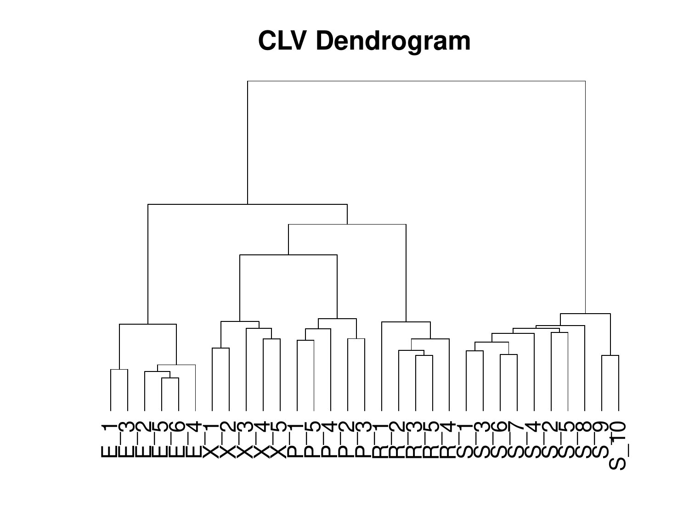
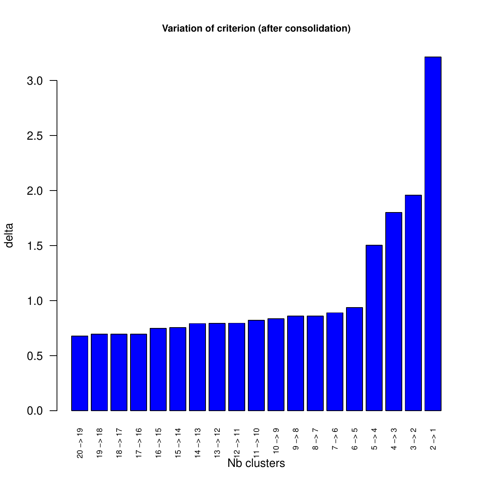
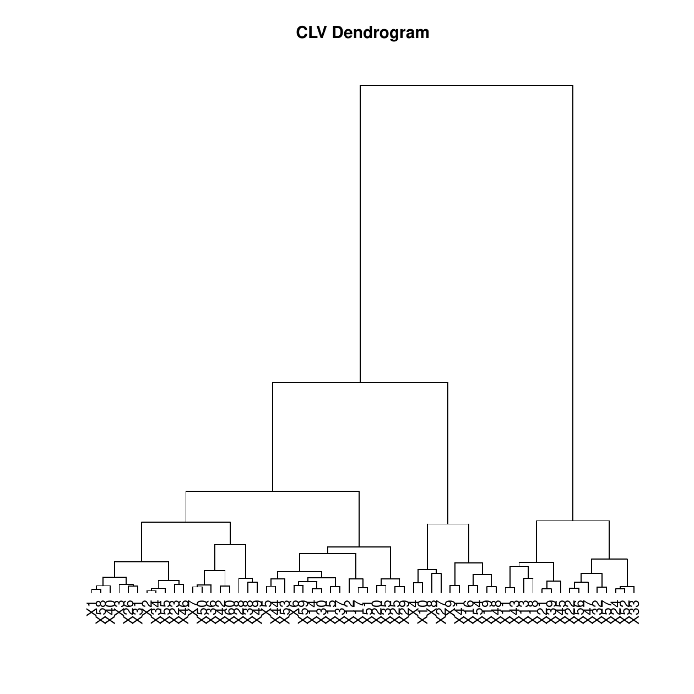
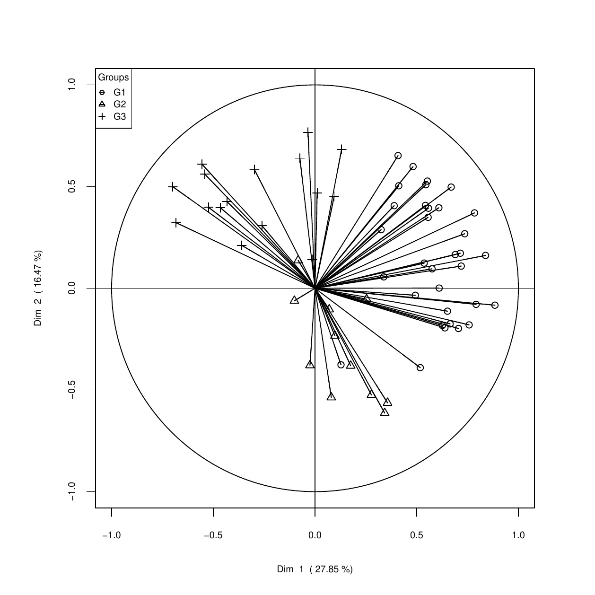
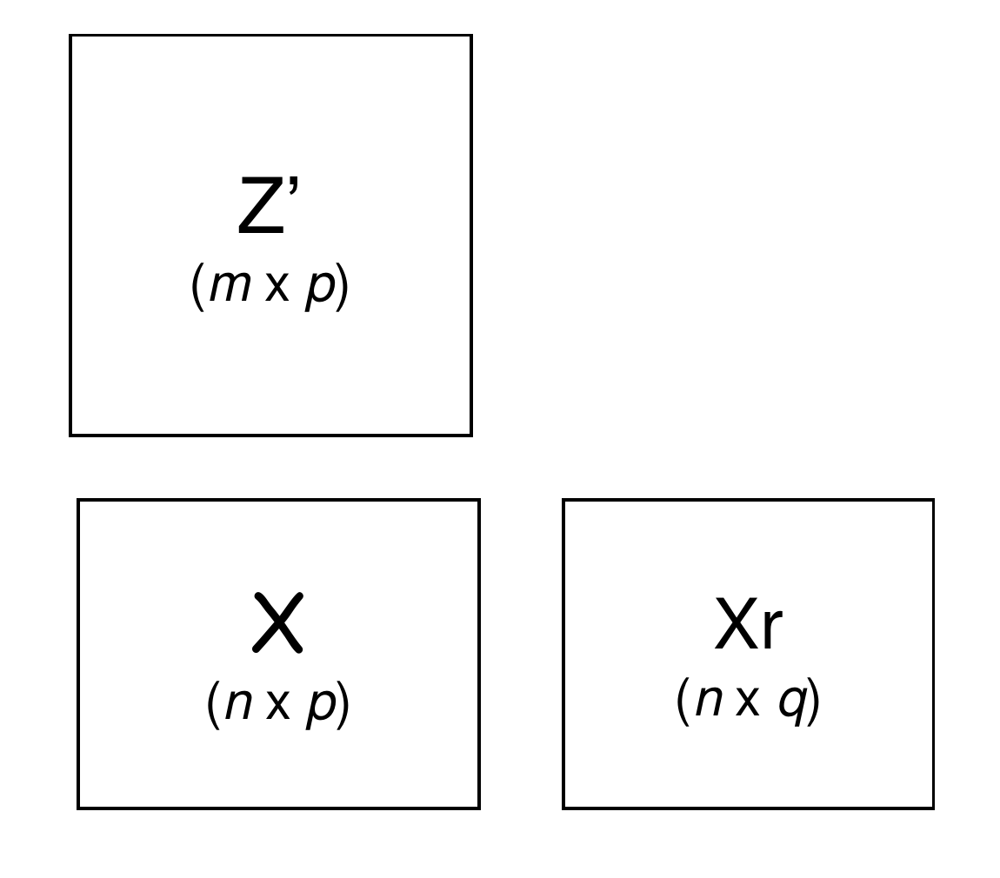

::: article
# Introduction {#sec:introduction}

For the clustering of observations, a large number of packages and
functions are available within the R environment. Besides the base
package *stats* and the recommended package
[*cluster*](https://CRAN.R-project.org/package=cluster) [@cluster],
about one hundred R packages have been listed in the CRAN Task View:
Cluster Analysis and Finite Mixture Models [@task]. This is
representative of the huge number of applications in which the user is
interested in making groups of similar cases, instances, subjects, ...,
i.e., in clustering of the observations, in order to exhibit a typology
within the population under study. The number of R packages, or R
functions, specifically dedicated to the clustering of variables is much
smaller.

As a matter of fact, clustering methods (e.g., hierarchical clustering
or k-means clustering) are almost always introduced in standard text
books using the Euclidean distance between a set of points or
observations. Thus, it is not so easy to imagine situations in which
defining clusters of variables makes sense. Would it be interesting, in
an opinion survey, to identify, a posteriori, groups of questions, and
not only clusters of people? The answer to this question is yes,
particularly if the number of questions or items is large. Indeed, by
merging connected questions, it is possible to identify latent traits,
and, as a by-product, improve the interpretation of the outcomes of the
subsequent analyses. In another domain, the recent progress in
biotechnology enables us to acquire high-dimensional data on a few
number of individuals. For instance, in proteomics or metabolomics,
recent high-throughput technologies can gauge the abundance of thousands
of proteins or metabolites simultaneously. In this context, identifying
groups of redundant features appears to be a straightforward strategy in
order to reduce the dimensionality of the data set. Based on DNA
microarray data, gene clustering is not a new issue. It has usually been
addressed using hierarchical clustering algorithms based on similarity
indices between each pair of genes defined by their linear correlation
coefficient, the absolute value or the squared value of the linear
correlation coefficient (see, among others, @{Eisen(1998)}
[@{Hastie(2000)}; @{Park(2007)}; @{Tolosi(2011)}]). We can also mention
some specific methods for gene clustering such as the diametrical
clustering algorithm of @{Dhillon(2003)} or a clustering method based on
canonical correlations proposed by @{Buhlmann(2013)}. However, to the
best of our knowledge, there is no implementation of these methods in R.

We introduce the
[*ClustVarLV*](https://CRAN.R-project.org/package=ClustVarLV) package
[@{ClustVarLV(2015)}] for variable clustering based on the Clustering of
Variables around Latent Variables (CLV) approach [@{Vigneau(2003)}]. The
CLV approach shares several features with the already mentioned
approaches of @{Dhillon(2003)} and @{Buhlmann(2013)}, as well as with
the clustering approach of @{Enki(2013)} for constructing interpretable
principal components. It is also worth mentioning that the Valuer's
procedure available in SAS [@{Sarle(1990)}] has some common features
with the CLV functions of the *ClustVarLV* package. All these methods
are more or less connected to linear factor analysis. They could be
viewed as empirical descriptive methods, unlike model-based approaches
such as the likelihood linkage analysis proposed by @{Kojadinovic(2010)}
for the clustering of continuous variables. Let us note that there is a
similar R package,
[*ClustOfVar*](https://CRAN.R-project.org/package=ClustOfVar)
[@ClustOfVar], which proposed an implementation of some of the
algorithms described in @{Vigneau(2003)}. However the *ClustOfVar*
package does not have the same functionalities as the *ClustVarLV*
package. The comparison of these two related packages will be more
detailed in a subsequent section.

Other interesting packages for clustering can also be cited:
[*clere*](https://CRAN.R-project.org/package=clere) [@{CLERE(2014)}] for
simultaneous variables clustering and regression;
[*biclust*](https://CRAN.R-project.org/package=biclust)
[@{biclust(2015)}] which provides several algorithms to find biclusters
in two-dimensional data;
[*pvclust*](https://CRAN.R-project.org/package=pvclust)
[@{pvclust(2014)}] which performs hierarchical cluster analysis and
automatically computes $p$-values for all clusters in the hierarchy.
This latter package considers the clustering of the columns of a data
matrix (for instance, DNA microarray data) and computes (by default) the
correlation coefficients between the columns to be clustered. Similarly,
the function `varclus()` in the
[*Hmisc*](https://CRAN.R-project.org/package=Hmisc) [@Hmisc] package can
be used for performing a hierarchical cluster analysis of variables,
using the Hoeffding D statistic, the squared Pearson or Spearman
correlations, or the proportion of observations for which two variables
are both positive as similarity measures. For *pvclust* and the function
`varclus()` in package *Hmisc*, the clustering is done by the `hclust()`
function.

In the following sections, the objective and principle of the CLV
approach will be introduced in a comprehensive manner. The main
functions of the *ClustVarLV* package for the implementation of the
method will be listed. Next, different situations, associated with
various forms of the CLV criterion, will be discussed and illustrated.
The first setting will be the case of directional groups of variables
for data dimension reduction and the identification of simple
structures. Another one will be to identify clusters of variables taking
account of an external information.

# Synthetic presentation of the CLV method {#sec:synth-pres-clv}

In order to investigate the structure of a multivariate dataset,
Principal Components Analysis (PCA) is usually used to find the main
directions of variation. This can be followed by a rotation technique
such as Varimax, Quadrimax, ...[@{Jolliffe(2002)}] in order to improve
the interpretability to the principal components. The CLV approach is an
alternative strategy of analysis whereby the correlated variables are
lumped together and, within each cluster, a latent (synthetic) variable
is exhibited. This latent variable is defined as a linear combination of
only the variables belonging to the corresponding cluster. From this
standpoint, CLV has the same objective as the Sparse Principal Component
Analysis [@{Zou(2006)}] which aims at producing modified principal
components with sparse loadings.

{#fig:Method width="100%" alt="graphic without alt text"}

The CLV approach [@{Vigneau(2003)}] is based on the maximization of a
set of criteria which reflect the linear link, in each cluster, between
the variables in this cluster and the associated latent variable. These
criteria are related to the types of links between the observed and the
latent variables that are of interest to the users, as illustrated in
Figure [1](#fig:Method).

-   The first case (left hand panel in Figure [1](#fig:Method)) is to
    define directional groups, so that the observed variables that are
    merged together are as much as possible related to the group latent
    variable, no matter whether their correlation coefficients are
    positive or negative. In this case, the link between the observed
    and the latent variables are evaluated by means of the squared
    correlation coefficient between the variables, and the criterion
    considered for maximization is:

    $$\label{eq:critT}
    T   = \sum_{k=1}^{K}\sum_{j=1}^{p}\delta_{kj} \: \rm cov \it^2r\left({\bf x}_j, {\bf c}_k \right) 
    \mbox{  with     } \rm var \left(\it {\bf c}_k\right) =1  (\#eq:critT)  $$

    where ${\bf x}_j$ $(j=1,\dots,p)$ are the $p$ variables to be
    clustered. These variables are assumed to be centered. In Equation
    (\@ref(eq:critT)), $K$ is the number of clusters of variables,
    denoted $G_1$, $G_2$, ..., $G_K$; ${\bf c}_k$ $(k=1,\dots,K)$ is the
    latent variable associated with cluster $G_k$ and $\delta_{kj}$
    reflects a crisp membership, with $\delta_{kj}=1$ if the $j$th
    variable belongs to cluster $G_k$ and $\delta_{kj}=0$, otherwise.

-   The second case (right hand panel in Figure [1](#fig:Method)) is to
    define local groups for which each variable shows a positive
    correlation with their associated latent variable. This case entails
    that negative correlation coefficients imply disagreement.
    Therefore, the CLV criterion is based on the correlation coefficient
    and the criterion to be maximized is:

    $$\label{eq:critS}
    S   =  \sum_{k=1}^{K}\sum_{j=1}^{p}\delta_{kj} \: \rm cov \it \left({\bf x}_j, {\bf c}_k \right) 
    \mbox{  with     } \rm var\left(\it {\bf c}_k \right) =1  (\#eq:critS)  $$

    with the same notations as for Equation (\@ref(eq:critT)).

Moreover, as will be illustrated in Section
"[6](#sec:clust-vari-with-1)" the CLV criteria given in Equations
(\@ref(eq:critT)) or (\@ref(eq:critS)) could be slightly modified, by
introducing a constraint on the latent variables, in order to take
account of additional information on the variables to be clustered.

It is worth noting that the well known `VARCLUS` procedure
[@{Sarle(1990)}], implemented in the SAS/STAT software, also offers
these two options. However, in `VARCLUS`, no optimization criterion for
the determination of the groups of variables is clearly set up.
Moreover, this method of analysis consists of a rather complicated
divisive hierarchical procedure.

From a practical standpoint, the CLV approach is based on a partitioning
algorithm, described in @{Vigneau(2003)}, akin to the k-means algorithm.
However, this partitioning algorithm requires, on the one hand, the
choice of the number $K$ of clusters and, on the other hand, the
initialization of the iterative process. To address these issues, our
recommendation is to start by performing a hierarchical cluster
analysis, with aggregating rules detailed in @{Vigneau(2003)}. The first
interest is to set up a dendrogram and a graph showing the evolution of
the aggregation criterion between two successive partitions. This should
help the user choosing the appropriate number of clusters. The second
interest is that the clusters from the hierarchical analysis give
reasonable initial partitions for performing the partitioning algorithm.
This process of running a partitioning algorithm using the outcomes of
the hierarchical clustering as starting point is called consolidation in
the French literature ( @{Lebart(2000)} [@{Warms(2010)}]).

# Overview of the functions in the *ClustVarLV* package {#sec:overv-funct-pkgcl}

The list of the functions in the *ClustVarLV* package, that the users
can call, is given in Table [1](#tab:listfct). The two main functions
for the implementation of the CLV algorithms are `CLV()` and
`CLV_kmeans()`.

The `CLV()` function performs an agglomerative hierarchical algorithm
followed by a consolidation step performed on the highest levels of the
hierarchy. The number of solutions considered for the consolidation can
be chosen by the user (parameter `nmax`, equal to 20 by default). The
consolidation is based on an alternated optimization algorithm, i.e., a
k-means partitioning procedure, which is initialized by cutting the
dendrogram at the required level. Alternatively, the user may choose to
use the `CLV_kmeans()` function which is typically a partitioning
algorithm for clustering the variables into a given number, $K$, of
clusters. It involves either repeated random initializations or an
initial partition of the variables supplied by the user. This second
function may be useful when the number of variables is larger than a
thousand because in this case the hierarchical procedure is likely to be
time consuming (this point will be addressed in Section
"[7.1](#sec:codeclv-codeclv_km-f)"). When the number of variables does
not exceed several hundred, the dendrogram which can be drawn from the
output of the `CLV()` function provides a useful tool for choosing an
appropriate number, $K$, for the size of the partition of variables.

The two functions, `CLV()` and `CLV_kmeans()`, include a key parameter,
which has to be provided by the user, with the data matrix. This
parameter, called `method`, indicates the type of groups that are
sought: `method = "directional"` or `method = 1` for directional groups
and `method = "local"` or `method = 2` for local groups (Figure
[1](#fig:Method)). These functions make it possible to cluster the
variables of the data matrix (argument `X`) considered alone, or by
taking account of external information available on the observations
(argument `Xr`) or external information available for the variables
themselves (argument `Xu`). A third "CLV" function has been included in
the *ClustVarLV* package: It is the `LCLV` function which can be used
when external information is available for both the observations and the
variables (see Section "[4](#sec:clust-vari-with)" for more details).

The other functions in the *ClustVarLV* package (version 1.4.1) are
mainly utility and accessor functions providing additional outputs
useful for the interpretation of the clustering results. Their usage
will be illustrated with various case studies that will be discussed
hereinafter.

::: {#tab:listfct}
  --------------------------------------------------------------------------------------------------------------------------
  Functions                                                  Description
  ---------------------------------------------------------- ---------------------------------------------------------------
  *"Clustering" functions*                                   

  `CLV`                                                      Hierarchical clustering of variables with consolidation

  `CLV_kmeans`                                               Kmeans algorithm for the clustering of variables

  `LCLV`                                                     L-CLV for L-shaped data

  *Methods for '`clv`' objects*                              

  `plot`                                                     Graphical representation of the CLV clustering stages

  `print`                                                    Print the CLV results

  *Methods for '`lclv`' objects*                             

  `plot`                                                     Graphical representation of the LCLV clustering stages

  `print`                                                    Print the LCLV results

  *Utility functions for the '`clv`' and '`lclv`' objects*   

  `summary`                                                  Method providing the description of the clusters of variables

  `plot_var`                                                 Representation of the variables and their group membership

  `get_partition`                                            To get the clusters of variables

  `get_comp`                                                 To get the latent variables associated with each cluster

  `get_load`                                                 To get the loadings of the external variables in each cluster

  *Miscellaneous*                                            

  `stand_quali`                                              Standardization of the qualitative variables

  `data_biplot`                                              Biplot for the dataset
  --------------------------------------------------------------------------------------------------------------------------

  : Table 1: List of the functions in the *ClustVarLV* package.
:::

# Clustering of variables with directional groups {#sec:clust-vari-with}

As indicated above, when the user chooses `method = "directional"` in
the `CLV()` or `CLV_kmeans()` function, the criterion considered for
optimization is the criterion $T$ defined in Equation (\@ref(eq:critT)).

It can be shown (see for instance @{Vigneau(2003)}) that when the
maximum of the criterion $T$ is reached, the latent variable
${\bf c}_k$, in cluster $G_k$, is the first normalized principal
component of matrix ${\bf X}_k$, the dataset formed of the variables
belonging to $G_k$. Thus, the optimal value of $T^{(K)}$, for a
partition into $K$ groups, is the sum of the largest eigenvalues
respectively associated with the variance-covariance matrices
$\frac{1}{n} {\bf X}_k^\prime {\bf X}_k$, with $k=1,\dots,K$. The ratio
between $T^{(K)}$ and $T^{(p)}$ provides the percentage of the total
variance explained by the $K$ CLV latent variables. Even if the $K$ CLV
latent variables, which are not necessarily orthogonal, cannot take
account of as much total variance as the $K$ first principal components,
they may be more relevant for deciphering the underlying structure of
the variables than the first principal components. Moreover, they are
likely to be more easily interpretable. @{Enki(2013)} have also
addressed the issue of identifying more interpretable principal
components and proposed a procedure which bears some similarities with
the CLV method.

## First illustrative example: Identification of block structure, and underlying latent components, into a set of variables

We consider data from a French Research Project (AUPALESENS, 2010--2013)
dealing with food-behavior and nutritional status of elderly people.
More precisely, we selected the psychological behavior items, which are
part of a large questionnaire submitted to 559 subjects. As a matter of
fact, the 31 psychological items were organized into five blocks, each
aiming to describe a given behavioral characteristic: emotional eating
(E) with six items, external eating (X) with five items, restricted
eating (R) with five items, pleasure for food (P) with five items, and
self esteem (S) with ten items. Detailed description and analysis of the
emotional, external and restricted eating items for this study are
available in @{Bailly(2012)}.

The `CLV()` function was performed on the data matrix, $\bf X$, which
merges the 31 psychological items, using the following code:

``` r
R> library("ClustVarLV")
R> data("AUPA_psycho", package = "ClustVarLV")
R> res.clv <- CLV(AUPA_psycho, method = "directional", sX = TRUE)
R> plot(res.clv, type = "dendrogram")
R> plot(res.clv, type = "delta", cex = 0.7)
```

<figure id="fig:psycho1">
<p></p>
<figcaption>Figure 2: Graphs obtained by the clustering into directional
groups of the psychological variables. On the left side, the dendrogram
of the hierarchical clustering stage; on the right side, the variation
of the clustering criterion after consolidation of the partitions by
means of the partitioning algorithm.</figcaption>
</figure>

The dendrogram and the graph showing the variation of the clustering
criterion when passing from a partition into $K$ clusters to a partition
into $(K-1)$ clusters ($\mathit{Delta}=T^{(K)}-T^{(K-1)}$) are shown in
Figure [2](#fig:psycho1). From the graph of $\mathit{Delta}$, it can be
observed that the criterion clearly jumps when passing from five to four
clusters. This means that the loss in homogeneity of the clusters is
important with four clusters and that a partition into five clusters
should be retained. The partition into $K=5$ groups, available with
`get_partition(res.clv, K = 5)`, perfectly retrieved the five blocks of
psychological traits.

The `summary` method for '`clv`' objects provides a description of the
clusters:

``` r
R> summary(res.clv, K = 5)
```

  ------------------ --------- --------- --------- --------- ---------
                      Group.1   Group.2   Group.3   Group.4   Group.5

  nb:                    6         5         5         5        10

  prop_within:        0.6036    0.4077    0.4653     0.388    0.3614

  prop_tot: 0.4368                                           
  ------------------ --------- --------- --------- --------- ---------

  : 

  -------- -------------- ----------------- -- -------- -------------- -----------------
  Group1    cor in group   |cor|next group     Group4    cor in group   |cor|next group

  E5            0.85            0.25           P1            0.72            0.18

  E4            0.80            0.34           P3            0.63            0.14

  E6            0.80            0.25           P2            0.61            0.10

  E2            0.79            0.25           P4            0.58            0.14

  E3            0.73            0.31           P5            0.57            0.19

  E1            0.68            0.29                                   

                                               Group5    cor in group   |cor|next group

  Group2    cor in group   |cor|next group     S3            0.70            0.21

  X2            0.76            0.38           S1           -0.68            0.10

  X4            0.67            0.30           S6           -0.66            0.17

  X5            0.65            0.19           S7           -0.65            0.17

  X1            0.58            0.17           S10           0.65            0.07

  X3            0.51            0.22           S5            0.55            0.12

                                               S4           -0.53            0.10

  Group3    cor in group   |cor|next group     S9            0.53            0.10

  R5            0.77            0.25           S2           -0.51            0.14

  R3            0.76            0.21           S8            0.49            0.23

  R2            0.71            0.23                                   

  R4            0.66            0.11                                   

  R1            0.47            0.14                                   

                                                                       
  -------- -------------- ----------------- -- -------- -------------- -----------------

  : 

The homogeneity values within each cluster, assessed by the percentages
of the total variance of the variables belonging to the cluster
explained by the associated latent variable, are 60.4%, 40.8%, 46.5%,
38.8%, 36.1% respectively (the Cronbach's alphas are 0.87, 0.63, 0.71,
0.60, and 0.80, respectively). Furthermore, the five group latent
variables make it possible to explain 43.7% of the total variance of all
the $p=31$ observed variables. For each variable in a cluster, its
correlation coefficient with its own group latent variable and its
correlation coefficient with the next nearest group latent variable are
also given. Each item is highly correlated with its group latent
variable.

Compared with the standardized PCA of $\bf X$, five principal components
(PCs) are required for retrieving 45.1% of the total variance, whereas
four PCs account for 40.5% of the total variance. Moreover, it turned
out that the interpretation of the first five PCs was rather difficult.
If we consider all the loadings larger than 0.3, in absolute value, the
first PC, $PC1$, seems to be associated with all the items "E", X2, X3,
R2 and S8; $PC2$ is related to P1 and all the items "S" except S8, $PC3$
to R1 only, $PC4$ to X4, R3, R4, R5 and P3, and $PC5$ to X1 and X5. It
is known that rotation (by means of orthogonal or oblique
transformations) may enhance the interpretation of the factors. In this
case study, using a Varimax transformation, the five rotated PCs can be
associated with one of the predefined blocks of items. However, the
rotated principal components make it possible to retrieve the "true"
structure if, and only if, the correct number of dimensions for the
subspace of rotation is selected. This may be an impediment since the
determination of the appropriate number of components is a tricky
problem. In the case study at hand, various rules [@{Jolliffe(2002)}]
led to two, four or eight PCs. By contrast, the variation of the CLV
criterion performs well for identifying the correct number of groups.

In another domain (i.e., the Health sector), @{Lovaglio(2011)} pointed
out that, within the Structural Equation Modeling framework, the first
step which consists of building the measurement models could be based on
the CLV technique. He showed that, considering a formative way, the
subset of variables obtained by means of `CLV()` led to a better
recovery of the original configuration, followed by `VARCLUS` based on
PCA. This was far from being the case with the selection of variables on
the basis of the outcomes of PCA or PCA with Varimax rotation.

## Second illustrative example: Clustering of quantitative and qualitative variables

@{Chavent(2012)} proposed an R package, named *ClustOfVar*, which aims
at clustering variables, with the benefit of allowing the introduction
of quantitative variables, qualitative variables or a mix of those
variables. The approach is based on a homogeneity criterion which
extends the CLV criterion (Eq.\@ref(eq:critT)). More precisely, the
correlation ratio (between groups variance to total variance ratio) of
each qualitative variable and the latent variable in a cluster are
included in the criterion in addition to the squared correlation
coefficients used for the quantitative variables. In practice, for
defining the partition of the variables and the latent variables within
each cluster, the algorithms described in @{Chavent(2012)} are the same
as those given in @{Vigneau(2003)} and @{Vigneau(2006)}, with a small
variation: The latent variables are derived from a PCAMIX model
[@{Saporta(1990)}; @{Kiers(1991)}; @{Pages(2004)}] instead of a PCA
model.

The strategy of clustering quantitative and qualitative variables raises
the following question: Is it better to cluster qualitative variables
along with the quantitative variables or to break down each qualitative
variable into its categories and include these categories in a
clustering approach such as CLV?

To answer this question, let us consider the dataset `wine` provided in
various packages (for instance, *ClustOfVar*,
[*FactoMineR*](https://CRAN.R-project.org/package=FactoMineR),
@FactoMineR). 21 french wines of Val of Loire are described by 29
sensory descriptors scored by wine professionals. Two nominal variables
are also provided: the label of the origin (with three categories:
"Saumur", "Bourgueuil" and "Chinon") and the nature of the soil (with
four categories: "Reference", "Env.1", "Env.2" and "Env.4"). The design
of these two nominal variables is however not well-balanced.
@{Chavent(2012)} considered only 27 quantitative variables (all the
sensory descriptors except those regarding the global evaluation) and
included the two qualitative variables. From the dendrogram obtained
with the function `hclustvar()`, they retained six clusters. The summary
of the partition into six clusters is shown below:

  --------------------------------- ----------------- -- ------------------- -----------------
  Cluster 1 :                        squared loading     Cluster 4 :          squared loading

  Odour.Intensity. before.shaking         0.76           Visual.intensity          0.86

  Spice. before.shaking                   0.62           Nuance                    0.84

  Odor.Intensity                          0.67           Surface.feeling           0.90

  Spice                                   0.54           Aroma.intensity           0.75

  Bitterness                              0.66           Aroma.persistency         0.86

  *Soil*                                  0.78           Attack.intensity          0.77

                                                         Astringency               0.79

  Cluster 2 :                        squared loading     Alcohol                   0.68

  Aroma.quality.before.shaking            0.78           Intensity                 0.87

  Fruity.before.shaking                   0.85                               

  Quality.of.odour                        0.79           Cluster 5 :          squared loading

  Fruity                                  0.91           Plante                    0.75

                                                         Aroma.quality             0.84

  Cluster 3 :                        squared loading     Acidity                   0.22

  Flower.before.shaking                   0.87           Balance                   0.94

  Flower                                  0.87           Smooth                    0.92

                                                         Harmony                   0.87

                                                                             

                                                         Cluster 6 :          squared loading

                                                         Phenolic                   0.8

                                                         *Label*                    0.8
  --------------------------------- ----------------- -- ------------------- -----------------

  : 

The factor "Soil" was merged in the Cluster 1 with variables related to
spicy sensation and the odor intensity. Its correlation ratio with the
latent variable of this cluster is 0.78 (which corresponds to a
$F$-ratio $=19.73$ with a $p$-value = 9E-6). The factor "Label" was
merged in the cluster 6 with the quantitative descriptor "Phenolic". The
correlation ratio of "Label" with the latent variable of its cluster is
0.80 ($F$-ratio $= 36.02$, $p$-value = 5E-7).

In the *ClustVarLV* package, we propose to take account of the
qualitative information, in addition to quantitative variables, by
breaking down each qualitative variable into a matrix of indicators
($G$, say) of size $n$ x $M$, where $M$ is the number of categories of
the qualitative variable at hand. In the same vein as Multiple
Correspondence Analysis [@{Saporta(1990)}], we propose to standardize
the matrix $\bf G$. This leads us to the matrix
$\tilde{{\bf G}}={\bf G D}^{-1/2}$ where $\bf D$ is the diagonal matrix
containing the relative frequency of each category. The utility function
`stand_quali()` in *ClustVarLV* allows us to get the matrix
$\tilde{{\bf G}}$. Thereafter, the matrix submitted to the `CLV()`
function is simply the concatenation of the standardized matrix of the
quantitative variables and all the standardized blocks associated with
each qualitative variables. The following code was used:

``` r
R> library("ClustVarLV")  
R> data("wine", package = "FactoMineR")
R> X.quanti <- wine[, 3:29] 
R> X.quali <- wine[, 1:2] 
R> Xbig <- cbind(scale(X.quanti), stand_quali(X.quali)) 
R> resclv <- CLV(Xbig, method = "directional", sX = FALSE)
R> plot(resclv, "delta")
```

{#fig:wine1 width="100%" alt="graphic without alt text"}

From the graph showing the evolution of the aggregation criterion
(Figure [3](#fig:wine1)), two, four, six or even eight clusters could be
retained.

The partition into six clusters is described as follows:

``` r
R> summary(resclv, K = 6)  
```

  -------------------------------- -------------- ----------------- -- -------------------- -------------- -----------------
               Group1               cor in group   |cor|next group            Group4         cor in group   |cor|next group

   Odour.Intensity.before.shaking       0.87            0.63             Surface.feeling         0.95            0.80

            *Soil.Env.4*                0.86            0.43                Intensity            0.94            0.82

          Odour.Intensity               0.82            0.69             Visual.intensity        0.93            0.64

       Spice. before.shaking            0.80            0.32            Aroma.persistency        0.93            0.76

             Bitterness                 0.80            0.49                  Nuance             0.92            0.63

               Spice                    0.73            0.40               Astringency           0.89            0.70

                                                                         Attack.intensity        0.88            0.74

               Group2               cor in group   |cor|next group       Aroma.intensity         0.87            0.78

           Aroma.quality                0.93            0.64                 Alcohol             0.83            0.59

              Balance                   0.93            0.68                                               

               Smooth                   0.92            0.77                  Group5         cor in group   |cor|next group

           Quality.Odour                0.90            0.71                 Phenolic            0.89            0.42

              Harmony                   0.90            0.87            *Label.Bourgueuil*      -0.86            0.30

    Aroma.quality.before.shaking        0.81            0.74              *Label.Saumur*         0.77            0.40

               Plante                  -0.78            0.42                                               

       Fruity.before.shaking            0.77            0.58                  Group6         cor in group   |cor|next group

          *Soil.Reference*              0.70            0.46                 Acidity             0.89            0.30

                                                                           *Soil.Env.2*          0.69            0.35

               Group3               cor in group   |cor|next group         *Soil.Env.1*         -0.68            0.37

       Flower.before.shaking            0.93            0.44              *Label.Chinon*         0.63            0.22

               Flower                   0.93            0.35                                               
  -------------------------------- -------------- ----------------- -- -------------------- -------------- -----------------

  : 

It turns out that both functions, i.e., `hclustvar()` in *ClustOfVar*
(hierarchical algorithm) and `CLV()` in *ClustVarLV* (hierarchical
algorithm followed by a partitioning procedure), led to similar results
for the sensory descriptors.

The first group (Group 1) is related to the intensity of the odor with
spicy notes, to which is associated the "Env.4" for the "Soil" factor,
whereas it was globally "Soil" using `hclustvar()`. If we compare the
correlation ratio of the qualitative variable "Soil" with its cluster
latent variable using `hclustvar()` (i.e., 0.78), and the squared
correlation coefficient of the category "Soil.Env.4" with its cluster
latent variable using `CLV()` (i.e., 0.74), we can conclude that the
contribution of the three other "Soil" categories to the correlation
ratio is very small. This finding can easily be confirmed by means of a
one-way ANOVA between the latent variable in the first cluster and the
factor "Soil". Additionally, it can be shown that the correlation ratio
($R^2$) of a qualitative variable with respect to a quantitative
variable ($\ bf x$, say) is equal to a weighted sum of the squared
correlation coefficients of the indicators of its categories, given in
$\tilde{G}$, with the quantitative variable, namely:

$$R^2 = \sum_{m=1}^{M} \left(1-f_m\right) cor^2\left({\bf g}_m,{\bf x}\right),$$

where ${\bf g}_m$ is the indicator vector for the category $m$ and $f_m$
is the relative frequency. It follows that, the contribution of
"Soil.Env.4" to the global $R^2$ of "Soil" in the first cluster found
with `hclustvar()` is 85.4%. Thus, it appears that it is because of the
specific nature of the soil in "Env.4" that the wines have a more
intense odor and a more bitter flavor than the other wines.

The second group of attributes (Group 2) is related to the overall
quality of the wines and it seems, from the results of `CLV()`, that the
type "Reference" of the soil is likely to favor this quality. This was
not observed with `hclustvar()` (see Cluster 5 in the summary of the
partition into six clusters obtained with `hclustvar()`) because the
qualitative variable "Soil" was globally associated with the Cluster 1.

Regarding the fifth groups of attributes (Group 5), the interpretation
of the Phenolic flavor of some wines could be refined. If the "Label"
was associated with the Phenolic attribute using `hclustvar()` (Cluster
6), the outputs of the `CLV()` function show that type "Saumur" was
slightly more "Phenolic" than the type "Bourgeuil", whereas type
"Chinon" (in Group 6) seems to have acid notes (but caution should be
taken in this interpretation because of the small number of observations
for "Chinon"). Nevertheless, it could be emphasized that the soil of
"Env.2" is likely to give more acidity, unlike "Env.1". Finally let us
notice that the acidity attribute was merged in the Cluster 5 obtained
with `hclustvar()` but its squared loading to the latent variable of
this cluster was relatively small.

# Clustering of variables for local groups {#sec:clust-vari-local}

In some specific situations, a negative correlation between two
variables is considered as a disagreement. Therefore, these variables
should not be lumped together in the same group.

Consider for instance the case of preference (or acceptability) studies
in which consumers are asked to give a liking score for a set of
products. For these data, the consumers play the role of variables
whereas the products are the observations. The aim is to identify
segments of consumers having similar preferences. This means positively
correlated vectors of preference. In this situation, local groups are
sought (illustrated in the right side of Figure [1](#fig:Method)) and
the parameter `method = "local"` is to be used with the clustering
functions of the *ClustVarLV* package. A case study developed in this
context is available in @{Vigneau(2001)}.

In other contexts, as in Near-Infrared spectroscopy or $^1$H NMR
spectroscopy, the CLV approach with local groups can be used for a first
examination of the spectral data. @{Jacob(2013)} showed that this
approach may help identifying spectral ranges and matching them with
known compounds.

Technically, the identification of local groups of variables is
performed in the CLV approach by the maximization of the criterion $S$
given in Equation (\@ref(eq:critS)). As a result, it is easy to show
that the maximal value is obtained, for a given number $K$ of clusters,
when each latent variable, ${\bf c}_k$, is proportional to the centroid
variable $\bar{{\bf x}}_k$ of the variables in the cluster $G_k$.

## Third illustrative example: Application to the segmentation of a panel of consumers {#Sec:segmentation}

In order to illustrate the use of the *ClustVarLV* functions for the
definition of local groups, let us consider the dataset `apples_sh`
available in the package [@{Daillant-Spinnler(1996)}]. Two types of
information were collected: On the one hand, the sensory
characterization, given by a trained panel, of 12 apple varieties from
the Southern Hemisphere and, on the other hand, the liking scores, given
by 60 consumers, for these varieties. We will consider the segmentation
of the panel of consumers using the `CLV()` function with the option
`method = "local"`:

``` r
R> library("ClustVarLV")
R> data("apples_sh", package = "ClustVarLV")
R> res.seg <- CLV(X = apples_sh$pref, method = "local") 
R> plot(res.seg, "dendrogram") 
R> table(get_partition(res.seg, K = 3)) 
R> plot_var(res.seg, K = 3, v_symbol = TRUE) 
R> comp <- get_comp(res.seg, K = 3)
```

The dendrogram from `CLV()` given in the left side of Figure
[4](#fig:apple1) suggests to retain three segments. These segments
merged together 33, 11 and 16 consumers, respectively (after
consolidation of the solution obtained by cutting the dendrogram at the
chosen level). The `plot_var()` companion function makes it possible to
show the group membership of each variable on a two dimensional
subspace. The plot produced by this function (right side of Figure
[4](#fig:apple1)) is grounded on a PCA loading plot. By default, the two
first principal components are considered, but the user may modify this
option. In the previous code, the option `v_symbol` is set to `TRUE` in
order to produce a figure readable in black and white. Without this
option, color graphs will be produced, with or without the labels of the
variables. In addition, the group latent variables may be extracted with
the function `get_comp()`. They provide the preference profiles of the
12 apple varieties in the various consumer segments.

<figure id="fig:apple1">
<p></p>
<figcaption>Figure 4: Segmentation of the panel of consumers for the
apples case study. On the left side, the dendrogram of the hierarchical
clustering; on the right side, the mapping of the consumers on the basis
of the two first principal components, with group membership
identification.</figcaption>
</figure>

# Clustering of variables with external information {#sec:clust-vari-with-1}

The CLV approach has also been extended to the case where external
information is available. The clustering of variables is achieved while
constraining the group latent variables to be linear combinations of
external variables.

## Clustering with external information collected on the observations

Suppose that, in addition to the variables to be clustered, the
observations are described by a second block of variables, $\bf X\!r$
(*r* stands for additional information collected on the rows of the core
matrix $\bf X$) as in Figure [5](#fig:L). Both CLV criteria (Equations
\@ref(eq:critT) and \@ref(eq:critS)) can be used with the additional
constraint that:

$${\bf c}_k= {\bf X\!r} \, {\bf a}_k \mbox{  with     } {\bf a}_k^\prime {\bf a}_k =1$$

for each latent variable ${\bf c}_k$ with $k=1,\dots,K$.

It can be shown [@{Vigneau(2003)}] that the solutions of the
optimization problems are obtained when ${\bf c}_k$ is the first
component of a Partial Least Squares (PLS) regression of the group
matrix ${\bf X}_k$ on the external matrix $\bf X\!r$, in the case of
directional groups, or the first component of a PLS regression of the
centroid variable $\bar{{\bf x}}_k$ on the external matrix $\bf X\!r$,
in the case of local groups.

External preference mapping is a domain in which the CLV approach with
additional information on the observations has been successfully applied
[@{Vigneau(2002)}]. In addition to clustering the consumers according to
the similarity of their preference scores as it was illustrated in the
third illustrative example, the aim is also to segment the consumers
while explaining their preferences by means of the sensory
characteristics of the products. Thus, the segmentation and the modeling
of the main directions of preference may be achieved simultaneously. If
we consider again the `apples_sh` dataset, two matrices are available:
`apples_sh$pref`, the preference scores of the consumers, and
`apples_sh$senso`, the sensory characterization of the 12 apple
varieties using 43 sensory attributes. The `CLV()` function includes
parameters for taking account of such external block of information.
Namely:

``` r
R> res.segext <- CLV(X = apples_sh$pref, Xr = apples_sh$senso, method = "local",
+                    sX = TRUE, sXr = TRUE) 
R> table(get_partition(res.seg, K = 3), get_partition(res.segext, K = 3)) 
R> load3G <- get_load(res.segext, K = 3)
```

For a solution with three clusters, it turns out that the segments
previously defined have been rearranged in order to take account of the
sensory attributes of the apples. The loadings ${\bf a}_k$ (for
$k=1,2,3$) of the sensory descriptors, which can be extracted using the
utility function `get_load()`, made it possible to explain the
difference in preference in each segment.

## Clustering with additional information on the variables {#sec:clust-with-addit}

[]{#Sec:Pmatrix label="Sec:Pmatrix"}

When additional information is available on the variables, the CLV
approach has also been adapted in order to take this information into
account in the clustering process.

For instance, let us consider the problem of the clustering of spectral
variables. Typically, a spectrometer (Near Infrared or a Nuclear
Magnetic Resonance spectrometer) makes it possible to collect thousands
of measurements at different spectral variables (wavelengths or chemical
shifts). This leads to a large amount of information with high level of
redundancy since close spectral points convey more or less the same
information. Instead of trimming off close spectral points, the
clustering of variables is a more effective way of identifying
automatically spectral ranges associated with the same functional
chemical groups [@{Vigneau(2005)}]. However, the fact that the variables
correspond to successive wavelengths was not taken into account with the
previous criteria given in Equation \@ref(eq:critT), or Equation
\@ref(eq:critS). One can expect that adding information on the spectral
structure of the variables can improve the quality of the clusters of
variables, in the sense that variables within the same spectral range
are more likely to be lumped together. The additional information to be
considered in such a situation is related to the spectral proximity
between the variables.

We denote by $\bf Z$, the matrix of the additional information on the
variables. The rows in $\bf Z$ are matched with the columns of the
matrix $\bf X$. The CLV approach is performed by combining, in each
cluster of variables, the X- and the Z-information. Namely, for a given
cluster $G_k$, a new matrix ${\bf P}_k$ is defined by:

$${\bf P}_k={\bf X}_k \,{\bf Z}_k,$$

where ${\bf X}_k$ is the sub-matrix of $\bf X$ formed by the $p_k$
variables belonging to $G_k$, and similarly, ${\bf Z}_k$ is a sub-matrix
of $\bf Z$ which involves only these $p_k$ variables. Thus, ${\bf P}_k$
can be viewed as a weighted version of ${\bf X}_k$, or as an interaction
matrix between the $X$- and $Z$-information estimated within $G_k$. The
nature of $\bf Z$, as well as the pretreatment applied, lead to one or
the other point of view. The CLV criteria have been modified so that the
latent variable in a cluster is a linear combination of the associated
${\bf P}_k$ matrix. If we denote by ${\bf t}_k$ the latent variable in
the cluster $G_k$, the objective is either to maximize

$$T^Z= \sum_{k=1}^{K}\sum_{j=1}^{p}\delta_{kj} \: cov^2 \it \left({\bf x}_j,{\bf t}_{k}\right)$$

or

$$S^Z = \sum_{k=1}^{K}\sum_{j=1}^{p}\delta_{kj} \: cov \it \left({\bf x}_j,{\bf t}_k\right)$$

with the constraints that:
$${\bf t}_k={\bf P}_k \, {\bf u}_k / \text{trace}\left({\bf P}_k^\prime \, {\bf P}_k\right)$$
and $${\bf u}_k^\prime \, {\bf u}_k=1$$

The parameter `Xu` in the `CLV()` function makes it possible to take
account of the external information on the variables. A typical line of
code in this case may be as:

``` r
R> resclv <- CLV(X = X, Xu = Z, method = "local", sX = FALSE)  
```

## Clustering with additional information on the observations and the variables {#sec:clust-with-addit-1}

When external informations on observations and variables are available,
$\bf X$, $\bf X\!r$ and $\bf Z$ are associated either by their rows or
by their columns, so that the three blocks of data may be arranged in
the form of an L (Figure [5](#fig:L)). Therefore, the acronym *L-CLV*
has been adopted and the `LCLV()` function included in the package
*ClustVarLV* has been developed for this case.

{#fig:L width="100%" alt="graphic without alt text"}

The L-CLV approach directly stems from the previous extensions of the
CLV approach. It consists in the maximization, in each cluster $k$ (with
$k=1,\dots,K$) of the covariance between a pair of latent variables,
${\bf c}_k$ and ${\bf t}_k$. ${\bf c}_k$ is a linear combination of the
co-variables measured on the observations, $\bf X\!r$, and ${\bf t}_k$
is a linear combination of the ${\bf P}_k$ variables (defined in the
previous section). The criterion to be maximized is:

$$\tilde{T}= \sum_{k=1}^{K} \: \rm cov \left({\bf c}_k,{\bf t}_k \right) \mbox{  with     } 
  {\bf c}_k ={\bf X\!r} \: {\bf a}_k, {\bf t}_k= {\bf P}_k \: {\bf u}_k= {\bf X}_k \: {\bf Z}_k \: 
{\bf u}_k \mbox { and } {\bf a}_k^\prime {\bf a}_k =1, {\bf u}_k^\prime {\bf u}_k =1$$

or alternatively,

$$\label{eq:critTtilde}
\tilde{T}= \sum_{k=1}^{K} \: {\bf u}_k^\prime \: {\bf Z}_k^\prime \: {\bf X}_k^\prime \: {\bf X\!r} \: {\bf a}_k  (\#eq:critTtilde)  $$

From the expression in Equation \@ref(eq:critTtilde), it turns out that
L-CLV bears strong similarities with the so-called L-PLS method
[@{Martens(2005)}]. The main difference lies in the fact that L-CLV
involves a clustering process and that a specific matrix mixing the
**X**, **Xr** and **Z** informations is considered and updated in each
cluster.

Interested readers are referred to @{Vigneau(2011)} and @{Vigneau(2014)}
for further details and an illustration of the procedure for the
segmentation of a panel of consumers, according to their likings
($\bf X$), interpretable in terms of socio-demographic and behavioral
parameters (given in $\bf Z$) and in relation with the sensory
key-drivers (in $\bf X\!r$). For such case studies the `LCLV()` function
has been used with the following code (default options used):

``` r
R> resL <- LCLV(X = X, Xr = Xr, Xu = Z)
R> ak <- get_load(resL, K = 4)$loading_v
R> uk <- get_load(resL, K = 4)$loading_u 
R> ck <- get_comp(resL, K = 4)$compc 
R> tk <- get_comp(resL, K = 4)$compt 
R> parti4G <- get_partition(resL, K = 4)
```

The function `get_load()` allows one to extract, for a given number of
clusters $K$, the loadings ${\bf a}_k$ and the loadings ${\bf u}_k$.
This makes it possible to interpret the results in the light of the
external informations. The latent variables ${\bf c}_k$ and ${\bf t}_k$
(for $k=1, \ldots, K$) are also available using the function
`get_comp()` and the cluster membership of the variables are provided
with the function `get_partition()`.

# Technical considerations {#sec:techn-cons}

## The `CLV()` and `CLV_kmeans()` functions {#sec:codeclv-codeclv_km-f}

The `CLV()` function was described for the clustering of variables, for
local or directional groups, when external information is taken into
account or not. This function involves two stages, a hierarchical
algorithm followed by a non-hierarchical (or partitioning) algorithm. As
a matter of fact, the hierarchical algorithm provides, at a given level,
$h$, an optimal partition conditionally on the partition obtained at the
previous level, $h-1$. The partitioning algorithm starts with the
partition obtained by cutting the dendrogram at a given level (say, $h$)
and an alternating optimization scheme is used until the convergence of
the criterion to be maximized. The number of iterations before
convergence is given in the list of the results (e.g.,
`resclv$tabres[, "iter"]`). This second stage is called consolidation
stage. By default, the consolidation is performed for the last twenty
levels of the hierarchy, i.e., for $K=1$ to $K=20$.

However, when the number of variables is large, the hierarchical
algorithm may be time consuming. For this reason, the `CLV_kmeans()`
function was added to the package *ClustVarLV*. This function has the
same parameters and options as the `CLV()` function, but performs only
the partitioning stage. In this case, the number of clusters, $K$,
should be given as an input parameter. For the initialization of the
iterative algorithm, the user may suggest a partition used as a starting
point, or, may ask that random initializations of the algorithm are
repeatedly performed. The number of repetitions in case of random
initializations is stated by the user (argument `nstart`).

Figure [6](#time) shows that the time required for the `CLV_kmeans()`
function increases approximately linearly with the number of variables.
Let us notice that in this experiment, there were twenty observations,
the `nstart` parameter was fixed to 50, and the `CLV_kmeans()` function
was used iteratively twenty times, by varying the number of clusters
from $K=1$ to $K=20$. In comparison, the relationship between the time
required for the `CLV()` function (consolidation done for $K=1$ to
$K=20$) and the number of variables looks like a power function. As can
be observed (Figure [6](#time)), when the number of variables was about
1400, the processing time was comparable for both procedures. When the
number of variables was larger, as it is often the case when dealing
with -omics data, the `CLV_kmeans()` function (used for partitions into
one cluster until twenty clusters) provides a faster implementation.
However, for reasonable number of variables to cluster, the `CLV()`
function appears preferable. This is not only because `CLV()` is
relatively fast in this case, but also because it provides a graph of
the evolution of the aggregation criterion which is helpful for choosing
the number of clusters.

{#time
width="100%" alt="graphic without alt text"}

## The *ClustOfVar* and *ClustVarLV* packages

As stated above, both packages, *ClustOfVar* and *ClustVarLV*, are
devoted to the cluster analysis of variables. They both draw from the
same theoretical background [@{Vigneau(2003)}]. We emphasize hereinafter
some differences of these two packages.

In the first place, it seems that *ClustVarLV* is less time consuming
than *ClustOfVar*. To illustrate this aspect, we considered a large
dataset, named "Colon", which is available in the
[*plsgenomics*](https://CRAN.R-project.org/package=plsgenomics) package
[@plsgenomics]. It concerns the gene expression of 2000 genes for 62
samples from the microarray experiments of Colon tissue samples of
@{Alon(1999)}. As shown below, the running time was less than 7 minutes
for the `CLV()` function, whereas the `hclustvar()` of the *ClustOfVar*
required more than an hour and a half. The performance of `CLV()` over
`hclustvar()` can be partly explained by the fact that *ClustVarLV* is
interfaced with `C++` blocks of code thanks to the
[*Rcpp*](https://CRAN.R-project.org/package=Rcpp) package
[@Rcpp; @Rcpp1].

``` r
R> data("Colon", package = "plsgenomics")
R> library("ClustVarLV")
R> system.time(CLV(Colon$X, method = "directional", sX = TRUE, nmax = 1))
```

  -- -------- -------- ---------
     user     system   elapsed

     385.30   7.60     392.95
  -- -------- -------- ---------

  : 

``` r
R> library("ClustOfVar") 
R> system.time(hclustvar(Colon$X))
```

  -- --------- -------- ---------
     user      system   elapsed

     4926.37   15.57    4942.44
  -- --------- -------- ---------

  : 

We also indicated that the feature in *ClustOfVar* that is generally put
forward is the possibility to cluster both quantitative and qualitative
variables. We have stressed through the `wine` dataset the limitation of
clustering together quantitative and qualitative variables and we
advocated breaking down the qualitative variables into the indicator
variables associated with its categories. It is also worth mentioning
that *ClustVarLV* covers a much wider scope than *ClustOfVar* as it
makes it possible:

-   to cluster variables according to local (`method = "local"`) or
    directional groups (`method = "directional"`), this latter option
    being the only possibility offered by *ClustOfVar*;

-   to perform a cluster analysis on non standardized (`sX = FALSE`) or
    standardized variables (`sX = TRUE`), whereas *ClustOfVar*
    systematically standardizes the variables;

-   to cluster the variables taking into account external information on
    the observations and/or the variables.

# Concluding remarks {#sec:concluding-remarks}

The R package *ClustVarLV* contains the functions `CLV`, `CLV_kmeans`
and `LCLV` related to the CLV approach, which can be used with or
without external information. Additional functions have also been
included in order to extract different types of results or to enhance
the interpretation of the outcomes. A vignette is included in the
package documentation (web link:
[*ClustVarLV*](https://CRAN.R-project.org/package=ClustVarLV)) and
provides some basic examples for running the main functions of the
*ClustVarLV* package.

Several developments of the CLV approach are under investigation and
will be implemented in the forthcoming updates of the *ClustVarLV*
package. The "cleaning up" of the variables which do not have a clear
assignment to their current cluster (noise variables, for instance) is
one of the issues that we are investigating. Another interesting topic
is the clustering of variables with the aim of explaining a given
response variable as described in @{Chen(2014)}.

\
:::
