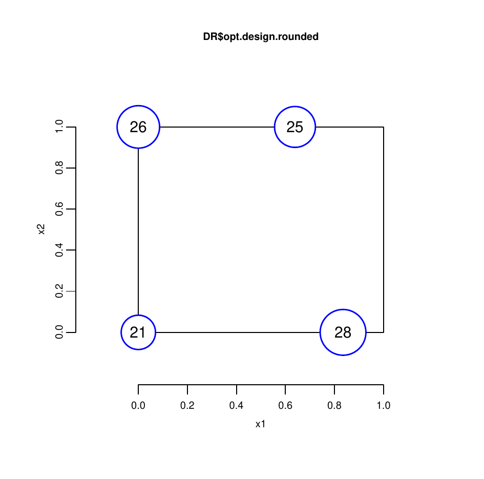
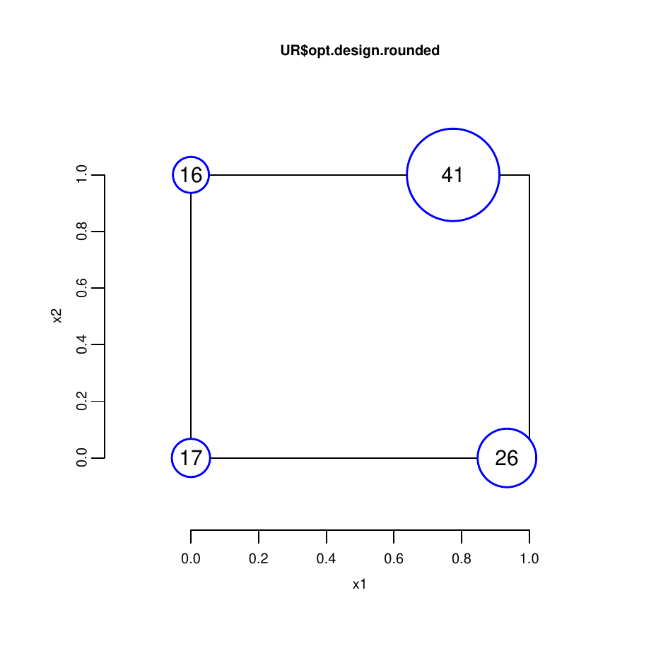
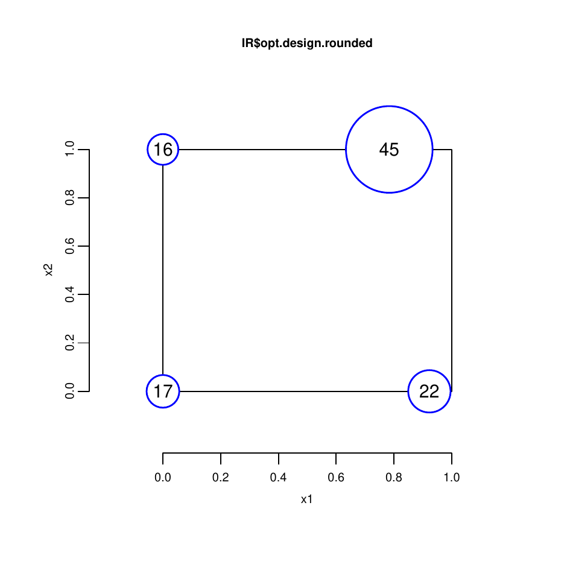
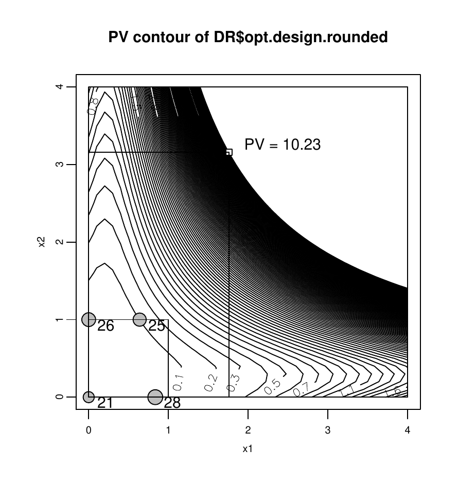
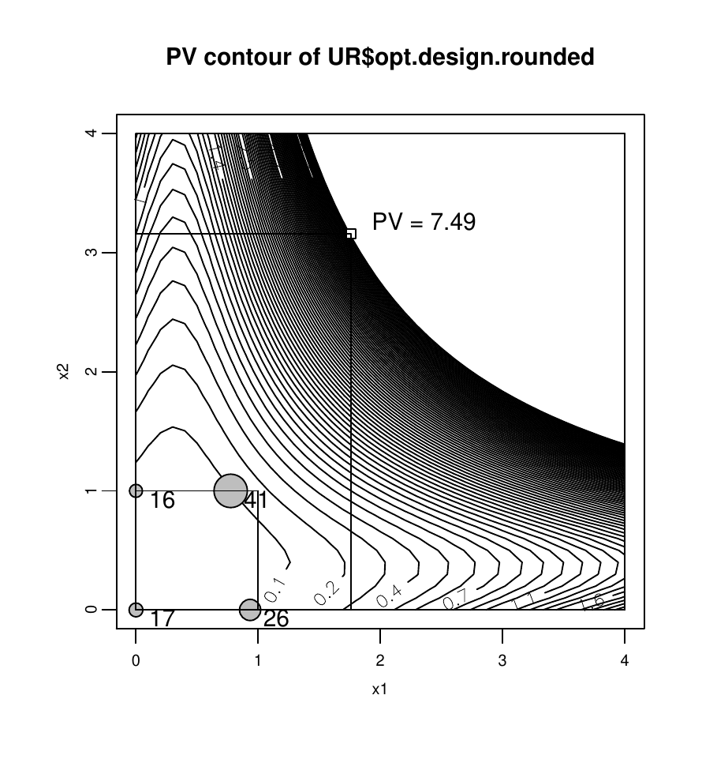
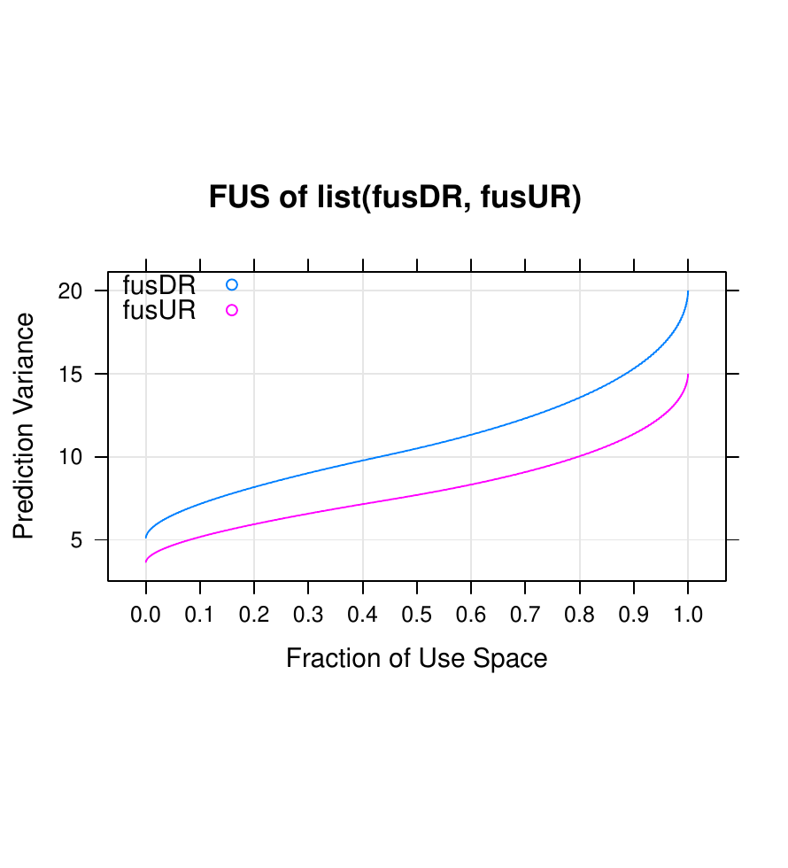
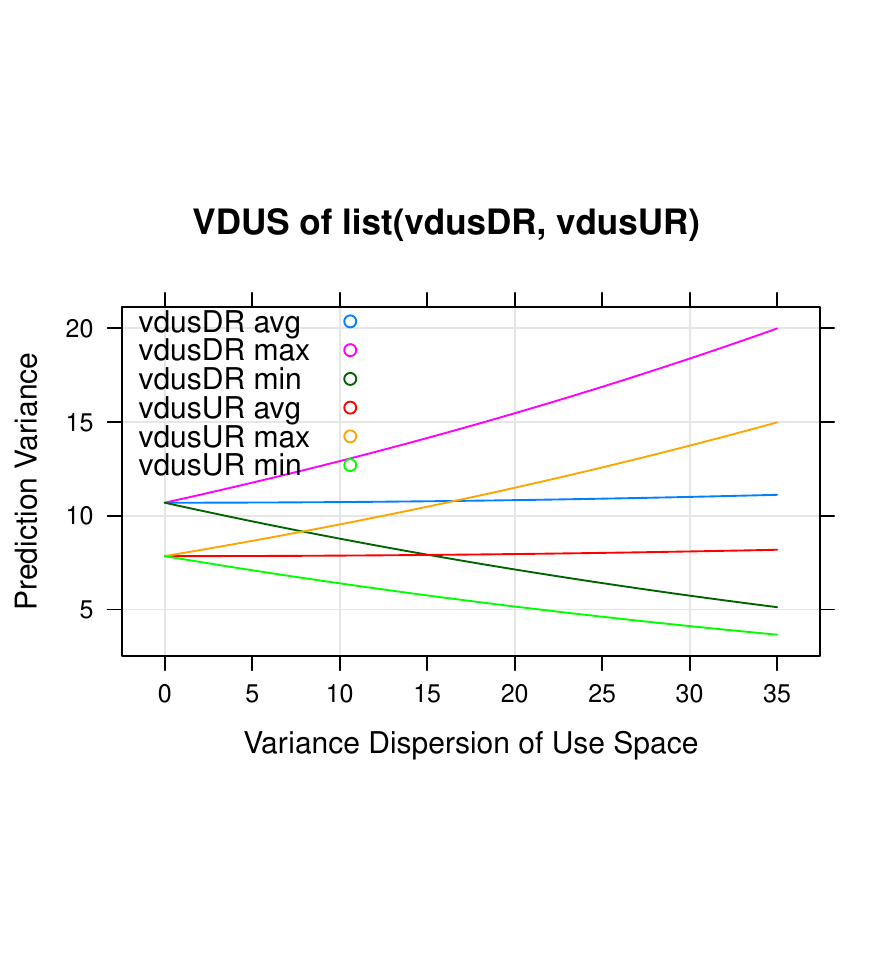

::: article
# Introduction

Accelerated life testing (ALT) is commonly used for obtaining a
product's failure time data by subjecting it to elevated stress
conditions, such as temperature, humidity, and voltage. As a result, the
product fails in a shorter time period than would be expected under
normal stress conditions. The failure data obtained from ALTs can then
be extrapolated to the normal use stress level to estimate the product's
lifetime distribution. @nelson2005bibliographya
[@nelson2005bibliographyb] provides a comprehensive review of ALT papers
up to 2005.

To avoid poor experimental results and to obtain more accurate inference
on the acceleration model and on reliability prediction, it is necessary
to have an effective ALT test plan. A well-designed ALT test plan often
aims to achieve some statistical optimality. However, conventional
experimental designs (e.g., factorial designs) are not effective as ALT
test plans because of the following features of ALTs:

-   Extrapolation -- Test stress levels are typically higher than the
    normal use stress levels. As failure time data will be collected at
    these higher stress levels, extrapolating them to the normal use
    stress level is needed for reliability prediction. Nonlinear
    relationships between failure time and stress levels are expected.

-   Non-normal distributions of failure times -- The failure time
    distribution is typically positively skewed, e.g., the Weibull
    distribution.

-   Censoring of failure time data -- Censoring occurs when the exact
    failure times of test units are not observed. There are several
    reasons for censoring. In some cases, test units do not fail by the
    end of the test period, in which case the data becomes
    right-censored. In other cases, test units are periodically
    inspected, so the only information available is the time interval of
    failure, while the exact failure time is unknown. The latter case is
    called interval-censoring.

In this article, we introduce an R package,
[*ALTopt*](https://CRAN.R-project.org/package=ALTopt) [@ALTopt], that
constructs optimal test plans for ALTs with right- and interval-censored
data. This package is based on the work done by @monroe2011generalized
and @yang2013novel, where generalized linear models (GLMs) were used to
model censored ALT data.

# Optimal designs of ALT

## Optimality criteria

The *ALTopt* package accommodates three optimality criteria:
*D*-optimality, *U*-optimality and *I*-optimality. A *D*-optimal design
minimizes the generalized variance of parameter estimates, while a
*U*-optimal or *I*-optimal design minimizes, respectively, the (average)
variance of response prediction at a single use condition or over a
region of use conditions.

In the GLM context, the *D*-optimal design is defined by
$$\xi^* :=\operatorname*{arg\,max}_\xi \begin{vmatrix} \mathbf{X}(\xi)'\mathbf{W}\mathbf{X}(\xi)
\end{vmatrix}.$$ Let $n$ be the number of test units and $p$ be the
number of of model parameters. Matrix $\mathbf{X}(\xi)$ is the
$n\times p$ model matrix constructed by expanding a design matrix to
include all regression terms in the chosen model form, and matrix
$\mathbf{W}$ is the $n\times n$ diagonal matrix of weights that depends
on the GLM formulation used.

Using the same notation, the *U*-optimal and *I*-optimal designs can be
defined, respectively, as
$$\xi^* :=\operatorname*{arg\,min}_\xi \mathbf{x}'_{use}\cdot(\mathbf{X}(\xi)'\mathbf{W}\mathbf{X}(\xi))^{-1}\cdot\mathbf{x}_{use},$$
and
$$\xi^* :=\operatorname*{arg\,min}_\xi \frac{\int_\Omega\mathbf{x}'_{use}\cdot(\mathbf{X}(\xi)'\mathbf{W}\mathbf{X}(\xi))^{-1}\cdot\mathbf{x}_{use} d\mathbf{x}_{use}}{S_\Omega},$$
where $\mathbf{x}_{use}$ is the single use condition, $\Omega$ is the
region of use conditions, and $S_\Omega$ is the area of use region. For
GLMs, the weights $\mathbf{W}$ are functions of the regression
coefficients in the linear predictor. Therefore, the information matrix
contains unknown model parameter values, implying that the choice of
these unknown values also affects the optimal design (see
@johnson2009choice for more details). In this article, we assume that
these parameter values are pre-specified. They are referred to as the
planning values by @meeker1998statistical.

## GLMs for ALT {#chap:GLM}

A function that links failure time and stress variables is needed in
order to extrapolate the results obtained in the test region to the use
region. The GLM formulation for ALT is built upon the Cox's proportional
hazard (PH) assumption. This section provides the derivation of these
formulations for right-censored and interval-censored ALT data.

### The Cox's proportional hazard model

The PH model assumes that, given the vector of explanatory variables
$\mathbf{x}$, the hazard function of failure time is given by

$$\label{eq:1}
h(t,\mathbf{x};\boldsymbol{\beta})=h_0(t)e^{\mathbf{x}'\boldsymbol{\beta}},  (\#eq:1)  $$

where $h_0(t)$ is called the baseline hazard function and
$\boldsymbol{\beta}$ is a vector of regression coefficients.

Note that the baseline hazard function is a function of time only. From
Eq. \@ref(eq:1) we can derive that

$$\label{eq:2}
H(t,\mathbf{x})=H_0(t)e^{\mathbf{x}'\boldsymbol{\beta}},  (\#eq:2)  $$

where $H(t,\mathbf{x})$ is the cumulative hazard function and $H_0(t)$
is the baseline cumulative hazard function. It is also easy to show that
a reliability function is given by

$$\label{eq:3}
R(t,\mathbf{x})=(R_0(t))^{e^{\mathbf{x}'\boldsymbol{\beta}}},  (\#eq:3)  $$

where $R(t,\mathbf{x})$ is the reliability function and
$R_0(t)=\exp(-H_0(t))$ is the baseline reliability function.

The baseline hazard function of a Weibull distribution is given by
$h_0(t)=\lambda_0\alpha t^{\alpha-1}$, where $\lambda_0$ is called the
intrinsic failure rate and $\alpha$ is the shape parameter of Weibull
distribution. By Eq. \@ref(eq:1), the hazard function of Weibull
distribution can be expressed as
$h(t,\mathbf{x};\boldsymbol{\beta})=\lambda_0\alpha t^{\alpha-1}e^{\mathbf{x}'\boldsymbol{\beta}}$
and, by Eq. \@ref(eq:2), its cumulative hazard function is as
$H(t,\mathbf{x})=\lambda_0 t^\alpha e^{\mathbf{x}'\boldsymbol{\beta}}$.

### GLM for right-censored failure time data

With the proportional hazard assumption, the failure density function is
given by
$$f(t)=h(t)R(t)=h_0(t)e^{\mathbf{x}'\boldsymbol{\beta}}(R_0(t))^{e^{\mathbf{x}'\boldsymbol{\beta}}}.$$

For a failure time data set that includes right-censored survival times,
each observation can be expressed as a pair
$(t_i,c_i ), i=1,2,\dotsc,n$, where $t_i$ is either a failure time or
censoring time and $c_i$ is an indicator variable, which is 1 if the
$i^\text{th}$ unit failed and 0 if it has not failed. Thus, the
likelihood function is given by
$$L=\prod_{i=1}^{n}(f(t_i))^{c_i}(R(t_i))^{1-c_i}=\prod_{i=1}^{n}(h(t_i))^{c_i}R(t_i).$$

From Eqs. \@ref(eq:1) and \@ref(eq:3) the log-likelihood function can be
written as
$$\ln L=\sum_{i=1}^{n}\left[c_i\ln h(t_i)+\ln R(t_i)\right]=\sum_{i=1}^{n}\left[c_i(\ln h_0(t_i)+{\mathbf{x}_i}'\boldsymbol{\beta})+e^{{\mathbf{x}_i}'\boldsymbol{\beta}}\ln R_0(t_i)\right].$$
Let $\mu_i=\exp({\mathbf{x}_i}'\boldsymbol{\beta})(-\ln R_0(t_i))$, we
have

$$\label{eq:4}
\ln L=\sum_{i=1}^{n}\left[c_i\ln h_0(t_i)-c_i\ln (-\ln R_0(t_i))+c_i\ln \mu_i-\mu_i\right].  (\#eq:4)  $$

Note that the last two terms of sum on the right-hand side of Eq.
\@ref(eq:4) are the same as the kernel of the log-likelihood function of
$n$ independent Poisson distributed random variables with mean $\mu_i$.
The first two terms do not depend on the parameter $\boldsymbol{\beta}$.
Therefore, the maximum likelihood estimator $\hat{\boldsymbol\beta}$ of
\@ref(eq:4) is similar to the estimator that maximizes the
log-likelihood function of Poisson distributions. If the indicator
variable $c_i$ is treated as from a Poisson distribution with mean
$\mu_i$, then the GLM formulation becomes

-   The response variables, $c_i$'s, are independently sampled from
    $Poisson(\mu_i)$;

-   The linear predictor is $\eta_i={\mathbf{x}_i}'\boldsymbol{\beta}$;

-   The link function is given by
    $\ln \mu_i=\eta_i+\text{an offset term}$.

This offset term in the link function is $\ln H_0(t_i)$, the log
transformation of the baseline cumulative hazard function. This GLM
formulation is applicable for any failure time distribution with
right-censored data, as long as the PH assumption holds.

Since the log link function is the canonical link function for the
Poisson distribution, the asymptotic variance-covariance matrix of
$\hat{\boldsymbol{\beta}}$ is given by
$$Var(\hat{\boldsymbol{\beta}})=(\mathbf{X}(\xi)'\mathbf{W}\mathbf{X}(\xi))^{-1},$$
where $\mathbf{W}=diag\left\lbrace\sigma_i^2\right\rbrace$ and
$\sigma_i^2$ is the variance of Poisson distribution; i.e.,
$\sigma_i^2=\mu_i=e^{{\mathbf{x}_i}'\boldsymbol{\beta}}H_0(t_i)$. We
replace $t_{i}$ with its expectation, which is given by

$$E[t_i]=P(t<t_c)\cdot E[t_i|t<t_c]+P(t \geq t_c)\cdot E[t_i|t \geq t_c].$$

@monroe2011generalized has shown that

$$\mu_i=\left[1-e^{-H(t_c, \mathbf{x}_i)}\right]=\Phi(t_c, \mathbf{x}_i),$$

where $\Phi$ is the failure time distribution and $t_c$ is the censoring
time.

For a Weibull distribution with the known shape parameter $\alpha$, it
follows that

$$\mu_i=\left[1-\exp({-\lambda_0 t_c^\alpha e^{{\mathbf{x}_i}'\boldsymbol{\beta}}})\right]=\left[1-\exp({-e^{\beta_0+{\mathbf{x}_i}'\boldsymbol{\beta}}t_c^\alpha})\right],$$

where $\beta_0=\ln \lambda_0$ which plays a role of the intercept term
in the linear predictor.

### GLM for interval-censored failure time data

For interval-censored data, the whole testing period is divided into
multiple time intervals such as
$[0, t_1), [t_1, t_2), \cdots, [t_{k-1}, t_k), [t_k, \infty)$, and
failures are expected to occur within one of these intervals. Define the
failure probability of the $i^{th}$ test unit within the $j^{th}$
interval to be

$$p_{ij}=P(t_{j-1}\leq T_i<t_j),$$

and the conditional probability of surviving at the beginning of the
$j^{th}$ interval but failing within the $j^{th}$ interval as

$$\pi_{ij}=P(t_{j-1}\leq T_i<t_j|T_i\geq t_{j-1}), ~~j=1, 2, \ldots, k+1.$$

It can be shown that $p_{i1}=\pi_{i1}$ and
$p_{ij}=(1-\pi_{i1})(1-\pi_{i2})\cdots(1-\pi_{i,j-1})\pi_{ij}$ for
$j=2, 3, \ldots, k+1$.

Define an indicator variable, $r$, such that $r_{ij}=0$ if the $i^{th}$
test unit does not fail within the $j^{th}$ interval and $r_{ij}=1$ if
the $i^{th}$ test unit does fail. Suppose that there are $n$ items, then
the number of observations is $n\times(k+1)$. For example,

$$\begin{aligned}
(0, t_1, r_{i1}), (t_1, t_2, r_{i2}), \cdots, (t_k, \infty, r_{i,k+1}),~i=1,2,...,n
\end{aligned}$$

The likelihood function can be expressed as

$$L=\prod_{i=1}^n \prod_{j=1}^{k+1} p_{ij}^{r_{ij}},$$

which is equivalent to

$$\label{eq:5}
L=\prod_{i=1}^n \prod_{j=1}^{k+1} \pi_{ij}^{r_{ij}}(1-\pi_{ij})^{s_{ij}},  (\#eq:5)  $$

where $s_{ij}=r_{i,j+1}+r_{i,j+2}+\cdots+r_{i,k+1}$. Therefore,
$s_{ij}=1$ if the failure of the $i^{th}$ test unit occurs at a time
after the $j^{th}$ interval and $s_{ij}=0$ if the failure of the
$i^{th}$ test unit occurs within or before the $j^{th}$ interval.

The likelihood function of Eq. \@ref(eq:5) has the same form as the
likelihood function of independent binomial random variables. We treat
$r_{ij}$ as a binomial random variable with probability $\pi_{ij}$ and
sample size $m_{ij}=r_{ij}+s_{ij}$. The data set can be presented as a
series of quadruplets:

$$\begin{aligned}
(0, t_1, r_{i1}, m_{i1}), (t_1, t_2, r_{i2}, m_{i1}), \cdots, (t_k, \infty, r_{i,k+1}, m_{i,k+1}),~i=1,2,...,n.
\end{aligned}$$

Now, we examine the probability $\pi_{ij}$. Notice that

$$\label{eq:6}
1-\pi_{ij}=P(T_i \geq t_j|T_i \geq t_{j-1})=\dfrac{R(t_j)}{R(t_{j-1})}.  (\#eq:6)  $$

By Eq. \@ref(eq:3) it becomes
$$1-\pi_{ij}=\left[ \dfrac{R_0(t_j)}{R_0(t_{j-1})}\right] ^{e^{{\mathbf{x}_i}'\boldsymbol{\beta}}}.$$
Applying the natural logarithm function twice yields

$$\label{eq:more}  
\ln \left[ -\ln (1-\pi_{ij})\right] ={\mathbf{x}_i}'\boldsymbol{\beta}+\ln \left[ \ln  R_0(t_{j-1})/R_0(t_j)\right].  (\#eq:more)  $$

The second term of the right hand side of Eq. \@ref(eq:more) does not
depend on the regression coefficient $\boldsymbol{\beta}$, thus Eq.
\@ref(eq:more) is a complementary log-log link function with an offset
term. We can treat $r_{ij}$'s as independent random variables that
follow a binomial distribution with the probability parameter $\pi_{ij}$
and sample size $m_{ij}$, and the GLM formulation is written as

-   The response variables, $r_{ij}$'s, are distributed as independent
    $Binomial(m_{ij}, \pi_{ij})$;

-   The linear predictor is $\eta_i={\mathbf{x}_i}'\boldsymbol{\beta}$;

-   The link function is given by
    $\ln\left[ -\ln (1-\pi_{ij})\right] =\eta_i+\text{an offset term}$.

Since the log-log link is not a canonical link for the binomial
distribution, we need to introduce
$\Delta=diag\left\lbrace d\theta_i/d\eta_i\right\rbrace$ in the weight
matrix where $\theta_i$ is the natural location parameter of the
binomial distribution; i.e.,

$$\begin{aligned}
\Delta&=diag\left\lbrace \dfrac{d\theta_i}{d\eta_i}\right\rbrace \nonumber \\
&=diag\left\lbrace \dfrac{d\left( \ln \dfrac{\pi_{ij}}{1-\pi_{ij}}\right) }{d\left( \ln (-\ln(1-\pi_{ij}))\right) }\right\rbrace \nonumber \\
&=diag\left\lbrace -\dfrac{\ln (1-\pi_{ij})}{\pi_{ij}}\right\rbrace .
\end{aligned}$$

Then, the asymptotic variance-covariance matrix of
$\hat{\boldsymbol{\beta}}$ is given by

$$\begin{aligned}
Var(\hat{\boldsymbol{\beta}})&=(\mathbf{X^*}(\xi)'\mathbf{W}\mathbf{X^*}(\xi))^{-1}\\
							  &=(\mathbf{X^*}(\xi)'\Delta\mathbf{V}\Delta\mathbf{X^*}(\xi))^{-1},
\end{aligned}$$

where $\mathbf{X^*}(\xi)=\mathbf{X}(\xi)\otimes\boldsymbol{1}_{k+1}$ and
$\mathbf{V}=diag\{\sigma_{ij}^2\}$. Note that, instead of using
$\mathbf{X}(\xi)$, the original model matrix, $\mathbf{X^*}(\xi)$, which
is a matrix of size $n(k+1)\times p$, is used. Each row of
$\mathbf{X}(\xi)$ is repeated $(k+1)$ times in $\mathbf{X^*}(\xi)$
because each test unit has $(k+1)$ intervals.

In a binomial distribution, $\sigma_{ij}^2=m_{ij}\pi_{ij}(1-\pi_{ij})$,
which includes the random variable $m_{ij}$. Replacing $m_{ij}$ with its
expectation, the weight matrix becomes

$$\begin{aligned}
\label{eq:7}
\mathbf{W}&=\Delta\mathbf{V}\Delta \nonumber \\
 &=diag\left\lbrace \left( -\dfrac{\ln (1-\pi_{ij})}{\pi_{ij}}\right)  E(m_{ij})\pi_{ij}(1-\pi_{ij})\left( -\dfrac{\ln (1-\pi_{ij})}{\pi_{ij}}\right) \right\rbrace \nonumber \\
 &=diag\left\lbrace \dfrac{\{\ln (1-\pi_{ij})\}^2 (1-\pi_{ij})}{\pi_{ij}} E(m_{ij})\right\rbrace.
\end{aligned}  (\#eq:7)  $$

Assuming a Weibull distribution for a product's lifetime, we have
$R(t,\mathbf{x})=\exp(-H(t, \mathbf{x}))=\exp(-\lambda_0 t^\alpha e^{\mathbf{x}'\boldsymbol{\beta}})=e^{-t^\alpha e^{\beta_0+\mathbf{x}'\boldsymbol{\beta}}}$.
Substituting it into \@ref(eq:6) yields

$$1-\pi_{ij}=\dfrac{e^{-t_j^\alpha e^{\beta_0+\mathbf{x}'\boldsymbol{\beta}}}}{e^{-t_{j-1}^\alpha e^{\beta_0+\mathbf{x}'\boldsymbol{\beta}}}}.$$

Assume all time intervals have the same length, $\Delta t$. Then,

$$\label{eq:8} 
1-\pi_{ij}=\dfrac{e^{-(j\Delta t)^\alpha e^{\beta_0+\mathbf{x}'\boldsymbol{\beta}}}}{e^{-((j-1)\Delta t)^\alpha e^{\beta_0+\mathbf{x}'\boldsymbol{\beta}}}}=e^{((j-1)^\alpha -j^\alpha)\Delta t^\alpha e^{\beta_0+\mathbf{x}'\boldsymbol{\beta}}}.  (\#eq:8)  $$

We also have

$$\begin{aligned}
\label{eq:9}
E(m_{ij})&=0 \times P(T_i<t_{j-1})+1 \times P(T_i \geq t_{j-1})\nonumber \\
&=P(T_i \geq t_{j-1})\nonumber \\
&=R(t_{j-1}, \mathbf{x}_i)\nonumber \\
&=e^{-((j-1)\Delta t)^\alpha e^{\beta_0+{\mathbf{x}_i}'\boldsymbol{\beta}}}.
\end{aligned}  (\#eq:9)  $$

Substituting Eq. \@ref(eq:8) and Eq. \@ref(eq:9) into Eq. \@ref(eq:7)
yields the weight matrix for the interval-censored Weibull failure time
data:

$$\begin{aligned}
\mathbf{W}&=diag\left\lbrace \dfrac{\{((j-1)^\alpha-j^\alpha)\Delta t^\alpha e^{\beta_0+{\mathbf{x}_i}'\boldsymbol{\beta}}\}^2 e^{((j-1)^\alpha-j^\alpha)\Delta t^\alpha e^{\beta_0+\mathbf{x}'\boldsymbol{\beta}}}}{1-e^{((j-1)^\alpha-j^\alpha)\Delta t^\alpha e^{\beta_0+\mathbf{x}'\boldsymbol{\beta}}}} e^{-((j-1)\Delta t)^\alpha e^{\beta_0+{\mathbf{x}_i}'\boldsymbol{\beta}}}\right\rbrace \nonumber \\
&=diag\left\lbrace \dfrac{((j-1)^\alpha-j^\alpha)^2 \Delta t^{2 \alpha}e^{2(\beta_0+{\mathbf{x}_i}'\boldsymbol{\beta})-j^\alpha \Delta t^\alpha e^{\beta_0+{\mathbf{x}_i}'\boldsymbol{\beta}}}}{1-e^{((j-1)^\alpha-j^\alpha)\Delta t^\alpha e^{\beta_0+{\mathbf{x}_i}'\boldsymbol{\beta}}}} \right\rbrace.
\end{aligned}$$

# Introduction to the package *ALTopt*

The main purpose of the *ALTopt* package is to construct *D*-, *U*-, and
*I*-optimal ALT test plans. Two main functions, `altopt.rc` and
`altopt.ic`, are developed respectively for the right-censoring and
interval-censoring cases. The following assumptions are required for
using this package:

-   Failure time data follows the Weibull distribution where the shape
    parameter is specified by the user.

-   Log-linear functions are used to model the relationship between a
    failure time distribution parameter and the stress factors.

-   For interval-censored data, all the intervals have the same length.

Lastly, the package can accommodate many stress factors, but 5 or fewer
is recommended for computational efficiency.

This package also provides two functions for evaluating existing test
plans -- `alteval.rc` and `alteval.ic`. These functions can be used for
comparing test plans generated by this *ALTopt* package or any other
methods. Graphical displays of prediction variance are made available.
These plotting features enhance the usefulness of this package for
comparing and selecting test plans.

## Creating optimal ALT test plans

The syntax of `altopt.rc` and `altopt.ic` functions are as follows:

``` r
altopt.rc(optType, N, tc, nf, alpha, formula, coef,
  useCond, useLower, useUpper, nOpt = 1, nKM = 30, nCls = NULL)

altopt.ic(optType, N, t, k, nf, alpha, formula, coef,
  useCond, useLower, useUpper, nOpt = 1, nKM = 30, nCls = NULL)
```

The arguments within these functions are:

-   `optType` -- Choice of `"D"`, `"U"`, and `"I"` optimality.

-   `N` -- The number of test units.

-   `tc` (`altopt.rc` only) -- The planned right censoring time.

-   `t` (`altopt.ic` only) -- The planned total testing time (i.e., the
    end point of the last interval).

-   `k` (`altopt.ic` only) -- The number of time intervals.

-   `nf` -- The number of stress factors.

-   `alpha` -- The value of the shape parameter of the Weibull
    distribution.

-   `formula` -- The object of class "`formula`" expressing the linear
    predictor model.

-   `coef` -- The numeric vector containing the coefficients of each
    term in `formula`.

-   `useCond` -- The numeric vector of use condition. It should be
    provided when `optType` is `"U"`. The length of the vector should be
    same as the number of stress factors.

-   `useLower` -- The numeric vector of lower bound of use region in
    coded units. It should be provided when `optType` is `"I"`. The
    length of the vector should be the same as the number of stress
    factors.

-   `useUpper` -- The numeric vector of upper bound of use region in
    coded units. It should be provided when `optType` is `"I"`. The
    length of the vector should be the same as the number of stress
    factors.

-   `nOpt` -- The number of repetitions of optimization processes. The
    default value is 1. If `nOpt` is larger than 1, each optimization
    process starts from randomly chosen design points in the design
    region and each solution may slightly differ. The output shows the
    best solution overall.

-   `nKM` -- The number of repetitions of k-means clustering, which is
    used to generate the optimal design clustered by `kmeans`. The
    default value is 30.

-   `nCls` -- The number of clusters used for k-means clustering. If not
    specified, it is set as the number of parameters in the linear
    predictor model.

We use the function `stats::optim` with the `"L-BFGS-B"` method to
perform optimization. This function allows box constraints on design
variables. In our case, we have a cuboidal design region where the
levels of each stress factor are coded to be between 0 and 1. More
details about the `"L-BFGS-B"` method are available in @byrd1995limited.

The output of these functions are given as a list with the following
components:

-   `call` -- The matched call.

-   `opt.design.rounded` -- The optimal design clustered by rounding.

-   `opt.value.rounded` -- The objective function value of
    `opt.design.rounded`.

-   `opt.design.kmeans` -- The optimal design clustered by k-means
    algorithm.

-   `opt.value.kmeans` -- the objective function value of
    `opt.design.kmeans`.

The procedure begins by generating an initial test plan with $N$ design
points, which are randomly selected from possible points in the design
region. For example, if we have 100 test units and 2 stress factors the
optimization process begins from 100 randomly chosen initial points,
which spread out over the design region. Throughout the optimization
procedure, each of these 100 points converges to its own optimal
location. to create a practical test plan, it is sometimes necessary to
enforce some clustering procedure to reduce the number of distinct
design points. Two clustering methods are implemented in the package.
When the design points are very close, the simple method of rounding (to
the $3^\text{rd}$ decimal place) the stress values is effective and
straightforward. When there are still too many design points, the
alternative is to use k-means clustering, which requires the
specification of the number of clusters, `nCls`. By carefully selecting
the number of clusters, it is possible to reduce the number of distinct
design points without significantly affecting the value of the objective
function. The final recommended test plans are provided by the elements,
`opt.design.rounded`, or `opt.design.kmeans`, presented by a table
containing each design point location and the number of test units
allocated at each design point. The corresponding values of the
objective function of these plans are also stored in `opt.value.rounded`
and `opt.value.kmeans`.

The `design.plot` function displays the recommended test plan as a
bubble plot on a two-dimensional design region of user-specified stress
factors. The size of each bubble represents the relative size of the
test unit allocations. The arguments of `design.plot` are as follows:

``` r
design.plot(design, xAxis, yAxis)
```

-   `design` -- A data frame containing the coordinates and the test
    unit allocation at each design point. The components,
    `opt.design.rounded` or `opt.design.kmeans`, of an output created by
    `altopt.rc` or `altopt.ic` can be given for this argument directly
    and any other design with the same form of those can also be given.

-   `xAxis` -- The name of the factor to be displayed on the $x$ axis.

-   `yAxis` -- The name of the factor to be displayed on the $y$ axis.

## Evaluating ALT test plans

This package provides several methods to evaluate an ALT test plan. The
first method is the numerical evaluation of a given test plan using
`alteval.rc` or `alteval.ic`. These functions return the value of the
objective function of the test plan. The arguments are as follows:

``` r
alteval.rc(designTable, optType, tc, nf, alpha, formula, coef,
  useCond, useLower, useUpper)

alteval.ic(designTable, optType, t, k, nf, alpha, formula, coef,
  useCond, useLower, useUpper)
```

The existing test plan is specified in the argument `designTable`. The
other arguments of `alteval.rc` and `alteval.ic` are similar to the
arguments in `altopt.rc` and `altopt.ic`.

*ALTopt* also provides three different graphs for evaluating a test plan
-- the prediction variance (PV) contour plot, the fraction of use space
(FUS) plot, and the variance dispersion of use space (VDUS) plot. These
graphical tools are useful when visualizing the prediction variance
throughout the entire use-space region [@myers2009response chap. 8]. The
PV contour plot displays the contours of the estimated prediction
variance from the design region to the use region of a two-dimensional
user-specified stress factor space. Functions `pv.contour.rc` and
`pv.contour.ic` generate the PV contour plot of an ALT test plan with
right and interval censoring, respectively. The FUS plot is an extension
of the fraction of design space (FDS) proposed by @zahran2003fraction.
The vertical axis of a FUS plot is the fraction of the use space region
that has prediction variance less than or equal to the given values in
the horizontal axis. Functions `pv.fus.rc` and `pv.fus.ic` create the
FUS plot of right and interval censoring ALT plans, respectively. In
addition, the FUS curves of multiple designs can be overlaid on one
graph by using `compare.fus`, so these designs can be compared
graphically. The VDUS plot is an extension of the variance dispersion
graphs (VDGs) of @giovannitti1989graphical to the cuboidal use space
region. It shows plots of minimum, average and maximum prediction
variance from the center to the boundary of the use region. The
comparison of multiple VDUS is also available through `compare.vdus`.
The arguments of these functions are omitted here, because they are
similar to previously described functions.

# An example with two stress factors and right censoring

In this section, we demonstrate the use of *ALTopt* using the
right-censored ALT data set from @yang2013novel. In this experiment, an
ALT of 100 test units is conducted with two stress factors --
temperature and humidity. The lowest and highest stress levels in the
test region are (60 , 60 %) and (110 , 90 %), respectively. The normal
use condition is (30 , 25 %), while the typical use region has the range
from (20 , 20 %) to (40 , 30 %). The natural stress variables of these
two factors are defined by $S_1=11605/T$, where $T$ is the temperature
in degrees Kelvin (i.e., temp + 273.15), and $S_2=\ln (h)$, where $h$ is
the relative humidity. These values are assigned to the following
variables:

``` r
R> NuseCond <- c(11605 / (30 + 273.15), log(25))
R> NuseLow <- c(11605 / (20 + 273.15), log(20))
R> NuseHigh <- c(11605 / (40 + 273.15), log(30))
R> NdesLow <- c(11605 / (60 + 273.15), log(60))
R> NdesHigh <- c(11605 / (110 + 273.15), log(90))
```

Next, we apply a coding scheme on these natural variables so that the
highest stress level becomes (0, 0) and the lowest stress level becomes
(1, 1).

$$x_1=\dfrac{S_1-S_1^H}{S_1^L-S_1^H}, \quad x_2=\dfrac{S_2-S_2^H}{S_2^L-S_2^H}.$$

Here, $x_1$ and $x_2$ are the coded stress variables of $S_1$ and $S_2$,
respectively. The *ALTopt* package provides a utility function,
`convert.stress.level`, to convert the natural stress level to the coded
stress level, and vice versa. The use condition and the use stress
region are accordingly coded as follows:

``` r
R> library(ALTopt)
R> (useCond <- as.numeric(convert.stress.level(NdesLow, NdesHigh,
+    actual = NuseCond))) # Coded use condition

[1] 1.758337 3.159172

R> (useLower <- as.numeric(convert.stress.level(NdesLow, NdesHigh,
+    actual = NuseHigh))) # Coded use region's lower bound

[1] 1.489414 2.709511

R> (useUpper <- as.numeric(convert.stress.level(NdesLow, NdesHigh,
+    actual = NuseLow))) # Coded use region's upper bound

[1] 2.045608 3.709511
```

We assume that the failure times follow an exponential distribution,
i.e., `alpha = 1`, and the pre-specified linear predictor is given by

$$\eta_i=-4.086x_1-1.476x_2+0.01x_1x_2.$$

Suppose the total testing time is 30 time units. The *D-optimal* test
plan is generated by the following lines of code:

``` r
R> set.seed(10)
R> DR <- altopt.rc("D", N = 100, tc = 30, nf = 2, alpha = 1,
+    formula = ~ x1 + x2 + x1:x2, coef = c(0, -4.086, -1.476, 0.01))
R> DR

$call
altopt.rc(optType = "D", N = 100, tc = 30, nf = 2, alpha = 1,
    formula = ~ x1 + x2 + x1:x2, coef = c(0, -4.086, -1.476, 0.01))

$opt.design.rounded
     x1 x2 allocation
1 0.000  0         21
2 0.835  0         28
3 0.000  1         26
4 0.639  1         25

$opt.value.rounded
[1] 27153.91

$opt.design.kmeans
         x1 x2 allocation
1 0.8353075  0         28
2 0.0000000  0         21
3 0.6390136  1         25
4 0.0000000  1         26

$opt.value.kmeans
[1] 27153.92
```

While the formula does not include the intercept term explicitly, the
value of the intercept parameter still needs to be specified (in this
case, it is 0). From the final design output, we noticed that the
designs generated by rounding and clustering are almost the same.

We can also generate the *U*-optimal and *I*-optimal designs using the
following lines of code:

``` r
R> set.seed(50)
R> UR <- altopt.rc("U", N = 100, tc = 30, nf = 2, alpha = 1,
+    formula = ~ x1 + x2 + x1:x2, coef = c(0, -4.086, -1.476, 0.01),
+    useCond = useCond)

R> set.seed(100)
R> IR <- altopt.rc("I", N = 100, tc = 30, nf = 2, alpha = 1,
+    formula = ~ x1 + x2 + x1:x2, coef = c(0, -4.086, -1.476, 0.01),
+    useLower = useLower, useUpper = useUpper)
```

Using `design.plot` function, we can draw the bubble plots of these test
plans.

``` r
R> design.plot(DR$opt.design.rounded, xAxis = x1, yAxis = x2)
R> design.plot(UR$opt.design.rounded, xAxis = x1, yAxis = x2)
R> design.plot(IR$opt.design.rounded, xAxis = x1, yAxis = x2)
```

<figure id="fig:Design Plots">
<table>
<caption> </caption>
<tbody>
<tr class="odd">
<td style="text-align: center;"></td>
<td style="text-align: center;"></td>
<td style="text-align: center;"></td>
</tr>
<tr class="even">
<td style="text-align: center;">(a)</td>
<td style="text-align: center;">(b)</td>
<td style="text-align: center;">(c)</td>
</tr>
</tbody>
</table>
<figcaption>Figure 1: Design plots of (a)<em>D-optimal</em>, (b)
<em>U-optimal</em> and (c) <em>I-optimal</em> designs with right
censoring drawn by <code>design.plot</code> function. <span
id="fig:Design Plots" label="fig:Design Plots"></span></figcaption>
</figure>

From Figure [1](#fig:Design Plots), one can see that the *U-* and
*I*-optimal test plans resemble each other, while the *D*-optimal test
plan is very different from the other two. This is expected because the
objective functions of *U*- and *I*-optimal designs involve the variance
of reliability prediction, while the *D*-optimal design involves the
variance of parameter estimation. From the *U*- and *I*-optimal test
plans, it is noticeable that a large number of test units is allocated
at the lowest stress level. This type of test unit allocation scheme is
common in ALTs [e.g., @meeker1975optimum].

To compare the *D*-optimal test plan and the *U*-optimal test plan, the
`pv.contour.rc` function generates the contour plot of prediction
variance using the following lines of code:

``` r
R> pv.contour.rc(DR$opt.design.rounded, xAxis = x1, yAxis = x2,
+    tc = 30, nf = 2, alpha = 1, formula = ~ x1 + x2 + x1:x2,
+    coef = c(0, -4.086, -1.476, 0.01), useCond = useCond)
R> pv.contour.rc(UR$opt.design.rounded, xAxis = x1, yAxis = x2,
+    tc = 30, nf = 2, alpha = 1, formula = ~ x1 + x2 + x1:x2,
+    coef = c(0, -4.086, -1.476, 0.01), useCond = useCond)
```

<figure id="fig:Contour Plots">
<table>
<caption> </caption>
<tbody>
<tr class="odd">
<td style="text-align: center;"></td>
<td style="text-align: center;"></td>
</tr>
<tr class="even">
<td style="text-align: center;">(a)</td>
<td style="text-align: center;">(b)</td>
</tr>
</tbody>
</table>
<figcaption>Figure 2: Prediction variance contour plots of (a)
<em>D-optimal</em> and (b) <em>U-optimal</em> designs with right
censoring drawn by <code>pv.contour.rc</code> function.</figcaption>
</figure>

<figure id="fig:FusVdus">
<table>
<caption> </caption>
<tbody>
<tr class="odd">
<td style="text-align: center;"></td>
</tr>
<tr class="even">
<td style="text-align: center;">(a)</td>
</tr>
<tr class="odd">
<td style="text-align: center;"></td>
</tr>
<tr class="even">
<td style="text-align: center;">(b)</td>
</tr>
</tbody>
</table>
<figcaption>Figure 3: Comparison of <em>D-optimal</em> and
<em>U-optimal</em> designs with right censoring using (a) FUS plot and
(b) VDUS plot.</figcaption>
</figure>

Figure [2](#fig:Contour Plots) shows that the *U*-optimal test plan has
lower prediction variance than the *D*-optimal test plan at the normal
use condition. The FUS and VDUS plots can also be used for further
comparison of these test plans. These plots are shown in
Figure [3](#fig:FusVdus).

``` r
R> fusDR <- pv.fus.rc(DR$opt.design.rounded, tc = 30, nf = 2, alpha = 1,
+    formula = ~ x1 + x2 + x1:x2, coef = c(0, -4.086, -1.476, 0.01),
+    useLower = useLower, useUpper = useUpper)
R> fusUR <- pv.fus.rc(UR$opt.design.rounded, tc = 30, nf = 2, alpha = 1,
+    formula = ~ x1 + x2 + x1:x2, coef = c(0, -4.086, -1.476, 0.01),
+    useLower = useLower, useUpper = useUpper)
R> compare.fus(fusDR, fusUR)
```

``` r
R> vdusDR <- pv.vdus.rc(DR$opt.design.rounded, tc = 30, nf = 2, alpha = 1,
+    formula = ~ x1 + x2 + x1:x2, coef = c(0, -4.086, -1.476, 0.01),
+    useLower = useLower, useUpper = useUpper)
R> vdusUR <- pv.vdus.rc(UR$opt.design.rounded, tc = 30, nf = 2, alpha = 1,
+    formula = ~ x1 + x2 + x1:x2, coef = c(0, -4.086, -1.476, 0.01),
+    useLower = useLower, useUpper = useUpper)
R> compare.vdus(vdusDR, vdusUR)
```

Figure [3](#fig:FusVdus) shows that the *U*-optimal test plan performs
better in majority of the use-space region with respect to the
prediction variance.

Finally, the `convert.stress.level` function is useful for converting
the $U$-optimal test plan to the natural stress level conditions.

``` r
R> convert.stress.level(NdesLow, NdesHigh, stand = UR$opt.design.rounded)

        x1       x2 allocation
1 30.28840 4.499810         17
2 34.53414 4.499810         26
3 30.28840 4.094345         16
4 33.81136 4.094345         41
```

# Summary

This paper describes the *ALTopt* package in R for constructing optimal
ALT test plans for right- and interval-censored data. The package
accommodates three statistical optimality criteria -- *D*-optimal,
*U*-optimal and *I*-optimal. It applies the GLM approach to the modeling
of failure/censoring times and the derivation of the asymptotic
variance-covariance matrix of regression coefficients. Failure times are
assumed to follow a Weibull distribution. To use the package
effectively, users are required to specify the linear predictor of the
GLM and the shape parameter of the Weibull distribution. An example
demonstrated the construction of optimal test plans for an ALT with two
stress factors and right-censored data. This package also provides
graphical functions for evaluating and comparing various test plans.
:::
