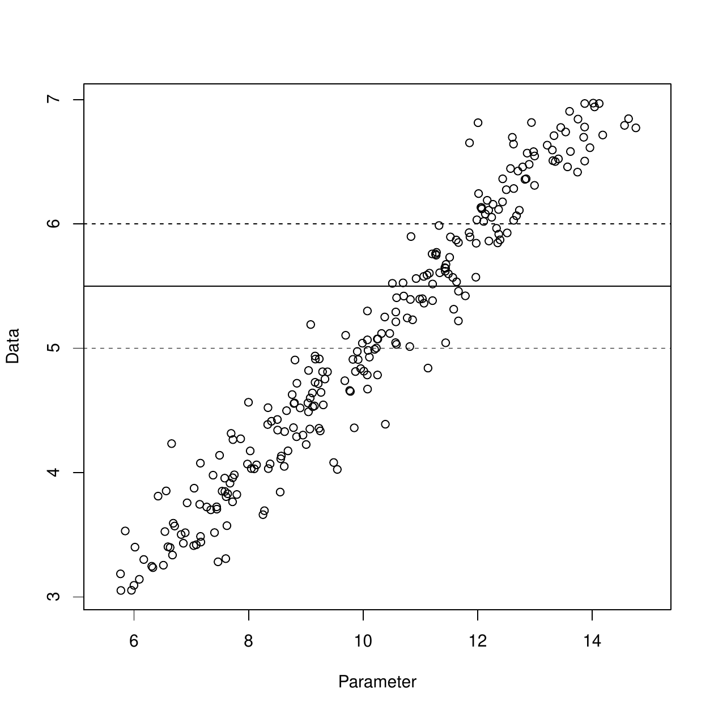
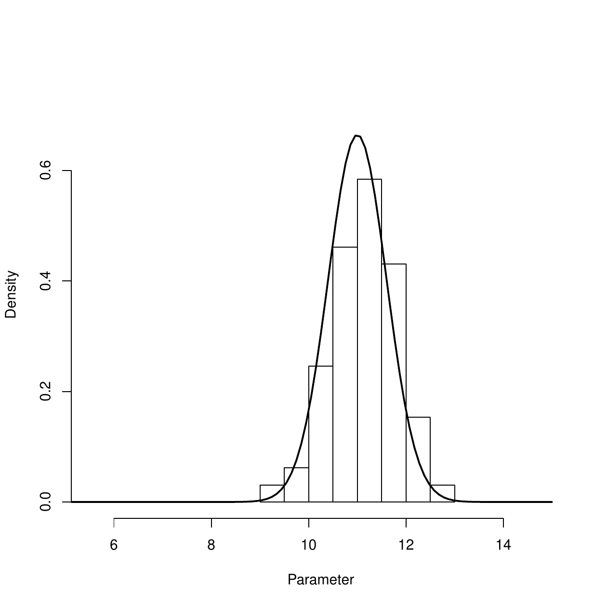
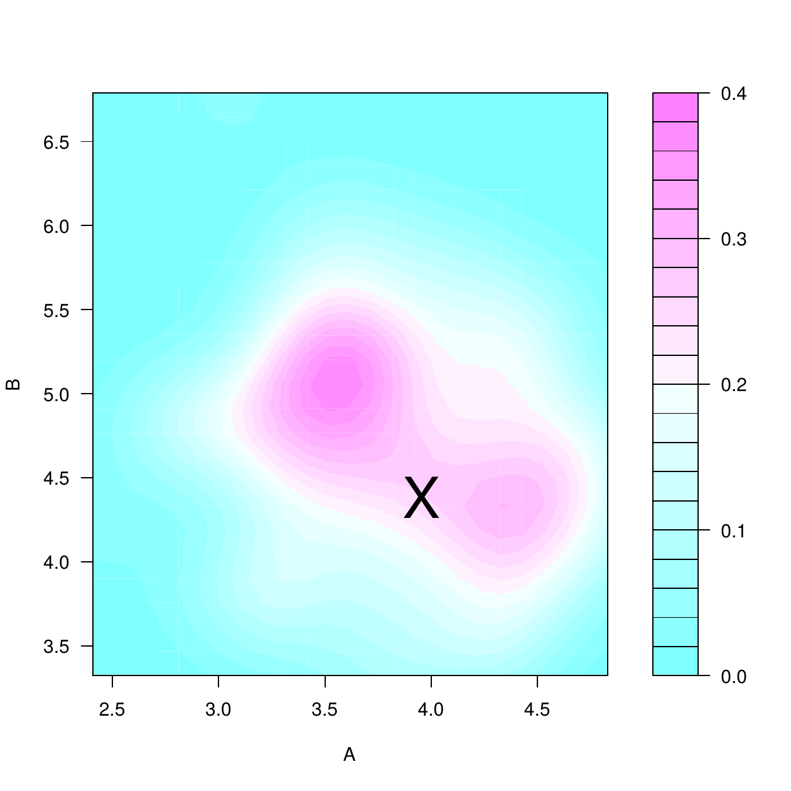
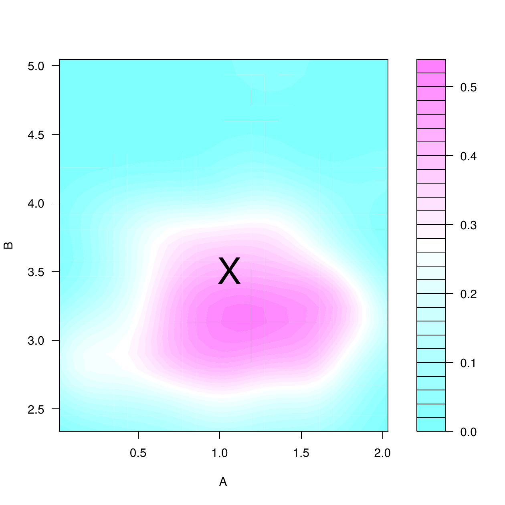
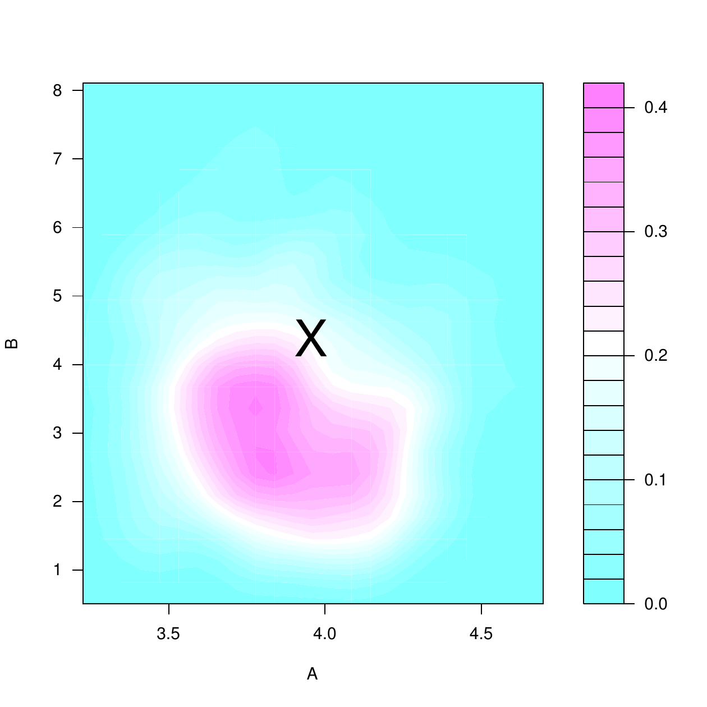
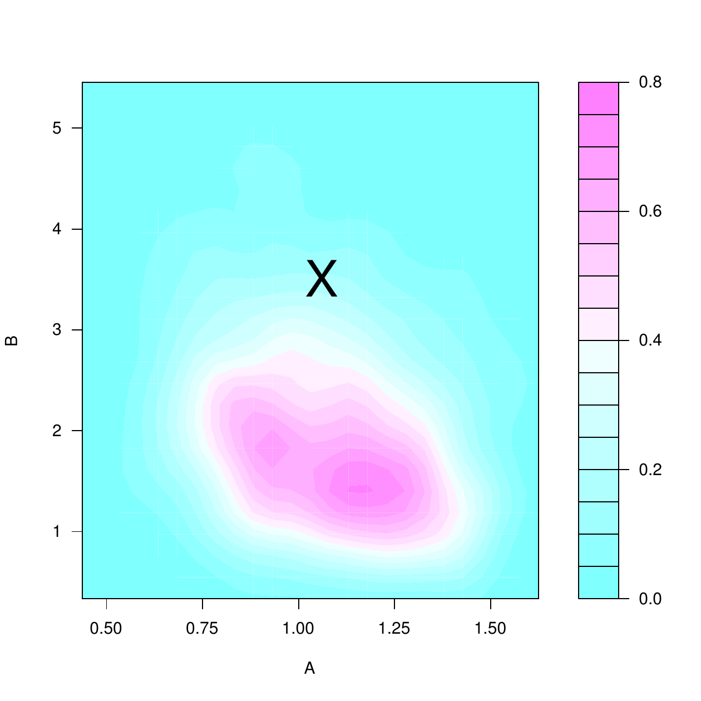

::: article
# Introduction {#sec:intro}

Approximate Bayesian computation (ABC) refers to a family of statistical
techniques for inference in cases where numerical evaluation of the
likelihood is difficult or intractable, ruling out standard maximum
likelihood and Bayesian techniques. It has been successfully applied in
a wide range of scientific fields which encounter complex data and
models, such as population genetics
[@fagundes07:statistical; @Beaumont:2010], ecology [@Csillery:2010],
infectious disease modelling [@luciani09:the; @Brooks:2014], systems
biology [@ratmann07:using; @toni09:approximate] and astronomy
[@Cameron:2012; @Weyant:2013].

ABC performs inference based on simulation of datasets rather than
likelihood evaluation. For this reason it is known as a
*likelihood-free* method. The simplest ABC algorithm is rejection-ABC.
This simulates parameter values from the prior and corresponding
datasets from the model of interest. Parameters are accepted if the
distance between *summary statistics* of the simulated and the observed
data is below a *threshold*, $\varepsilon$. A similar approach can be
used to choose between several models with intractable likelihoods. In
all cases two key tuning choices for ABC are $\varepsilon$ and which
summary statistics are used.
[*abctools*](https://CRAN.R-project.org/package=abctools) provides
various tools to assist these choices. It has been designed to
complement existing software for performing ABC algorithms, especially
the [*abc*](https://CRAN.R-project.org/package=abc) package
[@csillery11:abc]. The examples in this paper use version 1.0.3 of
*abctools*. Note that all the methods provided require access to at
least some of the datasets simulated by ABC. In this sense they are
post-processing tools.

The remainder of the article is organised as follows. First a review of
relevant ABC algorithms, theory and software is given. Then two data
examples are introduced which will be used for illustration throughout
the paper. The following section describes the summary statistic
selection methods provided by *abctools*. The final section considers
choice of $\varepsilon$ using the coverage property
[@prangle14:diagnostic].

# Review of ABC

The following algorithms perform ABC for parameter inference or model
choice. This is done in a Bayesian framework. Observed data is
represented by $x_{\text{obs}}$. One or several probability densities
$p(x|\theta,m)$ are available as models for the data. Here $\theta$ is a
vector of parameters and $m$ is a model indicator. Prior model weights
$p(m)$ and parameter densities for each model $p(\theta|m)$ must also be
specified. (Note that there is no requirement for the length of $\theta$
to be the same in all models.) If there is only one model of interest
(the parameter inference case) the model can be written as $p(x|\theta)$
and then only a single parameter prior $p(\theta)$ is needed.

The ABC algorithms require that it is possible to sample from the priors
and models. They also require various tuning choices: a distance
function $d(\cdot,\cdot)$ (Euclidean distance is a common choice), a
threshold $\varepsilon\geq 0$ and a mapping $s(\cdot)$ from data to a
vector of summary statistics.

#### Rejection-ABC for parameter inference

1.  *Initialisation:* For the observed dataset $x_{\text{obs}}$, compute
    a vector of summary statistics $s_{\text{obs}}=s(x_{\text{obs}})$.

2.  *Main loop:*

3.  Draw a parameter vector $\theta'\sim p(\theta)$ from the prior
    distribution;

4.  Generate data from the model $x'\sim p(x|\theta')$, and compute
    summaries $s'=s(x')$;

5.  If $d(s', s_{\text{obs}}) \leq \varepsilon$, accept $\theta'$.

#### Rejection-ABC for model choice

1.  *Initialisation:* For the observed dataset $x_{\text{obs}}$, compute
    a vector of summary statistics $s_{\text{obs}}=s(x_{\text{obs}})$.

2.  *Main loop:*

3.  Draw a model $m' \sim p(m)$ from the prior distribution on models;

4.  Draw a parameter vector $\theta'\sim p(\theta|m')$ from the prior
    distribution on parameters for model $m'$;

5.  Generate data from the model $x'\sim p(x|\theta',m')$, and compute
    summaries $s'=s(x')$;

6.  If $d(s', s_{\text{obs}}) \leq \varepsilon$, accept $(m', \theta')$.

Both algorithms output a sample from an approximation to the posterior
distribution. That is, for parameter inference the output is
$\theta_1, \theta_2, \ldots$ from an approximation to
$p(\theta | x_{\text{obs}})$, and for model choice the output is
$(m_1, \theta_1), (m_2, \theta_2), \ldots$ from an approximation to
$p(\theta, m | x_{\text{obs}})$.

If $\varepsilon=0$ then only exact matches $x'=x_{\text{obs}}$ are
accepted. It can easily be shown that in this case the output sample
follows the exact posterior distribution of interest. However this is
rarely practical as the probability of an exact match is typically very
low for discrete data or zero for continuous data. Hence a tolerance
$\varepsilon>0$ is used, producing a sample from an approximation to the
posterior (see Figure [1](#fig:rejabc)). An obvious acceptance criterion
is $d(x',x_{\text{obs}}) \leq \varepsilon$, but this has been found to
produce a poor approximation unless the data is low dimensional.
Intuitively this is because close matches to the data become
increasingly unlikely as the number of numerical components which must
be matched increases. This *curse of dimensionality* problem motivates
the use of low-dimensional summary statistics, which have greatly
improved results in practice. See
[@Beaumont:2010; @Csillery:2010; @Marin:2012] for a more detailed
discussion of this issue, and general background on ABC.

<figure id="fig:rejabc">
<p></p>
<figcaption>Figure 1: A pictorial illustration of the rejection-ABC
algorithm for inference in a single parameter model (details omitted).
The left panel shows simulated parameters and datasets. The solid
horizontal line shows the observed data, and the dashed lines show
acceptance boundaries. The right panel is a histogram and kernel density
estimate of the accepted parameter values. These approximate the
posterior distribution. <span id="fig:rejabc"
label="fig:rejabc"></span></figcaption>
</figure>

Two crucial tuning choices in rejection-ABC are the tolerance
$\varepsilon$ and the summary statistics $s(\cdot)$. Several approaches
have been proposed in the literature to address these choices.
*abctools* implements a range of such summary statistic selection
methods and a method for choosing $\varepsilon$ based on
[@prangle14:diagnostic]. Note that there are many other methods: for
example see [@blum13:a] for a recent review of ABC summary statistic
selection methods and [@csillery11:abc] for choice of $\varepsilon$ by
cross-validation.

There are several ABC algorithms which are more efficient than
rejection-ABC. These concentrate on simulating from models and parameter
values close to previously successful values. These include Markov chain
Monte Carlo [@marjoram03:markov; @sisson+f11] and sequential Monte Carlo
(SMC) techniques
[@sisson07:sequential; @toni09:approximate; @beaumont09:adaptivity; @delmoral12:an].
A complementary approach is to post-process ABC output to reduce the
approximation in using $\varepsilon>0$ by adjusting accepted parameter
values via regression onto the observed summary statistics
[@beaumont02:approximate; @blum10:nonlinear]. In both cases tuning
$\varepsilon$ and $s(\cdot)$ remains of crucial importance. All of the
*abctools* methods can be used with post-processing. Also, all of the
summary statistic selection methods can be adapted for use with other
ABC algorithms and the details of this are discussed below. However the
approach to tuning $\varepsilon$ is applicable to rejection-ABC only.
The reason is that ABC must be repeated under many different
observations, and this is only computationally feasible under
rejection-ABC as the same simulations can be reused each time. Some
alternative methods have been proposed for the choice of $\varepsilon$
in ABC-SMC algorithms, see for example
[@drovandi11:likelihood; @delmoral12:an; @lenormand13:adaptive].

## Existing software

This section details existing software available for ABC, then outlines
how *abctools* provides previously unavailable methodology and how it
can be used alongside other software. Existing software is detailed in
Table [1](#tab:software).

::: {#tab:software}
  ----------------------------------------------------------------------------------------------------------------------------------------------------------------------------------------------------------
  Name                                                      References                                                           Stand-alone            Platform         Models
  --------------------------------------------------------- -------------------------------------------------------------------- ---------------------- ---------------- -----------------------------------
  *abc*                                                     [@csillery11:abc]                                                    No (R package)         All              General

  ABCreg                                                    [@thornton09:automating]                                             Yes                    Linux, OS X      General

  [*easyABC*](https://CRAN.R-project.org/package=easyABC)   [@Jabot:2013]                                                        No (R package)         All              General

  ABCtoolbox                                                [@wegmann10:ABCtoolbox]                                              Yes                    Linux, Windows   Genetics

  Bayes-SSC                                                 [@anderson05:serial]                                                 Yes                    All              Genetics

  DIY-ABC                                                   [@cornuet08:inferring; @cornuet10:inference; @cornuet2014:diyabc2]   Yes                    All              Genetics

  msBayes                                                   [@hickerson07:msbayes]                                               Yes                    Linux, OS X      Genetics

  MTML-msBayes                                              [@huang11:mtml]                                                      Yes                    Linux, OS X      Genetics

  onesamp                                                   [@tallmon08:computer]                                                Yes (web interface)    All              Genetics

  PopABC                                                    [@lopes09:popabc]                                                    Yes                    All              Genetics

  REJECTOR                                                  [@jobin08:rejector]                                                  Yes                    All              Genetics

  EP-ABC                                                    [@barthelme:epabc]                                                   No (MATLAB toolbox)    All              State space models (and related)

  ABC-SDE                                                   [@picchini:abcsde]                                                   No (MATLAB toolbox)    All              Stochastic differential equations

  ABC-SysBio                                                [@liepe10:abc]                                                       Yes (Python scripts)   All              Systems biology
  ----------------------------------------------------------------------------------------------------------------------------------------------------------------------------------------------------------

  : Table 1: Software for ABC. "All" regarding platform refers to Linux,
  OS X (Mac) and Windows.
:::

The software varies widely in which ABC algorithms are implemented. Of
the two R packages, *abc* implements ABC-rejection with many methods of
regression post-processing, while *easyABC* implements a wider suite of
ABC algorithms but not post-processing. For full details of the other
software see the references in Table [1](#tab:software).

Some of the available software packages provide methods for selecting
summary statistics. A projection method based on partial least squares
[@wegmann09:efficient] is available in *ABCtoolbox*, and one for model
choice based on linear discriminant analysis [@Estoup:2012] in
*DIY-ABC*. Another category of methods is *regularisation techniques*,
for example via ridge regression [@blum10:nonlinear; @blum13:a]. Ridge
regression regularisation is implemented in the R package *abc*; see
[@csillery11:abc] for more details. The *abc* package also provide a
method to choose $\varepsilon$ by cross-validation.

The *abctools* package has been designed to complement the existing
software provision of ABC algorithms by focusing on tools for tuning
them. It implements many previously unavailable methods from the
literature and makes them easily available to the research community.
The software has been structured to work easily in conjunction with the
*abc* package, but the package also has the flexibility to be used with
other ABC software. This is discussed below (under "[4.4](#sec:other)"),
along with details of how the package framework can be used to implement
further emerging methodology for summary statistic selection and
construction.

# Data examples {#sec:data}

## Summaries of genetic variation {#sec:gendata}

The first dataset represents data generated from a commonly used model
in population genetics. Specifically, the *abctools* package contains
the two datasets `coal` and `coalobs`. The dataset `coal` is a matrix of
dimension `100000 x 9`, representing parameters and summaries generated
from an infinite-sites coalescent model for genetic variation (see
@Nordborg07 for more details). In particular, the parameters of interest
are the scaled mutation rate, $\tilde{\theta}$, and the scaled
recombination rate, $\rho$; columns 3--9 are data summaries, namely the
number of segregating sites ($C_1$); the pairwise mean number of
nucleotidic differences ($C_3$); the mean $R^2$ across pairs separated
by $<10\%$ of the simulated genomic regions ($C_4$); the number of
distinct haplotypes ($C_5$); the frequency of the most common haplotype
($C_6$) and the number of singleton haplotypes $(C_7)$. The summary
$C_2$ (column 4) is a spurious statistic, namely a standard uniform
random deviate.

The data `coalobs` is a matrix of dimension `100 x 9`, representing
similar instances of summary statistics from the model and associated
parameters; these can be treated as observed data. Similar data were
analysed in simulations in [@joyce08:approximately] and [@nunes10:on].
The datasets can be loaded with `data(coal)` and `data(coalobs)`
respectively.\
A bigger dataset with $10^6$ rows of similar summaries can be loaded
using the code:

``` r
> mycon <- url("http://www.maths.lancs.ac.uk/~nunes/ABC/coaloracle.rda")
> load(mycon)
> close(mycon)
```

## g-and-k distribution {#sec:gkdata}

The g-and-k distribution, used in various applications such as finance
and environmental modelling, is a family of distributions which is
specified by its quantile distribution, but does not have a closed form
expression for its density [@rayner02:numerical]. Data can easily be
simulated by the inversion method. The dataset included in the
*abctools* package is a matrix of dimension `100000 x 11` consisting of
`n = 100000` simulations of 4 parameters (A, B, g and k), together with
7 summary statistics representing the octiles of 1000 independent draws
given the corresponding parameters. Such quantiles have been used for
inference in an ABC context by [@drovandi11:likelihood] and
[@fearnhead12:constructing], amongst others.

The dataset can be loaded using the code:

``` r
> mycon <- url("http://www.maths.lancs.ac.uk/~nunes/ABC/gkdata.rda")
> load(mycon)
> close(mycon)
```

The code used to generate these simulations is available at
<http://www.maths.lancs.ac.uk/~nunes/ABC/gksim.R>.

# Summary statistics selection {#sec:summstat}

Identifying an informative and low-dimensional set of summaries to
represent high dimensional data for use in ABC methods is of high
importance for meaningful posterior inference; a number of methods to
achieve this have been proposed in the statistical literature. We assume
there is a prespecified set of *input statistics* of the data
$z(x)=\{z_1,\dots,z_k\}$. This may be the raw data, or some
transformations believed to be informative. Techniques for choosing ABC
summary statistics fall into several categories, including: methods that
select a *best subset* of $z$ [@joyce08:approximately; @nunes10:on] and
secondly, *projection techniques* that project $z$ onto a lower
dimensional space
[@wegmann09:efficient; @blum10:nonlinear; @fearnhead12:constructing]. A
review of methods for choosing summary statistics, including those
mentioned above, can be found in [@blum13:a]. This study found that when
$k$ was relatively small, best subset methods were generally preferable,
and otherwise projection techniques performed better.

In what follows we describe the implementations of a number of methods
for choosing summary statistics in the *abctools* package, namely the
*approximate sufficiency* algorithm of [@joyce08:approximately]; the
entropy criterion and two-stage methods of [@nunes10:on], and the
*semi-automatic ABC* projection technique of
[@fearnhead12:constructing]. For summary statistics selection the user
must simulate parameters and data and supply these to the package. The
resulting summary statistics can then be passed to another package to
perform ABC. This form of operation makes *abctools* particularly suited
to rejection-ABC. Note however, that many of the main routines in this
section have similar arguments, indicative of the flexible and modular
nature of the package. Indeed, the final part of this section discusses
the `selectsumm` wrapper function which can be used to implement any of
the methods, as well as using *abctools* with other user-defined ABC
routines.

## Best subset methods {#sec:subset}

As outlined above, the principle of summary subset selection methods is
to select a subset of informative statistics $s_A \subseteq z$ for use
in ABC inference, such as the rejection-ABC algorithm described above.
In this section we outline the implementations of some of these "best
subset" algorithms for summary selection.

#### Subset selection via approximate sufficiency.

[@joyce08:approximately] introduced a method of summary selection based
on a measure of approximate sufficiency. The idea of the sufficiency
criterion is that, if a (sub)set of summaries is sufficient for
$\theta$, then adding an extra statistic won't affect the posterior
distribution for $\theta$. Motivated by this observation, the algorithm
of [@joyce08:approximately] sequentially tests the potential inclusion
of individual statistics into the set $s_A$, accepting them if the
change in the corresponding posterior density approximation exceeds a
threshold. The change in the posterior is deemed sufficient if
$$\label{eq:Rk}  
\left| \frac{p_{ABC}\left(\theta | z_1,\dots,z_{k-1},z_k\right)}{p_{ABC}\left(\theta| z_1,\dots, z_{k-1}\right)} -1 \right| > T(\theta),   (\#eq:Rk)$$
where $p_{ABC}$ denotes a histogram estimator approximation of the
posterior density. See Section 5 of [@joyce08:approximately] for details
of how the threshold $T(\theta)$ is defined. Note that due to the form
of the criterion \@ref(eq:Rk), the test is at present only suitable for
single parameter inference.

The hypothesis test is performed by the *abctools* function `AS.test`.
The function has inputs `x1` and `x2`, representing approximate
posterior samples for the density *without* or *including* the statistic
being tested, respectively. The test returns a Boolean variable (`TRUE`
or `FALSE`) indicating whether the second posterior sample (as
represented by `x2`) is sufficiently different from the first posterior
sample `x1`.

As an example of this, running the code

``` r
> unif.sample <- runif(10000); norm.sample <- rnorm(10000)
> AS.test(x1 = unif.sample, x2 = norm.sample)
[1] TRUE
```

results in a statement that the two posterior samples `x1` and `x2` are
judged to be statistically different.

To decide on the final set of summaries, the test is performed as a
sequential search, testing candidate statistics from $z$ in turn. The
final subset $s_A$ is dependent on the order in which statistics from
$z$ are tested for inclusion; in practice, this order is random. The
sequential testing procedure is implemented in the *abctools* function
`AS.select`. The main arguments of the function are:

obs

:   Input statistics corresponding to observed data,
    $z(x_{\text{obs}})$. This is a matrix of dimension `ndatasets x k`.

param

:   Simulated parameters (drawn from a prior) which were used to
    generate simulated data under the model; a matrix of dimension
    `nsims x p`.

sumstats

:   Input statistics $z(x)$ generated using the model with the
    parameters `param`; a matrix of dimension `nsims x k`.

After performing the summary search procedure, the `AS.select` function
returns the final subset of statistics $s_A$ in the `best` component of
the output. if the optional `trace` argument is set to `TRUE` (the
default), the function will print messages to inform the user about the
summary statistics search.

An example of using the `AS.select` function using the coalescent data
described above is shown below.

``` r
> data(coal); data(coalobs)     
> param <- coal[, 2]
> simstats <- coal[, 3:9]
> obsstats <- matrix(coalobs[1, 3:9], nrow = 1)  
> set.seed(1)
> ASchoice <- AS.select(obsstats, param, simstats)
Sumstat order for testing is: 2 3 6 4 1 7 5 
Current subset is: empty Test adding: 2 
Empty subset not allowed - add 

Current subset is: 2  Test adding: 3 
No significant change to ABC posterior - don't add 

Current subset is: 2  Test adding: 6 
No significant change to ABC posterior - don't add 

Current subset is: 2  Test adding: 4 
No significant change to ABC posterior - don't add 

Current subset is: 2  Test adding: 1 
No significant change to ABC posterior - don't add 

Current subset is: 2  Test adding: 7 
Significant change to ABC posterior - add 

Consider removing previous summaries
Current subset is: 2 7  Test removing: 2 
No significant change to ABC posterior - remove

Current subset is: 7  Test adding: 5 
No significant change to ABC posterior - don't add 

Selected summaries: 7 

> ASchoice$best
[1] 7
```

The result of the sequential search is that out of the summary subsets
tested, the single summary subset $\{C_7\}$ is judged to be the most
informative.

#### Subset selection via minimising an information criterion.

Another sequential search algorithm for summary statistics in the
*abctools* package is the flexible *minimum criterion* function
`mincrit`. Essentially, this function cycles through each subset of
summaries in turn, and computes a specified criterion on the ABC
posterior sample produced with that particular set of summaries. The
best subset $s_A$ is judged to be that which minimises the criterion
over all possible subsets of statistics. The search proposed in
[@nunes10:on] suggests minimising the $\kappa$-nearest neighbour
entropy, $E$ of the posterior sample
$$\label{eq:nnent}
\hat{E}=\log \left[\frac{\pi^{p/2}}{\Gamma(p/2{+}1)} \right] - \psi(\kappa) +\log n+\frac{p}{n} \sum_{i=1}^{n} \log R_{i,\kappa},   (\#eq:nnent)$$
where $p$ is the dimension of the parameter vector $\theta$,
$\psi(\cdot)$ denotes the digamma function, and where $R_{i,\kappa}$
denotes the Euclidean distance from $\theta^i$ to its $\kappa$-th
closest neighbour in the posterior sample [@singh03:nearest].
[@nunes10:on] follow [@singh03:nearest] in using $\kappa=4$ for reasons
of numerical stability. [@blum13:a] extend this entropy expression for
weighted posterior samples. This entropy calculation in \@ref(eq:nnent)
is computed in *abctools* using the `nn.ent` function. For example, for
the 4th nearest neighbour entropy calculation for a posterior sample
`psample`, one would use the command

``` r
> nn.ent(psample, k = 4) 
```

The `mincrit` function has many of the same arguments as the `AS.select`
function above, including `obs`, `param` and `sumstats`, see the
`mincrit` function documentation in the package *abctools* for a full
list. Other function arguments include `crit`, which specifies the
criterion to minimise. The default for this is `nn.ent`. The heuristic
for this criterion as suggested by [@nunes10:on] is that the entropy
measures how concentrated the posterior is, and thus how much
information is contained within the sample. However, other measures of
spread or informativeness could be used in the `crit` argument instead
of `nn.ent`.

Since `mincrit` performs an exhaustive search of all subsets of $z$,
which can potentially be computationally intensive, the function has
been designed to allow the user to decrease the number of computations
by restricting the search to particular subsets of interest. In
particular, as with the `AS.select` function, the user can limit the
search to subsets of a maximum size, using the `limit` argument.
Internally, this calls the function `combmat` to produce subsets on
which to perform the criterion. For example `combmat(4)` produces a
matrix of all subsets of size $4$, whereas the code
`combmat(4, limit = 2)` computes a matrix of all $10$ subsets of size 2
and below from 4 statistics, each row of the matrix indicating which of
the 4 statistics are included in the subset:

``` r
     C1 C2 C3 C4
 [1,]  1  0  0  0
 [2,]  0  1  0  0
 [3,]  0  0  1  0
 [4,]  0  0  0  1
 [5,]  1  1  0  0
 [6,]  1  0  1  0
 [7,]  1  0  0  1
 [8,]  0  1  1  0
 [9,]  0  1  0  1
[10,]  0  0  1  1
```

In addition, the search can be limited by setting the argument `sumsubs`
to a particular subset of initial summaries. This has the effect of only
considering subsets containing those statistics. Alternatively, with the
argument `do.only`, the user can specify certain summary subsets to
consider. This can either be in matrix format like the output from
`combmat`, or a vector of indices indicating rows of `combmat(k)` for
which to compute the `crit` criterion.

To run the minimum criterion search algorithm, one could do:

``` r
> entchoice <- mincrit(obsstats, param, simstats, crit = nn.ent, 
+                      do.only = 1:30) 
```

This would only consider the first 30 subsets as specified in
`combmat(ncol(obsstats))`.

The `mincrit` function returns a list object with the following
components:

critvals

:   If `do.crit = TRUE`, a matrix representing the computed `crit`
    criterion values.

best

:   A matrix representing the best subset (which minimises `crit`).

posssubs

:   A matrix (or vector) of subsets considered by the search algorithm.
    This component reflects the choice of input `do.only`.

sumsubs

:   The index of the initial pool of statistics considered in the
    search. By default, this is set to `1:ncol(obsstats)`.

The best subset is judged to be the $20^{th}$ subset in the search,
$\{C_3,C_5\}$, as seen from the `best` component of the output:

``` r
> entchoice$best
   [,1] [,2]
20    3    5
```

#### Two stage procedure.

As a refinement of the entropy-based summary selection procedure,
[@nunes10:on] propose running a second summary search based on the best
subset found by minimum entropy. The closest *simulated* datasets to
$x_{\text{obs}}$ are identified using the summaries chosen in the first
stage. The number of these close datasets is controlled by the argument
`dsets`. The second stage selects a subset of summaries which minimises
a measure of true posterior loss when ABC is performed on these
datasets. This is done by comparing the ABC output to the true
generating parameter values by some criterion. The default is
calculating relative sum of squares error (RSSE). Since this second
stage is effectively a search similar in form to that performed by
`mincrit`, the functionality of `mincrit` is exploited by calling it
internally within `stage2`. By default, the posterior loss minimisation
is computed with the function `rsse`. The argument `init.best` specifies
which subset to use as a basis to perform the second ABC analysis, e.g.,
the best subset chosen by the minimum entropy criterion. Other arguments
to this function mimic those of `mincrit`.

An example call for this function is

``` r
> twostchoice <- stage2(obsstats, param, simstats, dsets = 25, 
+                       init.best = 20, do.only = 1:30)
> twostchoice$best 
   [,1] [,2]
21    3    6
```

The output object is the same as that of `mincrit`, with the exception
that in addition, `stage2` also returns the `dsets` simulated datasets
deemed closest to the observed data $z_{\text{obs}}$.

## Semi-automatic ABC {#sec:projection}

When the set of input statistics $z(x)=(z_1,z_2,\ldots,z_k)$ is large,
it is computationally inefficient to search all possible subsets.
Furthermore, good summary statistics for ABC may not be individual
$z_i$s but combinations e.g., their mean. *Semi-automatic ABC*
[@fearnhead12:constructing] is a projection method which attempts to
find linear combinations which are informative about $\theta$ by fitting
a regression. This produces a low dimensional vector of summaries as
there is one for each parameter, i.e.,
$\hat{\theta}_i(z) = \beta_{i0} + \sum_{j=1}^k \beta_{ij} z_j$ for
$1 \leq i \leq p$ where $p$ is the dimension of $\theta$. The summaries
are estimators of the conditional posterior parameter mean
$E(\theta|x)$. As theoretical support, @fearnhead12:constructing prove
that ABC using $s(x)=E(\theta|x)$ (i.e., perfect estimators) and
$\varepsilon=0$ would minimise a posterior loss function reflecting the
quality of point estimators.

Linear regression is a crude tool to estimate $E(\theta|x)$ so some
further steps are proposed. These require some user input, which is why
the method is referred to as *semi*-automatic. Firstly the set of input
statistics $z$ must be carefully chosen. For this method it should be
composed of many potentially informative data features. These could
include the raw data and various non-linear transformations for example.
Secondly it is recommended to only fit the regression locally to the
main posterior mass by using the following steps.

1.  Perform an ABC pilot run using summary statistics chosen
    subjectively or using another method. Use this to determine the
    region of main posterior mass, referred to as the *training region*.

2.  Simulate parameters $\theta_{train}^j$ from the prior truncated to
    the training region and corresponding datasets $x_{train}^j$ for
    $1 \leq j \leq N$.

3.  Fit regressions as detailed above for various choices of $z=z(x)$.

4.  Choose the best fitting regression (e.g., using BIC) and run ABC
    using the corresponding summaries. For robustness it is necessary to
    truncate the prior to the training region; our experience is that
    without such truncation artefact posterior modes may appear outside
    the training region.

Note that in rejection-ABC the same simulations can be used for the
pilot ABC, training and main ABC steps, if desired. Also, step 1 can be
omitted and the entire parameter space used as the training region. This
is simpler, but empirical evidence shows that in some situations the
training step is crucial to good performance
[@fearnhead12:constructing; @blum13:a].

*abctools* provides two functions for semi-automatic ABC. To facilitate
a quick analysis, `semiauto.abc` performs a simple complete analysis;
this uses rejection-ABC, avoids selecting a training region (i.e., it
uses the full parameter space instead), and uses a single prespecified
choice of $z$. To allow the user to implement the full method, `saABC`
implements step 3 only. We describe only the former here as the latter
is a very straightforward function. The main arguments of `semiauto.abc`
are:

obs

:   Input statistics corresponding to observed data. This is a matrix of
    dimension `ndatasets x k`. In fact only a subset
    $z'(x_{\text{obs}})$ need be supplied. The full vector
    $z(x_{\text{obs}})$ consists of deterministic transformations of
    these specified by `satr`.

param

:   Simulated parameters (drawn from a prior) which were used to
    generate simulated data under the model; a matrix of dimension
    `nsims x p`.

sumstats

:   Input statistics $z'(x)$ generated using the model with the
    parameters `param`; a matrix of dimension `nsims x k`.

satr

:   A `list` of *functions*, representing the vector of transformations
    to perform on the features `sumstats`, with which to estimate the
    relationship to the parameters $\theta$. For more details, see the
    examples below.

Other arguments to the function are the same as `mincrit`; see the
`saABC` documentation for more details.

To perform semi-automatic ABC using the vector of elementwise
transformations $(z',{z'}^2,{z'}^3,{z'}^4)$, one could use the function
call:

``` r
> saabc <- semiauto.abc(obsstats, param, simstats, 
+                       satr = list(function(x) {
+                         outer(x, Y = 1:4, "^")})) 
```

Alternatively, the same transformations could be specified by setting
`satr` to `list(function(x) cbind(` `x, x^2, x^3, x^4))`. This
alternative way of choosing this argument uses a single `function` which
outputs all four transformations as a vector.

The output from the `semiauto.abc` function is similar to that of
`mincrit`, except that the output object also has a component `sainfo`,
containing relevant choices of arguments pertaining to the ABC runs in
steps 1 and 4 above. More specifically, the `sainfo` component is a list
with information about the simulations used to perform each of the ABC
runs, as well as the vector of transformations `satr`.

An example of `semiauto.abc` on the g-and-k dataset is as follows. The
corresponding results and an analysis on another dataset are shown in
Figure [2](#fig:semi-auto gk).

``` r
> mycon <- url("http://www.maths.lancs.ac.uk/~nunes/ABC/gkdata.rda")
> load(mycon)
> close(mycon)
> params <- gkdata[, 1:4]
> octiles <- gkdata[, 5:11]
> obs <- octiles[9, ]
> tfs <- list(function(x){cbind(x, x^2, x^3, x^4)})
> saabc <- semiauto.abc(obs = obs, param = params, sumstats = octiles, 
+                       satr = tfs, overlap = TRUE, saprop = 1,
+                       abcprop = 1, tol = 0.001, method = "rejection",
+                       final.dens = TRUE) 
> dens <- kde2d(saabc$post.sample[, 1], saabc$post.sample[, 2])
> filled.contour(dens, xlab = "A", ylab = "B")
```

<figure id="fig:semi-auto gk">
<p></p>
<figcaption>Figure 2: Joint posterior densities for two datasets for the
(A, B) g-and-k distribution parameters, based on summary statistics
chosen by semi-automatic ABC. The true parameter values are indicated by
crosses. <span id="fig:semi-auto gk"
label="fig:semi-auto gk"></span></figcaption>
</figure>

An example on the `coal` data is as follows. Results are shown in Figure
[3](#fig:semi-auto-coal).

``` r
> data(coal)
> data(coalobs)
> coalparams <- coal[, 1:2]
> coaldata <- coal[, 3:9]
> coalobs <- coal[1, 3:9]
> mytf <- list(function(x){cbind(x, x^2, x^3, x^4)})
> saabc.coal <- semiauto.abc(obs = coalobs, param = coalparams,
+                            sumstats = coaldata, satr = mytf,
+                            tol = 0.001, overlap = TRUE, saprop = 1,
+                            abcprop = 1, method = "rejection",
+                            final.dens = TRUE)
> dens.coal <- kde2d(saabc.coal$post.sample[, 1],
+                    saabc.coal$post.sample[, 2])
> filled.contour(dens.coal, xlab = "theta", ylab = "rho")
```

![Figure 3: Joint posterior densities for the `coal` example, based on
summary statistics chosen by semi-automatic ABC. The true parameter
values are indicated by crosses. []{#fig:semi-auto-coal
label="fig:semi-auto-coal"}](sacoal.png){#fig:semi-auto-coal
width="100%" alt="graphic without alt text"}

## The `selectsumm` convenience wrapper {#sec:selectsumm}

The summary selection methods described in this section can be used with
the individual functions as described above. Alternatively, the
*abctools* package contains a convenient generic function `selectsumm`,
with which any of the summary statistics choice algorithms can be
performed. The argument `ssmethod` can be any of the functions described
above, for example `mincrit`. Note that any other arguments to the
`ssmethod` function can be passed to `selectsumm` easily. In particular,
many of the summary selection routines have common optional arguments,
for example

obspar

:   An optional matrix of true parameters corresponding to the observed
    summaries `obs`. This is useful if the function is used to test
    summary selection techniques on fake observed data (for which you
    know the generating parameters).

abcmethod

:   A function which performs an ABC algorithm, for example the `abc`
    function from the *abc* R package. Other user-defined functions can
    also be supplied; see below for more details. By default, the
    `ssmethod` function uses the `abc` rejection-ABC algorithm, with a
    tolerance of `tol = 0.01`.

limit

:   An (optional) integer value indicating whether to limit the search
    to subsets of a particular maximum size. For example, `limit = 3`
    would only consider potential subsets of statistics $s_A$ with
    $|s_A|=3$, see the subset selection section for more details.

do.err

:   A logical variable indicating whether the simulation error should be
    computed to assess the performance of the selection algorithm. This
    is only relevant if `obspar` is supplied.

final.dens

:   A logical variable. If `final.dens = TRUE`, then the final
    approximate posterior sample is returned, resulting from the ABC
    algorithm (`abcmethod`) using the final subset of summaries $s_A$.

errfn

:   A function used to compute the simulation error between the
    posterior sample and the generating parameter values `obspar`. An
    example of such a function included in the *abctools* package is the
    relative sum of squares error (RSSE), computed using the function
    `rsse`.

Note that the `selectsumm` function can perform summary selection for
any number of observed summary vectors; the function implements the
`ssmethod` on each row of the `obsstats` argument. Examples of the
`selectsumm` function call are

``` r
> ASchoice <- selectsumm(obsstats, param, simstats, ssmethod = AS.select)
```

or

``` r
> mycon <- url("http://www.maths.lancs.ac.uk/~nunes/ABC/gkdata.rda")
> load(mycon)
> close(mycon)
> param <- gkdata[, 1:2]                # A and B parameters
> simstats <- gkdata[, 5:11]
> obsstats <- gkdata[9:10, 5:11]        # treated as real data
> entchoicegk <- selectsumm(obsstats, param, simstats, ssmethod = mincrit, 
+                           crit = nn.ent, limit = 3, final.dens = TRUE, 
+                           do.err = TRUE, obspar = gkdata[9:10, 1:2])
> entchoicegk$best 
   S1 S2 S3 S4 S5 S6 S7
23  0  0  0  1  1  0  0
23  0  0  0  1  1  0  0
```

If `do.err = TRUE`, then the inference error (as compared with the truth
in `obspar`) is computed using the `errfn` function and is also returned
in the `err` component of the function output. In addition, if
`final.dens = TRUE` the output list element `post.sample` will contain
the approximate posterior sample from the ABC inference corresponding to
using $s_A$ in the `abcmethod` ABC inference function. For example, for
the `entchoicegk` object, the approximate posterior sample corresponds
to the algorithm `abcmethod` using the subset (of size $\leq 3$) with
the lowest entropy. The resulting bivariate posterior density can then
be seen by using the command `kde2d` from package
[*MASS*](https://CRAN.R-project.org/package=MASS) [@MASS]:

``` r
> dens1 <- kde2d(entchoicegk$post.sample[, 1, 1], 
+                entchoicegk$post.sample[, 2, 1])
> dens2 <- kde2d(entchoicegk$post.sample[, 1, 2],
+                entchoicegk$post.sample[, 2, 2])
> filled.contour(dens1, xlab = "A", ylab = "B")
> filled.contour(dens2, xlab = "A", ylab = "B")
```

The resulting posterior densities are shown in Figure [4](#fig:entdens).

<figure id="fig:entdens">
<p></p>
<figcaption>Figure 4: Joint posterior densities for two datasets for the
(A, B) g-and-k distribution parameters, based on the <span
class="math inline">{<em>s</em><sub>4</sub>, <em>s</em><sub>5</sub>}</span>
statistics, as chosen by the minimum entropy subset selection method.
The true parameter values are indicated by crosses. <span
id="fig:entdens" label="fig:entdens"></span></figcaption>
</figure>

Any other arguments to be passed to the function specified by the
`abcmethod` argument can also be included. For more details on the
optional arguments for the `abc` function see [@csillery11:abc].

## Using other ABC algorithms with *abctools* {#sec:other}

The flexibility of the *abctools* package can be exploited by using
user-defined ABC algorithm implementations through the `abcmethod`
argument to all of the ABC summary choice methods, namely `AS.select`,
`mincrit`, `stage2` and `semiauto.abc`, or the convenience wrapper
`selectsumm`, described above. The only constraint on the user's code
for the ABC method is that it must return an object with a component
named either `adj.values` or `unadj.values` containing the approximate
posterior sample, to (minimally) mimic a return object of class `"abc"`.
For example, if one had written a function `likefreemcmc` to perform
likelihood-free Markov chain Monte Carlo, one could use this in
combination with a minimal criterion computed on the resulting (MCMC)
posterior samples using the code:

``` r
> mcmcabc <- mincrit(obsstats, param, simstats, abcmethod = likefreemcmc)
```

To use *abctools* within ABC inference methods implemented by generic
software, simply supply an appropriate R wrapper function to the
`abcmethod` argument.

User-defined ABC summary selection methods can be accommodated with the
*abctools* package. A new *projection* method, `projABC` say, could be
implemented using the wrapper `selectsumm` as follows:

``` r
> projchoice <- selectsumm(obsstats, param, simstats, ssmethod = projABC)
```

For the implementation to work, the summary choice function must have
arguments named `obsstats`, `param`, `simstats` for the observed data,
simulated parameters and simulated summaries respectively, as well as
the logical argument `final.dens` indicating whether the approximate
posterior sample is to be returned. Optional arguments could also be
passed to `projABC` through the `selectsumm` wrapper.

# Coverage {#sec:coverage}

## Theory

The *abctools* package can also test the accuracy of an ABC analysis, in
particular to help choose the $\varepsilon$ tuning parameter. This is
done by testing whether it satisfies the *coverage property*
[@prangle14:diagnostic]. As a simple example, consider (exact) Bayesian
inference for the scalar parameter $\theta$ given data $x$. A standard
summary of this is an $\alpha\%$ credible interval: an interval $I$ such
that $\Pr(\theta \in I|x)=\alpha/100$. Suppose a dataset is simulated
from a parameter value $\theta_0$ drawn from the prior and an $\alpha\%$
credible interval is calculated. It is easy to show that the probability
the interval contains $\theta_0$ is $\alpha/100$. When this is true for
all $\alpha$, an inference method is said to satisfy the coverage
property. This is illustrated by Figure [5](#fig:cov_ill). Note that the
probability in question relates to a *random choice of $\theta_0$*. The
stricter requirement of frequentist coverage requires a similar
condition holds *for every $\theta_0$*.

![Figure 5: Illustration of the coverage property. The crosses represent
simulated $\theta_0$ values. The dotted curves on the left graph show
the posterior densities based on noisy data about $\theta$. On the
middle graph they show approximate posterior densities which are
over-precise, and the right-hand graph shows the prior density. All
graphs have the same $\theta_0$ and data values. The horizontal lines
show 50% credible intervals. In the case shown on the left roughly half
of these will contain the corresponding $\theta_0$ value, which is
consistent with the coverage property. For the middle graph case the
proportion is generally smaller, illustrating that the coverage property
does not hold. The right-hand graph shows that the prior credible
interval also contains roughly half the $\theta_0$ values, illustrating
that coverage also holds here.](cov_ill.png){#fig:cov_ill width="100%"
alt="graphic without alt text"}

[@Monahan:1992] and [@Cook:2006] showed that an equivalent condition to
the coverage property is that the distribution of $p_0$, the posterior
quantile of $\theta_0$, must be $U(0,1)$. This property is much easier
to test numerically, as shown in Figure [6](#fig:cov_hist).
[@prangle14:diagnostic] discuss how such a test can be implemented
efficiently in a rejection-ABC context. This involves performing ABC
analyses under many data sets simulated from known $\theta_0$ values. A
manageable computational cost is achieved by reusing the same ABC
simulations in each analysis and exploiting multicore processing.
[@prangle14:diagnostic] also show that when $\theta_0$ values are drawn
from the prior, the coverage property is a necessary condition for an
inference procedure to give the correct posterior but not a sufficient
condition: the coverage property also holds for an inference procedure
that always returns the prior distribution (see Figure
[5](#fig:cov_ill)). Recommendations are given for how this problem can
be avoided, involving drawing $\theta_0$ values from a non-prior
distribution, but are not discussed here for reasons of brevity. In
addition, they discuss testing the coverage property in ABC model choice
analyses. The idea is to test that amongst analyses giving model
$\mathcal{M}$ weight of roughly $\alpha$, the proportion of being truly
from model $\mathcal{M}$ is close to $\alpha$. Several test statistics
are proposed which can be calculated with *abctools*.

. The left-hand histogram shows the case where 200
$p_0$ values are calculated from the posterior distribution. On the
right an over-precise estimate of the posterior is used instead. Clearly
the left-hand histogram is consistent with $p_0 \sim U(0,1)$
approximately and the right-hand one is not. This is confirmed by using
the Kolmogorov-Smirnov test, which gives $p$-values of $0.82$ (left) and
$10^{-7}$ (right).](cov_hist.png){#fig:cov_hist width="100%"
alt="graphic without alt text"}

## Package usage

The following code illustrates a typical analysis using the `cov.pi`
(parameter inference) and `cov.mc` (model choice) functions. For the
choice of tolerance $\varepsilon$, the user must supply simulated
parameters, summary statistics and, for model choice, model indicators.
Figure [7](#fig:cov_example) shows typical output (n.b. some code to
improve the appearance of this figure has been omitted.)

``` r
> library(abctools); library(ggplot2)
> data(human) 
> ## Summary statistics for bottleneck model:
> stat.italy.sim <- subset(stat.3pops.sim, subset = (models == "bott")) 
> ## Interesting epsilon values:
> myeps <- exp(seq(log(0.5), log(10), length.out = 15)) 
> set.seed(1) 
> mytestsets <- sample(1:nrow(stat.italy.sim), 200) 
> covout.pi <- cov.pi(param = par.italy.sim, sumstat = stat.italy.sim, 
+                     testsets = mytestsets, eps = myeps, 
+                     multicore = TRUE, diagnostics = c("KS", "CGR"), 
+                     cores = 4) 
> qplot(x = eps, y = pvalue, colour = test, 
+       data = subset(cabc.out$diag, parameter == "Ne"), log = "y")
> mytestsets <- sample(nrow(stat.3pops.sim), 200)
> covout.mc <- cov.mc(index = models, sumstat = stat.3pops.sim,
+                     testsets = mytestsets, eps = myeps,
+                     diagnostics = c("freq", "loglik.binary"),
+                     multicore = TRUE, cores = 4)
> qplot(x = eps, y = pvalue, colour = test, data = covout.mc$diag,
+       log = "y")
```

The code analyses the `human` dataset supplied in the *abc* package
[@csillery11:abc], which contains simulated parameter values and summary
statistics for a population genetic model. The `cov.pi` function
estimates 200 $p_0$ values for each parameter. To do this, 200 of the
simulated datasets are randomly sampled to be used as *pseudo-observed
data* in leave-one-out style ABC analyses. The $p$-values of various
diagnostic test statistics are returned in the `diag` component of the
output. The left panel of Figure [7](#fig:cov_example) plots $p$-values
of uniformity tests -- Kolmogorov-Smirnov and that of [@Cook:2006] -- as
$\varepsilon$ varies for one particular parameter. These show typical
behaviour; coverage is supported for large $\varepsilon$ when the ABC
output is approximately drawn from the prior and also for $\varepsilon$
small enough that ABC output is approximately drawn from the posterior.
The right panel shows $p$-values for tests of whether output for the
`bottleneck` model satisfies coverage. Again, coverage holds for large
and small $\varepsilon$, but there is disagreement in between.

{#fig:cov_example width="100%"
alt="graphic without alt text"}

[@prangle14:diagnostic] argue that $p$-values of test statistics only
investigate certain aspects of coverage. A fuller investigation of
interesting $\varepsilon$ values, for example where test statistics
disagree, can be found by diagnostic plots. For parameter inference
histograms of underlying $p_0$ values are recommended, and for model
choice plots of estimated against observed model probabilities, after
some aggregation. This information is returned in the `raw` component of
the output and can be plotted as follows, giving Figure
[8](#fig:cov_example2). The `mc.ci` command is part of *abctools*.

``` r
> par(mfrow = c(1, 2))
> ## nb myeps[8] is 2.2
> hist(subset(covout.pi$raw, eps == myeps[8])$Ne, xlab = "p0",
+      main = "Parameter inference")
> mc.ci(covout.mc$raw, eps = myeps[8], modname = "bott", 
+       modtrue = models, main = "Model choice")
```

{#fig:cov_example2
width="100%" alt="graphic without alt text"}

The left-hand side of Figure [8](#fig:cov_example2) shows that for
$\varepsilon=2.2$, coverage clearly does not hold for the parameter of
interest. The right-hand side shows no evidence to reject coverage for
the `bottleneck` model.

# Summary

This article has described the R package *abctools*. This implements
several techniques for tuning approximate Bayesian inference algorithms.
In particular, the package contains summary statistic selection routines
for the approximate sufficiency method of [@joyce08:approximately]; the
entropy minimisation and two-stage error algorithm proposed by
[@nunes10:on]; and the regression method of [@fearnhead12:constructing].
It also contains methods to choose the acceptance threshold
$\varepsilon$ by assessing the coverage property of
[@prangle14:diagnostic].

# Acknowledgements

The authors would like to thank Scott Sisson and Michael Blum for some
helpful suggestions when preparing the *abctools* R package accompanying
this manuscript.

\

\
:::
