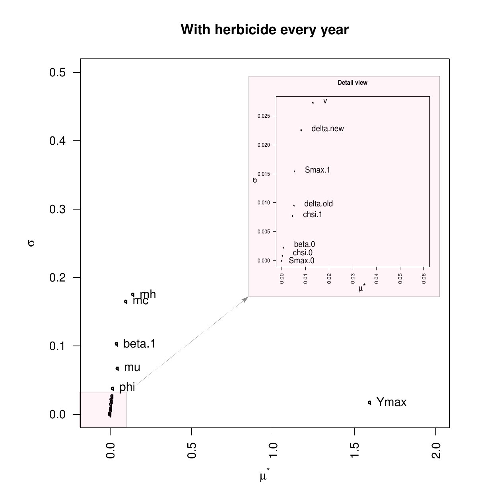
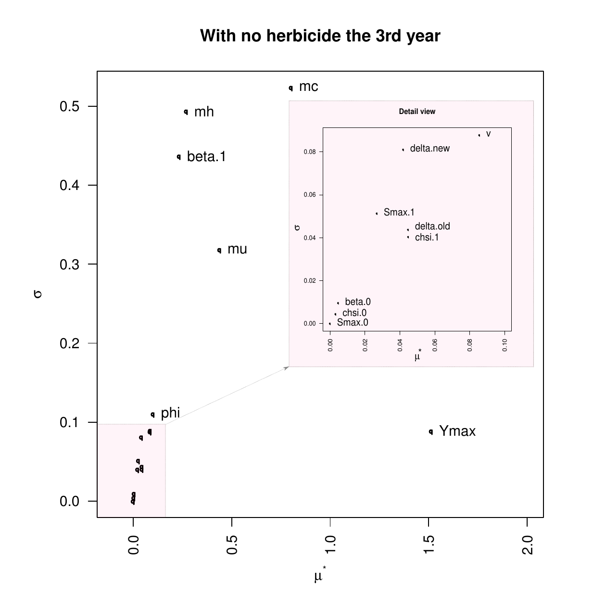
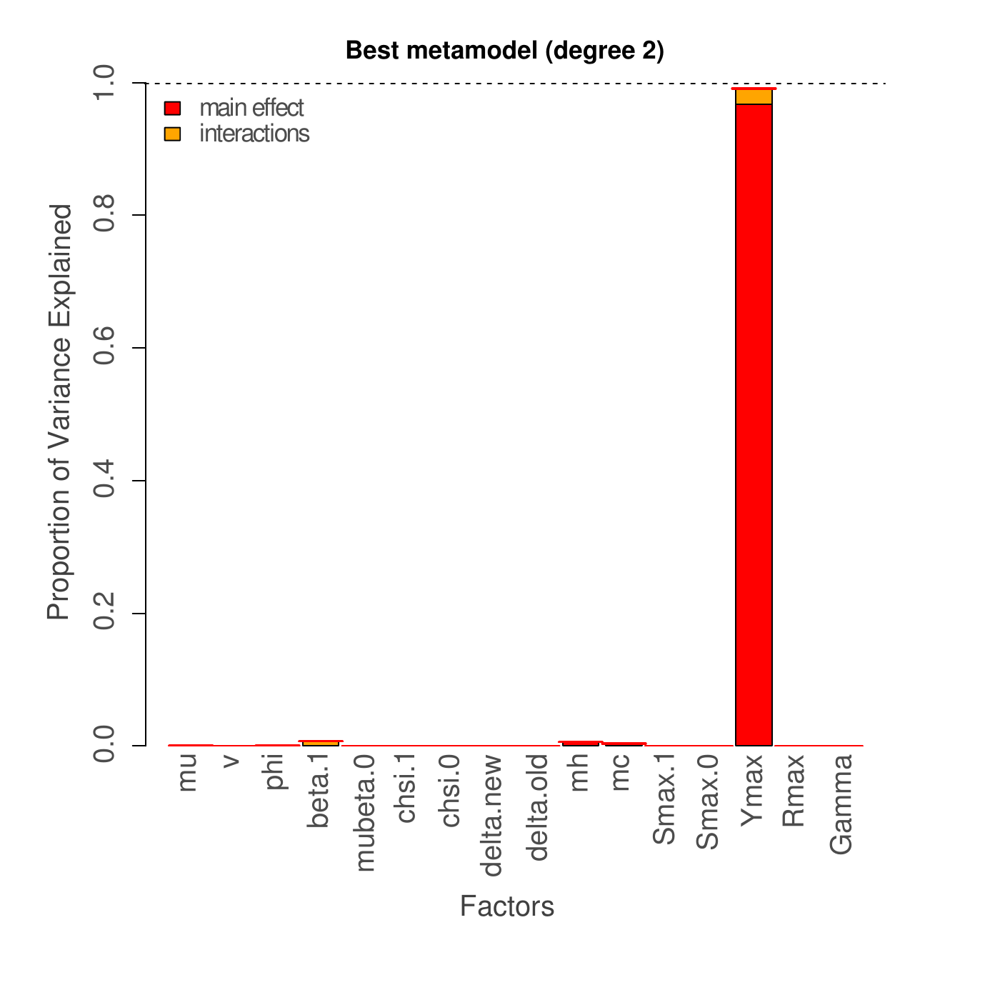
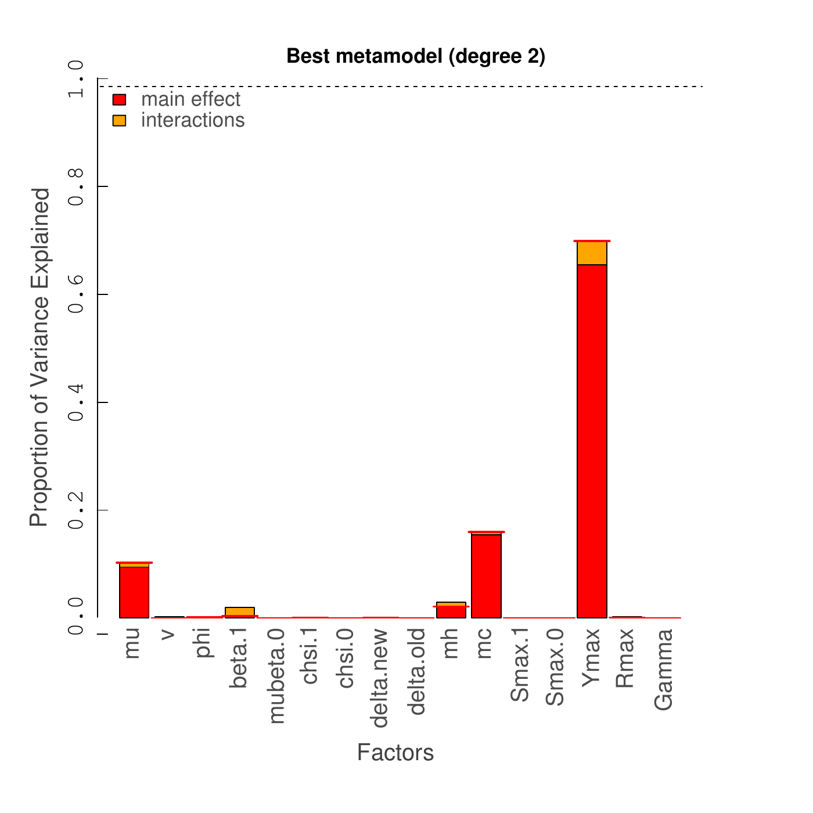

::: article
# Introduction {#s1}

Nowadays, computational modeling has become a common practice for
scientific experiments and discoveries. Global climate models have been
used for both short-term weather forecast [@lynch] and long-term climate
change [@risbey]. Environmental models have been developed for assessing
the impact of a waste water treatment plant on a river flow [@water].
Epidemic models have been elaborated to investigate the mechanism by
which diseases spread and to evaluate strategies to control their
outbreaks [@papaix], etc. Most of them become more and more complex,
with many parameters, state-variables and non-linear relationships,
etc. Overloading the model to better mimic observed real data does not
seem to be a passing practice but a continuing trend. Along with
increased complexity of the models come diverse and greater
uncertainties. Although computational modeling may improve our
understanding of how an evidence emerges, and helps to get insight into
how the elements of the system come together and interplay, one is
usually left with the feeling that another model might produce different
results and that some uncertainties have still remained somewhere in the
system. *"Under the best circumstances, such models have many degrees of
freedom and, with judicious fiddling, can be made to produce virtually
any desired behavior, often with both plausible structure and parameter
values"* [@hornberger]. Although we admit that such a statement is
exaggerating, it is greatly necessary to look into this issue and to try
our best effort to get insight into the sources of such doubts.

Uncertainty and sensitivity analyses, when correctly applied, may help
to gain an understanding of the impact of the various sources of
uncertainties and to further assess the system performance and set up
strategies for getting better control over the behavior of the model
[@helton; @cariboni; @marino]. Numerous methods and software have been
developed [@dakota; @saltelli; @rsensitivity]. Most of them are
context-specific, domain-specific or theory-oriented. For example,
Dakota was developed in the context of mechanics and large-scale
engineering simulation [@dakota]. It is a closed complete software
package which provides an efficient implementation of the iterative
analysis model for parameter estimation, cost-based optimization, and
sensitivity analysis. Implemented as a C++ library, methods developed in
the project Dakota were widely used in a variety of large scale
engineering projects relative to chemical [@dokota2] and mechanical
industries [@DAKOTA3]. SimLab, on the other side, is a representative
theory-oriented package which covers the global sensitivity analysis
techniques derived from Monte Carlo analysis [@saltelli; @simlab].
Methods developed from SimLab are widely used in a large number of
fields [@simlab2]. Although the software package offers a module to link
for external model simulation and allows complex models beyond
mathematical functions to be executed, such flexibility seems limited
merely to the model implementation. The package obviously suffers from
the lack of generality in the sense that it is difficult to include new
methods especially those not based on Monte Carlo analysis. More
ambitious, OpenTURNS [@openturnsA] builds on the global methodology
promoted by an ESREDA group [@de2008uncertainty]. It provides a great
number of features for quantifying, prioritizing, and propagating
uncertainties in computational models, but its extension requires
programming skills that theoreticians and domain experts might not
possess. More flexible and generic, Promethee provides a grid computing
environment for numerical engineering and an interface for integrating R
packages [@promethee; @prometheeR]. When it comes to the software
packages available for the R computing environment, there exists a great
number of packages [@rsensitivity; @dicedesign; @planor; @multisensi].
We do not aim at providing an exhaustive review of all the packages
here, but we we would like to point out package
[*sensitivity*](https://CRAN.R-project.org/package=sensitivity)
[@rsensitivity] which implements both the sampling and global analysis
methods such as Sobol, FAST and Morris [@saltelli], package
[*spartan*](https://CRAN.R-project.org/package=spartan)
[@spartan; @spartanR] which compiles four widely used techniques for
numerical experiments (the consistency analysis [@read2012], the
robustness analysis [@read2012], the latin-hypercube sampling technique
[@saltelli2000] and the eFAST technique [@marino]) and demonstrates
their effectiveness for biological systems, and packages
[*diceDesign*](https://CRAN.R-project.org/package=diceDesign)
[@dicedesign] and [*planor*](https://CRAN.R-project.org/package=planor)
[@planor] which implement the space-filling sampling technique
[@pronzato2012] and the techniques for regular factorial designs
[@planor], respectively.

Although these tools are very useful and greatly contribute to the
development and the popularity of uncertainty and sensitivity analyses,
they present some drawbacks. Most of them offer no possibility to evolve
or to integrate methods developed in other contexts. However,
uncertainty and sensitivity analyses are intrinsically trial-and-error
processes because of the lack of reliable knowledge and data about the
causes of the uncertainties contained in the model. There is no method
which is universal and suitable for all contexts. Practitioners must
repeat, undertake numerous tests, and vary the parameters and methods
until finding the best one fitting to the situation. Sticking to a
method which is inappropriate for the circumstances leads inevitably to
a wrong way and to misinterpret the results. Thus, it is necessary to
develop a simple to use, but powerful software package allowing
practitioners to test and compare different methods for their own data.
Such an application needs to be easy to set up, and yet unifying in its
ability to include a wide range of methods and powerful to objectively
analyze and rapidly report the results.

Inspired from these issues, we tried to compile the available methods
into a general purpose open platform and make them become accessible to
researchers and practitioners from different disciplines. Named
[*mtk*](https://CRAN.R-project.org/package=mtk) (Mexico Toolkit), the
package we present here builds on an object-oriented framework using the
R scientific computing platform. It provides facilities to interplay
with external simulation platforms and to share data and knowledge with
external applications in a seamless manner. It is easy to use,
homogeneous, and offers a unique syntax and semantics for computing and
data management. It is extensible in the sense that it tries to cover a
large variety of *factor* types, and can easily integrate methods
developed in the future without any major effort of reprogramming, even
those developed by researchers not involved in the *mtk* initiative. It
is self-contained and provides efficient tools to control all the
processing tasks involved in the numerical experiments, from
experimental design and model simulation to sensitivity computing and
data reporting. Moreover, it is scalable to small or big projects,
suitable for collaborative work in which the domain experts build the
model and run the simulation, and the statisticians take charge of the
different tasks of analyses and reporting.

We must note here that although the *mtk* package is designed to study
any type of numerical simulation, one should not apply any method to any
model on any occasion. How to match the methods to the problems is a
difficult issue, which should not be accounted for only by software
engineering but also by advice from domain experts and specialists on
model exploration.

# Methodology {#s2}

Based on the computation of specific quantitative measures that allow,
in particular, assessment of variability in output variables and
importance of input variables, both uncertainty and sensitivity analyses
are relevant methods for exploring numerical experiments
[@saltelli; @ch6]. Nevertheless, uncertainty and sensitivity analyses
meet with different issues. Uncertainty analysis seeks to asses the
impacts of the uncertainties contained in the inputs of the model on the
outputs. It deals with the question of what level of uncertainty might
be induced by the uncertainties contained in the inputs, and focuses on
describing the probability distribution of the outputs as a function of
the uncertainties contained in the inputs. In the simplest case, this
probability distribution might be computed analytically from the
characteristics of the uncertainties contained in the inputs. But in
practice, the models are usually too complex to allow for any analytical
solutions, and modern statistical methods must be used to estimate or
approximate the probability distribution of the outputs. Various methods
are already available. Among them, simulation methods seem to be the
most representative and universal.

On the other hand, sensitivity analysis aims to identify the sources of
the uncertainties and quantify their relative contributions. It deals
with the question of which inputs exhibit the most important uncertain
behaviors against the model, and allows us to focus on the ones that
matter and ignore those that are less significant. Sensitivity analysis
can be used to meet various objectives and goals such as identifying and
prioritizing the most influential inputs, identifying non-influential
inputs in order to fix them to nominal values, mapping the output
behavior as a function of the inputs by focusing on a specific domain of
inputs if necessary, calibrating model inputs using available
information, etc. Terms such as influence, importance, ranking by
importance, and dominance are all related to sensitivity analysis.

Sensitivity and uncertainty analyses rely on large and heterogeneous
collection of approaches and tools. In this study, we try to find a
consistent framework to unify the different approaches and tools. Our
framework is a workflow-based one, which consists in decomposing the
procedures of the uncertainty and sensitivity analyses into a series of
elementary and generic tasks that can be manipulated and presented in a
standard and homogeneous way. Each activity involved in the uncertainty
and sensitivity analyses can be considered either as an elementary task
or a combination of the elementary tasks. Appropriate combination and
scheduling of the tasks allow to handle situations of any complexity.
This workflow-based approach results in a unified way to cope with the
heterogeneity of the activities involved in uncertainty and sensitivity
analyses, and leads to a generic and extensible design.

{#fig:0 width="100%"
alt="graphic without alt text"}

The resulting workflow builds on five main tasks: i) choosing the input
factors and their distribution uncertainties; ii) building the
experimental design by factor sampling; iii) managing the model
simulation; iv) analyzing the results obtained from the simulation; v)
preparing to present and report the results. Thus, all approaches can be
considered as a partial or complete combination of the main tasks.
Moreover, filters are available and can be added to cope with atypical
and complex situations. They are often used to convert or import data in
order to connect the main tasks.

{#fig:1 width="100%"
alt="graphic without alt text"}

::: {#tab:class}
  ------------------------------------------------------------------------------------------
  Classes                 Definition                                              Nature
  ----------------------- --------------------------------------------------- --------------
  '`mtkFactor`'           Entity used to represent a *factor*                  Instantiable

  '`mtkExpFactors`'       Entity used to collect all the *factors* involved    Instantiable

                          in the experiment                                   

  '`mtkDomain`'           Entity used to define the uncertain domain           Instantiable

                          of a *factor*                                       

  '`mtkLevels`'           Entity used to define a discrete probability         Instantiable

                          distribution                                        

  '`mtkValue`'            Triplet used to define a typed variable                Virtual

  '`mtkParameter`'        Entity used to define a parameter                    Instantiable

  '`mtkFeature`'          Entity used to represent complex                     Instantiable

                          relationships among *factors*                       

  '`mtkProcess`'          Entity used to manage a process                        Virtual

  '`mtkExpWorkflow`'      Entity used to manage the workflow                   Instantiable

  '`mtkExperiment`'       Entity to manage a simplfied version of              Instantiable

                          workflow                                            

  '`mtkParsor`'           Entity used to parse XML files                       Instantiable

  '`mtkReporter`'         Entity responsible for advanced data reporting         Virtual

  '`mtkResults`'          Entity used to hold results produced by a              Virtual

                          process                                             

  '`mtkDesigner`'         Entity used to manage *design* process               Instantiable

  '`mtkSystemDesigner`'   Entity used to manage *design* method                Instantiable

                          implemented as a system application                 

  '`mtkNativeDesigner`'   Entity used to manage methods *design*               Instantiable

                          implemented as an R function                        

  '`mtkMorrisDesigner`'   Entity used to manage the process                    Instantiable

                          implementing the method Morris                      
  ------------------------------------------------------------------------------------------

  : Table 1: The principal classes used in the *mtk* package to manage
  the *factors* and the processes involved in numerical experiments.
:::

# Architecture and design

Building on an object-oriented framework, the *mtk* package follows the
recommendation for S4 classes and methods available in R [@chambers08].
As shown in Figure [2](#fig:1), it comprises three mandatory components:
the factor unit, the workflow unit, and the data import and export unit.
Each unit is part of a service mission and manages the exchange of data
and services with other units via interfaces. Thus, a unit knows other
units and communicates with them only through the interfaces. This
practice promotes efficient software engineering when multiple teams are
involved, and makes the long-term software maintenance easier
[@chambers14].

![Figure 3: Data model used to manage the *factors* and their
uncertainties. The model is represented using the UML notation [@uml],
and the referred classes are presented in Table [1](#tab:class).
](factor.png){#fig:2 width="100%" alt="graphic without alt text"}

## The factor unit

The factor unit manages data and services with regard to the parameters
and inputs of the model. It also ensures efficient support to manage the
uncertainty behaviors that we know about the model. When running an
uncertainty or sensitivity analysis, the first thing to do is to
determine what the parameters and inputs to the model are and, among
them, which parameters and inputs exhibit uncertainties. Such kinds of
parameters and inputs are referred to as *factors*. Since the
uncertainty of the *factor* is restricted within a domain, we usually
set it up with a probability distribution function. The factor unit is
the component which is responsible for managing the information about
the *factors* and their uncertainty domains such as the arguments to the
probability distribution function, whether the *factors* are correlated
and how they correlate, and so on. An important feature of the *mtk*
package is its capability to manage *factors* with complex
characteristics. They might be qualitative or quantitative as well as
continuous or discrete.

Table [1](#tab:class) defines the classes used in the *mtk* package to
manage the *factors* and their uncertainties, and Figure [3](#fig:2)
shows the data model in UML notation [@uml]. It provides a consistent
framework for both representing and handling information useful for
describing the *factors* and their uncertainty domains precisely. We
have focused on describing the relevant data and their relationships and
sought to give a consistent data framework which can be considered as
general as possible and easily extensible to integrate new methods
developed in the future even by researchers not involved in the *mtk*
initiative (for more discussion, please refer to
Section [4.1](#sec:repr-em-fact)).

## The workflow unit

This component manages and orchestrates the execution and progress of
the processes involved in the numerical experiments. In this task, a
process takes much more than calling a more or less sophisticated
function within the software package. This is able to analyze
information from the context, to define a strategy taking into account
the availability of data and services (which might be local or remote,
and if locally available, might be implemented as an independent system
application, an R function, or an internal element of the *mtk*
package), and finally to select the appropriate processing to launch, to
formulate the produced results, and to make them available to other
components of the system or independent applications outside the system.

In the current version, the *mtk* package supports four types of
processes: the parser for XML files, the experimental design, the model
simulation, and the computation of sensitivity indices. Each process
possesses descriptors to inform about its state and progress: whether
the process is ready to run or it is running or it has already run and
produced the results that we expected. The workflow manager has the
control over the launching and evolution of all the processes involved.
Before invoking a process, the workflow manager makes sure that all
required resources are available and that they are coherent with the
state of the process. After the execution of a process, it checks the
consistency of the results and makes them available for other processes.

. To make the schema readable, only the elements
related to the Morris method for experimental design are shown. The
prefix `Native` is used to refer to the process implemented as an R
function, and the prefix `System` is used when the process is
implemented as an independent system application.](workflow.png){#fig:3
width="100%" alt="graphic without alt text"}

As shown in Table [1](#tab:class) and Figure [4](#fig:3), processes are
organized into a hierarchical structure by inheritance. The common
components of the processes are summarized within an abstract class
named '`mtkProcess`'. The child classes inherit the components from
their parent classes higher in the hierarchical structure. For example,
'`mtkDesigner`' is a process which inherits the common components
defined within the '`mtkProcess`' and adds new features specific to the
experimental design. The process '`mtkMorrisDesigner`' shares common
components with other methods from experimental design and further
appends new features specific to the Morris method [@saltelli]. From
Figure [4](#fig:3), we can also note that each process is associated
with a specific class for managing the results produced by the process.
In fact, results produced by methods from uncertainty and sensitivity
analyses are very different both in terms of contents and in terms of
structures. Some methods produce data which could be represented within
a data frame, and some others produce results that can be formulated
only in the format of a list. Classic approaches require that we must
always be concerned with the structure used to hold the data, and
develop bespoke functions for each type of the results [@chambers14].
The object-oriented approach allows us to be released from such
constraints. The classes that hold the data are not only responsible for
data storage but also for the services to transform and report the data.
For example, the experimental design is no longer treated only as a
function to produce data in some specific format, but considered as a
process which is an active element not only capable of generating and
reporting the data but also capable of checking their consistency and
setting up relationships with other components of the system.

## The data import and export unit

Based on widely used open standards such as XML, URI (Uniform Resource
Identifier), Web services, etc., the data import and export unit allows
elements of the package to communicate and to be extended with external
resources such as independent platforms or applications for model
simulation, Web services that supply data or methods for experimental
design and sensitivity analysis, etc. For instance, the workflow for a
sensitivity analysis might be generated from independent external
platforms and coded into an XML file; the *mtk* package can import the
XML file, set up the workflow, and run it automatically. This can be
referred to as one of the methods that the *mtk* package uses to
integrate external platforms as a collaborative component.

The package also provides serializing functions allowing to save the
internal status of the workflow into an XML file so that independent
external applications could collect information about the processes and
data involved in the workflow, and further wrap them as an internal
component (see Section [6](#section_conclusion)).

# Features and functions

## Representing the *factors* and their uncertainties in an homogeneous and extensible way {#sec:repr-em-fact}

[]{#section_factor label="section_factor"} In the *mtk* package, we
sought to provide a consistent and easily extensible framework for both
representing and handling information useful for describing the
*factors* and their uncertainty domains precisely. For example, the
concept *feature* was introduced to address the issue about the
diversity of the *factors* in their types and relationships.
Mathematically speaking, a *feature* is a simple triplet that can be
used to make come together a variable name, a data type and a numerical
value. The *feature* concept is simple but fundamental to both the
scalability of the implemented methods and the extensibility of the
package. In fact, *factors* used in uncertainty and sensitivity analyses
may have different formats and be defined on various domains. In
addition, they may be qualitative or quantitative, continuous or
discrete, ordered or unordered, etc. Furthermore, several *factors* may
be linked by constraints in space or time, and they may be either
correlated or hierarchical as well. Therefore, we need a unified
framework to cope with such a variety of *factors*. The concept of a
*feature* has accomplished this goal. It allows to set up a universal
framework for depicting the *factors* and their relationships and leads
to a consistent and unified schema to manage the heterogeneity of the
*factors*: an ordered list of *features* associated with a *factor* can
be used to describe the spatial and temporal location of a *factor*, and
one or more *features* can be applied to a group of *factors* to catch
the relationship of any complexity among them, etc. 

The *factors* and their uncertainties are represented with the class
'`mtkFactor`'. This class has four primary attributes and two
associative attributes:

name

:   The name of the *factor* used in the workflow.

id

:   The name of the *factor* used in the simulation model if it is
    different.

type

:   The type of the values associated with the *factor*.

unit

:   A unit of measurement associated with the values of the *factor* if
    it exists.

domain

:   An object of the class '`mtkDomain`' to describe the uncertainty of
    the *factor*.

featureList

:   A list of objects from the class '`mtkFeature`' to provide
    additional information about the underlying *factor* such as spatial
    or temporal location, relationships among a group of *factors*,
    etc. 

The attributes `name`, `id`, `type` and `unit` are simple strings, and
the associative attributes `domain` and `featureList` are objects of the
classes '`mtkDomain`' and '`mtkFeature`' respectively.

There are two ways that can be used to define the *factors*:
interactively within an R session or by parsing an XML file. The
interactive definition of the *factors* within an R session is
implemented with the function `make.mtkFactor()`, and the following
examples demonstrate this function. The definition of the *factors* from
an XML file might be considered as a component of the data import and
export unit which will be discussed in the next section.

``` r
# Load mtk package:
      library(mtk)
# Define a continuous factor:
      make.mtkFactor('A', distribName = 'unif', distribPara = list(min = 0, max = 1)) 
# Define a new discrete factor: 
      make.mtkFactor('D', distribName = 'discrete', 
            distribPara = list(type = 'categorical', 
            levels = c('a', 'b', 'c'), weights = rep(1/3, 3))) 
```

The first example shows how to define a *factor* named $A$, whose
uncertainty is defined by a continuous uniform distribution over the
interval $[0, 1]$. The second example demonstrates the definition of a
categorical *factor* which is named $D$, and takes values from the set
$\{a, b, c\}$ and each with a probability equal to $1/3$.

## Formalizing the data and services for collaborative work

The language XML has been used to overcome the heterogeneity of data and
services exchanged between the *mtk* package and external resources.
Indeed, one of the main difficulties that we met in building the *mtk*
package was the variety of data and services that need to be managed in
the context of uncertainty and sensitivity analyses. Data and services
might be local or remote, and implemented in R or other programming
languages. They might also have different structures and various
formats. Instead of putting emphasis on the data and services
themselves, we have chosen to focus on the structure of the data and
services that the package exchanges with external resources, and to
formalize them according to the XML standards. XML schemas were
elaborated and used to tackle the issue of numerical experiments in the
open collaborative framework [@ch9]. By reformalizing the elements
involved in the experimental design, the model simulation control, the
workflow management and the data reuse, the XML schemas lead to a
unified representation of the data and services that an open
collaborative framework needs to produce or consume. Thus, managing the
heterogeneity of data and services involved in the uncertainty and
sensitivity analyses is greatly simplified and highly standardized. From
the point of view of programming, it is reduced to the development of a
class which is able to parse the XML files following the defined XML
schemas.

The XML parsing has been realized with the class '`mtkParsor`', and its
use is very simple. We just need to specify the path to access the XML
file and the workflow into which the extracted information will be
directed. The following code shows how to construct a parser from an XML
file, which is delivered with the distribution package. Note that the
XML file is usually produced by an external platform, and thus the XML
parsing mechanism can also be used as a way to integrate the *mtk*
package with external applications.

``` r
# Create a parser to parse the XML file : './WWDM.xml'.
# Note that the XML file is delivered within the package "mtk"
     parser <- mtkParsor('./WWDM.xml') 
```

## Organizing the implementation of the methods hierarchically and presenting them with a unified syntax

To collect all the available methods into a unique framework and to
present them under a unified syntax, we adopted a workflow-based
approach which consists in decomposing the procedures of sensitivity
analysis into a series of elementary and generic processes, and
organizing them into a hierarchical structure. Each activity involved in
sensitivity analysis can be considered either as an elementary process
or a combination of elementary processes. Appropriate combination of the
processes allows the handling of situations of any complexity.

Taking the experimental design as an example, this is part of the
mission services provided by the workflow management unit. The *mtk*
package offers a generic and easily extensible implementation of a
Web-based open framework, and such an implementation needs to be
carefully thought and designed. In fact, the methods used to generate
the experimental design might be complex and complicated. Besides the
inherent variety of the contexts where the methods were developed, they
might be implemented locally or remotely and in different programming
languages and according to various protocols. Furthermore, the
experimental design might be generated on-line or off-line. To provide
the package with an architecture easy to extend and the ability to cope
with different situations, a general purpose class '`mtkDesigner`' is
derived from the abstract class '`mtkProcess`' so that users can extend
the framework to fit to specific circumstances (please see the class
organization presented in Figure [4](#fig:3)). The '`mtkDesigner`' class
inherits the following slots from the class '`mtkProcess`', which enable
the Web-based computing:

protocol

:   The protocol used to run the process. It may take on values such as
    `"mtk"`, `"R"`, `"system"` and `"http"`, where the value `"mtk"`
    indicates that the process is implemented as an internal element of
    the *mtk* package, the value `"R"` that the process is implemented
    as a native R function, the value `"system"` that the process is
    implemented as an independent application, and the value `"http"`
    that the process is implemented with Web service technologies.

site

:   The site where the processing is implemented.

service

:   The name of service which realizes the underlying tasks.

To make importing methods implemented locally as an independent R
function easier, a class '`mtkNativeDesigner`' derived from
'`mtkDesigner`' is provided together with its constructor as follows:

``` r
      mtkNativeDesigner(design = NULL, X = NULL, information = NULL) 
```

This class can deal with two scenarios, whereby either the method of
experimental design is implemented as an independent function in R or
the experimental design was generated off-line. The first example below
shows how to construct an experimental design from a method implemented
as an independent R function, and the second shows how to import an
experimental design generated off-line.

``` r
# Set up an experimental design with a method implemented 
# by an R function named 'mc04()'
      sampler <- mtkNativeDesigner(design = mc04(factors, 
                    distribution, parameters, size = 20)) 
# Set up an experimental design by importing the design produced 	
# off-line which is stored as a data.frame named 'plan'.
      sampler <- mtkNativeDesigner(X = plan, 
                    information = list(method = 'Morris', size = 20))
```

Note that the technical details mentioned before are just intended for
importing in live external elements into package *mtk*. When it comes to
the elements already integrated in the package, one does not need to
care about how the methods are physically implemented (locally or
remotely, as an R function or through a Web service, etc. ). To use a
method, it is only necessary to instantiate an object from the
underlying class. For instance, to set up an experimental design with
the method Morris wherever it is implemented physically, we just need to
instantiate an object of the class '`mtkMorrisDesigner`'.

``` r
# Set up an experimental design with the method 'Morris' with parameters.
      sampler <- mtkMorrisDesigner(listParameters = list(size = 20))
```

Currently, the *mtk* package supports three kinds of elementary
processes: *designer*, *evaluator* and *analyser*. Each manages one of
the principal activities involved in uncertainty and sensitivity
analyses, and is associated respectively with the experimental design,
the model simulation and the sensitivity computing.

We should point out again that within the *mtk* package, all processes
involved in the sensitivity analysis are managed in the same way just as
the designer is managed. For instance, the common properties involved in
the model simulation are put into the class '`mtkEvaluator`' which is
itself derived from the class '`mtkProcess`'. Also, the models might be
implemented locally or remotely, written in R or in another programming
language, and the simulation might be produced on-line or off-line. If
the model is implemented locally, the specific class proposed is the
class '`mtkNativeEvaluator`' with the associated constructor as follows:

``` r
      mtkNativeEvaluator(model = NULL, Y = NULL, information = NULL) 
```

This class has the same syntax as the class '`mtkNativeDesigner`', and
this is one of the biggest advantages of using the *mtk* package. It
provides a homogeneous way and mechanism to manipulate all the methods
and functions managed by the package. For example, if we want to
simulate the Ishigami model [@ishigami] which describes the dynamics of
a non-linear function with three *factors*, it does not take more than
to set up a model evaluator (or simulator) with the code as follows:

``` r
# Simulate the 'Ishigami' model which has no parameter.
      simulator <- mtkIshigamiEvaluator() 
```

As well, to use the Morris method to compute the sensitivity indices is
not harder than to write the following code:

``` r
# Set up a process to compute the sensitivity indices with the Morris method 
      analyzer <- mtkMorrisAnalyser(listParameters = list(nboot = 20))
```

## Managing efficiently the activities with a workflow-based approach

A workflow is an orchestrated and repeatable sequence of activities that
are responsible to transform data and to provide services. The *mtk*
package organizes the activities into standardized and elementary
processes. Before invoking a process, the workflow ensures that the
process is ready to run and the needed data are available and consistent
with the state of the process. After running the process, the workflow
manages the results, makes them available, and ensures that they can be
successfully reused. Indeed, some processes are very time-consuming, and
they require enormous computing power to produce results. This is
especially true for complex model simulations which may take days or
even weeks on a cluster before making the simulated data available.
Therefore, it is important to avoid restarting a process if no new data
has been produced even if the workflow needs to be restarted to
incorporate new elements. For instance, suppose that an experiment was
designed with the Monte Carlo method and analyzed with the multiple
regression method, and one wishes to analyze the same simulated data
with another method. In this case, it would be possible to reuse the
experimental design and the simulated data already obtained. The
workflow implemented in the *mtk* package manages these kinds of
constraints and enables to maximize the reuse of resources. An example
of this approach will be presented in Section [5](#section_application).

The workflow management has been implemented with the class
'`mtkExpWorkflow`', which can be created in two ways: either
interactively within an R session or automatically through an XML file.

The interactive method is the most common procedure used by R users, and
it consists of four steps: i) defining the *factors* and their
uncertainties; ii) specifying the processes involved in the sensitivity
analysis; iii) forming a workflow; and iv) running the workflow and
reporting the results. The example below presents the construction and
execution of a workflow to analyze the Ishigami model with the Basic
Monte Carlo method for the experimental design and the regression method
for sensitivity computing.

``` r
# Load the mtk package:
      library(mtk)
# Specify the factors and their uncertainty domains:
      x1 <- make.mtkFactor(name = 'x1', distribName = 'unif', 
                    distribPara = list(min = -pi, max = pi)) 
      x2 <- make.mtkFactor(name = 'x2', distribName = 'unif', 
                    distribPara = list(min = -pi, max = pi)) 
      x3 <- make.mtkFactor(name = 'x3', distribName = 'unif', 
                    distribPara = list(min = -pi, max = pi)) 
      ishi.factors <- mtkExpFactors(list(x1, x2, x3)) 
# Specify  the processes involved:
      designer <- mtkBasicMonteCarloDesigner(listParameters = list(size = 20)) 
      simulator <- mtkIshigamiEvaluator() 
      analyser <- mtkRegressionAnalyser(listParameters = list(nboot = 20)) 
# Form the workflow:
      experiment <- mtkExpWorkflow(expFactors = ishi.factors, 
                     processesVector = c(design = designer, 
                     evaluate = simulator, analyze = analyser)) 						 
# Run the workflow and report the results:
      run(experiment) 
      summary(experiment)
```

The automatic method consists of controlling the workflow through an XML
file in which all the information necessary for the definition and
execution of the workflow is specified. The XML files can be created
manually by users or even more often by external platforms. The latter
allows to manage the *mtk* workflow from an external platform and offers
a way to carry out uncertainty and sensitivity analyses without having
to get out of the modeling or simulation platform. Once the XML file is
formed, the *mtk* package takes control over the XML file and provides
facilities for information extraction, and workflow initialization and
control.

The example below shows how to build a workflow from an XML file. Note
that the XML file used here can be found in the supplementary material
provided with the distributed package.

``` r
# Load the mtk package:
      library(mtk)
# Create a workflow from the XML file:  './WWDM.xml'
      expXML <- mtkExpWorkflow(xmlFilePath = './WWDM.xml')
# Run the workflow and report the results 
      run(expXML) 
      summary(expXML)
```

## Extending the package with new or existing methods {#lab_Extending}

In order to encourage researchers to publish their methods through the
*mtk* framework, we provide facilities to easily import available
methods directly into the system. The *mtk* package comes with three
tools: `mtk.designerAddons()`, `mtk.evaluatorAddons()`, and
`mtk.analyserAddons()`.

The tool `mtk.designerAddons()` is a function that allows users to turn
new or existing methods for experimental designs developed as R
functions into classes compliant with the *mtk* package.

This function has the following prototype:

``` r
      mtk.designerAddons(where, library, authors, name, main, summary = NULL,
          print = NULL, plot = NULL)
```

where

:   `NULL` or a string to denote the file containing the R function to
    convert.

library

:   `NULL` or a string to denote the name of a package containing the R
    function to convert if it is provided via a package.

authors

:   `NULL` or the copyright information about the authors of the R
    function.

name

:   A string to name the method when used with the *mtk* package.

main

:   The name of the R function implementing the method.

summary

:   `NULL` or a special version of the `summary` method provided in the
    file *where* or in the package *library*.

plot

:   `NULL` or a special version of the `plot` method provided in the
    file *where* or in the package *library*.

print

:   `NULL` or a special version of the `print` method provided in the
    file *where* or in the package *library*.

No constraints are imposed on the function to convert except for the
format of its inputs and outputs. The R function implementing the method
must have at least the three arguments: `factors`, `distribNames`, and
`distribParameters`. The argument `factors` takes as values either a
number or a list of names for enumerating the *factors* to analyze. The
arguments `distribNames` and `distribParameters` are both lists, whose
elements are used to specify the uncertainty domains of the *factors*.

The output produced by the function must be formatted as a named list
with two elements: `main` and `information`. The element `main` is a
`data.frame` containing the produced experimental design and the element
`information` is a named list whose elements are used to provide
optional information about the method used.

If the `summary()`, `print()` and `plot()` methods provided within the
package *mtk* are not concise enough to describe the underlying
experimental design, or the method developers wish to report it in a
specific way, they can replace these methods by new ones.

The example below shows how to use the function `mtk.designerAddons()`
to convert an existing method into *mtk* compliant classes so that the
method can be seamlessly used with the package. In order to demonstrate
the potential of the package, we have chosen to import an existing
method implemented in an independent package: the method *\"Morris\"* of
the package *sensitivity* [@rsensitivity]. The file `morris_sampler.R`
contains the program codes used to wrap the original function so that
the inputs and outputs meet the requirement of the tool
`mtk.designerAddons()`. In this example, the wrapped function is renamed
`sampler.morris()`. In order to better outline the produced experimental
design, a new method of the function `plot()` for '`morris`' objects has
been provided via the function `plot.morris()`.

``` r
# Load the mtk package:
      library(mtk)
# Convert the file 'morris_sampler.R' to a mtk compliant class 'mtkMorrisDesigner':
      mtk.designerAddons(where = 'morris_sampler.R', 
         authors = 'G. Pujol, B. Ioos, and A. Janon', 
            name = 'Morris', main = 'sampler.morris', plot = 'plot.morris')
# Integrate the new class into the mtk package
      source('mtkMorrisDesigner.R')
```

Here, the `mtk.designerAddons()` tool generates a file named
`mtkMorrisDesigner.R` which can be integrated directly into the *mtk*
package via the R command `source()`.

The other two tools `mtk.evaluatorAddons()` and `mtk.analyserAddons()`
operate in the same way as `mtk.designerAddons()` does. They can be used
respectively to integrate simulation models and to integrate methods for
computing the sensitivity indices. An example of using the tool
`mtk.evaluatorAddons()` can be found in the next section.

# A case study {#section_application}

In this section, we present an example of a decision support model
analyzed with the *mtk* package. The model used in [@weed] is a dynamic
model simulating the effect of weeds (meadow foxtail) on the yield of a
crop of wheat as a function of different agricultural practices,
including soil preparation, weeding and crop varieties. The flow is
simulated at a yearly time step. Five state variables are used, and
their dynamics are modeled with a system of non-linear first order
difference equations.

::: {#tab:state}
  --------------------------------------------------------------------------
  *State Variable*   Definition                               Initial Value
  ------------------ --------------------------------------- ---------------
  $S$                Number of seeds of foxtail by $m^2$         68 000

                     found in the cultivated plot.           

  $d$                Number of foxtail plants by $m^2$             400

                     found at the beginning of the season.   

  $SSBa$             Number of seeds of foxtail by $m^2$          3 350

                     found on the surface of the soil        

                     after tillage.                          

  $DCSa$             Number of seeds of foxtail by $m^2$           280

                     found under the surface of the soil     

                     after tillage.                          

  $Y$                Yield of wheat on the plot                    ---

                     (ton per $m^2$)                         
  --------------------------------------------------------------------------

  : Table 2: The state variables used in the Weed model and the initial
  values of the state variables characterizing the population of foxtail
  at $t=0$.
:::

The model builds both on input variables describing the agricultural
practices and on parameters describing the effect of the agricultural
practices on the state variables of the model. The input variables are
supposed to be fixed, but some parameters are uncertain. We will use the
*mtk* package: i) to analyze the effect of the uncertainty of the
parameters on the wheat yield (the state variable $Y$), and ii) to
determine the sensitivity of the state and output variable Y to the
uncertainties contained in the different parameters.

The model takes into account three types of input: i) the initial values
of the state variables characterizing the population of foxtail at
$t = 0$ (see Table [2](#tab:state)), ii) the year by year agricultural
practices (tillage, weeding, cultivated crop varieties), and iii) $16$
parameters of the model (they are supposed to be fixed, but contain some
uncertainties).

Agricultural practices applied each year to the crop are described with
the help of three binary variables: `Soil`, `Herb`, and `Crop`. If the
soil is tilled, we set $Soil=1$, otherwise $Soil=0$. Similarly, we set
$Herb=1$ if herbicide is applied, $Herb=0$ otherwise , and $Crop=1$ if
the cultivated plant is a variety of winter wheat, $Crop=0$ otherwise.
In this paper, we explore a simplified model where only winter wheat is
supposed to be cultivated ($Crop=1$) and the tillage is always realized
every other year. Also, only two scenarios of the weeding treatment are
explored: i) systematic treatment each year, and ii) systematic
treatment except the third year.

Since the *factors* (parameters with uncertainty) are supposed to be
fixed, their uncertainties can be represented with common probability
distribution functions. Table [3](#tab:1) shows the domains of
uncertainties associated with such parameters.

::: {#tab:1}
  -------------------------------------------------------------------------------
  *Factors*     Definition                                 Min Value   Max Value
  ------------- ----------------------------------------- ----------- -----------
  $mu$          Annual decline rate                          0.76        0.92

  $v$           Proportion of non aborted seeds              0.54        0.66

  $phi$         Loss of the fresh seeds                      0.50        0.61

  $beta.1$      Proportion of the foxtail seeds              0.86        1.05

                found under the surface after tillage                 

  $beta.0$      Proportion of the foxtail seeds              0.18        0.22

                found under the surface without tillage               

  $chsi.1$      Proportion of the foxtail seeds              0.27        0.33

                found on the surface after tillage                    

  $chsi.0$      Proportion of the foxtail seeds              0.045       0.055

                found on the surface without tillage                  

  $delta.new$   Germination rate for fresh seeds             0.14        0.17

  $delta.old$   Germination rate for old seeds               0.27        0.33

  $mh$          Efficiency of the herbicide                  0.88        1.08

  $mc$          Mortality rate caused by cold weather          0           1

  $Smax.1$      Number of the seeds harvested                 400         490

                per plant (winter variety)                            

  $Smax.0$      Number of the seeds harvested                 266         326

                per plant (spring variety)                            

  $Ymax$        Potential yield $t/ha$                        7.2         8.8

  $Rmax$        Parameter used to calculate the loss        0.0018      0.0022

  $Gamma$       Another parameter used to                   0.0045      0.0055

                calculate the loss                                    
  -------------------------------------------------------------------------------

  : Table 3: The *factors* and their domains of uncertainties used in
  the Weed model. The domains of uncertainties are all modeled with a
  uniform probability distribution whose range is fixed from *Min Value*
  to *Max Value*.
:::

The computing code of the model is enclosed in the supplementary
material provided with the package and in [@ch11]. Note that to
integrate the model into the *mtk* package, we do not need to reprogram
the model, but just wrap the main function `WEED.simule()` in the file
`WeedModel_v2.R`, say, so that its inputs and outputs conform with the
requirement of the function `mtk.evaluatorAddons()` presented in
Section [4.5](#lab_Extending).

Once the model is wrapped, we append it to the *mtk* package so that it
can be seamlessly used with the *mtk* package.

``` r
# Load the package mtk:
      library(mtk)
# Transform the model into a mtk compliant class:
      mtk.evaluatorAddons(where = 'WeedModel_v2.R',  authors = 'D.Makowski(2012)',
            name = 'Weed', main = 'WEED.simule')
# Load the mtk compliant class generated before into the mtk package:
      source('mtkWeedEvaluator.R')
```

## Uncertainty analysis

Recall that realizing a numerical experiment with the *mtk* package is
composed of four steps: i) choose the *factors* and specify their
uncertainties; ii) set up the processes involved in the numerical
experiment; iii) form a workflow; and iv) run the workflow and report
the results.

First, the uncertain domains associated with the *factors* are defined
with function `make.mtkFactor()`. Sixteen *factors* are considered, and
each is assumed to follow a uniform distribution whose range is fixed
according to Table [3](#tab:1). The code below shows how we defined the
uncertain domains of the *factors* within R.

``` r
# "table3.data" is a file referring to the Table 3 defined in the text.
	table3 <- read.table("table3.data", header = TRUE)
	facteurs <- list()
	for(i in 1:16){
		facteur.i <- as.character(table3$Factors)[i]
		facteurs[facteur.i] <- make.mtkFactor(name = facteur.i,
			distribName = "unif", 
                	distribPara = list(min = table3$MinValue[i], 
		        	max = table3$MaxValue[i]))
	}
	weedFactors <- mtkExpFactors(facteurs)
```

Here, the Basic Monte Carlo method is used for the experimental design,
and $1 000$ samples are generated. The code below shows the underlying
procedure:

``` r
      plan <- mtkBasicMonteCarloDesigner(listParameters = list(size = 1000))
```

Two instantiations of the model are evaluated, and they correspond to
the cases that weeding treatment is applied every year and that the
weeding treatment is not applied only for the third year, respectively.
Note that the agricultural practices are encapsulated into the argument
`decision`: $decision=1$ represents the first scenario and $decision=2$
represents the second.

``` r
      weed.case1 <- mtkWeedEvaluator(listParameters = list(decision = 1, outvar = 3)) 
      weed.case2 <- mtkWeedEvaluator(listParameters = list(decision = 2, outvar = 3)) 
```

Consequently, two workflows are built, and they will be used to manage
the analyses of the two models defined above.

``` r
      exp1 <- mtkExpWorkflow(expFactors = weedFactors, 
             processesVector = c(design = plan, evaluate = weed.case1))
      exp2 <- mtkExpWorkflow(expFactors = weedFactors,
             processesVector = c(design = plan, evaluate = weed.case2)) 

      set.seed(2) # to fix the seed of the random generator for exp1
      run(exp1)
      set.seed(2) # to fix the seed of the random generator for exp2
      run(exp2) 
```

Sometimes, users may choose not to use the reporting tools provided with
the *mtk* package to present their results. The function `extractData()`
allows them to fetch the data managed by the *mtk* package as
independent data structures supported by the R computing platform and to
manipulate them freely. Hereinafter, the simulated results ($1000$
simulations per year for $10$ years) are stored in two variables: $Y_1$
and $Y_2$. Notice that we are only interested in the yields of the third
year ($outvar=3$) since they are the only data which can reflect the
effect of weeding treatment.

``` r
      Y1 <- unlist(extractData(exp1, name = 'evaluate'))
      Y2 <- unlist(extractData(exp2, name = 'evaluate'))

      dev.new() 
      par(mfrow = c(2,2)) 
      hist(Y1, main = '', 
           xlab = 'Yield with  herbicide systematically applied (t/ha)') 
      hist(Y2, main = '', 
           xlab = 'Yield without applying herbicide for the 3rd year (t/ha)') 
      hist(Y1-Y2, main = ' ', xlab = 'Loss in yield (t/ha)') 
      hist(100*(Y1-Y2)/Y1, main = ' ', xlab = 'Relative loss in yield  (%)') 

      summary(Y1-Y2)
```

{#fig:4 width="100%"
alt="graphic without alt text"}

The results are illustrated in Figure [5](#fig:4). It shows that the
average loss is $0.33 \, t/ha$, the median loss is $0.25\,  t/ha$, and
the 1st and 3rd quartiles of the distribution are equal to $0.12$ and
$0.48 \, t/ha$ respectively. The uncertainty analysis shows that the
yield loss due to non-application of the weeding treatment has a
one-in-two chance of exceeding $0.25 \, t/ha$, and has a one-in-four
chance of being less than $0.12 \, t/ha$ and a one-in-four chance of
exceeding $0.48 \, t/ha$. We can claim that the loss in yield is
moderate, even taking into account the uncertainties of the *factors*.

## Sensitivity analysis

The uncertainty analysis described above allows the estimation of the
uncertainties about the yield losses, but it gives no information about
where the uncertainties come from and which *factors* have the most
important impact on them. In this section, we will discuss how to use
the *mtk* package to calculate the sensitivity indices for the *factors*
and how to identify the most influential *factors* according to their
sensitivity. Two methods will be presented: Morris [@saltelli] and PLMM
[Polynomial Linear metamodel; @ch6]. These examples demonstrate how easy
it is to use the *mtk* package to compare very different methods.

The R code below shows the sensitivity analysis with the Morris method.
We can note the efficiency and effortlessness of the *mtk* package to
fulfill such a procedure: We are neither concerned about where the
methods are implemented (locally or remotely) nor worried about how data
are organized within the processes.

``` r
# Specify the processes and form the workflows:
      morris.sampler <- mtkMorrisDesigner(listParameters = list(r = 500, type = 'oat',
                           levels = 4 , grid.jump = 2, scale = TRUE)) 

      weed.treated <- mtkWeedEvaluator(listParameters = list(decision = 1, 
                           outvar = 3)) 
      weed.no.treated <- mtkWeedEvaluator(listParameters = list(decision = 2, 
                           outvar = 3)) 

      morris.analyser <- mtkMorrisAnalyser() 

      exp.treated <- mtkExpWorkflow(expFactors = weedFactors, 
                       processesVector = c(design = morris.sampler, 
                         evaluate = weed.treated, analyze = morris.analyser)) 

      exp.no.treated <- mtkExpWorkflow(expFactors = weedFactors, 
                         processesVector = c(design = morris.sampler, 
                           evaluate = weed.no.treated, analyze = morris.analyser)) 
# Run the workflows:
      set.seed(2) 
      run(exp.treated) 
      set.seed(2)
      run(exp.no.treated) 
# Report the results:
      plot(getProcess(exp.treated, name = 'analyze'))
             title("With herbicide every year")
      plot(getProcess(exp.no.treated, name = 'analyze'))
             title("With no herbicide the 3rd year")
```

Note that we make use one more time of the class '`mtkWeedEvaluator`' to
manage the model simulation, and that only the yields of the third year
($outvar=3$) are explored.

<figure id="fig:5">
<table>
<caption> </caption>
<tbody>
<tr class="odd">
<td style="text-align: center;"></td>
</tr>
<tr class="even">
<td style="text-align: center;"></td>
</tr>
</tbody>
</table>
<figcaption>Figure 6: Sensitivity analysis results shown in graphical
form for the outputs <span class="math inline"><em>Y</em></span> with
respect to the <span class="math inline">16</span> parameters with
uncertainty, calculated with the Morris method for the Weed models: 1)
with herbicide applied every year (top) and 2) without applying
herbicide for the 3rd year (bottom). In the Morris method, the index
<span class="math inline"><em>μ</em><sup>*</sup></span> (on the <span
class="math inline"><em>x</em></span>-axis) is used to detect input
factors with an important overall influence on the output, and the index
<span class="math inline"><em>σ</em></span> (on the <span
class="math inline"><em>y</em></span>-axis) is used to detect factors
involved in interaction with other factors or whose effect is
non-linear.</figcaption>
</figure>

Figure [6](#fig:5) shows the results of the sensitivity analysis
obtained with the Morris method for the two scenarios of agricultural
practices. Remember that in the method Morris, the index $\mu^*$ is used
to detect the factors with important overall influence on the output and
the index $\sigma$ is used to detect the factors involved in interaction
with other factors or whose effect is non-linear.

We note that most factors have sensitivity indices $\mu^*$ and $\sigma$
close to 0 either with or without weeding treatment. This shows that
such factors have little effect on the yield performance.

On the contrary, when weeding is applied, the factor $Ymax$ (the maximum
yield potentially obtained with the underlying soil and the underlying
cultivated wheat variety) has a sensitivity index $\mu^*$ larger than 1.
This means that the factor $Ymax$ has significant influence on the yield
performance and that the main part of the variability of the yield
performance might be explained by the uncertainties contained in the
factor $Ymax$. Furthermore, some factors exhibit $\sigma$ values
slightly different from 0 meaning that their effect may be non-linear or
interacting with others factors but with low consequences on the output.

Such a conclusion seems natural and easy to understand. In fact, when
weeding treatment is applied, almost all foxtail is eliminated; their
influences are wiped out and only the potential yield parameter $Ymax$
becomes decisive for the yield performance.

On the other hand, when no weeding is applied the 3rd year, the index
$\mu^*$ associated with the factor $Ymax$ is not the only one to move
away from 0, but also the factors $mc$, $mu$, $mh$, and $beta.1$.
Meanwhile, the indices $\sigma$ associated with the factors $mc$, $mu$,
and $beta.1$ are all increased significantly. This means that when no
weeding is applied, $Ymax$ is no longer the only factor having
significant impacts on the yield and the factors $mc$, $mu$ and $beta.1$
also imply effects on the yield performance either in a non-linear way
or in interaction with other factors.

To assess the relevance of the results, we have analyzed the same models
with other methods. The methods RandLHS (Latin Hypercube Sampling; @lhs)
and PLMM are used respectively for the experimental design and the
sensitivity analysis. The code below demonstrates the procedure. Note
that we reuse the two simulators of the Weed models `weed.treated` and
`weed.no.treated` previously defined.

``` r
# Specify the processes and form the workflows:
      lhs.sampler <- mtkRandLHSDesigner(listParameters = list(size = 1000))
      plmm.analyser <-  mtkPLMMAnalyser(listParameters = list(degree.pol = 2))

      exp.plmm.treated <- mtkExpWorkflow(expFactors = weedFactors,
                            processesVector = c(design = lhs.sampler, 
                              evaluate = weed.treated, analyze = plmm.analyser))

      exp.plmm.no.treated <- mtkExpWorkflow(expFactors = weedFactors, 
                               processesVector = c(design = lhs.sampler, 
                                  evaluate = weed.no.treated, analyze = plmm.analyser))
# Run the workflows:
      set.seed(2)
      run(exp.plmm.treated)
      set.seed(2)
      run(exp.plmm.no.treated)

# Report the results of the workflows:
      plot(exp.plmm.treated, legend.loc = 'topleft')
      plot(exp.plmm.no.treated, legend.loc = 'topleft')
```

<figure id="fig:6">
<table>
<caption> </caption>
<tbody>
<tr class="odd">
<td style="text-align: left;"></td>
<td style="text-align: left;"></td>
</tr>
</tbody>
</table>
<figcaption>Figure 7: Sensitivity indices of the output <span
class="math inline"><em>Y</em></span> with respect to the <span
class="math inline">16</span> parameters with uncertainty, calculated by
the PLMM method with a polynomial metamodel of degree <span
class="math inline">2</span> for the Weed models: 1) with herbicide
applied every year (left) and 2) without applying herbicide for the 3rd
year (right). The <span class="math inline"><em>y</em></span>-axis
represents the <span class="math inline"><em>R</em><sup>2</sup></span>
value corresponding to the fraction of the total variance of the output
explained by the <span><em>factors</em></span>, and the dashed line
shows the fraction of the total variance of the output explained by the
metamodel.</figcaption>
</figure>

Figure [7](#fig:6) shows the results of the sensitivity analysis
obtained for the PLMM method with a polynomial metamodel of degree 2.
The results uphold the conclusions obtained with the Morris method. The
analyses were performed first with a regression modeling of the output
on all the cross products of polynomials of factors with degree 2, and
then extended by proceeding to a stepwise selection of explanatory
variables. Figure [7](#fig:6) highlights that most of the main effects
of the factors $mc$, $mu$, $mh$ and $Ymax$ are linear or polynomial and
that interactions between factors are mainly between $Ymax$ and
$beta.1$. We can also notice that the $R^2$, the percentage of variance
explained by our metamodel, is close to 1 (zone marked with a dashed
line).

# Conclusions and perspectives {#section_conclusion}

There is a rapidly growing trend to utilize uncertainty and sensitivity
analyses for quantifying the uncertainties contained in a model and
further assessing their impacts on the behaviors of the model. Numerous
methods and theories emanating from different fields have been put
forward, but the issue related to software development is still lagging
behind. The tools proposed are usually bespoke, context-specific and
self-contained, and suffer from lack of generality and extensibility.
Herein, we have developed a general-purpose framework to compile the
available methods into a unique software platform which is able to
provide the practitioners from different disciplines with a systematic
and easy way to compare and find the best method for uncertainty
discovery and sensitivity analysis.

The *mtk* package should be the first generic R platform available for
uncertainty and sensitivity analyses, which allows us to collect all the
methods actually available into a unique system, and present them
according to the same semantics and with the same syntax. This makes the
methods easy to use and their comparison effective since methods can be
run with exactly the same data and in the same environment.

Building on an object-oriented framework and exploring the XML
standards, the *mtk* package places its focus on the interoperability,
and provides facilities for interplaying with other applications and
sharing data and knowledge in a seamless way.

It is fully open-source and easy to extend. It allows users to add their
own methods and models to the package easily. The power of a
workflow-based approach allows researchers to organize their computing
effectively and to extend the investigation in a quick manner. By
decomposing the workflow into generic and elementary tasks, complex
processing can be set up by combining the elementary tasks and be
managed easily with the package. Moreover, the Web-based technologies
and computing implemented in the package make its extension even more
flexible since users have access to different ways to realize the
extension: using the inheritance mechanism provided with the
object-oriented framework, directly integrating native R functions,
building the extension as an independent application, etc. Note also
that the *mtk* package always presents the methods and models in the
same way, wherever they are implemented (locally or remotely) and no
matter how they are implemented (as an internal element of the package
or an independent external application, etc. ).

In spite of the advanced features, the *mtk* package is still work in
progress. Future plans include implementing support for High Performance
Computing to improve the efficiency for time-consuming processes
[@openmole]. Further, a new version of the serialization function is
also planned so that external platforms can easily integrate the *mtk*
package as an internal component. Actually, state and data of the
workflow managed by the package *mtk* can be exported into XML files,
and used by external applications or platforms. Fine-tuning with real
world examples is necessary so that an external application can use such
information to wrap the *mtk* package as its internal component. When it
comes to the issue of efficient large data management, we are studying
the possibility to use the package
[*ff*](https://CRAN.R-project.org/package=ff) for memory-efficient
storage [@ffpackage].

# Acknowledgement

This research was partially supported by the French methodology research
network for numerical experiments (MEXICO) (<http://reseau-mexico.fr>).
We thank all the members of this partnership, who provided insight and
expertise that greatly assisted the research.
:::
