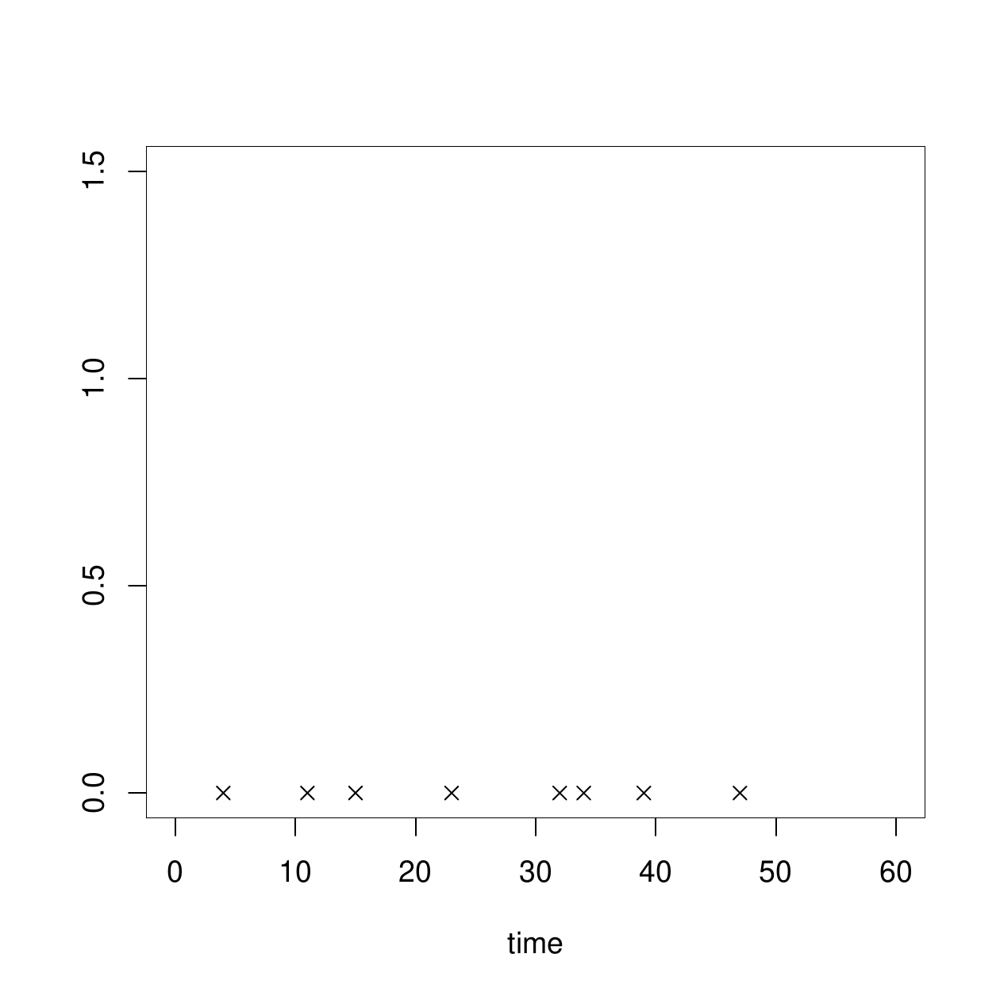
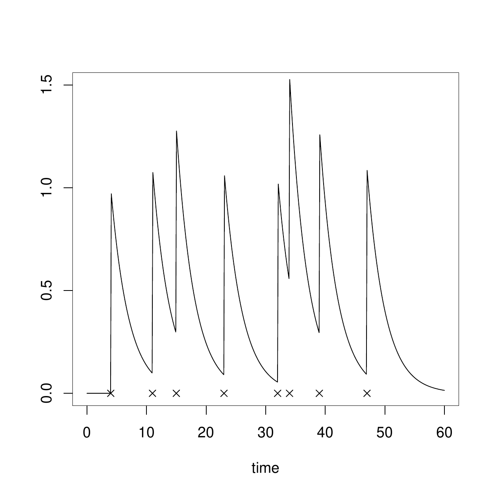

::: article
# Introduction

A random point process is a mathematical model for describing a series
of discrete events [@SnyderMiller1991]. Let $\mathcal{X} = \{t;
t_{0} \leq t \leq t_{0}+T\}$ be the base space, on which an *event*
occurs. The base space can be quite abstract, but here we will take
$\mathcal{X}$ to be a semi-infinite real line representing time. A set
of ordered points on $\mathcal{X}$ is denoted as $x =
\{x_{1},x_{2},\dots,x_{n}\}, \; x_{i} \leq x_{i+1}$, and called a
*sample realization*, or simply *realization* of a point process.

Reflecting the importance of the analysis of point processes in a broad
range of science and engineering problems, there are already some R
packages for modeling and simulating point processes such as
[*splancs*](https://CRAN.R-project.org/package=splancs)
[@Rowlingson1993627],
[*spatstat*](https://CRAN.R-project.org/package=spatstat)
[@Baddeley:Turner:2005:JSSOBK:v12i06],
[*PtProcess*](https://CRAN.R-project.org/package=PtProcess) [@PtProcess],
and
[*stpp*](https://CRAN.R-project.org/package=stpp) [@Gabriel:Rowlingson:Diggle:2012:JSSOBK:v53i02].
These packages support various approaches for the analysis of both
simple and marked spatial or spatio-temporal point processes, namely,
estimating an intensity function for sample points, visualizing the
observed sample process, and running simulations based on the specified
models.

To complement the above mentioned packages, in
[*mmpp*](https://CRAN.R-project.org/package=mmpp) [@mmpp2015], we focus
on the similarity or distance metrics between realizations of point
processes. Similarity and distance metrics are fundamental notions for
multivariate analysis, machine learning and pattern recognition. For
example, with an appropriate distance metric, a simple $k$ nearest
neighbor classifier and regressor [@Cover:67] works in a satisfactory
way. Also, kernel methods [@975545] are a well known and widely used
framework in machine learning, in which inferences are done solely based
on the values of kernel function, which is considered as a similarity
metric between two objects.

As for the distance and similarity metric for point processes, vast
amount of methods are developed in the field of
neuroscience [@citeulike:347581]. In this field, neural activities are
recorded as sequences of spikes (called *spike trains*), which is
nothing but a realization of a simple point process (SPP). By its
nature, the responses of neurons to the same stimulus can be different.
To claim the repeatability and the reliability of experimental results,
a number of different distance and similarity metrics between sequence
of spikes are
developed [@Victor2005; @Schreiber2003925; @Kreuz2007151; @PhysRevE.66.041904; @DBLP:journals/neco/Rossum01].

The package *mmpp* categorizes commonly used metrics for spike trains
and offers implementations for them. Since a spike train is a
realization of a simple point process, the original metrics developed in
the field of neuroscience do not consider marked point process (MPP)
realizations. *mmpp* extends conventional metrics for SPPs to MPPs. We
have two main aims in the development of *mmpp*:

1.  to have a systematic and unified platform for calculating the
    similarities and distances between SPPs, and

2.  to support MPPs to offer a platform for performing metric-based
    analysis of earthquakes, tornados, epidemics, or stock exchange
    data.

# Distances and similarities for point processes

Since realizations of temporal SPPs are ordered sets of the events, the
commonly used Euclidean distance and inner product cannot be directly
defined between them. Most of the metrics for SPP realizations first
transform the realizations
$x = \{x_{1},\dots,x_{n}\}, \; x_{i} \leq x_{i+1}$ and
$y = \{y_{1},\dots,y_{m}\},; y_{j} \leq y_{j+1}$ to continuous functions
$v_x(t)$ and $v_{y}(t)$, then define the distance or similarity metric
between them. Based on the transformations, we categorize conventional
methods for defining metrics on SPP realizations, and explain one by one
in the following subsections.

We note that there are some attempts to directly define distances
between SPP realizations. One of the most principled and widely used
methods is based on the edit distance [@Victor2005], and this method is
extended to deal with MPP realizations by @suzuki10MPP. However, this
approach is computationally expensive and prohibitive for computing the
distance between spike trains with even a few dozen spikes. We exclude
this class of metric from the current version of *mmpp*.

In the following, we often use kernel smoothers and step functions for
transforming SPP realizations. For notational convenience, we denote a
kernel smoother with parameter $\tau$ by $h_{\tau}(t)$, and the
Heaviside step function by

$$u(t) = \left\{
\begin{array}{lc}
1, & t \geq 0,\\
0,& t < 0.
\end{array}
\right.$$

Examples of smoothers include the Gaussian kernel smoother
$h_{\tau}^{g}(t) = \exp(-t^{2}/(2\tau^{2}))/\sqrt{2 \pi \tau^{2}}$ and
the Laplacian kernel smoother
$h_{\tau}^{l}(t) = \exp(-|t|/\tau)/(2\tau)$.

## Filtering to a continuous function

The most commonly used and intensively studied metrics for spike trains
are based on the mapping of an event sequence to a real valued
continuous function as

$$\label{eq:s2v}  
 x = \{x_{1},\dots,x_{n}\}
\Rightarrow
 v_{x}(t) = \frac{1}{n}\sum_{i=1}^{n} h_{\tau} (t-x_{i})
\cdot u(t-x_{i}).  (\#eq:s2v)  $$

Figure [1](#fig:filter) illustrates the transformation of an event
sequence to a continuous function by the smoothing method.

<figure id="fig:filter">
<table>
<caption> </caption>
<tbody>
<tr class="odd">
<td style="text-align: center;"></td>
<td style="text-align: center;"></td>
</tr>
</tbody>
</table>
<figcaption>Figure 1: An example of continuation by smoothing. Left:
event timings are marked with <span class="math inline">×</span>. Right:
the corresponding continuous function <span
class="math inline"><em>v</em><sub><em>x</em></sub>(<em>t</em>)</span>.
<span id="fig:filter" label="fig:filter"></span></figcaption>
</figure>

Then, the inner product of $x$ and $y$ is defined by the usual $\ell_2$
inner product in functional space by

$$\label{eq:fsim}  
 k(x,y) = \int_{0}^{\infty}\mathrm{d}t v_{x}(t) v_{y}(t)   \in [-\infty,\infty],  (\#eq:fsim)  $$

and similarly the distance is defined by

$$\label{eq:fdist}  
 d(x,y) = \sqrt{\int_{0}^{\infty}\mathrm{d}t (v_{x}(t)-v_{y}(t))^{2} }.  (\#eq:fdist)  $$

When we use the Laplacian smoother $h_{\tau}^{l}(t) =
\exp\left(-|t|/\tau\right)/(2 \tau)$, the similarity and distance are
analytically given as

$$k(x,y) =
\int_{0}^{\infty}\mathrm{d}t v_{x}(t) v_{y}(t) =
\frac{1}{
4 \tau n m
}
\sum_{i=1}^{n} \sum_{j=1}^{m}
\exp\left(-\frac{1}{\tau}|x_{i}-y_{j}|
\right),$$

and

$$\begin{aligned}
\nonumber
 d^{2}(x,y) =& 
k(x,x) + k(y,y) - 2 k(x,y)\\  \nonumber
=&
\frac{
1
}{
4 \tau n^{2}
}
\sum_{i=1}^{n} \sum_{j=1}^{n}
\exp\left(-\frac{|x_{i}-x_{j}|}{\tau}
\right)
+
\frac{1}{
4 \tau m^2
}
\sum_{i=1}^{m} \sum_{j=1}^{m}
\exp\left(-\frac{|y_{i}-y_{j}|}{\tau}
\right)\\
\label{eq:rossum}
&-
\frac{1}{2 \tau nm}
\sum_{i=1}^{n} \sum_{j=1}^{m}
\exp\left(-\frac{|x_{i}-y_{j}|}{\tau}
\right),
\end{aligned}  (\#eq:rossum)  $$

respectively. This distance eq. \@ref(eq:rossum) is adopted
by @DBLP:journals/neco/Rossum01 for measuring the distance between spike
trains. On the other hand, @Schreiber2003925 proposed to use the
correlation defined by

$$\mathrm{cor}(x,y) = \frac{\int_{0}^{\infty} \mathrm{d}tv_{x}(t) v_{y}(t)  }
{
 \sqrt{\int_{0}^{\infty} \mathrm{d}t  v_{x}(t) v_{x}(t)  }
 \sqrt{\int_{0}^{\infty} \mathrm{d}t  v_{y}(t) v_{y}(t)  }
}$$

to measure the similarity between spike trains. This class of measures
is extended to take into account the effect of burst, i.e., the short
interval in which events occur in high frequency, and refractory period,
i.e., the short interval in which events tend to be suppressed
immediately after the previous events [@bmetric2009; @Lyttle2011296].
These two effects, namely burst and refractory period, are commonly
observed in neural activities. They are also observed in earthquake
catalogues. After a large main shock, usually we observe high frequent
aftershocks. On the other hand, suppression of events is sometimes
happening, possibly because after a big event, the coda is so large that
one cannot detect smaller events under the large ongoing signal from the
big event [@Kagan2004; @Iwata2008].

The filtering-based metric is computed by using the function `fmetric`
in *mmpp*. The first two arguments `S1` and `S2` are the (marked) point
process realizations in the form of a '`matrix`' object. The first
column of `S1` and `S2` are the event timings and the rest are the
marks. The argument `measure` can be either `"sim"` or `"dist"`,
indicating similarity or distance, respectively. By default, the
function assumes the Laplacian smoother. When the argument `h` of
function `fmetric` is set to a function with scaling parameter $\tau$ as

``` r
> fmetric(S1, S2, measure = "sim", h = function(x, tau) exp(-x^2/tau), tau = 1)
```

the integrals in eq. \@ref(eq:fsim) and eq. \@ref(eq:fdist) are
numerically done using the R function `integrate`. The function `h`
should be square integrable and non-negative.

## Intensity inner products

For analysis of point processes, the intensity function plays a central
roll. @Paiva:2009:RKH:1512570.1512576 proposed to use the intensity
function for defining the inner product between SPP realizations. Let
$N(t)$ be the number of events observed in the interval $(0,t]$. The
intensity function of a counting process $N(t)$ is defined by

$$\lambda_{x}(t) = \lim_{\epsilon \rightarrow 0}
 \frac{1}{\epsilon}
\Pr [N(t+\epsilon) - N(t) = 1].$$

We note that we can also consider the conditional intensity function
reflecting the history up to the current time $t$, but we only explain
the simplest case in this paper. Assuming that the SPP to be analysed is
well approximated by a Poisson process, the intensity function is
estimated by using a smoother $h_{\tau}(t)$ as

$$\label{eq:estint}
 \hat{\lambda}_{x}(t) = \frac{1}{n} \sum_{i=1}^{n} h_{\tau}(t-x_i)  (\#eq:estint)  $$

in non-parametric manner [@citeulike:7364298]. Using the estimates of
intensity functions for processes behind $x$ and $y$,
@Paiva:2009:RKH:1512570.1512576 defined a similarity metric by

$$\label{eq:iipsim}  
 k(x,y) = \int_{- \infty}^{\infty} \mathrm{d}t \hat{\lambda}_{x}(t) \hat{\lambda}_{y}(t) 
=
\frac{1}{
4 \tau^{2} nm
}
\sum_{i=1}^{n} \sum_{j=1}^{m}
\int_{- \infty}^{\infty} \mathrm{d}t h_{\tau}(t-x_{i})h_{\tau}(t-y_{j}).  (\#eq:iipsim)  $$

Particularly, when we use a Gaussian smoother $h_{\tau}^{g} (t)= 
\exp\left(-t^{2}/(2\tau^{2})\right)/\sqrt{2 \pi \tau}$, the integral is
analytically computed and we obtain an explicit formula

$$k(x,y) = \int_{- \infty}^{\infty} \mathrm{d}t \hat{\lambda}_{x}(t)
	   \hat{\lambda}_{y}(t)
=
\frac{1}{
4 \sqrt{\pi} \tau n m
}
 \sum_{i=1}^{n} \sum_{j=1}^{m} \exp 
\left(
- \frac{(x_{i} - y_{j})^{2}}{4\tau^{2}}
\right).$$

The distance metric is also defined as

$$\label{eq:iipdim}  
 d(x,y) = 
\int_{-\infty}^{\infty} \mathrm{d}t
(\hat{\lambda}_{x}(t) -
\hat{\lambda}_{y}(t) 
)^{2},  (\#eq:iipdim)  $$

and it is also simplified when we use the Gaussian smoother.

This class of measures is most in alignment with the statistical model
of point processes. We estimated the intensity function in a versatile
non-parametric approach, but it is reasonable to use other models such
as the Hawkes model [@Hawkes1971] when we should include the
self-exciting nature of the process.

The intensity inner product metric is computed by using the function
`iipmetric` in *mmpp*. In the current version, the function assumes the
Gaussian smoother, and its scaling parameter is specified by the
argument `tau` as

``` r
> iipmetric(S1, S2, measure = "sim", tau = 1)
```

## Co-occurrence metric

For comparing two SPP realizations, it is natural to *count* the number
of events which can be considered to be co-occurring. There are two
metrics for SPP realizations based on the notion of co-occurrence.

The first one proposed by @PhysRevE.66.041904 directly *counts near-by
events*. The closeness of two events are defined by adaptively computed
thresholds, making the method free from tuning parameters. Suppose we
have two SPP realizations $x = \{x_{1},\dots,x_{n}\}$ and $y=
	   \{y_{1},\dots,y_{m}\}$. For any events $x_{i} \in x$ and
$y_{j} \in y$, a threshold under which the two events are considered to
be synchronous with each other is defined as half of the minimum of the
four inter event intervals around these two events:

$$\tau_{ij} =
\frac{1}{2} \min 
\{x_{i+1} - x_{i}, x_{i}- x_{i-1}, y_{j+1} - y_{j}, y_{j} - y_{j-1}\}.$$

We note that $\tau_{ij}$ in the above definition depends on $x$ and $y$,
though, for the sake of notational simplicity, we simply denote it by
$\tau_{ij}$. Then, the function that counts the number of events in $y$
which is coincided with those in $x$ is defined by

$$\begin{aligned}
 c(x|y) &= \sum_{i=1}^{n} \sum_{j=1}^{m} P_{ij},\\
\label{eq:Pkl}
 P_{ij} &=
\left\{
\begin{array}{lc}
1, & 0 < x_{i} - y_{j} < \tau_{ij}, \\
1/2, & x_{i}= y_{j}, \\
0, & \mbox{otherwise}.
\end{array}
\right.
\end{aligned}  (\#eq:Pkl)  $$

Using this counting function, a similarity measure between $x$ and $y$
is defined as

$$\label{eq:cooccsim}  
  k(x,y) = \frac{ c(x|y) + c(y|x)}{\sqrt{nm}},  (\#eq:cooccsim)  $$

and a distance measure is obtained by the
transformation [@Lyttle2011296]:

$$d(x,y) = 1 - k(x,y).$$

The second metric based on the counting co-occurrence is proposed
by @Hunter_2003_amplitude, which transforms $x$ to a continuous function
$v_{x}(t)$, and sums up the near-by events in proportion to their degree
of closeness. Denoting the closest event time in $y$ from an event
$x_{i} \in
x$ by $y_{(x_{i})}$, we define a function which measures degree of
closeness by

$$\label{eq:dc}  
 dc_{\tau}(x_{i}) =
\exp
\left(
- \frac{|x_{i} - y_{(x_{i})}|}{\tau}
\right).  (\#eq:dc)  $$

Then, a similarity metric between $x$ and $y$ is defined by

$$\label{eq:coocssim}  
 k(x,y) = \frac{
\frac{1}{n} \sum_{i=1}^{n} dc_{\tau}(x_{i})+
	   \frac{1}{m} \sum_{j=1}^{m} dc_{\tau}(y_{j})
}{2},  (\#eq:coocssim)  $$

and the distance is naturally defined by

$$d(x,y) = 1 - k(x,y).$$

The co-occurrence based metrics are computed by using the function
`coocmetric`. By default, the function assumes the counting similarity
in eq. \@ref(eq:cooccsim). The smoothed counting similarity is computed
by specifying the argument `type = "smooth"` as

``` r
> coocmetric(S1, S2, measure = "sim", type = "smooth", tau = 1)
```

## Inter event interval

Assume an SPP realization $x = \{x_{1}, \dots, x_{n}\}, x_{n} < T$ such
that for every event time $x_{i}, 0 < x_{i} < T$, where $T$ is the
horizon of the time interval. In the inter event interval proposed
by @Kreuz2007151, the SPP realization $x$ is first modified to include
artificial events corresponding to the beginning and end of the interval
as

$$\label{eq:iei_time_ext}
 x = \{x_{0}=0, x_{1},\dots, x_{n}, x_{n+1} = T\}.  (\#eq:iei-time-ext)  $$

Then each event is mapped to a function $v_{x}(t)$ as

$$v_{x}(t) = \sum_{i=0}^{n+1} f_{i}(t),\qquad f_{i}(t) = 
\left\{
\begin{array}{lc}
0,& t \notin [x_{i},x_{i+1}), \\
x_{i+1} - x_{i}, & t \in [x_{i},x_{i+1}).
\end{array}
\right.$$

Two SPP realizations $x$ and $y$ are transformed to $v_{x}(t)$ and
$v_{y}(t)$, then they are used to define an intermediate function

$$\label{eq:intermed}  
 I_{xy}(t) = 
\frac{\min\{ v_{x}(t), v_{y}(t)\}}{
\max\{ v_{x}(t), v_{y}(t)\}
}.  (\#eq:intermed)  $$

This function takes value $1$ when $x$ is identical to $y$, and takes a
smaller value when $x$ and $y$ are highly dissimilar. By using this
intermediate function, the similarity measure is defined by

$$\label{eq:IEIsim}  
 k(x,y) = \frac{1}{T}
\int_{0}^{T} \mathrm{d}t I_{xy}(t),  (\#eq:IEIsim)  $$

and the distance is defined by

$$\label{eq:IEIdist} 
 d(x,y) = \frac{1}{T}
\int_{0}^{T} \mathrm{d}t (1-I_{xy}(t)),  (\#eq:IEIdist)  $$

which is originally defined in @Kreuz2007151. A simple example of
transformation $x \Rightarrow v_{x}(t),y
\Rightarrow v_{y}(t)$ and $x,y \Rightarrow 1-I_{xy}(t)$ is illustrated
in Figure [2](#fig:ISI).

![Figure 2: Example of the transformation of two point process
realizations $x$ and $y$ into the intermediate function $I_{xy}$. The
top panel shows $x$ and corresponding continuous function $v_{x}(t)$.
The middle panel shows $y$ and $v_{y}(t)$. The bottom panel shows the
intermediate function $1-I_{xy}(t)$. []{#fig:ISI
label="fig:ISI"}](figs/ISI.png){#fig:ISI width="100%" alt="graphic without alt text"}

The inter event interval metrics are computed by using the function
`ieimetric` as

``` r
> ieimetric(S1, S2, measure = "sim")
```

# Extension to marked point processes

Sometimes events considered in point processes entail certain vector
valued *marks*. For example, seismic events are characterized by the
time point the earthquake happens, and a set of attributes such as
magnitude, depth, longitude, and latitude of the hypo-center. To deal
with marked point processes, we extend the base space $\mathcal{X}$ to
$\mathcal{X} = \{t; t_{0} \leq t \leq t_{0}+T\} \times
\mathbb{R}^{p}$, the Cartesian product of the time interval
$[t_{0}, t_{0}+T]$ and a region of the $p$ dimensional Euclidean space
corresponding to marks. Realizations of MPPs are denoted by, for
example, $x = \{(x_{1},\mathbf{r}_{1}), \dots, (x_{n},\mathbf{r}_{n})\}$
and $y = \{(y_{1},\mathbf{s}_{1}), \dots, (y_{m},\mathbf{s}_{m})\}$.

There might be many possible ways of extension. The packages *mmpp*
takes the simplest way to deal with marks in a unified and
computationally efficient manner, namely, the density or weight of marks
are included in the metrics for SPPs by Gaussian windowing as shown in
eq. \@ref(eq:GW).

## Filtering to continuous function

In the same manner as eq. \@ref(eq:s2v), the marked point process
realization
$x = \{(x_{1},\mathbf{r}_{1}),\dots,(x_{n},\mathbf{r}_{n})\}$ is
transformed to a continuous function as

$$x = \{(x_{1},\mathbf{r}_{i}),\dots,(x_{n},\mathbf{r}_{n})\}
\Rightarrow
 v_{x}(t,\mathbf{z}) = \frac{1}{n} \sum_{i=1}^{n} 
h_{M}(\mathbf{z}-\mathbf{r}_{i})
h_{\tau} (t-x_{i})
\cdot u(t-x_{i}),$$

where

$$\label{eq:GW}  
 h_{M}(\mathbf{z}) = 
(2 \pi)^{-p/2} |M|^{1/2}
\exp \left( - \frac{1}{2}\mathbf{z}^{\top} M \mathbf{z}\right)
=
(2 \pi)^{-p/2} |M|^{1/2}
\exp \left( - \frac{1}{2}\|\mathbf{z}\|^{2}_{M} \right), M \in
 \mathbb{R}^{p \times p},  (\#eq:GW)  $$

where $|M|$ is the determinant of a matrix $M$, and
$\|\mathbf{z}\|^{2}_{M} = \mathbf{z}^{\top} M \mathbf{z}$. Integrating
with respect to both time $t$ and mark $\mathbf{z}$, we define the inner
product by

$$\label{eq:MPPfsim}  
 k(x,y) = \int_{\mathbb{R}^{p}} \mathrm{d}\mathbf{z} \int_{0}^{\infty} \mathrm{d}t
v_{x}(t,\mathbf{z}) v_{y}(t,\mathbf{z}),  (\#eq:MPPfsim)  $$

and the distance by

$$d^2(x,y) = \int_{\mathbb{R}^{p}} \mathrm{d}\mathbf{z} \int_{0}^{\infty} \mathrm{d}t
 (v_{x}(t,\mathbf{z})-v_{y}(t,\mathbf{z}))^2.$$

By virtue of Gaussian windowing, the integral with respect to the mark
is explicitly written as

$$\int_{\mathbb{R}^{p}} \mathrm{d}\mathbf{z} 
\exp\left(
- \frac{1}{2}\|
\mathbf{z} - \mathbf{r}_{i}\|^{2}_{M}
- \frac{1}{2}\|\mathbf{z} - \mathbf{s}_{j}\|^{2}_{M}
\right)
=
(2 \pi)^{\frac{p}{2}} \sqrt{|2M|}
 \exp \left( - \frac{1}{4}\|\mathbf{r}_{i} - \mathbf{s}_{j}\|^{2}_{M}\right).$$

Furthermore, when we use Laplacian smoother for transforming temporal
SPPs, we obtain

$$k(x,y)=
\frac{
|M|^{1/2}
}{
2^{p+2} \pi^{p/2} \tau n m
}
\sum_{i=1}^{n} \sum_{j=1}^{m}
 \exp \left( - \frac{\|\mathbf{r}_{i} -
 \mathbf{s}_{j}\|^{2}_{M}}{4}\right)
\exp\left(-\frac{|x_{i} - y_{j}|}{\tau}
\right).$$

The distance metric is also calculated in the same manner.

We note that the effect of marks depend on the units used for the
various marks. It is reasonable to estimate the variance of each mark,
and set the diagonal elements of $M$ to be reciprocal of the variances,
which is adopted as the default setting for $M$ in *mmpp*.

## Intensity inner product

Extending kernel estimation eq. \@ref(eq:estint) to multivariate kernel
estimation as

$$\label{eq:mestint}  
 \hat{\lambda}_{x}(t, \mathbf{z}) = \frac{1}{n} \sum_{i=1}^{n} h_{M}(\mathbf{z}-\mathbf{r}_{i})  h_{\tau}(t-x_{i}),  (\#eq:mestint)  $$

we obtain the estimate of the intensity function of the marked point
process. We note that kernel density estimation for multidimensional
variables is inaccurate in general, and we can instead estimate the
ground intensity function $\lambda(t)$ and the density function for mark
$\lambda(\mathbf{z})$ separately. However, in many applications, the
dimension of marks is not so high, and currently we adopt the kernel
based estimator in eq. \@ref(eq:mestint). The intensity inner product
for MPP realizations is then defined by

$$\label{eq:MPPiipsim}  
 k(x,y)=
\int_{\mathbb{R}^{p}} \mathrm{d}\mathbf{z} 
\int_{- \infty}^{\infty} \mathrm{d}t \hat{\lambda}_{x}(t,\mathbf{z}) \hat{\lambda}_{y}(t,\mathbf{z}).  (\#eq:MPPiipsim)  $$

When we use the Gaussian smoother $h_{\tau}^{g}(t) = \exp\left(-t^2/\tau
\right)/\sqrt{2 \pi \tau^{2}}$, the integral is explicitly computed and
we obtain

$$k(x,y) =
\frac{1}{
\pi^{(p+1)/2} \tau^{1/2} |M|^{1/2} n m 
}
\sum_{i=1}^{n} \sum_{j=1}^{m}
\exp \left(
-
\frac{
(x_{i} -y_{j})^{2}
}{2 \tau}
\right)
\exp
\left(
-
\frac{
\|\mathbf{r}_{i} - \mathbf{s}_{j}\|^{2}_{M}
}{4}
\right).$$

The distance metric is also defined by

$$d(x,y)=
\int_{\mathbb{R}^{p}} \mathrm{d}\mathbf{z} 
\int_{-\infty}^{\infty} \mathrm{d}t
(\hat{\lambda}_{x}(t,\mathbf{z}) -
\hat{\lambda}_{y}(t,\mathbf{z}) 
)^{2}.$$

For estimating the intensity function, a simple Poisson process is
assumed. This assumption is relaxed with more flexible models such as
the ETAS model [@ogata1988; @ogata1998], where the intensity function is
estimated using the R packages
[*SAPP*](https://CRAN.R-project.org/package=SAPP) [@SAPP] and
[*etasFLP*](https://CRAN.R-project.org/package=etasFLP) [@etasFLP], for
example. The extension of the intensity-based metric to support other
forms of intensity estimation such as the Hawkes and ETAS models remains
our important future work.

## Co-occurrence metric

To extend the co-occurrence metric based on counting the synchronous
events, eq. \@ref(eq:Pkl) is replaced with a weighted counter

$$P_{ij}=
\exp( - 
\|\mathbf{r}_{i} - \mathbf{s}_{j}\|^{2}_{M}
)
\times
\left\{
\begin{array}{lc}
1, & 0 < x_{i} - y_{j} < \tau_{ij}, \\
1/2, & x_{i} = y_{j}, \\
0, & \mbox{otherwise}.
\end{array}
\right.$$

To extend the co-occurrence metric based on the smoothed count of the
synchronous events, eq. \@ref(eq:dc) is replaced with a weighted
smoothed counter

$$dc_{\tau,M}(x_{i}) =
\exp
\left(
- \|\mathbf{r}_{i} - \mathbf{s}_{(x_{i})}\|^{2}_{M}
\right)\times
\exp
\left(
- 
\frac{
|x_{i} - y_{(x_{i})}|}
{\tau}
\right).$$

## Inter event interval

To weight the inter event interval by using marks associated with two
MPP realizations $x$ and $y$, we define index extraction operators as
follows. We modify an MPP realization
$x = \{(x_{1},\mathbf{r}_{1}),\dots,(x_{n},\mathbf{r}_{n})\}$ to include
artificial events and marks corresponding to the beginning and end of
the interval as

$$\label{eq:ieitimeextm}  
 x = \{(x_{0}=0,\mathbf{r}_{0}=\mathbf{0}), (x_{1},\mathbf{r}_{1}),\dots,
  (x_{n},\mathbf{r}_{n}), (x_{n+1} = T,\mathbf{r}_{n+1} = \mathbf{0})\}.  (\#eq:ieitimeextm)  $$

Then we define operators

$$\begin{aligned}
\notag
\underline{q} : [0,T]  \times \mathcal{X} & \to \mathbb{R}\\
 (t,x) & \mapsto i, \quad {\mathrm{s.t.}} \quad t \in [x_{i},x_{i+1}],\\ \notag
\overline{q} : [0,T]  \times \mathcal{X} & \to  \mathbb{R}\\
 (t,x) & \mapsto  i +1, \quad {\mathrm{s.t.}} \quad t \in
 [x_{i},x_{i+1}].
\end{aligned}$$

The intermediate function eq.\@ref(eq:intermed) is modified to take into
account the dissimilarity of marks:

$$I_{xy}(t) = 
\frac{\min( v_{x}(t), v_{y}(t))}{
\max( v_{x}(t), v_{y}(t))
}
\frac{
\exp( - \|\mathbf{r}_{\underline{q}(t,x)} -
\mathbf{s}_{\underline{q}(t,y)}\|^{2}_{M})+
\exp( - \|\mathbf{r}_{\overline{q}(t,x)} - \mathbf{s}_{\overline{q}(t,y)}\|^{2}_{M})
}
{2}.$$

The distance and similarity are then calculated using
eq. \@ref(eq:IEIdist) and  eq. \@ref(eq:IEIsim).

The usage of the functions `fmetric`, `iipmetric`, `coocmetric`, and
`ieimetric` does not change for marked point process data, except for
one additional argument `M`, which is the precision matrix $M$ in
eq. \@ref(eq:GW). By default, it is automatically set to the diagonal
matrix with the diagonal elements equal to the reciprocal of the
variance of corresponding marks of `S1` and `S2`. We can also specify
the matrix $M$ manually as

``` r
> fmetric(S1, S2, measure = "sim", M = diag(3))
```

where the number of marks is assumed to be three.

# An example with the Miyagi20030626 data set

This section illustrates the use of the package with a simple
experiment. We use the `Miyagi20030626` dataset contained within the
package.

``` r
> library(mmpp)
> data(Miyagi20030626)
```

The dataset is composed of 2305 aftershocks of the 26th July 2003
earthquake of M6.2 at the northern Miyagi-Ken Japan, which is a
reparameterization of the `main2006JUL26` dataset from the *SAPP*
package. Each record has 5 dimensions, `time`, `longitude`, `latitude`,
`depth`, and `magnitude` of its hypo-center. The `time` is recorded in
seconds from the main shock.

To illustrate the use of the package, we consider a simple prediction
task. We first split the original dataset by a time-window of length
$60 
\times 60 \times 3$, which means that the time interval of each partial
point process split by this window is three hours.

``` r
> sMiyagi <- splitMPP(Miyagi20030626, h = 60*60*3, scaleMarks = TRUE)$S
```

Then, the maximum magnitude in each partial point process realization is
computed.

``` r
> ## target of prediction is the maximum magnitude in the window
> m <- NULL
> for (i in 1:length(sMiyagi)) {
+   m <- c(m, max(sMiyagi[[i]]$magnitude))
+ }
```

The task we consider is the prediction of the maximum magnitude in the
*next* three hours using the past one week of data. We formulate this
problem as a regression problem. Let the partial point process
realization in the $i$-th window be $o_i$, and let the maximum magnitude
in the $i+1$-th window be $m_i$. Then the problem is predicting
$m_{i+1}$ given $o_{i+1}$ and the past $24\times
7/3 = 56$ hours of data $\{(o_{i-\ell},m_{i-\ell})\}_{\ell =0}^{55}$.
See Figure [3](#fig:window) for an illustrative diagram of the problem
setting.

![Figure 3: An illustrative diagram of the problem setting. The
horizontal axis corresponds to time, and the vertical axis shows marks.
Though the dimension of the mark is four, it is shown as one-dimensional
axis. The process is split by a three hour window, and each window is
assigned an output variable, which is the maximum magnitude in the next
time window. Using the past one week data, the output variable of the
next time window is predicted by nearest neighbor regression.
[]{#fig:window label="fig:window"}](figs/mpppredict.png){#fig:window
width="100%" alt="graphic without alt text"}

``` r
> m <- m[-1]
> sMiyagi[[length(sMiyagi)]] <- NULL
> ## number of whole partial MPPs split by a 3-hour time window
> N <- length(sMiyagi)
> ## training samples are past one week data
> Ntr <- 24*7/3
> ## number of different prediction methods
> Nd <- 10
```

For the purpose of illustrating the use of the package and to show the
effect of different similarity metrics, we adopt the nearest neighbor
regression. That is, given the current realization $o_{i}$, we find the
most similar realization $o_{j} \in \{o_{i-l}\}_{l=0}^{55}$, and use the
corresponding maximum magnitude $m_{j}$ as the predictor for $m_{i+1}$.
We use ten different similarity metrics supported in the package, and
evaluate the mean absolute errors. The metrics used for these
experiments are the filter based metric in eq. \@ref(eq:fsim), the
intensity inner product metric in eq. \@ref(eq:iipsim), the
co-occurrence with counting in eq. \@ref(eq:cooccsim), the co-occurrence
with smoothed counting in eq. \@ref(eq:coocssim), and the inter event
interval metric in eq. \@ref(eq:IEIsim), and their MPP extensions.

``` r
> err <- matrix(0, N - Ntr, Nd)
> colnames(err) <- c("f SPP","iip SPP","cooc (s) SPP","cooc (c) SPP","iei SPP",
+                    "f MPP","iip MPP","cooc (s) MPP","cooc (c) MPP","iei MPP")
```

The following code performs the above explained experiment.

``` r
> for (t in 1:(N - Ntr)) {
+   qid <- Ntr + t
+   q <- sMiyagi[[qid]]
+   ## simple PP
+   ## fmetric with tau = 1
+   sim2query <- NULL
+   for (i in 1:Ntr) {
+     sim2query <- c(sim2query, fmetric(q$time, sMiyagi[[qid - i]]$time))
+   }
+   err[t, 1] <- abs(m[qid] - m[t:(Ntr + t - 1)][which.max(sim2query)])  
+   ## iipmetric with tau = 1
+   sim2query <- NULL
+   for (i in 1:Ntr) {
+     sim2query <- c(sim2query, iipmetric(q$time, sMiyagi[[qid - i]]$time))
+   }
+   err[t, 2] <- abs(m[qid] - m[t:(Ntr + t - 1)][which.max(sim2query)])  
+   ## coocmetric (smooth) with tau = 1
+   sim2query <- NULL
+   for (i in 1:Ntr) {
+     sim2query <- c(sim2query, coocmetric(q$time, sMiyagi[[qid - i]]$time,
+                    type = "smooth"))
+   }
+   err[t, 3] <- abs(m[qid] - m[t:(Ntr + t - 1)][which.max(sim2query)])  
+   ## coocmetric (count)
+   sim2query <- NULL
+   for (i in 1:Ntr) {
+     sim2query <- c(sim2query, coocmetric(q$time, sMiyagi[[qid - i]]$time, 
+                    type = "count"))
+   }
+   err[t, 4] <- abs(m[qid] - m[t:(Ntr + t - 1)][which.max(sim2query)])
+   ## iei metric
+   sim2query <- NULL
+   for (i in 1:Ntr) {
+     sim2query <- c(sim2query, ieimetric(q$time, sMiyagi[[qid - i]]$time))
+   }
+   err[t, 5] <- abs(m[qid] - m[t:(Ntr + t - 1)][which.max(sim2query)])
+   ## marked PP with latitude, longitude, depth, and magnitude
+   ## fmetric with tau = 1
+   sim2query <- NULL
+   for (i in 1:Ntr) {
+     sim2query <- c(sim2query, fmetric(q, sMiyagi[[qid - i]]))
+   }
+   err[t, 6] <- abs(m[qid] - m[t:(Ntr + t - 1)][which.max(sim2query)])  
+   ## iipmetric with tau = 1
+   sim2query <- NULL
+   for (i in 1:Ntr) {
+     sim2query <- c(sim2query, iipmetric(q, sMiyagi[[qid - i]]))
+   }
+   err[t, 7] <- abs(m[qid] - m[t:(Ntr + t - 1)][which.max(sim2query)])  
+   ## coocmetric (smooth) with tau=1
+   sim2query <- NULL
+   for (i in 1:Ntr) {
+     sim2query <- c(sim2query, coocmetric(q, sMiyagi[[qid - i]], type = "smooth"))
+   }
+   err[t, 8] <- abs(m[qid] - m[t:(Ntr + t - 1)][which.max(sim2query)])   
+   ## coocmetric (count)
+   sim2query <- NULL
+   for (i in 1:Ntr) {
+     sim2query <- c(sim2query, coocmetric(q, sMiyagi[[qid - i]], type = "count"))
+   }
+   err[t, 9] <- abs(m[qid] - m[t:(Ntr + t - 1)][which.max(sim2query)])
+   ## iei metric
+   sim2query <- NULL
+   for (i in 1:Ntr) {
+     sim2query <- c(sim2query,ieimetric(q, sMiyagi[[qid - i]]))
+   }
+   err[t, 10] <- abs(m[qid] - m[t:(Ntr + t - 1)][which.max(sim2query)])
+ }
> colMeans(err)
  f SPP      iip SPP     cooc (s) SPP      cooc (c) SPP     iei SPP 
  0.7002634  0.6839529   0.7263602         0.6632930        0.7905148 
  f MPP      iip MPP     cooc (s) MPP      cooc (c) MPP     iei MPP 
  0.6839529  0.6317594   0.6643804         0.6622056        0.7698548 
```

From this simple example, we can see that the prediction accuracy is
improved by taking the marks into account.

# Summary and future directions

*mmpp* is the first R package dedicated to the calculation of the
similarity and distance metrics for marked point process realizations.
It provides the implementation of several similarity metrics for simple
point processes, originally proposed in the literature of neuroscience,
and also provides extensions of these metrics to those for marked point
processes.

A simple example of a real dataset presented in this paper illustrates
the importance of taking the marks into account in addition to the event
timings, and it also illustrates the possibilities of the package *mmpp*
with a user guide for practitioners.

The development of the *mmpp* package has only just begun. Currently, we
are considering supporting burst sensitive and refractory period
sensitive versions of `fmetric`, since these properties are commonly
observed in both neural activities and seismic event recordings. In the
current version of *mmpp*, for treating MPPs, event timings and marks
are assumed to be separable, and all the marks are simultaneously
estimated by a kernel density estimator. This is a strong assumption and
other possibilities for modeling MPPs should be considered. For example,
it is popular to group spatio-temporal events, i.e., event timings and
locations, and treat marks such as magnitude in seismic events as purely
*marks*. Then, the separability between marks and spatio-temporal events
can be tested by using test statistics proposed in @Schoenberg2004 and
@ChangSchoenberg2011. The separability assumption offers computational
advantages, though, it would miss the intrinsic structure and
relationship between event timings and marks. In principle, the
separability hypothesis should be tested before calculating the metrics.
Frameworks for flexible modeling of marked sample sequences with
statistical validation such as nonparametric tests would be implemented
in future version of *mmpp*. We are also considering to extend the
intensity inner product metric to support other form of intensity
estimation such as Hawkes and ETAS models.

Different similarity metrics capture different aspects of the point
process realizations. Our final goal of the development of the package
*mmpp* is to provide a systematic way to select or combine appropriate
metrics for analysing given point process realizations and certain tasks
such as prediction of magnitude or clustering similar seismic events.

# Acknowledgement {#acknowledgement .unnumbered}

The authors are grateful to T. Iwata for helpful discussions and
suggestions. The authors would like to express their special thanks to
the editor, the associate editor and three anonymous reviewers whose
comments led to valuable improvements of the manuscript. Part of this
work is supported by JSPS KAKENHI Grant Number 25870811, 26120504, and
25120009.

\

\

\
:::
