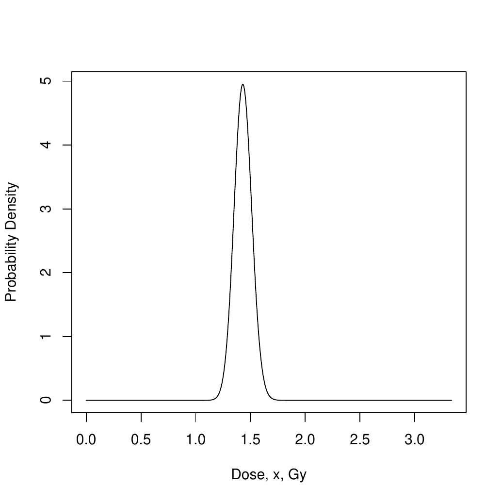
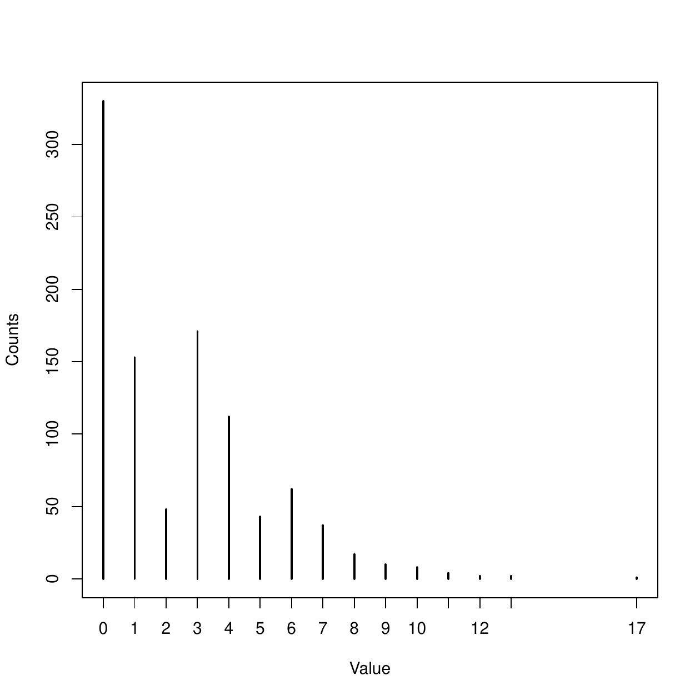

::: article
# Introduction {#sec:intro}

The Poisson distribution is without a doubt the most common when dealing
with count data. There are several reasons for that, including the fact
that the maximum likelihood estimate of the population mean is the
sample mean and the property that this distribution is closed under
convolutions (see @johnson). However, it is very common in practice that
data presents overdispersion or zero inflation, cases where the Poisson
assumption does not hold. In these situations it is reasonable to
consider discrete distributions with more than one parameter. The class
of all two-parameter discrete distributions closed under convolutions
and satisfying that the sample mean is the maximum likelihood estimator
of the population mean are characterized in @puig2003. One of these
families is just the Generalized Hermite distribution. Several
generalizations of the Poisson distribution have been considered in the
literature (see, for instance, @gurland
[@lukacs; @kemp1965; @kemp1966]), that are *compound-Poisson* or
*contagious* distributions. They are families with probability
generating function (PGF) defined by

$$\label{eq:pgfgp}
 P(s) = exp(\lambda (f(s)-1)) = \exp(a_1 (s-1)+a_2 (s^2-1)+ \cdots + a_m(s^m-1) +
\cdots),   (\#eq:pgfgp)$$

where $f(s)$ is also a PGF and $\sum_{i=1}^m a_i = \lambda$. Many well
known discrete distributions are included in these families, like the
Negative Binomial, Polya-Aeppli or the Neyman A distributions. The
Generalized Hermite distribution was first introduced in @gupta_jain1974
as the situation where $a_m$ is significant compared to $a_1$ in
(\@ref(eq:pgfgp)), while all the other terms $a_i$ are negligible,
resulting in the PGF

$$\label{eq:pgfgh}
 P(s) = \exp(a_1(s-1)+a_m(s^m-1)).   (\#eq:pgfgh)$$

After fixing the value of the positive integer $m\ge 2$, the *order* or
*degree* of the distribution, the domain of the parameters is $a_1>0$
and $a_m>0$. Note that when $a_m$ tends to zero, the distribution tends
to a Poisson. Otherwise, when $a_1$ tends to zero it tends to $m$ times
a Poisson distribution. It is immediate to see that the PGF in
(\@ref(eq:pgfgh)) is the same than the PGF of $X_1+mX_2$, where $X_i$
are independent Poisson distributed random variables with population
mean $a_1$ and $a_m$ respectively. From here, it is straightforward to
calculate the population mean, variance, skewness and excess kurtosis of
the Generalized Hermite distribution:

$$\begin{aligned}
\label{eq:reparam}
 \mu &= a_1 + ma_m, &
 \sigma^2 &= a_1+m^2a_m,\\
 \gamma_1 &= \displaystyle\frac{a_1 + m^3 a_m}{(a_1 + m^2 a_m)^{3/2}},&
 \gamma_2 &= \displaystyle\frac{a_1 + m^4 a_m}{(a_1 + m^2 a_m)^2}.\nonumber 
\end{aligned}   (\#eq:reparam)$$

A useful expression for the probability mass function of the Generalized
Hermite distribution in terms of the population mean $\mu$ and the
population index of dispersion $d
= \sigma^2/\mu$ is provided in @puig2003.

$$P(Y=k)=P(Y=0) \frac{\mu^k (m-d)^k}{(m-1)^k} \sum_{j=0}^{[k/m]}
\frac{(d-1)^j (m-1)^{(m-1)j}}{m^j \mu^{(m-1)j} (m-d)^{mj} (k-mj)!j!}, k=0,1,
\ldots$$

where $P(Y=0) = \exp(\mu (-1+ \frac{d-1}{m}))$ and $[k/m]$ is the
integer part of $\frac{k}{m}$. Note that $m$ can be expressed as
$m=\frac{d-1}{1+\log(p_0)/\mu}$. Because the denominator is a measure of
zero inflation, $m$ can be understood as an index of the relationship
between the overdispersion and the zero inflation.

The probabilities can be also written in terms of the parameters $a_1$,
$a_m$ using the identities given in (\@ref(eq:reparam)).

The case $m=2$ in (\@ref(eq:pgfgh)) is covered in detail in @kemp1965
and @kemp1966 and the resulting distribution is simply called Hermite
distribution. In that case, the probability mass function, in terms of
the parameters $a_1$ and $a_2$, has the expression

$$P(Y=k) = e^{-a_1-a_2} \sum_{j=0}^{[k/2]} \frac{a_1^{k-2j}
a_2^j}{(k-2j)!j!}, k=0,1, \ldots$$

The probability mass function and the distribution function for some
values of $a_1$ and $a_2$ are shown in Figure [1](#fig1).

{#fig1 width="100%"
alt="graphic without alt text"}

@gupta_jain1974 also develop a recurrence relation that can be used to
calculate the probabilities in a numerically efficient way:

$$\label{eq:rec_relation}  
 p_k = \frac{\mu}{k(m-1)} \left(p_{k-m} (d-1) + p_{k-1}(m-d) \right), k \geq m,   (\#eq:rec-relation)$$

where $p_k = P(Y=k)$ and the first values can be computed as
$p_k = p_0 \frac{\mu^k}{k!} \left(\frac{m-d}{m-1} \right)^k,
k=1,\ldots,m-1$. Although overdispersion or multimodality are common
situations when dealing with count data and the Generalized Hermite
distribution provides an appropriate framework to face these situations,
the use of techniques based on this distribution was not easy in
practice as they were not available in any standard statistical
software. A description of the *hermite* package's main functionalities
will be given in Section [2](#sec:hermite). Several examples of
application in different fields will be discussed in
Section [3](#sec:examples), and finally some conclusions will be
commented in Section [4](#sec:conclusions).

# Package *hermite* {#sec:hermite}

Like the common distributions in R, the package *hermite* implements the
probability mass function (`dhermite`), the distribution function
(`phermite`), the quantile function (`qhermite`) and a function for
random generation (`rhermite`) for the Generalized Hermite distribution.
It also includes the function `glm.hermite`, which allows to calculate,
for a univariate sample of independent draws, the maximum likelihood
estimates for the parameters and to perform the likelihood ratio test
for a Poisson null hypothesis against a Generalized Hermite alternative.
This function can also carry out Hermite regression including covariates
for the population mean, in a very similar way to that of the well known
R function `glm`.

## Probability mass function {#sec:pmf}

The probability mass function of the Generalized Hermite distribution is
implemented in *hermite* through the function `dhermite`. A call to this
function might be

``` r
  dhermite(x, a, b, m = 2)
```

The description of these arguments can be summarized as follows:

-   `x`: Vector of non-negative integer values.
-   `a`: First parameter for the Hermite distribution.
-   `b`: Second parameter for the Hermite distribution.
-   `m`: Degree of the Generalized Hermite distribution. Its default
    value is 2, corresponding to the classical Hermite distribution
    introduced in @kemp1965.

The recurrence relation (\@ref(eq:rec-relation)) is used by `dhermite`
for the computation of probabilities. For large values of any parameter
`a` or `b` (above 20), the probability of $Y$ taking $x$ counts is
approximated using an Edgeworth expansion of the distribution function
(\@ref(eq:edex)), i.e. $P(Y = x) = F_H(x) - F_H(x - 1)$. The Edgeworth
expansion does not guarantee positive values for the probabilities in
the tails, so in case this approximation returns a negative probability,
the probability is calculated by using the normal approximation
$P(Y = x) = \Phi(x^+) - \Phi(x^-)$ where $\Phi$ is the standard normal
distribution function and
$$x^\pm = \frac{x \pm 0.5 - a - m b}{\sqrt{a + m^2 b}}$$
are the typified continuous corrections.

The normal approximation is justified taking into account the
representation of any Generalized Hermite random variable $Y$, as
$Y=X_1 + m X_2$ where $X_i$ are independent Poisson distributed with
population means $a$, $b$. Therefore, for large values of $a$ or $b$,
the Poissons are well approximated by normal distributions.

## Distribution function

The distribution function of the Generalized Hermite distribution is
implemented in *hermite* through the function `phermite`. A call to this
function might be

``` r
  phermite(q, a, b, m = 2, lower.tail = TRUE)
```

The description of these arguments can be summarized as follows:

-   `q`: Vector of non-negative integer quantiles.
-   `lower.tail`: Logical; if `TRUE` (the default value), the computed
    probabilities are $P(Y \leq x)$, otherwise, $P(Y > x)$.

All remaining arguments are defined as specified for `dhermite`.

If $a$ and $b$ are large enough ($a$ or $b > 20$), $X_1$ and $X_2$ are
approximated by $N(a,\sqrt a)$ and $N(b,\sqrt b)$ respectively, so $Y$
can be approximated by a normal distribution with mean $a+mb$ and
variance $a+m^2b$. This normal approximation is improved by means of an
Edgeworth expansion [@barndorff1989], using the following expression

$$\label{eq:edex}
 F_H(x) \approx \Phi(x^*) - \phi(x^*) \cdot \left(\frac{1}{6}\gamma_1 He_2(x^*) + \frac{1}{24}\gamma_2 He_3(x^*) + \frac{1}{72}\gamma_1^2
 He_5(x^*) \right),   (\#eq:edex)$$

where $\Phi$ and $\phi$ are the typified normal distribution and density
functions respectively, $He_n(x)$ are the $n$th-degree probabilists'
Hermite polynomials [@barndorff1989]

$$\begin{aligned}
 He_2(x) &= x^2 - 1 \\
 He_3(x) &= x^3 - 3 x \\
 He_5(y) &= x^5 - 10 x^3 + 15 x, 
\end{aligned}$$

$x^*$ is the typified continuous correction of $x$ considered in
@pace1997
$$x^* = 1 + \frac{1}{24 (a + m^2 b)} \cdot \frac{x + 0.5 - a - m b}{\sqrt{a + m^2 b}},$$
and $\gamma_1$ and $\gamma_2$ are respectively the skewness and the
excess kurtosis of $Y$ expressed in (\@ref(eq:reparam)).

## Quantile function

The quantile function of the Generalized Hermite distribution is
implemented in *hermite* through the function `qhermite`. A call to this
function might be

``` r
  qhermite(p, a, b, m = 2, lower.tail = TRUE)
```

The description of these arguments can be summarized as follows:

-   `p`: Vector of probabilities.

All remaining arguments are defined as specified for `phermite`. The
quantile is right continuous: `qhermite(p, a, b, m)` is the smallest
integer $x$ such that $P(Y \leq x) \geq
p$, where $Y$ follows an $m$-th order Hermite distribution with
parameters $a$ and $b$.

When the parameters $a$ or $b$ are over 20, a Cornish-Fisher expansion
is used [@barndorff1989] to approximate the quantile function. The
Cornish-Fisher expansion uses the following expression
$$y_p \approx \left( u_p + \frac{1}{6}\gamma_1 He_2(u_p) + \frac{1}{24}\gamma_2 He_3(u_p) - \frac{1}{36}\gamma_1^2 (2 u_p^3 - 5 u_p) \right)
 \sqrt{a + m^2 b} + a + m b,$$
where $u_p$ is the $p$ quantile of the typified normal distribution.

## Random generation

The random generation function `rhermite` uses the relationship between
Poisson and Hermite distributions detailed in Sections [1](#sec:intro)
and [2.1](#sec:pmf). A call to this function might be

``` r
  rhermite(n, a, b, m = 2)
```

The description of these arguments can be summarized as follows:

-   `n`: Number of random values to return.

All remaining arguments are defined as specified for `dhermite`.

## Maximum likelihood estimation and Hermite regression

Given a sample $X=x_1, \ldots, x_n$ of a population coming from a
generalized Hermite distribution with mean $\mu$, index of dispersion
$d$ and order $m$, the log-likelihood function is

$$\label{eq:likelihood}  
 l(X; \mu, d) = n \cdot \mu \cdot \left(-1+\frac{d-1}{m} \right) + log
\left(\frac{\mu (m-d)}{m-1} \right) \sum_{i=1}^n x_i + \sum_{i=1}^n
log(q_i(\theta)),   (\#eq:likelihood)$$

where $q_i(\theta) = \sum_{j=0}^{[x_i/m]} \frac{\theta^j}{(x_i-mj)!j!}$
and $\theta = \frac{(d-1)(m-1)^{(m-1)}}{m \mu^{(m-1)}(m-d)^m}$.

The maximum likelihood equations do not always have a solution. This is
due to the fact that this is not a regular family of distributions
because its domain of parameters is not an open set. The following
result gives a sufficient and necessary condition for the existence of
such a solution [@puig2003]:

::: {#pr1 .proposition}
**Proposition 1**. *Let $x_1, \ldots, x_n$ be a random sample from a
generalized Hermite population with fixed $m$. Then, the maximum
likelihood equations have a solution if and only if
$\frac{\mu^{(m)}}{\bar{x}^m}>1$, where $\bar{x}$ is the sample mean and
$\mu^{(m)}$ is the $m$-th order sample factorial moment,
$\mu^{(m)}=\frac{1}{n} \cdot \sum_{i=1}^n
x_i(x_i-1) \cdots (x_i-m+1)$.*
:::

If the likelihood equations do not have a solution, the maximum of the
likelihood function (\@ref(eq:likelihood)) is attained at the border of
the domain of parameters, that is, $\hat\mu=\bar{x}$, $\hat{d}=1$
(Poisson distribution), or $\hat\mu=\bar{x}$, $\hat{d}=m$ ($m$ times a
Poisson distribution). The case $\hat\mu=\bar{x}$, $\hat{d}=m$
corresponds to the very improbable situation where all the observed
values were multiples of $m$. Then, in general, when the condition of
Proposition [1](#pr1) is not satisfied, the maximum likelihood
estimators are $\hat\mu=\bar{x}$, $\hat{d}=1$. This means that the data
is fitted assuming a Poisson distribution.

The package *hermite* allows to estimate the parameters $\mu$ and $d$
given an univariate sample by means of the function `glm.hermite`:

``` r
  glm.hermite(formula, data, link = "log", start = NULL, m = NULL)
```

The description of the arguments can be summarized as follows:

-   `formula`: Symbolic description of the model. A typical predictor
    has the form *response* $\sim$ *terms* where *response* is the
    (numeric) response vector and *terms* is a series of terms which
    specifies a linear predictor for response.
-   `data`: An optional data frame containing the variables in the
    model.
-   `link`: Character specification of the population mean link
    function: `"log"` or `"identity`\". By default `link = "log"`.
-   `start`: A vector containing the starting values for the parameters
    of the specified model. Its default value is `NULL`.
-   `m`: Value for parameter `m`. Its default value is `NULL`, and in
    that case it will be estimated as $\hat{m}$, more details below.

The returned value is an object of class `glm.hermite`, which is a list
including the following components:

-   `coefs`: The vector of coefficients.
-   `loglik`: Log-likelihood of the fitted model.
-   `vcov`: Covariance matrix of all coefficients in the model (derived
    from the Hessian returned by the `maxLik()` output).
-   `hess`: Hessian matrix, returned by the `maxLik()` output.
-   `fitted.values`: The fitted mean values, obtained by transforming
    the linear predictors by the inverse of the link function.
-   `w`: Likelihood ratio test statistic.
-   `pval`: Likelihood ratio test p-value.

If the condition given in Proposition [1](#pr1) is not met for a sample
*x*, the `glm.hermite` function provides the maximum likelihood
estimates $\hat{\mu}=\bar{x}$ and $\hat{d}=1$ and a warning message
advising the user that the MLE equations have no solutions.

The function `glm.hermite` can also be used for Hermite regression as
described below and as will be shown through practical examples in
Sections [3.3](#sec:regGiles) and [3.4](#sec:digiorgio).

Covariates can be incorporated into the model in various ways (see,
e.g., @giles:07:modsim). In function `glm.hermite`, the distribution is
specified in terms of the dispersion index and its mean, which is then
related to explanatory variables as in linear regression or other
generalized linear models. That is, for Hermite regression, we assume
$Y_i$ follows a generalized Hermite distribution of order $m$, where we
retain the dispersion index $d$ ($>1$) as a parameter to be estimated
and let the mean $\mu_i$ for the $i$--th observation vary as a function
of the covariates for that observation, i.e.,
$\mu_i= h(\pmb{x_i}^{t}\beta)$, where $\pmb{x_i}$ is a vector of
covariates, $t$ denotes the transpose vector, $\beta$ is the
corresponding vector of coefficients to be estimated and $h$ is a link
function. Note that because the dispersion index $d$ is taken to be
constant, this is a linear mean-variance (NB1) regression model.

The link function provides the relationship between the linear predictor
and the mean of the distribution function. Although the log is the
canonical link for count data as it ensures that all the fitted values
are positive, the choice of the link function can be somewhat influenced
by the context and data to be treated. For example, the identity link is
the accepted standard in biodosimetry as there is no evidence that the
increase of chromosomal aberration counts with dose is of exponential
shape [@iaea]. Therefore, function `glm.hermite` allows both link
functions.

A consequence of using the identity--link is that the maximum likelihood
estimate of the parameters obtained by maximizing the log--likelihood
function of the corresponding model may lead to negative values for the
mean. Therefore, in order to avoid negative values for the mean,
constraints in the domain of the parameters must be included when the
model is fitted. In function `glm.hermite`, this is carried out by using
the function `maxLik` from package
[*maxLik*](https://CRAN.R-project.org/package=maxLik) [@maxLik], which
is used internally for maximizing the corresponding log--likelihood
function. This function allows constraints which are needed when the
identity--link is used.

It should also be noted that results may depend of the starting values
provided to the optimization routines. If no starting values are
supplied, the starting values for the coefficients are computed/fixed
internally. Specifically, when the log--link is specified, the starting
values are obtained by fitting a standard Poisson regression model
through a call to the internal function `glm.fit` from package *stats*.
If the link function is the identity and no initial values are provided
by the user, the function takes 1 as initial value for the coefficients.
In both cases, the initial value for the dispersion index $\hat{d}$ is
taken to be 1.1.

Regarding the order of the Hermite distribution, it can be fixed by the
user. If it is not provided (default option), when the model includes
covariates, the order $\hat{m}$ is selected by discretized maximum
likelihood method, fitting the coefficients for each value of $\hat{m}$
between 1 (Poisson) and 10, and selecting the case that maximizes the
likelihood. In addition, if no covariates are included in the model and
no initial values are supplied by the user, the naïve estimate
$\hat{m} =
\frac{s^2/\bar{x}-1}{1+log(p0)/\bar{x}}$, where $p0$ is the proportion
of zeros in the sample is also considered. In the unlikely case the
function returns $\hat m = 10$, we recommend to check the likelihood of
the next orders ($m = 11, 12, \ldots$) fixing this parameter in the
function until a local minimum is found.

When dealing with the Generalized Hermite distribution it seems natural
to wonder if data could be fitted by using a Poisson distribution.
Because the Poisson distribution is included in the Generalized Hermite
family, this is equivalent to test the null hypothesis $H_0: d = 1$
against the alternative $H_1: d > 1$. To do this, an immediate solution
is to use the likelihood ratio test, which test-statistic is given by
$W = 2 \left(l \left(X; \hat{\mu}, \hat{d} \right) -
l \left(X; \hat{\mu}, 1 \right) \right)$, where $l$ is the
log-likelihood function.

Under the null hypothesis $W$ is not asymptotically $\chi^2_1$
distributed as usual, because $d=1$ is on the border of the domain of
the parameters. Using the results of @self1987 and @geyer1994 it can be
shown that in this case the asymptotic distribution of $W$ is a 50:50
mixture of a zero constant and a $\chi^2_1$ distribution. The $\alpha$
percentile for this mixture is the same as the $2 \alpha$ upper tail
percentile for a $\chi^2_1$ [@puig2003]. The likelihood ratio test is
also performed through `glm.hermite` function, using the maximum
likelihood estimates $\hat{\mu}$ and $\hat{d}$.

A `summary` method for objects of class `glm.hermite` is included in the
*hermite* package, giving a summary of relevant information, including
the residuals minimum, maximum, median and first and third quartiles,
the table of coefficients including the corresponding standard errors
and significance tests based on the Normal reference distribution for
regression coefficients and the likelihood ratio test against the
Poisson distribution for the dispersion index. The AIC value for the
proposed model is also reported.

# Examples {#sec:examples}

Several examples of application of the package *hermite* in a wide range
of contexts are discussed in this section, including classical and
recent real datasets and simulated data.

## Hartenstein (1961)

This example by @hartenstein1961 describes the counts of Collenbola
microarthropods in 200 samples of forest soil. The frequency
distribution is shown in Table [1](#tab:ex1).

::: {#tab:ex1}
  ---------------------------------------------------------
   Microarthropods per sample    0    1    2    3    4   5
  ---------------------------- ----- ---- ---- ---- --- ---
           Frequency            122   40   14   16   6   2

  ---------------------------------------------------------

  : Table 1: Frequency distribution of Collenbola microarthropods.
:::

This dataset was analyzed in @puig2003 with a Generalized Hermite
distribution of order $m=3$. The maximum likelihood estimation gave a
mean of $\hat{\mu}=\bar{x} = 0.75$, and an index of dispersion of
$\hat{d} = 1.8906$.

Using `glm.hermite` we calculate the parameter estimates:

``` r
> library("hermite")
> data <- c(rep(0, 122), rep(1, 40), rep(2, 14), rep(3, 16), rep(4, 6), rep(5, 2))
> mle1 <- glm.hermite(data ~ 1, link = "log", start =NULL, m = 3)$coefs
     (Intercept) dispersion.index            order 
      -0.2875851        1.8905920        3.0000000 
```

We can see that these parameter estimates are equivalent to those
reported in @puig2003.

The estimated expected frequencies are shown in Table [2](#tab:ex1exp).

::: {#tab:ex1exp}
  ---------------------------------------------------------------------------
   Microarthropods per sample     0        1       2       3      4      5
  ---------------------------- -------- ------- ------- ------- ------ ------
           Frequency            118.03   49.11   10.22   14.56   5.61   1.15

  ---------------------------------------------------------------------------

  : Table 2: Expected frequency distribution of Collenbola
  microarthropods.
:::

The frequencies in Table [2](#tab:ex1exp) have been obtained running the
following code and using the transformation

$$\label{eq:reparam2} 
\begin{array}{cc}
  b &= \frac{\mu (d-1)}{m (m-1)}, \\
  a &= \mu - mb.
\end{array}   (\#eq:reparam2)$$

``` r
> a <- -exp(mle1$coefs[1])*(mle1$coefs[2] - mle1$coefs[3])/(mle1$coefs[3] - 1)
> b <- exp(mle1$coefs[1])*(mle1$coefs[2] - 1)/(mle1$coefs[3]*(mle1$coefs[3] - 1))
> exp <- round(dhermite(seq(0,5,1), a, b, m = 3)*200,2)
```

Note that the null hypothesis of Poisson distributed data is strongly
rejected, with a likelihood ratio test statistic $W=48.66494$ and its
corresponding p-value$=1.518232e-12$, as we can see with

``` r
> mle1$w
[1] 48.66494
> mle1$pval
[1] 1.518232e-12
```

## Giles (2010) {#sec:giles}

In @giles2010, the author explores an interesting application of the
classical Hermite distribution ($m=2$) in an economic field. In
particular, he proposes a model for the number of currency and banking
crises. The reported maximum likelihood estimates for the parameters
were $\hat{a}=0.936$ and $\hat{b}=0.5355$, slightly different from those
obtained using `glm.hermite`, which are $\hat{a}=0.910$ and
$\hat{b}=0.557$. The actual and estimated expected counts under Hermite
and Poisson distribution assumptions are shown in
Table [3](#tab:exgiles).

::: {#tab:exgiles}
  ------------------------------------------------------------------------------------------
   Currency and banking crises     0       1       2       3       4      5      6      7
  ----------------------------- ------- ------- ------- ------- ------- ------ ------ ------
            Observed              45      44      19      17      19      13     6      4

       Expected (Hermite)        38.51   35.05   37.40   24.36   15.96   8.33   4.23   1.88

       Expected (Poisson)        22.07   44.66   45.20   30.49   15.43   6.25   2.11   0.61
  ------------------------------------------------------------------------------------------

  : Table 3: Observed and expected frequency distributions of currency
  and banking crises.
:::

In this example, the likelihood ratio test clearly rejects the Poisson
assumption in favor of the Hermite distribution ($W=40.08$,
p-value=$1.22e-10$).

The expected frequencies of the Hermite distribution shown in
Table [3](#tab:exgiles) have been calculated running the code,

``` r
> exp2 <- round(dhermite(seq(0, 7, 1), 0.910, 0.557, m = 2)*167, 2)
> exp2
```

## Giles (2007) {#sec:regGiles}

In @giles:07:modsim, the author proposes an application of Hermite
regression to the 965 number 1 hits on the Hot 100 chart over the period
January 1955 to December 2003. The data were compiled and treated with
different approaches by Giles (see @giles2006 for instance), and is
available for download at the author website
<http://web.uvic.ca/~dgiles/>. For all recordings that reach the number
one spot, the number of weeks that it stays at number one was recorded.
The data also allow for reentry into the number one spot after having
being relegated to a lower position in the chart. The actual and
predicted counts under Poisson and Hermite distributions are shown in
Table [4](#tab:exregGiles1).

::: {#tab:exregGiles1}
  ------------------------------------
   Weeks   Actual   Poisson   Hermite
  ------- -------- --------- ---------
     0      337     166.95    317.85

     1      249     292.91    203.58

     2      139     256.94    214.60

     3       93     150.26    109.61

     4       47      65.90     67.99

     5       35      23.12     29.32

     6       21      6.76      13.78

     7       13      1.69      5.20

     8       9       0.37      2.04

     9       8       0.07      0.69

    10       5       0.01      0.24

    11       2       0.00      0.07

    12       2       0.00      0.02

    13       4       0.00      0.01

    14       0       0.00      0.00

    15       1       0.00      0.00
  ------------------------------------

  : Table 4: Observed and expected frequency distribution of Hot 100
  data.
:::

Several dummy covariates were also recorded, including indicators of
whether the recording was by Elvis Presley or not, the artist was a solo
female, the recording was purely instrumental and whether the recording
topped the charts in nonconsecutive weeks.

The estimates and corresponding standard errors are obtained through the
instructions

``` r
> data(hot100)
> fit.hot100 <- glm.hermite(Weeks ~ Elvis+Female+Inst+NonCon, data = hot100, 
+                           start = NULL, m = 2)
> fit.hot100$coefs
     (Intercept)            Elvis           Female             Inst           NonCon 
       0.4578140        0.9126080        0.1913968        0.3658427        0.6558621        
     dispersion.index            order                                                                                                                     
            1.5947901        2.0000000        
> sqrt(diag(fit.hot100$vcov))
[1] 0.03662962 0.16208682 0.07706250 0.15787552 0.12049736 0.02533045
```

For instance, we can obtain the predicted value for the average number
of weeks that an Elvis record hits the number one spot. According to the
model, we obtain a predicted value of 3.9370, whereas the observed
corresponding value is 3.9375. The likelihood ratio test result
justifies the fitting through a Hermite regression model instead of a
Poisson model:

``` r
> fit.hot100$w; fit.hot100$pval
[1] 385.7188
[1] 3.53909e-86
```

## DiGiorgio et al. (2004) {#sec:digiorgio}

In @digiorgio2004 the authors perform an experimental simulation of *in
vitro* whole body irradiation for high-LET radiation exposure, where
peripheral blood samples were exposed to 10 different doses of 1480MeV
oxygen ions. For each dose, the number of dicentrics chromosomes per
blood cell were scored. The corresponding data is included in the
package *hermite*, and can be loaded into the R session by

``` r
> data(hi_let)
```

In @puig2011 the authors apply Hermite regression (to contrast the
Poisson assumption) for fitting the dose-response curve, i.e. the yield
of dicentrics per cell as a quadratic function of the absorbed dose
linked by the identity function (which is commonly used in
biodosimetry). This model can be fitted using the `glm.hermite` function
in the following way:

``` r
> fit.hlet.id <- glm.hermite(Dic ~ Dose+Dose2-1, data = hi_let, link = "identity")
```

Note that the model defined in `fit.hlet.id` has no intercept.

A summary of the most relevant information can be obtained using the
*summary()* method as in

``` r
> summary(fit.hlet.id)
Call:
glm.hermite(formula = Dic ~ Dose + Dose2 - 1, data = hi_let, 
    link = "identity")

Deviance Residuals:
        Min          1Q      Median          3Q         Max 
-0.06261842 -0.03536264  0.00000000  0.10373982  1.42251927 

Coefficients:
                  Estimate Std. Error    z value      p-value
Dose             0.4620671 0.03104362  14.884450 4.158952e-50
Dose2            0.1555365 0.04079798   3.812357 1.376478e-04
dispersion.index 1.2342896 0.02597687 107.824859 1.468052e-25
order            2.0000000         NA         NA           NA
(Likelihood ratio test against Poisson is reported by *z value* for *dispersion.index*)

AIC:  5592.422
```

We can see the maximum likelihood estimates and corresponding standard
errors in the output from the *summary* output. Note also that the
likelihood ratio test rejects the Poisson assumption ($W=107.82$,
p-value=$1.47e-25$).

## Higueras et al. (2015) {#sec:higueras}

In the first example in @higueras2015 the Bayesian estimation of the
absorbed dose by Cobalt-60 gamma rays after the *in vitro* irradiation
of a sample of blood cells is given by a density proportional to the
probability mass function of a Hermite distribution taking 102 counts
whose mean and variance are functions of the dose $x$, respectively
$\mu(x) = 45.939 x^2 + 5.661 x$ and
$v(x) = 8.913 x^4 - 22.553 x^3 + 69.571 x^2 + 5.661 x$.

The reparametrization in terms of $a$ and $b$ as a function of the dose
is given by the transformation

$$\begin{aligned}
  a(x) &= 2 \mu(x) - v(x), &
  b(x) &= \frac{v(x) - \mu(x)}{2}.
\end{aligned}$$

This density only makes sense when $a(x)$ and $b(x)$ are positive. The
dose $x > 0$ and consequently $b(x)$ is always positive and $a(x)$ is
positive for $x < 3.337$. Therefore, the probability density outside
$(0, 3.337)$ is 0.

The following code generates the plot of the resulting density,

``` r
> u <- function(x) 45.939*x^2 + 5.661*x
> v <- function(x) 8.913*x^4 - 22.553*x^3 + 69.571*x^2 + 5.661*x
> a <- function(x) 2*u(x) - v(x); b <- function(x) (v(x) - u(x))/2
> dm <- uniroot(function(x) a(x), c(1, 4))$root; dm
> nc <- integrate(Vectorize(function(x) dhermite(102, a(x), b(x))), 0, dm)$value
> cd <- function(x){ vapply(x, function(d) dhermite(102, a(d), b(d)), 1)/nc }
> x <- seq(0, dm, .001)
> plot(x, cd(x), type = "l", ylab = "Probability Density", xlab = "Dose, x, Gy")
```

Figure [2](#fig:exhig) shows this resulting density.

{#fig:exhig
width="100%" alt="graphic without alt text"}

## Random number generation

A vector of random numbers following a Generalized Hermite distribution
can be obtained by means of the function `rhermite`. For instance, the
next code generates 1000 observations according to an Hermite regression
model, including Bernoulli and normal covariates `x1` and `x2`:

``` r
> n <- 1000
> #### Regression coefficients
> b0 <- -2
> b1 <- 1
> b2 <- 2
> #### Covariate values
> set.seed(111111)
> x1 <- rbinom(n, 1, .75)
> x2 <- rnorm(n, 1, .1)
> u <- exp(b0 + b1*x1 + b2*x2)
> d <- 2.5
> m <- 3
> b <- u*(d - 1)/(m*(m - 1))
> a <- u - m*b
> x <- rhermite(n, a, b, m)
```

This generates a multimodal distribution, as can be seen in
Figure [3](#fig:random). The probability that this distribution take a
value under 5 can be computed using the function `phermite`:

``` r
> phermite(5, mean(a), mean(b), m = 3)
[1] 0.8734357
```

Conversely, the value that has an area on the left of 0.8734357 can be
computed using the function `qhermite`:

``` r
> qhermite(0.8734357, mean(a), mean(b), m = 3)
[1] 5
```

{#fig:random
width="100%" alt="graphic without alt text"}

``` r
> mle3 <- glm.hermite(x ~ factor(x1) + x2, m = 3)
> mle3$coefs
     (Intercept)      factor(x1)1               x2 dispersion.index            order 
       -1.809163         1.017805         1.839606         2.491119         3.000000 

> mle3$w;mle3$pval
[1] 771.7146
[1] 3.809989e-170
```

In order to check the performance of the likelihood ratio test, we can
simulate a Poisson sample and run the funtion `glm.hermite` again:

``` r
> y <- rpois(n, u)
> mle4 <- glm.hermite(y ~ factor(x1) + x2, m = 3)
> mle4$coefs[4]
dispersion.index 
               1
> mle4$w; mle4$pval
[1] -5.475874e-06
[1] 0.5
```

We can see that in this case the maximum likelihood estimate of the
dispersion index $d$ is almost 1 and that the Poisson assumption is not
rejected (p-value$=0.5$). If the MLE equations have no solution, the
function `glm.hermite` will return a warning:

``` r
> z <- rpois(n, 20)
> mle5 <- glm.hermite(z ~ 1, m = 4)
Warning message:
In glm.hermite(z ~ 1, m = 4) : MLE equations have no solution
```

In this case, we have $\frac{\mu^{(4)}}{\bar{z}^4} =  0.987$ and
therefore the condition of Proposition [1](#pr1) is not met.

# Conclusions {#sec:conclusions}

Hermite distributions can be useful for modeling count data that
presents multi-modality or overdispersion, situations that appear
commonly in practice in many fields. In this article we present the
computational tools that allow to overcome these difficulties by means
of the Generalized Hermite distribution (and the classical Hermite
distribution as a particular case) compiled as an R package. The
*hermite* package also allows the user to perform the likelihood ratio
test for Poisson assumption and to estimate parameters using the maximum
likelihood method. Hermite regression is also a useful tool for modeling
inflated count data, and it can be carried out by the *hermite* package
in a flexible framework and including covariates. Currently, the
*hermite* package is also used by the
[*radir*](https://CRAN.R-project.org/package=radir) package [@radir]
that implements an innovative Bayesian method for radiation biodosimetry
introduced in @higueras2015.

# Acknowledgments {#acknowledgments .unnumbered}

This work was partially funded by the grant MTM2012-31118, by the grant
UNAB10-4E-378 co-funded by FEDER "A way to build Europe" and by the
grant MTM2013-41383P from the Spanish Ministry of Economy and
Competitiveness co-funded by the European Regional Development Fund
(EDRF). We would like to thank professor David Giles for kindly
providing some of the data sets used as examples in this paper.
:::
