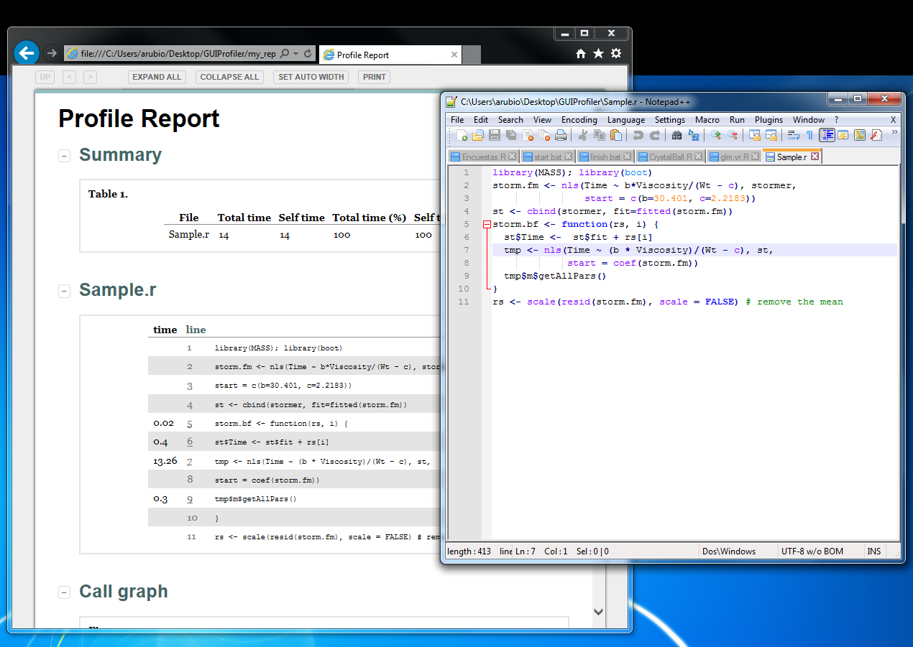
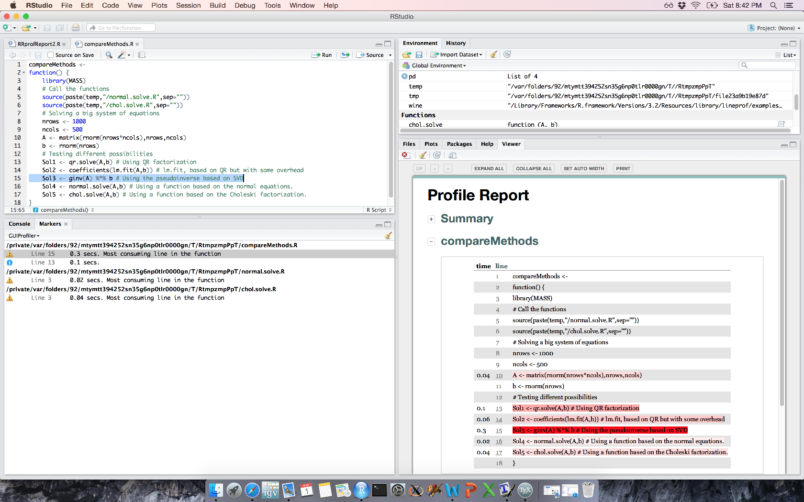
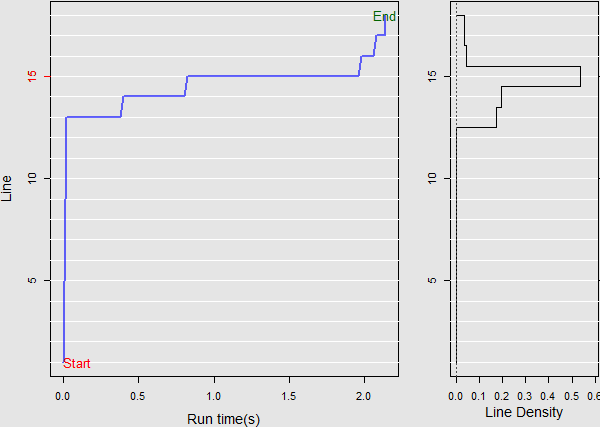
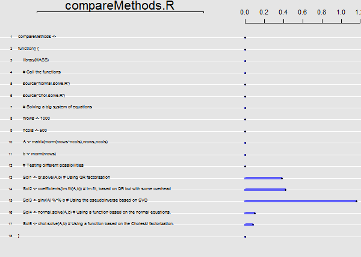
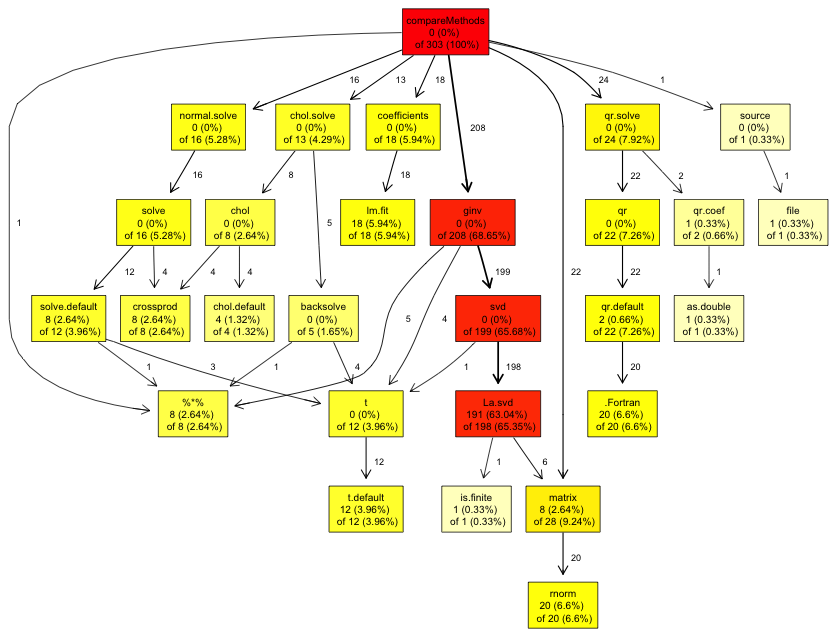
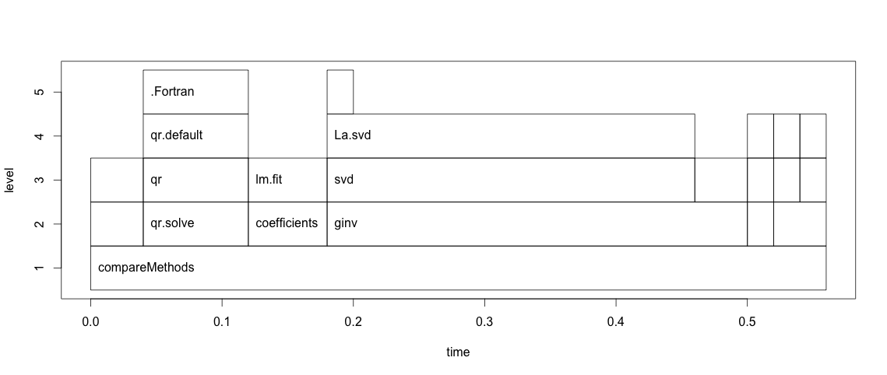
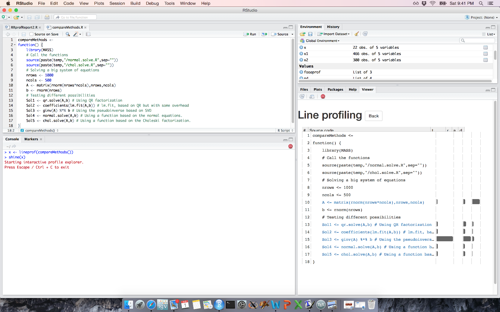

::: article
# Introduction

Software profiling is the analysis of a computer program performed by
measuring the time spent on each line of code, code coverage or memory
usage during its execution. Profiling is the first step towards
efficient programming. The development of efficient software depends on
identification of key bottlenecks. Focusing the optimization only on the
bottlenecks is known to maximize efficiency in both development time and
program runtime [@wilson2014best]. In interpreted languages (including
R) a few lines can form major bottlenecks. See for example
@visser2015speeding.

With the advent of data mining, data analytics and big data analysis,
code profiling is gaining prominence. In these fields, one potential
limitation to scientific advance is inefficient code. Since the factors
that affect the execution time are difficult to foresee beforehand, and
the bottlenecks (if the code is large) are especially difficult to
identify, the need of a profiling tool is apparent. In addition to that,
inefficient code is also prone to have bugs. Our experience is that
profiling is also an indirect way to fix errors in software.

The base distribution of R includes a profiling tool that consists of
the functions `Rprof` to start and stop the profiling and `summaryRprof`
as a parser of the output. The description of `Rprof` given in the help
file is: "Profiling works by writing out the call stack every interval
seconds (\...)". This means that R uses the operating system interrupts
to sample and write the call-stack (by default every 20 msecs).
Therefore, lines that take more than 20 msecs appear at least once in
the file written by the internal R profiler. On the other hand, a "fast"
line of code where the execution time is strictly less than 20 msecs may
or may not appear in the output file (with the probability of being
included proportional to its execution time). Therefore, the output of
profiling the same code is not identical for different runs. Overall it
can be noted that statistical profiling (i.e., the one implemented in R)
intrudes very little on the executed code (i.e., it almost does not
affect its execution time) and is considered to be an efficient way to
achieve proper profiling.

In previous versions of R (prior to 3.0), `Rprof` only worked at the
function level (i.e., the profiler only provided information on the
functions in the stack). Since version 3.0, it is possible to perform
line profiling. If the `line.profiling` option is selected, the file
generated by `Rprof` also includes information on the specific *line* of
code in the stack (not only the *function*). This extension made it
possible to identify the specific lines that slow down the code.

The output of `Rprof` is quite simple: a file that shows the name and
some other characteristics of a function every time it is found to be in
the stack. Despite this simplicity, it is necessary to parse this file
to understand the content and R provides the "`summaryRprof` function
(\...) that can be used to process the output file to produce a summary
of the usage" (from its help file).

The functionality of `summaryRprof` falls short in some aspects. If a
function is called several times, `summaryRprof` fails to identify the
specific function call that is slowing down the computation. As
functions can be nested in other functions, finding the true bottleneck
is not obvious. In `summaryRprof`, it is not possible to track the
hierarchy among the functions. `summaryRprof` was developed prior to the
`line.profiling` option and does not take full advantage of this
information. This fact will be shown in detail in the analysis of the
different profile tools below.

These limitations have fostered the development of other command line
functions and packages such as `proftable`,
[*aprof*](https://CRAN.R-project.org/package=aprof),
[*proftools*](https://CRAN.R-project.org/package=proftools),
[*profr*](https://CRAN.R-project.org/package=profr), and *lineprof*.
`proftable` [@proftable] is a convenient command line function that
parses the output of `Rprof` and shows the output in a reasonable and
intuitive way. *aprof* [@visser2015speeding] displays graphically the
time spent on each line of code and provides an estimate on how
optimizing a single line of code will affect the overall performance. It
also shows the output of memory profiling. *proftools* [@proftools]
includes useful command line tools to perform the profiling. Among other
functionalities, it shows a graph of the different hierarchical
relationships between the called functions. *lineprof* [@lineprof] can
be considered an evolution of *profr* [@profr] and is developed by the
same author. It is a profiling package that provides output integrated
in the RStudio environment. It shows a nice graphical output and also
includes memory profiling capabilities. In addition to these tools, the
*pbdPAPI* package [@pbdPAPI] offers access to low-level hardware counter
information and is mainly used for advanced profiling. On the other
hand, the most convenient package to test the performance of a single
line of code is
[*microbenchmark*](https://CRAN.R-project.org/package=microbenchmark)
[@microbenchmark]. It cannot be applied, though, to profile complex
code. To our knowledge, these are all the available tools to aid in R
profiling.

All these packages are, as most R packages, command line tools. Although
they represent an important advance if compared with the `summaryRprof`
function, none of them are especially user-friendly. In comparison,
MATLAB^TM^ [@MATLAB] provides a profiler that includes a convenient user
interface by means of an HTML report. Profiling MATLAB code is easy and
straightforward with the aid of its profile tool. An R profiler with
this convenient front-end that includes GUI capabilities would be highly
desirable.

Fortunately, the development of this tool is not such a challenging
task. Several packages such as
[*Nozzle.R1*](https://CRAN.R-project.org/package=Nozzle.R1) [@nozzle] or
[*knitr*](https://CRAN.R-project.org/package=knitr) [@knitr] are
available on CRAN that automatically generate HTML reports based on an
easy syntax.
[*GUIProfiler*](https://CRAN.R-project.org/package=GUIProfiler)
[@guiprofiler] is an R package that automatically generates an HTML
report that summarizes the profiling results. These reports are
generated with the aid of *Nozzle.R1*. Its integration in the RStudio
environment makes it especially user friendly.

The following sections show how to use package *GUIProfiler* as well as
provide a review on the profiling capabilities of the aforementioned
tools using the same sample code for all of them.

# Case study using *GUIProfiler*

The first lines of code are required for the installation of the
package. As *GUIProfiler* is hosted on CRAN, the installation is
straightforward:

``` r
install.packages("GUIProfiler")  
library("GUIProfiler")
```

If the package is properly installed, no errors should appear after
calling the `library` command. *GUIProfiler* has a practical limitation
that must be taken into account: The profiled code must be stored on an
accessible file. It is therefore better to run a `source` command
instead of writing the lines directly in the command line. The reason of
this limitation is that the report is based on the output from `Rprof`
and that it only includes information on the functions stored at files,
not from the script that calls them. In addition to that, it only
accepts one function per file. R does allow to include several functions
in a single file. We are currently working to circumvent this
limitation.

Here we present some sample code (included also in the *GUIProfiler*
documentation) that will be used with all the profiling tools. The HTML
report generated by package *GUIProfiler* is shown in
Figure [1](#Tablareport) and the code is,

``` r
temp <- tempdir()
# Definition of two functions
normal.solve <- function(A, b) {
	Output <- solve(crossprod(A), t(A) %*% b)
}
chol.solve <- function(A, b) {
	L <- chol(crossprod(A))
	Output1 <- backsolve(L, t(A) %*% b, transpose = TRUE)
	Output2 <- backsolve(L, Output1)
}
compareMethods <- function() {
	library(MASS)
	# Call the functions
	source(paste(temp, "/normal.solve.R", sep = ""))
	source(paste(temp, "/chol.solve.R", sep = ""))
	# Solving a big system of equations
	nrows <- 1000
	ncols <- 500
	A <- matrix(rnorm(nrows * ncols), nrows, ncols)
	b <- rnorm(nrows)
	# Testing different possibilities
	Sol1 <- qr.solve(A, b) 
	# Using QR factorization
	Sol2 <- coefficients(lm.fit(A, b)) 
	# lm.fit, based on QR but with some overhead
	Sol3 <- ginv(A) %*% b 
	# Using the pseudoinverse based on SVD
	Sol4 <- normal.solve(A, b) 
	# Using a function based on the normal equations.
	Sol5 <- chol.solve(A, b) 
	# Using Choleski factorization.
}
# Dump these functions to three different files
dump("normal.solve", file = paste(temp, "/normal.solve.R", sep = ""))
dump("chol.solve", file = paste(temp, "/chol.solve.R", sep = ""))
dump("compareMethods", file = paste(temp, "/compareMethods.R", sep = ""))
source(paste(temp, "/compareMethods.R", sep = ""))
```

This code implements the minimum squares solution of a linear system of
equations using different methods: QR factorization, the `lm.fit`
function (that internally also uses the QR factorization), computation
of a generalized pseudoinverse (that internally uses the SVD
factorization), using the normal equations and, finally, using the
Choleski factorization.The solutions using either of them are identical,
i.e., the vectors `Sol1`, `Sol2`, `Sol3`, `Sol4` and `Sol5` are
identical up to computer precision.

The lines to profile the code are only the last ones in the example code
of the `RRprofReport` function. Specifically,

``` r
# Profile the code
RRprofStart()
compareMethods()
RRprofStop()
RRprofReport()
```

{#Tablareport width="100%" alt="graphic without alt text"}

Each of these lines are self-explanatory. In the first line we activate
and start the *GUIProfiler*. The following line executes the function
that is being profiled. Once this line finishes, the profiling is
stopped and the last line generates the report based on the output of
the R profiler. In the RStudio environment, this report is shown in the
viewer pane. In addition, the markers pane indicates the lines of code
where more time was spent. It is possible to navigate through the source
code by simply clicking on the corresponding markers.

If the program is not executed in the RStudio environment,
`RRprofReport()` opens a new browser window. Figure [1](#Tablareport)
shows a snapshot of the generated report. The report consists of two
groups of tables: a summary of the called functions with the time spent
on each of them and a group of tables with the time spent on each line
of code for each function. A convenient feature, if the browser is the
Internet Explorer and Notepad++ is installed, is that the line numbers
of the functions are clickable: Once a line number is clicked, the
corresponding file is opened with the cursor on the selected line (as
shown in Figure [2](#Notepad)). On the right panel of
Figure [2](#Notepad), the layout of *GUIProfiler* is shown in the
RStudio environment. Note that RStudio version $\geq$ 0.99 is required.
We tested *GUIProfiler* on RStudio 0.99.467. The navigation across the
different functions can be done using the markers tab.

<figure id="Notepad">
<p></p>
<p>. <span id="Notepad" label="Notepad"></span></p>
<figcaption>Figure 2: Layout of <em>GUIProfiler</em>. Left: Internet
Explorer and Notepad++. Right: RStudio environment. The report is shown
in the viewer tab on the right, and the markers tab on the left can be
used to navigate across the code.</figcaption>
</figure>

# Comparison between different profiling tools

Using the same example, we compare the functionalities of the different
profiling tools in their ability to provide insight on the profiled
code. All the profiling tools (including *GUIProfiler*) manipulate the
file generated by `Rprof` to provide a more readable and useful output.
Therefore, most of the code to profile a function is shared by the
different packages: First of all there is a call to `Rprof` to start
profiling, the code itself to be profiled and a second call to `Rprof`
to stop profiling. The differences between them are the way the output
of `Rprof` is summarized and displayed.

Table [1](#comparison) shows a comparison between the functionalities of
`Rprof` parsers used to profile R code. The first column indicates if
the package generates an HTML report. The second column indicates if the
package generates some visual graphical output to show the results. The
"Function nesting" column shows whether the package is able to display
the hierarchy across the function calls. The "Line profiling" column
states whether the package provides information related with each of the
lines in the code, not only the functions (i.e., whether it takes
advantage of the `line.profiling` option). The "Memory profiling" column
states whether the package shows results of profiling memory usage and
finally, the "Connection with editors" column states whether the package
has a direct link with an editor to fix the potential bottlenecks.

We also included the features of the MATLAB profiler. As can be seen, it
offers all these functionalities. One anecdotal note of the MATLAB
profiler is that, even though it implements memory profiling (in a very
effective and user friendly manner), this feature is non-documented.
*summaryRprof*, *lineprof* and *aprof* implement memory profiling in R.
*lineprof* and *GUIProfiler* provide an HTML report. *GUIProfiler* is
the only one that provides a connection with editors.

::: {#comparison}
  ---------------- -------- ----------- ---------- ----------- ----------- --------------
                     HTML    Graphical   Function     Line       Memory      Connection

                    report    output     nesting    profiling   profiling   with editors

   *GUIProfiler*     $✓$        $✓$        $✓$         $✓$         $✗$        $✓$ (\*)

   *summaryRprof*    $✗$        $✗$        $✗$         $✓$       minimal        $✗$

    `proftable`      $✗$        $✗$        $✓$         $✓$         $✗$          $✗$

      *aprof*        $✗$        $✓$        $✓$         $✓$         $✓$          $✗$

    *proftools*      $✗$        $✓$        $✓$         $✗$         $✗$          $✗$

      *profr*        $✗$        $✓$        $✓$         $✗$         $✗$          $✗$

     *lineprof*      $✓$        $✓$        $✓$         $✓$         $✓$          $✗$

       MATLAB        $✓$        $✓$        $✓$         $✓$      $✓$(\*\*)       $✓$
  ---------------- -------- ----------- ---------- ----------- ----------- --------------

  : Table 1: Comparison of different profile tools for R. (\*)
  *GUIProfiler* connects the results with RStudio and with the Notepad++
  editor. (\*\*) Non-documented characteristic.
:::

::: {#Dependencies}
  ------------------------------------------------------------------------------------------------------------------------------------------------
  Tool             Dependencies
  ---------------- -------------------------------------------------------------------------------------------------------------------------------
  *GUIProfiler*    *Nozzle.R1*, [*Rgraphviz*](https://www.bioconductor.org/packages/release/bioc/html/Rgraphviz.html) [@Rgraphviz],

                   [*graph*](https://www.bioconductor.org/packages/release/bioc/html/graph.html) [@graph], *proftools*

  *summaryRprof*   None

  `proftable`      None

  *aprof*          *grDevices*

  *proftools*      *Rgraphviz*, *graph*

  *profr*          [*stringr*](https://CRAN.R-project.org/package=stringr) [@stringr], [*plyr*](https://CRAN.R-project.org/package=plyr) [@plyr]

  *lineprof*       [*devtools*](https://CRAN.R-project.org/package=devtools) [installation; @devtools1],

                   environment (C compiler),

                   [*shiny*](https://CRAN.R-project.org/package=shiny) [@shiny and its dependencies]
  ------------------------------------------------------------------------------------------------------------------------------------------------

  : Table 2: Dependencies of the packages analyzed. Only packages not
  included in the standard distribution are mentioned.
:::

We include Table [2](#Dependencies) to show the dependencies for each of
the packages. As a general rule, packages with few dependencies are
easier to install and to run in different conditions (i.e. on a server
enviroment). The following sections describe how to profile the example
using the tools shown in Table [1](#comparison).

## *summaryRprof*

The code to perform the profiling of the example using *summaryRprof*
is:

``` r
Rprof(tmp <- tempfile(), line.profiling = TRUE)
compareMethods()
Rprof(append = FALSE)
summaryRprof(tmp)
unlink(tmp)
```

and the output,

``` r
$by.self
self.time self.pct total.time total.pct
"La.svd"             0.80    40.82       0.80     40.82
".Call"              0.40    20.41       0.40     20.41
".Fortran"           0.38    19.39       0.38     19.39
"crossprod"          0.12     6.12       0.12      6.12
".External"          0.10     5.10       0.10      5.10
"%*%"                0.08     4.08       0.08      4.08
...More lines not included...

$by.total
total.time total.pct self.time self.pct
"compareMethods"       1.96    100.00      0.00     0.00
"ginv"                 0.90     45.92      0.00     0.00
"svd"                  0.82     41.84      0.02     1.02
"La.svd"               0.80     40.82      0.80    40.82
".Call"                0.40     20.41      0.40    20.41
"coefficients"         0.40     20.41      0.00     0.00
"lm.fit"               0.40     20.41      0.00     0.00
".Fortran"             0.38     19.39      0.38    19.39
"qr"                   0.38     19.39      0.00     0.00
...More lines not included...

$sample.interval
[1] 0.02

$sampling.time
[1] 1.96
```

If we focus on the `"by.self"` part, the information is not too useful:
the `.Call` or `.Fortran` functions can be used anywhere and depending
on their argument, their behavior is completely different. On the other
hand, the `crossprod` function is used many times in the code and the
table only shows the overall time spent on it. Although the
`line.profiling` option was set, line information does not appear
anywhere in the output. The latest version of R (by setting
`summaryRprof(tmp, lines = "show")`) provides basic information on line
profiling.

The `"by.total"` part states that the most costly functions are `ginv`,
`svd` and `La.svd`. However, these functions are in fact all the same:
`ginv` calls `svd` that, in turn, calls `La.svd`. The output does not
show this hierarchy in the calls to the function. In addition, the
`summaryRprof` output does not show locations of the calls to the
corresponding functions within the code. The output presents therefore
serious limitations for its practical use that can be solved with other
tools described below.

## `proftable`

`proftable` is a convenient function that solves some of the
aforementioned problems of *summaryRprof*: Each line of code is clearly
identified and can be easily tracked. The function can be accessed from
GitHub. The code to run the example is:

``` r
Rprof(tmp <- tempfile(), line.profiling = TRUE)
compareMethods()
Rprof(append = FALSE)
source("https://raw.githubusercontent.com/noamross/noamtools/master/R/proftable.R")
proftable(tmp)
```

And the output,

``` r
PctTime Call                                                                         
36.364  compareMethods > 1#15 > ginv > svd > La.svd                                  
20.000  compareMethods > 1#14 > coefficients > lm.fit > .Call                        
19.091  compareMethods > 1#13 > qr.solve > qr > qr.default > .Fortran                
4.545  compareMethods > 1#15 > ginv > %*%                                           
3.636  compareMethods > 1#10 > matrix > rnorm > .External                           
2.727  compareMethods > 1#15 > ginv > svd > La.svd > matrix                         
2.727  compareMethods > 1#16 > normal.solve > 2#3 > solve > crossprod               
2.727  compareMethods > 1#16 > normal.solve > 2#3 > solve > solve.default           
1.818  compareMethods > 1#17 > chol.solve > 3#3 > chol > crossprod                  
0.909  C:\\Some directories...\\chol.solve.R > 3: > #File

#File 1: C:\Users\arubio\AppData\Local\Temp\RtmpEH6kiO/compareMethods.R
#File 2: C:\Users\arubio\AppData\Local\Temp\RtmpEH6kiO/normal.solve.R
#File 3: C:\Users\arubio\AppData\Local\Temp\RtmpEH6kiO/chol.solve.R

Parent Call: None

Total Time: 2.2 seconds
Percent of run time represented: 94.5 %
```

In this case the hierarchical relationships between `ginv`, `svd` and
`La.svd` (as well as other ones) are clearly stated. Each line of code
may appear several times. This "excess" of information can be useful to
identify within each line of code which is the most costly part.
However, it is also confusing. For example, line 15 of the first archive
appears several times in the list since `svd` and matrix multiplication
(both inside the `ginv` function) are costly operations.

`proftable` includes the location of each line in each file, making
their analysis within a context easier. `proftable` is a simple, yet
very useful tool.

## *aprof*

*aprof* also works with the output of `Rprof` and provides visual aids
based on line profiling. It helps to identify the most promising
sections of code to optimize. One interesting unique functionality is
that *aprof* also projects the potential gains. The last version has
also memory profiling included. The code to run *aprof* is:

``` r
library(aprof)
Rprof(tmp <- tempfile(), line.profiling = TRUE)
compareMethods()
Rprof(append = FALSE)
fooaprof <- aprof(paste(temp, "/compareMethods.R", sep = ""), tmp)
plot(fooaprof)
profileplot(fooaprof)
summary(fooaprof)
```

<figure id="aprof">
<p></p>
<p>. <span id="aprof" label="aprof"></span></p>
<figcaption>Figure 3: Output generated by <code>profileplot</code> of an
‘<code>aprof</code>’ object. Left panel: accumulated time and time spent
on each line of code. Right: content for each line of code and the spent
on each of them.</figcaption>
</figure>

Running the provided code in *aprof* generates nice plots that describe
the time spent on each line of code (and the code itself).
Figure [3](#aprof) shows the *aprof* output. The summary function
estimates the speed-up by optimizing a single line of code (or all the
lines of code). The output to the console is:

``` r
Largest attainable speed-up factor for the entire program

        when 1 line is sped-up with factor (S): 

	 Speed up factor (S) of a line 
             1     2     4     8     16    S -> Inf**
Line*: 15 :  1.00  1.40  1.75  2.00  2.15  2.33      
Line*: 13 :  1.00  1.06  1.10  1.12  1.13  1.14      
Line*: 14 :  1.00  1.06  1.10  1.12  1.13  1.14      
Line*: 16 :  1.00  1.03  1.05  1.06  1.06  1.07      
Line*: 17 :  1.00  1.03  1.05  1.06  1.06  1.07      
Line*: 10 :  1.00  1.01  1.02  1.02  1.02  1.02      

Lowest attainable execution time for the entire program when

             lines are sped-up with factor (S):

	 Speed up factor (S) of a line  
             1      2      4      8      16   
All lines    2.840  1.420  0.710  0.355  0.178
Line*: 15 :  2.840  2.030  1.625  1.423  1.321
Line*: 13 :  2.840  2.670  2.585  2.543  2.521
Line*: 14 :  2.840  2.670  2.585  2.543  2.521
Line*: 16 :  2.840  2.750  2.705  2.683  2.671
Line*: 17 :  2.840  2.750  2.705  2.683  2.671
Line*: 10 :  2.840  2.810  2.795  2.788  2.784

    Total sampling time:  2.84  seconds
 *  Expected improvement at current scaling
 ** Asymtotic max. improvement at current scaling
```

The line of code `fooaprof <- aprof("myfile.R..."` can be run for each
of the files to get the profiling of all the executed functions. In this
case it can be done by,

``` r
compareaprof <- aprof(paste(temp, "/compareMethods.R", sep = ""), tmp)
plot(compareaprof)
profileplot(compareaprof)
compareaprof <- aprof(paste(temp, "/normal.solve.R", sep = ""), tmp)
plot(compareaprof)
profileplot(compareaprof)
compareaprof <- aprof(paste(temp, "/chol.solve.R", sep = ""), tmp)
plot(compareaprof)
profileplot(compareaprof)
```

Alternatively, if the user wants to go into more detail for each of the
functions, `targetedSummary` can be used to disentangle nested
functions.

The information provided by *aprof* and *GUIProfiler* is very similar:
*aprof* provides the output as an image and *GUIProfiler* as an HTML
report.

## *proftools*

*proftools* provides tools for examining `Rprof` profile output. It
shows graphically the dependencies among the different functions and the
time spent on each of them. The code to profile the example is:

``` r
library(proftools)
Rprof(tmp <- tempfile(), line.profiling = TRUE)
compareMethods()
Rprof(append = FALSE)
pd <- readProfileData(tmp)
plotProfileCallGraph(pd, style = google.style, score = "total", nodeSizeScore = "none")
```

{#proftools
width="100%" alt="graphic without alt text"}

The user can get this information in the console by using the function
`printProfileCallGraph`. The corresponding output is for this example:

``` r
Call graph
index    % time     % self   % children     name
[1]      100.00       0.00     100.00     compareMethods [1]    
1.06       0.00         %*% [15] 
0.00       2.13         chol.solve [19] 
0.00      21.28         coefficients [8] 
0.00      43.62         ginv [2] 
0.00       6.38         matrix [13] 
0.00       3.19         normal.solve [16] 
0.00      22.34         qr.solve [6] 
-----------------------------------------------
0.00      43.62         compareMethods [1] 
[2]       43.62       0.00      43.62     ginv [2]    
4.26       0.00         %*% [15] 
0.00      39.36         svd [4] 
-----------------------------------------------
39.36       0.00         svd [4] 
[3]       39.36      39.36       0.00     La.svd [3]    
-----------------------------------------------
0.00      39.36         ginv [2] 
[4]       39.36       0.00      39.36     svd [4]    
39.36       0.00         La.svd [3] 
-----------------------------------------------
21.28       0.00         qr.default [11] 
1.06       0.00         qr.coef [23] 
[5]       22.34      22.34       0.00     .Fortran [5]    
-----------------------------------------------
0.00      22.34         compareMethods [1] 
[6]       22.34       0.00      22.34     qr.solve [6]    
0.00      21.28         qr [10] 
0.00       1.06         qr.coef [23] 
-----------------------------------------------
21.28       0.00         lm.fit [9] 
[7]       21.28      21.28       0.00     .Call [7]    
-----------------------------------------------
... Additional lines not shown here...
```

Figure [4](#proftools) shows the dependencies between the different
functions. Probably, this tool provides the most intuitive
representation of the different relationships among the functions in the
code. We have taken advantage of this in *GUIProfiler* and this graph is
also included in the generated report.

*proftools* is, however, "function based" and the `line.profiling`
option is not used at all. In fact, if `Rprof` is used without the
`line.profiling` option, the result is identical.

## *profr*

*profr* is one of the oldest packages to parse the `Rprof` output. The
first version appeared in May, 2008. Its usage, as for the other tools
described here, is straightforward:

``` r
library(profr)
profcompareMethods <- profr(compareMethods())
head(profcompareMethods)
plot(profcompareMethods)
```

The output provided by *profr* is the following:

``` r
   level g_id t_id              f start  end n  leaf time     source
8      1    1    1 compareMethods  0.00 0.76 1 FALSE 0.76 .GlobalEnv
9      2    1    1         matrix  0.00 0.08 1 FALSE 0.08       base
10     2    2    1       qr.solve  0.08 0.20 1 FALSE 0.12       base
11     2    3    1   coefficients  0.20 0.26 1 FALSE 0.06      stats
12     2    4    1           ginv  0.26 0.66 1 FALSE 0.40       MASS
13     2    5    1   normal.solve  0.66 0.74 1 FALSE 0.08 .GlobalEnv
```

There is a useful plot command that shows the time spent on each
function. In turn, the functions are grouped by levels. The output is
shown in Figure [5](#profr).

*profr* was (with `summaryRprof`) the first attempt to display the
result of profiling R code. It was developed before `line.profiling` was
available and does not make use of it. The graphical representation is
much more informative than the text output. However, although the
hierarchical tree of *proftools* and the graph shown in *profr* show
basically the same information, in our opinion, the tree is more
visually apparent and attracts attention directly to the bottlenecks of
the code.

{#profr width="100%" alt="graphic without alt text"}

## *lineprof*

*lineprof* can be considered as an evolution of *profr* (both have the
same developer and maintainer). Although it is not yet on CRAN, the
installation from GitHub is straightforward.

``` r
install.packages("devtools")
library(devtools)
devtools::install_github("hadley/lineprof")
```

*lineprof* presents some characteristics that make it unique: It is
integrated in the RStudio environment using the *shiny* package, it
provides memory profiling out of the box and finally, using the *shiny*
environment it is possible to navigate across the different functions to
find out the bottlenecks in the code. The application to the example is
also straightforward:

``` r
library(lineprof)
x <- lineprof(compareMethods())
shine(x)
```

The resulting figure shows the output in the viewer pane in RStudio. The
code for each function is shown there. The blue lines of code are
hyperlinks to the corresponding functions. The last column represents
the memory spent on each line of code. It can be seen that the creation
of the 1000 $\times$ 500 matrix is the most expensive line of code in
terms of memory use.

We experienced some minor issues when using *lineprof* that are worth
mentioning. The representation in RStudio is a little bit buggy: The
columns for each of the results (time spent, memory used, etc) are not
properly shown. The navigation across the functions, although very
intuitive, does not link directly to the RStudio editor to work on the
code. Finally, when working on the *shiny* environment, the console
appears to be busy and the user has to break it using Ctrl-C or Esc. We
expect that most of these minor problems will be fixed in the stable
release.

{#lineprof width="100%" alt="graphic without alt text"}

# Discussion and conclusion

This paper describes *GUIProfiler*, a graphical user interface to the
line profiler provided by R and reviews, in relation to *GUIProfiler*,
all other available profiling packages. Based on an example, we
presented how to profile this code using the different packages and
compared their advantages and disadvantages.

This review shows that, in spite of being far from the intuitiveness and
user friendliness of the MATLAB profiler, the different developed tools
are getting closer to it. For example, the graphical display of the
relationship between functions in *proftools* is useful and intuitive
and MATLAB does not provide anything like it. *lineprof* allows the
navigation across the different functions very much like MATLAB's
profiler does.

Regarding the described tools, `proftable`, *profr* and *proftools* are
comparable. `proftable` provides an abstract on the time spent on each
line of the code that is clearer and more useful than the one from
`summaryRprof`. *profr* and *proftools* show graphically the
relationships between the different profiled functions and the time
spent on each of them. Unfortunately, neither of them provide profiling
at the line level.

The other group is formed by *aprof*, *lineprof* and *GUIProfiler*. All
of them provide similar information: time spent on each line of code
stating the actual code of the line. There are also some differences
among them. *aprof* shows these results using plots and provides
estimates of the expected improvements when speeding up the most costly
lines of code. *lineprof* displays these results using the *shiny*
environment. Both *lineprof* and *aprof* provide memory profiling.
*GUIProfiler*, on the other hand, builds an HTML report which is
interactively linked with the program code. The preference between both
tools may be a question of taste, but in our opinion, the HTML report is
more advantageous.

We would like to note that there might be other characteristics which
could be taken into account when evaluating a profiling tool such as
those considered in this paper. For example, we assumed that graphical
output is something desirable. However, this is not the case if the
profiled code is run on a server with no graphical capabilities. In the
case of *lineprof*, for example, a runtime environment is required to
compile it as well as package *shiny* and several other dependencies.
Although these dependencies are not of concern when R is run on a
personal computer, they can be problematic if the software is running on
a server.

*GUIProfiler* has a convenient characteristic that is missing in the
other packages: It connects the profiling tool with an editor to fix the
bottlenecks. In the RStudio environment the navigation across the
markers pane directly opens the editor on the clicked line of code. If R
is used outside of the RStudio environment, *GUIProfiler* opens
Notepad++ when clicking on the number of the line. This functionality is
browser dependent and, at present, it is only implemented for the
Internet Explorer (and thus the Windows OS) by using ActiveX controls.
However, we assume that most of the users will use the RStudio
environment where the connection with an external editor is not
necessary. Finally we would like to emphasize that *GUIProfiler* is a
useful tool that interactively and graphically helps the users in the
difficult task of profiling.

# Acknowledgments

This work was partially supported by the Spanish Minister of Science and
Innovation with project "Sanscript" IPT-2012-0093-010000. This funding
is gratefully acknowledged.

:::
