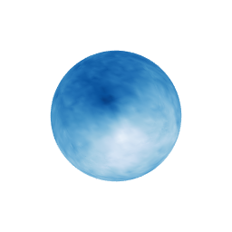

::: article
# Introduction

Rough phenomena arise in texture simulations for image processing or
medical imaging, natural scenes simulations (clouds, mountains) and
geophysical morphology modeling, financial mathematics, ethernet
traffic, *etc.* Some are time-indexed, some others, like texture or
natural scene simulations, should be indexed by subsets of the Euclidean
spaces $\mathbb{R}^2$ or $\mathbb{R}^3$. Recent data (as the Cosmic
Microwave Background or solar data) are even indexed by a manifold.

The fractional Brownian motion (fBm), introduced by [@KOL] (and
developed by @mandel) is nowadays widely used to model this roughness.
Fractional Brownian motions have been extended in many directions:
higher dimensions with fields, anisotropy, multifractionality, *etc.*
This paper is devoted to a simulation method for [conditional Gaussian
fields]{style="color: black"}. This could improve, in the future,
natural scene simulations by fixing for instance the valleys.

The simulation of fractional Gaussian processes is not difficult in
dimension one (see a review of @Coe00). Let us recall the numerical
complexity of some classical methods: the Cholesky method has a
complexity of $O(N^3)$ where $N$ is the size of the simulated sample
path. For specific stationary processes (on a regular grid) the
Levinson's algorithm has a complexity of $O(N^2 \log N)$ and the Wood
and Chan algorithm (see @fGnsim2) a complexity of $O(N \log N)$.

In higher dimensions, the Wood and Chan method has been extended to
stationary increments fields with the Stein's method [@stein] ; the
fractional Brownian field can therefore be simulated on a regular grid
of the plane. For general Gaussian fields on a general discrete grid,
the Cholesky method is costly and exact simulations are no longer
tractable. Approximate methods have been intensively developed
(midpoint, @Pei88; turning bands, @yin; truncated wavelet decomposition)
but for specific fields. [On manifolds, simulation procedures based on
truncated series of eigenfunctions of the Laplace-Beltrami operator are
discussed in [@Gel14v2]]{style="color: black"}.

Our approach, presented in @Bro07 [@BLI10], is based on a 2-steps method
with an exact simulation step plus a refined fast step, that is an
improvement of the midpoint method. It has been implemented in the
[*FieldSim*](https://CRAN.R-project.org/package=FieldSim) package
[@FieldSim]. The fieldsim simulation method can be applied to general
Gaussian processes on general simulation grids (regular and non regular)
on Euclidean spaces and even on some manifolds (see Figure [1](#fig1)).
It is worth mentioning that another package,
[*RandomFields*](https://CRAN.R-project.org/package=RandomFields)
[@RandomFields], allows the simulation of a large class of random fields
such as Gaussian random fields, Poisson fields, binary fields,
chi-square fields, $t$ fields and max-stable fields (see @Sch15). In
*RandomFields*, conditional random fields (which are the purpose of the
present paper) are given for a wide range of spatial and spatio-temporal
Gaussian random fields. Some of the default models of the *FieldSim*
package cannot be simulated with the help of default models of the
*RandomFields* package. Nevertheless, it is still possible to simulate
them with the `RMuser()` and `RFsimulate()` commands of the
*RandomFields* package. It may be noted that the *FieldSim* package does
not allow for the simulation of more than the *RandomFields* package.
*FieldSim* package is an alternative in which the underlying methods of
simulation are generic.

<figure id="fig1">
<p></p>
<figcaption>Figure 1: On the left: fractional Brownian field (top-left),
multifractional Brownian field (bottom-left), fractional Brownian sheet
(top-right) and hyperbolic fractional Brownian field (bottom-right); on
the right: fractional Brownian field on the sphere.</figcaption>
</figure>

We propose here to adapt [the *FieldSim* package]{style="color: black"}
to [conditional simulations]{style="color: black"}. Definitions and
[notation]{style="color: black"} will be introduced in the following
section with the "process" class, the `setProcess` procedure and the
`fieldsim` procedure. The `fieldsim` procedure adapted to [conditional
Gaussian fields]{style="color: black"} is described in the next section.
Simulations with the package *FieldSim* are presented in the last
section.

# Notation and preliminaries {#sec:def}

## Fractional Gaussian fields

Let $d$ be a positive integer and $X(\cdot)=\left\{X(M),M\in
  \mathbb{R} ^d\right\}$ be a real valued non stationary field with zero
mean and second order moments. It is worth emphasizing that we consider
in this paper the metric space $\mathbb{R}^d$ with the Euclidean norm
but the method can be generalized to a smooth and complete Riemannian
manifold equipped with its geodesic distance [@BLI10].

The covariance function $R(\cdot,\cdot)$ is defined by:
$$R(M_1,M_2)= \mbox{cov} \left( X(M_1),
X(M_2)\right),\quad M_1,\; M_2\in\mathbb{R} ^d.$$ This function is
nonnegative definite (n.n.d.)[.]{style="color: black"} Conversely, for
any n.n.d. function $R(\cdot,\cdot)$, there exists an unique centered
Gaussian field of second order structure given by $R(\cdot,\cdot).$

Different classical fractional Gaussian fields have been simulated to
illustrate the *FieldSim* package in [@Bro07; @BLI10]. In the sequel,
$M$ and $M'$ are two points of $\mathbb{R}^d$ and $\|\cdot\|$ is the
usual norm on $\mathbb{R}^d,$ $d=1,$ $2$. We can cite:

1.  The standard fractional Brownian fields are defined through their
    covariance function (e.g., @SATA): $$R(M,M')=\frac 1 2
    \left( \|M\|^{2H}+\|M'\|^{2H}-\|M-M'\|^{2H}\right),$$ where the
    Hurst parameter $H$ is real in $(0,1)$.

2.  The standard multifractional Brownian fields are defined through
    their covariance function (see @pv [@bjr]): 
    
    $$R(M,M')=\alpha(M,M') \left( \|M\|^{\tilde{H}(M,M')}+\|M'\|^{\tilde{H}(M,M')}
    -\|M-M'\|^{\tilde{H}(M,M')}\right),$$ where $$\begin{aligned}
    \tilde{H}(M,M') &=H(M)+H(M'),\\
    \alpha(M,M') &= \frac{C\left( \frac{H(M)+H(M')}{2} \right)^2}{2C\left(H(M)
    \right)C\left(
    H(M')\right)},\\
    C(h) &=
    \left(\frac{\pi^{\frac{d+1}{2}}\Gamma\left(h+\frac{1}{2}\right)}{h\sin
    \left(\pi h \right)\Gamma\left( 2h\right)\Gamma\left(h+\frac{d}{2}
    \right) } \right)^{\frac{1}{2}}, 
    \end{aligned}$$ and the Hurst parameter is a continuous function
    $H:\mathbb{R}^d \longrightarrow (0,1),$ where $\Gamma$ is the usual
    Gamma function.

3.  The standard fractional Brownian sheets are defined through their
    covariance function (see @kam):
    $$R(M,M')=\frac{1}{2^d} \prod_{i=1}^d
    \left\{|M_{i}|^{2H_i}+|M'_{i}|^{2H_i}-|M_{i}-M'_{i}|^{2H_i}\right\},$$
    where $\left(H_1,\ldots,H_d\right)$ stands for the multivariate
    Hurst index in $\mathbb{R}^d$, $0<H_i< 1.$

4.  The anisotropic fractional Brownian fields are defined through their
    covariance function (see @CBFA):
    $$R(M,M') = v_H (M) + v_H(M') - v_H (M- M'),$$ where the variogram
    $$v_H(x)= 2^{2H-1}\gamma(H) C_{H,\vartheta_1,\vartheta_2} (x) \| x \|^{2H},$$
    with $H \in(0,1)$, $\gamma(H)$ depends explicitly on $H$ and
    $C_{H,\vartheta_1,\vartheta_2}(.)$ implies incomplete Beta functions
    and two constants
    $-\frac{\pi}{2} \leq \vartheta_1 < \vartheta_2 \leq
    \frac{\pi}{2}$.

## The *FieldSim* package

In the new version 3.2 of the package *FieldSim*, new features have been
added. The most important add is the "process" class and the
`setProcess` function.

An object of class "process" has different slots:

-   The `name` of the process. Several names are reserved for classical
    fractional Gaussian processes: see Table [1](#process) for details.
    `"cond"` is used for all kind of [conditional
    simulations]{style="color: black"} (see further).

-   The slot `values` stores the values of the process on the simulation
    (and visualization) grid.

-   An object of class "manifold" which is the Riemannian manifold on
    which the process is lying; an object of the class "manifold" has
    four slots:

    -   `name` which is the name of the manifold we consider. The name
        `"line"`, `"plane"`, `"sphere"` and `"hyperboloid"` are taken
        for the eponymous manifolds.

    -   `atlas` which [is]{style="color: black"} the union of
        discretized domains that [cover]{style="color: black"} the
        manifold (must be a matrix where the number of rows is the
        dimension of the space where the manifold lives).

    -   `distance` which is the distance considered on the manifold.

    -   `origin` which is the origin considered on the manifold (must be
        a point on the manifold).

    The setter `setManifold` permits the user to create an object of
    class "manifold" with all its slots. This class is already described
    in @BLI10.

-   The slot `covf` [which]{style="color: black"} contains the
    covariance function of the Gaussian [process]{style="color: black"}.

-   The slot `parameter` [which]{style="color: black"} contains all the
    parameters associated to the covariance function of the process.
    Here are the classical parameter[s]{style="color: black"} associated
    to the classical [process]{style="color: black"}.

All the examples presented can be defined with the `setProcess` command
(see Table [1](#process)). With the following command, the user can set
a fBm with Hurst parameter 0.7 on a regular grid of the interval $[0,1]$
(of size 256).

``` r
R> linefBm <- setProcess("fBm-line", 0.7)
R> str(linefBm)
```

``` r
Formal class 'process' [package "FieldSim"] with 7 slots
  ..@ name     : chr "fBm"
  ..@ values   : num 0
  ..@ manifold :Formal class 'manifold' [package "FieldSim"] with 4 slots
  .. .. ..@ name    : chr "line"
  .. .. ..@ atlas   : num [1, 1:256] 0 0.00392 0.00784 0.01176 0.01569 ...
  .. .. ..@ distance:function (xi, xj)  
  .. .. ..@ origin  : num [1, 1] 0
  ..@ covf     :function (xi, xj)  
  ..@ parameter: num 0.7
  ..@ values2  : num 0
  ..@ manifold2:Formal class 'manifold' [package "FieldSim"] with 4 slots
  .. .. ..@ name    : chr "line"
  .. .. ..@ atlas   : num [1, 1:256] 0 0.00392 0.00784 0.01176 0.01569 ...
  .. .. ..@ distance:function (xi, xj)  
  .. .. ..@ origin  : num [1, 1] 0
```

It is worth mentioning that the slot `values` is empty since there is no
simulation done. Then as usual, the user can use the `fieldsim` function
in order to simulate the Gaussian process associated to `covf` on the
manifold grid defined in `manifold`.

``` r
R> fieldsim(linefBm)
```

In the `fieldsim` function, we can add the quantity `Ne`, the number of
points of the grid to be simulated in the exact step, and `nbNeighbor`,
the number of neighbors used in the refined step. By default, `Ne` is
equal to the size of the grid given in `atlas`. The slot `values` are
now set with the simulated values. There exist different visualization
procedures to draw the results, for instance:

``` r
R> plot(linefbm, "default")
```

We recall that the discretization grids can be modified with the
`setAtlas` command. Depending on the manifold, there are several types
of grids: `"regular"`, `"random"` and `"visualization"`. For instance,

``` r
R> setAtlas(linefBm, "regular", 1000)
R> fieldsim(linefBm)
R> plot(linefBm, "default")
```

# The `fieldsim` procedure for [conditional Gaussian fields]{style="color: black"} {#sec:fieldsim}

In order to build [conditional fractional Gaussian
fields]{style="color: black"}, we consider a conditioning set
${\cal N}= \left\{N_1,
  \ldots,\right.$ $\left. N_k \right\},$ $N_i\in \mathbb{R} ^d,$
$i=1,\ldots,k,$ and the conditioning values $\mathbf x=\left(x_1,
  \ldots, x_k\right)^T \in \mathbb{R}^k$. Then we will say that
$\widetilde{X}(\cdot)=\{\widetilde{X}(M),M\in \mathbb{R} ^d\}$ is the
[conditional Gaussian field]{style="color: black"} associated to the
field $X(\cdot)$ (of covariance function $R$) and to the conditioning
pair $\left({\cal N},\mathbf x\right)$ if the finite dimensional laws of
$\widetilde{X}(\cdot)$ is the same as the finite dimensional laws of
$X(\cdot)$ given the event $\{(X(N_1), \ldots, X(N_k))^T=:\mathbf
X_{\cal N} =\mathbf x\}$. We denote by $\widetilde{m}(\cdot)$
(resp. $\widetilde{R}(\cdot,\cdot)$) the mean (resp. covariance)
function of the process $\widetilde{X}(\cdot)$. The following lemma
allows us to determine $\widetilde{m}(\cdot)$ and
$\widetilde{R}(\cdot,\cdot)$ according to ${R}(\cdot,\cdot)$ (sketch of
proof is given in [@DACa [Section A.1]]{style="color: black"}).

::: {#lemma1 .Lemma}
**Lemma 1**. *Let us consider the centered Gaussian vector
$\left(Y_1,Y_2,\mathbf
    Z^T\right)^T\in \mathbb{R}\times\mathbb{R}\times \mathbb{R}^k$ with
the covariance matrix
$$\Sigma^2= \begin{pmatrix}  {\mathbb{E}}  (Y_1^2) & {\mathbb{E}} (Y_1 Y_2) & {\mathbb{E}} (Y_1 \mathbf Z^T) \\
{\mathbb{E}} (Y_1 Y_2) &   {\mathbb{E}}  (Y_2^2)  & {\mathbb{E}}  (Y_2 \mathbf Z^T) \\
{\mathbb{E}}  (\mathbf Z Y_1)  & 
 {\mathbb{E}}  (\mathbf Z Y_2)& {\mathbb{E}}  (\mathbf Z \mathbf Z^T)
\end{pmatrix}.$$ 
Suppose that ${\mathbb{E}}  (\mathbf Z \mathbf Z^T)$ is
invertible. Then the conditional law of $(Y_1,Y_2)^T$ given the event
$\{\mathbf Z=\mathbf z \in \mathbb{R}^k\}$ is Gaussian with mean

$$\widetilde{m} =  \begin{pmatrix} {\mathbb{E}} (Y_1 \mathbf Z^T) \\ {\mathbb{E}} (Y_2 \mathbf Z^T) \end{pmatrix}  \{{\mathbb{E}}  (\mathbf Z \mathbf Z^T)\}^{-1} \mathbf z,    
(\#eq:m)  $$
and covariance matrix
$$\label{eq:V}  \widetilde{\Sigma}^2= \begin{pmatrix}   {\mathbb{E}}  (Y_1^2) &   {\mathbb{E}} (Y_1Y_2) \\
 {\mathbb{E}} (Y_1Y_2)  &  {\mathbb{E}}  (Y_2^2) \end{pmatrix} -  \begin{pmatrix} {\mathbb{E}} (Y_1 \mathbf Z^T) \\ {\mathbb{E}} (Y_2 \mathbf Z^T) \end{pmatrix}  \{{\mathbb{E}}  (\mathbf Z \mathbf Z^T)\}^{-1}  \begin{pmatrix} {\mathbb{E}}  (\mathbf Z Y_1)  & 
 {\mathbb{E}}  (\mathbf Z Y_2)
\end{pmatrix}.  (\#eq:V)  $$
:::

In the Gaussian field context, Lemma [1](#lemma1) allows us to write
down an explicit expression of the mean function and the autocovariance
function of the [conditional Gaussian field]{style="color: black"}
associated to $R(\cdot,\cdot)$ and to $({\cal N},\mathbf x)$. Let us put
$Y_1=X(M_1)$ and $Y_2=X(M_2)$ the values of the field $X(\cdot)$ at
points $M_1 \in \mathbb{R}^d$ and $M_2 \in
\mathbb{R}^d$ respectively, and $\mathbf Z=\mathbf X_{\cal N} \in
\mathbb{R}^k$. Therefore, all quantities in \@ref(eq:m) and \@ref(eq:V)
can be expressed in terms of the autocovariance function $R$. Precisely,
$${\mathbb{E}} (Y_i Y_j) = R(M_i, M_j), \quad (i,j) \in \{1,2\}^2,$$ and
$${\mathbb{E}} (Y_i\mathbf Z_\ell) = R(M_i, N_\ell), \quad i \in \{1,2\},  \quad \ell =1,\ldots,k.$$
Consequently, the mean function of the [conditional Gaussian
field]{style="color: black"} is given by 

$$\label{eq:mean}
\widetilde{m}(M)= {\mathbb{E}} (X(M)  \mathbf X_{\cal N}^T)\{{\mathbb{E}}  (\mathbf X_{\cal N} \mathbf X_{\cal N}^T)\}^{-1} \mathbf x,\quad M\in\mathbb{R} ^d.  (\#eq:mean)  $$

Then the autocovariance function of a [conditional Gaussian
field]{style="color: black"} (using the $(1, 2)$-coordinate of
Equation \@ref(eq:V)) is given by 
$$\label{eq:var}
\widetilde{R}(M_1,M_2) = R(M_1,M_2) - {\mathbb{E}} (X(M_1)  \mathbf X_{\cal N}^T)\{{\mathbb{E}}  (\mathbf X_{\cal N} \mathbf X_{\cal N}^T)\}^{-1} {\mathbb{E}} ( \mathbf X_{\cal N}X(M_2) ).  (\#eq:var)  $$
For instance, for $k=1$, we get
$$\widetilde{m}(M)= \frac{R(M,N_1)}{R(N_1,N_1)}x_1,$$ and
$$\widetilde{R}(M_1,M_2) =  R(M_1,M_2) -  \frac{ R(M_1,N_1) R(M_2,N_1)}
{R(N_1,N_1)}.$$

Let us recall that the goal of this paper is to give a procedure that
yields discretization of the sample path of the [conditional Gaussian
field]{style="color: black"} over a space discretization
$\{{\cal S}_e, {\cal S}_r\}$ of ${\mathbb{R}^d}$ associated to the
n.n.d. autocovariance function $R$ and the conditioning set and values
$({\cal N},\mathbf x)$ . In the sequel, we denote by
$\widetilde{X}(\cdot)$ this sample path. Since the mean function
\@ref(eq:mean) is known, we can consider the centered field
$\overline{X}(\cdot)= \widetilde{X}(\cdot) -
\widetilde{m}(\cdot)$. The fieldsim procedure for conditional Gaussian
fields proceeds as follows.

#### Exact simulation step.

Given a space discretization ${\cal S}_e$, a sample of a centered
Gaussian vector $(\overline{X}(M))_{M\in {\cal S}_e}$ with covariance
matrix $\widetilde{\mathbf{R}}$ given by
$\{\widetilde{\mathbf{R}}\}_{i,j}=\widetilde{R}(M_i,M_j),$ $M_i,M_j\in
{\cal S}_e,$ is simulated. Here $\widetilde{R}$ is defined by
\@ref(eq:var). This simulation is obtained by an algorithm based on
Cholesky decomposition of the matrix $\widetilde{\mathbf{R}}$.

#### Refined simulation step.

Let ${\cal S}_r$ be the remaining space discretization. For each new
point $M\in {\cal S}_r$ at which we want to simulate the field,
$\overline{X}(M)$ is generated by using only a set of neighbors instead
of all the simulated components (as in the accurate simulation step).
Precisely, let ${\cal O}_M$ be a neighbors set of $M$ (for the Euclidean
distance) and ${\cal X}_{{\cal O}_M}$ be the space generated by the
variables $X(M'),$ $M'\in {\cal O}_M$. Let us remark that the neighbors
set is defined with all the already simulated variables (in the accurate
and refined simulation step). Let $X_{{\cal X}_{{\cal O}_M}}(M)$ be the
best linear combination of variables of ${\cal X}_{{\cal O}_M}$
approximating $\overline{X}(M)$ in the sense that the variance of the
innovation $$\varepsilon_{{\cal
X}_{N_M}}(M)=\overline{X}(M)-X_{{\cal X}_{{\cal O}_M}}(M),$$ is minimal.
The new variable $\overline{X}(M)$ is obtained by
$$X_{{\cal X}_{{\cal O}_M}}(M)+\sqrt{Var(\varepsilon_{{\cal X}_{{\cal O}_M}}(M))}U,$$
where $U$ is a centered and reduced Gaussian variable independent of the
already simulated components. Note that the variable
$X_{{\cal X}_{{\cal O}_M}}(M)$ and the variance
$Var(\varepsilon_{{\cal X}_{{\cal O}_M}}(M))$ are completely determined
by the covariance structure of the sequence $\overline{X}(M')$,
$M' \in {\cal O}_M\cup \{M\}$.

#### Adding the mean.

Finally, we compute
$\widetilde{X}(M) = \overline{X}(M) +  \widetilde{m}(M)$ for all
$M\in \{{\cal S}_e, {\cal S}_r\}$.

For storage and computing time, the accurate simulation step must
concern only a small number of variables whereas the second step can
relate to a larger number of variables. That leads to an effective and
fast method to simulate any Gaussian field.

It is worth mentioning that the `setProcess` command will check if
$\{{\mathbb{E}}  (\mathbf X_{\cal N} \mathbf X_{\cal N}^T)\}^{-1}$
exists for common [conditional simulations]{style="color: black"}.

# Some examples of [conditional fractional Gaussian fields]{style="color: black"} {#sec:sim}

We focus, in this paper, on the conditional Gaussian fields associated
to the previously mentioned fields but every other classical Gaussian
field can be also simulated: standard bifractional Brownian motion,
space-time deformed fractional Brownian motion, *etc.* (see @Bro07). We
also consider [conditional simulations]{style="color: black"} associated
to fractional Gaussian fields on manifolds (hyperboloid and sphere) (see
@BLI10 for the covariance function definition).

The procedure `fieldsim` is extended to the [conditional Gaussian
fields]{style="color: black"}. We can find the `setProcess` reference
short-card in Table [1](#process).

## On the line

The fractional Gaussian processes on the line are fast to simulate.

<figure id="fig:1d">
<p></p>
<figcaption>Figure 2: <span style="color: black">Conditional
simulations</span> associated to fractional Brownian motion and
multifractional Brownian motion. The real time (resp. CPU time) in
seconds is equal to 8.430 (resp. 0.043) for the fractional Brownian
motion and 14.609 (resp. 0.111) for the multifractional Brownian
motion.</figcaption>
</figure>

[Conditional simulations]{style="color: black"} associated to fractional
Brownian motion (fBm) and multifractional Brownian motion (mBm) and to
the conditioning set ${\cal N}=\{ {1}/{2},{3}/{4},1 \}$ and conditioning
values $\mathbf x=\{1, 1/2, 0 \}$ are illustrated on
Figure [2](#fig:1d). Here the Hurst exponent is $H=0.7$ for the fBm and
$H(t)=0.3+0.6t,$ $t\in [0,1]$ for the mBm. The processes are simulated
on a regular grid of 256 points of $[0,1]$ with only an exact simulation
step (${\cal S}_r= \emptyset$).

They can be obtained with the `fieldsim` procedure. For instance, the
mBm in Figure [2](#fig:1d) is obtained with:

``` r
R> funcH <- function(x) 0.3 + x * 0.6
R> cond.mBm <- setProcess("cond-mBm-line", 
+    list(Gamma = matrix(c(1/2, 1, 3/4, 0.5, 1, 0), 2, 3), par = funcH))
R> fieldsim(cond.mBm)
R> plot(cond.mBm)
```

In the simulation below, the points of the set ${\cal N}$ belong to the
visualization grid. When this is not the case, the plot could show a
failure for the conditioning in the region of high variability. To avoid
this, it is possible to add the points of the set ${\cal N}$ to the
visualization grid. For instance, in the previous example, to add the
point $1/6$ to the visualization grid, we can use the following lines of
code:

``` r
R> atlas.cond.mBm <- sort(c(cond.mBm@manifold@atlas[1, ], 1/6))
R> cond.mBm@manifold@atlas <- matrix(atlas.mBm, nrow = 1)
```

Another solution is to use finer grids which contain the points of the
set ${\cal N}$.

## On the plane

[Conditional simulations]{style="color: black"} associated to a
fractional Brownian field (for $H=0.9$) and multifractional Brownian
field (for $H(\mathbf t)=0.3+0.6t_1$) are illustrated in
Figure [3](#fig:2d). [Conditional simulations]{style="color: black"}
associated to anisotropic fields (fractional Brownian sheet with
$H_1=0.9,$ $H_2=0.3$, anisotropic fractional Brownian field with
$H=0.7$, $\vartheta_1=\frac{\pi}{6}$ and $\vartheta_2=\frac{\pi}{3}$)
are presented in Figure [4](#fig:2dbis). For all the fields, we consider
the following conditioning set
$${\cal N}=\left\{\left(1,\frac k{2^6+1}\right),\;\left(\frac k{2^6+1},1\right),\; k=0,\ldots, 2^6+1 \right\},$$
and conditioning values $\mathbf x=\mathbf 0$.

<figure id="fig:2d">
<p></p>
<figcaption>Figure 3: <span style="color: black">Conditional
simulations</span> associated to a fractional Brownian field (on the
left) and a multifractional Brownian field (on the right). The real time
(resp. CPU time) in seconds is equal to 1270.911 (resp. 6.769) for the
fractional Brownian field and 1782.533 (resp. 9.953) for the
multifractional Brownian field.</figcaption>
</figure>

<figure id="fig:2dbis">
<p></p>
<figcaption>Figure 4: <span style="color: black">Conditional
simulations</span> associated to a fractional Brownian sheet (on the
left) and an anisotropic fractional Brownian field. The real time
(resp. CPU time) in seconds is equal to 728.605 (resp. 4.223) for the
fractional Brownian sheet and 2995.644 (resp. 14.782) for the
anisotropic fractional Brownian field.</figcaption>
</figure>

All the processes are simulated on a regular grid of 4096 points of
$[0,1]^2$ with 100 points for the exact simulation step and 3996 for the
refined step (with 4 neighbors). For instance, the [conditional Gaussian
field]{style="color: black"} associated to anistropic fractional
Brownian field on $[0,1]^2$ (see Figure [4](#fig:2dbis)) is given by

``` r
R> Ng <- 2^6 + 1
R> x <- seq(from = 0, to = 1, length = Ng)
R> G <- cbind(rbind(rep(1, Ng - 1), x[2:Ng], rep(0, Ng - 1)), 
+    rbind(x[2:(Ng - 1)], rep(1, Ng - 2), rep(0, Ng - 2)))	
R> condfBm2d <- setProcess("cond-afBf-plane", 
+    list(Gamma = G, par = list(H = 0.7, theta1 = pi/6, theta2 = pi/3)))
R> setAtlas(condfBm2d, "visualization", 6)
R> fieldsim(condfBm2d, Ne = 100, nbNeighbor = 4)
R> plot(condfBm2d, theta = 120, phi = 30, expand = 0.5)
```

It is worth emphasizing that, for a fixed size of the simulation grid,
the simulation time of the `fieldsim` procedure depends on the number of
conditioning points (see for instance the fractional Brownian field on
Figures [3](#fig:2d) and [6](#fig:cestbeau) for 129 and 39 conditioning
points respectively). But this variation is small compared to the
variation due to the size of the simulation grid.

## On the hyperboloid and on the sphere

[Conditional simulations]{style="color: black"} can be extended to
fractional Gaussian fields on manifolds associated to the fractional
Brownian field on the hyperboloid with $H=0.7,$
$${\cal N}=\left\{(0,1,\sqrt{2}) ,\; (0,2 ,\sqrt{5})\right\},\quad x=(5,-5),$$
and a [conditional fractional Brownian field]{style="color: black"} on
the sphere with $H=0.4,$
$${\cal N}=\left\{(0,0,1) ,\; \left(\frac 1 2,0 ,\frac {\sqrt{3}} 2\right)\right\},\quad x=(5,-5).$$
The two processes are simulated on a regular grid of 5400 points of
$\mathbb{R}^3$ with 100 points for the exact simulation step and 5300
for the refined step (with 4 neighbors).

<figure id="fig:3d">
<p></p>
<figcaption>Figure 5: <span style="color: black">Conditional
simulations</span> associated to the fractional Brownian field on the
hyperboloid and on the sphere. The real time (resp. CPU time) in seconds
is equal to 54.567 (resp. 0.293) for the hyperboloid and 188.807
(resp. 14.216) for the sphere.</figcaption>
</figure>

The [conditional simulations]{style="color: black"} associated to the
fractional Brownian field on the sphere (see Figure [5](#fig:3d)) are
obtained with

``` r
R> Gamma <- matrix(c(0, 0, 1, 5, 0.5, 0, sqrt(3)/2, -5), 4, 2)
R> sphere.cond.fBm <- setProcess("cond-fBm-sphere", list(Gamma = Gamma, par = 0.4))
R> setAtlas(sphere.cond.fBm, "visualization", 30) 
R> fieldsim(sphere.cond.fBm, Ne = 100, nbNeighbor = 4) 
R> plot(sphere.cond.fBm)
```

# Conclusion and perspectives

We propose a generic method to simulate multidimensional conditional
fractional Gaussian fields.

Our method is valid for any Gaussian field and on any (non regular) grid
of points as soon as the covariance function is available. This method
is constructed to be universal (conditional simulation, simulation on a
manifold) and is consecutively not as fast as other methods defined for
specific fields. In the near future, the *FieldSim* package should also
possess such specific methods.

Our method is adapted to conditional simulations and, consequently,
permits now to simulate easily several natural scenes (clouds,
mountains) with valleys and fixed topographic points. Such a simulation
is presented in Figure [6](#fig:cestbeau).

{#fig:cestbeau width="12cm" alt="graphic without alt text"}

::: {#process}
  ---------------------------------------------------------------------------------------------
  `name` of the process      `parameter`
  -------------------------- ------------------------------------------------------------------
  On $[0,1]$                 

  \"fBm-line\"               `numeric`

  \"mBm-line\"               `function`

  \"2pfBm-line\"             `list(H = numeric, K = numeric)`

  \"stdfBm-line\"            `list(H = numeric, sigma = function, tau = function)`

  \"cond-fBm-line\"          `list(Gamma = matrix, par = numeric)`

  \"cond-mBm-line\"          `list(Gamma = matrix, par = function)`

  \"cond-2pfBm-line\"        `list(Gamma = matrix, par = list(H = numeric, K = numeric))`

  On the square $[0,1]^2$    

  \"fBm-plane\"              `numeric`

  \"mBm-plane\"              `function`

  \"2pfBm-plane\"            `list(H = numeric, K = numeric)`

  \"afBf-plane\"             `list(H = numeric, theta1 = numeric, theta2 = numeric)`

  \"fBs-plane\"              `vector`

  \"cond-fBm-plane\"         `list(Gamma = matrix, par = numeric)`

  \"cond-mBm-line\"          `list(Gamma = matrix, par = function)`

  \"cond-afBf-plane\"        `list(Gamma = matrix, par = list(H = numeric, theta1 = numeric,`

                             `theta2 = numeric))`

  \"cond-fBs-line\"          `list(Gamma = matrix, par = vector)`

  On the hyperboloid         

  \"fBm-hyperboloid\"        `numeric`

  \"cond-fBm-hyperboloid\"   `list(Gamma = matrix, par = numeric)`
  ---------------------------------------------------------------------------------------------

  : Table 1: *The "process" class*. `"fBm"` for fractional Brownian
  motion, `"mBm"` for multifractional Brownian motion, `"2pfBm"` for the
  standard bi-fractional Brownian motion, `"stdfBm"` for the space-time
  deformed fractional Brownian motion, `"AfBf"` for anisotropic
  fractional Brownian field and `"fBs"` for fractional Brownian sheet.
:::
:::
