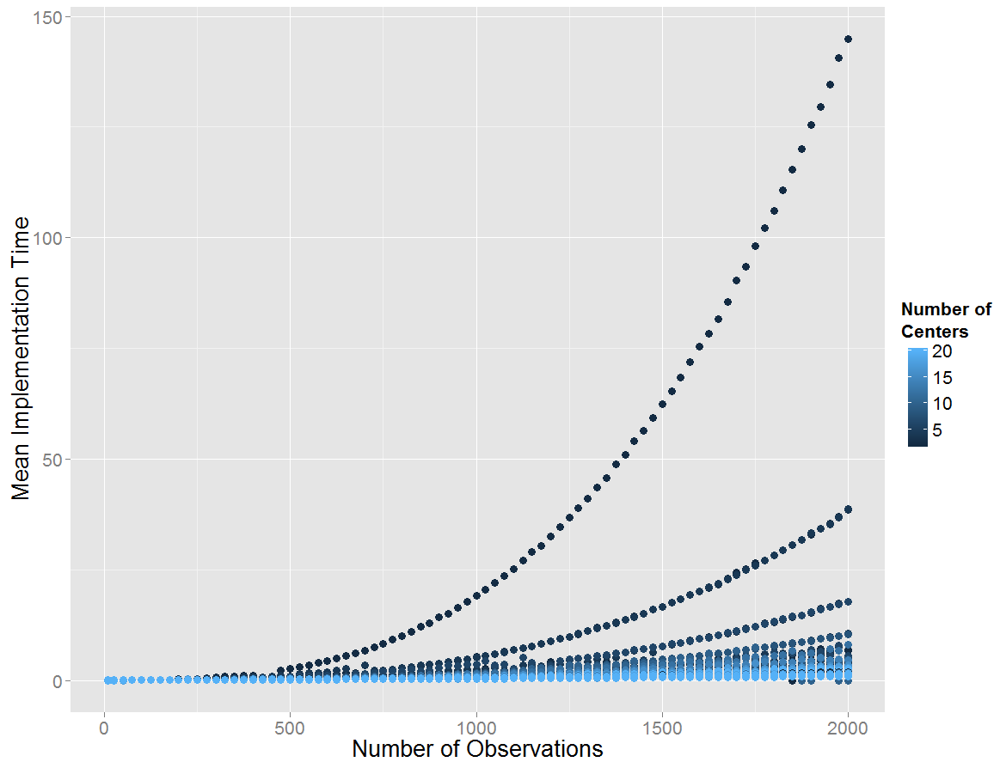
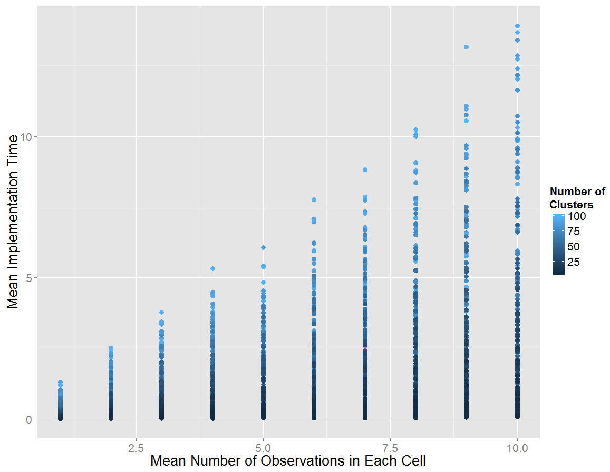
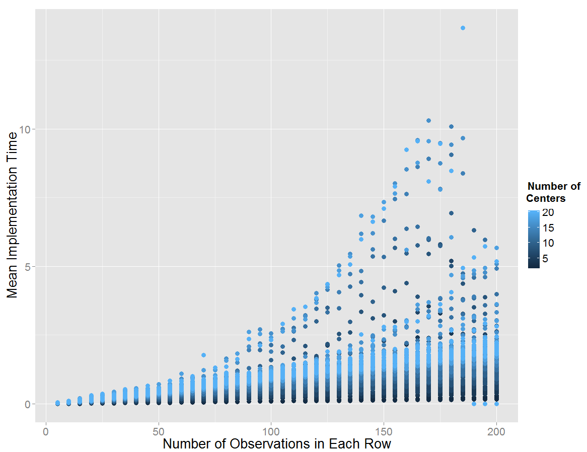
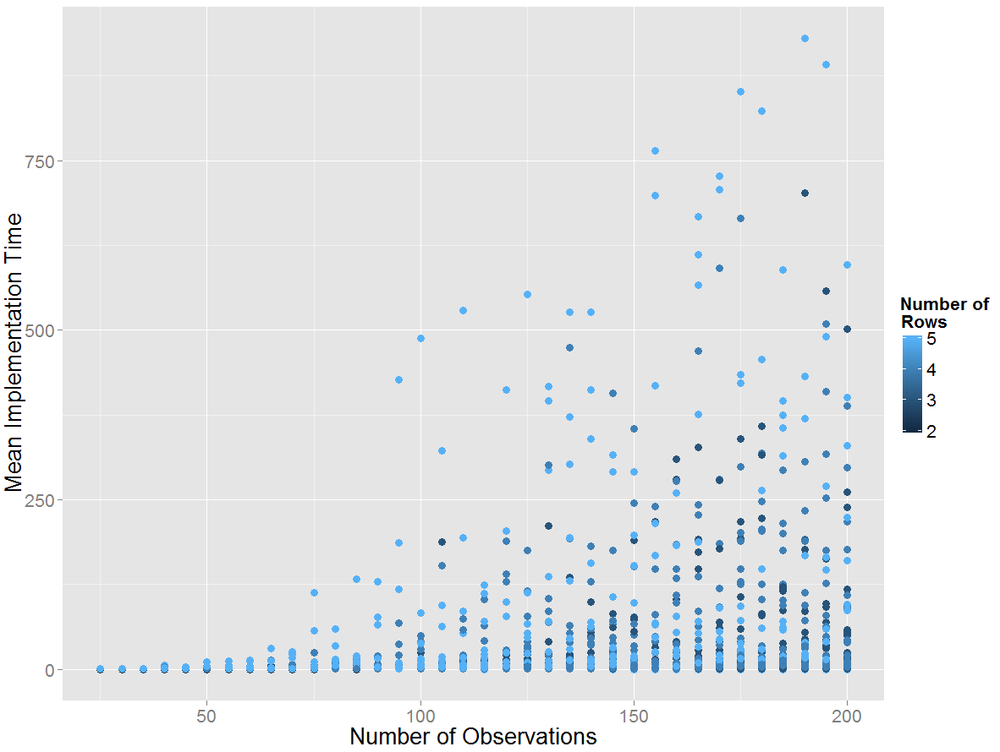
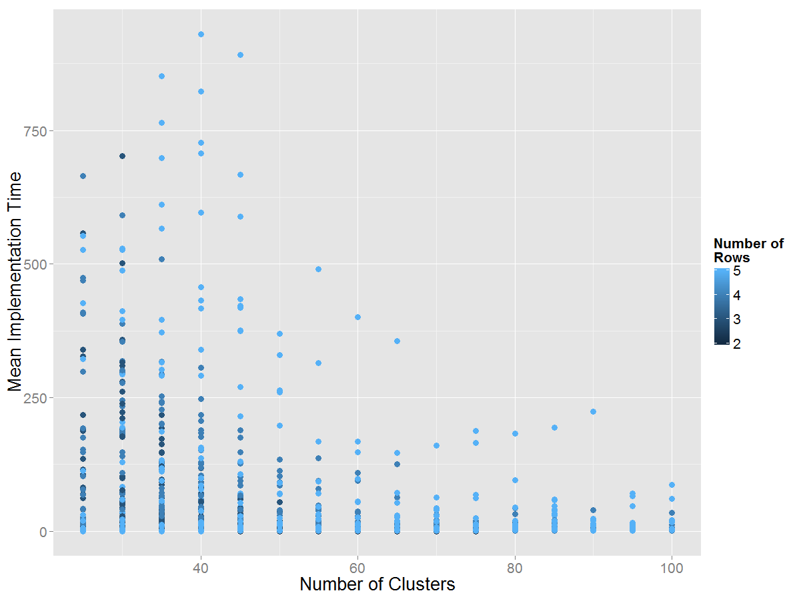
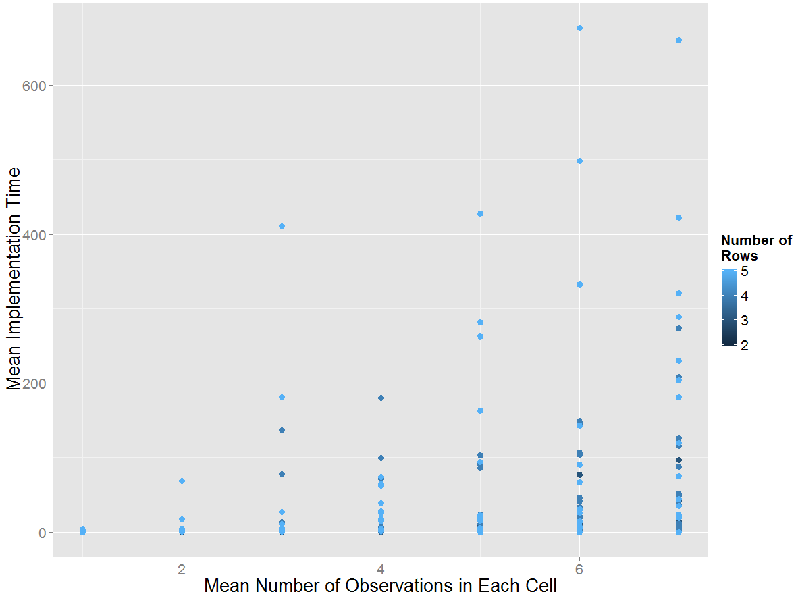
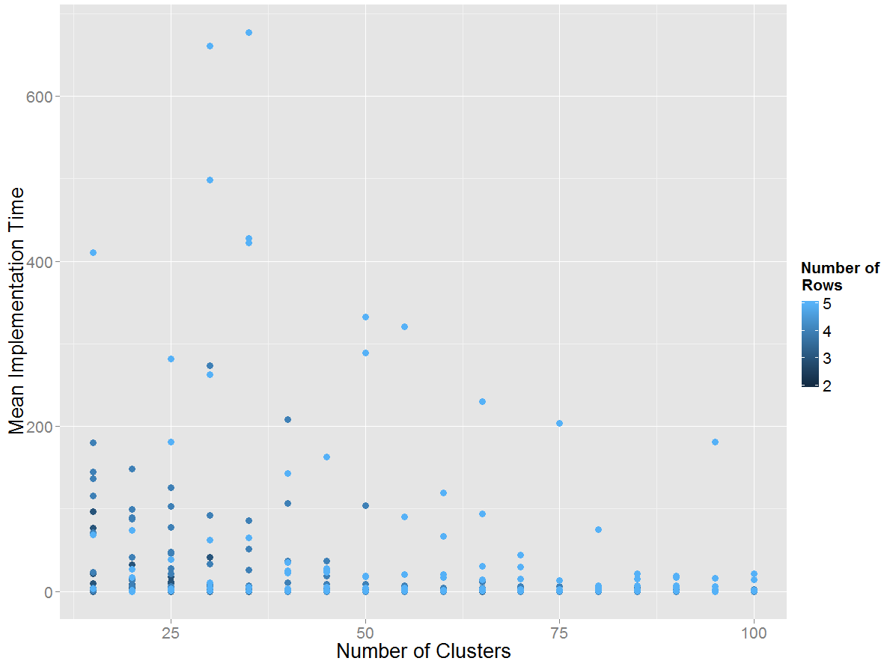
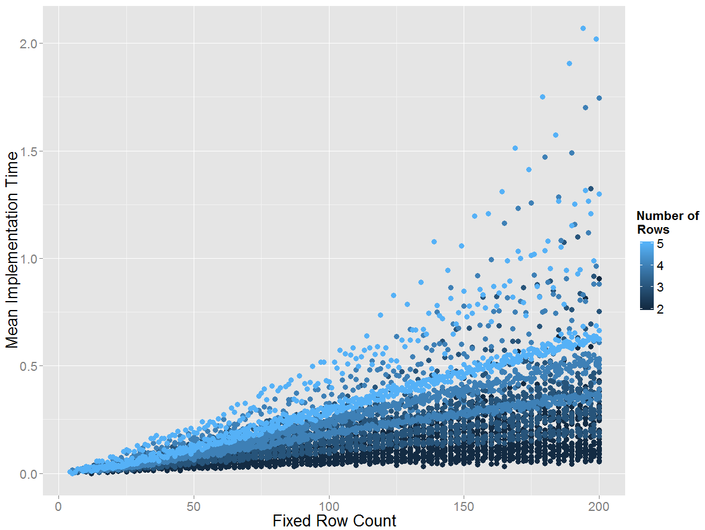
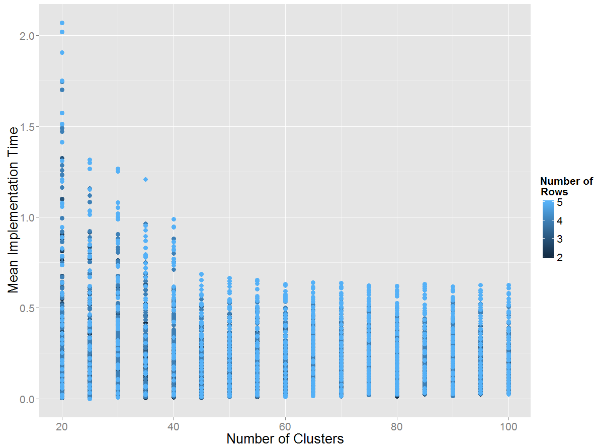

::: article
# Introduction

Random generation of contingency tables is essential for simulation
studies conducted over categorical data. The main characteristic of a
contingency table is determined by the assumed sampling plan and the
correlation structure between categorical variables constituting the
table. There are three main sampling plans: Poisson, multinomial, and
product multinomial. In the Poisson plan, each cell is independently
Poisson distributed and there is no restriction on the total sample
size. In the multinomial plan, total sample size is fixed while row and
column totals are not fixed. When one of the margins of the table is
fixed and the rest are set free, we have a product multinomial plan
[@agresti02; @bishop75]. If both margins are naturally fixed, the
sampling plan becomes hypergeometric, which is seldom used in practice
[@agresti02]. There are numerous ways in R to generate contingency
tables of various dimensions. The function `r2dtable()` in the base
package *stats* generates random two-way tables with given marginals
using Patefield's algorithm under product-multinomial sampling
[@patefield81]. Alternatively, one can generate a random contingency
table over log-linear models with a predetermined association structure.
However, there is no package in R for random generation of
2$\times$`<!-- -->`{=html}2$\times$K tables or generation of contingency
tables with intraclass-correlations.

It is highly possible to have intraclass correlations (ICCs) in surveys
conducted over sampling units with more than one observation unit if
these units are correlated. Familial data also include ICCs. In a public
health survey, if data are collected over families, intraclass
correlations arise due to the within family dependence. Presence of
intraclass correlations can invalidate results of classical categorical
models or chi-square tests [@demirhan13JAS]. Therefore, use and further
developments of methods specific to the cases with ICCs are essential.
In the literature, @cohen76 and @altham76 introduced categorical
analyzes under the presence of ICCs. [@borkowf00] proposed an ICC
statistic for contingency tables with the empirical multivariate
quantile-partitioned distributions. @nandram06 proposed Bayesian
analysis of R$\times$C tables with intraclass correlated cells.
@demirhan13JAS proposed Bayesian estimation of log odds ratios over
R$\times$C contingency tables under the presence of intraclass
correlated cells. The context of ICCs is also used in applied research
such as @bi12.

Monte Carlo simulation studies are essential in the development of new
statistical methods to handle ICCs. However, there is neither a Monte
Carlo approach nor an R package to implement random generation of
contingency tables under intraclass-correlated individuals. In this
article, we propose a simple approach for the generation of
2$\times$`<!-- -->`{=html}2$\times$K and R$\times$C contingency tables
in the presence of ICCs between individuals under three sampling plans,
and describe the R package
[*rTableICC*](https://CRAN.R-project.org/package=rTableICC) [@rTableICC]
for the implementation of the proposed approach. In general,
2$\times$`<!-- -->`{=html}2$\times$K tables are observed in multicenter
studies such as clinical trials [@demirhan08]. Also, in a genetic
association study, association between existence of a disease and $K$
single-nucleotide polymorphisms (SNPs) can be questioned over a
$2\times 2\times$K contingency table. In the genetics context, K would
be the number of genetic loci under investigation. The assumption is
that the total sample size under each loci is mostly known. It is highly
possible to have some correlation patterns between SNPs that cause
existence of ICCs. Thus, we have a $2\times 2\times$K table over
individuals with ICCs under product-multinomial sampling plan.
R$\times$C tables provide a general framework for two-way contingency
tables. Considering the areas of application, *rTableICC* provides a
rich platform for the random generation of contingency tables.

The package *rTableICC* includes four functions for random generation of
2$\times$`<!-- -->`{=html}2$\times$K and R$\times$C contingency tables
with and without intraclass-correlated individuals under multinomial,
product - multinomial and Poisson sampling plans. It also has a function
for random generation of data from a given probability function.
Generated tables are made available in both table and raw data format.
Additional characteristics of generated data for further estimation
issues are also produced and optionally printed out. Thus, it is
possible to easily embed functions of *rTableICC* in other Monte Carlo
simulation codes. The latest development of *rTableICC* under version
1.0.3 is published on the Comprehensive R Archive Network (CRAN).

In the following sections, the approach for the generation of random
tables in the presence of ICCs is described, details of data generation
processes under considered sampling plans are mentioned, input and
output structures of *rTableICC* are demonstrated, and use of the
package is illustrated by several examples. We also provide a
performance analysis regarding the mean running times of the functions
in the package *rTableICC*. Then, we conclude with a brief summary.

# Data generation under ICC

@altham76 introduced two probabilities to deal with ICCs over an
R$\times$C contingency table. Let $n_{ijk}$ be the number of individuals
falling in the cell $(j,k)$ of an R$\times$C table from the $i$th
cluster, where $i=1,\dots,I$, $j=1,\dots,R$, $k=1,\dots,C$, and
$\pi_{jk}$ be the related cell probability. The total number of
individuals in the $i$th cluster is shown by $n_{i}$ and the intraclass
correlation coefficient for clusters including $t=n_{i}$ individuals is
denoted by $\theta_{t}$ for $t=2,\dots,T$, where $T$ is the greatest
family size and $\theta_{1}=0$. For the events $A=\{$All individuals in
the $i$th cluster fall in the same cell of an R$\times$C table $\}$ and
$B=\{$Individuals are in different but specified cells$\}$, the
following probabilities are given by @altham76:

$$\label{eq:01}  
\mathbb{P}(A)=\theta_{t}\pi_{jk}+(1-\theta_{t})(\pi_{jk})^{t}  (\#eq:01)  $$

and

$$\label{eq:2}
\mathbb{P}(B)=(1-\theta_{t})\prod_{j=1}^{R}\prod_{k=1}^{C}(\pi_{jk})^{n_{ijk}},  (\#eq:2)  $$

where $0\leq \theta_{t}\leq 1$. For $2\times2\times$K tables, equations
(\@ref(eq:01)) and (\@ref(eq:2)) remain the same but $i,j=1,2$.

We utilize equations (\@ref(eq:01)) and (\@ref(eq:2)) to incorporate
ICCs into the data generation process. We work over clusters to generate
data. For all sampling plans, the total sample size either entered or
obtained over randomly generated data is distributed across the
clusters. Then, for the clusters with only one individual, because there
is no ICC affecting the individual, we randomly assign it to one of the
cells of the table taking the input vector of cell probabilities into
account, $\boldsymbol{\pi}$. For clusters with more than one individual,
we employ the following pseudocode algorithm to generate data under the
given ICCs:\

::: lemma
**Algorithm 1.**

1.  Input $\boldsymbol{\theta}$, $\boldsymbol{\pi}$, and number of
    individuals in each cluster by an $M\times 1$ vector
    $\boldsymbol{m}$;

2.  Set $i=1$ and goto step 3;

3.  Generate all possible compositions of order $R\times C$ of cluster
    size $m_{i}$ into at most $m_{i}$ parts;

4.  Write generated compositions to an $r \times \ell$ matrix
    $\boldsymbol{N}$, where $r$ is the total number of possible
    compositions;

5.  For each composition $\boldsymbol{n_{j}}$, if $\sum_{k} n_{jk}=0$,
    compute the probability $p_{j}$ by equation (\@ref(eq:01)), else if
    $\sum_{k} n_{jk}>0$, compute the probability $p_{j}$ by equation
    (\@ref(eq:2)), for $j=1,\dots,r$;

6.  Normalize the series of probabilities, $\boldsymbol{p}$, obtained at
    step 5 to construct a probability function;

7.  Randomly select one of the compositions based on the probability
    function obtained at step 6.

8.  Write selected composition to an $\ell \times 1$ vector
    $\boldsymbol{s}_{i}$ and set $i=i+1$;

9.  If $i\leq M$ goto step 3, else return $\sum_{i}\boldsymbol{s}_{i}$.
:::

In Algorithm 1, $\ell=R\cdot C$ for R$\times$C tables and $\ell=4$ for
$2\times2\times$K tables. We use the function `compositions` from the
package [*partitions*](https://CRAN.R-project.org/package=partitions)
[@partitions] to generate all possible compositions at the step 3 of
Algorithm 1. Each composition represents one of the possible allocations
of individuals in a cluster into target cells. For example, let us have
4 cells to distribute 5 individuals in a cluster. We run the following
code to get the $56\times 4$ matrix $\boldsymbol{N}$:

``` r
> N <- t(compositions(5, 4, include.zero = TRUE))
```

The resulting output looks like

``` r
 [1,] 5 0 0 0    [2,] 4 1 0 0    [3,] 3 2 0 0    [4,] 2 3 0 0 ...
```

The vector $(5, 0, 0, 0)$ implies that all individuals in the cluster of
interest fall in the first (same) cell and corresponds to the event $A$,
whereas the vector $(2, 3, 0, 0)$ implies that 2 of 5 individuals fall
in the first and the rest fall in the second cell and represents the
event $B$. At the step 6 of Algorithm 1, we normalize the set of
probabilities that consists of the probability of each possible
allocation of individuals in the cluster of interest into the cells of
table. By this way, we form a probability distribution to generate one
of the possible allocation randomly. Consequently, individuals in a
cluster of size more than one are distributed into the cells of the
table by Algorithm 1. After application of Algorithm 1 for all clusters,
the grand total of generated cell counts produces a randomly generated
contingency table.

# Structure of the *rTableICC* package

The package *rTableICC* consists of four main functions:
`rTableICC.RxC`, `rTableICC.2x2xK`, `rTable.RxC` and `rTable.2x2xK`; and
an auxiliary function `rDiscrete`, which is also suitable for use
individually. In the general functioning of the package, first, main
inputs are checked by an initial layer according to the presence of ICCs
and used sampling plan; and then the related function is called. In
addition to general checks, specific checks are done by the related
function itself. Below, we describe the processing of each function
after the general check.

## Generation of R$\times$C tables with ICC

The function `rTableICC.RxC` is called to generate an R$\times$C table
with ICC. Algorithm 2 describes the functioning of `rTableICC.RxC`.\

::: lemma
**Algorithm 2.**

1.  Input sampling plan, $\boldsymbol{\theta}$, $\boldsymbol{\pi}$,
    total number of individuals $N$ or mean number of individuals
    $\boldsymbol{\lambda}$, and total number of clusters $M$;

2.  If sampling plan is multinomial goto step 3, product-multinomial
    goto step 7, and Poisson goto step 15;

3.  If any of inputs $\boldsymbol{\pi}$ and total number of individuals
    is not suitable then stop;

4.  Distribute $N$ individuals across $M$ clusters with equal
    probabilities by `rmultinom(1, N, rep(1/M, ` `M))`;

5.  If the maximum number of individuals in one of the clusters is
    greater than the maximum allowed cluster size then stop;

6.  Employ Algorithm 1 with joint probabilities for all clusters and
    goto step 21;

7.  If any of inputs $\boldsymbol{\pi}$ and row (column) margins is not
    suitable then stop;

8.  Determine the fixed margin according to input parameters
    `col.margin` or `row.margin` and set $i=1$;

9.  Calculate conditional probabilities regarding the fixed margin;

10. If conditional probabilities calculated over entered row margins and
    $\boldsymbol{\pi}$ are not equal to each other then stop;

11. Distribute individuals in the $i$th row (column) across $M$ clusters
    with equal probabilities by using the multinomial distribution;

12. If the maximum number of individuals in one of the clusters is
    greater than the maximum allowed cluster size then stop;

13. Employ Algorithm 1 with calculated conditional probabilities for all
    clusters and set $i=i+1$;

14. If $i\leq R (C)$ goto step 10, else goto step 21;

15. If input $\boldsymbol{\lambda}$ is not suitable then stop;

16. Generate number of individuals in each cell by
    `rpois(R * C, t(lambda))`;

17. Calculate cell probabilities and total number of individuals $N$;

18. Distribute $N$ individuals across $M$ clusters with equal
    probabilities by `rmultinom(1, N, rep(1/M,` `M))`;

19. If the maximum number of individuals in one of the clusters is
    greater than the maximum allowed cluster size then stop, else goto
    step 20;

20. Employ Algorithm 1 with probabilities calculated at step 17 for all
    clusters;

21. Calculate desired output forms of generated table.
:::

Suitability checks at steps 3, 7, and 15 are made on minimum and maximum
values and dimensions of input vectors. Because the total sample size,
which is entered by the user for multinomial sampling, randomly
generated for Poisson sampling, and entered as a fixed row (column)
margin for product-multinomial sampling, is randomly distributed into
the clusters, it is coincidentally possible to have clusters with more
individuals than the allowed maximum cluster size. In this case, the
following error message is generated:\
Maximum number of individuals in one of the clusters is 14, which is
greater than maximum allowed cluster size. (1) Re-run the function, (2)
increase maximum allowed cluster size by increasing the number of
elements of theta, (3) increase total number of clusters, or (4)
decrease total number of individuals!\
and execution is stopped at steps 5, 12, and 19 of Algorithm 2.

For the product-multinomial sampling, suppose that row totals are fixed
and $n_{i+}$ denotes fixed row margins. With the counts satisfying
$\sum_{j}n_{ij}=n_{i+}$, we have the following multinomial form
[@agresti02]:

$$\label{eq:3}  
      \frac{n_{i+}!}{\prod_{j}n_{ij}!}\prod_{j}\pi_{j|i}^{n_{ij}},  (\#eq:3)  $$

where $i=1,\dots,R$, $j=1,\dots,C$, $n_{ij}$ is the count of cell
$(i,j)$, and given that an individual is in the $i$th row, $\pi_{j|i}$
is the conditional probability of being in the $j$th column of the table
calculated at step 9 of Algorithm 2. When column totals are fixed the
same steps as in the case of fixed row totals are applied.

Let $\Lambda$ be the set of clusters in which all individuals fall in a
single cell of the contingency table and $\Lambda'$ be the complement of
$\Lambda$, and $T$ be the maximum cluster size. Outputs of
`rTableICC.RxC` include two arrays in addition to the generated table.
The first one, $\boldsymbol{g}_{t}$, is an $R \times
C\times (T-1)$ dimensional array including the number of clusters of
size $t$ in $\Lambda'$ with all individuals in cell $(i,j)$; and the
second, $\widetilde{\boldsymbol{g}}$, is a $(T-1)\times 1$ dimensional
vector including the number of clusters of size $t$ in $\Lambda'$, where
$i,j=1,2$ and $t=2,\dots,T$. These arrays are required for further
modeling purposes.

## Generation of $2\times 2\times$K tables with ICC

The function `rTableICC.2x2xK` is called to generate a $2\times2\times$K
table with ICC. Algorithm 3 describes the processing of
`rTableICC.2x2xK`. We assume that we have $K$ centers and a $2\times 2$
table under each center. To generate a $2\times 2\times$K table,
`rTableICC.2x2xK` generates a $2\times 2$ table under each center.\

::: lemma
**Algorithm 3.**

1.  Input sampling plan, $\boldsymbol{\theta}$, $\boldsymbol{\pi}$,
    total number of individuals $N$ or mean number of individuals
    $\boldsymbol{\lambda}$, and total number of clusters $M_{k}$ for
    $k=1,\dots,K$ under each center;

2.  If sampling plan is multinomial goto step 3, product-multinomial
    goto step 9, and Poisson goto step 16;

3.  If any of inputs $\boldsymbol{\pi}$ and total number of individuals
    is not suitable then stop;

4.  Distribute $N$ individuals across $\sum_{k}M_{k}$ clusters with
    equal probabilities by `rmultinom(1, N, `
    `rep(1/sum(num.cluster), sum(num.cluster)))` and store the results
    in a $K\times 1$ vector $\boldsymbol{c}$;

5.  If the maximum number of individuals in one of the clusters is
    greater than the maximum allowed cluster size then stop, else set
    $k=1$;

6.  Scale joint probabilities of the $2\times 2$ table under the $k$th
    center to make them sum-up to one;

7.  Employ Algorithm 1 with scaled joint probabilities for all clusters
    of center $k$ and set $k=k+1$;

8.  If $k\leq K$ goto step 6, else goto step 22;

9.  If any of inputs $\boldsymbol{\pi}$ and center margins is not
    suitable then stop;

10. Calculate conditional probabilities regarding the fixed centers and
    set $k=1$;

11. Scale conditional probabilities of step 10 under the $k$th center to
    make them sum-up to one;

12. Distribute individuals in the $k$th center across $M_{k}$ clusters
    with equal probabilities by `rmultinom(1,`
    ` N[k], rep(1/num.cluster[k], num.cluster[k]))`;

13. If the maximum number of individuals in one of the clusters is
    greater than the maximum allowed cluster size then stop;

14. Employ Algorithm 1 with scaled conditional probabilities for all
    clusters of center $k$ and set $k=k+1$;

15. If $k\leq K$ goto step 11, else goto step 22;

16. If input $\boldsymbol{\lambda}$ is not suitable then stop;

17. Generate number of individuals in each cluster by
    `rpois(num.cluster[k], lambda[k])`;

18. Calculate total number of individuals $N$ over generated clusters at
    step 17;

19. Scale joint probabilities of the $2\times 2$ table under the $k$th
    center to make them sum-up to one;

20. If the maximum number of individuals in one of the clusters is
    greater than the maximum allowed cluster size then stop;

21. Employ Algorithm 1 with probabilities calculated at step 19 for all
    clusters;

22. Calculate desired output forms of generated table.
:::

Suitability checks at steps 3, 9, and 16 are made on minimum and maximum
values and dimensions of input vectors. For the incompatibility between
generated and allowed maximum cluster sizes, the same situation as the
R$\times$C case also applies to the $2\times2\times$K case. In this
case, the same error message is displayed and execution is stopped. For
all sampling plans, `rTableICC.2x2xK` proceeds over each center.

For product-multinomial sampling plan, suppose that center totals are
denoted by $n_{ij+}$, where $i,j=1,2$. Then with the counts satisfying
$\sum_{ij}n_{ijk}=n_{ij+}$, the following multinomial form is used
[@agresti02]:

$$\label{eq:4}  
  \frac{n_{ij+}!}{\prod_{ij}n_{ijk}!}\prod_{ij}p_{ij|k}^{n_{ijk}},  (\#eq:4)  $$

where $k=1,\dots,K$, $n_{ijk}$ is the count of cell $(i,j,k)$, and given
that an individual is in the $k$th center, $p_{ij|k}$ is the conditional
probability of being in the cell $(i,j)$ of the $2 \times
2$ table. This multinomial form is used to generate data under each
center.

Arrays $\boldsymbol{g}_{t}$ and $\widetilde{\boldsymbol{g}}$ are also
included in the outputs of `rTableICC.2x2xK`. Here, $\boldsymbol{g}_{t}$
and $\widetilde{\boldsymbol{g}}$ are respectively
$2K\times 2\times (T-1)$ and $(T-1)\times 1$ dimensional arrays. Their
definitions are the same as R$\times$C case.

## Generation of R$\times$C tables without ICC

The function `rTable.RxC` is used to generate an R$\times$C table with
independent individuals in sampling units. In this function, the
classical way of generating contingency tables over the probability
distribution corresponding to the sampling plan is followed. The
functioning of `rTable.RxC` is described in Algorithm 4.\

::: lemma
**Algorithm 4.**

1.  Input sampling plan, $\boldsymbol{\pi}$, and total number of
    individuals $N$ or mean number of individuals
    $\boldsymbol{\lambda}$;

2.  If sampling plan is multinomial goto step 3, product-multinomial
    goto step 5, and Poisson goto step 11;

3.  If any of inputs $\boldsymbol{\pi}$ and total (mean) number of
    individuals is not suitable then stop;

4.  Distribute $N$ individuals across R$\times$C cells by
    `rmultinom(1, N, pi)` and goto step 12;

5.  If any of inputs $\boldsymbol{\pi}$ and row (column) margins is not
    suitable then stop;

6.  Determine the fixed margin according to input parameters
    `col.margin` or `row.margin` and set $i=1$;

7.  Calculate conditional probabilities regarding the fixed margin;

8.  If conditional probabilities calculated over entered row margins and
    $\boldsymbol{\pi}$ are not equal to each other then stop;

9.  Distribute individuals in the $i$th row (column) across R (C) cells
    with conditional probabilities using the multinomial distribution;

10. If $i\leq R (C)$ goto step 9, else goto step 13;

11. If input $\boldsymbol{\lambda}$ is not suitable then stop;

12. Generate number of individuals in each cell by
    `rpois(R * C, t(lambda))`;

13. Calculate desired output forms of generated table.
:::

Suitability checks at steps 3, 5, and 11 are made on minimum and maximum
values and dimensions of input vectors. For the product-multinomial
sampling plan, the multinomial form in equation (\@ref(eq:3)) is used.
Raw data corresponding to each individual are also generated among
outputs of `rTable.RxC`.

## Generation of $2\times 2\times$K tables without ICC

The function `rTable.2x2xK` is employed to generate a $2\times2\times$K
table with independent individuals in sampling units. The processing of
`rTable.2x2xK` is described in Algorithm 5. Assume that we have $K$
centers and a $2\times 2$ table under each center. Similar to
`rTableICC.2x2xK`, `rTable.2x2xK` generates a $2\times 2$ table under
each center to obtain a $2\times 2\times$K table.\

::: lemma
**Algorithm 5.**

1.  Input sampling plan, $\boldsymbol{\pi}$, total number of individuals
    $N$ or mean number of individuals $\boldsymbol{\lambda}$;

2.  If sampling plan is multinomial goto step 3, product-multinomial
    goto step 5, and Poisson goto step 10;

3.  If any of inputs $\boldsymbol{\pi}$ and total number of individuals
    is not suitable then stop;

4.  Distribute $N$ individuals across $2\times2 \times$ K cells with
    input probabilities by `rmultinom(1, N, pi)` and goto step 12;

5.  If any of inputs $\boldsymbol{\pi}$ and center margins is not
    suitable then stop, else set $k=1$;

6.  Calculate conditional probabilities for center $k$;

7.  Scale conditional probabilities of step 6 under the $k$th center to
    make them sum-up to one;

8.  Distribute individuals in the $k$th center across $2\times 2$ cells
    with scaled probabilities at step 7 by using multinomial
    distribution and set $k=k+1$;

9.  If $k\leq K$ goto step 6, else goto step 12;

10. If input $\boldsymbol{\lambda}$ is not suitable then stop;

11. Generate number of individuals in each cell of $2\times 2\times$K
    table by `rpois(2 * 2 * K, lambda)`;

12. Calculate desired output forms of generated table.
:::

Suitability checks at steps 3, 9, and 16 are made on minimum and maximum
values and dimensions of input vectors.The multinomial form in equation
(\@ref(eq:4)) is used for product-multinomial sampling plan. It is
possible to enter a mean number of individuals for each cell under
Poisson sampling plan at step 11 of Algorithm 5 by entering an array for
`lambda`. Raw data corresponding to each individual are also generated
among outputs of `rTable.2X2XK`.

## Generation of random values from a discrete probability distribution

The function `rDiscrete` is used to generate a random value from an
empirical probability distribution. This function is called by both
`rTableICC.RxC` and `rTableICC.2x2xK`. Implementation of `rDiscrete` is
explained by Algorithm 6.\

::: lemma
**Algorithm 6.**

1.  Input empirical probability function (pf) with $N$ levels and number
    of observations to be generated;

2.  Check whether input probabilities sum to one and number of
    observations $n$ is a finite positive scalar;

3.  Calculate cumulative distribution function (cdf), $F$, over the
    input pf;

4.  Set $A_{j}=(F(j-1),F(j))$, where $j=1,\dots,N$, $F(0)=0$, and $i=1$;

5.  Generate a random value $u$ from Uniform$(0,1)$ distribution;

6.  If $u\in A_{j}$ than save $j$ as the generated value and set
    $i=i+1$;

7.  If $i\leq n$ goto step 5;

8.  Return the generated values.
:::

`rDiscrete` returns an array of generated values and calculated cdf at
step 3 of Algorithm 6.

# Illustrative examples

To generate random R$\times$C and $2\times2\times$K contingency tables
with or without ICCs or generate random numbers from empirical
probability functions, first one has to load the package *rTableICC* by

``` r
> library(rTableICC)
```

Then, the relevant function is called with proper inputs.

In the first example, we illustrate two important cases that generate
errors and stop execution of functions `rTableICC.RxC` and
`rTableICC.2x2xK`. In the second and third examples, we demonstrate
outputs of `rTableICC.2x2xK` and `rTableICC.RxC`. In the fourth example,
we exemplify `rTable.RxC`, `rTable.2x2xK`, and `rDiscrete` functions.

## Example 1

In this example, we illustrate two incompatibilities between generated
and allowed maximum cluster sizes and total number of individuals and
number of clusters for functions `rTableICC.RxC` and `rTableICC.2x2xK`.

When a user enters the value of intraclass correlation for each cluster
size, the maximum allowed cluster size is correspondingly defined.
However, because `rTableICC.RxC` and `rTableICC.2x2xK` distribute total
sample size, which is entered or generated, among the given number of
clusters, we would have clusters with number of individuals greater than
the maximum allowed cluster size. This case should be regarded while
entering the values of intraclass correlations, total or mean number of
individuals, and total number of clusters.

The following code attempts to generate a $2\times2\times$K contingency
table with 3 centers under multinomial sampling plan. Number of clusters
under each sample is 25 and total number of individuals is 500. The
maximum cluster size (`max.cluster.size`) is defined to specify the size
of array including ICCs. In this setting, it is highly possible to
allocate more than 4 individuals in one of the clusters.

``` r
> num.centers <- 3
> sampl <- "Multinomial"
> max.cluster.size <- 4
> num.cluster <- 25
> num.obs <- 500
> ICCs <- array(0.1, dim = max.cluster.size)
> ICCs[1] <- 0
> cell.prob <- array(1/12, dim = c(num.centers, 4))
> x <- rTableICC.2x2xK(p = cell.prob, theta = ICCs, M = num.cluster, sampling = sampl, 
+                      N = num.obs)
```

When 500 individuals are distributed across 25 clusters, the maximum
cluster size is realized as $14>$ `max.cluster.size`, as expected. Then,
execution is stopped with the following error message:

``` r
Error in rtableICC.2x2xK.main(p, theta, M, sampling, N, lambda, print.regular,  :
        Maximum number of individuals in one of the clusters is 14, which is greater
        than maximum allowed cluster size.
           (1) Re-run the function,
           (2) increase maximum allowed cluster size by increasing the number of
               elements of theta,
           (3) increase total number of clusters, or
           (4) decrease total number of individuals!
```

Now, we change the settings to eliminate the error. `rTableICC.2x2xK`
generates the desired table when the total number of observations is
decreased to 50, the total number of clusters is increased to 250, or
the maximum cluster size is increased to 15 with the same inputs for the
rest of the arguments.

User should ensure compatibility between the number of individuals and
the total number of clusters. When we run the code given above with
`num.obs <- 50` and `zero.clusters <- FALSE`, `rTableICC.2x2xK` tries to
distribute 50 individuals to 75 clusters; and hence, the following error
message is generated:

``` r
Error in rtableICC.2x2xK.main(p, theta, M, sampling, N, lambda, zero.clusters,  :
  Because number of individuals is less than the total number of clusters, it is
  impossible to allocate an individual to each cluster! Set zero.clusters = TRUE
  and re-run the function.
```

The problem is eliminated when `zero.clusters` is set to `TRUE`.

## Example 2

In this example, the output structure of `rTableICC.2x2xK` is
illustrated. We run the code in Example 1 with `num.centers <- 2`,
`num.obs <- 50`, and `zero.clusters <- TRUE` and call `print(x)`. The
following part presents the summary information on the data generation
process.

``` r
Call:
rTableICC.2x2xK.default(p = cell.prob, theta = ICCs, M = num.cluster,
    sampling = sampl, N = num.obs, zero.clusters = TRUE, print.regular = TRUE,
    print.raw = FALSE)

    Process summary:
    ----------------
    100 observations in 2 centers were successfully generated under Multinomial
    sampling plan! Number of clusters for each center is as the following:
      25 for Center 1
      25 for Center 2
    17 clusters include no individual.
    21 clusters include one individual.
    12 clusters include more than one individual.
```

Because the multinomial distribution is used to distribute the total
sample size across the clusters, there are some clusters with no
individuals, as reported in the process summary. Because probabilities
used to represent intraclass correlations in equations (\@ref(eq:01))
and (\@ref(eq:2)) change according to cluster size, we report the number
of clusters containing one and more than one individuals in the process
summary.

The following part of the output includes $\boldsymbol{g}_{t}$,
$\widetilde{\boldsymbol{g}}$, and the generated table in two and three
dimensions.

``` r
 The number of t sized clusters in the set of clusters in which all individuals fall
 in cell (j,k) for j,k=1,2:

   g.t =
, , Cluster of size 2
               C- 1 C- 2
Center- 1 R- 1    0    2
Center- 1 R- 2    1    2
Center- 2 R- 1    1    0
Center- 2 R- 2    0    1
, , Cluster of size 3
               C- 1 C- 2
Center- 1 R- 1    1    1
Center- 1 R- 2    0    0
Center- 2 R- 1    0    1
Center- 2 R- 2    0    0
, , Cluster of size 4
               C- 1 C- 2
Center- 1 R- 1    0    0
Center- 1 R- 2    0    0
Center- 2 R- 1    0    0
Center- 2 R- 2    0    1

 The number of clusters of size t outside the set of clusters in which all individuals
 fall in a single cell: g.tilde = ( 0 1 0 )

 Generated random table in two dimensions :
          R1C1 R1C2 R2C1 R2C2
Center- 1    4   10    7    7
Center- 2    3    5    5    9

   Generated random table in three dimensions :
, , Center- 1
     C- 1 C- 2
R- 1    4   10
R- 2    7    7
, , Center- 2
     C- 1 C- 2
R- 1    3    5
R- 2    5    9
```

To illustrate the output raw data format, we run the following code:

``` r
> num.centers <- 3
> num.cluster <- 5
> num.obs <- 10
> ICCs <- array(0.1, dim = 4)
> ICCs[1] <- 0
> cell.prob <- array(1/12, dim = c(num.centers, 4))
> x <- rTableICC.2x2xK(p = cell.prob, theta = ICCs, M = num.cluster, 
+                      sampling = "Multinomial", N = num.obs)
```

The resulting raw data output given below is printed as a three
dimensional array. The first dimension includes observations, the second
dimension has $2K$ elements simultaneously representing rows of each
$2\times 2$ table and each center, and the third dimension corresponds
to the columns of each $2\times 2$ table. Elements of the second
dimension correspond to cells in (row-1, center-$i$), (row-2,
center-$i$), for $i=1,\dots,K$, respectively; hence, it has $2K$
elements. Those of the third dimension correspond to the first and
second columns of each $2\times 2$ table, respectively.

``` r
   Generated random table in raw data format =
   , , 1
      [,1] [,2] [,3] [,4] [,5] [,6]
 [1,]    1    0    0    0    0    0
 [2,]    0    0    0    0    0    0
 [3,]    1    0    0    0    0    0
 ...
 [10,]   0    0    0    0    0    0
  , , 2
      [,1] [,2] [,3] [,4] [,5] [,6]
 [1,]    0    0    0    0    0    0
 [2,]    1    0    0    0    0    0
 [3,]    0    0    0    0    0    0
 ...
 [10,]   0    0    0    0    1    0
```

## Example 3

The output structure of `rTableICC.RxC` is similar to that of
`rTableICC.2x2xK`. We run the following code to generate a $2\times 3$
contingency table under a product multinomial sampling plan with fixed
row margins, zero clusters being not allowed, and cell probabilities
being in accordance with the entered counts of fixed margin.

``` r
> num.cluster <- 12
> ICCs <- array(0.1, dim = 9)
> ICCs[1] <- 0
> num.obs <- 24
> zeros <- FALSE
> sampl <- "Product"
> row <- c(12, 12)
> cell.prob <- array(0, dim = c(2, 3))
> cell.prob[1, 1:2] <- 0.2
> cell.prob[1, 3] <- 0.1
> cell.prob[2, 1:2] <- 0.1
> cell.prob[2, 3] <- 0.3
> y <- rTableICC.RxC(p = cell.prob, theta = ICCs, row.margins = row, M = num.cluster,
+                    sampling = sampl, zero.clusters = zeros, print.regular = TRUE,
+                    print.raw = FALSE)
> print(y)
```

In the output of `rTableICC.RxC`, first the following summary table is
generated. Coincidentally, there is no cluster with more than one
individual. Clusters are enforced to contain at least one individual.

``` r
Call:
rTableICC.RxC.default(p = cell.prob, theta = ICCs, M = num.cluster,
    row.margins = row, sampling = sampl, zero.clusters = zeros,
    print.regular = TRUE, print.raw = FALSE)

    Process summary:
    ----------------
    24 observations in 12 12 clusters were successfully generated under Product
    multinomial sampling plan!
    Each cluster includes at least one individual.
    12 clusters include one individual.
    0 clusters include more than one individual.
```

In the output, the vector $\boldsymbol{g}_{t}$ is printed in $R\times
C$ format for each cluster size. The vector $\widetilde{\boldsymbol{g}}$
is printed as a vector and the generated table is printed in both
$R\times C$ and row formats. Because there is no cluster with more than
one individual, $\boldsymbol{g}_{t}$ and $\widetilde{\boldsymbol{g}}$
are both composed of zeros.

``` r
 The number of t sized clusters in the set of clusters in which all individuals fall in
 cell (j,k) for j=1,...,R and k=1,...,C: g.t =

, , Cluster of size 2
     C- 1 C- 2 C- 3
R- 1    0    0    0
R- 2    0    0    0
...
, , Cluster of size 9
     C- 1 C- 2 C- 3
R- 1    0    0    0
R- 2    0    0    0

 The number of clusters of size t outside the set of clusters in which all individuals
 fall in a single cell: g.tilde = ( 0 0 0 0 0 0 0 0 )

 Generated random table in row format = ( 5 4 3 3 3 6 )

   Generated random table in RxC format =
     C- 1 C- 2 C- 3
R- 1    5    4    3
R- 2    3    3    6
```

## Example 4

In this example, we run a couple of codes to illustrate random
contingency table generation without ICCs. Besides, we show outputs of
the function `rDiscrete`.

The following code generates and prints a random $5\times 7$ contingency
table under multinomial sampling plan with 124 observations and equal
cell probabilities.

``` r
> num.row <- 5
> num.col <- 7
> sampl <- "Multinomial"
> cell.prob <- array(1/35, dim = c(num.row, num.col))
> num.obs <- 124
> x <- rTable.RxC(p = cell.prob, sampling = sampl, N = num.obs)
> print(x)
```

The corresponding output of `rTable.RxC` is as follows. After a brief
summary, the generated table is printed.

``` r
Call:
rTable.RxC.default(p = cell.prob, sampling = sampl, N = num.obs)

    Process summary:
    ----------------
    124 observations across 5 rows and 7 columns were successfully generated under
    Multinomial sampling plan!

   Generated random table in RxC format =
     C- 1 C- 2 C- 3 C- 4 C- 5 C- 6 C- 7
R- 1    4    2    3    4    5    4    4
R- 2    4    5    5    5    5    5    4
R- 3    4    1    5    3    3    2    3
R- 4    2    1    1    6    4    3    3
R- 5    2    1    4    5    7    2    3
```

The following code is run to randomly generate a
$2\times2\times$`<!-- -->`{=html}3 contingency table under Poisson
sampling plan with determined mean number of individuals for each cell.

``` r
> num.centers <- 3
> sampl <- "Poisson"
> cell.mean <- array(3, dim = c(2, 2, num.centers))
> z <- rTable.2x2xK(sampling = sampl, lambda = cell.mean)
> print(z)
```

Consequently, 31 observations were generated under 3 centers.

``` r
Call:
rTable.2x2xK.default(sampling = sampl, lambda = cell.mean)

    Process summary:
    ----------------
    31 observations in 3 centers were successfully generated under Poisson sampling plan!

   Generated random table in 2x2xK format =

, , Center- 1
     C- 1 C- 2
R- 1    1    0
R- 2    2    4
, , Center- 2
     C- 1 C- 2
R- 1    6    3
R- 2    2    4
, , Center- 3
     C- 1 C- 2
R- 1    2    3
R- 2    2    2
```

To generate random values from an empirical probability function, we
call `rDiscrete`. We run the following code to generate two random
values from a given probability function:

``` r
> p <- c(0.23, 0.11, 0.05, 0.03, 0.31, 0.03, 0.22, 0.02)
> rDiscrete(n = 2, pf = p)
```

Consequently, the generated random values and corresponding cdf are
printed.

``` r
$rDiscrete
[1] 1 7

$cdf
[1] 0.00 0.23 0.34 0.39 0.42 0.73 0.76 0.98 1.00
```

# Performance

The package *rtableICC* is intended to be used in combinaion with other
code that implements Monte Carlo simulation. Therefore, the
computational performance of *rtableICC* is of importance. We
investigate running times of functions in *rtableICC* under various
combinations of table structure, sample size, and sampling plan.
Tables [1](#tbl:1) and [2](#tbl:2) show test conditions of each function
of *rtableICC* related with $2\times2\times$K and R$\times$C contingency
tables, respectively. The value of ICC is taken as 0.1 for all cluster
sizes and related functions. Each test combination was repeated 5 times
and mean and variance of the running times were recorded. Because of the
obtained small variances, 5 replications were found sufficient. The
maximum number of allowed clusters was taken high enough to have the
code successfully run through. In the `rTableICC.2x2xK` and
`rTableICC.RxC` functions, the argument `zero.clusters` was set to
`TRUE` to allow clusters with no individuals. Note that when
`zero.clusters` is set to `FALSE`, we get shorter mean running times.
All the combinations were run on a MAC-Pro computer equipped with 6
Intel(R) Xenon(R) CPU E5-1650 v2 at 3.5GHz, 16 GB of RAM, and Windows
8.1 operating system.

::: {#tbl:1}
  ---------------------------------------------------------------------------------------------------------------------------------------
                       Plan          N. of Observations          N. of Centers     N. of Clusters       Cell Mean        Center Margins
  ------------------- ------- -------------------------------- ----------------- ------------------ ------------------ ------------------
    `rTableICC.2x2xK`  Mult.   $10,25,50,\dots,2\cdot 10^{3}$   $2,4,\dots,100$   $5,6,\dots,100$          ---                ---

       `rTable.2x2xK`  Mult.   $10,25,50,\dots,2\cdot 10^{4}$   $2,4,\dots,20$          ---                ---                ---

    `rTableICC.2x2xK`  Poi.                 ---                 $2,4,\dots,20$    $5,10,\dots,100$    $1,2,\dots,10$          ---

       `rTable.2x2xK`  Poi.                 ---                 $2,4,\dots,50$          ---          $0.5,1,\dots,50$         ---

    `rTableICC.2x2xK`  Pro.                 ---                 $2,4,\dots,20$    $5,10,\dots,100$         ---          $5,10,\dots,200$

       `rTable.2x2xK`  Pro.                 ---                 $2,4,\dots,50$          ---                ---          $5,10,\dots,500$
  ---------------------------------------------------------------------------------------------------------------------------------------

  : Table 1: Test conditions for the `rTableICC.2x2xK` and
  `rTable.2x2xK` functions.
:::

::: tablenote
N: Number; Mult: Multinomial; Poi: Poisson; Pro: Product Multinomial;
Plan: Sampling plan.
:::

::: {#tbl:2}
  -----------------------------------------------------------------------------------------------------------------------------------------------
                     Plan         N. of Obs.          N. of Rows      N. of Columns      N. of Clusters        Cell Mean          Row Margins
  ----------------- ------- ---------------------- ---------------- ------------------ ------------------- ------------------ -------------------
   `rTableICC.RxC`   Mult.    $10,20,\dots,200$     $2,3,\dots,5$    $R,R+1,\dots,5$    $5,10,\dots,100$          ---                 ---

    `rTable.RxC`     Mult.   $25,50,\dots,10^{4}$   $2,3,\dots,20$   $R,R+1,\dots,20$          ---                ---                 ---

   `rTableICC.RxC`   Poi.            ---            $2,3,\dots,5$    $R,R+1,\dots,20$   $15,20,\dots,100$    $1,2,\dots,7$            ---

    `rTable.RxC`     Poi.            ---            $2,3,\dots,20$   $R,R+1,\dots,20$          ---          $0.5,1,\dots,10$          ---

   `rTableICC.RxC`   Pro.            ---            $2,3,\dots,5$    $R,R+1,\dots,5$    $20,25,\dots,40$          ---          $20,25,\dots,200$

    `rTable.RxC`     Pro.            ---            $2,3,\dots,10$   $R,R+1,\dots,10$          ---                ---          $5,10,\dots,2000$
  -----------------------------------------------------------------------------------------------------------------------------------------------

  : Table 2: Test conditions for the `rTableICC.RxC` and `rTable.RxC`
  functions. The number of columns starts from number of rows denoted by
  $R$ under number of columns.
:::

::: tablenote
N: Number; Mult: Multinomial; Poi: Poisson; Pro: Product Multinomial;
Obs: Observations; Plan: Sampling plan.
:::

For multinomial, Poisson, and product multinomial sampling plans,
scatter plots representing the mean running times of `rTableICC.2x2xK`
according to some of the considered factors are given in
Figure [1](#fig:1). Due to the small variances within repetitions, plots
are drawn only for the mean running times.

<figure id="fig:1">
<table>
<caption> </caption>
<tbody>
<tr class="odd">
<td style="text-align: center;"></td>
</tr>
<tr class="even">
<td style="text-align: center;">(a)</td>
</tr>
<tr class="odd">
<td style="text-align: center;"></td>
</tr>
<tr class="even">
<td style="text-align: center;">(b)</td>
</tr>
<tr class="odd">
<td style="text-align: center;"></td>
</tr>
<tr class="even">
<td style="text-align: center;">(c)</td>
</tr>
</tbody>
</table>
<figcaption>Figure 1: Performance of the <code>rTableICC.2x2xK</code>
function under multinomial, Poisson, and product multinomial sampling
plans. Panels (a) and (c) represent mean running time versus number of
observations colored according to number of centers for the multinomial
and product multinomial sampling plans, respectively. Panel (c)
represents mean running time versus mean number of observations in each
cell colored according to number of clusters for the Poisson sampling
plan.</figcaption>
</figure>

For the multinomial sampling plan, the scatter plot of mean
implementation time versus number of observations colored according to
number of clusters is very similar to the one given in panel (a) of
Figure [1](#fig:1). For the Poisson sampling plan, the scatter plot of
mean running time versus mean number of observations in each cell
colored according to number of centers is very similar to the one given
in panel (b) of Figure [1](#fig:1). For the product multinomial sampling
plan, the scatter plot of mean running time versus fixed row totals
colored according to number of centers is very similar to the one given
in panel (c) of Figure [1](#fig:1). Therefore, these plots are omitted
here.

Under the multinomial sampling plan, the mean running time for
`rTableICC.2x2xK` is equally affected by number of clusters and number
of centers. The number of observations has the primary effect on mean
running time. We have long mean running times even for small number of
clusters or number of centers if the number of observations is large.
Smaller mean running times with high number of centers were recorded for
small number of clusters and vice versa. Due to high running times in a
small portion of test combinations, the overall distribution of times is
right-skewed. The overall median of mean running times is 0.589 seconds
with overall median variance of 0.002 and $75\%$ of the mean running
times are less than 0.945 seconds over the test combinations. Under the
Poisson sampling plan, the mean running time of `rTableICC.2x2xK`
increases along with the mean number of observations in each cell. We
have high running times for greater number of clusters. The same case is
also seen for greater number of centers. The mean number of observations
in each cell is the dominant factor on implementation time. The overall
distribution of mean running times is right-skewed. The overall median
of mean running times is 1.109 seconds with overall median variance of
0.016 and $75\%$ of the mean running times are less than 2.793 seconds
over the test combinations. Under the product multinomial sampling plan
with fixed row margins, the mean running time for `rTableICC.2x2xK`
increases with increasing number of observations in each fixed margin.
Also, we have longer running times for both greater number of centers
and number of clusters. Rarely, it is also possible to have long running
times for a moderate number of clusters or a moderate number of centers.
The number of observations in the fixed margins has the primary effect
on the mean running time. The overall distribution of mean running times
is highly right-skewed due to the outlier value seen in panel (c) of
Figure [1](#fig:1). The overall median of mean running times is 0.528
seconds with overall median variance of 0.002 and $75\%$ of the mean
running times are less than 1.065 seconds over the test combinations.

When the function `rTable.2x2xK` was run under the multinomial sampling
plan with corresponding test combinations given in Table [1](#tbl:1),
all of the mean running times were less than $10^{-6}$ with overall
median variance less than $10^{-8}$. Therefore, there is no identifiable
effect of the test factors on the running time of `rTable.2x2xK`; and
hence, no plots are provided for the mean running times of
`rTable.2x2xK`. It is possible to record higher running times with a
greater number of observations or number of centers. However, setting
these parameters to such large values is unreasonable. For the Poisson
sampling plan, the maximum mean implementation time over all of the
corresponding test combinations in Table [1](#tbl:1) is 0.013 seconds.
The effect of the number of centers on running time is unobservable. The
overall median of mean running times is less than $10^{-6}$ seconds and
the overall average of mean running times is 0.001 seconds with overall
median variance less than $10^{-8}$. This is due to the nature of the
Poisson distribution where in some runs we have a great number of
observations in some cells. A similar situation is also seen for the
product multinomial sampling plan. Overall the maximum mean running time
is 0.013 seconds, the overall average of mean running times is 0.002
seconds with overall median variance less than $10^{-8}$. The effect of
the number of centers is negligible.

For the function `rTableICC.RxC`, plots of mean implementation time
versus number of observations and number of clusters colored by number
of rows under multinomial, Poisson, and product multinomial samplings
are given in Figure [2](#fig:2). Corresponding plots colored by number
of columns are very similar to those seen in Figure [2](#fig:2); hence,
they are omitted here. For the multinomial sampling plan, mean running
times are severely affected by both increasing number of observations
and increasing number of rows. However, this is not seen for an
increasing number of clusters. We have long mean running times for
moderate and small number of clusters. Number of rows (columns) and
number of observations are mainly impactful on the running time of
`rTableICC.RxC` under the multinomial sampling plan. For the multinomial
sampling plan, the overall average of mean running times is 21.312
seconds with median variance of 0.015. The overall median of mean
running times is 0.515 seconds, their distribution is highly
right-skewed, and $75\%$ of the mean running times are less than 2.999
seconds. For the Poisson sampling plan, the mean running time is mainly
affected by the mean number of observations in each cell. Because of the
nature of the Poisson distribution, it is possible to obtain long
running times even for small number of rows (columns) or clusters.
Therefore, we limited the mean number of observations in each cell by 7
in test combinations. The overall average of mean running times is 8.419
seconds with median variance less than $10^{-8}$. The overall median of
mean running times is 0.047 seconds, their distribution is highly
right-skewed, and $75\%$ of the mean running times are less than 0.307
seconds. For the product multinomial sampling plan, the running time is
mainly affected by both fixed row counts and number of rows (columns).
It is possible to have long running times even for smaller number of
clusters if row counts are high. The overall average of mean running
times is 0.198 seconds with median variance of $1.33\cdot 10^{-4}$. The
overall median of mean running times is 0.147 seconds, their
distribution is right-skewed, and $75\%$ of the mean running times are
less than 0.263 seconds.

<figure id="fig:2">
<table>
<caption> </caption>
<tbody>
<tr class="odd">
<td style="text-align: center;"></td>
<td style="text-align: center;"></td>
</tr>
<tr class="even">
<td style="text-align: center;">(a)</td>
<td style="text-align: center;">(b)</td>
</tr>
<tr class="odd">
<td style="text-align: center;"></td>
<td style="text-align: center;"></td>
</tr>
<tr class="even">
<td style="text-align: center;">(c)</td>
<td style="text-align: center;">(d)</td>
</tr>
<tr class="odd">
<td style="text-align: center;"></td>
<td style="text-align: center;"></td>
</tr>
<tr class="even">
<td style="text-align: center;">(e)</td>
<td style="text-align: center;">(f)</td>
</tr>
</tbody>
</table>
<figcaption>Figure 2: Performance of the <code>rTableICC.RxC</code>
function under considered sampling plans. Panel (a) shows mean running
time versus number of observations colored by number of rows for the
multinomial sampling plan. Panel (c) shows mean running time versus mean
number of observations in each cell colored by number of rows for the
Poisson sampling plan. Panel (e) shows mean running time versus fixed
row counts colored by number of rows for the product multinomial
sampling plan. Panels (b), (d), and (f) represent mean running time
versus number of clusters colored by number of rows for the multinomial,
Poisson, and product multinomial sampling plans,
respectively.</figcaption>
</figure>

For the function `rTable.RxC`, we have similar results than for
`rTable.2x2xK`. Under multinomial, Poisson, and Product multinomial
sampling plans, the overall averages of mean running times are 0.00007,
0.001, and 0.001 with overall median variances less than $10^{8}$,
$1.92\cdot 10^{-5}$, and $1.86\cdot 10^{-5}$, respectively. The overall
medians of mean running times are all less than $10^{-6}$. Because we
have several outliers in the Poisson and product multinomial sampling
plans, the overall average mean running times are greater than
$10^{-4}$. Due to these numerical results, we cannot identify a
significant effect of neither number of rows or columns nor number of
observations in cells on the performance of `rTable.RxC`.

In conclusion, the performance of the functions generating tables
without ICC is better than those generating tables with ICCs. Running
times of both `rTable.2x2xK` and `rTable.RxC` are not notably affected
by the values of their arguments and short enough to be used in
combination with other Monte Carlo simulation algorithms. Running times
of both `rTableICC.2x2xK` and `rTableICC.RxC` are severely affected by
the process carried out by the function `compositions` of the package
*partitions*. Therefore, their running times are sensitive to inputs
and, in general, affected by the total number of individuals to be
generated. If generation of a table with a very large total number of
individuals is intended, a smaller number of individuals can be
generated by a proper scaling on the number of individuals in each cell.

# Summary

In this article, we introduced the R package *rTableICC* to generate
2$\times$`<!-- -->`{=html}2$\times$K and R$\times$C contingency tables
with and without intraclass-correlated individuals. We described a new
approach implemented in functions `rTableICC.2x2xK` and `rTableICC.RxC`
for the generation of tables under the presence of intraclass
correlations between individuals. Also, we described the function
`rDiscrete` for random number generation from empirical probability
functions. We provided detailed algorithms working behind the functions
and illustrated use and input-output structures of functions in
*rTableICC* by numerical examples. Then, we conducted a detailed
performance analysis over mean running times of functions
`rTableICC.2x2xK`, `rTable.2x2xK`, `rTable.RxC`, and `rTableICC.RxC`. In
the performance analysis, we obtained very short running times for the
functions `rTable.2x2xK` and `rTable.RxC`, and reasonable running times
for the functions `rTableICC.2x2xK` and `rTableICC.RxC`.

As a limitation, when there is ICCs between individuals and the number
of rows or columns is greater than 5, functions `rTableICC.2x2xK` and
`rTableICC.RxC` may require long running times based on the total number
of individuals to be generated. The cause of this situation is the
execution time required by the `compositions` function of the package
*partitions*. To overcome this limitation, we are planning to decrease
complexity of some inner loops of both `rTableICC.2x2xK` and
`rTableICC.RxC` functions in forthcoming versions of *rTableICC*.

\
:::
