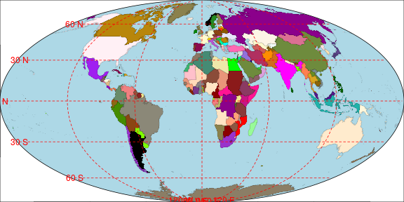
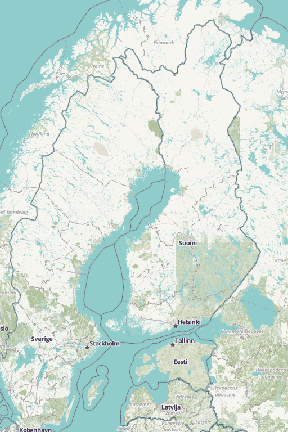

# Introduction

R has extensive facilities for managing, manipulating, and visualising
spatial data, with the [*sp*](https://CRAN.R-project.org/package=sp)
[@sp] and [*raster*](https://CRAN.R-project.org/package=raster)
[@raster] packages providing a set of object classes and core functions
which numerous other packages have built on. It is fairly
straightforward to import spatial data of a variety of types and from a
range of sources including: images for map backgrounds; high-resolution
pixel grids of surface elevation; and polygons of administrative region
boundaries. Large volumes of such data are available for download from
sites such as [worldgrids.org](http://worldgrids.org),
[gadm.org](http://gadm.org), and [nhgis.org](http://nhgis.org), and map
images are freely available from
[OpenStreetMap.org](http://openstreetmap.org) and other online maps. The
first issue often encountered after downloading and importing spatial
data is reconciling different coordinate reference systems (CRS's, or
map projections). Most repositories of spatial data provide
longitude-latitude coordinates, although single-country data sources
often use a country-specific map projection (i.e. the UK's Ordinance
Survey National Grid) and online maps mostly use the Web Mercator
projection. The suitability of a particular map projection will depend
on the geographic region being considered and the specific problem at
hand.

The [*mapmisc*](https://CRAN.R-project.org/package=mapmisc) package
[@mapmisc] provides tools for working with projected data which cover
the following four areas:

-   producing maps with projected data, including scale bars, background
    images, and inset maps;

-   defining and using equal-area map projections for displaying the
    entire globe;

-   creating optimal region-specific map projections where distances are
    preserved; and

-   mapping with colour scales for continuous and categorical data.

This paper will cover each of these points in turn, working through
examples and briefly describing the operations by the functions in the
*mapmisc* package. An emphasis is given to tidy, intuitive, and
reproducible code accessible for students and non-specialists.

## Installation and related packages

The two most important packages required for using spatial data in R are
the *sp* and *raster* packages, which provide tools and classes for
vector data (spatial data on a continuous domain) and raster data
(defined on a pixelated grid) respectively. Installing *mapmisc* with
`install.packages("mapmisc")` or by using a menu item on a GUI will
install *sp* and *raster* if they are not already present. A third
important spatial package is
[*rgdal*](https://CRAN.R-project.org/package=rgdal) [@rgdal], which
provides methods for re-projecting coordinates and importing spatial
data in various file formats. The Geographic Data Abstraction Language
(GDAL) underlies *rgdal*, aligning with R's UNIX-like philosophy of
combining separate and specialised pieces of software. On most
UNIX-based systems, the GDAL and proj4 software must be installed
separately prior to installing *rgdal*. All versions of Windows and most
versions of MacOS have binary versions of *rgdal* which include the GDAL
and proj4 binaries, and *rgdal* can be installed in the same manner as
any other R package.

Additional packages used by *mapmisc* are:
[*RColorBrewer*](https://CRAN.R-project.org/package=RColorBrewer)
[@RColorBrewer],
[*classInt*](https://CRAN.R-project.org/package=classInt) [@classInt],
[*rgeos*](https://CRAN.R-project.org/package=rgeos) [@rgeos], and
[*geosphere*](https://CRAN.R-project.org/package=geosphere)
[@geosphere]. These four packages and *rgdal* are not always installed
automatically with *mapmisc*, as they are marked as "suggested" packages
with *mapmisc* being usable with a reduced level of functionality
without them. Three further packages necessary for reproducing the
examples in this paper are
[*dismo*](https://CRAN.R-project.org/package=dismo) [@dismo],
[*maptools*](https://CRAN.R-project.org/package=maptools) [@maptools],
and [*R.utils*](https://CRAN.R-project.org/package=R.utils) [@R.utils].

Loading the packages with

``` r
library("rgdal")
library("mapmisc")
```

also makes *sp* and *raster* available. The remaining packages do not
need to be loaded explicitly and will be called by *mapmisc* as needed.

## Getting started with spatial data in R

The `getData` function provided by *raster* is able to download a number
of useful and interesting spatial datasets. The coastline and borders of
Finland can be fetched with

``` r
finland <- raster::getData("GADM", country = "FIN", level = 0)
```

The object `finland` is a "SpatialPolygonsDataFrame", and @sp1 contains
a wealth of information on working with objects of this type. The
command

``` r
plot(finland, axes = TRUE)
```

produces the plot in Figure [1](#fig:bareMaps)a.

The choice of Finland as an example is due to its being far from the
equator, and a useful contrast on the other side of the world is New
Zealand. The coastline of New Zealand, obtained with

``` r
nz <- raster::getData("GADM", country = "NZL", level = 0)
```

includes a number of small outlying islands. The spatial extent of the
`nz` object,

``` r
raster::extent(nz)
```

``` r
## class       : Extent 
## xmin        : -179 
## xmax        : 179 
## ymin        : -52.6 
## ymax        : -29.2
```

spans the entire globe in the $x$-direction since New Zealand has
islands on both sides of the $180^{\circ}$ meridian. Finding an
appropriate axis limit through trial and error brings one to

``` r
plot(nz, xlim = c(167, 178), axes = TRUE)
```

and the map in Figure [1](#fig:bareMaps)b.

The outlying islands can be removed from the `nz` object using the
`crop` function in the *raster* package, which in turn calls *rgeos*.
Using the `locator` function and a few iterations of trial and error
leads to the discovery that a region spanning 160 to 180 degrees
longitude and $-47$ to $-30$ degrees latitude boxes in the main islands
of New Zealand fairly tightly. The parts of New Zealand contained within
this box can be extracted by creating an `extent` object and passing it
to `crop`.

``` r
nzClip <- raster::crop(nz, extent(160, 180, -47, -30))
```

The `finland` and `nzClip` objects will be used in the mapping examples
which follow.

# Working with map projections

This section covers mapping projected data and defining customised map
projections. Adding background images, scale bars, and inset maps to
plots with the `map.new`, `openmap`, `scaleBar`, and `insetMap`
functions is demonstrated in the production of
Figure [2](#fig:niceMaps). Map projections suitable for displaying the
entire globe are constructed with the `moll` function, and along with
the `wrapPolys` function Figure [5](#fig:plotMoll) is made. Map
projections where Euclidean distances from $x$-$y$ coordinates are
useful approximations of shortest distances between points on the globe
are obtained with the `omerc` function and used to produce
Figure [7](#fig:mapCanadaProj).

## Spatial data with coordinate reference systems

The spatial coordinates in Figures [1](#fig:bareMaps)a and
[1](#fig:bareMaps)b are angles of longitudes and latitudes; coordinates
which would be equivalent to the two angles of the spherical coordinate
system $(\rho, \theta, \phi)$ familiar to mathematicians were it not for
the inconvenient fact that the Earth is not spherical. The Earth is
rather an oblate spheroid, slightly "squashed" or pumpkin-shaped, and
the angles of orientations of lines pointing directly "up" (with
reference to the stars) and "down" (as defined by a plumb line pulled
straight by gravity) differ. As a result, various types of long-lat
coordinates are in use, with the World Geodesic System (WGS84) used by
Global Positioning Systems being the most widespread. The European
Petroleum Standards Group (EPSG) catalogue of Coordinate Reference
Systems (or CRS's) refers to this system by the code 4326, and this code
can be used to create an R object of class "CRS" corresponding to the
WGS84 system using the `CRS` function from the *sp* package.

``` r
sp::CRS("+init=epsg:4326")
```

``` r
## CRS arguments:
##  +init=epsg:4326 +proj=longlat +datum=WGS84 +no_defs +ellps=WGS84
## +towgs84=0,0,0
```

The syntax of `+argument=value` for specifying a CRS comes from the
[PROJ.4 Cartographic Projections
Library](https://github.com/OSGeo/proj.4/wiki), with `+proj=longlat`
indicating coordinates are angles and `ellps=WGS84` specifying that the
Earth is an ellipsoid with values of the major axis length, minor axis
length, and flattening corresponding to the WGS84 specification.

The difficulty angular coordinates pose for interpreting maps or using
spatial statistics is that Euclidean distance $\sqrt{x^2 + y^2}$ is not
always a useful measure of the distance separating two points. The
shortest route between two points on a sphere follows a Great Circle
which divides the globe into two equal halves. The distance between two
points along this path, the Great Circle distance [see
@wiki:greatCircle], can be computed with a trigonometric formula as
implemented in the `spDists` function in *sp*. Euclidean distance will
be roughly proportional to Great Circle distance for two points near the
equator and reasonably close to one another. In Finland and New Zealand,
however, Euclidean distance will over-emphasise the east-west direction
since one degree of longitude is a much shorter distance (in kilometres)
than one degree of latitude. It is for this reason that Greenland
appears larger than India on many maps even though the opposite is true.
Most R packages which perform spatial analyses rely on Euclidean
distance, including this author's
[*geostatsp*](https://CRAN.R-project.org/package=geostatsp)
[@geostatsp], even though Great Circle distance would be straightforward
to implement. Fitting a spatial model with *geostatsp* to data in
long-lat coordinates from Finland might uncover directional effects with
strong correlation in the east-west direction, which could well be an
artefact arising from the over-estimation of east-west distances. The
importance of transforming spherical coordinates to a coordinate system
where the Euclidean distance is a reasonable approximation to the Great
Circle distance should not be under-estimated.

Most countries have an "official" CRS which produces accurate Euclidean
distances for specific areas of the globe, one of which is the [Finland
Uniform Coordinate System](http://spatialreference.org/ref/epsg/2393)
having EPSG code 2393. This projection is obtained in R by `CRS` with

``` r
CRS("+init=epsg:2393")
```

``` r
## CRS arguments:
##  +init=epsg:2393 +proj=tmerc +lat_0=0 +lon_0=27 +k=1 +x_0=3500000 +y_0=0
## +ellps=intl +towgs84=-96.062,-82.428,-121.753,4.801,0.345,-1.376,1.496
## +units=m +no_defs
```

This is a Transverse Mercator projection (`+proj=tmerc`) with $x$ and
$y$ coordinates giving positions on a cylinder containing the earth. The
entry `+lon_0=27` indicates that the cylinder touches the Earth along
the $27^\circ$ meridian line. Provided two points are reasonably close
to the $27^\circ$ meridian, Euclidean distance between their Finland
Uniform Coordinates will be very close to the true distance between
them. The map of Finland can be converted to this coordinate system
using `spTransform` from *sp* and *rgdal* with

``` r
finlandMerc <- spTransform(finland, CRS("+init=epsg:2393"))
```

Figure [1](#fig:bareMaps)c is the result of plotting this object with
`plot(finlandMerc, axes = TRUE)`. Notice the projected map has a wider
base and narrower top than the long-lat map in
Figure [1](#fig:bareMaps)a. The coordinates in
Figure [1](#fig:bareMaps)c refer to an origin where the $27^\circ$
meridian intersects the equator, with the `+x_0=` argument above
indicating that 3,500km are added to the $x$ coordinates.

<figure id="fig:bareMaps">
<table>
<caption> </caption>
<tbody>
<tr class="odd">
<td style="text-align: center;"></td>
<td style="text-align: center;"></td>
<td style="text-align: center;"></td>
<td style="text-align: center;"></td>
</tr>
<tr class="even">
<td style="text-align: center;">(a) Finland, Longitude-Latitude</td>
<td style="text-align: center;">(b) New Zealand, Longitude-Latitude</td>
<td style="text-align: center;">(c) Finland Transverse Mercator</td>
<td style="text-align: center;">(d) New Zealand, Oblique Mercator</td>
</tr>
</tbody>
</table>
<figcaption>Figure 1: Basic maps of Finland and New Zealand in different
Coordinate Reference Systems.</figcaption>
</figure>

Cylindrical map projections can be constructed from any cylinder
containing the Earth, and there is no mathematical requirement to use
one of the standard transverse Mercator projections with an EPSG number.
For example, a given user might consider the point
$(170^\circ\text{E}, 45^\circ\text{S})$ to be an intuitive location for
the origin of the transformed map of New Zealand, and thus decide to
define a custom CRS with this centre. The cylinder can follow any Great
Circle, it need not be a meridian line, and a Great Circle angled
$40^\circ$ clockwise would run the length of the two islands.
Cylindrical projections with an angle are termed Oblique Mercator
projections [see @snyder1987map page 66], and can be constructed with
the assistance of *mapmisc*'s `omerc` function. A custom projection with
the $(170^\circ\text{E},
45^\circ\text{S})$ origin and a $40^\circ$ rotation is obtained by

``` r
nzCrs <- omerc(c(170, -45), angle = 40)
nzCrs
```

``` r
## CRS arguments:
##  +proj=omerc +lat_0=-45 +lonc=170 +alpha=40 +k=1 +x_0=0 +y_0=0 +gamma=0
## +ellps=WGS84 +units=m
```

The difference between the above and the projection for Finland is the
`omerc` in place of `tmerc`, with the additional argument `+alpha=40`
specifying an angle. The New Zealand coastline can be projected to this
CRS with `spTransform`.

``` r
nzRot <- spTransform(nzClip, nzCrs)
```

Figure [1](#fig:bareMaps)d results from executing
`plot(nzRot, axes = TRUE)`, and New Zealand has been rotated $40^\circ$
to a vertical position.

## Finding a projection

When choosing a map projection for a dataset, a simple web search of a
phrase such as "map projection finland epsg" will often give clear
advice as to what the most commonly used national CRS is. A number of
tools in *rgdal* can be used to obtain a projection in a more systematic
manner. Below the `make_EPSG` function creates a table of all EPSG coded
CRS's which *rgdal* supports, and a `grep` command used to show all
those projections with "Finland" in its description. The resulting list
of projections below confirms that 2393 is a sensible choice.

``` r
allEpsg <- rgdal::make_EPSG()
allEpsg[grep("Finland", allEpsg$note), 1:2]
```

``` r
##      code                                                   note
## 859  2391                                 # KKJ / Finland zone 1
## 860  2392                                 # KKJ / Finland zone 2
## 861  2393              # KKJ / Finland Uniform Coordinate System
## 862  2394                                 # KKJ / Finland zone 4
## 1853 3386                                 # KKJ / Finland zone 0
## 1854 3387                                 # KKJ / Finland zone 5
## 4929 3901 # KKJ / Finland Uniform Coordinate System + N60 height
```

A second method for obtaining a CRS is to make a rough guess at a
projection string and use `showEPSG` to attempt to find a corresponding
EPSG code. Were one to use a Universal Transverse Mercator (or UTM)
projection for a map of Finland, a web search for "UTM zone map" shows
that Finland lies in UTM zone 35. A proj4 specification of a UTM zone 35
projection will contain `+proj=utm` and `+zone=35`, and `showEPSG`
states that the EPSG code 32635 corresponds to an appropriate CRS.

``` r
rgdal::showEPSG("+proj=utm +zone=35")
```

``` r
## [1] "32635"
```

``` r
CRS("+init=epsg:32635")
```

``` r
## CRS arguments:
##  +init=epsg:32635 +proj=utm +zone=35 +datum=WGS84 +units=m +no_defs
## +ellps=WGS84 +towgs84=0,0,0
```

The definitive resource for information on national map projections is
contained in the monthly bulletins of [The Imaging and Geospatial
Information Society](http://www.asprs.org). The `GridsDatums` data set
in *rgdal* gives the year and month for each country's entry at
[www.asprs.org/Grids-Datums.html](http://www.asprs.org/Grids-Datums.html).
The [entry for
Finland](http://www.asprs.org/wp-content/uploads/2012/05/10-2006-finland.pdf)
appears in the October 2006 issue.

``` r
data("GridsDatums", package = "rgdal")
GridsDatums[grep("Finland", GridsDatums$country), ]
```

``` r
##                 country     month year ISO
## 100 Republic of Finland (October) 2006 FIN
```

## Mapping projected data

The *mapmisc* functions `openmap`, `map.new`, `scaleBar`, and `insetMap`
can be used together to improve on the basic maps in Figure
[1](#fig:bareMaps), and they are used here to add background images, a
scale bar, and an inset map to Figure [2](#fig:niceMaps).

Background map images are obtained from the `openmap` function, which
downloads image files from [OpenStreetMap.org](http://openstreetmap.org)
or a number of other sources. The images used in
Figure [2](#fig:niceMaps) were obtained with

``` r
nzBg <- openmap(nzRot, path = "mapquest-sat")
finlandBg <- openmap(finlandMerc, path = "landscape")
```

<figure id="fig:niceMaps">
<table>
<caption> </caption>
<tbody>
<tr class="odd">
<td style="text-align: center;"></td>
<td style="text-align: center;"></td>
</tr>
<tr class="even">
<td style="text-align: center;">(a) Finland. Background © <a
href="http://openstreetmap.org/copyright">OpenStreetMap</a></td>
<td style="text-align: center;">(b) New Zealand. Tiles courtesy of <a
href="http://www.mapquest.com">MapQuest</a> and © <a
href="http://openstreetmap.org/copyright">OpenStreetMap</a></td>
</tr>
</tbody>
</table>
<figcaption>Figure 2: Maps produced using the <em>mapmisc</em> package,
containing background images, inset maps, and scale bars.</figcaption>
</figure>

The first argument of `openmap` is used to set both the spatial extent
of the map to be retrieved and the CRS the map will be projected to. Any
spatial object `x` for which `extent(x)` and `projection(x)` are defined
can be provided to `openmap`. The `path =` argument specifies the source
of the map, and sample maps from the various sources are shown in
Figure [11](#fig:allTilePlot) in the Appendix. The objects produced by
`openmap` are raster objects, converted from image files downloaded from
web map servers. The Finland map is an object of class "RasterLayer".

``` r
finlandBg
```

``` r
## class       : RasterLayer 
## dimensions  : 768, 376, 288768  (nrow, ncol, ncell)
## resolution  : 2747, 2252  (x, y)
## extent      : 2889952, 3922969, 6183827, 7913059  (xmin, xmax, ymin, ymax)
## coord. ref. : +init=epsg:2393 +proj=tmerc +lat_0=0 +lon_0=27 +k=1 +x_0=3500000 +...
## data source : in memory
## names       : landscape 
## values      : 1, 1022  (min, max)
```

Notice that the CRS is the same as for the `finlandMerc` object. The New
Zealand map is a "RasterStack" with red, green and blue layers.

``` r
nzBg
```

``` r
## class       : RasterStack 
## dimensions  : 512, 289, 147968, 3  (nrow, ncol, ncell, nlayers)
## resolution  : 5237, 5190  (x, y)
## extent      : -1e+06, 510285, -977333, 1680003  (xmin, xmax, ymin, ymax)
## coord. ref. : +proj=omerc +lat_0=-45 +lonc=170 +alpha=40 +k=1 +x_0=0 +y_0=0 +gam...
## names       : mapquest.satRed, mapquest.satGreen, mapquest.satBlue 
## min values  :               0,                 0,                0 
## max values  :             248,               250,              247
```

The Finland map can be viewed with `plot(finlandBg)`, whereas the
three-layered New Zealand map needs the `plotRGB` function for plotting
its red, green and blue values as colours.

Figure [2](#fig:niceMaps)a is produced with the four function calls
below.

``` r
map.new(finlandMerc, 0.8)
plot(finlandBg, add = TRUE)
plot(finlandMerc, add = TRUE)
scaleBar(finlandMerc, "bottomright")
insetMap(finlandMerc, "right", width = 0.3, cropInset = extent(0, 180, -50, 70))
```

The functions run are the following:

-   `map.new` initialises a new plot area suitable for showing
    `finlandMerc`. The second argument set to `0.8` specifies that the
    left 80% of the plot will contain the map and the right 20% will be
    reserved for legends or inset maps.

-   `plot(finlandBg, add = TRUE)` adds the background map to the
    existing plot.

-   `plot(finlandMerc, add = TRUE)` adds the border of Finland from the
    `finlandMerc` object.

-   `scaleBar` produces the 200km scale and north arrow at the bottom
    right. The `finlandMerc` object is required to inform `scaleBar`
    that the Finland Uniform Coordinate System is used, and
    `scaleBar(CRS("+init=epsg:2393"), "bottomright")` would have
    achieved the same effect.

-   `insetMap` produces the small map to the right, showing in red on
    the inset map the area covered by the plot. As with `scaleBar` it
    uses `finlandMerc` to obtain the CRS of the map coordinates. The
    `width` argument specifies the width of the inset map as a fraction
    of the plotting region. The `cropInset` argument produces an inset
    map where New Zealand (at $170^\circ$E and $45^\circ$S) is in the
    south-west corner, and the northern limit of Finland (roughly
    $70^\circ$) is encompassed.

The New Zealand map in Figure [2](#fig:niceMaps)b is produced with
similar code.

``` r
map.new(nzRot, 0.8)
plotRGB(nzBg, add = TRUE)
rgdal::llgridlines(nzRot, col = "yellow")
plot(nzRot, add = TRUE, border = "red")
scaleBar(nzRot, "left")
insetMap(nzRot, "right", width = 0.3, cropInset = extent(0, 180, -50, 70))
```

The use of `plotRGB` in place of `plot` is used for the background map,
and the scale bar has been placed at the centre-left. The `llgridlines`
function from *rgdal* added latitude and meridian lines in yellow.

The images in Figure [2](#fig:niceMaps) have dimensions of 4 by 5
inches, saved as `png` files with 72 pixels per inch. Executing the code
above in an interactive R session will likely produce maps with a
slightly different appearance unless the graphics window has these same
dimensions. This document is produced with
[*knitr*](https://CRAN.R-project.org/package=knitr) [@knitr1], and the
figure dimensions are set with the `fig.height = ` and `fig.width = `
options to code chunks.

The map images in `finlandBg` and `nzBg` were retrieved from
[OpenStreetMap.org](http://openstreetmap.org) and
[MapQuest](http://www.mapquest.com) respectively, and although they are
free to use and reproduce they must be attributed. The
`openmapAttribution` function produces an attribution for an object
produced by `openmap` or a string valid as a `path = ` argument for
`openmap`. An attribution for `nzBg` (or `"mapquest-sat"`), as in the
caption for Figure [2](#fig:niceMaps), is produced with

``` r
openmapAttribution(nzBg, short = TRUE)
```

``` r
##                                   mapquest.sat 
## "Tiles courtesy of MapQuest(www.mapquest.com)"
```

The Acknowledgements section of this paper has used this function
without the `short = TRUE` argument.

``` r
openmapAttribution(finlandBg)
```

``` r
##   landscape 
## "copyright OpenStreetMap.org contributors. Data by OpenStreetMap.org
 #  available under the Open Database License (opendatacommons.org/licenses/odbl),
 #  cartography by Thunderforest.com"
```

The additional argument `type = "latex"` is used in the source code for
this paper, and `type = "markdown"` is also available.

## Projecting background maps

There are a number of potential pitfalls involved when using background
map images with projected data, and this section will describe some
additional options to `openmap` and `map.new` which can help in this
regard.

Two undesirable features of Figure [2](#fig:niceMaps)a are the white
triangular section in the top left of the map, and the low resolution
and lack of legibility of the names of towns and cities. How this arose
can be understood by contrasting the map image retrieved from
[OpenStreetMap.org](http://openstreetmap.org) in Figure
[3](#fig:finlandBgMercMap)a with the Finland Uniform Coordinate System
map in Figure [3](#fig:finlandBgMercMap)b. The map in Figure
[3](#fig:finlandBgMercMap)a uses coordinates in the Spherical Mercator
projection, where a vertically-oriented cylinder is wrapped around a
spherical Earth at the equator,[^1] and the rectangular area covered by
the original map becomes somewhat trapezoidal when projected to the
Transverse Mercator coordinates in Figure [3](#fig:finlandBgMercMap)b.
The transformation has distorted the text on the image, and the image
does not completely cover the black rectangle corresponding to the
plotting region of Figure [2](#fig:niceMaps)a.

<figure id="fig:finlandBgMercMap">
<table>
<caption> </caption>
<tbody>
<tr class="odd">
<td style="text-align: center;"></td>
<td style="text-align: center;"></td>
</tr>
<tr class="even">
<td style="text-align: center;">(a) Spherical Mercator</td>
<td style="text-align: center;">(b) Finland UCS</td>
</tr>
</tbody>
</table>
<figcaption>Figure 3: Map images of Finland in the Spherical Mercator
projection and the Finland Uniform Coordinate System (UCS) projection. ©
<a
href="http://openstreetmap.org/copyright">OpenStreetMap</a>.</figcaption>
</figure>

The map images provided by
[OpenStreetMap.org](http://openstreetmap.org) and elsewhere are
available at different zoom levels or resolutions. A map at zoom level 0
is a 256 by 256 pixel image covering the entire world. Zoom level 1
covers the world in 4 "map tiles" of 256 by 256 pixels, and zoom level
$N$ consists of $4^N$ such tiles. The zoom level can be specified
directly in `openmap` with the `zoom = ` argument, or indirectly with
the `maxTiles = ` argument. With the default value of `maxTiles = 9`,
`opemnap` will find the highest zoom level where the number of map tiles
required to cover the spatial object supplied is at most 9. The
`finlandBg` map has a zoom level of 5 and 6 tiles, giving a 376 by 768
pixel image. This information is contained in an attribute of
`finlandBg`.

``` r
attributes(finlandBg)$tiles
```

``` r
## $tiles
## [1] 6
## 
## $zoom
## [1] 5
## 
## $path
##                                 landscape 
## "http://tile.opencyclemap.org/landscape/"
```

``` r
dim(finlandBg)
```

``` r
## [1] 768 376   1
```

When `openmap` projects the downloaded map tiles to the Finland CRS
(using `projectRaster` from the *raster* package), a number of pixels
from the original map are lost or put out of position and the text can
become mangled.

A partial solution for improving projected images is best illustrated
with the rotated CRS used for New Zealand. Figure [4](#fig:aucklandMap)a
shows a map of Auckland, New Zealand, in the Spherical Mercator
projection provided by [OpenStreetMap.org](http://openstreetmap.org),
and the rotated Oblique Mercator projection used earlier is used for the
map in Figure [4](#fig:aucklandMap)b. The map images are obtained by
creating a "SpatialPoints" object for the location of Auckland in
long-lat coordinates and projecting it to the CRS of the `nzRot` object
from Figure [2](#fig:niceMaps)b.

``` r
aucklandLL <- SpatialPoints(data.frame(x = 174.764204, y = -36.853744), 
    proj4string = crsLL)
auckland <- spTransform(aucklandLL, projection(nzRot))
```

`crsLL` is an object in *mapmisc* specifying the WGS84 projection,
identical to `CRS("+init=epsg:4326)`. The map in
Figure [4](#fig:aucklandMap)b is retrieved below.

``` r
aucklandBg <- openmap(auckland, buffer = 3000, maxTiles = 4)
```

The `buffer = ` argument specifies an additional area around `auckland`
which the map should cover (in this case 3km), and specifying
`maxTiles = 4` will select the highest zoom level which is able to cover
the map region with four or fewer tiles. A map at the same zoom level in
the Spherical Mercator projection, for Figure [4](#fig:aucklandMap)a, is
obtained next.

``` r
aucklandBgMerc <- openmap(auckland, zoom = attributes(aucklandBg)$tiles$zoom, 
    path = attributes(aucklandBg)$tiles$path, crs = crsMerc)
```

The `crsMerc` object gives the Spherical Mercator projection.

``` r
crsMerc
```

``` r
## CRS arguments:
##  +proj=merc +a=6378137 +b=6378137 +lat_ts=0.0 +lon_0=0.0 +x_0=0.0 +y_0=0
## +k=1.0 +units=m +no_defs
```

Figure [4](#fig:aucklandMap)c shows only the area within 3km of the
`auckland` object, produced by adding the `buffer = 3000` argument to
`map.new`.

``` r
map.new(auckland, buffer = 3000)
plot(aucklandBg, add = TRUE)
scaleBar(auckland, "topleft")
```

One problem with Figure [4](#fig:aucklandMap)b has been resolved, since
the displayed area is entirely contained within the map image. The text
in Figure [4](#fig:aucklandMap)c is visibly distorted, and the
distortion is reduced by increasing the resolution of the image prior to
re-projection. The `fact = 4` argument to the call to `openmap` below
increases the resolution of the raster by a factor of 4, creating 16
times the number of pixels, yielding the map in Figure
[4](#fig:aucklandMap)d.

``` r
aucklandFine <- openmap(auckland, buffer = 3000, 
    zoom = attributes(aucklandBg)$tiles$zoom, fact = 4)
map.new(auckland, buffer = 3000)
plot(aucklandFine, add = TRUE)
scaleBar(auckland, "topleft")
```

Re-projecting rasters is computationally intensive, and `openmap` can
require considerable running time when the zoom level or `fact` argument
are large.

<figure id="fig:aucklandMap">
<table>
<caption> </caption>
<tbody>
<tr class="odd">
<td style="text-align: center;"></td>
<td style="text-align: center;"></td>
</tr>
<tr class="even">
<td style="text-align: center;">(a) Spherical Mercator</td>
<td style="text-align: center;">(b) Oblique Mercator</td>
</tr>
<tr class="odd">
<td style="text-align: center;"></td>
<td style="text-align: center;"></td>
</tr>
<tr class="even">
<td style="text-align: center;">(c) Oblique, detail</td>
<td style="text-align: center;">(d) Oblique, high resolution</td>
</tr>
</tbody>
</table>
<figcaption>Figure 4: Map images of Auckland, NZ, in Spherical Mercator
and Oblique Mercator projections. © <a
href="http://openstreetmap.org/copyright">OpenStreetMap</a>.</figcaption>
</figure>

## Equal-area map projections

This section covers producing maps of the entire globe using the
functions `moll`, `wrapPoly`, and `gridlinesWrap`. A number of different
Coordinate Reference Systems (CRS's) are used to display maps of the
world, and @xkcd is a useful introduction to some of the most popular of
these. Figure [5](#fig:plotMoll)a shows the world in a Mollweide
projection [@wiki:moll], an equal-area CRS with the property that the
sizes of polygons on the map are roughly proportional to their true
surface areas. Figures [5](#fig:plotMoll)b, [5](#fig:plotMoll)e and
[5](#fig:plotMoll)f use Mollweide projections with different origins and
angles of orientation, projections which are obtainable with *mapmisc*.

Polygons corresponding to the borders of the countries of the world are
contained in the `wrld_simpl` object from the *maptools* package, and
this object will be used to produce the images in
Figure [5](#fig:plotMoll). The object is loaded with

``` r
data("wrld_simpl", package = "maptools")
wrld_simpl
```

``` r
## class       : SpatialPolygonsDataFrame 
## features    : 246 
## extent      : -180, 180, -90, 83.6  (xmin, xmax, ymin, ymax)
## coord. ref. : +proj=longlat +ellps=WGS84 +datum=WGS84 +no_defs +towgs84=0,0,0 
## variables   : 11
## names       : FIPS, ISO2, ISO3,  UN,           NAME,    AREA,  POP2005, REGION, ...
## min values  :     ,   AD,  ABW,  10, Aaland Islands,       0, 0.00e+00,      0, ...
## max values  :   ZI,   ZW,  ZWE,  96,       Zimbabwe,   99545, 9.94e+04,      9, ...
```

and a selection of R's named colours is assigned to the countries as
follows.

``` r
colVec <- grep("gray|white|snow|ivory|turquoise|blue|[1-3]", colours(distinct = TRUE), 
    invert = TRUE, value = TRUE)
wrld_simpl$col <- rep_len(colVec, length(wrld_simpl))
```

The `moll` function creates "CRS" objects for Mollweide projections,
which can be used with `spTransform` to compute a Mollweide projection
of `wrld_simpl`.

``` r
mollCrs <- moll()
worldMoll <- spTransform(wrld_simpl, mollCrs)
```

This "CRS" object is specified with a string similar to those seen
earlier, with `+proj=moll` being the defining feature.

``` r
mollCrs
```

``` r
## CRS arguments:
##  +proj=moll +lon_wrap=0 +lon_0=0 +x_0=0 +y_0=0 +ellps=WGS84 +datum=WGS84
## +units=m +no_defs +towgs84=0,0,0
```

The `moll` function adds two additional attributes to the "CRS" object
produced, one of which is the "ellipse" object containing the spatial
extent of the Earth in this projection.

``` r
names(attributes(mollCrs))
```

``` r
## [1] "projargs" "class"    "crop"     "ellipse"
```

The `map.new` function uses the "ellipse" attribute to define the
plotting region and add the light blue background in
Figure [5](#fig:plotMoll)a.

``` r
map.new(mollCrs, col = "lightblue")
plot(worldMoll, add = TRUE, col = worldMoll$col, 
    border = col2html("black", opacity = 0.2))
gridlinesWrap(worldMoll, lty = 2, col = "red")
```

The standard Mollweide projection is symmetric about the $0^\circ$
Greenwich meridian line and the globe is wrapped or split in the Pacific
ocean at the $180^\circ$ latitude line. Figure [5](#fig:plotMoll)b is
centred around a meridian line passing through Hawaii and splits the
Earth along a longitude line passing through Africa and Europe. The CRS
for this centred Mollweide projection is produced from the `moll`
function, which adds Hawaii's longitude to the `+lon_wrap` and `+lon_0`
components of the CRS.

``` r
(mollHawaii <- moll(geocode("hawaii")))
```

``` r
## CRS arguments:
##  +proj=moll +lon_wrap=-155.5827818 +lon_0=-155.5827818 +x_0=0 +y_0=0
## +ellps=WGS84 +datum=WGS84 +units=m +no_defs +towgs84=0,0,0
```

A difficulty with this Hawaiian Mollweide projection is that the
meridian line along which the world is split runs through many of the
polygons in `wrld_simpl`. The `spTransform` function used with this
projection produces the polygons in Figure [5](#fig:plotMoll)c, with
horizontal lines connecting the two halves of polygons which have been
split. The `wrapPoly` function in *mapmisc* addresses this problem by
splitting the affected polygons prior to their projection, using the
"crop" attribute of the "CRS" object produced by `moll`.

``` r
worldHawaii <- wrapPoly(wrld_simpl, mollHawaii)
```

The red vertical line in Figure [5](#fig:plotMoll)d is produced from
`attributes(mollHawaii)$crop`, and the function `gDifference` from
*rgeos* is called by `wrapPoly` to remove the portion of each polygon
intersecting with this line.

A Mollweide projection need not have a north-south orientation, and an
Oblique Mollweide projection can be constructed by rotating the globe's
long-lat coordinates to produce different origins and orientations.
Figure [5](#fig:plotMoll)e positions Jerusalem at the centre of the
Earth (standard practice for cartographers during the middle ages), and
at Jerusalem the "up" direction is $35^\circ$ clockwise of north.

``` r
(mollOblique <- moll(geocode("jerusalem"), angle = 35))
```

``` r
## CRS arguments:
##  +proj=ob_tran +o_proj=moll +o_lon_p=-42.7134520141079
## +o_lat_p=44.2305998589378 +lon_0=-17.7121046024056
## +lon_wrap=-17.7121046024056 +ellps=WGS84 +datum=WGS84 +units=m +no_defs
## +towgs84=0,0,0
```

<figure id="fig:plotMoll">
<table>
<caption> </caption>
<tbody>
<tr class="odd">
<td style="text-align: center;"></td>
<td style="text-align: center;"></td>
</tr>
<tr class="even">
<td style="text-align: center;">(a) Mollweide, Greenwich</td>
<td style="text-align: center;">(b) Mollweide, Hawaii</td>
</tr>
<tr class="odd">
<td style="text-align: center;"></td>
<td style="text-align: center;"></td>
</tr>
<tr class="even">
<td style="text-align: center;">(c) Hawaii with
<code>spTransform</code></td>
<td style="text-align: center;">(d) Long-Lat</td>
</tr>
<tr class="odd">
<td style="text-align: center;"></td>
<td style="text-align: center;"></td>
</tr>
<tr class="even">
<td style="text-align: center;">(e) Oblique Mollweide, Jerusalem</td>
<td style="text-align: center;">(f) Oblique Mollweide, Pacific</td>
</tr>
</tbody>
</table>
<figcaption>Figure 5: World maps in Mollweide projections.</figcaption>
</figure>

This string specifies two projections are to be applied. First,
`+proj=ob_tran` rotates the long-lat coordinates to move the north pole
to the coordinate ($44^\circ$N, $42^\circ$W). Second, `+o_proj=moll`
applies a Mollweide projection to these rotated coordinates using
$17.7^\circ$W as the central meridian line. These three values
($44^\circ$N, $42^\circ$W, $17.7^\circ$W) are obtained by numerical
optimisation, attempting to move Jerusalem as close as possible to the
origin while preserving the $35^\circ$ orientation.

Figure [5](#fig:plotMoll)e is produced by first re-projecting the world
map with `wrapPoly`.

``` r
worldOblique <- wrapPoly(wrld_simpl, mollOblique)
```

Adding red longitude and latitude grid lines with this projection cannot
be done with the `llgridlines` function from *rgdal*, as the same
horizontal striping seen in Figure [5](#fig:plotMoll)c will result. The
`gridlinesWrap` function from *mapmisc* breaks the grid lines in the
same manner as `wrapPoly`, and adds the red graticule lines as follows.

``` r
map.new(mollOblique, col = "lightblue")
plot(worldOblique, add = TRUE, col = worldOblique$col, 
    border = col2html("black", 0.2))
gridlinesWrap(worldOblique, lty = 2, col = "red")
```

Figure [5](#fig:plotMoll)f uses an Oblique Mollweide centred in the
Pacific ocean with a $85^\circ$ angle of rotation.

``` r
crsN <- moll(c(-140, 40), angle = 85)
```

Unlike the red line of the Hawaiian projection in Figure
[5](#fig:plotMoll)d, the green and blue curves showing where the globe
is wrapped for the two Oblique Mollweide projections lie in the ocean
for the most part.

::: {#tab:areas}
  --------------------------------------------------------------------------------
             Truth   Spherical Mercator   Greenwich   Hawaii   Jerusalem   Pacific
  -------- ------- -------------------- ----------- -------- ----------- ---------
  Canada      9.98                49.72        9.74     9.79        9.61      9.66

  Congo       2.35                 2.36        2.34     1.95        2.34      2.34

  ratio       4.26                21.08        4.17     5.03        4.11      4.13
  --------------------------------------------------------------------------------

  : Table 1: Surface areas (in millions of km$^2$) of Canada and Congo,
  and areas computed for country polygons in the Spherical Mercator
  projection and four Mollweide projections. Columns refer to the
  standard Mollweide projection (Greenwich) and the Mollweide centred on
  Hawaii, Jerusalem, and the north Pacific from
  Figures [5](#fig:plotMoll)a, [5](#fig:plotMoll)b, [5](#fig:plotMoll)e
  and [5](#fig:plotMoll)f.
:::

Table [1](#tab:areas) computes the surface areas of Canada and the Congo
by using the `gArea` function from *rgeos* on different transformations
of the `wrld_simpl` polygons. The first column shows the true surface
areas (according to Wikipedia) and the third row shows the ratio of
Canada's surface area to the Congo's. The Spherical Mercator projection
vastly over-represents the size of Canada and the four Oblique Mollweide
projections are consistent in underestimating the area by a small
amount. The Congo is poorly served by the Hawaiian projection, which is
unsurprising as this projection splits the Congo through the middle.

## Custom-optimised Oblique Mercator projections

This section describes the use of the `omerc` function for defining
Oblique Mercator projections. Two methods of optimising map projections
are implemented, with the angle of rotation chosen to produce the most
compact bounding box possible or to preserve distances between a
collection of points.

### Ad-hoc projections for compact plotting regions

Compact representations minimising the number of void cells (i.e. those
falling in the ocean) offer computational advantages when used with
statistical models or software requiring data on a grid, such as the
Markov random field based methods used in @geostatsp.
Figure [6](#fig:nzRotOptMap) shows New Zealand rotated in order to
produce a compact plotting area, with bounding box having the greatest
possible proportion of its area made up of land mass. This projection
also minimises the number of vertical inches which
Figure [6](#fig:nzRotOptMap) takes up on the page, which is the reason a
clockwise rotation is used in place of the anti-clockwise rotation from
Figure [2](#fig:niceMaps)b.

The `omerc` function calculates these ad-hoc projections based on the
object to be re-projected and a vector of rotation angles. The first
argument below is the `nzClip` object containing the cropped boundary of
New Zealand, and the origin of the Oblique Mercator projection will be
its centroid. A sequence of Oblique Mercator projections using Great
Circles angled between 10 and 50 degrees from the north will be
formulated, and the bounding box of New Zealand in each projection will
be computed. The projection returned by `omerc` uses the angle giving
the smallest such box, with the argument `+alpha=` showing an
$18.5^\circ$ angle in this example.

``` r
(nzRotOptCrs <- omerc(nzClip, seq(10, 50, by = 0.5), post = "wide"))
```

``` r
## CRS arguments:
##  +proj=omerc +lat_0=-40.565 +lonc=172.502 +alpha=18.5 +k=1 +x_0=0 +y_0=0
## +gamma=90 +ellps=WGS84 +units=m
```

A positive angle rotates the coordinate axes clockwise, which gives the
resulting map the appearance of being rotated anti-clockwise. An Oblique
Mercator's Great Circle becomes the $y$-axis of the coordinate system,
and a projection should seek to have as much of the area of interest as
possible being close to this Great Circle. An optimal projection will
therefore have a tall and narrow bounding box, in this instance the
spine of New Zealand should run up and down the $y$-axis. The limits of
10 and 50 for the sequence of angles above are arbitrary estimates of
the amount of anti-clockwise rotation required to sit New Zealand
upright. The argument `post = "wide"` in `omerc` specifies that a short
and wide bounding box is required, and this is accomplished by rotating
the planar $x$-$y$ coordinates post-projection using the `+gamma=90`
element.

New Zealand is re-projected and a new background map in this projection
is produced below.

``` r
nzRotOpt <- spTransform(nzClip, nzRotOptCrs)
nzBgRot <- openmap(nzRotOpt, path = "cartodb", buffer = 20000, fact = 2)
```

Figure [6](#fig:nzRotOptMap) is produced with the following.

``` r
map.new(nzRotOpt, 0.8)
plot(nzBgRot, add = TRUE)
plot(nzRotOpt, add = TRUE, border = "red")
plot(extent(nzRotOpt), add = TRUE, col = "blue")
scaleBar(nzRotOpt, "bottomright", bty = "n")
insetMap(nzRotOpt, "topright", cropInset = extent(0, 180, -50, 70), width = 0.2)
```

![Figure 6: New Zealand in a $18.5^\circ$ Oblique Mercator projection (
[**---** ]{style="color: red"} ) with bounding box ( [**---**
]{style="color: blue"} ). Background © [CartoDB](http://cartodb.com), ©
[OpenStreetMap](http://openstreetmap.org/copyright).](figure/nzRotOptMap-1.png){#fig:nzRotOptMap
width="100%" alt="graphic without alt text"}

### Preservation of distances

Here we seek the parameters of an Oblique Mercator projection that would
preserve at best the Euclidean distances among a set of points on the
surface of the Earth. This is particularly useful for large countries
away from the equator and we will use Canada as an example.
Figure [7](#fig:mapCanadaProj) shows Canada in six different CRS's, the
first of which is an Oblique Mercator optimised to preserve distances
between 12 provincial and territorial capital cities. Unlike the New
Zealand projection, however, the $x$-$y$ coordinates on the Mercator's
cylinder are inverse-rotated to preserve the north-south direction as
up-down.

Oblique Mercator projections are defined by an origin and an angle of
rotation, only the latter is optimised by the `omerc` function while the
origin is set by the user. Here we will set the origin somewhat
arbitrarily as the town of Flin Flon, Manitoba, as an alternative to the
centroid-based origin used earlier. Residents of Toronto, this author
included, affectionately refer to their city as "The Centre of the
Universe" [^2], but Flin Flon is a more suitable Oblique Mercator
centroid for two reasons. First, Flin Flon's latitude is a useful
compromise between a northerly centroid able to accommodate the Arctic
islands and a centroid close to the populated areas in the south.
Second, using Flin Flon as the location where the inverse rotation will
preserve the north-south direction as vertical should produce a map with
a familiar shape since a portion of the southern border following the
$49^\text{th}$ parallel will be horizontal.

The locations of the cities required to compute this projection (Flin
Flon and the provincial capitals) can be retrieved from
[Google](http://www.google.com) using the *dismo* package. A wrapper for
the `geocode` function in *mapmisc* converts the data retrieved by
*dismo* to a "SpatialPointsDataFrame" object.

``` r
provincialCapitals <- mapmisc::geocode(c("Vancouver, BC", "Edmonton, AB", "Regina", 
    "Winnipeg", "Toronto, ON", "Quebec city", "Fredericton", "Charlottetown", 
    "Halifax, NS", "St Johns, NL", "Iqaluit", "Whitehorse", "Yellowknife"), 
    verbose = TRUE)
flinflon <- mapmisc::geocode("Flin Flon")p
```

The names of the provincial capitals and the location of Flin Flon are
below.

``` r
provincialCapitals$name
```

``` r
##  [1] "Vancouver"     "Edmonton"      "Regina"        "Winnipeg"     
##  [5] "Toronto"       "Quebec City"   "Fredericton"   "Charlottetown"
##  [9] "Halifax"       "St John's"     "Iqaluit"       "Whitehorse"   
## [13] "Yellowknife"
```

``` r
coordinates(flinflon)
```

``` r
##   longitude latitude
## 1      -102     54.8
```

The arguments given in the call to `omerc` below consist of: `x` giving
`flinfon` as the origin of the projection; `angle` giving a sequence of
rotation angles to be considered; `post = "north"` specifying that the
planar coordinates should be inverse-rotated to preserve the north
direction; and `preserve` supplying the locations of the provincial
capitals other than Iqaluit (the northerly capital of Nunavut) for
calculating the distances which the projections will seek to preserve.

``` r
(cproj <- omerc(x = flinflon, angle = seq(-85, 85, by = 0.25), post = "north", 
    preserve = provincialCapitals[provincialCapitals$name != "Iqaluit", ]))
```

``` r
## CRS arguments:
##  +proj=omerc +lat_0=54.766 +lonc=-101.876 +alpha=-83.5 +k=0.998 +x_0=0
## +y_0=0 +gamma=-83.498 +ellps=WGS84 +units=m
```

The projection above uses an origin (specified by `lat` and `longc`) at
the coordinates of Flin Flon and a cylinder tangent to the Earth along a
Great Circle angled $83.5^\circ$ anticlockwise (given by `alpha`). The
`k = 0.998` component of the CRS scales the coordinates down by a small
amount (0.2%). Although pairs of points along the Great Circle will have
Euclidean distances and Great Circle distances being equal, the
provincial capitals are some distance from this Great Circle and without
scaling their Euclidean distances would overestimate true distances by
0.2%. The `gamma = -83.5` component appears as a consequence of having
used the `post = "north"` option, rotating the coordinates on the
cylinder so that a vertical line passing through the origin contains
points which are directly north or south of each other.

Two cities on Figure [7](#fig:mapCanadaProj) for whom coordinates have
not yet been retrieved are Kitimat, British Columbia, and the hamlet of
Grise Fiord, Canada's most northerly civilian settlement[^3]. These
locations are obtained below.

``` r
moreCities <- mapmisc::geocode(c("Grise Fiord", "Kitimat"))
cities <- bind(provincialCapitals, moreCities, flinflon)
```

Also shown is the Great Circle which forms the $y$-axis of the Oblique
Mercator. This circle is created using one of the many useful functions
in the *geosphere* package.

``` r
gcircle <- SpatialPoints(geosphere::greatCircleBearing(flinflon@coords, -83.75),
    proj4string = CRS("+init=epsg:4326"))
```

<figure id="fig:mapCanadaProj">
<table>
<caption> </caption>
<tbody>
<tr class="odd">
<td style="text-align: center;"></td>
<td style="text-align: center;"></td>
</tr>
<tr class="even">
<td style="text-align: center;">(a) Oblique Merc</td>
<td style="text-align: center;">(b) Lambert</td>
</tr>
<tr class="odd">
<td style="text-align: center;"></td>
<td style="text-align: center;"></td>
</tr>
<tr class="even">
<td style="text-align: center;">(c) 2pt Equidist</td>
<td style="text-align: center;">Mollweide</td>
</tr>
<tr class="odd">
<td style="text-align: center;"></td>
<td style="text-align: center;"></td>
</tr>
<tr class="even">
<td style="text-align: center;">(e) Spherical Merc</td>
<td style="text-align: center;">(f) Long-Lat</td>
</tr>
</tbody>
</table>
<figcaption>Figure 7: Canada and selected cities in five map
projections, along with the Great Circle defining the Oblique Mercator
projection ( <span style="color: blue"><span
class="math inline">⋅</span> <span class="math inline">⋅</span> <span
class="math inline">⋅</span></span> ). Background from <a
href="http://www.nrcan.gc.ca">Natural Resources Canada</a>.</figcaption>
</figure>

Five projections in addition to the Oblique Mercator are shown in Figure
[7](#fig:mapCanadaProj): a Lambert Conformal Conic projection used by
the Atlas of Canada (EPSG code 3347); a Two-Point Equidistant projection
based on the cities of Edmonton and Toronto (obtained from `tpeqd`); a
Mollweide projection centred on Flin Flon; the Spherical Mercator used
by OpenStreetMap.org and other internet sites; and longitude-latitude or
angular coordinates. A list is created containing these four projections
using *mapmisc*'s `tpeqd` function in part.

``` r
crsList <- list("Oblique Merc" = cproj, "Lambert" = CRS("+init=epsg:3347"),
    "2pt Equidist" = tpeqd(cities[cities$name %in% c("Edmonton", "Toronto"), ]),
    "Mollweide" = moll(flinflon, angle = 0), "Spherical Merc" = mapmisc::crsMerc, 
    "Long-Lat" = mapmisc::crsLL)
```

The cities and Great Circle are transformed to each of the projections
with `mapply`.

``` r
citiesT <- mapply(spTransform, CRSobj = crsList, MoreArgs = list(x = cities))
```

Code for retrieving background maps and for producing Figure
[7](#fig:mapCanadaProj) appears in the Appendix.

Notable features in Figure [7](#fig:mapCanadaProj) are the Spherical
Mercator's overemphasis of the high Arctic regions, the downward slope
of the Lambert projection, the upward slope of the Two-Point Equidistant
map, and the "skinny" appearance of the Mollweide. The Oblique
Mercator's Great Circle, passing through Flin Flon, Halifax and Kitimat
at a nearly horizontal ${-83.5}^\circ$, is necessarily a
straight line in the Oblique Mercator projection and is reasonably
straight in three other projections. The yellow longitude-latitude lines
and three north arrows on each plot show that only the Spherical
Mercator and long-lat projections have the property that north is in the
vertical direction throughout the map.

::: {#tab:distTable}
  --------------------------------------------------------------------------------
                Oblique Merc   Lambert   2pt Equidist   Mollweide   Spherical Merc
  ----------- -------------- --------- -------------- ----------- ----------------
  **south**                                                       

    mean             $-0.05$   $-0.23$        $-0.13$     $-6.68$          $54.19$

    sd                $0.13$    $1.03$         $0.34$      $5.22$           $8.01$

  **north**                                                       

    mean              $1.74$   $-2.54$         $0.54$     $-1.10$         $131.43$

    sd                $1.65$    $0.32$         $0.81$      $6.58$          $43.82$
  --------------------------------------------------------------------------------

  : Table 2: Mean and standard deviation of the percentage by which
  Euclidean distance overestimates Great Circle distance for various map
  projections. The bottom two rows involve distances involving at least
  one of Grise Fiord, Iqaluit, Whitehorse and Yellowknife, with the top
  two rows including only distances not involving any of these four
  northern locations.
:::

Table [2](#tab:distTable) compares Euclidean distance to true (or Great
Circle) distance for each of the map projections, with the percentage by
which the former overestimates the latter for each pair of cities
summarised. The first two rows give the mean and standard deviation for
the percentage of overestimation of distances between the southern
locations (which exclude Grise Fiord, Iqaluit, Whitehorse, and
Yellowknife). The Oblique Mercator's underestimation by 0.05% betters
the other projections, and the Mollweide's 6.7% underestimation is
excusable given the projection's aim of preserving areas rather than
distances. The Lambert's 0.23% underestimation appears respectable
though the comparatively large standard deviation of 1.03% indicates
several city pairs with Euclidean distances deviating several percent
from their true separations. Distances involving at least one of the
four northern locations are less accurate for all projections (the
Mollweide notwithstanding), and the Oblique Mercator's 1.7%
overestimation betrays the fact that these northern points were not part
of `omerc`'s optimisation criteria. The Two-Point Equidistant projection
is notable in its consistency and accuracy, and the Lambert projection
does not appear to be a CRS which statisticians should consider using
for points in Canada when accuracy of Euclidean distances is the primary
concern.

# Maps with colour scales

A separate set of facilities in *mapmisc*, complementing but disjoint
from the tools related to map projections, assists with the use of
colour scales and legends for maps in R. The *RColorBrewer* package
gives R users access to the popular ColorBrewer collection of palettes,
all of which are displayed in Table [4](#tab:brewerColours) in the
Appendix. These colours can be used with the functions in the *classInt*
package to create colour scales, and the venerable `legend` function is
extremely versatile in its ability to create map legends. The steps
involved in defining and using colour scales have been streamlined and
consolidated into the `colourScale`, `legendBreaks` and `legendTable`
functions in *mapmisc*. The process of creating suitable bins, assigning
colours to data points based on these bins, specifying transparency when
overlaying colours on background maps, and displaying the intervals and
colours in a legend has been simplified as much as possible in
*mapmisc*, although at least five separate lines of R code are required
to produce a single map.

## Colours with polygon data {#sec:nuts}

Consider, as a motivating example, the task of visualising the spatial
variation in fertility rates in Europe using data available from the
statistical office of the European Union (EUROSTAT). EUROSTAT divides
the territory of the European Union and several adjoining nations into
statistical units organised in a hierarchical system named "nomenclature
des unités territoriales statistiques" and given the memorable acronym
of NUTS.Social and demographic data on the statistical units are
available at <http://ec.europa.eu/eurostat/data/database>, and their
boundaries can be obtained from
<http://ec.europa.eu/eurostat/web/gisco/geodata/reference-data/administrative-units-statistical-units>.
Figure [8](#fig:euroFplot) shows the fertility rate in 2010 for 456
units of level 2 in NUTS.

Code in the Appendix for downloading and merging the boundary files and
fertility rates produces a "SpatialPolygonsDataFrame" object
`euroF`.Each polygon in the object is a territorial unit, and fertility
rates for each unit are provided for the years 2001 to 2012 inclusive.

``` r
euroF
```

``` r
## class       : SpatialPolygonsDataFrame 
## features    : 456 
## extent      : -24.5, 44.8, 34.6, 71.2  (xmin, xmax, ymin, ymax)
## coord. ref. : +proj=longlat +ellps=GRS80 +no_defs 
## variables   : 29
## names       : NUTS_ID, STAT_LEVL_, SHAPE_Leng, SHAPE_Area, age.geo.time, X2013, ...
## min values  :      AT,          0,      0.134,   1.00e+00,     TOTAL,AT, 0.96 , ...
## max values  :    UKN0,          2,      9.946,   9.96e-01,   TOTAL,UKN0, 3.75 , ...
```

The polygons are transformed to the European Terrestrial Reference
System (EPSG code 3034) below.

``` r
euroF <- spTransform(euroF, CRS("+init=epsg:3034"))
```

Colours in Figure [8](#fig:euroFplot) relate to the `X2010` variable in
`euroF` (fertility in 2010), with the colours themselves taken from the
"Spectral" palette of *RColorBrewer*. Below the `colourScale` function
creates eight bins (`breaks = 8`) for values of `euroF$X2010`, reversing
the colours so that blues correspond to low values and reds are large
values (`rev = TRUE`).

``` r
ecol <- colourScale(euroF$X2010, col = "Spectral", breaks = 8, rev = TRUE, 
    style = "jenks", dec = 1, opacity = 0.5)
```

The `style` argument controls how the breaks are computed, and the
`"jenks"` option corresponds to the "natural breaks" algorithm from
[@jenks] [see also @sp Section 3.5.2] implemented in the
`classIntervals` function of the *classInt* package. A number of
clustering algorithms for defining break points are provided by
`classIntervals`, and the options for the `style =` argument described
in the help files for `classIntervals` are all available using the
identically named argument in `colourScale`. The break points are
rounded to one decimal place as a consequence of the `dec = 1` argument,
and the `opacity = 0.5` option gives the plotted colours 50%
transparency.

The result of a call to `colourScale` is a list containing the break
points for bins (`breaks`), colours associated with the bins (`col`),
and a vector of length 456 (`plot`) with one colour per region.

``` r
names(ecol)
```

``` r
## [1] "col"        "breaks"     "colOpacity" "plot"
```

``` r
ecol$breaks
```

``` r
## [1] 1.0 1.3 1.4 1.6 1.8 2.0 2.4 2.9 3.8
```

``` r
ecol$col
```

``` r
## [1] "#3288BD" "#66C2A5" "#ABDDA4" "#E6F598" "#FEE08B" "#FDAE61" "#F46D43"
## [8] "#D53E4F"
```

``` r
length(ecol$plot)
```

``` r
## [1] 456
```

The `breaks` and `col` elements are used for displaying a legend,
whereas the `plot` element can be passed as a `col =` argument when
running `plot` on a "SpatialPoints" or "SpatialPolygons" object.
Following the retrieval of the background map with

``` r
euroMap <- openmap(euroF, path = "osm-no-labels")
```

Figure [8](#fig:euroFplot), minus the country names, can be produced as
follows.

``` r
map.new(euroF)
plot(euroMap, add = TRUE)
plot(euroF, col = ecol$plot, add = TRUE, border = "lightgrey")
legendBreaks("topright", ecol, title = "fertility", bg = "white")
scaleBar(euroF, "bottom", bty = "n")
```

Notice the `col = ecol$plot` argument specifying the colours with which
each region is filled, and that the borders of each region were given by
`border = "lightgrey"`. The legend on the right is added with
`legendBreaks`, which passes most of its arguments to the standard
`legend` function from the *graphics* package. The role of
`legendBreaks` is to ensure the 9 numeric break points are printed near
the boundaries between the coloured squares (as opposed to aligned with
their centres).

The country names in Figure [8](#fig:euroFplot) are taken from the
`wrld_simpl` object used earlier, although all countries smaller than
Albania have been removed in order to keep the map from becoming too
crowded. Below a portion of the globe in the northern hemisphere is
cropped from `wrld_simpl` and subsequently re-projected to the European
CRS.

``` r
data("wrld_simpl", package = "maptools")
worldCrop <- raster::crop(wrld_simpl, extent(-20, 100, 0, 90))
worldE <- spTransform(worldCrop, projection(euroF))
```

The areas of the countries are computed from the map `worldMoll` in the
Mollweide projection, merged into the `worldE` object, and all countries
at least as large as Albania are retained.

``` r
worldE$area <- rgeos::gArea(worldMoll, byid = TRUE)[as.character(worldE$ISO3)]
worldE <- worldE[worldE$area >= worldE@data[worldE$NAME == "Albania", "area"], ]
```

The names are added to the plot with the `text` function.

``` r
text(worldE, labels = worldE$NAME, cex = 0.8)
```

, © EuroGeographics
for the administrative
boundaries.](figure/euroFplot-1.png){#fig:euroFplot width="100%" alt="graphic without alt text"}

Using the `style = "jenks"` argument for `colourScale` triggers a
clustering algorithm in function `classIntervals` which can be time
consuming for large datasets. The `"quantile"` and `"equal"` options for
the `style` argument use quantiles and equally spaced break points
respectively, with the latter able to have breaks equally spaced on a
transformed scale (i.e. log or square root). Some examples appear below.

``` r
colourScale(euroF$X2010, breaks = 8, style = "quantile", dec = 1)$breaks
```

``` r
## [1] 1.0 1.4 1.5 1.7 1.9 2.0 3.8
```

``` r
colourScale(euroF$X2010, breaks = 8, style = "equal")$breaks
```

``` r
## [1] 1.04 1.43 1.82 2.21 2.60 2.99 3.38 3.77
```

``` r
colourScale(euroF$X2010, breaks = 8, style = "equal", transform = "log")$breaks
```

``` r
## [1] 1.04 1.25 1.50 1.81 2.17 2.61 3.14 3.77
```

``` r
colourScale(euroF$X2010, breaks = 8, style = "equal", dec = 0)$breaks
```

``` r
## [1] 1 2 3 4
```

The final set of break points has a `dec = 0` argument, and although 8
breaks have been requested only 4 unique breaks remain after rounding to
the nearest integer.

## Rasters and colour scales

Figure [9](#fig:nzAltPlot) shows two elevation maps of New Zealand
produced with the assistance of the `colourScale` and `legendBreaks`
functions. The *raster* package provides versions of the `plot` function
for use with rasters, and using `colourScale` with rasters is slightly
different from its use in the previous section.

The elevation data is obtained using the *raster* package's `getData`
function.

``` r
nzAltFull <- raster::getData("alt", country = "NZL", keepzip = TRUE)
```

The `nzAlt` object is a list of two elements, with elevation in two
disjoint areas which comprise New Zealand. The first element includes
the main island, its CRS is incomplete (at the time of writing) and
should be re-specified.

``` r
nzAlt <- nzAltFull[[1]]
projection(nzAlt) <- CRS("+init=epsg:4326")
```

This raster includes a number of outlying islands, and its size becomes
more manageable after the main island is extracted using the previously
computed `nzClip` object.

``` r
dim(nzAlt)
```

``` r
## [1] 2244 1572    1
```

``` r
nzAlt <- raster::crop(nzAlt, extent(nzClip))
dim(nzAlt)
```

``` r
## [1] 1544 1458    1
```

This smaller raster is now re-projected to the rotated Oblique Mercator
projection used earlier, with the `filename = ` argument allowing for
the resulting data to be stored as a file in R's working directory
rather than in memory.

``` r
nzAltRot <- projectRaster(nzAlt, crs = projection(nzRot), filename = "nzAltRot.grd")
dim(nzAltRot)
```

``` r
## [1] 2424 3069    1
```

Re-projecting the raster has made it larger, as the rectangular bounding
box of `nzAlt` becomes a diamond when rotated and `nzAltRot` has a
bounding box large enough to contain this diamond. The `crop` function
is used to pare this raster down to the same extent as the `nzRot`
object.

``` r
(nzAltCrop <- raster::crop(nzAltRot, extent(nzRot)))
```

``` r
## class       : RasterLayer 
## dimensions  : 1895, 1369, 2594255  (nrow, ncol, ncell)
## resolution  : 554, 727  (x, y)
## extent      : -624719, 133707, -291892, 1085773  (xmin, xmax, ymin, ymax)
## coord. ref. : +proj=omerc +lat_0=-45 +lonc=170 +alpha=40 +k=1 +x_0=0 +y_0=0 +gam...
## data source : in memory
## names       : NZL1_msk_alt 
## values      : -11.1, 2960  (min, max)
```

Raster images are typically large, with `nzAltCrop` having over 2
million cells, and computing break points using all of the data points
would be time consuming. The *raster* package provide easy access to the
maximum and minimum values ($-11$ and 2960 above), which makes equally
spaced break points (`style = "equal"` below) quick to compute. All
other styles of breaks are computed using a sample of 20,000 cells taken
using *raster*'s `sampleRegular` function.

``` r
nzAltCol <- colourScale(nzAltCrop, breaks = 7, col = terrain.colors, style = "equal", 
    dec = -2)
```

Here the `col = ` argument was given the `terrain.colors` function, and
any function accepting a single integer argument and returning a vector
with the specified number of colours would suffice. Below a second
colour scale is computed using the `"OrRd"` colour palette and a
supplied vector of breaks.

``` r
nzAltTrans <- colourScale(nzAltCrop, breaks = c(-20, 100, 500, 1200, 2000, 3100), 
    col = "OrRd", style = "fixed", opacity = c(0.2, 1))
```

Here the `opacity` argument has been given a vector of length 2, giving
the opacity of the first colour and last colour respectively with
intervening colours having opacities which are linear interpolations of
these values.

Figure [9](#fig:nzAltPlot)a is produced with code below.

``` r
par(bg = "lightblue1")
map.new(nzRot)
par(bg = "white")
plot(nzAltCrop, col = nzAltCol$col, breaks = nzAltCol$breaks, legend = FALSE, 
    add = TRUE)
plot(nzRot, add = TRUE, border = col2html("red", 0.4))
legendBreaks("bottomleft", nzAltCol, title = "metres", bg = "white")
scaleBar(nzRot, "left")
```

No background map is present, though the background has been set to a
sea-like colour. The line of code beginning with `plot(nzAltRot, ...`
adds the elevation data to the map. The `col` and `breaks` elements of
the colour scale `nzAltCol` are passed as identically named arguments of
the `plot` method from the *raster* package. The `legend = FALSE`
argument prevents `plot` from adding its own legend, which would not fit
well with this map as it always appears on the right.

The code for Figure  [9](#fig:nzAltPlot)b is below.

``` r
map.new(nzRot)
plotRGB(nzBg, add = TRUE)
plot(nzAltCrop, col = nzAltTrans$colOpacity, breaks = nzAltTrans$breaks, 
    legend = FALSE, add = TRUE)
legendBreaks("bottomleft", nzAltTrans, title = "metres")
scaleBar(nzRot, "left")
```

Here the `colOpacity` element of the colour scale, which has 2-digit
opacity levels appended to each specified colour, is passed as `col = `
argument to allow the satellite photo beneath to be viewed.

<figure id="fig:nzAltPlot">
<table>
<caption> </caption>
<tbody>
<tr class="odd">
<td style="text-align: center;"></td>
<td style="text-align: center;"></td>
</tr>
<tr class="even">
<td style="text-align: center;">(a) <code>terrain.colors()</code></td>
<td style="text-align: center;">(b) <code>"OrRd"</code> colours with
opacity. Tiles courtesy of <a
href="http://www.mapquest.com">MapQuest</a>.</td>
</tr>
</tbody>
</table>
<figcaption>Figure 9: Elevation maps of New Zealand using colours from
<code>terrain.colors</code> and the <code>"OrRd"</code> colours from
<em>RColorBrewer</em>.</figcaption>
</figure>

## Colours with categorical data

Figure [10](#fig:plotLand) maps land categories in Africa, and
`colourScale` has been used to assign colours to 10 of the 20 land
categories present. The way the *raster* package treats categorical data
(a `factor` in R parlance) requires a slightly different use of
`colourScale` from the previous section, and legends suitable for
categorical data can be produced by `legendBreaks` and the related
function `legendTable`.

The land cover data originate from the [European Space
Agency](http://www.esa-landcover-cci.org), and are redistributed by
[worldgrids.org](http://worldgrids.org). The file is provided in `.tif`
format, compressed as a (`.gz`) file. The code below downloads, unzips,
and loads the data into R.

``` r
landUrl <- "http://www.worldgrids.org/lib/exe/fetch.php?media=glcesa1a.tif.gz"
gzfile <- "glcesa1a.tif.gz"
tiffile <- "glcesa1a.tif"
download.file(landUrl, gzfile)
R.utils::gunzip(gzfile, overwrite = file.exists(tiffile), remove = FALSE)
land <- raster(tiffile)
```

This `land` raster object spans the entire globe, and a portion of
central Africa containing both Liberia and Tanzania is extracted with
the help of the `wrld_simpl` object used earlier.

``` r
worldSub <- wrld_simpl[grep("Liberia|Tanzania", wrld_simpl$NAME), ]
worldSub <- spTransform(worldSub, projection(land))
landSub <- raster::crop(land, extend(extent(worldSub), 5))
```

The `extend` function has added an additional 5 units (in this case
degrees latitude and longitude) to the region to be extracted.

A text file containing a list of land categories and their numeric
identifiers is posted at [worldgrids.org](http://www.worldgrids.org), it
is retrieved and loaded below.

``` r
download.file("http://www.worldgrids.org/lib/exe/fetch.php?media=glcesa.txt", 
    "landLevels.txt")
landTable <- read.table("landLevels.txt", header = TRUE, sep = "\t", 
    stringsAsFactors = FALSE)
```

This table can be used with `colourScale` to produce map colours and a
legend, although the table must first be modified as `colourScale`
expects it to include a numeric `ID` column and a column called `label`
of descriptions. The land categories are assigned integer values in the
raster

``` r
unique(landSub)
```

``` r
##  [1]  11  14  20  30  40  50  60  70  90 100 110 120 130 140 150 160 170 180 190
## [20] 200 210
```

which correspond to the trailing digits of the `DESCRIPTION` column of
the table.

``` r
landTable[1:2, ]
```

``` r
##      COLOR                           NAME DESCRIPTION MINIMUM MAXIMUM
## 1 15790250 No data (burnt areas, clouds,)        CL11    10.1    11.1
## 2  6619135              Rainfed croplands        CL14    11.1    14.1
```

The codes are converted into the numeric `ID` variable and the `NAME`
column tidied up with a complex `gsub` statement and saved as `label`
below.

``` r
landTable$ID <- as.numeric(gsub("^CL", "", landTable$DESCRIPTION))
landTable$label <- 
    gsub("Closed to open| - [[:print:]]+|\\(([[:digit:]]|[[:punct:]]|m)+\\)", "", 
    landTable$NAME)
landTable$label <- trimws(landTable$label)
landTable[c(1:3, 20:23), c("ID", "label")]
```

``` r
##     ID                                                      label
## 1   11                             No data (burnt areas, clouds,)
## 2   14                                          Rainfed croplands
## 3   20 Mosaic cropland  / vegetation (grassland/shrubland/forest)
## 20 200                                                 Bare areas
## 21 210                                               Water bodies
## 22 220                                     Permanent snow and ice
## 23 230                             No data (burnt areas, clouds,)
```

The `labels` argument is used to provide information on categories and
labels to `colourScale`, and it requires a `data.frame` with columns
named `ID` and `label` giving category identifiers and descriptions
respectively.

``` r
landLevels <- colourScale(landSub, breaks = 10, style = "unique", col = "Set3", 
    exclude = c(11, 210, 220, 230), labels = landTable)
```

Here 10 colours have been requested from the `"Set3"` palette, with
`style = "unique"` specifying that the data are categorical rather than
continuous. The 10 most common land types will be assigned colours,
although the `exclude =` argument specifies that several categories
(i.e. 11 no data, 210 water bodies, 200 bare areas) will not be
colour-coded regardless of how prevalent they are.

``` r
names(landLevels)
```

``` r
## [1] "col"         "breaks"      "colOpacity"  "colourtable" "colortable" 
## [6] "levels"      "legend"
```

The `colourtable` and `levels` elements above were not present when
`colourScale` was used in the previous section, and these elements will
be produced whenever a `labels = ` argument has been provided. The
`levels` element is a data frame with one row per land category and
columns with labels and colours, and is compatible with the *raster*
package's facilities for categorical variables. A categorical raster has
a list of data frames, one for each raster layer, accessible by
executing `levels(landSub)`. The land categories are the first and only
layer of the `landSub` raster and the table produced by `colourScale` is
added to the first element of the levels list below.

``` r
levels(landSub)[[1]] <- landLevels$levels
```

The `colourtable` object in `landLevels` is a vector of colours
associated with each numeric category, with `NA`'s for those categories
for which no colour has been assigned (ID 201, Water Bodies for
example). It will be used by *raster*'s plotting functions if it has
been added to the `legend@colortable` slot of a raster as follows.

``` r
landSub@legend@colortable <- landLevels$colourtable
```

The American spelling "color" is used by the majority of R packages,
despite the [Guidelines for Rd
files](http://developer.r-project.org/Rds.html) stating: "For
consistency, aim to use British (rather than American) spelling." This
author, being Canadian, requires "color" and "colour" to be
interchangeable and provides `landLevels$colortable` (and a `colorScale`
function) to this effect.

Figure [10](#fig:plotLand) includes the `"stamen-toner"` web map as a
foreground (rather than background) layer with country borders and
names. The `tonerToTrans` function converts the white pixels in the
`"stamen-toner"` map to transparent (and greys to semi-transparent),
allowing the map to be added after and on top of the land category
image.

``` r
landMap <- openmap(landSub, path = "stamen-toner")
landMapTrans <- tonerToTrans(landMap)
```

Figure [10](#fig:plotLand) is produced as follows.

``` r
map.new(landSub)
plot(landSub, add = TRUE)
plot(landMapTrans, add = TRUE)
legendBreaks("bottomleft", landSub, ncol = 2, width = 25, lines = 3, 
    text.col = "yellow", cex = 0.8, pt.cex = 3, inset = 0, bty = "n")
```

![Figure 10: Land categories in central Africa: Rainfed croplands
( [■■■■]{style="color: #D9D9D9"} ); Mosaic cropland / vegetation
(grassland/shrubland/forest) ( [■■■■]{style="color: #B3DE69"} ); Mosaic
vegetation (grassland/shrubland/forest) / cropland
( [■■■■]{style="color: #BEBADA"} ); Broadleaved evergreen or
semi-deciduous forest ( [■■■■]{style="color: #FB8072"} ); Closed
broadleaved deciduous forest ( [■■■■]{style="color: #80B1D3"} ); Open
broadleaved deciduous forest/woodland
( [■■■■]{style="color: #FFFFB3"} ); Mosaic forest or shrubland /
grassland ( [■■■■]{style="color: #FDB462"} ); (Broadleaved or
needleleaved, evergreen or deciduous) shrubland
( [■■■■]{style="color: #8DD3C7"} ); Herbaceous vegetation (grassland,
savannas or lichens/mosses) ( [■■■■]{style="color: #FCCDE5"} );
Broadleaved forest regularly flooded (semi-permanently or temporarily)
( [■■■■]{style="color: #BC80BD"} ). Background © [Stamen
Design](http://stamen.com).](figure/plotLand-1.png){#fig:plotLand
width="100%" alt="graphic without alt text"}

The `landSub` raster, having had `landLevels$colourtable` and
`landLevels$levels` attached to it, is the only object required by the
`plot` and `legendBreaks` functions. The `legendBreaks` function passes
the `ncol`, `cex` and `inset` arguments to the `legend` function,
arguments specifying two columns, slightly smaller than normal text, and
a position flush to the bottom left respectively. The `width = 25`
argument inserts line breaks in the legend labels after 25 characters,
and the `lines = 3` argument causes only the first three lines to be
displayed.

An alternative to including the legend on the plot is to create an
"in-line" legend as in the caption to Figure [10](#fig:plotLand). The
`legendTable` function assists in this task, with the code

``` r
  legendTable(landSub, collapse = "; ", type = "latex")
```

used in this instance. Table [3](#legendTable) is created with the
following.

``` r
  Hmisc::latex(legendTable(landSub, type = "latex"), file = "", rowname = NULL, 
      where = "htb", caption.loc = "bottom", colheads = FALSE, 
      caption = "Land categories in Figure \\ref{fig:plotLand}")
```

::: {#legendTable}
  -------------------------------- ------------------------------------------------------------------------
  [■■■■]{style="color: #D9D9D9"}   Rainfed croplands

  [■■■■]{style="color: #B3DE69"}   Mosaic cropland / vegetation (grassland/shrubland/forest)

  [■■■■]{style="color: #BEBADA"}   Mosaic vegetation (grassland/shrubland/forest) / cropland

  [■■■■]{style="color: #FB8072"}   Broadleaved evergreen or semi-deciduous forest

  [■■■■]{style="color: #80B1D3"}   Closed broadleaved deciduous forest

  [■■■■]{style="color: #FFFFB3"}   Open broadleaved deciduous forest/woodland

  [■■■■]{style="color: #FDB462"}   Mosaic forest or shrubland / grassland

  [■■■■]{style="color: #8DD3C7"}   (Broadleaved or needleleaved, evergreen or deciduous) shrubland

  [■■■■]{style="color: #FCCDE5"}   Herbaceous vegetation (grassland, savannas or lichens/mosses)

  [■■■■]{style="color: #BC80BD"}   Broadleaved forest regularly flooded (semi-permanently or temporarily)
  -------------------------------- ------------------------------------------------------------------------

  : Table 3: Land categories in Figure [10](#fig:plotLand).
:::

# Conclusions

This paper and the *mapmisc* package aim to contribute to and advance
the suite of tools available to the growing community of R users
performing advanced statistical analyses of spatial data. The first
objective of *mapmisc* is removing barriers to using a map projection
which is appropriate for the problem at hand, even when a non-standard
projection optimised for a particular study region is most appropriate.
A second objective is the provision of tools which simplify the creation
and use of colour scales and legends. The way in which *mapmisc* seeks
to accomplish these goals is by automating many of the tasks involved,
with obtaining and re-projecting map tiles or creating colour scales
with transparency being two examples. New functionality provided by
*mapmisc* to R users includes the creation of optimised map projections
and the creation of inset maps and scale bars for data in a rotated
projection.

The scope of *mapmisc* has been kept deliberately narrow. Maps are
static rather than interactive, base graphics are used, all spatial data
types used are from *sp* or *raster*, and functions have been kept
simple with few arguments. In contrast to `spplot` from package *sp* and
[*ggplot2*](https://CRAN.R-project.org/package=ggplot2) [@ggplot2a],
maps made with *mapmisc* are produced with a sequence of independent
function calls with each function performing a very specific task. This
approach was originally intended to benefit students and
non-specialists, and the package grew out of code originally provided to
students in an undergraduate course. Many of the tools in *mapmisc* can,
however, be used with *ggplot2*,
[*leaflet*](https://CRAN.R-project.org/package=leaflet) [@leaflet] or
other advanced graphical packages. No new object classes have been
created by *mapmisc*, any package compatible with *raster* can use
background maps from `openmap` and a "CRS" object provided by `omerc` or
`moll` can be used with any package that calls *rgdal* for
transformations. Colours and break points from `colourScale` can be used
with `spplot`, and `legendBreaks` can be used in any graphics
environment where the `legend` function operates.

Additional motivations for the framework *mapmisc* employs are
reproducibility and consistency when producing multiple maps. Colour
scales and background maps are defined before a map is produced, and
plot areas are laid out before any graphics are added. While sometimes
clumsy for interactive use, *mapmisc* code fits tidily within `Sweave`
or *knitr* documents and script files. Reproducibility of research
results is an area where R excels, and *mapmisc* can help to simplify
the creation of high quality maps in reproducible code scripts. For
refining and manually polishing maps and plots, R will never replace
Geographical Information Systems or graphics editing software. For most
other tasks faced by a Spatial Statistician, however, the occasions when
an environment other than R is required are becoming fewer in number
over time.

# Acknowledgements {#acknowledgements .unnumbered}

The author holds a Discovery Grant from the Natural Sciences and
Engineering Council of Canada.

## Attributions for background maps {#attributions-for-background-maps .unnumbered}

Figures [2](#fig:niceMaps)a, [8](#fig:euroFplot) and all inset maps:

:   © [OpenStreetMap](http://openstreetmap.org/copyright) contributors.
    Data by [OpenStreetMap](http://openstreetmap.org) available under
    the [Open Database
    License](http://opendatacommons.org/licenses/odbl), cartography is
    licensed as [CC
    BY-SA](http://creativecommons.org/licenses/by-sa/2.0).

Figure [2](#fig:niceMaps)b, [9](#fig:nzAltPlot)b:

:   Tiles courtesy of [MapQuest](http://www.mapquest.com), portions
    courtesy NASA/JPL-Caltech and U.S. Depart. of Agriculture, Farm
    Service Agency.

Figure [7](#fig:mapCanadaProj)

:   Cartography by [The Canada Base Map -- Transportation (CBMT) web
    mapping services of the Earth Sciences Sector (ESS) at Natural
    Resources Canada
    (NRCan)](http://www.nrcan.gc.ca/earth-sciences/geography/topographic-information/free-data-geogratis/geogratis-web-services/17216)
    licensed as the [Open Government Licence --
    Canada](http://open.canada.ca/en/open-government-licence-canada).

Figure [10](#fig:plotLand):

:   Map tiles by [Stamen Design](http://stamen.com) under [CC BY
    3.0](http://creativecommons.org/licenses/by/3.0). Data by
    [OpenStreetMap](http://openstreetmap.org) available under the [CC
    BY-SA](http://creativecommons.org/licenses/by/3.0).

Figure [6](#fig:nzRotOptMap):

:   Map tiles by [CartoDB](http://cartodb.com) under [CC BY
    3.0](http://creativecommons.org/licenses/by/3.0). Data by
    [OpenStreetMap](http://openstreetmap.org) available under the [Open
    Database License](http://opendatacommons.org/licenses/odbl).

Figure [11](#fig:allTilePlot):

:   The Appendix is ©
    [OpenStreetMap](http://openstreetmap.org/copyright) contributors.
    Data by [OpenStreetMap](http://openstreetmap.org) available under
    the [Open Database
    License](http://opendatacommons.org/licenses/odbl), cartography is
    licensed as [CC
    BY-SA](http://creativecommons.org/licenses/by-sa/2.0). with the
    exceptions below.

    mapquest

    :   : Tiles courtesy of [MapQuest](http://www.mapquest.com). Data by
        [OpenStreetMap](http://openstreetmap.org) available under the
        [Open Database
        License](http://opendatacommons.org/licenses/odbl).

    mapquest-sat

    :   : Tiles courtesy of [MapQuest](http://www.mapquest.com),
        portions courtesy NASA/JPL-Caltech and U.S. Depart. of
        Agriculture, Farm Service Agency.

    mapquest-labels

    :   : Tiles courtesy of [MapQuest](http://www.mapquest.com). Data by
        [OpenStreetMap](http://openstreetmap.org) available under the
        [Open Database
        License](http://opendatacommons.org/licenses/odbl).

    maptoolkit

    :   : © [Toursprung GmbH](http://www.toursprung.com) Data by
        [OpenStreetMap](http://openstreetmap.org) available under the
        [Open Database
        License](http://opendatacommons.org/licenses/odbl).

    humanitarian

    :   : © [OpenStreetMap](http://openstreetmap.org/copyright)
        contributors. Data by [OpenStreetMap](http://openstreetmap.org)
        available under the [Open Database
        License](http://opendatacommons.org/licenses/odbl), cartography
        by [Humanitarian OSM team](http://hot.openstreetmap.org/about)
        is licensed as [CC
        BY-SA](http://creativecommons.org/licenses/by-sa/2.0).

    cartodb

    :   : Map tiles by [CartoDB](http://cartodb.com) under [CC BY
        3.0](http://creativecommons.org/licenses/by/3.0). Data by
        [OpenStreetMap](http://openstreetmap.org) available under the
        [Open Database
        License](http://opendatacommons.org/licenses/odbl).

    cartodb-dark

    :   : Map tiles by [CartoDB](http://cartodb.com) under [CC BY
        3.0](http://creativecommons.org/licenses/by/3.0). Data by
        [OpenStreetMap](http://openstreetmap.org) available under the
        [Open Database
        License](http://opendatacommons.org/licenses/odbl).

    stamen-toner

    :   : Map tiles by [Stamen Design](http://stamen.com) under [CC BY
        3.0](http://creativecommons.org/licenses/by/3.0). Data by
        [OpenStreetMap](http://openstreetmap.org) available under the
        [Open Database
        License](http://opendatacommons.org/licenses/odbl).

    stamen-watercolor

    :   : Map tiles by [Stamen Design](http://stamen.com) under [CC BY
        3.0](http://creativecommons.org/licenses/by/3.0). Data by
        [OpenStreetMap](http://openstreetmap.org) available under the
        [CC BY-SA](http://creativecommons.org/licenses/by/3.0).

# Additional code

## European fertility

URL's for web sites where data are obtained:

``` r
nutsUrl <- "http://ec.europa.eu/eurostat/cache/GISCO/geodatafiles/NUTS_2010_60M_SH.zip"
nutsFile <- basename(nutsUrl)
```

Download and read in boundary file:

``` r
if (!file.exists(nutsFile)) {
    download.file(nutsUrl, nutsFile, method = "curl")
}
unzip(nutsFile)
nutsShp <- grep("RG_60M_2010.shp$", unzip(nutsFile, list = TRUE)$Name, value = TRUE)
euroNuts <- shapefile(nutsShp)
```

The fertility data are retrieved as a gzipped tab-separated text file,
which the *R.utils* package is able to decompress. The code below will
download a copy of this file from the author's web server if the
EUROSTAT download fails.

``` r
fertUrl <- file.path("http://ec.europa.eu/eurostat/estat-navtree-portlet-prod", 
    "BulkDownloadListing?sort=1&file=data%2Fdemo_r_frate2.tsv.gz")
fertFileGz <- "demo_r_frate2.tsv.gz"
fertFile <- gsub(".gz$", "", fertFileGz)
if (!file.exists(fertFileGz)) {
    download.file(fertUrl, fertFileGz, method = "curl")
}
R.utils::gunzip(fertFileGz, overwrite = file.exists(fertFile), remove = FALSE)
euroDat <- read.table(fertFile, header = TRUE, stringsAsFactors = FALSE, sep = "\t", 
    na.strings = ": ")
euroDat <- euroDat[grep("^TOTAL", euroDat[, 1]), ]
euroDat$timegeo <- gsub("^TOTAL,", "", euroDat[, 1])
```

Merge the fertility and polygon data. Warning messages that not all rows
of the fertility table can be matched to polygons can be ignored.

``` r
euroF <- sp::merge(euroNuts, euroDat, all.x = FALSE, by.x = "NUTS_ID", 
    by.y = "timegeo")
```

Exclude some of the outlying parts of the EU:

``` r
euroF <- raster::crop(euroF, extent(-25, 180, 33, 90))
```

## Canada

Transform the Great Circle:

``` r
gcircleT <- mapply(spTransform, CRSobj = crsList, MoreArgs = list(x = gcircle))
```

Obtain background maps:

``` r
mapT <- mapply(openmap, crs = crsList, MoreArgs = list(path = "nrcan", x = cities, 
    buffer = 3))
```

Create maps:

``` r
for (D in names(crsList)) {
    map.new(citiesT[[D]], buffer = c(200 * 1000, 1)[1 + isLonLat(citiesT[[D]])])
    plotRGB(mapT[[D]], add = TRUE)
    rgdal::llgridlines(citiesT[[D]], col = "orange")
    points(gcircleT[[D]], cex = 0.1, col = "blue")
    points(citiesT[[D]], col = "red", pch = "+", cex = 1.5)
    text(citiesT[[D]], labels = citiesT[[D]]$name, col = "red", pos = cities$pos, 
        offset = 0.6, cex = 1.2)
    scaleBar(citiesT[[D]], "topleft", seg.len = 4, pt.cex = 0)
}
```

# Additional tables and figures {#sec:openmap}

::: {#tab:brewerColours}
  -------------------------------------------------------------------------------------------------------------------------------------------------------------------------------------------------------------------------------------------------------------------------------------------------------------------------------------------------------------------------------------------
  col          max palette
  ---------- ----- --------------------------------------------------------------------------------------------------------------------------------------------------------------------------------------------------------------------------------------------------------------------------------------------------------------------------------------------------------------------------
  BrBG          11 [■■■■]{style="color: #543005"}[■■■■]{style="color: #8C510A"}[■■■■]{style="color: #BF812D"}[■■■■]{style="color: #DFC27D"}[■■■■]{style="color: #F6E8C3"}[■■■■]{style="color: #F5F5F5"}[■■■■]{style="color: #C7EAE5"}[■■■■]{style="color: #80CDC1"}[■■■■]{style="color: #35978F"}[■■■■]{style="color: #01665E"}[■■■■]{style="color: #003C30"}

  PiYG          11 [■■■■]{style="color: #8E0152"}[■■■■]{style="color: #C51B7D"}[■■■■]{style="color: #DE77AE"}[■■■■]{style="color: #F1B6DA"}[■■■■]{style="color: #FDE0EF"}[■■■■]{style="color: #F7F7F7"}[■■■■]{style="color: #E6F5D0"}[■■■■]{style="color: #B8E186"}[■■■■]{style="color: #7FBC41"}[■■■■]{style="color: #4D9221"}[■■■■]{style="color: #276419"}

  PRGn          11 [■■■■]{style="color: #40004B"}[■■■■]{style="color: #762A83"}[■■■■]{style="color: #9970AB"}[■■■■]{style="color: #C2A5CF"}[■■■■]{style="color: #E7D4E8"}[■■■■]{style="color: #F7F7F7"}[■■■■]{style="color: #D9F0D3"}[■■■■]{style="color: #A6DBA0"}[■■■■]{style="color: #5AAE61"}[■■■■]{style="color: #1B7837"}[■■■■]{style="color: #00441B"}

  PuOr          11 [■■■■]{style="color: #7F3B08"}[■■■■]{style="color: #B35806"}[■■■■]{style="color: #E08214"}[■■■■]{style="color: #FDB863"}[■■■■]{style="color: #FEE0B6"}[■■■■]{style="color: #F7F7F7"}[■■■■]{style="color: #D8DAEB"}[■■■■]{style="color: #B2ABD2"}[■■■■]{style="color: #8073AC"}[■■■■]{style="color: #542788"}[■■■■]{style="color: #2D004B"}

  RdBu          11 [■■■■]{style="color: #67001F"}[■■■■]{style="color: #B2182B"}[■■■■]{style="color: #D6604D"}[■■■■]{style="color: #F4A582"}[■■■■]{style="color: #FDDBC7"}[■■■■]{style="color: #F7F7F7"}[■■■■]{style="color: #D1E5F0"}[■■■■]{style="color: #92C5DE"}[■■■■]{style="color: #4393C3"}[■■■■]{style="color: #2166AC"}[■■■■]{style="color: #053061"}

  RdGy          11 [■■■■]{style="color: #67001F"}[■■■■]{style="color: #B2182B"}[■■■■]{style="color: #D6604D"}[■■■■]{style="color: #F4A582"}[■■■■]{style="color: #FDDBC7"}[■■■■]{style="color: #FFFFFF"}[■■■■]{style="color: #E0E0E0"}[■■■■]{style="color: #BABABA"}[■■■■]{style="color: #878787"}[■■■■]{style="color: #4D4D4D"}[■■■■]{style="color: #1A1A1A"}

  RdYlBu        11 [■■■■]{style="color: #A50026"}[■■■■]{style="color: #D73027"}[■■■■]{style="color: #F46D43"}[■■■■]{style="color: #FDAE61"}[■■■■]{style="color: #FEE090"}[■■■■]{style="color: #FFFFBF"}[■■■■]{style="color: #E0F3F8"}[■■■■]{style="color: #ABD9E9"}[■■■■]{style="color: #74ADD1"}[■■■■]{style="color: #4575B4"}[■■■■]{style="color: #313695"}

  RdYlGn        11 [■■■■]{style="color: #A50026"}[■■■■]{style="color: #D73027"}[■■■■]{style="color: #F46D43"}[■■■■]{style="color: #FDAE61"}[■■■■]{style="color: #FEE08B"}[■■■■]{style="color: #FFFFBF"}[■■■■]{style="color: #D9EF8B"}[■■■■]{style="color: #A6D96A"}[■■■■]{style="color: #66BD63"}[■■■■]{style="color: #1A9850"}[■■■■]{style="color: #006837"}

  Spectral      11 [■■■■]{style="color: #9E0142"}[■■■■]{style="color: #D53E4F"}[■■■■]{style="color: #F46D43"}[■■■■]{style="color: #FDAE61"}[■■■■]{style="color: #FEE08B"}[■■■■]{style="color: #FFFFBF"}[■■■■]{style="color: #E6F598"}[■■■■]{style="color: #ABDDA4"}[■■■■]{style="color: #66C2A5"}[■■■■]{style="color: #3288BD"}[■■■■]{style="color: #5E4FA2"}

  Accent         8 [■■■■]{style="color: #7FC97F"}[■■■■]{style="color: #BEAED4"}[■■■■]{style="color: #FDC086"}[■■■■]{style="color: #FFFF99"}[■■■■]{style="color: #386CB0"}[■■■■]{style="color: #F0027F"}[■■■■]{style="color: #BF5B17"}[■■■■]{style="color: #666666"}

  Dark2          8 [■■■■]{style="color: #1B9E77"}[■■■■]{style="color: #D95F02"}[■■■■]{style="color: #7570B3"}[■■■■]{style="color: #E7298A"}[■■■■]{style="color: #66A61E"}[■■■■]{style="color: #E6AB02"}[■■■■]{style="color: #A6761D"}[■■■■]{style="color: #666666"}

  Paired        12 [■■■■]{style="color: #A6CEE3"}[■■■■]{style="color: #1F78B4"}[■■■■]{style="color: #B2DF8A"}[■■■■]{style="color: #33A02C"}[■■■■]{style="color: #FB9A99"}[■■■■]{style="color: #E31A1C"}[■■■■]{style="color: #FDBF6F"}[■■■■]{style="color: #FF7F00"}[■■■■]{style="color: #CAB2D6"}[■■■■]{style="color: #6A3D9A"}[■■■■]{style="color: #FFFF99"}[■■■■]{style="color: #B15928"}

  Pastel1        9 [■■■■]{style="color: #FBB4AE"}[■■■■]{style="color: #B3CDE3"}[■■■■]{style="color: #CCEBC5"}[■■■■]{style="color: #DECBE4"}[■■■■]{style="color: #FED9A6"}[■■■■]{style="color: #FFFFCC"}[■■■■]{style="color: #E5D8BD"}[■■■■]{style="color: #FDDAEC"}[■■■■]{style="color: #F2F2F2"}

  Pastel2        8 [■■■■]{style="color: #B3E2CD"}[■■■■]{style="color: #FDCDAC"}[■■■■]{style="color: #CBD5E8"}[■■■■]{style="color: #F4CAE4"}[■■■■]{style="color: #E6F5C9"}[■■■■]{style="color: #FFF2AE"}[■■■■]{style="color: #F1E2CC"}[■■■■]{style="color: #CCCCCC"}

  Set1           9 [■■■■]{style="color: #E41A1C"}[■■■■]{style="color: #377EB8"}[■■■■]{style="color: #4DAF4A"}[■■■■]{style="color: #984EA3"}[■■■■]{style="color: #FF7F00"}[■■■■]{style="color: #FFFF33"}[■■■■]{style="color: #A65628"}[■■■■]{style="color: #F781BF"}[■■■■]{style="color: #999999"}

  Set2           8 [■■■■]{style="color: #66C2A5"}[■■■■]{style="color: #FC8D62"}[■■■■]{style="color: #8DA0CB"}[■■■■]{style="color: #E78AC3"}[■■■■]{style="color: #A6D854"}[■■■■]{style="color: #FFD92F"}[■■■■]{style="color: #E5C494"}[■■■■]{style="color: #B3B3B3"}

  Set3          12 [■■■■]{style="color: #8DD3C7"}[■■■■]{style="color: #FFFFB3"}[■■■■]{style="color: #BEBADA"}[■■■■]{style="color: #FB8072"}[■■■■]{style="color: #80B1D3"}[■■■■]{style="color: #FDB462"}[■■■■]{style="color: #B3DE69"}[■■■■]{style="color: #FCCDE5"}[■■■■]{style="color: #D9D9D9"}[■■■■]{style="color: #BC80BD"}[■■■■]{style="color: #CCEBC5"}[■■■■]{style="color: #FFED6F"}

  Blues          9 [■■■■]{style="color: #F7FBFF"}[■■■■]{style="color: #DEEBF7"}[■■■■]{style="color: #C6DBEF"}[■■■■]{style="color: #9ECAE1"}[■■■■]{style="color: #6BAED6"}[■■■■]{style="color: #4292C6"}[■■■■]{style="color: #2171B5"}[■■■■]{style="color: #08519C"}[■■■■]{style="color: #08306B"}

  BuGn           9 [■■■■]{style="color: #F7FCFD"}[■■■■]{style="color: #E5F5F9"}[■■■■]{style="color: #CCECE6"}[■■■■]{style="color: #99D8C9"}[■■■■]{style="color: #66C2A4"}[■■■■]{style="color: #41AE76"}[■■■■]{style="color: #238B45"}[■■■■]{style="color: #006D2C"}[■■■■]{style="color: #00441B"}

  BuPu           9 [■■■■]{style="color: #F7FCFD"}[■■■■]{style="color: #E0ECF4"}[■■■■]{style="color: #BFD3E6"}[■■■■]{style="color: #9EBCDA"}[■■■■]{style="color: #8C96C6"}[■■■■]{style="color: #8C6BB1"}[■■■■]{style="color: #88419D"}[■■■■]{style="color: #810F7C"}[■■■■]{style="color: #4D004B"}

  GnBu           9 [■■■■]{style="color: #F7FCF0"}[■■■■]{style="color: #E0F3DB"}[■■■■]{style="color: #CCEBC5"}[■■■■]{style="color: #A8DDB5"}[■■■■]{style="color: #7BCCC4"}[■■■■]{style="color: #4EB3D3"}[■■■■]{style="color: #2B8CBE"}[■■■■]{style="color: #0868AC"}[■■■■]{style="color: #084081"}

  Greens         9 [■■■■]{style="color: #F7FCF5"}[■■■■]{style="color: #E5F5E0"}[■■■■]{style="color: #C7E9C0"}[■■■■]{style="color: #A1D99B"}[■■■■]{style="color: #74C476"}[■■■■]{style="color: #41AB5D"}[■■■■]{style="color: #238B45"}[■■■■]{style="color: #006D2C"}[■■■■]{style="color: #00441B"}

  Greys          9 [■■■■]{style="color: #FFFFFF"}[■■■■]{style="color: #F0F0F0"}[■■■■]{style="color: #D9D9D9"}[■■■■]{style="color: #BDBDBD"}[■■■■]{style="color: #969696"}[■■■■]{style="color: #737373"}[■■■■]{style="color: #525252"}[■■■■]{style="color: #252525"}[■■■■]{style="color: #000000"}

  Oranges        9 [■■■■]{style="color: #FFF5EB"}[■■■■]{style="color: #FEE6CE"}[■■■■]{style="color: #FDD0A2"}[■■■■]{style="color: #FDAE6B"}[■■■■]{style="color: #FD8D3C"}[■■■■]{style="color: #F16913"}[■■■■]{style="color: #D94801"}[■■■■]{style="color: #A63603"}[■■■■]{style="color: #7F2704"}

  OrRd           9 [■■■■]{style="color: #FFF7EC"}[■■■■]{style="color: #FEE8C8"}[■■■■]{style="color: #FDD49E"}[■■■■]{style="color: #FDBB84"}[■■■■]{style="color: #FC8D59"}[■■■■]{style="color: #EF6548"}[■■■■]{style="color: #D7301F"}[■■■■]{style="color: #B30000"}[■■■■]{style="color: #7F0000"}

  PuBu           9 [■■■■]{style="color: #FFF7FB"}[■■■■]{style="color: #ECE7F2"}[■■■■]{style="color: #D0D1E6"}[■■■■]{style="color: #A6BDDB"}[■■■■]{style="color: #74A9CF"}[■■■■]{style="color: #3690C0"}[■■■■]{style="color: #0570B0"}[■■■■]{style="color: #045A8D"}[■■■■]{style="color: #023858"}

  PuBuGn         9 [■■■■]{style="color: #FFF7FB"}[■■■■]{style="color: #ECE2F0"}[■■■■]{style="color: #D0D1E6"}[■■■■]{style="color: #A6BDDB"}[■■■■]{style="color: #67A9CF"}[■■■■]{style="color: #3690C0"}[■■■■]{style="color: #02818A"}[■■■■]{style="color: #016C59"}[■■■■]{style="color: #014636"}

  PuRd           9 [■■■■]{style="color: #F7F4F9"}[■■■■]{style="color: #E7E1EF"}[■■■■]{style="color: #D4B9DA"}[■■■■]{style="color: #C994C7"}[■■■■]{style="color: #DF65B0"}[■■■■]{style="color: #E7298A"}[■■■■]{style="color: #CE1256"}[■■■■]{style="color: #980043"}[■■■■]{style="color: #67001F"}

  Purples        9 [■■■■]{style="color: #FCFBFD"}[■■■■]{style="color: #EFEDF5"}[■■■■]{style="color: #DADAEB"}[■■■■]{style="color: #BCBDDC"}[■■■■]{style="color: #9E9AC8"}[■■■■]{style="color: #807DBA"}[■■■■]{style="color: #6A51A3"}[■■■■]{style="color: #54278F"}[■■■■]{style="color: #3F007D"}

  RdPu           9 [■■■■]{style="color: #FFF7F3"}[■■■■]{style="color: #FDE0DD"}[■■■■]{style="color: #FCC5C0"}[■■■■]{style="color: #FA9FB5"}[■■■■]{style="color: #F768A1"}[■■■■]{style="color: #DD3497"}[■■■■]{style="color: #AE017E"}[■■■■]{style="color: #7A0177"}[■■■■]{style="color: #49006A"}

  Reds           9 [■■■■]{style="color: #FFF5F0"}[■■■■]{style="color: #FEE0D2"}[■■■■]{style="color: #FCBBA1"}[■■■■]{style="color: #FC9272"}[■■■■]{style="color: #FB6A4A"}[■■■■]{style="color: #EF3B2C"}[■■■■]{style="color: #CB181D"}[■■■■]{style="color: #A50F15"}[■■■■]{style="color: #67000D"}

  YlGn           9 [■■■■]{style="color: #FFFFE5"}[■■■■]{style="color: #F7FCB9"}[■■■■]{style="color: #D9F0A3"}[■■■■]{style="color: #ADDD8E"}[■■■■]{style="color: #78C679"}[■■■■]{style="color: #41AB5D"}[■■■■]{style="color: #238443"}[■■■■]{style="color: #006837"}[■■■■]{style="color: #004529"}

  YlGnBu         9 [■■■■]{style="color: #FFFFD9"}[■■■■]{style="color: #EDF8B1"}[■■■■]{style="color: #C7E9B4"}[■■■■]{style="color: #7FCDBB"}[■■■■]{style="color: #41B6C4"}[■■■■]{style="color: #1D91C0"}[■■■■]{style="color: #225EA8"}[■■■■]{style="color: #253494"}[■■■■]{style="color: #081D58"}

  YlOrBr         9 [■■■■]{style="color: #FFFFE5"}[■■■■]{style="color: #FFF7BC"}[■■■■]{style="color: #FEE391"}[■■■■]{style="color: #FEC44F"}[■■■■]{style="color: #FE9929"}[■■■■]{style="color: #EC7014"}[■■■■]{style="color: #CC4C02"}[■■■■]{style="color: #993404"}[■■■■]{style="color: #662506"}

  YlOrRd         9 [■■■■]{style="color: #FFFFCC"}[■■■■]{style="color: #FFEDA0"}[■■■■]{style="color: #FED976"}[■■■■]{style="color: #FEB24C"}[■■■■]{style="color: #FD8D3C"}[■■■■]{style="color: #FC4E2A"}[■■■■]{style="color: #E31A1C"}[■■■■]{style="color: #BD0026"}[■■■■]{style="color: #800026"}
  -------------------------------------------------------------------------------------------------------------------------------------------------------------------------------------------------------------------------------------------------------------------------------------------------------------------------------------------------------------------------------------------

  : Table 4: Colour palettes from *RColorBrewer*, with `col` showing the
  character string to provide `colourScale` or `brewer.pal` and `max`
  giving the maximum number of colours for each palette.
:::

<figure id="fig:allTilePlot">
<table>
<caption> </caption>
<tbody>
<tr class="odd">
<td style="text-align: center;"></td>
<td style="text-align: center;"></td>
<td style="text-align: center;"></td>
<td style="text-align: center;"></td>
</tr>
<tr class="even">
<td style="text-align: center;">(a) osm, © <a
href="http://openstreetmap.org/copyright">OpenStreetMap</a>.</td>
<td style="text-align: center;">(b) osm-semitransparent, © <a
href="http://openstreetmap.org/copyright">OpenStreetMap</a>.</td>
<td style="text-align: center;">(c) osm-no-labels, © <a
href="http://openstreetmap.org/copyright">OpenStreetMap</a>.</td>
<td style="text-align: center;">(d) osm-transport, © <a
href="http://openstreetmap.org/copyright">OpenStreetMap</a>.</td>
</tr>
<tr class="odd">
<td style="text-align: center;"></td>
<td style="text-align: center;"></td>
<td style="text-align: center;"></td>
<td style="text-align: center;"></td>
</tr>
<tr class="even">
<td style="text-align: center;">(e) bw-mapnik, © <a
href="http://openstreetmap.org/copyright">OpenStreetMap</a>.</td>
<td style="text-align: center;">(f) mapquest. Tiles courtesy of <a
href="http://www.mapquest.com">MapQuest</a>.</td>
<td style="text-align: center;">(g) mapquest-sat. Tiles courtesy of <a
href="http://www.mapquest.com">MapQuest</a>.</td>
<td style="text-align: center;">(h) osm-cyclemap, © <a
href="http://openstreetmap.org/copyright">OpenStreetMap</a>.</td>
</tr>
<tr class="odd">
<td style="text-align: center;"></td>
<td style="text-align: center;"></td>
<td style="text-align: center;"></td>
<td style="text-align: center;"></td>
</tr>
<tr class="even">
<td style="text-align: center;">(i) landscape, © <a
href="http://openstreetmap.org/copyright">OpenStreetMap</a>.</td>
<td style="text-align: center;">(j) opentopomap, © <a
href="http://openstreetmap.org/copyright">OpenStreetMap</a>.</td>
<td style="text-align: center;">(k) waze, © <a
href="http://www.waze.com/legal/notices">Waze mobile</a>.</td>
<td style="text-align: center;">(l) maptoolkit, © <a
href="http://www.toursprung.com">Toursprung GmbH</a>.</td>
</tr>
<tr class="odd">
<td style="text-align: center;"></td>
<td style="text-align: center;"></td>
<td style="text-align: center;"></td>
<td style="text-align: center;"></td>
</tr>
<tr class="even">
<td style="text-align: center;">(m) humanitarian, © <a
href="http://openstreetmap.org/copyright">OpenStreetMap</a>.</td>
<td style="text-align: center;">(n) cartodb, © <a
href="http://cartodb.com">CartoDB</a>.</td>
<td style="text-align: center;">(o) stamen-toner, © <a
href="http://stamen.com">Stamen Design</a>.</td>
<td style="text-align: center;">(p) stamen-watercolor, © <a
href="http://stamen.com">Stamen Design</a>.</td>
</tr>
</tbody>
</table>
<figcaption>Figure 11: Selected <code>openmap</code> tile
sets.</figcaption>
</figure>
:::

[^1]: The Web Mercator, which originated with Google Maps, is in fact
    slightly different from the Spherical Mercator assigned to map
    images by *mapmisc*. Maps in a Web Mercator projection are visually
    identical to a Spherical Mercator, but the Mercator $x$-$y$
    coordinates are hidden and users are shown coordinates which have
    been converted long-lat (EPSG 4326). The group managing the EPSG
    codes initially refused to assign a code to the Web Mercator,
    reportedly saying: "We will not devalue the EPSG dataset by
    including such inappropriate geodesy and cartography"
    [@wiki:webMerc]. The Web Mercator was later assigned EPSG code 3857.

[^2]: Many Canadians residing outside Toronto prefer the somewhat less
    affectionate nickname of "Hogtown", claiming Torontonians are
    arrogant and collectively self-centred.

[^3]: Readers should be aware that Grise Fiord resulted from a
    government-run resettlement program in the 1950's, and involved the
    deception and neglect of the indigenous people who were relocated to
    the hamlet.
