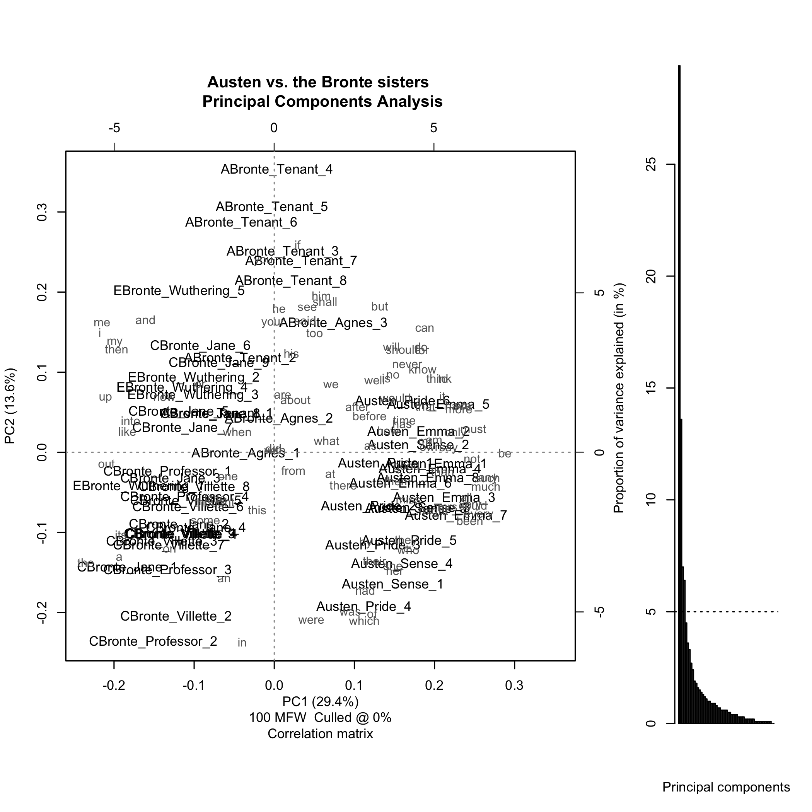
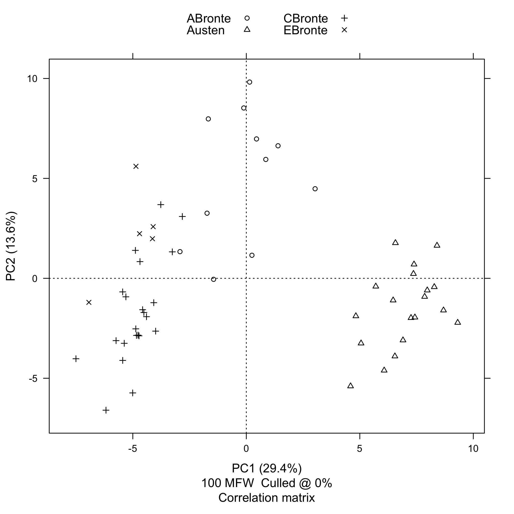
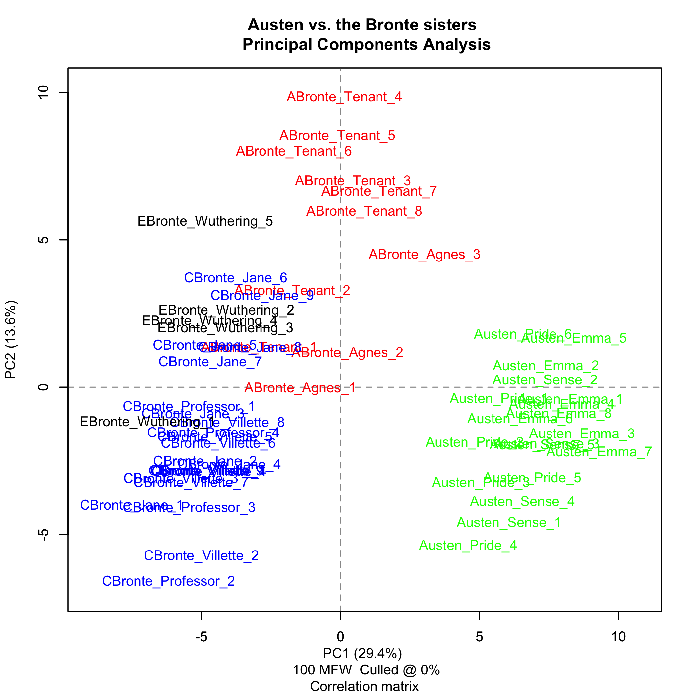
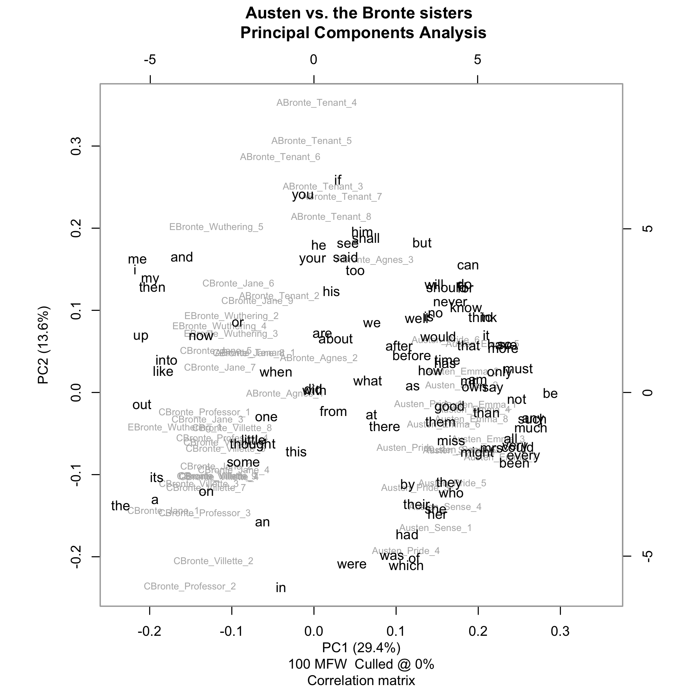
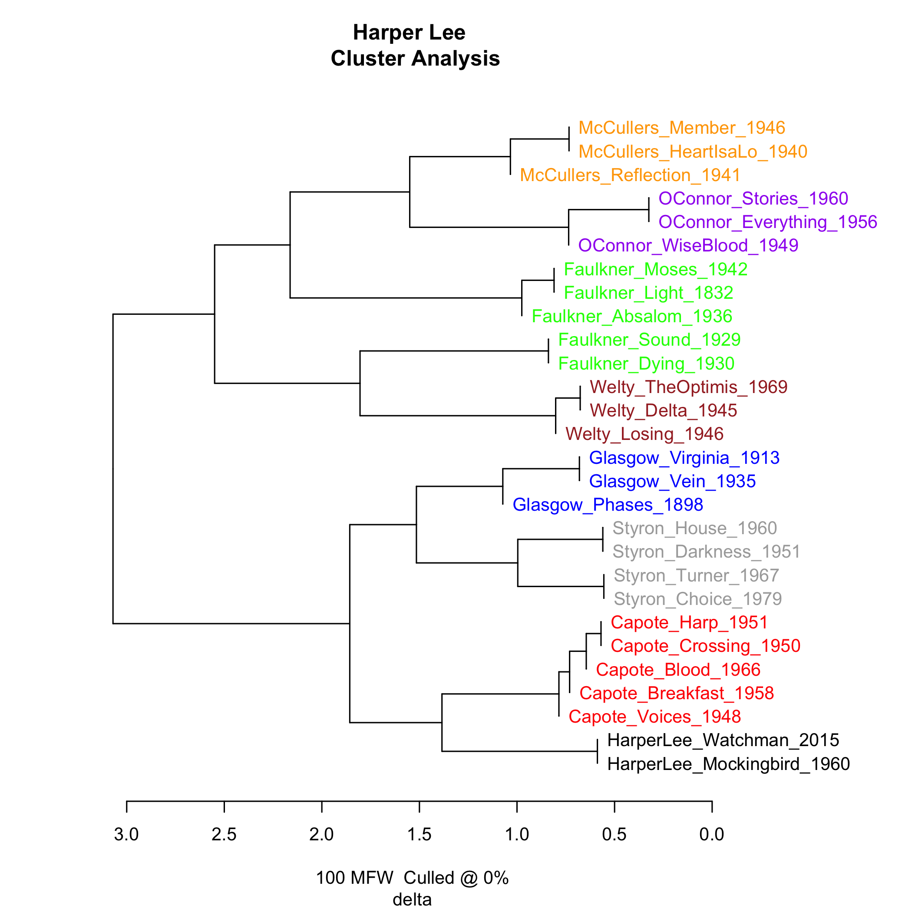
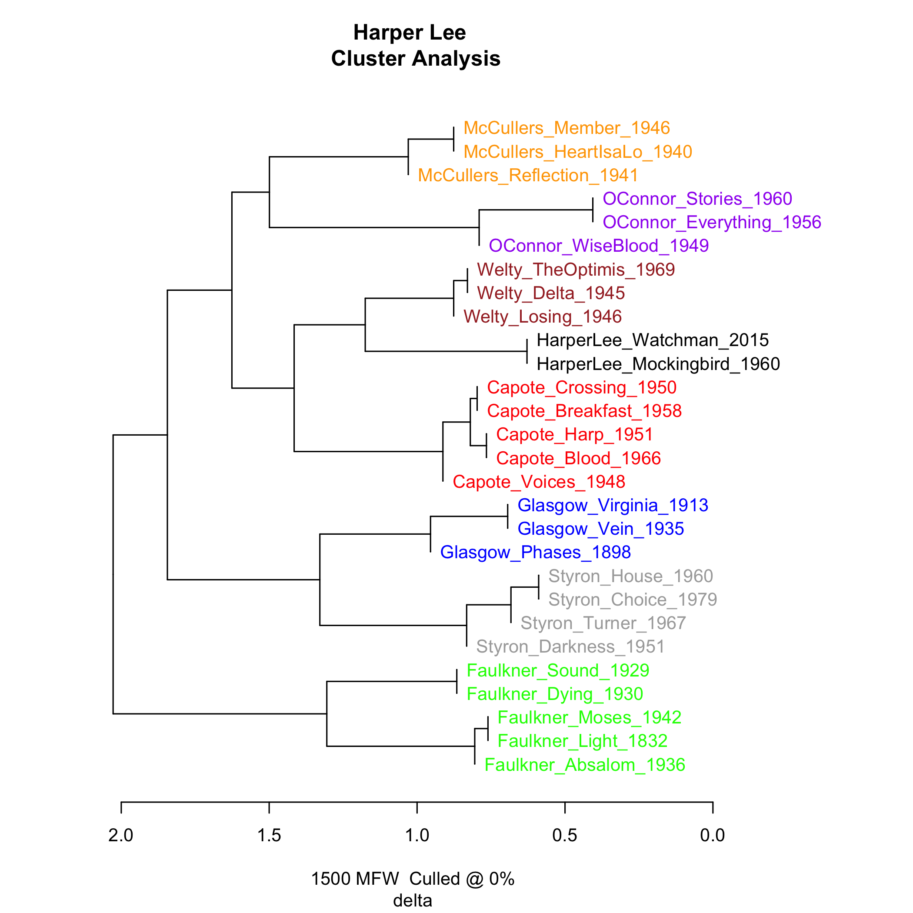
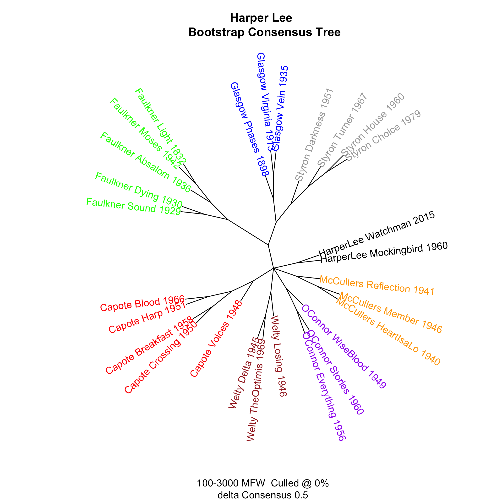

::: article
# Introduction

Authorship is a topic which continues to attract considerable attention
with the larger public. This claim is well illustrated by a number of
high-profile case studies that have recently made headlines across the
popular media, such as the attribution of a pseudonymously published
work to acclaimed *Harry Potter* novelist, J. K. Rowling [@juola2013],
or the debate surrounding the publication of Harper Lee's original
version of *To Kill a Mocking Bird* and the dominant role which her
editor might have played therein [@gamerman2015]. The authorship of
texts clearly matters to readers across the globe [@love:2002] and
therefore it does not come as a surprise that computational authorship
attribution increasingly attracts attention in science, because of its
valuable real-world applications, for instance, related to forensics
topics such as plagiarism detection, unmasking the author of harassment
messages or even determining the provenance of bomb letters in
counter-terrorism research. Interestingly, the methods of stylometry are
also actively applied in the Humanities, where multiple historic
authorship problems in literary studies still seek a definitive solution
-- the notorious Shakespeare-Marlowe controversy is perhaps the best
example in this respect.

Authorship attribution plays a prominent role in the nascent field of
stylometry, or the computational analysis of writing style
[@juola:2006; @stamatatosEA:2000; @stamatatos:2009; @koppelEA:2009; @vanhalterenEA:2005].
While this field has important historical precursors
[@holmes:1994; @holmes:1998], recent decades have witnessed a clear
increase in the scientific attention for this problem. Because of its
emergent nature, replicability and benchmarking still pose significant
challenges in the field [@stamatatos:2009]. Publicly available benchmark
data sets are hard to come across, mainly because of copyright and
privacy issues, and there are only a few stable, cross-platform software
packages out there which are widely used in the community. Fortunately,
a number of recent initiatives lead the way in this respect, such as the
recent authorship tracks in the PAN competition (<http://pan.webis.de>),
where e.g. relevant data sets are efficiently interchanged.

In this paper we introduce 'Stylometry with R'
([*stylo*](https://CRAN.R-project.org/package=stylo)), a flexible R
package for the high-level stylistic analysis of text collections. This
package explicitly seeks to further contribute to the recent development
in the field towards a more advanced level of replicability and
benchmarking in the field. Stylometry is a multidisciplinary research
endeavor, attracting contributions from divergent scientific domains,
which include researchers from Computer Science -- with a fairly
technical background -- as well as experts from the Humanities -- who
might lack the computational skills which would allow them easy access
to the state-of-the-art methods in the field [@schreibman:2004].
Importantly, this package has the potential to help bridge the
methodological gap luring between these two communities of practice: on
the one hand, *stylo*'s API allows to set up a complete processing
pipeline using traditional R scripting; on the other hand, *stylo* also
offers a rich graphical user interface which allows non-technical, even
novice practitioners to interface with state-of-the-art methods without
the need for any programming experience.

# Overview of stylometry

Stylometry deals with the relationship between the writing style in
texts and meta-data about those texts (such as date, genre, gender,
authorship). Researchers in 'stylochronometry', for instance, are
interested in inferring the date of composition of texts on the basis of
stylistic aspects [@stamou:2008; @juola:2007]. Authorship studies are
currently the most popular application of stylometry. From the point of
view of literary studies, stylometry is typically concerned with a
number of recent techniques from computational text analysis that are
sometimes termed 'distant reading', 'not reading' or 'macroanalysis'
[@jockers2013macroanalysis]. Instead of the traditional practice of
'close reading' in literary analysis, stylometry does not set out from a
single direct reading; instead, it attempts to explore large text
collections using computational techniques (and often visualization).
Thus, stylometry tries to expand the scope of inquiry in the humanities
by scaling up research resources to large text collections in order to
find relationships and patterns of similarity and difference invisible
to the eye of the human reader.

Usually, stylometric analyses involve a complex, multi-stage pipeline of
(i) preprocessing, (ii) feature extraction, (iii) statistical analysis,
and finally, (iv) presentation of results, e.g. via visualization. To
this end, researchers presently have to resort to an ad hoc combination
of proprietary, language-dependent tools that cannot easily be ported
across different platforms. Such solutions are difficult to maintain and
exchange across (groups of) individual researchers, preventing
straightforward replication of research results and reuse of existing
code. *stylo*, the package presented, offers a rich, user-friendly suite
of functionality that is ideally suited for fast exploratory analysis of
textual corpora as well as classification tasks such as are needed in
authorship attribution. The package offers an implementation of the main
methods currently dominant in the field. Its main advantage therefore
lies in the integration of typical (e.g. preprocessing) procedures from
stylometry and statistical functionality by other, external libraries.
Written in the R language, the source code and binaries for the package
are freely available from the Comprehensive R Archive Network,
guaranteeing a straightforward installation process across different
platforms (both Unix- and Windows-based operating systems). The code is
easily adaptable and extensible: the developers therefore continue to
welcome user contributions, feedback and feature requests. Our code is
open source and GPL-licensed: it is being actively developed on
GitHub.[^1]

In the rest of this paper, we will first illustrate the functionality of
the package for unsupervised multivariate analysis through the
high-level function `stylo()`. Secondly, we will discuss a number of
graphical user interfaces which we provide for quick exploration of
corpora, in particular by novice users or students in an educational
setting, as well as for scholars in the Humanities without programming
experience. Next, we move on to the function `classify()`, implementing
a number of supervised classification procedures from the field of
Machine Learning. Finally, we concisely discuss the `oppose()`,
`rolling.delta()` and `rolling.classify()` functionality which allow,
respectively, to inspect differences in word usage between two subsets
of a corpus, and to study the evolution of the writing style in a text.

# Overview of the package

Downloading, installing and loading *stylo* is straightforward. The
package is available at CRAN and at GitHub repository. The main
advantages and innovative features of *stylo* include:

## Feature extraction

Crucial in stylometry is the extraction of quantifiable features related
to the writing style of texts [@sebastiani:2002]. A wide range of
features have been proposed in the literature, considerably varying in
complexity [@stamatatos:2009]. 'Stylometry with R' focuses on features
that can be automatically extracted from texts, i.e. without having to
resort to language-dependent preprocessing tools. The features that the
package allows to extract are $n$-grams on token- and character level
[@houvardasEA:2006; @kjell:1994]. Apart from the fact that this makes
the package considerably language-independent, such shallow features
have been shown to work well for a variety of tasks in stylometry
[@Daelemans:2013; @kestemont:2014:CLFL]. Moreover, users need not
annotate their text materials using domain-specific tools before
analyzing them with 'Stylometry with R'. Apart from the standard usage,
however, the package does allow the users to load their own annotated
corpora, provided that this is preceded by some text pre-processing
tasks. An example of such a non-standard procedure will be shown below.
Thus, *stylo* does not aim to supplant existing, more targeted tools and
packages from Natural Language Processing
[@Feinerer:Hornik:Meyer:2008:JSSOBK:v25i05] but it can easily
accommodate the output of such tools as a part of its processing
pipeline.

## Metrics

A unique feature of *stylo* is that it offers reference implementations
for a number of established distance metrics from multivariate
statistical analysis, which are popular in stylometry, but uncommon
outside the field. Burrows's Delta is the best example here
[@burrows:2002]; it is an intuitive distance metric which has attracted
a good share of attention in the community, also from a theoretical
point of view [@hoover:2004; @hoover:2004:prime; @argamon:2008].

## Graphical user interface

The high-level functions of the package provide a number of Graphical
User Interfaces (GUIs) which can be used to intuitively set up a number
of established experimental workflows with a few clicks
(e.g. unsupervised visualization of texts based on word frequencies).
These interfaces can be easily invoked from the command line in R and
provide an attractive overview of the various experimental parameters
available, allowing users to quickly explore the main stylistic
structure of corpora. This feature is especially useful in an
educational setting, allowing (e.g. undergraduate) students from
different fields, typically without any programming experience, to
engage in stylometric experimentation. The said high-level functions
keep the analytic procedure from corpus pre-processing to final results
presentation manageable from within a single GUI. More flexibility,
however, can be achieved when the workflow is split into particular
steps, each controlled by a dedicated lower-level function from the
package, as will be showcased below.

# Example workflow

An experiment in stylometry usually involves a workflow whereby,
subsequently, (i) textual data is acquired, (ii) the texts are
preprocessed, (iii) stylistic features are extracted, (iv) a statistical
analysis is performed, and finally, (v) the results are outputted
(e.g. visualized). We will now illustrate how such a workflow can be
performed using the package.

## Corpus preparation

One of the most important features of *stylo* is that it allows loading
textual data either from R objects, or directly from corpus files stored
in a dedicated folder. Metadata of the input texts are expected to be
included in the file names. The file name convention assumes that any
string of characters followed by an underscore becomes a class
identifier (case sensitive). In final scatterplots and dendrograms,
colors of the samples are assigned according to this convention; common
file extensions are dropped. E.g. to make the samples colored according
to authorial classes, files might be named as follows:

``` r
ABronte_Agnes.txt   ABronte_Tenant.txt      Austen_Pride.txt
Austen_Sense.txt    Austen_Emma.txt         CBronte_Professor.txt
CBronte_Jane.txt    CBronte_Villette.txt    EBronte_Wuthering.txt
```

All examples below can be reproduced by the user on data sets which can
be downloaded from the authors' project website.[^2] For the sake of
convenience, however, we will use the datasets that come with the
package itself:

``` r
data(novels)
data(galbraith)
data(lee)
```

Our first example uses nine prose novels by Jane Austen and the Brontë
sisters, provided by the dataset `novels`.

## Preprocessing

*stylo* offers a rich set of options to load texts in various formats
from a file system (preferably encoded in UTF-8 Unicode, but it also
supports other encodings, e.g. under Windows). Apart from raw text,
*stylo* allows to load texts encoded according to the guidelines of the
Text Encoding Initiative, which is relatively prominent in the community
of text analysis researchers.[^3] To load all the files saved in a
directory (e.g. `corpus_files`), users can use the following command:

``` r
raw.corpus <- load.corpus(files = "all", corpus.dir = "corpus_files", 
         encoding = "UTF-8")
```

If the texts are annotated in e.g. XML, an additional pre-processing
procedure might be needed:

``` r
corpus.no.markup <- delete.markup(raw.corpus, markup.type = "xml")
```

Since the dataset that we will use has no annotation, the markup
deletion can be omitted. We start the procedure with making the data
visible for the user:

``` r
data(novels)
summary(novels)
```

To preprocess the data, *stylo* offers a number of tokenizers that
support a representative set of European languages, including English,
Latin, German, French, Spanish, Dutch, Polish, Hungarian, as well as
basic support for non-Latin alphabets such as Korean, Chinese, Japanese,
Hebrew, Arabic, Coptic and Greek. Tokenization refers to the process of
dividing a string of input texts into countable units, such as word
tokens. To tokenize the English texts, e.g. splitting items as 'don't'
into 'do' and 'n't' and lowercasing all words, the next command is
available:

``` r
tokenized.corpus <- txt.to.words.ext(novels, language = "English.all", 
            preserve.case = FALSE)
```

The famous first sentence of Jane Austen's *Pride and Prejudice*, for
instance, looks like this in its tokenized version (the 8th to the 30th
element of the corresponding vector):

``` r
tokenized.corpus$Austen_Pride[8:30]

 [1] "it"           "is"           "a"            "truth"        "universally" 
 [6] "acknowledged" "that"         "a"            "single"       "man"         
[11] "in"           "possession"   "of"           "a"            "good"        
[16] "fortune"      "must"         "be"           "in"           "want"        
[21] "of"           "a"            "wife" 
```

To see basic statistics of the tokenized corpus (number of
texts/samples, number of tokens in particular texts, etc.), one might
type:

``` r
summary(tokenized.corpus)
```

For complex scripts, such as Hebrew, custom splitting rules could easily
be applied:

``` r
tokenized.corpus.custom.split <- txt.to.words(tokenized.corpus, 
       splitting.rule = "[^A-Za-z\U05C6\U05D0-\U05EA\U05F0-\U05F2]+",
       preserve.case = TRUE)
```

A next step might involve 'pronoun deletion'. Personal pronouns are
often removed in stylometric studies because they tend to be too
strongly correlated with the specific topic or genre of a text
[@pennebaker:2011], which is an unwanted artefact in e.g. authorship
studies [@hoover:2004; @hoover:2004:prime]. Lists of pronouns are
available in *stylo* for a series of languages supported. They can be
accessed via for example:

``` r
stylo.pronouns(language = "English")

 [1] "he"         "her"        "hers"       "herself"    "him"       
 [6] "himself"    "his"        "i"          "me"         "mine"      
[11] "my"         "myself"     "our"        "ours"       "ourselves" 
[16] "she"        "thee"       "their"      "them"       "themselves"
[21] "they"       "thou"       "thy"        "thyself"    "us"        
[26] "we"         "ye"         "you"        "your"       "yours"     
[31] "yourself" 
```

Removing pronouns from the analyses (much like stopwords are removed in
Information Retrieval analyses) is easy in *stylo*, using the
`delete.stop.words()` function:

``` r
corpus.no.pronouns <- delete.stop.words(tokenized.corpus, 
               stop.words = stylo.pronouns(language = "English"))
```

The above procedure can also be used to exclude any set of words from
the input corpus.

## Features

After these preprocessing steps, users will want to extract gaugeable
features from the corpus. In a vast majority of approaches,
stylometrists rely on high-frequency items. Such features are typically
extracted in the level of (groups of) words or characters, called
$n$-grams [@kjell:1994]. Both word-token and character $n$-grams are
common textual features in present-day authorship studies. *Stylo*
allows users to specify the size of the $n$-grams which they want to
use. For third order character trigrams ($n=3$), for instance, an
appropriate function of *stylo* will select partially overlapping series
of character groups of length 3 from a string of words (e.g. 'tri',
'rig', 'igr', 'gra', 'ram', 'ams'). Whereas token level features have a
longer tradition in the field, character $n$-grams have been fairly
recently borrowed from the field of language identification in Computer
Science [@stamatatos:2009; @eder:2011]. Both $n$-grams at the level of
characters and words have been listed among the most effective stylistic
features in survey studies in the field. For $n=1$, such text
representations model texts under the so-called 'bag-of-words'
assumption that the order and position of items in a text is negligible
stylistic information. To convert single words into third order
character chains, or trigrams:

``` r
corpus.char.3.grams <- txt.to.features(corpus.no.pronouns, ngram.size = 3, 
       features = "c")
```

## Sampling

Users can study texts in their entirety, but also draw consecutive
samples from texts in order to effectively assess the internal stylistic
coherence of works. The sampling settings will affect how the relative
frequencies are calculated and allow users to normalize text length in
the data set. Users can specify a sampling size (expressed in current
units, e.g. words) to divide texts into consecutive slices. The samples
can partially overlap and they can be also be extracted randomly. As
with all functions, the available options are well-documented:

``` r
help(make.samples)
```

To split the current corpus into non-overlapping samples of 20,000 words
each, one might type:

``` r
sliced.corpus <- make.samples(tokenized.corpus, sampling = "normal.sampling", 
        sample.size = 20000)
```

## Counting frequent features

A crucial point of the dataset preparation is building a frequency
table. In stylometry, analyses are typically restricted to a feature
space containing the $n$ most frequent items. It is relatively easy to
extract e.g. the 3,000 most frequent features from the corpus using the
following function:

``` r
frequent.features <- make.frequency.list(sliced.corpus, head = 3000)
```

After the relevant features have been harvested, users have to extract a
vector for each text or sample, containing the relative frequencies of
these features, and combine them into a frequency table for the corpus.
Using an appropriate function from *stylo*, these vectors are combined
in a feature frequency table which can be fed into a statistical
analysis (external tables of frequencies can be loaded as well):

``` r
freqs <- make.table.of.frequencies(sliced.corpus, features = frequent.features)
```

Feature selection and sampling settings might interact: an attractive
unique feature of *stylo* is that it allows users to specify different
'culling' settings. Via culling, users can specify the percentage of
samples in which a feature should be present in the corpus in order to
be included in the analysis. Words that do not occur in at least the
specified proportion of the samples in the corpus will be ignored. For
an 80% culling rate, for instance:

``` r
culled.freqs <- perform.culling(freqs, culling.level = 80)
```

## Analysis

*Stylo* offers a seamless wrapper for a variety of established
statistical routines available from R's core library or contributed by
third-party developers; these include t-Distributed Stochastic Neighbor
Embedding [@van2008visualizing], Principal Components Analysis,
Hierarchical Clustering and Bootstrap Consensus Trees (a method which
will be discussed below). An experiment can be initiated with a
pre-existing frequency table with the following command:

``` r
stylo(frequencies = culled.freqs, gui = FALSE)
```

When the input documents are loaded directly from text files, the
default features are most frequent words (MFWs), i.e. 1-grams of
frequent word forms turned into lowercase. Also, by default, a standard
cluster analysis of the 100 most frequent features will be performed. To
perform e.g. a Principal Components Analysis (with correlation matrix)
of the 200 most frequent words, and visualize the samples position in
the space defined by the first two principal components, users can issue
the following commands:

``` r
stylo(corpus.dir = "directory_containing_the_files", mfw.min = 200, mfw.max = 200, 
       analysis.type = "PCR", sampling = "normal.sampling", sample.size = 10000, 
       gui = FALSE)
```

In Fig. 1, we give an example of how Principal Components Analysis (the
first two dimensions) can be used to visualize texts in different ways,
e.g. with and without feature loadings. Because researchers are often
interested in inspecting the loadings of features in the first two
components resulting from such an analysis, *stylo* provides a rich
variety of flavours in PCA visualizations. For an experiment in the
domain of authorship studies, for instance, researchers will typically
find it useful to plot all texts/samples from the same author in the
same color. The coloring of the items in plots can be easily controlled
via the titles of the texts analyzed across the different R methods that
are used for visualization -- a commodity which is normally rather
painful to implement across different packages in R. Apart from
exploratory, unsupervised analyses, *stylo* offers a number of
classification routines that will be discussed below.

The examples shown in Fig. 1 were produced using the following
functions:

``` r
stylo(frequencies = culled.freqs, analysis.type = "PCR", 
        custom.graph.title = "Austen vs. the Bronte sisters",
        pca.visual.flavour = "technical", 
        write.png.file = TRUE, gui = FALSE)
        
stylo(frequencies = culled.freqs, analysis.type = "PCR", 
        custom.graph.title = "Austen vs. the Bronte sisters",
        write.png.file = TRUE, gui = FALSE)
        
stylo(frequencies = culled.freqs, analysis.type = "PCR", 
        custom.graph.title = "Austen vs. the Bronte sisters",
        pca.visual.flavour = "symbols", colors.on.graphs = "black",
        write.png.file = TRUE, gui = FALSE)
        
stylo(frequencies = culled.freqs, analysis.type = "PCR", 
        custom.graph.title = "Austen vs. the Bronte sisters",
        pca.visual.flavour = "loadings", 
        write.png.file = TRUE, gui = FALSE)
```

<figure id="Fig_1">
<p><br />
<br />
</p>
<figcaption>Figure 1: Illustration of different visualization options
for the first two dimensions outputted by a Principal Components
Analysis (applied to 9 novels by 4 authors from our dummy corpus). Four
different visualization flavours are presented: ‘Technical’ (Fig. 1a),
‘Classic’ (Fig. 1b), ‘Symbols’ (Fig. 1c) and ‘Loadings’ (Fig. 1d). Users
whose file names follow <em>stylo</em>’s naming conventions can easily
exploit different coloring options.</figcaption>
</figure>

## Return value

*Stylo* makes it easy to further process the objects returned by an
analysis. To cater for the needs of less technical users, the results
returned by an analysis are saved by default to a number of standard
files and outputted on screen. Advanced users can easily use the
returned objects in subsequent processing:

``` r
stylo.results = stylo()  # optional arguments might be passed

print(stylo.results)
summary(stylo.results)
```

The list of features created, for instance, can be easily accessed (and
manipulated) subsequently, and the same applies to tables of frequencies
or other results:

``` r
stylo.results$features
stylo.results$table.with.all.freqs
stylo.results$distance.table
stylo.results$pca.coordinates
```

# GUI mode

Apart from the various functions to perform actual stylometric tasks,
the package comes with a series of GUIs that can be used to set up
typical experimental workflows in a quick and intuitive fashion. This
unique feature renders *stylo* especially useful in educational settings
involving students and scholars without programming experience. The
cross-platform graphical user interface (automatically installed along
with the rest of the package) has been written for Tcl/Tk and can be
easily invoked from the command line. Four GUIs are currently available,
which all come with extensive tooltips to help users navigate the
different options. In this section, we will illustrate the use of these
GUIs via an unsupervised stylometric experiment involving Bootstrap
Consensus Trees.

The currently most widely used GUI component of 'Stylometry with R' is
the eponymous GUI for `stylo()`, which is useful for the unsupervised
stylistic exploration of textual corpora. It can be easily invoked using
a single intuitive command (without the need to specify additional
arguments):

``` r
stylo()
```

The various tabs of the *stylo* GUI (see Figure 2) present in a clear
fashion the various parameters which can be specified before running the
analysis by clicking the `OK` button. Users can freely switch between
tabs and revisit them before running an experiment. Moreover, *stylo*
will remember the experimental settings last used, and automatically
default to these when users re-launch the GUI (which is useful for
authors running a series of consecutive experiments with only small
changes in parameters).

{#Fig_2 width="100%" alt="graphic without alt text"}

To illustrate the GUI mode, we will now concisely discuss a sample
experiment involving Bootstrap Consensus Trees (BCT, selectable under
the STATISTICS tab in the GUI). In stylometry, BCT exploits the idea
that the results become stable when one divides the list of MFW in
non-identical, yet potentially overlapping frequency bands and analyzes
these independently from each other [@eder:2013]. BCT were originally
borrowed by Eder from the field of Language Evolution and Genetics;
since a number of successful applications of the technique have been
reported in the literature
[@rybickiEA:2013; @van:dalen:2014; @stoverEtAl2016]. If the user
specifies that different frequency bands should be used on the FEATURES
tab, the bootstrap procedure will run different (virtual) cluster
analyses and aggregate the results into a single (unrooted) consensus
tree. This visualization will only consider nodes for which there exists
a sufficiently large consensus among the individual cluster analyses.
The user in the corresponding text field (e.g. 0.5, which comes down to
a majority vote for the cluster nodes). As such, users can assess the
similarities between texts across different frequency bands.

Under the FEATURES tab, users can define the minutes of the MFW division
and sampling procedure, using the `increment`, the `minimum` and
`maximum` parameters. For `minimum = 100`, `maximum = 3000`, and
`increment = 50`, stylo will run subsequent analyses for the following
frequency bands: 100 MFW, 50--150 MFW, 100--200 MFW, \..., 2900--2950
MFW, 2950--3000 MFW. This is an attractive feature because it enables
the assessment of similarities between texts across different bands in
the frequency spectrum. A parallel logic underpins the CULLING text
fields, where experiments will be carried out iteratively for different
culling rates.

We illustrate the working of the BCT procedure in *stylo* using the
recently covered case study on *Go Set a Watchman*, the second novel by
Harper Lee, written before *To Kill a Mockingbird*. The novel itself
attracted a reasonable attention worldwide, also because of its alleged
authorship issues. Suspicion resurfaced about the strange fact that one
of the greatest bestsellers in American history was its author's only
completed work; Lee's childhood friendship with Truman Capote (portrayed
as Dill in *To Kill A Mockingbird*) and their later association on the
occasion of *In Cold Blood* fueled more speculations on the two Southern
writers' possible, or even just plausible, collaboration; finally, the
role of Tay Hohoff, Lee's editor on her bestseller, was discussed.

The stylometric study on this novel, featured in *Wall Street Journal*
[@gamerman2015], revealed that the truth proved to be at once much less
sensational than most of the rumors. Very strong stylometric evidence
shows clearly that Harper Lee is the author of both *To Kill A
Mockingbird* and *Go Set A Watchman*. In our replication of the
experiment, the following code was used to produce the plots:

``` r
data(lee)

stylo(frequencies = lee, analysis.type = "CA", 
        write.png.file = TRUE,  custom.graph.title = "Harper Lee",
        gui = FALSE)
        
stylo(frequencies = lee, analysis.type = "CA", 
        mfw.min = 1500, mfw.max = 1500, custom.graph.title = "Harper Lee",
        write.png.file = TRUE, gui = FALSE)
        
stylo(frequencies = lee, analysis.type = "BCT", 
        mfw.min = 100, mfw.max = 3000, custom.graph.title = "Harper Lee",
        write.png.file = TRUE, gui = FALSE)
```

<figure id="Fig_3">
<p><br />
</p>
<figcaption>Figure 3: Analysis of the corpus of 28 novels by Harper Lee,
Truman Capote as well as a number of comparable control authors writing
in the American South. A frequency table of this corpus is provided by
the package <em>stylo</em>, so that all our experiments can be
replicated. In all plots, Lee’s writing style is clearly very
consistent, even if for some input parameters Lee’s novels are close to
Capote’s. Figure panel 3a-3b: Traditional dendrograms outputted by
cluster analyses with Burrows’s Classic Delta Metric for 100 MFW and
1,500 MFW respectively (default settings; entire novels). Figure panel
3c: Bootstrap consensus tree for 100 MFW to 3,000 MFW (with an
incremental step size of 50 words). Unrooted tree which combines clade
information from analyses such as the ones presented in Fig. 1a-1b. The
tree collapses nodes which were observed in at least 50% of the
underlying trees (majority vote).</figcaption>
</figure>

# Classify

Apart from the already-discussed explanatory multivariate tests and the
associated visualizations, stylometry has borrowed a number of advanced
classification methods from the domain of Machine Learning. Some of them
have simply been transferred to stylometry (e.g. Support Vector Machines
or Naı̈ve Bayes Classifier); others have been tailored to the needs of
humanities researchers. The best example in this respect is Delta, a
so-called 'lazy' learner developed by Burrows [@burrows:2002]. The
*stylo* package offers an interface to a selection of established
classifiers: including Burrows's original Delta and other distance-based
classifiers, Nearest Shrunken Centroids, Support Vector Machines and
Naı̈ve Bayes Classifier. These are available through a single function:

``` r
classify()   # optional arguments might be passed
```

If any non-standard text preprocessing procedures are involved, the
above function can be fed with the result of a multi-stage custom
pipeline. Combining the function `classify()` with spreadsheet tables of
frequencies is also possible.

In a typical classification experiment, the analysis is divided in two
stages. In the first stage, representative text samples for each target
category (e.g. authorial group) are collected in a training corpus. The
remaining samples form the test corpus. The first set, being a
collection of texts, e.g. written by known authors ('candidates'),
serves as a sub-corpus for fine-tuning the hyperparameters of a
classifier and model architecture selection. The second set is a pool
that consists of test texts of known authorship and anonymous texts of
disputed authorial provenance. The classifier's performance can be
measured by applying a standard evaluation metric to the classifier's
output on the test set (e.g. the number of correct attributions to
authors in the the training set). In *stylo*, users can divide their
data over two subdirectories (or input custom-created R objects using
the low-level functions discussed above); one directory should contain
the training samples, the other the test samples. Other options can be
specified via the parameters that run parallel to those of the `stylo()`
function, such as the desired feature type or culling rate.
Function-specific parameters for `classify()` include the number of
cross-validation folds or the type of classifier (e.g. Support Vector
Machine).

We illustrate the performance of classification methods in *stylo* using
the well-known case study of the pseudonymous author Galbraith/Rowling,
which recently attracted a good deal of press attention. In July 2013,
the *Sunday Times* (UK) revealed that J. K. Rowling, the successful
author behind the bestselling series of *Harry Potter* novels, had
published a new detective novel (*The Cuckoo's Calling*) under the
pseudonym of 'Robert Galbraith'. (The paper had received an anonymous
tip with respect to this pen name over Twitter). For covering this case
study, the *Sunday Times* has collaborated with Patrick Juola, an
authority in the field of authorship attribution, and Peter Millican
[@juola2013]. They reported in a blog post on the Language Log that
their stylometric analysis showed the writing style (e.g. on the level
of function words) found in *The Cuckoo's Calling* to be broadly
consistent with Rowling's writing in other works. Below, we report on a
dummy attribution experiment which illustrates a supervised procedure.

In this experiment we will confront Galbraith's *The Cuckoo's Calling*
with 25 other fantasy novels and thrillers by 4 famous novelists: H.
Coben (e.g. *Tell No One*), C. S. Lewis (e.g. *The Chronicles of
Narnia*), J. R. R. Tolkien (e.g. the *Lord of the Rings* trilogy) and J.
K. Rowling (e.g. the *Harry Potter* series). Our replication experiments
indeed confirm that Galbraith's writing style is more consistent with
that of Rowling than that of any other author included. Instead of
loading particular text files, we will use a computed table of
frequencies provided by the package; the table has to be split into two
tables (training set and test set). As an illustration, we specify the
training set manually (with two training texts per class):

``` r
# specify a table with frequencies:
data(galbraith)
freqs <- galbraith

# specify class labels:
training.texts <- c("coben_breaker", "coben_dropshot", "lewis_battle",
                   "lewis_caspian", "rowling_casual", "rowling_chamber", 
                   "tolkien_lord1", "tolkien_lord2")

# select the training samples:
training.set <- freqs[(rownames(freqs) %in% training.texts),]

# select remaining rows as test samples:
test.set <- freqs[!(rownames(freqs) %in% training.texts),]
```

To perform Delta on the Rowling corpus (50 MFWs, no sampling), we type:

``` r
classify(training.frequencies = training.set, test.frequencies = test.set, 
       mfw.min = 50, mfw.max = 50, classification.method = "delta", 
       gui = FALSE)
```

The results are automatically outputted to a log file
`final_results.txt`:

``` r
galbraith_cuckoos   -->   rowling rowling coben 

50 MFW, culled @ 0%,  17 of 17	(100%)

General attributive success:  17 of 17 (100%)

MFWs from 50 to 50 @ increment 100
Culling from 0 to 0 @ increment 20
Pronouns deleted: FALSE; standard classification
```

The overall performance of the classifier for our dummy corpus is
optimal, since 100% of the test samples were correctly attributed to the
correct authors. The experiment adds support to the identification of
the author of *The Cuckoo's Calling* as Rowling. To combat model
overfitting, cross-validation on the training data can be applied. It
has been shown that for linguistic datasets a standard 10-fold cross
validation might overestimate the performance of models, especially if
languages other than English are assessed [@ederEA:2013]. To neutralize
class imbalance, *stylo* therefore provides stratified cross-validation
protocols for stylometric experiments. To perform a classification with
a 'plain vanilla' 20-fold CV, using Nearest Shrunken Centroids
classification and a series of tests for 50, 100, 150, 200, ..., 500
MFWs, one might type:

``` r
results <- classify(training.frequencies = training.set, 
                   test.frequencies = test.set, 
                   mfw.min = 50, mfw.max = 500, mfw.incr = 50, 
                   classification.method = "nsc", cv.folds = 20, gui = FALSE)
```

To inspect the classification accuracy for particular cross-validation
folds, the user can type:

``` r
results$cross.validation.summary
```

Average scores of the cross-validation outcome (note that the overall
performance is now slightly worse, ca. 95%) can be accessed via:

``` r
colMeans(results$cross.validation.summary)
```

# Miscellaneous other functions

Apart from the above discussed functions, the package offers
miscellaneous other, less established functions to stylometrically
analyze documents. With the `oppose()` function, users can contrast two
sets of documents and extract the most characteristic features in both
sets of texts. The most discriminative features can be visualized and
fed into other components of the package as part of a pipeline. Several
metrics are implemented that can select features which display a
statistically significant difference in distributions between both sets.
Craig's Zeta, for instance, is an extension of the Zeta metric
originally proposed by Burrows [@burrows:2007], which remains a popular
choice in the stylometric community to select discriminative stylometric
features in binary classification settings [@craigEA:2009]. An example
of another more widely used metric for feature selection in corpus
linguistics is the Mann-Whitney ranks test [@kilgariff:2001]. As a dummy
example, we can confront the above mentioned texts; be it the novels by
Jane Austen and Anne Brontë:

``` r
data(novels)

corpus.all <- txt.to.words.ext(novels, language = "English.all", 
                preserve.case = TRUE)

corpus.austen <- corpus.all[grep("Austen", names(corpus.all))]
corpus.abronte <- corpus.all[grep("ABronte", names(corpus.all))]

zeta.results <- oppose(primary.corpus = corpus.austen, 
               secondary.corpus = corpus.abronte, gui = FALSE)
```

As can be seen in the results (first 20 most discriminating words), Jane
Austen is an enthusiast user of terms related to socio-cultural
phenomena (e.g. *situation, opinion, party, engaged,* \...), whereas
Anne Brontë's vocabulary can be characterized by a variety of auxiliary
verbs with contractions, as well as religious and light-related
vocabulary (e.g. *bright, dark*).

``` r
zeta.results$words.preferred[1:20]

 [1] "Her"        "farther"    "behaviour"  "opinion"    "party"     
 [6] "point"      "perfectly"  "afterwards" "Colonel"    "directly"  
[11] "spirits"    "situation"  "settled"    "hardly"     "Jane"      
[16] "Emma"       "equal"      "family"     "engaged"    "They"
```

``` r
zeta.results$words.avoided[1:20]

 [1] "don^t"      "I^m"        "I^ll"       "beside"     "Arthur"    
 [6] "can^t"      "I^ve"       "it^s"       "won^t"      "Huntingdon"
[11] "presence"   "Helen"      "face"       "bright"     "God"       
[16] "mamma"      "further"    "heaven"     "dark"       "feet"
```

Of course, the above results of this simple feature selection tool can
be fed into one of the package's classification routines:

``` r
combined.features <- c(zeta.results$words.preferred[1:20], 
                        zeta.results$words.avoided[1:20])
stylo(parsed.corpus = corpus.all, features = combined.features, gui = FALSE)
```

Other functionality worth mentioning are `rolling.delta()` and
`rolling.classify()`. These functions implement a procedure meant to
progressively analyze the development of a style in a text, using
e.g. one of the stylometric distance metrics discussed
[@rybickiEA:2014; @eder:2016]. In many works, specific parts of the text
are conjectured to have been plagiarized or contributed by other
authors: `rolling.delta()` and `rolling.classify()` offer an easy way to
visualize local stylistic idiosyncrasies in texts. In Fig. 4 we have
plotted a `rolling.classify()` analysis of the well-known French
allegorical romance *Roman de la Rose* from the Middle Ages. It has been
written by two authors: Guillaume de Lorris is the author of the opening
4,058 lines (ca. 50,000 words), and the second part by Jean de Meun
consists of 17,724 lines (ca. 218,000 words). This knowledge is
supported by the text itself, since Jean de Meun explicitly points out
the takeover point (it is marked with a dashed vertical line 'b' in Fig.
4). In this example, the aim is to verify whether two authorial styles
can indeed be discerned in the text, that is, before and after the
authorial takeover. First a Support Vector Machine classifier is trained
on four 5,000-word samples: two extracted from the beginning of the text
and two near the middle of the text (yet well beyond the hypothesized
takeover: they are marked with the dashed line 'a' and 'c--d',
respectively). Next, we apply a windowing procedure and we extract
consecutive and partially overlapping samples from the entire text.
Finally, the trained classifier is applied to each of these 'windows.'
In Fig. 4 we plot the respective classification scores for both authors
in each sample: in this case, these scores represent the probability,
estimated by a Support Vector Machine, that a particular sample should
be attributed to one of the two authors involved. Although the result is
not flawless, a clear shift in authorial style can be discerned around
the position of the takeover, as indicated verbatimly in the text by one
the authors.

The dataset to replicate the test can be downloaded from this page:
<https://sites.google.com/site/computationalstylistics/corpora/Roman_de_la_Rose.zip>.
The following code should be typed to perform the classification:

``` r
# unzipping the dataset
unzip("Roman_de_la_Rose.zip")

# changing working directory
setwd("Roman_de_la_Rose")

rolling.classify(write.png.file = TRUE, classification.method = "svm", mfw = 100, 
        training.set.sampling = "normal.sampling", slice.size = 5000, 
        slice.overlap = 4500) 
```

{#Fig_4 width="100%" alt="graphic without alt text"}

# Conclusion

'Stylometry with R' targets two distinct groups of users: experienced
coders and beginners. Novice users have found it useful to work with the
intuitive Graphical User Interface (GUI), which makes it easy to set and
explore different parameters without programming experience. We wish to
emphasize, however, that *stylo* is useful beyond these high-level
functions and GUIs: it also offers experienced users a general framework
that can be used to design custom processing pipelines in R, e.g. in
other text-oriented research efforts. The current version of *stylo*
(version number 0.6.3) is available from GitHub under a GPL 3.0
open-source licence; binary installation files are available from CRAN.
*stylo* has been used in a number of innovative studies in the field of
computational stylistics
[@kestemontEA:2013; @van:dalen:2014; @lauerEA:2014; @anandEtAl; @oakesEtAL; @boot],
and we encourage the future application of *stylo* to challenging new
problems and languages in stylometry.

# Acknowledgments

We would like to thank the users of *stylo* for the valuable feedback
and feature requests which we have received over the past years. MK was
partially founded for this research as a postdoctoral fellow by The
Research Foundation of Flanders (FWO). ME was partially supported by
Poland's National Science Centre (grant number 2014/12/W/ST5/00592).
:::

[^1]: <https://github.com/computationalstylistics/stylo>

[^2]: <https://sites.google.com/site/computationalstylistics/corpora>

[^3]: <http://www.tei-c.org/index.xml>
