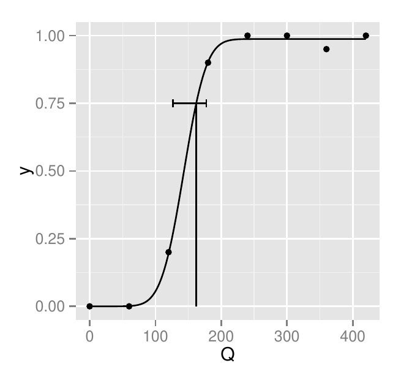
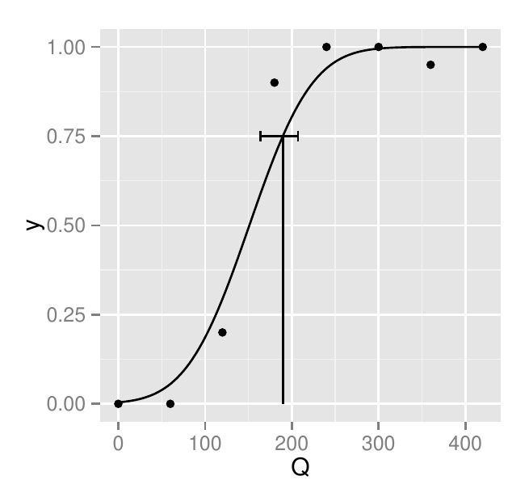

::: article
# Introduction {#sec:introduction}

## Statistical model

The response of humans, other animals and neurons in a classification
task with a binary response variable and a stimulus level as explanatory
variable is often binomially modelled as
[@watson:1979uc; @ORegan:1989vh; @Klein:2001tg; @Wichmann:2001ud; @Macmillan:2004um; @Gold:2007fo; @Kingdom:2009wda; @Knoblauch:2012kn; @Lu:2013gw; @Gold:2013dg]

$$\label{eq:1}
f(\mathbf{k}; \mathbf{\theta}) = \prod_{i=1}^{M} \binom{n_i}{k_i} \psi (x_i; \mathbf{\theta})^{k_i} \left(1-\psi  \left(x_i; \mathbf{\theta}\right)\right)^{n_i - k_i},  (\#eq:1)  $$

where

-   $f$ is the probability mass function of the model or the likelihood
    when considered as a function of the parameters;

-   $M$ is the number of stimulus levels used in the classification
    task;

-   $x_i$ is the i*th* stimulus level;

-   $n_i$ is the number of times that $x_i$ is presented;

-   $\mathbf{k}=(k_1, k_2 ,\dotsc,k_M)$ is the vector of responses with
    $k_i$ being the number of *Yes-type* (or correct) responses when
    $x_i$ is presented;

-   $\psi(x_i; \mathbf{\theta})$ is the probability of responding *Yes*
    when $x_i$ is presented; it is called the psychometric function and
    has the form

    $$\psi(x; \mathbf{\theta}) = \psi(x; \alpha, \beta, \gamma, \lambda) =  \gamma + (1 - \gamma - \lambda) F(x; \alpha, \beta),$$

    where

    ::: flushleft
    -   $\mathbf{\theta}=(\alpha,\beta,\gamma,\lambda)$ is the vector of
        parameters that define the parametric family of probability mass
        functions of the model. $\alpha$ and $\beta$ are the position
        and scale parameters. $\gamma$ and $\lambda$ are the parameters
        corresponding to the leftward and rightward asymptote of $\psi$.

    -   $F$ is a function with leftward asymptote 0 and rightward
        asymptote 1---typically a cumulative probability function with a
        sigmoidal shape such as the cumulative normal, logistic or
        Weibull functions.
    :::

The model assumes that a given classification response does not depend
on previous classifications. This is an idealisation, given the known
order effects such as adaptation, fatigue, learning or serial dependence
[@Kingdom:2009wda; @Frund:2011gd; @VanderBurg:2013da; @Fischer:2014cy; @Summerfield:2015bz].

## Examples

*Light detection.* To measure the ability of an observer to detect
light, a dim flash of light selected at random from 5 different light
intensities ($x_i;\, i=1, \dots, M$ with $M=5$) is presented and the
observer is asked to report *Yes* if she has seen it and *No* otherwise.
After her response, another intensity, selected at random from the 4
intensities that have not been presented yet, is presented and the
observer classifies it again as seen or not seen. Then, the observer
performs 3 more classifications until the 5 intensities have been
presented. After that, the whole procedure is repeated 20 times using a
new random sequence of 5 intensities each time. Using this procedure,
which is called the method of constant stimuli
[@Green:1966aa; @Gescheider:1997wd; @Kingdom:2009wda; @Knoblauch:2012kn],
the observer will perform a total of 100 classifications with $n_i=20$
for all $i$. $k_i$ will correspond to the number of times that the
observer responds *Yes* for each intensity. Because it is expected that,
for very low intensities, the observer will never respond *Yes* and for
very high intensities the observer will always respond *Yes*, $\gamma$
and $\lambda$ are often fixed to 0.

*Criterion-independent light detection*. In the previous procedure,
$\mathbf{k}$ depends on how confident the observer needs to feel to give
a *Yes* response---conservative observers will repond *Yes* less often
[@Green:1966aa; @Macmillan:2004um; @Kingdom:2009wda; @Knoblauch:2012kn; @Lu:2013gw].
To avoid criterion-dependent responses, 2-intervals forced choice
procedures are often used
[@Green:1966aa; @Kingdom:2009wda; @Knoblauch:2012kn; @Lu:2013gw]. These
procedures are similar to the criterion-dependent procedure described
above, but the stimulus is presented at random in one interval from two
intervals presented consecutively (marked with a sound, for example) and
the observer needs to decide whether the stimulus was presented in the
first or the second interval. Because it is expected that for very low
intensities the observer will respond at chance, $\gamma$ is fixed at
$1/2$ ($\lambda$ is usually fixed to 0). More generally, $\gamma$ is
fixed to $1/m$ when the observer needs to decide in which over $m$
intervals the stimulus was presented.

*Light detection with lapses*. Sometimes, the observer will miss the
flash (because of a blink, for example) or will make an error reporting
the response (pressing the wrong response button, for example). To
account for these response *lapses*, $\lambda$, which corresponds to
$(1-\gamma)$ times the lapse rate [@Kingdom:2009wda], is not fixed but
estimated as a parameter [@Wichmann:2001ud; @Wichmann:2001wa].

## Point estimation and confidence intervals

The point estimation of the parameters $\mathbf{\theta}$ of the model
in \@ref(eq:1), $\hat{\mathbf{\theta}}$, is sometimes obtained using
Bayesian methods [@Kuss:2005dz; @Kingdom:2009wda], but more often using
maximum likelihood [ML;
@watson:1979uc; @ORegan:1989vh; @Wichmann:2001ud; @Kingdom:2009wda; @Knoblauch:2012kn; @Lu:2013gw]
. $\hat{\mathbf{\theta}}$ is defined as the value of $\mathbf{\theta}$
that maximises the likelihood $L$ defined as
$L(\mathbf{\theta}) = f(\mathbf{k}; \mathbf{\theta})$.

Maximising $L$ is equivalent to maximising $\log(L)$, which for the
model in \@ref(eq:1) is

$$\log{L(\mathbf{\theta})} = \sum_{i=1}^{M} \left( \log{\binom{n_i}{k_i}} + k_i \log{\psi \left(x_i; \mathbf{\theta}\right)} + \left(n_i - k_i\right) \log{\left(1-\psi \left(x_i; \mathbf{\theta} \right)\right)} \right).$$

The confidence intervals CI for $\mathbf{\theta}$ are usually estimated
using parametric or non-parametric bootstrap, often using the percentile
method [@Wichmann:2001wa; @Kingdom:2009wda; @Knoblauch:2012kn]. For
example, for the parameter $\alpha$, the bootstrap percentile interval
is defined as $(\alpha^{*}_{(a/2)},
\alpha^{*}_{(1-a/2)})$, where $\alpha^{*}_{(a/2)}$ and
$\alpha^{*}_{(1-a/2)}$ are the $a/2$ and the $1-a/2$ percentiles of the
bootstrapped replications of $\hat{\alpha}$. The i*th* bootstrap
replication $\alpha^{*}_{i}$ is obtained using ML, but this time for a
vector of simulated responses $\mathbf{k^{*}}$. Each $k_i^*$ is
simulated from a binomial distribution with parameters $n_i$ and $p_i$
where $p_i$ is $\psi(x_i; \hat{\mathbf{\theta}})$ for the parametric
bootstrap and $k_i/n_i$ for the non-parametric bootstrap (which is
equivalent to sampling with replacement from the distribution of *Yes*
and *No* responses). It could be demonstrated that
$CI=(\alpha^{*}_{(a/2)}, \alpha^{*}_{(1-a/2)})$ is a well-defined
confidence interval [@Wasserman:2013dt]. That is, $P(\alpha \in
CI) \geq 1-a$ where $P$ is a probability and $a$ is often arbitrarily
chosen as $0.05$. The confidence intervals for the other parameters are
obtained similarly.

The observer's behaviour in classification tasks is often summarised by
a threshold $x_{th}$
[@ORegan:1989vh; @Wichmann:2001ud; @Kingdom:2009wda; @Knoblauch:2012kn; @Lu:2013gw],
which corresponds to the stimulus level that predicts an arbitrarily
chosen proportion of *Yes* responses. If the proportion is 0.5, for
example, then $x_{th}$ would be the $x$ for which $\psi(x;
\hat{\mathbf{\theta}})=0.5$. The bootstrap CIs for $x_{th}$ can be
obtained using the percentile method for $x_{th}^*$, which are the
bootstrap replications of $x_{th}$ calculated using the bootstrap
replications of the parameters.

ML estimates of the parameters are often obtained using non-linear
optimisation [@nash:14], a method that might produce unsuitable
estimates when the data suffer from lapses as those described above.
Future studies might elucidate the possible problems of non-linear
optimisation to fit psychometric functions with lapses and whether
Bayesian approaches might be preferred [@Kuss:2005dz].

## *quickpsy* and similar tools

[*quickpsy*](https://CRAN.R-project.org/package=quickpsy) [@quickpsy] is
a package to estimate and plot the parameters, the thresholds, the
bootstrap confidence intervals for the parameters and the thresholds,
and the associated psychometric functions for the model in \@ref(eq:1).
*quickpsy* also allows the comparison of the parameters and the
thresholds for different groups using the bootstrap. It is build to
easily analyse data for multiple groups, which is common in
classification experiments [@Gescheider:1997wd; @Lu:2013gw]: multiple
observers, for example, might be tested under different conditions, such
as flashes of different size in the light detection experiments. For
that purpose, *quickpsy* incorporates, for example, a function to easily
create a data frame from multiple files (`quickreadfiles`) or uses the
dimensions of the groups in the data to produce standard plots for the
parameters, the thresholds and the associated psychometric functions.

As an alternative to *quickpsy*, classification data can also be
analysed in R using the base function `glm` for fitting generalized
linear models and tools from package
[*psyphy*](https://CRAN.R-project.org/package=psyphy)
[@Knoblauch:2012kn; @psyphy]. Fitting psychometric functions could be
considered a special case of fitting generalised linear models (GLM)
[@Knoblauch:2012kn; @Moscatelli:2012gx], which is done in R using `glm`
[@Knoblauch:2012kn]. With `glm`, one can estimate the parameters of the
linear predictor associated with the GLM and use them to estimate the
parameters of the model in \@ref(eq:1) [@Knoblauch:2012kn]. Also by
applying `confint` to the `glm` output [@Knoblauch:2012kn], the
confidence intervals can be calculated using the profile likelihood
method [@Venables:2013jo]. To calculate the parameters and confidence
intervals for multiple groups, the user needs to manually or
automatically *loop* by group. Alternatively, if one is not interested
in the individual values of the parameters for each group, but on
fitting a single model to the multiple groups, `glm` allows to do that
using advanced statistical methods
[@Knoblauch:2012kn; @Moscatelli:2012gx].

To estimate the parameters in \@ref(eq:1) using `glm` is straightforward
when $\gamma = 0$ and $\lambda = 0$ (to see `glm` in action for the
`HSP` dataset, see @Knoblauch:2012kn), but becomes more complicated when
$\gamma$ and $\lambda$ are not $0$ or need to be estimated
[@Knoblauch:2012kn]. To facilitate the application of `glm` when
$\lambda$ is not zero, *psyphy* provides specialised link functions.
Furthermore, *psyphy* includes the `psyfun.2asym` function, which by
iterating `glm` calls, allows the estimation of $\gamma$ and $\lambda$.

The specific shape of $F$ in \@ref(eq:1) is sometimes chosen based on
some theory [@Green:1966aa; @Quick:1974tx; @Kingdom:2009wda]. Other
times, especially when one is only interested in calculating the
threshold, it is chosen arbitrarily. In those cases, one might prefer to
fit a non-parametric model to the data, which can be done in R using
package [*modelfree*](https://CRAN.R-project.org/package=modelfree)
[@Zychaluk:2009gg; @modelfree],

In other languages, the current available tools to calculate the
parameters in \@ref(eq:1) and its confidence intervals are *psignifit*
[@Frund:2011gd] for Python (free), *psycophysica* [@Watson:1997ti] for
Mathematica (commercial) and *palamedes* [@Kingdom:2009wda] for MATLAB
(commercial). From them, *palamedes* can also fit models for multiple
groups. Furthermore, *palamedes* and *psignifit* can fit psychometric
functions using Bayesian methods, which is something not implemented in
*quickpsy*.

# Examples of usage

## Light detection

A classic experiment on light detection (similar to the one first
described in the [Introduction](#sec:introduction)) was conducted by @Hecht:1942vg. The data from the
experiment is available in
[*MPDiR*](https://CRAN.R-project.org/package=MPDiR), a package that
includes material from the book *Modeling Psychophysical Data in R*
[@Knoblauch:2012kn].

The data is included in the data frame `HSP`, which has a *tidy*
structure [@Wickham:2014vka], that is, each column corresponds to a
variable and each row is an observational unit. The variables in `HSP`
are the intensity level measured in quanta `Q` (what we named stimulus
level $x_i$), the number of times that each intensity was presented `N`
(what we named $n_i$) and two variables identifying the groups: the
identifier of the observer `Obs` and the run for each observer `Run`. In
the original dataset, the number of *Yes* responses for each stimulus
level $k_i$ was not given---the probability `p` of responding *Yes* was
given instead. But, calculating the number of *Yes* responses from `p`
is trivial:

``` r
library(MPDiR)
library(dplyr) 
library(quickpsy)
HSP <- HSP %>% mutate(k = round(p * N / 100)) # adding a column with the number of Yes 
```

We used the `round` function because, curiously, there was some error in
the original data set (see [@Knoblauch:2012kn]).

To fit the model in \@ref(eq:1) to the `HSP` dataset, we call the
`quickpsy` function from package *quickpsy*

``` r
fit <- quickpsy(HSP, Q, k, N, grouping = .(Run, Obs), B = 1000)
```

where `B` indicates the number of bootstrap samples (which can be
reduced to shorten the computation time). In this call to `quickpsy`,
many arguments were not explicitly specified but left to the default
values: $\gamma$ and $\lambda$ fixed to 0: `guess = 0` and `lapses = 0`;
$F$ set to the cumulative normal distribution: `fun = cum_normal_fun`;
the probability to calculate the threshold set to 0.5:
`prob = guess + 0.5 * (1 - guess)`; the confidence intervals calculated
using parametric bootstrap: `bootstrap = "parametric"`.

`quickpsy` returns a list with all the information from the fitting.
Most elements of the list are data frames. For example, the parameters
$\alpha$ and $\beta$, which for the cumulative normal distribution
correspond, respectively, to the mean and the standard deviation, can be
found in the data frame `fit$par` (where `p1` corresponds to $\alpha$
and `p2` corresponds to $\beta$). The confidence intervals for the
parameters are located in `fit$parci`. The thresholds and the confidence
intervals for the thresholds are located in `fit$thresholds` and
`fit$thresholdsci`.

`quickpsy` also returns the data frame `fit$parcomparisons`, which
includes for each parameter, paired comparisons between groups for all
possible pairs of groups using the bootstrap [@efron1994introduction].
To compare two given groups, the difference between the bootstrap
estimations of the parameter is calculated for all samples and from the
distribution of differences, given the significance level set by the
user (default: .95), the percentile confidence intervals are calculated.
It is considered that the parameter differs between the two groups if
the confidence intervals do not include zero. Paired comparisons for the
thresholds performed using the same method are available in
`fit$thresholdcomparisons`.

{#figure:HSP width="100%" alt="graphic without alt text"}

To plot the fitted psychometric functions, we call the *quickpsy*
function `plotcurves` including the fitted model as an argument

``` r
plotcurves(fit)
```

To plot the parameters and the thresholds, we use functions
`plotpar(fit)` and `plotthresholds(fit)` from package *quickpsy*,
respectively.

@Hecht:1942vg, indeed, used $\log{Q}$, instead of $Q$ as stimulus level.
To easily fit and plot the model using the logarithm of the stimulus
level, we can call `quickpsy` with `log = TRUE`

``` r
fit <- quickpsy(HSP, Q, k, N, grouping = .(Run, Obs), B = 1000, log = TRUE)
```

The plots associated to the fit above (Figure [1](#figure:HSP)), using
package [*gridExtra*](https://CRAN.R-project.org/package=gridExtra)
[@gridExtra] for the plot arrangements, can be obtained as follows

``` r
library(gridExtra)
grid.arrange(plotcurves(fit), arrangeGrob(plotpar(fit), plotthresholds(fit), ncol = 2))
```

`HSP` is a data frame that contains summarised data: the counts of *Yes*
responses. `quickpsy`, however, can fit the data frames containing more
raw data in which each row corresponds to the result of one
classification. In that case, the data frame should contain a response
column with `1`s indicating *Yes* responses and `0`s or `-1`s indicating
*No* responses and `quickpsy` should be called with the name of the
response column as the `k` argument (without the argument `n`
corresponding to the number of trials).

We hope that this example has illustrated that *quickpsy* requires
little coding to perform typical fits and plots in a classification task
with multiple groups.

## Criterion-independent light detection

Following the second example in the [Introduction](#sec:introduction), consider some hypothetical data in
which an observer needs to decide on which from two intervals a flash of
light was presented.

``` r
Q <- c(80, 160, 240, 320, 400) # luminance
n <- 100 # number of classifications per stimulus level
k <- c(59, 56, 69, 84, 96) # number of correct classifications
dat2IFC <- data.frame(Q, k, n)
```

To fit the model in \@ref(eq:1) to this data, we call `quickpsy` with
$\gamma$ set to chance level (`guess = 0.5`)

``` r
fit <- quickpsy(dat2IFC, Q, k, n, guess = .5)
```

## Light detection with lapses

Consider some hypothetical data from a light detection experiment, in
which the observer commits a lapse (third example of the [Introduction](#sec:introduction)).

``` r
Q <- seq(0, 420, 60)
n <- 20
k <- c(0, 0, 4, 18, 20, 20, 19, 20) # lapse in the second to last intensity
datLapse <- data.frame(Q, k, n)
```

Suppose that we suspect that the observer might have committed lapses.
Accordingly, we fit the model in \@ref(eq:1) allowing $\lambda$ to vary
(`lapses = TRUE`).

``` r
fit <- quickpsy(datLapse, Q, k, n, lapses = TRUE, prob = .75)
```

<figure id="figure:lamb-HSP2">
<p></p>
<figcaption>Figure 2: Psychometric function for the light detection
experiment with lapses allowing <span
class="math inline"><em>λ</em></span> to vary on the left and with
lapses fixing <span class="math inline"><em>λ</em></span> on the
right.</figcaption>
</figure>

The fitted psychometric function obtained with `plotcurves(fit)` is
shown in Figure [2](#figure:lamb-HSP2) on the left.

Typically, we are interested in the values of $\alpha$, $\beta$ or the
threshold, which are related to the classification mechanisms
[@Wichmann:2001ud; @Wichmann:2001wa], but not in the specific value of
$\lambda$. $\lambda$ is allowed to vary, however, because fixing it when
lapses occur can bias the estimation of $\alpha$, $\beta$ or the
threshold [@Wichmann:2001ud; @Wichmann:2001wa]. To illustrate this, we
fit the previous data with $\lambda$ fixed to zero.

``` r
fit <- quickpsy(datLapse, Q, k, n, lapses = 0, prob = .75)
```

Figure [2](#figure:lamb-HSP2) on the right shows that $\beta$ and the
threshold are biased.

Allowing $\lambda$ to vary, however, not always *fixes* the fit.
@Prins:2012fw has shown that, indeed, the simulations used by
@Wichmann:2001ud [@Wichmann:2001wa] to illustrate how using variable
$\lambda$ eliminates the bias do cause a bias in threshold estimation.
The following code uses *quickpsy* to replicate the results of
@Prins:2012fw. Wichmann and Hill created 7 sampling schemes for stimulus
presentation that were created specifying the values of $\psi$, which
was a Weibull function with parameters 10 and 3.

``` r
parweibull <- c(10, 3)
create_xs <- function(i, f) data.frame(scheme = i,  y = f, 
                                       x = inv_weibull_fun(f, parweibull))
s <- list()
s[[1]] <- create_xs(1, c(.3, .4, .48, .52, .6, .7))
s[[2]] <- create_xs(2, c(.1, .3, .4, .6, .7, .9))
s[[3]] <- create_xs(3, c(.3, .44, .7, .8, .9, .98))
s[[4]] <- create_xs(4, c(.1, .2, .3, .4, .5, .6))
s[[5]] <- create_xs(5, c(.08, .18, .28, .7, .85, .99))
s[[6]] <- create_xs(6, c(.3, .4, .5, .6, .7, .99))
s[[7]] <- create_xs(7, c(.34, .44, .54, .8, .9, .98))
s <- do.call("rbind", s) 
s$scheme <- factor(s$scheme)
```

Next, Wichmann and Hill simulated binomial responses using the Weibull
function with several possible values for $\lambda$

``` r
create_sim_dat <- function(d) {
  psychometric_fun <- create_psy_fun(weibull_fun, .5, d$lambda)
  ypred <- psychometric_fun(d$x, parweibull)
  k <- rbinom(length(d$x), d$n, ypred)
  data.frame(x = d$x, k = k, n = d$n , y = k/d$n)
}
library(dplyr) 
simdat <- merge(s, expand.grid(n = 160, sample = 1:100, lambda = seq(0,.05, .01))) %>%
  group_by(scheme, n, sample, lambda) %>% do(create_sim_dat(.))
```

To fit the simulated data, we use `quickpsy` bounding the possible
values of $\lambda$ to $[0, 0.6]$ as Wichmann and Hill did

``` r
fit_lapses <- quickpsy(simdat, x, k, n, within = .(scheme, lambda, sample),
                       fun = weibull_fun, bootstrap = "none", guess =.5, lapses = TRUE,
                       parini = list(c(1, 30), c(1, 10), c(0, .06)))
```

Then, we average the threshold estimation across simulations

``` r
thre_lapses <- fit_lapses$thresholds %>% group_by(scheme, lambda) %>%
  summarise (threshold = mean(thre))
```

and plot them including the non-biased threshold for comparison

``` r
real_threshold <- inv_weibull_fun((.75 - .5) / (1 - .5 - 0), parweibull)
library(ggplot2) 
ggplot(thre_lapses) + geom_point(aes(x = lambda, y = threshold, color = scheme)) +
  geom_hline(yintercept = real_threshold, lty = 2) 
```

Figure [3](#figure:HSP3) shows, consistent with @Prins:2012fw, that the
thresholds are biased for all of the sampling schemes and that the bias
increases with the $\lambda$ used to simulate the data.

{#figure:HSP3
width="100%" alt="graphic without alt text"}

## Appearance-based procedures

In the previous sections, we exemplified the use of *quickpsy* for
performance-based procedures (light detection), but fitting psychometric
functions is also common for appearance-based procedures
[@Kingdom:2009wda]. For example, psychometric functions are often fitted
to data measuring visual illusions such as the flash-lag (e.g.,
[@LopezMoliner:2006bo]). In those cases, $\gamma$ and $\lambda$ are
usually fixed to $0$ and the probability summarising the behaviour of
the classifier to $0.5$. The stimulus level that predicts $0.5$
proportion of *Yes* responses is called the point of subjective equality
(PSE).

# Implementation details

## Non-standard evaluation and grouping

`quickpsy`, the main function of *quickpsy*, is a non-standard
evaluation NSE function and, as such, the names of the arguments and not
only their values can be accessed [@Wickham:2014vka]. NSE functions,
which are common in R, are useful for example to label the axes of a
plot using the name of the arguments [@Wickham:2014vka]. As calling NSE
functions from other functions is difficult [@Wickham:2014vka],
*quickpsy* also incorporates `quickspsy_` which is the standard
evaluation SE version of `quickpsy`. To call SE functions, some of the
arguments need to be quoted. The following code exemplifies the use of
`quickspsy_` to fit the `HSP` dataset from the first example of usage

``` r
fit <- quickpsy_(HSP, "Q", "k", "N", grouping = c("Run", "Obs"))
```

The NSE high-level plotting functions of *quickpsy* `plotcurves`,
`plotpar` and `plotthresholds` also have associated SE versions:
`plotcurves_`, `plotpar_` and `plotthresholds_`.

One of the main features of *quickpsy* is the possibility of fitting
multiple groups. To handle the data analysis and plotting for multiple
groups, *quickpsy* relies on
[*dplyr*](https://CRAN.R-project.org/package=dplyr) [@dplyr] and
[*ggplot2*](https://CRAN.R-project.org/package=ggplot2) [@ggplot2]
respectively. In particular, *quickpsy* makes extensive use of the
function `do` from *dplyr*, which splits input data frames by group,
applies a function to each group and returns an output data frame.
`quickpsy`, for example, calls the functions `curves` and `thresholds`,
which basically contain a `do` function that, in turn, calls `one_curve`
and `one_threshold`, which are the functions that calculate the
psychometric curve and the threshold for a group of data (this method of
function `X` calling function `one_X`, which performs the computations
for a group of data, is used for some other functions called from
`quickpsy`).

## Closures

Closures or function factories are functions written by functions
[@Wickham:2014vka]. When estimating the maximum likelihood parameters
for the model in \@ref(eq:1), two procedures can be executed naturally
using closures. One is the creation of $\psi$ from $F$ (and the
parameters $\gamma$ and $\lambda$), which is implemented in the
`create_psy_fun` closure. The other is the creation of the negative log
likelihood function from $\psi$ (and the data), which is implemented in
the `create_nll` closure.

## Round-off errors in the log likelihood

Consider that we want to *manually* fit a cumulative normal psychometric
function to the following data

``` r
x <- c(-0.056, 0.137, 0.331, 0.525, 0.719, 0.912, 1.100)
k <- c(0, 5, 11, 12, 12, 12, 12)
n <- c(12, 12, 12, 12, 12, 12, 12)
```

by direct minimisation of the negative log likelihood. In *quickpsy* we
build the negative log likelihood using a function similar to

``` r
nll <- function(p) {
  phi <- pnorm(x, p[1], p[2])
  -sum(k * log(phi) + (n - k) * log(1 - phi))
}
```

and use `optim` to find the parameters that minimise it

``` r
optim(c(0.5, 0.1), nll)
```

`optim` requires initial values for the parameters that we arbitrarily
chose as `c(0.5, 0.1)`. But suppose that we choose another set of
initial parameters

``` r
optim(c(0.1, 0.1), nll)
```

This time `optim` returns an error:

``` r
Error in optim(c(0.1, 0.1), nll) : 
  function cannot be evaluated at initial parameters
```

The problem is that for the `1.100` stimulus level,
`pnorm(1.100, 0.1, 0.1)` is rounded to `1` and therefore the term
`log(1 -` `phi)` in the negative log likelihood is `-Inf`.

To avoid this problem, the coding of the negative log likelihood in
*quickpsy* incorporates the following lines

``` r
 phi[phi < .Machine$double.eps] <- .Machine$double.eps
 phi[phi > (1 - .Machine$double.eps)] <- 1 - .Machine$double.eps
```

That is, values that are smaller than the machine accuracy
(`.Machine$double.eps`) are replaced by `.Machine$double.eps` and values
that are larger than `1 -` `.Machine$double.eps` are replaced by `1 -`
`.Machine$double.eps`. We can verify that `quickpsy` does not produce
errors when using the *problematic* initial values with the following
code

``` r
dat <- data.frame(x, k, n)
fit <- quickpsy(dat, x, k, n, parini = c(0.1, 0.1))
```

*quickpsy* allows to use the cumulative normal function, but also the
cumulative logistic, cumulative Weibull or any other cumulative
distribution function defined by the user for modeling the probability
of responding *Yes*. The function `nll` evaluating the log likelihood
was thus defined in *quickpsy* similar to the way above in order to
encompass all these variants. Note, however, that if the aim was to fit
only a cumulative normal function, the negative log likelihood function
could be defined in the following way in R to cover a larger range of
possible values of `p` without problems by directly evaluating the
cumulative distribution function on the log scale

``` r
nll <- function(p) {
  logPhi <- pnorm(x, p[1], p[2], log.p = TRUE)
  log1mPhi <- pnorm(x, p[1], p[2], lower.tail = FALSE, log.p = TRUE)
  -sum(k * logPhi + (n - k) * log1mPhi)
}
```

## Optimisation and initial parameters

By default, `quickpsy` searches the minimum of the negative log
likelihood using `optim`, which requires initial values for the
parameters. To free the user from the necessity of providing initial
parameters, `quickpsy` uses as initial values the parameters obtained by
linear modelling of the probit-transformed data
[@McKee:1985gna; @Gescheider:1997wd]. Linear modelling
probit-transformed data is a poor technique to estimate the parameters
of the psychometric function [@McKee:1985gna], but our tests suggest
that they are good enough to be used as initial parameters.

The user can overwrite the initial parameters calculated using
probit-transformed data by providing a vector of initial parameters to
the argument `parini` of `quickpsy`. A list of vectors can also be fed
when the user wants to set up some bounds for the parameters (see the
last example of usage).

# Acknowledgments

We thank Kenneth Knoblauch for providing helpful comments on a draft
version of the manuscript and helping us with the problem associated to
the rounding-off errors in the calculation of the likelihood. The
research group is supported by Grant 2014SGR79 from the Catalan
government. J. López-Moliner was supported by an ICREA Academic
Distinguished Professorship award and grant PSI2013-41568-P from MINECO.
:::
