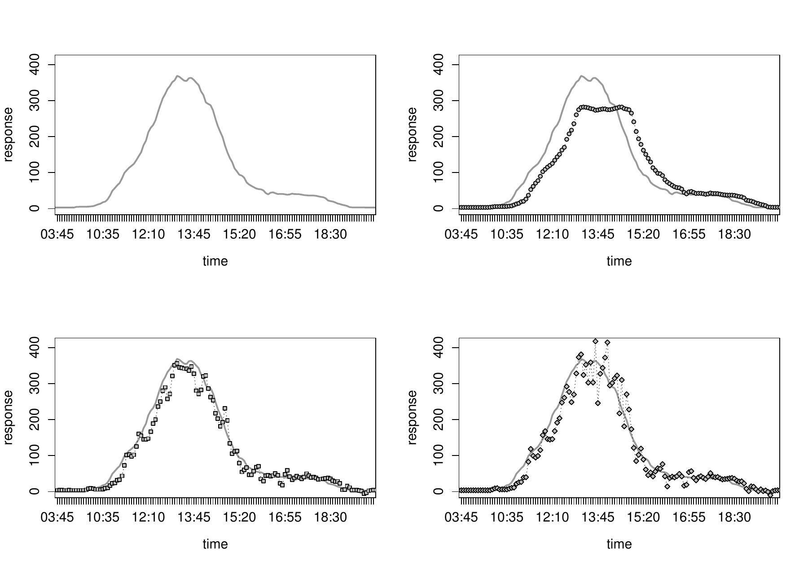

::: article
# Introduction {#intro0}

In a multivariate regression framework, the target response $Y$ can
depend on a set of $p$ initial covariates $X_1, X_2, \ldots, X_p$ but in
practical situations we often would like to determine which covariates
are "relevant" to describe this response.

The question of how to choose a subset of predictors of size $q$
($q\le p$) has not totally been satisfactorily solved yet. This problem
is particularly important for large $p$ and/or when there are redundant
predictors. As a general rule, an increase in the number of variables to
be included in a model provides an "apparently" better fit of the
observed data; however, these estimates are not always satisfying for
different reasons. On the one hand, the inclusion of such irrelevant
variables would increase the variance of the estimates, resulting in a
partial loss of the predictive capability of the model. On the other
hand, the inclusion of too many variables may lead to unnecessary
complexity in the resulting model, conducing to a difficult
interpretation.

Model selection (and variable selection in regression, in particular) is
a trade-off between bias and variance. Inference based on models with
few variables can be biased, however, models that take into account too
many variables may result in a lack of precision or false effects. These
considerations call for a balance between under- and over-fitted models,
the so-called model-selection problem [@Forster00keyconcepts].

To solve this problem, several strategies have been proposed. One common
option is to use iterative procedures, such as the leaps and bounds
algorithm [@doi:10.1080/00401706.1974.10489231] through which the best
subset selection is obtained. This is a full information criteria-based
approach, which compares all possible models and ranks them
[@Calcagno:deMazancourt:2010:JSSOBK:v34i12]. Nevertheless, the problem
of selecting the best model from among all possible combinations of $p$
predictors is not trivial. In the presence of a large number of
variables this selection procedure may require an excessively high
computational cost and thus, in some cases, the problem becomes
intractable. In order to relax this exhaustive search, heuristic
iterative procedures such as forward- and backward-stepwise
[@citeulike:8802640] have been developed. This greedy algorithm produces
a nested sequence of models based on the use of some information
criteria which compares the models obtained in the course of the
simplification or complexification scheme. Several criteria have been
used for this purpose [@Venables:1997:MAS; @miller], including Mallow's
Cp [@citeulike:8900991] or the Akaike Information Criteria or AIC
[@cite-keyakaike]. Apart from the iterative procedures, other strategies
applied in the variable selection problem are, e.g. shrinkage regression
methods ---such as ridge regression or the Lasso (least absolute
shrinkage and selection operator)
[@tibshirani96regression; @citeulike:161814]--- or the Bayesian approach
[@Green95reversiblejump; @Kuo98variableselection; @Park_Casella_2008; @Hans01122009].

Several R packages have been developed to carry out automatic variable
selection or model selection. For instance, the
[*meifly*](https://CRAN.R-project.org/package=meifly) package [@paq2]
can be used to search through all the different models. This type of
exhaustive search can be also addressed using some other algorithm, such
as the branch-and-bound algorithm in the
[*leaps*](https://CRAN.R-project.org/package=leaps) package [@paq1] or
the leaps-and-bounds algorithm in the
[*subselect*](https://CRAN.R-project.org/package=subselect) package
[@paq3]. Both packages also implement other selection methods
(heuristics). The [*leaps*](https://CRAN.R-project.org/package=leaps)
package includes the forward or backward stepwise, or sequential
replacement while the
[*subselect*](https://CRAN.R-project.org/package=subselect) package
provides a simulated annealing-type search algorithm, a genetic
algorithm, and a restricted local improvement algorithm. To use the
Lasso method, the user can apply, for example, the `lars` function
implemented in the [*lars*](https://CRAN.R-project.org/package=lars)
package [@Hastie:2012uq] or the `glmnet` function, which fits a
generalized linear model via penalized maximum likelihood, implemented
in the [*glmnet*](https://CRAN.R-project.org/package=glmnet) package
[@Friedman:2013kx]. Additionally, another procedure used by the R
community seems to be the model-selection-oriented `step` function
[@hastie2] built into the *stats* package. When it comes to model
selection with generalized linear models, one option could be to use the
[*glmulti*](https://CRAN.R-project.org/package=glmulti) package
[@citeulike:9570325] or
[*bestglm*](https://CRAN.R-project.org/package=bestglm) package
[@Mcleod_bestglm:best]. Finally, within the class of generalized
additive models, other algorithms have also been introduced to achieve
component selection, see @lin2006 and references therein, the boosting
technique of @BIOM:BIOM578 or the generalization of the approach of
@Belitz200861. More recently, and widely applied by R users, the `gam`
function of the [*mgcv*](https://CRAN.R-project.org/package=mgcv)
package [@R:Wood:2006; @RePEc:bla:jorssb:v:73:y:2011:i:1:p:3-36]
includes an argument (`select = TRUE`) for model selection and fitting
in a single step by adding a second penalty term in the estimation
scheme of continuous covariates [@Marra:2011:PVS:1967759.1967881].

The [*FWDselect*](https://CRAN.R-project.org/package=FWDselect) package
introduces an alternative to existing approaches in the form of a
methodology whereby R users can select the best variables in different
regression contexts, both parametric and nonparametric. Unlike other
existing packages, the procedure implemented in it can be equally
applied to linear models, generalized linear models or/and generalized
additive models, with Gaussian, binary or Poisson response. The forward
selection algorithm proposed is based on a greedy procedure which
changes one variable at the time in the model --- keeping the others
fixed --- and does this repeatedly until none of the selected variables
can be exchanged to improve model fit. This is a greedy algorithm, which
may not find the actual best solution, but is less greedy than other
methods such as step. In addition, in contrast with other packages in
which the users must decide --- either previous or post selection ---
the number of variables that have to be included, the bootstrap test
introduced in our procedure allows them to determine the number with a
significance level.

The remainder of this paper is organised as follows. First we describe
the algorithm used to select the best subset of size $q$, along with the
bootstrap techniques that are used to determine the number of variables
to be included in the model. Then a detailed description of the package
is presented, and its usage is illustrated through the analysis of three
data sets. Finally, the last section contains the main conclusions of
this work.

# Methodology background {#method}

This section introduces the developed methodology and gives a
description of the variable selection algorithm. The implemented package
can be used with Gaussian, binary or Poisson response, however and based
on the application data, we will explain the procedure with a
nonparametric regression model with Gaussian response.

Let $\textbf{X} = (X_1, X_2, \ldots, X_p)$ be a vector of $p$ initial
variables and $Y$ the response. An additive regression model can be
expressed as

$$\label{eq:chapter4gam}
Y=m\left(\textbf{X}\right)+ \varepsilon,  (\#eq:chapter4gam)  $$

where

$$m \left( \textbf{X} \right)= \alpha+m_{1}\left(X_{1}\right)+m_{2}\left(X_{2}\right)+\cdots+m_{p}\left(X_{p}\right),$$

where $m_j (j=1, \ldots, p)$ are smooth and unknown functions and
$\varepsilon$ is the zero-mean error. Additionally, to guarantee the
identification of the above model, a constant $\alpha$ is introduced in
the model and it is required that the partial functions satisfy

$$E \left [ m_j \left( X_j \right) \right ] = 0, \quad  j=1,\ldots,p.$$

This implies that $E \left[ Y \right] = \alpha$.

To date, several approaches to estimating the model in
(\@ref(eq:chapter4gam)) have been suggested in the statistical
literature, e.g., @Buja:Hast:Tibs:1989, @STAN:STAN43, @Mammen+99. In
this package penalized regression splines, as implemented in the *mgcv*
package, are used.

It is important to highlight that, in situations involving a large
number of variables, correct estimation of the response will be obtained
on the basis of selecting the appropriate predictors. In the case that
we have information a priori about which of the initial set of variables
are relevant, it would be possible to apply a likelihood ratio test
[@neyman1928use2] or a F-test type [@seber2; @seber1] in a parametric
framework, or a generalized likelihood ratio test
[@citeulike:5179259; @RePEc:bes:jnlasa:v:100:y:2005:p:890-907; @citeulike:8241362]
in a nonparametric one. However, in situations where we do not have
information in advance, it will be necessary to select the model
according to a selection algorithm.

According to this, we propose a procedure that includes two topics: i)
selecting the best combination of $q$ variables by using a new forward
stepwise-based selection procedure; and ii) determining the minimum
number of covariates to be included in the model. Both topics are
explained as below.

## Selecting the best variables

The first topic of our procedure is, given a number $q$
$\left(q \le p \right)$, to select the best combination of $q$
variables. For this purpose, one option is to use a complete subset
selection method as [@SIM:SIM3472], which requires all possible models
to be considered. When confronted with a large number of variables,
however, the computational cost of the procedure can be very high or
even prohibitive. In view of this, we provide a new method that speeds
up the process based on a heuristic search which aims to approximate the
optimal solution. There is no guarantee however that the procedure finds
the best subset of covariates --- this could only be achieved based on
searching through all the possible subsets --- but it has the advantage
of requiring a smaller number of computations to reach the optimal
solution or, at least, close to the optimal one.

Let $X_{j_1}$, ..., $X_{j_k}$ be a subset of variables of size $k$
($k \le q$). We define $IC_{j_{1} ,\ldots ,j_{k}}$ as one possible
information criterion (such as AIC, deviance, residual variance, etc.)
of the nonparametric model

$$\label{eq:chapter4model1}
Y=\alpha + m_{j_1} \left(X_{j_1}\right)+m_{j_2} \left(X_{j_2}\right)+\ldots+m_{j_k}\left(X_{j_k} \right)+\varepsilon',  (\#eq:chapter4model1)  $$

where $\varepsilon'$ is the zero-mean error. Based on this information
criterion, $IC$, the proposed automatic forward stepwise selection
method is given in Algorithm [1](#algorithm). Note that any
criterion can be used without correcting it to take account of the
number of variables. This is possible because the models which are
compared have always the same number of variables.

::: lemma
Algorithm 1[]{#algorithm label="1"} Modified forward stepwise selection method

1\. Given a number $q$, selects the $q$ variables
$X_{l_1}, \ldots, X_{l_q}$ which minimises the following expression

$$\label{eq:suboptimo}
\left (l_1, l_2, \ldots, l_q\right) = \displaystyle\mathop{\mathrm{arg\,min}}_{\substack{  \left(j_{1}, \ldots, j_{q}\right)\\ 1\le j_{1}\le \cdots \le j_{q} \le p}}   IC_{j_{1} ,\ldots ,j_{q} }.  (\#eq:suboptimo)  $$

2\. The elements of the vector of indices $(l_1, l_2, \ldots, l_q)$ are
selected consecutively in the following manner:

1.  Firstly, determine the variable of the first position $X_{l_1}$
    where

    $$l_1= \displaystyle\mathop{\mathrm{arg\,min}}_{\substack{ j_1 \\1\le j_{1} \le p }} \hspace{0.1cm}IC_{j_1}.$$

    Note that all possible models of one variable must be estimated.

2.  Fix the first variable obtained previously, $X_{l_1}$ , and obtain
    the second one, $X_{l_2}$, with

    $$l_2= \displaystyle\mathop{\mathrm{arg\,min}}_{\substack{ j_{2}\\1\le j_{2} \le p, \hspace{0.1cm} j_{2}\neq l_1}} \hspace{0.1cm}  IC_{l_1,j_2}.$$

3.  Fix $X_{l_1}$ and $X_{l_2}$, and obtain the third one, $X_{l_3}$,
    where

    $$l_3= \displaystyle\mathop{\mathrm{arg\,min}}_{\substack{j_{3} \\ 1\le j_{3} \le p, \hspace{0.1cm}  j_{3}\notin  \left\{ l_1,l_2\right\}}} \hspace{0.1cm} IC_{l_1,l_2,j_3}.$$

4.  Fix $X_{l_1}, X_{l_2}, \ldots, X_{l_{q-1}}$, and repeat the
    procedure analogously until the $q$-th variable, $X_{l_q}$, with

    $$l_q= \displaystyle\mathop{\mathrm{arg\,min}}_{\substack{j_{q}\\  1\le j_{q} \le p, \hspace{0.1cm} j_{q}\notin  \left\{ l_1,\ldots,l_{q-1}\right\}}} \hspace{0.0cm} IC_{l_1,\ldots,j_q}$$

3\. Once variables $X_{l_1}, X_{l_2}, \ldots, X_{l_q}$ have been
selected, run through positions $j=1, \ldots, q$ and replace each $l_j$
element as follows, only if the obtained $IC$ is less than the minimum
criterion obtained with the previous $l_j$,

$$l_j= \displaystyle\mathop{\mathrm{arg\,min}}_{\substack{ j_j\\ j_j \notin  \left\{ l_1,\ldots,l_{j-1}, l_{j+1},\ldots,l_q \right\}}} \hspace{0.0cm} IC_{l_1,\ldots,l_{j-1},j_j, l_{j+1},\ldots,l_q}.$$

4\. Step 3 is repeated until there is no change in the selected
covariates, i.e., the algorithm stops when it has gone through a
complete cycle without changing any of the $q$ positions.
:::

## Testing the number of significant variables {#testing_number}

Previously, the best subset of $q$ variables is selected according to an
information criterion. However, the question that arises in this
procedure is to know the optimal number $q$. Thus, the second topic in
our methodology is to decide the number of covariates that should be
included in the model, i.e, determining the number of significant
variables.

Accordingly, we propose a procedure to test the null hypothesis of $q$
significant variables in the model versus the alternative in which the
model contains more than $q$ variables. Based on the additive model

$$Y=m\left(\textbf{X}\right)+\varepsilon  \quad {\text{where}} \quad m \left( \textbf{X} \right)= \alpha+m_{1}\left(X_{1}\right)+m_{2}\left(X_{2}\right)+\cdots+m_{p}\left(X_{p}\right),$$

the following strategy is considered: for a subset of size $q$,
considerations will be given to test the null hypothesis

$$H_{0} \left(q\right): \sum_{j=1}^p I_{ \left\{m_j \ne 0 \right\}  } \le q$$

versus the general hypothesis

$$H_{1} \left(q\right):  \sum_{j=1}^p I_{\left\{m_j \ne 0\right\}} > q,$$

where $I$ is the indicator function and considering that the $m_j$'s are
not equal to zero on a set of positive probability.

Given a i.i.d. sample
$\left\{ \left (\textbf{X}_{i},Y_{i}\right) \right\}_{i=1}^{n}$, with
$\textbf{X}=\left(X_1,\ldots,X_p\right)$, to test the above null
hypothesis we propose the following strategy:

-   Obtain the best subset of $q$ predictor variables. To this end we
    use the selection algorithm described in Algorithm
    [1](#algorithm). Without loss of generality, we assume
    that the $q$ variables selected are in the first $q$ positions of
    the **X** vector.

-   Obtain the nonparametric estimates of the null model as

    $$\hat{m}_0\left(\textbf{X}_i\right)=\alpha + \hat{m}_{1}\left(X_{i1}\right)+\ldots+\hat{m}_{q}\left(X_{iq}\right).$$

-   Compute the residuals as
    $r_i=Y_i -\hat{m}_0 \left( \textbf{X}_i \right)$ and obtain the
    nonparametric estimates of $g\left(\textbf{X}_i \right)$ according
    to the model

    $$\label{eq:eqres}
    r_i=g\left(\textbf{X}_i\right)+\varepsilon,  (\#eq:eqres)  $$

    where $g$ is an unknown and smooth function which is applied to a
    unique covariate. This covariate will be chosen from
    $X_{q+1}, \ldots, X_{p}$ applying the selection algorithm exposed in
    Algorithm [1](#algorithm). Without loss of generality, we
    assume that
    $g\left(\textbf{X}\right)=\alpha+g_{q+1}\left(X_{q+1}\right)$.

    The purpose of this step is to assess whether there is enough
    structure left in the residuals that could be modeled by the
    predictors not included in the null model. Note that, within these
    possible predictors, we only select one of them in order to reduce
    the computational cost of the algorithm. However, the ideal solution
    would be to estimate the model in (\@ref(eq:eqres)) determining the
    best subset of predictors within the remainder variables, instead of
    selecting only one of them.

    Both options are implemented in the package by means of the
    `speedup` argument of the `test` function. If `speedup = TRUE` is
    specified a unique predictor for the residuals is used. If
    `speedup = FALSE` is specified the user can choose more than one
    predictor. With this latter option, when the number of variables is
    large, the selection of the best subset of predictors for the
    residuals requires a high computational burden[^1]. Therefore, in
    practice, we propose a solution by using the `qmin` argument which
    must be filled by the user. This argument corresponds to the size of
    the best subset of predictors. In order to help the user select it,
    it is recommended to visualize the graphical output of the plot
    function and to choose the number $q$ which minimizes the curve.

-   Finally, we propose the following test statistic, based on the
    estimations of $g$

    $$T=\sum_{i=1}^n \left | \hat{g} \left( \textbf{X}_i \right) \right |.$$

It is important to stress that, if the null hypothesis holds, $T$ should
be close to zero. Thus, the test rule for checking $H_0(q)$ with a
significance level of $\alpha$ is that the null hypothesis is rejected
if $T$ is larger than its $(1-\alpha)$-percentile. To approximate the
distributions of the test statistic resampling methods such as the
bootstrap introduced by @NoRefWorks:8 [see also
@NoRefWorks:9; @NoRefWorks:18; @NoRefWorks:11] can be applied. Here we
use the wild bootstrap [@citeulike:785121; @liu:1988; @citeulike:991599]
because this method is valid both for homocedastic and heteroscedastic
models where the variance of the error is a function of the covariate.
The testing procedure consists of the following steps:

-   **Step 1**: Obtain $T$ from the sample data, as explained above.

-   **Step 2**: For $i=1, \ldots, n$, obtain
    $\hat{m}_0 \left(\textbf{X}_i\right)$ and the bootstrap residuals as

    $$\varepsilon_i^{\bullet b} = \hat \varepsilon_i V_{i}$$

    where $\hat \varepsilon_i=Y_i- \hat m_0\left(\textbf{X}_i\right)$
    are the residuals of the null model and $V_1, \ldots, V_n$ is an
    i.i.d. random variable with mass
    $\frac{\left(5+\sqrt{5}\right)}{10}$ and
    $\frac{\left(5-\sqrt{5}\right)}{10}$ at the points
    $\frac{\left(1-\sqrt{5}\right)}{2}$ and
    $\frac{\left(1+\sqrt{5}\right)}{2}$. Note that this distribution
    satisfies
    $E\left(V_i\right)=0, E\left(V_i^2\right)=E\left(V_i^3\right)=1$.

-   **Step 3**: For $b = 1, \ldots, B$, simulate the bootstrap sample
    $\left\{\textbf{X}_{i},Y_{i}^{\bullet b}\right\}_{i=1}^{n}$ with
    $Y_{i}^{\bullet b}=\hat{m}_0\left(\textbf{X}_i\right)+\varepsilon_i^{\bullet b}$,
    and compute the bootstrap estimates of $T^{\bullet b}$.

The test rule based on $T$ is given by rejecting the null hypothesis if
$T>T^{1-\alpha}$, where $T^{1-\alpha}$ is the empirical
$\left(1-\alpha\right)$-percentile of values $T^{\bullet b}$
($b=1,\ldots,B$).

Applying this test to $q=1,\ldots,p-1$ could be an important issue in a
covariate selection procedure. If $H_0\left(q\right)$ is not rejected,
only the subset of the covariates $X_{j_1},\ldots,X_{j_q}$ will be
retained, and the remaining variables will be eliminated from the model.
In all other cases, the test is repeated with $q+1$ variables until the
null hypothesis is not rejected. For example, if $H_0\left(1\right)$ is
not rejected just one variable should be included into the model. If
this hypothesis is rejected it will be required to test
$H_0\left(2\right)$. If this new hypothesis is again rejected,
$H_0\left(3\right)$ should be tested and so on until a certain
$H_0\left(q\right)$ is accepted.

The validation of the approach relying on the bootstrap-based test can
be consulted in [@thesis_sestelo] where type I error and power have been
calculated for different test statistics. Also, the performance of the
test for different levels of correlation between covariates have been
analyzed. All the test statistics perform reasonably well, with the
level coming relatively close to the nominal size and the probability of
rejection rising as we separate from the null hypothesis, specially with
large sample sizes. Furthermore, several simulation studies have been
considered in order to compare the methodology proposed in this paper
with other procedures reported in the literature that carry out
automatic variable selection.

# *FWDselect* in practice {#package}

This section introduces an overview of how the package is structured.
*FWDselect* is a shortcut for "Forward selection" and this is its major
functionality: to provide a forward stepwise-based selection procedure.
This software helps the user select relevant variables and evaluate how
many of these need to be included in a regression model. In addition, it
enables both numerical and graphical outputs to be displayed.

Our package includes several functions that enable users to select the
variables to be included in linear models, generalized linear models or
generalized additive models. The functions within *FWDselect* are
briefly described in Table [1](#sestelo:fun).

Users can obtain the best combinations of $q$ variables by means of the
main function which is `selection`. Additionally, if one wants to obtain
the results for more than one subset size, it is possible to apply the
`qselection` function, which returns a summary table showing the
different subsets, selected variables and information criterion values.
These values are obtained by cross-validation with the purpose of
comparing correctly the resulting models which include a different
number of variables. The object obtained with this last function is the
argument required for `plot`, which provides a graphical output.
Finally, to determine the number of variables that should be introduced
in the model, only the `test` function needs to be applied. Table
[2](#sestelo:arg) provides a summary of the arguments of the
`selection`, `qselection` and `test` functions. The most computationally
demanding parts of the code, namely those that involve the estimation of
the models, the cross-validation and the bootstrap, have been
parallelized by means of the *parallel* package via forking on
Unix-alike platforms or creating a PSOCK cluster on Windows systems.

::: {#sestelo:fun}
  -----------------------------------------------------------------------------------------------------------------------------------------------------------------------------------------------------------------------------------
  Function             Description
  -------------------- --------------------------------------------------------------------------------------------------------------------------------------------------------------------------------------------------------------
  `selection`          Main function for selecting a subset of $q$ variables. Note that the selection procedure can be used with `lm`, `glm` or `gam` functions.

  `print.selection`    Method of the generic print function for `"selection"` objects, which returns a short summary.

  `qselection`         Function that enables users to obtain the selected variables for more than one size of subset.

  `print.qselection`   Method of the generic print function for `"qselection"` objects. Returns a table showing the chosen covariates to be introduced into the models and their information criteria obtained by cross-validation.

  `plot.qselection`    Visualisation of `"qselection"` objects. Plots the cross-validation information criterion for several subsets with size $q$ chosen by users.

  `test`               Function that applies a bootstrap-based test for covariate selection. Helps determine the precise number of variables to be included in the model.
  -----------------------------------------------------------------------------------------------------------------------------------------------------------------------------------------------------------------------------------

  : Table 1: Summary of functions in the *FWDselect* package.
:::

::: {#sestelo:arg}
  -----------------------------------------------------------------------------------------------------------------------------------------------------------------------------------------------------------------------------------------------------------------------------------------------------------------------------------------------------------------------------------------------------------------------------------------------------------------------------------------------------------------------------------------
                `selection()` arguments
  ------------- ---------------------------------------------------------------------------------------------------------------------------------------------------------------------------------------------------------------------------------------------------------------------------------------------------------------------------------------------------------------------------------------------------------------------------------------------------------------------------------------------------------------------------
  `x`           A data frame containing all the covariates.

  `y`           A vector with the response values.

  `q`           An integer specifying the size of the subset of variables to be selected.

  `prevar`      A vector containing the number of the $q-1$ selected variables in the previous step. By default it is NULL.

  `criterion`   The information criterion to be used. Default is the `"deviance"`. Other functions provided are the coefficient of determination (`"R2"`), the residual variance (`"variance"`), the Akaike information criterion (`"aic"`), AIC with a correction for finite sample sizes (`"aicc"`) and the Bayesian information criterion (`"bic"`). The deviance, coefficient of determination and variance are calculated by cross-validation.

  `method`      A character string specifying which regression method is used, `"lm"`, `"glm"` or `"gam"`.

  `family`      This is a family object specifying the distribution and link to use in fitting.

  `seconds`     A logical value. If `TRUE` then, rather than returning the single best model only, the function returns a few of the best models.

  `nmodels`     Number of secondary models to be returned.

  `nfolds`      Number of folds for the cross-validation procedure, for `deviance`, `R2` or `variance` criterion.

  `cluster`     A logical value. If `TRUE` (default) the code is parallelized. Note that there are cases without enough repetitions (e.g., a low number of initial variables) that R will gain in performance through serial computation. R takes time to distribute tasks across the processors also it will need time for binding them all together later on. Therefore, if the time for distributing and gathering pieces together is greater than the time needed for single-thread computing, it could be better not to parallelize.

  `ncores`      An integer value specifying the number of cores to be used in the parallelized procedure. If `NULL`, the number of cores to be used is equal to the number of cores of the machine $-1$.

                `qselection()` arguments

  `x`           A data frame containing all the covariates.

  `y`           A vector with the response values.

  `qvector`     A vector with more than one variable-subset size to be selected.

  `criterion`   The information criterion to be used. Default is the `"deviance"`. Other functions provided are the coefficient of determination (`"R2"`), the residual variance (`"variance"`), the Akaike information criterion (`"aic"`), AIC with a correction for finite sample sizes (`"aicc"`) and the Bayesian information criterion (`"bic"`). The deviance, coefficient of determination and variance are calculated by cross-validation.

  `method`      A character string specifying which regression method is used, `"lm"`, `"glm"` or `"gam"`.

  `family`      This is a family object specifying the distribution and link to use in fitting.

  `nfolds`      Number of folds for the cross-validation procedure, for `deviance`, `R2` or `variance` criterion.

  `cluster`     A logical value. If `TRUE` (default) the code is parallelized.

  `ncores`      An integer value specifying the number of cores to be used in the parallelized procedure. If `NULL`, the number of cores to be used is equal to the number of cores of the machine $-1$.

                `test()` arguments

  `x`           A data frame containing all the covariates.

  `y`           A vector with the response values.

  `method`      A character string specifying which regression method is used, `"lm"`, `"glm"` or `"gam"`.

  `family`      This is a family object specifying the distribution and link to use in fitting.

  `nboot`       Number of bootstrap repeats.

  `speedup`     A logical value. If `TRUE` (default), the testing procedure is computationally efficient since it considers one more variable to fit the alternative model than the number of variables used to fit the null. If `FALSE`, the fit of the alternative model is based on considering the best subset of variables of size greater than $q$, the one that minimizes an information criterion. The size of this subset must be given by the user filling the argument `qmin`.

  `qmin`        By default `NULL`. If `speedup` is `FALSE`, `qmin` is an integer number selected by the user. To help the selection of this argument, it is recommended to visualize the graphical output of the `plot` function and choose the number `q` which minimizes the curve.

  `unique`      A logical value. By default `FALSE`. If `TRUE`, the test is performed only for one null hypothesis, given by the argument `q`.

  `q`           By default `NULL`. If `unique` is `TRUE`, `q` is the integer number $q$ of $H_0(q)$ to be tested.

  `bootseed`    Seed to be used in the bootstrap procedure.

  `cluster`     A logical value. If `TRUE` (default), the testing procedure is parallelized.

  `ncores`      An integer value specifying the number of cores to be used in the parallelized procedure. If `NULL`, the number of cores to be used is equal to the number of cores of the machine $-$ 1.
  -----------------------------------------------------------------------------------------------------------------------------------------------------------------------------------------------------------------------------------------------------------------------------------------------------------------------------------------------------------------------------------------------------------------------------------------------------------------------------------------------------------------------------------------

  : Table 2: Arguments of `selection`, `qselection` and `test`
  functions.
:::

## Example of application

In this section we illustrate the use of *FWDselect* package using a
real data set, the pollution data (included in the package). The
software is applied to the prediction of atmospheric SO$_2$ pollution
incidents by means of additive models. Combustion of fuel oil or coal
releases sulphur dioxide into the atmosphere in different quantities.
Current Spanish legislation governing environmetrical pollution controls
the vicinity of potential point sources of pollution, such as coal-fired
power stations. It places a limit on the mean of 24 successive
determinations of SO$_2$ concentration taken at 5-minute intervals. An
emission episode is said to occur when the series of bi-hourly means of
SO${_2}$ is greater than a specific level, $r$. In this framework, it is
of interest for a plant, both economically and environmentally, to be
able to predict, when the legal limit will be exceeded with sufficient
time for effective countermeasures to be taken.

In previous studies
[@doi:10.1080/00401706.1995.10484336; @ENV:ENV403; @CEM:CEM430; @ENV:ENV687],
semiparametric, partially linear models and generalized additive models
with unknown link functions were applied to the prediction of
atmospheric SO$_2$ pollution incidents in the vicinity of a
coal/oil-fired power station. Here, we present a new approach to this
problem, whereby we try to predict a new emission episode, focusing our
attention on the importance of ascertaining the best combinations of
time instants for the purpose of obtaining the best prediction. Bearing
this in mind, the selection of the optimal subset of variables could be
a good approach to this issue.

Let $t$ be the present time, and $X_t$ the value obtained by the series
of bi-hourly means for SO$_2$ at instant $t$ (5-minute temporal
instants). Setting $r=150$ $\mu$g/m$^3$N as the maximum value permitted
for the SO$_2$ concentration, and half-an-hour (6 instants) as the
prediction horizon, it is of interest to predict $Y=X_{t+6}$, with the
best vector of $X_l=\left(X_t,X_{t-1},X_{t-2},\ldots,X_{t-17}\right)$.
Note that one of the problems that arises is to decide which temporal
instants $\left(X_{t},X_{t-1},X_{t-2},\ldots,X_{t-17}\right)$ are
relevant for prediction purposes, since inclusion of all the times $X_l$
may well degrade the overall performance of the prediction model. Based
on this, we demonstrate the package capabilities using these data. An
excerpt of the data frame included in the package is shown below:

``` r
> library(FWDselect)
> data(pollution)
> head(pollution)[1:2, ]
   In17  In16  In15  In14  In13  In12  In11  In10   In9   In8
1  3.02  3.01  3.01  3.01  3.01  3.03  3.03  3.03  3.03  3.03
2 16.49 16.55 16.42 16.35 16.56 16.75 16.74 16.72 16.63 16.53
    In7   In6   In5   In4   In3   In2   In1   In0   InY
1  3.03  3.03  3.03  3.03  3.03  3.03  3.03  3.03 10.78
2 16.32 16.08 15.77 15.47 14.81 14.30 13.70 13.35 10.65
```

The variables from `In17` to `In0` correspond to the registered values
of SO$_2$ at a specific temporal instant. `In0` denotes the zero instant
($X_t$), `In1` corresponds to the 5-min temporal instant before
($X_{t-1}$), `In2` is the 10-min temporal instant before ($X_{t-2}$),
and so on until the last variable. The last column of the data frame
(`InY`) refers to the response variable, $Y=X_{t+6}$, the temporal
instant that we wish to predict. For this purpose, we propose the
underlying generalised additive model

$$\label{eq:chapter6modelapp}
Y=m_0\left(X_{t}\right)+m_1\left(X_{t-1}\right)+\ldots+m_{17}\left(X_{t-17}\right)+\varepsilon  (\#eq:chapter6modelapp)  $$

where $m_j$, with $j=0, \ldots,17$, are smooth and unknown functions and
$\varepsilon$ is the error which is assumed to have mean zero. To
estimate the model in (\@ref(eq:chapter6modelapp)), *FWDselect* allows
penalised regression splines, implemented in the *mgcv* package
[@Wood_2003; @citeulike:9697476; @RePEc:bla:jorssb:v:73:y:2011:i:1:p:3-36].

It may often be of interest to determine the best subset of variables of
size $q$ needed to predict the response. The question that naturally
arises in this application is, what is the best temporal instant for
predicting an emission episode. This is easy to ascertain with the
function `selection` and the argument `q = 1`. Also, based on the model
that we want to estimate here (additive model), we have to use "`gam`"
on the `method` argument.

``` r
> x <- pollution[, -19]
> y <- pollution[, 19]
> obj1 <- selection(x, y, q = 1, method = "gam", criterion = "deviance")
> obj1

****************************************************
Best subset of size q = 1 : In0

Information Criterion Value - deviance : 278663
****************************************************
```

For more than one subset size, the `qselection` function returns a table
for the different subset sizes, with the selected variables and the
information criterion value.

``` r
> obj2 <- qselection(x, y, qvector = c(1:6), method = "gam", criterion = "deviance")
[1] "Selecting subset of size 1 ..."
[1] "Selecting subset of size 2 ..."
[1] "Selecting subset of size 3 ..."
[1] "Selecting subset of size 4 ..."
[1] "Selecting subset of size 5 ..."
[1] "Selecting subset of size 6 ..."
> obj2
  q   deviance                    selection
1 1 278662.959                          In0
2 2 201474.673                     In0, In2
3 3 232164.509                In0, In2, In1
4 4 219941.426           In0, In3, In1, In5
5 5 184293.934      In0, In3, In1, In7, In6
6 6 200877.902 In0, In3, In1, In7, In6, In5
```

The above function output is a useful display that greatly helps
determine the most relevant variables. A plot of this object can easily
be obtained by using the following input command:

``` r
> plot(obj2)
```

Figure [1](#chapter6:plot_aic) shows the deviance values (obtained by
cross-validation) corresponding to the different subsets. In each
subset, $q$ represents the number of temporal instants included in the
model. Note, however, that only the results until subset of size $q=$ 6
are shown because, from this size onwards, the rest of the obtained
models have similar deviances.

{#chapter6:plot_aic
width="100%" alt="graphic without alt text"}

The performance of the proposed predictors was then evaluated in a new
real pollution episode. We estimate firstly each of the proposed models
using the `gam` function of the `mgcv` package with the training data
set (`pollution` data). Then, we apply the `predict.gam` function to
each model using, in this case, the test data set. These data are found
in the `episode` data, also included in this package. The corresponding
data frame is illustrated as follows:

``` r

> data(episode)
> head(episode)[1:2, ]
  In17 In16 In15 In14 In13 In12 In11 In10  In9  In8  In7  In6  In5
1 3.02 3.02 3.03 3.10 3.10 3.10 3.10 3.22 3.27 3.33 3.36 3.38 3.47
2 3.02 3.03 3.10 3.10 3.10 3.10 3.22 3.27 3.33 3.36 3.38 3.47 3.50
   In4  In3  In2  In1  In0  InY  time
1 3.50 3.56 3.61 4.28 4.60 5.45 00:00
2 3.56 3.61 4.28 4.60 4.68 6.20 00:05
```

The course of the incident is depicted in Figure [2](#chapter6:episode).
Temporal instants are plotted on the horizontal axis and the real 2-hour
mean SO$_2$ concentration that we seek to predict ($Y=X_{t+6}$) is
represented by a grey line. The predictions obtained by applying the
different models are shown in the same figure. The code, both for the
predictions as for the plot, is shown in the Appendix.

The prediction obtained with the inclusion of just one variable in the
model, $X_{t}$, is far from the optimum. However, the addition of one
more variable, $X_{t-2}$, resulted in a remarkable increase in the model
predictive capability. It makes possible for predictions close to real
values to be obtained. Lastly, it can be seen that the incorporation of
one more variable or temporal instant ($X_{t-1}$) in the model does not
produce any improvement in pollution-incident prediction. Numerically
speaking, the same results can be observed by taking into account the
Mean Square Error for each model (Table [3](#chapter6:mse)).

<figure id="chapter6:episode">

<figcaption>Figure 2: Example of an SO<span
class="math inline"><sub>2</sub></span> pollution incident that occurred
on 4 July 2003. Temporal instants are shown on the horizontal axis. The
grey line represents the known response of SO<span
class="math inline"><sub>2</sub></span> levels in <span
class="math inline"><em>μ</em></span>g/m<span
class="math inline"><sup>3</sup></span>N. Estimation of SO<span
class="math inline"><sub>2</sub></span> levels with one, two and three
covariates are represented by circles, squares and diamonds
respectively. </figcaption>
</figure>

::: {#chapter6:mse}
  -------------------------------------
  Model                             MSE
  -------------------------- ----------
  $Y= X_t$                     1 682.14

  $Y= X_t+X_{t-2}$               366.44

  $Y= X_t+X_{t-2}+X_{t-1}$       556.49
  -------------------------------------

  : Table 3: Mean Square Error of the selected models.
:::

The question that now arises is what is the minimum number of variables
that must be used in order to obtain the best prediction. It is possible
to deduce that there is an optimal intermediate point between the number
of variables that enters the model (preferably low) and the deviance
value (preferably also low). To find this point, the test described in
the previous section for the null hypothesis $H_0(q)$ is applied for
each size, $q$ (through the input command shown below). The procedure
stops when a certain null hypothesis is accepted. The most
computationally demanding parts are those that involve the bootstrap and
the cross-validation techniques. This can be parallelized using the
argument `cluster = TRUE` (default). This should considerably increase
the performance on multi--core / multi--threading machines.

``` r
> test(x, y, nboot = 100, method = "gam", bootseed = 0413)
[1] "Processing IC bootstrap for H_0 ( 1 )..."
[1] "Processing IC bootstrap for H_0 ( 2 )..."

*************************************
  Hypothesis Statistic pvalue     Decision
1    H_0 (1)   5779.03      0     Rejected
2    H_0 (2)    959.21   0.78 Not Rejected
```

The deduction to be drawn is that, for a 5% significance level, the null
hypothesis is rejected with $q=$ 1 and accepted thereafter. From these
results, it can be concluded that the best temporal instants for
prediction of an emission episode would be $X_{t}$ and $X_{t-2}$.

Lastly, as we mention before, there are other alternatives for variable
selection in additive models. One of the best-known and used procedures
is the argument `select` of the `gam` function from the *mgcv* package
[@Marra:2011:PVS:1967759.1967881]. To illustrate and compare its usage
with our procedure, we have estimated the model in
(\@ref(eq:chapter6modelapp)) by means of the cited function using the
`pollution` data. Then, its performance was evaluated using again the
`episode` data. The prediction obtained using this double penalty GAM is
far from what it should be (see Figure [3](#gam)), actually, the mean
square error obtained (5 024.29) is the worst of all so far (see the
code in Appendix). It seems that, in situations with a large number of
variables, the selection of the best subset could be a better approach.

{#gam
width="100%" alt="graphic without alt text"}

# Conclusions

This paper discusses implementation in R of a new algorithm for the
problem of variable selection in a regression framework. The *FWDselect*
package provides R users a simple method for ascertaining the relevant
variables for prediction purposes and how many of these should be
included in the model. The proposed method is a new forward
stepwise-based selection procedure that selects a model containing a
subset of variables according to an information criterion, and also
takes into account the computational cost. Bootstrap techniques have
been used to determine the minimum number of variables needed to obtain
an appropriate prediction.

In some situations, several statistically equivalent optimal models of
size $q$ may exist. In such cases, *FWDselect* allows the user to
visualise those models and select the most interesting one. This is
obtained with the argument `seconds = TRUE` of the `selection`
functions. In addition, the software provides the user with a way of
easily obtaining the best subset of variables using different types of
data in different frameworks, by applying the `lm`, `glm` and `gam`
functions already implemented in R. The use of these classical R
functions nevertheless entails a high computational cost. Hence, a
further interesting extension would be the implementation of this
package using C, C++ or Fortran as the programming language. R users
could profit from this advantage in a future version of this package.

Insofar as the validity of the method is concerned, we think that the
results obtained with simulated data are correct, and the results with
the diabetes data are in accordance with other methodologies. This
suggest that the behavior of the procedure in a nonparametric framework
will be also adequate.

The results in this paper were obtained using $R$ 3.2.0. The *FWDselect*
package [@fwd2] is available from the Comprehensive R Archive Network at
the URL <http://cran.r-project.org/web/packages/FWDselect/>.

# Acknowledgments {#ackno}

This work was supported by research grant SFRH/BPD/93928/2013 of
"Fundação para a Ciência e a Tecnologia" (FCT) and by FEDER Funds
through "Programa Operacional Factores de Competitividade - COMPETE", by
Portuguese Funds through FCT, in the form of grant
PEst-OE/MAT/UI0013/2014, by grant MTM2011-23204 (FEDER support included)
of the Spanish Ministry of Science and Innovation and by grant
10PXIB300068PR from the Galician Regional Authority (Xunta de Galicia).

\

\

\

\

# Appendix {#app}

Here we illustrate the use of *FWDselect* using simulated data. The use
of simulated data allows us to ascertain the behavior of our software
and to compare it with others available tools designed for the same
purpose.

Consider a vector of 10 covariates,
$\textbf{X}=\left(X_1, \ldots, X_{10}\right)$, and a continuous
response, $Y$, generated in accordance with

$$Y = 2 \hspace{0.1cm} X_1+ 4 \hspace{0.1cm}  X_5+ \varepsilon,$$ where
$\varepsilon$ is the error distributed in accordance with a $N(0, 1)$
and the explanatory covariates are random variables obtained from
uniforme distribution on $[-1,1]$. Note that we have a linear scenario
in which the response variable depends only on two covariates.

The following code will simulate 100 observations ($n =$ 100) from the
above model. To ensure the reproducibility of the results reported in
the paper a seed was considered (0413).

``` r
> library(glmulti)
Loading required package: rJava
> library(leaps)
> rm(list = ls())
> set.seed(0413)
> n <- 100
> x <- matrix(runif(10 * n, -1, 1), ncol = 10, nrow = n, byrow = FALSE)
> e <- rnorm(n, 0, 1)
> y <- 2 * x[, 1] + 4 * x[, 5] + e
> data <- data.frame(x, y)
```

Now we compare our method against other existing methodologies developed
to perform automated variable selection. We choose the *leaps* package
(`regsubsets` function), which selects the best variables for each
subset of size $q$ without determining the number of variables that
users have to include in the model; the `step` function from the *stats*
package which selects a formula-based model using the AIC; and the
*glmulti* which compares all posible models through an exhaustive
screening of the candidates, or a genetic algorithm, or a very fast
exhaustive branch-and-bound algorithm .

``` r
> res1 <- regsubsets(x, y)
> summary(res1)$outmat[2, ]
  a   b   c   d   e   f   g   h   i   j 
"*" " " " " " " "*" " " " " " " " " " " 

> res2 <- step(lm(y ~ ., data = data), trace = FALSE)
> res2

Call:
lm(formula = y ~ X1 + X4 + X5 + X9, data = data)

Coefficients:
(Intercept)           X1           X4           X5           X9  
     0.1538       1.9691       0.4285       3.5774       0.2875  


> res3 <- glmulti(y ~ ., data = data, level = 1, plotty = F, report = FALSE)
> summary(res3)$bestmodel
[1] "y ~ 1 + X1 + X4 + X5 + X9"

> res4aux <- test(x, y, nboot = 100)
[1] "Processing IC bootstrap for H_0 ( 1 )..."
[1] "Processing IC bootstrap for H_0 ( 2 )..."

*************************************
  Hypothesis Statistic pvalue     Decision
1    H_0 (1)     90.92      0     Rejected
2    H_0 (2)     21.11   0.06 Not Rejected
> res4 <- selection(x = x, y = y, q = res4aux$nvar, cluster = FALSE)
> res4

****************************************************
Best subset of size q = 2 : 5 1

Information Criterion Value - deviance : 16.70488
****************************************************

```

The `regsubsets` function is based on all subsets or, in other words,
exhaustive variable selection. The method identifies the best subsets of
linear predictors using a branch--and--bound algorithm (Miller, 2002).
Since this function returns separate best models of all sizes, we
consider only the results obtained for a subset of size two. In this
case, the procedure works properly returning the $X_1$ and $X_5$
variables as the best subset of size two. The model--selection oriented
function `step` is a widely used methodology for jointly determining the
number and choice of variables. In this case, this procedure fails
returning a model which includes the effects of four covariates ($X_1$,
$X_4$, $X_5$ and $X_9$). The results obtained with the *glmulti*
package, another option for model selection, are also mistaken. The
procedure returns the same model obtained with the previous method
(`step`). Finally, in order to ascertain the performance of *FWDselect*,
we firstly apply the `test` function with the purpose of determine the
number of variable that have to be included in the model. Then, once
this number is obtained (saved in the returned list as `$nvar`), the
`selection` function determines correctly the $X_1$ and $X_5$ variables.

According to the computation time of these four methods, the fastest
procedure is the implemented in the *leaps* package taking only 0.001
secs. The second one is the `step` function which runs in 0.037 secs.
The next one is the `glmulti` function which takes 3.149 secs. Lastly,
the most computationally demanding code is the implemented in the
*FWDselect* package which requires 9.181 secs. All the results have been
obtained using the `R`'s `system.time` command on a 2.4 GHz Intel Core
i5, with 4 cores and 4 Gb of RAM.

The previous results have been obtained using simulated data with a
linear effect of the covariates. However, in practice, the user does not
know the dependence structure, i. e., how the response variable depends
on the covariates. With this in mind, we have considered and applied
again the four procedures on another scenario where the response
variable depends again on the same two covariates, but in this case, the
effect of them is nonlinear. Particularly, the $Y$ is now generated in
accordance with

$$Y = 2 \left(X_1\right)^2+ 2\sin \left(2  \pi X_5\right)+ \varepsilon,$$

being both $\varepsilon$ and the explanatory covariates the same of the
previous scenario. Note that we have now a nonlinear scenario in which
the response variable depends only on two covariates.

``` r
> y <- 2 * x[, 1]**2 + 2 * sin(2 * pi * x[, 5]) + e
> data <- data.frame(x, y)
> res1 <- regsubsets(x, y)
> summary(res1)$outmat[2, ]
  a   b   c   d   e   f   g   h   i   j 
" " " " " " " " "*" "*" " " " " " " " " 

> res2 <- step(lm(y ~ ., data = data), trace = 0)
> res2

Call:
lm(formula = y ~ X5, data = data)

Coefficients:
(Intercept)           X5  
     0.4764      -1.2377  


> res3 <- glmulti(y ~ ., data = data, level = 1, plotty = F, report = FALSE)
> summary(res3)$bestmodel
[1] "y ~ 1 + X5"

> res4aux <- test(x, y, nboot = 100, method = "gam")
[1] "Processing IC bootstrap for H_0 ( 1 )..."
[1] "Processing IC bootstrap for H_0 ( 2 )..."


*************************************
  Hypothesis Statistic pvalue     Decision
1    H_0 (1)     46.04      0     Rejected
2    H_0 (2)     20.89   0.15 Not Rejected
> res4 <- selection(x, y, q = res4aux$nvar, cluster = FALSE, method = "gam")
> res4

****************************************************
Best subset of size q = 2 : 5 1

Information Criterion Value - deviance : 18.41203
****************************************************
```

In this case, the performance of the methods changes. Excluding the
*FWDselect*, all the procedures fail to select the correct model. The
*leaps* package returns the $X_5$ and $X_6$ variables whereas the others
two packages only retrieve the effect of $X_5$.

The results presented in this appendix have been obtained with one
simulated sample of $n =$ 100. In order to evaluate the real performance
of the methods, a simulation study using five hundred independent
samples with different sample sizes ($n = 50, 100, 200$) was carried
out. Focusing on the linear scenario, the *leaps* and *FWDselect*
packages work well with 100% and close to 95% of successes, respectively
(for any sample sizes). The success rate for the other two packages is
around 22%. Note that the results of *leaps* have been obtained assuming
a subset of size two, and thus providing an advantage to this method
over the others. In relation with the nonlinear scenario, the proportion
of failures is very high for all procedures excepting *FWDselect*. The
latter performs correctly close to 30% of the times for the smallest
sample size, around 63% for $n =100$ while it reaches 91.6% of successes
for $n = 200$.
:::

[^1]: The procedure for selecting the best subset of predictors for the
    residuals would be as follows: for each possible $v$ value
    ($v = 1, \ldots, p-q$), it should be used the Algorithm
    [1](#algorithm) to identify the best $v$ variables and to
    obtain the $IC_v$ from the fitted model with them. Then, it should
    be looked at all of the resulting models, with the goal of
    identifying the one that is best, i.e., the model with the minimum
    $IC_v$.
