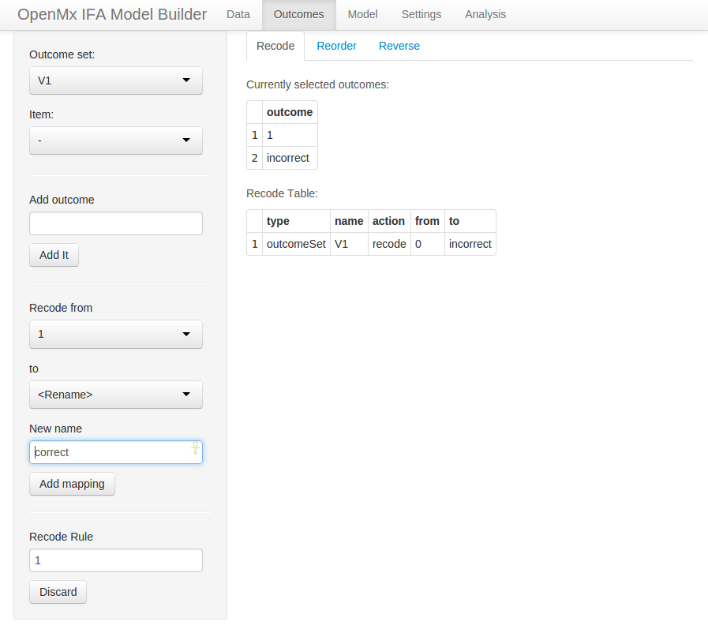
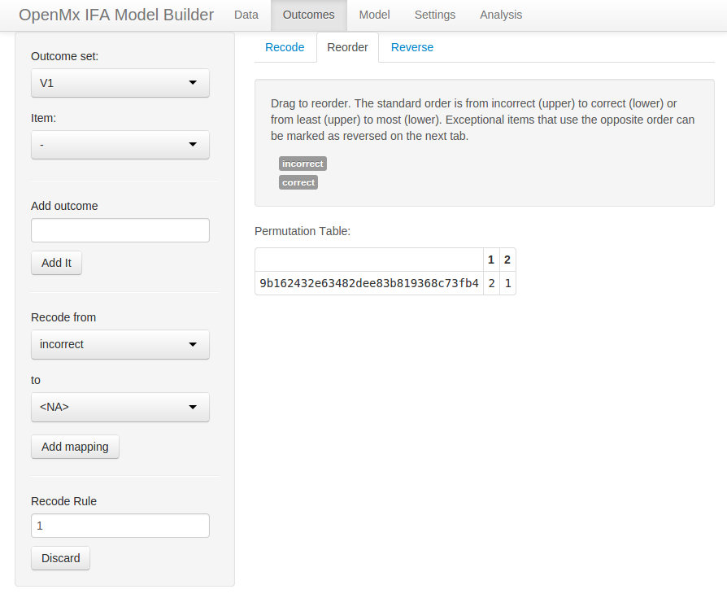
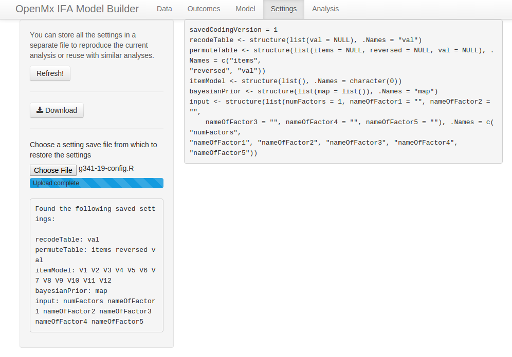
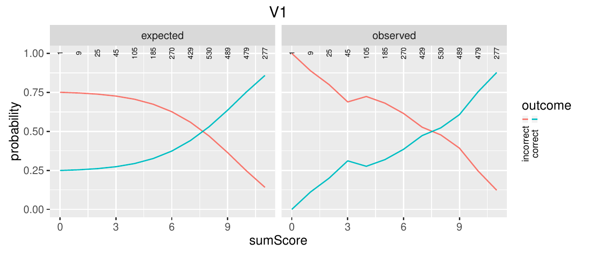
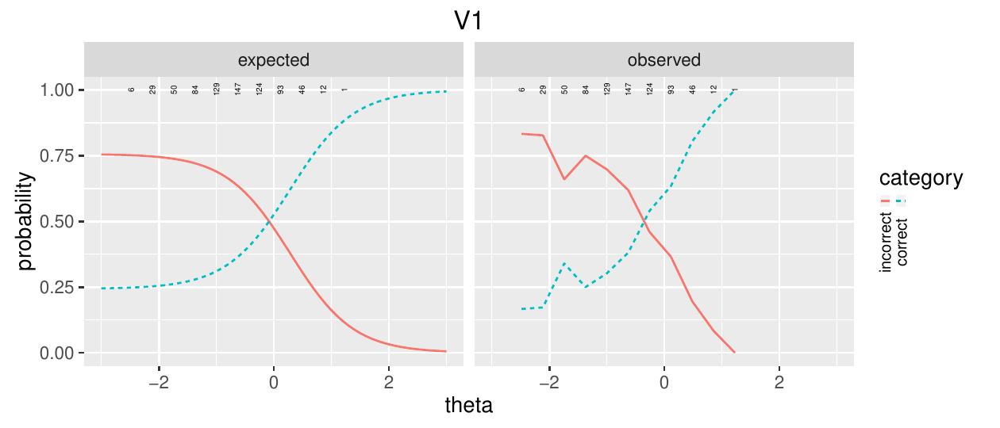
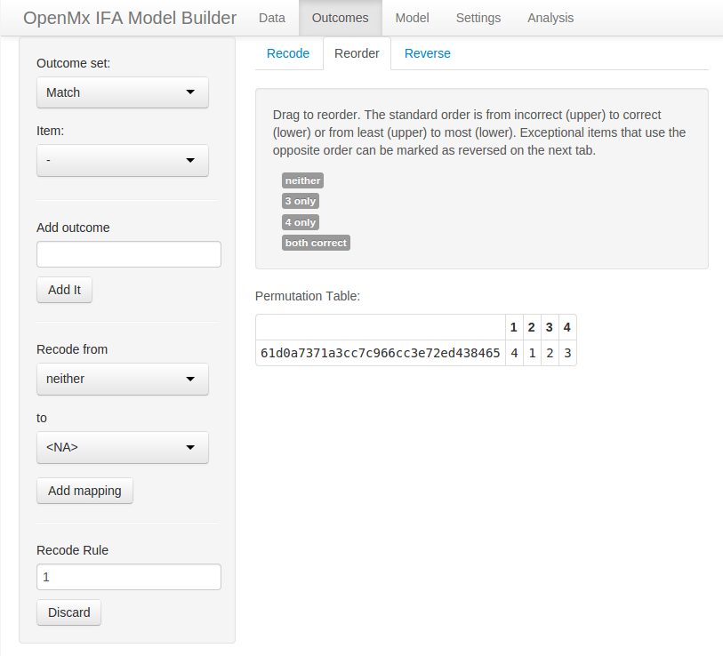
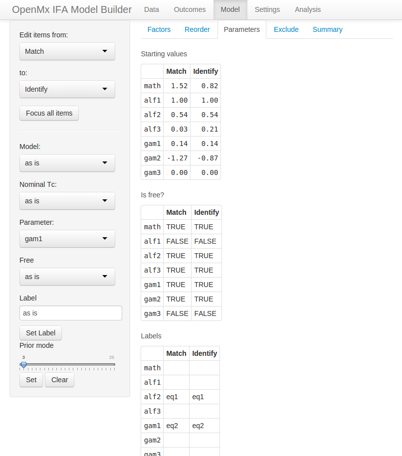
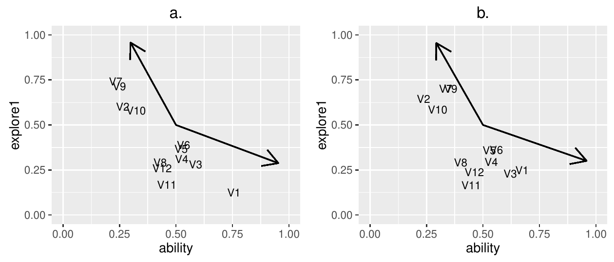

::: article
# An overview of *OpenMx*

[*OpenMx*](https://CRAN.R-project.org/package=OpenMx), a modular package
originally designed for structural equation modeling [@openmx2],
recently gained the ability to handle Item Factor Analysis (a.k.a. Item
Response Theory, Modern Test Theory) models [@pritikin2014a]. Although a
goal of *OpenMx* is to cater to the statistical power user and
facilitate analyses that are difficult to conduct in other software, the
development team is always on the lookout for ways to ease the learning
curve for novice users as well. Here we introduce a new
[*shiny*](https://CRAN.R-project.org/package=shiny) [@shiny:webapp] web
application to generate *OpenMx* code in
[*Rmarkdown*](https://CRAN.R-project.org/package=Rmarkdown) format
[@rmarkdown]. We believe this code generator substantially lowers the
barrier to entry for novice users of Item Factor Analysis (IFA) and
encourages a culture of literate programming [@knuth1984] and
reproducible science [@peng2011; @nosek2015]. The generated code can be
customized at many levels. This flexibility enables the production of
custom analyses and reports as users grow more sophisticated in their
modeling expectations.

# The statistical model

Item analysis is concerned with items that are scored correct/incorrect
or on an ordinal scale. Many psychological surveys use an ordinal scale.
For example, participants may be asked to respond to an item like, "I
feel I am in charge of the situation in which I live." on a 5-point
Likert scale from *agree* to *disagree*. Whether dichotomous or ordinal,
the conditional likelihood of response $x_{ij}$ to item $j$ from person
$i$ with item parameters $\xi_j$ and latent ability (a.k.a. latent
trait) $\theta_i$ is
$$\begin{aligned}
\label{eq:response}
L(x_i|\xi,\theta_i) = \prod_j \mathrm{Pr}(\mathrm{pick}=x_{ij} | \xi_j,\theta_i). 
\end{aligned}   (\#eq:response)$$
One implication of Equation \@ref(eq:response) is that items are assumed
to be conditionally independent given the latent ability $\theta_i$.
That is, the outcome of one item does not have any influence on another
item after controlling for $\xi$ and $\theta_i$. The unconditional
likelihood is obtained by integrating over the latent distribution
$\theta_i$,
$$\begin{aligned}
\label{eq:integral}
L(x_i|\xi) = \int L(x_i|\xi, \theta_i) L(\theta_i) \mathrm{d}\theta_i. 
\end{aligned}   (\#eq:integral)$$
With an assumption that examinees are independently and identically
distributed, we can sum the individual log likelihoods,
$$\begin{aligned}
\label{eq:ifa-model}
\mathcal{L}=\sum_i \log L(x_i | \xi). 
\end{aligned}   (\#eq:ifa-model)$$
Optimization consists of finding the $\xi$ that maximizes this function.
*OpenMx* presently offers only one choice for optimization, an
Expectation-Maximization algorithm using equal interval quadrature to
evaluate the integral in Equation \@ref(eq:integral) [@bock1981]. In the
future, we plan to add complementary algorithms such as
Metropolis-Hastings Robbins-Monro, that is more efficient at optimizing
certain problems [@cai2010b].

Several models are readily available to plug in as the response
probability function
$\mathrm{Pr}(\mathrm{pick}=x_{ij} | \xi_j,\theta_i)$ in
Equation \@ref(eq:response). All of these response probability functions
are built from the logistic function,
$$\text{logistic}(l) \equiv \text{logit}^{-1}(l) \equiv \frac{1}{1+\exp(-l)}.$$
Details of the parameterizations are given here. A discussion of these
item models more appealing to intuition is given in the next section.

## Dichotomous model

The dichotomous response probability function can model items when there
are exactly two possible outcomes. It is defined as,
$$\begin{aligned}
\label{eq:dichotomous}
\mathrm{Pr}(\text{pick}=0| a,b,g,u,\tau) &= 1- \mathrm{Pr}(\text{pick}=1| a,b,g,u,\tau) \\ 
\mathrm{Pr}(\text{pick}=1| a,b,g,u,\tau) &= \text{logit}^{-1}(g)+(\text{logit}^{-1}(u)-\text{logit}^{-1}(g))\frac{1}{1+\exp(-( a\tau + b))}
\end{aligned}   (\#eq:dichotomous)$$

where $a$ is the slope, $b$ is the intercept, $g$ is the pseudo-guessing
lower asymptote expressed in logit units, $u$ is the upper asymptote
expressed in logit units, and $\tau$ is the latent ability of the
examinee [@birnbaum1968; @loken2010]. A *#PL* naming shorthand has been
developed to refer to versions of the dichotomous model with different
numbers of free parameters. Model $n$PL refers to the model obtained by
freeing the first $n$ of parameters $b$, $a$, $g$, and $u$.

## Graded response model

The graded response model is a response probability function for 2 or
more outcomes [@samejima1969; @cai2010b]. For outcomes k in 0 to K,
slope vector $a$, intercept vector $b$, and latent ability vector
$\tau$, it is defined as,
$$\begin{aligned}
\mathrm{Pr}(\text{pick}=K| a,  b,\tau) &= \frac{1}{1+\exp(-( a\tau + b_K))}\\
\mathrm{Pr}(\text{pick}=k| a,  b,\tau) &= \frac{1}{1+\exp(-( a\tau + b_k))} - \frac{1}{1+\exp(-( a\tau + b_{k+1}))} \\
\mathrm{Pr}(\text{pick}=0| a,  b,\tau) &= 1- \mathrm{Pr}(\text{pick}=1| a,b_1,\tau).
\end{aligned}$$

## Nominal model

The nominal model is a response probability function for items with 3 or
more outcomes [e.g., @thissen2010]. It can be defined as,
$$\begin{aligned}
\label{eq:nominalT}
 a &= T_a \alpha \\ 
 c &= T_c \gamma \\
\mathrm{Pr}(\text{pick}=k| s,a_k,c_k,\tau) &= C\ \frac{1}{1+\exp(-( s \tau a_k + c_k))}
\end{aligned}   (\#eq:nominalT)$$
where $a_k$ and $c_k$ are the result of multiplying two vectors of free
parameters $\alpha$ and $\gamma$ by fixed matrices $T_a$ and $T_c$,
respectively; $a_0$ and $c_0$ are fixed to 0 for identification; $s$ is
the per-item slope; and $C$ is a normalizing constant to ensure that
$\sum_k \mathrm{Pr}(\text{pick}=k) = 1$.

# Item models

{#fig:item-model
width="100%" alt="graphic without alt text"}

Modern test theory employs item models,
$\mathrm{Pr}(\mathrm{pick}=x_{ij} | \xi_j,\theta_i)$ (from
Equation \@ref(eq:response)). To better appreciate how modern test
theory works, it is helpful to develop an intuitive understanding of
item models. The essential idea is the conversion of ordinal (or
dichotomous) data into continuous data conditional on examinee skill. In
Figure [1](#fig:item-model), the black dots represent the dichotomous
data. Here we assume that examinee skill is known so that we can plot
the black dots at the appropriate place on the $x$ axis. The next step
is to partition the $x$ axis into equal interval bins. The proportion of
examinees who responded correctly is displayed in blue in the middle of
each bin. These blue numbers are our new continuous data, conditional on
examinee skill. While we assumed that examinee skill was known, this
assumption is actually unnecessary. The optimization algorithm can make
a rough estimate of examinee skill, proceed to improve the model, and
repeat this process until change is less than some epsilon.

To further inform your intuition about item models, it can be helpful to
place yourself in the position of the optimization algorithm. Enter the
following commands to launch the model explorer tool and browse to the
output web server address. It is possible to do this without *RStudio*,
but *RStudio* makes everything easier so we recommend using *RStudio*.
Note that the port number (`3726` printed below) may be different on
your computer.

``` r
> library(ifaTools)
> itemModelExplorer()

Listening on http://127.0.0.1:3726
```

{#fig:ime
width="100%" alt="graphic without alt text"}

Your browser should show a screen similar to Figure [2](#fig:ime). Try
experimenting with all the controls. Early in the development of item
models, model parameters closely corresponded to the psychological
concepts of *difficulty* and *discrimination* [@birnbaum1968]. For
example, difficult items are only answered correctly by the brightest
examinees while most examinees may correctly answer easy items.
*Discrimination* quantifies how much we learn from a given response.
Well-designed items discriminate examinee skill. The causes of poor item
discrimination are many. An item may be hurt by awkward wording, by
asking examinees something that is somewhat off-topic, or by asking the
same question in slightly different ways.

Some item model parameters still retain a close connection to difficulty
and discrimination. For example, the dichotomous model's $a$ parameter
corresponds with discrimination and the negative $b$ parameter divided
by $a$ corresponds with difficulty (Equation \@ref(eq:dichotomous)).
However, as item models have grown more flexible, the parameter values
and intuitive interpretation have become more distant. To understand
item models in general, it is helpful to plot category curves and
information by the latent trait (Figure [2](#fig:ime)). Some examples of
latent traits which can be measured in this framework are mathematical
skill, vocabulary, or sleep quality.

The way to interpret these plots is to start by picking a value for the
latent trait. Suppose we know that examinee Alice has a latent ability
of 2 logit units. If we trace across the plot where the $x$ axis is 2
then we find that Alice has a 75% chance of getting the item correct
(blue curve) and a 25% chance of getting it incorrect (red curve). In
addition, we find that this item will give us 0.05 units of information
about Alice (black curve). The difficulty of the item is where the
correct and incorrect curves cross at about 0.2 logits. The
discrimination of the item is given by the information plot. This item
provides more information about examinees with latent skill between $-1$
and $2$ than elsewhere on the skill continuum.

Much can be gleaned about item models by inspection of these plots.
However, it is worth conveying a few additional details specific to
particular item models. The dichotomous model's $g$ and $u$ asymptote
parameters are in logit units. To transform these values back into
probabilities use R's `plogis` function. The $g$ parameter may represent
the chance of an examinee guessing the item correctly. This parameter is
also often called the pseudo-guessing parameter due to the probability
of a low ability examinee getting an item correct at a non-zero
asymptote. The $u$ parameter, or upper asymptote parameter, may
represent the chance of an examinee committing a careless mistake,
reflecting high ability examinee behavior. In this case, the upper
asymptote never reaches one [@loken2010].

By default, the nominal model uses *trend* for the `T.a` and `T.c`
matrices (Equation \@ref(eq:nominalT)). This parameterization is also
known as the Fourier basis. The effect is that the `alf` and `gam`
parameters control the lowest frequency variation to the highest
frequency variation. To develop an intuition for how this works, set all
parameters to zero then set `a`, `alf1` and `gam2` to 1. Experiment with
the `gam` parameters before you experiment with the `alf` parameters.
Refer to @thissen2010 for discussion of the possibilities of this item
model. Custom `T.a` and `T.c` matrices are not available in the model
explorer app, but can be specified in R code.

The "`Show/Edit parameters`" checkbox has a special didactic purpose.
Open two copies of the item model explorer. On one copy, un-check the
"`Show/Edit parameters`" checkbox to hide the parameters and click the
"`Draw new parameters`" button. On the second copy of the item model
explorer, adjust the item model parameters to try to match the plot
produced on the first item model explorer. You can check your answers by
checking the "`Show/Edit parameters`" checkbox. When you play this game,
you are doing part of what the optimization algorithm does when it fits
models to data. Note that there is no need to practice this skill. The
computer will do it for you.

# The model builder

{#fig:start-screen width="100%"
alt="graphic without alt text"}

Enter the following commands to launch the model builder tool and browse
to the output web server address. As before, it is possible to do this
without *RStudio*, but *RStudio* makes everything easier so we recommend
using *RStudio*. Note that the port number (`3726` printed below) may be
different on your computer.

``` r
> library(ifaTools)
> modelBuilder()

Listening on http://127.0.0.1:3726
```

{#fig:g341-19-part1 width="100%"
alt="graphic without alt text"}

Your browser should show a screen similar to
Figure [3](#fig:start-screen). Take care not to hit the `Reload` button
because that will reset the app. Learn how to save your work (detailed
below) before you experiment with the `Reload` button. Across the top
are tabs that organize the major functions of the model builder app. On
the left side is a control panel for the currently selected tab `Data`.
Example data sets are available at the bottom of the control panel. You
are welcome to experiment with these, but we will focus on the process
of loading an external data set. If you prefer to follow along with a
video then browse to <http://youtu.be/xHeb5_CWnCk> for dichotomous data
and <http://youtu.be/iwtpleltteQ> for polytomous data.

# Dichotomous data {#sec:dichotomous}

Click on the "`Choose File`" button[^1] and select `g341-19.csv`, a
dichotomous data set that is available in the
[*ifaTools*](https://CRAN.R-project.org/package=ifaTools) package
[@ifatools]. The first 6 lines will appear in the "`Unparsed content`"
section (see Figure [4](#fig:g341-19-part1)).[^2] This makes it easy to
see how the file is formatted. The "`Parsed content`" section reports an
error. By reading the error carefully, you will find mention that
"duplicate 'row.names' are not allowed." Since "`Row names?`" is enabled
in the control panel, the model builder app expects the first column of
data to be dedicated to row names. A row name is typically the
examinee's name or numeric identifier. A glance at the unparsed content
reveals that no row names have been given in this data set.

{#fig:g341-19-part2
width="100%" alt="graphic without alt text"}

Click the "`Row names?`" checkbox in the control panel to disable row
names. Immediately (without reloading the data), the error message in
the "`Parsed content`" section will be replaced by some of the data
organized into a single column. The column name will read
`X010111111100`. A column name like that should raise suspicion. Since
the "`Header?`" checkbox is enabled in the control panel, the model
builder app expects the first line of the data to contain column names.
Therefore, the first line of data is misinterpreted.

Click the "`Header?`" checkbox in the control panel to disable column
names. The column in the "`Parsed content`" section will now be labeled
`V1`. Click on the "`Item summary`" control as an alternate way to
verify that the data is loaded and parsed accurately. The main content
area includes two elements, a selection for the "`Row frequency column`"
and a table of items by `Outcomes` and `Missing` (see
Figure [5](#fig:g341-19-part2)). The "`Row frequency column`" selection
is used when you have already reduced your data to unique rows and row
counts. The example data set `LSAT6` is in this format. For our current
data set, leave "`Row frequency column`" set to $-$.

The information conveyed in the item table should rouse suspicion. There
is only 1 row (or 1 item) with 721 outcomes. What happened is that the
parsing is still not working and all the items are treated as a single
column. For example, the first row "0 1 0 1 1 1 1 1 1 1 0 0" is not
treated as 12 separate numbers but as a single uninterpreted unit. To
fix the parsing, we need to select `Whitespace` as the `Separator` in
the control panel. With this last error corrected, the table is updated
with 12 items labeled V1, V2, ..., V12 and all with 2 outcomes. With the
data correctly loaded, click on the "`Outcomes`"tab on the top bar.

{#fig:g341-19-part3 width="100%"
alt="graphic without alt text"}

The control panel on the "`Outcomes`" tab packs a lot of functionality
(Figure [6](#fig:g341-19-part3)). The first two selectors are mutually
exclusive and permit working with all items having the same outcomes or
with specific items, respectively. The outcome set "V1" is currently
selected as seen in the control panel on the left side. In these data,
all items have the same possible outcomes (0 or 1). Therefore, there is
only one outcome set. The name "V1" does not just refer to the item "V1"
but to all items, because all items have the same outcomes.

For clarity, it is often helpful to rename outcomes. The "`Recode from`"
selector should have "0" selected. Change the `to` selector to
`<Rename>`, enter "incorrect" for the "`New name`" value, and click the
"`Add mapping`" button. This will create a recoding rule that will show
up in the "`Recode Table`" output (Figure [7](#fig:g341-19-part5)).
Similarly, rename the "1" outcome to "correct" and again click the
"`Add mapping`" button. At this point, you should have 2 rules in the
"`Recode Table`" output.

<figure id="fig:g341-19-part5">
<p> <span id="fig:g341-19-part5"
label="fig:g341-19-part5"></span></p>
<figcaption>Figure 7: (left) The outcome ”0” is renamed to ”incorrect”
and we are poised to rename ”1” to ”correct.” In a moment, we will click
the ”<code>Add mapping</code>” button. (right) The outcome reorder tool
with 1 reordering rule.</figcaption>
</figure>

Click on the "`Reorder`" tab. Here you will find the outcomes sorted in
lexical order. Drag one of the outcomes to reverse the order (as in
Figure [7](#fig:g341-19-part5)). Similar to the operation of renaming
outcomes, this reordering step is not strictly necessary but is often
helpful to keep things straight in our minds. With dichotomous outcomes,
there are not that many ways that things can go wrong. However, it is
good practice to use self-explanatory labels and standardized ordering.
This is especially true when there are more than 2 outcomes to worry
about.

We will not use the "`Reverse`" tab and other control panel elements in
the present example. In survey design, it is common for outcomes to have
a canonical order with some items reverse scored. The "`Reverse`" tab is
used to reverse the outcome order of some subset of items without
dragging the outcomes around with the "`Reorder`" tool. This can save a
lot of dragging when there are more than 2 outcomes. The "`Add outcome`"
tool permits the addition of outcomes that are not represented in the
data. This might happen when a measure is in development and we are
fitting a preliminary model just to get a vague idea of how the item is
working. To fit an item that lacks data on some outcomes, it is usually
necessary to use the nominal response model with a less than full rank
parameterization [similar to @thissen1989]. In addition to renaming, the
recode mappings tool can merge or collapse outcomes.

{#fig:g341-19-part6 width="100%"
alt="graphic without alt text"}

For example, we might have an outcome set consisting of "Agree," "Agree
somewhat," "Not sure," "Disagree somewhat," and "Disagree." It is
straightforward to merge "Agree somewhat" to "Agree" and "Disagree
somewhat" to "Disagree," resulting in only 3 outcomes. Of course, it is
not always obvious which outcomes to merge. The recode tool can also
recode an outcome to `<NA>`, which causes that outcome to be interpreted
as missing. Finally, the "`Discard`" button at the bottom of the control
panel allows us to discard any rule that we created. So feel free to
experiment.

Click on the "`Model`" tab on the top bar. The first decision we need to
make is how many latent factors to include in our model
(Figure [8](#fig:g341-19-part6)). If we are not sure, a good starting
point is 1. By default, the first latent factor is called `teacup`. In
case there was any doubt, "teacup" is not a very good name for a latent
trait. We deliberately picked ridiculous factors names to encourage
users to pick names that make sense in the context of the data under
analysis. For example, a good factor name for a math test might be
`math`. If you cannot think of a good factor name, you could use "latent
trait," but this name only works well for a single factor model. You
really should make an effort to think of descriptive names before you
start using trait1, trait2, etc. If you are not sure how many factors to
use then use 1 for now. We will revisit this question later.

The "`Reorder`" tab allows you to change the order of your items. This
can be helpful because of the way that item model and parameter editing
works. To get familiar with how item editing works, click on the
"`Parameters`" tab. The main content area of the "`Parameters`" tab
contains a lot of information. The first thing to notice is that all of
the tables have the same column labels. Each item is assigned to a
column. Using the control panel, we will focus on only a subset of
items. Change the first selector "`Edit items from:`" from `V1` to `V7`.
This will hide the first 6 items, making the tables in the main content
area look more manageable (Figure [9](#fig:g341-19-part7)). The first
two selectors facilitate item range selection. To reveal all items
again, use the "`Focus all items`" button. Item selection is important
to understand because the remainder of the controls in the control panel
operate on only the selected (visible) items.

{#fig:g341-19-part7 width="100%"
alt="graphic without alt text"}

With only items `V7` to `V12` visible, just to demonstrate how it is
done, let us place an equality constraint on the slope or latent factor
loading. Type "slope" into the `Label` textbox and click the
"`Set Label`" button. The label `slope` should appear in all columns of
the first row of the `Labels` table in the main content area. Now let us
switch to the first 6 items. This can be accomplished in a variety of
ways. One way is to change the first selector from `V7` to `V6` and the
second selector from `V12` to `V1`.

With only items `V1` to `V6` visible, select `drm` from the "`Model`"
selector. The value `drm` is an abbreviation for the 4PL dichotomous
response model [@loken2010], which has four parameters when there is one
factor. The `g` and `u` rows should appear in all of the tables in the
main content area. Parameter `g` is the pseudo-guessing lower bound and
`u` is the upper bound. The upper bound has been used to better model
high ability examinees in a Computerized Adaptive Testing context
[@magis2013]. Even high ability examinees may occasionally miss an easy
item. Here we will fix the upper bound to 1 (meaning that an examinee
with sufficiently high ability will never answer incorrectly). Since the
bound parameters are expressed on a logit scale, we will use
$\text{logit}(1)$. Select `u` from the "`Parameter`" selector and `Inf`
from the "`Free`" selector (since $\text{logit}(1)=\inf$). The row of
"`Starting values`" for `u` should change to `Inf` and the corresponding
"`Is free`" row should change from `TRUE` to `FALSE`. With this
constraint, the 4PL dichotomous response model is equivalent to the 3PL
model [@birnbaum1968].

{#fig:g341-19-part8 width="100%"
alt="graphic without alt text"}

The pseudo-guessing lower bound `g` represents the chance that an
examinee will get the item correct by guessing. Typically, the expected
guessed-correct probability for a 3-alternative item is $\frac{1}{3}$
and $\frac{1}{n}$ for an $n$-alternative item. Estimating the lower
bound from data without telling the model a priori how many alternatives
were presented typically requires much more data than is required to
estimate other kinds of parameters. This is especially true for easy
items because few participants will need to guess. It could be argued
that easy items should have the lower bound set to a probability of
zero. However, in an item set with some lower bounds fixed to zero and
some free, the items with the lower bounds fixed to zero will provide
more information than the items that take the chance of guessing into
account. Therefore, we suggest fixing the lower bound to $\frac{1}{n}$
for an $n$-alternative item when estimation of the lower bound is not of
interest.

As a compromise between fixing and freeing, a Bayesian prior can be used
with the mode of the prior set to the expected probability. While some
researchers are uneasy about the use of priors [@gelman2008], the
practice is not new [e.g, @baker2004 Chapter 7]. The prior ensures that
a parameter will converge even when there is not enough data to estimate
it, but at the same time, the model retains some flexibility to adapt to
unexpected data. To set a prior, drag the "`Prior mode`" slider and
click the "`Set`" button. Let us imagine that these items had 4
alternatives. Select `g` from the `Parameter` selector, move the
"`Prior mode`" slider to 4, and click the nearby `Set` button. Two
tables will change. Each cell of the `g` row of the `Labels` table will
be assigned a unique label. This is necessary because Bayesian priors
are associated with labels, not with particular parameters. In addition,
the "`Bayesian prior mode`" table will show $\text{logit}(1/4)$ in the
`g` row. The logit usage reflects that the parameter is estimated on the
logit scale, but it is much easier for humans to understand a
probability expressed as a fraction rather than raw logit units.

We will not use the "`Nominal Tc`" selector for these data.
"`Nominal Tc`" only applies to items with more than 2 possible outcomes
when using the nominal response model [@thissen2010]. Before proceeding,
go ahead and click the "`Focus all items`" button. Your screen should
look like Figure [10](#fig:g341-19-part8), except for different starting
values. Click on the "`Exclude`" tab. This is an easy way to exclude
some of the items from analysis. Finally, click on the "`Summary`" tab.
Here you will find a summary of your model settings. Note that the
number of outcomes may differ from the number of outcomes reported in
the summary table found on under the "`Data`" top bar page due to
recoding.

{#fig:g341-19-part9
width="100%" alt="graphic without alt text"}

We are done setting up our model. Before proceeding, it would be wise to
save our model configuration so we can come back at a later time and
make small adjustments without going through the whole exhaustive
process again. Click `Settings` on the top bar. In the main content
area, you will find a preview of what the settings file will look like.
Click the "`Download`" button and move the file to a suitable location
on your computer.

To verify that you can reliably restore the saved settings, open a new
browser tab to the same address by pasting the URL address from the
current tab (without closing the current one). You should get a screen
like Figure [3](#fig:start-screen). Again go through the procedure of
loading the data (Figures [4](#fig:g341-19-part1) and
[5](#fig:g341-19-part2)). Once your data is loaded, click `Settings` on
the top bar and load the file that you recently saved. If all goes well,
you should see a screen similar to Figure [11](#fig:g341-19-part9). Go
ahead and look back through the editors under the `Outcomes` and `Model`
sections of the top bar. You should find all your hard work faithfully
preserved. Now you can close either of the 2 browser tabs that you have
open. They both have the same status.

With our model set up and saved, click `Analysis` on the top bar. This
screen looks and functions similarly to the `Settings` screen. However,
the control panel offers a few options specific to code generation. The
"`Functional form for dichotomous bound prior density`" selector chooses
the distributional form of the Bayesian prior. `Logit-normal` is the
more recent scheme [@cai2011]. The "`Information matrix method`" control
is set to `Oakes` by default. In a simulation study included with
*OpenMx*, the Oakes method [@oakes1999] exhibited accuracy comparable to
central difference with Richardson extrapolation and time linear in the
number of parameters. Click the "`Download`" button and save the
`Rmarkdown` code. The `Rmarkdown` file and your data need to be in the
same directory. Either move the `Rmarkdown` file to your data directory,
or alternately, you can specify a full path in the read.csv statement
(lines 16--17). Open the file in *RStudio* and click the "`Knit HTML`"
button.

```` r
---
title: "g341-19"
date: "14-Nov-2014"
output: html_document
---

`r ''````{r}
options(width = 120, scipen = 2, digits = 2)  ## \label{e1:options}
suppressPackageStartupMessages(library(OpenMx))    ## \label{e1:pkg1}
suppressPackageStartupMessages(library(rpf))
suppressPackageStartupMessages(library(ifaTools))
library(xtable)
options(xtable.type = 'html')    ## \label{e1:pkg2}

# Adjust the path in the next statement to load your data
data <- read.csv(file = 'g341-19.csv', header = FALSE, sep = ' ', ## \label{e1:load1}
  stringsAsFactors = FALSE, check.names = FALSE) ## \label{e1:load2}
colnames(data) <- mxMakeNames(colnames(data), unique = TRUE) ## \label{e1:colnames}

factors <- "ability"  ## \label{e1:factor1}
numFactors <- length(factors)
spec <- list()
spec[1:6] <- rpf.drm(factors = numFactors)
spec[7:12] <- rpf.grm(factors = numFactors, outcomes = 2)  ## \label{e1:factor2}
names(spec) <- c("V1", "V2", "V3", "V4", "V5", "V6", "V7", "V8", "V9", "V10", 
  "V11", "V12")

missingColumns <- which(is.na(match(names(spec), colnames(data)))) ## \label{e1:colmatch}
if (length(missingColumns)) {
  stop(paste('Columns missing in the data:',
    omxQuotes(names(spec)[missingColumns])))
}

data[names(spec)] <- mxFactor(data[names(spec)], levels = 0:1, ## \label{e1:mxfactor}
  labels = c("incorrect", "correct"))

set.seed(1)   # uncomment to get the same starting values every time
startingValues <- mxSimplify2Array(lapply(spec, rpf.rparam))
rownames(startingValues) <- paste0('p', 1:nrow(startingValues))
rownames(startingValues)[1:numFactors] <- factors

imat <- mxMatrix(name = 'item', values = startingValues,
  free = !is.na(startingValues)) ## \label{e1:item}
imat$free['p4',1:6] <- FALSE
imat$values['p4',1:6] <- Inf
imat$labels['ability',7:12] <- 'slope'
imat$labels['p3',1:1] <- 'V1_g'
imat$labels['p3',2:2] <- 'V2_g'
imat$labels['p3',3:3] <- 'V3_g'
imat$labels['p3',4:4] <- 'V4_g'
imat$labels['p3',5:5] <- 'V5_g'
imat$labels['p3',6:6] <- 'V6_g'
hasLabel <- !is.na(imat$labels)
for (lab1 in unique(imat$labels[hasLabel])) {
  imat$values[hasLabel & imat$labels == lab1] <- 
    sample(imat$values[hasLabel & imat$labels == lab1], 1)
}
data <- compressDataFrame(data)
itemModel <- mxModel(model = 'itemModel', imat,
  mxData(observed = data, type = 'raw',
    numObs = sum(data[['freq']]), sort = FALSE),
  mxExpectationBA81(ItemSpec = spec, weightColumn = 'freq'),
  mxFitFunctionML())

priorLabels <- c("V1_g", "V2_g", "V3_g", "V4_g", "V5_g", "V6_g")
priorParam <- mxMatrix(name = 'priorParam', nrow = 1,
  ncol = length(priorLabels), free = TRUE, labels = priorLabels)
priorParam$values <- imat$values[ match(priorParam$labels, imat$labels) ]
priorMode <- c(priorParam$values)
priorMode[1:6] <- logit(1/4)
priorModel <- univariatePrior('logit-norm', priorLabels, priorMode)
container <- mxModel(model = 'container', itemModel, priorModel,  ## \label{e1:container}
  mxFitFunctionMultigroup(groups = c('itemModel.fitfunction',
                                   'univariatePrior.fitfunction')))

emStep <- mxComputeEM('itemModel.expectation', 'scores',
  mxComputeNewtonRaphson(), verbose = 2L,  ## \label{e1:verbose}
  information = 'oakes1999', infoArgs = list(fitfunction = 'fitfunction'))
computePlan <- mxComputeSequence(list(EM = emStep,
         HQ = mxComputeHessianQuality(),
         SE = mxComputeStandardError()))

m1Fit <- mxRun(container) ## \label{e1:run}

m1Grp <- as.IFAgroup(m1Fit$itemModel, minItemsPerScore = 1L)  ## \label{e1:ifagroup}
```
````

The details of the generated report are likely to evolve. There may be
some differences between the generated code in this article and the most
recent version, but there should be a correspondence between the basic
elements. The first chunk of code builds the model and optimizes it. We
adjust the output of long lines and numbers (line 8) and load packages
(lines 9--13). The data set is loaded (Figure [5](#fig:g341-19-part2))
in lines 16--17. Latent factors are configured
(Figure [8](#fig:g341-19-part6)) in lines 20--24. We strongly encourage
the use of informative column (item) names, but line 18 will take care
of assigning syntactically valid column names if informative names are
not available. The script is crafted such that it can work on other data
sets as long as the required columns are found (line 28). `mxFactor`
does the recoding and reordering
(Figures [6](#fig:g341-19-part3)--[7](#fig:g341-19-part5)). `mxFactor`
offers a number of important safety and convenience features beyond what
is available from `factor` or `ordered` (line 34). The item `mxMatrix`
(line 43) contains most of the information in the item tables
(Figure [10](#fig:g341-19-part8)). Everything goes into the `container`
model (line 72). The model is optimized (line 83). Since we did not
disable \"`Show model fitting progress`\" (reflected by `verbose = 2L`
at line 77), we obtain some diagnostics upon knitting the `Rmarkdown` to
HTML.

``` r
[0] ComputeEM: Welcome, tolerance=1e-09 accel=varadhan2008 info=2
[0] ComputeEM: msteps 2 initial fit 37185.0001   ## \label{e2:traj1}
[0] ComputeEM[2]: msteps 11 fit 34167.9816 rel change 0.0882995805
[0] ComputeEM[3]: msteps 5 fit 33699.978 rel change 0.0138873556
[0] ComputeEM[4]: msteps 14 fit 33549.9723 rel change 0.00447111437
[0] ComputeEM[5]: msteps 5 fit 33455.9478 rel change 0.00281039684
[0] ComputeEM[6]: msteps 3 fit 33454.4705 rel change 4.41596231e-05
[0] ComputeEM[7]: msteps 3 fit 33453.8021 rel change 1.99793343e-05
[0] ComputeEM[8]: msteps 3 fit 33453.2067 rel change 1.77968988e-05
[0] ComputeEM[9]: msteps 2 fit 33453.2062 rel change 1.57420931e-08
[0] ComputeEM[10]: msteps 2 fit 33453.206 rel change 5.03007605e-09
[0] ComputeEM[11]: msteps 2 fit 33453.2059 rel change 2.89615064e-09
[0] ComputeEM[12]: msteps 2 fit 33453.2059 rel change 6.61823582e-10   ## \label{e2:traj2}
[0] ComputeEM: cycles 12/500 total mstep 54 fit 33453.205893   ## \label{e2:fit}
[0] ComputeEM: Oakes1999 method=simple perturbation=0.001000
[0] ComputeEM: deriv of gradient for 0
[0] ComputeEM: deriv of gradient for 1
[0] ...
[0] ComputeEM: deriv of gradient for 24
```

Given that the starting values are random, the initial fit and
trajectory (lines 88--99) should differ when you try optimizing the same
model but the optimum (line 100) should be the same to within $10^{-2}$.
If you do not reach the same solution, try again with different starting
values. At the time of writing, optimization is faster on multicore CPUs
running on operating systems other than Microsoft Windows. As soon as
Windows supports OpenMP then we expect performance differences between
operating systems to narrow.

The function `as.IFAgroup` (line 85) is a bridge between *OpenMx* and
[*rpf*](https://CRAN.R-project.org/package=rpf) [@pritikin2013a]. The
*rpf* name is an acronym for response probability function and contains
many IFA-specific diagnostic functions. In addition, *rpf* can be used
to analyze IFA models optimized by packages other than *OpenMx*. This
modularity facilitates the comparison of parameter estimates between
packages. While most of the code discussed so far is related to
*OpenMx*, the remainder of this report will mostly involve *rpf*.

``` r
An item factor model was fit with ` length(factors)`
factors (` factors`), -2LL = $` m1Fit$output$fit`$.
The condition number of the information
matrix was ` m1Fit$output$conditionNumber`.
```

This is a boilerplate report of model fit. It renders as, "An item
factor model was fit with 1 factors (ability), $-2$LL = $33453.21$. The
condition number of the information matrix was 70.91." It is not really
feasible to generate a complete Results section because there are always
considerations idiosyncratic to a particular project that dictate how
the Results section should best unfold. However, it is likely that some
additional boilerplate reporting will be added to the model builder app
in a future release.

Although IFA models consider an examinee's response pattern as the unit
of analysis, the sum-score is often of chief practical importance. For
example, students taking the Standardized Aptitude Test for college
admission only receive their sum-score and do not even know which items
they answered correctly or incorrectly (unless they earned the maximum
sum-score). The observation that the sum-score is important has lead to
the development of a family of diagnostic tests that examine how well an
IFA model predicts sum-scores.

```` r
`r ''````{r,fig.height=2}
got <- sumScoreEAPTest(m1Grp)
df <- data.frame(score = as.numeric(names(got[['observed']])),
  expected = got[['expected']], observed = got[['observed']])
df <- melt(df, id = 'score', variable.name = 'source',
  value.name = 'n')
ggplot(df, aes(x = score, y = n, color = source)) + geom_line()
```
````

{#fig:sumScoreEAP width="100%"
alt="graphic without alt text"}

The first plot provides an overview of how all the items work together
to predict sum-scores (Figure [12](#fig:sumScoreEAP)). `sumScoreEAPTest`
also conducts a statistical test to produce a $p$-value, but this is not
reported here because the test is fairly new and the meaning of the test
has not yet been well established [@li2012]. However, it is still worth
looking at this plot because you might notice something that is
obviously wrong with the model (i.e., if the curves mismatch
drastically).

```` r
`r ''````{r,results='asis'}
ct <- ChenThissen1997(m1Grp)
print(xtable(ct$pval,
  paste('Log p-value of local dependence between item pairs.')))
```
````

::: {#tab:ld}
  ----------------------------------------------------------------------------------------------------------------------------------------------------------------------------------------------------------------------------------------------------------------------------------------------------
                               V1                         V2                        V3                        V4                        V5                        V6                        V7                        V8                        V9                       V10                       V11
  ----- ------------------------- -------------------------- ------------------------- ------------------------- ------------------------- ------------------------- ------------------------- ------------------------- ------------------------- ------------------------- -------------------------
     V2                       0.1                                                                                                                                                                                                                                            

     V3   $-$`<!-- -->`{=html}0.0    $-$`<!-- -->`{=html}2.6                                                                                                                                                                                                                 

     V4                       1.7    $-$`<!-- -->`{=html}0.1                       1.2                                                                                                                                                                                       

     V5   $-$`<!-- -->`{=html}0.6    $-$`<!-- -->`{=html}0.9   $-$`<!-- -->`{=html}1.3                       5.1                                                                                                                                                             

     V6                       0.2                        0.1   $-$`<!-- -->`{=html}0.3                       0.3   $-$`<!-- -->`{=html}1.1                                                                                                                                   

     V7                       0.1                        6.4                       0.6                       2.4                       0.3                       5.0                                                                                                         

     V8   $-$`<!-- -->`{=html}0.5    $-$`<!-- -->`{=html}0.3   $-$`<!-- -->`{=html}0.7   $-$`<!-- -->`{=html}4.0   $-$`<!-- -->`{=html}0.2                       0.1                       3.9                                                                               

     V9                       3.6                       10.7                       1.1                       2.6                       1.8                       5.8                      37.1                       0.3                                                     

    V10   $-$`<!-- -->`{=html}2.0                        9.1                       0.3   $-$`<!-- -->`{=html}0.3                       0.1   $-$`<!-- -->`{=html}0.2                      10.2   $-$`<!-- -->`{=html}0.5                      16.2                           

    V11   $-$`<!-- -->`{=html}1.0   $-$`<!-- -->`{=html}11.5   $-$`<!-- -->`{=html}2.6   $-$`<!-- -->`{=html}1.1   $-$`<!-- -->`{=html}0.6   $-$`<!-- -->`{=html}1.4   $-$`<!-- -->`{=html}1.9   $-$`<!-- -->`{=html}4.8   $-$`<!-- -->`{=html}0.5   $-$`<!-- -->`{=html}0.7 

    V12   $-$`<!-- -->`{=html}0.1    $-$`<!-- -->`{=html}1.7                       3.9   $-$`<!-- -->`{=html}2.9   $-$`<!-- -->`{=html}1.9   $-$`<!-- -->`{=html}0.7                       0.8   $-$`<!-- -->`{=html}2.0   $-$`<!-- -->`{=html}0.1                       0.6   $-$`<!-- -->`{=html}7.1
  ----------------------------------------------------------------------------------------------------------------------------------------------------------------------------------------------------------------------------------------------------------------------------------------------------

  : Table 1: Log $p$-value of local dependence between item pairs.
:::

A test of local dependence is important to examine, as it is an
assumption of IFA [@yen1993]. Table [1](#tab:ld) exhibits the log
$p$-value of the null hypothesis that there is no local dependence
between item pairs. Since $\log(.01) \approx -4.6$, any absolute
magnitude greater than 4.6 can be interpreted as rejecting the null
hypothesis at the .01 level. The sign of each $p$-value is determined by
*ordinal gamma*, a measure of association [@agresti1990]. Positive
numbers indicate more correlation than expected. These are cause for
concern and suggest local dependence [@chen1997]. Negative numbers
indicate less correlation than expected. Table [1](#tab:ld) is also a
good example of a weakness of comparing expected and observed
frequencies: all you can know is that *something* is suboptimal, but not
specifically what. The local dependence is most severe between item
pairs V7/V9, V9/V10, and V2/V9. Item pair V2/V11 also has a large
magnitude value, but this is less of a concern because the sign is
negative. Unfortunately, this diagnostic only reveals potential
deficiencies, but does not suggest how to address them. Improvement of
the model (or the items) often requires some guesswork and
trial-and-error.

```` r
`r ''````{r,results='asis'}
sfit <- SitemFit(m1Grp)
tbl <- t(sapply(sfit, function(r)
  c(n = r$n, df = r$df, stat = r$statistic, pval = r$pval)))
print(xtable(tbl, paste0('Sum-score item-wise fit.'))
```
````

::: {#tab:sitemfit}
  ---------------------------------------------------------
             n   df   statistic              $\log p$-value
  ----- ------ ---- ----------- ---------------------------
     V1   2844    8        6.58    $-$`<!-- -->`{=html}0.54

     V2   2844    8        7.30    $-$`<!-- -->`{=html}0.68

     V3   2844    8        7.17    $-$`<!-- -->`{=html}0.66

     V4   2844    8       10.12    $-$`<!-- -->`{=html}1.36

     V5   2844    8       19.00    $-$`<!-- -->`{=html}4.21

     V6   2844    8        8.50    $-$`<!-- -->`{=html}0.95

     V7   2844    9       33.45    $-$`<!-- -->`{=html}9.10

     V8   2844    9        5.48    $-$`<!-- -->`{=html}0.24

     V9   2844    9       34.42    $-$`<!-- -->`{=html}9.49

    V10   2844   10       12.61    $-$`<!-- -->`{=html}1.40

    V11   2844    8       43.06   $-$`<!-- -->`{=html}13.97

    V12   2844    8       20.20    $-$`<!-- -->`{=html}4.64
  ---------------------------------------------------------

  : Table 2: Sum-score item-wise fit.
:::

Sum-score item fit is another tool for model assessment
[@orlando2000; @kang2008]. Each item is tested against the null
hypothesis that the other items accurately predict the outcome of the
item of interest (Table [2](#tab:sitemfit)). Again $p$-values are in log
units so a magnitude larger than 4.6 is significant at the .01 level. In
contrast to the test for local dependence, the sign of the $p$-value
does not mean anything special here. The column $n$ is included for data
sets with missingness. When there is missingness, it can be advantageous
to exclude the item with the most missing values to increase the sample
size of the test. Refer to the `SitemFit` help for details on the
options for missing data.

```` r
`r ''````{r,fig.height=2}
map1 <- itemResponseMap(m1Grp, factor = 1)
ggplot(map1, aes(x = score, y = item, label = outcome)) +
  geom_text(size = 4, position = position_jitter(h = .25))
```
````

{#fig:itemMap width="100%"
alt="graphic without alt text"}

An item response map is a crude tool for diagnosing certain model
misspecifications (Figure [13](#fig:itemMap)). Each outcome is assigned
the average latent score of all the examinees who picked that outcome.
Usually we advocate the use of the actual outcome labels (e.g.,
"incorrect" and "correct") instead of numbers. For this plot, however,
we make an exception because the numbers make it easy to inspect whether
the outcomes are in ascending order. If descending order is observed
then it is worth checking whether the item needs to be reverse scored or
to consider whether the item was misinterpreted by some examinees. If
the response data were manually collected then the data entry process
should also be checked for errors.

<figure id="fig:iccplot">
<p> <span
id="fig:iccplot" label="fig:iccplot"></span></p>
<figcaption>Figure 14: (left) Expected and observed outcome by
sum-score. (right)Expected and observed outcome by latent score.
</figcaption>
</figure>

``` r
`r ''````{r,fig.height=3}
pl <- lapply(names(sfit), function(item) { SitemPlot(sfit, item) })
for (px in 1:length(pl)) {
  print(pl[[px]])
}
```

{#fig:info width="100%"
alt="graphic without alt text"}

Two approaches are available to plot response probability functions
against a latent trait. The same ingredients that go into the production
of Table [2](#tab:sitemfit) can also be plotted
(Figure [14](#fig:iccplot)). A similar plot can be obtained by plotting
the outcomes probabilities against the latent trait. This is known as an
item characteristic curve plot (Figure [14](#fig:iccplot)). The main
advantage of `SitemPlot` over `iccPlot` is that `SitemPlot` is
one-dimensional regardless of the number of latent factors. With
`iccPlot`, you must pick a basis vector in the latent space. The tiny
numbers across the probability = 1 line of Figures [14](#fig:iccplot)
and [14](#fig:iccplot) are the sample size at that point on the $x$
axis.

```` r
basis <- rep(0, length(factors))
basis[1] <- 1
plotInformation(m1Grp, width = 5, basis = basis)
```
````

Figure [15](#fig:info) exhibits item information by latent score.
Similar to `iccPlot`, this plot requires the selection of a basis vector
when there is more than 1 latent factor. Notice that items V7-V12 peak
at the same height (near 0.31). This is due to our equality constraint
on the slope or factor loading on these items. By placing this
constraint, we assume a priori that each of these items contributes
exactly the same amount of information.

```` r
`r ''````{r}
summary(m1Fit)
```
````

``` r
Summary of container 
 
free parameters:
                   name         matrix     row col Estimate Std.Error
1   itemModel.item[1,1] itemModel.item ability  V1     1.82     0.278
2   itemModel.item[2,1] itemModel.item      p2  V1    -0.51     0.230
3                  V1_g itemModel.item      p3  V1    -1.14     0.208
4   itemModel.item[1,2] itemModel.item ability  V2     1.24     0.119
5   itemModel.item[2,2] itemModel.item      p2  V2     2.58     0.140
6                  V2_g itemModel.item      p3  V2    -1.27     0.337
7   itemModel.item[1,3] itemModel.item ability  V3     1.56     0.261
8   itemModel.item[2,3] itemModel.item      p2  V3    -1.03     0.272
9                  V3_g itemModel.item      p3  V3    -1.16     0.192
10  itemModel.item[1,4] itemModel.item ability  V4     1.36     0.161
11  itemModel.item[2,4] itemModel.item      p2  V4     0.41     0.158
12                 V4_g itemModel.item      p3  V4    -1.10     0.277
13  itemModel.item[1,5] itemModel.item ability  V5     1.41     0.196
14  itemModel.item[2,5] itemModel.item      p2  V5    -0.47     0.203
15                 V5_g itemModel.item      p3  V5    -1.03     0.203
16  itemModel.item[1,6] itemModel.item ability  V6     1.50     0.130
17  itemModel.item[2,6] itemModel.item      p2  V6     1.84     0.119
18                 V6_g itemModel.item      p3  V6    -1.43     0.317
19                slope itemModel.item ability  V7     1.12     0.037
20  itemModel.item[2,7] itemModel.item      p2  V7     3.50     0.097
21  itemModel.item[2,8] itemModel.item      p2  V8     1.57     0.056
22  itemModel.item[2,9] itemModel.item      p2  V9     2.70     0.075
23 itemModel.item[2,10] itemModel.item      p2 V10     2.27     0.066
24 itemModel.item[2,11] itemModel.item      p2 V11    -0.28     0.047
25 itemModel.item[2,12] itemModel.item      p2 V12     0.15     0.047

observed statistics:  720 
estimated parameters:  25 
degrees of freedom:  695 
fit value ( -2lnL units ):  33453 
number of observations:  2844 
Information Criteria: 
      |  df Penalty  |  Parameters Penalty  |  Sample-Size Adjusted
AIC:          32063                  33503                       NA
BIC:          27926                  33652                    33573
To get additional fit indices, see help(mxRefModels)
timestamp: 2016-02-24 10:14:59 
Wall clock time (HH:MM:SS.hh): 00:00:02.72 
OpenMx version number: 2.3.1.254 
Need help?  See help(mxSummary) 
```

Exhibited above is the *OpenMx* provided summary of model fit. IFA
models are exponential family models so we obtain AIC and BIC. More fit
statistics are available if we provide the saturated and independence
reference models. Reference models will be requested in our next
example.

# Polytomous data

{#fig:preschool-part1 width="100%"
alt="graphic without alt text"}

Since many things are common between dichotomous and polytomous items,
we will move quickly through the process of model set up and result
interpretation. Click on the "`Choose File`" button and select
`preschool.csv`, a data set from @thissen1988 available in the
*ifaTools* package. Click the "`Row names?`" checkbox in the control
panel to disable row names. The format of these data are closer to what
is expected by default than our first example so less fiddling is
required. Click on the "`Item summary`" tab. Here it appears that there
are 3 items, but the `freq` column is not an item. `freq` indicates how
many times a row appeared in the original data. These data are
compressed; only unique rows are provided with frequency counts. To
instruct the model builder to interpret the `freq` column as frequency
counts, select `freq` from the "`Row frequency column`" selector
(Figure [16](#fig:preschool-part1)).

This data set is from a preschool test of numerical knowledge. Each item
is actually a combination of 2 dichotomous items. Similar questions were
asked regarding the number 3 and the number 4 and the pattern of
responses mapped to an outcome code. The outcomes should be renamed with
the recoding tool under the "`Outcomes`" tab on the top bar (recall
Figure [7](#fig:g341-19-part5)). Outcomes 0, 1, 2, and 3 should be
renamed to "neither," "3 only," "4 only," and "both correct,"
respectively, using the "`Recode`" tab under the `Outcomes` top bar
page. After renaming, reorder the items into the correct order
(Figure [17](#fig:preschool-part3)).

Click `Model` on the top bar. On the "`Factors`" tab, we will name the
single latent factor "math." Switch to the `Parameters` tab. Here we
select `nrm` from the "`Model`" selector. The acronym "nrm" stands for
the nominal response model [@thissen2010]. This parameterization of the
nominal model can accommodate basis matrices $T_a$ and $T_c$ to
customize the meaning of the slope and intercept coefficients,
respectively. In principle, the basis matrices can take any pattern, but
the model builder app is limited to a Fourier basis (a.k.a. trend basis)
for the $T_a$ matrix and a small number of options for the $T_c$ matrix.

<figure id="fig:preschool-part3">
<p></p>
<figcaption>Figure 17: (left)Outcomes renamed and reordered. (right)
Item model and parameter configuration with equality
constraints.</figcaption>
</figure>

With $T_a$ set to the trend basis, we cannot free both `math` and `alf1`
because they have the same effect on the model and would cause the model
to be unidentified. Fix `alf1` to 1. Select `alf1` from the
"`Parameter`" selector and select 1 from the "`Free`" selector. Since we
have worked with this data set already, we know a few things that can
give us a more parsimonious model. The `alf2` parameters can be set
equal since both items exhibit poor discrimination between `neither`,
`3 only`, and `4 only` but good discrimination between these outcomes
and `both correct`. Select `alf2` with the "`Parameter`" selector and
set the label to `eq1`. Since both items are equally difficult, we can
equate `gam1`. Select `gam1` with the "`Parameter`" selector and set the
label to `eq2`. To avoid overfitting with the highest frequency basis
vector, fix `gam3` to 0. Select `gam3` with the `Parameter` selector and
select `0` with the `Free` selector. Figure [17](#fig:preschool-part3)
exhibits the final parameter settings.

Click `Analysis` on the top bar. Ensure that "`Fit reference models`" is
selected, and download the analysis script. The `Rmarkdown` file and
your data need to be in the same directory. Either move the `Rmarkdown`
file to your data directory, or alternately, you can specify a full path
in the read.csv statement (line 162). Open the file in *RStudio* and
click the "`Knit HTML`" button. Although this is a simple model, it can
take almost 100 E-M cycles to converge. Therefore, we omit reproduction
of the diagnostic output issued during model fit.

```` r
---
title: "preschool"
date: "18-Nov-2014"
output: html_document
---

`r ''````{r}
options(width = 120, scipen = 2, digits = 2)
suppressPackageStartupMessages(library(OpenMx))
suppressPackageStartupMessages(library(rpf))
suppressPackageStartupMessages(library(ifaTools))
library(xtable)
options(xtable.type = 'html')

# Adjust the path in the next statement to load your data
data <- read.csv(file = 'preschool.csv', stringsAsFactors = FALSE,
  check.names = FALSE) ## \label{e3:load}
colnames(data) <- mxMakeNames(colnames(data), unique = TRUE)
data[['freq']] <- as.numeric(data[['freq']]) ## \label{e3:freq}

factors <- "math"
numFactors <- length(factors)
spec <- list()
spec[1:2] <- rpf.nrm(factors = numFactors, outcomes = 4,
  T.a = 'trend', T.c = 'trend') ## \label{e3:nominal}
names(spec) <- c("Match", "Identify")

missingColumns <- which(is.na(match(names(spec), colnames(data))))
if (length(missingColumns)) {
  stop(paste('Columns missing in the data:',
       omxQuotes(names(spec)[missingColumns])))
}

data[names(spec)] <- mxFactor(data[names(spec)], levels = 0:3,
  labels = c("neither", "3 only", "4 only", "both correct"))

set.seed(1)   # uncomment to get the same starting values every time
startingValues <- mxSimplify2Array(lapply(spec, rpf.rparam))
rownames(startingValues) <- paste0('p', 1:nrow(startingValues))
rownames(startingValues)[1:numFactors] <- factors

imat <- mxMatrix(name = 'item', values = startingValues,
  free = !is.na(startingValues))
imat$free['p2',] <- FALSE
imat$values['p2',1:2] <- 1
imat$free['p7',] <- FALSE
imat$values['p7',1:2] <- 0
imat$labels['p3',] <- 'eq1'
imat$labels['p5',] <- 'eq2'
hasLabel <- !is.na(imat$labels)
for (lab1 in unique(imat$labels[hasLabel])) {
  imat$values[hasLabel & imat$labels == lab1] <-    ## \label{e3:equality}
    sample(imat$values[hasLabel & imat$labels == lab1], 1)
}
itemModel <- mxModel(model = 'itemModel', imat,
  mxData(observed = data, type = 'raw', numObs = sum(data[['freq']]),
    sort = FALSE), ## \label{e3:sort}
  mxExpectationBA81(ItemSpec = spec, weightColumn = 'freq'),
  mxFitFunctionML())

emStep <- mxComputeEM('itemModel.expectation', 'scores',
  mxComputeNewtonRaphson(), verbose = 2L,
  information = 'oakes1999',
  infoArgs = list(fitfunction = 'fitfunction'))
computePlan <- mxComputeSequence(list(emStep,
         mxComputeHessianQuality(),
         mxComputeStandardError()))

m1Fit <- mxRun(mxModel(itemModel, computePlan))

m1Grp <- as.IFAgroup(m1Fit, minItemsPerScore = 1L)
```
````

Although response pattern frequencies are typically natural numbers,
fractional frequencies are not prohibited (line 164). A Fourier basis is
used for both nominal model transformation matrices (line 170).
Customization is limited in the model builder app, but you can use any
matrices by editing the generated code. Starting values must respect
equality constraints (line 197). By default *OpenMx*, sorts data prior
to optimization. Since our data are already compressed, no benefit would
be obtained by sorting (line 202).

``` r
An item factor model was fit with ` length(factors)`
factors (` factors`), -2LL = $` m1Fit$output$fit`$.
The condition number of the information matrix was
` round(m1Fit$output$conditionNumber)`.
```

The boilerplate renders as, "An item factor model was fit with 1 factors
(math), $-2$LL = $2767.48$. The condition number of the information
matrix was 85.07." Since we have already seen much of the code to
generate model diagnostics, we omit it here.

::: {#tab:e3-sitemfit}
  ------------------------------------------------------------
                 n   df   statistic             $\log p$-value
  ---------- ----- ---- ----------- --------------------------
       Match   592    7        9.46   $-$`<!-- -->`{=html}1.51

    Identify   592    7        9.33   $-$`<!-- -->`{=html}1.47
  ------------------------------------------------------------

  : Table 3: Sum-score item-wise fit.
:::

```` r
`r ''````{r}
summary(m1Fit, refModels = mxRefModels(m1Fit, run = TRUE))  ## \label{e3:refModels}
```
````

``` r
Summary of itemModel 
 
free parameters:
                 name matrix  row      col Estimate Std.Error
1 itemModel.item[1,1]   item math    Match     0.82      0.37
2                 eq1   item   p3    Match    -1.18      0.27
3 itemModel.item[4,1]   item   p4    Match     0.50      0.19
4                 eq2   item   p5    Match     0.18      0.05
5 itemModel.item[6,1]   item   p6    Match    -0.78      0.20
6 itemModel.item[1,2]   item math Identify     0.79      0.35
7 itemModel.item[4,2]   item   p4 Identify    -0.25      0.36
8 itemModel.item[6,2]   item   p6 Identify    -1.40      0.21

observed statistics:  15 
estimated parameters:  8 
degrees of freedom:  7 
fit value ( -2lnL units ):  2767 
saturated fit value ( -2lnL units ):  2758 
number of observations:  592 
chi-square:  X2 ( df=7 ) = 9.2,  p = 0.24
Information Criteria: 
      |  df Penalty  |  Parameters Penalty  |  Sample-Size Adjusted
AIC:           2753                   2783                       NA
BIC:           2723                   2819                     2793
CFI: 0.98 
TLI: 0.97   (also known as NNFI) 
RMSEA:  0.023  [95% CI (0, 0.064)]
Prob(RMSEA <= 0.05): 0.88
timestamp: 2016-02-24 10:15:07 
Wall clock time (HH:MM:SS.hh): 00:00:04.55 
OpenMx version number: 2.3.1.254 
Need help?  See help(mxSummary) 
```

{#fig:preschool-itemmap
width="100%" alt="graphic without alt text"}

Although the outcomes are not strictly ordered for `Identify` in the
item outcome map (Figure [18](#fig:preschool-itemmap)), other measures
of model fit look reasonable. The sum-score item fit tests are not
statistically significant at the 0.01 level
(Table [3](#tab:e3-sitemfit)). This indicates good item-level fit. Since
we requested a saturated and independence model (`mxRefModels`; line
223), CFI (Comparative Fit Index), TLI (Tucker Lewis Index), and RMSEA
(Root Mean Square Error of Approximation) are available in the *OpenMx*
summary and suggest adequate model fit. These relative indices of fit
are appropriate for these data because there are observations for all
possible response patterns. However, be forewarned that as the
multinomial table becomes more sparse, these indices become inaccurate.
For sparse data, a more accurate assessment of model fit is available
using other methods [@bartholomew1999; @cai2013b].

<figure id="fig:twofactors">
<div class="sourceCode" id="cb1"><pre class="sourceCode r"><code class="sourceCode r"><span id="cb1-1"><a href="#cb1-1" aria-hidden="true" tabindex="-1"></a><span class="sc">&gt;</span> container2 <span class="ot">&lt;-</span> container</span>
<span id="cb1-2"><a href="#cb1-2" aria-hidden="true" tabindex="-1"></a><span class="sc">&gt;</span> container2<span class="sc">$</span>itemModel<span class="sc">$</span>item<span class="sc">$</span>labels[<span class="st">&#39;ability&#39;</span>, ] <span class="ot">&lt;-</span> <span class="cn">NA</span></span>
<span id="cb1-3"><a href="#cb1-3" aria-hidden="true" tabindex="-1"></a><span class="sc">&gt;</span> m3 <span class="ot">&lt;-</span> <span class="fu">addExploratoryFactors</span>(container2, <span class="dv">0</span>)</span>
<span id="cb1-4"><a href="#cb1-4" aria-hidden="true" tabindex="-1"></a><span class="sc">&gt;</span> m3 <span class="ot">&lt;-</span> <span class="fu">mxRun</span>(m3, <span class="at">silent =</span> <span class="cn">TRUE</span>)</span>
<span id="cb1-5"><a href="#cb1-5" aria-hidden="true" tabindex="-1"></a><span class="sc">&gt;</span> <span class="fu">mxCompare</span>(m3, m1)</span>
<span id="cb1-6"><a href="#cb1-6" aria-hidden="true" tabindex="-1"></a>        base comparison ep minus2LL  df   AIC diffLL diffdf       p</span>
<span id="cb1-7"><a href="#cb1-7" aria-hidden="true" tabindex="-1"></a><span class="dv">1</span> container1       <span class="sc">&lt;</span><span class="cn">NA</span><span class="sc">&gt;</span> <span class="dv">30</span>    <span class="dv">33369</span> <span class="dv">690</span> <span class="dv">31989</span>     <span class="cn">NA</span>     <span class="cn">NA</span>      <span class="cn">NA</span></span>
<span id="cb1-8"><a href="#cb1-8" aria-hidden="true" tabindex="-1"></a><span class="dv">2</span> container1 container1 <span class="dv">25</span>    <span class="dv">33454</span> <span class="dv">695</span> <span class="dv">32064</span>     <span class="dv">85</span>      <span class="dv">5</span> <span class="fl">7.7e-17</span></span>
<span id="cb1-9"><a href="#cb1-9" aria-hidden="true" tabindex="-1"></a><span class="sc">&gt;</span> m4 <span class="ot">&lt;-</span> <span class="fu">addExploratoryFactors</span>(container2, <span class="dv">1</span>)</span>
<span id="cb1-10"><a href="#cb1-10" aria-hidden="true" tabindex="-1"></a><span class="sc">&gt;</span> m4 <span class="ot">&lt;-</span> <span class="fu">mxRun</span>(m4, <span class="at">silent =</span> <span class="cn">TRUE</span>)</span>
<span id="cb1-11"><a href="#cb1-11" aria-hidden="true" tabindex="-1"></a><span class="sc">&gt;</span> <span class="fu">mxCompare</span>(m4, m2)</span>
<span id="cb1-12"><a href="#cb1-12" aria-hidden="true" tabindex="-1"></a>        base comparison ep minus2LL  df   AIC diffLL diffdf     p</span>
<span id="cb1-13"><a href="#cb1-13" aria-hidden="true" tabindex="-1"></a><span class="dv">1</span> container2       <span class="sc">&lt;</span><span class="cn">NA</span><span class="sc">&gt;</span> <span class="dv">41</span>    <span class="dv">33325</span> <span class="dv">679</span> <span class="dv">31967</span>     <span class="cn">NA</span>     <span class="cn">NA</span>    <span class="cn">NA</span></span>
<span id="cb1-14"><a href="#cb1-14" aria-hidden="true" tabindex="-1"></a><span class="dv">2</span> container2 container2 <span class="dv">36</span>    <span class="dv">33339</span> <span class="dv">684</span> <span class="dv">31971</span>     <span class="dv">14</span>      <span class="dv">5</span> <span class="fl">0.013</span></span>
<span id="cb1-15"><a href="#cb1-15" aria-hidden="true" tabindex="-1"></a><span class="sc">&gt;</span> <span class="fu">grid.arrange</span>(<span class="fu">plotTwoFactors</span>(m2<span class="sc">$</span>itemModel<span class="sc">$</span>item<span class="sc">$</span>values[<span class="dv">1</span><span class="sc">:</span><span class="dv">2</span>, ]) <span class="sc">+</span></span>
<span id="cb1-16"><a href="#cb1-16" aria-hidden="true" tabindex="-1"></a><span class="sc">+</span>   <span class="fu">labs</span>(<span class="at">title =</span> <span class="st">&quot;a.&quot;</span>), <span class="fu">plotTwoFactors</span>(m4<span class="sc">$</span>itemModel<span class="sc">$</span>item<span class="sc">$</span>values[<span class="dv">1</span><span class="sc">:</span><span class="dv">2</span>, ]) <span class="sc">+</span></span>
<span id="cb1-17"><a href="#cb1-17" aria-hidden="true" tabindex="-1"></a><span class="sc">+</span>   <span class="fu">labs</span>(<span class="at">title =</span> <span class="st">&quot;b.&quot;</span>), <span class="at">ncol =</span> <span class="dv">2</span>)</span></code></pre></div>

<figcaption>Figure 19: Factor loadings for items with (a) and without
(b) the slope constraint. The code for <code>plotTwoFactors</code> is
given in the Appendix.</figcaption>
</figure>

![Figure 20: Log Euclidean distance ($l^2$-norm) of error by quadrature
width and number of points for 1 factor (left) and 2 factors (right). A
wider width is important to accommodate data that conform less closely
to a normal distribution. Even with clean simulated data, a width of 3
is too narrow and interferes with accuracy (both panes). In the 1 factor
case (left), at least 21 points are required for high accuracy. For 2
factors (right), at least 23 points are required for a width of 4 and 27
points for a width of 5. The bright strips at even numbers of point (12,
14, 16, etc) indicate that an odd number of points obtain somewhat
better accuracy than even numbers of
points.](figure/unnamed-chunk-18-1.png){#fig:quad width="100%"
alt="graphic without alt text"}

# Rasch diagnostics

A Rasch model is obtained when all slope parameters are constrained to
be equal and the variance is fixed to 1.0, or equivalently, all slopes
are fixed to 1.0 with free variance [@rasch1960]. If your interest is
Rasch models with a single latent factor then you can take advantage of
Rasch residual-based fit statistics. Infit and outfit are available from
`pf.1dim.fit`.

# Item factor analysis

A common problem is that we do not know how many latent factors to
employ to most accurately model our data. Fortunately, there is a method
item factor analysis [@bock1988] analogous to factor analysis of
continuous indicators [@lovie1996]. We will employ the likelihood ratio
test for inference. The likelihood ratio test is asymptotically
consistent for sparse multinomial distributions [@haberman1977].
However, in finite samples, we should not expect that the null
distribution is well calibrated. In brief, the $p$-values should not be
taken too seriously.

``` r
> m1 <- addExploratoryFactors(container, 0)
> m1 <- mxRun(m1, silent = TRUE)
> m2 <- addExploratoryFactors(container, 1)
> m2 <- mxRun(m2, silent = TRUE)
> mxCompare(m2, m1)
        base comparison ep minus2LL  df   AIC diffLL diffdf       p
1 container2       <NA> 36    33339 684 31971     NA     NA      NA
2 container2 container1 25    33454 695 32064    115     11 1.5e-19
```

Here we find that there is reasonably good support in favor of a two
factor solution. However, the slope of items 7-12 are constrained equal.
Maybe this constraint was a mistake. It is possible that these items are
well modeled by a single factor when all the slopes are freed. We cannot
directly compare `m2` against a single factor model without the slope
constraint because these models are not nested. However, we can make a
number of similar comparisons.

We find that there is a dramatic improvement in fit whether we relax the
constraint on items 7-12 or we add another factor. Without knowing more
about how the data were collected, parsimony favors a single factor
model without constraints on the slopes. We can further check this idea
by comparison of two factor models with and without the slope constraint
(Figure [19](#fig:twofactors)).

A $p$-value of 0.013 is statistically significant at the customary 0.05
level, but we regard this as non-significant in comparison to the other
$p$-values that are less than $10^{-16}$. We conclude that there is no
difference between these models. For two factor models, it can be
helpful to plot item factor loadings. A varimax rotation eliminates
rotational indeterminacy. Promax axes are helpful to illustrate the
rough directions of variability [@bock1988 p. 265]. In both plots, the
promax axes are separated by an angle close to $\pi$ radians, suggesting
a single latent factor. The slight differences between plots (a) and (b)
are probably due to overfitting. More precise $p$-values could be
obtained using Monte Carlo techniques.

# Repercussions of the use of numerical quadrature for integration

Recall that the optimization algorithm uses equal interval quadrature to
evaluate the integral in Equation \@ref(eq:integral). It is important to
understand how the quadrature grid influences model optimization
accuracy and time. Let $Q$ be the number of quadrature points per
dimension and $Q_{width}$ be the one-sided width of the quadrature for
one dimension. Points $X_q$ are arranged as
$$\begin{aligned}
\label{eq:quadrature}  
X_q &= Q_{width} (1 - \frac{2q}{Q-1}) \quad\text{for } q \in \{0, \dots, Q-1\}.  
\end{aligned}   (\#eq:quadrature)$$
Generalization to more dimensions is accomplished by replication of the
same 1 dimensional grid along each dimension. For example, a two factor
model with 31 points per dimension involve $31^2 = 961$ grid points.
Hence, optimization time is exponential in the number of general
factors.

Figure [20](#fig:quad) exhibits a simulation study of the influence of
quadrature on model accuracy. All comparisons are against a 41 point
quadrature of width 5.0. Before computing the Euclidean distance
($l^2$-norm), the slope matrix was converted into factor loadings,
$$\frac{\mathrm{slope}}{\left[ 1 + \mathrm{rowSums}(\mathrm{slope}^2) \right]^\frac{1}{2}}.$$
For two factor models, a varimax rotation was applied to eliminate
rotational indeterminacy. The $l^2$-norm was applied to the resulting
slope entries (ignoring intercepts). Each grid area in
Figure [20](#fig:quad) represents the average of 5 trials with different
random starting values.

Item factor analysis with more than two factors requires patience and
expertise. Model optimization time becomes an uncomfortable hindrance to
experimentation. An optimization algorithm better suited to many latent
factors, such as the Metropolis-Hastings Robbins-Monro algorithm
[@cai2010b], is not yet available in *OpenMx*. The model builder offers
as many as five factors because additional factors do not always
increase estimation time. Suppose all items load on a general factor. In
the special case that each item loads on at most one additional factor,
many additional factors will not increase estimation time. One important
use for this kind of factor structure is to account for local dependence
[@demars2006]. For example, a reading comprehension test might have 3-4
items that relate to a single passage. The items within each passage
will likely exhibit local dependence. One way to account for this kind
of test structure is to add passage specific latent factors. Since the
passages are disjoint, all of the passage specific factors will count as
a single factor with respect to estimation time [@cai2010].

# Discussion

We gave detailed instructions on how to set up IFA models for analysis
of both dichotomous and polytomous data using the model builder app. We
hope this will ease the learning curve for the construction of IFA
models in *OpenMx*. The model builder app offers limited flexibility by
design to reduce the number of options for novice users. For example,
there is no facility for construction of multiple group models. This may
be construed as a disadvantage, but we argue that keeping the app as
simple as possible is important for newcomers to IFA. Learning *OpenMx*
can be a daunting prospect. *OpenMx*, *rpf*, and *ifaTools* are free
software. The source code is available for everybody to view, modify,
and use. If you find this software useful, we hope you will cite us in
your publications.

# Appendix

Factors are plotted in a coordinate system determined by a varimax
rotation (line 2). Promax axes are superimposed (line 9).

``` r
plotTwoFactors <- function(slope) {
  lvm <- varimax(toFactorLoading(slope))$loadings   ## \label{e4:varimax}
  if (any(abs(lvm[lvm < 0]) > .001)) stop("Got negative loadings")
  lvm[lvm<0] <- 0
  df <- as.data.frame(lvm[, 1:2])
  df$name <- rownames(df)
  pl <- ggplot(df, aes_string(x = rownames(slope)[1],
    y = rownames(slope)[2], label = "name")) + geom_text(size = 3)
  pm <- promax(lvm[, 1:2])$rotmat   ## \label{e4:promax}
  for (dx in 1:ncol(pm)) {
    d1 <- .5 * pm[, dx] / sqrt(sum(pm[, dx]^2))
    pl <- pl + geom_segment(x = .5, y = .5, xend = d1[1] + .5, 
      yend = d1[2] + .5, arrow = arrow(length = unit(.5, "cm")))
  }
  pl + xlim(0, 1) + ylim(0, 1)
}
```
:::

[^1]: It may read "`Choose CSV File`'." The exact appearance may differ
    on your system.

[^2]: We are aware that these screenshots are illegible when printed on
    paper. Inspect them using magnification on your computer.
