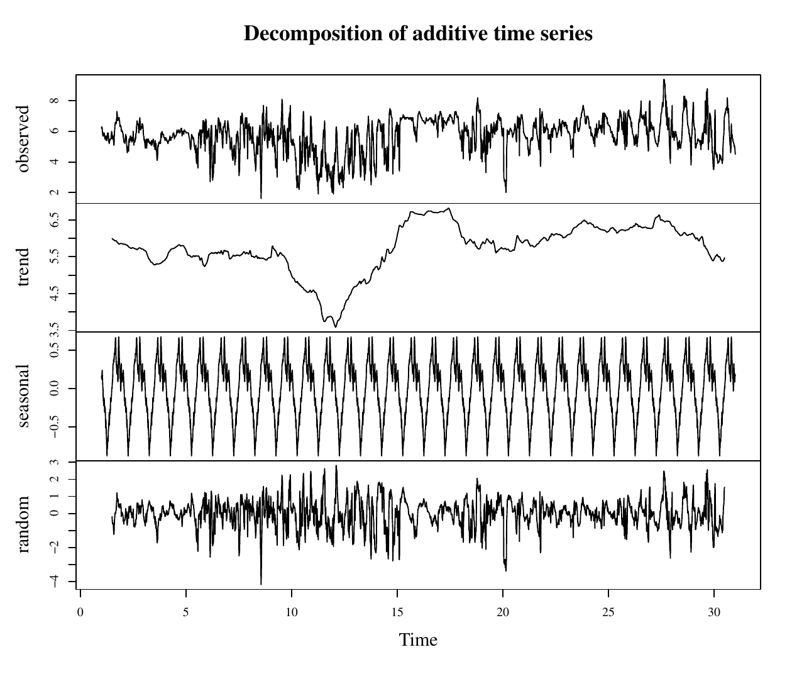
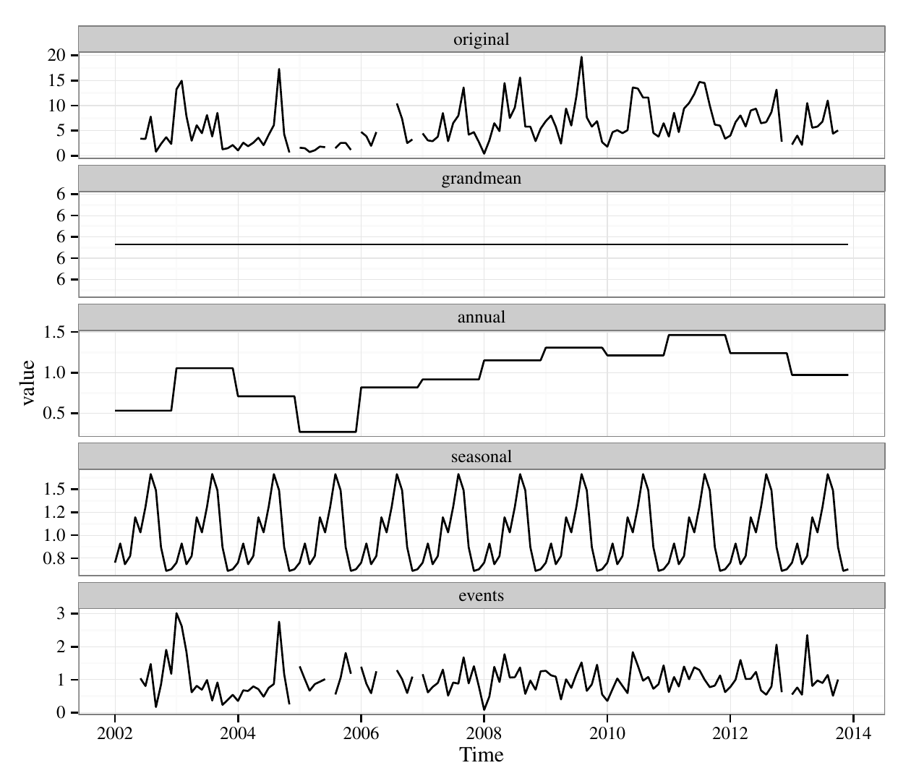
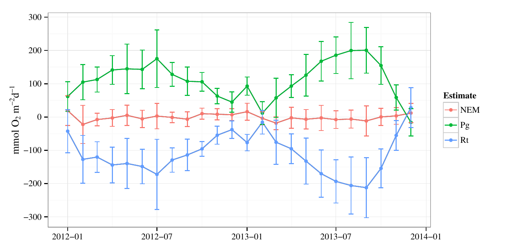
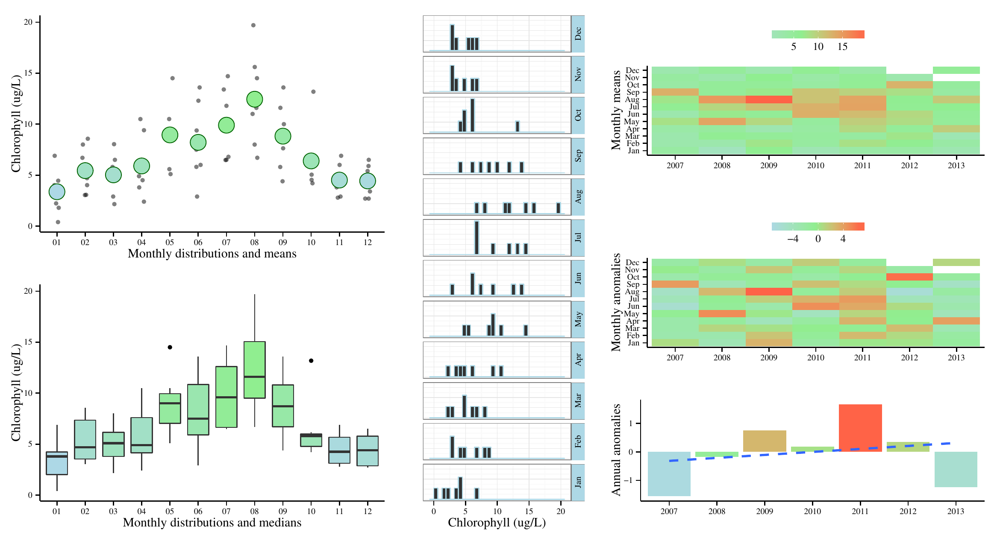
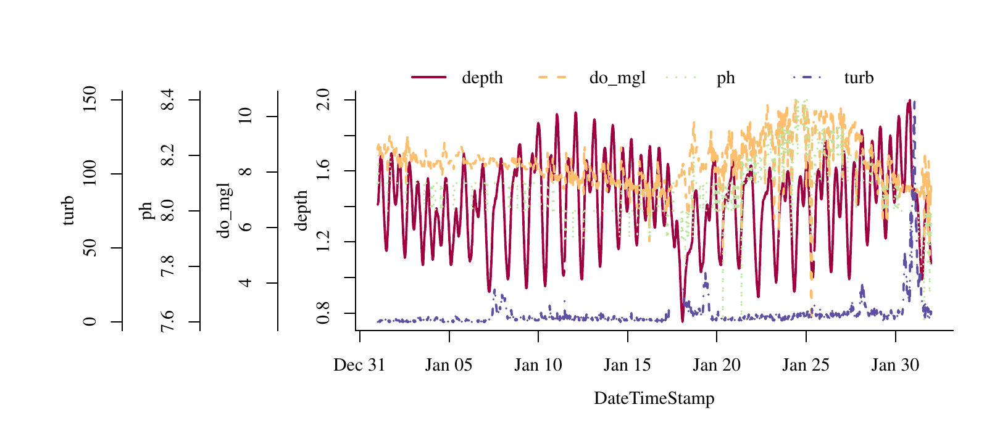
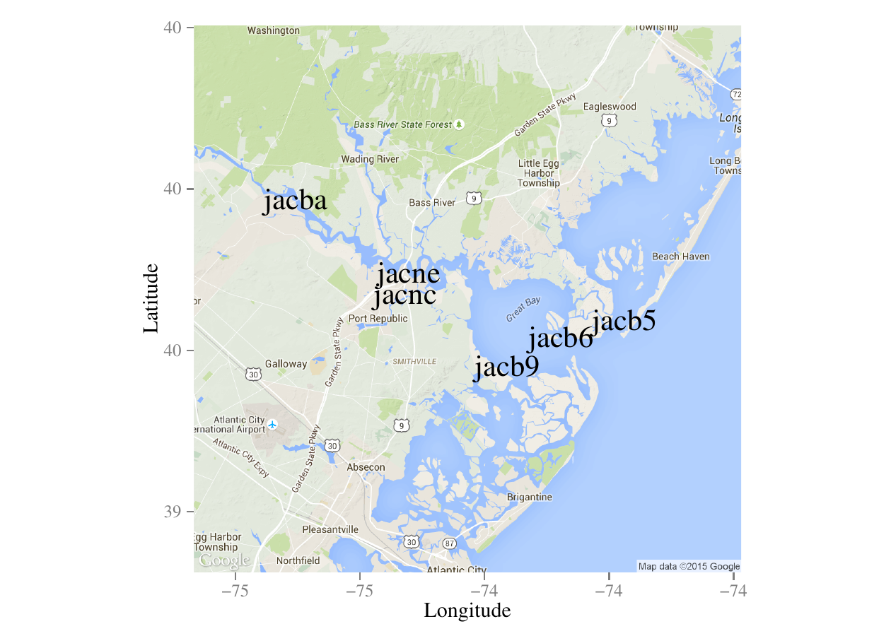

::: article
# Introduction

The development of low-cost, automated sensors that collect data in near
real time has enabled a proliferation of standardized environmental
monitoring programs [@Glasgow04; @Fries08]. An invaluable source of
monitoring data for coastal regions in the United States is provided by
the National Estuarine Research Reserve System (NERRS,
<http://www.nerrs.noaa.gov/>). This network of 28 estuary reserves was
created to address long-term research, monitoring, education, and
stewardship goals in support of coastal management. The System-Wide
Monitoring Program (SWMP) was implemented in 1995 at over 140 stations
across the reserves to provide a robust, long-term monitoring system for
water quality, weather, and land-use/habitat change. Environmental
researchers have expressed a need for quantitative analysis tools to
evaluate trends in water quality time series given the quantity and
quality of data provided by SWMP [@SWMP14].

This article describes the
[*SWMPr*](https://CRAN.R-project.org/package=SWMPr) package that was
developed for estuary monitoring data from the SWMP. Functions provided
by *SWMPr* address many common issues working with large datasets
created from automated sensor networks, such as data pre-processing to
remove unwanted information, combining data from different sources, and
exploratory analyses to identify parameters of interest. Additionally,
web applications derived from *SWMPr* and
[*shiny*](https://CRAN.R-project.org/package=shiny) illustrate potential
applications using the functions in this package. The software is
provided specifically for use with NERRS data, although many of the
applications are relevant for addressing common challenges working with
large environmental datasets.

# Overview of the SWMP network

The *SWMPr* package was developed for the continuous abiotic monitoring
network that represents a majority of SWMP data and, consequently, the
most challenging to evaluate. Abiotic elements monitored at each reserve
include water quality (water temperature, specific conductivity,
salinity, dissolved oxygen concentration, dissolved oxygen saturation,
depth, pH, turbidity, chlorophyll fluorescence), weather (air
temperature, relative humidity, barometric pressure, wind speed, wind
direction, photosynthetically active radiation, precipitation), and
nutrient data (orthophosphate, ammonium, nitrite, nitrate, nitrite +
nitrate, chlorophyll a). Each of the 28 estuary reserves has no fewer
than four water quality stations and one weather station at fixed
locations. Water quality and weather data are collected at 15 minute
intervals, whereas nutrient data are collected monthly at each water
quality station. Data are made available through the Centralized Data
Management Office (CDMO) web portal (<http://cdmo.baruch.sc.edu/>),
where quality assurance/quality control (QAQC) measures are used to
screen the information for accuracy and reliability. The final data
include timestamped observations with relevant QAQC flags.

At the time of writing, the CDMO web portal provides over 60 million
water quality, weather, and nutrient records that have been
authenticated through systematic QAQC procedures. Records for each
station are identified by a seven or eight character name that specifies
the reserve, station, and parameter type. For example, 'apaebwq' is the
water quality identifier ('wq') for the East Bay station ('eb') at the
Apalachicola reserve ('apa'). Similarly, a suffix of 'met' or 'nut'
specifies the weather (meteorological) or nutrient stations. All reserve
names, stations, and date ranges for each parameter type can be viewed
on the CDMO website. Alternatively, the `site_codes` (all sites) or
`site_codes_ind` (single site) functions provided by *SWMPr* can be
used. As noted below, an IP address must be registered with CDMO before
using the data retrieval functions in *SWMPr*. Web services are provided
by CDMO for direct access to SWMP data through http requests, in
addition to standard graphical user interface options for selecting
data. The data retrieval functions in *SWMPr* are simple calls to the
existing retrieval functions on CDMO web services, as explained below.

# Structure of the *SWMPr* package

*SWMPr* functions are categorized by one of three steps in the data
workflow: ***retrieving***, ***organizing***, and ***analyzing***.
Functions for retrieving are used to import the data into R as a
`"swmpr"` object class. Functions for organizing and analyzing the data
provide methods for working with a `"swmpr"` object. The following
describes the package structure, beginning with the retrieval functions,
a description of the `"swmpr"` object returned after retrieval, and,
finally, the organizing and analyzing functions.

## Data retrieval

*SWMPr* can import data into R through direct download from the CDMO or
by importing local data that was previously downloaded
(Table [1](#tab:retrieve)). The IP address for the computer making the
request must be registered if the first approach is used (see CDMO
[website](http://cdmo.baruch.sc.edu/data/qaqc.cfm)). The `site_codes` or
`site_codes_ind` functions can be used to view site metadata.

::: {#tab:retrieve}
  -----------------------------------------------------------------------------------------------------------------------------------------------------------------------------------------
  Function             Description
  -------------------- --------------------------------------------------------------------------------------------------------------------------------------------------------------------
  `all_params`         Retrieve records starting with the most recent at a given station, all parameters. Wrapper to `exportAllParamsXMLNew` function on web services.

  `all_params_dtrng`   Retrieve records of all parameters within a given date range for a station. Optional argument for a single parameter. Wrapper to `exportAllParamsDateRangeXMLNew`.

  `import_local`       Import files from a local path. The files must be in a specific format, such as those returned from the CDMO using the zip downloads option.

  `single_param`       Retrieve records for a single parameter starting with the most recent at a given station. Wrapper to `exportSingleParamXMLNew` function on web services.

  `site_codes`         Get metadata for all stations. Wrapper to `exportStationCodesXMLNew` function on web services.

  `site_codes_ind`     Get metadata for all stations at a single site. Wrapper to `NERRFilterStationCodesXMLNew` function on web services.
  -----------------------------------------------------------------------------------------------------------------------------------------------------------------------------------------

  : Table 1: Retrieval functions available from the *SWMPr* package.
  Full documentation for each function is in the help file (e.g.,
  execute `?all_params` for individual functions or
  `help.search(‘retrieve’, package = ‘SWMPr’)` for all).
:::

``` r
# retrieve metadata for all sites
site_codes()

# retrieve metadata for a single site
site_codes_ind('apa')
```

Retrieval functions to import data directly into R from the CDMO include
`all_params`, `all_params_dtrng`, and `single_param`. Due to rate
limitations on the CDMO server, the retrieval functions return a limited
number of records with each request. However, the *SWMPr* functions use
the native CDMO web services iteratively (i.e., within a loop) to obtain
all requested records. Download time can be excessive for longer time
series.

``` r
# all parameters for a station, most recent
all_params('hudscwq')

# get all parameters within a date range
all_params_dtrng('hudscwq', dtrng = c('09/01/2013', '10/01/2013'))

# get single parameter within a date range
all_params_dtrng('hudscwq', dtrng = c('09/01/2013', '10/01/2013'), 
  param = 'do_mgl')

# single parameter for a station, most recent
single_param('hudscwq', param = 'do_mgl')
```

The second approach for data retrieval is to use the `import_local`
function to import data into R after downloading from CDMO. This
approach is most appropriate for large data requests. The `import_local`
function is designed for data from the [zip
downloads](http://cdmo.baruch.sc.edu/aqs/zips.cfm) feature in the
advanced query section of the CDMO website. The zip downloads feature
can be used to obtain a large number of records from multiple stations
in one request. The downloaded data will be in a compressed folder that
includes multiple .csv files by year for a given data type (e.g.,
apacpwq2002.csv, apacpwq2003.csv, apacpnut2002.csv, etc.). The
`import_local` function can be used to import files directly from the
zipped folder.

## The `"swmpr"` object class

All data retrieval functions return a `"swmpr"` object that includes
relevant data and several attributes describing the dataset. The data
include a `datetimestamp` column in the timezone for a station and
additional parameters for the data type (weather, nutrients, or water
quality). Corresponding QAQC columns for each parameter are also
returned if provided by the initial data request. The following shows an
example of the raw data imported using `all_params`.

``` r
# import all paramaters for the station
# three most recent records
exdat <- all_params('apadbwq', Max = 3, trace = F)
exdat
##         datetimestamp temp f_temp spcond f_spcond sal f_sal do_pct
## 1 2015-11-03 11:15:00   26      0     45        0  29     0     78
## 2 2015-11-03 11:30:00   26      0     46        0  30     0     76
## 3 2015-11-03 11:45:00   26      0     46        0  30     0     75
##   f_do_pct do_mgl f_do_mgl depth f_depth ph f_ph turb f_turb chlfluor
## 1        0      5        0     2       0  8    0    2      0       NA
## 2        0      5        0     2       0  8    0    5      0       NA
## 3        0      5        0     2       0  8    0    5      0       NA
##   f_chlfluor level f_level cdepth clevel f_cdepth f_clevel
## 1         -2    NA      -1      2     NA        3         
## 2         -2    NA      -1      2     NA        3         
## 3         -2    NA      -1      2     NA        3
```

The attributes of a `"swmpr"` object are descriptors that are appended
to the raw data (Table [2](#tab:attributes)). These act as metadata that
are used internally by many of the package functions and are updated as
the data are processed. The attributes are not visible with the raw data
but can be viewed as follows.

``` r
# import sample data from package
data(apadbwq)
dat <- apadbwq

# view all attributes of dat
attributes(dat)
 
# view a single attribute of dat
attr(dat, 'station')
```

::: {#tab:attributes}
  ------------------------------------------------------------------------------------------------------------------------
  Attributes      Class       Description
  --------------- ----------- --------------------------------------------------------------------------------------------
  `names`         character   Column names of the entire data set, inherited from the `data.frame` object class.

  `row.names`     integer     Row names of the data set, inherited from the `data.frame` object class.

  `class`         character   Class of the data object indicating `"swmpr"` and `"data.frame"`.

  `station`       character   Station identifier used by NERRS as a string with 7 or 8 characters.

  `parameters`    character   Character vector of column names for data parameters, e.g., `’do_mgl’`, `’turb’`, etc.

  `qaqc_cols`     logical     Indicates if QAQC columns are present in the raw data.

  `date_rng`      POSIXct     Start and end dates for the data.

  `timezone`      character   Timezone of the station using the city/country format^a^.

  `stamp_class`   character   Class of the `datetimestamp` column, usually `"POSIXct"` unless data have been aggregated.
  ------------------------------------------------------------------------------------------------------------------------

  : Table 2: Attributes of a `"swmpr"` object that describe
  characteristics of the data.
:::

^a^Time zones that do not observe daylight savings are used for
`"swmpr"` objects and may not be cities in the United States. For
example, `America/Jamaica` is used for Eastern Standard Time.

The `"swmpr"` object class was created for use with the organizing and
analyzing functions. This uses the standard S3 object class system for
R, such that specific methods for generic functions are developed for
the object class. A `"swmpr"` object also secondarily inherits methods
from the `"data.frame"` class. Available methods for the `"swmpr"` class
are described below and can also be viewed:

``` r
# view available methods for swmpr class
methods(class = 'swmpr')
```

## Data organizing

The organize functions are used to 'clean' or prepare the imported data
for analysis, including viewing and removal of QAQC flags, subsetting,
combining replicate nutrient observations, creating a standardized time
series, and combining data of different types
(Table [3](#tab:organize)).

The `qaqc` function is a simple screen to retain observations from the
data with specified QAQC flags (see
<http://cdmo.baruch.sc.edu/data/qaqc.cfm>). Each parameter in the
imported `"swmpr"` object will have a corresponding QAQC column of the
same name with the added prefix `f_` (e.g., `f_do_mgl` for `do_mgl`).
Values in the QAQC column range from -5 to 5 to indicate the QAQC flag
that was assigned by CDMO during initial processing. The `qaqc` function
is used to remove observations in the raw data with given flags, with
the default option to retain only values with the `0` QAQC flag (i.e.,
passed initial CDMO checks). Additionally, simple filters are used to
remove obviously bad values (e.g., wind speed values less than zero or
pH values greater than 12). Erroneous data entered as -99 are also
removed. The function returns the original data with the QAQC columns
removed and `NA` (not available) values for observations that do not
meet the criteria specified in the function call.

::: {#tab:organize}
  -----------------------------------------------------------------------------------------------------------------------------------------------------------------------
  Function     Description
  ------------ ----------------------------------------------------------------------------------------------------------------------------------------------------------
  `comb`       Combines `"swmpr"` objects to a common time series using setstep, such as combining the weather, nutrients, and water quality data for a single station.

  `qaqc`       Remove QAQC columns and remove data based on QAQC flag values for a `"swmpr"` object.

  `qaqcchk`    View a summary of the number of observations in a `"swmpr"` object that are assigned to each QAQC flag used by CDMO.

  `rem_reps`   Remove replicate nutrient data that occur on the same day. The default is to average replicates.

  `setstep`    Format data from a `"swmpr"` object to a continuous time series at a given timestep.

  `subset`     Subset by dates and/or columns for a `"swmpr"` object. This is a method passed to the generic `subset` function in the base installation.
  -----------------------------------------------------------------------------------------------------------------------------------------------------------------------

  : Table 3: Organizing functions available from the *SWMPr* package.
  Full documentation for each function is in the help file (e.g.,
  execute `?comb` for individual functions or
  `help.search(‘organize’, package = ‘SWMPr’)` for all).
:::

``` r
# qaqc screen for a swmpr object, retain only '0'
qaqc(dat)

# retain all data regardless of flag
qaqc(dat, qaqc_keep = NULL)

# retain only '0' and '-1' flags
qaqc(dat, qaqc_keep = c(0, -1))
```

SWMP data often contain observations above or below the detection limit
for the sensor or laboratory method used to quantify the parameters. For
example, nutrient data exceeding the high sensor range are assigned a
QAQC flag of -5, whereas data below the low sensor range are assigned a
QAQC flag of -4. The presence of censored data is non-trivial and can
influence the types of analyses that are appropriate for a time series
[@Helsel12]. A detailed discussion of methods for evaluating censored
data is beyond the scope of the manuscript and existing methods for R
are provided by other packages [e.g.,
[*cents*](https://CRAN.R-project.org/package=cents), @McLeod14].
However, the functions in *SWMPr* can be used to identify censored data
based on the appropriate QAQC flag for a parameter. Viewing this
information can be helpful for determining how to further process the
data with the `qaqc` function or alternative methods outside of *SWMPr*.
The `qaqcchk` function returns a `data.frame` of the number of
observations for a parameter that is assigned to all QAQC flags,
including those for censored data. SWMP data should not be analyzed
without viewing this information to determine an appropriate method to
address data with questionable QAQC flags.

``` r
# view the number of observations in each QAQC flag
qaqcchk(dat)
```

A subset method added to the existing generic `subset` function in R is
available for `"swmpr"` objects. This function is used to subset the
data by date and/or a selected parameter. The date can be a single value
or as two dates to select records within the range. The former case
requires a binary operator as a character string passed to the
`operator` argument, such as `’>’` or `’<=’`. The subset argument for
the date(s) must also be a character string of the format YYYY-mm-dd
HH:MM for each element (e.g., `’2007-01-01 06:30’`).

``` r
# import data
data(apaebmet)
dat <- apaebmet

# select two parameters from dat
subset(dat, select = c('rh', 'bp'))

# subset records greater than or equal to a date
subset(dat, subset = '2013-01-01 0:00', operator = '>=')

# subset records within a date range, select two parameters
subset(dat, subset = c('2012-07-01 6:00', '2012-08-01 18:15'),
  select = c('atemp', 'totsorad'))
```

The `setstep` function formats a `"swmpr"` object to a continuous time
series at a given time step. The function also has a default method
making it useful for standardizing arbitrary time series to a given
interval. The first argument of the function, `timestep`, specifies the
desired time step in minutes starting from the nearest hour of the first
observation. The second argument, `differ`, specifies the allowable
tolerance in minutes for matching existing observations to the defined
time steps in cases where the two are dissimilar. Values for `differ`
that are greater than one half of the value of `timestep` are not
allowed to prevent duplication of existing data. Likewise, the default
value for `differ` is one half of the time step.

``` r
# import, qaqc removal
data(apadbwq)
dat <- qaqc(apadbwq)

# convert time series to two hour invervals
# tolerance of +/- 30 minutes for matching existing data
setstep(dat, timestep = 120, differ = 30)
```

The `comb` function is used to combine multiple `"swmpr"` objects into a
single object with a continuous time series at a given step. The
`setstep` function is used internally such that `timestep` and `differ`
are accepted arguments for `comb`. Data are combined by creating a
master time series that is used to iteratively merge all `"swmpr"`
objects. The time series for merging depends on the value passed to the
`method` argument. Passing `’union’` to `method` will create a time
series that is continuous from the earliest and latest dates for all
input objects, whereas `’intersect’` will create a continuous time
series from the set of dates that are shared between input objects. A
character string or numeric vector can also be used to specify which of
the input objects to use as the master time series for combining. As
with `setstep`, a default method for `comb` is provided to allow use
with arbitrary data structures. Both functions treat missing data as
`NA` values, either for observations that exceed the allowable tolerance
for the `differ` argument of `setstep` or for portions of time series
that do not overlap given the `method` argument passed to `comb`.

``` r
# get nut, wq, and met data as separate objects
data(apacpnut)
data(apacpwq)
data(apaebmet)
swmp1 <- apacpnut
swmp2 <- apacpwq
swmp3 <- apaebmet

# combine nut and wq data by union
comb(swmp1, swmp2, method = 'union')

# combine nut and met data by intersect
comb(swmp1, swmp3, method = 'intersect')

# combine nut, wq, and met data by nut time series, two hour time step
comb(swmp1, swmp2, swmp3, timestep = 120, method = 'apacpnut')
```

## Data analysis

The analysis functions range from general purpose tools for time series
analysis to more specific functions for working with continuous
monitoring data in estuaries (Table [4](#tab:analyze)). The general
purpose tools are `"swmpr"` methods for existing S3 generics or are
slight modifications to existing functions. These include `aggreswmp` to
combine observations by set periods of time (e.g., weeks, months),
`smoother` to average time series with a moving window, and `approx` to
substitute missing data with interpolated values. For brevity, the
general functions are not discussed. More specific functions for
environmental time series include decomposition functions, `decomp` and
`decomp_cj`, and functions to estimate and plot ecosystem metabolism
from combined water quality and weather data. Several plotting methods
to facilitate analysis are also descibed below.

::: {#tab:analyze}
  ----------------------------------------------------------------------------------------------------------------------------------------------------------------------------------------------------------------------------------------------------------------------
  Function         Description
  ---------------- -----------------------------------------------------------------------------------------------------------------------------------------------------------------------------------------------------------------------------------------------------
  `aggreswmp`      Aggregate `"swmpr"` objects for different time periods - years, quarters, months, weeks, days, or hours. The aggregation function defaults to the mean.

  `aggremetab`     Aggregate metabolism data from a `"swmpr"` object. This is primarly used within `plot_metab` but may be useful for simple summaries of daily metabolism data.

  `ecometab`       Estimate ecosystem metabolism for a combined water quality and weather dataset using the open-water method [@Odum56].

  `decomp`         Decompose a `"swmpr"` time series into trend, seasonal, and residual components. This is a simple wrapper to `decompose` [@Kendall83]. Decomposition of monthly or daily trends is possible.

  `decomp_cj`      Decompose a `"swmpr"` time series into grandmean, annual, seasonal, and events components. This is a simple wrapper to `decompTs` in the [*wq*](https://CRAN.R-project.org/package=wq) package [@Jassby14]. Only monthly decomposition is possible.

  `hist`           Plot a histogram for a single variable.

  `lines`          Add lines to an existing plot created with `plot`.

  `map_reserve`    Create a map of all stations in a reserve using the [*ggmap*](https://CRAN.R-project.org/package=ggmap) package [@Kahle13].

  `na.approx`      Linearly interpolate missing data (`NA` values) in a `"swmpr"` object.

  `overplot`       Plot multiple time series in a `"swmpr"` object on the same y-axis.

  `plot`           Plot a univariate time series for a `"swmpr"` object.

  `plot_metab`     Plot ecosystem metabolism estimates after running `ecometab` on a combined `"swmpr"` object.

  `plot_summary`   Create summary plots of seasonal/annual trends and anomalies for a single parameter.

  `smoother`       Smooth `"swmpr"` objects with a moving window average, passed to `filter`.
  ----------------------------------------------------------------------------------------------------------------------------------------------------------------------------------------------------------------------------------------------------------------------

  : Table 4: Analysis functions available from the *SWMPr* package. Full
  documentation for each function is in the help file (e.g., execute
  `?aggreswmp` for individual functions or
  `help.search(‘analyze’, package = ‘SWMPr’)` for all).
:::

The disaggregation of time series into additive or multiplicative
components is a common application for trend analysis. The `decomp`
function is a simple wrapper to `decompose` [@Kendall83] that separates
a time series into a trend, cyclical variation (e.g., daily or annual),
and the remainder (Figure [1](#fig:decomp_ex1)). An additive
decomposition assumes that the cyclical component of the time series is
stationary (i.e., the variance is constant); otherwise, a multiplicative
decomposition can be used. The `frequency` argument describes the
periodicity of the cyclical parameter in units of the native time step.
For example, the `frequency` for a parameter with daily periodicity
would be 96 if the time step is 15 minutes (24 hours \* 60 minutes / 15
minutes). For simplicity, character strings of `’daily’` or `’annual’`
can be supplied in place of numeric values, although any number can be
used to identify an arbitrary cyclical component. A starting value of
the time series must be supplied in the latter case that indicates the
sequence in the cycle for the first observation (see
[`ts`](https://stat.ethz.ch/R-manual/R-devel/library/stats/html/ts.html)
for details).

``` r
# get data
data(apadbwq)
dat <- apadbwq

# subset for daily decomposition
dat <- subset(dat, subset = c('2013-07-01 00:00', '2013-07-31 00:00'))

# daily decomposition of DO and plot
dc_dat <- decomp(dat, param = 'do_mgl', frequency = 'daily')
plot(dc_dat)
```

<figure id="fig:decomp_ex1">

<figcaption>Figure 1: An additive decomposition of dissolved oxygen into
a trend, seasonal (daily), and random component using the
<code>decomp</code> function.</figcaption>
</figure>

An alternative approach for decomposition is provided by the `decomp_cj`
function, which is a simple wrapper to the `decompTs` function in the
*wq* package [@Cloern10; @Jassby14]. The `decomp_cj` function is a
monthly decomposition for characterizing relatively long-term trends.
This approach works best for nutrient data that are typically obtained
on a monthly cycle. The time series is decomposed into the grandmean,
annual, seasonal, and events components (Figure [2](#fig:decomp_ex2)),
as compared to trend, seasonal, and random components for the `decomp`
function above. For both functions, the random or events components can
be considered anomalies that do not follow the trends in the remaining
categories. Additional arguments passed to `decompTs` can be used with
`decomp_cj`, such as `startyr`, `endyr`, and `type`. Values passed to
`type` are `mult` (default) or `add`, referring to multiplicative or
additive decomposition.

``` r
# get data
data(apacpnut)
dat <- apacpnut
dat <- qaqc(dat, qaqc_keep = NULL)

# decomposition of chl
decomp_cj(dat, param = 'chla_n')
```

<figure id="fig:decomp_ex2">

<figcaption>Figure 2: Additive decomposition of a multi-year chlorophyll
time series into the grandmean, annual, seasonal, and events components
using the <code>decomp_cj</code> function.</figcaption>
</figure>

Estimates of ecosystem metabolism provide a measure of system
productivity to evaluate whether an ecosystem is a net source or sink of
organic material. The open-water method [@Odum56] is a common approach
to quantify metabolism using a mass balance equation that describes the
change in dissolved oxygen over time from the balance between
photosynthetic and respiration processes, corrected using an empirically
constrained air-sea gas diffusion model [@Ro06; @Thebault08]. A detailed
discussion of the method is beyond the scope of this article, although
users are encouraged to consult references herein for additional
information (see @Kemp12 [@Needoba12; @Caffrey14], also the package help
files). Methods for estuaries have not previously been available in R,
although the
[*StreamMetabolism*](https://CRAN.R-project.org/package=StreamMetabolism)
package provides an approach for freshwater systems. The following is an
example that shows use of `ecometab` with a combined water quality and
weather data set. Monthly aggregations of the raw, daily estimates are
plotted using `plot_metab` (Figure [3](#fig:metab_ex)).

``` r
## import water quality and weather data
data(apadbwq)
data(apaebmet)

## qaqc, combine
wq <- qaqc(apadbwq)
met <- qaqc(apaebmet)
dat <- comb(wq, met)

## estimate metabolism
res <- ecometab(dat, trace = FALSE)
plot_metab(res)
```

<figure id="fig:metab_ex">

<figcaption>Figure 3: Monthly means (95% confidence) of ecosystem
metabolism estimates (net ecosystem metabolism, gross production, and
total respiration) for combined water quality and weather data for two
years at Apalachicola Bay, Florida.</figcaption>
</figure>

Exploratory graphics are also useful for evaluating general trends in
observed data. Several graphics showing seasonal and annual trends for a
single SWMP parameter can be obtained using the `plot_summary` function
(Figure [4](#fig:summary_ex)). The plots include monthly distributions,
monthly anomalies, and annual anomalies in multiple formats. An
interactive *shiny* web application [@Chang15] that uses this function
is available for viewing results for all SWMP sites (see the section [Applications using the SWMPr package](#swmp_apps)).

``` r
## import data
data(apacpnut)
dat <- qaqc(apacpnut)

## plot
plot_summary(dat, param = 'chla_n', years = c(2007, 2013))
```

<figure id="fig:summary_ex">

<figcaption>Figure 4: Summaries of a multi-year chlorophyll time series
using the <code>plot_summary</code> function. Summaries include monthly
distributions (means on top left, quantiles on bottom left), monthly
histograms (center), monthly means by year (top right), deviation from
monthly means (middle right), and annual trends as deviations from the
grand mean (bottom right)</figcaption>
</figure>

Similarly, the `overplot` function provides an alternative approach to
viewing observed data from the same station. This function uses the base
*graphics* package to plot multiple time series on the same y-axis
(Figure [5](#fig:overplot)).

``` r
## import data
data(apacpwq)
dat <- qaqc(apacpwq)

## plot
overplot(dat, select = c('depth', 'do_mgl', 'ph', 'turb'),
  subset = c('2013-01-01 0:0', '2013-02-01 0:0'), lwd = 2)
```

<figure id="fig:overplot">

<figcaption>Figure 5: The <code>overplot</code> function plots multiple
variables on the same y-axis.</figcaption>
</figure>

Finally, the `map_reserve` function can be used to create a map of
stations at a reserve using the *ggmap* package
(Figure [6](#fig:map_ex), @Kahle13). The function uses Google maps of
four types that can be set with the `map_type` argument: terrain
(default), satellite, roadmap, or hybrid. The `zoom` argument can be
chosen through trial and error depending on the spatial extent of the
reserve.

``` r
# plot the stations at Jacques Cousteau reserve
map_reserve('jac')
```

<figure id="fig:map_ex">

<figcaption>Figure 6: Locations of all sites at the Jacques Cousteau
reserve using the <code>map_reserve</code> function.</figcaption>
</figure>

# Applications using the *SWMPr* package {#swmp_apps}

Two *shiny* web applications illustrate the improved ability to
synthesize and evaluate multi-year time series using *SWMPr*. The first
application evaluates trends in SWMP data within and between sites using
an interactive *leaflet* map (@Cheng15, Figure [7](#fig:swmp_comp)):
<https://beckmw.shinyapps.io/swmp_comp>. Trends between reserves can be
viewed using the map, whereas trends at individual sites can be viewed
by clicking on a map location. Site-level trends are shown below the map
with a simple linear regression to show an increase or decrease in
values over time, whereas trends between sites are shown on the map for
each station as circles that identify the direction and significance of
the trend. More robust methods for evaluating trends are currently not
provided by the application and the use of simple linear regression is
meant for initial exploratory analysis. The second application provides
graphical summaries of water quality, weather, or nutrient station data
at individual stations using the `plot_summary` function:
<https://beckmw.shinyapps.io/swmp_summary/>. The output is identical to
Figure [4](#fig:summary_ex) with the addition of drop down menus to
select the station, date range, and parameter for plotting.

{#fig:swmp_comp
width="100%" style="text-align: center" alt="graphic without alt text"}

# Conclusions

*SWMPr* was developed to augment existing data management programs
(i.e., CDMO) by providing a bridge betwen the raw data and the analysis
software through its numerous data retrieval functions
(Table [1](#tab:retrieve)). Established QAQC methods and data processing
techniques are also enhanced with *SWMPr* by functions that filter
observations for different QAQC flags (`qaqc`) and subset by selected
dates or variables (`subset`). Additionally, challenges comparing
differents datasets are addressed by the `setstep` and `comb` functions
that standardize and combine time series. Finally, the analysis
functions provide numerous tools to implement common analyses for time
series and more specific methods for water quality data. Further
development of the package will include modifications and additional
functions to better integrate data analysis with the quality of
information provided by SWMP. Several functions include default methods
to extend use beyond the `"swmpr"` object and additional development
will continue to focus on modifying the package to handle arbitrary data
structures. These challenges are not unique to the SWMP database such
that many of the functions will facilitate evaluations of more generic
time series datasets.

# Acknowledgments

I acknowledge the significant work of NERRS researchers and staff that
has allowed access to high-quality monitoring data. Thanks to Todd
O'Brien for the inspiration for the online widgets. Thanks to Mike
Murrell and Jim Hagy III for assistance with the ecosystem metabolism
functions. Thanks to Jeff Hollister for providing useful comments on an
earlier draft.
:::
