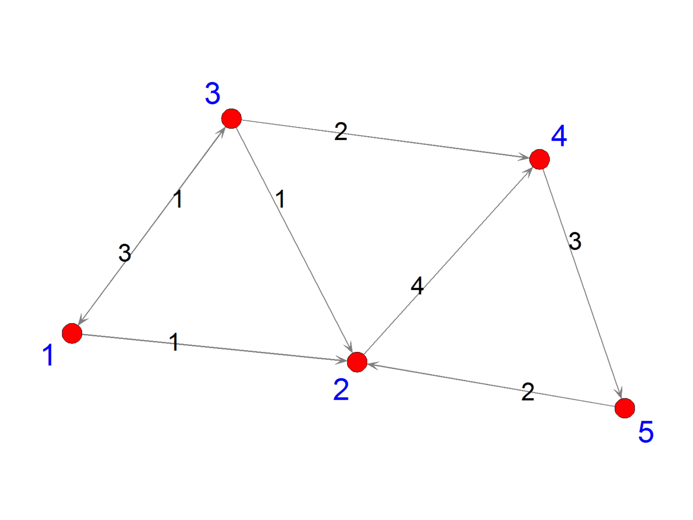
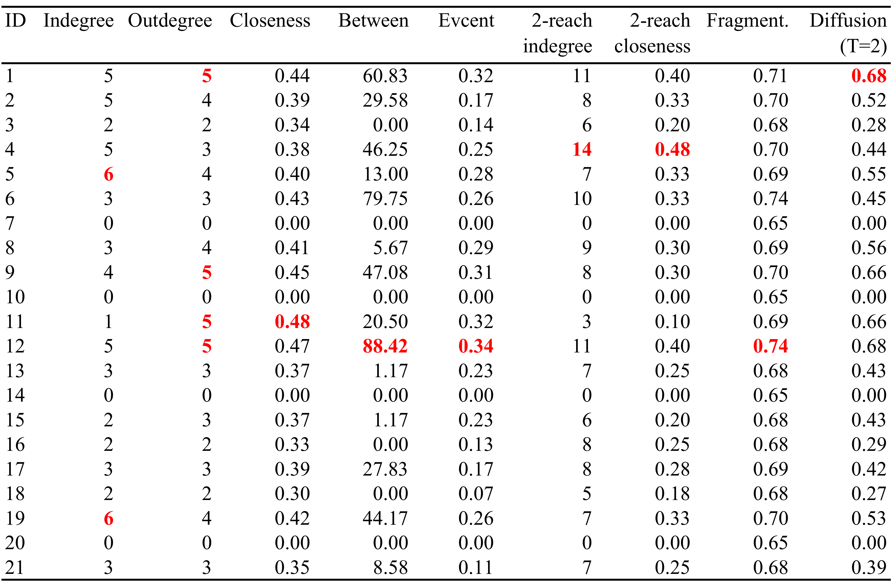
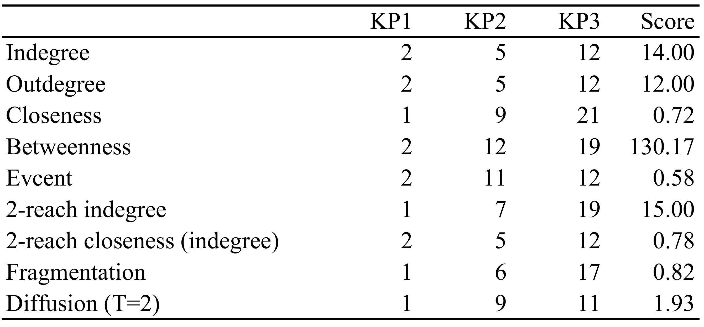

::: article
# Introduction

Interest in social network analysis has grown rapidly in the past few
years. This was due partly to the advancements in statistical methods
and computing for network analysis and partly to the increasing
availability of social network data (e.g., network data generated by
social media). A wide range of the methods for network analysis is
already covered by R packages such as
[*network*](https://CRAN.R-project.org/package=network) [@network],
[*sna*](https://CRAN.R-project.org/package=sna) [@Butts08],
[*igraph*](https://CRAN.R-project.org/package=igraph) [@igraph1],
[*statnet*](https://CRAN.R-project.org/package=statnet) [@statnet],
[*RSiena*](https://CRAN.R-project.org/package=RSiena) [@RSiena], etc.
However, none of these packages provides a comprehensive toolbox to
calculate group centrality measures and to identify key players, who
constitute the most central group, in a network. Determining the key
players in a network is very important because many social and health
interventions rely on key players to facilitate the intervention. For
example, [@Kelly91] and [@Latkin98] trained peer leaders as educators to
promote HIV prevention. [@Campbell08] and [@An15] used peer leaders to
facilitate smoking prevention. [@Borgatti:2006] and [@Ressler:2006]
suggested removing key figures among terrorists to most widely disrupt
terrorism. More examples of this sort can be found in [@Valente07],
[@Banerjee13], etc. Identifying key players is challenging because
players who are individually the most central are not necessarily the
most central as a group due to redundancy in their connections. In a
seminal paper, [@Borgatti:2006] pointed out the problem and proposed
methods for identifying key players in social networks.

To the best of our knowledge, the `keyplayer` function in *UCINET*
[@Borgatti02] is the first implementation of the methods detailed in
[@Borgatti:2006]. It has evolved from a separate add-on to *UCINET* to a
built-in function *UCINET*. In this paper, we present the
[*keyplayer*](https://CRAN.R-project.org/package=keyplayer) package
[@keyplayer] in R, which differs from the `keyplayer` function in
*UCINET* in several aspects. (1) Unlike the `keyplayer` function in
*UCINET* which is only applicable to binary networks, *keyplayer* in R
can be used for both binary and weighted networks. (2) The *keyplayer*
package includes more centrality measures for choosing key players than
what is currently available in the `keyplayer` function in *UCINET*. (3)
*keyplayer* provides better integration with other open-source packages
in R. Overall, the `keyplayer` function in *UCINET* is useful for
researchers who are more familiar with *UCINET* and would like to
utilize other functionalities provided by *UCINET*, whereas *keyplayer*
is designed for users who are more familiar with R and who plan to do
more computational work.

The [*influenceR*](https://CRAN.R-project.org/package=influenceR)
package [@Jacobs15] aims to provide calculations of several node
centrality measures that were previously unavailable in other packages,
such as the constraint index [@Burt92] and the bridging score
[@Valente10]. It can also be used to identify key players in a network.
But in comparison to *keyplayer*, it utilizes only one centrality metric
when selecting key players whereas *keyplayer* includes eight different
metrics. Also, *influenceR* currently works only for undirected networks
whereas *keyplayer* works for both undirected and directed networks.
Both packages provide parallel computation. *influenceR* relies on
OpenMP for parallel computation whereas *keyplayer* utilizes the base
package *parallel* which is readily available in R. Last, *influenceR*
focuses on computing centrality measures at the node level whereas
*keyplayer* is more interested in providing centrality measures at the
group level. Overall, *keyplayer* provides more comprehensive
functionalities for calculating group centrality measures and for
selecting key players.

The algorithm for identifying key players in package *keyplayer*
essentially consists of three steps. First, users choose a metric to
measure centrality in a network. Second, the algorithm (specifically the
`kpcent` function) will randomly pick a group of players and measure
their group centrality. Third, the algorithm (specifically the `kpset`
function) will select the group of players with the highest group
centrality as the desired key players. In general, users only need to
employ the `kpset` function by specifying a centrality metric and the
number of key players to be selected. The function will return a set of
players who are the most central as a group. We also make the auxiliary
function `kpcent` available. If users specify a centrality metric and
the indices of a group of players, this function will return the
centrality score of the specified group. Thus the two functions can be
used for two purposes: selecting key players or measuring group
centrality.

The paper proceeds as follows. First, we review centrality measures at
the individual level. Then we present methods for measuring centrality
at the group level. After that, we present a greedy search algorithm for
selecting key players and outline the basic structure and the usage of
the main function `kpset` in package *keyplayer*. To illustrate the
methods and the usage of the package, we use a simulated network as well
as an empirical example based on the friendship network among managers
in a company. Last, we summarize and point out directions for improving
the package in the future.

# Measuring individual centrality

We first review the definitions of centrality measures at the individual
level. For conciseness, we provide the definitions based on weighted
networks, where the weight of a tie takes a continuous value and usually
measures the strength of the connection between two nodes. The
definitions naturally incorporate binary networks where the weight of a
tie can only be one or zero, indicating the presence or absence of a
connection [@Freeman78; @Wasserman94; @Butts08].

Figure [1](#example) shows an example of a simulated network. On the
left is the adjacency matrix of the network. On the right is the network
graph. Thinking of it as a friendship network, we can see that the
strength of friendship between node 1 and node 3 is conceived
differently by node 1 and node 3. The former assigns it a weight of 3
while the latter assigns it a weight of 1. We will use this example to
illustrate the centrality measures. Calculations of four centrality
measures (i.e., degree, closeness, betweenness, and eigenvector
centralities) at the individual level are done using the *sna* package
[@Butts08]. Calculations of four other individual level centralities and
all group level centralities are done using our package *keyplayer*. We
would like to clarify at this point that our package does not depend on
*sna*. We use *sna* here just for the sake of the example.

  ------------------------ --------------------------------------------------------------
                            {width="100%"  alt="graphic without alt text"}
    $$W=\begin{bmatrix}    
     0 & 1 & 3 & 0 & 0 \\  
     0 & 0 & 0 & 4 & 0 \\  
     1 & 1 & 0 & 2 & 0 \\  
     0 & 0 & 0 & 0 & 3 \\  
     0 & 2 & 0 & 0 & 0 \\  
       \end{bmatrix}$$     

  ------------------------ --------------------------------------------------------------

  : 

<figure id="example">
<figcaption>Figure 1: An adjacency matrix (left) and the corresponding network
graph (right).</figcaption>
</figure>


## Degree centrality

Degree centrality is defined as follows [@Freeman78; @Butts08]:[^1]
$$D_i=\sum _j w_{ij} + \sum _j w_{ji},$$
where $w_{ij}$ represents the tie status from node $i$ to node $j$. Thus
the first term indicates the outgoing connections from node $i$ (i.e.,
outdegree) and the second term the incoming connections to node $i$
(i.e., indegree). Degree centrality measures a node's direct
connectedness with other nodes in a network. After loading the adjacency
matrix in R, we can type the following in R to get the degree, indegree,
and outdegree measures for the simulated network.

``` r
> W <- matrix(c(0, 1, 3, 0, 0, 0, 0, 0, 4, 0, 1, 1, 0, 2, 0, 0, 0, 0, 0, 3, 
+               0, 2, 0, 0, 0), nrow = 5, ncol = 5, byrow = TRUE)
> library(sna)
> degree(W, ignore.eval = FALSE) # For binary networks, set ignore.eval = TRUE.
[1] 5 8 7 9 5
> degree(W, ignore.eval = FALSE, cmode = "indegree")
[1] 1 4 3 6 3
> degree(W, ignore.eval = FALSE, cmode = "outdegree")
[1] 4 4 4 3 2
```

## Closeness centrality

One version of the closeness centrality is due to [@Gil96]:
$$C_i= \frac{\sum _j d^{-1}_{ij}}{n-1},$$
where $d_{ij}$ is the shortest path (i.e., geodistance) between nodes
$i$ and $j$. Closeness centrality usually reflects a node's capability
of quickly reaching other nodes. In the above example, the tie status
indicates friendship strength. The larger the value, the stronger is the
friendship. To have the shortest path correspond to the strongest
friendship, we need to transform the tie status, for example, by taking
the inverse, before calculating the closeness centrality.

``` r
> A <- W
> A[W != 0] <- 1 / W[W != 0] # Inverse the non-zero tie status
> closeness(A, ignore.eval = FALSE, cmode = "suminvdir") 
[1] 1.5142857 1.4285714 1.3000000 1.0500000 0.8333333
## For undirected networks, set cmode = "suminvundir".
```

## Betweenness centrality

Betweenness centrality is defined as follows [@Butts08]:
$$B_i=\sum_{jk} \frac{g_{jk}^i}{g_{jk}},$$
where $g_{jk}$ is the number of shortest paths between nodes $j$ and
$k$, and $g_{jk}^i$ is the number of those paths that pass node $i$. In
the case of $g_{jk} = 0$, the corresponding contribution to the
betweenness score is zero. Betweenness centrality usually measures a
node's brokerage power in a network. We can get the betweenness
centrality for the simulated network as follows.

``` r
> betweenness(A, ignore.eval = FALSE, cmode = "directed")
[1] 0 1 2 3 1
```

## Eigenvector centrality

Eigenvector centrality defines a node's centrality as a weighted average
of the centrality of its neighbors [@Bonacich72; @Butts08]:
$$E_i = \frac{1}{\lambda} \sum_j w_{\text{ij}} E_j.$$
In matrix notations, this is equivalent to
$$\begin{aligned}
\lambda E & = W E,
\end{aligned}$$
where $W$ represents the adjacency matrix and $\lambda$ the largest
eigenvalue of the above equation. Eigenvector centrality measures the
extent to which a node is connected to important alters. To get the
eigenvector centrality for the adjacency matrix A, we type the following
in R:

``` r
> evcent(A, gmode = "digraph", ignore.eval = FALSE, use.eigen = TRUE)
[1] 0.5000000+0i 0.0000000+0i 0.8660254+0i 0.0000000+0i 0.0000000+0i
```

where `gmode = "digraph"` indicates that the input is a directed network
and `use.eigen = TRUE` requests using the robust `eigen` function to
calculate the eigenvectors. In this example, the eigenvector centrality
includes complex numbers, which are hard to interpret. Thus, to
facilitate interpretation of the results, it is often a good idea to
symmetrize the network first because symmetric matrices always have real
eigenvalues. In the following, the symmetrization process first converts
$W$ to a binary matrix and then treats all ties as mutual ties.

``` r
> B <- symmetrize (W)
> evcent(B)
[1] 0.3505418 0.5590326 0.4699593 0.4699593 0.3505418
```

## M-reach degree centrality

M-reach degree centrality generalizes the degree centrality by
delimiting specific neighborhoods. Suppose the set of nodes that node
$i$ can reach via $M$ steps is $F$ and the set of nodes that can reach
node $i$ via $M$ steps is $H$. Building on [@Borgatti:2006], we define
the M-reach centrality as follows:
$$M_i= \sum_{j\in F}m_{ij} + \sum_{j\in H}m_{ji},$$
where $m_{ij}$ is 1 if $j\in F$ and $m_{ji}$ is 1 if $j\in H$. The first
term indicates the number of nodes that node $i$ can reach in $M$ steps.
The second term indicates the number of nodes that can reach node $i$ in
$M$ steps. By default, the matrix is binarized before calculating the
centrality. Thus, in binary networks, the 1-reach degree centrality is
the same as the degree centrality.

``` r
## Calculations of four other individual level centralities and all group level 
## centralities are done by our package.
> library(keyplayer)
## M-reach centrality.
> mreach.degree(W, M = 1)
     outdegree indegree total
[1,]         2        1     3
[2,]         1        3     4
[3,]         3        1     4
[4,]         1        2     3
[5,]         1        1     2
```

## M-reach closeness centrality

One way to refine the M-reach degree centrality is to use (the inverse
of) geodistance to measure the tie status between nodes, just like how
closeness centrality refines degree centrality. We define the M-reach
closeness centrality as below:
$$MC_{i}=\dfrac{\sum_{j\in F}d_{ij}^{-1}}{d (n-1)} + \dfrac{\sum_{j\in H}d_{ji}^{-1}}{d (n-1)},$$
where $d_{ij}$ is the geodistance between nodes $i$ and $j$, $F$ and $H$
are the set of nodes reachable from or to node $i$ via $M$ steps,
respectively. $d$ is the maximal of $d_{ij}^{-1}$ across all pairs of
$i$ and $j$. The denominator helps normalize each of the two terms to be
between zero and one. When $M$ is infinity, M-reach closeness centrality
approximates the Gil-Schmidt power index [@Gil96] and the cohesion
centrality [@Borgatti:2006].

``` r
## As before, we first take the inverse of the tie status, making it correspond to 
## distance.
> mreach.closeness(A)
     outdegree  indegree     total
[1,] 0.3785714 0.0625000 0.4410714
[2,] 0.3571429 0.3250000 0.6821429
[3,] 0.3250000 0.1875000 0.5125000
[4,] 0.2625000 0.5333333 0.7958333
[5,] 0.2083333 0.4232143 0.6315476
```

## Fragmentation centrality

Fragmentation centrality measures the extent to which a network is
fragmented after a node is removed from the network [@Borgatti:2006]:
$$F_{i}=1-\dfrac{\sum_{j,k \neq i}d_{jk}^{-1}}{d\cdot (n-1)(n-2)},$$
where $d_{jk}$ is the geodistance between nodes $j$ and $k$ in the
residual network after node $i$ is removed and $d$ the maximal of
$d_{jk}^{-1}$ across $j$ and $k$. The second term in the above equation
measures the cohesion of the residual network. Thus fragmentation
centrality is the opposite of the cohesion centrality.

``` r
> fragment(A)
      fragment
[1,] 0.6365079
[2,] 0.7446429
[3,] 0.6733500
[4,] 0.8333333
[5,] 0.7250000
```

## Diffusion centrality

@Banerjee13 proposed the diffusion centrality defined by the row sum of
the following matrix:
$$S=\sum_{t=1}^{T}P^t,$$
where $P$ is a probability matrix where $P_{ij}$ measures the
probability that node $i$ can reach to node $j$.[^2] Each cell in the
matrix $S$ measures the aggregate propensity that $i$ can reach to $j$
in $T$ iterations. Each row sum of the matrix $S$ indicates the
importance of a node in disseminating information to alters (namely, the
expected number of times that all alters receive the information from
that node). [@Banerjee14] show that as $T$ goes to infinity the
diffusion centrality can approximate the eigenvector centrality or the
Katz-Bonacich centrality (@Katz53; @Bonacich87). In practice,
@Banerjee13 used the diffusion centrality to study the word-of-mouth
information dissemination. Now suppose we create a new adjacency matrix
by treating non-zero elements in the original network as ones and we
also know what $q$ is. Then we can calculate the diffusion centrality as
below.

``` r
## Create a new adjacency matrix.
> g <- W
> g[W != 0] <- 1
> g
     [,1] [,2] [,3] [,4] [,5]
[1,]    0    1    1    0    0
[2,]    0    0    0    1    0
[3,]    1    1    0    1    0
[4,]    0    0    0    0    1
[5,]    0    1    0    0    0

## Create a matrix with the passing probabilities.
> q <- matrix(c(0, .2, .6, 0, 0, .1, 0, 0, .4, 0, .1, .1, 0, .4, 0, 0, .5, 0, 0, .3, 
+               0, .4, 0, 0, 0), nrow = 5, ncol = 5, byrow = TRUE)
> q
     [,1] [,2] [,3] [,4] [,5]
[1,]  0.0  0.2  0.6  0.0  0.0
[2,]  0.1  0.0  0.0  0.4  0.0
[3,]  0.1  0.1  0.0  0.4  0.0
[4,]  0.0  0.5  0.0  0.0  0.3
[5,]  0.0  0.4  0.0  0.0  0.0

## Get the probability matrix and calculate diffusion centrality.
> P <- q * g
> P
     [,1] [,2] [,3] [,4] [,5]
[1,]  0.0  0.2  0.6  0.0  0.0
[2,]  0.0  0.0  0.0  0.4  0.0
[3,]  0.1  0.1  0.0  0.4  0.0
[4,]  0.0  0.0  0.0  0.0  0.3
[5,]  0.0  0.4  0.0  0.0  0.0

> diffusion(P, T = 5)
     diffusion
[1,]   1.50832
[2,]   0.59296
[3,]   0.99968
[4,]   0.48816
[5,]   0.63488
```

# Measuring group centrality

[@Everett99] provide one of the first studies that explored ways to
measure group centralities (mainly degree, closeness, and betweenness
centralities) in undirected networks. In this paper, we provide more
group centrality measures (including the eight ones outlined above) and
extend the methods to both undirected and directed networks. The basic
idea is to treat a group of nodes as a large pseudo-node. The key
problem, then, is how to measure the tie status between the group and
other outside nodes. For that purpose, we provide several criteria.

1.  *Minimum.* According to the minimum criterion, the tie status
    between a group $G$ and an outside node $j$ is measured as the
    minimum of the (nonzero) edges between nodes in the group and the
    outside node.
    $$E_{Gj} = \min\limits_{g \in G}{E_{gj}}.$$
    This criterion ensures that there is a shortest path between the
    group and the outside node. It is useful for calculating geodistance
    related measures. Hence, by default we use this criterion to
    calculate the group level measures of geodistance, closeness
    centrality, betweenness centrality, M-reach centralities, and
    fragmentation centrality.

2.  *Maximum.* According to the maximum criterion, the tie status
    between a group $G$ and an outside node $j$ is measured as the
    maximum of the (nonzero) edges between nodes in the group and the
    outside node.
    $$E_{Gj} = \max\limits_{g \in G}{E_{gj}}.$$
    This criterion is useful for measuring the maximal strength (not
    just the presence) of the connections between the group and the
    outside node. By default, we use the maximum criterion to compute
    the group level degree centrality and eigenvector centrality.

3.  *Addition.* According to the addition criterion, the tie status
    between a group $G$ and an outside node $j$ is measured as the sum
    of the edges between nodes in the group and the outside node.
    $$E_{Gj} = \sum\limits_{g \in G}{E_{gj}}.$$
    This criterion is useful for measuring the overall strength of the
    connections between the group and the outside node.

4.  *Union.* The union criterion is designed for probability matrices.
    The tie status between a group $G$ and an outside node $j$ is
    measured as the probability that there is at least one path
    connecting the group with the outside node.
    $$E_{Gj} = 1- \prod\limits_{g \in G}{(1-E_{gj})}.$$
    By default, we use the union criterion to calculate the group level
    diffusion centrality.

In the simulated network, suppose nodes 2 and 3 are grouped together.
The connection between this group and node 4 according to the maximum
criterion is $E_{G4}=4$. Suppose we use matrix $P$ as a probability
network. Then the union criterion gives
$E_{G4}=1-(1-0.4)\times (1-0.4) = 0.64$. The `contract` function
automates these calculations and returns a reduced network matrix in
which the node index will be re-ordered with the group as the last node.

``` r
## Group nodes 2 and 3 and measure the connections between the group and outside nodes 
## using the maximum criterion.
> contract(W, c(2, 3), method = "max")
    1 4 5 set
1   0 0 0   3
4   0 0 3   0
5   0 0 0   2
set 1 4 0   0

## Group nodes 2 and 3 in the probability matrix and measure the connections
## between the group and outside nodes using the union criterion.
> contract(P, c(2, 3), method = "union")
      1    4   5  set
1   0.0 0.00 0.0 0.68
4   0.0 0.00 0.3 0.00
5   0.0 0.00 0.0 0.40
set 0.1 0.64 0.0 0.00
```

Once the tie status between the group and outside nodes is measured, we
can use the centrality measures outlined above to calculate group
centrality based on the reduced network. The `kpcent` function
implements the calculations. Note that users do not need to explicitly
deploy the `contract` function because `kpcent` automatically uses it in
the background.

``` r
> kpcent(W, c(2, 3), type = "degree", cmode = "total", method = "max")
[1] 10
> kpcent(W, c(2, 3), type = "degree", cmode = "total", method = "min")
[1] 6
> kpcent(W, c(2, 3), type = "degree", cmode = "total", method = "min", binary = TRUE)
[1] 4
> kpcent(W, c(2, 3), type = "mreach.degree", cmode = "total", M = 1, binary = TRUE)
[1] 4
> kpcent(W, c(2, 3), type = "mreach.closeness", cmode = "total", M = 1, binary = TRUE)
[1] 1.333333
```

# Selecting key players

Recall that the ultimate goal is to select the most central group of
nodes from a network. This goal quickly becomes challenging as the
network size grows. For example, to choose five key players out of 100
nodes, there are ${100 \choose 5} = 75,287,520$ possible combinations.
To search for the optimal set of key players, in *keyplayer* we employ a
greedy search algorithm as originally proposed in [@Borgatti:2006]. We
revised the algorithm in multiple ways to enhance its usability and
efficiency. The basic idea of the algorithm is to select a set of nodes
as seeds and then swap the selected nodes with unselected ones if the
swap increases the group centrality. More specifically, the algorithm
proceeds as follows.

1.  Select an initial candidate set $C$. The residual set is denoted as
    $R$.

2.  Update the candidate set $C$.

    1)  Start with the first node in $C$. Try to swap it with nodes in
        $R$ sequentially (loop 1). Make the swap if it improves the
        centrality score of the resulting $C$. The number of iterations
        in loop 1 is defined as the number of iterations (over the nodes
        in the residual set).

    2)  Repeat loop 1 for each node in $C$ sequentially (loop 2). The
        number of iterations in loop 2 is defined as the number of
        rounds (over the nodes in the candidate set).

    3)  Stop if (1) the change in $C$'s centrality score is smaller than
        a specified threshold or (2) the process reaches a specified
        number of rounds (i.e., the number of iterations in loop 2).

3.  Return the final set $C$ and the centrality score.

The function `kpset` implements the search algorithm. Its basic
structure is shown below.

``` r
kpset(adj.matrix, size, type = "degree", M = Inf, T = ncol(adj.matrix),
      method = "min", binary = FALSE, cmode = "total", large = TRUE, 
      geodist.precomp = NULL, seed = "top", parallel = FALSE, cluster = 2, 
      round = 10, iteration = ncol(adj.matrix))
```

where the arguments are defined as follows.

-   `adj.matrix`: Matrix indicating the adjacency matrix of the network
    or in the case of diffusion centrality a probability matrix.

-   `size`: Integer indicating the target size of players.

-   `type`: String indicating the type of centrality measure to be used.
    Should be one of `"degree"` for degree centrality, `"closeness"` for
    closeness centrality, `"betweenness"` for betweenness centrality,
    `"evcent"` for eigenvector centrality, `"mreach.degree"` for M-reach
    degree centrality, `"mreach.closeness"` for M-reach closeness
    centrality, `"fragment"` for fragment centrality, and `"diffusion"`
    for diffusion centrality.

-   `M`: Positive number indicating the maximum geodistance between two
    nodes, above which the two nodes are considered disconnected. The
    default is `Inf`. The option is applicable to M-reach degree,
    M-reach closeness, and fragmentation centralities.

-   `T`: Integer indicating the maximum number of iterations in the
    communication process. For diffusion centrality only. By default,
    `T` is the network size.

-   `method`: Indication of which grouping criterion should be used.
    `"min"` indicates the "minimum" criterion and is suggested for
    betweenness, closeness, fragmentation, and M-reach centralities.
    `"max"` indicates the "maximum" criterion and is suggested for
    degree and eigenvector centralities. `"add"` indicates the
    "addition" criterion and is suggested for degree and eigenvector
    centralities as an alternative of `"max"`. `"union"` indicates the
    "union" criterion and is suggested for diffusion centrality. The
    default is `"min"`.

-   `binary`: If `TRUE`, the input matrix is binarized. If `FALSE`, the
    edge values are considered. The default is `FALSE`.

-   `cmode`: String indicating the type of centrality being evaluated.
    The option is applicable to degree and M-reach centralities.
    `"outdegree"`, `"indegree"`, and `"total"` refer to indegree,
    outdegree, and total degree, respectively. `"all"` reports all the
    above measures. The default is to report the total degree.

-   `large`: Logical scalar. If `TRUE` (the default), the method
    implemented in *igraph* is used for computing geodistance and
    related centrality measures; otherwise the method in *sna* is used.

-   `geodist.precomp`: Geodistance precomputed for the network to be
    analyzed (optional).

-   `seed`: String indicating the seeding method or a vector of the
    seeds specified by user. If `"top"`, players with the highest
    individual centrality are used as the seeds. If `"random"`, seeds
    are randomly sampled. The default is `"top"` for efficiency.

-   `parallel`: Logical scalar. IF `TRUE`, the parallel computation is
    activated. The default is `FALSE`.

-   `cluster`: Integer indicating the number of CPU cores to be used for
    parallel computation.

-   `round`: Integer indicating the "length" of search, namely, the
    number of loops over the nodes in the candidate set.

-   `iteration`: Integer indicating the "width" of search in each round,
    namely, the number of loops over the nodes in the residual set.

The greedy algorithm converges fast, but sometimes can be trapped in a
local optimum. To avoid this problem, it is recommended to run `kpset`
several times with different seeds. To facilitate the search in large
networks, users can employ parallel computation by specifying
`parallel = TRUE` in `kpset`. During parallel computation, for each
cluster and each iteration the algorithm randomly picks a node from the
candidate set and the residual set, respectively, and swaps the two if
it improves the centrality score of the candidate set. It repeats this
process until exhausting the specified iterations and rounds and then
combines the results from the clusters. The following code shows how to
find two players who are the most central as a group in the simulated
network.

``` r
## In terms of indegree.
> kpset(W, size = 2, type = "degree", cmode = "indegree", method = "max")
$keyplayers
[1] 3 4

$centrality
[1] 7

## In terms of indegree in the binarized network.
> kpset(W, size = 2, type = "degree", cmode = "indegree", binary = TRUE, 
+       method = "max")
$keyplayers
[1] 2 4

$centrality
[1] 3

## In terms of mreach.degree.
> kpset(W, size = 2, type = "mreach.degree", cmode = "indegree", M = 1, 
+       binary = TRUE)
$keyplayers
[1] 2 4

$centrality
[1] 3

## In terms of mreach.closeness.
> kpset(A, size = 2, type = "mreach.closeness", cmode = "indegree", M = 1)
$keyplayers
[1] 3 4

$centrality
[1] 0.6944444

## In terms of indegree via parallel computation using 2 CPU cores.
> kpset(W, size = 2, type = "degree", cmode = "indegree", parallel = TRUE, 
+       cluster = 2)
$keyplayers
[1] 3 4

$centrality
[1] 7
```

# An empirical example

Below we use the friendship network of 21 managers in a high-tech
company [@Krackhardt87] to illustrate the methods. The network graph is
shown in Figure [2](#netgraph). Each node represents one manager. Each
tie indicates a friendship nomination from one manager to the other. The
nodes are colored according to the four departments the managers belong
to. The size of each node is proportional to its degree. As it can be
seen, friendships occur predominately within departments.

{#netgraph width="100%"  alt="graphic without alt text"}

::: {#tab1}
  --------------------------------------------------------------
   {width="100%"  alt="graphic without alt text"}

  --------------------------------------------------------------

  : Table 1: Centrality scores for the managers.
:::

We first examine the individual centrality of the managers. To make a
probability matrix for calculating the diffusion centrality, we multiply
the original adjacency matrix by 0.1. The results are presented in
Table [1](#tab1). To facilitate reading the results, we marked the top
centrality scores in red. Apparently, the most central manager
identified varies with the centrality measure used. In terms of
indegree, managers 5 and 19 each receive six friend nominations and are
the most central. However, in terms of outdegree, managers 1, 9, 11, and
12 are the most central. In terms of closeness centrality, manager 11 is
the most central. In terms of betweenness centrality and eigenvector
centrality, manager 12 is the most central, etc. Which centrality
measure is suitable for selecting the most central player depends on the
objectives. If the objective is to find a manager whose opinion is
respected by most peers, then indegree can be a suitable measure. But if
the objective is to spread the information most widely, then outdegree
or closeness may be a better option.

Now suppose we want to find the three managers in this company who are
the most central as a group. Table [2](#tab2) lists the results
according to different centrality measures. If indegree is the preferred
centrality measure, then managers 2, 12, and 19 form the most central
group. Together these three managers can connect to 14 other managers.
Note that the three managers with the highest individual centrality do
not constitute the most central group. The group indegree of managers 5,
19, and 1 (or 2 or 4) is no more than 10. Table [2](#tab2) also shows
that the most central group varies by centrality measure employed.
Researchers are required to thoroughly thinkabout which centrality
measure they should use in their specific context to select key players.
In addition, sometimes there may be multiple sets of players which are
equally central as a group. In such cases, which set is to be used may
not make big difference in practice. But if examining these different
sets is of interest, it is recommended to run `kpset` multiple times.

::: {#tab2}
  --------------------------------------------------------------
   {width="100%"  alt="graphic without alt text"}

  --------------------------------------------------------------

  : Table 2: The three managers who are the most central as a group.
:::

# Summary

In this paper, we developed a comprehensive set of methods and tools for
locating key players in social networks. In the future, the algorithms
used may be improved by choosing seeds and swaps more strategically and
by utilizing alternative optimization schemes such as simulated
annealing.

# Acknowledgments

The two authors contributed equally. Weihua An designed the study. Both
authors contributed to writing the manuscript and developing the
package. The authors thank Professor Bettina Grün and two anonymous
reviewers for their helpful comments.
:::

[^1]: It may be worth noting that [@Freeman78] distinguishes absolute
    and relative measures of centrality. The definition here is based on
    [@Butts08] and only considers the absolute number of connections.

[^2]: In its original parametrization [@Banerjee13], $P=q \times g$,
    where $q$ is a measure of the passing probability and $g$ the
    adjacency matrix. For simplification and consistency with other
    centrality measures, our package asks users to input the probability
    matrix $P$ directly. With information on $q$ and the adjacency
    matrix, the probability matrix $P$ can easily be calculated by their
    product. Below we show an example of how to accomplish this.
