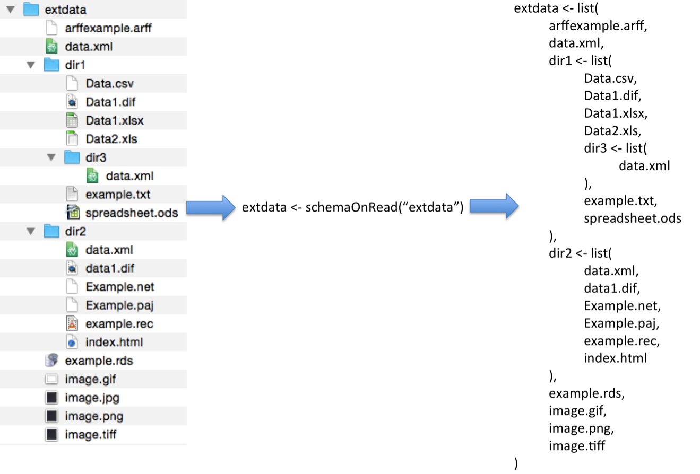

::: article
# Introduction

[*SchemaOnRead*](https://CRAN.R-project.org/package=SchemaOnRead) is a
CRAN package that provides an extensible mechanism for importing a wide
range of file types into R as well as support for the emerging
schema-on-read paradigm in R. The tools within the package include a
single function call (e.g., `schemaOnRead(filename)`) that reads text
(TXT), comma separated value (CSV), raster image (BMP, PNG, GIF, TIFF,
and JPG)[^1], R data (RDS), HDF5, NetCDF, spreadsheet (XLS, XLSX, ODS,
and DIF), Weka Attribute-Relation File Format (ARFF), Epi Info
(EPIINFO), Pajek network (NET), R network (PAJ), HTML, SPSS (SAV),
Systat (SYS), and Stata (DTA) files. It also recursively reads folders
(e.g., schemaOnRead(folder)), returning a nested list of the contained
elements. The provided tools can be used as-is or easily customized to
implement tool chains in R. This paper's contribution is that it
introduces and describes the *SchemaOnRead* package and compares it to
related R packages. In the sections that follow, this paper presents
usage examples, discusses user defined processors, reviews the related
work, explains the origin of the package name, summarizes the package
contents, and then provides concluding thoughts.

# Examples

{width="100%"  alt="graphic without alt text"}

A simple way to use SchemaOnRead is to conveniently load a file without
needing to handle the specifics of the file format. In this case the
result is a variable containing the file contents. Individual files can
also be easily accessed without needing to known the specifics of the
file format as below. The file contents can be accessed using the
`xmlFile` variable. All of the source code and example data can be found
at <https://github.com/drmichaelnorth/SchemaOnRead>.

``` r
  library(SchemaOnRead)
  xmlFile <- schemaOnRead("../inst/extdata/data.xml")
```

Another way to use SchemaOnRead is to recursively load a folder. The
result is a named list of elements for each entry in the folder's tree
as shown in Figure 1. Sub-elements (e.g., files or subfolders) of a
folder can be accessed using the R named list (`$`) operator followed by
the sub-element name. An example showing how to read a folder tree
starting in `../inst/extdata` is shown below.

``` r
  library(SchemaOnRead) 
  results <- schemaOnRead("../inst/extdata")
```

In this case, the contents of the `dir1/Data.csv` file within
`../inst/extdata` is shown by accessing `results$dir1$Data.csv` as
needed. The path also provides the data provenance. Files or folders
with names that do not conform to standard R variable naming
requirements can be accessed using single quote notation (e.g.,
`results‘Nonconforming Name’`).

{width="100%"  alt="graphic without alt text"}

The resulting named list notation also provides convenient access to
files and folders using integrated development environments for R that
support automatic code completion. An RStudio [@RStudio2015] example is
shown in Figure 2.

The SchemaOnRead `verbose` flag can be used to trace a call's progress
or diagnose issues as shown below.

``` r
    library(SchemaOnRead) 
    folder <- schemaOnRead("../inst/extdata", verbose = TRUE)
```

Which produces the output:

``` r
schemaOnRead processing ../inst/extdata
schemaOnRead processing ../inst/extdata/arffexample.arff
schemaOnRead processing ../inst/extdata/data.xml
schemaOnRead processing ../inst/extdata/dir1
schemaOnRead processing ../inst/extdata/dir1/Data.csv
schemaOnRead processing ../inst/extdata/dir1/Data1.dif
schemaOnRead processing ../inst/extdata/dir1/Data1.xlsx
schemaOnRead processing ../inst/extdata/dir1/Data2.xls
schemaOnRead processing ../inst/extdata/dir1/dir3
schemaOnRead processing ../inst/extdata/dir1/dir3/data.xml
schemaOnRead processing ../inst/extdata/dir1/example.txt
schemaOnRead processing ../inst/extdata/dir1/spreadsheet.ods
schemaOnRead processing ../inst/extdata/dir2
schemaOnRead processing ../inst/extdata/dir2/data.xml
```

# User Defined Processors

New processors can be defined to support user-specified processing. New
processors are normally prepended to the front of the default list to
allow them to take precedence while still allowing the standard
processors to work if needed. Alternatively, a list of processors that
just recursively scans folders can be found by calling the
`schemaOnReadSimpleProcessors` function. User-specified processors can
be added to this list to create a fully customized tool chain. An
example showing how to create a simple files processor is given below.

``` r
## Load the needed library.
library(SchemaOnRead)

## Define a new processor.
newProcessor <- function(path, ...) {

  # Check the file existance and extensions.
  if (!SchemaOnRead::checkExtensions(path, c("xyz"))) return(NULL)

  ## As an example, attempt to read an XYZ file as a CSV file.
  read.csv(path, header = FALSE)

}

## Define a new processors list.
newProcessors <- c(newProcessor, SchemaOnRead::defaultProcessors())

# Use the new processors list.
schemaOnRead(path = "../inst/extdata", processors = newProcessors)
```

A more detailed example of a Microsoft Excel spreadsheet processor is
shown below.

``` r
## Load the needed library.
library(SchemaOnRead)

## Define a new processor.
newSpreadsheetProcessor <- function(filePath = ".", ...) {

  # Check the file existance and extensions.
  if (!SchemaOnRead::checkExtensions(filePath, c("xls", "xlsx"))) return(NULL)

  # Read the workbook's worksheet names.
  worksheets <- readxl::excel_sheets(filePath)

  # Read the workbook's worksheets.
  workbook <- lapply(worksheets, readxl::read_excel, path = filePath)

  # Name the worksheets.
  names(workbook) <- worksheets

  # Return the results.
  workbook

}

## Define a new processors list.
newProcessors <- c(newSpreadsheetProcessor, SchemaOnRead::defaultProcessors())

# Use the new processors list.
schemaOnRead(path = "../inst/extdata", processors = newProcessors)
```

# Related Work

Several R packages provide support for importing diverse file formats
into R. Examples include
[*rio*](https://CRAN.R-project.org/package=rio),
[*readbitmap*](https://CRAN.R-project.org/package=readbitmap), and
[*foreign*](https://CRAN.R-project.org/package=foreign).

The *rio* package [@ChanEtAl2015] is the closest in functionality to
*SchemaOnRead*. *rio* provides file reading functions for a wide range
of formats including text files, fixed format files, spreadsheet files
(XLS, XLSX, ODS, and DIF),Stata, JSON, SPSS, Weka, Epi Info, serialized
R objects, saved R objects, SAS, Minitab, Systat, shallow XML files,
FORTRAN data files, and clipboard imports. *rio* supports a few file
formats not imported by *SchemaOnRead* such as fixed format files,
FORTRAN data files, and clipboard imports. *SchemaOnRead* similary
offers several formats not supported by *rio* such as deep XML, BMP,
JPEG, and PNG files. Unlike *SchemaOnRead*, *rio* includes functions for
writing as well as reading. Unlike *rio*, *SchemaOnRead* includes
functions for recursively reading directories and offers an interface
that is easily extensible by end users.

The *foreign* package [@RCoreTeamEtAl2015] provides functions for
reading a range of file types including Weka, Epi Info, SPSS, Stata,
Systat files. *SchemaOnRead* uses *foreign* for reading these types of
files. Unlike *SchemaOnRead*, *foreign* uses different user function
calls to select the format of the file being imported. Unlike *foreign*,
*SchemaOnRead* provides recursive reading of folders, is designed to be
easily extended by end users to new file formats, and checks file
extensions to determine formats.

The *readbitmap* package [@Jefferis2015] provides functions for reading
BMP, JPEG, and PNG files. *SchemaOnRead* uses *readbitmap* for reading
BMP, JPEG and PNG files. Unlike *SchemaOnRead*, *readbitmap* uses magic
numbers rather than extensions to identify file formats [^2]. Unlike
*readbitmap*, *SchemaOnRead* provides recursive reading of folders and
is designed to be easily extended by end users to new file formats.

# Why SchemaOnRead?

Schema-on-read [@Deutsch2013], [@Mendelevitch2013],
[@JacobsohnandDelurey2014] is an agile approach to data storage and
retrieval that defers investments in data organization until production
queries need to be run by working with data directly in native form.
Schema-on-read functions have been implemented in a wide range of
analytical systems including Hadoop [@HadoopTeam2015], [@Schau2015],
Splunk [@BitinckaGanapathiandZhang2012], Apache Spark [@SparkTeam2015],
Apache Flink [@Markl2014], and even relational databases
[@LiuandGawlick2015]. It is also possible to use machine learning tools
to extract schemas from source data [@YehNiekraszandFreitag2013].

# The R Package SchemaOnRead

The *SchemaOnRead* R package defines four public functions:

-   `schemaOnRead(path = ., processors = defaultProcessors(), verbose = FALSE)`
    processes the given path using the provided lsit of processors
    optinally printing its progress on the console.

-   `defaultProcessors()` returns a complete list of built-in processors
    in the recommended execution order.

-   `simpleProcessors()` returns a minimal list of built-in processors
    in the recommended execution order.

-   `checkExtensions(path = ., extensions = NULL)` returns true if the
    path exists and, if an extensions list is provided, the extension of
    the path is in extensions list.

The `schemaOnRead` function is used to read source material (e.g., files
and folders).

The SchemaOnRead package uses a recursive implementation. The initial
user function call, `schemaOnRead` iterates over the given list of
processors, invoking each in turn until one returns a non-null value.
Processors are sequentially invoked in the order given by the input
list, scanning from index number one upwards. Processing continues as
long as each processor returns null. The results from the first
processor to return a non-null value is stored as the content for the
entry and processing of that entry stops. All of the results are stored
in a named list. The order of the resulting list is the order given by
the file system. The variable names are taken from the entry names
(e.g., file or folder names). Files or folders with names that do not
conform to standard R variable naming requirements can be accessed using
single quote notation (e.g., `results‘Nonconforming Name’`).

An example processor for Microsoft Excel spreadsheets is shown below. In
this example, the entry identified by the `path` string is checked to
see if it exists as a file. If it does, then the file name is extension
is checked. If it matches then the processor attempts to read the file.

``` r
## Define the XLS and XLSX spreadsheet file processor.
schemaOnReadProcessXLSandXLSXFile <- function(path = ".",
        processors = schemaOnReadDefaultProcessors(), verbose = FALSE) {

        ## Check the given path.
        if ((file.exists(path)) &&
                ((tolower(tools::file_ext(path)) == "xls") ||
                 (tolower(tools::file_ext(path)) == "xlsx"))) {

                ## Create the results holder.
                results <- list()

                ## Attempt to read the file.
                workbook <- XLConnect::loadWorkbook(path)

                ## Scan the worksheets.
                for (worksheet in XLConnect::getSheets(workbook)) {

                        ## Define the variable name.
                        variable <- gsub("[^[:alnum:].]", "_", worksheet)
                        while (eval(parse(
                                text = paste("exists(\"results$", variable, "\")",
                                        sep = "")))) {
                                variable <- paste(variable, "_A", sep = "")
                        }

                        ## Setup the processing command.
                        command <- paste("results$", variable,
                                " <- XLConnect::readWorksheet",
                                "(workbook, sheet = worksheet)", sep = "")

                        ## Evaluate the processing command.
                        eval(parse(text = command))

                }

                ## Return the results.
                return(results)

        } else {

                ## Return the default value.
                return(NULL)

        }

}
```

The main goal of a processor is to read each acceptable entry into R in
an easily usable format. Examples include the production of lists and
data frames. The main output of SchemaOnRead is thus intended to be a
nested tree of lists, with data frames in some of the leaves the tree.
The first example does this by scanning the worksheets in a given
workbook and converting each into a data frame. The result is a list of
data frames with each data frame entry identified using the name of the
corresponding worksheet. Note that the worksheet names are checked to
insure that they correspond to valid R variable names for convenient
user access.

The postconditions for each processor are that the processor or one of
its descendants either successfully processes the entry and returns a
non-null result or fail to process the entry and return null. If the
entry is successfully processed then SchemaOnRead will perform no
further processing on the item. If the item was not successfully
processed then SchemaOnRead will use its remaining processors list to
attempt to process the entry.

Several special processors are defined for SchemaOnRead. These include
processors for nonexistent entries, directories, and entries of unknown
types.

The `schemaOnReadProcessEntryDoesNotExist` processor returns null if the
given entry exists and returns the value `Entry Does Not Exist` if not.
It is meant to be the first processor in most lists to intercept
nonexistent entries before they waste execution time in other
processors. Occasionally, special processing may needed for nonexistent
entries so these processors should run first.

The `schemaOnReadProcessDirectory` processor handles directories as
previously discussed. It is intended to be the second processor to run
in normal lists.

The `schemaOnReadProcessDefaultFile` processor accepts all entries that
exist and returns the `File Type Unknown` string. It normally runs last
to insure a value for unrecognized file types.

SchemaOnRead includes predefined two processing lists. The default
processing list is used for SchemaOnRead entry processing. The simple
processing list provides an easy starting point for user-defined
processor lists.

Twenty-one unit tests are defined for the SchemaOnRead package. These
tests are implemented using the
[*testthat*](https://CRAN.R-project.org/package=testthat) R package
[@Wickham2015]. The current version of SchemaOnRead passes all of the
defined tests.

# Summary

As we have discussed, schema-on-read is a powerful new option for data
storage and retrieval. Schema-on-read functions have been implemented in
a wide range of analytical systems, most notably Hadoop. SchemaOnRead
uses R's flexible data representations to provide transparent and
convenient support for the schema-on-read paradigm in R. This paper's
contribution is that it introduces and describes the *SchemaOnRead*
package and compares it to related R packages.

# Acknowledgements

Argonne National Laboratory's work was supported under U.S. Department
of Energy contract DE-AC02-06CH11357.
:::

[^1]: Image processing applications are becoming increasingly popular
    for purposes such as pattern recognition and machine vision. These
    applications often read large numbers of files during their training
    and testing phases. Image file import has been added to
    *SchemaOnRead* to support this use case.

[^2]: Magic numbers [@Wikipedia2015] are special values in files that
    represent the file format. Magic numbers are commonly stored as
    special values encoded in file headers and footers. The first two
    bytes of JPEG files in hexidecmial are FF and D8 and the last two
    bytes are FF and D9. The first six bytes of GIF files in hexdecimal
    are 47, 49, 46, 38, 37, and 61 (GIF87a in ASCII) or 47, 49, 46, 38,
    39, and 61 (GIF89a in ASCII). The first eight bytes of PNG files in
    hexidecmial are 89, 50, 4E, 47, 0D, 0A, 1A, and 0A) which, in part,
    spells PNG in ASCII.
