::: article
# Introduction

[*mclust*](https://CRAN.R-project.org/package=mclust) [@mclust] is a
popular R package for model-based clustering, classification, and
density estimation based on finite Gaussian mixture modelling. An
integrated approach to finite mixture models is provided, with functions
that combine model-based hierarchical clustering, EM for mixture
estimation and several tools for model selection. Thus *mclust* provides
a comprehensive strategy for clustering, density estimation and
discriminant analysis. A variety of covariance structures obtained
through eigenvalue decomposition are available. Functions for performing
single E and M steps and for simulating data for each available model
are also included. Additional ways of displaying and visualising fitted
models along with clustering, classification, and density estimation
results are also provided. It has been used in a broad range of contexts
including geochemistry
[@Templ:Filzmoser:Reimann:2008; @Ellefsen:Smith:Horton:2014],
chemometrics [@Fraley:Raftery:2006b; @Fraley:Raftery:2007b], DNA
sequence analysis [@Verbist:etal:2015], gene expression data
[@Yeung:etal:2001; @Li:etal:2005; @Fraley:Raftery:2006c], hydrology
[@Kim:etal:2014], wind energy [@Kazor:Hering:2015], industrial
engineering [@Campbell:etal:1999], epidemiology [@Flynt:Daepp:2015],
food science [@Kozak:Scaman:2008], clinical psychology
[@Suveg:etal:2014], political science
[@Ahlquist:Breunig:2012; @Jang:Hitchcock:2012], and anthropology
[@Konigsberg:etal:2009].

One measure of the popularity of *mclust* is provided by the download
logs of the RStudio (<http://www.rstudio.com>) CRAN mirror (available at
<http://cran-logs.rstudio.com>). The
[*cranlogs*](https://CRAN.R-project.org/package=cranlogs) package
[@cranlogs] makes it easy to download such logs and graph the number of
downloads over time. We used *cranlogs* to query the RStudio download
database over the past three years. In addition to *mclust*, other
R packages which handle Gaussian finite mixture modelling as part of
their capabilities have been included in the comparison:
[*Rmixmod*](https://CRAN.R-project.org/package=Rmixmod) [@rmixmod],
[*mixture*](https://CRAN.R-project.org/package=mixture) [@mixture],
[*EMCluster*](https://CRAN.R-project.org/package=EMCluster)
[@EMcluster], [*mixtools*](https://CRAN.R-project.org/package=mixtools)
[@mixtools], and [*bgmm*](https://CRAN.R-project.org/package=bgmm)
[@bgmm]. We also included
[*flexmix*](https://CRAN.R-project.org/package=flexmix)
[@flexmix1; @flexmix2; @flexmix3] which provides a general framework for
finite mixtures of regression models using the EM algorithm, since it
can be adapted to perform Gaussian model-based clustering using a
limited set of models (only the diagonal and unconstrained covariance
matrix models). Table [1](#tab:comparison) summarises the
functionalities of the selected packages.

::: {#tab:comparison}
  ----------------------------------------------------------------------------------------------------
  Package       Version    Clustering   Classification   Density estimation   Non-Gaussian components
  ------------- --------- ------------ ---------------- -------------------- -------------------------
  *mclust*      5.2           $✓$            $✓$                $✓$                     $✗$

  *Rmixmod*     2.0.3         $✓$            $✓$                $✗$                     $✓$

  *mixture*     1.4           $✓$            $✓$                $✗$                     $✗$

  *EMCluster*   0.2-5         $✓$            $✓$                $✗$                     $✗$

  *mixtools*    1.0.4         $✓$            $✗$                $✓$                     $✓$

  *bgmm*        1.7           $✓$            $✓$                $✗$                     $✗$

  *flexmix*     2.3-13        $✓$            $✗$                $✗$                     $✓$
  ----------------------------------------------------------------------------------------------------

  : Table 1: Capabilities of the selected packages dealing with finite
  mixture models.
:::

Figure [1](#fig:mixpkg) shows the trend in weekly downloads from the
RStudio CRAN mirror for the selected packages. The popularity of
*mclust* has been increasing steadily over time with a first high peak
around mid April 2015, probably due to the release of R version 3.2 and,
shortly after, the release of version 5 of *mclust*. Then, successive
peaks occurred in conjunction with the release of package's updates.
Based on these logs, *mclust* is the most downloaded package dealing
with Gaussian mixture models, followed by *flexmix* which, as mentioned,
is a more general package for fitting mixture models but with limited
clustering capabilities.

{#fig:mixpkg width="100%"
style="text-align: center"  alt="graphic without alt text"}

Another aspect that can be considered as a proxy for the popularity of a
package is the mutual dependencies structure between R packages[^1].
This can be represented as a graph with packages at the vertices and
dependencies (either "Depends", "Imports", "LinkingTo", "Suggests" or
"Enhances") as directed edges, and analysed through the *PageRank*
algorithm used by the Google search engine [@Brin:Page:1998]. For the
packages considered previously, we used the `page.rank` function
available in the [*igraph*](https://CRAN.R-project.org/package=igraph)
package [@igraph] and we obtained the ranking reported in
Table [2](#tab:pagerank), which approximately reproduces the results
discussed above. Note that *mclust* is among the top 100 packages on
CRAN by this ranking. Finally, its popularity is also indicated by the
55 other CRAN packages listed as reverse dependencies, either "Depends",
"Imports" or "Suggests".

::: {#tab:pagerank}
  ----------------------------------------------------------------------------------
    *mclust*   *Rmixmod*   *mixture*   *EMCluster*   *mixtools*   *bgmm*   *flexmix*
  ---------- ----------- ----------- ------------- ------------ -------- -----------
          75        2300        2319          2143         1698     3736         270

  ----------------------------------------------------------------------------------

  : Table 2: Ranking obtained with the *PageRank* algorithm for some
  R packages dealing with Gaussian finite mixture modelling. At the time
  of writing there are 8663 packages on CRAN.
:::

Earlier versions of the package have been described in
@Fraley:Raftery:1999, @Fraley:Raftery:2003, and
@Fraley:Raftery:Murphy:Scrucca:2012. In this paper we discuss some of
the new functionalities available in *mclust* version $\ge 5$. In
particular we describe the newly available models, dimension reduction
for visualisation, bootstrap-based inference, implementation of
different model selection criteria and initialisation strategies for the
EM algorithm.

The reader should first install the latest version of the package from
CRAN with

``` r
> install.packages("mclust")
```

Then the package is loaded into an R session using the command

``` r
> library(mclust)
    __  ___________    __  _____________
   /  |/  / ____/ /   / / / / ___/_  __/
  / /|_/ / /   / /   / / / /\__ \ / /   
 / /  / / /___/ /___/ /_/ /___/ // /    
/_/  /_/\____/_____/\____//____//_/    version 5.2
Type 'citation("mclust")' for citing this R package in publications.  
```

All the datasets used in the examples are available in *mclust* or in
other R packages, such as
[*gclus*](https://CRAN.R-project.org/package=gclus) [@gclus],
[*rrcov*](https://CRAN.R-project.org/package=rrcov) [@rrcov] and
[*tourr*](https://CRAN.R-project.org/package=tourr) [@tourr], and can be
installed from CRAN using the above procedure, except where noted
differently.

# Gaussian finite mixture modelling {#sec:gmm}

Let
$\mathbf{x}= \lbrace \mathbf{x}_1,\mathbf{x}_2,\ldots,\mathbf{x}_i,\ldots,\mathbf{x}_n \rbrace$
be a sample of $n$ independent identically distributed observations. The
distribution of every observation is specified by a probability density
function through a finite mixture model of $G$ components, which takes
the following form
$$f(\mathbf{x}_i; \mathbf{\Psi}) = \sum_{k=1}^G \pi_k f_k(\mathbf{x}_i; \mathbf{\theta}_k),
\label{eq:finmixdens}   (\#eq:eqfinmixdens)$$
where
$\mathbf{\Psi}= \{\pi_1, \ldots, \pi_{G-1}, \mathbf{\theta}_1, \ldots, \mathbf{\theta}_G\}$
are the parameters of the mixture model,
$f_k(\mathbf{x}_i; \mathbf{\theta}_k)$ is the $k$th component density
for observation $\mathbf{x}_i$ with parameter vector
$\mathbf{\theta}_k$, $(\pi_1,\ldots,\pi_{G-1})$ are the mixing weights
or probabilities (such that $\pi_k > 0$, $\sum_{k=1}^G\pi_k = 1$), and
$G$ is the number of mixture components.

Assuming that $G$ is fixed, the mixture model parameters $\mathbf{\Psi}$
are usually unknown and must be estimated. The log-likelihood function
corresponding to equation \@ref(eq:eqfinmixdens) is given by
$\ell(\mathbf{\Psi}; \mathbf{x}_1, \ldots, \mathbf{x}_n) = \sum_{i=1}^{n} \log(f(\mathbf{x}_i; \mathbf{\Psi}))$.
Direct maximisation of the log-likelihood function is complicated, so
the maximum likelihood estimator (MLE) of a finite mixture model is
usually obtained via the EM algorithm
[@Dempster:Laird:Rubin:1977; @McLachlan:Peel:2000].

In the model-based approach to clustering, each component of a finite
mixture density is usually associated with a group or cluster. Most
applications assume that all component densities arise from the same
parametric distribution family, although this need not be the case in
general. A popular model is the Gaussian mixture model (GMM), which
assumes a (multivariate) Gaussian distribution for each component,
i.e. $f_k(\mathbf{x}; \mathbf{\theta}_k) \sim N(\mathbf{\mu}_k, \mathbf{\Sigma}_k)$.
Thus, clusters are ellipsoidal, centered at the mean vector
$\mathbf{\mu}_k$, and with other geometric features, such as volume,
shape and orientation, determined by the covariance matrix
$\mathbf{\Sigma}_k$. Parsimonious parameterisations of the covariances
matrices can be obtained by means of an eigen-decomposition of the form
$\mathbf{\Sigma}_k = \lambda_k \mathbf{D}_k \mathbf{A}_k \mathbf{D}{}^{\!\top}_k$,
where $\lambda_k$ is a scalar controlling the volume of the ellipsoid,
$\mathbf{A}_k$ is a diagonal matrix specifying the shape of the density
contours with $\det(\mathbf{A}_k)=1$, and $\mathbf{D}_k$ is an
orthogonal matrix which determines the orientation of the corresponding
ellipsoid [@Banfield:Raftery:1993; @Celeux:Govaert:1995]. In one
dimension, there are just two models: `E` for equal variance and `V` for
varying variance. In the multivariate setting, the volume, shape, and
orientation of the covariances can be constrained to be equal or
variable across groups. Thus, 14 possible models with different
geometric characteristics can be specified. Table [3](#tab:covar_param)
reports all such models with the corresponding distribution structure
type, volume, shape, orientation, and associated model names. In
Figure [2](#fig:mclust_ellipses) the geometric characteristics are shown
graphically.

::: {#tab:covar_param}
  ------------------------------------------------------------------------------------------------------------------------------
  Model                         $\mathbf{\Sigma}_k$                        Distribution    Volume     Shape       Orientation
  ------- --------------------------------------------------------------- -------------- ---------- ---------- -----------------
  `EII`                        $\lambda \mathbf{I}$                         Spherical      Equal      Equal           ---

  `VII`                       $\lambda_k \mathbf{I}$                        Spherical     Variable    Equal           ---

  `EEI`                        $\lambda \mathbf{A}$                          Diagonal      Equal      Equal     Coordinate axes

  `VEI`                       $\lambda_k \mathbf{A}$                         Diagonal     Variable    Equal     Coordinate axes

  `EVI`                       $\lambda \mathbf{A}_k$                         Diagonal      Equal     Variable   Coordinate axes

  `VVI`                      $\lambda_k \mathbf{A}_k$                        Diagonal     Variable   Variable   Coordinate axes

  `EEE`         $\lambda \mathbf{D}\mathbf{A}\mathbf{D}{}^{\!\top}$        Ellipsoidal     Equal      Equal          Equal

  `EVE`       $\lambda \mathbf{D}\mathbf{A}_k \mathbf{D}{}^{\!\top}$       Ellipsoidal     Equal     Variable        Equal

  `VEE`        $\lambda_k \mathbf{D}\mathbf{A}\mathbf{D}{}^{\!\top}$       Ellipsoidal    Variable    Equal          Equal

  `VVE`      $\lambda_k \mathbf{D}\mathbf{A}_k \mathbf{D}{}^{\!\top}$      Ellipsoidal    Variable   Variable        Equal

  `EEV`      $\lambda \mathbf{D}_k \mathbf{A}\mathbf{D}{}^{\!\top}_k$      Ellipsoidal     Equal      Equal        Variable

  `VEV`     $\lambda_k \mathbf{D}_k \mathbf{A}\mathbf{D}{}^{\!\top}_k$     Ellipsoidal    Variable    Equal        Variable

  `EVV`     $\lambda \mathbf{D}_k \mathbf{A}_k \mathbf{D}{}^{\!\top}_k$    Ellipsoidal     Equal     Variable      Variable

  `VVV`    $\lambda_k \mathbf{D}_k \mathbf{A}_k \mathbf{D}{}^{\!\top}_k$   Ellipsoidal    Variable   Variable      Variable
  ------------------------------------------------------------------------------------------------------------------------------

  : Table 3: Parameterisations of the within-group covariance matrix
  $\mathbf{\Sigma}_k$ for multidimensional data available in the
  *mclust* package, and the corresponding geometric characteristics.
:::

{#fig:mclust_ellipses
width="100%" style="text-align: center"  alt="graphic without alt text"}

Starting with version $5.0$ of *mclust*, four additional models have
been included: EVV, VEE, EVE, VVE. Models EVV and VEE are estimated
using the methods described in @Celeux:Govaert:1995, and the estimation
of models EVE and VVE is carried out using the approach discussed by
@Browne:McNicholas:2014. In the models VEE, EVE and VVE it is assumed
that the mixture components share the same orientation matrix. This
assumption allows for a parsimonious characterisation of the clusters,
while still retaining flexibility in defining volume and shape.

# Model-based clustering {#sec:mbclust}

To illustrate the new modelling capabilities of *mclust* for model-based
clustering consider the `wine` dataset contained in the *gclus*
R package. This dataset provides 13 measurements obtained from a
chemical analysis of 178 wines grown in the same region in Italy but
derived from three different cultivars (Barolo, Grignolino, Barbera).

``` r
> data(wine, package = "gclus")
> Class <- factor(wine$Class, levels = 1:3,
                  labels = c("Barolo", "Grignolino", "Barbera"))
> X <- data.matrix(wine[,-1])
> mod <- Mclust(X)
> summary(mod$BIC)
Best BIC values:
             EVE,3       VVE,3       VVE,6
BIC      -6873.257 -6896.83693 -6906.37460
BIC diff     0.000   -23.57947   -33.11714
> plot(mod, what = "BIC", ylim = range(mod$BIC[,-(1:2)], na.rm = TRUE),
       legendArgs = list(x = "bottomleft"))
```

In the above `Mclust()` function call, only the data matrix is provided,
and the number of mixing components and the covariance parameterisation
are selected using the Bayesian Information Criterion (BIC). A summary
showing the top-three models and a plot of the BIC traces (see
Figure [3](#fig1:wine)) for all the models considered is then obtained.
In the last plot we adjusted the range of the y-axis so to remove those
models with lower BIC values. There is a clear indication of a
three-component mixture with covariances having different shapes but the
same volume and orientation (EVE). Note that all the top three models
are among the models added to the latest major release of *mclust*.

{#fig1:wine width="100%"
style="text-align: center"  alt="graphic without alt text"}

A summary of the selected model is obtained as:

``` r
> summary(mod)
----------------------------------------------------
Gaussian finite mixture model fitted by EM algorithm 
----------------------------------------------------

Mclust EVE (ellipsoidal, equal volume and orientation) model with 3 components:

 log.likelihood   n  df       BIC       ICL
       -3032.45 178 156 -6873.257 -6873.549

Clustering table:
 1  2  3 
63 51 64 
```

The fitted model provides an accurate recovery of the true classes:

``` r
> table(Class, mod$classification)        
Class         1  2  3
  Barolo     59  0  0
  Grignolino  4  3 64
  Barbera     0 48  0
> adjustedRandIndex(Class, mod$classification)
[1] 0.8803998
```

The latter index is the adjusted Rand index [ARI; @Hubert:Arabie:1985],
which can be used for evaluating a clustering solution. The ARI is a
measure of agreement between two partitions, one estimated by a
statistical procedure independent of the labelling of the groups, and
one being the true classification. It has zero expected value in the
case of a random partition, and it is bounded above by 1, with higher
values representing better partition accuracy.

To visualise the clustering structure and the geometric characteristics
induced by an estimated Gaussian finite mixture model we may project the
data onto a suitable dimension reduction subspace. The function
`MclustDR()` implements the methodology introduced in @Scrucca:2010. The
estimated directions which span the reduced subspace are defined as a
set of linear combinations of the original features, ordered by
importance as quantified by the associated eigenvalues. By default,
information on the dimension reduction subspace is provided by both the
variation on cluster means and, depending on the estimated mixture
model, on the variation on cluster covariances. This methodology has
been extended to supervised classification by @Scrucca:2014.
Furthermore, a tuning parameter has been included which enables the
recovery of most of the separating directions, i.e. those that show
maximal separation among groups. Other dimension reduction techniques
for finding the directions of optimum separation have been discussed in
detail by @Hennig:2004 and implemented in the package
[*fpc*](https://CRAN.R-project.org/package=fpc) [@fpc].

Applying `MclustDR` to the wine data example, such directions are
obtained as follows:

``` r
> drmod <- MclustDR(mod, lambda = 1)
> summary(drmod)
-----------------------------------------------------------------
Dimension reduction for model-based clustering and classification 
-----------------------------------------------------------------

Mixture model type: Mclust (EVE, 3)
        
Clusters  n
       1 63
       2 51
       3 64

Estimated basis vectors:
                       Dir1       Dir2
Alcohol          0.11701058  0.2637302
Malic           -0.02814821  0.0489447
Ash             -0.18258917  0.5390056
Alcalinity      -0.02969793 -0.0309028
Magnesium        0.00575692  0.0122642
Phenols         -0.18497201 -0.0016806
Flavanoids       0.45479873 -0.2948947
Nonflavanoid     0.59278569 -0.5777586
Proanthocyanins  0.05347167  0.0508966
Intensity       -0.08328239  0.0332611
Hue              0.42950365 -0.4588969
OD280            0.40563746 -0.0369229
Proline          0.00075867  0.0010457

               Dir1    Dir2
Eigenvalues  1.5794   1.332
Cum. %      54.2499 100.000
```

By setting the optional tuning parameter `lambda = 1`, instead of the
default value `0.5`, only the information on cluster means is used for
estimating the directions. In this case, the dimension of the subspace
is $d = \min(p, G-1)$, where $p$ is the number of variables and $G$ the
number of mixture components or clusters. In the data example, there are
$p=13$ features and $G=3$ clusters, so the dimension of the reduced
subspace is $d=2$. As a result, the projected data show the maximal
separation among clusters, as shown in Figure [4](#fig2:wine)a, which is
obtained with

``` r
> plot(drmod, what = "contour")
```

On the same subspace we can also plot the uncertainty boundaries
corresponding to the MAP classification:

``` r
> plot(drmod, what = "boundaries", ngrid = 200)
```

and then add a circle around the misclassified observations

``` r
> miscl <- classError(Class, mod$classification)$misclassified
> points(drmod$dir[miscl,], pch = 1, cex = 2) 
```

<figure id="fig2:wine">
<table>
<caption> </caption>
<tbody>
<tr class="odd">
<td style="text-align: center;">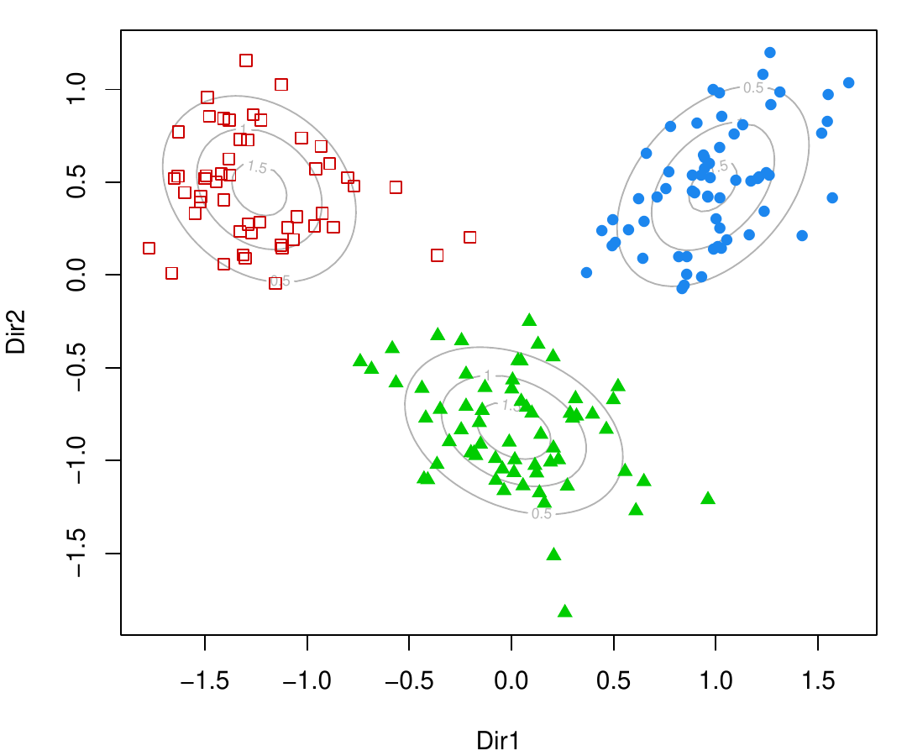</td>
<td style="text-align: center;">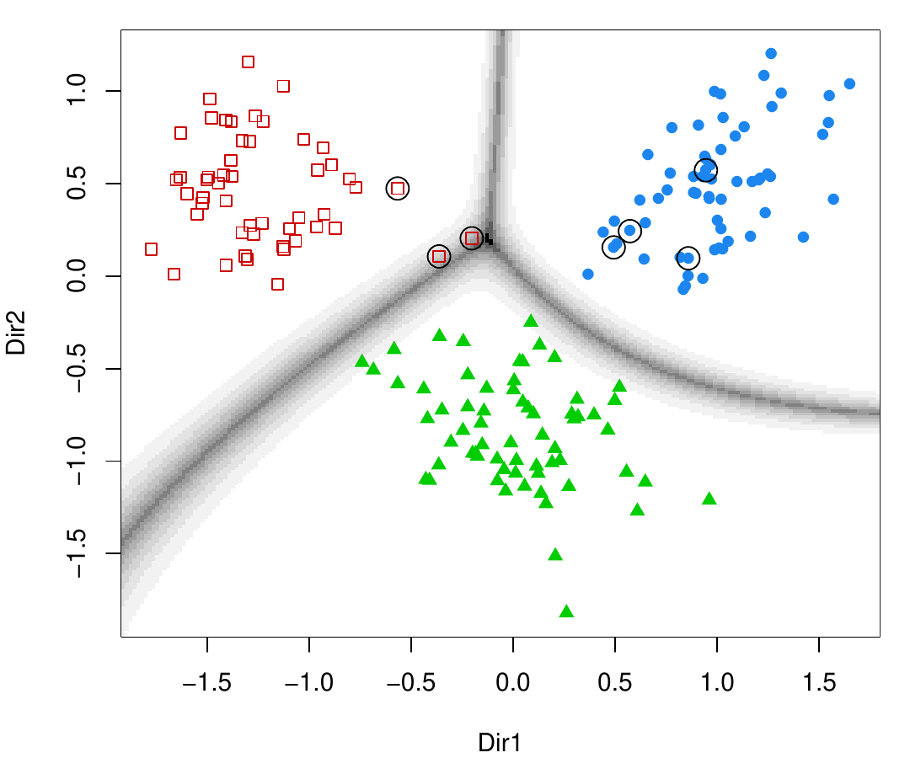</td>
</tr>
<tr class="even">
<td style="text-align: center;">(a)</td>
<td style="text-align: center;">(b)</td>
</tr>
</tbody>
</table>
<figcaption>Figure 4: Contour plot of estimated mixture densities (a)
and uncertainty boundaries (b) on the projection subspace estimated with
<code>MclustDR</code> for the <code>wine</code> dataset.</figcaption>
</figure>

# Model selection {#sec:modsel}

A central question in finite mixture modelling is how many components
should be included in the mixture. In GMMs we need also to decide which
covariance parameterisation to adopt. Both questions can be addressed by
information criteria, such as the BIC
[@Schwartz:1978; @Fraley:Raftery:1998] or the integrated complete-data
likelihood criterion [ICL; @Biernacki:Celeux:Govaert:2000]. The
selection of the order of the mixture, i.e. the number of mixture
components or clusters, can be also performed by formal hypothesis
testing; for a recent review see @McLachlan:Rathnayake:2014.

Information criteria are based on penalised forms of the log-likelihood.
As the likelihood increases with the addition of more components, a
penalty term for the number of estimated parameters is subtracted from
the log-likelihood. The BIC is a popular choice in the context of GMMs,
and takes the form
$$\mathrm{BIC}_{\mathcal{M}, G} = 2\ell_{\mathcal{M}, G}(\mathbf{x}|\widehat{\mathbf{\Psi}}) - \nu \log(n),$$
where $\ell_{\mathcal{M}, G}(\mathbf{x}|\widehat{\mathbf{\Psi}})$ is the
log-likelihood at the MLE $\widehat{\mathbf{\Psi}}$ for model
$\mathcal{M}$ with $G$ components, $n$ is the sample size, and $\nu$ is
the number of estimated parameters. The pair $\{\mathcal{M},G\}$ which
maximises $\mathrm{BIC}_{\mathcal{M}, G}$ is selected. Given some
necessary regularity conditions, BIC is derived as an approximation to
the model evidence using the Laplace method. Although these conditions
do not hold for mixture models in general [@Aitkin:Rubin:1985], some
consistency results apply [@Roeder:Wasserman:1997; @Keribin:2000] and
the criterion has been shown to perform well in applications
[@Fraley:Raftery:1998].

In the *mclust* package, BIC is used by default for model selection. The
function `mclustBIC()` allows the user to obtain a matrix of BIC values
for all the available models and number of components up to 9 (by
default).

For example, consider the `diabetes` dataset which contains measurements
on 145 non-obese adult subjects. Recorded variables are `glucose`, the
area under plasma glucose curve after a three hour oral glucose
tolerance test (OGTT), `insulin`, the area under plasma insulin curve
after a three hour OGTT, and `sspg`, the steady state plasma glucose
level. The patients are classified clinically into three groups.

``` r
> data(diabetes)
> X <- diabetes[,2:4]
> Class <- diabetes$class
> table(Class)
Chemical   Normal    Overt 
      36       76       33 
```

The data can be shown graphically (see Figure [5](#fig1:diabetes)) as
follows:

``` r
> clp <- clPairs(X, Class, lower.panel = NULL)
> clPairsLegend(0.1, 0.3, class = clp$class, col = clp$col, pch = clp$pch)
```

{#fig1:diabetes width="100%"
style="text-align: center"  alt="graphic without alt text"}

The following function call can be used to compute the BIC for all the
covariance structures and up to 9 components:

``` r
> BIC <- mclustBIC(X)
> BIC
Bayesian Information Criterion (BIC):
        EII       VII       EEI       VEI       EVI       VVI       EEE       EVE
1 -5863.923 -5863.923 -5530.129 -5530.129 -5530.129 -5530.129 -5136.446 -5136.446
2 -5449.518 -5327.719 -5169.399 -5019.350 -5015.884 -4988.322 -5010.994 -4875.633
3 -5412.588 -5206.399 -4998.446 -4899.759 -5000.661 -4827.818 -4976.853 -4858.851
4 -5236.008 -5208.512 -4937.627 -4835.856 -4865.767 -4813.002 -4865.864 -4793.261
5 -5181.608 -5202.555 -4915.486 -4841.773 -4838.587 -4833.589 -4882.812        NA
6 -5162.164 -5135.069 -4885.752        NA -4848.623 -4810.558 -4835.226        NA
7 -5128.736 -5129.460 -4857.097        NA -4849.023        NA -4805.518        NA
8 -5135.787 -5135.053 -4858.904        NA -4873.450        NA -4820.155        NA
9 -5150.374 -5112.616 -4878.786        NA -4865.166        NA -4840.039        NA
        VEE       VVE       EEV       VEV       EVV       VVV
1 -5136.446 -5136.446 -5136.446 -5136.446 -5136.446 -5136.446
2 -4920.301 -4877.086 -4918.500 -4834.727 -4823.779 -4825.027
3 -4851.667 -4775.537 -4917.567 -4809.225 -4817.884 -4760.091
4 -4840.034 -4794.892 -4887.406 -4823.882 -4828.796 -4802.420
5        NA        NA -4908.030 -4842.077        NA        NA
6        NA        NA -4844.584 -4826.457        NA        NA
7        NA        NA -4910.155 -4852.182        NA        NA
8        NA        NA -4858.974 -4870.633        NA        NA
9        NA        NA -4930.535 -4887.206        NA        NA

Top 3 models based on the BIC criterion:
    VVV,3     VVE,3     EVE,4 
-4760.091 -4775.537 -4793.261 
```

In the results reported above, the `NA` values mean that a particular
model cannot be estimated. This happens in practice due to singularity
in the covariance matrix estimate and can be avoided using the Bayesian
regularisation proposed in @Fraley:Raftery:2007 and implemented in
*mclust* as described in @Fraley:Raftery:Murphy:Scrucca:2012. Optional
arguments allow finetuning, such as `G` for the number of components,
and `modelNames` for specifying the model covariances parameterisations
(see Table [3](#tab:covar_param) and `help(mclustModelNames)` for a
description of available model names). Another optional argument `x` can
be used to provide the output from a previous call to `mclustBIC()`.
This is useful if the model space needs to be enlarged by fitting more
models, e.g. by increasing the number of mixture components, without the
need to recompute the BIC values for those models already fitted.
Another usage of such strategy that may be helpful to users is provided
in `Mclust()`. For example, BIC values already available can be provided
as follows

``` r
> Mclust(X, x = BIC)
```

Note that by specifying the argument `G` and `modelNames` the model
space can be restricted to a subset, or enlarged to a superset. In the
latter case the BIC is calculated only for the newly included models.

The use of BIC for model selection was available in *mclust* since
earlier versions. However, BIC tends to select the number of mixture
components needed to reasonably approximate the density, rather than the
number of clusters as such. For this reason, other criteria have been
proposed for model selection, like the *integrated complete-data
likelihood* (ICL) criterion [@Biernacki:Celeux:Govaert:2000]:
$$\mathrm{ICL}_{\mathcal{M}, G} = \mathrm{BIC}_{\mathcal{M}, G} + 2 \sum_{i=1}^n\sum_{k=1}^G c_{ik}\log(z_{ik}),$$
where $z_{ik}$ is the conditional probability that $\mathbf{x}_i$ arises
from the $k$th mixture component, and $c_{ik} = 1$ if the $i$th unit is
assigned to cluster $k$ and 0 otherwise. ICL penalises the BIC through
an *entropy* term which measures clusters overlap. Provided that
clusters overlapping is not too strong, ICL has shown good performance
in selecting the number of clusters, with preference for solutions with
well-separated groups.

In *mclust* the ICL can be computed by means of the `mclustICL()`
function:

``` r
> ICL <- mclustICL(X)
> ICL
Integrated Complete-data Likelihood (ICL) criterion:
        EII       VII       EEI       VEI       EVI       VVI       EEE       EVE
1 -5863.923 -5863.923 -5530.129 -5530.129 -5530.129 -5530.129 -5136.446 -5136.446
2 -5450.004 -5333.689 -5169.732 -5023.533 -5016.010 -4994.986 -5012.758 -4876.295
3 -5415.983 -5219.627 -4999.693 -4910.963 -5011.423 -4839.130 -4985.448 -4875.992
4 -5238.797 -5224.698 -4939.741 -4847.524 -4876.784 -4823.308 -4867.650 -4809.169
5 -5190.524 -5226.204 -4923.986 -4865.230 -4854.347 -4859.162 -4895.412        NA
6 -5171.561 -5158.411 -4901.823        NA -4865.106 -4820.076 -4846.827        NA
7 -5136.220 -5152.330 -4872.644        NA -4870.151        NA -4817.584        NA
8 -5146.628 -5156.135 -4871.975        NA -4897.172        NA -4834.074        NA
9 -5180.744 -5145.708 -4911.346        NA -4883.199        NA -4872.677        NA
        VEE       VVE       EEV       VEV       EVV       VVV
1 -5136.446 -5136.446 -5136.446 -5136.446 -5136.446 -5136.446
2 -4927.621 -4885.421 -4920.413 -4844.590 -4826.796 -4834.539
3 -4866.976 -4793.271 -4927.563 -4821.068 -4828.535 -4776.086
4 -4869.658 -4823.020 -4956.077 -4847.034 -4839.703 -4830.658
5        NA        NA -4948.787 -4869.279        NA        NA
6        NA        NA -4884.720 -4849.505        NA        NA
7        NA        NA -4947.190 -4878.445        NA        NA
8        NA        NA -4890.913 -4895.286        NA        NA
9        NA        NA -5007.250 -4919.228        NA        NA

Top 3 models based on the ICL criterion:
    VVV,3     VVE,3     EVE,4 
-4776.086 -4793.271 -4809.169 
```

As discussed above for `mclustBIC()`, the output from a previous call to
`mclustICL()` can be provided as input with the argument `x` to avoid
recomputing the ICL for models already fitted.

Both criteria can be shown graphically with (see
Figure [6](#fig2:diabetes)):

``` r
> plot(BIC)
> plot(ICL)
```

In this case BIC and ICL selected the same final model.

{#fig2:diabetes width="100%"
style="text-align: center"  alt="graphic without alt text"}

Other information criteria are available in the literature. For example,
members of the Generalised Information Criteria (GIC) family
[@Konishi:Kitagawa:1996] are not computed by the package, but they can
be easily obtained using the information returned by the `Mclust()`
function.

In addition to the information criteria just mentioned, the choice of
the order of a mixture model for a specific component-covariances
parameterisation can be carried out by likelihood ratio testing (LRT).
Suppose we want to test the null hypothesis $H_0: G = G_0$ against the
alternative $H_1: G = G_1$ for some $G_1 > G_0$; usually,
$G_1 = G_0 + 1$ as it is a common procedure to keep adding components
sequentially. Let $\widehat{\mathbf{\Psi}}_{G_j}$ be the MLE of
$\mathbf{\Psi}$ calculated under $H_j: G = G_j$ (for $j = 0,1$). The
likelihood ratio test statistic (LRTS) can be written as
$$\mathrm{LRTS}= -2\log\{L(\widehat{\mathbf{\Psi}}_{G_0})/L(\widehat{\mathbf{\Psi}}_{G_1})\}
      = 2\{ \ell(\widehat{\mathbf{\Psi}}_{G_1}) - \ell(\widehat{\mathbf{\Psi}}_{G_0}) \},$$
where large values of LRTS provide evidence against the null hypothesis.
However, standard regularity conditions do not hold for the null
distribution of the LRTS to have its usual chi-squared distribution
[@McLachlan:Peel:2000 Chap. 6]. As consequence, LRT significance is
often estimated by a resampling approach in order to produce a
$p$-value. @McLachlan:1987 proposed the using of the bootstrap to obtain
the null distribution of the LRTS. The bootstrap procedure is the
following:

1.  a bootstrap sample $\mathbf{x}_b^*$ is generated by simulating from
    the fitted model under the null hypothesis with $G_0$ components,
    i.e. from the GMM distribution with the vector of unknown parameters
    replaced by MLEs obtained from the original data under $H_0$;

2.  the test statistic $\mathrm{LRTS}^*_b$ is computed for the bootstrap
    sample $\mathbf{x}_b^*$ after fitting GMMs with $G_0$ and $G_1$
    number of components;

3.  steps 1. and 2. are replicated several times, say $B = 999$, to
    obtain the bootstrap null distribution of $\mathrm{LRTS}^*$.

A bootstrap-based approximation to the $p$-value may then be computed as
$$p\text{-value} \approx \frac{1 + \sum_{i=1}^B \mathrm{I}(\mathrm{LRTS}^*_b \ge  \mathrm{LRTS}_{obs})}{B+1}$$
where $\mathrm{LRTS}_{obs}$ is the test statistic computed on the
observed sample $\mathbf{x}$, and $\mathrm{I}(\cdot)$ denotes the
indicator function (which is equal to 1 if its argument is true and 0
otherwise).

The above bootstrap procedure is implemented in the
`mclustBootstrapLRT()` function. We need to specify at least the input
data and the model name we want to test:

``` r
> LRT <- mclustBootstrapLRT(X, modelName = "VVV")
> LRT
Bootstrap sequential LRT for the number of mixture components
-------------------------------------------------------------
Model        = VVV 
Replications = 999 
               LRTS bootstrap p-value
1 vs 2   361.186445             0.001
2 vs 3   114.703559             0.001
3 vs 4     7.437806             0.938
```

The number of bootstrap resamples can be set by the optional argument
`nboot`; if not provided, `nboot = 999` is used. The sequential
bootstrap procedure terminates when a test is not significant at the
level specified by `level` (by default equal to `0.05`). There is also
the option for a user to fix the maximum number of mixture components to
test via the argument `maxG`. In the example above the bootstrap
$p$-values clearly indicate the presence of three clusters. Note that
models fitted on the original data are estimated via the EM algorithm
initialised by the default model-based hierarchical agglomerative
clustering. Then, during the bootstrap procedure, models under the null
and the alternative hypotheses are fitted on bootstrap samples using
again the EM algorithm. However, in this case the algorithm starts with
the E step initialised with the estimated parameters obtained at the
convergence of the EM algorithm on the original data.

The bootstrap distributions of the LRTS can be shown graphically (see
Figure [7](#fig3:diabetes)) using the associated plot method:

``` r
> plot(LRT, G = 1)
> plot(LRT, G = 2)
> plot(LRT, G = 3)
```

{#fig3:diabetes width="100%"
style="text-align: center"  alt="graphic without alt text"}

# Bootstrap inference

There are two main approaches to likelihood-based inference in mixture
models, namely information-based and resampling methods
[@McLachlan:Peel:2000]. In information-based methods, the covariance
matrix of the MLE $\widehat{\mathbf{\Psi}}$ is approximated by the
inverse of the observed information matrix
$I^{-1}(\widehat{\mathbf{\Psi}})$, i.e.
$$\mathrm{Cov}(\widehat{\mathbf{\Psi}}) \approx ( I^{-1}(\widehat{\mathbf{\Psi}})).$$
However, "the sample size $n$ has to be very large before the asymptotic
theory applies to mixture models" [@McLachlan:Peel:2000 p. 42]. Indeed,
@Basford:Greenway:McLachlan:Peel:1997 found that standard errors
obtained using the expected or the observed information matrix are
unstable, unless the sample size is very large. For these reasons, they
advocate the use of a resampling approach based on the bootstrap. For a
recent review and comparison of different resampling approaches to
inference in finite mixture models see @OHagan:Murphy:Gormley:2015.

The *bootstrap* [@Efron:1979] is a general, widely applicable, powerful
technique for obtaining an approximation to the sampling distribution of
a statistic of interest. The bootstrap distribution is approximated by
drawing a large number of samples (*bootstrap samples*) from the
empirical distribution, i.e. by resampling with replacement from the
observed data (*nonparametric bootstrap*), or from a parametric
distribution with unknown parameters substituted by the corresponding
estimates (*parametric bootstrap*).

Let $\widehat{\mathbf{\Psi}}$ be the estimate of a set of GMM parameters
$\mathbf{\Psi}$ for a given model $\mathcal{M}$, i.e. covariance
parameterisation, and number of mixture components $G$. A bootstrap
estimate of the corresponding standard errors can be obtained using the
following procedure:

-   Obtain the bootstrap distribution for the parameters of interest by:

    1.  drawing a sample of size $n$ with replacement from the empirical
        distribution $(\mathbf{x}_1, \ldots, \mathbf{x}_n)$ to form the
        bootstrap sample $(\mathbf{x}^*_1, \ldots, \mathbf{x}^*_n)$;

    2.  fitting a GMM $(\mathcal{M}, G)$ to get the bootstrap estimates
        $\widehat{\mathbf{\Psi}}^*$;

    3.  replicating steps 1--2 a large number of times, say $B$, to
        obtain
        $\widehat{\mathbf{\Psi}}^*_1, \widehat{\mathbf{\Psi}}^*_2, \ldots, \widehat{\mathbf{\Psi}}^*_B$
        estimates from $B$ resamples.

-   The bootstrap covariance matrix is then approximated by
    $$\mathrm{Cov}_{\mathrm{boot}}(\widehat{\mathbf{\Psi}}) \approx 
       \frac{1}{B-1} \sum_{b=1}^B
                     (\widehat{\mathbf{\Psi}}^*_b - \overline{\widehat{\mathbf{\Psi}}}^*)
                     (\widehat{\mathbf{\Psi}}^*_b - \overline{\widehat{\mathbf{\Psi}}}^*){}^{\!\top}$$
    where
    $\displaystyle\overline{\widehat{\mathbf{\Psi}}}^* = \frac{1}{B}\sum_{b=1}^B \widehat{\mathbf{\Psi}}^*_b$.

-   The bootstrap standard errors for the parameter estimates
    $\widehat{\mathbf{\Psi}}$ are computed as the square root of the
    diagonal elements of the bootstrap covariance matrix, i.e.
    $$\mathrm{se}_{\mathrm{boot}}(\widehat{\mathbf{\Psi}}) = \sqrt{ \mathrm{diag}(\mathrm{Cov}_{\mathrm{boot}}(\widehat{\mathbf{\Psi}})) }.$$

Consider the `hemophilia` dataset [@Habbema:Hermans:vandenBroek:1974]
available in the package *rrcov*, which contains two measured variables
on 75 women belonging to two groups: 30 of them are non-carriers (normal
group) and 45 are known hemophilia A carriers (obligatory carriers).

``` r
> data(hemophilia, package = "rrcov")
> X <- hemophilia[,1:2]
> Class <- as.factor(hemophilia$gr) 
> plot(X, pch = ifelse(Class == "normal", 1, 16))
> legend("bottomright", legend = levels(Class), pch = c(16,1), inset = 0.03)
```

The last command plots the observed data marked by the known
classification (see Figure [8](#fig1:hemophilia)a).

In analogy with the analysis of @Basford:Greenway:McLachlan:Peel:1997
[example II, Sec. 5], we fitted a two-components GMM with unconstrained
covariance matrices:

``` r
> mod <- Mclust(X, G = 2, modelName = "VVV")
> summary(mod, parameters = TRUE)
----------------------------------------------------
Gaussian finite mixture model fitted by EM algorithm 
----------------------------------------------------

Mclust VVV (ellipsoidal, varying volume, shape, and orientation) model with 2 components:

 log.likelihood  n df      BIC      ICL
       77.02852 75 11 106.5647 92.85533

Clustering table:
 1  2 
39 36 

Mixing probabilities:
        1         2 
0.5108084 0.4891916 

Means:
                   [,1]        [,2]
AHFactivity -0.11627884 -0.36656353
AHFantigen  -0.02457577 -0.04534792

Variances:
[,,1]
            AHFactivity AHFantigen
AHFactivity  0.01137602 0.00659927
AHFantigen   0.00659927 0.01239353
[,,2]
            AHFactivity AHFantigen
AHFactivity  0.01585986 0.01505449
AHFantigen   0.01505449 0.03236079
```

Note that in the `summary()` function call we used the optional argument
`parameters = TRUE` to retrieve the estimated parameters.

The clustering structure identified is shown in
Figure [8](#fig1:hemophilia)b and can be obtained as follows:

``` r
> plot(mod, what = "classification", main = FALSE)
```

<figure id="fig1:hemophilia">
<table>
<caption> </caption>
<tbody>
<tr class="odd">
<td style="text-align: center;">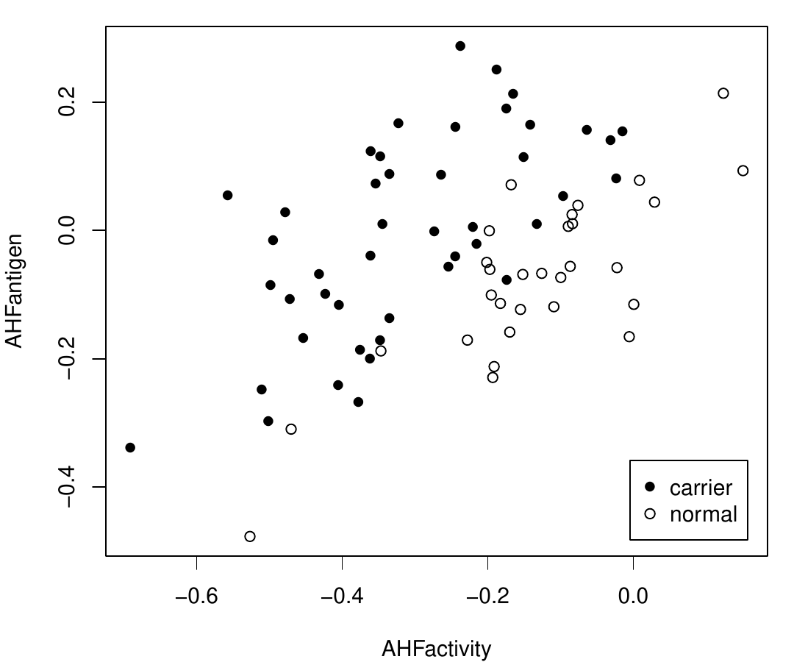</td>
<td style="text-align: center;">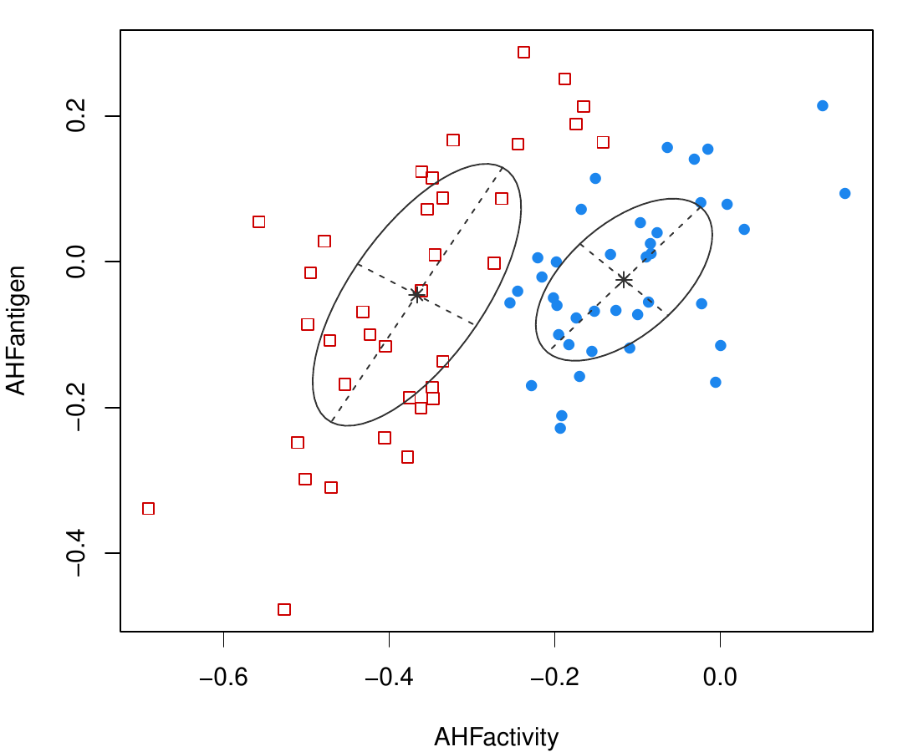</td>
</tr>
<tr class="even">
<td style="text-align: center;">(a)</td>
<td style="text-align: center;">(b)</td>
</tr>
</tbody>
</table>
<figcaption>Figure 8: True class membership (a) and estimated
classification using GMM (b) for the <code>hemophilia</code>
dataset.</figcaption>
</figure>

Bootstrap inference for GMMs is available through the function
`MclustBootstrap()`, which requires the user to input an object returned
by a call to `Mclust()`. Optionally, the user can also provide the
number of bootstrap resamples `nboot` and the `type` of bootstrap to
perform. By default, `nboot = 999` and `type = "bs"` for the
nonparametric bootstrap. Thus, a simple call for computing the bootstrap
distribution of the GMM parameters is the following:

``` r
> boot <- MclustBootstrap(mod, nboot = 999, type = "bs")
```

Note that for the sake of clarity we have included the arguments `nboot`
and `type`, but they can be omitted since they are set at their
defaults.

The function `MclustBootstrap()` returns an object which can be plotted
or summarised. For instance, to graph the bootstrap distribution for the
mixing proportions and for the component means we may use the code:

``` r
> par(mfrow = c(1,2))
> plot(boot, what = "pro")
> par(mfrow = c(2,2))
> plot(boot, what = "mean")
> par(mfrow = c(1,1))
```

The resulting plots are shown, respectively, in
Figures [9](#fig2:hemophilia) and [10](#fig3:hemophilia).

{#fig2:hemophilia
width="100%" style="text-align: center"  alt="graphic without alt text"}

{#fig3:hemophilia
width="100%" style="text-align: center"  alt="graphic without alt text"}

A numerical summary of the bootstrap procedure is available through the
`summary` method, which by default returns the standard errors of GMM
parameters:

``` r
> summary(boot, what = "se")
----------------------------------------------------------
Resampling standard errors 
----------------------------------------------------------
Model                      = VVV 
Num. of mixture components = 2 
Replications               = 999 
Type                       = nonparametric bootstrap 

Mixing probabilities:
        1         2 
0.1249357 0.1249357 

Means:
                     1          2
AHFactivity 0.04028375 0.04137370
AHFantigen  0.03262182 0.06456482

Variances:
[,,1]
            AHFactivity  AHFantigen
AHFactivity 0.007018580 0.004690481
AHFantigen  0.004690481 0.003155312
[,,2]
            AHFactivity  AHFantigen
AHFactivity 0.005757398 0.005897374
AHFantigen  0.005897374 0.009654623
```

The `summary` method can also return bootstrap percentile confidence
intervals. For the generic GMM parameter $\psi$ of $\mathbf{\Psi}$, the
percentile method yields the intervals
$[\psi^*_{\alpha/2}, \psi^*_{1-\alpha/2}]$, where $\psi^*_q$ is the
$q$th quantile (or the 100$q$th percentile) of the bootstrap
distribution $(\widehat{\psi}^*_1, \ldots, \widehat{\psi}^*_B)$. These
can be obtained by specifying in the `summary` call the argument
`what = "ci"` and, optionally, the confidence level of the intervals (by
default, `conf.level = 0.95`). For instance:

``` r
> summary(boot, what = "ci")
----------------------------------------------------------
Resampling confidence intervals 
----------------------------------------------------------
Model                      = VVV 
Num. of mixture components = 2 
Replications               = 999 
Type                       = nonparametric bootstrap 
Confidence level           = 0.95 

Mixing probabilities:
              1         2
2.5%  0.3193742 0.1785054
97.5% 0.8214946 0.6806258

Means:
[,,1]
      AHFactivity  AHFantigen
2.5%  -0.22915526 -0.09784996
97.5% -0.07315876  0.02481681
[,,2]
      AHFactivity AHFantigen
2.5%   -0.4573113 -0.1571624
97.5%  -0.2747451  0.1318332

Variances:
[,,1]
      AHFactivity  AHFantigen
2.5%  0.004743597 0.007012672
97.5% 0.032144767 0.019245540
[,,2]
      AHFactivity  AHFantigen
2.5%  0.003981163 0.006049076
97.5% 0.027297495 0.045854646
```

The function `MclustBootstrap()` has also the provision for using the
weighted likelihood bootstrap [@Newton:Raftery:1994]. This is a
generalisation of the nonparametric bootstrap which assigns random
(positive) weights to sample observations; it can be viewed as a
generalized Bayesian bootstrap. The weights are obtained from a uniform
Dirichlet distribution, i.e. by sampling from $n$ independent standard
exponential distributions and then rescaling by their average. Then, the
function `me.weighted()` in *mclust* allows one to apply a weighted EM
algorithm. This approach may yield benefits when one or more components
have small mixture proportions. In that case, a nonparametric bootstrap
sample may have no representatives of them, but the weighted likelihood
bootstrap will always have representatives of all groups.

In our data example the weighted likelihood bootstrap can be easily
obtained by specifying `type = "wlbs"` in the `MclustBootstrap()`
function call:

``` r
> wlboot <- MclustBootstrap(mod, nboot = 999, type = "wlbs")
> summary(wlboot, what = "se")
----------------------------------------------------------
Resampling standard errors 
----------------------------------------------------------
Model                      = VVV 
Num. of mixture components = 2 
Replications               = 999 
Type                       = weighted likelihood bootstrap 

Mixing probabilities:
        1         2 
0.1323612 0.1323612 

Means:
                     1          2
AHFactivity 0.03977347 0.04192182
AHFantigen  0.02989056 0.06897928

Variances:
[,,1]
            AHFactivity  AHFantigen
AHFactivity 0.007074450 0.004686432
AHFantigen  0.004686432 0.003254011
[,,2]
            AHFactivity  AHFantigen
AHFactivity 0.005511614 0.005746981
AHFantigen  0.005746981 0.009883791
```

In this case the differences between the nonparametric and the weighted
likelihood bootstrap are negligible. We can summarise the inference for
the components means obtained under the two approaches with the
following graphs of bootstrap percentile confidence intervals:

``` r
> boot.ci <- summary(boot, what = "ci")
> wlboot.ci <- summary(wlboot, what = "ci")
> par(mfrow = c(1,2), mar = c(4,4,1,1))
> for(j in 1:mod$G)
     { plot(1:mod$G, mod$parameters$mean[j,], col = 1:mod$G, pch = 15,
           ylab = colnames(X)[j], xlab = "Mixture component",
           ylim = range(boot.ci$mean,wlboot.ci$mean), 
           xlim = c(.5,mod$G+.5), xaxt = "n")
      points(1:mod$G+0.2, mod$parameters$mean[j,], col = 1:mod$G, pch = 15)
      axis(side = 1, at = 1:mod$G)
      with(boot.ci, errorBars(1:G, mean[1,j,], mean[2,j,], col = 1:G))
      with(wlboot.ci, errorBars(1:G+0.2, mean[1,j,], mean[2,j,], col = 1:G, lty = 2))
  }
> par(mfrow = c(1,1))
```

{#fig4:hemophilia width="100%"
style="text-align: center"  alt="graphic without alt text"}

# Initialisation of the EM algorithm

The EM algorithm is an easy to implement and numerically stable
algorithm which has reliable global convergence under fairly general
conditions. However, the likelihood surface in mixture models tends to
have multiple modes and thus initialisation of EM is crucial because it
usually produces sensible results when started from reasonable starting
values [@Wu:1983].

In *mclust* the EM algorithm is initialised using the partitions
obtained from model-based hierarchical agglomerative clustering (MBHAC).
In this approach, hierarchical clusters are obtained by recursively
merging the two clusters that provide the smallest decrease in the
classification likelihood for Gaussian mixture model
[@Banfield:Raftery:1993]. Efficient numerical algorithms have been
discussed by @Fraley:1998. Using MBHAC is particularly convenient
because the underlying probabilistic model is shared by both the
initialisation step and the model fitting step. Furthermore, MBHAC is
also computationally advantageous because a single run provides the
basis for initialising the EM algorithm for any number of mixture
components and component-covariances parameterisations. Although there
is no guarantee that the EM initialized by MBHAC will converge to the
global optimum, it often provides reasonable starting points.

A problem with the MBHAC approach may arise in the presence of coarse
data, resulting from the discrete nature of the data or from continuous
data that are rounded when measured. In this case, ties must be broken
by choosing the pair of entities that will be merged. This is often done
at random, but regardless of which method is adopted for breaking ties,
this choice can have important consequences because it changes the
clustering of the remaining observations. Moreover, the final EM
solution may depend on the ordering of the variables.

Consider the Flea beetles data available in package *tourr*. This
dataset provides six physical measurements for a sample of 72 flea
beetles from three species:

``` r
> data(flea, package = "tourr")
> X <- data.matrix(flea[,1:6])
> Class <- factor(flea$species, labels = c("Concinna","Heikertingeri","Heptapotamica")) 
> table(Class)
Class
     Concinna Heikertingeri Heptapotamica 
           21            31            22 
> col <- mclust.options("classPlotColors")[1:3]
> clp <- clPairs(X, Class, lower.panel = NULL, gap = 0,
                 symbols = c(16,15,17), colors = adjustcolor(col, alpha.f = 0.5))
> clPairsLegend(x = 0.1, y = 0.3, class = clp$class, col = col, pch = clp$pch,
              title = "Flea beatle species")
```

As can be seen from Figure [12](#fig1:flea), the observed values are
rounded (to the nearest integer presumably) and there is a strong
overplotting of points.

{#fig1:flea
width="100%" style="text-align: center"  alt="graphic without alt text"}

``` r
> mod1 <- Mclust(X)
> summary(mod1)
----------------------------------------------------
Gaussian finite mixture model fitted by EM algorithm 
----------------------------------------------------

Mclust EEE (ellipsoidal, equal volume, shape and orientation) model with 5 components:

 log.likelihood  n df       BIC       ICL
      -1292.308 74 55 -2821.339 -2825.769

Clustering table:
 1  2  3  4  5 
21  2 20 20 11 
> adjustedRandIndex(Class, mod1$classification)
[1] 0.7675713
```

``` r
> mod2 <- Mclust(X[,6:1])
> summary(mod2)
----------------------------------------------------
Gaussian finite mixture model fitted by EM algorithm 
----------------------------------------------------

Mclust EEE (ellipsoidal, equal volume, shape and orientation) model with 5 components:

 log.likelihood  n df       BIC       ICL
      -1287.027 74 55 -2810.777 -2812.702

Clustering table:
 1  2  3  4  5 
22 21 22  7  2 
> adjustedRandIndex(Class, mod2$classification)
[1] 0.8131206  
```

By reversing the order of the variables in the fit of `mod2`, the
initial partitions differ due to ties in the data, so the EM algorithm
converges to different solutions of the same EEE model with 5
components. The second solution has a higher BIC and better accuracy.

In situations like this we may want to assess the stability of results
by randomly starting the EM algorithm. The function `randomPairs()` may
be called to obtain a random hierarchical structure suitable to be used
as initial clustering partition:

``` r
> mod3 <- Mclust(X, initialization = list(hcPairs = randomPairs(X, seed = 123)))
> summary(mod3)
----------------------------------------------------
Gaussian finite mixture model fitted by EM algorithm 
----------------------------------------------------

Mclust EEE (ellipsoidal, equal volume, shape and orientation) model with 4 components:

 log.likelihood  n df       BIC       ICL
      -1298.211 74 48 -2803.017 -2807.713

Clustering table:
 1  2  3  4 
16 15 22 21 
> adjustedRandIndex(Class, mod3$classification)
[1] 0.7867056    
```

Using a random start we obtain a EEE model with 4 components, which has
a higher BIC but a lower ARI. However, a better initialisation may be
found using the approach discussed in @Scrucca:Raftery:2015. The main
idea is to project the data through a suitable transformation which
enhances separation among clusters before applying the MBHAC at the
initialisation step. Once a reasonable hierarchical partition is
obtained, the EM algorithm is run using the data on the original scale.
For instance, a GMM started using the scaled SVD transformation is
obtained with the following code:

``` r
> mod4 <- Mclust(X, initialization = list(hcPairs = hc(X, use = "SVD")))
> summary(mod4)
----------------------------------------------------
Gaussian finite mixture model fitted by EM algorithm 
----------------------------------------------------

Mclust EEE (ellipsoidal, equal volume, shape and orientation) model with 3 components:

 log.likelihood  n df       BIC       ICL
      -1304.552 74 41 -2785.572 -2785.574

Clustering table:
 1  2  3 
21 31 22 
> adjustedRandIndex(Class, mod4$classification)  
[1] 1
```

In this case we achieve both the highest BIC and a perfect
classification of the fleas into the actual species.

We conclude by noting that in the case of large datasets, i.e. having a
large number of observations or cases, a subsample of the data can be
used in the MBHAC phase before applying the EM algorithm to the full
data set. This is easily done by providing an optional argument to
`Mclust()` or `mclustBIC()` (as well as many other functions) as a
vector, say `s`, of logical values or numerical indices specifying the
subset of data to be used in the initial hierarchical clustering phase:

``` r
> Mclust(X, initialization = list(subset = s))
```

# Density estimation

Density estimation plays an important role in applied statistical data
analysis and theoretical research. Finite mixture models provide a
flexible semi-parametric model-based approach to density estimation,
which makes it possible to accurately approximate any given probability
distribution. *mclust* provides a simple interface to Gaussian mixture
models for univariate and multivariate density estimation.

@Izenman:Sommer:1988 considered the fitting of a Gaussian mixture to the
distribution of the thickness of stamps in the 1872 Hidalgo stamp issue
of Mexico [^2]. A density estimate based on GMM can be obtained using
the function `densityMclust()`:

``` r
> data(Hidalgo1872, package = "MMST")
> Thickness <- Hidalgo1872$thickness
> Year <- rep(c("1872", "1873-74"), c(289, 196))
> dens <- densityMclust(Thickness)
> summary(dens$BIC)
Best BIC values:
              V,3         V,5        V,4
BIC      2983.791 2974.939223 2972.19349
BIC diff    0.000   -8.852019  -11.59775
> summary(dens, parameters = TRUE)
-------------------------------------------------------
Density estimation via Gaussian finite mixture modeling 
-------------------------------------------------------

Mclust V (univariate, unequal variance) model with 3 components:

 log.likelihood   n df      BIC      ICL
       1516.632 485  8 2983.791 2890.914

Clustering table:
  1   2   3 
128 171 186 

Mixing probabilities:
        1         2         3 
0.2661410 0.3011217 0.4327374 

Means:
         1          2          3 
0.07215458 0.07935341 0.09919740 

Variances:
             1              2              3 
0.000004814927 0.000003097694 0.000188461484 
```

The model selected is a three-component mixture with different
variances. A graph of the density estimated is shown in
Figure[13](#fig1:stamp)a and is obtained with the code:

``` r
> br <- seq(min(Thickness), max(Thickness), length = 21)
> plot(dens, what = "density", data = Thickness, breaks = br)
```

Here a histogram of the observed data is also drawn by providing the
optional argument `data` and with breakpoints between histogram cells
specified in the argument `breaks`. From the graph, three modes appear
at the means of the mixture components: one with larger stamp thickness,
and two corresponding to thinner stamps.

Additional information can also be used. In particular, thickness
measurements can be grouped according to the year of consignment; the
first 289 stamps refer to the 1872 issue, and the remaining 196 stamps
to the years 1873--1874. We may draw a (suitable scaled) histogram for
each year-of-consignment and then add the estimated components densities
as follows:

``` r
> h1 <- hist(Thickness[Year == "1872"], breaks = br, plot = FALSE)
> h1$density <- h1$density*prop.table(table(Year))[1]
> h2 <- hist(Thickness[Year == "1873-74"], breaks = br, plot = FALSE)
> h2$density <- h2$density*prop.table(table(Year))[2]
> x <- seq(min(Thickness)-diff(range(Thickness))/10, 
           max(Thickness)+diff(range(Thickness))/10, length = 200)
> cdens <- predict(dens, x, what = "cdens")
> cdens <- t(apply(cdens, 1, function(d) d*dens$parameters$pro))
> col <- adjustcolor(mclust.options("classPlotColors")[1:2], alpha = 0.3)
> plot(h1, xlab = "Thickness", freq = FALSE, main = "", border = FALSE, col = col[1],
       xlim = range(x), ylim = range(h1$density, h2$density, cdens))
> plot(h2, add = TRUE, freq = FALSE, border = FALSE, col = col[2])
> matplot(x, cdens, type = "l", lwd = 1, add = TRUE, lty = 1:3, col = 1)
> box()
```

The result is shown in Figure [13](#fig1:stamp)b. Stamps from 1872 show
a two-regime distribution, with one corresponding to the component with
the largest thickness, and one whose distribution essentially overlaps
with the bimodal distribution of stamps for the years 1873--1874.

<figure id="fig1:stamp">
<table>
<caption> </caption>
<tbody>
<tr class="odd">
<td style="text-align: center;">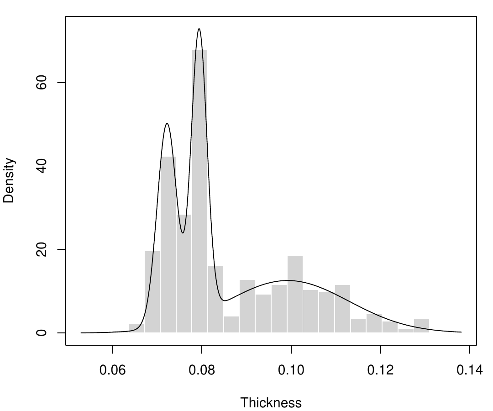</td>
<td style="text-align: center;">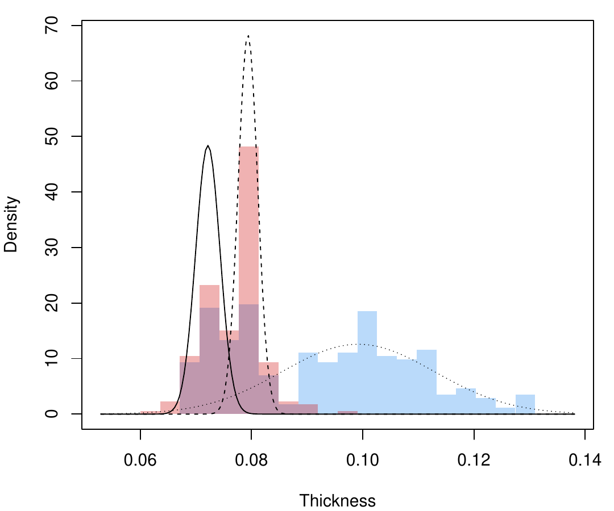</td>
</tr>
<tr class="even">
<td style="text-align: center;">(a)</td>
<td style="text-align: center;">(b)</td>
</tr>
</tbody>
</table>
<figcaption>Figure 13: (a) Histogram with mixture-based density estimate
curve, and (b) histograms by group-year with estimated mixture-component
densities, for the <code>Hidalgo1872</code> stamps dataset.</figcaption>
</figure>

As an example of bivariate density estimation, consider the well-known
'Old Faithful' data set which provides the waiting time between
eruptions (`waiting`) and the duration of the eruptions (`eruptions`)
for the Old Faithful geyser in Yellowstone National Park, Wyoming, USA.
The dataset can be read and data plotted as follows:

``` r
> data(faithful)
> plot(faithful, cex = 0.5)
```

A bivariate density estimate for the Faithful data is obtained with the
commands:

``` r
> dens <- densityMclust(faithful)
> summary(dens)
-------------------------------------------------------
Density estimation via Gaussian finite mixture modeling 
-------------------------------------------------------

Mclust EEE (ellipsoidal, equal volume, shape and orientation) model with 3 components:

 log.likelihood   n df       BIC       ICL
      -1126.361 272 11 -2314.386 -2360.865

Clustering table:
  1   2   3 
130  97  45 
```

Model selection based on the BIC selects a three-component mixture with
common covariance matrix (EEE). One component is used to model the group
of observations having both low duration and low waiting times, whereas
two components are needed to approximate the skewed distribution of the
observations with larger duration and waiting times.

Figure [14](#fig1-4:faithful)b-d shows some of the available graphs in
*mclust* for a bivariate density estimated by GMM. These can be obtained
with the commands:

``` r
> plot(dens, what = "density", data = faithful, grid = 200, points.cex = 0.5, 
       drawlabels = FALSE)
> plot(dens, what = "density", type = "image", col = "steelblue", grid = 200)
> plot(dens, what = "density", type = "persp", theta = -25, phi = 20,
       border = adjustcolor(grey(0.1), alpha.f = 0.3))
```

<figure id="fig1-4:faithful">
<table>
<caption> </caption>
<tbody>
<tr class="odd">
<td style="text-align: center;">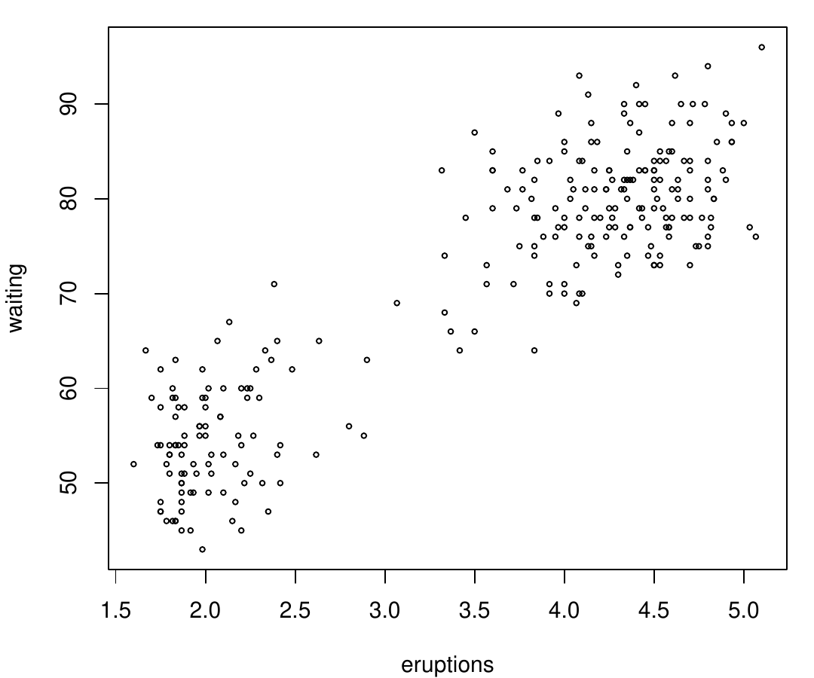</td>
<td style="text-align: center;">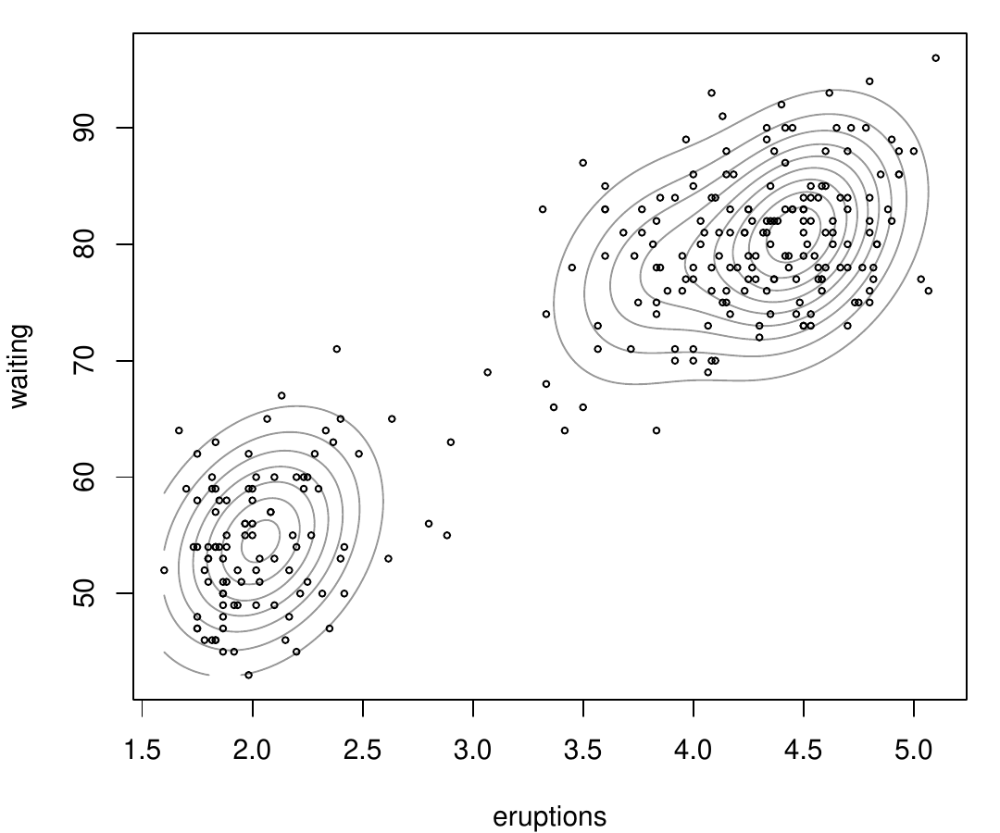</td>
</tr>
<tr class="even">
<td style="text-align: center;">(a)</td>
<td style="text-align: center;">(b)</td>
</tr>
<tr class="odd">
<td style="text-align: center;">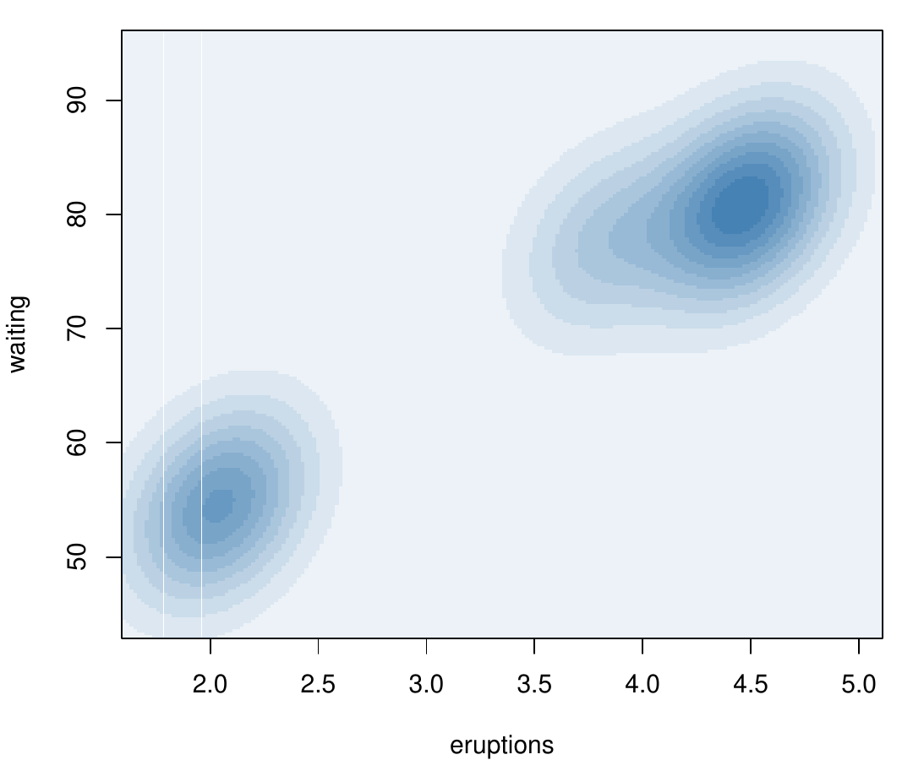</td>
<td style="text-align: center;">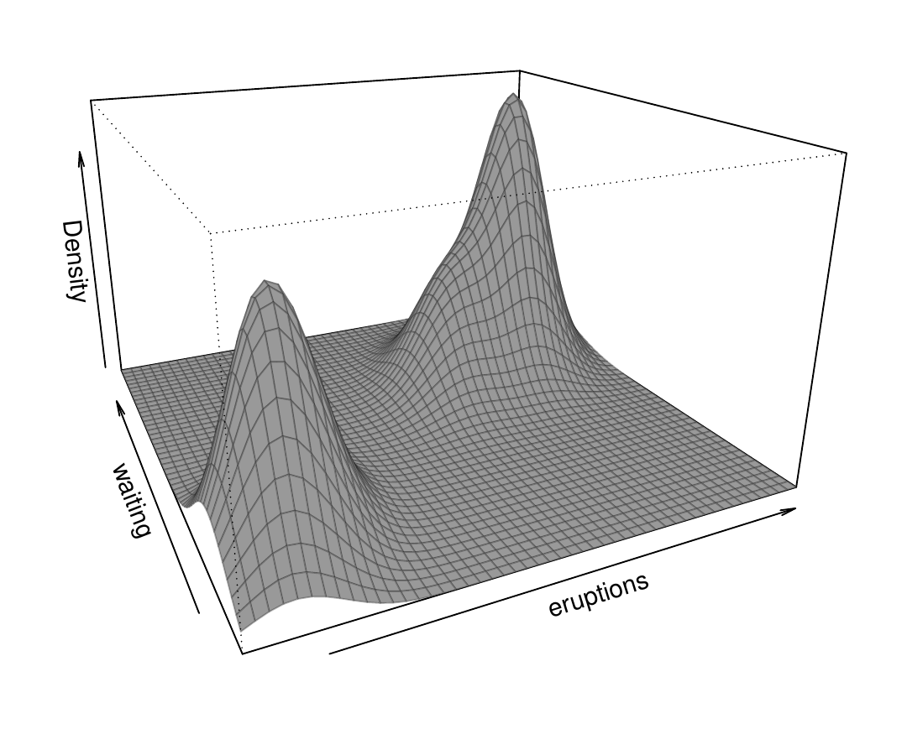</td>
</tr>
<tr class="even">
<td style="text-align: center;">(c)</td>
<td style="text-align: center;">(d)</td>
</tr>
</tbody>
</table>
<figcaption>Figure 14: Plot of the Old Faithful data (a), mixture-based
density estimate contours (b), image plot of density estimate (c) and
perspective plot of the bivariate density estimate (d).</figcaption>
</figure>

Note that the same procedure using the function `mclustDensity()` can
also be used to obtain density estimates for higher dimensional
datasets.

# Supervised classification

In supervised classification or discriminant analysis the aim is to
build a classifier (or a decision rule) which is able to assign an
observation with an unknown class membership to one of $K$ known
classes. For building a supervised classifier, a training dataset
$\{(\mathbf{x}_1, y_1), \ldots, (\mathbf{x}_n, y_n)\}$ is used for which
both the features $\mathbf{x}_i$ and true classes
$y_i \in \{C_1, \ldots, C_K\}$ are known.

Mixture-based discriminant analysis models assume that the density for
each class follows a Gaussian mixture distribution
$$f_k(\mathbf{x}) = \sum_{g=1}^{G_k} \pi_{gk} \phi(\mathbf{x}; \mathbf{\mu}_{gk}, \mathbf{\Sigma}_{gk}),$$
where $\pi_{gk}$ are the mixing probabilities for class $k$
($\pi_{gk} > 0$, $\sum_{g=1}^{G_k}\pi_{gk}=1$), $\mathbf{\mu}_{gk}$ the
means for component $g$ within class $k$, and $\mathbf{\Sigma}_{gk}$ the
covariance matrix of component $g$ within class $k$.
@Hastie:Tibshirani:1996 proposed Mixture Discriminant Analysis (MDA)
where it is assumed that the covariance matrix is the same for all the
classes but is otherwise unconstrained,
i.e. $\mathbf{\Sigma}_{gk} = \mathbf{\Sigma}$ for all $g$ and $k$. The
number of mixture components is assumed known for each class.

@Bensmail:Celeux:1996 proposed the Eigenvalue Decomposition Discriminant
Analysis (EDDA) which assumes that the density for each class can be
described by a single Gaussian component (i.e. $G_k=1$ for all $k$) with
the component covariance structure factorised as
$$\mathbf{\Sigma}_{k} = \lambda_k\mathbf{D}_k\mathbf{A}_k\mathbf{D}{}^{\!\top}_k.$$
Several models can be obtained from the above decomposition. If
$\mathbf{\Sigma}_{k} = \lambda\mathbf{D}\mathbf{A}\mathbf{D}{}^{\!\top}$
(model EEE), then EDDA is equivalent to linear discriminant analysis
(LDA). If
$\mathbf{\Sigma}_{k} = \lambda_k\mathbf{D}_k\mathbf{A}_k\mathbf{D}{}^{\!\top}_k$
(model VVV) then EDDA is equivalent to quadratic discriminant analysis
(QDA).

Consider the UCI Wisconsin breast cancer diagnostic data available at
<http://archive.ics.uci.edu/ml/datasets/Breast+Cancer+Wisconsin+(Diagnostic)>.
This dataset provides data for 569 patients on 30 features of the cell
nuclei obtained from a digitized image of a fine needle aspirate (FNA)
of a breast mass [@Mangasarian:etal:1995]. For each patient the cancer
was diagnosed as malignant or benign. Following @Fraley:Raftery:2002 we
considered only three attributes: extreme area, extreme smoothness, and
mean texture. The dataset can be downloaded from the UCI repository
using the following commands:

``` r
> data <- read.csv("http://archive.ics.uci.edu/ml/machine-learning-databases/breast-
cancer-wisconsin/wdbc.data", header = FALSE)
> X <- data[,c(4, 26, 27)]
> colnames(X) <- c("texture.mean", "area.extreme", "smoothness.extreme")
> Class <- data[,2]
```

Then, we may randomly assign approximately $2/3$ of the observations to
the training set, and the remaining ones to the test set:

``` r
> set.seed(123)
> train <- sample(1:nrow(X), size = round(nrow(X)*2/3), replace = FALSE)
> X.train <- X[train,]
> Class.train <- Class[train]
> table(Class.train)
Class.train
  B   M 
238 141 
> X.test <- X[-train,]
> Class.test <- Class[-train]
> table(Class.test)
Class.test
  B   M 
119  7 1
```

The function `MclustDA()` provides fitting capabilities for the EDDA
model, but we must specify the optional argument `modelType = "EDDA"`.
The function call is thus the following:

``` r
> mod1 <- MclustDA(X.train, Class.train, modelType = "EDDA")
> summary(mod1, newdata = X.test, newclass = Class.test)
------------------------------------------------
Gaussian finite mixture model for classification 
------------------------------------------------

EDDA model summary:

 log.likelihood   n df       BIC
      -2989.967 379 12 -6051.185
       
Classes   n Model G
      B 238   VVI 1
      M 141   VVI 1

Training classification summary:

     Predicted
Class   B   M
    B 237   1
    M  19 122

Training error = 0.05277045 

Test classification summary:

     Predicted
Class   B   M
    B 116   3
    M   5  66

Test error = 0.04210526
```

The EDDA mixture model selected by BIC is the VVI model, so each group
is described by a single Gaussian component with varying volume and
shape, but same orientation aligned with the coordinate axes. Note that
in the `summary()` function call we also provided the features and the
known classes for the test set, so both the training error and the test
error are reported. A cross-validation error can also be computed using
the `cvMclustDA()` function, which by default use `nfold = 10` for a
10-fold cross-validation:

``` r
> cv <- cvMclustDA(mod1)
> unlist(cv[c("error", "se")])
      error          se 
0.052770449 0.007930516 
```

EDDA imposes a single mixture component for each group. However, in
certain circumstances more complexity may improve performance. A more
general approach, called *MclustDA*, has been proposed by
@Fraley:Raftery:2002, where a finite mixture of Gaussian distributions
is used within each class, with number of components and covariance
matrix structures (expressed following the usual decomposition) being
different between classes. This is the default model fitted by
`MclustDA`:

``` r
> mod2 <- MclustDA(X.train, Class.train)
> summary(mod2, newdata = X.test, newclass = Class.test)
------------------------------------------------
Gaussian finite mixture model for classification 
------------------------------------------------

MclustDA model summary:

 log.likelihood   n df       BIC
      -2937.586 379 29 -6047.361
       
Classes   n Model G
      B 238   EEV 2
      M 141   VVI 2

Training classification summary:

     Predicted
Class   B   M
    B 236   2
    M   7 134

Training error = 0.0237467 

Test classification summary:

     Predicted
Class   B   M
    B 114   5
    M   2  69

Test error = 0.03684211
```

A two-component mixture distribution is fitted to both the benign and
malignant observations, but with different covariance structures within
each class. Both the training error and the test error are slightly
smaller than for EDDA, a fact also confirmed by the 10-fold
cross-validation procedure:

``` r
> cv <- cvMclustDA(mod2)
> unlist(cv[c("error", "se")])
      error          se 
0.021108179 0.007648168 
```

A plot method which produces a variety of graphs is associated with
objects returned by `MclustDA`. For instance, pairwise scatterplots
between the features, showing both the known classes and the estimated
mixture components, are drawn as follows (see
Figure [15](#fig1-4:wdbc)a--c):

``` r
> plot(mod2, what = "scatterplot", dimens = c(1,2))
> plot(mod2, what = "scatterplot", dimens = c(2,3))
> plot(mod2, what = "scatterplot", dimens = c(3,1))
```

Another interesting graph can be obtained by projecting the data on a
dimension reduced subspace [@Scrucca:2014] with the commands:

``` r
> drmod2 <- MclustDR(mod2)
> summary(drmod2)
-----------------------------------------------------------------
Dimension reduction for model-based clustering and classification 
-----------------------------------------------------------------

Mixture model type: MclustDA 
       
Classes   n Model G
      B 238   EEV 2
      M 141   VVI 2

Estimated basis vectors:
                          Dir1         Dir2          Dir3
texture.mean       -0.00935540 -0.044384467 -0.0006607120
area.extreme        0.00049997  0.000071676 -0.0000088494
smoothness.extreme  0.99995611 -0.999014521  0.9999997817

                Dir1     Dir2       Dir3
Eigenvalues  0.67718  0.28159   0.013928
Cum. %      69.61869 98.56810 100.000000
> plot(drmod2, what = "boundaries", ngrid = 200)
```

The graph produced by the last command is shown in
Figure [15](#fig1-4:wdbc)d. The two groups are largely separated along
the first direction, with the group of malignant cases showing a higher
variability.

<figure id="fig1-4:wdbc">
<table>
<caption> </caption>
<tbody>
<tr class="odd">
<td style="text-align: center;">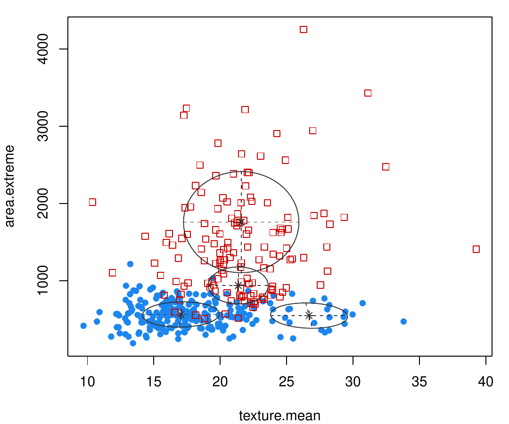</td>
<td style="text-align: center;">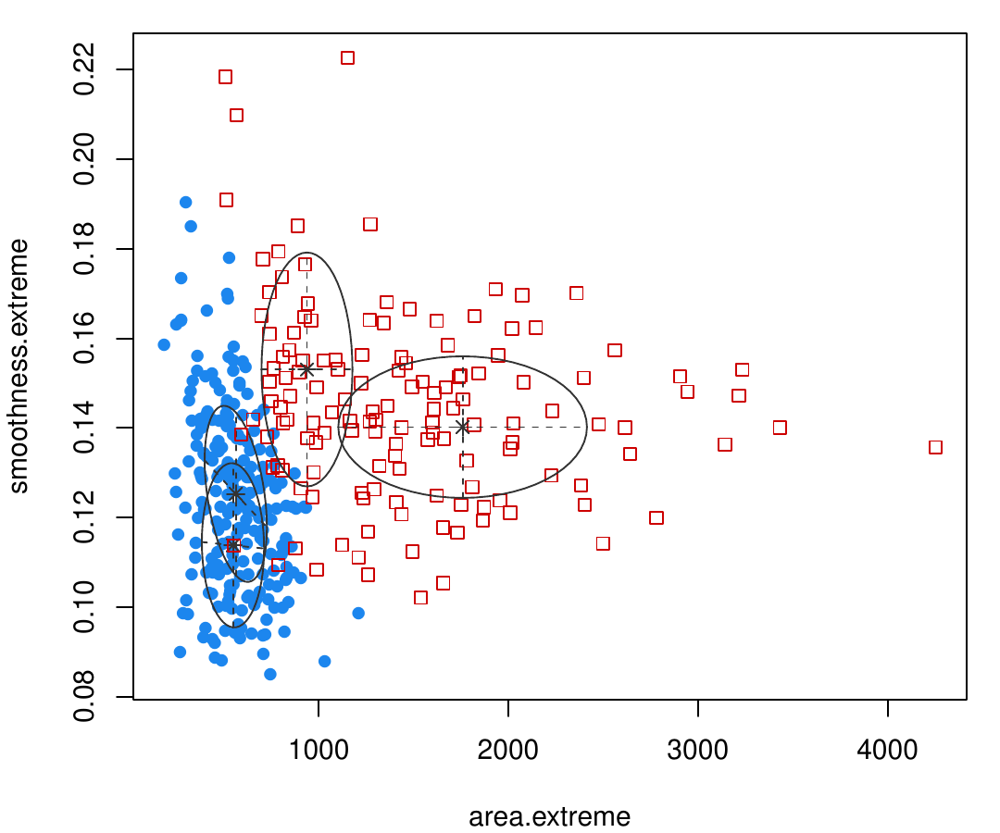</td>
</tr>
<tr class="even">
<td style="text-align: center;">(a)</td>
<td style="text-align: center;">(b)</td>
</tr>
<tr class="odd">
<td style="text-align: center;">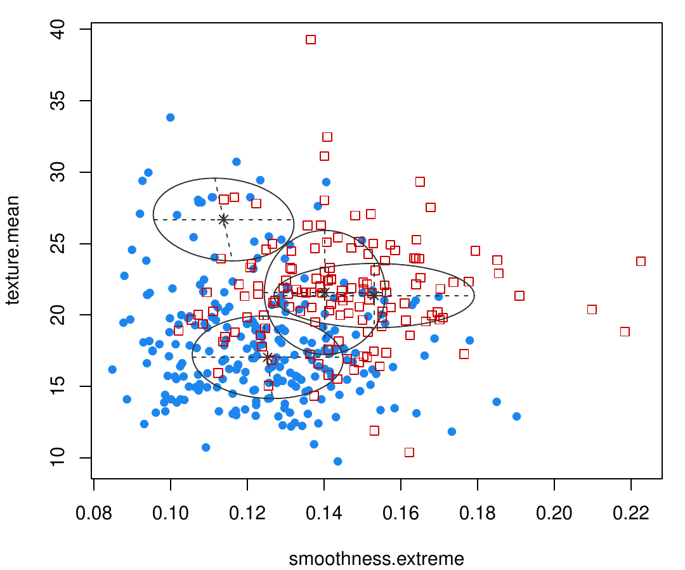</td>
<td style="text-align: center;">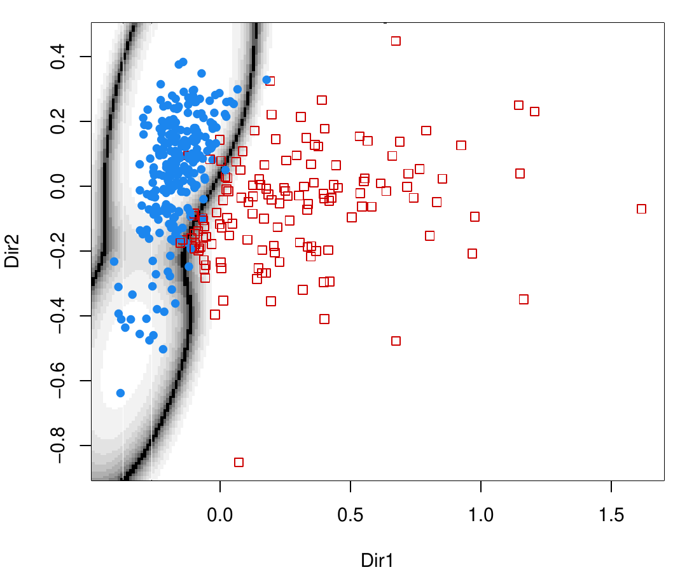</td>
</tr>
<tr class="even">
<td style="text-align: center;">(c)</td>
<td style="text-align: center;">(d)</td>
</tr>
</tbody>
</table>
<figcaption>Figure 15: Pairwise scatterplots between variables for the
Wisconsin breast cancer data (panels a–c). Points are marked by cancer
diagnosis (benign = <span style="color: dodgerblue2"><span
class="math inline">•</span></span>, malignant = <span
style="color: red3"><span class="math inline">▫</span></span>), whereas
ellipses correspond to covariances of mixture components estimated with
<code>MclustDA</code>. Plot of data projected along the first two
estimated directions obtained with <code>MclustDR</code>, and
uncertainty classification boundaries (d).</figcaption>
</figure>

Finally, note that the MDA model is equivalent to MclustDA with
$\mathbf{\Sigma}_{k} = \lambda\mathbf{D}\mathbf{A}\mathbf{D}{}^{\!\top}$
(model EEE) and fixed $G_k \ge 1$ for each $k=1,\ldots,K$. For instance,
a MDA with two mixture components for each class can be fitted as:

``` r
> mod3 <- MclustDA(X.train, Class.train, G = 2, modelNames = "EEE")
> summary(mod3, newdata = X.test, newclass = Class.test)
------------------------------------------------
Gaussian finite mixture model for classification 
------------------------------------------------

MclustDA model summary:

 log.likelihood   n df       BIC
      -2968.077 379 26 -6090.531
       
Classes   n Model G
      B 238   EEE 2
      M 141   EEE 2

Training classification summary:

     Predicted
Class   B   M
    B 235   3
    M  12 129

Training error = 0.03957784 

Test classification summary:

     Predicted
Class   B   M
    B 113   6
    M   2  69

Test error = 0.04210526 
```

# Summary

*mclust* is one of the most popular R packages for Gaussian mixture
modelling. Since its early developments
[@Banfield:Raftery:1993; @Fraley:Raftery:1998; @Fraley:Raftery:1999],
*mclust* has seen major updates through the years, which expanded its
capabilities and features, increasing its popularity and widening its
area of utilisation.

Here we have presented the most salient new features introduced in
version $\ge 5$, namely new covariance parameterisations, subspace data
visualisation, different model selection criteria, bootstrap-based
inference and EM algorithm initialisation. We showed their application
on a collection of different datasets, pointing out their utility in
different contexts.

# Acknowledgments

Michael Fop and T. Brendan Murphy were supported by the Science
Foundation Ireland funded Insight Research Centre (SFI/12/RC/2289).
Adrian E. Raftery and Luca Scrucca were supported by NIH grants R01
HD054511, R01 HD070936 and U54 HL127624.
:::

[^1]: See <http://piccolboni.info/2012/05/essential-r-packages.html>.

[^2]: The Hidalgo stamp data is available at the home page for the book
    by @Izenman:2008 at
    <http://astro.temple.edu/~alan/MMST/datasets.html>, or through the
    package *MMST*. The latter has been archived on CRAN, so it must be
    installed using the following code:\
    `> install.packages("http://cran.r-project.org/src/contrib/Archive/MMST/MMST_0.6-1.1.tar.gz", repos = NULL, type = "source")`
