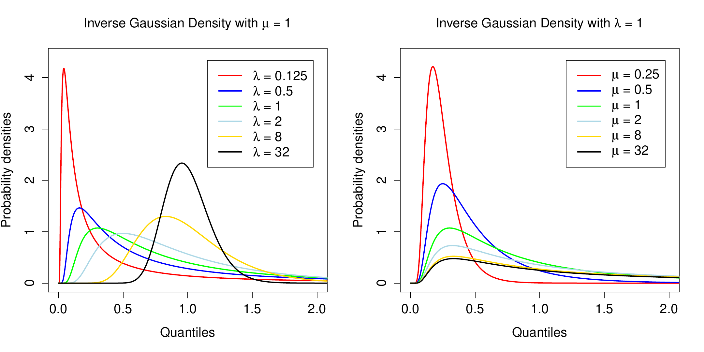

::: article
# Introduction

The inverse Gaussian distribution (IGD)
[@tweedie1957inversegaussian; @johnson1970continuous] is widely used in
a variety of application areas including reliability and survival
analysis
[@whitmore1975inversegauss; @chhikara1977invgausslifetime; @bardsley1980inversegauss; @chhikara1989inversegauss; @wang2010inverse; @balakrishna2014inverse].
It is more generally used for modeling non-negative positively skewed
data because of its connections to exponential families and generalized
linear models
[@seshadri1993inversegauss; @blough1999modeling; @smyth1999adjusted; @dejong2008glms].

Basic probability functions for the IGD have been implemented previously
in James Lindsey's R package *rmutil* [@rmutil] and in the CRAN packages
[*SuppDists*](https://CRAN.R-project.org/package=SuppDists) [@SuppDists]
and [*STAR*](https://CRAN.R-project.org/package=STAR) [@STAR]. We have
found however that none of these IGD functions work for all parameter
values or return results to full machine accuracy. Bob Wheeler remarks
in the *SuppDists* documentation that the IGD "is an extremely difficult
distribution to treat numerically". The *rmutil* package was removed
from CRAN in 1999 but is still available from Lindsey's webpage.
*SuppDists* was orphaned in 2013 but is still available from CRAN. The
*SuppDists* code is mostly implemented in C while the other packages are
pure R as far as the IGD functions are concerned.

The probability density of the IGD has a simple closed form expression
and so is easy to compute. Care is still required though to handle
infinite parameter values that correspond to valid limiting cases. The
cumulative distribution function (cdf) is also available in closed form
via an indirect relationship with the normal distribution
[@shuster1968inverse; @chhikara1974estimation]. Considerable care is
nevertheless required to compute probabilities accurately on the
log-scale, because the formula involves a sum of two normal
probabilities on the un-logged scale. Random variates from IGDs can be
generated using a combination of chisquare and binomial random variables
[@michael1976generating]. Most difficult is the inverse cdf or quantile
function, which must be computed by some iterative numerical
approximation.

Two strategies have been used to compute IGD quantiles. One is to solve
for the quantile using a general-purpose equation solver such as the
`uniroot` function in R. This is the approach taken by the `qinvgauss`
functions in the *rmutil* and *STAR* packages. This approach can usually
be relied on to converge satisfactorily but is computationally slow and
provides only limited precision. The other approach is to use Newton's
method to solve the equation after applying an initial approximation
[@kallioras2014percentile]. This approach was taken by one of the
current authors when developing inverse Gaussian code for S-PLUS
[@smyth1998invgauss]. It is also the approach taken by the `qinvGauss`
function in the *SuppDists* package. This approach is fast and accurate
when it works but can fail unpredictably when the Newton iteration
diverges. Newton's method cannot in general be guaranteed to converge,
even when the initial approximation is close to the required value, and
the parameter values for which divergence occurs are hard to predict.

We have resolved the above difficulties by developing a Newton iteration
for the IGD quantiles that has guaranteed convergence. Instead of
attempting to find a starting value that is close to the required
solution, we instead use the convexity properties of the cdf function to
approach the required quantiles in a predictable fashion. We show that
Newton's method for finding the quantiles of an IGD always converges
when started from the mode of the distribution. Furthermore the
convergence is monotonic, so that backtracking is eliminated. Newton's
method is eventually quadratically convergent, meaning that the number
of decimal places corrected determined tends to double with each
iteration [@press1992numericalrecipes]. Although the starting value may
be far from the required solution, the rapid convergence means the
starting value is quickly left behind. Convergence tends to be rapid
even when the required quantile in the extreme tails of the
distribution.

The above methods have been implemented in the `dinvgauss`, `pinvgauss`,
`qinvgauss` and `rinvgauss` functions of the
[*statmod*](https://CRAN.R-project.org/package=statmod) package
[@statmod]. The functions give close to machine accuracy for all
possible parameter values. They obey similar conventions to the
probability functions provided in the *stats* package. Tests show that
the functions are faster, more accurate and more reliable than existing
functions for the IGD. Every effort has to made to ensure that the
functions return results for the widest possible range of parameter
values.

# Density function {#sec:density}

The inverse Gaussian distribution, denoted IG($\mu$,$\phi$), has
probability density function (pdf)
$$\label{pdf}
d(x;\mu,\phi)=\left(2\pi\phi x^3\right)^{-1/2} \exp\left\{-\frac{(x-\mu)^2}{2\phi\mu^2 x}\right\}   (\#eq:pdf)$$
for $x>0$, $\mu>0$ and $\phi>0$. The mean of the distribution is $\mu$
and the variance is $\phi\mu^3$. In generalized linear model theory
[@mccullagh1989glms; @smyth1999adjusted], $\phi$ is called the
dispersion parameter. Another popular parametrization of the IGD uses
$\lambda=1/\phi$, which we call the shape parameter. For best accuracy,
we compute $d(x;\mu,\phi)$ on the log-scale and then exponentiate if an
unlogged value is required.

Note that the mean $\mu$ can be viewed as a scaling parameter: if $X$ is
distributed as IG($\mu$,$\phi$), then $X/\mu$ is also inverse Gaussian
with mean $1$ and dispersion $\phi\mu$. The skewness of the distribution
is therefore determined by $\phi\mu$, and in fact $\phi\mu$ is the
squared coefficient of variation of the distribution.

<figure id="fig:pdf">
<div class="center">

</div>
<figcaption>Figure 1: Probability density functions of inverse Gaussian
distributions. The left panel shows densities for different <span
class="math inline"><em>λ</em></span> with <span
class="math inline"><em>μ</em> = 1</span>. The right panel shows
densities for different <span class="math inline"><em>μ</em></span> for
<span class="math inline"><em>λ</em> = 1</span>. The densities are
unimodal with mode between 0 and <span
class="math inline"><em>μ</em></span>. As <span
class="math inline"><em>μ</em>/<em>λ</em></span> increases the
distribution becomes more right skew and the mode decreases relative to
the mean. Note that <span
class="math inline"><em>λ</em> = 1/<em>ϕ</em></span>.</figcaption>
</figure>

The IGD is unimodal with mode at
$$\label{eq:mode}
m=\mu\left\{\left(1+\kappa^2\right)^{1/2}-\kappa\right\}   (\#eq:mode)$$
where $\kappa=3\phi\mu/2$ [@johnson1970continuous p. 142]. The second
factor in the mode is strictly between 0 and 1, showing that the mode is
strictly between 0 and $\mu$. Figure [1](#fig:pdf) shows the pdf of the
IGD for various choices of $\mu$ and $\lambda$.

::: {#tab:specialcases}
  ----------------------------------------------------------------------------------------------------------------------------
  Description                  Parameter values                   log-pdf                      pdf                   cdf
  ------------------- ---------------------------------- -------------------------- -------------------------- ---------------
  Left limit                        $x<0$                        $-\infty$                      0                     0

  Left limit           $x=0$, $\mu>0$ and $\phi<\infty$          $-\infty$                      0                     0

  Left limit                 $x<\mu$ and $\phi=0$                $-\infty$                      0                     0

  Right limit                     $x=\infty$                     $-\infty$                      0                     1

  Right limit                $x>\mu$ and $\phi=0$                $-\infty$                      0                     1

  Right limit              $x>0$ and $\phi=\infty$               $-\infty$                      0                     1

  Spike                  $x=\mu<\infty$ and $\phi=0$              $\infty$                   $\infty$                 1

  Spike                    $x=0$ and $\phi=\infty$                $\infty$                   $\infty$                 1

  Inverse chisquare     $\mu=\infty$ and $\phi<\infty$    Eqn \@ref(eq:pdfinfmean)   Eqn \@ref(eq:pdfinfmean)   Uses `pchisq`

  Invalid                    $\mu<0$ or $\phi<0$                    `NA`                       `NA`                 `NA`
  ----------------------------------------------------------------------------------------------------------------------------

  : Table 1: Probability density function values for special cases of
  the parameter values. The pdf values for infinite parameters are
  theoretical limit values.
:::

Care needs to be taken with special cases when evaluating the pdf
(Table [1](#tab:specialcases)). When $\phi\mu$ is large, a Taylor series
expansion shows that the mode becomes dependent on $\phi$ only:
$$\label{eq:modetaylor}
m
=\mu\kappa\left\{\left(1+\kappa^{-2}\right)^{1/2}-1\right\}
=\mu\kappa\left(\frac{1}{2\kappa^2}-\frac{1}{8\kappa^4}+\frac{1}{16\kappa^6}-\cdots\right)
\approx \mu\kappa\frac{1}{2\kappa^2}
=\frac{1}{3\phi}.   (\#eq:modetaylor)$$
Under the same conditions, the peak value of the density can be seen to
converge to $\phi (2\pi/27)^{-1/2}$ $\times\exp(-3/2)$. This shows that
the distribution has a spike at 0 whenever $\phi$ is very large,
regardless of $\mu$. It is also known that
$$\label{chisq}
\frac{(X-\mu)^2}{\phi X \mu^2} \sim \chi^2_1   (\#eq:chisq)$$
[@shuster1968inverse]. Amongst other things, this implies that
$1/(X\phi) \sim \chi^2_1$ asymptotically for $\mu$ large. For infinite
$\mu$, the density becomes
$$\label{pdfinfmean}
d(x;\infty,\phi)=\left(2\pi x^3 \phi\right)^{-1/2} \exp\left(-\frac{1}{2\phi x}\right).   (\#eq:pdfinfmean)$$
The pdf is always `NA` if $x$ is `NA`. Missing values for $\phi$ lead to
`NA` values for the pdf except when $x<0$ or $x=\infty$. Missing values
for $\mu$ lead to `NA` values for the pdf except when $x<0$, $x=\infty$
or $\phi=\infty$.

Next we give some code examples. We start by loading the packages that
we will compare. Note that *statmod* is loaded last and is therefore
first in the search path.

``` r
> library(rmutil)
> library(SuppDists)
> library(STAR)
> library(statmod)
```

The *statmod* `dinvgauss` function checks for out-of-range or missing
values:

``` r
> options(digits = 3)
> dinvgauss(c(-1, 0, 1, 2, Inf, NA), mean = 1.5, dispersion = 0.7)
[1] 0.000 0.000 0.440 0.162 0.000    NA
```

Infinite mean corresponds to an inverse-chisquare case:

``` r
> dinvgauss(c(-1, 0, 1, 2, Inf, NA), mean = Inf, dispersion = 0.7)
[1] 0.000 0.000 0.233 0.118 0.000    NA
```

Infinite dispersion corresponds to a spike at 0 regardless of the mean:

``` r
> dinvgauss(c(-1, 0, 1, 2, Inf, NA), mean = NA, dispersion = Inf)
[1]   0 Inf   0   0   0  NA
```

Extreme $x$ values have zero density regardless of the mean or
dispersion:

``` r
> dinvgauss(c(-1, 0, 1, Inf), mean = NA, dispersion = NA)
[1]  0 NA NA  0
```

All the existing functions `rmutil::dinvgauss`, `SuppDist::dinvGauss`
and `STAR::dinvgauss` return errors for the above calls; they do not
tolerate `NA` values, or infinite parameter values, or $x$ values
outside the support of the distribution.

# Cumulative distribution function

Let $p(q;\mu,\phi)=P(X\le q)$ be the left tail cdf, and write
$\bar p(q;\mu,\phi)$ for the right tail probability
$P(X> q)=1-p(q;\mu,\phi)$. The formula developed by
[@shuster1968inverse] for the cdf is
$$p(q;\mu,\phi)=p_{\rm norm}((q_m-1)/r)+\exp{(2/\phi_m)} p_{\rm norm}(-(q_m+1)/r)$$
where $q_m=q/\mu$, $\phi_m=\phi\mu$, $r=(q\phi)^{1/2}$ and
$p_{\rm norm}$ is the cdf of the standard normal distribution. The right
tail probability can be written similarly:
$$\bar p(q;\mu,\phi)=\bar p_{\rm norm}((q_m-1)/r)-\exp{(2/\phi_m)} p_{\rm norm}(-(q_m+1)/r)$$
where $\bar p_{\rm norm}$ is the right tail of the standard normal. The
fact that this formula is additive on the unlogged scale poses some
numerical problems. The $p_{\rm norm}()$ evaluations are subject to
floating underflow, the $\exp()$ evaluation is subject to overflow, and
there is the danger of subtractive cancellation when computing the right
tail probability.

It is possible to derive an asymptotic expression for the right tail
probability. If $q$ is very large then:
$$\log\bar p(q;1,\phi)
\approx \frac{1}{\phi_m} - 0.5\log\pi - \log(2\phi_m) - 1.5\log\left(\frac{q_m}{2\phi_m}+1\right) -\frac{q_m}{2\phi_m}.$$
See the Appendix for the derivation of this approximation. This
approximation is very accurate when $\phi_m^{-1/2}(q_m-1) > 10^5$, but
only gives 2--3 significant figures correctly for more modest values
such as $\phi_m^{-1/2}(q_m-1) = 10$.

To avoid or minimize the numerical problems described above, we convert
the terms in the cdf to the log-scale and remove a common factor before
combining the two term terms to get $\log p$. Given a quantile value
$q$, we compute the corresponding $\log p$ as follows:
$$\begin{aligned}
a &= \log p_{\rm norm}((q_m-1)/r)\\
b &= 2/\phi_m + \log p_{\rm norm} (-(q_m+1)/r)\\
\log p &= a+{\rm log1p}(\exp(b-a))
\end{aligned}$$
where $\log p_{\rm norm}()$ is computed by `pnorm` with
`lower.tail=TRUE` and `log.p=TRUE`. Note also that `log1p()` is an R
function that computes the logarithm of one plus its argument avoiding
subtractive cancellation for small arguments. The computation of the
right tail probability is similar but with
$$\begin{aligned}
a &= \log \bar p_{\rm norm}((q_m-1)/r)\\
\log\bar p &= a + {\rm log1p}(-\exp(b-a)).
\end{aligned}$$
Because of this careful computation, `statmod::pinvgauss` function is
able to compute correct cdf values even in the far tails of the
distribution:

``` r
> options(digits = 4)
> pinvgauss(0.001, mean = 1.5, disp = 0.7)
[1] 3.368e-312
> pinvgauss(110, mean = 1.5, disp = 0.7, lower.tail = FALSE)
[1] 2.197e-18
```

None of the existing functions can distinguish such small left tail
probabilities from zero:

``` r
> rmutil::pinvgauss(0.001, m = 1.5, s = 0.7)
[1] 0
> SuppDists::pinvGauss(0.001, nu = 1.5, lambda = 1/0.7)
[1] 0
> STAR::pinvgauss(0.001, mu = 1.5, sigma2 = 0.7)
[1] 0
```

`rmutil::pinvgauss` doesn't compute right tail probabilities.
`STAR::pinvgauss` does but can't distinguish right tail probabilities
less than `1e-17` from zero:

``` r
> STAR::pinvgauss(110, mu = 1.5, sigma2 = 0.7, lower.tail = FALSE)
[1] 0
```

`SuppDists::pinvGauss` returns non-zero right tail probabilities, but
these are too large by a factor of 10:

``` r
> SuppDists::pinvGauss(110, nu = 1.5, lambda = 1/0.7, lower.tail = FALSE)
[1] 2.935e-17
```

The use of log-scale computations means that `statmod::pinvgauss` can
accurately compute log-probabilities that are too small to be
represented on the unlogged scale:

``` r
> pinvgauss(0.0001, mean = 1.5, disp = 0.7, log.p = TRUE)
[1] -7146.914
```

None of the other packages can compute log-probabilities less than about
$-700$.

`pinvgauss` handles special cases similarly to `dinvgauss`
(Table [1](#tab:specialcases)). Again, none of the existing functions do
this:

``` r
> pinvgauss(c(-1, 0, 1, 2, Inf, NA), mean = 1.5, dispersion = 0.7)
[1] 0.0000 0.0000 0.5009 0.7742 1.0000     NA
```

Infinite mean corresponds to an inverse-chisquare case:

``` r
> pinvgauss(c(-1, 0, 1, 2, Inf, NA), mean = Inf, dispersion = 0.7)
[1] 0.000 0.000 0.232 0.398 1.000    NA
```

Infinite dispersion corresponds to a spike at 0 regardless of the mean:

``` r
> pinvgauss(c(-1, 0, 1, 2, Inf, NA), mean = NA, dispersion = Inf)
[1]  0  1  1  1  1 NA
```

Extreme $x$ values have cdf equal to 0 or 1 regardless of the mean or
dispersion:

``` r
> pinvgauss(c(-1, 0, 1, Inf), mean = NA, dispersion = NA)
[1]  0 NA NA  1
```

We can test the accuracy of the cdf functions by comparing to the cdf of
the $\chi^2_1$ distribution. For any $q_1<\mu$, let $q_2>\mu$ be that
value satisfying
$$z=\frac{(q_1-\mu)^2}{\phi\mu^2 q_1}=\frac{(q_2-\mu)^2}{\phi\mu^2 q_2}.$$
From equation \@ref(eq:chisq), we can conclude that the upper tail
probability for the $\chi^2_1$ distribution at $z$ should be the sum of
the IGD tail probabilities for $q_1$ and $q_2$, i.e.,
$$\label{chisqcdf}
\bar p_{\mathrm chisq}(z)=p(q_1;\mu,\phi)+\bar p(q_2;\mu,\phi).   (\#eq:chisqcdf)$$
The following code implements this process for an illustrative example
with $\mu=1.5$, $\phi=0.7$ and $q_1=0.1$. First we have to solve for
$q_2$:

``` r
> options(digits = 4)
> mu <- 1.5
> phi <- 0.7
> q1 <- 0.1
> z <- (q1 - mu)^2 / (phi * mu^2 * q1)
> polycoef <- c(mu^2, -2 * mu - phi * mu^2 * z, 1)
> q <- Re(polyroot(polycoef))
> q
[1]  0.1 22.5
```

The chisquare cdf value corresponding to the left hand size of
equation \@ref(eq:chisqcdf) is:

``` r
> options(digits = 18)
> pchisq(z, df = 1, lower.tail = FALSE)
[1] 0.00041923696954098788
```

Now we compute the right hand size of equation \@ref(eq:chisqcdf) using
each of the IGD packages, starting with *statmod*:

``` r
> pinvgauss(q[1], mean = mu, disp = phi) +
+ pinvgauss(q[2], mean = mu, disp = phi, lower.tail = FALSE)
[1] 0.00041923696954098701
> rmutil::pinvgauss(q[1], m = mu, s = phi) +
+ 1 - rmutil::pinvgauss(q[2], m = mu, s = phi)
[1] 0.00041923696954104805
> SuppDists::pinvGauss(q[1], nu = mu, lambda = 1/phi) +
+ SuppDists::pinvGauss(q[2], nu = mu, lambda = 1/phi, lower.tail = FALSE)
[1] 0.00041923696954101699
> STAR::pinvgauss(q[1], mu = mu, sigma2 = phi) +
+ STAR::pinvgauss(q[2], mu = mu, sigma2 = phi, lower.tail = FALSE)
[1] 0.00041923696954100208
```

It can be seen that the *statmod* function is the only one to agree with
`pchisq` to 15 significant figures, corresponding to a relative error of
about $10^{-15}$. The other three packages give 12 significant figures,
corresponding to relative errors of slightly over $10^{-12}$.

More extreme tail values give even more striking results. We repeat the
above process now with $q_1=0.01$:

``` r
> q1 <- 0.01
> z <- (q1 - mu)^2 / (phi * mu^2 * q1)
> polycoef <- c(mu^2, -2 * mu - phi * mu^2 * z, 1)
> q <- Re(polyroot(polycoef))
```

The reference chisquare cdf value is:

``` r
> pchisq(z, df = 1, lower.tail = FALSE)
[1] 1.6427313604456241e-32
```

This can be compared to the corresponding values from the IGD packages:

``` r
> pinvgauss(q[1], mean = mu, disp = phi) +
+ pinvgauss(q[2], mean = mu, disp = phi, lower.tail = FALSE)
[1] 1.6427313604456183e-32
> rmutil::pinvgauss(q[1], m = mu, s = phi) +
+ 1 - rmutil::pinvgauss(q[2], m = mu, s = phi)
[1] 0
> SuppDists::pinvGauss(q[1], nu = mu, lambda = 1/phi) +
+ SuppDists::pinvGauss(q[2], nu = mu, lambda = 1/phi, lower.tail = FALSE)
[1] 8.2136568022278466e-33
> STAR::pinvgauss(q[1], mu = mu, sigma2 = phi) +
+ STAR::pinvgauss(q[2], mu = mu, sigma2 = phi, lower.tail = FALSE)
[1] 1.6319986233795599e-32
```

It can be seen from the above that *rmutil* and *SuppDists* do not agree
with `pchisq` to any significant figures, meaning that the relative
error is close to 100%, while *STAR* manages 3 significant figures.
*statmod* on the other hand continues to agree with `pchisq` to 15
significant figures.

# Inverting the cdf

Now consider the problem of computing the quantile function
$q(p;\mu,\phi)$. The quantile function computes $q$ satisfying
$P(X\le q)=p$.

If $q_n$ is an initial approximation to $q$, then Newton's method is a
natural choice for refining the estimate. Newton's method gives the
updated estimate as
$$q_{n+1}=q_n+\frac{p-p(q_n;\mu,\phi)}{d(q_n;\mu,\phi)}.$$
For right-tail probabilities, the Newton step is almost the same:
$$q_{n+1}=q_n-\frac{p-\bar p(q_n;\mu,\phi)}{d(q_n;\mu,\phi)}$$
where now $P(X> q)=p$. Newton's method is very attractive because it is
quadratically convergent if started sufficiently close to the required
value. It is hard however to characterize how close the starting value
needs to be to achieve convergence and in general there is no guarantee
that the Newton iteration will not diverge or give impossible values
such as $q<0$ or $q=\infty$. Our approach is to derive simple conditions
on the starting values such that the Newton iteration always converges
and does so without any backtracking. We call this behavior monotonic
convergence.

Recall that the IGD is unimodal for all parameter values with mode $m$
given previously. It follows that the pdf $d(q;\mu\phi)$ is increasing
for all $q<m$ and decreasing for all $q>m$ and the cdf $p(q;\mu,\phi)$
is convex for $q<m$ and concave for $q>m$. In other words, the cdf has a
point of inflexion at the mode of the distribution.

{#fig:newton width="100%"
alt="graphic without alt text"}

Suppose that the required $q$ satisfies $q \ge m$ and suppose that the
working estimate satisfies $m \le q_n \le q$. It can be seen that the
cdf is concave in the interval $[q_n,q]$, the Newton step will be
positive and the updated estimate $q_{n+1}$ will still satisfy
$m \le q_{n+1} \le q$ (Figure [2](#fig:newton)). Suppose instead that
$q<m$ and suppose that the working estimate satisfies $q \le q_n \le m$.
In this case it can be seen that the cdf is convex in the interval
$[q_n,q]$, the Newton step will be negative and the updated estimate
$q_n$ will still satisfy $q \le q_{n+1} \le m$
(Figure [2](#fig:newton)). It follows that Newton's method is always
monotonically convergent provided that the starting value lies between
the mode $m$ and the required value $q$. In fact the mode $m$ itself can
be used as the starting value. Note that to compute the mode $m$
accurately without subtractive cancellation we use
equation \@ref(eq:modetaylor) when $\kappa$ is large and use
equation \@ref(eq:mode) otherwise.

We use $q_0=m$ as the starting value for the Newton iteration unless the
left or right tail probability is very small. When the left tail
probability is less than $10^{-5}$, we use instead
$$q_0=\frac{\mu}{\phi q_{\rm norm}^2}$$
where $q_{\rm norm}$ is the corresponding quantile of the standard
normal distribution. When the right tail probability is less than
$10^{-5}$, we use
$$q_0=q_{\rm gamma}$$
where $q_{\rm gamma}$ is the corresponding quantile of the gamma
distribution with the same mean and variances as the IGD. These starting
values are closer to the required $q$ than is $m$ but still lie between
$m$ and the required $q$ and so are in the domain of monotonic
convergence. We use the alterative starting values only for extreme tail
probabilities because in other cases the computational cost of computing
the starting value is greater than the saving enjoyed by reducing the
number of Newton iterations that are needed.

The term $p-p(q_n;\mu,\phi)$ in the Newton step could potentially suffer
loss of floating point precision by subtractive cancellation when $p$
and $p(q_n;\mu,\phi)$ are nearly equal or if $p$ is very close to 1. To
avoid this we work with $p$ on the log-scale and employ a Taylor series
expansion when $p$ and $p(q_n;\mu,\phi)$ are relatively close. Let
$\delta=\log p - \log p(q_n;\mu,\phi)$. When $|\delta|<10^{-5}$, we
approximate
$$p-p(q_n;\mu,\phi)\approx \delta \exp\left\{\log p + {\rm log1p}(-\delta/2)\right\}.$$
Here $\log p(q_n;\mu,\phi)$ is computed by `pinvgauss` with `log.p=TRUE`
and ${\rm log1p}(-\delta/2)$ is computed using the `log1p` function.

We find that the *statmod* `qinvgauss` package gives 16 significant
figures whereas the other packages give no more than 6--8 figures of
accuracy. Precision can be demonstrated by comparing the probability
vector $p$ with the values obtained by passing the probabilities through
`qinvgauss` and `pinvgauss`. `qinvgauss` and `pinvgauss` are inverse
functions, so the final probabilities should be equal in principle to
the original values. Error is measured by comparing the original and
processed probability vectors:

``` r
> p <- c(0.000001, 0.00001, 0.0001, 0.001, 0.01, 0.1, 0.5,
+        0.9, 0.99, 0.999, 0.9999, 0.99999, 0.999999)
> 
> p1 <- pinvgauss(qinvgauss(p, mean = 1, disp = 1), mean = 1, disp = 1)
> p2 <- rmutil::pinvgauss(rmutil::qinvgauss(p, m = 1, s = 1), m = 1, s = 1)
> p3 <- SuppDists::pinvGauss(SuppDists::qinvGauss(p, nu = 1, la = 1), nu = 1, la = 1)
> p4 <- STAR::pinvgauss(STAR::qinvgauss(p, mu = 1, sigma2 = 1), mu = 1, sigma2 = 1)
>
> options(digits = 4)
> summary( abs(p-p1) )
    Min.  1st Qu.   Median     Mean  3rd Qu.     Max. 
0.00e+00 0.00e+00 0.00e+00 1.92e-17 2.20e-19 2.22e-16 
> summary( abs(p-p2) )
    Min.  1st Qu.   Median     Mean  3rd Qu.     Max. 
0.00e+00 5.10e-09 8.39e-08 3.28e-07 5.92e-07 1.18e-06 
> summary( abs(p-p3) )
    Min.  1st Qu.   Median     Mean  3rd Qu.     Max. 
1.00e-12 6.00e-12 2.77e-10 1.77e-09 2.58e-09 1.03e-08 
> summary( abs(p-p4) )
    Min.  1st Qu.   Median     Mean  3rd Qu.     Max. 
0.00e+00 0.00e+00 1.20e-08 8.95e-07 2.17e-07 6.65e-06 
```

It can be seen that the error for `statmod::qinvgauss` is never greater
than `2e-16`.

Similar results are observed if relative error is assessed in terms of
the quantile $q$ instead of the probability $p$:

``` r
> q <- qinvgauss(p, mean = 1, disp = 1)
> q1 <- qinvgauss(pinvgauss(q, mean = 1, disp = 1), mean = 1, disp = 1)
> q2 <- rmutil::qinvgauss(rmutil::pinvgauss(q, m = 1, s = 1), m = 1, s = 1)
> q3 <- SuppDists::qinvGauss(SuppDists::pinvGauss(q, nu = 1, la = 1), nu = 1, la = 1)
> q4 <- STAR::qinvgauss(STAR::pinvgauss(q, mu = 1, sigma2 = 1), mu = 1, sigma2 = 1)
> summary( abs(q1-q)/q )
    Min.  1st Qu.   Median     Mean  3rd Qu.     Max. 
0.00e+00 0.00e+00 0.00e+00 5.57e-17 0.00e+00 4.93e-16 
> summary( abs(q2-q)/q )
    Min.  1st Qu.   Median     Mean  3rd Qu.     Max. 
0.00e+00 1.70e-06 3.30e-06 8.94e-05 8.80e-05 5.98e-04 
> summary( abs(q3-q)/q )
    Min.  1st Qu.   Median     Mean  3rd Qu.     Max. 
1.09e-08 3.94e-08 4.78e-08 4.67e-08 5.67e-08 8.93e-08 
> summary( abs(q4-q)/q )
    Min.  1st Qu.   Median     Mean  3rd Qu.     Max. 
0.00e+00 3.00e-07 1.40e-06 9.20e-05 9.42e-05 5.46e-04 
```

The relative error for `statmod::qinvgauss` is never worse than `5e-16`.

Speed was determined by generating $p$ as a vector of a million random
uniform deviates, and running the `qinvgauss` or `qinvGauss` functions
on p with mean and dispersion both equal to one.

``` r
> set.seed(20140526)
> u <- runif(1000)
> p <- runif(1e6)
> system.time(q1 <- qinvgauss(p, mean = 1, shape = 1))
   user  system elapsed 
   4.29    0.41    4.69 
> system.time(q2 <- rmutil::qinvgauss(p, m = 1, s = 1))
   user  system elapsed 
 157.39    0.03  157.90 
> system.time(q3 <- SuppDists::qinvGauss(p, nu = 1, lambda = 1))
   user  system elapsed 
  13.59    0.00   13.68 
> system.time(q4 <- STAR::qinvgauss(p, mu = 1, sigma2 = 1))
   user  system elapsed 
 266.41    0.06  267.25 
```

Timings shown here are for a Windows laptop with a 2.7GHz Intel i7
processor running 64-bit R-devel (built 31 January 2016). The *statmod*
qinvgauss function is 40 times faster than the *rmutil* or *STAR*
functions about 3 times faster than *SuppDists*.

Reliability is perhaps even more crucial than precision or speed.
`SuppDists::qinvGauss` fails for some parameter values because Newton's
method does not converge from the starting values provided:

``` r
> options(digits = 4)
> SuppDists::qinvGauss(0.00013, nu=1, lambda=3)
Error in SuppDists::qinvGauss(0.00013, nu = 1, lambda = 3) : 
Iteration limit exceeded in NewtonRoot()
```

By contrast, `statmod::qinvgauss` runs successfully for all parameter
values because divergence of the algorithm is impossible:

``` r
> qinvgauss(0.00013, mean = 1, shape = 3)
[1] 0.1504
```

`qinvgauss` returns right tail values accurately, for example:

``` r
> qinvgauss(1e-20, mean = 1.5, disp = 0.7, lower.tail = FALSE)
[1] 126.3
```

The same probability can be supplied as a left tail probability on the
log-scale, with the same result:

``` r
> qinvgauss(-1e-20, mean = 1.5, disp = 0.7, log.p = TRUE)
[1] 126.3
```

Note that `qinvgauss` returns the correct quantile in this case even
though the left tail probability is not distinguishable from 1 in
floating point arithmetic on the unlogged scale. By contrast, the
*rmutil* and *STAR* functions do not compute right tail values and the
*SuppDists* function fails to converge for small right tail
probabilities:

``` r
> SuppDists::qinvGauss(1e-20, nu = 1.5, lambda = 1/0.7, lower.tail = FALSE)
Error in SuppDists::qinvGauss(1e-20, nu = 1.5, lambda = 1/0.7, lower.tail = FALSE) : 
Infinite value in NewtonRoot()
```

Similarly for log-probabilities, the *rmutil* and *STAR* functions do
not accept log-probabilities and the *SuppDists* function gives an
error:

``` r
> SuppDists::qinvGauss(-1e-20, nu = 1.5, lambda = 1/0.7, log.p=TRUE)
Error in SuppDists::qinvGauss(-1e-20, nu = 1.5, lambda = 1/0.7, log.p = TRUE) : 
Infinite value in NewtonRoot()
```

All the *statmod* IGD functions allow variability to be specified either
by way of a dispersion ($\phi$) or shape ($\lambda$) parameter:

``` r
> args(qinvgauss)
function (p, mean = 1, shape = NULL, dispersion = 1, lower.tail = TRUE, 
    log.p = FALSE, maxit = 200L, tol = 1e-14, trace = FALSE) 
```

Boundary or invalid `p` are detected:

``` r
> options(digits = 4)
> qinvgauss(c(0, 0.5, 1, 2, NA))
[1] 0.0000 0.6758    Inf     NA     NA
```

as are invalid values for $\mu$ or $\phi$:

``` r
> qinvgauss(0.5, mean = c(0, 1, 2))
[1]     NA 0.6758 1.0285
```

The *statmod* functions `dinvgauss`, `pinvgauss` and `qinvgauss` all
preserve the attributes of the first input argument provided that none
of the other arguments have longer length. For example, `qinvgauss` will
return a matrix if `p` is a matrix:

``` r
> p <- matrix(c(0.1, 0.6, 0.7, 0.9), 2, 2)
> rownames(p) <- c("A", "B")
> colnames(p) <- c("X1", "X2")
> p
      X1     X2
A 0.6001 0.3435
B 0.4919 0.4987
> qinvgauss(p)
      X1     X2
A 0.8486 0.4759
B 0.6637 0.6739
```

Similarly the names of a vector are preserved on output:

``` r
> p <- c(0.1, 0.6, 0.7, 0.9)
> names(p) <- LETTERS[1:4]
> qinvgauss(p)
     A      B      C      D 
0.2376 0.8483 1.0851 2.1430 
```

# Random deviates

The functions `statmod::rinvgauss`, `SuppDists::rinvGauss` and
`STAR::rinvgauss` all use the same algorithm to compute random deviates
from the IGD. The method is to generate chisquare random deviates
corresponding to $(X-\mu)^2/(\phi X \mu^2)$, and then choose between the
two possible $X$ values leading to the same chisquare value with
probabilities worked out by [@michael1976generating]. The *SuppDists*
function is faster than the others because of the implementation in C.
Nevertheless, the pure R *statmod* and *STAR* functions are acceptably
fast. The *statmod* function generates a million random deviates in
about a quarter of a second of elapsed time on a standard business
laptop computer while *STAR* takes about half a second.

The `rmutil::rinvgauss` function generates random deviates by running
`qinvgauss` on random uniform deviates. This is far slower and less
accurate than the other functions.

# Discussion

Basic probability calculations for the IGD have been available in
various forms for some time but the functions described here are the
first to work for all parameter values and to return close to full
machine accuracy.

The *statmod* functions achieve good accuracy by computing probabilities
on the log-scale where possible. Care is given to handle special
limiting cases, including some cases that have not been previously
described. The *statmod* functions trap invalid parameter values,
provide all the standard arguments for probability functions in the R
and preserve argument attributes on output.

A new strategy has been described to invert the cdf using a
monotonically convergent Newton iteration. It may seem surprising that
we recommend starting the iteration from the same value regardless of
the quantile required. Intuitively, a starting value that is closer to
the required quantile might have been expected to be better. However
using an initial approximation runs the risk of divergence, and
convergence of Newton's method from the mode is so rapid that the
potential advantage of a closer initial approximation is minimized. The
*statmod* `qinvgauss` function is 40 times faster than the quantile
functions in the *rmutil* or *STAR* packages, despite returning 16
rather than 6 figures of accuracy. It is also 3 times faster than
*SuppDists*, even though `SuppDists::qinvGauss` is written in C, uses
the same basic Newton strategy and has a less stringent stopping
criterion. The starting values for Newton's method used by
`SuppDists::qinvGauss` are actually closer to the final values than
those used by `statmod::qinvgauss`, but the latter are more carefully
chosen to achieve smooth convergence without backtracking.
`SuppDists::qinvGauss` uses the log-normal approximation of
[@whitmore1978normalizing] to start the Newton iteration and the
`STAR::qinvgauss` uses the same approximation to setup the interval
limits for `uniroot`. Unfortunately the log-normal approximation has
much heavier tails than the IGD, meaning that the starting values are
more extreme than the required quantiles and are therefore outside the
domain of monotonic convergence.

As well as the efficiency gained by avoiding backtracking, monotonic
convergence has the advantage that any change in sign of the Newton step
is a symptom that the limits of floating point accuracy have been
reached. In the *statmod* `qinvgauss` function, the Newton iteration is
stopped if this change of sign occurs before the convergence criterion
is achieved.

The current *statmod* functions could be made faster by reimplementing
in C, but the pure R versions have benefits in terms of
understandability and easy maintenance, and they are only slightly
slower than comparable functions such as `qchisq` and `qt`.

This strategy used here to compute the quantile could be used for any
continuous unimodal distribution, or for continuous distribution that
can be transformed to be unimodal.

``` r
> sessionInfo()
R Under development (unstable) (2016-01-31 r70055)
Platform: x86_64-w64-mingw32/x64 (64-bit)
Running under: Windows 7 x64 (build 7601) Service Pack 1

locale:
[1] LC_COLLATE=English_Australia.1252  LC_CTYPE=English_Australia.1252   
[3] LC_MONETARY=English_Australia.1252 LC_NUMERIC=C                      
[5] LC_TIME=English_Australia.1252    

attached base packages:
[1] stats     graphics  grDevices utils     datasets  methods   base     

other attached packages:
 [1] statmod_1.4.24    STAR_0.3-7        codetools_0.2-14  gss_2.1-5        
 [5] R2HTML_2.3.1      mgcv_1.8-11       nlme_3.1-124      survival_2.38-3  
 [9] SuppDists_1.1-9.2 rmutil_1.0       

loaded via a namespace (and not attached):
[1] Matrix_1.2-3    splines_3.3.0   grid_3.3.0      lattice_0.20-33
```

# Appendix: asymptotic right tail probabilities

Here we derive an asymptotic expression for the right tail probability,
$\bar p(q;\mu,\phi)$, when $q$ is large. Without loss of generality, we
will assume $\mu=1$. First, we drop the $1/x$ term in the exponent of
the pdf (\@ref(eq:pdf)), leading to:
$$d(x;1,\phi)\approx \left(2\pi\phi x^3\right)^{-1/2} \exp\left(-\frac{x}{2\phi}+\frac{1}{\phi}\right)$$
for $x$ large. Integrating the pdf gives the right tail probability as:
$$\bar p(q;1,\phi)
\approx \exp\left(\phi^{-1}\right) (2\pi\phi)^{-1/2} \int_q^\infty x^{-3/2} \exp\left(-\frac{x}{2\phi}\right) dx$$
for $q$ large. Transforming the variable of integration gives:
$$\bar p(q;1,\phi)
\approx \exp\left(\phi^{-1}\right) (2\pi\phi)^{-1/2} (2\phi)^{-1/2} \int_{q/(2\phi)}^\infty x^{-3/2} \exp(-x) dx.$$
Finally, we approximate the integral using
$$\int_a^\infty x^{-3/2} \exp(-x)dx \approx (a+1)^{-3/2} \exp(-a),$$
which gives
$$\bar p(q;1,\phi)
\approx \exp\left(\phi^{-1}\right) \pi^{-1/2} \left(2\phi\right)^{-1} \left(\frac{q}{2\phi}+1\right)^{-3/2} \exp\left(-\frac{q}{2\phi}\right)$$
and
$$\log\bar p(q;1,\phi)
\approx \frac{1}{\phi} - 0.5\log\pi - \log(2\phi) - 1.5\log\left(\frac{q}{2\phi}+1\right) -\frac{q}{2\phi}$$
for $q$ large.
:::
