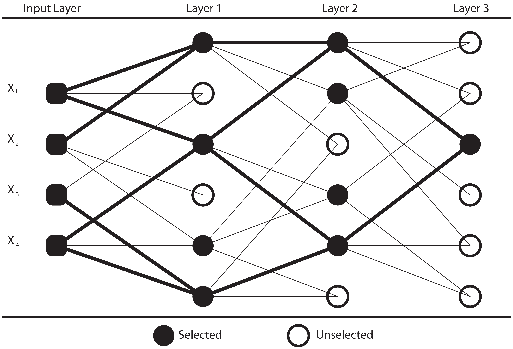
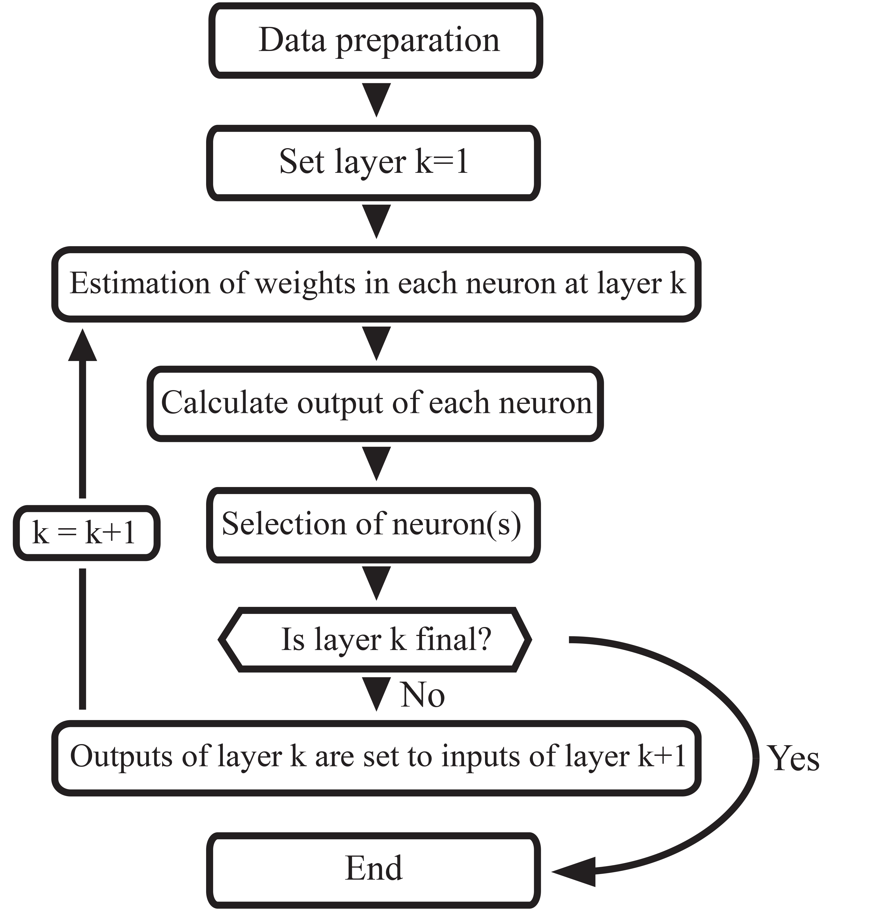
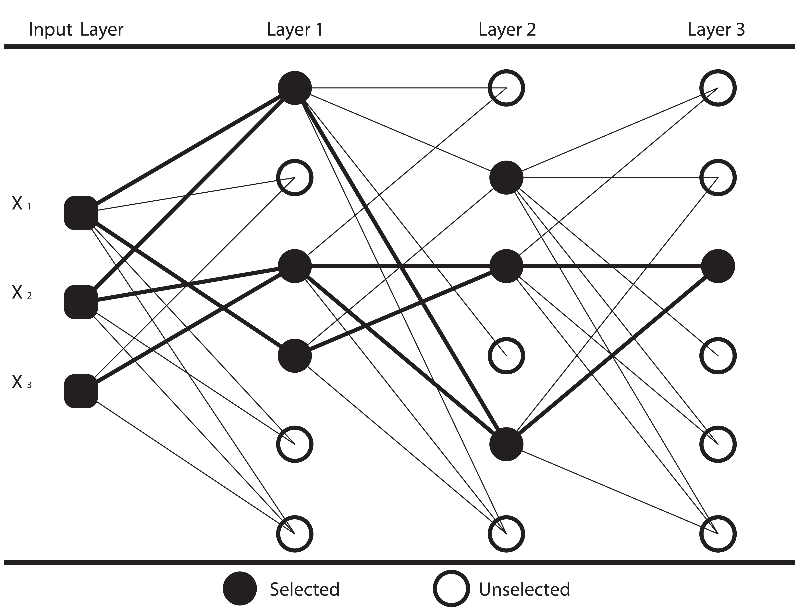

::: article
# Introduction

Time series data are ordered successive observations which are measured
in equally or unequally spaced time. Time series data may include
dependency among successive observations. Hence, the order of the data
is important. Time series data appear in various areas and disciplines
such as medical studies, economics, the energy industry, agriculture,
meteorology, and so on. Modelling time series data utilizes the history
of the data and makes forecasting using this history. At times,
statistical models are not sufficient to solve some problems. Examples
include pattern recognition, forecasting, identification, etc.
Extracting the information from the measurements has advantages while
modelling complex systems when there is not enough prior information
and/or no theory is defined to model the complex systems. Selecting a
model automatically is a powerful way for the researchers who are
interested in the result and do not have sufficient statistical
knowledge and sufficient time [@mueller1998gmdh] for an analysis.

The objective of this study is to develop an R package for forecasting
of time series data. Some of recent softwares developed for time series
are [*glarma*](https://CRAN.R-project.org/package=glarma),
[*ftsa*](https://CRAN.R-project.org/package=ftsa),
[*MARSS*](https://CRAN.R-project.org/package=MARSS),
[*ensembleBMA*](https://CRAN.R-project.org/package=ensembleBMA),
[*ProbForecastGOP*](https://CRAN.R-project.org/package=ProbForecastGOP),
and [*forecast*](https://CRAN.R-project.org/package=forecast)
[@dunsmuirglarma; @shang2013ftsa; @holmes2012marss; @fraley2011probabilistic; @hyndman2008automatic].
In this study, we focused on the development of an R package for short
term forecasting via Group Method of Data Handling (GMDH) algorithms.
The history of GMDH-type neural network is based on works from the end
of the 1960s and the beginning of the 1970s. First,
[@ivakhnenko1968group] introduced a polynomial, which is the basic
algorithm of GMDH, to construct higher order polynomials. Also,
[@ivakhnenko1970heuristic] introduced heuristic self-organization
methods which constructed the main working system of GMDH algorithm.
Heuristic self-organization method defines the way that the algorithm
evolves, following rules such as external criteria. The GMDH method,
convenient for complex and unstructured systems, has benefits over high
order regression [@farlow1981gmdh].

[@kondo1998gmdh] proposed GMDH-type neural network in which the
algorithm works according to the heuristic self-organization method.
[@kondo2006medical; @kondo2006revised] proposed a GMDH algorithm which
has a feedback loop. According to this algorithm, the output obtained
from the last layer is set as a new input variable, provided a threshold
is not satisfied in the previous layer. The system of the algorithm is
organized by a heuristic self-organization method where a sigmoid
transfer function is integrated. [@kondo2007logistic] proposed a
logistic GMDH-type neural network. The difference from a conventional
GMDH algorithm was that the new one would take linear functions of all
inputs at the last layer. [@kondo2012feedback] included three transfer
functions (sigmoid, radial basis and polynomial functions) in the
feedback GMDH algorithm. [@srinivasan2008energy] used a GMDH-type neural
network and traditional time series models to forecast predicted energy
demand. It was shown that a GMDH-type neural network was superior in
forecasting energy demand compared to traditional time series models
with respect to mean absolute percentage error (MAPE). In another study,
[@xu2012application] applied a GMDH algorithm and ARIMA models to
forecast the daily power load. According to their results, GMDH-based
results were superior to the results of ARIMA models in terms of MAPE
for forecasting performance.

There are some difficulties when applying a GMDH-type neural network.
For example, there is no freely available software for researchers
implementing the GMDH algorithms in the literature. We present the R
package *GMDH* to make short term forecasting through GMDH-type neural
network algorithms. The package includes two types of GMDH structures;
namely, GMDH structure and revised GMDH (RGMDH) structure. Also, it
includes a variety of options to use different transfer functions
(sigmoid, radial basis, polynomial, and tangent functions)
simultaneously or separately. Data on the cancer death rate of
Pennsylvania from 1930 to 2000 are used to illustrate the implementation
of GMDH package. We compare the results to those based on ARIMA models
and exponential smoothing (ES) methods.

# Methodology {#meth}

In this section, data preparation, two types of GMDH-type neural network
structures, and estimation of a regularization parameter in regularized
least square estimation (RLSE) are given.

## Data preparation

Data preparation has an important role in GMDH-type neural network
algorithms. To get rid of very big numbers in calculations and to be
able to use all transfer functions in the algorithm, it is necessary for
range of the data to be in the interval of (0, 1). If $\alpha_t$ is the
actual time series dataset at hand, this necessity is guaranteed by the
following transformation,

$$\label{eq:w_t}
w_t=\frac{\alpha_t+\delta_1}{\delta_2}  (\#eq:w-t)$$
\
with

$$\label{eq:delta_1}
\delta_1 = 
  \begin{cases} 
    |\alpha_t|+1 & \text{if } \text{min}(\alpha_t) \leq 0 \\
    \hfil 0       & \text{if } \text{min}(\alpha_t) > 0
  \end{cases}  (\#eq:delta-1)$$

\
and

$$\label{eq:delta_2}
\delta_2 = \text{max}(\alpha_t+\delta_1) +1.  (\#eq:delta-2)$$
\
During the estimation and forecasting process in GMDH-type neural
network algorithms, all calculations are done using the scaled data set,
$w_t$. After all processes are ended--i.e, all predictions and forecasts
are obtained--we apply the inverse transformation as follows,

$$\label{eq:alpha_t}
\widehat{\alpha}_t = \widehat{w}_t\times\delta_2-\delta_1.  (\#eq:alpha-t)$$

Let's assume a time series dataset for $t$ time points, and $p$ inputs.
An illustration of time series data structure in GMDH algorithms is
presented in Table [1](#tab:rowdata). Since we construct the model for
the data with time lags, the number of observations, presented under the
subject column in the table, is equal to $t-p$; and the number of
inputs, lagged time series, is $p$. In this table, the variable called
$z$ is put in the models as a response variable, and the rest of the
variables are taken into models as lagged time series $x_i$, where
$i = 1, 2, ..., p$. The notations in Table [1](#tab:rowdata) are
followed throughout this paper.

::: {#tab:rowdata}
  -----------------------------------------------------------------------
   Subject       $z$        $x_1$       $x_2$     $\ldots$      $x_p$
  ---------- ----------- ----------- ----------- ---------- -------------
      1         $w_t$     $w_{t-1}$   $w_{t-2}$   $\ldots$    $w_{t-p}$

      2       $w_{t-1}$   $w_{t-2}$   $w_{t-3}$   $\ldots$   $w_{t-p-1}$

      3       $w_{t-2}$   $w_{t-3}$   $w_{t-4}$   $\ldots$   $w_{t-p-2}$

   $\vdots$   $\vdots$    $\vdots$    $\vdots$    $\ddots$    $\vdots$

    $t-p$     $w_{p+1}$    $w_{p}$    $w_{p-1}$   $\ldots$     $w_{1}$
  -----------------------------------------------------------------------

  : Table 1: An illustration of time series data structure in GMDH
  algorithms
:::

[]{#tab:rowdata label="tab:rowdata"}

A better model which explains the relation between response and lagged
time series is captured via transfer functions. The sigmoid, radial
basis, polynomial, and tangent functions, presented in Table
[2](#tab:transfer), are mainly used to explain the relation between
inputs and output in GMDH-type neural network algorithms
[@kondo2012feedback]. We use all transfer functions, stated in Table
[2](#tab:transfer), simultaneously in each neuron. In other words, we
construct four models at each neuron, and then the model which gives the
smallest prediction mean square error (PMSE) is selected as the current
transfer function at the corresponding neuron.

::: {#tab:transfer}
  ----------------------- ------------------
  Sigmoid Function        $z=1/(1+e^{-y})$

  Radial Basis Function   $z=e^{-y^2}$

  Polynomial Function     $z=y$

  Tangent Function        $z=\tan(y)$
  ----------------------- ------------------

  : Table 2: Transfer functions
:::

[]{#tab:transfer label="tab:transfer"}

## GMDH algorithm

GMDH-type neural network algorithms are modeling techniques which learn
the relations among the variables. In the perspective of time series,
the algorithm learns the relationship among the lags. After learning the
relations, it automatically selects the way to follow in algorithm.
First, GMDH was used by [@ivakhnenko1968group] to construct a high order
polynomial. The following equation is known as the Ivakhnenko polynomial
given by

$$\label{eq:y}
y=a+\sum\limits_{i=1}^m b_i\cdot x_i + \sum\limits_{i=1}^m\sum\limits_{j=1}^m c_{ij}\cdot x_i\cdot x_j + \sum\limits_{i=1}^m\sum\limits_{j=1}^m\sum\limits_{k=1}^m d_{ijk}\cdot x_i\cdot x_j\cdot x_k + \dots  (\#eq:y)$$

where $m$ is the number of variables and $a,b,c,d, \dots$ are coeffients
of variables in the polynomial, also named as weights. Here, y is a
response variable, $x_i$ and $x_j$ are the lagged time series to be
regressed. In general, the terms are used in calculation up to square
terms as presented below,

$$\label{eq:y2}
y=a+\sum\limits_{i=1}^m b_i\cdot x_i + \sum\limits_{i=1}^m\sum\limits_{j=1}^m c_{ij}\cdot x_i\cdot x_j  (\#eq:y2)$$

The GMDH algorithm considers all pairwise combinations of $p$ lagged
time series. Therefore, each combination enters each neuron. Using these
two inputs, a model is constructed to estimate the desired output. In
other words, two input variables go in a neuron, one result goes out as
an output. The structure of the model is specified by Ivakhnenko
polynomial in equation \@ref(eq:y2) where $m=2$. This specification
requires that six coefficients in each model are to be estimated.

The GMDH algorithm is a system of layers in which there exist neurons.
The number of neurons in a layer is defined by the number of input
variables. To illustrate, assume that the number of input variables is
equal to $p$, since we include all pairwise combinations of input
variables, the number of neurons is equal to $h=\binom{p}{2}$. The
architecture of GMDH algorithm is illustrated in Figure [1](#fig:Fig1)
when there are three layers and four inputs.

{#fig:Fig1
width="100%" alt="graphic without alt text"}

In the GMDH architecture shown in Figure [1](#fig:Fig1), since the
number of inputs is equal to four, the number of nodes in a layer is
determined to be six. This is just a starting layer to the algorithm.
The coefficients of equation \@ref(eq:y2) are estimated in each neuron.
By using the estimated coefficients and input variables in each neuron,
the desired output is predicted. According to a chosen external
criteria, $p$ neurons are selected and $h-p$ neurons are eliminated from
the network. In this study, prediction mean square error (PMSE) is used
as the external criteria. In Figure [1](#fig:Fig1), four neurons are
selected while two neurons are eliminated from the network. The outputs
obtained from selected neurons become the inputs for the next layer.
This process continues until the last layer. At the last layer, only one
neuron is selected. The obtained output from the last layer is the
predicted value for the time series at hand. The flowchart of the
algorithm is depicted in Figure [2](#fig:Fig2).

{#fig:Fig2
width="100%" alt="graphic without alt text"}

In a GMDH algorithm, there exist six coefficients to be estimated in
each model. Coefficients are estimated via RLSE.

## RGMDH algorithm

A GMDH-type neural network constructs the algorithm by investigating the
relation between two inputs and the desired output. Architecture of a
revised GMDH (RGMDH)-type neural network does not only consider this
relation, but it also considers the individual effects on the desired
output [@kondo2006revised]. There are two different types of neurons in
an RGMDH-type neural network. In the first type of neuron, it is same as
in GMDH-type neural network, given as in equation \@ref(eq:y2). That is,
two inputs enter the neuron, one output goes out. In the second type of
neuron, $r$ inputs enter the neuron, one output goes out. This second
type neuron is given by

$$\label{eq:y_second}
y=a+\sum\limits_{i=1}^r b_i\cdot x_i \quad , \quad r \leq  p,  (\#eq:y-second)$$
\
where $r$ is the number of inputs in the corresponding second type
neuron.

As mentioned above, there exist $h=\binom{p}{2}$ neurons in one layer in
a GMDH-type neural network. In addition to this, with the $p$ neurons
from the second type of neuron, the number of neurons in one layer
becomes $\eta=\binom{p}{2}+p$ in an RGMDH-type algorithm. The
architecture of an RGMDH-type algorithm is shown in Figure
[3](#fig:Fig3) for the case when there are three layers and three
inputs. In this architecture, since the number of inputs is three, the
number of nodes in a layer is determined to be six. Here, three of six
nodes are the first type of neurons in which all pairwise combinations
of lagged time series are already used as in the GMDH algorithm. The
rest of the three nodes are the second type of neurons where the
individual effects of the lagged time series are sequentially added to
the layer starting from lag 1. In each neuron, coefficients of models
are calculated by using the corresponding models in equations
\@ref(eq:y2) and \@ref(eq:y-second). For instance, in Figure
[3](#fig:Fig3), there are six coefficients to be estimated as given by
equation \@ref(eq:y2) for the first type of neurons, and two, three and
four coefficients are estimated as given in equation \@ref(eq:y-second)
for the the second type of neurons when $r$ equals to 1, 2 and 3,
respectively. The desired output is predicted by utilizing estimated
coefficients and input variables in each neuron. Here, $p$ neurons are
selected as living cells and $\eta-p$ death cells are eliminated from
the network according to the external criteria. The rest of the
algorithm is same with GMDH.

{#fig:Fig3
width="100%" alt="graphic without alt text"}

## Estimation of regularization parameter in RLSE

In each estimation step, there exist the coefficients to be estimated.
While we are estimating these coefficients, we use the regularized least
square estimation method. It is stated that regularized least square
estimation is utilized when there is the possibility of a
multi-collinearity problem by integrating a regularization parameter,
$\lambda$, into the estimation step. It is important to note that
regularized least square estimation differs from the least square
estimation when the regularization parameter is not zero.

We integrate the estimation of a regularization parameter (penalizing
term) via validation in GMDH algorithms. For this purpose, we divide the
data into two parts: a learning set and a testing set. In the *GMDH*
package, $70\%$ of the time series, by default, is taken for the
learning set. Since the data set is time dependent, the order of data is
saved in this division process. In other words, by default, the first
$70\%$ of the data is used for learning set and the last $30\%$ of the
data is utilized as a testing set. This whole process is applied for
each model constructed in each neuron. The algorithm for the
regularization parameter estimation is as follows:

i)  Clarify the possible regularization parameter,
    $\lambda= 0, 0.01, 0.02, 0.04, 0.08, \ldots, 10.24$. Note that, when
    $\lambda=0$, RLSE is converted to LSE.

ii) For each possible $\lambda$ value, coefficients are estimated via
    RLSE by using the learning set.

iii) After the calculation of coefficients, calculate the predicted
     values by utilizing the test set to obtain the MSE for each
     regularization parameter.

iv) Select the regularization parameter which gives the minimum MSE
    value.

# Implementation of GMDH package {#implementation}

The data used in this application of the *GMDH* package are the yearly
cancer death rate (per 100,000 population) in the Pennsylvania between
1930 and 2000. The data were documented in Pennsylvania Vital Statistics
Annual Report by the Pennsylvania Department of Health in 2000
[@wei2006time]. This dataset is also available as a  dataset in the
package *GMDH*. After installing the *GMDH* package, it can be loaded
into an R workspace by

``` r
R> library("GMDH")
R> data("cancer")  # load cancer data 
```

After the cancer death rate data set is loaded, one may use `fcast`
function in *GMDH* package for short-term forecasting. To utilize the
GMDH structure for forecasting, method is set to \"GMDH\". One should
set the method to \"RGMDH\" to use the RGMDH structure.

``` r
R> out = fcast(cancer[1:66], method = "GMDH", input = 15, layer = 1, f.number = 5, 
level = 95, tf = "all", weight = 0.70, lambda = c(0, 0.01, 0.02, 0.04, 0.08, 0.16, 
0.32, 0.64, 1.28, 2.56, 5.12, 10.24))
```

``` r
   Point Forecast    Lo 95    Hi 95
67       249.5317 244.9798 254.0836
68       249.6316 244.4891 254.7741
69       248.9278 243.0318 254.8239
70       247.0385 240.7038 253.3731
71       244.7211 237.1255 252.3168
```

``` r
# display fitted values
R> out$fitted

# return residuals
R> out$residuals

# show forecasts
R> out$mean
```

In this part, we divided the data into two parts for the aim of
observing the ability of methods on prediction $(n = 66)$ and
forecasting $(n = 5)$. We include ARIMA models and ES methods for
comparison purpose. For the determination of the best order of ARIMA
models and the best method of ES techniques, there are two functions in
the R package *forecast*. These functions, `auto.arima` and `ets`, which
use grid search, select the best model according to the criteria of
either AIC, AICc or BIC. For this data set, the functions suggested the
model ARIMA (1, 1, 0) with intercept and an ES method with
multiplicative errors, additive damped trend and no seasonality (M, Ad,
N), respectively. We also added the model ARIMA (0, 1, 0) with intercept
for this data set suggested by [@wei2006time]. For all models,
prediction mean square error (PMSE) and forecasting mean square error
(FMSE) are stated in Table [3](#tab:table3).

{#fig:Fig4 width="100%" alt="graphic without alt text"}

::: {#tab:table3}
  ------------------------------------------------
                                     PMSE     FMSE
  ------------------------------- ------- --------
  GMDH                              4.985    4.575

  RGMDH                             4.287    4.102

  ARIMA(1, 1, 0) with intercept     5.995   81.874

  ARIMA(0, 1, 0) with intercept     6.324   73.756

  ES (M, Ad, N)                     6.153   17.508
  ------------------------------------------------

  : Table 3: Comparison of the GMDH algorithms with other models on
  cancer death rate in terms of prediction mean square error (PMSE) and
  forecasting mean square error (FMSE)
:::

[]{#tab:table3 label="tab:table3"}

The best forecasting performance belongs to the RGMDH algorithm and its
prediction accuracy also yields better results as compared to the GMDH,
ARIMA and ES models. Moreover, the GMDH algorithm outperforms the ARIMA
and ES models in prediction and forecasting. To avoid visual pollution
in Figure [4](#fig:Fig4), we include only the predictions and forecasts
of RGMDH algorithm and ES (M, Ad, N).

# Conclusion

In this study, we used GMDH-type neural network algorithms, the
heuristic self-organization method for the modelling of complex systems,
to make forecasts for time series data sets. Our primary focus was to
develop a free software implementation. Concretely, we developed an R
package *GMDH* to make forecasting in the short term via GMDH-type
neural network algorithms. Also, we included different transfer
functions (sigmoid, radial basis, polynomial, and tangent functions)
into the *GMDH* package. Our R package allows that these functions can
be used simultaneously or separately, as desired.

In the estimation of coefficients, since we construct the model for the
data with lags, there exists a high possibility of there occurring a
multi-collinearity problem. Therefore, we utilized regularized least
square estimation to handle such occurences. It is important to note
that estimation of a regularization parameter is the question of
interest. Validation was applied in order to estimate the regularization
term. After selection of a regularization term, coefficients were
estimated by the help of all observations and the regularization
parameter.

Application of the algorithms on a real life dataset suggests improved
performance of GMDH-type neural network algorithms over ARIMA and ES
models in prediction and short term forecasting. Researchers are able to
use GMDH algorithms easily since our R package *GMDH* is available on
Comprehensive R Archive Network (CRAN) at
<http://CRAN.R-project.org/package=GMDH>.

Future studies are planned in the direction of transfer functions. In
this study, we used four different transfer functions - sigmoid, radial
basis, polynomial, and tangent functions - into GMDH algorithms. We plan
to integrate the Box-Cox transformation into GMDH algorithms. GMDH
algorithms with four transfer functions and GMDH algorithms with Box-Cox
transformation are going to be performed on real data applications to
compare the prediction and short term forecasting. After being
documented, the related GMDH algorithms with the Box-Cox transformation
are going to be implemented in the R package *GMDH*.

# Acknowledgment

We thank the anonymous reviewers for their constructive comments and
suggestions which helped us to improve the quality of our paper.
:::
