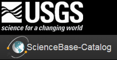

::: article
# Introduction

Cloud data storage platforms can be a powerful tool for research
collaboration, distributed computing, and data publication. However,
while browser-based graphical interfaces make these platforms accessible
to a wide audience, there is also a need for scripted data access and
manipulation so that researchers can capture data provenance and create
reproducible analyses. For example, Figshare [@figshare], DataOne
[@dataone], Dataverse [@dataverse] and CKAN [@ckan] are all research
data sharing platforms that are gaining use in different research
fields. For each of these platforms, the community has released
[@rfigshare; @dvn; @ckanr] or is developing [@dataonepkg] R packages to
streamline the storage and access to archived data.

These existing projects primarily focus on creating more useful, open,
and accessible end products of research, but data- and code-intensive
collaborative projects increasingly need collaborative solutions for
data storage, sharing, and updating not just at the end of the project,
but throughout the full project lifecycle. Github is increasingly used
to collaborate around data products [@GandrudGithub], but does not scale
well to the distribution of large datasets [@Delcambre2013] and does not
include metadata or queries beyond free-text search. Furthermore, most
data archive platforms like DataOne and Dataverse focus on academic
research projects and do not support some of the unique needs of federal
research. For example, many government institutions require an archived
copy of released data to be stored and available through federally
operated websites. Third party storage providers are insufficient.

To address future scientific data sharing and archival challenges, the
U.S. Geological Survey (USGS) created ScienceBase
(<https://www.sciencebase.gov/>). This platform is designed to support
the full project data lifecycle and has seen rapid adoption with USGS
researchers and collaborators. ScienceBase supports the storage and
access of large files and datasets. It allows data to be stored with a
user-configurable mixture of public and authenticated access and has
been designed from the beginning with first-class RESTful web interfaces
to support robust API access. Items on ScienceBase can have hierarchical
relationships, facilitating the organization of complex or related data.
It also supports a seamless transition from project development to data
publication, focusing on searchable, accessible, well described datasets
for public use and citation.

To expand the usefulness of the ScienceBase platform directly to R
workflows, we have designed and implemented an R interface to
ScienceBase called *sbtools*. This interface provides scripted R access
to ScienceBase to manage metadata and data files, to search the catalog
of datasets, and to view and modify data in formats familiar to R users.
Here we describe several features of ScienceBase, and how we have
implemented the R interface to make them accessible and useful from R.

# USGS ScienceBase

To facilitate and encourage data sharing and dissemination, the U.S.
Geological Survey has created ScienceBase, an online collaborative
scientific data platform (Figure [1](#figure:sbfig)). ScienceBase is
targeted for use by USGS researchers, their collaborators, and the end
users of reviewed and released USGS data products. ScienceBase has four
key elements to support collaborative data workflows: 1) Data and
metadata cataloging and hosting with options for private, controlled
access and fully public sharing of data and metadata. 2) Central search
and data discovery for both data hosted on ScienceBase and externally
hosted data. 3) Full web-service support for all core functionality,
including standards-based access to specific data types (e.g. geospatial
datasets). 4) Research community catalogs to enable the organization of
data along collaborative group and organizational boundaries.

{#figure:sbfig
width="100%" alt="graphic without alt text"}

ScienceBase users store data in 'items', where each item is a flexible
representation of a dataset and its metadata. The dataset component of
an item can be one or more data files in any format or simply an item
with descriptive metadata linking a dataset hosted on an external
repository. This supports indexing of legacy datasets that are hosted in
well known locations (for example, the USGS National Hydrography
Dataset). Items are organized into a tree hierarchy (much like the
structure of files and folders on a hard drive). This allows data to be
intuitively organized by the institution, collaborative group, and/or
individual to whom the data belong. At the same time, items can also be
assigned identifying tags for rapid search and data discovery across the
full ScienceBase catalog.

Search and management of ScienceBase data items can be accomplished
through both graphical and scripted interfaces. Manual search, data
upload/download, and metadata editing are possible through the
ScienceBase website. Automated access to all of these functions is
supported by robust RESTful web services and a documented API. The
ScienceBase code and infrastructure setup is available upon request from
the ScienceBase team \<sciencebase@usgs.gov\>. Further information and
details can be found in the online [ScienceBase
Documentation](https://www.sciencebase.gov/about/using-sciencebase).

# The *sbtools* package

In creating *sbtools*, our goal was to allow complete access to the
ScienceBase web service API in a flexible, lightweight R package. The
package imports a minimal number of external packages to support core
functionality. More advanced data access (e.g. geospatial web services)
is supported through suggested packages to keep the basic installation
requirements minimal for all platforms. Within R, *sbtools* is designed
to keep end-user interactions simple despite the underlying complexity
of many of the web service calls (e.g. authentication).

Below, we describe briefly the core functions available in *sbtools* and
discuss the unique features of ScienceBase that *sbtools* provides R
users.

## Data access API

The data access functionality of *sbtools* makes it easy to access any
public item. Every item in ScienceBase has a unique identifier that can
be used for direct access to the item and its associated data and
metadata. A lightweight representation of this information is created in
R with the `item_get` function.

``` r
> test_item = item_get("4f4e4b24e4b07f02db6aea14")
> test_item
<ScienceBase Item>
  Title: Coastal-change and glaciological maps of Antarctica
  Creator/LastUpdatedBy:      /
  Provenance (Created / Updated):  2010-10-06T04:25:43Z / 2014-07-21T17:45:42Z
  Children: FALSE
  Item ID: 4f4e4b24e4b07f02db6aea14
  Parent ID: 4f4e4771e4b07f02db47e1e4
```

This representation is defined by *sbtools* as an `“sbitem”` object,
which contains many fields and can be further inspected in the same way
as a named list.

``` r
> names(test_item)
 [1] "link"              "relatedItems"      "id"
 [4] "identifiers"       "title"             "citation"
 [7] "provenance"        "hasChildren"       "parentId"
[10] "contacts"          "webLinks"          "browseCategories"
[13] "browseTypes"       "tags"              "dates"
[16] "facets"            "files"             "distributionLinks"
[19] "previewImage"

> test_item$citation
[1] "Geological Survey (U.S.), 1999-08-05, Coastal-change
and glaciological maps of Antarctica:  Fact SheetCoastal-change and
glaciological maps of Antarctica."
```

On ScienceBase, the hierarchical item tree dictates relationships
between items; each item has one parent and potentially many children.
*sbtools* allows the user to easily traverse this tree structure.
Because ScienceBase allows users to define their internal organization,
this heirarchy can take on different meanings for different projects,
including conveying data provenance or spatial grouping.

``` r
#parent ID always available as item attribute
> parent = item_get(test_item$parentId)
> parent
  Title: USGS Publications Warehouse
  Creator/LastUpdatedBy:      /
  Provenance (Created / Updated):  2012-02-29T15:42:41Z / 2014-07-08T21:42:20Z
  Children: TRUE
  Item ID: 4f4e4771e4b07f02db47e1e4
  Parent ID: 4f4e4771e4b07f02db47e1da

#getting sibling items
> item_list_children(parent)
[1] "55b98fbee4b08f6647be5179" "541d45a4e4b0f68901ec30ef"
[3] "55b361b3e4b09a3b01b5daad" "53516ef9e4b05569d8059f34"
[5] "4f4e4ab2e4b07f02db66f5e3" "5351704ee4b05569d805a2e4"
```

ScienceBase items may have data or metadata files attached to them. You
can list and download attached files directly using *sbtools*.

------------------------------------------------------------------------

``` r
#returns names of files attached to item
> item_list_files(test_item)
                              fname size  url
  1 metadata6644450227216673613.xml 1742  https://www.sciencebase.gov/[truncated]

#returns local path to downloaded files
> item_file_download(test_item, dest_dir = tempdir())
[1] "\\path\\to\\file\\RtmpgBV2fn/metadata6644450227216673613.xml"
```

ScienceBase has special functionality for certain data types. One
example is spatial data. When spatial data are uploaded to ScienceBase
and appropriate metadata is included, they can be accessed using Open
Geospatial Consortium ([OGC](http://www.opengeospatial.org/)) web
services. *sbtools* includes functionality to access Web Feature Service
(WFS) when available. Once retrieved, spatial data are stored as *sp*
spatial objects, which are easily manipulated and visualized (Figure
[2](#figure:iowafig)). Note: Some figure formatting details omitted from
code below for simplicity. See
`demo(’figure_map_code’, package=’sbtools’)` for the full example.

``` r
#Load non-sbtools-required but useful mapping packages
library(maps)
library(sp)
#an item with an included OGC WFS service
layer = item_get_wfs('55e372b9e4b05561fa208212')
map('state', regions = 'iowa')
plot(layer, add = TRUE)
```

{#figure:iowafig width="100%" alt="graphic without alt text"}

## Search API

To support advanced and powerful data discovery, all datasets in
ScienceBase are indexed and made available through a flexible search
interface. *sbtools* offers several query functions with different
levels of search specificity, from cross-metadata simple text search to
low-level, metadata specific search functionality.

In *sbtools*, query functions are included to support the most common
query types. Included functions are available to search based on
free-text, project folder, date-time range, geospatial bounding box,
Digital Object Identifier (DOI), and data type. To save space in the
examples below, we use the `limit` parameter to limit all queries to the
first one or two results. Further details for each query type are
available in the package documentation.

The ScienceBase free-text search is simple to use and generic as it
searches across all of an item's text-based metadata fields. Free-text
search can find specific text strings in almost all metadata fields,
including but not limited to filenames, summary fields, citation,
contacts, and authors. Spatial reference metadata is an example of a
field not searched through the free-text search. Using *sbtools*, a
free-text search can be run with the `query_sb_text` function.

``` r
> query_sb_text('Antarctica', limit=1)
[[1]]
<ScienceBase Item> 
  Title: Antarctica. Erratic near camp 13. December 12, 1977.
  Creator/LastUpdatedBy:      / 
  Provenance (Created / Updated):  2013-07-09T15:38:45Z / 2016-03-02T23:55:43Z
  Children: FALSE
  Item ID: 51dc2e85e4b0f81004b79cf0
  Parent ID: 519ba0a3e4b0e4e151ef5dd9
```

Items can also be queried according to their position in the
hierarchical item tree. For example, projects funded by USGS Climate
Science Centers each have sections on ScienceBase where project
information is stored. Using the web interface (and some user
knowledge), we first found the ScienceBase ID of the Northeast Climate
Science Center community folder. Then, *sbtools* was used to look for
specific items in that commuinty. Below is an example of looking for
items containing any reference to \"Lake Superior\" under the Northeast
Climate Science Center community.

``` r
#Look for items referencing "Lake Superior" under the NE Climate Science Center projects
> query_item_in_folder("Lake Superior", folder="4f8c648de4b0546c0c397b43", limit=2)
[[1]]	
<ScienceBase Item> 
  Title: The Role of Lake-Dotted Landscapes in Regional Climate Change [...]
  Creator/LastUpdatedBy:      / 
  Provenance (Created / Updated):  2013-12-31T17:46:16Z / 2013-12-31T17:46:16Z
  Children: FALSE	
  Item ID: 52c302e8e4b040b25da9d35a
  Parent ID: 51db0ebce4b010c7f6a814bf

[[2]]
<ScienceBase Item> 
  Title: The influence of land use and [...] in Lake Superior tributaries
  Creator/LastUpdatedBy:      / 
  Provenance (Created / Updated):  2013-12-31T17:45:51Z / 2013-12-31T17:45:51Z
  Children: FALSE
  Item ID: 52c302cfe4b040b25da9ce3c
  Parent ID: 51db0ebce4b010c7f6a814bf
```

There are a several more useful query types that can be performed simply
with *sbtools*. A few examples include date-time range,
(`query_sb_date()`), data type (`sb_datatypes()` and
`query_sb_datatype`), and Digial Object Identifier (DOI;
`query_sb_doi()`).

``` r
#Query recently updated items
> query_sb_date(Sys.time()-as.difftime(7, units="days"), Sys.time(),
+    date_type='lastUpdated', limit=1)
[[1]]
<ScienceBase Item>
  Title: US Topo
  Creator/LastUpdatedBy:      /
  Provenance (Created / Updated):  2012-03-05T22:46:14Z / 2016-02-01T12:11:58Z
  Children: TRUE
  Item ID: 4f554236e4b018de15819c85
  Parent ID: 4f552e93e4b018de15819c51


#Query for USGS Reports
> query_sb_datatype('Report', limit = 1)
[[1]]
<ScienceBase Item> 
  Title: Final Memo for Structured decision-making to facilitate multi-stakeholder 
  coastal conservation and restoration under climate change uncertainties: case study 
  on barrier islands of the northern Gulf of Mexico
  Creator/LastUpdatedBy:      / 
  Provenance (Created / Updated):   / 
  Children: 
  Item ID: 565e07b3e4b071e7ea5435d0
  Parent ID: 5224e64fe4b0e4746d62af85
  
#Query for DOI
> query_sb_doi('10.5066/F7M043G7')
[[1]]
<ScienceBase Item>
  Title: 2013 Raw Ground Penetrating Radar Data on Alaska's Glaciers
  Creator/LastUpdatedBy:      /
  Provenance (Created / Updated):  2015-06-15T16:55:03Z / 2015-12-15T20:39:06Z
  Children: TRUE
  Item ID: 557f0367e4b023124e8ef621
  Parent ID: 5474ec49e4b04d7459a7eab2
```

Items with a geospatial component to their data or metadata can be
queried using a Lat/Lon bounding box with the function
`query_sb_spatial()`. The bounding box may be directly specified with
coordinates or indirectly specified by supplying another spatial object
whose bounding box should be used. Because spatial functionality
requires packages beyond those imported by *sbtools* by default, the
*xml2*, *sp* and *rgdal* packages must be installed to use these
functions.

``` r
#specify the latitude and longitude points to define the bounding box range. 
# This is simply bottom left and top right points
> query_sb_spatial(long=c(-104.4, -95.1), lat=c(37.5, 41.0), limit=1)
[[1]]
<ScienceBase Item>
  Title: National Fish Habitat Partnership Data System
  Creator/LastUpdatedBy:      /
  Provenance (Created / Updated):  2012-02-29T15:42:43Z / 2015-11-12T20:19:30Z
  Children: TRUE
  Item ID: 4f4e4773e4b07f02db47e241
  Parent ID: 4f4e4760e4b07f02db47df9c

##You can also use the bounding box of an sp spatial data object
#grab an sp object from a pre-determined ScienceBase Item
> layer = item_get_wfs('55e372b9e4b05561fa208212')

#get items in that bounding box
> query_sb_spatial(layer, limit = 1)

[[1]]
<ScienceBase Item>
  Title: USGS Denver Library Photographic Collection
  Creator/LastUpdatedBy:      /
  Provenance (Created / Updated):  2013-05-21T16:28:19Z / 2016-01-04T15:44:20Z
  Children: TRUE
  Item ID: 519ba0a3e4b0e4e151ef5dd9
  Parent ID: 4f4e4771e4b07f02db47e1da
```

Lastly, *sbtools* offers advanced access to all query capabilities
through the `query_sb()` function. `query_sb()` provides a convenient
wrapper that allows the user to supply a list of query parameters
(options described in the documentation), submits that query to
ScienceBase and parses the output into a list of `“sbitem”` objects.
When necessary, `query_sb()` also does proper result paging when the
requested return length (limit) is over 1000 items. All advanced search
options can be experimented with via the [online advanced search
interface](https://www.sciencebase.gov/catalog/items/queryForm).

``` r

# query_sb can be used for combined search criteria
> query_sb(list(q = "water", folderId = '504216b9e4b04b508bfd337d', 
                browserCategory = 'Image'), limit=1)
[[1]]
<ScienceBase Item>
  Title: Encyclopedia of Water Science
  Creator/LastUpdatedBy:      /
  Provenance (Created / Updated):  2013-04-18T15:06:38Z / 2013-04-18T15:06:38Z
  Children: FALSE
  Item ID: 51700bfee4b05024ef3cd4ef
  Parent ID: 504216b9e4b04b508bfd337d
```

Combining both the query functionality and direct spatial data access
through WFS web services, we can quickly discover and explore available
datasets on ScienceBase. For example, if we wanted to discover what
faultline spatial data are available on ScienceBase, we can combine
*sbtools* query and data access functionality. In the below example, we
query for items with the word \"faults\" in their description which also
expose data through an OGC WFS web service. We plot all datasets
together to general geographic locations and data type/completeness
(Figure [3](#figure:faultlinefig)). We see datasets covering much of the
western United States and off the west coast. Small datasets are
scattered around the gulf coast and other areas of the U.S., but none
expose the raw faultline data so more discovery may be required.

Note: Some formatting details of code omitted from code below for
simplicity. See\
`demo(’figure_fault_code’, package=’sbtools’)` for full example.

``` r
#Source non-sbtools-required but useful mapping packages
library(sp)
library(maps)

faults = query_sb(list(q = "faults", browseType = "OGC WFS Layer"), limit = 20)

map('usa')
for(i in 1:length(faults)){
    layer = item_get_wfs(faults[[i]]$id)
    layer = spTransform(layer, CRS('+proj=longlat +datum=WGS84'))
    plot(layer, add=TRUE, col='red')
}
map.axes()
```

{#figure:faultlinefig width="100%" alt="graphic without alt text"}

## ScienceBase authentication

In addition to the large collection of open, reusable datasets and
useful metadata ScienceBase has to offer, it is also a platform for
sharing and collaboration on private, in-progress data available only
through authenticated access. To enable private data contribution and
access, *sbtools* has built-in support for persistent authentication of
R sessions.

In *sbtools*, users can log into ScienceBase with their ScienceBase
username and password using the function `authenticate_sb()`. To prevent
plain-text passwords from being saved in the R command history, when
using RStudio, the password can be typed into a pop-up window. The core
R environment displays a terminal input interface for the password.
*sbtools* only stores the authenticated session, thereby maintaining the
confidentiality of the user's credentials. ScienceBase sessions remain
active for roughly one hour and are renewed each time a request is made.
*sbtools* makes a best effort to supply the user with meaningful error
messages when a session may have expired.

``` r
#to start an authenticated session
> authenticate_sb('username@usgs.gov') #password entered into pop-up window
> is_logged_in()
[1] TRUE
> session_logout()
> is_logged_in()
[1] FALSE
```

Most functions in *sbtools* can be used both anonymously and when
authenticated. This includes all data retrieval and query functions. The
behavior of these functions depends on the user's authentication status
and access permissions. For example, when trying to access a private
item using `item_get()`, you must be authenticated or you will receive
an error that the item is missing. To maintain privacy, ScienceBase does
not differentiate between a missing item and an item you lack permission
to access. Search is also dependent on authentication status. When
querying items with `query_sb()`, public items are always visible while
private items are invisible unless authenticated.

``` r
#Attempt to get a private item without authentication
> item_get('55de0027e4b0518e354dfcf0')
 Error: Item not found for ID=55de0027e4b0518e354dfcf0. Either the
 item does not exist or the item is secured and requires authentication to access.

#Get private item while authenticated
> authenticate_sb('username@usgs.gov')
> item_get('55de0027e4b0518e354dfcf0')
 <ScienceBase Item>
  Title: Example Private Item
  Creator/LastUpdatedBy:     username@usgs.gov / username@usgs.gov
  Provenance (Created / Updated):  2015-08-26T18:06:31Z / 2015-12-30T14:59:27Z
  Children: FALSE
  Item ID: 55de0027e4b0518e354dfcf0
  Parent ID: 54257d8fe4b0e641df8b50af

#Search results include user's private items when authenticated
> query_sb(list(q = 'username@usgs.gov'))
 <ScienceBase Item>
  Title: Example Private Item
  Creator/LastUpdatedBy:     username@usgs.gov / username@usgs.gov
  Provenance (Created / Updated):  2015-08-26T18:06:31Z / 2015-12-30T14:59:27Z
  Children: FALSE
  Item ID: 55de0027e4b0518e354dfcf0
  Parent ID: 54257d8fe4b0e641df8b50af

#Search results hide private items when not authenticated
> session_logout()
> query_sb(list(q = 'username@usgs.gov'))
list()
```

The authentication status can be quickly checked and updated with a few
helper functions.

``` r
#See if user is authenticated to SB
> is_logged_in()
[1] TRUE

#Get details of authenticated session 
> session_details()
$fullDisplayName
[1] "User McUseface [username@usgs.gov]"
$isLoggedIn
[1] TRUE
$displayName
[1] "User McUseface"
$email
[1] "username@usgs.gov"
$username
[1] "username@usgs.gov"

#Renew a session to prevent expiration after 1 hour
> session_renew()
```

## Data editing and upload API

For authenticated users, *sbtools* can support the full data lifecycle.
This includes the creation, editing and removal of items. Because item
editing and creation cannot be done anonymously, this functionality only
works while authenticated.

To create new items, the only required input to `item_create` is
\"title\". The \"Parent Item\" may also be specified. New items, by
default, inherit the privacy settings of their parent item. All users
have a personal home folder (called \"My Items\" on the ScienceBase
website) that serves as the default parent item for new items. The
unique identifier of a user's home folder can be retrieved with the
function `user_id()`.

``` r
#create new item, by default under "My Items" parent
> new_item = item_create(title = 'new test item')
> new_item
<ScienceBase Item>
  Title: new test item
  Creator/LastUpdatedBy:     username@usgs.gov / username@usgs.gov
  Provenance (Created / Updated):  2016-01-27T19:48:28Z / 2016-01-27T19:48:28Z
  Children: FALSE
  Item ID: 56a91f0ce4b0b28f1184dda8
  Parent ID: 54257d8fe4b0e641df8b50af
```

Once an item is created, an authenticated user can edit the metadata or
attach data files to that item.

``` r
#give the item a new title
> edited_item = item_update(new_item, list(title = 'new updated item'))
> edited_item
<ScienceBase Item>
  Title: new updated item
  Creator/LastUpdatedBy:     lwinslow@usgs.gov / lwinslow@usgs.gov
  Provenance (Created / Updated):  2016-01-27T19:48:28Z / 2016-01-27T19:50:21Z
  Children: FALSE
  Item ID: 56a91f0ce4b0b28f1184dda8
  Parent ID: 54257d8fe4b0e641df8b50af

#append files to the item
> item_list_files(new_item)
data frame with 0 columns and 0 rows

> item_append_files(edited_item, 'test.dat')
> item_list_files(edited_item)
      fname size     url
1 README.md 1282     https://www.sciencebase.gov/[long URL truncated]
```

Functions are also provided to modify and delete attached files and to
delete entire items.

``` r
#list currently attached files
> item_list_files(edited_item)
      fname size     url
1 README.md 1282     https://www.sciencebase.gov/[long URL truncated]

#selectively replace files. all = FALSE replaces files one by one;
#otherwise all files are removed before uploading the new files
> item_replace_files(new_item, 'README.md', all = FALSE)
> item_list_files(edited_item)
      fname size     url
1 README.md 608     https://www.sciencebase.gov/[long URL truncated]

#delete item. use with caution; there is no confirmation check
> item_rm(edited_item)
> item_get(edited_item)
Error: Item not found for ID=56a91f0ce4b0b28f1184dda8. Either the item does
not exist or the item is secured and requires authentication to access.
```

## SB item identifiers

One advanced feature of ScienceBase is the ability to assign any number
of custom item identifiers to items. The custom identifiers are made up
of three parts: Scheme, Type and Key. Combined, these create a unique
identifier. There are some standard Schemes used in ScienceBase. For
example, DOIs (Digital Object Identifiers) are stored as item
identifiers with the Scheme\
\"https://www.sciencebase.gov/vocab/category/item/identifier\" and Type
\"DOI\".

*sbtools* can edit and query custom item identifiers using
`item_update_identifier` and\
`query_item_identifier`, respectively.

``` r
#create two items and assign custom identifiers
> ident_item = item_create(title = 'test data')
> item_update_identifier(ident_item, scheme = 'proj2', type = 'data', key = 'dataset1')
> ident_item = item_create(title = 'test publication')
> item_update_identifier(ident_item, scheme = 'proj2', type = 'publication', key = 'pdf1')

#query for created item
> query_item_identifier(scheme = 'proj2', type = 'publication', key = 'pdf1')
             title                       id
1 test publication 56a9371ee4b012c193aa3d65
```

The three-part identifier can be especially useful as a way to organize
and access project data. For example, all items within the same project
could be created with the same scheme and differing types or keys,
allowing users to query items within the project using custom tags that
are meaningful to that project.

``` r
#query all items in 'proj2'
> query_item_identifier(scheme = 'proj2')
             title                       id
1 test publication 56a9371ee4b012c193aa3d65
2        test data 56a93777e4b012c193aa3d68

#query just data items for a project
> query_item_identifier(scheme = 'proj2', type = 'data')
      title                       id
1 test data 56a93777e4b012c193aa3d68
```

# Summary

As many real-world projects have demonstrated, R is an excellent tool
for collaborative and reproducible research projects [@Gandrud2013]. New
packages are frequently opening up access to large, open datasets
[@rNOMADS; @rFDSN]. Flexible and powerful ways to share and collectively
work with common datasets could enable new modes of collaboration and
diverse data discovery. To help fill this gap, we have created
*sbtools*. The *sbtools* package gives the user programmatic access to
the cloud-based data and metadata storage of USGS ScienceBase and allows
all researchers direct query and download capabilities to free, public
data on ScienceBase. *sbtools* enables rapid and reproducible access to
one of the single largest repositories of Earth-science data and an
advanced cloud-based data collaboration platform.

# Acknowledgments

This work was supported by the U.S. Geological Survey (USGS), Office of
Water Information and by funding from the USGS Community for Data
Integration (funding title: sbtools: An R package for ScienceBase). We
would like to thank Drew Ignizio, Marian Talbert and the two journal
reviewers for their careful reviews and feedback on the manuscript and
package. Any use of trade, firm, or product names is for descriptive
purposes only and does not imply endorsement by the U.S. Government.
:::
