::: article
# Introduction

In the last two decades many specific genes and genetic mechanisms
involved in different types of cancer have been identified. Yet our
understanding of cancer and of its varied progressions is still largely
elusive, as it still faces fundamental challenges.

Meanwhile, a growing number of cancer-related genomic data sets have
become available (e.g., see [@tcga_consortium])., There now exists an
urgent need to leverage a number of sophisticated computational methods
in biomedical research to analyse such fast-growing biological data
sets. Motivated by this state of affairs, we focus on the problem of
*reconstructing progression models* of cancer. In particular, we aim at
inferring the plausible sequences of *genomic alterations* that, by a
process of *accumulation*, selectively make a tumor fitter to survive,
expand and diffuse (i.e., metastasize).

We developed a number of algorithms
(see [@loohuis2014inferring; @ramazzotti2015capri]) which are
implemented in the *TRanslational ONCOlogy*
([*TRONCO*](https://www.bioconductor.org/packages/release/bioc/html/TRONCO.html))
package. Starting from cross-sectional genomic data, such algorithms aim
at reconstructing a probabilistic progression model by inferring
"selectivity relations," where a mutation in a gene *A* "selects" for a
later mutation in a gene *B*. These relations are depicted in a
combinatorial graph and resemble the way a mutation exploits its
"*selective advantage*" to allow its host cells to expand clonally.
Among other things, a selectivity relation implies a putatively
invariant temporal structure among the genomic alterations
(i.e., *events*) in a specific cancer type. In addition, a selectivity
relation between a pair of events here signifies that the presence of
the earlier genomic alteration (i.e., the *upstream event*) is
advantageous in a Darwinian competition scenario raising the probability
with which a subsequent advantageous genomic alteration (i.e., the
*downstream event*) "survives" in the clonal evolution of the tumor
(see [@ramazzotti2015capri]).

Notice that, in general, the inference of cancer progression models
requires a complex data processing pipeline (see [@CRC_PIPELINE]), as
summarized in Figure [1](#fig:pipeline). Initially, one collects
*experimental data* (which could be accessible through publicly
available repositories such as TCGA) and performs *genomic analyses* to
derive profiles of, e.g., somatic mutations or copy-number variations
for each patient. Then, statistical analysis and biological priors are
used to select events relevant to the progression (e.g., *driver
mutations*). This complex pipeline can also include further statistics
and priors to determine cancer subtypes and to generate *patterns of
selective advantage* (e.g, hypotheses of mutual exclusivity). Given
these inputs, our algorithms (such as [caprese]{.smallcaps} and
[capri]{.smallcaps}) can extract a progression model and assess
*confidence* measures using various metrics based on non-parametric
bootstrap and hypergeometric testing. *Experimental validation*
concludes the pipeline. The *TRONCO* package provides support to all the
steps of the pipeline.

![Figure 1: Data processing pipeline for the cancer progression
inference. *TRONCO* implements a pipeline consisting in a series of
functions and algorithms to extract cancer progression models from
cross-sectional input data. The first step of such a pipeline consists
in collecting *experimental data* (which could be accessible through
publicly available repositories such as TCGA) and performing *genomic
analyses* to derive profiles of, e.g., somatic mutations or copy-number
variations for each patient or single cells. Then, both statistical
analysis and biological priors are adopted to select the significant
alterations for the progression; e.g., *driver mutations*. This complex
pipeline can also include further statistics and priors to determine
cancer subtypes and to generate *patterns of selective advantage*;
e.g., hypotheses of mutual exclusivity. Given these inputs, the
implemented algorithms (i.e., [caprese]{.smallcaps} and
[capri]{.smallcaps}) can extract a progression model and assess various
*confidence* measures on its constituting relations such as
non-parametric bootstrap and hypergeometric testing. *Experimental
validation* concludes the pipeline, see [@ramazzotti2015capri] and
[@CRC_PIPELINE].](images/pipe.png){#fig:pipeline width="100.0%" alt="graphic without alt text"}

# Inference algorithms {#sec:algorithms}

*TRONCO*, provides a series of functions to support the user in each
step of the pipeline, i.e., from data import, through data
visualization, and, finally, to the inference of cancer progression
models. Specifically, in the current version, *TRONCO* implements the
[caprese]{.smallcaps} and [capri]{.smallcaps} algorithms for cancer
progression inference, which we briefly describe in the following.

Central to these algorithms, is Suppes' notion of *probabilistic
causation*, which can be stated in the following terms: a selectivity
relation between two observables $i$ and $j$ is said to hold if (1) $i$
occurs earlier than $j$ -- *temporal priority* ([TP]{.smallcaps}) -- and
(2) if the probability of observing $i$ raises the probability of
observing $j$, i.e., $\mathcal{P}({{j}\mid{i}}) >
\mathcal{P}({{j}\mid{\overline{i}}})$ -- *probability raising*
([PR]{.smallcaps}). For the detailed description of the methods, we
refer the reader to [@loohuis2014inferring; @ramazzotti2015capri].

## CAncer PRogression Extraction with Single Edge {#sec:caprese}

The *CAncer PRogression Extraction with Single Edges* algorithm,
i.e., [caprese]{.smallcaps}, extracts tree-based models of cancer
progression with $(i)$ multiple independent starting points and $(ii)$
branches. The former models the emergence of different progressions as a
result of the natural heterogeneity of cancer (cf.,
[@loohuis2014inferring]). The latter models the possibility of a clone
to undergo positive selection by acquiring different mutations.

The inference of [caprese]{.smallcaps}'s models is driven by a
*shrinkage* estimator of the confidence in the relation between pairs of
genes, which augments robustness to noise in the input data.

As shown in [@loohuis2014inferring], [caprese]{.smallcaps} is currently
the state-of-the-art algorithm to infer tree cancer progression models,
although its expressivity is limited to this kind of selective advantage
models (cf., [@ramazzotti2015capri]). Since this limitation is rather
unappealing in analyzing cancer data, an improved algorithm was sought
in [@ramazzotti2015capri].

## CAncer PRogression Inference {#sec:capri}

The *CAncer PRogression Inference* algorithm, i.e., [capri]{.smallcaps},
extends tree models by allowing multiple predecessors of any common
downstream event, thus allowing construction of directed acyclic graph
(DAGs) progression models.

[capri]{.smallcaps} performs maximum likelihood estimation for the
progression model with constraints grounded in Suppes' *prima facie*
causality (cf., [@ramazzotti2015capri]). In particular, the search space
of the possible valid solutions is limited to the selective advantage
relations where both [TP]{.smallcaps} and [PR]{.smallcaps} are verified.
On this reduced search space, the likelihood fit is performed.
[capri]{.smallcaps} was shown to be effective and polynomial in the size
of the inputs.

## Algorithms' structures {#sec:algorithms-structures}

The core of the two algorithms is a simple quadratic loop[^1] that
*prunes* arcs from an initially totally connected graph. Each pruning
decision is based on the application of Suppes' *probabilistic
causation* criteria.

The pseudocode of the two implemented algorithms along with the
procedure to evaluate the confidence of the arcs by bootstrap is
summarized in Algorithms [1](#algo:import_pseudo),
[2](#algo:caprese_pseudo), [3](#algo:capri_pseudo)
and [4](#algo:bootstrap_pseudo), which depict the data preparation step,
the [caprese]{.smallcaps} and [capri]{.smallcaps} algorithms, and
finally the optional *bootstrap* step.

<figure id="algo:import_pseudo">
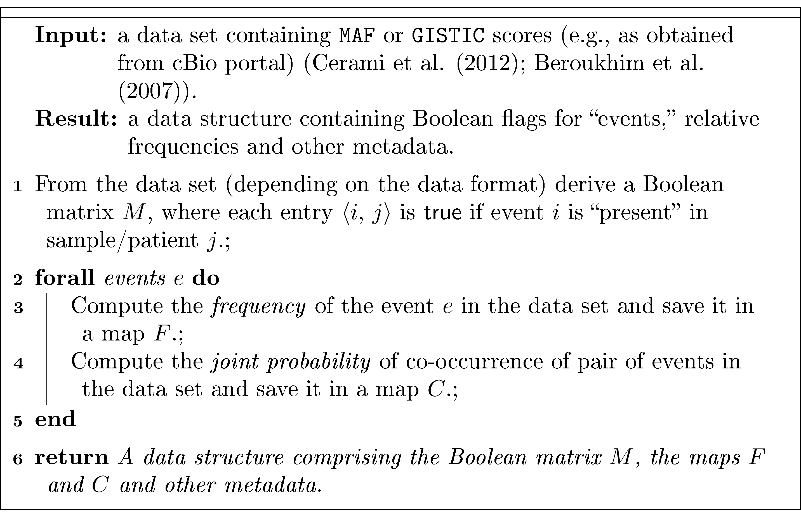
<figcaption>Algorithm 1: <em>TRONCO</em> Data Import and
Preprocessing</figcaption>
</figure>

<figure id="algo:caprese_pseudo">
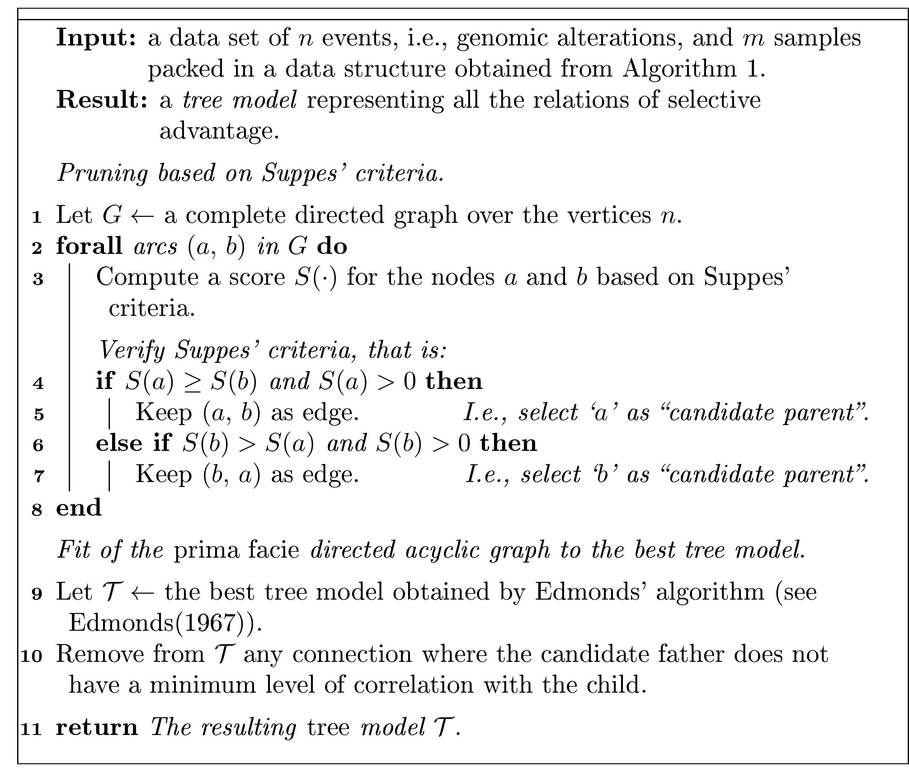
<figcaption>Algorithm 2: <span class="smallcaps">caprese</span>
algorithm</figcaption>
</figure>
<figure id="algo:capri_pseudo">
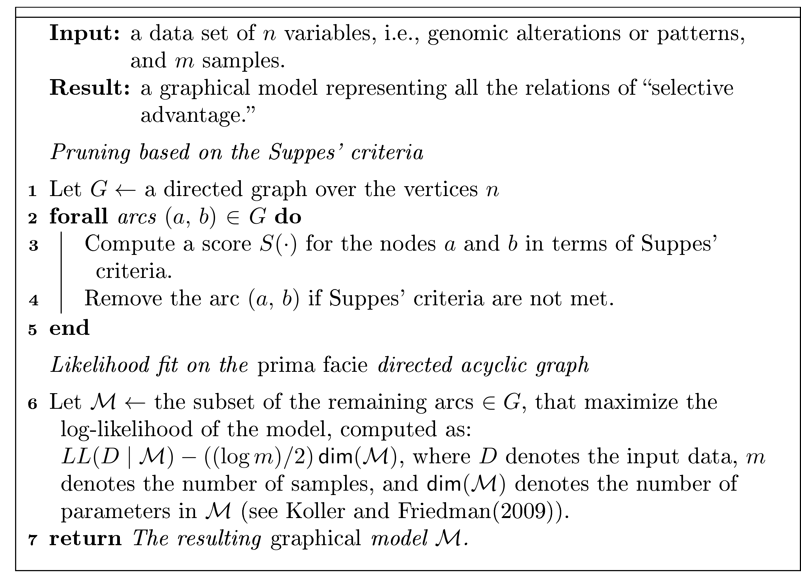
<figcaption>Algorithm 3: <span
class="smallcaps">capri</span></figcaption>
</figure>
<figure id="algo:bootstrap_pseudo">
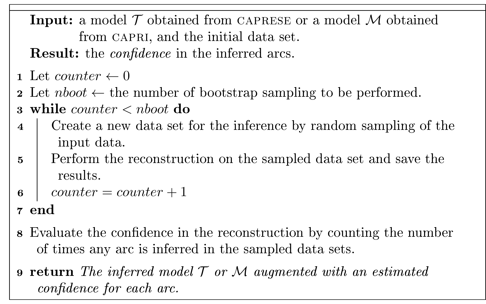
<figcaption>Algorithm 4: Bootstrap Procedure</figcaption>
</figure>

# Package design {#sec:implementation}

In this section we will review the structure and implementation of the
TRONCO package. For the sake of clarity, we will structure the
description through the following functionalities that are implemented
in the package.

-   **Data import.** Functions for the importation of data both from
    flat files (e.g., MAF, GISTIC) and from Web querying
    (e.g., cBioPortal [@cerami2012cbio]).

-   **Data export and correctness.** Functions for the export and
    visualization of the imported data.

-   **Data editing.** Functions for the preprocessing of the data in
    order to tidy them.

-   **External utilities.** Functions for the interaction with external
    tools for the analysis of cancer subtypes or groups of mutually
    exclusive genes.

-   **Inference algorithms.** In the current version of *TRONCO*, the
    [caprese]{.smallcaps} and [capri]{.smallcaps} algorithms are
    provided in a polynomial implementation.

-   **Confidence estimation.** Functions for the statistical estimation
    of the confidence of the reconstructed models.

-   **Visualization.** Functions for the visualization of both the input
    data and the results of the inference and of the confidence
    estimation.

## Data import

The starting point of *TRONCO* analysis pipeline is a data set of
genomics alterations (i.e., somatic mutations and copy number
variations) which need to be imported as a *TRONCO*-compliant data
structure, i.e., a [R]{.smallcaps} list structure containing the
required data both for the inference and the visualization. The data
import functions take as input such genomic data and from them create a
*TRONCO*-compliant data structure consisting in a list variable with the
different parameters needed by the algorithms.

The core of data import from text files, is the function

``` r
    import.genotypes(geno, event.type = "variant", color = "Darkgreen")
```

This function imports a matrix of 0/1 alterations as a *TRONCO*
compliant data set. The input `geno` can be either a dataframe or a file
name. In any case the dataframe or the table stored in the file must
have a column for each altered gene and a row for each sample. Column
names will be used to determine gene names; if data are loaded from a
file, the first column will be assigned as row names.

*TRONCO* imports data from other file format such as MAF and GISTIC, by
providing wrappers of the function `import.genotypes`. Specifically, the
function

``` r
    import.MAF(file, sep = "\t", is.TCGA = TRUE)
```

imports mutation profiles from a *Manual Annotation Format* (MAF) file.
All mutations are aggregated as a unique event type labeled `"Mutation"`
and are assigned a color according to the default of function
`import.genotypes`. If the input is in the TCGA MAF file format, the
function also checks for multiple samples per patient and a warning is
raised if any are found. The function

``` r
    import.GISTIC(x)
```

also transforms GISTIC scores for copy number alterations (CNAs) in a
*TRONCO*-compliant object. The input can be a matrix with columns for
each altered gene and rows for each sample; (in this case
colnames/rownames mut be provided). If the input is a string, an attempt
to load a table from the indicated file is performed. In this case the
input table format should be consistent with TCGA data for focal CNA;
i.e., there should hence be: one column for each sample, one row for
each gene, a column `Hugo_Symbol` with every gene name and a column
`Entrez_Gene_Id` with every gene's Entrez ID. A valid GISTIC score
should be any value of: `"Homozygous Loss"` ($-2$),
`"Heterozygous Loss"` ($-1$), `"Low-level Gain"` ($+1$), and
`"High-level Gain"` ($+2$).

Finally, *TRONCO* also provides utilities for the query of genomic data
from cBioPortal [@cerami2012cbio]. This functionality is provided by the
function

``` r
    cbio.query(cbio.study = NA, cbio.dataset = NA, cbio.profile = NA, genes)
```

which is a wrapper for the `CGDS` package [@CGDS_R_package]. This can
work either automatically, if one sets `cbio.study`, `cbio.dataset` and
`cbio.profile`, or interactively. A list of genes to query with less
than 900 entries should be provided. This function returns a list with
two dataframes: the required genetic profile along with clinical data
for the `cbio.study`. The output is also saved to disk as an `Rdata`
file. See also the cBioPortal webpage at <http://www.cbioportal.org>.

The function

``` r
    show(x, view = 10)
```

prints (on the [R]{.smallcaps} console) a short report of a data set
`x`, which should be a *TRONCO*-compliant data set.

All the functions described in the following sections will assume as
input a *TRONCO*-compliant data structure.

## Data export and correctness

*TRONCO* provides a series of function to explore the imported data and
the inferred models. All these functions are named with the `as.`
prefix.

Given a *TRONCO*-compliant imported data set, the function

``` r
    as.genotypes(x)
```

returns the $0/1$ genotypes matrix. This function can be used in
combination with the function

``` r
    keysToNames(x, matrix)
```

to translate column names to event names, given the input matrix with
colnames/rownames which represent genotypes keys. Also, functions to get
the list of genes, events (i.e., each column in the genotypes matrix, it
differs from genes, as the same genes of different types are considered
different events), alterations (i.e., genes of different types are
merged as $1$ unique event), samples (i.e., patients or also single
cells), and alteration types. See the functions

``` r
    as.genes(x, types = NA)
    as.events(x, genes = NA, types = NA)
    as.alterations(x, new.type = "Alteration", new.color = "khaki")
    as.samples(x)
    as.types(x, genes = NA)
```

Functions of this kind are also implemented to explore the results, most
notably the models that have been inferred

``` r
    as.models(x, models = names(x$model)))
```

the reconstructions

``` r
    as.adj.matrix(x, events = as.events(x), models = names(x$model), type = "fit")
```

the patterns (i.e., the *formulæ*)

``` r
    as.patterns(x)
```

and the confidence

``` r
    as.confidence(x, conf)
```

Similarly, the library defines a set of functions that extract the
cardinality of the compliant *TRONCO* data structure

``` r
    nevents(x, genes = NA, types = NA)
    ngenes(x, types = NA)
    npatterns(x)
    nsamples(x)
    ntypes(x)
```

Furthermore, functions to asses the correctness of the inputs are also
provided. The function

``` r
    is.compliant(x,
                 err.fun = "[ERR]",
                 stage = !(all(is.null(x$stages)) || all(is.na(x$stages))))
```

verifies that the parameter `x` is a compliant data structure. The
function

``` r
    consolidate.data(x, print = FALSE)
```

verifies if the input data are consolidated, i.e., if there are events
with 0 or 1 probability or indistinguishable in terms of observations.
Any indistinguishable event is returned by the function `duplicates(x)`.

Finally, *TRONCO* provides functions to access TCGA data.

``` r
    TCGA.multiple.samples(x)
```

checks whether there are multiple sample in the input, while

``` r
    TCGA.remove.multiple.samples(x)
```

removes them accordingly to TCGA barcodes naming rules.

## Data editing

*TRONCO* provides a wide range of editing functions. We will describe
some of them in the following; for a technical description we refer to
the manual.

### Removing and merging

A set of functions to remove items from the data is provided; such
functions are characterized by the `delete.` prefix. The main functions
are

``` r
    delete.gene(x, gene)
    delete.samples(x, samples)
    delete.type(x, type)
    delete.pattern(x, type)
```

These respectively remove genes, samples (i.e., tumors profiles), types
(i.e., type of alteration such as somatic mutation, copy number
alteratio, etc.), and patterns from a *TRONCO* data structure `x`.
Conversely it is possible to *merge* events and types:

``` r
    merge.events(x, ..., new.event, new.type, event.color)
    merge.types(x,  ..., new.type = "new.type", new.color = "khaki")
```

### Binding

The purpose of the binding functions is to combine different data sets.
The function

``` r
    ebind(...)
```

combines events from one or more data sets, whose events need be defined
over the same set of samples. The function

``` r
    sbind(...)
```

combines samples from one or more data sets, whose samples need to be
defined over the same set of events. Samples and events of two data set
can also be intersected via the function

``` r
    intersect.datasets(x, y, intersect.genomes = TRUE)
```

### Changing and renaming

The functions

``` r
    rename.gene(x, old.name, new.name)
    rename.type(x, old.name, new.name)
```

can be used respectively to rename genes or alterations types.\
The function

``` r
    change.color(x, type, new.color)
```

can be used to change the color associated to the specified alteration
type in `x`.

### Selecting and splitting

Genomics data usually involve a large number of genes, most of which are
not relevant for cancer development (e.g., they may be passenger
mutations). For this reason, *TRONCO* implements the function

``` r
    events.selection(x, filter.freq = NA, filter.in.names = NA,filter.out.names = NA)
```

which allows the user to select a subset of genes to be analyzed. The
selection can be performed by frequency and gene symbols. The $0$
probability events can are removed by the function `trim(x)`. Moreover,
the functions

``` r
    samples.selection(x, samples)
    ssplit(x, clusters, idx = NA)
```

respectively filter a data set `x` based on the selected sample's id and
then splits the data set into clusters (i.e., groups). The last function
can be used to analyze specific subtypes within a tumor.

## External utilities

*TRONCO* permits the interaction with external tools to $(i)$ reduce
inter-tumor heterogeneity by cohort subtyping and $(ii)$ detect fitness
equivalent exclusive alterations. The first issue can be attacked by
adopting clustering techniques to split the data set in order to analyze
each cluster subtype separately. Currently, TRONCO can export and import
data from [@hofree2013network] via the function

``` r
    export.nbs.input(x, map_hugo_entrez, file = "tronco_to_nbs.mat")
```

and the previously described splitting functions.

In order to handle alterations with equivalent fitness, TRONCO interacts
with the tool MUTEX proposed in [@babur2014systematic]. The interaction
is ensured by the functions

``` r
    export.mutex(x,
                 filename = "to_mutex",
                 filepath = "./",
                 label.mutation = "SNV",
                 label.amplification = list("High-level Gain"),
                 label.deletion = list("Homozygous Loss"))
    import.mutex.groups(file, fdr = 0.2, display = TRUE)
```

Such exclusivity groups can then be further added as patterns (see the
next section).

## Inference algorithms {#inference-algorithms}

The current version of TRONCO implements the *progression reconstruction
algorithms* [caprese]{.smallcaps} [@loohuis2014inferring] and
[capri]{.smallcaps} [@ramazzotti2015capri].

#### [caprese]{.smallcaps}.

The [caprese]{.smallcaps} algorithm [@loohuis2014inferring] can be
executed by the function

``` r
    tronco.caprese(data, lambda = 0.5, do.estimation = FALSE, silent = FALSE)
```

with `data` being a *TRONCO* data structure. The parameter `lambda` can
be used to tune the shrinkage-like estimator adopted by CAPRESE, with
the default being $0.5$ as suggested in [@loohuis2014inferring].

#### [capri]{.smallcaps}.

The [capri]{.smallcaps} algorithm [@ramazzotti2015capri] is executed by
the function

``` r
    tronco.capri(data,
                 command = "hc",
                 regularization = c("bic", "aic"),
                 do.boot = TRUE,
                 nboot = 100,
                 pvalue = 0.05,
                 min.boot = 3,
                 min.stat = TRUE,
                 boot.seed = NULL,
                 do.estimation = FALSE,
                 silent = FALSE)
```

with `data` being a *TRONCO* data structure. The parameters `command`
and `regularization` allow respectively to choose the heuristic search
to be performed to fit the network and the regularizer to be used in the
likelihood fit (see [@ramazzotti2015capri]). [capri]{.smallcaps} can be
also executed with or without the bootstrap preprocessing step depending
on the value of the parameter `do.boot`; this is discouraged, but can
speed up the execution with large input data sets.

As discussed in [@ramazzotti2015capri], [capri]{.smallcaps} constrains
the search space using Suppes' *prima facie* conditions which lead to a
subset of possible valid selective advantage relations. The members of
this subset are then evaluated by the likelihood fit. Although uncommon,
it may so happen (especially when patterns are given as input) that such
a resulting *prima facie* graphical structure may still contain cycles.
When this happens, the cycles are removed through the heuristic
algorithm implemented in

``` r
    remove.cycles(adj.matrix,
                  weights.temporal.priority,
                  weights.matrix,
                  not.ordered,
                  hypotheses = NA,
                  silent)
```

The function takes as input a set of weights in terms of confidence for
any valid selective advantage edge; ranks all the valid edges in
increasing confidence levels; and, starting from the less confident,
goes through each edge removing the ones that can break the cycles.

### Patterns

[capri]{.smallcaps} allows for the input of patterns, i.e., group of
events which express possible selective advantage relations. Such
patterns are given as input using the function

``` r
    hypothesis.add(data,
                   pattern.label,
                   lifted.pattern,
                   pattern.effect = "*",
                   pattern.cause =  "*")
```

This function is wrapped within the functions

``` r
    hypothesis.add.homologous(x,
                              pattern.cause = "*",
                              pattern.effect = "*",
                              genes = as.genes(x),
                              FUN = OR)
    hypothesis.add.group(x,
                         FUN,
                         group,
                         pattern.cause = "*",
                         pattern.effect = "*",
                         dim.min = 2,
                         dim.max = length(group),
                         min.prob = 0)
```

which, respectively, allow the addition of analogous patterns
(i.e., patterns involving the same gene of different types) and patterns
involving a specified group of genes. In the current version of
*TRONCO*, the implemented patterns are Boolean, i.e., those expressible
by the Boolean operators AND, OR and XOR (functions `AND(...)`,
`OR(...)`, and `XOR(...)`).

## Confidence estimation

To asses the confidence of the selectivity relations found, *TRONCO*
uses *non-parametric* and *statistical* bootstraps. For the
non-parametric bootstrap, each event row is uniformly sampled with
repetitions from the input genotype and then, on such an input, the
inference algorithms are performed. The assessment concludes after $K$
repetitions (e.g., $K = 100$). Similarly, for [capri]{.smallcaps}, a
statistical bootstrap is provided: in this case the input data set is
kept fixed, but different seeds for the statistical procedures are
sampled (see, e.g., [@wu1986jackknife] for an overview of these
methods). The bootstrap is implemented in the function

``` r
    tronco.bootstrap(reconstruction,
                     type = "non-parametric",
                     nboot = 100,
                     verbose = FALSE)
```

where `reconstruction` is a *TRONCO*-compliant object obtained by the
inference by one of the implemented algorithms.

## Visualization and reporting

During the development of the *TRONCO* package, a lot of attention was
paid to the visualization features which are crucial for the
understanding of biological results. Listed below is a summary of the
main features; for a detailed description of each function, please refer
to the manual.

#### [OncoPrint]{.smallcaps}.

[OncoPrint]{.smallcaps}s are compact means of visualizing distinct
genomic alterations, including somatic mutations, copy number
alterations, and mRNA expression changes across a set of cases. They are
extremely useful for visualizing gene set and pathway alterations across
a set of cases, and for visually identifying trends, such as trends in
mutual exclusivity or co-occurence between gene pairs within a gene set.
Individual genes are represented as rows, and individual cases or
patients are represented as columns. See <http://www.cbioportal.org/>.
The function

``` r
    oncoprint(x)
```

provides such visualizations with a *TRONCO*-compliant data structure as
input. The function

``` r
    oncoprint.cbio(x)
```

exports the input for the cBioPortal visualization, see
<http://www.cbioportal.org/public-portal/oncoprinter.jsp>.

It is also possible to annotate a description and tumor stages to any
oncoprint by means of the functions

``` r
    annotate.description(x, label)
    annotate.stages(x, stages, match.TCGA.patients = FALSE).
```

#### Reconstruction.

The inferred models can be displayed by the function `tronco.plot`. The
features included in the plots are multiple, such as the choice of the
regularizer(s), editing font of nodes and edges, scaling nodes' size in
terms of estimated marginal probabilities, annotating the pathway of
each gene and displaying the estimated confidence of each edge. We refer
to the manual for a detailed description.

#### Reports.

Finally, *TRONCO* provides a number of reporting utilities. The function

``` r
    genes.table.report(x,
                       name,
                       dir = getwd(),
                       maxrow = 33,
                       font = 10,
                       height = 11,
                       width = 8.5,
                       fill = "lightblue")
```

can be used to generate LaTeX code to be used as report, while the
function

``` r
    genes.table.plot(x, name, dir = getwd())
```

generates histograms reports.

# *TRONCO* use cases {#sec:use-cases}

In this section, we will present a case study for the usage of the
*TRONCO* package based on the work presented in [@ramazzotti2015capri].
Specifically, the example is from [@NatGenRP] where they used a
high-throughput *exome sequencing technology* to identity somatically
acquired mutations in $64$ [aCML]{.smallcaps} patients, and found a
previously unidentified recurring *missense point mutation* hitting the
[Setbp1]{.smallcaps} gene.

The example illustrates the typical steps that are necessary to perform
a *progression reconstruction* with *TRONCO*. The steps are the
following:

1.  Selecting "Events".

2.  Adding "Hypotheses".

3.  Reconstructing the "Progression Model".

4.  Bootstrapping the Data.

#### Selecting Events.

We will start by loading the *TRONCO* package in [R]{.smallcaps} along
with an example *data set* that is part of the package distribution.

``` r
> library(TRONCO)
> data(aCML)
> hide.progress.bar <<- TRUE
```

We then use the function `show` to get a short summary of the aCML data
set that has just been loaded.

``` r
> show(aCML)
Description: CAPRI - Bionformatics aCML data.
Dataset: n=64, m=31, |G|=23.
Events (types): Ins/Del, Missense point, Nonsense Ins/Del, Nonsense point.
Colors (plot): darkgoldenrod1, forestgreen, cornflowerblue, coral.
Events (10 shown):
	 gene 4 : Ins/Del TET2
	 gene 5 : Ins/Del EZH2
	 gene 6 : Ins/Del CBL
	 gene 7 : Ins/Del ASXL1
	 gene 29 : Missense point SETBP1
	 gene 30 : Missense point NRAS
	 gene 31 : Missense point KRAS
	 gene 32 : Missense point TET2
	 gene 33 : Missense point EZH2
	 gene 34 : Missense point CBL
Genotypes (10 shown):
          gene 4 gene 5 gene 6 gene 7 gene 29 gene 30 gene 31 gene 32 gene 33 gene 34
patient 1      0      0      0      0       1       0       0       0       0       0
patient 2      0      0      0      0       1       0       0       0       0       1
patient 3      0      0      0      0       1       1       0       0       0       0
patient 4      0      0      0      0       1       0       0       0       0       1
patient 5      0      0      0      0       1       0       0       0       0       0
patient 6      0      0      0      0       1       0       0       0       0       0
```

Using the function `as.events`, we can have a look at the genes flagged
as "mutated" in the data set (i.e., the *events* that *TRONCO* deals
with).

``` r
> as.events(aCML)
         type               event   
gene 4   "Ins/Del"          "TET2"  
gene 5   "Ins/Del"          "EZH2"  
gene 6   "Ins/Del"          "CBL"   
gene 7   "Ins/Del"          "ASXL1" 
gene 29  "Missense point"   "SETBP1"
gene 30  "Missense point"   "NRAS"  
gene 31  "Missense point"   "KRAS"  
gene 32  "Missense point"   "TET2"  
gene 33  "Missense point"   "EZH2"  
...
gene 88  "Nonsense point"   "TET2"  
gene 89  "Nonsense point"   "EZH2"  
gene 91  "Nonsense point"   "ASXL1" 
gene 111 "Nonsense point"   "CSF3R" 
```

These events account for alterations in the following genes.

``` r
> as.genes(aCML)
 [1] "TET2"   "EZH2"   "CBL"    "ASXL1"  "SETBP1" "NRAS"   "KRAS"   "IDH2"   "SUZ12"
[10] "SF3B1"  "JARID2" "EED"    "DNMT3A" "CEBPA"  "EPHB3"  "ETNK1"  "GATA2"  "IRAK4"
[19] "MTA2"   "CSF3R"  "KIT"    "WT1"    "RUNX1" 
```

Now we can take a look at the alterations of only the gene `SETBP1`
across the samples.

``` r
> as.gene(aCML, genes = 'SETBP1')
           Missense point SETBP1
patient 1                      1
patient 2                      1
patient 3                      1
...
patient 12                     1
patient 13                     1
patient 14                     1
patient 15                     0
patient 16                     0
patient 17                     0
...
patient 62                     0
patient 63                     0
patient 64                     0
```

We consider a subset of all the genes in the data set to be involved in
patterns based on the support we found in the literature. See
[@ramazzotti2015capri] as a reference.

``` r
> gene.hypotheses = c('KRAS', 'NRAS', 'IDH1', 'IDH2', 'TET2', 'SF3B1', 'ASXL1')
```

Regardless from which types of mutations we include, we select only the
genes which appear alterated in at least $5\%$ of the patients. Thus, we
first transform the data set into "*alterations*" (i.e., collapsing all
the event types for the same gene) and then we consider only these
events from the original data set.

``` r
> alterations = events.selection(as.alterations(aCML), filter.freq = .05)
*** Aggregating events of type(s) {Ins/Del, Missense point, Nonsense Ins/Del, Nonsense point}
    in a unique event with label "Alteration".
    Dropping event types Ins/Del, Missense point, Nonsense Ins/Del, Nonsense point for 23 genes.
*** Binding events for 2 datasets.
*** Events selection: #events=23, #types=1 Filters freq|in|out = \{TRUE, FALSE, FALSE\}
Minimum event frequency: 0.05 (3 alterations out of 64 samples).
Selected 7 events.

Selected 7 events, returning.
```

We now show a plot of the selected genes. Note that this plot has no
title, as, by default, the function `events.selection` does not add any.
The resulting figure is shown in Figure [2](#fig:oncoprint_fig).

``` r
> oncoprint(alterations, font.row = 12, cellheight = 20, cellwidth = 4)
*** Oncoprint for ""
    with attributes: stage=FALSE, hits=TRUE
Sorting samples ordering to enhance exclusivity patterns.
```

<figure id="fig:oncoprint_fig">
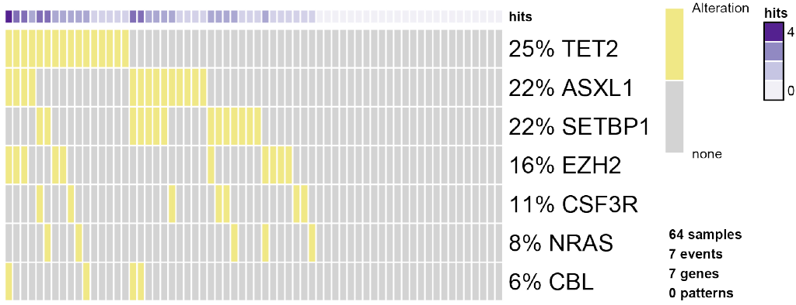
<figcaption>Figure 2: The <code>oncoprint</code> function in
<em>TRONCO</em>. Result of the oncoprint function in <em>TRONCO</em> on
the aCML data set.</figcaption>
</figure>

#### Adding Hypotheses.

We now create the *data set* to be used for the inference of the
progression model. We consider the original data set and from it we
select all the genes whose mutations are occurring at least $5\%$ of the
times together with any gene involved in any hypothesis. To do so, we
use the parameter `filter.in.names` as shown below.

``` r
> hypo = events.selection(aCML,
                          filter.in.names = c(as.genes(alterations),
                          gene.hypotheses))
*** Events selection: #events=31, #types=4 Filters freq|in|out = \{FALSE, TRUE, FALSE\}
[filter.in] Genes hold: TET2, EZH2, CBL, ASXL1, SETBP1 ...  [10/14 found].
Selected 17 events, returning.
> hypo = annotate.description(hypo, 'CAPRI - Bionformatics aCML data (selected events)')
```

We now call `oncoprint` of this latest data set where we annotate the
genes in `gene.hypotheses` in order to identify them in Figure
[3](#fig:oncoprint_fig_annotated). The sample names are also shown.

``` r
> oncoprint(hypo,
            gene.annot = list(priors = gene.hypotheses),
            sample.id = T,
            font.row = 12,
            font.column = 5,
            cellheight = 20,
            cellwidth = 4)
*** Oncoprint for "CAPRI - Bionformatics aCML data (selected events)"
    with attributes: stage=FALSE, hits=TRUE
    Sorting samples ordering to enhance exclusivity patterns.
    Annotating genes with RColorBrewer color palette Set1 .
```

<figure id="fig:oncoprint_fig_annotated">
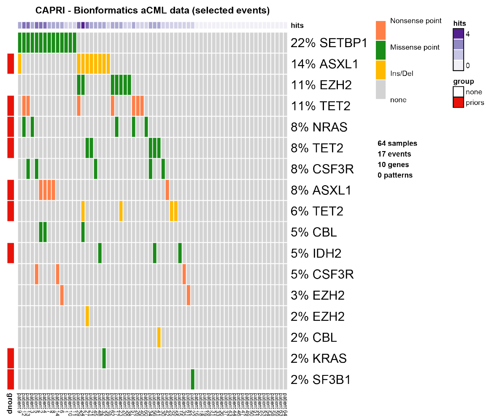
<figcaption>Figure 3: Annotated <code>oncoprint</code>. Result of the
oncoprint function on the selected data set in <em>TRONCO</em> with
annotations.</figcaption>
</figure>

We now also add the hypotheses that are described in CAPRI's manuscript.
Hypothesis of hard exclusivity (XOR) for NRAS/KRAS events (Mutation).
This hypothesis is tested against all the events in the data set.

``` r
> hypo = hypothesis.add(hypo, 'NRAS xor KRAS', XOR('NRAS', 'KRAS'))
```

We then try to include also a soft exclusivity (OR) pattern but, since
its "*signature*" is the same of the hard one just included, it will not
be included. The code below is expected to result in an error.

``` r
> hypo = hypothesis.add(hypo, 'NRAS or KRAS',  OR('NRAS', 'KRAS'))
Error in hypothesis.add(hypo, "NRAS or KRAS", OR("NRAS", "KRAS")) : 
  [ERR] Pattern duplicates Pattern NRAS xor KRAS. 
```

To better highlight the perfect (hard) exclusivity among NRAS/KRAS
mutations, one can examine further their alterations. See Figure
[4](#fig:oncoprint_fig_ras).

``` r
> oncoprint(events.selection(hypo,
                             filter.in.names = c('KRAS', 'NRAS')),
                             font.row = 12, 
                             cellheight = 20,
                             cellwidth = 4)
*** Events selection: #events=18, #types=4 Filters freq|in|out = \{FALSE, TRUE, FALSE\}
[filter.in] Genes hold: KRAS, NRAS ...  [2/2 found].
Selected 2 events, returning.
*** Oncoprint for ""
    with attributes: stage=FALSE, hits=TRUE
    Sorting samples ordering to enhance exclusivity patterns.
```

<figure id="fig:oncoprint_fig_ras">
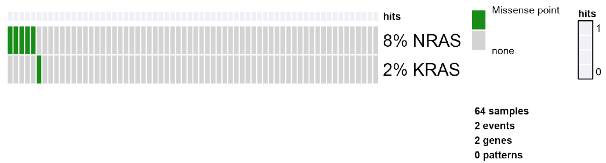
<figcaption>Figure 4: RAS <code>oncoprint</code>. Result of the
<code>oncoprint</code> function in <em>TRONCO</em> for only the RAS
genes to better show their hard exclusivity pattern.</figcaption>
</figure>

We repeated the same analysis as before for other hypotheses and for the
same reasons, we will include only the hard exclusivity pattern.

``` r
> hypo = hypothesis.add(hypo, 'SF3B1 xor ASXL1', XOR('SF3B1', OR('ASXL1')), '*')
> hypo = hypothesis.add(hypo, 'SF3B1 or ASXL1', OR('SF3B1', OR('ASXL1')), '*')
Error in hypothesis.add(hypo, "SF3B1 or ASXL1", OR("SF3B1", OR("ASXL1")),  : 
  [ERR] Pattern duplicates Pattern SF3B1 xor ASXL1.
```

Finally, we now repeat the same for genes TET2 and IDH2. In this case
three events for the gene TET2 are present: `"Ins/Del"`,
`"Missense point"` and `"Nonsense point"`. For this reason, since we are
not specifying any subset of such events to be considered, all TET2
alterations are used. Since the events present a perfect hard
exclusivity, their patterns will be included as a XOR. See Figure
[5](#fig:oncoprint_fig_tet_idh2).

``` r
> as.events(hypo, genes = 'TET2')
        type             event 
gene 4  "Ins/Del"        "TET2"
gene 32 "Missense point" "TET2"
gene 88 "Nonsense point" "TET2"
> hypo = hypothesis.add(hypo, 'TET2 xor IDH2', XOR('TET2', 'IDH2'), '*')
> hypo = hypothesis.add(hypo, 'TET2 or IDH2', OR('TET2', 'IDH2'), '*')
> oncoprint(events.selection(hypo, filter.in.names = c('TET2', 'IDH2')), font.row = 12,
	                         cellheight = 20, cellwidth = 4)
*** Events selection: #events=21, #types=4 Filters freq|in|out = \{FALSE, TRUE, FALSE\}
[filter.in] Genes hold: TET2, IDH2 ...  [2/2 found].
Selected 4 events, returning.
*** Oncoprint for ""
    with attributes: stage=FALSE, hits=TRUE
    Sorting samples ordering to enhance exclusivity patterns.
```

<figure id="fig:oncoprint_fig_tet_idh2">
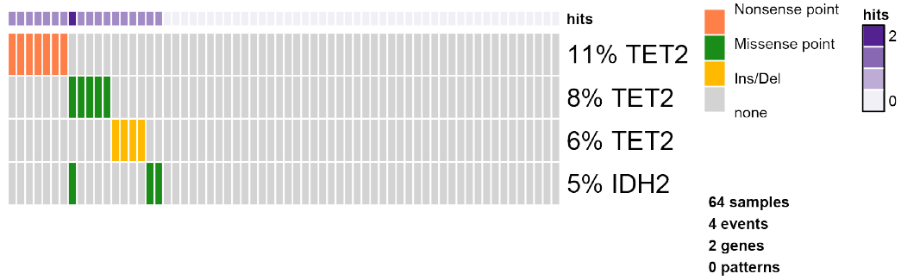
<figcaption>Figure 5: TET/IDH2 <code>oncoprint</code>. Result of the
<code>oncoprint</code> function in <em>TRONCO</em> for only the TET/IDH2
genes.</figcaption>
</figure>

We now finally add any possible group of homologous events. For any gene
having more than one event associated to it, we also add a soft
exclusivity pattern among them.

``` r
> hypo = hypothesis.add.homologous(hypo)
*** Adding hypotheses for Homologous Patterns
 Genes: TET2, EZH2, CBL, ASXL1, CSF3R 
 Function: OR 
 Cause: * 
 Effect: * 
Hypothesis created for all possible gene patterns.
```

The final data set that will be given as input to CAPRI is now finally
shown. See Figure [6](#fig:oncoprint_fig_final).

``` r
> oncoprint(hypo,
            gene.annot = list(priors = gene.hypotheses),
            sample.id = T,
            font.row = 10, 
            font.column = 5,
            cellheight = 15,
            cellwidth = 4)
*** Oncoprint for "CAPRI - Bionformatics aCML data (selected events)"
    with attributes: stage=FALSE, hits=TRUE
    Sorting samples ordering to enhance exclusivity patterns.
    Annotating genes with RColorBrewer color palette Set1 .
```

<figure id="fig:oncoprint_fig_final">
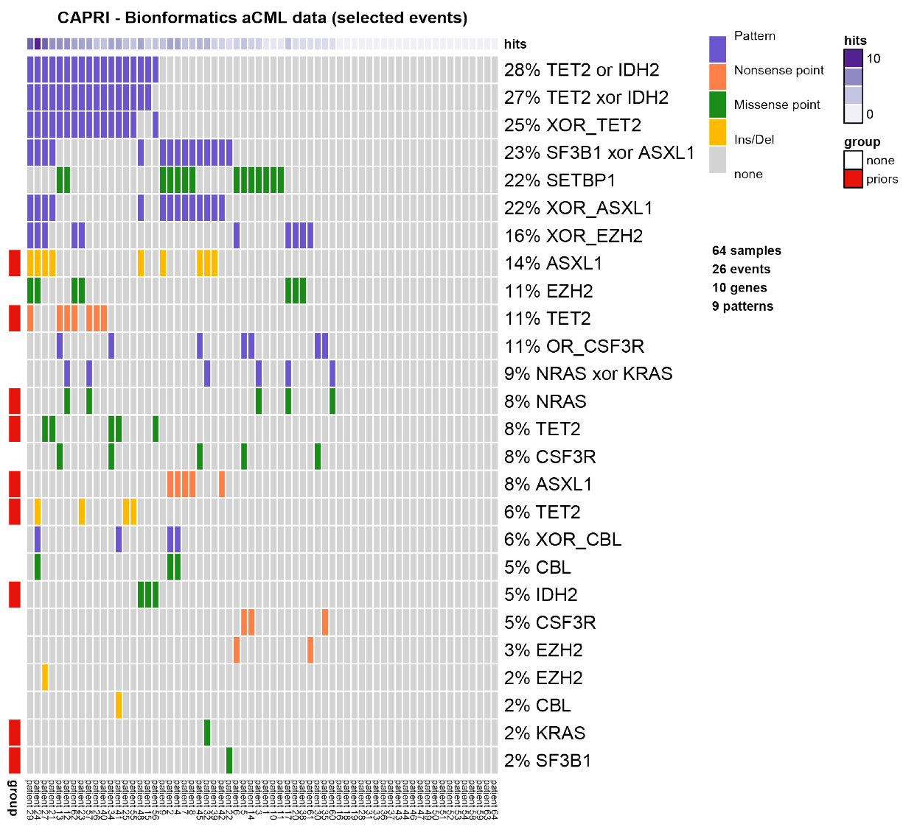
<figcaption>Figure 6: Final data set for <span
class="smallcaps">capri</span>. Result of the <code>oncoprint</code>
function in <em>TRONCO</em> on the data set used in <span
class="citation" data-cites="ramazzotti2015capri">(Ramazzotti et al.
2015)</span>.</figcaption>
</figure>

#### Reconstructing Progression Models.

We next infer the model by running the [capri]{.smallcaps} algorithm
with its default parameters: we use both AIC and BIC as regularizers;
Hill-climbing as heuristic search of the solutions; and exhaustive
bootstrap (`nboot` replicates or more for Wilcoxon testing, i.e., more
iterations can be performed if samples are rejected), p-value set at
$0.05$. We set the seed for the sake of reproducibility.

``` r
> model = tronco.capri(hypo, boot.seed = 12345, nboot = 10)
*** Checking input events.
*** Inferring a progression model with the following settings.
	Dataset size: n = 64, m = 26.
	Algorithm: CAPRI with "bic, aic" regularization and "hc" likelihood-fit strategy.
	Random seed: 12345.
	Bootstrap iterations (Wilcoxon): 10.
		exhaustive bootstrap: TRUE.
		p-value: 0.05.
		minimum bootstrapped scores: 3.
*** Bootstraping selective advantage scores (prima facie).
	Evaluating "temporal priority" (Wilcoxon, p-value 0.05)
	Evaluating "probability raising" (Wilcoxon, p-value 0.05)
*** Loop detection found loops to break.
	Removed 26 edges out of 68 (38%)
*** Performing likelihood-fit with regularization bic.
*** Performing likelihood-fit with regularization aic.
The reconstruction has been successfully completed in 00h:00m:02s
```

We then plot the model inferred by [capri]{.smallcaps} with BIC as a
regularizer and we set some parameters to get a good plot; the
confidence of each edge is shown both in terms of temporal priority and
probability raising (selective advantage scores), and hypergeometric
testing (statistical relevance of the data set of input). See Figure
[7](#fig:reconstruction).

``` r
> tronco.plot(model,
              fontsize = 13,
              scale.nodes = .6,
              regularization = "bic",
              confidence = c('tp', 'pr', 'hg'),
              height.logic = 0.25,
              legend.cex = .5,
              pathways =  list(priors = gene.hypotheses),
              label.edge.size = 5)
*** Expanding hypotheses syntax as graph nodes:
*** Rendering graphics
    Nodes with no incoming/outgoing edges will not be displayed.
    Annotating nodes with pathway information. 
    Annotating pathways with RColorBrewer color palette Set1 .
    Adding confidence information: tp, pr, hg 
    RGraphviz object prepared.
    Plotting graph and adding legends.
```

<figure id="fig:reconstruction">
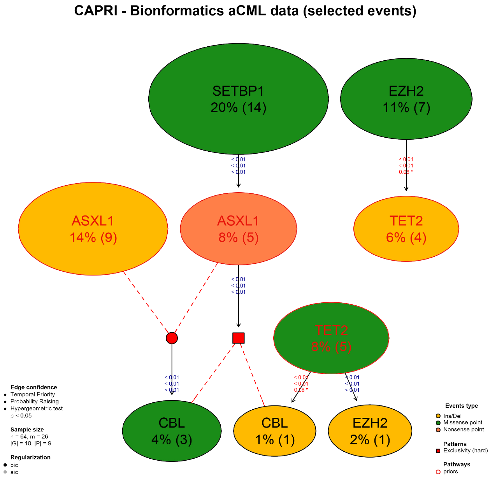
<figcaption>Figure 7: Reconstruction by <span
class="smallcaps">capri</span>. Result of the reconstruction by <span
class="smallcaps">capri</span> on the input data set.</figcaption>
</figure>

#### Bootstrapping the Data.

Finally, we perform non-parametric bootstrap as a further estimation of
the confidence in the inferred results. See Figure
[8](#fig:reconstruction_bootstrap).

``` r
> model.boot = tronco.bootstrap(model, nboot = 10)
Executing now the bootstrap procedure, this may take a long time...
Expected completion in approx. 00h:00m:03s 
*** Using 7 cores via "parallel" 

*** Reducing results

Performed non-parametric bootstrap with 10 resampling and 0.05 as pvalue 
for the statistical tests.

> tronco.plot(model.boot,
              fontsize = 13,
              scale.nodes = 0.6,
              regularization = "bic",
              confidence = c('npb'), 
              height.logic = 0.25,
              legend.cex = 0.5,
              pathways = list(priors = gene.hypotheses),
              label.edge.size = 10)
*** Expanding hypotheses syntax as graph nodes:
*** Rendering graphics
Nodes with no incoming/outgoing edges will not be displayed.
Annotating nodes with pathway information. 
Annotating pathways with RColorBrewer color palette Set1 .
Adding confidence information: npb 
RGraphviz object prepared.
Plotting graph and adding legends.
```

<figure id="fig:reconstruction_bootstrap">
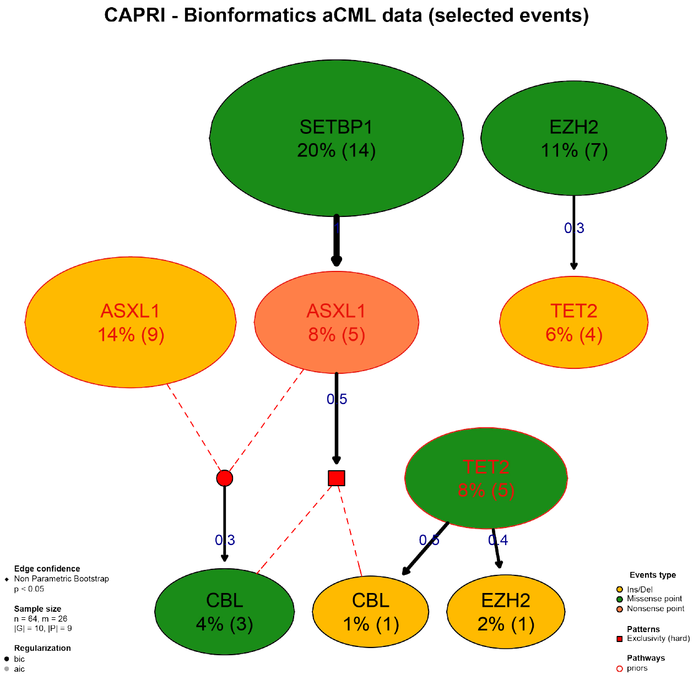
<figcaption>Figure 8: Reconstruction by <span
class="smallcaps">capri</span> and Bootstrap. Result of the
reconstruction by <span class="smallcaps">capri</span> on the input data
set with the assessment by non-parametric bootstrap.</figcaption>
</figure>

We now conclude this analysis with an example of inference with the
[caprese]{.smallcaps} algorithm. As [caprese]{.smallcaps} does not
consider any pattern as input, we use the data set shown in
Figure [3](#fig:oncoprint_fig_annotated). These results are shown in
Figure [9](#fig:reconstruction_bootstrap_caprese).

``` r
> model.boot.caprese = tronco.bootstrap(tronco.caprese(hypo))
*** Checking input events.
*** Inferring a progression model with the following settings.
	Dataset size: n = 64, m = 17.
	Algorithm: CAPRESE with shrinkage coefficient: 0.5.
The reconstruction has been successfully completed in 00h:00m:00s 
Executing now the bootstrap procedure, this may take a long time...
Expected completion in approx. 00h:00m:00s 

Performed non-parametric bootstrap with 100 resampling and 0.5
as shrinkage parameter.

> tronco.plot(model.boot.caprese,
              fontsize = 13,
              scale.nodes = 0.6,
              confidence = c('npb'), 
              height.logic = 0.25,
              legend.cex = 0.5,
              pathways = list(priors = gene.hypotheses),
              label.edge.size = 10, 
              legend.pos = "top")
*** Expanding hypotheses syntax as graph nodes:
*** Rendering graphics
    Nodes with no incoming/outgoing edges will not be displayed.
    Annotating nodes with pathway information. 
    Annotating pathways with RColorBrewer color palette Set1 .
    Adding confidence information: npb 
    RGraphviz object prepared.
    Plotting graph and adding legends.
```

<figure id="fig:reconstruction_bootstrap_caprese">
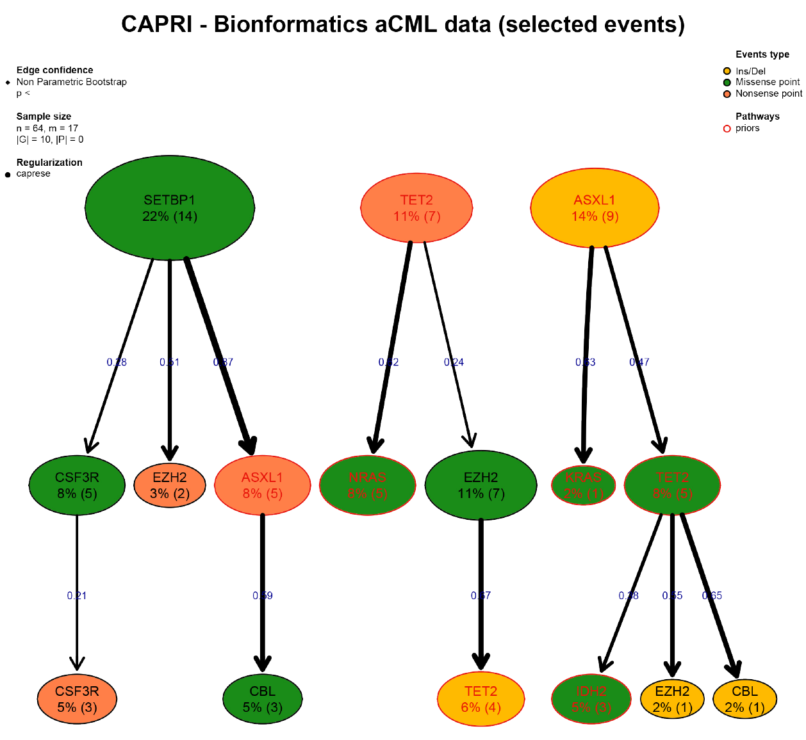
<figcaption>Figure 9: Reconstruction by <span
class="smallcaps">caprese</span> and Bootstrap. Result of the
reconstruction by <span class="smallcaps">caprese</span> on the input
data set with the assessment by non-parametric bootstrap.</figcaption>
</figure>

# Conclusions {#sec:conclusion}

We have described *TRONCO*, an [R]{.smallcaps} package that provides
state-of-the-art techniques to support the user during the analysis of
cross-sectional genomic data with the aim of understanding cancer
evolution. In the current version, *TRONCO* implements the
[caprese]{.smallcaps} and [capri]{.smallcaps} algorithms for cancer
progression inference together with functionalities to load input
cross-sectional data, set up the execution of the algorithms, assess the
statistical confidence in the results, and visualize the inferred
models.

#### Financial support.

MA, GM, GC, AG, DR acknowledge Regione Lombardia (Italy) for the
research projects RetroNet through the ASTIL Program
\[12-4-5148000-40\]; U.A 053 and Network Enabled Drug Design project
\[ID14546A Rif SAL-7\], Fondo Accordi Istituzionali 2009. BM
acknowledges founding by the NSF grants CCF-0836649, CCF-0926166 and a
NCI-PSOC grant.
:::

[^1]: For [capri]{.smallcaps} the $n$ actually depends on the structural
    complexity of the input "patterns," i.e., of the Boolean
    formulæ employed in the "lifting operation;" more information of
    this in [@ramazzotti2015capri].
