# Introduction {#sec:introduction}

While measuring diversity is a natural topic in ecology and biology, the
rise of complexity and big data research has also provided new
opportunities for researchers in various fields of social sciences to
understand the evolution of diversity in social, economic, and political
systems [@nature_diversity_2014].

Today, a large range of scientific fields make use of diversity
measures, including ecologists calculating the diversity of species
[@forey_systematics_1994], sociologists measuring the structure of
communities [@haughton_economic_1995], economists studying the
diversification of exports or financial assets [@hidalgo_building_2009],
scientometrists analyzing the diversity and interdisciplinarity of
research fields
[@rafols_knowledge_2014; @chavarro_interdisciplinarity_2014; @wagner_approaches_2011],
and computer scientists searching for new diversity methods to ensemble
algorithms [@kuncheva_measures_2003].

Consequently, different fields of science have created several
specialized R packages on diversity. This includes packages that allow
for the analysis of species and biodiversity,
(e.g. [*entropart*](https://CRAN.R-project.org/package=entropart)
[@marcon_entropart:_2015],
[*vegan*](https://CRAN.R-project.org/package=vegan)
[@oksanen_vegan:_2016],
[*biodiversityR*](https://CRAN.R-project.org/package=biodiversityR)
[@kindt_tree_2005]), social distances
(e.g. [*Blaunet*](https://CRAN.R-project.org/package=Blaunet)
[@wang_blaunet:_2016]), genetics
(e.g. [*diveRsity*](https://CRAN.R-project.org/package=diveRsity)
[@keenan_diversity:_2013]), biological systems
(e.g. [*divo*](https://CRAN.R-project.org/package=divo)
[@pietrzak_divo:_2016]), functional ecology
(e.g. [*FD*](https://CRAN.R-project.org/package=FD),
[@laliberte_distance-based_2010]), species complexity
(e.g. [*hierDiversity*](https://CRAN.R-project.org/package=hierDiversity)
[@marion_hierdiversity:_2015]), bootstrapping diversity indices
(e.g. [*simboot*](https://CRAN.R-project.org/package=simboot)
[@scherer_simboot:_2014]), disparity of phylogenetic trees
(e.g. [*treescape*](https://CRAN.R-project.org/package=treescape)
[@jombart_treescape:_2016]) or phylogenetic patterns
(e.g. [*SYNCSA*](https://CRAN.R-project.org/package=SYNCSA)
[@debastiani_syncsa_2012]).

Most packages on diversity are in the fields of ecology, biology and
other natural sciences. Each discipline and respective package uses the
particular terminology of its scientific field. It is important to
translate the existing mathematical diversity formulas into the relevant
concepts and language of each community, and thereby also helps to
create new specialized measures considering the particular research
topics and demands of each community. But the thematic specialization
can also make interdisciplinary communication difficult and reduces the
chances of the adoption of these new measures, concepts and specialized
packages by researchers outside of the particular scientific field.

In recent years, an increasingly large number of research projects in
social and interdisciplinary sciences are exploring the role of
diversity in complex socioeconomic systems. These new approaches in
social and interdisciplinary sciences use existing diversity concepts
from biological and natural sciences, but also have their own particular
needs and concepts. For instance, recent work in economics,
scientometrics and network science has highlighted the importance of
diversification processes in complex systems, such as research,
financial and energy portfolios, cultural diversity, the diversity of
ties in social and economic networks, or the emergence of new or related
scientific and economic fields
[@hidalgo_product_2007; @frenken_related_2007; @rafols_science_2010; @chavarro_interdisciplinarity_2014; @guevara_research_2016; @eagle_network_2010; @farchy_measuring_2011].

Here we present the package
[*diverse*](https://CRAN.R-project.org/package=diverse) which aims to
provide a useful toolkit for social scientists and interdisciplinary
teams to measure and visualize diversity in socioeconomic systems, by
providing several of the most used measures of diversity and allowing
for versatility with existing R packages on diversity, focusing, for
example, on the calculation of similarity and distance measures
([*proxy*](https://CRAN.R-project.org/package=proxy)
[@meyer_proxy:_2015]); bias corrected diversity measures (*entropart*
[@marcon_entropart:_2015]); or the visualization of diversity in
matrices, treemaps and networks
([*pheatmap*](https://CRAN.R-project.org/package=pheatmap)
[@kolde_pheatmap:_2015],
[*treemap*](https://CRAN.R-project.org/package=treemap)
[@kindt_tree_2005], and
[*igraph*](https://CRAN.R-project.org/package=igraph)
[@kindt_tree_2005]).

The package applies a diversity taxonomy that includes the variety,
balance and disparity of complex systems [@stirling_general_2007]. The
package *diverse* allows researchers to:

1.  Read input and process data from complex systems in a simple manner.

2.  Compute some of the most commonly used measures of diversity across
    sciences---including Shannon-Entropy, Herfindahl-Hirschman Index,
    Gini-Simpson Index or Berger-Parker Index.

3.  Calculate complementary measures that are related to diversity, such
    as ubiquity, disparity or similarity between categories and
    entities.

4.  Apply advanced diversity measures such as Rao-Stirling diversity and
    other diversity measures including weighting parameters.

5.  Visualize different dimensions of diversity as variety, balance, or
    disparity.

The package *diverse* is available within CRAN. The newest development
version is accessible at the branch *development* of the Git repository
[github.com/mguevara/diverse](https://github.com/mguevara/diverse). In
this Git repository interested users are also very welcome to submit
[issues](https://github.com/mguevara/diverse/issues).

The remainder of the article is organized as follows. In Section
[2](#sec:concepts) we describe different dimensions of diversity. In
Section [3](#sec:data) we explain which type of data can be
read/imported into the package and how it can be normalized, using for
instance either binary, absolute or relative values. In Section
[4](#sec:measuring) we present the measures available in this package
discussing how researchers can use them to calculate different
dimensions of diversity. In Section [5](#sec:simulations) we explain
functions that are included in the package to simulate data and conduct
bias, coverage, and performance tests. In Section [6](#sec:conclusions)
we summarize and briefly discuss the limitations and advantages of the
package.

# Diversity {#sec:concepts}

In this section we explain key properties of diversity with the help of
example datasets.

## Example data

To illustrate the use of the package *diverse*, we will work with three
datasets: Pantheon, Scidat and Geese.

-   Pantheon is a sample of 10 countries from MIT's Pantheon project
    [@macroconnections_mit_medialab_pantheon_2014]. This dataset allows
    for a comparison of the diversity of occupations of the globally
    famous people from each country. The complete dataset includes
    $11341$ persons classified in $88$ distinct occupations and assigned
    to $195$ countries [@yu_pantheon_2016].

-   Scidat is an aggregation of the number of scientific publications
    assigned to 27 areas of science. This dataset was aggregated over
    the raw data of [@scimago_scimago_2007]. Scidat includes a sample of
    10 countries from the year 2013.

-   The third dataset is on the geese population in the Netherlands and
    was published by the Sovon Dutch Centre for Field Ornithology
    [@sovon_vogelonderzoek_nederland_sovon_2015]. This dataset presents
    observations of 4 species of geese over a period of 11 years.

The three datasets are included in the package *diverse*. The subset of
the Pantheon dataset is included as a `"data.frame"` object and both the
Scidat and Geese datasets are included as a `"matrix"` object.

## The actors and concepts of diversity

We use the term entity to describe the systems or agents that host a set
of categories. Entities could be, for example, persons, companies,
countries, regions, institutions, or years.

We also use the term category to identify the different types of species
that define the diversity of an entity. Categories could include types
of animals, species of plants, fields of research, taxonomies of
products, or technologies. The package assumes that the imported dataset
has a previously given classification scheme.

The terms value or value of abundance is used for the amount of a
category in each entity. This could be the quantity of each species in
an ecosystem, or the total value of the different types of export goods
of an economy.

In Pantheon, entities are countries, categories are different types of
occupations, and values are the respective number of globally famous
persons a country has in each category. In Scidat, entities are
countries, categories are SCimago's areas of science, and values are the
total number of citable documents that a country has published in each
area in 2013. In Geese, entities are years, categories are species of
geese, and values are the number of each species of geese observed in
the Netherlands in the respective year.

Pantheon is a good example of data where some entities have missing
values in some categories. Scidat is a useful example where most
entities have values in each category yet have very large absolute
differences between their values. The Geese dataset is a good example of
the temporal evolution of natural species.

It must be noted that in most diversity measures (e.g. variety or
Shannon entropy) the information about the number and types of
categories of a single entity is sufficient to calculate this entity's
diversity. However *diverse* is oriented to also work with multiple
entities. Therefore it allows for the calculation of different distance
and similarity matrices across categories and entities, and uses these
distance measures in diversity measures like the Rao-Stirling Index
[@stirling_general_2007]. Moreover, *diverse* allows for the calculation
of relative specialization measures like the activity index or revealed
comparative advantages (RCAs) that takes the portfolio and size of other
entities into account when evaluating their relative specialization or
comparative advantages (e.g. Belgium versus USA) (see Section
[3.3](#sec:normalization)). Subsequently, we will mainly use data
examples with multiple entities and categories. Nonetheless, many
measures embedded in *diverse* can also be used to track the evolution
of the diversity within a single entity.

Regarding the concept of diversity, previous interdisciplinary studies
on diversity
[@rao_diversity_1982; @stirling_economics_1998; @mcdonald_conceptualization_2003; @stirling_general_2007]
showed that the concept of diversity is related to three main questions:

1.  How many categories does an entity (and/or does each entity in a
    system) have?

2.  How much of each category does an entity (and/or each entity in a
    system) have?

3.  How distinct are the categories of an entity (and/or the categories
    of each entity in a system)?

@stirling_economics_1998 [@stirling_general_2007] categorized these
three properties of diversity as variety, balance, and disparity. Most
diversity measures combine and emphasize these aspects with varying
weights. Comprehensive measures take all three dimensions deliberately
into account. Moreover data visualization methods and R packages like,
for instance, *treemap* [@tennekes_treemap:_2016] or *igraph*
[@csardi_igraph_2006] can help to visualize these three dimensions of
diversity. For instance, treemaps---allow for an emphasis on variety and
balance [@hausmann_atlas_2011 p.105]---or network overlays maps allow
for an emphasis on disparity
[@hidalgo_product_2007; @rafols_science_2010]. The disparity dimension
is often implied by a previous classification scheme, like a given
classification of types of animals, scientific fields or exports,
phylogenetic trees and/or it can alternatively be calculated based on a
similarity or distance matrix (see also Section
[4.4.1](#sec:dissimilarities)).

As an example, Figure [1](#figure:pantheon) presents treemaps about the
diversity of occupations of globally famous individuals from Canada and
Uruguay according to MIT's Pantheon. Variety is represented by the
number of boxes, balance is indicated by the differences in the size of
the boxes (= percentage of the category), and disparity is represented
by different colors.

First, regarding the variety, it is clear that Canada has a larger
number of different occupations (27 boxes in Figure
[1](#figure:pantheon)a) than Uruguay (4 boxes in Figure
[1](#figure:pantheon)b). Second, regarding the balance, we can observe
that Uruguay's concentration in terms of soccer players is very high
(52.63%), while Canada's balance is less concentrated on one category,
but is spread across more occupations of the Pantheon dataset. The R
package *treemap* or other specialized data visualization programs like
[D3plus](http://d3plus.org/) allows for the creation of such treemaps
with different colors, text sizes and further visualization options.

<figure id="figure:pantheon">
<table>
<caption> </caption>
<tbody>
<tr class="odd">
<td style="text-align: center;">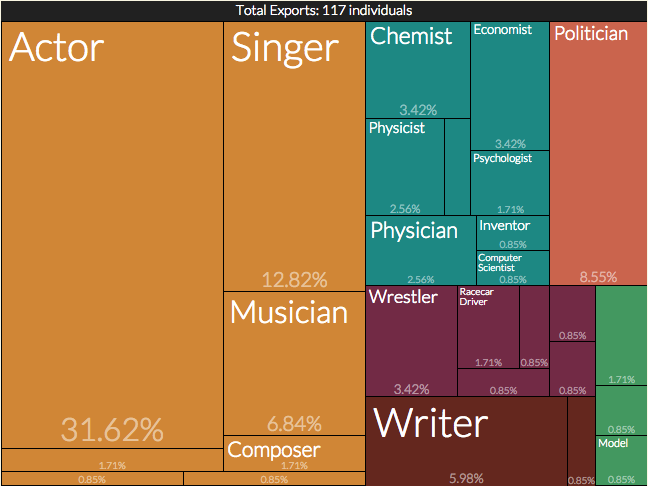</td>
<td style="text-align: center;">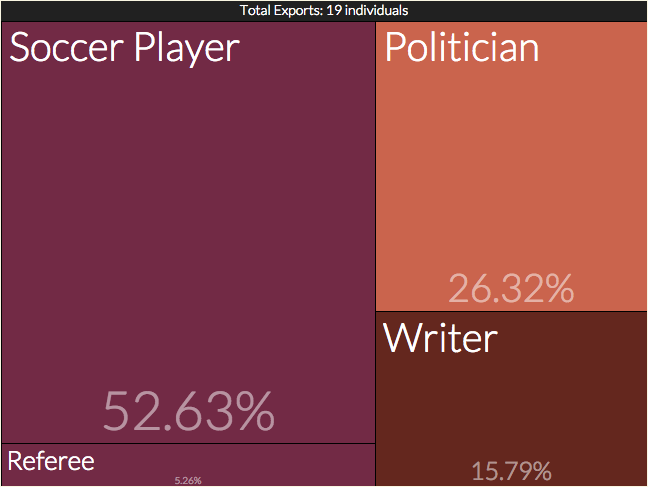</td>
</tr>
<tr class="even">
<td style="text-align: center;">(a) Canada</td>
<td style="text-align: center;">(b) Uruguay</td>
</tr>
</tbody>
</table>
<figcaption>Figure 1: Globally famous people according to Pantheon
dataset. The size of the boxes is proportional to the number of people
assigned to each occupation and born in that country. The color is
according to main domains of occupations. Source <a
href="http://pantheon.media.mit.edu"
class="uri">http://pantheon.media.mit.edu</a>.</figcaption>
</figure>

To illustrate disparity, Figure [2](#figure:graph)a shows a similarity
network between areas of science that was obtained by considering each
column as a vector of features (i.e. the number of articles of each
country in that category) and then computing the cosine (dis-)similarity
between those vectors. The pre-process options embedded in the package
allows for the calculation of different types of similarity and distance
matrices and considers both the absolute shares as well as relative
strengths/specializations/comparative advantages of entities (see
Section on [3.3](#sec:normalization)).

As expected, we can observe that \"Social Sciences\" are close to \"Arts
and Humanities,\" but more distant from \"Mathematics\" or
\"Engineering.\" We can also see the clustering between natural sciences
and technological fields, like \"Chemistry\" and \"Material Sciences.\"
The disparity within a country is high if the dissimilarities between
the areas/categories, in which the country has values, are also high.

In so-called overlay networks [@rafols_science_2010], the values of
entities (which are countries in the present dataset) are overlaid on
the global network structure. Moreover, the variety is represented by
the number of colored nodes, and the dimension balance can be
represented by the size of the nodes. Figure [2](#figure:graph)b
illustrates that in the Scidat example, Germany has comparative
advantages (see the section on [3.3](#sec:normalization) for details) in
many fields of science across the network, while China (Figure
[2](#figure:graph)c) is more specialized (concentrated) in technological
areas and engineering. In consequence the disparity, variety and balance
in Germany are higher than in China. Such network overlay maps can, for
instance, be made with the R package *igraph*.

<figure id="figure:graph">
<table>
<caption> </caption>
<tbody>
<tr class="odd">
<td style="text-align: center;">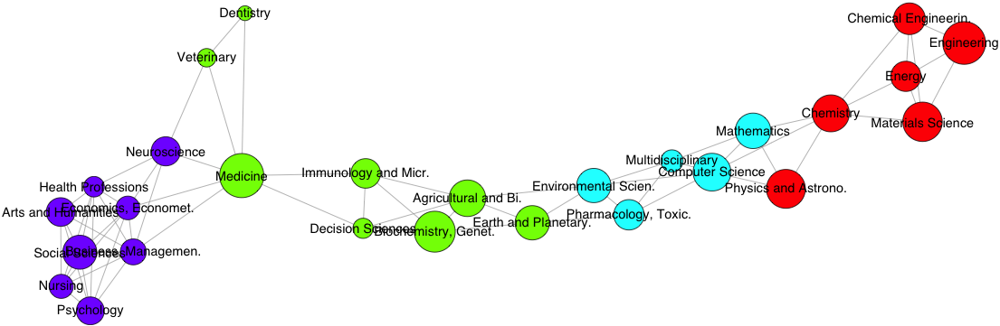</td>
</tr>
<tr class="even">
<td style="text-align: center;">(a) Network of similarities between
areas of science.</td>
</tr>
</tbody>
</table>
<table>
<caption> </caption>
<tbody>
<tr class="odd">
<td style="text-align: center;">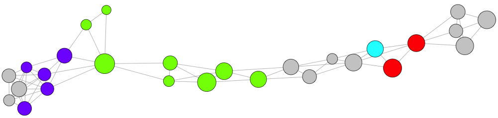</td>
<td style="text-align: center;">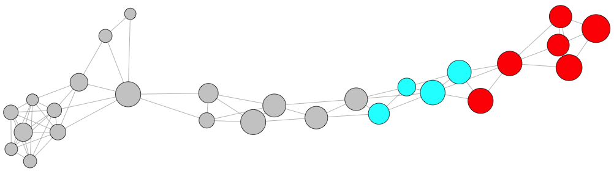</td>
</tr>
<tr class="even">
<td style="text-align: center;">(b) Overlay network for Germany.</td>
<td style="text-align: center;">(c) Overlay network for China.</td>
</tr>
</tbody>
</table>
<figcaption>Figure 2: Cosine similarity network of 27 areas of science
obtained with Scidat dataset. Links represent the (dis)similarities
between areas. Links below the threshold of 0.015 of Cosine similarity
are not illustrated. The force-directed algorithm Fruchterman-Reingold
was used for the network layout. The size of the nodes in a represents
the total number of papers authored by the 10 countries included in
Scidat; the size of the nodes in b and c is proportional to the papers
authored for each country. Colors are according to communities detected
by the algorithm fastgreedy. The grey-colored nodes identify areas with
Revealed Comparative Advantages RCA below 1 (see section on for
details).</figcaption>
</figure>

In the following sections we will detail how to import and transform
data, and how to use the *diverse* package to quantify the described
properties of diversity.

# Input data {#sec:data}

This section details the type of the data object that is required by the
package, how to import data from an external data file, and how to
pre-process or normalize the raw data.

## Input formats

Since *diverse* was created to be able to work with multiple categories
($N$) and multiple entities ($M$) simultaneously, the data objects used
for most of the functions in the package *diverse* can be either a data
frame or a matrix of size $M \times N$.

In the case of a data frame---meaning that the data is shaped as an edge
list---it has to have three columns in this order: entity, category and
value. The first two columns are of the type `"factor"` and the third
column is of type `"numeric"`. The `pantheon` data frame is an example
of this type of data object.

``` r
str(pantheon)
'data.frame':	119 obs. of  3 variables:
 $ Country   : Factor w/ 10 levels "Canada","Chile",..: 10 5 4 9 2 8 7 6 3 1 ...
 $ Occupation: Factor w/ 52 levels "Actor","Architect",..: 40 40 40 40 40 40 40 40 40 40
 $ Value     : int  6 2 8 5 10 9 17 36 38 10 ...
```

When the data is in a `"matrix"` format, each cell has to contain
numeric values and the `rownames` and `colnames` must be defined with
the names of entities and the names of categories. Non-existent values
(`NA`) or $0$ have to be used to indicate the lack of a category in an
entity. The matrix of the `scidat` dataset is an example of this type of
object.

``` r
str(scidat)
 num [1:10, 1:27] 3507 35351 15603 1346 4158 ...
 - attr(*, "dimnames")=List of 2
  ..$ : chr [1:10] "Argentina" "China" "Germany" "Hungary" ...
  ..$ : chr [1:27] "Agricultural and Biological Sciences" "Arts and Humanities"...
```

If the matrix has categories in the rows and entities in the columns,
the parameter `category_row` must be set to `TRUE` when using the
functions included in *diverse*. The matrix of the `geese` dataset is an
example of this kind of object.

``` r
str(geese)
 num [1:4, 1:11] 274 10788 4786 39273 247 ...
 - attr(*, "dimnames")=List of 2
  ..$ : chr [1:4] "Little Grebe" "Crested Grebe" "Mute Swan" "Greylag Goose"
  ..$ : chr [1:11] "1996" "1997" "1998" "1999" ...
```

## Importing data

To simplify the input of data from external files, *diverse* includes
the function `read_data()`. This function reads CSV files and
automatically detects whether the data file is a matrix or an edge
shape. Moreover, it retrieves a data frame ready to be passed to the
parameter `data` of all the functions included in *diverse*. The user
has to provide the path to the external CSV file by using the argument
`path`.

In addition, to facilitate the import of data from different software
formats, the function `read_data()` includes the parameter `type` that
can be used to indicate whether the external data file comes for
instance from Stata or SPSS. This functionality depends on the package
[*foreign*](https://CRAN.R-project.org/package=foreign)
[@r_core_team_foreign:_2015].

## Data transformation and normalization {#sec:normalization}

Depending on the characteristics of the dataset, researchers often need
to normalize, transform or filter the data before measuring diversity.
For instance, in some cases the absolute quantity or share of each
category in the portfolio of an entity is important. In other cases, the
relative specialization and diversification of entities in comparison to
a set of other entities (e.g. revealed comparative advantages of
countries, or the relative activity in certain research fields) is more
important. There are also cases where binary values (e.g. are certain
categories present or not present) or discrete steps (e.g. not present,
low, middle, high value) are important, depending on the respective
research question. For this purpose, *diverse* includes the function
`values()` which allows for the filtering and exclusion of data below a
certain threshold value, and to binarize or normalize the data.

The normalization process could include forming proportion values,
*Revealed Comparative Advantages* (RCA) [@balassa_comparative_1986] and
normalized RCAs (which is also called Activity Index). With the term
*proportions* we refer to normalization within an entity (dividing the
value of an entity in each category by the sum of values of the entity
in all categories). The calculation of RCAs or the Activity Index is a
normalization related to the other entities. For instance in economics,
RCA computes the ratio between the proportion of a category within an
entity, e.g. a country or region, and the proportion that represents
that category in the global system (e.g. the world economy). The purpose
of this measure is to understand in which categories an entity is
relatively more specialized than others and thus seems to have a
comparative advantage [@balassa_trade_1965]. Typically, values of RCA
greater than $1$ are considered to \"reveal\" comparative advantages in
the respective categories. Values below 1 reveal comparative
disadvantages. The same idea can be found in Scientometrics where the
RCAs are normalized between $-1$ and $1$, and named \"Activity Index.\"
Both options, RCA and Activity Index are included in *diverse*.

To use these functionalities, the arguments `norm`, `filter`, and
`binary` should be used. Argument `norm` can be set, for instance, to
`p` for proportions, `rca` for RCAs, or `ai` for Activity Index. The
argument `filter` allows the user to indicate a threshold, below which
all the values are discarded (replaced with NA). The argument `binary`
has to be set to TRUE if binary values are required. If the three
arguments are applied, then the function `values()` first applies the
normalization, then the filter and finally creates binary values.

The following matrix visualizations show the importance of the
normalization process in datasets like Scidat where most entities
produce all categories and the absolute differences (e.g. between the
values of a small and a large country) are very large.

``` r
library(pheatmap)
colfunc <- colorRampPalette(c("deepskyblue4", "deepskyblue", "cyan"))
plot_mat <- function(data)
	pheatmap(data, colfunc(100), cluster_rows = FALSE, cluster_cols = FALSE)

col_l <- names(sort(colSums(values(scidat))))  #order
row_l <- names(sort(rowSums(values(scidat)), decreasing = TRUE))
plot_mat(values(scidat)[row_l,col_l])
plot_mat(values(scidat, norm = 'p')[row_l,col_l])
plot_mat(values(scidat, norm = 'rca')[row_l,col_l])
plot_mat(values(scidat, norm = 'rca', filter = 1)[row_l,col_l])
```

In Figure [3](#figure:pheatmatrixes)a we see the absolute values of
authored papers by country in each area. The large number of papers from
the United States in \"Medicine\" and \"Biochemistry\", as well as from
China in \"Engineering\" and \"Material Sciences\" are the outstanding
features of this matrix. If we consider proportions instead of absolute
values, we can observe that \"Medicine\" is an important field of
science for most countries, while a large proportion of the publication
portfolios in Argentina or Mexico are in agricultural and biological
sciences (see Figure [3](#figure:pheatmatrixes)b). Moreover, if we want
to compare the relative specialization and comparative advantages of
each country within the global system, an RCA based matrix will be more
useful. Figure [3](#figure:pheatmatrixes)c presents the values of all
RCAs, while Figure [3](#figure:pheatmatrixes)d presents the values of an
RCA matrix in which values below 1 are represented by empty cells.

<figure id="figure:pheatmatrixes">
<table>
<caption> </caption>
<tbody>
<tr class="odd">
<td style="text-align: center;">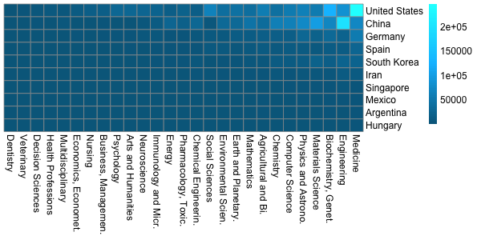</td>
<td style="text-align: center;">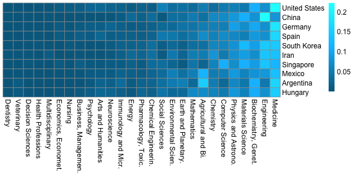</td>
</tr>
<tr class="even">
<td style="text-align: center;">(a) Raw values</td>
<td style="text-align: center;">(b) Proportions</td>
</tr>
<tr class="odd">
<td style="text-align: center;">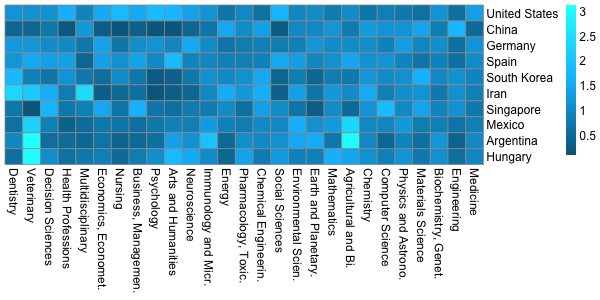</td>
<td style="text-align: center;">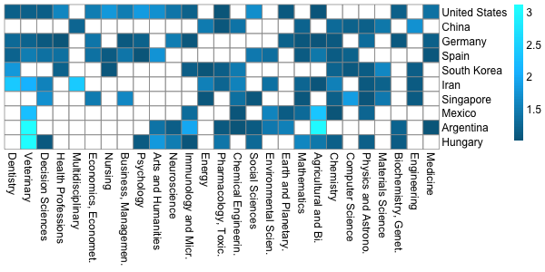</td>
</tr>
<tr class="even">
<td style="text-align: center;">(c) RCA</td>
<td style="text-align: center;">(d) RCA filtered</td>
</tr>
</tbody>
</table>
<figcaption>Figure 3: Pheatmaps for matrices. The lighter the color, the
higher the value. The white color represents empty cells.</figcaption>
</figure>

# Measuring diversity {#sec:measuring}

In this section we explain the measures included in the package
*diverse* by illustrating their use with our sample datasets.

## Measures included {#sec:diversity}

The diversity measures included in the package *diverse* allow for
different dimensions of diversity---like variety, balance and
disparity---to be analyzed separately or jointly.

To compute these measures, the main function `diversity()` must be used.
All diversity measures available in the package *diverse* are listed in
Table [1](#tab:measures). These measures are organized from simple to
complex, considering the properties of diversity they take into account.

::: center
::: {#tab:measures}
  ---------------------------------------------------------------------------------------------------------------------------------------------------------------
    ID    Measure                       $\text{Formula}$                                                  Reference
  ------- ----------------------------- ----------------------------------------------------------------- -------------------------------------------------------
     v    Variety                       $v = \sum_i\left(p_i^0\right)$                                    

    hhi   Herfindahl--Hirschman Index   $HHI =\sum_i\left(p_i^2\right)$                                   [@rhoades_herfindahl-hirschman_1993]

   b, gs  Blau Index, Gini-Simpson      $B = 1 - \sum_i\left(p_i^2\right) =  1-HHI$                       [@blau_inequality_1977; @gini_variabilita_1912]

     s    Simpson                       $D_S=\sum_i n_i(n_i-1) / N_t(N_t-1)$                              [@simpson_measurement_1949]

    bp    Berger-Parker                 $D_{BP}=\max_i{\left(p_i\right)}$                                 [@berger_diversity_1970]

     e    Shannon Entropy               $H=- \sum_i\left(p_i \log p_i\right)$                             [@shannon_mathematical_1948]

    ev    Pielou Evenness               $J=-\sum_i\left(p_i \log p_i\right)/\log{v}$                      [@pielou_introduction_1970]

    re    Rényi-Entropy                 $^{q}H=\left(1-q\right)^{-1} \log\left(\sum_i p_i^q\right)$       [@renyi_measures_1961]

   hcdt   HCDT Entropy                  $^{q}H=\left(q-1\right)^{-1} \left(1 - \sum_i p_i^q\right)$       [@havrda_quantification_1967; @tsallis_possible_1988]

    hn    Hill Numbers                  $^{q}D_{HN}=\left(\sum_ip_{i}^q\right)^{1/\left(1-q\right)}$      [@hill_diversity_1973]

     d    Disparity                     $DIS=\sum_{ij}d_{ij} / N$                                         

    rao   Rao                           $D_{RAO} =\sum_{ij}d_{ij} p_i p_j$                                [@rao_diversity_1982]

    rs    Rao-Stirling                  $\Delta=\sum_{ij}{d_{ij}}^\alpha {\left(p_i p_j \right)}^\beta$   [@stirling_general_2007]
  ---------------------------------------------------------------------------------------------------------------------------------------------------------------

  : Table 1: Summary of measures available in the package *diverse*. The
  first block of measures are associated mainly with the dimensions
  variety and balance of the diversity, while the second block presents
  measures that use also the dimension disparity. $C$ is the set of
  categories present in the entity. $i,j \in C$. $i\neq j$ and
  $ij \neq ji$; $n_i$ is the value of abundance and $p_i$ the proportion
  of the category $i$ in the entity. $v=n(C)$ is the number of
  categories present in the entity---the variety. $N_t = \sum n_i$. Here
  $\log$ is the logarithm usually natural, and
  $q,\alpha,\beta \geqslant 0$. For HCDT and Rény entropies when
  $q\rightarrow1$ converge to the Shannon entropy. Additionally, for
  Hill numbers, when $q\rightarrow1$, it results in the exponential of
  Shannon Entropy.
:::
:::

Regarding the parameters of the function `diversity()`, the dataset to
be analyzed should be provided in the `data` parameter, and the required
diversity measure(s) should be provided in the `type` parameter.

The argument `data` has to fulfill the characteristics analyzed in the
previous section on [3](#sec:data). The argument `type` can be a single
`string` or a `vector` of strings, with either the complete name of the
measure or a mnemonic term (see column *ID* in Table
[1](#tab:measures)). In the following sections we will explain the
function `diversity()` and the related functions `variety()`,
`balance()`, and `disparity()`.

## Variety or richness

Variety measures *how many categories or types an entity has*. Variety
is useful as a first approach to the diversity of an entity since the
number of categories (e.g. species, scientific fields or export
categories) is easy to understand and calculate. Users can compute
variety both within the function `diversity()` indicating `type=’v’`, or
with the function `variety()`. Both options return a data frame with the
values of variety. In the case of the function `variety()` values are
sorted in an decreasing order. For an increasing order, the argument
`decreasing` should be set to `FALSE`.

For instance, we can compare the variety of the 10 countries included in
our sample of Pantheon. Canada and China rank at the top of variety,
while Uruguay and Vietnam rank at the bottom. In Scidata, US and Germany
(see Figure [2](#figure:graph)b) have the highest level of variety,
while China (see Figure [2](#figure:graph)c) and Mexico have the lowest
variety. It is important to note that we are only considering fields of
science in which these countries have Revealed Comparative Advantages
(RCAs) equal to or higher than 1.

``` r
variety(data = pantheon)
            variety
Canada            27
China             24
...
Uruguay            4
Vietnam            4

#using function values() to normalize the dataset
scidat_rca_fil <- values(data = scidat, norm = 'rca', filter = 1)

variety(scidat_rca_fil)
              variety
United States      17
Germany            16
...
China              10
Mexico              9
```

Being related to the concept of variety, it is helpful in some cases to
know the ubiquity or rareness of each category by considering its
presence in all entities. Ubiquity could also be considered as the
variety of entities that each category has [@hidalgo_product_2007]. We
include this concept and measure through the function `ubiquity()` that
returns the number of entities in which the category is present. A
decreasing order is retrieved by default. In our sample of Pantheon
"politicians" and "soccer players" are more common (ubiquitous) than
"referees" or "wrestlers."

``` r
ubiquity(data = pantheon)

                    ubiquity
Politician                10
Writer                     8
Soccer.Player              6
...
Referee                    1
Wrestler                   1
```

## Diversity measures that emphasize abundance and balance

Balance measures *how much of each category the entity has*. The raw
indicators of balance are the values of abundance or the relative values
of abundance which are the proportions $p_i$ of each $i$-th category.
The package *diverse* includes the function `balance()` which retrieves
the matrix of entities-categories with their correspondent shares,
proportions or probabilities.

The word balance is used when the values of abundance are more equally
distributed across the categories. For a given variety, a more balanced
system is considered more diverse. Extreme cases are those where the
quantity of elements for each category is exactly the same (i.e. perfect
balance) or conversely, where all the elements are concentrated in just
one category (i.e. total concentration).

As pointed out by @tuomisto_updated_2012, measuring balance alone is a
complicated task because it is difficult to remove the effect of variety
on it. The only measure of \"balance\" in a strict sense that is
facilitated in this package is Pielou's evenness
[@pielou_introduction_1970], which according to @jost_relation_2010 is
also the best measure of balance.

However, *diverse* also allows for the calculation of a series of
commonly used \"balance\" measures like the Herfindahl-Hirschman Index
(HHI), Gini-Simpson or Blau-Index that emphasize the evenness or balance
of a system (while also being affected by the variety of categories).

Diversity measures related to the property \"balance\" could be
understood as statistical dispersion and are mainly a function of $p_i$.
While some of them measure the evenness or heterogeneity of the
distribution such as the Blau Index, others emphasize the concentration,
such as the Herfindahl-Hirschman Index (HHI).

The Herfindahl-Hirschman Index (HHI), for example, computes the
probability that two individuals taken randomly belong to the same
category. This probability is calculated with replacement, which means
that after taking the first individual into account, it is replaced with
an identical one; and thus neither affecting the total number of
individuals in that category ($n_i$) nor the total amount of individuals
in the entity ($N_t$). HHI is used in economics, for instance, to
estimate the concentration of markets or wealth [@ceriani_origins_2011].

Taking into account that balance is the opposite to concentration, the
Gini-Simpson Index ($1 - HHI$) subtracts $HHI$ from $1$ to estimate
balance. The same idea is behind the Blau Index. The Blau Index was
created to measure the heterogeneity of social communities and its use
is very common in sociology and other social sciences.

Similar to HHI, Simpson measure $D_s$ has the same probabilistic idea of
measuring concentration, but it computes the probability without
replacement---meaning that the values of $N_t$ and $n_i$ decreases in
$1$ after the first probability is calculated (see Table
[1](#tab:measures)). This measure of concentration and its equivalent
balance or index of diversity ($1-D_s$) are widespread in ecology.
Moreover, the reciprocal index ($R_S = 1/D_S$) can be calculated.

In the following example, the Herfindahl-Hirschman Index (HHI), the
Gini-Simpson Index and the Blau Index from Pantheon are computed by
using the function `diversity()`. We can observe that Uruguay and
Vietnam have a higher HHI value and are thus more concentrated and less
balanced than Canada and Chile. Note that the opposite occurs with the
Gini-Simpson or Blau indexes. Besides the Gini-Simpson index, the
concentration `gini.simpson.C` and the reciprocal of the concentration
`gini.simpson.R` are also retrieved.

``` r
round(diversity(data = pantheon, type = c('hhi', 'gs', 'b','ev')), 3)
               HHI gini.simpson gini.simpson.C gini.simpson.R blau.index evenness
Canada       0.372        0.628          0.372          2.689      0.628    0.843
Chile        0.133        0.867          0.133          7.538      0.867    0.959
...
Uruguay      0.235        0.765          0.235          4.263      0.765    0.820
Vietnam      0.139        0.861          0.139  
```

Graphical representations can help to understand the importance of
balance and how it is captured by specific diversity measures.
Figure [4](#figure:geeseBalance)a illustrates how the share of the
dominant species Greylag Goose increases over time and how the share of
Crested Grebe declines. The result is an unbalance between the species
in this ecosystem.

The decrease in diversity of geese---understood here mainly as the
balance of the abundance of different types of geese---can, for
instance, be captured by Berger-Parker measures. The Berger-Parker
Dominance Index ($D_{BP}$) is a measure based on the dominant category
($max(p_i)$) and thus captures the dominance of the Greylag Goose. On
the other hand, the Berger-Parker Index of Diversity ($I_{BP}=1/D_{BP}$)
captures the balance between the species. Figure
[4](#figure:geeseBalance)b shows how the Berger-Parker Index of
Diversity decreases over time.

``` r
bal <- balance(geese, category_row = TRUE) #note the function balance
barplot(t(bal), legend = TRUE, xlab = "Years", ylab = "Proportions", 
    col=c("darkblue","blue","sky blue", "light blue") )
      
bp <- diversity(geese, type = 'bp', category_row = TRUE)
plot(bp$berger.parker.I~rownames(bp), xlab = "Years", 
    ylab = "Berger-Parker Index of Diversity", pch = 19, col = "brown")
```

<figure id="figure:geeseBalance">
<table>
<caption> </caption>
<tbody>
<tr class="odd">
<td style="text-align: center;">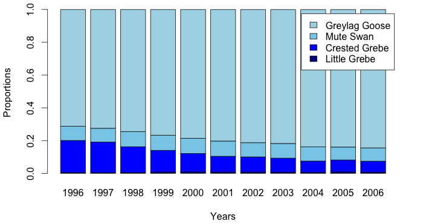</td>
<td style="text-align: center;">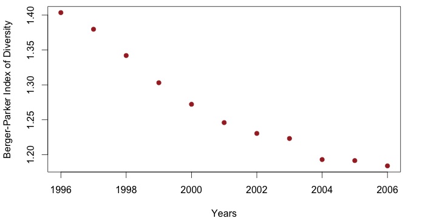</td>
</tr>
<tr class="even">
<td style="text-align: center;">(a) Proportions of geese species.</td>
<td style="text-align: center;">(b) Berger-Parker Index of
diversity.</td>
</tr>
</tbody>
</table>
<figcaption>Figure 4: Analysis of balance for Geese
dataset.</figcaption>
</figure>

``` r

diversity(data = geese, type = c('e','ev','s','bp'), category_row = TRUE)

       entropy  evenness simpson.D simpson.I simpson.R berger.parker.D berger.parker.I
1996 0.7993160 0.5765846 0.5534977 0.4465023  1.806692       0.7124871        1.403534
1997 0.7764028 0.5600563 0.5674638 0.4325362  1.762227       0.7247953        1.379700
...
2005 0.5790954 0.4177290 0.7160910 0.2839090  1.396471       0.8392823        1.191494
2006 0.5633026 0.4063369 0.7245616 0.2754384  1.380145       0.8446653        1.183901
```

### Entropy measures and Hill numbers

Shannon Entropy is a frequently used measure of balance and diversity.
Entropy is a measure first created and used in information theory
[@shannon_mathematical_1948] and has been widely adopted by other
disciplines such as computation, ecology, and economy.

Entropy $H$ measures the minimum volume of communication required to
code a message. Furthermore, as pointed by @hidalgo_why_2015 [p.17],
"entropy is a measure of the multiplicity of states". A high value of
multiplicity of states (categories) implies more evenness and less
concentration: as a consequence, the higher the variety and the balance,
the higher the entropy. In the example above we could observe how the
entropy in Geese decreased from $0.78$ in 1996 to $0.56$ in 2006. This
is a consequence of an increase of the population of the dominant
species.

A generalization of Shannon Entropy that is also included in *diverse*
is Rényi's entropy (see Table [1](#tab:measures)). Rényi's entropy
allows the users to give more or less relative importance to rare
categories through the parameter $q$.

Another parameterized entropy is the HCDT entropy
[@havrda_quantification_1967; @daroczy_generalized_1970; @tsallis_possible_1988].
It is noteworthy that Variety, Shannon, Blau's and Berger-Parker's
indexes are special cases of HCDT (respectively with the parameter
$q=0$, $1$, $2$ and infinity).

Finally, Hill numbers [@hill_diversity_1973] are a mathematically
unified family of diversity indexes that differ only by a parameter q
and that take the effective number of categories into account, i.e. the
number of equally abundant species that would be needed to give the same
value of a diversity measure [@chao_rarefaction_2014]. Hill numbers are
of particular interest since entropy is not linear to the number of
categories hosted by an entity @jost_entropy_2006. Moreover, several
widely used diversity indexes, like variety/richness, Shannon entropy,
Gini-Simpson Index, Rényi's or HDCT entropy, can be obtained from Hill
numbers [@chao_unifying_2014].

By using *diverse* we can observe the similarities between entropy
measures and Hill numbers, when $q$ has values of $0$, $1$ and $2$.

When $q=0$ , variety, HCDT entropy and Hill numbers are the same. Rényi
entropy is equal to $\log(variety)$. When $q=1$, Rényi entropy and HCDT
entropy are equal to Shannon entropy ($H$), while Hill numbers are equal
to the exponential of $H$. When $q=2$, HCDT entropy is equal to
Gini-Simpson, while the Hill numbers index is equal to the reciprocal
(`gini.simpson.R`) of the index of concentration of Gini (or
Herfindahl-Hirschman Index (`gini.simpson.C`)).

``` r
diversity(pantheon, type=c("v","hcdt","hn","re"), q=0)[1,]
       variety hcdt.entropy hill.numbers renyi.entropy
Canada      27           27           27      3.295837
```

``` r
diversity(pantheon, type=c("e","re","hcdt", "hn"), q=1)[2,]
       entropy renyi.entropy hcdt.entropy hill.numbers
Chile 1.626709      1.626709     1.626709     5.087107
```

``` r
diversity(pantheon, type=c("hcdt","gs","hn"), q=2)[3,]
      hcdt.entropy gini.simpson gini.simpson.C gini.simpson.R hill.numbers
China    0.8168554    0.8168554      0.1831446       5.460167     5.460167
```

Generally for the three parameterized measures that are included in
*diverse* (i.e. Rényi Entropy, HCDT and Hill numbers), the parameter
value $q=0$ calculates variety, $q<1$ considers rare categories more
important for diversity, $q=1$ considers all categories as equally
important, and $q>1$ mainly shows the impact of dominant categories in
diversity.

## Disparity

Another significant dimension of diversity is the disparity or
dissimilarity between categories or entities
[@stirling_general_2007; @rafols_diversity_2009]. Disparity is important
for all diversity measures, though, often pre-given in form of
classification schemes, like, for example, phylogenetic trees or types
of species in ecology, or the type of research fields in scientometrics.
Here, we explicitly take the diversity dimension disparity into account.

The dimension of disparity provides a notion of *how different the
categories of an entity are*. For example the areas "Mathematics" and
"Physics" are arguably more similar than "Mathematics" and "Nursing."
Measures of diversity, therefore, are also closely related to distance
and similarity measures like Euclidean distances, cosine similarity,
Jaccard-Index, or expert classifications of different categories.

### Matrix of dissimilarities between entities {#sec:dissimilarities}

Beside computing disparity, the dissimilarity matrix between entities is
also useful for the visualization of networks, such as those proposed to
evaluate economic complexity
[@hidalgo_product_2007; @hartmann_linking_2016] or the research
capabilities of scholars [@guevara_research_2016]. Moreover, it helps to
analyze the portfolio of entities in so-called network overlay maps and
to explore the path of diversification as a function of the disparity in
the network [@rafols_science_2010; @guevara_research_2016].

Based on the 10 countries included in Scidat, we calculate the
dissimilarities between categories and then we create a network of areas
of science in the following example. The resulting network is the one
presented in Figure [2](#figure:graph)a in Section [2](#sec:concepts).

``` r
adj <- dis_categories(data = scidat, method = 'cosine')
adj[adj > 0.015] <- 0  #filter

library(igraph)
g <- graph.adjacency(adjmatrix = adj, mode = 'undirected', weighted = TRUE)
totals <- colSums(values(scidat))  
V(g)$size = log(totals[match(V(g)$name, names(totals))], base = 2) - 9
fc <- fastgreedy.community(g); colors <- rainbow(max(membership(fc)))
V(g)$color = colors[membership(fc)]
set.seed(67)
g$layout <- layout.fruchterman.reingold(g)
plot.igraph(g,  vertex.label.cex = 0.9, vertex.label.font = 0, 
    vertex.label.family = 'Helvetica', vertex.label.color='black', asp = FALSE)
```

### Calculating dissimilarities between entities

The function `dis_entities()` can be used to calculate a matrix of
dissimilarities between entities. The following example computes the
matrices of dissimilarities between countries (entities) for the 10
countries included in Scidat. In this example, Argentina is more similar
to Mexico (0.04) and less similar to China (0.32). In addition, Germany
is more similar to Hungary (0.02) and less similar to Singapore (0.10).

``` r
round(dis_entities(scidat, method = 'cosine'), 2)
              Argentina China Germany Hungary Iran Mexico Singapore...
Argentina          0.00  0.32    0.09    0.07 0.17   0.04      0.25
China              0.32  0.00    0.20    0.19 0.06   0.18      0.06
Germany            0.09  0.20    0.00    0.02 0.07   0.05      0.10
Hungary            0.07  0.19    0.02    0.00 0.07   0.03      0.11
Iran               0.17  0.06    0.07    0.07 0.00   0.07      0.05
Mexico             0.04  0.18    0.05    0.03 0.07   0.00      0.13 
...
```

### Average or Sum Disparity

The function `disparity()` computes the average and/or the sum of
dissimilarities among categories, either based on a given dissimilarity
matrix of the user or through calculating the dissimilarity matrix
within the function. The first case is based on a matrix of
dissimilarities that the user provides in the argument `dis`. The
dissimilarity matrix has to include the same names of the categories in
the `rownames` and in the `colnames`.

In the second case, when the argument `dis` is not provided, *diverse*
computes the disparities by using the dissimilarity matrix calculated by
using the previously detailed function `dis_categories()`, as in the
following example where the argument `dis` is not defined.

In this example with Scidat, we note that the average dissimilarities of
categories in the US are greater than the disparities in Argentina or
China.

``` r
scidat_rca_fil <- values(scidat, norm = 'rca', filter = 1)
disparity(scidat_rca_fil)
              disparity.sum disparity.mean
Argentina         121.12704      0.3450913
China              54.86895      0.1563218
...
Spain             147.35440      0.4198131
United States     190.86552      0.5437764
```

## Diversity measures that explicitly take variety, disparity and balance into account

The package includes also "full" measures of diversity that are able to
capture variety, balance and disparity at the same time. These measures
are Rao and Rao-Stirling, where the former is widespread in ecology,
while the latter is more commonly applied in social sciences and
scientometrics [@rafols_knowledge_2014; @wang_interdisciplinarity_2015].

Both measures compute the sum of the multiplication of the distances
(disparity) and the proportions (balance) between the pairs of two
distinct categories $i$ and $j$ (see Table [1](#tab:measures)). However,
Rao-Stirling diversity allows users to assign the weights/parameters
$\alpha$ and $\beta$ according to the importance of the disparity or
balance, respectively.

Rao diversity is equivalent to Rao-Stirling diversity with the parameter
values $\alpha = \beta = 1$. These values are also the default values in
the function `diversity()`. Note that when the argument `dis` is not
provided, the default method 'Euclidean distances' is used for the
calculation of the dissimilarity matrix. Users can also provide their
own dissimilarity matrix by using the argument `dis` in the function
`diversity()`.

In the following example from Scidat, we calculate Rao diversity as well
as the Rao-Stirling diversity with the parameter values $\alpha$ =0.7
and $\beta$ = 0.3 and cosine dissimilarities between the entities. This
example shows that Rao-Stirling diversity provides the possibility to
emphasize different aspects of diversity. When we use the Rao Index,
then Spain is considered to be more \"diverse\" than the US, but when we
assign more importance to disparity, by increasing the parameter
$\alpha$ in the Rao-Stirling index, then the US is more \"diverse.\"

``` r
scidat_rca_fil <- values(scidat, norm = 'rca', filter = 1)
diversity(data = scidat_rca_fil, type = c('rao', 'rs') ,  
   alpha=0.7, beta = 0.3, method = 'cosine')
              rao.stirling       rao
                    rao rao.stirling
Argentina     0.1526983     7.072576
China         0.1346935     4.814975
...
Spain         0.2137356    12.842799
United States 0.1874783    12.864261
```

Thus, the Rao-Stirling index and the package *diverse* allows the user
to analyze the impact of different similarity measures as well as
different weights of disparity and balance on the resulting diversity
values and rankings.

It must be noted that, so far, we focus in \"diverse\" on the Stirling
taxonomy [@stirling_general_2007; @stirling_economics_1998]. In ecology
another set of \"similarity-based\" measures has been developed and can
be accessed in the package *entropart* and *treescape*.

# Synthetic data and performance tests {#sec:simulations}

In this Section, we show how to use *diverse* to create synthetic data
to the level of individuals, entities and datasets. An individual is an
independent object that belongs to a category (e.g. a paper in a certain
discipline of Scidat or a person in a certain type of occupation in
Pantheon). Entities are constituted by a set of categories and their
values of abundance. A set of several entities constitutes a synthetic
dataset for the type of diversity measures we apply in *diverse*.

The functions included in *diverse* to simulate data are
`sim_individuals()`, `sim_entities()` and `sim_dataset()`. In each
function the user can define the size (i.e. number of individuals), the
required level of variety or richness and the method to define the
distribution or values of abundance.

For example, if we want to create individuals of an entity, we can use
the function `sim_individuals()` to generate synthetic data with $10000$
individuals assigned to $50$ different species (categories). Moreover,
the values of absolute abundance of species can be, for instance,
distributed according to a log normal distribution with $\mu=0.50$ and
$\sigma=1.183$ (see histogram in Figure [5](#figure:simulations)a and
[@beck_comparing_2010]).

``` r
set.seed(99)
synt_ind <- sim_individuals(n_categ=50, size=100000,
    category_prefix='ctg', type='log-normal', mean=0.507, sd=1.183)
hist(table(synt_ind), breaks = 30, xlab = "Values of abundance",
    probability = TRUE, main = NULL)
lines(density(table(synt_ind)), col="red")

library(fitdistrplus)
f <- fitdist(as.vector(table(synt_ind)), "lnorm")
x = rlnorm(50, mean=f$estimate['meanlog'][[1]], sd = f$estimate['sdlog'][[1]])
lines(density(x), col="blue", lwd=2)
legend("topright",legend = c('Empirical', 'Fitted'), col = c("red", "blue"), lty=1)
head(synt_ind)

[1] "ctg49" "ctg3"  "ctg41" "ctg49" "ctg4"  "ctg25"
```

<figure id="figure:simulations">
<table>
<caption> </caption>
<tbody>
<tr class="odd">
<td style="text-align: center;">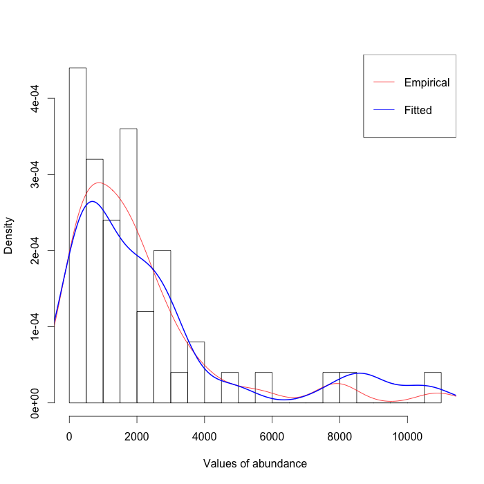</td>
<td style="text-align: center;">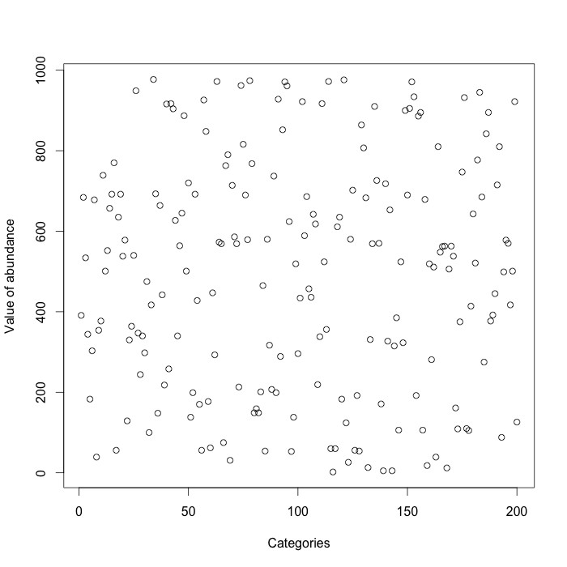</td>
<td style="text-align: center;">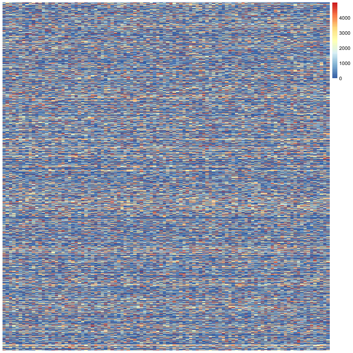</td>
</tr>
<tr class="even">
<td style="text-align: center;">(a) Histogram of simulated 10K
individuals.</td>
<td style="text-align: center;">(b) Simulated entity with 200
categories.</td>
<td style="text-align: center;">(c) Pheatmap of simulated dataset. 15K
entities, 100 categories. Colors according to value of abundance.</td>
</tr>
</tbody>
</table>
<figcaption>Figure 5: Analysis of simulated data.</figcaption>
</figure>

If the user wants to generate a simulated entity with values of
abundance produced by the aggregation of individuals in categories,
*diverse* provides the function `sim_entity()`. This function allows the
user to define a distribution and/or a required number of categories
(`n_categ()`). See Figure [5](#figure:simulations)b.

``` r
sim_ent <- sim_entity(n_categ=200, values=sample(1:1000, replace=TRUE))
plot(sim_ent$Value, ylab = "Value of abundance", xlab="Categories")
head(sim_ent)
Category Value
1        1   757
2        2   124
...
```

The simulation of a full dataset is also provided with *diverse*. The
function `sim_dataset()` allows for users to define the number of
categories in each entity (variety) as well as the number of required
entities. A crucial argument of the function `sim_dataset()` is the
vector of integers with the desired values of variety for each entity
(`n_categ`). In the following example, we create a dataset of $1500$
entities and $100$ categories with random integer values of abundance
between $10$ and $5000$. The values of variety for each entity are also
randomly sampled between $1$ and $100$. The resulting dataset is
retrieved as a dataframe of values of abundance. By using the function
`values()` we can plot this dataset as a matrix (see Figure
[5](#figure:simulations)c).

``` r
n_entities <- 1500
v_values <- sample(10:5000, size= n_entities, replace=TRUE)
v_n_categ <- sample(1:100, size = n_entities, replace=TRUE)
data_set <- sim_dataset(n_categ = v_n_categ, values= v_values,
  category_prefix = "C", category_random = TRUE)
pheatmap(values(data_set),cluster_rows = FALSE, cluster_cols = FALSE, 
  show_rownames = FALSE, show_colnames = FALSE)
head(data_set)

...
```

## Performance

To test the performance of *diverse* we use the previously generated
synthetic dataset (1500 entities by 100 categories), then we calculate
the time used to perform two measures, namely Shannon entropy and
Rao-Stirling diversity. Note that the second one is more time consuming
since it involves the computation of a distance matrix. However, the
time necessary to compute both measures is reasonable (0.021 and 2.697
seconds respectively). The time used to create the simulated dataset is
more time consuming (3̃5 secs.) since the dataset must ensure that the
assigned number of categories for each entity accomplishes the
requirements. Still it is a reasonable amount of time considering the
dimensions and characteristics of the obtained data.

``` r
system.time(data_set <- sim_dataset(n_categ = v_n_categ, values= v_values,
    category_prefix = "C", entity_prefix = "E"))

   user  system elapsed 
 29.590   5.245  34.871 
system.time(diversity(data_set, type=c("e")))
   user  system elapsed 
  0.019   0.001   0.021 
system.time(diversity(data_set, type=c("rs")))
   user  system elapsed 
  2.478   0.206   2.697 
```

## Coverage, biases and caveats

The package *diverse* is designed to work with datasets with a known
number of categories and a comparatively low level of variety
(i.e. scientific fields, occupations, or industrial sectors, in
comparison to datasets in ecology with millions of species, including
many unknown species). For instance, in ecology it has been demonstrated
that diversity measures are biased in cases of small samples (e.g. in a
very limited spatial area, limited amount of soil, etc.). Accordingly,
in datasets on biodiversity, it is difficult to sample rare species
appropriately [@beck_comparing_2010]. To solve this issue associated to
this type of datasets, measures of bias correction, e.g. of Shannon
Entropy, have been proposed [@chao_nonparametric_2003]. These measures,
mainly used in the area of ecology and biodiversity, are not yet
implemented in *diverse*. Furthermore, considering for example
phylogenetic diversity or functional diversity, other advanced measures,
such as the generalization of the Rao's cuadratic entropy
[@chao_unifying_2014], are not yet included. To address these current
limitations it must be noted that *diverse* can also be used in
combination with several specialized packages such as *entropart*,
*vegan* or [*spadeR*](https://CRAN.R-project.org/package=spadeR). For
instance, *diverse* provides a function (`to_entropart()`) that allows
the user to transform the datasets from the package *diverse* into
values of abundance to be used in *entropart*. Here we present a simple
example to compute the richness of the *metacommunity* (see the
*entropart* manual for details [@marcon_entropart:_2015]) generated with
our synthetic dataset (the variable `data_set` of a previous example).

``` r
library(entropart)
abundance <- to_entropart(data_set)
mc <- MetaCommunity(abundance)
Richness(mc$Ps);Shannon(mc$Ps)
```

It must also be noted that the ability to statistically test differences
in diversity measures across time and across systems could provide
important insights for researchers. The following example shows a strong
linear correlation between the Shannon Entropy in two different time
steps of Scidat (dataframes `scidat` for 2013, and `scidat_2` for 2003).
Further statistical test functions need to be implemented in subsequent
versions of of *diverse*, in order to also allow for the testing of the
differences across systems. *diverse* will continue to learn from other
disciplines, with the aim of implementing and adapting statistical test
functions to the particular needs of researchers exploring the diversity
in complex socioeconomic systems.

``` r
d_1 <- diversity(scidat, type="e")
d_2 <- diversity(scidat_2, type="e")
cor.test(d_1[,1], d_2[,1])

	Pearson's product-moment correlation

	data:  d_1[, 1] and d_2[, 1]
t = 3.7171, df = 8, p-value = 0.005896
alternative hypothesis: true correlation is not equal to 0
95 percent confidence interval:
 0.3330683 0.9496172
sample estimates:
     cor 
0.795807 
```

# Conclusions {#sec:conclusions}

This paper introduced the package *diverse* which allows users to
compute some of the most common measures of diversity from different
fields of science. In summary, measuring diversity has become an
important topic in many disciplines which analyze complex systems. The R
package *diverse* allows for a combination of common measures from
several disciplines and recent approaches from interdisciplinary
research.

It must be noted that *diverse* has limitations that we aim to address
in subsequent versions of the package. Possible future improvements
include methods for considering diversity at different levels of
aggregation (in hierarchical classification schemes, like mammals and
insects, or agricultural or industrial goods, natural or social
sciences, and their respective subcategories). Moreover, further
emphasis on the role of different similarity measures at different
levels of aggregations, as well as analyzing estimation error biases in
incomplete samples are important future research areas in the
measurement of diversity in socioeconomic systems, where social sciences
can significantly learn from ecology and biology. Finally *diverse* can
also continue to learn from ecology, biology, and other disciplines
about how to apply statistical tests on the differences of diversity
measures across systems.

In general, *diverse* offers a toolkit to analyze and visualize the
diversity of entities, categories, and complex systems that is useful in
particular for social scientists and interdisciplinary social research,
as well as beginners in ecology and natural sciences. The package
*diverse* provides different data import and export options and allows
for the calculation of the different data transformations and similarity
matrices, diversity measures, and diversity visualization options.

In order to present the functions provided by the package, we took
advantage of an interdisciplinary taxonomy of diversity that defines
variety, balance and disparity as three dimensions of diversity
[@stirling_general_2007]. This taxonomy favors the creation of
interdisciplinary bridges and helps in understanding how each diversity
measure captures different aspects of diversity.

# Acknowledgments

We would like to thank Ismael Rafols, Diego Chavarro, Daniele Rotolo,
and Andy Stirling for the example codes and valuable comments on
diversity measures. We are also grateful for the valuable comments made
by two anonymous reviewers. MG and MM acknowledge the Program of
Incentives to Scientific Initiation (PIIC) from DGIP at Universidad
Técnica Federico Santa María. MG thanks internal project ING01-1516 from
Universidad de Playa Ancha. DH acknowledges support from the Marie Curie
International Outgoing Fellowship No. 328828 within the 7th European
Community Framework Programme. MM and MG acknowledges support from
project FONDECYT 11121435.


