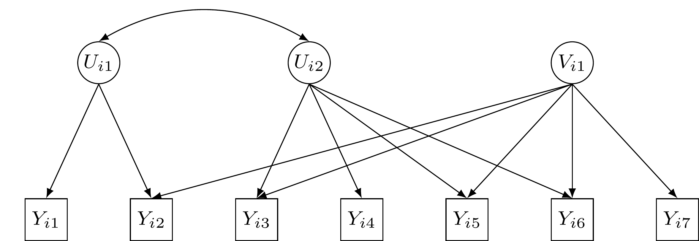
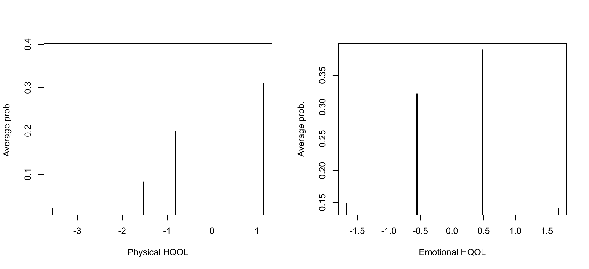
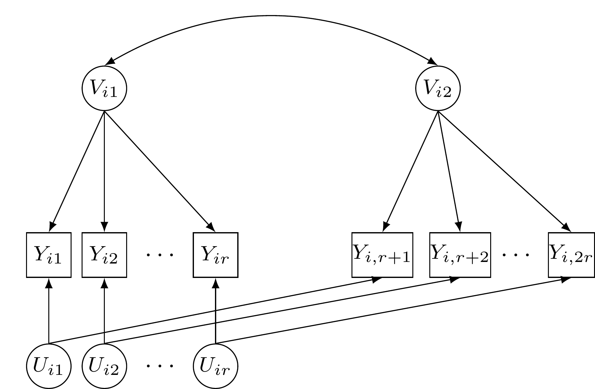

::: article
# Introduction

Several fields of human knowledge require the measurement of
unobservable constructs (or latent traits) through ad hoc methods based
on questionnaires consisting of multiple items having dichotomously or
ordered politomously scored response categories. This is the case of
measurement of customer satisfaction, quality-of-life, level of physical
and/or psychological disabilities, ability in certain subjects, and so
on.

Item Response Theory (IRT) models
[@ham:swam:85; @lin:ham:97; @bartolucci:bacci:gnaldi:book:15] are
well-known statistical models to deal with these data. In their original
formulation, these models are characterized by: (i) unidimensionality
(i.e., only one latent trait is assumed to be measured by all items);
(ii) a parametric (usually normal) distribution for the latent variables
used to represent the trait of interest; and (iii) no effect of
individual covariates on this latent trait. These elements often turn
out to be restrictive in modern applications and, therefore, several
extensions of IRT models have been proposed in the literature. Among the
possible extensions, in this paper we consider the class of
multidimensional Latent Class (LC) IRT models proposed by [@bart:07] and
[@dav:08]; see also [@bacci:bartolucci:gnaldi:2014]. Models of this type
are characterized by: (i) *multidimensionality*, in the sense that more
latent traits may be measured by the set of items [@reckase:10]; (ii)
discreteness of the latent variables, so that homogeneous subpopulations
[or latent classes; @laza:henr:68; @good:74] of individuals are detected
with respect to the constructs measured by the questionnaire; and (iii)
possible presence of individual covariates affecting the probabilities
to belong to each latent class.

In particular, we focus on a specific extension of IRT models based on
within-item multidimensionality [@ada:wil:wan:97], which is
characterized by items affected by more than one latent variable. This
is opposed to the more common between-item multidimensionality, where
each item may measure only one latent variable as in the original
approach of [@bart:07]. More in detail, the model here proposed
represents a discrete version of the item bifactor model and of the more
general two-tier IRT model
[@bock:gibbons:muraki:88; @gibbons:hedeker:92; @gibbons:07; @cai:10; @cai:yang:hansen:11; @reise:12; @bonifay:15],
based on a particular within-item multidimensional formulation with each
item loading on at most two latent variables that are mutually
uncorrelated. With respect to traditional item bifactor and two-tier
models, which assume the normality of the latent variables, the
discreteness assumption increases the flexibility of the approach and
allows us to cluster individuals in homogeneous latent classes.
[@formann:kohl:02] propose a general approach based on latent classes
that includes the discrete two-tier model here proposed as special case.
However, different from the proposal of these authors, we let the class
membership probability depend on individual covariates and we also allow
for more flexibility in terms of specification of model link function.
Limited to binary items, a recent example of application of the proposed
two-tier LC-IRT model is provided in [@bacci:bartolucci:15] to jointly
study certain students' abilities and the propensity to skipping item
responses.

The procedures to estimate the proposed class of two-tier LC-IRT models
are implemented in the R package
[*MLCIRTwithin*](https://CRAN.R-project.org/package=MLCIRTwithin)
[@mlcirt], downloadable from
<http://CRAN.R-project.org/package=MLCIRTwithin>, whose illustration is
the primary focus of the present paper. In particular, we are interested
in providing a detailed description of the main functions of this
package, named `est_multi_poly_within` and `search.model_within`, also
through some applications.

The remainder of the paper is organized as follows. In the next section
we provide the formulation of the proposed class of two-tier LC-IRT
models and, then, some details about likelihood inference for these
models. Furthermore, we describe the main functions implemented in the R
package *MLCIRTwithin* for model estimation. In the following, the
functioning of the package is illustrated through two applications: the
first one concerns the measurement of Heath-related Quality Of Life
(HQOL) on cancer patients and the second one is about the measurement of
propensity to commit crimes. Some final remarks conclude the work.

# The class of models

The proposed class of models is formulated on the basis of two
independent vectors of latent variables representing the unobservable
individual characteristics measured by the test items. For each unit
$i=1,\ldots,n$, these vectors are denoted by
$\mathbf U_i=(U_{i1},\ldots,U_{iD_1})^{\prime}$ and
$\mathbf V_i=(V_{i1},\ldots,V_{iD_2})^{\prime}$ and are of dimension
$D_1$ and $D_2$, respectively. Similarly to the item bifactor model, we
assume that each item response $Y_{ij}$, with $i=1,\ldots,n$ and
$j=1,\ldots,r$, where $r$ is the number of items, may depend on (and
then measures) at most two latent variables, under the constraint that
these two variables do not belong to the same vector. This is formalized
by introducing the disjoint subsets $\cal U_1,\ldots,\cal U_{D_1}$ and
$\cal V_1,\ldots,\cal V_{D_2}$ of $\cal J=\{1,\ldots,r\}$, where
$\cal U_{d_1}$ contains the indices of the items depending on latent
variable $U_{id_1}$ and $\cal V_{d_2}$ is the set of those depending on
latent variable $V_{id_2}$. Equivalently, $Y_{ij}$ depends on $U_{id_1}$
if and only if $j\in\cal U_{id_1}$ and on $V_{id_2}$ if and only if
$j\in\cal V_{id_2}$. Note that, even if the subsets
$\cal U_1,\ldots,\cal U_{D_1}$ cannot overlap, and the same is assumed
for $\cal V_1,\ldots,\cal V_{D_2}$, the same item $j$ may belong both to
a set of the first type and to a set of the second type (within-item
multidimensionality); more formally, there may exist $d_1$ and $d_2$
such that $j\in\cal U_{d_1}$ and $j\in\cal V_{d_2}$. In practice, some
items belonging to $\cal U_{d_1}$, $d_1=1,\ldots, D_1$, will be present
also in $\cal V_{d_2}$, $d_2=1,\ldots, D_2$. With respect to the
specification commonly encountered in the literature on item bifactor
and two-tier models, our proposal is more general, as any value of $D_1$
and $D_2$ is allowed, whereas $D_1=1$ (or, alternatively, $D_2=1$) in
the item bifactor model and $D_1=2$ (or, alternatively, $D_2=2$) in the
two-tier model. Moreover, components of $\mathbf U_i$ are allowed to be
correlated; the same holds for components of $\mathbf V_i$.

An illustrative example of the above assumptions is provided in
Figure [1](#figure:path1), where $D_1=2$, $D_2=1$, and four items out of
$r=7$ measure two latent traits (item 2 measures dimensions $U_{i1}$ and
$V_{i1}$; items 3, 5, and 6 measure dimensions $U_{i2}$ and $V_{i1}$);
the two dimensions $U_{i1}$ and $U_{i2}$ do not share any item.

<figure id="figure:path1">

<figcaption>Figure 1: Path diagram of the proposed two-tier model for
two latent vectors with two and one dimension, respectively, and seven
items (<span class="math inline">$\cal U_1 = \{1, 2\}$</span>, <span
class="math inline">$\cal U_2 = \{3, 4, 5, 6\}$</span>, <span
class="math inline">$\cal V_1 = \{2, 3, 5, 6, 7\}$</span>).</figcaption>
</figure>

Adopting a semi-parametric approach for the latent distribution, the
first latent vector $\mathbf U_i$ is assumed to have a discrete
distribution based on $k_1$ support points
$\mathbf u_1,\ldots,\mathbf u_{k_1}$ and, in absence of individual
covariates, common mass probabilities $\lambda_1,\ldots,\lambda_{k_1}$.
Similarly, the distribution of the second latent vector $\mathbf V_i$
has $k_2$ support points $\mathbf v_1,\ldots,\mathbf v_{k_2}$ and, again
in absence of individual covariates, common mass probabilities
$\pi_1,\ldots,\pi_{k_2}$. In both cases, the support points identify
classes of individuals that are homogeneous with respect to the latent
traits represented by $\mathbf U_i$ and $\mathbf V_i$. Note that cases
with $k_1=1$ or $k_2=1$ detect a special situation in which vector of
latent variables $\mathbf U_i$ or $\mathbf V_i$, respectively, has no
role in explaining the observed item responses.

For binary response variables, the *measurement model* assumes that, for
$i=1,\ldots, n$, $j=1,\ldots, r$, $h_1=1,\ldots,k_1$, and
$h_2=1,\ldots,k_2$,
$$\label{eq:modbinary}
{\rm logit}\: p(Y_{ij}=1|\mathbf U_i= \mathbf u_{h_1}, \mathbf V_i= \mathbf v_{h_2})=\gamma_{1j}\sum_{d_1=1}^{D_1} 1\{j\in\cal U_{d_1}\}u_{h_1d_1}+
\gamma_{2j}\sum_{d_2=1}^{D_2} 1\{j\in\cal V_{d_2}\}v_{h_2d_2}-\beta_j,   (\#eq:modbinary)$$
where $1\{\cdot\}$ is the indicator function and $\gamma_{1j}$,
$\gamma_{2j}$, and $\beta_j$ are suitable item parameters. As usual for
IRT models, $\gamma_{1j}$ and $\gamma_{2j}$ represent the discrimination
power of item $j$ with respect to the latent variables in $\mathbf U_i$
and $\mathbf V_i$, respectively, whereas $\beta_j$ denotes the
difficulty level of item $j$. In the previous expression, $u_{h_1d_1}$
denotes the $d_1$-th element of $\mathbf u_{h_1}$, whereas $v_{h_2d_2}$
denotes the $d_2$-th element of $\mathbf v_{h_2}$.

Different from traditional LC models characterized by constant mass
probabilities, a more general approach is based on assuming that the
probabilities to belong to every latent class defined by the
distribution of $\mathbf U_i$ and $\mathbf V_i$ depend on individual
covariates, when such covariates are observed. For this aim, we denote
the vector of covariates for individual $i=1,\ldots,n$ by $\mathbf X_i$
and we assume that $\mathbf U_i$ and $\mathbf V_i$ are conditionally
independent given $\mathbf X_i$. Moreover, we adopt the following
multinomial logit parametrization [@for:07b] for each latent vector:
$$\begin{aligned}
\label{eq:cov1}
\log{\frac{\lambda_{h_1}(\mathbf x_i)}{\lambda_1(\mathbf x_i)}} = & \;\mathbf x_i^{\prime}\mathbf \delta_{1h_1},  \quad h_1 = 2, \ldots, k_1, \\ 
\end{aligned}   (\#eq:cov1)$$

$$\begin{aligned}
\log{\frac{\pi_{h_2}(\mathbf x_i)}{\pi_1(\mathbf x_i)}} = & \;\mathbf x_i^{\prime}\mathbf \delta_{2h_2},  \quad h_2 = 2, \ldots, k_2,\label{eq:cov2}
\end{aligned}   (\#eq:cov2)$$
with
$\lambda_{h_1}(\mathbf x_i) = p(\mathbf U_i= \mathbf u_{h_1} |\mathbf X_i = \mathbf x_i)$
and
$\pi_{h_2}(\mathbf x_i) = p(\mathbf V_i = \mathbf v_{h_2} | \mathbf X_i = \mathbf x_i)$,
where $\mathbf x_i$ contains the constant term. The vectors of
coefficients $\mathbf \delta_{1h_1}$ and $\mathbf \delta_{2h_2}$ measure
the effect of the covariates on the logit to belong to class
$h_1=2, \ldots, k_1$ and $h_2=2,\ldots,k_2$, with respect to class
$h_1=1$ and $h_2=1$, respectively. Alternatively, a global logit
formulation may be adopted. This is related to a cumulative logit
formulation [@agr:02], where the logits in equations \@ref(eq:cov1) and
\@ref(eq:cov2) are substituted with
$$\log{\frac{p(\mathbf U_i\geq \mathbf u_{h_1} |\mathbf X_i = \mathbf x_i)}{p(\mathbf U_i < \mathbf u_{h_1} |\mathbf X_i = \mathbf x_i)}} = \log{\frac{\lambda_{h_1}(\mathbf x_i) + \ldots+ \lambda_{k_1}(\mathbf x_i) }{\lambda_{1}(\mathbf x_i) + \ldots + \lambda_{h_1-1}(\mathbf x_i)}}, \quad h_1 = 2, \ldots, k_1$$
and
$$\log{\frac{p(\mathbf V_i \geq \mathbf v_{h_2} | \mathbf X_i = \mathbf x_i)}{p(\mathbf V_i < \mathbf v_{h_2} | \mathbf X_i = \mathbf x_i)}} = \log{\frac{\pi_{h_2}(\mathbf x_i) + \ldots+ \pi_{k_2}(\mathbf x_i) }{\pi_{1}(\mathbf x_i) + \ldots + \pi_{h_2-1}(\mathbf x_i)}}, \quad h_2 = 2, \ldots, k_2,$$
respectively. The main advantage of the global logit parametrization is
the easier interpretation of the regression coefficients that now refer
to the effect of the covariates on the logit to belong to a specific
class (or higher) with respect to a lower class. However, this
parameterization requires the latent classes to be ordered according to
a specific criterion (e.g., requiring an increasing trend of the support
points for a given dimension).

In the case of polytomously scored items with ordered categories indexed
from 0 to $l_j-1$, the model based on Equation \@ref(eq:modbinary) may
be extended according to a global logit link function, so that a graded
response model [@sam:69] results in:
$$\label{eq:modglobal}
\log \frac{p(Y_{ij}\geq y|\mathbf U_i= \mathbf u_{h_1}, \mathbf V_i= \mathbf v_{h_2})}{p(Y_{ij}< y|\mathbf U_i= \mathbf u_{h_1}, \mathbf V_i= \mathbf v_{h_2})}=\gamma_{1j}\sum_{d_1=1}^{D_1} 1\{j\in\cal U_{d_1}\}u_{h_1d_1}+
\gamma_{2j}\sum_{d_2=1}^{D_2} 1\{j\in\cal V_{d_2}\}v_{h_2d_2}-\beta_{jy}.   (\#eq:modglobal)$$
Alternatively, using a local logit link function, we may assume a
partial credit model [@mast:82]:
$$\label{eq:modlocal}
\log \frac{p(Y_{ij}= y|\mathbf U_i= \mathbf u_{h_1}, \mathbf V_i= \mathbf v_{h_2})}{p(Y_{ij}=y-1|\mathbf U_i= \mathbf u_{h_1}, \mathbf V_i= \mathbf v_{h_2})}=\gamma_{1j}\sum_{d_1=1}^{D_1} 1\{j\in\cal U_{d_1}\}u_{h_1d_1}+
\gamma_{2j}\sum_{d_2=1}^{D_2} 1\{j\in\cal V_{d_2}\}v_{h_2d_2}-\beta_{jy}.   (\#eq:modlocal)$$
In the above expressions, $y = 1, \ldots, l_j-1$ and the difficulty
parameter $\beta_{jy}$ is now specific of item $j$ and response category
$y$. A more parsimonious model is obtained by expressing $\beta_{jy}$ as
the sum of two components [rating scale parametrization; @andr:78], that
is,
$$\label{eq:rsm}
 \beta_{jy} = \beta_j + \tau_y, \quad  j=1,\ldots,r;\; y=1,\ldots, l_j-1,   (\#eq:rsm)$$
so that the distance in terms of difficulty from category to category
(i.e., $\tau_y$) is the same for all items. Note that the rating scale
parametrization is allowed only when items have the same number of
response categories (i.e., $l_j = l,\; j=1,\ldots,r$). For more details
about the possible item parametrizations in the presence of ordinal
items see @bacci:bartolucci:gnaldi:2014 and
@bartolucci:bacci:gnaldi:book:15.

In order to ensure the identification of the proposed class of models,
two necessary conditions must hold. First, as usual in the IRT modeling,
we must constrain one discriminant index to be equal to 1 and one
difficulty parameter to be equal to 0 for each dimension. More in
detail, let $j_{d_1}$ be a specific element of $\cal U_{d_1}$ and
$j_{d_2}$ a specific element of $\cal V_{d_2}$ for $d_1=1,\ldots, D_1$
and $d_2=1,\ldots, D_2$. Then we assume $\gamma_{1j_{d_1}} = 1$,
$\gamma_{2j_{d_2}} = 1$, and, when item difficulties are free,
$\beta_{j_{d_1}1}=0$ and $\beta_{j_{d_2}1}=0$, whereas in the presence
of a rating scale parametrization we assume $\beta_{j_{d_1}}=0$,
$\beta_{j_{d_2}}=0$, and $\tau_1=0$. In the case of binary items,
constraints on difficulties simplify to $\beta_{j_{d_1}}=0$ and
$\beta_{j_{d_2}}=0$. Generally speaking, $j_{d_1}$ and $j_{d_2}$ may be
chosen in an arbitrary way, paying attention to select a different item
for each dimension. So, in the example illustrated in
Figure [1](#figure:path1), if we constrain item $j=1$ for dimension
$U_{i1}$ and item $j=3$ for dimension $U_{i2}$, then for dimension
$V_{i1}$ we may constrain any one of the items in the subset $\cal V_1$
with the only exception of item $j=3$. As an alternative to constraining
item parameters, we may fix the support points, as in the general
diagnostic model of [@dav:08].

A further identification condition requires that at least one item
belongs to one of the subsets $\cal U_{d_1}$ or to one of the subsets
$\cal V_{d_2}$; more formally, the union of
$\cal U_1,\ldots,\cal U_{D_1}$ must be different from the union of
$\cal V_1,\ldots,\cal V_{D_2}$. In other words, we restrict
$\gamma_{1j} = 0$ or $\gamma_{2j} = 0$ for at least one $j$ and the
maximum number of items shared by $\mathbf U_i$ and $\mathbf V_i$ is
equal to $r-1$. Alternatively, we may skip this restrictive condition by
specifying in a suitable way linear constraints (e.g., equality
restrictions) on some discriminant parameters [for some examples see
@cai:10; @cai:yang:hansen:11].

To specify in a flexible way constraints on the support points and item
parameters, we denote the complete vectors of support points by
$\mathbf u = (u_{11}, u_{12}, \ldots, u_{k_1D_1})^{\prime}$ for latent
variable $\mathbf U_i$ and
$\mathbf v = (v_{11}, v_{12}, \ldots, v_{k_2D_2})^{\prime}$ for latent
variable $\mathbf V_i$, the complete vectors of item discriminating
indices as
$\mathbf \gamma_1 = (\gamma_{11}, \ldots, \gamma_{1r})^{\prime}$ for
items affected by $\mathbf U_i$ (then $\gamma_{1j}$ is missing if item
$j$ does not belong to $\cal U_1,\ldots,\cal U_{D_1}$) and
$\mathbf \gamma_2  = (\gamma_{21}, \ldots, \gamma_{2r})^{\prime}$ for
items affected by $\mathbf V_i$ (then $\gamma_{2j}$ is missing if item
$j$ does not belong to $\cal V_1,\ldots,\cal V_{D_2}$), and the complete
vector of item difficulties as
$\mathbf \beta   = (\beta_{11}, \ldots, \beta_{r,l_r-1})^{\prime}$ (or
$\mathbf \beta   = (\beta_{1}, \ldots, \beta_{r})^{\prime}$ in the
binary case). The corresponding vectors of free support points and free
item parameters are denoted by $\tilde{\mathbf u}$, $\tilde{\mathbf v}$,
$\tilde{\mathbf \gamma}_1$, $\tilde{\mathbf \gamma}_2$, and
$\tilde{\mathbf \beta}$, respectively. A wide range of linear
constraints and fixed values of the parameters are specified through a
suitable definition of matrices $\mathbf Z_u$, $\mathbf Z_v$,
$\mathbf Z_{\gamma_1}$, $\mathbf Z_{\gamma_2}$, and $\mathbf Z_{\beta}$
and vectors $\mathbf z_u$, $\mathbf z_v$, $\mathbf z_{\gamma_1}$,
$\mathbf z_{\gamma_2}$, and $\mathbf z_{\beta}$, as follows:


$$\begin{aligned}
\label{eq:constr_th1}
\mathbf u  = & \;\mathbf Z_u \tilde{\mathbf u} + \mathbf z_u, \\ 
\end{aligned}   (\#eq:constr-th1)$$

$$\begin{aligned}
\mathbf v  = & \;\mathbf Z_v \tilde{\mathbf v} + \mathbf z_v, \\\label{eq:constr_th2}
\end{aligned}   (\#eq:constr-th2)$$

$$\begin{aligned}
\mathbf \gamma_1  = & \;\mathbf Z_{\gamma_1} \tilde{\mathbf \gamma}_1 + \mathbf z_{\gamma_1}, \\\label{eq:constr_ga1}
\end{aligned}   (\#eq:constr-ga1)$$

$$\begin{aligned}
\mathbf \gamma_2  = & \;\mathbf Z_{\gamma_2} \tilde{\mathbf \gamma}_2 + \mathbf z_{\gamma_2}, \\\label{eq:constr_ga2}
\end{aligned}   (\#eq:constr-ga2)$$

$$\begin{aligned}
\mathbf \beta  = & \;\mathbf Z_{\beta} \tilde{\mathbf \beta} + \mathbf z_{\beta}. \label{eq:constr_be}
\end{aligned}  (\#eq:constr-be)$$


For instance, according to the usual IRT parametrization with free
support points and constraints on the item parameters (i.e., one
discriminant index equal to 1 and one difficulty parameter equal to 0
for each dimension), $\mathbf Z_u$ and $\mathbf Z_v$ are identity
matrices of dimensions $k_1D_1\times k_1D_1$ and $k_2D_2\times k_2D_2$,
respectively, and $\mathbf z_u$ and $\mathbf z_v$ are null vectors.
Moreover, matrices $\mathbf Z_{\gamma_1}$, $\mathbf Z_{\gamma_2}$, and
$\mathbf Z_{\beta}$ are defined as identity matrices without those
columns corresponding to the constrained item parameters, whereas
$\mathbf z_{\gamma_1}$ and $\mathbf z_{\gamma_2}$ are vectors with ones
in correspondence of constrained item discrimination parameters and
zeros otherwise; $\mathbf z_{\beta}$ is a vector of zeros. Further
examples of specification of constraints on model parameters are
provided in the sequel, when the functioning of the estimation functions
of the proposed R package and an example on criminal data (Example 2)
are illustrated.

# Likelihood inference

The proposed two-tier LC-IRT model can be estimated by maximizing the
*marginal log-likelihood*
$$\label{eq:like}
\ell(\mathbf \eta) = \sum_{i=1}^n \log L_i({\mathbf y}_{i}|\mathbf x_i),   (\#eq:like)$$
where $\mathbf \eta$ is the vector of free model parameters, that is,
support points of $\mathbf U_i$ and $\mathbf V_i$, item difficulty and
discrimination parameters, and regression coefficients for the
covariates; in the previous expression,
$\mathbf y_{i}=(y_{i1}, \ldots, y_{ir}) ^{\prime}$ is the vector of
observed item responses for subject $i$. Due to the *local independence*
assumption, the marginal likelihood $L_i({\mathbf y}_{i}|\mathbf x_i)$
for subject $i$ (or manifest probability of $\mathbf y_i$) used in
equation \@ref(eq:like) is given by:
$$L_i({\mathbf y}_{i}|\mathbf x_i) =  \sum_{h_1=1}^{k_1}\sum_{h_2=1}^{k_2} 
\lambda_{h_1}(\mathbf x_i)\pi_{h_2}(\mathbf x_i)\prod_{j=1}^r p_{h_1h_2}(y_{ij}),$$
where,
$p_{h_1h_2}(y)=p(Y_{ij}= y|\mathbf U_i= \mathbf u_{h_1}, \mathbf V_i= \mathbf v_{h_2})$,
which depends on \@ref(eq:modbinary) in the case of binary items and on
\@ref(eq:modglobal) or \@ref(eq:modlocal) in the case of ordinal items,
if a global logit or a local logit parametrization is adopted.

We maximize $\ell(\mathbf \eta)$ through the Expectation Maximization
(EM) algorithm [@demp:laird:rub:77], which is based on alternating two
steps until convergence:

E-step:

:   the expected value of the *complete data log-likelihood* (i.e., the
    log-likelihood for the observed and latent variables) is computed,
    given the current parameter vector $\mathbf \eta$. In practice, this
    consists in computing the posterior probability $q_{h_1h_2i}$ for
    $h_1=1,\ldots,k_1$, $h_2=1,\ldots,k_2$, and $i=1,\ldots,n$; this is
    the probability that unit $i$ belongs to latent class $h_1$,
    according to the first vector of latent variables, and to latent
    class $h_2$, according to the second vector of latent variables,
    given the observed data, that is,
    $p(\mathbf U_i=\mathbf u_{h_1},\mathbf V_i=\mathbf v_{h_2}|\mathbf x_i,\mathbf y_i)$.
    By the Bayes' theorem we have that
    $$q_{h_1h_2i} = \frac{\lambda_{h_1}(\mathbf x_i)\pi_{h_2}(\mathbf x_i)\prod_{j=1}^r p_{h_1h_2}(y_{ij})}{L_i({\mathbf y}_{i}|\mathbf x_i)}.$$
    The resulting complete data log-likelihood is, in expected value,
    equal to
    $$\label{eq:comp_lk}
    \ell^*(\mathbf \eta) = \sum_{h_1=1}^{k_1}\sum_{h_2=1}^{k_2}\sum_{i=1}^n q_{h_1h_2i}\log \left[\lambda_{h_1}(\mathbf x_i)\pi_{h_2}(\mathbf x_i)\prod_{j=1}^r p_{h_1h_2}(y_{ij})\right].   (\#eq:comp-lk)$$

M-step:

:   the parameter vector $\mathbf \eta$ is updated by maximizing
    function \@ref(eq:comp-lk) obtained at the previous step. Note that
    single parameter subvectors of $\mathbf \eta$ may be updated
    separately, as this function factorizes in three components
    involving the mass probabilities $\lambda_{h_1}(\mathbf x_i)$, the
    mass probabilities $\pi_{h_2}(\mathbf x_i)$, and the conditional
    response probabilities $p_{h_1h_2}(y_{ij})$, respectively. Iterative
    algorithms of Newton-Raphson type are necessary to maximize all
    components [for details see @bacci:bartolucci:15 and references
    therein] with the exception of the first two in the case of absence
    of individual covariates. In fact, in this case we have the
    following explicit expressions to update the class weights:
    $$\begin{aligned}
    \lambda_{h_1}=\frac{1}{n}\sum_{h_2=1}^{k_2}\sum_{i=1}^nq_{h_1h_2i},\quad h_1=1,\ldots,k_1,\\
    \pi_{h_2}=\frac{1}{n}\sum_{h_1=1}^{k_1}\sum_{i=1}^nq_{h_1h_2i},\quad h_2=1,\ldots,k_2.
    \end{aligned}$$

Similar to the other iterative algorithms, the first iteration of the EM
algorithm needs to be initialized through suitable values for the model
parameters that can be chosen according to certain deterministic or
random rules. A common problem with finite mixture models, and then with
the proposed model, is due to the presence of several local maximum
points of the log-likelihood function. Therefore, in order to avoid a
solution that does not correspond to the global maximum, a good practice
consists in repeating the estimation process for a specific model a
certain number of times using random starting values and, in the
presence of different values of the log-likelihood at convergence, the
solution corresponding to the highest log-likelihood value is selected.

A crucial point is that of model selection, mainly as concerns the
choice of the number of support points (or latent classes) for both
latent vectors (i.e., $k_1$ and $k_2$). For this aim, a likelihood-ratio
test cannot be directly used, as the regularity conditions for having an
asymptotic null distribution of $\chi^2$-type are not satisfied for this
type of test when it is applied to compare two models with different
values of $k_1$ and $k_2$. We then suggest to rely on suitable forms of
penalization of the maximum log-likelihood, such as the Akaike
Information Criterion [AIC; @aka:73], which is related to
Kullback-Leibler distance between the true density and the estimated
density of a model. This criterion is based on the following index:
$$AIC = -2 \hat{\ell}{(\mathbf \eta)} + 2 \# {\textrm{par}},$$
with $\hat{\ell}{(\cdot)}$ denoting the estimated maximum log-likelihood
and $\# {\textrm{par}}$ the number of free parameters. Alternatively, we
suggest the use of the Bayesian Information Criterion [BIC; @sch:78]
based on the index
$$BIC = -2 \hat{\ell}{(\mathbf \eta)} +  \log(n) \# {\textrm{par}} .$$
According to both these criteria, one should select the model with the
minimum value of AIC or BIC.

Other selection criteria may be based on the entropy, whose computation
involves the individual posterior probabilities. Entropy is a measure of
the capability of the model to provide a neat partition of the sample
units, which is computed as
$$E = -\sum_{h_1=1}^{k_1}\sum_{h_2=1}^{k_2} \sum_{i=1}^n q_{h_1h_2i}\log q_{h_1h_2i},$$
based on the posterior probabilities $q_{h_1h_2i}$. If the components
are well separated, the posterior probabilities tend to define a clear
partition of the units, assuming values close to one, and, as a
consequence, the entropy will be close to zero. Usually, the entropy is
not directly used to assess the number of support points and, to also
account for the goodness of fit of the model, a normalized version of
entropy is used by [@celeux:96]. This is defined as
$$NEC = \frac{E}{\hat{\ell}_{k_1k_2} - \hat{\ell}_{11}}, \quad \quad \quad k_1>1,\;k_2>1,$$
where $\hat{\ell}_{k_1k_2}$ is the maximum log-likelihood of the model
with $k_1$ and $k_2$ support points and $\hat{\ell}_{11}$ is the maximum
log-likelihood value of the model with just one component for both
latent variables. According to this criterion, the optimal number of
components is the one that minimizes the $NEC$ index. Note that $NEC$ is
not defined when $k_1 = k_2  = 1$, in which case $NEC = 1$ by
convention.

In practice, we propose to fit a series of models with similar
specifications that distinguish one other for values assigned to $k_1$
and $k_2$ and, then, to make comparisons through one or more of the
mentioned criteria. In more detail, given $k_1$, we consider increasing
values of $k_2$ and, similarly, given $k_2$ we consider increasing
values of $k_1$ until $AIC$, $BIC$, or $NEC$ do not start to increase
and, then, the previous value of support points is taken as the optimal
one.

More in general, for certain values of $k_1$ and $k_2$ we suggest that
the choice between two competing models is driven by the
likelihood-ratio test in the presence of nested models (i.e., when one
model is obtained by the other one through constraints on the
parameters), whereas the selection criteria above mentioned are suitable
in the presence of non-nested models. The likelihood-ratio test is also
used to evaluate the global fit of a model, when this is compared with
the saturated model, that is, the largest model one can fit. Note that
in the context at issue the saturated model is defined only for model
specifications without covariates. Other proposals, coming from the
literature on logistic regression models and on IRT models, consist of
parametric and non-parametric tests that allow us to verify specific
hypotheses concerning, among others, the unidimensionality of the
questionnaire, the validity of the Rasch paradigm, the validity of the
local independence assumption. In addition to the global fit of a model,
also item-specific fit statistics, which are usually based on the
comparison between observed and expected item responses, are useful to
evaluate the goodness of each item and the need of removing it from the
questionnaire. For a wide review of the mentioned methods see
[@bartolucci:bacci:gnaldi:book:15], Chap. 5.7, and the references
therein.

Finally, in order to facilitate the interpretation of the results, we
suggest to standardize the estimated support points $\hat{u}_{d_1h_1}$
and $\hat{v}_{d_2h_2}$, so as to obtain latent variables that have mean
0 and variance equal to 1, and coherently transform the estimated item
parameters $\hat{\gamma}_{1j}$, $\hat{\gamma}_{2j}$, and
$\hat{\beta}_{jy}$.

Let $\hat{\mu}_{U_{d_1}}$ and $\hat{\sigma}_{U_{d_1}}$ denote the mean
and the standard deviation of $\hat{u}_{d_11}, \ldots, \hat{u}_{d_1k_1}$
and let $\hat{\mu}_{V_{d_2}}$ and $\hat{\sigma}_{V_{d_2}}$ denote the
mean and the standard deviation of
$\hat{v}_{d_21}, \ldots, \hat{v}_{d_2k_2}$. Then, $\hat{u}_{d_1h_1}$ and
$\hat{v}_{d_2h_2}$ are standardized as follows:

$$\begin{aligned}
     \label{eq:stdpoints} 
    \hat{u}^*_{d_1h_1} = & \;\frac{\hat{u}_{d_1h_1}-\hat{\mu}_{U_{d_1}}}{\hat{\sigma}_{U_{d_1}}},  \quad \quad d_1=1,\ldots, D_1,\\ 
    \hat{v}^*_{d_2h_2} = & \;\frac{\hat{v}_{d_2h_2}-\hat{\mu}_{V_{d_2}}}{\hat{\sigma}_{V_{d_2}}},   \quad \quad d_2=1,\ldots, D_2.
\end{aligned}   (\#eq:stdpoints)$$

Moreover, $\hat{\gamma}_{1j}$, $\hat{\gamma}_{2j}$, and
$\hat{\beta}_{jy}$ are transformed as

$$\begin{aligned}
     \hat{\gamma}^*_{1j}  = &  \;\hat{\gamma}_{1j}\sum_{d_1=1}^{D_1} 1\{j \in \cal U_{d_1}\}\hat{\sigma}_{U_{d_1}}, \\ 
    \hat{\gamma}^*_{2j}   = &  \;\hat{\gamma}_{2j}\sum_{d_2=1}^{D_2} 1\{j \in \cal V_{d_2}\}\hat{\sigma}_{V_{d_2}},  \\ 
    \hat{\beta}^*_{jy}   = & \; \hat{\beta}_{jy}  - \hat{\gamma}_{1j}\sum_{d_1=1}^{D_1} 1\{j \in \cal U_{d_1}\}\hat{\mu}_{U_{d_1}} - \hat{\gamma}_{2j}\sum_{d_2=1}^{D_2} 1\{j \in \cal V_{d_2}\}\hat{\mu}_{V_{d_2}}, \label{eq:stdpar}
\end{aligned}   (\#eq:stdpar)$$

for $j=1,\ldots, r$ and $y=0,\ldots,l_j-1$, with $l_j=2$ for a
dichotomously scored item.

# The R package *MLCIRTwithin*

The class of two-tier LC-IRT models previously described may be
estimated through the R package *MLCIRTwithin*; for technical details
see the official documentation provided in CRAN [@mlcirt].

Before illustrating the main functions in the package at issue, it is
worth mentioning some alternative R packages, which estimate models with
a formulation resembling the one proposed. A first example is provided
by the R package
[*MultiLCIRT*](https://CRAN.R-project.org/package=MultiLCIRT)
[@bart:bacci:gna; @multilcirt], whose functions are similar, in terms of
input and output, to those of *MLCIRTwithin*; however, *MultiLCIRT* is
limited to the estimation of LC-IRT models under between-item
multidimensionality, in the sense that items loading on more than one
latent trait are not allowed and then a single vector of latent
variables $\mathbf U_i$ is used. Moreover, constraints on the item
parameters or fixed values for the support points cannot be specified.
Package [*CDM*](https://CRAN.R-project.org/package=CDM) [@cdm] performs
the estimation of the class of cognitive diagnostic models
[@tatsuoka:83; @jang:08; @rupp:templin:08], in which the proposed,
discrete, two-tier model may be included. The class of models estimated
through *CDM* may be characterized, among the main options, by normally
distributed latent traits or, alternatively, discrete latent traits
whose support points may be freely estimated or may be specified as
fixed values. As concerns item parameters, item-by-category specific
slopes as well as linear constraints are allowed. However, different
from our proposal, individual covariates affecting the class membership
as well as the specification of a global logit link are not allowed.
Moreover, attention must be paid to the interpretation of the latent
classes, which are defined in a quite different and general way with
respect to our proposal. The estimation of within-item multidimensional
IRT models and item bifactor models is also performed through packages
[*mirt*](https://CRAN.R-project.org/package=mirt)
[@chalmers:mirt:12; @mirt] and
[*flirt*](https://CRAN.R-project.org/package=flirt) [@flirt], under the
assumption of normally distributed latent variables. Package *mirt* also
allows for discrete latent variables; however, in such a case just the
multidimensional LC model without a classical IRT parametrization
(mainly, without item difficulties) and without covariates is estimated.
A major flexibility with respect to *mirt* is provided by package
[*covLCA*](https://CRAN.R-project.org/package=covLCA) [@covLCA], which
is focused on multidimensional LC models with covariates affecting both
the class membership and the manifest variables. Other two packages to
mention are [*lavaan*](https://CRAN.R-project.org/package=lavaan)
[@lavaan] and [*OpenMx*](https://CRAN.R-project.org/package=OpenMx)
[@openmx] that perform the estimation of the wide class of structural
equation models, in which unidimensional and multidimensional IRT models
are included, under the assumption of normality of the latent variables.
Finally, we mention two general and flexible softwares that may
accommodate the estimation of the model here proposed, that is, Mplus
[@mplus] and LatentGold [@latentgold]: the former is tailored to the
estimation of latent variable models under the assumption of normal or
discrete latent variables, whereas the latter is focused on LC models.
In both cases, the user may formulate IRT models with a variety of
features, among which multidimensionality and presence of covariates.

## Functions `est_multi_poly_within` and `est_multi_poly_between`

The main function of *MLCIRTwithin* is `est_multi_poly_within`, which
performs the maximum likelihood estimation of the model specified
through equations \@ref(eq:modbinary) to \@ref(eq:modlocal), allowing
for several options.

Function `est_multi_poly_within` requires the following main input
arguments:

-   `S`: matrix of item response configurations listed row-by-row; items
    with a different number of categories and missing responses are
    allowed.

-   `yv`: vector of the frequencies of every row in `S`; by default,
    `yv` is a vector of ones.

-   `k1`: number of latent classes for latent variable $\mathbf U_i$.

-   `k2`: number of latent classes for latent variable $\mathbf V_i$.

-   `X`: matrix of covariates affecting the class weights; by default,
    `X` is `NULL`.

-   `start`: method of initialization of the algorithm:
    `"deterministic"` (default value) for values chosen according to a
    deterministic rule, `"random"` for values randomly drawn from
    suitable distributions (continuous uniform between 0 and 1 for the
    class weights and standard normal for the other parameters), and
    `"external"` for values provided by the researcher through inputs
    `Phi`, `ga1t`, `ga2t`, `De1`, and `De2`.

-   `link`: type of link function: `"global"` for global logits as in
    Equation \@ref(eq:modglobal) and `"local"` for local logits as in
    Equation \@ref(eq:modlocal). With binary items, any type of link
    function may be specified, resulting in a Rasch [@rasch:60] or a
    two-parameter logit [2PL; @birn:68] type model depending on the
    value assigned to input `disc`.

-   `disc`: constraints on the discriminating item parameters: `FALSE`
    (default value) for parameters $\gamma_{1j}$ and $\gamma_{2j}$ all
    equal to one and `TRUE` for free values. With binary items, option
    `disc = FALSE` results in a Rasch model, whereas a 2PL model is
    obtained when option `disc = TRUE`.

-   `difl`: constraints on the difficulty item parameters, in the case
    of ordinal polytomously scored items: `FALSE` (default value) for
    unconstrained parameters $\beta_{jy}$ and `TRUE` for a rating scale
    parametrization as in \@ref(eq:rsm). This option is not allowed in
    the presence of items with a different number of response
    categories.

-   `multi1`: matrix with one row for each component of $\mathbf U_i$
    and elements in each cell indicating the indices of the items
    measuring the dimension corresponding to that row; the number of
    rows is $D_1$ and that of columns equals the number of items in the
    largest dimension. If dimensions differ in the number of items,
    zeros are inserted in the empty cells. Each item corresponding to
    the first column of each row has discriminating index constrained to
    1 and difficulty parameter constrained to 0 to ensure model
    identifiability. For instance, in the presence of 6 items, with
    items 1 and 2 measuring the first dimension of latent variable
    $\mathbf U_i$ and the remaining items 3 to 6 measuring another
    dimension of $\mathbf U_i$, as in Figure [1](#figure:path1), matrix
    `multi1` is specified as

    ``` r
    (multi1 <- rbind(c(1,2,0,0), c(3,4,5,6)))

         [,1] [,2] [,3] [,4]
    [1,]    1    2    0    0
    [2,]    3    4    5    6
    ```

-   `multi2`: same as `multi1` for latent variable $\mathbf V_i$. For
    model identifiability, attention must be payed on the item indices
    in the first column of `multi2` that cannot be the same as the
    indices in the first column of `multi1`. For instance, in the
    situation described in Figure [1](#figure:path1), the matrix
    `multi2` specified as

    ``` r
    (multi2 <- c(7, 2:3, 5:6))

    [1] 7 2 3 5 6 
    ```

    implies $\gamma_{27} = 1$ and $\beta_{7} = 0$. A particular case is
    when the intersection between matrices `multi1` and `multi2` is
    empty: in such a case a between-item multidimensional LC-IRT model
    is specified, based on two completely independent latent vectors
    $\mathbf U_i$ and $\mathbf V_i$.

-   `fort`: if `TRUE`, Fortran routines are used whenever possible to
    speed up computation.

-   `tol`: level of tolerance of the algorithm in terms of relative
    difference between the log-likelihood corresponding to two
    consecutive algorithm iterations (default value is $10^{-10}$).

-   `disp`: if `TRUE`, the log-likelihood evolution is displayed
    step-by-step.

-   `output`: if `TRUE`, additional output arguments are returned.

-   `out_se`: if `TRUE`, standard errors and variance-covariance matrix
    for the parameter estimates are returned.

-   `glob`: type of parametrization for the sub-model assumed on the
    individual-specific latent class weights: `FALSE` (default value)
    for a multinomial logit model as in \@ref(eq:cov1)-\@ref(eq:cov2)
    and `TRUE` for a global logit model.

-   `Zth1`, `Zth2`: matrices for the specification of linear constraints
    on the support points, according to \@ref(eq:constr-th1) and
    \@ref(eq:constr-th2), respectively; by default these are identity
    matrices with a number of rows (and columns) equal to the total
    number of support points, that is, $k_1
    D_1$ and $k_2
    D_2$, respectively.

-   `zth1`, `zth2`: vectors of length $k_1 D_1$ and $k_2 D_2$,
    respectively, for the specification of linear constraints and fixed
    support points, according to \@ref(eq:constr-th1) and
    \@ref(eq:constr-th2), respectively; by default they are null
    vectors.

    Under the default specifications of `Zth1`, `Zth2`, `zth1`, and
    `zth2`, the support points are freely estimated and, for the model
    identification, certain constraints are assumed on the item
    parameters. On the contrary, to fix the values of the support
    points, `Zth1`, `Zth2`, `zth1`, and `zth2` must be supplied by the
    user. For instance, in the situation described in Figure
    [1](#figure:path1) under the assumption $k_1 = k_2 = 2$, we define
    $\mathbf u = (-1, -1, 1, 1)^{\prime}$ and
    $\mathbf v = (-0.5, 0.5)^{\prime}$ as follows:

    ``` r
    Zth1 <- matrix(0,2*2,0)
    zth1 <- c(rep(-1, times=2), rep(1, times = 2))
    Zth2 <- matrix(0,2,0)
    zth2 <- c(-0.5,0.5)
    ```

-   `Zga1`, `Zga2`, `Zbe`: matrices for the specification of linear
    constraints on the vectors of item parameters $\mathbf \gamma_1$,
    $\mathbf \gamma_2$, and $\mathbf \beta$, as in \@ref(eq:constr-ga1),
    \@ref(eq:constr-ga2) and \@ref(eq:constr-be), respectively. In more
    detail, the number of rows of `Zga1` and `Zga2` is equal to the
    number of non-null entries in `multi1` and `multi2`, respectively,
    and coincides with the length of vectors $\mathbf \gamma_1$ and
    $\mathbf \gamma_2$; whereas the number of rows of `Zbe` corresponds
    to the total number of item difficulties and coincides with the
    length of vector $\mathbf \beta$. The number of columns of `Zga1`,
    `Zga2`, `Zbe` is equal to the total number of free parameters,
    corresponding to the length of vectors $\tilde{\mathbf \gamma}_1$,
    $\tilde{\mathbf \gamma}_2$, and $\tilde{\mathbf \beta}$,
    respectively. By default these are identity matrices without those
    columns corresponding to the constrained parameters. For instance,
    in the situation described in Figure [1](#figure:path1) with the
    usual IRT constraints $\gamma_{11} = \gamma_{13} = 1$ and
    $\gamma_{27}=1$ resulting from matrices `multi1` and `multi2`
    defined above, and $\beta_{1}=\beta_3 = \beta_7=0$ in the case of
    binary items, the following matrices are used by default in function
    `est_multi_poly_within`:

    ``` r
    (Zga1 <- diag(6)[, -c(1,3)])
         [,1] [,2] [,3] [,4] [,5]
    [1,]    0    0    0    0
    [2,]    1    0    0    0
    [3,]    0    0    0    0
    [4,]    0    1    0    0
    [5,]    0    0    1    0
    [6,]    0    0    0    1

    (Zga2 <- diag(5)[, -5])

         [,1] [,2] [,3] [,4]
    [1,]    1    0    0    0
    [2,]    0    1    0    0
    [3,]    0    0    1    0
    [4,]    0    0    0    1
    [5,]    0    0    0    0

    (Zbe <- diag(7)[, -c(1,3,7)])

         [,1] [,2] [,3] [,4]
    [1,]    0    0    0    0
    [2,]    1    0    0    0
    [3,]    0    0    0    0
    [4,]    0    1    0    0
    [5,]    0    0    1    0
    [6,]    0    0    0    1
    [7,]    0    0    0    0
    ```

    Whenever we are interested in introducing further constraints, then
    the matrices at issue must be supplied by the user. For instance, to
    restrict $\gamma_{14} = \gamma_{15}$, then matrix `Zga1` must be
    defined as

    ``` r
    Zga1 <- diag(6)[ , -c(1, 3, 5)]; Zga1[5, 2] <- 1
    Zga1

         [,1] [,2] [,3]
    [1,]    0    0    0
    [2,]    1    0    0
    [3,]    0    0    0
    [4,]    0    1    0
    [5,]    0    1    0
    [6,]    0    0    1
    ```

-   `zga1`, `zga2`, and `zbe`: vectors whose length is equal to the
    number of rows of `Zga1`, `Zga2`, and `Zbe`, respectively. In other
    words, length of `zga1`, `zga2`, and `zbe` is given by the number of
    elements in $\mathbf \gamma_1$, $\mathbf \gamma_2$, and
    $\mathbf \beta$. The suitable specification of these vectors,
    combined with that of matrices `Zga1`, `Zga2`, and `Zbe`, allows for
    linear constraints and fixed values of the item parameters, as in
    \@ref(eq:constr-ga1), \@ref(eq:constr-ga2), and \@ref(eq:constr-be).
    By default, `zga1` and `zga2` are vectors with elements 1 for each
    constrained item and 0 otherwise; by default `zbe` is a null vector.
    For instance, in the situation depicted in Figure [1](#figure:path1)
    and matrices `multi1` and `multi2`, default values assumed for
    vectors at issue are

    ``` r
    zga1 <- c(1, 0, 1, 0, 0, 0)
    zga2 <- c(0, 0, 0, 0, 1)
    zbe <- rep(0, times = 7)  
    ```

    Any other constraint may be defined by modifying in a suitable way
    these three vectors and matrices `Zga1`, `Zga2`, `Zbe`. For
    instance, if we are interested in fixing the difficulty of (binary)
    item 4 to be equal to 2 (i.e., $\beta_{4} = 2$), then we define
    `Zbe` and `zbe` as follows:

    ``` r
    Zbe <- diag(7)[, -c(1,3,4,7)]
    Zbe

        [,1] [,2] [,3]
    [1,]    0    0    0
    [2,]    1    0    0
    [3,]    0    0    0
    [4,]    0    0    0
    [5,]    0    1    0
    [6,]    0    0    1
    [7,]    0    0    0

    zbe <- c(0, 0, 0, 2, 0, 0, 0)
    ```

Function `est_multi_poly_within` supplies the following output:

-   `piv1` and `piv2`: vectors of the estimated weights of latent
    classes for $\mathbf U_i$ and $\mathbf V_i$, respectively; in the
    presence of individual covariates, these are averages of the
    individual-specific mass probabilities.

-   `Th1` and `Th2`: matrices of estimated and constrained support
    points for each dimension (by row) and each latent class (by column)
    for $\mathbf U_i$ and $\mathbf V_i$, respectively.

-   `Bec`: matrix of estimated and constrained item difficulty
    parameters; exact zeros correspond to identifiability constraints.

-   `ga1c` and `ga2c`: vectors of estimated and constrained item
    discriminating parameters for $\mathbf U_i$ and $\mathbf V_i$,
    respectively; exact ones correspond to identifiability constraints
    and `NA` to items that do not load on the latent variable.

-   `th1t`, `th2t`, `bet`, `ga1t`, and `ga2t`: estimated parameters
    (i.e., parameters without constraints) related to
    `Th1, Th2, Bec, ga1c, ga2c`, respectively.

-   `Th1s`, `Th2s`, `Becs`, `ga1cs`, and `ga2cs`: standardized values of
    `Th1`, `Th2`, `Bec`, `ga1c`, and `ga2c`, respectively; in `Th1s` and
    `Th2s` classes are re-ordered according to the increasing values of
    the support points for the first dimension.

-   `piv1s` and `piv2s`: the same as `piv1` and `piv2`, but re-ordered
    according to `Th1s` and `Th2s`.

-   `fv1` and `fv2`: vectors indicating the reference items for each
    dimension of $\mathbf U_i$ and $\mathbf V_i$, respectively.

-   `Phi`: conditional response probabilities for every item and each
    pair of latent classes of $\mathbf U_i$ and $\mathbf V_i$.

-   `De1` and `De2`: matrices of estimated regression coefficients for
    the model on the class weights for $\mathbf U_i$ and $\mathbf V_i$,
    respectively, in the presence of individual covariates; for each
    covariate and the constant term, the number of estimated
    coefficients is equal to the number of latent classes minus one.

-   `Piv1`, `Piv2`, `Pp1`, `Pp2`, and `lkv`: optional output (obtained
    if `output = TRUE`) referred to the matrices of weights for every
    covariate configuration for latent variables $\mathbf U_i$ and
    $\mathbf V_i$, the matrices of the posterior probabilities for each
    response configuration and latent class for latent variables
    $\mathbf U_i$ and $\mathbf V_i$, and the values of the
    log-likelihood during the estimation process, respectively.

-   `XX1dis` and `XX2dis`: design matrices for the covariates affecting
    the first and the second vector of latent variables, respectively
    (optional output obtained if `output = TRUE`).

-   `lk`: value of the log-likelihood at convergence.

-   `np`: number of estimated model parameters.

-   `aic`, `bic`, and `ent`: AIC, BIC, and entropy indices,
    respectively.

-   `seDe1`, `seDe2`, `seTh1`, `seTh2`, `seBec`, `sega1`, `sega2`,
    `seth1t`, `seth2t`, `sebet`, `sega1t`, `sega2t`, and `Vn`: standard
    errors of the corresponding estimated parameters and estimated
    variance-covariance matrix (if `out_se = TRUE`).

Some relevant commands to display output from function
`est_multi_poly_within` are based on the S3 methods `summary` for the
main estimates; `coef` and `confint` for the point estimates and
confidence intervals (at a specified level of confidence) of support
points, item parameters, and regression coefficients; `logLik` for the
value of log-likelihood at convergence; and `vcov` for the estimated
variance-and-covariance matrix.

Another relevant function of package *MLCIRTwithin* is
`est_multi_poly_between`, which performs the maximum likelihood
estimation of an LC-IRT model under between-item multidimensionality.
The main differences with respect to function `est_multi_poly` of the R
package *MultiLCIRT* are that the latter does not allow for items with a
different number of response categories and refers to a slightly
different specification of item difficulties [for details see
@bacci:bartolucci:gnaldi:2014].

Input arguments required by `est_multi_poly_between` are very similar to
those of function `est_multi_poly_within`. The main difference is that
only one vector of latent variables is involved in the model
specification. Consequently, the number of latent classes (input `k`) is
common to all the dimensions and the multidimensional structure of the
items is specified through one matrix (input `multi`), having one row
for each dimension. Constraints on model parameters are also possible
through a suitable definition of arguments `Zth`, `zth`, `Zbe`, `zbe`,
`Zga`, and `zga`, whose functioning is the same as the corresponding
arguments in function `est_multi_poly_within`. The function provides as
its main output argument a vector of estimated average weights of the
latent classes (output `piv`) and a matrix of estimated support points
for each dimension and each latent class of the latent trait before
(output `Th`) and after the standardization (output `Ths`). Besides, a
matrix of difficulty item parameters (outputs `Bec` and, in the case of
standardization, `Becs`), a vector of discriminating indices (output
`gac` and, in the case of standardization, `gacs`), and a matrix of
regression coefficients (output `De`) are provided, other than other
output arguments similar to those above described for
`est_multi_poly_within`, included the S3 methods.

Finally, we clarify that a model specification of type

``` r
out1 <- est_multi_poly_between(S, k = k0,  link = "global",  multi = rbind(1:3, 4:6)),
```

with `k0` latent classes, is substantially different from a model
specification of type

``` r
out2 <- est_multi_poly_within(S, k1 = k0, k2 = k0,  link = "global",  multi1 = c(1:3),
                            multi2 = c(4:6)).
```

In fact, the model corresponding to `out2` involves two completely
independent latent variables, having incidentally the same number of
latent classes: thus, an individual belonging to a specific class (say,
class 1) according to the first latent variable may belong to any latent
class under the second latent variable (say, class 2). On the contrary,
model `out1` involves only one latent variable decomposed in two
dimensions: thus, belonging to a given latent class under one dimension
implies belonging to the same class under the other dimension. Overall,
model `out2` has `k0`$-1$ free parameters more than model `out1`.

## Functions `search.model_within` and `search.model_between`

As outlined in Section "Likelihood inference," the selection of a
two-tier LC-IRT model may be a quite demanding procedure, requiring the
choice of the number of support points for the latent variables and a
check for the possible presence of local maxima. Function
`search.model_within` allows us to search for the global maximum of the
log-likelihood of a model with a specific formulation (in terms of
multidimensional structure, link function, and constraints on the item
parameters) given a vector of possible number of latent classes to try
for.

In practice, function `search.model_within` applies function
`est_multi_poly_within` a given number of times for each pair of values
for $k_1$ and $k_2$, initializing the estimation algorithm with
deterministic and random values of the model parameters and holding, for
each pair of $k_1$ and $k_2$, that model with the highest value of the
log-likelihood at convergence. To make the entire process
computationally less demanding, the search of the global maximum may be
performed with a relatively large tolerance level for checking
convergence of the estimation algorithm. Then, in order to improve the
precision of parameters estimates, the estimates provided by the model
with the best value of the log-likelihood are used as starting values in
the last step of the model selection process, using an augmented
tolerance level. Note that when $k_1=1$ or $k_2=1$ the model estimation
is actually performed by the function `est_multi_poly_between`, which is
automatically retrieved by `search.model_within`.

The function at issue requires the following main input arguments:

-   `S`, `yv`, `X`, `link`, `disc`, `difl`, `multi1`, `multi2`, `fort`,
    `disp`, `output`, `out_se`, `Zth1`, `zth1`, `Zth2`, `zth2`, `Zbe`,
    `zbe`, `Zga1`, `zga1`, `Zga2`, and `zga2`: are the same as in
    function `est_multi_poly_within`.

-   `kv1` and `kv2`: vectors of number of latent classes to try for
    latent variable $\mathbf U_i$ and $\mathbf V_i$, respectively;
    single values are also allowed for.

-   `tol1` and `tol2`: tolerance levels (default value are $10^{-6}$ and
    $10^{-10}$, respectively) for checking convergence of the algorithm
    as relative difference between consecutive log-likelihoods. The
    value of `tol1` is used for checks based on deterministic and random
    starting values, whereas the value of `tol2` is used for improving
    the precision of estimates for the model with the best
    log-likelihood level.

-   `nrep`: constant value that drives the number of estimations of each
    model with random starting values, given by `nrep`$(k_1k_2 - 1)$;
    the default value for `nrep` is 2. In the case of `nrep` equal to 0,
    only the estimation with deterministic starting values is performed.

Note that if single values for `kv1` and `kv2` are specified and `nrep`
equals 0, function `search.model_within` performs just one call of
function `est_multi_poly_within` (or function `est_multi_poly_between`
if `kv1` or `kv2` equal 1) with option `start = "deterministic"`.

Function `search.model_within` supplies the following output:

-   `aicv`, `bicv`, and `necv`: vectors of AIC, BIC, and NEC indices,
    respectively, for each of the estimated models.

-   `errv`: trace of any error occurred during the estimation process.

-   `lkv`: values of log-likelihood at convergence for each of the
    estimated models.

-   `out.single`: output of each single model, similar to the output of
    `est_multi_poly_within`, with the addition of values of $k_1$
    (output `k1`); $k_2$ (output `k2`); and the sequence of
    log-likelihoods (output `lktrace`) for the deterministic start, for
    each random start, and for the final estimation provided by a
    tolerance level equal to `tol2` (if `tol2` $>$ `tol1`).

Finally, we outline that a function with input and output arguments
similar to those of the function `search.model_within` is available to
perform the model selection in the case of between-item multidimensional
LC-IRT models. This function is named `search.model_between` and it
relies on `est_multi_poly_between`.

# Examples in R

In the following we illustrate package *MLCIRTwithin* through two data
analysis examples. In Example 1 we describe the model selection
procedure, as well as the interpretation of the output, considering a
set of ordered items measuring two latent variables. In Example 2, the
specification of constraints on the support points and on the item
parameters is illustrated through the analysis of data concerning
repeated item responses along two time occasions. The detailed software
scripts to implement the two examples, named Example1.R and Example2.R,
are available in the Supplementary Online Material at
<https://sites.google.com/site/bartstatistics/sm_mlcirtwithin.zip>.

## Example 1: analysis of multidimensionality

Data set `SF12_nomiss`, already provided in the R package
*MLCIRTwithin*, refer to a sample of 493 oncological Italian patients
who were asked to fill in the Italian validated Short Form 12 version 2
questionnaire [SF-12; @SF12english1; @SF12english] concerning the
assessment of HQOL. The questionnaire is comprised by 12 items having
five ordered response modalities, except items 2 and 3 having only three
modalities; a high score means a worse level of HQOL and vice-versa
(note that, in the original scoring system, modalities of items 9 and 10
are reversed). Also the age is available for each patient. In the
following we show the first few records of the data set and the related
summaries.

``` r
library(MLCIRTwithin)

data(SF12_nomiss)
head(SF12_nomiss)

  Y1 Y2 Y3 Y4 Y5 Y6 Y7 Y8 Y9 Y10 Y11 Y12      age
1  1  0  1  1  0  2  2  2  1   1   1   0 74.94593
2  0  0  1  1  2  1  2  1  0   2   1   1 84.49829
3  1  1  1  2  1  0  0  2  1   1   1   1 77.44285
4  3  2  2  4  4  4  4  3  4   4   4   4 80.55305
6  1  1  2  2  2  2  2  2  2   2   2   2 81.68104
7  1  0  1  3  2  2  1  2  1   2   1   3 78.55168

str(SF12_nomiss)

'data.frame':	493 obs. of  13 variables:
 $ Y1 : num  1 0 1 3 1 1 1 1 2 2 ...
 $ Y2 : num  0 0 1 2 1 0 0 2 1 1 ...
 $ Y3 : num  1 1 1 2 2 1 1 2 1 2 ...
 $ Y4 : num  1 1 2 4 2 3 1 3 2 3 ...
 $ Y5 : num  0 2 1 4 2 2 2 2 2 3 ...
 $ Y6 : num  2 1 0 4 2 2 2 2 3 3 ...
 $ Y7 : num  2 2 0 4 2 1 1 2 3 3 ...
 $ Y8 : num  2 1 2 3 2 2 2 1 3 3 ...
 $ Y9 : num  1 0 1 4 2 1 2 3 3 3 ...
 $ Y10: num  1 2 1 4 2 2 1 2 2 2 ...
 $ Y11: num  1 1 1 4 2 1 2 1 4 3 ...
 $ Y12: num  0 1 1 4 2 3 1 2 3 3 ...
 $ age: num  74.9 84.5 77.4 80.6 81.7 ...
 
# For the description of each item see the online documentation
?SF_nomiss
```

According to the main current literature [see, mainly, @SF12english],
the SF-12 questionnaire may be used to properly evaluate two main
aspects of HQOL: physical and emotional. The standard scoring algorithm
for summarizing these two latent dimensions is based on an orthogonal
factor analysis, on the basis of which positive and negative weights are
assigned to each item. More in detail, items 1 to 5 and item 8 have
positive weights for physical HQOL and negative weights for emotional
HQOL, whereas items 6, 7, 9, 11, and 12 have negative weights for
physical HQOL and positive weights for emotional HQOL; item 10 has
positive weights for both components. According to this scoring system,
the scores of physical and emotional HQOL result by a suitable weighted
average of the item responses.

A low score on physical HQOL has the following meaning [@Ware:1998]:
substantial limitations in self-care, physical, social and role
activities; severe bodily pain; frequent tiredness; health rated as
poor. On the contrary, a high level of physical component corresponds
to: no physical limitations, disabilities or decrements in well-being;
high energy level; health rated as excellent. As regards the emotional
component, a low score implies: frequent psychological distress, social
and role disability due to emotional problems; health rated poor. On the
other hand, a high level of emotional component corresponds to: frequent
positive affect; absence of psychological distress and limitations in
usual social activities due to emotional problems; health rated
excellent.

The main drawback of the above algorithm based on the orthogonal factor
analysis is that the summary score may be inconsistent due to weights of
opposite sign for the same items, as higher emotional health scores
drive physical health scores down and, similarly, higher physical health
scores drive emotional health scores down [@farivar:2007]. An
alternative approach for clustering patients according to their physical
and emotional health status is based on IRT analysis [see, among others,
@Hays:93]. In such a context, we analyze the multidimensional structure
of SF-12 questionnaire through a two-dimensional model allowing items
measuring both latent variables. In more detail, we compare several
plausible multidimensional structures, defined through the following
matrices, with the first one referred to the physical HQOL and the
second one referred to the emotional HQOL:

Type 1:

:   within-item multidimensional model with two independent latent
    variables and no shared item; items are allocated according to the
    sign of weights resulting by the factor analysis mentioned above:

    ``` r
    (multi1_dim1 <- c(1:5, 8))

    [1] 1 2 3 4 5 8

    (multi1_dim2 <- c(6:7, 9:12))
    [1]  6  7  9 10 11 12
    ```

Type 2:

:   model with two latent variables sharing items that do not explicitly
    affect a specific dimension

    ``` r
    (multi2_dim1 <- c(1:5, 8:12))

    [1]  1  2  3  4  5  8  9 10 11 12

    (multi2_dim2 <- c(6:12, 1))

    [1]  6  7  8  9 10 11 12  1
    ```

Type 3:

:   multidimensional structure similar to the previous one, but with
    three items (9, 10, and 11) assigned only to the emotional HQOL

    ``` r
    (multi3_dim1 <- c(1:5, 8, 12))

    [1]  1  2  3  4  5  8 12

    (multi3_dim2 <- c(6:12, 1))

    [1]  6  7  8  9 10 11 12  1
    ```

Type 4:

:   multidimensional structure similar to that defined through `multi21`
    and `multi22`, but one more item (number 8), concerning the presence
    of pain, is assigned only to physical HQOL, since pain is usually
    intended in terms of physical health (i.e., bodily pain)

    ``` r
    (multi4_dim1 <- c(1:5, 8, 12))

    [1]  1  2  3  4  5  8 12

    (multi4_dim2 <- c(6:7, 9:12, 1))

    [1]  6  7  9 10 11 12  1
    ```

The allocation of every item according to one of the above proposed
structures is suggested by the more or less explicit reference of the
item text to physical or emotional component of HQOL (or to both of
them).

Considering the possible multidimensional structures above defined, we
focus on models with global logit link function and free discriminating
item parameters; also the effect of age on the mass probabilities is
investigated.

``` r
# Item responses and covariates
S <- SF12_nomiss[ , 1:12]
X <- SF12_nomiss[ , 13]
```

For each type of multidimensional structure, we select the optimal
number of latent classes on the basis of BIC index according to the
procedure described in Section "Likelihood inference". Also the check of
local maxima solutions follows the same lines described therein. For
these aims we use function `search.model_within`, as follows:

``` r
### Model selection
maxk1 <- 6
maxk2 <- 6

tol1 <- 10^-3
tol2 <- 10^-6

# Multidimensional structure of Type 1
set.seed(0)
out1 <- search.model_within(S, kv1 = 1:maxk1, kv2 = 1:maxk2, X = X, link = "global", 
		disc = TRUE, multi1 = multi1_dim1, multi2 = multi1_dim2, 
		fort = TRUE, tol1 = tol1, tol2 = tol2,  nrep = 1)						

# Multidimensional structure of Type 2
set.seed(0)
out2 <- search.model_within(S, kv1 = 1:maxk1, kv2 = 1:maxk2, X = X, link = "global", 
		disc = TRUE, multi1 = multi2_dim1, multi2 = multi2_dim2, 
		fort = TRUE, tol1 = tol1, tol2 = tol2, nrep = 1)

# Multidimensional structure of Type 3
set.seed(0)
out3 <- search.model_within(S, kv1 = 1:maxk1, kv2 = 1:maxk2, X = X, link = "global", 
		disc = TRUE, multi1 = multi3_dim1, multi2 = multi3_dim2, 
		fort = TRUE, tol1 = tol1, tol2 = tol2, nrep = 1)

# Multidimensional structure of Type 4
set.seed(0)
out4 <- search.model_within(S, kv1 = 1:maxk1, kv2 = 1:maxk2, X = X, link = "global", 
		disc = TRUE, multi1 = multi4_dim1, multi2 = multi4_dim2, 
		fort = TRUE, tol1 = tol1, tol2 = tol2, nrep = 1)
```

We advise that the entire estimation process may take a very long
computational time; then, we suggest to reduce the tolerance level of
the algorithm (we adopted $10^{-3}$ instead of the default value
$10^{-6}$ for argument `tol1` and $10^{-6}$ instead of the default value
$10^{-10}$ for argument `tol2`) and the number of repetitions with
random initializations (we specified `nrep = 1` instead of the default
value `nrep = 2`). Outputs `out1`, `out2`, `out3`, and `out4` are
contained in the file `Example1.RData`, available in the supplementary
online material at
<https://sites.google.com/site/bartstatistics/sm_mlcirtwithin.zip>.

In order to select the optimal model, values of BIC index are displayed
in the following 36-by-4 matrix, having one row for each model and one
column for each multidimensional structure:

``` r
# BIC indices
BIC <- cbind(out1$bicv, out2$bicv, out3$bicv, out4$bicv)
colnames(BIC) <- c("Type 1", "Type 2", "Type 3", "Type 4")
k1 <- rep(1:6, times = 1, each = 6)
k2 <- rep(1:6, times = 6)
BIC <- cbind(k1, k2, BIC) 
BIC

       k1 k2   Type 1   Type 2   Type 3   Type 4
 [1,]  1  1 16041.95 16041.95 16041.95 16041.95
 [2,]  1  2 14952.57 14758.90 14758.90 14857.40
 [3,]  1  3 14637.43 14397.05 14397.05 14523.30
 [4,]  1  4 14457.90 14186.90 14186.90 14323.75
 [5,]  1  5 14457.16 14182.29 14182.29 14322.70
 [6,]  1  6 14456.62 14181.76 14181.76 14323.05
 [7,]  2  1 15245.74 14755.76 15106.47 15106.47
 [8,]  2  2 14180.93 14010.29 14071.65 14097.89
 [9,]  2  3 13865.85 13721.04 13750.05 13784.53
[10,]  2  4 13686.27 13543.49 13554.24 13595.26
[11,]  2  5 13685.48 13543.77 13553.30 13599.42
[12,]  2  6 13684.91 13559.40 13563.59 13604.91
[13,]  3  1 14945.39 14292.43 14748.77 14748.77
[14,]  3  2 13880.61 13674.91 13783.16 13791.13
[15,]  3  3 13565.50 13435.72 13482.17 13495.04
[16,]  3  4 13385.96 13291.34 13303.73 13319.80
[17,]  3  5 13385.83 13294.18 13306.15 13324.50
[18,]  3  6 13392.96 13308.42 13318.83 13334.18
[19,]  4  1 14897.97 14183.55 14678.01 14678.01
[20,]  4  2 13837.48 13606.69 13728.08 13732.33
[21,]  4  3 13522.40 13369.83 13441.26 13451.80
[22,]  4  4 13342.82 13245.49 13262.09 13271.06
[23,]  4  5 13342.45 13251.35 13269.85 13277.34
[24,]  4  6 13341.56 13265.77 13271.07 13293.80
[25,]  5  1 14858.93 14122.61 14610.54 14610.54
[26,]  5  2 13851.00 13549.28 13744.75 13674.28
[27,]  5  3 13538.57 13353.08 13383.57 13387.67
[28,]  5  4 13356.25 13196.32 13215.00 13219.66
[29,]  5  5 13298.70 13207.16 13216.58 13226.12
[30,]  5  6 13298.20 13212.85 13237.74 13242.02
[31,]  6  1 14932.45 14110.19 14613.70 14613.70
[32,]  6  2 13805.78 13557.76 13683.30 13683.43
[33,]  6  3 13495.08 13339.91 13393.67 13410.61
[34,]  6  4 13311.17 13205.40 13231.35 13230.88
[35,]  6  5 13312.05 13214.68 13237.86 13240.88
[36,]  6  6 13310.90 13222.19 13241.50 13243.07
```

On the basis of the above matrix we observe that the minimum value of
the BIC index, that is, 13196.32, is displayed in column 2, denoting the
multidimensional structure of type 2, and row 28, which refers to models
with $k_1=5$ and $k_2=4$ latent classes. The output of the selected
model is contained in the object `out2$out.single[[28]]`.

``` r
#  Minimum BIC
min(BIC[ , 3:6])

[1] 13196.32

# Detect model with the minimum BIC
arrayInd(which.min(BIC[ , -c(1:2)]), .dim = dim(BIC))

     [,1] [,2]
[1,]   28    2

# Number of support points for the best model
out2$out.single[[28]]$k1

[1] 5

out2$out.single[[28]]$k2
[1] 4

# Selected model
outsel = out2$out.single[[28]]
```

We also observe that the same number of support points is selected for
the other multidimensional structures with shared items
(i.e., structures of types 3 and 4).

``` r
# Minimum BIC and selected model for multidimensional structures of types 1, 3, 4
min(BIC[, "Type 1"])

[1] 13298.2

which.min(BIC[ ,"Type 1"])

[1] 30
 
min(BIC[, "Type 3"])

[1] 13215

which.min(BIC[ ,"Type 3"])

[1] 28

min(BIC[, "Type 4"])

[1] 13219.66

which.min(BIC[ ,"Type 4"])

[1] 28
```

After selecting the number of latent classes and the type of within-item
multidimensional structure, we estimate again the selected model `out`
with option `out_se = T` for the computation of standard errors. To
reduce the computational time, we use function `est_multi_poly_within`
with option `start = "external"` and specified as input for options
`Phi`, `ga1c`, `ga2c`, `De1`, and `De2` the corresponding output from
the selected model.

``` r
# Re-estimate model to compute standard errors
out <- est_multi_poly_within(S = S, k1 = outsel$k1, k2 = outsel$k2, X = X,
	start = "external", 
	multi1 = multi2_dim1, multi2 = multi2_dim2, 
	Phi = outsel$Phi, ga1t = outsel$ga1t, ga2t = outsel$ga2t, 
	De1 = outsel$De1, De2 = outsel$De2,
	link = "global", disc = TRUE, fort = TRUE, output = TRUE, 
	out_se = TRUE, disp = TRUE)
```

Details of the output of the estimated model may be displayed through
the usual methods `summary`, `coef`, and `confint`.

``` r
### Display output of the estimated model
# summary(out)
# coef(out)
# confint(out)
```

``` r
# Estimates of support points and average mass probabilities for physical HQOL
lv1 <- rbind(out$Th1, t(out$piv1))
rownames(lv1) <- c("Physical HQOL", "Average prob.")
round(lv1, 3)

                  1     2     3     4      5
Physical HQOL 0.823 1.684 2.854 0.093 -2.024
Average prob. 0.199 0.387 0.310 0.083  0.021
 
# Estimates of support points and average mass probabilities for emotional HQOL
lv2 <- rbind(out$Th2, t(out$piv2))
rownames(lv2) <- c("Emotional HQOL", "Average prob.")
round(lv2, 3)

                   1      2     3     4
Emotional HQOL 0.471 11.526 7.585 4.151
Average prob.  0.149  0.141 0.390 0.321
```

According to the estimated model, patients are clustered in 5 latent
classes denoting different levels of physical HQOL (output `out$Th1`)
and in 4 latent classes denoting different levels of emotional HQOL
(output `out$Th2`). To simplify the interpretation of the latent
classes, it is useful to re-order and standardize the estimated support
points. For this aim, function `est_multi_poly_within` provides the
values of support points, which are standardized according to equations
\@ref(eq:stdpoints)-\@ref(eq:stdpar) and re-ordered according to
increasing values of the first dimension of the corresponding latent
variable (outputs `out$Th1s` and `out$Th2s` with related weights
`out$piv1s` and `out$piv2s`, respectively).

``` r
# Standardized support points of physical HQOL
lv1s <- rbind(out$Th1s, t(out$piv1s))
rownames(lv1s) <- c("Stand. Physical HQOL", "Average prob.")
round(lv1s, 3)

                          5      4      1     2     3
Stand. Physical HQOL -3.561 -1.517 -0.812 0.019 1.149
Average prob.         0.021  0.083  0.199 0.387 0.310

# Standardized support points of emotional HQOL
lv2s <- rbind(out$Th2s, t(out$piv2s))
rownames(lv2s) <- c("Stand. Emotional HQOL", "Average prob.")
round(lv2s, 3)

                           1      4     3     2
Stand. Emotional HQOL -1.667 -0.553 0.486 1.679
Average prob.          0.149  0.321 0.390 0.141
```

We observe that classes 5, 4, and 1 of physical HQOL and classes 1 and 4
of emotional HQOL collect patients with negative levels of the related
latent trait, whereas patients with levels of HQOL above the mean belong
to the remaining classes (i.e., classes 2 and 3 for physical HQOL and
classes 3 and 2 for emotional HQOL). We also observe that the
distribution of physical HQOL is strongly skewed to negative values,
whereas that of emotional HQOL is symmetric (Figure [2](#fig:hist)).

<figure id="fig:hist">

<figcaption>Figure 2: Standardized mass probability distribution of
physical (left panel) and emotional (right panel) HQOL.</figcaption>
</figure>

As concerns item parameters, the discriminating indices and the
corresponding standard errors and confidence intervals are displayed as
follows:

``` r
# Item discriminating parameters and related standard errors
gamma1 <- cbind(out$ga1c, out$sega1c)
colnames(gamma1) <- c("gamma1", "st.err.")
round(gamma1, 3)

       gamma1 st.err.
 [1,]  1.000   0.000
 [2,]  1.988   0.329
 [3,]  1.193   0.199
 [4,]  3.519   0.570
 [5,]  3.394   0.582
 [6,]     NA      NA
 [7,]     NA      NA
 [8,]  1.579   0.255
 [9,] -0.006   0.117
[10,]  0.732   0.151
[11,]  0.145   0.125
[12,]  1.002   0.184

gamma2 <-cbind(out$ga2c, out$sega2c)
colnames(gamma2) <- c("gamma2", "st.err.")
round(gamma2, 3)

      gamma2 st.err.
 [1,]  0.212   0.042
 [2,]     NA      NA
 [3,]     NA      NA
 [4,]     NA      NA
 [5,]     NA      NA
 [6,]  1.000   0.000
 [7,]  0.809   0.076
 [8,]  0.128   0.037
 [9,]  0.599   0.079
[10,]  0.429   0.059
[11,]  0.793   0.093
[12,]  0.606   0.074

# Confidence intervals  at 95% of item discriminating parameters (columns 1-4) 
confint(out)

[...] Output omitted
```

::: scriptsize
``` r

Confidence interval for the item parameters:
   gamma1_1 gamma1_2 gamma2_1 gamma2_2 beta1_1 beta1_2 beta2_1 beta2_2 beta3_1 beta3_2 beta4_1 beta4_2
1    1.0000   1.0000   0.1293   0.2939  0.0000  0.0000  2.2927  3.0763  5.4703  6.6560  7.0976  8.9132
2    1.3425   2.6326       NA       NA -0.2428  1.8308  3.6945  6.1378      NA      NA      NA      NA
3    0.8036   1.5825       NA       NA -1.4885 -0.0974  1.1539  2.5872      NA      NA      NA      NA
4    2.4010   4.6368       NA       NA -1.3097  2.1941  1.2833  4.9066  5.2791  9.4358  8.5939 13.4278
5    2.2542   4.5348       NA       NA -0.8427  2.5507  1.9437  5.5126  5.3510  9.4330  8.2434 12.8277
6        NA       NA   1.0000   1.0000  0.0000  0.0000  2.4866  3.9477  5.4657  7.6420  8.4771 11.2498
7        NA       NA   0.6612   0.9574 -0.4397  0.7189  1.7730  3.0777  4.1602  5.8143  7.1608  9.3353
8    1.0790   2.0796   0.0556   0.2010 -2.8325 -0.8067  0.3711  2.0693  3.0574  4.9355  4.5989  6.6225
9   -0.2348   0.2235   0.4451   0.7529 -1.9089 -0.6523  1.0767  2.2309  3.5534  5.0154  6.9565  9.1180
10   0.4366   1.0274   0.3135   0.5451 -0.7823  0.3940  1.9615  3.1901  4.6207  6.1860  7.3341  9.3617
11  -0.0999   0.3905   0.6100   0.9762 -1.1600  0.1005  1.6032  2.9576  4.8700  6.7528  7.4612  9.8398
12   0.6411   1.3637   0.4611   0.7503 -1.5644  0.0124  1.4481  2.8845  4.6337  6.4619  6.9167  9.0782

[...] Output omitted
```
:::

In the previous output, the first two tables show the estimates of item
discriminating parameters $\hat{\gamma}_{1j}$ and $\hat{\gamma}_{2j}$,
respectively, and the related standard errors, whereas the last table
shows the corresponding inferior and superior limits of the confidence
intervals at 95% level. Entries denoted by `NA` refer to those items
that do not load on the corresponding latent variable.

We observe that discriminating parameters are generally highly
significant, with two notable exceptions: discriminating indices for
items 9 and 11 referred to physical HQOL (i.e., parameters $\gamma_{19}$
and $\gamma_{1,11}$). This result suggests that these two items do not
contribute in a significant way to the measurement of physical HQOL.

The standardized estimates of parameters $\hat{\gamma}^*_{1j}$ and
$\hat{\gamma}^*_{2j}$ are provided by

``` r
# Standardized discriminating parameters
gammas <- rbind(out$ga1cs, out$ga2cs)
rownames(gammas) <- c("Physical HQOL", "Emotional HQOL")
round(gammas, 3)

                [,1]  [,2]  [,3]  [,4]  [,5]  [,6]  [,7]  [,8]   [,9] [,10] [,11] [,12]
Physical HQOL  1.036 2.059 1.236 3.645 3.516    NA    NA 1.636 -0.006 0.758 0.151 1.038
Emotional HQOL 0.699    NA    NA    NA    NA 3.304 2.674 0.424  1.979 1.419 2.621 2.001
```

Note that the judgment about general health (item 1) is affected by both
components of HQOL, but the physical dimension has a more relevant role
($\hat{\gamma}^*_{11}=1.036$ vs $\hat{\gamma}^*_{21}=0.699$). On the
contrary, the self-evaluation of the consequences of physical or
emotional health on social activities (item 12) is mainly affected by
the emotional component of HQOL ($\hat{\gamma}^*_{1,12}=1.038$ vs
$\hat{\gamma}^*_{2,12}=2.001$).

We also highlight relevant differences among items in terms of
difficulty, as results by the related standardized item parameters:

``` r
# Standardized difficulty parameters
round(out$Becs, 3)

    cutoff
item      1      2     3     4
  1  -2.929 -0.245 3.134 5.076
  2  -2.514  1.608    NA    NA
  3  -2.778 -0.115    NA    NA
  4  -5.414 -2.761 1.501 5.155
  5  -4.795 -1.921 1.743 4.887
  6  -5.979 -2.762 0.575 3.884
  7  -4.700 -2.414 0.148 3.409
  8  -5.215 -2.175 0.601 2.215
  9  -4.853 -1.918 0.712 4.465
  10 -3.979 -1.209 1.618 4.563
  11 -5.514 -2.704 0.827 3.667
  12 -6.066 -3.124 0.258 2.707
```

In particular, positive responses to items related only (items 4 and 5)
or mainly (item 1) to physical HQOL require a level of the latent trait
in average higher than items related only (items 6 and 7) or mainly
(items 9, 11, and 12) to emotional HQOL. In other words, the emotional
component of HQOL interferes less than physical component of HQOL on
work, daily activities, and social life.

In the estimated model we assume an effect of patient's age on the HQOL,
according to the multinomial logit parametrization, as in equation
\@ref(eq:cov2). Estimates of regression coefficients
$\mathbf \delta_{1h_1}$ and $\mathbf \delta_{2h_2}$, with $h_1=2,3,4,5$
and $h_2=2,3,4$, and related standard errors, are provided by:

``` r
# Effect of covariate age on physical HQOL
De1 <- cbind(out$De1, out$seDe1)
colnames(De1) <- c("delta12", "delta13", "delta14", "delta15", "se(delta12)", 
	"se(delta13)", "se(delta14)", "se(delta15)")
round(De1, 3)

          delta12 delta13 delta14 delta15 se(delta12) se(delta13) se(delta14) se(delta15)
intercept   2.960   3.021  -0.997  -4.773       1.035       0.937       1.862       2.453
X1         -0.038  -0.043   0.002   0.039       0.017       0.015       0.026       0.035

# Effect of covariate age on emotional HQOL
De2 <- cbind(out$De2, out$seDe2)
colnames(De2) <- c("delta22", "delta23", "delta24", "se(delta22)", "se(delta23)", 
 	"se(delta24)")
round(De2, 3)

          delta22 delta23 delta24 se(delta22) se(delta23) se(delta24)
intercept   0.743   2.581   1.905       0.951       0.791       0.850
X1         -0.013  -0.027  -0.019       0.015       0.013       0.014

# Confidence intervals  at 95% of regression coeffic. for physical and emotional HQOL
confint(out)

[...] Output omitted

Confidence interval for the regression coefficients for the 1st latent variable:
          logit
                2_1     2_2     3_1     3_2     4_1    4_2     5_1    5_2
  intercept  0.9301  4.9890  1.1833  4.8581 -4.6451 2.6520 -9.5808 0.0355
  X1        -0.0709 -0.0055 -0.0717 -0.0146 -0.0489 0.0528 -0.0295 0.1075

Confidence interval for the regression coefficients for the 2nd latent variable:
           logit
                2_1   2_2     3_1     3_2     4_1    4_2
  intercept -1.1204 2.606  1.0306  4.1313  0.2383 3.5707
  X1        -0.0434 0.017 -0.0521 -0.0021 -0.0458 0.0081
```

We observe a negative, although not particularly significant, effect of
age on the probability to belong to a specific latent class with respect
to the worst one (i.e., class 1), for both components of HQOL. A more
parsimonious and more easily interpretable solution is provided by
specifying a global logit parametrization through option `glob = TRUE`
of the function `est_multi_poly_within`, as follows:

``` r
# Model with global logit parametrization for covariates
outgl <- est_multi_poly_within(S = S, k1 = 5, k2 = 4, X = X,
	multi1 = multi2_dim1, multi2 = multi2_dim2, link = "global", 
	disc = TRUE, fort = TRUE, tol = 10^-8, disp = TRUE, output = TRUE, 
	out_se = TRUE, glob = TRUE)

# Effect of covariate age on physical HQOL
De1glob <- cbind(outgl$De1, outgl$seDe1)
colnames(De1glob) <- c("coef", "se")
round(De1glob, 3)

           coef    se
cutoff1  5.093 0.544
cutoff2  2.827 0.467
cutoff3  1.050 0.443
cutoff4 -0.777 0.477
X1      -0.028 0.007

# Effect of covariate age on emotional HQOL
De2glob <- cbind(outgl$De2, outgl$seDe2)
colnames(De2glob) <- c("coef", "se")
round(De2glob, 3)

           coef    se
cutoff1  2.306 0.463
cutoff2  0.664 0.453
cutoff3 -1.312 0.461
X1      -0.010 0.007
```

``` r
# Confidence intervals  at 95% of regression coeffic. for physical and emotional HQOL
confint(outgl)

[...] Output omitted

Confidence interval for the regression coefficients for the 1st latent variable:
         logit
               _1      _2
  cutoff1  4.0265  6.1586
  cutoff2  1.9112  3.7427
  cutoff3  0.1816  1.9187
  cutoff4 -1.7110  0.1575
  X1      -0.0422 -0.0132

Confidence interval for the regression coefficients for the 2nd latent variable:
         logit
               _1      _2
  cutoff1  1.3987  3.2124
  cutoff2 -0.2229  1.5509
  cutoff3 -2.2153 -0.4088
  X1      -0.0240  0.0049
```

In such a case just one regression coefficient for each latent variable
is estimated instead of $k_1-1$ or $k_2-1$, denoting a negative effect
of patient's age on the logit to belong to a specific class or higher
with respect to a lower class.

## Example 2: analysis of repeated item responses

An interesting example of a real problem that can be solved through the
discrete two-tier models is encountered when a questionnaire is used on
multiple waves to measure the same latent variable at each time
occasion. In such a situation, following [@cai:10] we distinguish a
"specific" dimension $U_{id_1}$ for each item within the questionnaire
to capture the dependence between an individual's responses to the same
item $d_1$ ($d_1 = 1, \ldots, D_1$, $D_1 = r$) at the different
occasions, and we introduce one "primary" dimension $V_{id_2}$ for each
wave $d_2$ ($d_2 = 1, \ldots, D_2$), representing the latent variable of
interest at a given occasion. Through a suitable choice of
identifiability and equality constraints on the item parameters, it is
possible to estimate the support points of $\mathbf V_{i}$ and, then,
obtain a class-specific time trajectory of the latent variable measured
by the questionnaire. The resulting multidimensional structure is
illustrated in Figure [3](#figure:path2) for the case $D_2 = 2$.

<figure id="figure:path2">

<figcaption>Figure 3: Path diagram of the discrete two-tier model for
longitudinal data for <span class="math inline"><em>r</em></span> items
and <span class="math inline"><em>D</em><sub>2</sub> = 2</span>
waves.</figcaption>
</figure>

To illustrate specification and estimation of the discrete two-tier
model for longitudinal data we refer to a simulated data set about 10
different types of crime committed by a cohort of 10,000 hypothetical
subjects on 6 waves; each crime corresponds to a binary item, which
assumes value 1 if the crime was committed and 0 otherwise. The latent
variable of interest denotes the propensity to commit a crime at each
time occasion. The data set is available from the R package
[*LMest*](https://CRAN.R-project.org/package=LMest) [@lmest].

``` r
library(MLCIRTwithin)

### Load and prepare data
library(LMest)
data(data_criminal_sim)                       
data_criminal_sim[1:12,]

      id sex time y1 y2 y3 y4 y5 y6 y7 y8 y9 y10
 [1,]  1   1    1  0  0  0  0  0  0  0  0  0   0
 [2,]  1   1    2  0  0  0  0  0  0  0  0  0   0
 [3,]  1   1    3  0  0  0  0  0  0  0  0  0   0
 [4,]  1   1    4  0  0  0  0  0  0  0  0  0   0
 [5,]  1   1    5  0  0  0  0  0  0  0  0  0   0
 [6,]  1   1    6  0  0  0  0  0  0  0  0  0   0
 [7,]  2   1    1  0  0  0  0  0  0  0  0  0   0
 [8,]  2   1    2  0  0  0  0  0  0  0  0  0   0
 [9,]  2   1    3  0  0  0  0  0  0  0  0  0   0
[10,]  2   1    4  0  0  0  0  0  0  0  0  0   0
[11,]  2   1    5  0  0  0  0  0  0  0  0  0   0
[12,]  2   1    6  0  0  0  0  0  0  0  0  0   0
```

In order to simplify the illustration of the application, we keep the
first two waves and five types of crime, as follows:

``` r
# Keep items: y1,y3,y5,y7,y10; keep occasions: 1, 2
criminal_red <- data_criminal_sim[(data_criminal_sim[,3]==1 | data_criminal_sim[,3]==2), 
				c(1:3,4,6,8,10,13)]
```

Moreover, in order to estimate the model at issue through the R package
*MLCIRTwithin*, we need to reshape the data from "long" to "wide"
format; we also aggregate records corresponding to the same patterns.
Note that, after reshaping the data set, the total amount of items is
10, that is, 5 items observed at time 1 ($j = 1, \ldots, 5$) and the
same 5 items observed again at time 2 ($j = 6, \ldots, 10$).

``` r
# Data reshape in wide format
criminal_red <- data.frame(criminal_red)
crim_wide <- reshape(criminal_red, v.names = c("y1", "y3", "y5", "y7", "y10"), 
				timevar = "time", idvar = "id", direction = "wide") 
head(crim_wide)

   id sex y1.1 y3.1 y5.1 y7.1 y10.1 y1.2 y3.2 y5.2 y7.2 y10.2
1   1   1    0    0    0    0     0    0    0    0    0     0
3   2   1    0    0    0    0     0    0    0    0    0     0
5   3   1    0    0    0    0     0    0    0    0    0     0
7   4   1    0    0    0    0     0    0    0    0    0     0
9   5   1    0    0    0    0     0    0    0    0    0     0
11  6   1    0    0    0    0     0    0    0    0    0     0
dim(crim_wide)
[1] 10000    12

# Aggregate records with the same pattern
crim_wide <- as.matrix(crim_wide)
crim_wide2 <- aggr_data(crim_wide[, -1])

# Item responses, covariates, and vector of weights
S <- crim_wide2$data_dis[,-1]
X <- crim_wide2$data_dis[,1]; X <- X - 1
yv <- crim_wide2$freq
```

The multidimensional structure is defined through the specification of
matrices `multi1` and `multi2`, with `multi1` referring to specific
dimensions capturing the dependence between responses to the same item
at the two different waves, whereas `multi2` refers to the propensity to
commit a crime at time 1 and at time 2. Then,
$\mathbf U_i = (U_{i1}, \ldots, U_{i5})^{\prime}$ and
$\mathbf V_i = (V_{i1}, V_{i2})^{\prime}$; we also assume
$k_1 = k_2 = 2$ .

``` r
### Define the multidimensional structure
multi1 <- matrix(0, nrow=5, ncol=2)  
multi2 <- matrix(0, nrow=2, ncol=5)  
multi1[1,] <- c(6, 1)
multi1[2,] <- c(2, 7)
multi1[3,] <- c(3, 8)
multi1[4,] <- c(4, 9)
multi1[5,] <- c(5, 10)
multi2[1,] <- c(1:5)
multi2[2,] <- c(7, 6, 8:10)
multi1
     [,1] [,2]
[1,]    6    1
[2,]    2    7
[3,]    3    8
[4,]    4    9
[5,]    5   10
multi2
     [,1] [,2] [,3] [,4] [,5]
[1,]    1    2    3    4    5
[2,]    7    6    8    9   10

# Number of latent classes
k1 <- 2
k2 <- 2
```

The next step of the model specification consists in fixing some support
points to identify the model and adding equality constraints on
difficulties and discriminating indices to properly account for the
longitudinal data structure, similarly to [@cai:10]. In more detail, we
fix the support points of the latent variable $\mathbf U_i$, that is,
$\mathbf u = (-1, -1, -1, -1, -1, 1, 1, 1, 1, 1)^{\prime}$, and on the
first dimension of the latent variable $\mathbf V_i$, whereas the
support points on the second dimension of $\mathbf V_i$ are freely
estimated, that is, $\mathbf v = (-1, v_{12}, 1, v_{22})^{\prime}$: in
such a way, we estimate how the propensity to commit a crime changes
over the time. Moreover, we constrain difficulty and discriminating
parameters of each item at time 1 to be equal to the parameters of the
same item at time 2, that is,
$\beta_j = \beta_{5+j}, \gamma_{1j} = \gamma_{1, 5+j}, \gamma_{2j} = \gamma_{2, 5+j}$,
with $j = 1, \ldots, 5$.

``` r
### Specification of model constraints
# Fix support points on latent variable U
# Fix support points on the first dimension of latent variable V
# Free support points on the second dimension of latent variable  V

(Zth1 <- matrix(0, nrow(multi1)*k1, 0))
 
 [1,]
 [2,]
 [3,]
 [4,]
 [5,]
 [6,]
 [7,]
 [8,]
 [9,]
[10,]

(zth1 <- c(rep(-1, times = nrow(multi1)),  rep(1, times = nrow(multi1))))
[1] -1 -1 -1 -1 -1  1  1  1  1  1

(Zth2 <- diag(nrow(multi2)*k2)[ , -c(1,3)])
     [,1] [,2]
[1,]    0    0
[2,]    1    0
[3,]    0    0
[4,]    0    1

(zth2 <- c(-1, 0, 1, 0))
[1] -1  0  1  0

# Equality constraints on difficulties  and discriminating indices to account
# for the longitudinal data structure

(Zbe <- matrix(1, nrow(multi2), 1) %x% diag(nrow(multi1)))
      [,1] [,2] [,3] [,4] [,5]
 [1,]    1    0    0    0    0
 [2,]    0    1    0    0    0
 [3,]    0    0    1    0    0
 [4,]    0    0    0    1    0
 [5,]    0    0    0    0    1
 [6,]    1    0    0    0    0
 [7,]    0    1    0    0    0
 [8,]    0    0    1    0    0
 [9,]    0    0    0    1    0
[10,]    0    0    0    0    1
Zga2 <- Zbe
Zga1 <- Zbe 
```

The final step consists in estimating the model according to the
structure specified above. The main difference with respect to the model
presented in the previous section (Example 1) is that now all items are
shared by both the latent variables $\mathbf U_i$ and $\mathbf V_i$ and
suitable constraints on the model parameters are introduced through
arguments `Zth1`, `zth1`, `Zth2`, `zth2`, `Zbe`, `Zga1`, and `Zga2`,
according to equations \@ref(eq:constr-th1)-\@ref(eq:constr-be).

``` r
out <- est_multi_poly_within(S = S, yv = yv, k1 = k1, k2 = k2, X = X, link = "global", 
		disc = TRUE, multi1 = multi1, multi2 = multi2, disp = TRUE, 
		output = TRUE, out_se = TRUE, Zth1 = Zth1, zth1 = zth1, Zth2 = Zth2,
		zth2 = zth2, Zbe = Zbe, Zga1 = Zga1, Zga2 = Zga2) 
```

Estimates of support points and item parameters may be displayed through
the usual methods `summary`, `coef`, and `confint`:

``` r
### Display output
# summary(out)
# coef(out)
# confint(out)

# Support points and average weights of latent variable V
out$Th2

         class
dimension          1        2
        1 -1.0000000 1.000000
        2 -0.6925198 1.679367

out$piv2

           [,1]
[1,] 0.91757919
[2,] 0.08242081

# Conditional response probabilities for latent variable V
# Note that the latent classes are numbered following an increasing order, 
# starting from latent variable U
round(out$Phi[,, 3:4], 3)

, , class = 3

        item
category     1     2     3     4     5     6     7     8     9    10
       0 0.994 0.982 0.944 0.986 0.998 0.991 0.974 0.919 0.981 0.997
       1 0.006 0.018 0.056 0.014 0.002 0.009 0.026 0.081 0.019 0.003

, , class = 4

        item
category     1     2     3     4     5     6     7     8     9    10
       0 0.897 0.799 0.551 0.874 0.882 0.758 0.618 0.335 0.758 0.628
       1 0.103 0.201 0.449 0.126 0.118 0.242 0.382 0.665 0.242 0.372
```

We observe that 91.8% of the individuals belong to class 1, which is
characterized by the smallest propensity to commit a crime, whereas the
remaining 8.24% of individuals are allocated in class 2. Both classes
present a tendency to increase the propensity to commit a crime from
time 1 to time 2. Indeed, the estimated support points of the propensity
to commit a crime at time 2 (i.e., estimates of $v_{12}$ and $v_{22}$)
are higher than the corresponding values at time 1, for both the latent
classes ($-0.693$ vs $-1$ for class 1 and $1.679$ vs $1$ for class 2).
Moreover, the conditional probabilities of observing a given crime is
higher for items observed at time 2, that is, items 6 to 10, with
respect to the same items observed at time 1, that is, items 1 to 5,
mainly in the case of latent class 2. For instance, for an individual
belonging to class 2 the conditional probability of observing a crime of
type 1 equals 10.3% at time 1 and it increases to 24.2% at time 2.

Finally, we outline that the constraints specified through matrices
`Zbe`, `Zga1`, and `Zga2` result in the following estimates, which are
equal for every pair of items referring to the same type of crime
(i.e., items 1-6, 2-7, 3-8, 4-9, 5-10):

``` r
# Estimates of item parameters
beta <- cbind(out$Bec[1:5], out$Bec[6:10])
colnames(beta) <- c("time 1", "time 2")
gamma1 <- cbind(out$ga1c[1:5], out$ga1c[6:10])
colnames(gamma1) <- c("time 1", "time 2")
gamma2 <- cbind(out$ga2c[1:5], out$ga2c[6:10])
colnames(gamma2) <- c("time 1", "time 2")

beta
       time 1   time 2
[1,] 4.994018 4.994018
[2,] 4.891019 4.891019
[3,] 2.700745 2.700745
[4,] 5.991825 5.991825
[5,] 5.544927 5.544927

gamma1
       time 1   time 2
[1,] 1.318531 1.318531
[2,] 2.195804 2.195804
[3,] 1.184268 1.184268
[4,] 2.883623 2.883623
[5,] 1.353772 1.353772

gamma2
       time 1   time 2
[1,] 1.510292 1.510292
[2,] 1.317424 1.317424
[3,] 1.311341 1.311341
[4,] 1.169848 1.169848
[5,] 2.183823 2.183823
```

# Summary

In this paper we illustrate the R package *MLCIRTwithin*, whose main
function `est_multi_poly_within` implements an Expectation Maximization
based approach to estimate the parameters of two-tier latent class item
response theory (IRT) models. This class of models, which extends in a
flexible way the class of basic IRT models, is based on two independent
vectors of latent variables. Moreover, two main assumptions hold: (i)
items are allowed to measure one or two latent variables (within-item
multidimensionality) and (ii) latent variables are assumed to have a
discrete distribution with a finite number of support points, which
identify homogeneous latent classes of individuals, and related mass
probabilities that may depend on individual covariates.

We illustrate the R package through two examples based on data about the
measurement of health-related quality of life in cancer patients
(Example 1) and about the measurement of the propensity to commit a
crime in two time occasions (Example 2). The first example investigates
the multidimensional structure of the questionnaire and is focused on
the interpretation of the estimated model parameters. The second example
illustrates how to treat longitudinal item responses through the
specification of suitable constraints on support points and item
parameters.

# Acknowledgements

Both authors acknowledge the financial support from the grant FIRB
("Futuro in ricerca") 2012 on "Mixture and latent variable models for
causal inference and analysis of socio-economic data", which is funded
by the Italian Government (RBFR12SHVV). Authors are also grateful to Dr.
G. Miccinesi of the Istituto per lo Studio e la Prevenzione Oncologica
(Florence, IT) for making available the data used in Example 1.
:::
