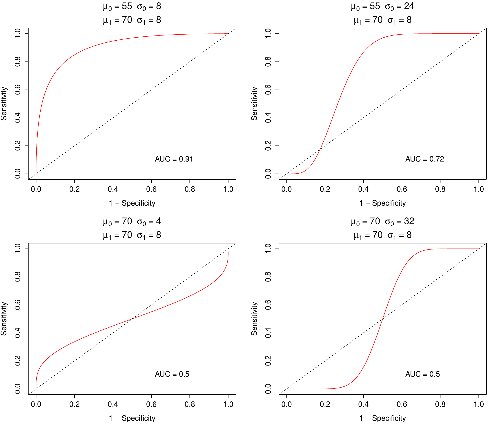
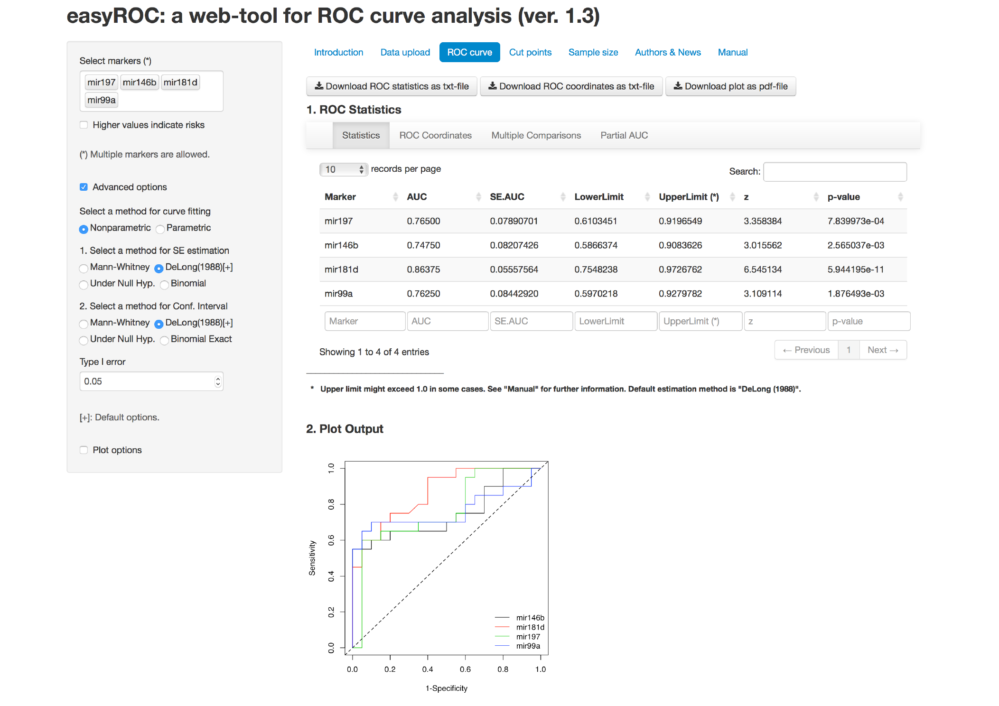

::: article
# Introduction

The receiver operating characteristics (ROC) curve is a graphical
approach used to visualize and assess the performance of a binary
classifier system. This unique feature of ROC curve analysis makes it
one of the most extensively used methods in various fields of science.
It was originally developed during World War II to detect whether a
signal on the radar screen represented an object or a noise
[@Egan1975; @swets2000; @JFan:2006ROC] and today it is widely used in
medicine, radiology, biometrics, bioinformatics and various applications
of machine learning and data mining research
[@Fawcett2006; @Sonego01052008]. ROC curve analysis can be implemented
for several reasons: (i) to assess the overall performance of a
classifier using several performance measures, (ii) to compare the
performances of classifiers, and (iii) to determine the optimal cutpoint
for a given classifier, diagnostic test or marker/biomarker. For
simplicity of language, we will use the terms classifier and diagnostic
test throughout the manuscript. The performance of a classifier can be
summarized using the point estimations and confidence intervals of
several basic performance measures such as sensitivity, specificity or
combined measures of sensitivity and specificity such as likelihood
ratios, accuracy, area under the ROC curve (AUC), etc. A ROC curve is
basically a plot of a classifier's true positive rates (TPR:
sensitivity) versus false positive rates (FPR: $1 - \text{specificity}$)
where each point is generated by a different threshold value, i.e.,
cutpoint. For the simplicity of equations, we will use the terms TPR and
FPR in the equations. One of the major tasks is to determine the optimum
cutpoint value which corresponds to the reasonable TPR and FPR values.
The determination of an optimum value is usually a trade-off between
performance measures. The ROC curve is used to find the optimal cutpoint
located on the curve which is the closest point to the top-left corner.
However, finding the "optimum" cutpoint is not always based on
maximizing the sensitivity and specificity. It is reasonable to select
an optimum cutpoint value by regarding alternative selection criteria
such as maximization of predictive values, diagnostic odds ratio, etc.

There are a number of commercial (e.g., IBM SPSS, MedCalc, Stata, etc.)
and open-source (R) software packages which are used to guide
researchers through their ROC curve analysis. Some of these software
packages provide basic features for ROC curve analysis while others,
such as R, offer advanced features but also a command-based user
interface. The R environment includes comprehensive tools for ROC curve
analysis, such as [*ROCR*](https://CRAN.R-project.org/package=ROCR)
[@Sing2005ROCR], [*pROC*](https://CRAN.R-project.org/package=pROC)
[@robin2011proc],
[*ROC*](https://www.bioconductor.org/packages/release/bioc/html/ROC.html)
[@bioconductorROC] and
[*OptimalCutpoints*](https://CRAN.R-project.org/package=OptimalCutpoints)
[@optimalcutpoints].

All of the R packages mentioned above perform ROC curve analysis using
the related package functions. Although these packages are comprehensive
and flexible, they require a good programming knowledge of the R
language. However, working with a command-based interface might be
challenging and time consuming when a quick evaluation is desired
especially for non-R users, such as physicians and other health care
professionalists. Fortunately, an R package
[*shiny*](https://CRAN.R-project.org/package=shiny) [@shiny2] allows
users to create interactive web-tools with a nicely designed,
user-friendly and easy-to-use user interface. In this context, we
developed a web-tool, easyROC, for ROC curve analysis. The user
interface of easyROC is constructed via *shiny* and HTML codes. easyROC
combines several R packages for ROC curve analysis. This tool has three
main parts including ROC statistics, cutpoint calculations and sample
size estimation. Detailed information about easyROC and the related
methods together with mathematical background are given in
Section [2](#sec:material-methods). easyROC is freely available at
<http://www.biosoft.hacettepe.edu.tr/easyROC> and all the source codes
are on GitHub[^1].

# Material and methods {#sec:material-methods}

## Theory behind ROC analysis

Let us consider the binary classification problem where $X$ denotes the
value of the classifier for cases and controls. Consider the values of
controls distributed as $X_0 \sim G_0(.)$ and cases as
$X_1 \sim G_1(.)$. Let $\hat{Y} = \{0,1\}$ be the estimated class labels
of the subjects for a given threshold value $c$ as given in
Equation \@ref(eq:eqnyhat).
$$\label{eqn:yhat}
\hat{Y} = \begin{cases}
1, & \quad \text{if} \ \ \ X \geq c \\
0, & \quad \text{if} \ \ \ X < c
\end{cases}   (\#eq:eqnyhat)$$

#### Parametric ROC curve.

The parametric ROC curve is plotted using the FPR
($1 - \mathrm{Specificity}$) and TPR ($\mathrm{Sensitivity}$) values
given in Equation \@ref(eq:eqnfprtpr) for all possible cutpoints of a
classifier.

$$\begin{aligned}
 \label{eqn:fprtpr}
	FPR_c =& P\left( X \geq c \; \vert \; Y = 0\right) = \int_{c}^{\infty}G_0(x)dx \nonumber \\
	TPR_c =& P\left( X \geq c \; \vert \; Y = 1\right) = \int_{c}^{\infty}G_1(x)dx
\end{aligned}   (\#eq:eqnfprtpr)$$

When the distribution of the classifier is *Normal*, the parametric ROC
curve is fitted using *binormal ROC* properties. Suppose
$X_0 \sim Normal(\mu_0, \sigma_0^2)$ and
$X_1 \sim Normal(\mu_1, \sigma_1^2)$. The ROC curve is the function of
FPRs; as in Equation \@ref(eq:eqnrocPrmtrk).

$$\label{eqn:rocPrmtrk}
	ROC(t) = \Phi\left( a + b\Phi^{-1}\left( t \right)\right),   (\#eq:eqnrocPrmtrk)$$

where $a = (\mu_1 - \mu_0)/\sigma_1$, $b = \sigma_0 / \sigma_1$,
$t = FPR_c$ and $\Phi$ is the cumulative distribution function of the
standard normal distribution [@zhouBook]. The area under the curve is
calculated using Equation \@ref(eq:eqnaucPrmtrk).

$$\label{eqn:aucPrmtrk}
  AUC = \int\limits_{0}^{1}ROC(t)dt = \Phi\left(\frac{a}{\sqrt{1 + b^2}}\right)   (\#eq:eqnaucPrmtrk)$$

Fitting the ROC curve by using Equation \@ref(eq:eqnrocPrmtrk) has two
major drawbacks: (i) incorrect ROC curves may arise when the underlying
distribution is not normal, (ii) ROC lines are improper when within
class variations are not similar, i.e., heteroscedasticity. An example
of improper ROC curves is given in Figure [1](#fig:proper). To overcome
these problems, one may nonparametrically fit the ROC curve without
considering distributional assumptions or use parametric/semiparametric
alternatives to the binormal model [@gonen2010lehmann].

{#fig:proper
width="100%" alt="graphic without alt text"}

#### Nonparametric ROC curve.

Consider the estimated class labels in Equation \@ref(eq:eqnyhat). The
FPR and TPR given in Equation \@ref(eq:eqnfprtpr) are estimated; as
given in Equation \@ref(eq:eqnfprtprNP).

$$\begin{aligned}
 \label{eqn:fprtprNP}
	\widehat{FPR}_c =& \frac{1}{n_0}\sum\limits_{j=1}^{n_0}I\left[\; X_{0j} \geq c \;\right] \nonumber \\
	\widehat{TPR}_c =& \frac{1}{n_1}\sum\limits_{i=1}^{n_1}I\left[\; X_{1i} \geq c \;\right]
\end{aligned}   (\#eq:eqnfprtprNP)$$

The empirical ROC curve is plotted using $\widehat{FPR}_c$ and
$\widehat{TPR}_c$ and the area under the curve, given in
Equation \@ref(eq:eqnaucNP), is estimated by summing the trapezoids
enclosed by the points of the ROC curve. The nonparametric AUC is
related to the Mann-Whitney statistic of the rank-sum test
[@Bamber1975; @hanley1982].

$$\label{eqn:aucNP}
  \widehat{AUC} = \frac{1}{n_0n_1}\sum\limits_{j = 1}^{n_0}\sum\limits_{i = 1}^{n_1}\Psi\left( X_{1i},X_{0j} \right),   (\#eq:eqnaucNP)$$

where $\Psi = 0$ if $X_0 > X_1$, $\Psi = 1$ if $X_1 > X_0$ and
$\Psi = 1/2$ if $X_0 = X_1$.

#### Performance measures and optimal cutpoints.

The predicted and actual classes, i.e., gold standard test results, can
be shown with a $2 \times 2$ cross table; as seen in Table
[1](#tbl:confMat). The performance of a classifier is basically measured
using the total proportion of true positive (TP) and true negative (TN)
cases. By using Table [1](#tbl:confMat), several performance measures
are also calculated. Among these performance measures, we focused on the
measures given in Table [1](#tbl:confMat) which are widely used and
well-known. The optimal cutpoint is determined by using one or more
performance measures together. An ideal cutpoint, for example, might be
selected by maximizing the sensitivity and specificity of a classifier.
A classifier with perfect discriminative ability would have sensitivity
and specificity measures equal to $1$. Hence, the area under the curve
for a perfect separation will be equal to 1.

::: {#tbl:confMat}
  --------------------------------------------------------------------------------------------------------------------------------
  Predicted Labels                        Actual Labels                                                            Total
  --------------------------------- ------------------------- ------------------------------------------ -------------------------
  2-3                                  Positive $(Y = 1)$                 Negative $(Y = 0)$             

  Positive $(\hat{Y} = 1)$                     TP                                 FP                      $\text{TP} + \text{FP}$

  Negative $(\hat{Y} = 0)$                     FN                                 TN                      $\text{FN} + \text{TN}$

  Total                              $\text{TP} + \text{FN}$           $\text{FP} + \text{TN}$                      $n$

  TP: True positive\                                           $\mathrm{Sensitivity} = TP / (TP + FN)$\  
  FP: False positive\                                          $\mathrm{Specificity} = TN / (FP + TN)$\  
  TN: True negative\                                                   $PPV = TP / (TP + FP)$\           
  FN: False negative\                                                  $NPV = TN / (TN + FN)$\           
  NPV: Negative predictive value\                              $PLR = Sensitivity / (1 - Specificity)$\  
  PPV: Positive predictive value\                              $NLR = (1 - Sensitivity) / Specificity$   
  PLR: Positive likelihood ratio\                                                                        
  NLR: Negative likelihood ratio                                                                         
  --------------------------------------------------------------------------------------------------------------------------------

  : Table 1: A $2 \times 2$ classification table and performance
  measures.
:::

Although researchers are usually interested in the overall diagnostic
performance of a classifier, it is sometimes useful to focus on a
portion of the ROC curve to compute the partial AUCs (pAUC). pAUC is an
extension of the AUC measure which considers the trapezoids within a
given interval of sensitivity and/or specificity. Let us consider the
pAUC where specificity (or sensitivity) lies within the interval
$[t_1, t_2]$. The pAUC is calculated by taking the integral (parametric)
as given in Equation \@ref(eq:eqnpaucPrmtrk) or by summing the
trapezoids within the interval (nonparametric).

$$\label{eqn:paucPrmtrk}
	pAUC(t_1, t_2) = \int\limits_{t_1}^{t_2}ROC(x)dx   (\#eq:eqnpaucPrmtrk)$$

As the interval $[t_1, t_2]$ converges to $[0, 1]$, the pAUC will
converge to the overall AUC. The best classifier can be selected using
either AUC or pAUC values.

Identification of the optimal cutpoint is an important task to avoid
incorrect conclusions. Various methods are available in the literature
to determine the optimal cutpoint. Most of these methods are based on
the sensitivity and specificity measures. However, other methods are
also available based on cost-benefit, prevalence, predictive values and
diagnostic likelihood ratios. Two popular methods are, for example, the
Youden index and the minimization of the distance of the point on the
curve to the top-left corner, i.e., the point indicating perfect
discrimination.

$$\label{eqn:youden}
	\mathrm{Youden}(c) = \max\{TPR_c - FPR_c\}   (\#eq:eqnyouden)$$

Table [1](#tbl:confMat) gives the list of optimal cutpoint methods we
consider in easyROC. For detailed information and mathematical
background, see @optimalcutpoints.

#### Statistical inference.

A common subject of interest in ROC analysis is to compare the
performances of several classifiers to select the best one to
discriminate cases from controls. For a classifier with random chance
discrimination ability, the equation $TPR = FPR$ holds. In that case,
the area under the curve is $0.50$. Hence, the discrimination ability of
a classifier is mostly tested against the value $0.50$.
$$\begin{aligned}
  H_0 &: AUC = 0.50 \\
  H_1 &: AUC \neq 0.50
\end{aligned}$$

Under the large sample theory, the significance of AUC is tested using
the *Wald* test statistic as given in Equation \@ref(eq:eqnaucWald).

$$\label{eqn:aucWald}
	z = \frac{\widehat{AUC} - AUC}{\mathrm{Var}(\widehat{AUC})^{1/2}}   (\#eq:eqnaucWald)$$

When the parametric approach is used, the variance of AUC is estimated
using Equation \@ref(eq:eqnvarAUCparametric) [@McClish1989; @zhouBook].

$$\label{eqn:varAUCparametric}
  \mathrm{Var}\left( \widehat{AUC} \right) = f^2 \mathrm{Var}(\hat{a}) + g^2 \mathrm{Var}(\hat{b}) + 2fg\, \mathrm{Cov}(\hat{a}, \hat{b}),   (\#eq:eqnvarAUCparametric)$$

where

$$\label{eqn:varAUCparametric_fg}
	f = \frac{e^{-a^{2} / 2(1 + b^2)}}{\sqrt{2\pi(1 + b^2)}} \qquad \text{and} \qquad g = -\frac{abe^{-a / 2(1 + b^2)}}{\sqrt{2\pi(1 + b^2)^3}}   (\#eq:eqnvarAUCparametric-fg)$$

and the estimated variances for $a$ and $b$ as follows:

$$\begin{aligned}
  \mathrm{\widehat{Var}}(\hat{a}) =& \frac{n_1 (\hat{a}^2 + 2) + 2n_0\hat{b}^2}{2n_0n_1}, \nonumber \\
  \mathrm{\widehat{Var}}(\hat{b}) =& \frac{(n_1 + n_0)\hat{b}^2}{2n_0n_1}, \\
  \mathrm{\widehat{Cov}}(\hat{a}, \hat{b}) =& \frac{\hat{a}\hat{b}}{2n_0}. \nonumber 
\end{aligned}$$

The estimated values of $a$ and $b$ are used in
Equation \@ref(eq:eqnvarAUCparametric-fg). A number of methods have been
proposed for the estimation of the variance of AUC when the
nonparametric approach is used. In this paper, we will focus on the
methods described below:

1.  Mann-Whitney version of rank-sum test:

    @hanley1982 propose the variance estimation given in
    Equation \@ref(eq:eqnvarAUC-MW). This method estimates the variance
    using an approximation based on exponential distribution as

    $$\begin{aligned}
     \label{eqn:varAUC_MW}
        \mathrm{Var}\left( \widehat{AUC}\right) = \frac{1}{n_0n_1} & \left\lbrace AUC(1-AUC) + (n_1 - 1)(Q_1 - AUC^2) \right.  \nonumber \\
                                                                   & \left. + (n_0 - 1)(Q_2 - AUC^2) \right\rbrace,
    \end{aligned}   (\#eq:eqnvarAUC-MW)$$

    where $Q_1 = \widehat{AUC} / (2 - \widehat{AUC})$ and
    $Q_2 = 2\widehat{AUC}^2 / (1 + \widehat{AUC})$. The Mann-Whitney
    version might underestimate the variance when the area is nearly 0.5
    and overestimate it when the area is close to 1
    [@hanley1982; @Hanley1997; @obuchowski1994]. This estimate is mostly
    used in sample-size estimation.

2.  @DeLong1988's estimate:

    Since the exponential distribution approximation in Equation
     \@ref(eq:eqnvarAUC-MW) gives biased variance estimates, @DeLong1988
    suggest an alternative method which is free from distributional
    assumptions. Define the components $T_{1i}$ for the $i$th subject
    from cases and $T_{0j}$ for the $j$th subject from controls as
    follows:

    $$\begin{aligned}
     \label{eqn:varDeLongComponents}
        \psi\left( T_{1i} \right) =& \frac{1}{n_0}\sum\limits_{j=1}^{n_0} \Psi \left( X_{1i}, X_{0j}\right) \qquad i = 1,2, \ldots ,n_1 \nonumber \\
        \psi\left( T_{0j} \right) =& \frac{1}{n_1}\sum\limits_{i=1}^{n_1} \Psi \left( X_{1i}, X_{0j}\right) \qquad j = 1,2, \ldots ,n_0
    \end{aligned}   (\#eq:eqnvarDeLongComponents)$$

    Using the Equation \@ref(eq:eqnvarDeLongComponents) the variance of
    AUC is estimated as

    $$\label{eqn:varDeLong}
        \mathrm{Var}\left( \widehat{AUC} \right) = \frac{1}{n_1}S_{T_1}^{2} + \frac{1}{n_0}S_{T_0}^{2},   (\#eq:eqnvarDeLong)$$

    where $S_{T_1}^{2}$ and $S_{T_0}^{2}$ are variance estimates of
    $T_{1}$ and $T_{0}$ as in
    Equation \@ref(eq:eqnvarianceEstimatesOfDeLongComponents).

    $$\label{eqn:varianceEstimatesOfDeLongComponents}
        S_{T_i}^{2} = \frac{1}{n_i - 1} \sum\limits_{j = 1}^{n_i}\left[ \psi \left( T_{ij}\right) - \widehat{AUC}\right]^2 \qquad i = 0, 1   (\#eq:eqnvarianceEstimatesOfDeLongComponents)$$

3.  Normal approximation of binomial proportion:

    Another alternative for variance estimation is to use binomial
    approximation under the large sample theory, as given in Equation
     \@ref(eq:eqnvarAUC-binom). For small samples, this method may give
    biased estimates.

    $$\label{eqn:varAUC_binom}
        \mathrm{Var}(\widehat{AUC}) = \frac{AUC(1 - AUC)}{n_0 + n_1}   (\#eq:eqnvarAUC-binom)$$

The estimated variance derived from one of the methods described above
is used to construct the confidence intervals of the AUC. A common
method is to use large sample approximation as below:

$$\label{eqn:ciAUC}
	\widehat{AUC} - z_{1 - \alpha / 2}\mathrm{Var}(\widehat{AUC})^{1/2} < AUC < \widehat{AUC} + z_{1 - \alpha / 2}\mathrm{Var}(\widehat{AUC})^{1/2}.   (\#eq:eqnciAUC)$$

When the area under the curve is close to 1 or the sample size is
relatively small, the large sample approximation in
Equation \@ref(eq:eqnciAUC) produces improper confidence intervals since
the upper limit exceeds 1. To solve this problem, @AgrestiCoull1998
proposed the *score confidence interval* that guarantees the upper limit
is less than or equal to 1. Another alternative is to construct the
binomial exact confidence intervals given in
Equation \@ref(eq:eqnciExact) using the relationship between binomial
and *F*-distribution [@morisette1998]

$$\label{eqn:ciExact}
  \dfrac{1}{1 + \dfrac{n - x + 1}{x}F_{2(n - x + 1), 2x, \alpha / 2}} \leq p \leq \dfrac{\dfrac{x + 1}{n - x} F_{2(x + 1), 2(n - x), \alpha / 2}}{1 + \dfrac{x + 1}{n - x} F_{2(x + 1), 2(n - x), \alpha / 2}},   (\#eq:eqnciExact)$$

where $p = x/n$ is the binomial proportion such as sensitivity,
specificity and AUC.

#### Sample size calculation.

In most studies, determining the required sample size is an important
step for the research to be able to detect significant results. Sample
size determination is required for both constructing the confidence
interval of the unknown population parameter and testing a research
hypothesis. @obuchowski1998sample reviewed sample size determination for
several study designs. In this paper, we cover the sample size
determination for three types of studies based on AUCs. In addition, the
following sample size calculations can be extended to other performance
measures such as sensitivity, specificity, etc.

The variance estimates of AUCs can be obtained using one of the
Equations \@ref(eq:eqnvarAUC-MW), \@ref(eq:eqnvarDeLong) and
\@ref(eq:eqnvarAUC-binom). While Equation \@ref(eq:eqnvarAUC-MW) is a
good approximation for a variety of underlying distributions, the
estimated variance will be underestimated if the test results are in a
discrete rating format. To overcome this problem, @obuchowski1998sample
and @obuchowski2004samplesize suggest an alternative variance estimation
method for rating data using the variance function as given in Equation
\@ref(eq:eqnvarAUC-SS1) which is based on an underlying binormal
distribution. In this section, we focused on sample size calculation for
discrete scale data. However, the same formulas are valid for continuous
scale diagnostic tests since the only difference is about estimating the
variance of diagnostic test accuracy.

$$\label{eqn:varAUC_SS1} 
  \mathrm{V}(\widehat{AUC}) =
  0.0099\,e^{-a^2/2}\times\left[ (5a^2 + 8) + (a^2 + 8)/R \right],   (\#eq:eqnvarAUC-SS1)$$

where $a = \sqrt{2}\,\Phi^{-1}(AUC)$ and $R=n_0 / n_1$ is the allocation
ratio, i.e., the ratio of the number of controls to the number of cases.
The estimated variance is then
$\mathrm{Var}(\widehat{AUC}) = \mathrm{V}(\widehat{AUC}) / n_1$. The
total sample size is equal to $n = n_1(1+R)$. One of the variance
estimations from Equations \@ref(eq:eqnvarAUC-MW),
\@ref(eq:eqnvarDeLong), \@ref(eq:eqnvarAUC-binom) and
\@ref(eq:eqnvarAUC-SS1) is used for the sample size calculations. The
selection of the appropriate variance estimation method is based on the
variable type of the test results and underlying distributions.

1.  Hypothesis test to determine the AUC of a single classifier:

    In most of the studies with a single classifier, the aim of the
    study is to determine whether the diagnostic test performs well for
    discriminating diseased patients from controls. Consider the
    hypotheses $H_0: AUC = 0.5$ versus $H_1: AUC > 0.5$ (i.e, one-sided
    test). The required number of cases is determined using Equation
    \@ref(eq:eqnaucSS-1) [@obuchowski2004samplesize].

    $$\begin{aligned}
     \label{eqn:aucSS_1}
        n_1 &= \dfrac{\left[ z_{1-\alpha} \sqrt{\mathrm{Var}_0(\widehat{AUC})} + z_{1-\beta} \sqrt{\mathrm{Var}_1(\widehat{AUC})}\,\right]^2}{\left(AUC - 0.5\right)^2}	\nonumber \\
            &= \dfrac{\left[ z_{1-\alpha} \sqrt{0.0792\times(1 + 1/R)} + z_{1-\beta} \sqrt{\mathrm{Var}_1(\widehat{AUC})}\right]^2}{\left(AUC - 0.5\right)^2},
    \end{aligned}   (\#eq:eqnaucSS-1)$$

    where $\mathrm{Var}_0$ and $\mathrm{Var}_1$ are the variance
    estimations under the null and alternative hypotheses using
    Equation \@ref(eq:eqnvarAUC-SS1). $z_{1-\alpha}$ and $z_{1-\beta}$
    are lower-tailed percentile values of the cumulative standard normal
    distribution. Finally, the total sample size is obtained using
    $n = n_1 + n_1 \times R$.

2.  Comparing the AUCs of two classifiers:

    When the aim of a study is to compare two classifiers, one may
    consider the hypotheses $H_0: AUC_1 = AUC_2$ versus
    $H_1: AUC_1 \neq AUC_2$. The two classifiers will be equally
    performing under the null hypothesis. The required number of cases
    is calculated using Equation \@ref(eq:eqnSSauc2grp).

    $$\label{eqn:SSauc2grp}
        n_1 = \dfrac{\left[ z_{1 - \alpha / 2} \sqrt{\mathrm{Var}_0 (\widehat{AUC_1} - \widehat{AUC_2})} + z_{1 - \beta} \sqrt{\mathrm{Var}_1 (\widehat{AUC_1} - \widehat{AUC_2})} \right]^2}{(AUC_1 - AUC_2)^2},   (\#eq:eqnSSauc2grp)$$

    where $\mathrm{Var}_0$ and $\mathrm{Var}_1$ are the variance
    estimations under the null and alternative hypotheses; as given in
    Equation \@ref(eq:eqnvar2auc)
    [@zhouBook; @obuchowski2004samplesize].

    $$\begin{aligned}
     \label{eqn:var2auc}
        \mathrm{Var}(\widehat{AUC}_1 - \widehat{AUC}_2) &= \mathrm{Var}(\widehat{AUC}_1) + \mathrm{Var}(\widehat{AUC}_2)
                                                          - 2\mathrm{Cov}(\widehat{AUC}_1, \widehat{AUC}_2)
    \end{aligned}   (\#eq:eqnvar2auc)$$

    The total sample size is calculated using the allocation ratio. When
    two classifiers are performed on the same subjects, the design will
    be *paired* yielding the covariance term to be a nonzero (usually
    positive) quantity. However, the covariance term will be zero (i.e.,
    independent classifiers) if each test is performed on different
    subjects. Detailed information on the calculation of the covariance
    term can be found in @zhouBook.

3.  Non-inferiority of a new classifier to a standard one:

    In addition to comparing two classifiers, some studies are designed
    to explore the performance of a new classifier to that of a standard
    one. The new classifier should perform as well as but not
    necessarily better than the standard test
    [@obuchowski2004samplesize]. The hypotheses are
    $H_0: AUC_{std} - AUC_{new} \geq \Delta$ versus
    $H_1: AUC_{std} - AUC_{new} < \Delta$. The required number of cases
    is calculated using Equation \@ref(eq:eqnSSaucNonInf)

    $$\label{eqn:SSaucNonInf}
        n_1 = \dfrac{(z_{1 - \alpha} + z_{1 - \beta})^2 \, \mathrm{Var}_1(\widehat{AUC}_{std} - \widehat{AUC}_{new})}{(AUC_{std} - AUC_{new} - \Delta)^2},   (\#eq:eqnSSaucNonInf)$$

    where $\Delta$ is the non-inferiority margin, i.e., the minimum
    acceptable difference between the AUCs of the standard and new
    classifiers.

## Current ROC analysis tools and easyROC {#sec:webtool}

ROC curve analysis is one of the standard procedures included in most
statistical analysis tools such as IBM SPSS, Stata, MedCalc and R. Each
tool offers different features within ROC curve analysis. Among
commercial software packages, IBM SPSS, which is one of the most widely
used commercial software packages, plots the ROC curve and computes some
basic statistics such as AUC and its standard error, confidence interval
and statistical significance. However, it does not provide any method
for sample size calculation or cutpoint determination. Stata offers a
variety of calculations for ROC curve analysis including partial AUC,
multiple comparisons of ROC curves, optimal cutpoint determination using
the Youden index and several performance measures. Another commercial
software alternative for ROC curve analysis is MedCalc, which has
comprehensive features compared to most of the other available
commercial software packages and is especially developed for biomedical
research. MedCalc provides sample size estimation for a single
diagnostic test, but it does not have an option for pAUC calculation.

Unlike commercial software packages, R is an open source and free
software package that includes all the features of commercial software
packages and more through several packages such as *ROC*, *ROCR*, *pROC*
and *OptimalCutpoints*. *ROC* is an R/Bioconductor package which can
plot the ROC curve and calculate the AUC. It also calculates pAUCs based
on false positive rates. This package is originally developed to be used
for the ROC analysis with DNA microarrays. *ROCR* is a comprehensive R
package providing over 25 different performance measures (based on
package version 1.0-7). It allows users to create two dimensional
performance curves. Although *ROCR* is one of the most comprehensive
packages for assessing the performance measures, it provides limited
options to select the optimum cutpoint. One may use any of the
two-dimensional performance graphs to determine the optimal cutpoint
graphically. It computes the AUC and its confidence interval, however,
it does not provide a statistical test for performance measures.

*pROC*, on the other hand, offers more comprehensive and flexible
features than its free and commercial counterparts. It performs
statistical tests for the comparison of ROC curves using @DeLong1988,
@venkatraman1996distribution and @venkatraman2000permutation for AUC,
and @hanley1983method and @pepe2009estimation for both AUC and pAUC. It
also calculates the confidence intervals for the sensitivity,
specificity, ROC curves, pAUC, and smoothed ROC curves. The confidence
intervals are computed using @DeLong1988's method for AUCs and using
bootstrap for pAUCs, sensitivity and specificity at given threshold(s).
Bootstrap confidence intervals and pAUC regions are shown in the ROC
curve plot. Several diagnostic measures, such as sensitivity,
specificity, negative and positive predictive values, are computed for a
given threshold. Like *ROCR*, *pROC* also offers limited features for
detecting the optimal cutpoint. Two methods, i.e., Youden index and
closest point to the top-left corner, are available to find the optimal
cutpoint. In addition, *pROC* is an alternative among the ROC packages
on CRAN to find the required sample size for a single diagnostic test or
the comparison of two diagnostic tests. Two versions of *pROC* are
available: (i) for the R programming language and (ii) with a graphical
user interface for the S-PLUS statistical software package.

There are several packages providing optimal cutpoint calculations
through R. *OptimalCutpoints* is a sophisticated R package specifically
developed to determine the optimal cutpoint of a test or biomarker
[@optimalcutpoints]. It includes 34 different cutpoint calculation
methods based on sensitivity/specificity measures, cost-benefit
analysis, predictive values, diagnostic likelihood ratios, prevalences
and $p$-values. A brief description of these methods is given in
Supplementary [4](#tab:cutpoints). Although these R packages, especially
*pROC*, seem to be a perfect match for ROC curve analysis, none of them
has a graphical user interface and all require coding knowledge, which
makes them hard to use; especially for non-R users.

Another R package worth mentioning is
[*plotROC*](https://CRAN.R-project.org/package=plotROC) [@plotROC] which
is available on CRAN and also for *shiny* platforms. *plotROC* is a
flexible and sophisticated R package which can be used to create
nice-looking and interactive ROC graphs. Unlike the packages described
above, *plotROC* has a web-based user interface which is very useful for
non-R users. Researchers can use its web service to create ROC graphics
and download the figures to their local computer. However, it does not
provide any statistical tests or sample size calculations.

::: {#tbl:toolComp}
  ---------------------------------------------------------------------------------------
                            IBM SPSS   Stata   MedCalc    ROC    ROCR    pROC    easyROC
  ------------------------ ---------- ------- --------- ------- ------- ------- ---------
  Plots                       Yes       Yes     Yes\*     Yes    Yes\*   Yes\*    Yes\*

  Conf. intervals             Yes      Yes\*     Yes      Yes     Yes    Yes\*    Yes\*

  pAUC                         No       Yes      No       Yes     Yes    Yes\*    Yes\*

  Statistical tests            No       Yes      No       Yes     Yes    Yes\*    Yes\*

  Diagnostic measures          No       Yes      Yes      No     Yes\*    Yes      Yes

  Multiple comp.               No       Yes     Yes\*     No      No     Yes\*     Yes

  Cutpoints                    No       Yes      Yes      No      No      Yes     Yes\*

  Sample size                  No       No       Yes      No      No      Yes     Yes\*

  Free license                 No       No       No      Yes\*   Yes\*   Yes\*    Yes\*

  Open source                  No       No       No      Yes\*   Yes\*   Yes\*    Yes\*

  Web-tool access              No       No       No       No      No      No      Yes\*

  User interface              Yes      Yes\*    Yes\*     No      No     Yes\*    Yes\*

  \* Comprehensive ones.                                                        
  ---------------------------------------------------------------------------------------

  : Table 2: Comparison of easyROC with other tools.
:::

easyROC aims to extend the features of several ROC packages in R and
allows researchers to conduct their ROC curve analysis through a single
and easy-to-use interface without writing any R code. This tool is a
web-based application created via *shiny* and HTML programming. easyROC
makes use of the R packages
[*plyr*](https://CRAN.R-project.org/package=plyr) [@plyr2], *pROC* and
*OptimalCutpoints* for conducting ROC analysis. *plyr* is used for
manipulating data while *pROC* is used for estimation and hypothesis
testing of pAUCs. easyROC has comprehensive options for ROC curve
analysis which other tools do not have (or partially shares some
features). The ROC curve can be estimated using parametric or
nonparametric approaches. It offers four different methods for the
calculation of the standard error and confidence interval of the AUC.
Researchers can calculate the pAUCs based on sensitivity and
specificity, if necessary. One may perform pairwise comparisons to find
the classifiers which have similar or different discrimination ability.
However, the pairwise comparison should be carried out carefully since
the type I error increases with the increasing number of comparisons.
easyROC offers multiple test corrections in order to keep type I error
at a given level. Multiple comparisons of diagnostic tests can be
applied using either Bonferroni or false discovery rate correction.
Furthermore, the optimal cutpoints are determined using the methods from
*OptimalCutpoints* and the corresponding measures at a given cutpoint,
including sensitivity, specificity, positive and negative predictive
values, and positive and negative likelihood ratios are also returned.
One can determine the desired sample size for ROC curve analysis using
this tool for three different cases. All these comprehensive features
are accessible through a graphical user interface, which makes the
analysis process easier for all users. The comparison with other tools
is given in Table [2](#tbl:toolComp) and the features of each module are
given in Table [3](#tbl:easyROCmodules).

::: {#tbl:easyROCmodules}
+----------------------+----------------------------------------------+
| Modules (Tab panels) | Features                                     |
+:=====================+:=============================================+
| ROC curve            | -   Parametric/Nonparametric ROC             |
|                      |                                              |
|                      | -   AUC, pAUC                                |
|                      |                                              |
|                      |     -   Confidence interval (Exact and       |
|                      |         Asymptotic)                          |
|                      |                                              |
|                      |     -   Significance test (Wald)             |
|                      |                                              |
|                      | -   Standard error estimation                |
|                      |                                              |
|                      |     -   DeLong (1988)                        |
|                      |                                              |
|                      |     -   Mann-Whitney                         |
|                      |                                              |
|                      |     -   Binomial approximation               |
|                      |                                              |
|                      | -   Multiple comparison of AUCs              |
|                      |                                              |
|                      |     -   Bonferroni                           |
|                      |                                              |
|                      |     -   False discovery rate                 |
|                      |                                              |
|                      | -   ROC plot (customizable)                  |
+----------------------+----------------------------------------------+
| Cutpoints            | -   34 different methods for optimum         |
|                      |     cutpoints [@optimalcutpoints]            |
|                      |                                              |
|                      | -   Performance measures with confidence     |
|                      |     intervals                                |
|                      |                                              |
|                      |     -   Exact CIs                            |
|                      |                                              |
|                      |     -   Asymptotic CIs                       |
|                      |                                              |
|                      | -   Cutpoint graphs (fully customizable)     |
|                      |                                              |
|                      |     -   ROC curve                            |
|                      |                                              |
|                      |     -   Sensitivity & specificity plot       |
|                      |                                              |
|                      |     -   Density plot                         |
|                      |                                              |
|                      |     -   Scatter plot                         |
+----------------------+----------------------------------------------+
| Sample size          | -   Single diagnostic test                   |
|                      |                                              |
|                      | -   Comparison of two diagnostic tests       |
|                      |                                              |
|                      | -   Noninferiority of a new test to a        |
|                      |     standard test                            |
+----------------------+----------------------------------------------+

: Table 3: Features of easyROC.
:::

# Results

## Case study on non-alcoholic fatty liver disease

To illustrate our application, we used the non-alcoholic fatty liver
disease (NAFLD) dataset of @celikbilek2014. This study was designed to
identify the non-invasive miRNA biomarkers of NAFLD. The authors
obtained the serum samples of 20 healthy and 20 NAFLD observations and
quantified the expression levels of eight miRNAs using quantitative
Real-Time PCR (qPCR) technology. After performing the necessary
statistical analysis, the authors revealed that miR-197, miR-146b,
miR-181d and miR-99a may be potential biomarkers in identifying NAFLD.
The normalized expression values of these miRNAs and the class
information (the column named "Group", where 0 refers to controls and 1
refers to cases) of each observation are given in
Supplementary [5](#tab:nafld). This file can be directly used as input
to the easyROC web-tool and users can arrange their own data based on
this file. Two example datasets, Mayo and PBC [@murtaugh1994primaryPBC],
are also available in the web-tool for users to practice the
application. In our example, the aim is to investigate the
discriminative performances of each miRNA, compare each other and
identify the optimal cutpoints for each miRNA in identifying NAFLD.

## Implementation of easyROC web-tool

The data are uploaded to the easyROC interface using the *Data upload*
tab (Figure [2](#fig:dataUpload)). easyROC accepts a delimited text file
with variable names in the first row. The status variable is also set by
the same tab panel. easyROC automatically detects the variable names and
exports them into related fields. When data are correctly uploaded,
researchers may proceed with ROC curve analysis, cutpoint estimations or
sample size calculations. The area under the curve, confidence intervals
and significance tests for AUC, multiple comparisons (if multiple
markers are selected) and pAUCs are calculated with the *ROC curve* tab
(Figures [3](#fig:ROCcurve) and [4](#fig:ROCcurveComparison)). The ROC
curve is estimated using the nonparametric approach. The advanced option
allows researchers to select a method for standard error estimation and
confidence intervals. easyROC selects the @DeLong1988 method by default.

{#fig:dataUpload width="100%" alt="graphic without alt text"}

{#fig:ROCcurve
width="100%" alt="graphic without alt text"}

{#fig:ROCcurveComparison width="100%" alt="graphic without alt text"}

Here, we select mir197, mir146b, mir181d and mir99a miRNAs to assess
their performances and to compare them with each other in identifying
NAFLD. Since the expression levels of all miRNAs are underexpressed in
the NAFLD group, lower values will indicate higher risk and therefore we
should uncheck the "Higher values indicate higher risks" box. Using
@DeLong1988 standard error estimations, we obtained the ROC curves for
each miRNA biomarker and AUC values as $0.86$ (0.75--0.97), $0.77$
(0.61--0.92), $0.76$ (0.60--0.93) and $0.75$ (0.59--0.91) for mir181d,
mir197, mir99a and mir146b, respectively. The results revealed that all
miRNAs' predictive performances are significant and higher than random
chance in identifying NAFLD (Figure [3](#fig:ROCcurve)). By controlling
the type I error using Bonferroni correction, all pairwise comparisons
showed non-significant results ($p > 0.05$). This may be due to the
small sample size of the data. Increasing the sample size, thus the
statistical power of the test, may concretize the predictive ability of
mir181d as compared to other miRNAs.

Finding a suitable cutpoint is one of the aims of ROC curve analysis. We
made use of the *OptimalCutPoints* package from R [@optimalcutpoints],
which has 34 different methods, to calculate cutpoints for each marker.
An optimal cutpoint can be computed via the *Cut point* tab by selecting
a marker and a method. Then, the application will calculate an optimal
cutpoint and performance measures such as sensitivity, specificity,
positive and negative predictive value, and positive and negative
likelihood ratio based on the corresponding cutpoint value. The "ROC01"
method, for example, determines the optimal cutpoint as $-0.12977$ for
mir181d. Using this cutpoint, a new test observation with a mir181d
expression level lower than this value can be assigned as an NAFLD
patient. Based on the identified cutpoint, we obtained statistical
diagnostic measures with 95% confidence intervals
(Figure [5](#fig:optimalCutpoints)). We obtain a sensitivity of $0.75$
(0.51--0.91) and specificity of $0.80$ (0.56--0.94). If users select the
"Include plots" option, four plots will appear under the statistics
results. The first plot in the upper-left corner displays the optimal
cutpoint on the ROC curve. Users can observe the change of sensitivity
and specificity measures based on the value of the marker on the plot
placed in the upper-right corner. The density and scatter of the
expression values in each group are displayed in the bottom-left and
bottom-right corners. The plots can be modified through the "More plot
options" section. All the results and figures can be downloaded using
the related "Download" buttons in each tab panel.

{#fig:optimalCutpoints width="100%" alt="graphic without alt text"}

# Conclusion

Since ROC curve analysis is one of the principal statistical analysis
methods, it is used by a wide range of the scientific community. Both
commercial and free software tools are available for users to perform
it. Generally, easy-to-use and nicely-designed interfaces are offered by
commercial software packages whereas flexible and comprehensive tools
are available in free, open-access, code-based software packages, such
as R. The first novelty of our tool is that it allows the user to use
free and open-access software with an easy-to-use interface. In other
words, we combine the power of an open-source and free language with a
nicely designed and easily accessible interface. This tool offers more
comprehensive features and a wide variety of implementations for ROC
curve analysis than its commercial and free counterparts, which is
another novelty of this application. It is specifically constructed for
ROC curve analysis, unlike the commercial software packages, such as IBM
SPSS, Stata and MedCalc.

This web-based application is intended for research purposes only, not
for clinical or commercial use. Since it is a non-profit service to the
scientific community, it comes with no warranty and no data security.
However, since this web server uses the R package *shiny*, each user
performs his/her analyses in a new R session. After uploading data, the
application only saves responses within its R session and prints the
results instantly. After a user has quit the application, the
corresponding R session will be closed and any uploaded data, responses
or outputs will not be saved locally or remotely.

This tool is freely available through
<http://www.biosoft.hacettepe.edu.tr/easyROC/> and all the source codes
are available at <http://www.github.com/dncR/easyROC> under GPL version
3. It will be regularly updated upon the dependent R packages used in
this application, including *shiny* and *OptimalCutpoints*, and new
features will be continually added as they are developed.

# Supplementary material {#supplements}

::: {#tab:cutpoints}
  -------------------- ------------------------------------------------------------------------------------------------------------
  **Method**           **Description**

  Youden               Youden index identifies the cutpoint that maximizes the sum of $Sensitivity$ and $Specificity$.

  CB                   CB is a measure based on the cost and benefit method, and is calculated from the slope of the ROC curve.

                       

  MinValueSe           For a given minimum value for $Specificity$, MinValueSp identifies the optimal value as the one that gives
                       the maximum $Sensitivity$. In contrast, for a given minimum value for $Sensitivity$, MinValueSe identifies
                       the optimal value as the one that gives the maximum $Specificity$.

                       

  ValueSe              For a given particular value for $Specificity$, ValueSp identifies the optimal value as the one that gives
                       the maximum $Sensitivity$. In contrast, for a given particular value for $Sensitivity$, ValueSe identifies
                       the optimal value as the one that gives the maximum $Specificity$.

  MinValueSpSe         For given minimum values for $Specificity$ and $Sensitivity$ measures, MinValueSpSe identifies the optimal
                       value as the one that gives the maximum $Sensitivity$ or $Specificity$ (user-defined).

                       

  MaxSe                MaxSp and MaxSe are two measures based on the maximization of $Specificity$ and $Sensitivity$, respectively.

  MaxSpSe              MaxSpSe is a measure based on the simultaneous maximization of both $Specificity$ and $Sensitivity$
                       measures.

  MaxProdSpSe          MaxProdSpSe is a measure based on the maximization of the product of $Sensitivity$ and $Specificity$.

  ROC01                ROC01 identifies the optimal cutpoint that is closest to the upper-left corner $(0,1)$ of the ROC graph.

  SpEqualSe            SpEqualSe is a measure based on the minimization of the absolute difference between $Sensitivity$ and
                       $Specificity$.

  MaxEfficiency        MaxEfficiency is a measure based on the minimization of the misclassification error, $(FP+FN)/n$.

  Minimax              Minimax is a measure based on the minimization of the most frequent error. Minimax is computed using the
                       equation $\mathrm{Minimax}_c = \mathrm{min}_c(\mathrm{max}(p(1-Sensitivity) + (1-p)(1-Specificity)))$ where
                       $c$ is the cutpoint and $p$ is the prevalence.

  MaxDOR               MaxDOR is a measure based on the maximization of the diagnostic odds ratio, calculated using the equation
                       $\mathrm{MaxDOR}_c = \mathrm{max}_c[(Sensitivity \times Specificity) / ((1-Sensitivity)(1-Specificity))]$.

                       

  MinValuePPV          For a given minimum value for $NPV$, MinValueNPV identifies the optimal value as the one that gives the
                       maximum $PPV$. In contrast, for a given minimum value for $PPV$, MinValuePPV identifies the optimal value as
                       the one that gives the maximum $NPV$.

                       

  ValuePPV             For a given particular value for $NPV$, ValueNPV identifies the optimal cutpoint as the one that gives the
                       maximum $PPV$. In contrast, for a given particular value for $PPV$, ValuePPV identifies the optimal cutpoint
                       as the one that gives the maximum $NPV$.

  MinValueNPVPPV       For given minimum values for predictive values, MinValueNPVPPV identifies the optimal value as the one that
                       gives the maximum $NPV$ or $PPV$ (user-defined).

  PROC01               PROC01 identifies the optimal cutpoint that is closest to the upper-left corner $(0,1)$ of the partial ROC
                       (pROC) graph.

  NPVEqualPPV          NPVEqualPPV is a measure based on the minimization of the absolute difference between $NPV$ and $PPV$.

  MaxNPVPPV            MaxNPVPPV is a measure based on the simultaneous maximization of both $NPV$ and $PPV$ measures.

  MaxSumNPVPPV         MaxSumNPVPPV is a measure based on the maximization of the sum of $NPV$ and $PPV$ measures.

  MaxProdNPVPPV        MaxProdNPVPPV is a measure based on the maximization of the product of $NPV$ and $PPV$.

                       

  ValueDLR.Positive    These two measures are based on setting particular values for negative and positive diagnostic likelihood
                       ratios, respectively.

  MinPvalue            MinPvalue is a measure based on the minimization of the $p$-value of the Chi-square test on assessing the
                       independence between the diagnostic and gold standard test.

  ObservedPrev         ObservedPrev is a measure which identifies the optimal cutpoint closest to the observed prevalence by
                       minimizing the quantity $|c - p|$. This method is valid when the diagnostic test takes values within the
                       interval $[0,1]$.

  MeanPrev             MeanPrev is a measure which identifies the optimal cutpoint closest to the average of the diagnostic test
                       values. It is suggested to use this measure if the diagnostic test takes values between 0 and 1.

  PrevalenceMatching   PrevalenceMatching is a measure based on the equality of actual and predicted prevalence. The cutpoint
                       minimizes the absolute quantity $|p(1-Sensitivity) - (1-p)(1-Specificity)|$. This method is valid when the
                       diagnostic test takes values within the interval $[0,1]$.

                       *For details, see Lopez-Raton et al. (2014).*
  -------------------- ------------------------------------------------------------------------------------------------------------

  : Supplement 1: A brief description of optimal cutpoint methods.
:::

::: {#tab:nafld}
<table>
<caption>Supplement 2: Non-alcoholic fatty liver disease NAFLD data Çelikbilek et al., 2014.</caption>
<thead>
<tr class="header">
<th style="text-align: center;">

<strong>Grup</strong>
</th>
<th style="text-align: center;">
<strong>mir197</strong>
</th>
<th style="text-align: center;">
<strong>mir146b</strong>
</th>
<th style="text-align: center;">
<strong>mir181d</strong>
</th>
<th style="text-align: center;">
<strong>mir99a</strong>
</th>
<th style="text-align: center;">

</th>
<th style="text-align: center;">
<strong>Grup</strong>
</th>
<th style="text-align: center;">
<strong>mir197</strong>
</th>
<th style="text-align: center;">
<strong>mir146b</strong>
</th>
<th style="text-align: center;">
<strong>mir181d</strong>
</th>
<th style="text-align: center;">
<strong>mir99a</strong>
</th>
</tr>
</thead>
<tbody>
<tr class="odd">
<td style="text-align: center;">
 1
</td>
<td style="text-align: center;">
0.921
</td>
<td style="text-align: center;">
0.687
</td>
<td style="text-align: center;">
0.474
</td>
<td style="text-align: center;">
0.941
</td>
<td style="text-align: center;"></td>
<td style="text-align: center;">
0
</td>
<td style="text-align: center;">
1.214
</td>
<td style="text-align: center;">
1.122
</td>
<td style="text-align: center;">
0.882
</td>
<td style="text-align: center;">
1.610
</td>
</tr>
<tr class="even">
<td style="text-align: center;">
1
</td>
<td style="text-align: center;">
0.967
</td>
<td style="text-align: center;">
1.059
</td>
<td style="text-align: center;">
0.474
</td>
<td style="text-align: center;">
0.575
</td>
<td style="text-align: center;"></td>
<td style="text-align: center;">
0
</td>
<td style="text-align: center;">
1.401
</td>
<td style="text-align: center;">
0.148
</td>
<td style="text-align: center;">
0.444
</td>
<td style="text-align: center;">
0.625
</td>
</tr>
<tr class="odd">
<td style="text-align: center;">
1
</td>
<td style="text-align: center;">
0.854
</td>
<td style="text-align: center;">
1.105
</td>
<td style="text-align: center;">
0.722
</td>
<td style="text-align: center;">
0.936
</td>
<td style="text-align: center;"></td>
<td style="text-align: center;">
0
</td>
<td style="text-align: center;">
0.494
</td>
<td style="text-align: center;">
0.179
</td>
<td style="text-align: center;">
1.386
</td>
<td style="text-align: center;">
0.134
</td>
</tr>
<tr class="even">
<td style="text-align: center;">
1
</td>
<td style="text-align: center;">
1.088
</td>
<td style="text-align: center;">
1.353
</td>
<td style="text-align: center;">
0.577
</td>
<td style="text-align: center;">
1.077
</td>
<td style="text-align: center;"></td>
<td style="text-align: center;">
0
</td>
<td style="text-align: center;">
1.608
</td>
<td style="text-align: center;">
1.386
</td>
<td style="text-align: center;">
2.242
</td>
<td style="text-align: center;">
0.926
</td>
</tr>
<tr class="odd">
<td style="text-align: center;">
1
</td>
<td style="text-align: center;">
0.107
</td>
<td style="text-align: center;">
0.515
</td>
<td style="text-align: center;">
0.286
</td>
<td style="text-align: center;">
0.560
</td>
<td style="text-align: center;"></td>
<td style="text-align: center;">
0
</td>
<td style="text-align: center;">
1.274
</td>
<td style="text-align: center;">
1.609
</td>
<td style="text-align: center;">
0.769
</td>
<td style="text-align: center;">
1.108
</td>
</tr>
<tr class="even">
<td style="text-align: center;">
1
</td>
<td style="text-align: center;">
0.547
</td>
<td style="text-align: center;">
1.191
</td>
<td style="text-align: center;">
0.583
</td>
<td style="text-align: center;">
1.119
</td>
<td style="text-align: center;"></td>
<td style="text-align: center;">
0
</td>
<td style="text-align: center;">
0.827
</td>
<td style="text-align: center;">
1.128
</td>
<td style="text-align: center;">
0.452
</td>
<td style="text-align: center;">
0.374
</td>
</tr>
<tr class="odd">
<td style="text-align: center;">
1
</td>
<td style="text-align: center;">
1.081
</td>
<td style="text-align: center;">
1.445
</td>
<td style="text-align: center;">
1.303
</td>
<td style="text-align: center;">
1.202
</td>
<td style="text-align: center;"></td>
<td style="text-align: center;">
0
</td>
<td style="text-align: center;">
0.147
</td>
<td style="text-align: center;">
0.545
</td>
<td style="text-align: center;">
0.878
</td>
<td style="text-align: center;">
0.044
</td>
</tr>
<tr class="even">
<td style="text-align: center;">
1
</td>
<td style="text-align: center;">
1.081
</td>
<td style="text-align: center;">
1.308
</td>
<td style="text-align: center;">
1.276
</td>
<td style="text-align: center;">
1.066
</td>
<td style="text-align: center;"></td>
<td style="text-align: center;">
0
</td>
<td style="text-align: center;">
0.353
</td>
<td style="text-align: center;">
0.320
</td>
<td style="text-align: center;">
0.225
</td>
<td style="text-align: center;">
0.367
</td>
</tr>
<tr class="odd">
<td style="text-align: center;">
1
</td>
<td style="text-align: center;">
0.841
</td>
<td style="text-align: center;">
0.463
</td>
<td style="text-align: center;">
0.290
</td>
<td style="text-align: center;">
0.747
</td>
<td style="text-align: center;"></td>
<td style="text-align: center;">
0
</td>
<td style="text-align: center;">
1.635
</td>
<td style="text-align: center;">
0.677
</td>
<td style="text-align: center;">
0.838
</td>
<td style="text-align: center;">
0.543
</td>
</tr>
<tr class="even">
<td style="text-align: center;">
1
</td>
<td style="text-align: center;">
1.188
</td>
<td style="text-align: center;">
0.975
</td>
<td style="text-align: center;">
1.407
</td>
<td style="text-align: center;">
2.123
</td>
<td style="text-align: center;"></td>
<td style="text-align: center;">
0
</td>
<td style="text-align: center;">
1.848
</td>
<td style="text-align: center;">
1.523
</td>
<td style="text-align: center;">
1.712
</td>
<td style="text-align: center;">
0.940
</td>
</tr>
<tr class="odd">
<td style="text-align: center;">
1
</td>
<td style="text-align: center;">
1.014
</td>
<td style="text-align: center;">
0.649
</td>
<td style="text-align: center;">
1.194
</td>
<td style="text-align: center;">
1.786
</td>
<td style="text-align: center;"></td>
<td style="text-align: center;">
0
</td>
<td style="text-align: center;">
0.987
</td>
<td style="text-align: center;">
0.606
</td>
<td style="text-align: center;">
0.626
</td>
<td style="text-align: center;">
0.542
</td>
</tr>
<tr class="even">
<td style="text-align: center;">
1
</td>
<td style="text-align: center;">
1.081
</td>
<td style="text-align: center;">
1.256
</td>
<td style="text-align: center;">
1.229
</td>
<td style="text-align: center;">
0.679
</td>
<td style="text-align: center;"></td>
<td style="text-align: center;">
0
</td>
<td style="text-align: center;">
0.020
</td>
<td style="text-align: center;">
0.503
</td>
<td style="text-align: center;">
0.600
</td>
<td style="text-align: center;">
0.367
</td>
</tr>
<tr class="odd">
<td style="text-align: center;">
1
</td>
<td style="text-align: center;">
1.295
</td>
<td style="text-align: center;">
1.204
</td>
<td style="text-align: center;">
1.607
</td>
<td style="text-align: center;">
2.216
</td>
<td style="text-align: center;"></td>
<td style="text-align: center;">
0
</td>
<td style="text-align: center;">
1.061
</td>
<td style="text-align: center;">
1.518
</td>
<td style="text-align: center;">
1.217
</td>
<td style="text-align: center;">
0.209
</td>
</tr>
<tr class="even">
<td style="text-align: center;">
1
</td>
<td style="text-align: center;">
1.081
</td>
<td style="text-align: center;">
1.268
</td>
<td style="text-align: center;">
0.829
</td>
<td style="text-align: center;">
0.658
</td>
<td style="text-align: center;"></td>
<td style="text-align: center;">
0
</td>
<td style="text-align: center;">
0.474
</td>
<td style="text-align: center;">
0.572
</td>
<td style="text-align: center;">
0.292
</td>
<td style="text-align: center;">
0.786
</td>
</tr>
<tr class="odd">
<td style="text-align: center;">
1
</td>
<td style="text-align: center;">
1.081
</td>
<td style="text-align: center;">
1.365
</td>
<td style="text-align: center;">
1.376
</td>
<td style="text-align: center;">
1.457
</td>
<td style="text-align: center;"></td>
<td style="text-align: center;">
0
</td>
<td style="text-align: center;">
0.868
</td>
<td style="text-align: center;">
0.505
</td>
<td style="text-align: center;">
0.408
</td>
<td style="text-align: center;">
0.117
</td>
</tr>
<tr class="even">
<td style="text-align: center;">
1
</td>
<td style="text-align: center;">
1.081
</td>
<td style="text-align: center;">
1.371
</td>
<td style="text-align: center;">
0.812
</td>
<td style="text-align: center;">
1.804
</td>
<td style="text-align: center;"></td>
<td style="text-align: center;">
0
</td>
<td style="text-align: center;">
0.414
</td>
<td style="text-align: center;">
0.259
</td>
<td style="text-align: center;">
0.665
</td>
<td style="text-align: center;">
0.363
</td>
</tr>
<tr class="odd">
<td style="text-align: center;">
1
</td>
<td style="text-align: center;">
1.081
</td>
<td style="text-align: center;">
0.769
</td>
<td style="text-align: center;">
1.359
</td>
<td style="text-align: center;">
0.156
</td>
<td style="text-align: center;"></td>
<td style="text-align: center;">
0
</td>
<td style="text-align: center;">
0.394
</td>
<td style="text-align: center;">
0.417
</td>
<td style="text-align: center;">
1.000
</td>
<td style="text-align: center;">
0.130
</td>
</tr>
<tr class="even">
<td style="text-align: center;">
1
</td>
<td style="text-align: center;">
0.854
</td>
<td style="text-align: center;">
1.243
</td>
<td style="text-align: center;">
0.444
</td>
<td style="text-align: center;">
1.460
</td>
<td style="text-align: center;"></td>
<td style="text-align: center;">
0
</td>
<td style="text-align: center;">
0.941
</td>
<td style="text-align: center;">
0.543
</td>
<td style="text-align: center;">
0.431
</td>
<td style="text-align: center;">
1.083
</td>
</tr>
<tr class="odd">
<td style="text-align: center;">
1
</td>
<td style="text-align: center;">
1.074
</td>
<td style="text-align: center;">
1.365
</td>
<td style="text-align: center;">
1.572
</td>
<td style="text-align: center;">
0.339
</td>
<td style="text-align: center;"></td>
<td style="text-align: center;">
0
</td>
<td style="text-align: center;">
0.387
</td>
<td style="text-align: center;">
0.202
</td>
<td style="text-align: center;">
0.568
</td>
<td style="text-align: center;">
0.345
</td>
</tr>
<tr class="even">
<td style="text-align: center;">
1
</td>
<td style="text-align: center;">
0.634
</td>
<td style="text-align: center;">
0.276
</td>
<td style="text-align: center;">
0.130
</td>
<td style="text-align: center;">
0.081
</td>
<td style="text-align: center;"></td>
<td style="text-align: center;">
0
</td>
<td style="text-align: center;">
0.674
</td>
<td style="text-align: center;">
0.689
</td>
<td style="text-align: center;">
0.995
</td>
<td style="text-align: center;">
0.893
</td>
</tr>
<tr class="odd">
<td style="text-align: center;">

</td>
<td style="text-align: center;"></td>
<td style="text-align: center;"></td>
<td style="text-align: center;"></td>
<td style="text-align: center;"></td>
<td style="text-align: center;"></td>
<td style="text-align: center;"></td>
<td style="text-align: center;"></td>
<td style="text-align: center;"></td>
<td style="text-align: center;"></td>
<td style="text-align: center;"></td>
</tr>
</tbody>
</table>

:::

:::

[^1]: <http://www.github.com/dncR/easyROC>
