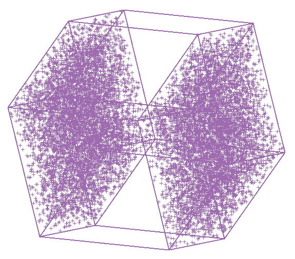
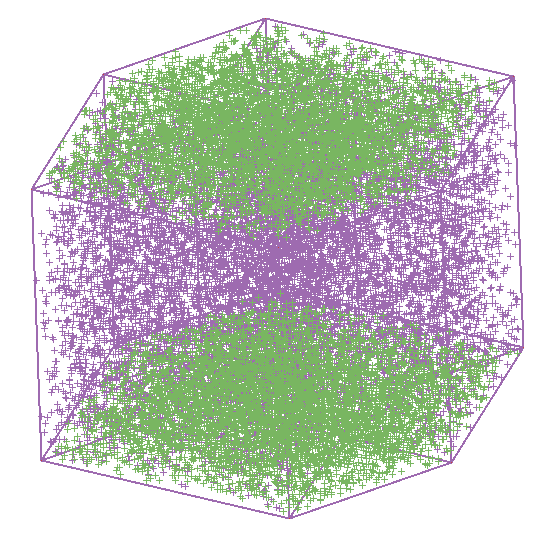

::: article
# Introduction

This paper describes how to build a library of high-dimensional
geometric shapes: cubes, spheres, simplexes, and tori. Data describing
numerous 4D polytopes and polyhedra generated by other researchers are
included in the library, a single location to describe the many
different object structures. The purpose is to enable people to train
their brains for understanding data structures residing in
high-dimensional Euclidean space. This work extends the work described
in [@Co97] which concentrated on samples from statistical distributions.

The [*geozoo*](https://CRAN.R-project.org/package=geozoo) package in R
contains the code to create the geometric shapes. Code fragments,
describing the key components of the algorithms for generating the
shapes, are included in this paper. The shapes in the library are best
viewed using the dynamic graphical method called a tour
[@AS85; @BCAH05; @ClBW07], such as that available in GGobi [@STLBC02]
and the [*tourr*](https://CRAN.R-project.org/package=tourr) R
package [@WCHB11].

The structure of the paper is that basic shapes are described first
followed by more complex shapes, in this order, cubes, spheres,
simplexes, polyhedra, polytopes, and tori.

# Cubes

Cubes are the first shape that a person should examine when starting to
learn about higher dimensions. Cubes are relatively simple to
understand: they have orthogonal, uniform length sides and are convex
shapes. A 0-D cube is a single point. A 1-D cube is a line segment. A
2-D cube is a square and a 3-D cube is a box.

The 4-D cube may be hard to imagine, partly because we are accustomed to
describing our physical world using only three dimensions. The leap to
4-D is more understandable after watching the movie "Flatland" [@Ma65]
or reading the novella of the same name [@Ab1884]. In "Flatland", the
world is 2-D and characters struggle with the concept of 3-D.

Working from this name, we might think of our world as "Boxland": we
live in 3-D and struggle with the concept of higher dimensions. Shadows
created by light sources help perceive the third dimension. In Flatland,
the inhabitants see only 1-D line segments. For a Flatlander who has
never seen the world we live in, the third dimension is hard to
understand. Similarly, for inhabitants of our world, it might seem
daunting to imagine the fourth dimension. But it's not that difficult!

Figure [1](#boxes) shows the evolution of the cube from 2-D to 5-D. Each
figure is a 2-D projection of a wireframe cube from two to five
dimensions. To increase the dimension of a cube, replicate and shift a
cube of one dimension lower along a new orthogonal axis, connecting the
corresponding vertices. The 3-D cube grows from
2$\times$`<!-- -->`{=html}2-D squares, connected with four new edges.
The 4-D cube is born from 2$\times$`<!-- -->`{=html}3-D cubes and a 5-D
cube emerges from 2$\times$`<!-- -->`{=html}4-D cubes. Any object with
more than 2 dimensions has infinitly many projections onto a 2-D plane.
The projections chosen in Figure [1](#boxes) (and the remaining figures
of the paper) were done to highlight the overall structure or features
that make each object distinct from each other.

<figure id="boxes">
<table>
<caption> </caption>
<tbody>
<tr class="odd">
<td style="text-align: center;"></td>
<td style="text-align: center;"></td>
<td style="text-align: center;"></td>
<td style="text-align: center;"></td>
</tr>
</tbody>
</table>
<figcaption>Figure 1: Wireframe cubes, (from left to right) 2-D, 3-D,
4-D, 5-D.</figcaption>
</figure>

Vertices of a high-dimensional cube can be considered as all
permutations of the binary digits (0 and 1) in $p$-D. A line is defined
by two points: $(0)$, $(1)$. A square is defined by four points:
$(0,0)$, $(0,1)$, $(1,0)$, $(1,1)$, which are all of the permutations of
$0$ and $1$ in two columns, that is, the Cartesian product of two lines.
A 3-D cube is the Cartesian product of two squares, and has all of the
permutations of 0 and 1 in three columns.

## Points on vertices

 []{#cube-vertices label="cube-vertices"}

The two different ways to define a high-dimensional cubes leads to two
different methods to create a $p$-D cube. Both methods yield the same
result, which is shown for $p=1,2,3$ in Table [1](#verticetable).

1-D:\

::: {#verticetable}
  --------------------
  row \#     1   edges
  -------- --- -------
  1          0       2

  2          1 
  --------------------

  : Table 1: 1-D, 2-D and 3-D cube vertices and edges.
:::

2-D:\

::: {#verticetable}
  ----------------------------
  row \#     1   2   edges 
  -------- --- --- ------- ---
  1          0   0       2   3

  2          1   0           4

  3          0   1       4 

  4          1   1         
  ----------------------------

  : 
:::

3-D:\

::: {#verticetable}
  ------------------------------------
  row \#     1   2   3   edges     
  -------- --- --- --- ------- --- ---
  1          0   0   0       2   3   5

  2          1   0   0           4   6

  3          0   1   0       4       7

  4          1   1   0               8

  5          0   0   1       6   7 

  6          1   0   1           8 

  7          0   1   1       8     

  8          1   1   1             
  ------------------------------------

  : 
:::

-   **Method 1:** Recursively double a lower-dimensional cube.

    Using the standard coordinate system, the base is 0 and 1. After
    establishing the base, we recursively double the base in the first
    column(s), and add an additional column containing a 0 in the first
    half of the rows and a 1 in the second half of the rows. The process
    is repeated $(p-1)$ times, to obtain a $p-$D cube.

    ``` r
    cube_iterate <- function(p) {
      if (p == 1) {
        return(rbind(0, 1))
      }
      lower_dim_cube <- cube_iterate(p - 1)
      rbind(
        cbind(lower_dim_cube, 0),
        cbind(lower_dim_cube, 1)
      )
    }
    ```

-   **Method 2:** Generate all permutations of ${0, 1}$ in $p$ columns.

    This method takes advantage of an existing function in R,
    `expand.grid`. It produces all permutations by generating the
    Cartesian product of a set of vectors. For our purposes, the number
    of columns is not fixed, so we use `do.call`, to convert a function
    call of the form `x(a, b, c)` to `do.call(x, list(a, b, c))`,
    allowing specification of an arbitrary number of arguments.

    ``` r
    cube_permute <- function(p) {
      as.matrix(
        do.call(
          expand.grid,
          rep(list(c(0, 1)), p)
        )
      )
    }
    ```

## Completing the wire frame

The wire frame for a cube draws the edges of the cube, connecting all
points that differ in one of the values, e.g. $(0,0,0)$ and $(1,0,0)$,
or $(0,0,0)$ and $(0,1,0)$ for a 3-D cube. Each edge is a vector of
length $1$ and is defined by specifying the row numbers of the two
corresponding elements of the vertex data, e.g. in a 3-D cube $(2,4)$
would connect rows $(1,0,0)$ and $(1,1,0)$. Table [1](#verticetable)
gives vertex and edge lists for $p = 1$, $2$, and $3$. Edges are not
ordered $(1,2)=(2,1)$, and we use just one of the two, with the smaller
number first. Presented below are three ways to generate an edge set,
the last being the most computationally efficient but less intuitive.

-   **Method 1:** Distance of 1.

    The distances between all $p * (p - 1) / 2$ pairs of vertices are
    computed, and the pairs of vertices which have distance $1$ are
    returned. This is the simplest approach to generate the edge set but
    obviously slow to compute as $p$ increases.

    ``` r
    cube_edges_length1 <- function(cube) {
      p <- ncol(cube)
      num_points <- 2 ^ p
      from_to <- matrix(NA, nrow = num_points * p / 2, ncol = 2)
      next_store_position <- 1
      for (i in 1:(num_points - 1)) {
        for (j in (i + 1):num_points) {
          d1 <- sum((cube[i, ] - cube[j, ]) ^ 2)
          if (d1 == 1) {
            from_to[next_store_position, ] <- c(i,j)
            next_store_position <- next_store_position + 1
          }
        }
      }
      from_to
    }
    ```

-   **Method 2:** The binomial approach.

    This is faster to compute than the first method because it involves
    only a single loop over the cube vertices. For this approach to
    work, the vertices of the cube need to have been created using the
    methods described in Section [[cube-vertices]](#cube-vertices). Each
    vertex, that has $c$ elements equal to 0, will be connected to $c$
    other vertices, and we need to determine the row numbers for these
    other vertices. (The row number for a corresponding connected vertex
    is obtained by adding 2$^{(j-1)}, j=1,...,p$, if column $j$ contains
    a 0, to the row number, $i, i=1,...,(\#vertices-1)$ of the
    originating vertex.) For example, for a 3-D cube, the first vertex
    $(0,0,0)$ will be connected to vertices $2^0+1=2, 2^1+1=3$ and
    $2^2+1=5$.

    ``` r
    cube_edges_binomial <- function(cube) {
      p <- ncol(cube)
      num_points <- 2 ^ p
      from_to <- matrix(NA, nrow = num_points * p / 2, ncol = 2)
      next_store_position <- 1
      for (i in 1:(num_points - 1)) {
        for (j in 1:p) {
          if (cube[i, j] == 0) {
            from_to[next_store_position, ] <- c(i, 2 ^ (j - 1) + i)
            next_store_position <- next_store_position + 1
          }
        }
      }
      from_to
    }
    ```

-   **Method 3:** Binary relationships.

    The final method is the most computationally efficient but the least
    intuitive. Here we will use the fact that the vertices of the cube
    can be represented as binary numbers, e.g. $(0, 1, 1) =
        011_2 = 3_{10}$. This allows us to both vectorize the code and
    use the C bitwise operations provided by the
    [*bitops*](https://CRAN.R-project.org/package=bitops) package.

    The key insight to note is that edges connect vertices which have a
    single bit flipped. For example, $011$ connects to $111$, $001$ and
    $010$ (vertex 3 connects to 7, 1, and 2). We can flip a single bit
    with the *exclusive or* function, $011 \oplus 100 = 111$, $011
        \oplus 010 = 001$, $011 \oplus 001 = 010$. This leads to a fast
    and efficient method for generating the edges.

    ``` r
    library(bitops)
    cube_edges_binary <- function(p) {
      vertices <- 0:(2 ^ p - 1)
      from_verts <- vertices[
        rep(1:(2 ^ p), each = p)
      ]
      from_to <- data.frame(
        from = from_verts,
        to = bitXor(from_verts, 2 ^ (0:(p - 1)))
      )
      from_to <- subset(from_to, from < to) + 1
      from_to
    }
    ```

## Solid cube

A solid cube has points in the interior (Figure [2](#solcube)). It is
easy to generate, using either random sampling or a fixed grid.

<figure id="solcube">
<table>
<caption> </caption>
<tbody>
<tr class="odd">
<td style="text-align: center;"></td>
<td style="text-align: center;"></td>
<td style="text-align: center;"></td>
</tr>
<tr class="even">
<td style="text-align: center;"></td>
<td style="text-align: center;"></td>
<td style="text-align: center;"></td>
</tr>
</tbody>
</table>
<figcaption>Figure 2: Solid cubes in 2-D, 3-D, and 4-D made of (top)
independent random samples from <span
class="math inline"><em>p</em></span> uniform distributions and (bottom)
fixed grid points. As the dimensions increase, the vertices look sparse,
more so with the random samples. </figcaption>
</figure>

-   **Method 1:** Random uniform.

    The R function `runif` generates samples from a uniform distribution
    between 0 and 1. Generating $p$ random uniform values creates a
    $p$-dimensional vector corresponding to a point inside a
    $p$-dimensional cube. The number of points needed to make the cube
    appear solid increases exponentially as $p$ increases. For example,
    a 3-D cube with $k$ points on each side has $k^3$ total points, and
    a 4-D cube with the same $k$ points per side $k^4$ total points.
    Thus, every time the dimension is increased, the number of points
    must be increased substantially for the shape to look similarly
    solid. In our `cube_solid_random` function, we use a base of 850
    points, and the total number of points is capped at 50000 points for
    speed of viewing.

    ``` r
    cube_solid_random <- function(p, n = 850 * 2 ^ p) {
      matrix(runif(n * p), ncol = p)
    }
    ```

-   **Method 2:** Equidistant.

    A solid cube can be generated using equidistant points. As with the
    second vertex generation method, the `expand.grid` function is used.
    The input $n$ allows the number of grid points to be varied.

    ``` r
    cube_solid_grid <- function(p, n) {
      grid <- list(seq(0, 1, length = n))
      do.call(expand.grid, rep(grid, p))
    }
    ```

There are advantages and disadvantages to the methods provided. The
first method, random uniform points, produces a solid cube that looks
more solid, but as $p$ increases, points near the vertices become more
scarce. The second method, equidistant points, fills the vertex regions,
but the structure produces regular patterns which can be distracting to
the viewer.

## Hollow cube

The "face" of a cube is a surface that is one dimension lower than that
of the cube. For example, a face of a 3-D cube is a 2-D square and a
face of a 4-D cube is a 3-D cube.

To generate points on the faces of a cube, points are created in all
dimensions except one. The remaining dimension is given the value $0$ or
$1$, to create the opposing faces. Because the face of a cube is a
$(p-1)$-dimensional cube with a $0$ or $1$ in the remaining column, we
may perform two different methods to produce the $p$-dimensional cube's
faces.

-   **Method 1:** Equidistant faces.

    Equidistant faces may leverage the fact that each "face" contains
    the same data. Therefore, we may calculate a single
    $(p-1)$-dimensional equidistant cube and place it in the return
    matrix multiple times with the $i$th column missing from the return
    matrix. The number of rows of the return matrix is equivalent to
    $2 * p * nrow(face)$ with the first half of the return matrix being
    $0$'s and the last half being $1$'s. The input $n$ is supplied
    directly to the $cube\_solid\_grid$ function.

    ``` r
    cube_face_grid <- function(p, n = 10) {
      face <- cube_solid_grid(p - 1, n)
      face_n <- nrow(face)
      faces <- do.call(data.frame, rep(list(X = rep(0:1, each = p * face_n)), p))
      for(i in seq_len(p)) {
        faces[(face_n * (i - 1) + 1):(face_n * i), -i] <- face
        faces[(face_n * (i - 1) + 1):(face_n * i) + (p * face_n), -i] <- face
      }
      return(as.matrix(faces))
    }
    ```

-   **Method 2:** Random uniform faces.

    Naively creating a 3-D cube, the $X_1$ and $X_2$ components of the
    cube are given random values and the $X_3$ components would be set
    to $0$ in the first half and $1$ in the second half. The process
    would then be repeated for the remaining columns, as shown in Figure
    [3](#faces). This will create six 2-D squares which form the faces
    of a 3-D cube. The bottom row shows the different faces of a 4-D
    cube. The left side plot shows the first pair of faces, a solid 3-D
    cube in $X_1, X_2, X_3$, with fixed values on the fourth dimension
    $X_4$. The subsequent plots show the remaining faces.

    <figure id="faces">
    <table>
    <caption> </caption>
    <tbody>
    <tr class="odd">
    <td style="text-align: center;"></td>
    <td style="text-align: center;"></td>
    <td style="text-align: center;"></td>
    </tr>
    </tbody>
    </table>
    <table>
    <caption> </caption>
    <tbody>
    <tr class="odd">
    <td style="text-align: center;"></td>
    <td style="text-align: center;"></td>
    <td style="text-align: center;"></td>
    <td style="text-align: center;"></td>
    </tr>
    </tbody>
    </table>
    <figcaption>Figure 3: Faces of a 3-D cube (top row) and a 4-D cube
    (bottom row), obtained by fixing one column of values to be 0 or 1, and
    allowing the other columns to vary freely between 0 and 1.</figcaption>
    </figure>

    Unlike the equidistant faces of a cube, each random uniform face
    must be different from every other face. To avoid repetitive
    calculations, we leverage the fact that a $p$-dimensional random
    uniform cube with one column missing is equivalent a
    $(p-1)$-dimensional random uniform cube. Therefore, we generate a
    $p$-dimensional cube and insert $0$'s or $1$'s for each of the
    corresponding faces in each dimension. The input $n$ matches the
    number of random points for a $(p-1)$-dimensional cube.

    ``` r
    cube_face_random <- function(p, n = 850 * 2 ^ (p - 1)) {
      faces <- cube_solid_random(p, 2 * p * n)
      for (i in seq_len(p)) {
        faces[(n * (i - 1) + 1):(n * i), i] <- 0
        faces[(n * (i - 1) + 1):(n * i) + (p * face_n), i] <- 1
      }
      faces
    }
    ```

<figure>
<table>
<caption> </caption>
<thead>
<tr class="header">
<th style="text-align: center;"></th>
<th style="text-align: center;"></th>
<th style="text-align: center;"></th>
<th style="text-align: center;"></th>
</tr>
</thead>
<tbody>
</tbody>
</table>
<figcaption>Figure 4: Vertices of cubes, (left to right) 3-D, 5-D, 10-D,
and 15-D. Cubes look more rounded in projections as the dimension
increases.</figcaption>
</figure>

## High-D cubes look spherical!

As the dimension increases, the shape of the cube appears more rounded
than square in a 2-D projection. Explaination is given in @DF84 and is
related to the Central Limit Theorem. When we use a tour to visualize
high-dimensional data we examine low-dimensional projections. Consider
the axes for a $p$-dimensional space labeled as $X_1, ..., X_p$. A 1-D
projection is generated by taking a linear combination of these axes,
such as $a_1X_a+...+a_pX_p$. The squared values of $a_j, j=1, ..., p$
are constrained to sum to 1. As $p$ increases, combining the values
operates like averaging the values in many dimensions, resulting in
views that look Gaussian. Another way to think about it is that we are
looking at rotated cubes rather than a cube through its square face and
this gets increasingly rounded as the dimension increases.

# Spheres

A sphere can be described as all points within a fixed radius (for
simplicity use 1) around a fixed point (for simplicity use
$\mathbf{zero}_p$), $\{X: X_1^2+\dots + X_p^2 \leq 1\}$. A hollow sphere
is the set of points with radius equal to 1,
$\{X: X_1^2+\dots + X_p^2 = 1\}$. Generating the hollow sphere is
simpler than the solid sphere.

## Hollow sphere

To generate points uniformly distributed on the surface of a sphere we
use the following trick: first, we generate a random vector from a
multivariate standard normal distribution and then normalize its length.
The normalized point is now a random point on a unit sphere [@StatSphere
2.6]. The top row of Figure [4](#holsolidsphere) shows the results.

``` r
norm_vec <- function(x) {
  x / sqrt(sum(x ^ 2))
}

sphere_hollow <- function(p, n = p * 500) {
  x <- matrix(rnorm(n * p), ncol = p)
  t(apply(x, 1, norm_vec))
}
```

<figure id="holsolidsphere">
<table>
<caption> </caption>
<tbody>
<tr class="odd">
<td style="text-align: center;"></td>
<td style="text-align: center;"></td>
<td style="text-align: center;"></td>
</tr>
<tr class="even">
<td style="text-align: center;"></td>
<td style="text-align: center;"></td>
<td style="text-align: center;"></td>
</tr>
</tbody>
</table>
<figcaption>Figure 5: Hollow (top row) and solid spheres (bottom row)
for 2-D, 3-D, 4-D.</figcaption>
</figure>

## Don't reject the solid sphere!

Solid spheres can be generated in much the same way as solid cubes; use
random points to fill the object. While the solid cube fills the box,
the sphere's points are inside a radius of 1 from the center. A simple
approach would be to use a rejection method: generate points in the
solid cube and discard those with radius more than 1. This is
problematic as $p$ increases, since most points will eventually be
rejected. For example, to generate the points of a 3-D sphere, around
50% of the proposed points are accepted, but for a 10-D sphere only
0.25% of the proposed points are accepted. The space in the corners of
the enveloping cube, outside the sphere, increases dramatically with
$p$.

The approach we used is a minor modification to the method used to
generate a hollow sphere. Figure [5](#cfb) illustrates the process. The
vector length is randomly sampled from a uniform distribution on $(0,1)$
(left plot). The result is raised to the power $1/p$ to adjust for the
volume increase with $p$, resulting in points spread evenly throughout
the inside of the sphere (middle plot). Taking the sphere to the $1/p$
power may seem ad hoc, but the operation ensures that the density is
uniform within the sphere. To see this, compare circles of radius 1 and
2 (right plot). The area of the smaller circle equals $\pi =  1^2\pi$.
The area of the whole circle equals $4 \pi = 2^2 \pi$, which is four
times as large but only twice the radius. Thus, without accounting for
radial distance, more points will be generated closer to the center than
is warranted by the area. Raising the vector length to the power $1/p$,
1/2 in our example, corrects for the volume.

``` r
sphere_solid_random <- function(p, n = p * 500) {
  sphere_hollow(p, n) * runif(n) ^ (1 / p)
}
```

<figure id="cfb">
<table>
<caption> </caption>
<tbody>
<tr class="odd">
<td style="text-align: center;"></td>
<td style="text-align: center;"></td>
<td style="text-align: center;"></td>
</tr>
</tbody>
</table>
<figcaption>Figure 6: Solid sphere in 2-D: (left) generated randomly
results in an over-concentration of points in the center, (middle)
adjusted for volume generates a uniform distribution inside the sphere,
and (right) comparison of areas of circles of radius 1 and
2.</figcaption>
</figure>

# Simplexes

Simplexes are one of the simplest objects to create and view. A $p$-D
simplex is a shape that is created in the $(p+1)$th dimension with
vertices corresponding to the coordinate axes. The simplex vertices are
then projected, using a Helmert matrix, into the $p$-dimensional space
in which it exists.

<figure>
<table>
<caption> </caption>
<tbody>
<tr class="odd">
<td style="text-align: center;"></td>
<td style="text-align: center;"></td>
<td style="text-align: center;"></td>
<td style="text-align: center;"></td>
</tr>
</tbody>
</table>
<figcaption>Figure 7: Wireframe simplexes: 2-D, 3-D, 4-D,
5-D.</figcaption>
</figure>

For example, a 2-D simplex has unprojected 3-D vertices at (1,0,0),
(0,1,0), (0,0,1), which are reduced by the Helmert transformation to
points in a 2-D equilateral triangle, (0.7071,0.4082), (-0.7071,0.4082),
(0.0000, -0.8165).

``` r
helmert <- function(d) {
  helmert_mat <- matrix(NA, nrow = d, ncol = d)
  helmert_mat[1, ] <- rep(1 / sqrt(d), d)
  for (i in 1:(d - 1)) {
    helmert_mat[i + 1, ] <- c(
      rep(1 / sqrt(i * (i + 1)), i),
      -i / sqrt(i * (i + 1)),
      rep(0, d - i - 1)
    )
  }
  helmert_mat
}

simplex <- function(p) {
  x <- diag(p)
  # center simplex
  x <- x - matrix(1 / p, p, p)
  hm <- helmert(p)
  final <- (x %*% t(hm))[, -1]
  final
}
```

The wire frame for a simplex connects every point to every other point,
and can be computed in just two lines of code, following method 2 of the
cube vertices. `simplex_wires` makes a list of all pairs of verticies
and then removes the edges that connect a vertex to itself.

``` r
simplex_wires <- function(simplex) {
  wires <- do.call(
    expand.grid,
    list(
      c(1:nrow(simplex)),
      c(1:nrow(simplex))
    )
  )
  wires[!wires[,1] == wires[,2],]
}
```

# Polyhedra

A polyhedron is a three dimensional object that contains straight edges
and has flat faces. Our polyhedra data comes from George W. Hart's
website [@GeorgeVP]. Hart's website contains an extensive collection of
polyhedra, ranging from Platonic Solids to Stellations of the Rhombic
Triacontahedron. In our data sets, we used the information from Platonic
Solids, Kepler-Poinsot Polyhedra, Archimedean Polyhedra and its duals,
Prisms. The data was reformatted from VRML into XML. The vertices and
wire frames from separate files were compiled into tables. Some
reformatting of edges was also necessary.

# Surfaces and curves

Paul Bourke's website [@PBCurves] has equations for generating several
famous objects, including the Mobius Strip, Steiner's Roman Surface and
the Klein Bottle (Figure [6](#klein)). It is interesting to see how each
object twists onto itself. R functions based on these equations were
written to produce each object. For each shape, a set of random angles
were generated to seed the equations, producing points on the surface.
For some of the objects, to be displayed in its familiar form, the plot
limits for each variable need to use the same global minimum and maximum
values.

<figure id="klein">
<table>
<caption> </caption>
<tbody>
<tr class="odd">
<td style="text-align: center;"></td>
<td style="text-align: center;"></td>
<td style="text-align: center;"></td>
</tr>
</tbody>
</table>
<figcaption>Figure 8: Mobius strip, Steiner’s roman surface, and Boy’s
surface.</figcaption>
</figure>

# Polytopes

A *polytope* is a generalized term of a geometric shape in any
dimension. A polygon is a 2-D polytope. A polyhedron is a 3-D polytope.
A polychoron is a 4-D polytope. Beyond that, we typically use polytope
to refer to any $p$-gon. Our polychoron data comes from Paul Bourke's
website [@PBPlatonic], where there is also information on some of the
objects that have been covered (cube, simplex) in the preceding sections
of this paper, and new objects, 24-cell, 120-cell, 600-cell (Figure
[7](#polytope)). The explanations of these polytopes is very clear. The
data has been formatted into XML files allowing descriptions of the
vertices and edges for each shape.

<figure id="polytope">
<table>
<caption> </caption>
<tbody>
<tr class="odd">
<td style="text-align: center;"></td>
<td style="text-align: center;"></td>
<td style="text-align: center;"></td>
</tr>
</tbody>
</table>
<figcaption>Figure 9: 24-Cell, 120-Cell, and 600-Cell.</figcaption>
</figure>

# Tori

A "doughnut" torus is known as a ring torus. Paul Bourke's website
[@Pa90] on "The Torus and Super Torus" provides the inspiration. The
website explains how the 3-D torus is made. It also contains information
that we used to develop the process of building high-dimensional tori.
Figure [8](#ringtorus) shows this process: a smaller circle that follows
a larger circle, creating a doughnut. The points for the torus are
formed by polar coordinates.

<figure id="ringtorus">
<table>
<caption> </caption>
<tbody>
<tr class="odd">
<td style="text-align: center;"></td>
<td style="text-align: center;"></td>
<td style="text-align: center;"></td>
</tr>
<tr class="even">
<td style="text-align: center;"></td>
<td style="text-align: center;"></td>
<td style="text-align: center;"></td>
</tr>
</tbody>
</table>
<figcaption>Figure 10: Generating a torus: 2-D to 3-D (top row), and 3-D
to 4-D (bottom row).</figcaption>
</figure>

To produce a 4-D torus, a 3-D torus is rotated around a circle into the
fourth dimension (Figure [8](#ringtorus) bottom row). This torus still
has a hole in the center. The process can be thought of as a recursive
circle system. For a 3-D torus, the smaller radius circle follows the
larger radius circle. For a 4-D torus, a 3-D torus follows an even
larger radius circle. That is, the lower-dimensional torus is shifted by
a fixed distance and rotated about a *new* axis perpendicular to the
axis of the hole. This algorithm for a ring torus has not been
previously defined and will be explained in detail in the following
section.

<figure>
<table>
<caption> </caption>
<tbody>
<tr class="odd">
<td style="text-align: center;"></td>
<td style="text-align: center;"></td>
<td style="text-align: center;"></td>
</tr>
</tbody>
</table>
<figcaption>Figure 11: 2-D, 3-D, and 4-D tori with features
highlighted.</figcaption>
</figure>

## Ring torus

A ring torus has a hole in the center of the object and is generated
recursively. A 2-D circle forms the base of the torus, which is defined
by:

$$\begin{aligned}
&&X_1: cos(\theta_1) * r_1\\
&&X_2: sin(\theta_1) * r_1
\end{aligned}$$

using one radius and one angle. The 3-D torus is defined by:

$$\begin{aligned}
&&X_1: cos(\theta_1) * (r_1 + cos(\theta_2) * r_2)\\
&&X_2: sin(\theta_1) * (r_1 + cos(\theta_2) * r_2)\\
&&X_3: sin(\theta_2) * r_2\\
&&r_1 > r_2
\end{aligned}$$

Notice that 3-D torus builds from the 2-D: $r_1$ is replaced by
($r_1 + cos(\theta_2)r_2$). The 3-D torus has four parameters: two
angles and two radii. The third dimension is formed entirely by the
additional angle and radius. A 4-D torus will be generated with the same
pattern as the 3-D torus: a new dimension will be added and material
will be inserted recursively into the formulas:

$$\begin{aligned}
&&X_1: cos(\theta_1) * (r_1 + cos(\theta_2) * (r_2 + cos(\theta_3) * r_3))\\
&&X_2: sin(\theta_1) * (r_1 + cos(\theta_2) * (r_2 + cos(\theta_3) * r_3))\\
&&X_3: sin(\theta_2) * (r_2 + cos(\theta_3) * r_3)\\
&&X_4: sin(\theta_3) * r_3\\
&&r_1 > r_2 > r_3
\end{aligned}$$

The steps to building a higher-dimensional torus are:

1.  add a new dimension that equals $sin(\theta_i) * r_i$.

2.  in all other dimensions, replace $r_{i - 1}$ with
    $r_{i - 1} + cos(\theta_i) * r_i$.

3.  repeat.

However, these steps are not easy to recurse. Replacing values in a
formula after it has been realized is not simple. By rearranging the
formulas, a better method to recurse is achieved:

$$\begin{aligned}
&&X_1: ((cos(\theta_3) * r_3 + r_2) * (cos(\theta_2) + r_1) * cos(\theta_1)\\
&&X_2: ((cos(\theta_3) * r_3 + r_2) * (cos(\theta_2) + r_1) * sin(\theta_1)\\
&&X_3:  (cos(\theta_3) * r_3 + r_2) * sin(\theta_2)\\
&&X_4:   sin(\theta_3) * r_3\\
&&r_1 > r_2 > r_3
\end{aligned}$$

The first step of the recursion, starting from the last dimension, is
given as follows:

$$\begin{aligned}
&&X_1: cos(\theta_3) * r_3\\
&&X_2: cos(\theta_3) * r_3\\
&&X_3: cos(\theta_3) * r_3\\
&&X_4: sin(\theta_3) * r_3
\end{aligned}$$

which translates to this R code:

``` r
torus<-c(
  rep(cos(theta[p - 1]) * radius[p - 1], p - 1),
  sin(theta[p - 1]) * radius[p - 1]
)
```

From this start, we recurse backwards from $p-1$ to 2. A new radius is
added at each iteration which is multiplied with the previous equation
by the cosine of an angle. The final step adds a last radius and
multiplies the result by the sine of the new angle.

``` r
for (i in (p - 1):2) {
  for (j in (i - 1):1) {
    torus[j] <- (torus[j] + radius[i - 1]) * cos(theta[i - 1])
  }
  torus[i] <- (torus[i] + radius[i - 1]) * sin(theta[i - 1])
}
```

The construction of a 4-D torus is shown below:

$$\begin{aligned}
&&p=4\\
&&Base\\
&&X_1: cos(\theta_3) * r_3\\
&&X_2: cos(\theta_3) * r_3\\
&&X_3: cos(\theta_3) * r_3\\
&&X_4: sin(\theta_3) * r_3\\
\\
&&i=p-1=3\\
&&j=2:1\\
&&X_1: (cos(\theta_3) * r_3 + r_2) * cos(\theta_2)\\
&&X_2: (cos(\theta_3) * r_3 + r_2) * cos(\theta_2)\\
&&X_3: (cos(\theta_3) * r_3 + r_2) * sin(\theta_2)\\
&&X_4: sin(\theta_3) * r_3\\
\\
&&i=2\\
&&j=1:1\\
&&X_1: ((cos(\theta_3) * r_3 + r_2) * cos(\theta_2) + r1) * cos(\theta_1)\\
&&X_2: ((cos(\theta_3) * r_3 + r_2) * cos(\theta_2) + r1) * sin(\theta_1)\\
&&X_3: (cos(\theta_3) * r_3 + r_2) * sin(\theta_2)\\
&&X_4: sin(\theta_3) * r_3\\
\end{aligned}$$

This code results in one row of data for one point on the 4-D torus for
each value of angle. By varying the angle and binding the result, we get
points over the surface of the torus:

::: samepage
``` r
finished <- rbind(finished, torus.row)
```

or

``` r
matrix(
  do.call(rbind, as.list(
    replicate(
      n,
      torus.row(radius, p)
    )
  )),
  ncol = p, byrow = TRUE
)
```
:::

The angles create the rings, and thus need to vary fully between 0 and
$2\pi$:

``` r
theta <- runif(p - 1, min = 0, max = 2 * pi)
```

The radii for the process are fixed at the start. To produce a hole in
each dimension the radii need to decrease with $p$. We set the hole to
have a size of 1 in each dimension, and the radii are reduced by a power
of 2 from the previous dimension.

``` r
radius <- 2 ^ ((p - 2):0)
```

This produces points fairly evenly but not uniformly spread on the
surface of the torus. A different way to generate the torus is to
produce the angles at set intervals, resulting in more circular
patterns.

## Flat torus

Another common hyper-torus is the flat torus. A flat torus is commonly
seen expanding into infinity as a screen saver on some computers. The
flat torus has multiple holes in it's center and is easy to generate.

A flat torus is formed in pairs of dimensions, defined by a sine and
cosine of one angle, for example the circle is generated in 2-D by
$cos(\theta_1)$ and $sin(\theta_1)$. A flat torus in any dimension is
created from multiple pairs of sine and cosine, e.g. a 1-D torus is
generated by one pair, a 2-D torus by two pairs, four variables, and a
3-D torus by three pairs, six variables (Figure [9](#flat1)). All values
of sine and cosine are generated from angles, $(-2\pi, 2\pi)$,
separately for each pair. The flat torus has an even number of
dimensions, but an effective dimension half that size. Figure
[10](#flat2) illustrates the construction of a 6-D flat torus.

<figure id="flat1">
<table>
<caption> </caption>
<tbody>
<tr class="odd">
<td style="text-align: center;"></td>
<td style="text-align: center;"></td>
<td style="text-align: center;"></td>
</tr>
</tbody>
</table>
<figcaption>Figure 12: Flat tori in 2-D, 4-D, and 6-D.</figcaption>
</figure>

<figure id="flat2">
<table>
<caption> </caption>
<tbody>
<tr class="odd">
<td style="text-align: center;"></td>
<td style="text-align: center;"></td>
<td style="text-align: center;"></td>
<td style="text-align: center;"></td>
</tr>
</tbody>
</table>

<figcaption>Figure 13: Views of the 6-D flat torus which illustrate its
construction. The torus (top right) has its components highlighted with
green, orange and blue, and the same torus is displayed as a scatterplot
matrix, better revealing the construction. </figcaption>
</figure>

## Solid tori

These tori are all hollow. To create points in the interior of the tori
one would randomly generate the radii length for each point.

# Conclusion

This paper has described how
[*geozoo*](https://CRAN.R-project.org/package=geozoo) generates several
types of high-dimensional geometric shapes. The result is a library
designed to help conceptualize objects in high-dimensional spaces. It
has also led to some new geometric shape definitions.

This library, although seemingly removed from real high-dimensional data
has some strong connections. Much of our data analytic methods are based
in high-dimensional Euclidean space. Developing some visual insight into
this space can help to understand the methods that operate in higher
dimensions. Some data problems can be closely mapped to the geometric
shapes. For example, ranked data showing preferences for a fixed set of
objects, can be mapped to high-dimensional polytopes [@Th93]. Values in
a sample are commonly constrained to sum to a fixed number, for example,
100%, forming compositional data. This type of data lies inside a $p$-D
simplex. Good experimental designs commonly have a geometric structure
[@HSS99]. The ideas to examine boundaries of supervised classifiers
described in @CCWH08 build on the geometric shapes described here.

We encourage the reader to look at the movies, and images, and download
the data on the project web site, which can be accessed at
<http://schloerke.github.io/geozoo/>. The
[*geozoo*](https://CRAN.R-project.org/package=geozoo) package contains
the R code to generate the geometric shapes and is available to download
from CRAN (<http://www.R-project.org>). We especially encourage readers
to experiment with creating new high-dimensional geometric shapes, or to
contribute ideas and code back to this project.

# Acknowledgments

This work was supported by National Science Foundation grant DMS0706949.
Andreas Buja provided some helpful feedback on the work. Dianne Cook
thanks the Isaac Newton Institute, Cambridge, UK for support, where she
was visiting while drafting this paper.

\

\

\

\
:::
