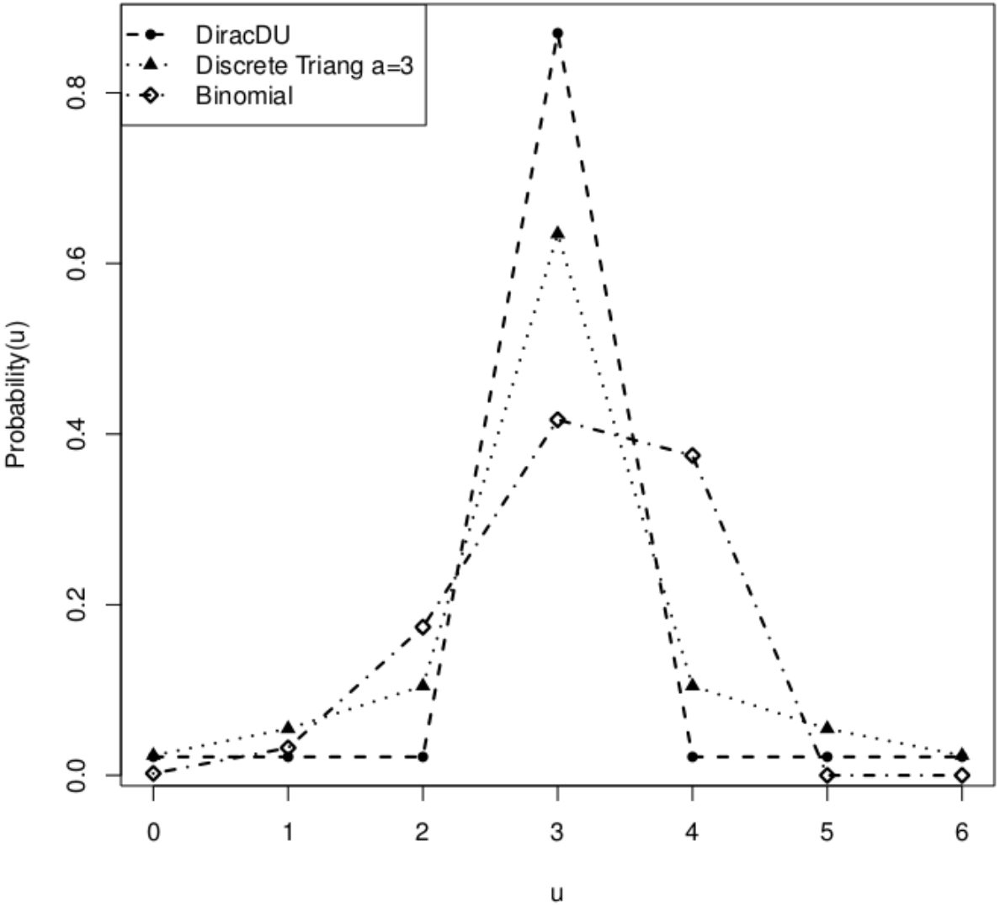
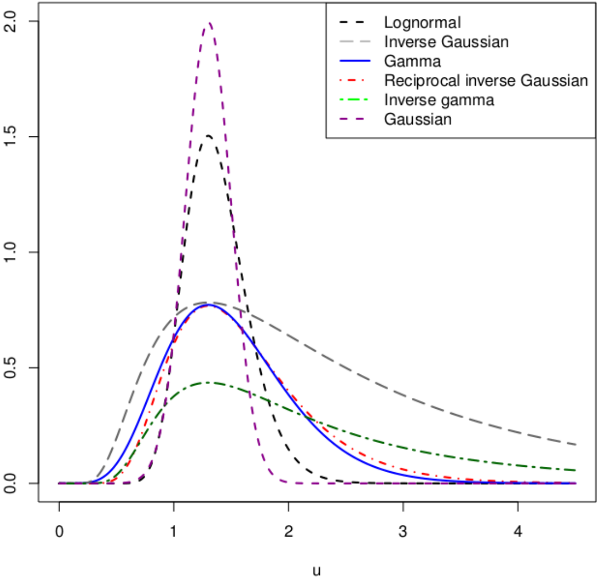

::: article
# Introduction

Kernel smoothing methods are popular tools for revealing the structure
of data that could be missed by parametric methods. For real datasets,
we often encounter continuous (bounded, positive) or discrete (count,
categorical) data types. The classical kernels methods assume that the
underlying distribution is unbounded continuous, which is frequently not
the case; see, for example, [@Duong2007] for multivariate kernel density
estimation and discriminant analysis. A solution is provided for
categorical data sets by [@HayfieldRacine]. In fact, they used kernels
well adapted for these categorical sets [@AJG76]. Throughout the present
paper, the unidimensional support $\mathbb{T}$ of the variable of
interest can be $\{0,1,\ldots,N\}$, $[a,b]$ or $[0,\infty)$ for a given
integer $N$ and reals $a<b$.

The recently developed [*Ake*](https://CRAN.R-project.org/package=Ake)
package, implements associated kernels that seamlessly deal with
continuous (bounded, positive) and discrete (categorical, count) data
types often found in applied settings; see, for example, [@L13] and
[@KSK11]. These associated kernels are used to smooth probability
density functions (p.d.f.), probability mass functions (p.m.f.) or
regression functions. The coming versions of this package will contain,
among others, p.d.f. estimation of heavy tailed data [e.g., @Ziane2015]
and the estimation of other functionals. The bandwidth selection remains
crucial in associated kernel estimations of p.d.f., p.m.f. or regression
functions. Some methods have been investigated for selecting bandwidth
parameters but the commonly used is the least squared cross-validation.
A Bayesian approach has been also recently introduced by [@ZAK12] in the
case of a binomial kernel. This method can be extended to various
associated kernels with other functionals. Despite the great number of
packages implemented for nonparametric estimation in continuous cases
with unbounded kernels, to the best of our knowledge, the R packages to
estimate p.m.f. with categorical or count variables, p.d.f. with bounded
or positive datasets, and regression functions have been far less
investigated.

The rest of the paper is organized as follows. In Section [2](#ncassk),
we briefly describe the definition of associated kernels and then
illustrate examples in both continuous and discrete cases which are
discussed. Then, the associated kernel estimator for p.d.f. or p.m.f. is
presented and illustrated with some R codes in
Section [3](#densityestimation). In particular, three bandwidth
selection methods are available: cross-validation for any (continuous or
discrete) associated kernel, the Bayesian local method for the binomial
kernel and also a new theoretical Bayesian adaptive method for the gamma
kernel. Also, some practical and theoretical aspects of the normalizing
constant in both p.d.f. and p.m.f. estimations are given.
Section [4](#regressionestimation) investigates the case of regression
functions with two bandwidth selection techniques: cross-validation and
also the Bayesian global method for the binomial kernel.
Section [5](#Summary) concludes.

# Non-classical associated kernels {#ncassk}

Recall that the support $\mathbb T$ of the p.m.f., p.d.f. or regression
function, to be estimated, is any set $\{0,1, \ldots,N\}$, $[a,b]$ or
$[0,\infty)$ for a given integer $N$ and reals $a<b$. The associated
kernel in both continuous and discrete cases is defined as follows.

#### Definition 2.2.1 {#Def}

[@KSK11],[@L13] Let $\mathbb{T}\left(\subseteq \mathbb{R}\right)$ be the
support of the p.m.f., p.d.f. or regression function, to be estimated,
$x \in \mathbb{T}$ a target and $h$ a bandwidth. A parametrized
p.m.f. (respectively p.d.f.) $K_{x, h}(\cdot)$ of support
$\mathbb{S}_{x, h} \left(\subseteq \mathbb{R}\right)$ is called
"associated kernel" if the following conditions are satisfied:

$$\begin{aligned}
	&x \in \mathbb{S}_{x, h},  \label{NoyAss1}  
\end{aligned}   (\#eq:NoyAss1)$$

$$\begin{aligned}
	 &\mathbb{E}\left(\mathcal{Z}_{x, h}\right) = x +  a(x, h), \label{NoyAss2}  
\end{aligned}   (\#eq:NoyAss2)$$

$$\begin{aligned}
	 & \mathbb{V}\left(\mathcal{Z}_{x, h}\right) =   b(x, h), \label{NoyAss3}  
\end{aligned}   (\#eq:NoyAss3)$$

where $\mathcal{Z}_{x, h}$ denotes the random variable with
p.m.f. (respectively p.d.f.) $K_{x, h}$ and both $a(x, h)$ and $b(x, h)$
tend to $0$ as $h$ goes to $0$.

#### Remark 2.2.2 {#Remark1}

This definition has the following interesting interpretations:

1.  The function $K_{x, h}(\cdot)$ is not necessary symmetric and is
    intrinsically linked to $x$ and $h$.

2.  The support $\mathbb{S}_{x,h}$ is not necessary symmetric around
    $x$; it can depend or not on $x$ and $h$.

3.  The condition (\@ref(eq:NoyAss1)) can be viewed as
    $\cup_{x\in\mathbb{T}}\mathbb{S}_{x,h}\supseteq\mathbb{T}$ and it
    implies that the associated kernel takes into account the support
    $\mathbb{T}$ of the density $f$, to be estimated.

4.  If $\cup_{x\in\mathbb{T}}\mathbb{S}_{x,h}$ does not contain
    $\mathbb{T}$ then this is the well-known problem of boundary bias.

5.  Both conditions (\@ref(eq:NoyAss2)) and (\@ref(eq:NoyAss3)) indicate
    that the associated kernel is more and more concentrated around $x$
    as $h$ goes to $0$. This highlights the peculiarity of the
    associated kernel which can change its shape according to the target
    position.

In order to construct an associated kernel $K_{x,h}(\cdot)$ from a
parametric (discrete or continuous) probability distribution
$K_{\theta}$, $\theta \in \Theta \subset \mathbb{R}^{d}$ on the support
$\mathbb{S}_{\theta}$ such that
$\mathbb{S}_{\theta}\cap \mathbb{T} \neq \emptyset$, we need to
establish a correspondence between
$(x, h) \in \mathbb{T} \times (0,\infty)$ and $\theta \in \Theta$; see
[@KSK11]. In what follows, we will call $K\equiv K_{\theta}$ the *type
of kernel* to make a difference from the classical notion of a
continuous symmetric (e.g., Gaussian) kernel. In this context, the
choice of the associated kernel becomes important as well as that of the
bandwidth. Moreover, we distinguish the associated kernels said
sometimes of "second order" of those said of "first order" which verify
the two first conditions \@ref(eq:NoyAss1) and \@ref(eq:NoyAss2). The
rest of this section is devoted to discuss examples of associated
kernels in both discrete and continuous cases.

## Discrete associated kernels

Among the discrete associated kernels found in literature, we here use
the best in sense of Definition [2.2.1](#Def). Negative binomial and
Poisson kernels are respectively overdispersed (i.e.,
$\mathbb{V}(\mathcal Z_{x,h})>  \mathbb{E}(\mathcal Z_{x,h}))$ and
equisdispersed (i.e.,
$\mathbb{V}(\mathcal Z_{x,h})= \mathbb{E}(\mathcal Z_{x,h}))$ and thus
are not recommended; see [@KSK11] for further details. The first
associated kernel listed below, namely the binomial kernel, is the best
of the first order or *standard* kernels which satisfies
$$\label{eq7}
	\lim_{h\rightarrow 0}\mathbb{V}(\mathcal Z_{x,h}) \in \mathcal{V} (0),   (\#eq:eq7)$$
where $\mathcal{V} (0)$ is a neighborhood of $0$ which does not depend
on $x$. The two other discrete associated kernels satisfy all conditions
of Definition [2.2.1](#Def).

-   The binomial (`bino`) kernel is defined on the support
    $\mathbb{S}_x = \{0, 1,  \ldots, x+1\}$ with
    $x \in \mathbb{T} :=\mathbb{N}= \{0,1,\ldots\}$ and then
    $h \in (0, 1]$:
    $$B_{x,h}(u)=\frac{(x+1)!}{u!(x+1-u)!}\left(\frac{x+h}{x+1}\right)^{u}\left(\frac{1-h}{x+1}\right)^{x+1-u} \mathbb{1}_{\mathbb{S}_x}(u),$$
    where $\mathbb{1}_{A}$ denotes the indicator function of any given
    event $A$. Note that $B_{x,h}$ is the p.m.f. of the binomial
    distribution $\mathcal{B}(x+1; (x+h)/(x+1))$ with its number of
    trials $x+1$ and its success probability in each trial
    $(x+h)/(x+1)$. It is appropriate for count data with small or
    moderate sample sizes and, also, it satisfies \@ref(eq:eq7) rather
    than (\@ref(eq:NoyAss3)); see  [@KSK11] and also [@ZAK12] for a
    bandwidth selection by Bayesian method.

-   The following class of symmetric discrete triangular kernels has
    been proposed in [@KSKZ07]. The support $\mathbb{T}$ of the
    p.m.f. $f$ to be estimated, can be unbounded (*e.g.,*
    $\mathbb{N},\mathbb{Z}$) or finite (*e.g.,* $\{0,1,\dots,N\}$).
    Then, suppose that $h$ is a given bandwidth parameter and $a$ is an
    arbitrary and fixed integer. For fixed arm $a \in \mathbb{N}$, the
    discrete triangular (`DTr`a) kernel is defined on
    $\mathbb{S}_{x,a} = \left\{x,  x \pm 1, \ldots, x \pm a \right\}$
    with $x \in \mathbb{T} =\mathbb{N}$:
    $$DT_{x, h;a}(u)=\frac{(a+1)^{h} - |u - x|^{h}}{P(a,h)}\mathbb{1}_{\mathbb{S}_{x,a} }(u),$$
    where $P(a, h)= (2a + 1)(a + 1) - 2 \sum_{k=0}^{a}k^{h}$ is the
    normalizing constant. It is symmetric around the target $x$,
    satisfying Definition [2.2.1](#Def) and suitable for count
    variables; see  [@KokonendjiZocchi10] for an asymmetric version.
    Note that $h \rightarrow 0$ gives the Dirac kernel.

-   A discrete kernel estimator for categorical data has been introduced
    in [@AJG76]. Its asymmetric discrete associated kernel version that
    we here label DiracDU (`DirDU`) as "Dirac Discrete Uniform" has been
    deduced in [@KSK11] as follows. For fixed $c \in \{2,3,\ldots\}$ the
    number of categories, we define
    $\mathbb{S}_{c} =\{0, 1, \ldots, c-1\}$ and
    $$DU_{x,h;c}(u) =  \left( 1-h\right) \mathbb{1}_{\left\{{x}\right\}}(u)+\dfrac{h}{c-1}\mathbb{1}_{\mathbb{S}_{c}\setminus\left\{{x}\right\}}(u),$$
    where $h \in (0,1]$ and $x \in \mathbb{T}=\mathbb{S}_{c}$. In
    addition, the target $x$ can be considered as the reference point of
    $f$ to be estimated; and, the smoothing parameter $h$ is such that
    $1-h$ is the success probability of the reference point. This
    DiracDU kernel is symmetric around the target, satisfying
    Definition [2.2.1](#Def) and appropriated for categorical set
    $\mathbb{T}$. See, e.g., [@RacineLi04] for some uses. Note that
    $h=0$ provides the Dirac kernel.

## Continuous associated kernels {#casssk}

One can find several continuous associated kernels in literature among
the Birnbaum-Saunders of [@JXK]. Here, we present seven associated
kernels well adapted for the estimations of density or regression
functions on any compact or nonnegative support of datasets. All these
associated kernels satisfy Definition [2.2.1](#Def).

-   The extended beta (`BE`) kernel is defined on
    $\mathbb{S}_{x,h,a,b}=[a,b]=\mathbb{T}$ with ${a<b<\infty}$,
    ${x \in \mathbb{T}}$ and $h>0$ such that

    $$BE_{x,h,a,b}(u) = \frac {(u-a)^{(x-a)/\{(b-a)h\}}(b-u)^{(b-x)/\{(b-a)h\}}} {(b-a)^{1+h^{-1}}B\left(1+(x-a)/(b-a)h,1+(b-x)/(b-a)h\right)}\mathbb{1}_{\mathbb{S}_{x,h,a,b}}(u),$$
    where ${B(r,s)=\int_0^1 t^{r-1}(1-t)^{s-1}dt}$ is the usual beta
    function with $r>0$, $s>0$; see [@L13]. For $a=0$ and $b=1$, it
    corresponds to the beta kernel [@Chen99] which is the p.d.f. of the
    beta distribution with shape parameters $1+x/h$ and $(1-x)/h$. The
    extended beta kernel is appropriate for any compact support of
    observations.

-   The gamma (`GA`) kernel is given on
    $\mathbb{S}_{x,h}= [0,\infty)=\mathbb{T}$ with $x\in \mathbb{T}$ and
    $h>0$:
    $$\label{gam2}
                GA_{x,h}(u)=\dfrac{u^{x/h}}{\Gamma\left(1+x/h\right)h^{1+x/h}}\exp{\left(-\dfrac{u}{h}\right)}
                \mathbb{1}_{[ 0,\infty)}(u),   (\#eq:gam2)$$
    where $\Gamma(v)=\int_0^\infty s^{v-1}\exp(-s)ds$ is the classical
    gamma function with $v>0$; see [@Chen00a]. It is the p.d.f. of the
    gamma distribution $\mathcal{GA}(1 + x/h,h)$ with scale parameter
    $1 + x/h$ and shape parameter $h$. It is suitable for the
    non-negative real set $\mathbb{T}=[0,\infty)$.

-   The lognormal (`LN`) kernel is defined on
    $\mathbb{S}_{x,h}=[0,\infty)=\mathbb{T}$ with $x \in \mathbb{T}$ and
    $h>0$ such that

    $$LN_{x,h}(u) = \frac {1}{uh\sqrt{2\pi}}\exp\left\{-\frac{1}{2}\left(\frac{1}{h}\log(\frac{u}{x})-h \right)^{2}\right\}\mathbb{1}_{\mathbb{S}_{x,h}}(u);$$
    see [@L13] and also [@IgaKaki15]. It is the p.d.f. of the classical
    lognormal distribution with mean $\log(x)+h^2$ and standard
    deviation $h$.

-   The reciprocal inverse Gaussian (`RIG`) kernel is given on
    $\mathbb{S}_{x,h}=(0,\infty)=\mathbb{T}$ with $x \in \mathbb{T}$ and
    $h>0$:

    $$RIG_{x,h}(u) = \frac {1}{\sqrt{2\pi hu}} \exp\left\{-\frac{(x^2+xh)^{1/2}}{2h}\left(\frac{u}{(x^2+xh)^{1/2}}-2+\frac{(x^2+xh)^{1/2}}{u}\right)\right\}\mathbb{1}_{\mathbb{S}_{x,h}}(u);$$

    see [@CS], [@L13] and also [@IgaKaki15]. It is the p.d.f. of the
    classical reciprocal inverse Gaussian distribution with mean
    $1/\sqrt{x^2+xh}$ and standard deviation $1/h$.

#### Remark 2.2.3 {#rqfig}

The three continuous associated kernels inverse gamma, inverse Gaussian
and Gaussian are not adapted for density estimation on supports
$[0, \infty)$ and thus are not included in the *Ake* package; see Part
(b) of Figure [1](#Associatedkernels).

Indeed:

-   The inverse gamma (`IGA`) kernel, defined on
    $\mathbb{S}_{x,h}=(0,\infty)=\mathbb{T}$ with $x \in (0,1/h)$ and
    $h>0$ such that
    $$IGA_{x,h}(u)=\dfrac{h^{1-1/(xh)}}{\Gamma\left(-1+1/(xh)\right)}u^{-1/(xh)}\exp{\left(-\dfrac{1}{hu}\right)}
    	\mathbb{1}_{( 0,\infty)}(u)$$
    [@L13], is graphically the worst since it does not well concentrate
    on the target $x$. Note that it is the p.d.f. of the inverse gamma
    distribution with scale parameter $-1+1/(xh)$ and scale parameter
    $1/h$.

-   Also, the inverse Gaussian (`IG`) kernel, defined on
    $\mathbb{S}_{x,h}=(0,\infty)=\mathbb{T}$ with $x \in (0,1/3h)$ and
    $h>0$ by
    $$IG_{x,h}(u) = \frac {1}{\sqrt{2\pi hu}} \exp\left\{-\frac{(1-3xh)^{1/2}}{2h}\left(\frac{u}{(1-3xh)^{1/2}}-2+\frac{(1-3xh)^{1/2}}{u}\right)\right\}\mathbb{1}_{\mathbb{S}_{x,h}}(u)$$
    [@CS],[@L13], has the same graphical properties as the inverse
    gamma. Note that it is the p.d.f. of the inverse Gaussian
    distribution $\mathcal{IG}(1 + x/h,h)$ with scale parameter
    $x/(1 -3xh)^{1/2}$ and shape parameter $1/h$.

-   From the well known Gaussian kernel
    $K^{G}(u) =(h\sqrt{2\pi})^{-1}\exp(u^{2})\mathbb{1}_{\mathbb{R}}(u)$,
    we define its associated version (`Gaussian`) on
    $\mathbb{S}_{x,h}= \mathbb{R}$ with $x \in\mathbb{T}:=\mathbb{R}$
    and $h>0$:
    $$K^G_{x,h}(u)=\frac{1}{h\sqrt{2\pi}}\exp\left\{\frac{1}{2}\left(\frac{u-x}{h}\right)^{2}\right\}\mathbb{1}_{\mathbb{R}}(u).$$
    It has the same shape at any target and thus is well adapted for
    continuous variables with unbounded supports but not for
    $[0,\infty)$ or compact set of $\mathbb{R}$; see also [@E69] for
    another example of a continuous symmetric kernel.

<figure id="Associatedkernels">
<table>
<caption> </caption>
<tbody>
<tr class="odd">
<td style="text-align: center;"></td>
<td style="text-align: center;"></td>
</tr>
</tbody>
</table>
<figcaption>Figure 1: Shapes of univariate (discrete and continuous)
associated kernels: (a) DiracDU, discrete triangular <span
class="math inline"><em>a</em> = 3</span> and binomial with same target
<span class="math inline"><em>x</em> = 3</span> and bandwidth <span
class="math inline"><em>h</em> = 0.13</span>; (b) lognormal, inverse
Gaussian, gamma, reciprocal inverse Gaussian, inverse gamma and Gaussian
with same target <span class="math inline"><em>x</em> = 1.3</span> and
<span class="math inline"><em>h</em> = 0.2</span>.</figcaption>
</figure>

Figure [1](#Associatedkernels) shows some forms of the above-mentioned
univariate associated kernels. The plots highlight the importance given
to the target point and around it in discrete (a) and continuous (b)
cases. Furthermore, for a fixed bandwidth $h$, the Gaussian keeps its
same shape along the support; however, they change according to the
target for the other non-classical associated kernels. This explains the
inappropriateness of the Gaussian kernel for density or regression
estimation in any bounded interval and of the DiracDU kernel for count
regression estimation; see Part (b) of Figure [1](#Associatedkernels).
From Part (*v*) of Remark [2.2.2](#Remark1), the inverse gamma and
inverse Gaussian are the worst since they do not well concentrate on the
target $x$; see Remark [2.2.3](#rqfig). These previous associated
kernels can be applied to various functionals.

We have implemented in R the method `kern.fun` for both discrete and
continuous associated kernels. Seven possibilities are allowed for the
kernel function. We enumerate the arguments and results of the default
`kern.fun.default` function in Table [1](#table1). The `kern.fun` is
used as follows for the binomial kernel:

``` r
R> x <- 5
R> h <- 0.1
R> y <- 0:10
R> k_b <- kern.fun(x, y, h, "discrete", "bino")
```

::: {#table1}
  ------------------------------------------------------------------------------------
  Arguments   Description
  ----------- ------------------------------------------------------------------------
  `x`         The target.

  `t`         The single or the grid value where the function is computed.

  `h`         The bandwidth or smoothing parameter.

  `ker`       The associated kernel.

  `a0,a1`     The left and right bounds of the support for the extended beta kernel.

  `a`         The arm of the discrete triangular kernel. Default value is 1.

  `c`         The number of categories in DiracDU kernel. Default value is 2.

  Result      Description

              Returns a single value of the associated kernel function.
  ------------------------------------------------------------------------------------

  : Table 1: Summary of arguments and results of `kern.fun`.
:::

# Density or probability mass function estimations {#densityestimation}

The p.d.f. or p.m.f. estimation is an usual application of the
associated kernels. Let $X_1,\ldots, X_n$ be independent and identically
distributed (i.i.d.) random variables with an unknown
p.d.f. (respectively p.m.f.) $f$ on $\mathbb{T}$. An associated kernel
estimator $\widehat{f}_n$ of $f$ is simply:
$$\label{eq2} 
\widehat{f}_n(x) = \dfrac{1}{n}\displaystyle\sum_{i=1}^{n}{K_{x,h}(X_i)}, ~~~x \in \mathbb{T}.   (\#eq:eq2)$$
Here, we point out some pointwise properties of the estimator
\@ref(eq:eq2) in both discrete and continuous cases.

#### Proposition 2.3.1

[@KSK11],[@L13] Let $X_1, X_2 , \ldots, X_n$ be an $n$ random sample
i.i.d. from the unknown p.m.f. (respectively p.d.f.) $f$ on
$\mathbb{T}$. Let $\widehat{f}_n=\widehat{f}_{n,h,K}$ be an
estimator \@ref(eq:eq2) of $f$ with an associated kernel. Then, for all
$x \in \mathbb{T}$ and $h > 0$, we have
$$\mathbb{E}\{\widehat{f}(x)\}=\mathbb{E}\{f(\mathcal{Z}_{x,h})\},$$
where $\mathcal{Z}_{x,h}$ is the random variable associated to the
p.m.f. (respectively p.d.f.) $K_{x,h}$ on $\mathbb{S}_{x,h}$.
Furthermore, for a p.m.f. (respectively p.d.f.), we have respectively
$\widehat{f}_{n}(x) \in [0,1]$ (respectively $\widehat{f}_{n}(x) >0$)
for all $x \in \mathbb{T}$ and
$$\label{NormCte}
	\int_{x\in\mathbb T}{\widehat{f}_n(x)}\nu(dx) = C_n,   (\#eq:NormCte)$$
where $C_n =C(n; h, K )$ is a positive and finite constant if
$\int_{ \mathbb{T}} K_{x, h} (t)\nu(dx) <\infty$ for all
$t \in \mathbb{T}$, and $\nu$ is a count or Lebesgue measure on
$\mathbb{T}$.

It is easy to see that $C_n = 1$ for the estimators \@ref(eq:eq2) with
DiracDU kernel or any classical (symmetric) associated kernel. Indeed,
for the DiracDU kernel estimation we have
$$\begin{aligned}
	\displaystyle\sum_{x=0}^{c-1}{\widehat{f}_n(x)} &= \displaystyle\sum_{x=0}^{c-1}\left\{\left( 1-h\right) \mathbb{1}_{\left\{{x}\right\}}(X_1)+\dfrac{h}{c-1}\mathbb{1}_{\mathbb{S}_{c}\setminus\left\{{x}\right\}}(X_1)\right\}\\
	&=(1-h)+\dfrac{h}{c-1}(c-1)\\
	&=1.
\end{aligned}$$
In general we have $C_n \neq 1$ for other discrete and also continuous
associated kernels, but it is always close to $1$. In practice, we
compute $C_n$ depending on observations before normalizing
$\widehat{f}_{n}$ to be a p.m.f. or a p.d.f. The following code helps to
compute the normalizing constant, e.g., for gamma kernel estimation:

``` r
R> data("faithful", package = "datasets")
R> x <- faithful$waiting
R> f <- dke.fun(x, ker = "GA", 0.1)
R> f$C_n
	
[1] 0.9888231
```

Without loss of generality, we study $x \mapsto\widehat{f}_{n}(x)$ up to
a normalizing constant which is used at the end of the density
estimation process. Notice that that non-classical associated kernel
estimators $\widehat{f}_{n}$ are improper density estimates or as kind
of "balloon estimators"; see [@S02]. There are two ways to normalize
these estimators \@ref(eq:eq2). The first method is the *global*
normalization using $C_n$ of \@ref(eq:NormCte):
$$\label{globNorm} 
\widetilde{f}_{n}(x) = \frac{{\widehat{f}_n(x)}}{\displaystyle\int_{inf(\mathbb{T})}^{sup(\mathbb{T})}{\widehat{f}_n(x)}\nu(dx)}, ~~~x \in \mathbb{T}.   (\#eq:globNorm)$$
Another alternative is to use an *adaptive* normalization of
\@ref(eq:eq2) according to each target $x$:
$$\begin{aligned}
	\widetilde{\widetilde{f}_{n}}(x)               
	& = \dfrac{1}{n}\displaystyle\sum_{i=1}^{n}\frac{K_{x,h}(X_i)}{\displaystyle\int_{inf(\mathbb{T})}^{sup(\mathbb{T})}K_{x,h}(X_i)\nu(dx)}, ~~~x \in \mathbb{T},                         
\end{aligned}$$
but this approach, with similar results than \@ref(eq:globNorm), is not
used here. The representations are done with the global normalization
\@ref(eq:globNorm). In the package, we also compute the normalizing
constant \@ref(eq:NormCte) for any data set.

In discrete cases, the integrated squared error (ISE) defined by
$${ISE}_0 =   \sum_{x\in \mathbb{N}}{{\{\widetilde{f}_{n}(x)} - f_0(x)\}^2},$$
is the criteria used to measure numerically the discrete smoothness of
$\widetilde{f}_{n}$ from \@ref(eq:globNorm) with the empirical or naive
p.m.f. $f_0$ such that $\sum_{x\in \mathbb{N}}f_0(x)=1$; see, e.g.,
[@KSK11]. Concerning the continuous variables, the histogram gives a
graphical measure of comparison with $\widetilde{f}_{n}$; see, for
example, Figure [2](#AssociatedkernelsEst).

## Some theoretical aspects of the normalizing constant

In this section, we present some theoretical aspects of the normalizing
constant $C_n$ of \@ref(eq:NormCte) and two examples in the continuous
and discrete cases. We first recall the following result on pointwise
properties of the estimator \@ref(eq:eq2).

#### Lemma 2.3.2 {#propbias}

[@KSK11],[@L13] Let $x \in \mathbb{T}$ be a target and $h \equiv h_{n}$
a bandwidth. Assuming $f$ is in the class $\mathscr{C}^{2}(\mathbb{T})$
in the continuous case, then
$$\label{bias1fnx}
	Bias \left\{\widehat{f}_{n}(x)\right\} =A(x,h)f'(x)+\frac{1}{2}\left\lbrace A^{2}(x,h)+B(x,h)\right\rbrace f''(x) 
	+ o(h^{2}).   (\#eq:bias1fnx)$$
Similar expressions \@ref(eq:bias1fnx) hold in the discrete case,
except that $f'$ and $f''$ are finite differences of the first and
second order respectively.

Furthermore, for the continuous case, if $f$ is bounded on $\mathbb{T}$
then there exists $r_{2} = r_{2}\left(K_{x,h}\right) > 0$ the largest
real number such that
$\left\|K_{x,h}\right\|^{2}_{2} := \int_{\mathbb{S}_{x, h}} K_{x,h}^{2}(u)du \leq  c_{2}(x)h^{-r_{2}}$,
$0 \leq c_{2}(x) \leq \infty$ and
$$\label{var1fnx}
	\mathbb{V}\left\lbrace \widehat{f}_{n}(x)\right\rbrace =\frac{1}{n}f(x)\left\|K_{x,h}\right\|^{2}_{2}+
	o\left(\frac{1}{nh^{r_{2}}}\right).   (\#eq:var1fnx)$$
For discrete situations, the result \@ref(eq:var1fnx) becomes
$$\mathbb{V}\left\lbrace \widehat{f}_{n}(x)\right\rbrace= \dfrac{1}{n}{f(x)[\{\mathbb{P}(\mathcal{Z}_{x,h}=x)\}^{2}-f(x)]}, \nonumber$$
where $\mathcal{Z}_{x, h}$ denotes the discrete random variable with
p.m.f.  $K_{x, h}$.

It is noticeable that the bias \@ref(eq:bias1fnx) is bigger than
the one with symmetric kernels and thus can be reduced; see, e.g.,
[@Zhang2010], [@ZhangandKarunamuni2010] and [@L13].

#### Proposition 2.3.3 {#Cor1}

Following notations in Lemma [2.3.2](#propbias), the mean and variance
of $C_n$ of \@ref(eq:NormCte) are respectively:
$$\label{biaslambda}
	\mathbb{E} \left(C_n \right) \simeq 1 + \int_{inf(\mathbb{T})}^{sup(\mathbb{T})}\left\{A(x,h)f'(x)+\frac{1}{2}\left[ A^{2}(x,h)+B(x,h)\right] f''(x) \right\}\nu(dx),   (\#eq:biaslambda)$$

$$\label{tilde}
	\mathbb{V}\left(C_n \right) \simeq \left\{
	\begin{array}{ll}
	\dfrac{1}{n}\displaystyle\int_{inf(\mathbb{T})}^{sup(\mathbb{T})} \left(f(x)\left\|K_{x,h}\right\|^{2}_{2}\right)dx & \hbox{} \text{ if } ~\mathbb{T} \text{ is } \text{ continuous, }\\\\	
	\dfrac{1}{n}\displaystyle\sum_{x\in\mathbb{T}}\left({f(x)[\{\mathbb{P}(\mathcal{Z}_{x,h}=x)\}^{2}-f(x)]}\right) & \hbox{} \text{ if } ~\mathbb{T} \text{ is } \text{ discrete, }
	\end{array}
	\right.   (\#eq:tilde)$$
where $inf{(\mathbb{T})}$ and $sup{(\mathbb{T})}$ are respectively the
infimum and supremum of $\mathbb{T}$, the measure $\nu$ is Lesbesgue or
count on the support $\mathbb{T}$, and where "$\simeq$" stands for
approximation.

**Proof**. From Lemma [2.3.2](#propbias) and the Fubini theorem, we
successively show \@ref(eq:biaslambda) as follows:
$$\begin{aligned}
	\mathbb{E} \left(C_n \right) &=  \mathbb{E} \left(\displaystyle\int_{inf(\mathbb{T})}^{sup(\mathbb{T})}{\widehat{f}_n(x)}\nu(dx)\right)
	=\displaystyle\int_{inf(\mathbb{T})}^{sup(\mathbb{T})}\mathbb{E}
	\left({\widehat{f}_n(x)}\right)\nu(dx)\\
	&= \displaystyle\int_{inf(\mathbb{T})}^{sup(\mathbb{T})}
	\left( Bias \left\{\widehat{f}_{n}(x)\right\} + f(x)\right)\nu(dx)\\
	&\simeq \int_{inf(\mathbb{T})}^{sup(\mathbb{T})}\left\{A(x,h)f'(x)+\frac{1}{2}\left[ A^{2}(x,h)+B(x,h)\right] f''(x)+f(x) \right\}\nu(dx) \\
	&\simeq \displaystyle\int_{inf(\mathbb{T})}^{sup(\mathbb{T})}f(x)\nu(dx)+\displaystyle
	\int_{inf(\mathbb{T})}^{sup(\mathbb{T})}\left\{A(x,h)f'(x)+\frac{1}{2}\left[ A^{2}(x,h)+B(x,h)\right] f''(x) \right\}\nu(dx) \\
	&\simeq 1+ \int_{inf(\mathbb{T})}^{sup(\mathbb{T})}\left\{A(x,h)f'(x)+\frac{1}{2}\left[ A^{2}(x,h)+B(x,h)\right] f''(x) \right\}\nu(dx).
\end{aligned}$$

The variance \@ref(eq:tilde) is trivial from Lemma [2.3.2](#propbias).
$\Box$

**Example 1**. Let $f$ be an exponential density with parameter
$\gamma >0$. Thus, one has:
$$\begin{aligned}
  f(x)&=\gamma \exp(-\gamma x),\\
  f'(x)&=-\gamma^2 \exp(-\gamma x),\\
  f''(x)&=\gamma^3 \exp(-\gamma x).
\end{aligned}$$
Consider the lognormal kernel with $A(x,h)= x(\exp(3h^2/2)-1)$,
$B(x,h)=x^2\exp(3h^2)(\exp(h^2)-1)$ and
$\left\|LN_{x,h}\right\|^{2}_{2}= 1/(2\pi hx^{1/2})$; see [@L13]. Then,
using the Taylor formula around $h$, the expressions of
$\mathbb{E} \left(C_n \right)$ and $\mathbb{V} \left(C_n \right)$ are:
$$\mathbb{E} \left(C_n \right) \simeq 1 + \left[\left(-1+\exp \frac{3h^2}{2}\right)+\frac{1}{2}\left\{\left(-1+\exp\frac{3h^2}{2}\right)^2+ \exp 3h^2\left(-1+\exp h^2\right)\right\}\right]
                                        \simeq 1 -  \frac{h^2}{2}$$
and
$\mathbb{V} \left(C_n \right) \simeq\gamma(2nh\sqrt{\pi})^{-1}\int_{0}^{\infty}z^{-1}\exp(- z)dz$
with $\int_{0}^{\infty}z^{-1}\exp(- z)dz\approx 16.2340$ by computation
with R. Thus, the quantity $C_n$ cannot be equal to 1.

**Example 2**. Let $f$ be a Poisson p.m.f. with parameter $\lambda$ and
thus $f(x)=\lambda^x\exp(-\lambda)/x!$. The finite differences
$f^{(k)}(x)$ of order $k \in \{1,2,\ldots\}$ at $x \in  \mathbb{N}$ are
given by the recursive relation:
$$f^{(k)}(x) = \{f^{(k-1)}(x)\}^{(1)}  \mbox{ with } f^{(1)}(x) = \left\{
\begin{array}{ll}
\left\{f(x+1) - f(x - 1)\right\}/2,~~\mbox{ if }x \in \mathbb{N}\setminus \left\{0\right\},&  \\
f(1) - f(0),~~\mbox{ if } x = 0,&
\end{array}
\right.$$
and
$$f^{(2)}(x) = \left\{
	\begin{array}{ll}
		\left\{f(x + 2) - 2f(x) + f(x - 2)\right\}/4,~~\mbox{ if }x \in \mathbb{N}\setminus \left\{0, 1\right\}, &  \\
		\left\{f(3) - 3f(1) + f(0)\right\}/4,~~\mbox{ if } x = 1, &  \\
		\left\{f(2) - 2f(1) + f(0)\right\}/2,~~\mbox{ if } x = 0. &
	\end{array}
	\right.$$

Considering the binomial kernel with $A(x,h)= x+h$,
$B(x,h)=(x+h)(1-h)/(x+1)$, we successively obtain
$$\begin{aligned}
  \mathbb{E} \left(C_n \right) &\simeq 1 + \frac{h}{4}\Bigg(f(3)+3f(2)-3f(1)-2f(0)\Bigg.\\
	&\phantom{\simeq} \Bigg. + \displaystyle \sum_{x=2}^{\infty}2\left\{f(x+1)-f(x-1)\right\}+\dfrac{(x+3)\{f(x+2)-2f(x)+f(x-2)\}}{x+1}\Bigg)\\
        &\phantom{\simeq} + \left(\frac{3f(3)+8f(2)-17f(1)+3f(0)}{2} \right.\\
	&\phantom{\simeq} \left.+ \displaystyle \sum_{x=2}^{\infty}\frac{x\left\{f(x+1)-f(x-1)\right\}}{2}+\dfrac{(x^3+x^2+1)\{f(x+2)-2f(x)+f(x-2)\}}{x+1}\right)\\
   &\simeq 1 + \frac{h\exp(-\lambda)}{4}\left[\frac{\lambda^3}{3!}+3\frac{\lambda^2}{2!}-3\lambda-2 \right.\\
	&\phantom{\simeq} \left. + \displaystyle \sum_{x=2}^{\infty}\left\{\frac{2\lambda^{x+1}}{(x+1)!}-\frac{2\lambda^{x-1}}{(x-1)!}+\dfrac{x+3}{x+1}\left(\frac{\lambda^{x+2}}{(x+2)!}-2\frac{\lambda^{x}}{x!}+\frac{\lambda^{x-2}}{(x-2)!}\right)\right\}\right]\\
        &\phantom{\simeq} + \left[\frac{\lambda^3}{4}+2\lambda^2-\frac{17\lambda}{2}+3 \right.\\
	&\phantom{\simeq} \left.+ \displaystyle \sum_{x=2}^{\infty}\left\{\frac{x}{2}\left(\frac{\lambda^{x+1}}{(x+1)!}-\frac{\lambda^{x-1}}{(x-1)!}\right)+\dfrac{x^3+x^2+1}{x+1}\left(\frac{\lambda^{x+2}}{(x+2)!}-2\frac{\lambda^{x}}{x!}+\frac{\lambda^{x-2}}{(x-2)!}\right)\right\}\right]
\end{aligned}$$
and
$$\mathbb{V} \left(C_n \right) \simeq\dfrac{\exp(-\lambda)}{n}\displaystyle\sum_{x\in\mathbb{T}}\left({\frac{\lambda^x}{x!}\left[\left\{(1+h)\left(\frac{x+h}{x+1}\right)^x\right\}^{2}-\frac{\lambda^x\exp(-\lambda)}{x!}\right]}\right).$$

## Bandwidth selection

Now, we consider the bandwidth selection problems which are generally
crucial in nonparametric estimation. Several methods already existing
for continuous kernels can be adapted to the discrete case as the
classical least-squares cross-validation method; see, for example,
[@mfbow], [@mfom] and references therein. Here, we simply propose three
procedures for the bandwidth selection: cross-validation, Bayesian local
for binomial and adaptive for the gamma kernel. Also, a review of
bayesian bandwidth selection methods is presented. Each time, the
smoothing parameter selection is done with the non-normalized version
$\widehat{f}_n$ of the estimator \@ref(eq:eq2) before the global
normalization $\widetilde{f}_n$ of \@ref(eq:globNorm).

### Cross-validation for any associated kernel 

For a given associated kernel $K_{x,h}$ with $x\in \mathbb T$ and
$h > 0$, the optimal bandwidth $h_{cv}$ of $h$ is obtained by
cross-validation as
$h_{cv} = \mathrm {arg \ \underset {{\it h} > 0}{\min} \ }CV(h)$ with
$$CV(h)  =  \displaystyle\int_{x\in\mathbb T}{\left\{\widehat{f}_n(x)\right\}^{2}}\nu(dx) -\frac {2}{n}\displaystyle\sum_{i=1}^{n}{\widehat{f}_{n,-i}(X_i)},$$
where
$\widehat{f}_{n,-i}(X_i) = (n-1)^{-1}\displaystyle\sum_{j\neq i}K_{X_i,h}(X_j)$
is being computed as $\widehat{f}_n(X_i)$ by excluding the observation
$X_i$ and $\nu$ is the Lebesgue or count measure. This method is applied
to all estimators \@ref(eq:eq2) with associated kernels cited in this
paper, independently on the support $\mathbb T$ of $f$ to be estimated.

::: {#hcvc.fun}
  ----------------------------------------------------------------------------------------
  Arguments   Description
  ----------- ----------------------------------------------------------------------------
  `Vec`       The positive continuous data sample.

  `seq.bws`   The sequence of bandwidths where to compute the cross-validation function.

  `ker`       The associated kernel.

  `a0,a1`     The bounds of the support of extended beta kernel. Default values are

              respectively $0$ and $1$.

  `a`         The arm of the discrete triangular kernel. Default value is $1$.

  `c`         The number of categories in DiracDU kernel. Default value is $2$.

  Results     Description

  `hcv`       The optimal bandwidth obtained by cross-validation.

  `seq.h`     The sequence of bandwidths used to compute `hcv`.

  `CV`        The values of the cross-validation function.
  ----------------------------------------------------------------------------------------

  : Table 2: Summary of arguments and results of `hcvc.fun`.
:::

Table [2](#hcvc.fun) gives the arguments and results of the
cross-validation function `hcvc.fun` defined for continuous data are
below. The `hcvd.fun` is the corresponding function for discrete data.
The `hcvc.fun` is performed with the Old Faithful geyser data described
in [@AzzBow90] and [@Hardle91]. The dataset concerns waiting time
between eruptions and the duration of the eruption for the Old Faithful
geyser in Yellowstone National Park, Wyoming, USA. The following codes
and Figure [2](#AssociatedkernelsEst) give smoothing density estimation
with various associated kernels of the waiting time variable.

``` r
R> data("faithful", package = "datasets")
R> x <- faithful$waiting
R> f1 <- dke.fun(x, 0.1, "continuous", ker = "GA")
R> f2 <- dke.fun(x, 0.036, "continuous", ker = "LN") 
R> f3 <- dke.fun(x, 0.098, "continuous", ker = "RIG")
R> f4 <- dke.fun(x, 0.01, "continuous", ker = "BE", a0 = 40, a1 = 100)
R> t <- seq(min(x), max(x), length.out = 100)
R> hist(x, probability = TRUE, xlab = "Waiting times (in min.)",
+    ylab = "Frequency", main = "", border = "gray")
R> lines(t, f1$fn, lty = 2, lwd = 2, col = "blue")
R> lines(t, f2$fn, lty = 5, lwd = 2, col = "black")
R> lines(t, f3$fn, lty = 1, lwd = 2, col = "green")
R> lines(t, f4$fn, lty = 4, lwd = 2, col = "grey")
R> lines(density(x, width = 12), lty = 8, lwd = 2, col = "red")
R> legend("topleft", c("Gamma", "Lognormal", "Reciprocal inverse Gaussian", 
+    "Extended beta", "Gaussian"), col = c("blue", "black", "green", "grey", "red"),
+    lwd = 2, lty = c(2, 5, 1, 4, 8), inset = .0)
```

![Figure 2: Smoothing density estimation of the Old Faithful geyser data
[@AzzBow90] by some continuous associated kernels with the support of
observations $[43,96]=\mathbb{T}$.](graphcon.png){#AssociatedkernelsEst
width="100%" alt="graphic without alt text"}

### A review of Bayesian bandwidth selection

Bayesian inference grows out of the simple formula known as Bayes rule.
Assume we have two random variables $A$ and $B$. A principle rule of
probability theory known as the chain rule allows us to specify the
joint probability of $A$ and $B$ taking on particular values $a$ and
$b$, $P(a,b)$, as the product of the conditional probability that $A$
will take on value $a$ given that $B$ has taken on value $b$, $P(a|b)$,
and the marginal probability that $B$ takes on value $b$, $P(b)$. Which
gives us:\
Joint probability = Conditional Probability $\times$ Marginal
Probability.\
Thus we have: $P(a,b) = P(a|b)P(b).$\
This expression (Bayes rule) indicates that we can compute the
conditional probability of a variable $A$ given the variable $B$ from
the conditional probability of $B$ given $A$. This introduces the notion
of prior and posterior knowledge.

#### Prior and posterior knowledge.

A prior probability is the probability available to us beforehand, and
before making any additional observations. A posterior probability is
the probability obtained from the prior probability after making
additional observation to the prior knowledge available.

#### Summarizing the Bayesian approach.

The Bayesian approach to parameter estimation works as follows:

1.  Formulate our knowledge about a situation.

2.  Gather data.

3.  Obtain posterior knowledge that updates our beliefs.

How do we formulate our knowledge about a situation?

1.  Define a distribution model which expresses qualitative aspects of
    our knowledge about the situation. This model will have some unknown
    parameters, which will be dealt with as random variables.

2.  Specify a prior probability distribution which expresses our
    subjective beliefs and subjective uncertainty about the unknown
    parameters, before seeing the data.

After gathering the data, how do we obtain posterior knowledge?

1.  Compute posterior probability distribution which estimates the
    unknown parameters using the rules of probability and given the
    observed data, presenting us with updated beliefs.

[@ZAK13a] proposed a Bayesian approach based upon a likelihood
cross-validation approximation and a Markov chain Monte Carlo (MCMC)
method for deriving the global optimal bandwidth using the famous
binomial kernel. However, a global bandwidth does not generally provide
a good estimator for complex p.m.f.'s, in particular for small and
moderate sample sizes. Generally, the global discrete associated kernel
estimator tends to simultaneously under- and oversmooth $f(x)$.

In order to improve the global discrete associated kernel estimator, in
particular for complex count data with small and moderate sample sizes,
[@ZAK12] and [@ZAK13a] adapted two versions of variable bandwidths for
discrete associated kernel estimator and proposed Bayesian approaches
for selecting these variable bandwidths. Note that these two versions
are originally proposed for kernel density estimation (see, e.g.,
@sain1996locally; @breiman1977variable; @abramson1982bandwidth;
@brewer2000bayesian; @zhang2006bayesian; @ZAK14b and
@zhang2016bayesian).

Recently, [@ZAK12] have considered the local discrete associated kernel
estimator (balloon estimator in discrete case) and have derived the
closed form of the variable bandwidth at each point $x$ for which the
p.m.f. is estimated by considering the binomial kernel estimator and
locally treating the bandwidth as a random quantity with a beta prior
distribution. This approach outperforms existing classical global
methods, namely, MISE and CV in particular for small and moderate sample
sizes. [@ZAK13a] have also proposed the adaptive discrete associated
kernel estimator (sample-point estimator in discrete situation), which
replaces $h$ by $h_i$ for each observation $x_i$ with $i= 1, \ldots, n$,
and then employs the Bayesian approach for estimating the adaptive
bandwidths $h_i$. The authors have considered the binomial kernel and
the beta prior for each variable bandwidth $h_i$, and have shown that
this approach performs better than the popular classical global
selectors.

### Bayesian estimation of localized bandwidth for the binomial kernel

An alternative to the cross-validation for bandwidth selection is by
using Bayesian methods. These methods have been investigated with three
different procedures: local, global and adaptive; see respectively
[@ZAK12],[@ZAK13a],[@ZAK1a]. In terms of integrated squared error and
execution times, the local Bayesian outperforms the other Bayesian
procedures. In the local Bayesian framework, the variable bandwidth is
treated as parameter with prior $\pi(\cdot)$. Under squared error loss
function, the Bayesian bandwidth selector is the posterior mean; see
[@ZAK12].

First, as we have mentioned above, $f(x)$ can be approximated by
$$f(x|h)=f_{h}(x)=\displaystyle\sum_{u\in\mathbb{T}}{f(u)B_{x,h}}(u)=\mathbb{E}\{B_{x,h}(X)\},$$
where $B_{x,h}$ is the binomial kernel and $X$ is a random variable with
p.m.f. $f$. Now, considering $h$ as a scale parameter for $f_{h}(x)$,
the local approach consists of using $f_{h}(x)$ and constructing a
Bayesian estimator for $h(x)$.

Indeed, let $\pi(h)$ denote the beta prior density of $h$ with positive
parameters $\alpha$ and $\beta$. By the Bayes theorem, the posterior of
$h$ at the point of estimation $x$ takes the form
$$\pi(h|x)= \dfrac{f_h(x)\pi(h)}{\int{f_h}(x)\pi(h)dh}.$$
Since $f_h$ is unknown, we use $\widehat{f}_h$ as natural estimator of
$f_h$, and hence we can estimate the posterior by
$$\pi(h|x,X_1,X_2,\ldots,X_n)= \dfrac{\widehat{f}_h(x)\pi(h)}{\int\widehat{f}_h(x)\pi(h)dh}.$$
Under the squared error loss, the Bayes estimator of the smoothing
parameter $h(x)$ is the posterior mean and is given by
$\widehat{h}_n(x)=\int h\widehat{\pi}(h|x,X_1,X_2,\ldots,X_n)dh$. Exact
approximation is
$$\widehat{h}_n(x)=\dfrac{\displaystyle \sum_{i=0}^{n}\sum_{k=0}^{X_i}\frac{x^k}{(x+1-X_i)!k!(X_i-k)!}B(X_i+\alpha-k+1,x+\beta+1-X_i)}{\displaystyle \sum_{i=0}^{n}\sum_{k=0}^{X_i}\frac{x^k}{(x+1-X_i)!k!(X_i-k)!}B(X_i+\alpha-k,x+\beta+1-X_i)}, \forall x \in \mathbb{N} \mbox{ with } X_i\leq x+1,$$
where $B(\cdot,\cdot)$ is the beta function; see [@ZAK12] for more
details.

### Bayesian estimation of adaptive bandwidth for the gamma kernel

The bandwidth $h$ in the gamma kernel density estimation can be allowed
to be adaptive. This approach gives a variable bandwidth $h_{i}$ for
each observation $X_{i}$ in place of the initial fixed bandwidth $h$.
Following [@ZAK14b], we suggest using Bayesian methods to estimate such
adaptive bandwidths or variable bandwidths $h_{i}, i=1,\ldots,n$. Thus,
we treat $h_{i}$ as a random variable with a prior distribution
$\pi(\cdot)$. The estimator ($\ref{eq2}$) with gamma kernel of
Section \@ref(eq:gam2) and variable bandwidths are reformulated as
$$\label{variableestimator}
  \widehat{f}_{n}(x)=\frac{1}{n} \sum_{i=1}^{n}GA_{x,h_i}(X_{i}).   (\#eq:variableestimator)$$
The leave-one-out kernel estimator of $f(X_{i})$ deduced from
($\ref{variableestimator}$) is
$$\label{equ5}
  \widehat{f}(X_{i}\mid\{X_{-i}\},h_{i})=\frac{1}{n-1} \sum_{j=1,j\neq i}^{n} GA_{X_i,h_i}(X_{j}),   (\#eq:equ5)$$
where $\{X_{-i}\}$ denotes the set of observations excluding $X_{i}$.
The posterior distribution for each variable bandwidth $h_{i}$ given
$X_{i}$ provided from the Bayesian rule is expressed as follow
$$\label{bayesrule}
  \pi(h_{i}\mid X_{i})=\frac{\widehat{f}(X_{i}\mid\{X_{-i}\},h_{i}) \pi (h_{i})}{\int_{0}^{\infty}\widehat{f}(X_{i}\mid\{X_{-i}\},h_{i}) \pi (h_{i})dh_{i}}.   (\#eq:bayesrule)$$
We obtain the Bayesian estimator $\widetilde{h}_{i}$ of $h_{i}$ by using
the quadratic loss function
$$\label{equ6}
  \widetilde{h}_{i}=\mathbb{E}(h_{i}\mid X_{i}).   (\#eq:equ6)$$
In the following, we assume that each $h_{i }=h_{i }(n)$ has an inverse
gamma prior distribution $\mathcal{IGA}(\alpha,\beta)$ with the shape
parameter $\alpha > 0$ and scale parameter $\beta_{} > 0$. The density
of $\mathcal{IGA}(a,b)$ with $a,b>0$ is defined as
$$\label{prior}
  \Phi_{a,b}(z)=\frac{b^{a}}{\Gamma(a)} z^{-a-1} \exp(-b/z)\mathbb{1}_{(0, \infty)}(z).   (\#eq:prior)$$
This allows us to obtain the closed form of the posterior density and
the Bayesian estimator given by the following result.

#### Theorem 2.3.4 {#theo1}

For fixed $i \in \{1,2,\ldots,n\}$, consider each observation $X_{i}$
with its corresponding bandwidth $h_{i}$. Using the gamma kernel
estimator (\@ref(eq:variableestimator)) and the inverse gamma prior
distribution $\mathcal{IGA}(\alpha,\beta)$ given in (\@ref(eq:prior))
with $\alpha >1/2$ and $\beta>0$ for each $h_{i}$, then:

(i) The posterior density ($\ref{bayesrule}$) is the following weighted
    sum of inverse gamma
    $$\pi(h_{i}\mid X_{i})=\frac{1}{D_{ij}}\sum_{j=1,j\neq i}^{n}\left\{A_{ij}\,\Phi_{\alpha+1/2,B_{ij}}(h_{i})\mathbb{1}_{(0,\infty)}(X_i)+C_{j}\,\Phi_{\alpha+1,X_j+\beta}(h_{i})\mathbb{1}_{\{0\}}(X_i)\right\}$$
    with
    $A_{ij}= [\Gamma(\alpha +1/2)]/(\beta^{\alpha}X_{i}^{1/2}\sqrt{2\pi}B_{ij}^{\alpha +1/2})$,
    $B_{ij}= X_{i}\log X_{i}-X_{i}\log X_{j}+X_{j}-X_{i}+\beta$,
    $C_{j}=\Gamma(\alpha+1)/[\beta_{}^{-\alpha}(X_j+\beta)^{\alpha+1}]$
    and
    $D_{ij}=\sum_{j=1,j\neq i}^{n} \left\{A_{ij}\mathbb{1}_{(0,\infty)}(X_i)+ C_{j}\mathbb{1}_{\{0\}}(X_i)\right\}$.

(ii) The Bayesian estimator $\widetilde{h}_{i}$ of $h_{i}$, given in
     ($\ref{equ6}$), is
     $$\widetilde{h}_{i}=\frac{1}{D_{ij}}\sum_{j=1,j\neq i}^{n}\left\{ \frac{A_{ij}B_{ij}}{\alpha-1/2}\mathbb{1}_{(0, \infty)}(X_{i})+\frac{(X_{j}+\beta)C_j}{\alpha}\mathbb{1}_{\{0\}}(X_{i}) \right\}$$
     according to the previous notations of $A_{ij}$, $B_{ij}$, $C_j$
     and $D_{ij}$.

**Proof**. (i) Let us represent $\pi(h_{i}\mid X_{i})$ of
(\@ref(eq:bayesrule)) as the ratio of
$N(h_{i}\mid X_{i}):=\widehat{f}(X_{i}\mid\{X_{-i}\},h_{i}) \pi (h_{i})$
and $\int_{0}^{\infty}N(h_{i}\mid X_{i})dh_{i}$. From (\@ref(eq:equ5))
and (\@ref(eq:prior)) the numerator is, first, equal to
$$\begin{aligned}
		N(h_{i}\mid X_{i})&= \left(\frac{1}{n-1}\sum_{j=1,j\neq i}^{n}  GA_{X_i,h_i}(X_{j})\right)\left(\frac{\beta_{}^{\alpha}}{\Gamma(\alpha)}h_{i}^{-\alpha-1}\exp(-\beta/h_{i})\right)\nonumber\\
		&=\frac{[\Gamma(\alpha)]^{-1}}{(n-1)}\sum_{j=1,j\neq i}^{n}  \frac{GA_{X_i,h_i}(X_{j})}{\beta_{}^{-\alpha}h_{i}^{\alpha+1}}\label{equ8}
		\exp(-\beta_{}/h_{i}).
\end{aligned}   (\#eq:equ8)$$

Following [@Chen00a], we assume that for all $X_{i} \in (0, \infty)$ one
has
$1+(X_{i}/h_{i}) \rightarrow \infty \mbox{ as } n\rightarrow \infty$.
Using the Stirling formula
$\Gamma(z+1)\simeq\sqrt{2\pi}z^{z+1/2}\exp(-z) \mbox{ as }z\rightarrow \infty$,
the term of the sum in (\@ref(eq:equ8)) can be successively calculated
as

$$\begin{aligned}
\label{N2}
		\frac{GA_{X_i,h_i}(X_{j})}{\beta_{}^{-\alpha}h_{i}^{\alpha+1}}\exp(-\beta_{}/h_{i})&=
		\frac{X_{j}^{(X_{i}/h_{i})}\exp(-X_{j}/h_{i})}{h_{i}^{1+(X_{i}/h_{i})}
			\Gamma[1+(X_{i}/h_{i})]\beta^{-\alpha}h_{i}^{\alpha+1}}\exp(-\beta/h_{i})
		\nonumber\\
		&=\frac{\exp[-(X_{j}+
			\beta_{}-X_{i}\log X_{j})/h_{i}]}{\beta^{-\alpha}h_{i}^{(X_{i}/h_{i})+\alpha+2}\sqrt{2\pi}\exp(-X_{i}/h_{i})(X_{i}/h_{i})^{(X_{i}/h_{i})+1/2}}\nonumber\\
		&=\frac{\Gamma(\alpha+1/2)}{\beta_{}^{-\alpha}X_{i}^{1/2}\sqrt{2\pi}B_{ij}^{\alpha+1/2}} \times \frac{B_{ij}^{\alpha+1/2}\exp[-B_{ij}/h_{i}]}{h_{i}^{\alpha+3/2}\Gamma(\alpha+1/2)}\nonumber\\
		&=A_{ij}\,\Phi_{\alpha+1/2,B_{ij}}(h_{i}),
\end{aligned}   (\#eq:N2)$$

with $B_{ij}= X_{i}\log X_{i}-X_{i}\log X_{j}+X_{j}-X_{i}+\beta_{}$,
$A_{ij}= [X_{j}^{-1}\Gamma(\alpha +1/2)]/(\beta_{}^{-\alpha}X_{i}^{-1/2}\sqrt{2\pi}B_{ij}^{\alpha +1/2})$
and $\Phi_{\alpha+1/2,B_{ij}}(h_{i})$ is given in (\@ref(eq:prior)).

Also, for $X_{i} =0$, the term of the sum (\@ref(eq:equ8)) can be
expressed as follows

$$\begin{aligned}
\label{N20}
		\frac{GA_{0,h_i}(X_{j})}{\beta_{}^{-\alpha}h_{i}^{\alpha+1}}\exp(-\beta_{}/h_{i})&=
		\frac{\exp(-X_{j}/h_{i})}{
			\beta^{-\alpha}h_{i}^{\alpha+2}}\exp(-\beta/h_{i})
		\nonumber\\
		&=\frac{\Gamma(\alpha+1)}{\beta_{}^{-\alpha}(X_j+\beta)^{\alpha+1}} \times \frac{(X_j+\beta)^{\alpha+1}\exp[-(X_j+\beta)/h_{i}]}{h_{i}^{\alpha+2}\Gamma(\alpha+1)}\nonumber\\
		&=C_{j}\,\Phi_{\alpha+1,X_j+\beta}(h_{i}),
\end{aligned}   (\#eq:N20)$$

with $C_{j}=\Gamma(\alpha+1)/[\beta_{}^{-\alpha}(X_j+\beta)^{\alpha+1}]$
and $\Phi_{\alpha+1,X_j+\beta}(h_{i})$ is given in (\@ref(eq:prior)).
Combining \@ref(eq:N2) and \@ref(eq:N20), the expression of
$N(h_{i}\mid X_{i})$ in (\@ref(eq:equ8)) becomes

$$\begin{aligned}
\label{N}
		N(h_{i}\mid X_{i})=\frac{[\Gamma(\alpha)]^{-1}}{(n-1)}\sum_{j=1,j\neq i}^{n}\left\{A_{ij}\,\Phi_{\alpha+1/2,B_{ij}}(h_{i})\mathbb{1}_{(0,\infty)}(X_i)+C_{j}\,\Phi_{\alpha+1,X_j+\beta}(h_{i})\mathbb{1}_{\{0\}}(X_i)\right\}.
\end{aligned}   (\#eq:N)$$

From \@ref(eq:N), the denominator is successively computed as follows:

$$\begin{aligned}
\label{D}
		\int_{0}^{\infty} N(h_{i}\mid X_{i})\,dh_{i}\nonumber&=\frac{[\Gamma(\alpha)]^{-1}}{(n-1)}\sum_{j=1,j\neq i}^{n}\left(A_{ij}\int_{0}^{\infty}\Phi_{\alpha+1/2,B_{ij}}(h_{i})\mathbb{1}_{(0,\infty)}(X_i)\,dh_{i} \right. \nonumber\\
		&\phantom{=}\left. + \,C_{j}\int_{0}^{\infty}\Phi_{\alpha+1,X_j+\beta}(h_{i})\mathbb{1}_{\{0\}}(X_i)\,dh_{i}\right) \nonumber\\
		&=\frac{[\Gamma(\alpha)]^{-1}}{(n-1)}\sum_{j=1,j\neq i}^{n}\left\{A_{ij}\mathbb{1}_{(0,\infty)}(X_i)+ C_{j}\mathbb{1}_{\{0\}}(X_i)\right\}\nonumber\\
		&=\frac{[\Gamma(\alpha)]^{-1}}{(n-1)}D_{ij},
\end{aligned}   (\#eq:D)$$

with
$D_{ij}=\sum_{j=1,j\neq i}^{n} \left(A_{ij}\mathbb{1}_{(0,\infty)}(X_i)+ C_{j}\mathbb{1}_{\{0\}}(X_i)\right)$.
Finally, the ratio of (\@ref(eq:N)) and (\@ref(eq:D)) leads to the
result of Part (i).

\(ii\) Let us remember that the mean of the inverse gamma distribution
$\mathcal{IG}(\alpha,\beta)$ is $\beta/(\alpha-1)$. Thus, the expression
of $\pi(h_{i}\mid X_{i})$ in \@ref(eq:bayesrule) is given by

$$\pi(h_{i}\mid X_{i})=\frac{1}{D_{ij}}\sum_{j=1,j\neq i}^{n}\left\{A_{ij}\,\Phi_{\alpha+1/2,B_{ij}}(h_{i})\mathbb{1}_{(0,\infty)}(X_i)+C_{j}\,\Phi_{\alpha+1,X_j+\beta}(h_{i})\mathbb{1}_{\{0\}}(X_i)\right\}$$
and, therefore,
$\widetilde{h}_{i} =\mathbb{E}(h_{i}\mid X_{i})=\int_{0}^{\infty} h_{i}\pi(h_{i}\mid X_{i})\,dh_{i}$
is finally
$$\widetilde{h}_{i}=\mathbb{E}(h_{i}\mid X_{i})=\frac{1}{D_{ij}}\sum_{j=1,j\neq i}^{n}\left\{ \frac{A_{ij}B_{ij}}{\alpha-1/2}\mathbb{1}_{(0, \infty)}(X_{i})+\frac{(X_{j}+\beta)C_j}{\alpha}\mathbb{1}_{\{0\}}(X_{i}) \right\}.$$

This new method of selecting bandwidth by the Bayesian adaptive
procedure will be implemented in a future version of the *Ake* package.

# Bandwidth selection for kernel regression involving associated kernels {#regressionestimation}

One of the most often encountered models in nonparametric statistics is
the regression model. The function that provides the best prediction of
a dependent variable $y$ in terms of an independent variable $x$ is the
conditional expectation $\mathbb{E}(y/x) = m(x)$. This is called
regression function and its estimation from a sequence of $n$ pairs
$(x_i, y_i)$, $i = 1, \ldots, n$ is a problem in statistics. We will
consider the case $(x, y) \in \mathbb{T} \times \mathbb{R}$. For
simplicity, we take $\mathbb{T} = \mathbb{R}$ if $x$ is a continuous
variable and $\mathbb{T} = \mathbb{N}$ in the discrete case. The
classical non parametric regression model between two variables $y$ and
$x$ is
$$\label{modelereg}
  y_{i} = m(x_{i}) + \epsilon_{i},   (\#eq:modelereg)$$
where $\textbf{y} = (y_1, \ldots, y_n)$ is a response vector,
$\textbf{x} = (x_1, \ldots, x_n)$ is an explanatory vector,
$\epsilon = (\epsilon_ {1}, \ldots, \epsilon_n)$ is the error following
a Gaussian distribution with zero mean and finite variance $\sigma^2$,
i.e., $\epsilon_i \sim \mathcal{N} (0 ,\sigma^ 2)$ and
$m: \mathbb{T} \mapsto \mathbb{R}$ is the unknown regression function.
Several methods have been proposed to estimate the regression function
in the continuous case. We cite for example the histograms introduced by
[@tukey1961discussion] and studied by [@geoffroy1980synthesis] and
[@lecoutre1990uniform], the spline method which can be found in
[@reinsch1967smoothing], [@Silver1985] and [@wahba1990spline] and also
the regression using partition proposed by [@breiman1984olshen].

As for the density or probability mass function, the estimate of the
regression function by the kernel method is the most used because of its
good asymptotic properties and interest in practice. Introduced
initially for continuous density estimation by [@rosenblatt1956remarks]
and [@parzen1962estimation], this method was adopted by [@Nadaraya69]
and [@Watson64] for estimating the continuous regression function. It
was also applied to smooth the discrete regression function $m$ for
$x \in \mathbb{N}$. Some studies have been done to estimate the discrete
regression function, using the Dirac-type kernel (naive estimator) or
discrete kernels of [@AJG76]. However, the naive estimator is
appropriate only when the sample size is large, and the discrete kernel
of [@AJG76] is only suitable for categorical data; see [@HayfieldRacine]
and also [@hayfield2007np]. [@KokonendjiSengaDemetrio09] adapted the
[@Nadaraya69] and [@Watson64] kernel to the discrete unknown function
$m$, using the discrete associated kernels. In their work, using the
integrated mean square error and the coefficient of determination
$R^{2}$, they showed that the binomial or discrete triangular kernels
are better compared to the optimal Epanechnikov kernel. In this section
we present the theoretical foundations of the estimated regression
function with continuous and discrete associated kernels.

Both in continuous and discrete cases, consider the relation between a
response variable $Y$ and an explanatory variable $x$ given by
$$\label{Regfonction}
  Y = m\left(x\right) + \epsilon,   (\#eq:Regfonction)$$
where $m$ is an unknown regression function from
$\mathbb{T} \subseteq \mathbb{R}$ to $\mathbb{R}$ and $\epsilon$ the
disturbance term with null mean and finite variance. Let
$(X_{1}, Y_{1}), \ldots, (X_{n}, Y_{n})$ be a sequence of i.i.d. random
variables on $\mathbb{T} \times \mathbb{R} (\subseteq \mathbb{R}^{2})$
with $m(x) = \mathbb{E}\left(Y|X = x\right)$ of (\@ref(eq:Regfonction)).
Using (continuous or discrete) associated kernels, the [@Nadaraya69] and
[@Watson64] estimator $\widehat{m}_{n}$ of $m$ is
$$\label{RegFull}
  \widehat{m}_{n}(x;h) = \displaystyle \sum_{i = 1}^{n} \dfrac{Y_iK_{x, h}\left(X_i\right)}{ \sum_{i = 1}^{n}K_{x, h}\left(X_i\right)}=\widehat{m}_{n}(x), ~~~ \forall  x \in  \mathbb{T} \subseteq \mathbb{R},   (\#eq:RegFull)$$
where $h \equiv h_{n}$ is the smoothing parameter such that
$h_{n} \rightarrow 0$ as $n \rightarrow
\infty$.

Besides the criterion of kernel support, we retain the root mean squared
error (RMSE) and also the practical coefficient of determination given
respectively by
$$RMSE = \sqrt{\frac{1}{n}\displaystyle\sum_{i=1}^n \left\{Y_i -\widehat{m}_{n}(X_i)\right\}^2 }$$
and
$$R^2 = \frac{\sum_{i=1}^n \left\{\widehat{m}_{n}(X_i) - \overline{y}\right\}^2}{\sum_{i=1}^n (Y_i - \overline{y})^2},$$
with $\overline{y} = n^{-1}(Y_1 + \ldots + Y_n)$.

In discrete cases, the `reg.fun` function for \@ref(eq:RegFull) is used
with the binomial kernel on milk data as follows. This dataset is about
average daily fat (kg/day) yields from milk of a single cow for each of
the first 35 weeks.

``` r
R> data("milk", package = "Ake")
R> x <- milk$week
R> y <- milk$yield
R> h <- reg.fun(x, y, "discrete", "bino", 0.1)
R> h

Bandwidth h:0.1        Coef_det=0.9726

Number of points: 35;	Kernel =  Binomial

data            y         
Min.   : 1.0   Min.   :0.0100  
1st Qu.: 9.5   1st Qu.:0.2750  
Median :18.0   Median :0.3600  
Mean   :18.0   Mean   :0.3986  
3rd Qu.:26.5   3rd Qu.:0.6150  
Max.   :35.0   Max.   :0.7200  
eval.points        m_n         
Min.   : 1.0   Min.   :0.01542  
1st Qu.: 9.5   1st Qu.:0.27681  
Median :18.0   Median :0.35065  
Mean   :18.0   Mean   :0.39777  
3rd Qu.:26.5   3rd Qu.:0.60942  
Max.   :35.0   Max.   :0.70064  
```

The above `reg.fun` is also used for continuous cases; see
Figure [3](#AssociatedkernelsFigReg) and Table [4](#dataset1) for the
motorcycle impact data of [@Silver1985].

## Bandwidth selection

We present two bandwidth selection methods for the regression: the
well-known cross-validation for any associated kernel and the Bayesian
global for the binomial kernel.

### Cross-validation for any associated kernel

For a given associated kernel, the optimal bandwidth parameter is
$\widehat{h}_{cv}  =  \displaystyle \mbox{arg }  \underset{h >0 }{ \min} \mbox{ LSCV}(h)$
with
$$\label{Hcv}
  \mbox{LSCV}(h)  =  \frac{1}{n} \displaystyle\sum_{i = 1}^{n}\left\{Y_i - \widehat{m}_{-i}(X_{i})\right\}^{2},   (\#eq:Hcv)$$
where $\widetilde{m}_{-i}(X_{i})$ is computed as $\widehat{m}_{n}$ of
(\@ref(eq:RegFull)) excluding $X_{i}$; see, e.g.,
[@KokonendjiSengaDemetrio09]. The `hcvreg.fun` function to compute this
optimal bandwidth is described in Table [3](#regtable).

::: {#regtable}
  -----------------------------------------------------------------------------------
  Arguments   Description
  ----------- -----------------------------------------------------------------------
  `Vec`       The explanatory data sample can be discrete or continuous.

  `y`         The response variable.

  `ker`       The associated kernel.

  `h`         The sequence of bandwidths where to compute the optimal bandwidth.

  `a0,a1`     The bounds of the support of extended beta kernel. Default values are

              respectively $0$ and $1$.

  `a`         The arm of the discrete triangular kernel. Default value is $1$.

  `c`         The number of categories in DiracDU kernel. Default value is $2$.

  Results     Description

  `kernel`    The associated kernel.

  `hcv`       The optimal bandwidth obtained by cross-validation.

  `CV`        The values of the cross-validation function.

  `seqbws`    The sequence of bandwidths used to compute `hcv`.
  -----------------------------------------------------------------------------------

  : Table 3: Summary of arguments and results of `hcvreg.fun`.
:::

The following code helps to compute the bandwidth parameter by
cross-validation on milk data. The associated kernel used is the
discrete triangular kernel with arm $a=1$.

``` r
R> data("milk", package = "Ake")
R> x <- milk$week
R> y <- milk$yield
R> f <- hcvreg.fun(x, y, type_data = "discrete", ker = "triang", a = 1)
R> f$hcv

[1] 1.141073
```

When we consider the continuous associated kernel, one needs to set the
type of data parameter to "continuous" in the `hcvreg.fun` function.
Thus, the `hcvreg.fun` and `reg.fun` functions are used with gamma,
lognormal, reciprocal inverse Gaussian and Gaussian kernel on the motor
cycle impact data described in [@Silver1985]. The observations consist
of accelerometer reading taken through time in an experimentation on the
efficiency of crash helmets. The results in Table [4](#dataset1) agree
with the shapes of continuous associated kernels of Part (b) of
Figure [1](#Associatedkernels); see also
Figure [3](#AssociatedkernelsFigReg). In fact, since the lognormal
kernel is well concentrated around the target $x$, it gives the best
$R^2$ which is 75.9$\%$. The gamma and the reciprocal inverse Gaussian
kernels give similar $R^2$ in the order $73\%$. Although the Gaussian
kernel is well concentrated on the target, it gives the lower result of
$R^2=70.90\%$. This is mainly due to the symmetry of the kernel which
cannot change its shapes according to the target.

::: {#dataset1}
  ----------------------------------------------------------------
            Gamma     Lognormal   Rec. Inv. Gaussian    Gaussian
  ------- ---------- ----------- --------------------- -----------
   R$^2$   $0.7320$   $0.7591$         $0.7328$         $0.7090$

  ----------------------------------------------------------------

  : Table 4: Some expected values of R$^2$ of nonparametric regressions
  of the motor cycle impact data [@Silver1985] by some continuous
  associated kernels.
:::

![Figure 3: Nonparametric regressions of the motors cycle impact data
[@Silver1985] by some continuous associated
kernels.](ake_regb.png){#AssociatedkernelsFigReg width="100%" alt="graphic without alt text"}

### Bayesian global for binomial kernel

Using Bayes theorem, the joint posterior distribution of $h$ given the
observations is
$$\pi(h|X_1,X_2,\ldots,X_n) \varpropto h^{\alpha -1}(1-h)^{\beta-1}\left(\frac{1}{2}\displaystyle \sum_{i=1}^{n}\{y_i -\widehat{m}_{-i}(X_{i}) \}^2+b\right)^{-(n+2a)/2},$$
where $\varpropto$ denotes proportional, the reals $a$ and $b$ are the
parameters of the inverse gamma distribution `IG`$(a,b)$, and $\alpha$
and $\beta$ those of the beta distribution $\mathcal{B}e(\alpha,\beta)$.
The estimate $\widehat{h}_{bay}$ of the smoothing parameter $h$ is given
by Markov chain Monte Carlo (MCMC) techniques with Gibbs sampling:
$$\widehat{h}_{bay} = \frac{1}{N-N_0}\displaystyle \sum_{N_0+1}^{N}h^{(t)},$$
where $N_0$ is the burn-in period and $N$ the number of iterations; see
[@ZAK1a] for further details. It will be implemented in a future version
of the *Ake* package.

# Summary and final remarks {#Summary}

The *Ake* package offers easy tools for R users whose research involves
kernel estimation of density functions and/or regression functions
through associated kernels that are capable of handling all categorical,
count and real positive datasets. Figure [1](#Associatedkernels) shows
the importance of the associated kernel choice as well as the bandwidth
selection. In fact, symmetric (e.g., Gausssian) kernel estimators
(respectively empirical estimators) are not suitable for bounded or
positive continuous datasets (respectively discrete small samples). We
then need an appropriate associated kernel. The binomial kernel is
suitable for small size count data while the discrete triangular or the
naive kernel are more indicated for large sample sizes. In continuous
cases, the lognormal and gamma kernels give the best estimation for
positive data while the extended beta is suitable for any compact
support.

This package includes various continuous and discrete associated
kernels. It also contains functions to handle the bandwidth selection
problems through cross-validation, local and global Bayesian procedures
for binomial kernel and also the adaptive Bayesian procedure for the
gamma kernel. In general, Bayesian choices of smoothing parameters will
be better than their cross-validation counterparts. Future versions of
the package will contain Bayesian methods with other associated kernels.
Also, these associated kernels are useful for heavy tailed data
p.d.f. estimation and can be added later in the package; see, e.g.,
[@Ziane2015]. The case of multivariate data needs to be taken in
consideration; see [@KokonendjiSome14] for p.d.f. estimation and
[@some2016effects] for regression. We think that the *Ake* package can
be of interest to nonparametric practitioners of different applied
settings.

# Acknowledgments

We sincerely thank the CRAN editors and two anonymous reviewers for
their valuable comments. Part of this work was done while the first
author was at "Laboratoire de Mathématiques de Besançon" as a Visiting
Scientist, with the support of "Agence Universitaire de la Francophonie"
(AUF).
:::
