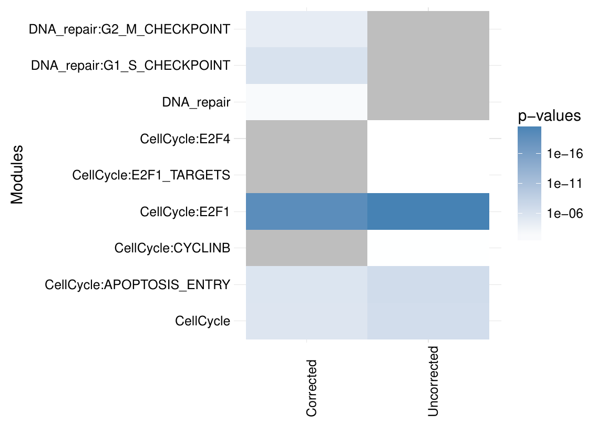
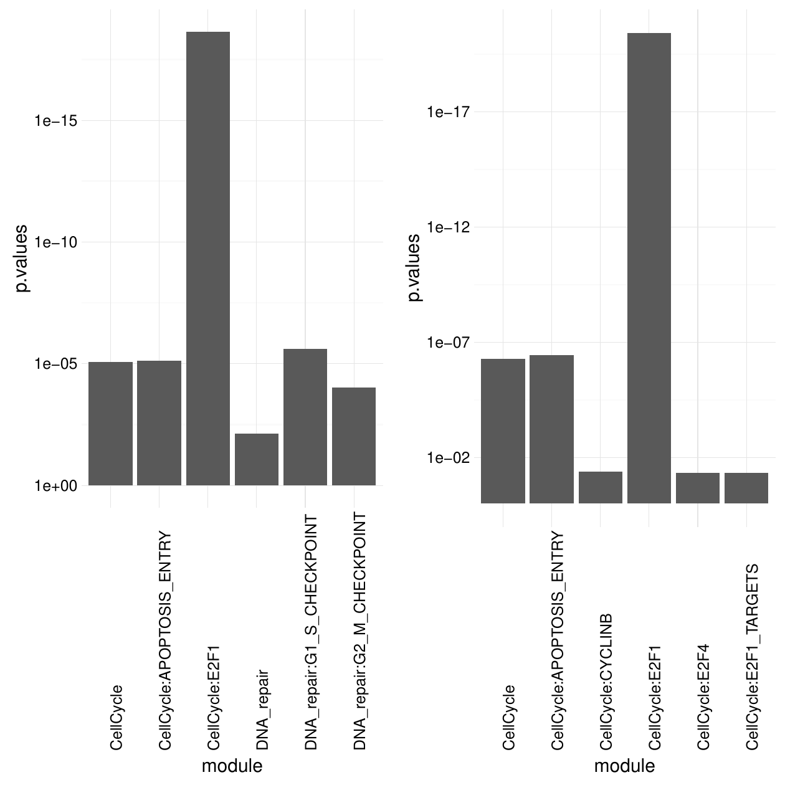
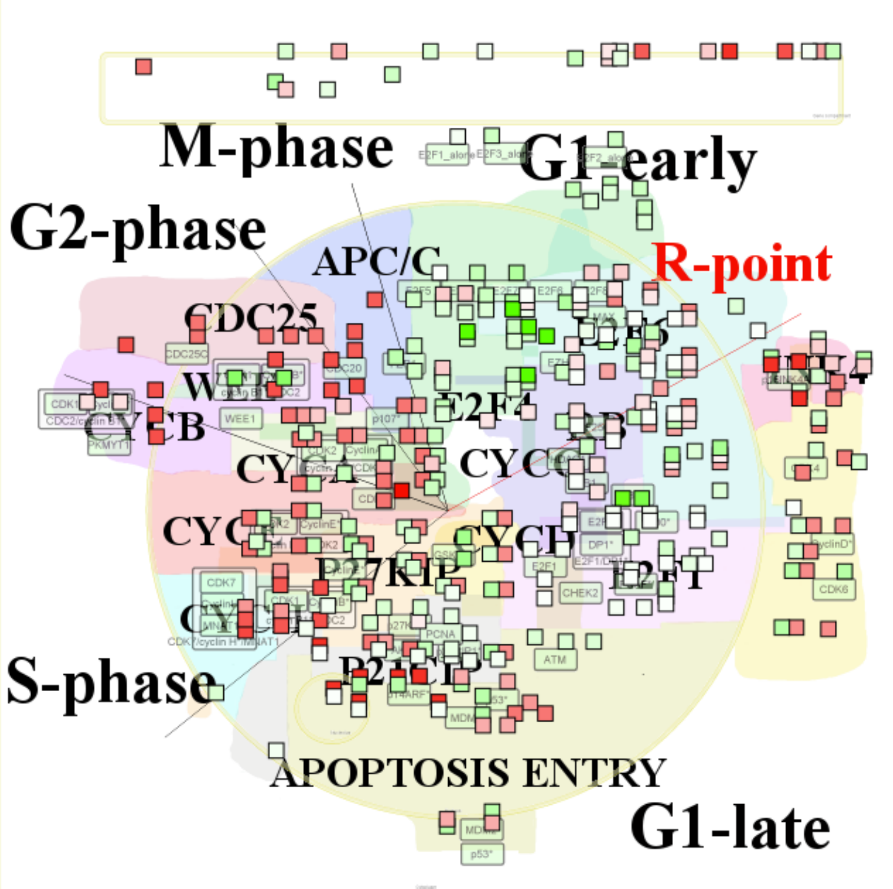
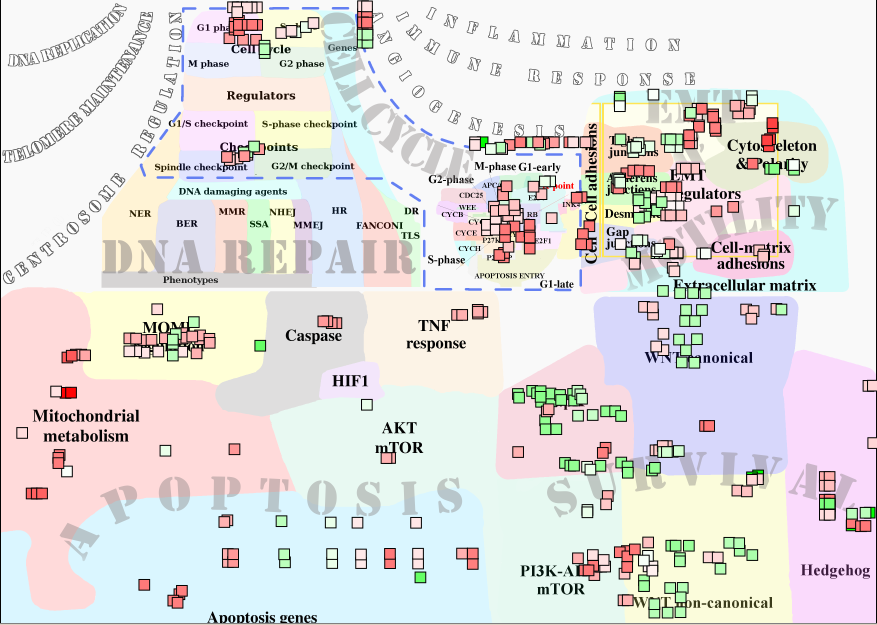
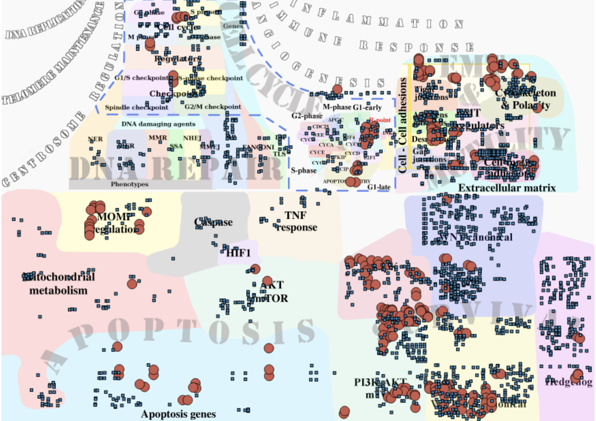

::: article
# Introduction

Biological pathways and networks comprise sets of interactions or
functional relationships, occurring at the molecular level in living
cells [@adriaens2008public; @barillot2012computational]. A large body of
knowledge on cellular biochemistry is organized in publicly available
repositories such as the KEGG database [@kanehisa2011kegg], Reactome
[@croft2014reactome] and MINT [@zanzoni2002mint]. All these biological
databases facilitate a large spectrum of analyses, improving our
understanding of cellular systems. For instance, it is a very common
practice to cross the output of high-throughput experiments, such as
mRNA or protein expression levels, with curated biological pathways in
order to visualize the changes, analyze their impact on a network and
formulate new hypotheses about biological processes. Many biologists and
computational biologists establish list of genes of interest (e.g. a
list of genes that are differentially expressed between two conditions,
such as normal vs disease) and then evaluate if known biological
pathways have significant overlap with this list of genes.

We have recently released the Atlas of Cancer Signaling Network (ACSN),
a web-based database which describes signaling and regulatory molecular
processes that occur in a healthy mammalian cell but that are frequently
deregulated during cancerogenesis [@kuperstein2015atlas]. The ACSN atlas
aims to be a comprehensive description of cancer-related mechanisms
retrieved from the most recent literature. The web interface for ACSN is
using the NaviCell technology, a software framework dedicated to
web-based visualization and navigation for biological pathway maps
[@kuperstein2013navicell]. This environment is providing an easy
navigation of maps through the use of the Google Maps JavaScript
library, a community interface with a web blog system, and a
comprehensive module for visualization and analysis of high-throughput
data [@bonnet2015navicell].

In this article, we describe two packages related to ACSN analysis and
data visualization. The package
[*ACSNMineR*](https://CRAN.R-project.org/package=ACSNMineR) is designed
for the calculation of gene enrichment and depletion in ACSN maps (or
any user-defined gene set via the import function), while
[*RNaviCell*](https://CRAN.R-project.org/package=RNaviCell) is dedicated
to data visualization on ACSN maps. Both packages are available on the
Comprehensive R Archive Network
(<https://cran.r-project.org/web/packages/ACSNMineR/> and
<https://cran.r-project.org/web/packages/RNaviCell/>), and on the GitHub
repository (<https://github.com/sysbio-curie/ACSNMineR> and
<https://github.com/sysbio-curie/RNaviCell>). For the remainder of this
article, we describe the organization of each package and illustrate
their capacities with several concrete examples demonstrating their
capabilities.

# Packages organization

## ACSNMineR

Currently, ACSN maps cover signaling pathways involved in DNA repair,
cell cycle, cell survival, cell death, epithelial-to-mesenchymal
transition (EMT) and cell motility. Each of these large-scale molecular
maps is decomposed in a number of functional modules. The maps
themselves are merged into a global ACSN map. Thus the information
included in ACSN is organized in three hierarchical levels: a global
map, five individual maps, and several functional modules. Each ACSN map
covers hundreds of molecular players, biochemical reactions and causal
relationships between the molecular players and cellular phenotypes.
ACSN represents a large-scale biochemical reaction network of 4,826
reactions involving 2,371 proteins (as of today), and is continuously
updated and expanded. We have included the three hierarchical levels in
the *ACSNMineR* package, in order to be able to calculate enrichments at
all three levels. The calculations are made by counting the number of
occurences of gene symbols (HUGO gene names) from a given list of genes
of interest in all ACSN maps and modules. Table [1](#tab:table1) is
detailling the number of gene symbols contained in all the ACSN maps.

::: {#tab:table1}
  ----------------------------------------------------------
  Map                    Total   Nb mod.   Min   Max   Mean
  --------------------- ------- --------- ----- ----- ------
  ACSN global            2239      67       2    629    79

  Survival               1053       5      208   431   328

  Apoptosis               667       7      19    382   136

  EMT & Cell motility     634       9      18    629   137

  DNA repair              345      21       3    171    45

  Cell cycle              250      25       2    130    20
  ----------------------------------------------------------

  : Table 1: ACSN maps included in the *ACSNMineR* package. Map: map
  name, Total: total number of gene symbols (HUGO) used to construct the
  map, Nb mod.: number of modules, Min: mimimum number of gene symbols
  in the modules, Max: maximum number of gene symbols in the modules,
  Mean: average number of gene sybols per module. N.B.: one gene symbol
  may be present in several modules of the map.
:::

The statistical significance of the counts in the modules is assessed by
using either the Fisher exact test
[@fisher1922interpretation; @fisher1934statistical] or the
hypergeometric test, which are equivalent for this purpose
[@rivals2007enrichment].

The current ACSN maps are included in the *ACSNMineR* package, as a list
of character matrices.

``` r
> length(ACSN_maps)
[1] 6
> names(ACSN_maps)
[1] "Apoptosis"    "CellCycle"    "DNA_repair"   "EMT_motility" "Master" 
[6] "Survival"    
```

For each matrix, rows represent a module, with the name of the module in
the first column, followed by a description of the module (optional),
and then followed by all the gene symbols of the module. The maps will
be updated according to every ACSN major release.

The main function of the *ACSNMineR* package is the `enrichment`
function, which is calculating over-representation or depletion of genes
in the ACSN maps and modules. We have included a small list of 12 Cell
Cycle related genes in the package, named `genes_test` that can be used
to test the main enrichment function and to get familiar with its
different options.

``` r
> genes_test
 [1] "ATM"     "ATR"     "CHEK2"   "CREBBP"  "TFDP1"   "E2F1"    "EP300"  
 [8] "HDAC1"   "KAT2B"   "GTF2H1"  "GTF2H2"  "GTF2H2B"
```

The example shown below is the simplest command that can be done to test
a gene list for over-representation on the six included ACSN maps. With
the list of 12 genes mentionned above and a default p-value cutoff of
$0.05$, we have a set of 8 maps or modules that are significantly
enriched. The results are structured as a data frame with nine columns
displaying the module name, the module size, the number of genes from
the list in the module, the names of the genes that are present in the
module, the size of the reference universe, the number of genes from the
list that are present in the universe, the raw p-value, the p-value
corrected for multiple testing and the type of test performed. The
module field in the results data frame indicate the map name and the
module name separated by a column character. If a complete map is
significantly enriched or depleted, then only the map name is shown,
without any module or column character. For instance, the third line of
the results object below concern the E2F1 module of the CellCycle map.

``` r
> library(ACSNMineR)
> results <- enrichment(genes_test)
> dim(results)
[1] 8  9
> results[3,]
            module module_size nb_genes_in_module
V161 CellCycle:E2F1          19                 12
                                                             genes_in_module
V161 ATM ATR CHEK2 CREBBP TFDP1 E2F1 EP300 HDAC1 KAT2B GTF2H1 GTF2H2 GTF2H2B
     universe_size nb_genes_in_universe      p.value p.value.corrected    test
V161          2237                   12 3.735018e-21      2.353061e-19 greater
```

The `enrichment` function can take up to nine arguments: the gene list
(as a character vector), the list of maps that will be used to calculate
enrichment or depletion, the type of statistical test (either the Fisher
exact test or the hypergeometric test), the module minimal size for
which the calculations will be done, the universe, the p-value
threshold, the alternative hypothesis (\"greater\" for calculating
over-representation, \"less\" for depletion and \"both\" for both tests)
and a list of genes that should be removed from the universe (option
\"Remove_from_universe\"). This option may be useful for instance if we
know beforehand that a number of genes are not expressed in the samples
considered.

Only the gene list is mandatory to call the `enrichment` function, all
the other arguments have default values. The `maps` argument can either
be a dataframe imported from a GMT file with the `format_from_gmt`
function or a list of dataframes generated by the same procedure. The
GMT format corresponds to the Broad Institute's Gene Matrix Transposed
file format, a convenient and easy way to encode named sets of genes of
interest in tab-delimited text files (it is not a graph or network
format). By default, the function `enrichment` uses the ACSN maps
previously described. The correction for multiple testing is set by
default to use the method of Benjamini & Hochberg, but can be changed to
any of the usual correction methods (Bonferroni, Holm, Hochberg, Holm,
or Benjamini & Yekutieli [@Benjamini2003FDR]), or even disabled . The
minimal module size represents the smallest size value of a module that
will be used to compute enrichment or depletion. This is meant to remove
results of low significance for module of small size. The universe in
which the computation is made by default is defined by all the gene
symbols contained in the maps. All the genes that were given as input
and that are not present on the maps will be discarded. To keep all
genes, the user can change the universe to `HUGO`, and in that case, the
complete list of HUGO gene symbols will be used as the reference ($>$
39,000 genes). The threshold corresponds to the maximal value of the
corrected p-value (unless the user chose not to correct for multiple
testing) that will be displayed in the result table.

It may be of interest to compare enrichment of pathways in different
cohorts or experiments. For example, enrichment of highly expressed
pathways can reveal differences between two cancer types or two cell
lines. To facilitate such comparisons, *ACSNMineR* provides a
`multisample_enrichment` function. It relies on the `enrichment`
function but takes a list of character vector genes. The name of each
element of the list will be assumed to be the name of the sample for
further analysis. Most of the arguments given to
`multisample_enrichment` are the same as the ones passed to
`enrichment`. However, the `cohort_threshold` is designed to filter out
modules which would not pass the significance threshold in all samples.

Finally, to facilitate visualization of results, *ACSNMineR* integrates
a representation function based on
[*ggplot2*](https://CRAN.R-project.org/package=ggplot2) syntax
[@ggplot2-deveau]. It allows representation of results from `enrichment`
or `multisample_enrichment` with a limited number of parameters. Two
types of display are available: heat-map tiles or bars. For multiple
samples using a barplot representation, the number of rows used can be
provided, otherwise all plots will be on the same row. For the heatmap,
the color of the non-significant modules, and boundaries of the gradient
for significant values can also be tuned.

We previously computed the p-value of the `genes_test` list with default
parameters. The number of modules which have a p-value below 0.05 was 8,
that can be compared to the 16 obtained without correction with the
simple command shown below (some of the results are displayed in table
[2](#tab:table2)).

``` r
enrichment(genes_test,correction_multitest = FALSE)
```

::: {#tab:table2}
  ------------------------------------------------------------------------------------------------
  Module                       Mod. size      Genes in module            p-value           Test
  --------------------------- ----------- ----------------------- ---------------------- ---------
  CellCycle                       242          ATM ATR CHEK2       $5.4 \times 10^{-7}$   greater

                                             CREBBP TFDP1 E2F1                           

                                             EP300 HDAC1 KAT2B                           

                                           GTF2H1 GTF2H2 GTF2H2B                         

  CellCycle:APOPTOSIS_ENTRY       10        ATM ATR CHEK2 E2F1     $3.5 \times 10^{-7}$   greater

  CellCycle:CYCLINB                7                ATM                    0.04           greater
  ------------------------------------------------------------------------------------------------

  : Table 2: First rows of the results from enrichment analysis without
  correction. Module : name of the module. Mod. size: size of the
  module. Genes in module: genes from input which are found in the
  module. p-value: uncorrected p-value. Test : null hypothesis used,
  greater is synonym of enrichment.
:::

We can now plot the first six rows of the results obtained for corrected
and uncorrected fisher test with heatmap format (Figure [1](#fig:heatm))
or barplot (Figure [2](#fig:barp)) with the following commands:

``` r
# heatmap

represent_enrichment(enrichment = list(Corrected = results[1:6,], 
Uncorrected = results_uncorrected[1:6,]),
                                plot = "heatmap", scale = "reverselog", 
                                low = "steelblue" , high ="white", na.value = "grey")

# barplot 

 represent_enrichment(enrichment = list(Corrected = results[1:6,], 
                             Uncorrected = results_uncorrected[1:6,]),
                               plot = "bar", scale = "reverselog", 
                               nrow = 1)
```

<figure id="fig:heatm">
<p> <span id="fig:heatm" label="fig:heatm"></span></p>
<figcaption>Figure 1: Representation of the enriched modules (first six
rows for each setting), with either Bonferroni correction or no
correction. Grey tiles means that the data is not available for this
module in this sample. P-values of low significance are in white,
whereas p-values of high significance are represented in
blue.</figcaption>
</figure>

<figure id="fig:barp">
<p> <span id="fig:barp"
label="fig:barp"></span></p>
<figcaption>Figure 2: Representation of the enriched modules (first six
rows for each setting), with either Bonferroni correction (left) or no
correction (right). The modules are on the X axis and the p-values are
on the Y axis. </figcaption>
</figure>

## RNaviCell

The NaviCell Web Service provides a server mode, which allows automating
visualization tasks and retrieving data from molecular maps via RESTful
(standard http/https) calls. Bindings to different programming languages
are provided in order to facilitate the development of data
visualization workflows and third-party applications
[@bonnet2015navicell]. RNaviCell is the R binding to the NaviCell Web
Service. It is implemented as a standard R package, using the R
object-oriented framework known as Reference Classes [@hwR5]. Most of
the work done by the user using graphical point-and-click operations on
the NaviCell web interface are encoded as functions in the library
encapsulating http calls to the server with appropriate parameters and
data. Calls to the NaviCell server are performed using the library RCurl
[@rcurl2015], while data encoding/decoding in JSON format is performed
with the RJSONIO library [@rjsonio2014].

Once the RNaviCell library is installed and loaded, the first step is to
create a NaviCell object and launch the browser session. This will
automatically create a unique session ID with the NaviCell server. Once
the session is established, various functions can be called to send data
to the web session, set graphical options, visualize data on a map or
get data from the map. There are 125 functions available in the current
version of RNaviCell. All of them are described with their different
options in the RNaviCell documentation, and we provide a tutorial on the
GitHub repository wiki
(<https://github.com/sysbio-curie/RNaviCell/wiki/Tutorial>).

In the simple example detailed below, we create a NaviCell session, then
load an expression data set from a local (tab-delimited) file. The data
represent gene expression measured in a prostate cancer cell line
resistant to hormonal treatment (agressive), and is taken from the Cell
Line Encyclopedia project [@barretina2012cancer]. We visualize the data
values on the Cell Cycle map (the default map), using heat maps. With
this visualization mode, gene expression values are represented as a
color gradient (green to red) in squares positioned next to the entities
where the gene has been mapped (Figure [3](#fig:du145)). Note that the
map is displayed in a browser and is *interactive*, i.e. users can zoom
in to display more information and for example look in what reactions
are involved the genes selected to be displayed, and lots of other
informations (see [@bonnet2015navicell] and [@kuperstein2015atlas] for
more details).

<figure id="fig:du145">
<p>
<span id="fig:du145" label="fig:du145"></span></p>
<figcaption>Figure 3: Gene expression values from a prostate cancer cell
line visualized on the cell cycle map as heat map plots. The figure is a
screenshot of the NaviCell map browser, with the map set at the top (the
less detailed) zoom level. The essential phases of the cell cycle are
indicated on the map (G1/S/G2/M). Note that on the web browser the map
is interactive and the user can zoom in and out, change the graphical
parameters, import additional data and perform functional analysis.
</figcaption>
</figure>

``` r
# a short RNaviCell script example

# load RNaviCell library

library(RNaviCell)

# create a NaviCell object and launch a server session
# this will automatically open a browser on the client 

navicell <- NaviCell()
navicell$launchBrowser()

# import a gene expression matrix and 
# send the data to the NaviCell server
# NB: the data_matrix object is a regular R matrix

data_matrix <- navicell$readDatatable('DU145_data.txt')
navicell$importDatatable("mRNA expression data", "DU145", data_matrix)

# set data set and sample for heat map representation

navicell$heatmapEditorSelectSample('0','data')
navicell$heatmapEditorSelectDatatable('0','DU145')
navicell$heatmapEditorApply()
```

# Case studies

## Analysis of breast cancer expression data

In a study published in 2008, Schmidt and colleagues analyzed gene
expression patterns of 200 breast cancer patients not treated by
systemic therapy after surgery using discovery approach to reveal
additional prognostic motifs [@schmidt2008humoral]. Estrogen receptor
(ER) expression and proliferative activity of breast carcinomas are
well-known and described prognostic markers. Patients with ER-positive
carcinomas have a better prognosis than those with ER-negative
carcinomas, and rapidly proliferating carcinomas have an adverse
prognosis. Knowledge about the molecular mechanisms involved in the
processes of estrogen-dependent tumor growth and proliferative activity
has led to the successful development of therapeutic concepts, such as
antiendocrine and cytotoxic chemotherapy.

The dataset corresponding to this study is available as a Bioconductor
package. The code shown below is creating a list of differentially
expressed genes between ER positive and ER negative samples, and
calculates the enrichment in ACSN maps from this list of genes. As seen
in Table [3](#tab:table_mainz), there is one map (DNA repair) and seven
modules (belonging to the Cell Cycle, DNA repair and Apoptosis maps)
enriched.

``` r
# load all necessary packages
library(breastCancerMAINZ)
library(Biobase)
library(limma)
library(ACSNMineR)
library(hgu133a.db)
library(RNaviCell)

# load data and extract expression and phenotype data 
data(mainz)
eset <- exprs(mainz)
pdat <- pData(mainz)

# Create list of genes differentially expressed between ER positive and 
# ER negative samples using moderated t-test statistics 
design <- model.matrix(~factor(pdat$er == '1'))
lmFit(eset, design) -> fit
eBayes(fit) -> ebayes
toptable(ebayes, coef=2,n=25000) -> tt
which(tt$adj < 0.05) -> selection
rownames(tt[selection,]) -> probe_list
mget(probe_list, env = hgu133aSYMBOL) -> symbol_list
symbol_list <- as.character(symbol_list)

# calculate enrichment in ACSN maps 

enrichment(symbol_list) -> results

dim(results)
[1] 8 9
```

::: {#tab:table_mainz}
  ----------------------------------------------------------------------------------
  Module                    Mod. size   Nb genes           pval           Cor. pval
  ------------------------ ----------- ---------- ---------------------- -----------
  Apoptosis:AKT_MTOR           79          47            0.00043           0.0068

  CellCycle:E2F2_TARGETS       35          22             0.0055            0.043

  CellCycle:E2F3_TARGETS       51          31             0.0023            0.025

  CellCycle:E2F4_TARGETS       100         60      $5.8 \times 10^{-5}$    0.0037

  DNA_repair                   346        172            0.00038           0.0068

  DNA_repair:CELL_CYCLE        82          49            0.00029           0.0068

  DNA_repair:G1_CC_PHASE       25          18             0.0013            0.016

  DNA_repair:S_CC_PHASE        46          28             0.0036            0.033
  ----------------------------------------------------------------------------------

  : Table 3: ACSN maps enrichment for genes differentially expressed
  between ER positive and ER negative samples in breast cancer. Module :
  name of the map/module. Mod. size: size of the module. Nb genes:
  number of genes from input which are found in the module. pval: raw
  p-value. Cor. pval: corrected p-value.
:::

The Molecular Signatures Database (MSigDB) is one of the most widely
used repository of well-annotated gene sets representing the universe of
biological processes [@liberzon2011molecular]. We downloaded the
canonical pathways set, counting more than 1,300 gene sets representing
canonical pathways compiled by domain experts. The dataset is encoded
with the GMT format, and can be imported within ACSNMineR with the
`format_from_gmt` function. We calculate the enrichment for the breast
cancer differentially expressed gene list, simply specifying the MSigDB
data we just imported as the `maps` option. Table [4](#tab:table_msigdb)
is displaying the pathways having a corrected p-value $< 0.05$. The
prefix is indicating the database source, so we see that we have
pathways from the KEGG, Reactome and PID databases. Consistent with our
previous results, most of the enriched pathways are related to the cell
cycle regulation.

``` r
# Import MSigDB canonical pathways and calculate enrichment on this database 

mtsig <- format_from_gmt('c2.cp.v5.0.symbols.gmt')
enrichment(symbol_list, maps = mtsig)
```

::: {#tab:table_msigdb}
  -------------------------------------------------------------------------------
  Pathway                            Mod. size   Nb genes        Cor. pval
  --------------------------------- ----------- ---------- ----------------------
  KEGG_CELL_CYCLE                       128         76      $3.9 \times 10^{-8}$

  REACTOME_CELL_CYCLE_MITOTIC           325        159      $3.9 \times 10^{-8}$

  REACTOME_DNA_REPLICATION              192         98      $4.9 \times 10^{-6}$

  PID_FOXM1PATHWAY                      40          29      $3.1 \times 10^{-5}$

  REACTOME_MITOTIC_M_M_G1_PHASES        172         87      $3.1 \times 10^{-5}$

  REACTOME_CELL_CYCLE                   421        182       $5 \times 10^{-5}$

  REACTOME_MITOTIC_G1_G1_S_PHASES       137         71       $9 \times 10^{-5}$

  PID_AURORA_B_PATHWAY                  39          27             0.0002

  REACTOME_S_PHASE                      109         58            0.00024

  PID_SYNDECAN_1_PATHWAY                46          30            0.00026
  -------------------------------------------------------------------------------

  : Table 4: MSigDB canonical pathway database enrichment for genes
  differentially expressed between ER positive and ER negative samples
  in breast cancer. This table presents the 10 modules with lowest
  p-value out of 125 with corrected p-value lower than 0.05. Module :
  name of the module. Mod. size: size of the module. Nb genes: number of
  genes from input which are found in the module. Cor. pval: corrected
  p-value.
:::

At last, we visualize the mean expression values for ER negative samples
for all genes differentially expressed on the ACSN master (global) map
using `RNaviCell` commands to create heatmaps.

``` r
# Select ER negative samples and calculate mean expression values

apply(eset[probe_list,pdat$er == 0],1,mean) -> er_minus_mean
names(er_minus_mean) <- symbol_list
er_minus_mean <- as.matrix(er_minus_mean)
colnames(er_minus_mean) <- c('exp')

# create a NaviCell session, import the expression matrix on the map and create
# heatmaps to represent the data points.

navicell <- NaviCell()
navicell$proxy_url <- "https://acsn.curie.fr/cgi-bin/nv_proxy.php"
navicell$map_url <- "https://acsn.curie.fr/navicell/maps/acsn/master/index.php"

navicell$launchBrowser()
navicell$importDatatable("mRNA expression data", "GBM_exp", er_minus_mean)
navicell$heatmapEditorSelectSample('0','exp')
navicell$heatmapEditorSelectDatatable('0','GBM_exp')
navicell$heatmapEditorApply()
```

The Figure [4](#fig:mainz) is displaying the map for genes having a
corrected p-value $< 0.05$.

<figure id="fig:mainz">
<p>
<span id="fig:mainz" label="fig:mainz"></span></p>
<figcaption>Figure 4: Mean expression values for ER negative
differentially expressed genes in breast cancer visualized as heatmaps
on the ACSN master map.</figcaption>
</figure>

## Analysis of glioblastoma mutation frequencies

Recent years have witnessed a dramatic increase in new technologies for
interrogating the activity levels of various cellular components on a
genome-wide scale, including genomic, epigenomic, transcriptomic, and
proteomic information [@hawkins2010next]. Integrating these
heterogeneous datasets provides more biological insights than performing
separate analyses. For instance, international consortia such as The
Cancer Genome Atlas (TCGA) have launched large-scale initiatives to
characterize multiple types of cancer at different levels on hundreds of
samples. These integrative studies have already led to the
identification of novel cancer genes [@mclendon2008comprehensive].

Malignant gliomas, the most common subtype of primary brain tumors, are
aggressive, highly invasive, and neurologically destructive tumors
considered to be among the deadliest of human cancers. In its most
aggressive manifestation, glioblastoma (GBM), median survival ranges
from 9 to 12 months, despite maximum treatment efforts
[@maher2001malignant]. In this study we have analyzed whole-genome
mutation data generated by the TCGA project on hundreds of patients.
More specifically, we parsed the MAF (Mutation Annotation Format) GBM
files produced by different sequencing centers to count and calculate
gene mutation frequencies. We kept the mutations having a status likely
to disturb the target protein's function (i.e.  Frame_Shift_Del,
Nonstop_Mutation, In_Frame_Del, In_Frame_Ins, Missense_Mutation,
Nonsense_Mutation, Splice_Site, Translation_Start_Site). In total, we
collected mutations for more than 13,000 genes in a total of 379 mutated
samples. In order to retain the most frequently mutated genes, we
calculated frequencies across all mutated samples, and kept genes having
a frequency greater than 1% (3,293 genes). We further labelled genes
having a frequency greater than 1% and less than 5% as \"1\" and genes
highly mutated (frequency higher than 5%) as \"2\".

We loaded the data as a matrix in R and calculated the enrichment in
ACSN maps with the ACSNMineR function `enrichment`. The results are
displayed in table [5](#tab:table_gbm). There are 6 modules
significantly enriched in the DNA repair and EMT motility maps. Cell
matrix adhesions and ECM (extra cellular matrix), part of the EMT
motility map, are the modules with highest significance. The EMT
motility map is significantly enriched at the global map level (second
line in the table).

::: {#tab:table_gbm}
  -----------------------------------------------------------------------
  module                                Mod. size   Nb genes   Cor. pval
  ------------------------------------ ----------- ---------- -----------
  DNA_repair:S_PHASE_CHECKPOINT            45          19        0.008

  EMT_motility                             635        181       0.0002

  EMT_motility:CELL_MATRIX_ADHESIONS       73          45      3.73e-12

  EMT_motility:CYTOSKELETON_POLARITY       154         47        0.022

  EMT_motility:DESMOSOMES                  29          15        0.002

  EMT_motility:ECM                         147         69      9.77e-11

  EMT_motility:EMT_REGULATORS              629        178       0.0002
  -----------------------------------------------------------------------

  : Table 5: ACSN maps enrichment for frequently mutated glioblastoma
  genes. Module : name of the module. Mod. size: size of the module. Nb
  genes: number of genes from input which are found in the module. Cor.
  pval: corrected p-value.
:::

Visualization of the list of glioblastoma mutated genes is shown on
figure [5](#fig:gbm). This figure was generated with the ACSNMineR
commands detailed below. Results of the enrichment test correlate well
with the visualization on the map, with a high density of low and high
frequency mutated genes in the EMT motility and DNA repair regions
(maps) of the global ACSN map. Although they are not statistically
significant, quite high densities can also be seen in other regions of
the map.

``` r
library(RNaviCell)

# Create a NaviCell object, point it to the ACSN master map and launch
# a session.

navicell <- NaviCell()
navicell$proxy_url <- "https://acsn.curie.fr/cgi-bin/nv_proxy.php"
navicell$map_url <- "https://acsn.curie.fr/navicell/maps/acsn/master/index.php"
navicell$launchBrowser()

# Read the GBM data file and import it into the session.

mat <- navicell$readDatatable('gbm.txt')
navicell$importDatatable("Mutation data", "GBM", mat)

# set datatable and sample names for the glyph editor

navicell$drawingConfigSelectGlyph(1, TRUE)
navicell$glyphEditorSelectSample(1, "categ")
navicell$glyphEditorSelectShapeDatatable(1, "GBM")
navicell$glyphEditorSelectColorDatatable(1, "GBM")
navicell$glyphEditorSelectSizeDatatable(1, "GBM")
navicell$glyphEditorApply(1)

# set color, shape and size parameters for glyphs

navicell$unorderedConfigSetDiscreteShape("GBM", "sample", 0, 1)
navicell$unorderedConfigSetDiscreteShape("GBM", "sample", 1, 5)
navicell$unorderedConfigApply("GBM", "shape")

navicell$unorderedConfigSetDiscreteColor("GBM", "sample", 0, "398BC3")
navicell$unorderedConfigSetDiscreteColor("GBM", "sample", 1, "CC5746")
navicell$unorderedConfigApply("GBM", "color")

navicell$unorderedConfigSetDiscreteSize("GBM", "sample", 0, 4)
navicell$unorderedConfigSetDiscreteSize("GBM", "sample", 1, 14)

navicell$unorderedConfigApply("GBM", "size")
```

<figure id="fig:gbm">
<p> <span
id="fig:gbm" label="fig:gbm"></span></p>
<figcaption>Figure 5: Glioblastoma gene mutation frequency categories
represented as glyphs on the ACSN global cancer map. High frequency
mutated genes are pictured as large red circles, while low frequency
mutated genes are depicted as small blue squares. </figcaption>
</figure>

# Summary and perspectives

In this work, we presented the R package *ACSNMineR*, a novel package
for the calculation of p-values for enrichment or depletion of genes in
biological pathways. The package includes the six large-scale molecular
maps and 67 functional modules of the Atlas of Cancer Signaling Network
(ACSN) . Enrichment can be calculated for those maps and modules with
several options to play with, but can also be calculated for other
databases of molecular pathways, that can be imported from GMT formated
files.

We also describe in this work the *RNaviCell* package, a R package
convenient to use with *ACSNMineR*. This package is dedicated to create
web-based and interactive data visualization on ACSN maps. Users can use
this tools to represent genes of interest that have been shown to be
related to the maps by calculating enrichment with *ACSNMineR*. Creating
maps with the graphical user interface of the ACSN website can be a
tedious task if the user has multiple samples or gene lists, and wants
to compare their representations on ACSN maps. The *RNaviCell* package
can be used to automate the process of creating the graphical
representations automatically. The maps are displayed in a browser and
are interactive, with the possibility for the user to zoom in and out,
search for genes or molecular species, and see the details of the
molecular reactions (what partners are involved, what is the state of a
given species, etc.). For more details on how to use the interface and
the different possibilities, see [@kuperstein2013navicell],
[@bonnet2015navicell] and [@kuperstein2015atlas]. We have shown how the
packages *ACSNMineR* and *RNaviCell* can be combined to analyze
expression data from breast cancer samples, and also to analyze the
frequency of mutated genes in glioblastoma cancer samples.

Of course, *ACSNMineR* is not the only R package for enrichment
calculations. For instance,
[*GOstats*](https://www.bioconductor.org/packages/release/bioc/html/GOstats.html)
[@falcon2007using] is probably one of the first packages that was
created to calculate enrichment for Gene Ontology categories. *GOstats*
can also be used to calculate enrichment for other biological pathways
categories, such as KEGG pathways (by using an instance of the class
`KEGGHyperGParams`) or PFAM protein families (using `PFAMHyperGParams`).
However, its usage might not be as straightforward as *ACSNMineR*, and
it does not seem possible to test user-defined biological pathways.
Furthermore, other authors have pointed out that the KEGG database used
by this package has not been updated since 2012.
[*clusterProfiler*](https://www.bioconductor.org/packages/release/bioc/html/clusterProfiler.html)
is a recent R package released for enrichment analysis of Gene Ontology
and KEGG with either hypergeometric test or Gene Set Enrichment Analysis
(GSEA) [@yu2012clusterprofiler]. Via other packages, support for
analysis of Disease Ontology and Reactome Pathways is possible.
Interestingly, this package also offers the possibility to import
user-defined gene set, through tab-delimited pairwise definition files.
Other notable packages for enrichment calculations are *ReactomePA* for
Reactome molecular pathways [@ReactomePA2016], *miRNApath* for microRNA
pathways [@miRNApath2008] and *gage* [@gage2009]. We believe that the
main advantages of ACSNMineR compared to other packages are a direct
access to the full set of ACSN maps (updated on a regular basis) and an
easy way to test MSigDB gene sets or any user-defined gene set formatted
appropriately.

In order to improve *ACSNMineR*, we may in the near future try to
improve the speed of calculation, which might be a problem if a very
large number of samples or experiments have to be analyzed rapidly. For
instance, we could use the `foreach` and `%dopar%` operator to
parallelize the most computationally demanding operations. It could also
be useful to implement more sensitive methods of gene set enrichment
measures, such as the Gene Set Enrichment Analysis (GSEA) method.

*RNaviCell* relies on standard HTTP calls to provide informations and
calculations, and we have developped a number of bindings for popular
programming languages such as R, Java and Python [@bonnet2015navicell].
This open architecture is designed to facilitate the development of
utilities by other programmers and to facilitate the integration of ACSN
maps in existing frameworks. The development of such services, sometimes
called "microservices\" [@fowler2014] is in expansion. Furthermore, this
kind of open architecture could clear the way for a more unified and
general access to reaction networks database, including for example
WikiPathways [@kelder2012wikipathways], Reactome [@croft2014reactome]
and other databases. The PSICQUIC project is a successfull example of
such an architecture [@aranda2011psicquic]. It is an effort of the HUPO
proteomics standard initiative to standardize the access to molecular
interaction databases programmatically, based on the specification of
web services (using REST and SOAP calls) and a common query language
(MIQL).

# Acknowledgements

This work was supported by a grant "Projet Incitatif et Collaboratif
Computational Systems Biology Approach for Cancer\" from Institut Curie.
The authors would like to thank Pierre Gestraud for his comments on
early versions of the *ACSNMineR* package and Eric Viara for guidance
and assistance on the development of the *RNaviCell* package.
:::
